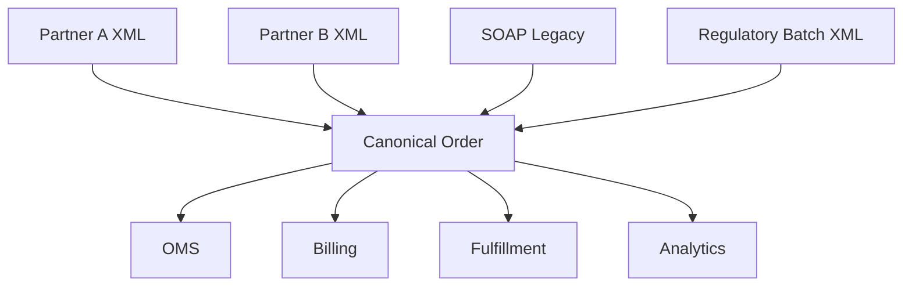
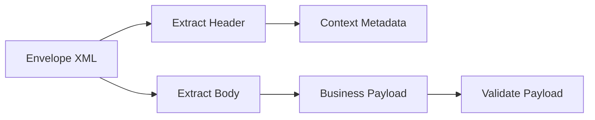
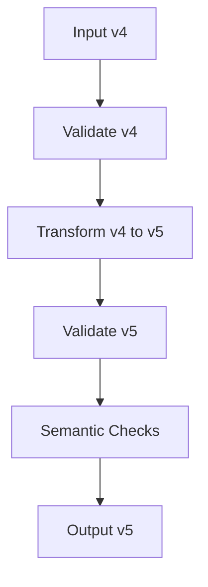
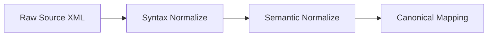
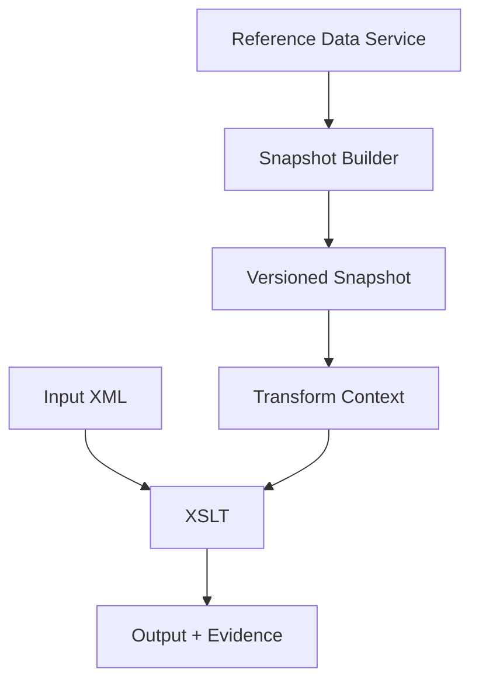
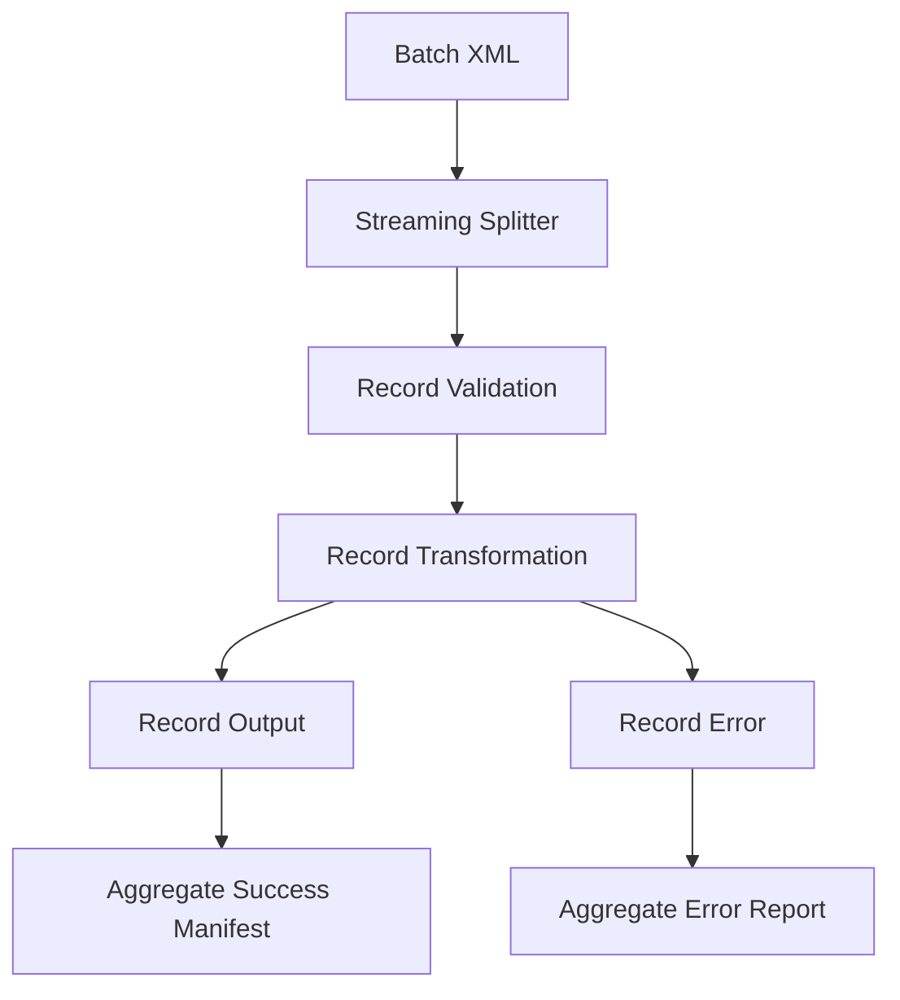
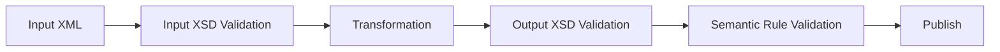
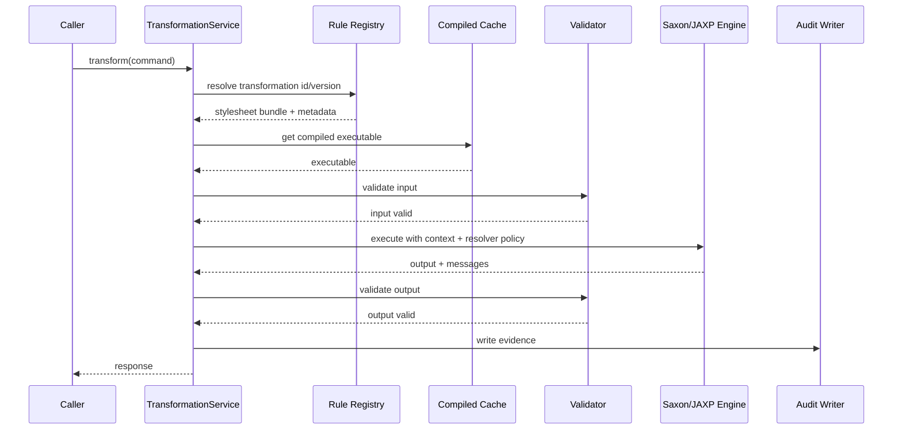

# Part 020 — Transformation Patterns, Canonicalization, and Mapping

> Goal: mampu mendesain transformation layer yang benar secara contract, deterministic, testable, auditable, dan evolvable. Kita tidak hanya ingin “mengubah XML A menjadi XML B”, tetapi membangun mapping architecture yang tahan terhadap versioning, partner variability, regulatory audit, dan production failure.

Transformation adalah salah satu area yang terlihat sederhana, tetapi sering menjadi sumber bug enterprise paling mahal. Banyak sistem rusak bukan karena parser XML-nya salah, tetapi karena mapping semantics tidak jelas:

- field kosong dianggap sama dengan missing;
- timezone berubah diam-diam;
- namespace prefix diperlakukan sebagai contract;
- rounding currency tidak konsisten;
- canonical model terlalu cepat berubah;
- stylesheet membaca reference data mutable;
- output valid secara XSD tetapi salah secara business.

Mental model yang benar:

```text
Transformation = f(input document, mapping rules, context, reference data snapshot)
                 -> output document + evidence + diagnostics
```

Jika fungsi yang sama dengan input dan context yang sama tidak menghasilkan output yang sama, transformation layer tidak deterministic dan sulit diaudit.

---

## 1. Transformation Layer sebagai Architecture Boundary

Transformation layer berada di antara dua model.

```mermaid
flowchart LR
    A[Source Contract] --> B[Parse]
    B --> C[Validate Source]
    C --> D[Normalize Syntax]
    D --> E[Map Semantics]
    E --> F[Enrich From Snapshot]
    F --> G[Validate Target]
    G --> H[Target Contract]

    I[Mapping Rules Version] --> E
    J[Reference Data Version] --> F
    K[Audit Evidence] <-- D
    K <-- E
    K <-- F
    K <-- G
```

Transformation bukan hanya format conversion. Ia mengubah **meaning** dari source contract ke target contract.

### 1.1 Tiga Jenis Kebenaran

| Correctness Layer | Pertanyaan | Contoh |
|---|---|---|
| Syntactic correctness | XML well-formed? | tag tertutup, encoding valid |
| Contract correctness | XSD valid? | `orderDate` bertipe `xs:date` |
| Semantic correctness | Meaning benar? | order total sesuai sum line amount |

XSD dapat membantu contract correctness, tetapi tidak cukup untuk semantic correctness.

---

## 2. Canonicalization: Tiga Makna yang Sering Tercampur

Kata “canonicalization” sering dipakai untuk hal berbeda. Pisahkan dengan tegas.

### 2.1 XML Canonicalization untuk Signature/Security

Ini mengacu ke standar seperti Canonical XML. Tujuannya membuat representasi fisik XML yang stabil untuk signing/verifying, karena XML yang secara logical sama bisa punya variasi fisik:

- attribute order;
- namespace declaration placement;
- whitespace tertentu;
- empty element syntax;
- character escaping;
- comments included/excluded.

Gunakan ini ketika:

- XML digital signature;
- payload integrity verification;
- cryptographic digest;
- interoperability security.

Jangan gunakan ini sebagai pengganti semantic mapping.

### 2.2 Deterministic Serialization untuk Test/Regression

Ini bukan selalu W3C C14N. Tujuannya agar golden test dan diff stabil.

Contoh control:

- indent fixed;
- line ending fixed;
- encoding fixed;
- XML declaration policy fixed;
- prefix policy stable jika memungkinkan;
- attribute order stable jika serializer mendukung atau canonical compare dipakai.

Gunakan ini untuk:

- snapshot/golden test;
- code review diff;
- fixture governance;
- regression suite.

### 2.3 Domain Canonical Model

Ini adalah canonical data model internal perusahaan.

Contoh:

```text
Partner A PurchaseOrder v3
Partner B OrderRequest v7
Partner C SOAP SubmitOrder
        ↓
Canonical Order v5
        ↓
Internal OMS / Billing / Fulfillment
```

Domain canonicalization berarti menyatukan meaning, bukan menyatukan syntax.

---

## 3. Canonical Model: Kapan Berguna, Kapan Berbahaya

Canonical model berguna ketika banyak source/target harus berbicara dengan model internal yang konsisten.



### 3.1 Benefit

- mengurangi jumlah direct pairwise mappings;
- memperjelas internal language;
- memudahkan validation dan audit;
- memisahkan partner quirks dari domain core;
- memberi tempat untuk governance schema internal.

Jika ada `N` partner dan `M` internal systems, canonical model bisa menghindari `N*M` mappings.

### 3.2 Risk

Canonical model menjadi berbahaya ketika:

- mencoba menampung semua variasi partner;
- terlalu generic sampai kehilangan domain meaning;
- berubah terlalu sering;
- dipakai sebagai dumping ground;
- tidak punya owner;
- tidak punya versioning discipline;
- tidak memisahkan canonical order, canonical invoice, canonical customer, dll.

Rule:

> Canonical model harus merepresentasikan business language internal yang stabil, bukan union dari semua payload eksternal.

---

## 4. Pattern 1 — Identity Transform + Override

Gunakan ketika mayoritas XML dipertahankan dan hanya sebagian kecil diubah.

### 4.1 XSLT Pattern

```xml
<xsl:mode on-no-match="shallow-copy"/>

<xsl:template match="*:secretToken">
  <secretToken>REDACTED</secretToken>
</xsl:template>

<xsl:template match="*:amount">
  <amount>
    <xsl:value-of select="format-number(xs:decimal(.), '0.00')"/>
  </amount>
</xsl:template>
```

Pada XSLT 1.0, pattern identity transform biasanya ditulis eksplisit:

```xml
<xsl:template match="@*|node()">
  <xsl:copy>
    <xsl:apply-templates select="@*|node()"/>
  </xsl:copy>
</xsl:template>
```

### 4.2 Use Cases

- redaction;
- namespace migration minor;
- adding metadata;
- removing unsupported elements;
- normalizing values;
- compatibility shim.

### 4.3 Failure Modes

- accidentally copying sensitive fields;
- preserving invalid legacy fields;
- copying unknown extension elements that target system cannot process;
- changing prefix/namespace unintentionally;
- assuming shallow-copy means semantic safety.

Production checklist:

- define allowed pass-through elements;
- validate output;
- test sensitive field removal;
- log redaction count;
- review extension handling.

---

## 5. Pattern 2 — Envelope Strip / Envelope Wrap

Enterprise XML sering punya envelope.

Examples:

- SOAP envelope;
- partner batch envelope;
- regulatory submission envelope;
- message bus envelope;
- audit envelope.

### 5.1 Strip Envelope



Use cases:

- SOAP body extraction;
- batch record extraction;
- partner metadata extraction;
- routing by header.

Important invariant:

> Header metadata and body payload must remain correlated.

Do not strip envelope and lose:

- message ID;
- sender;
- timestamp;
- signature reference;
- correlation ID;
- schema version;
- retry count;
- source file name;
- line/record number.

### 5.2 Wrap Envelope


Use cases:

- outbound SOAP request;
- batch submission;
- partner acknowledgement;
- regulatory report package.

Failure modes:

- duplicate IDs;
- wrong timestamp timezone;
- body namespace mismatch;
- signature broken by post-signing mutation;
- metadata inconsistent with body.

---

## 6. Pattern 3 — Namespace Migration

Namespace migration umum terjadi saat contract version berubah.

Example:

```text
urn:company:order:v4 -> urn:company:order:v5
```

### 6.1 Simple Namespace Rewrite Is Rarely Enough

Bad assumption:

> “Kita hanya ganti namespace URI.”

Reality:

- element added;
- element removed;
- type changed;
- cardinality changed;
- enum changed;
- semantic changed;
- default changed;
- extension point moved.

### 6.2 Migration Pipeline



### 6.3 Compatibility Rules

| Change | Usually Compatible? | Note |
|---|---|---|
| Add optional element | Yes | if consumers ignore unknown or schema allows |
| Add required element | No | needs default/enrichment/migration |
| Remove optional element | Maybe | consumers may rely on it |
| Rename element | No | mapping required |
| Change type string → decimal | No | invalid legacy values possible |
| Add enum value | Maybe | old consumers may reject |
| Change namespace | Breaking | unless explicitly supported |

---

## 7. Pattern 4 — Partner Adapter to Canonical Model

Adapter mengisolasi partner-specific quirks.


### 7.1 Adapter Responsibilities

Adapter boleh tahu:

- partner namespace;
- partner field names;
- partner code values;
- partner date format;
- partner optionality;
- partner quirks;
- partner schema version.

Adapter tidak boleh menentukan:

- internal workflow state;
- internal persistence model;
- cross-partner business policy;
- fulfillment routing;
- billing calculation beyond mapping requirement.

### 7.2 Mapping Table

| Source | Target | Rule | Error If |
|---|---|---|---|
| `/po:id` | `/Order/orderId` | trim, required | missing/blank |
| `/po:customer/po:id` | `/Order/customerId` | trim, required | missing/blank |
| `/po:customer/po:country` | `/Order/countryCode` | uppercase ISO-like code | not in code list |
| `/po:lines/po:line` | `/Order/items/item` | group by SKU | SKU missing |
| `/po:qty` | `/quantity` | decimal/integer conversion | <= 0 |
| `/po:price` | `/unitPrice` | decimal scale 2 | invalid decimal |

Mapping table is not documentation only. It should drive:

- tests;
- code review;
- audit traceability;
- regression coverage;
- change impact analysis.

---

## 8. Pattern 5 — Semantic Normalization Layer

Normalize before mapping when source has messy syntax.



### 8.1 Syntax Normalization

Examples:

- trim whitespace;
- normalize case;
- normalize date lexical forms;
- remove formatting separators;
- normalize decimal separator if contract allows;
- normalize country/currency code case.

### 8.2 Semantic Normalization

Examples:

- map partner status `C`, `CANCEL`, `CNCL` to `CANCELLED`;
- convert `grossAmount` + `tax` into canonical monetary breakdown;
- infer missing `orderType` from partner channel;
- split full name into structured name only if rule approved;
- map partner line type to internal item classification.

### 8.3 Boundary Rule

Normalize syntax aggressively only when contract says it is safe. Normalize semantics only when business owner approves.

Bad:

```text
If country is missing, default to ID.
```

Potentially acceptable:

```text
For partner A v3 only, country may be omitted for domestic channel D01; default to ID and emit warning code PA-COUNTRY-DEFAULTED.
```

---

## 9. Pattern 6 — Reference Data Enrichment

Transformation often needs reference data:

- country code list;
- currency precision;
- product code mapping;
- partner account mapping;
- regulatory classification;
- tax category;
- channel mapping.

### 9.1 Dangerous Approach

```text
XSLT calls database or HTTP endpoint per line item.
```

Problems:

- non-deterministic;
- slow;
- hard to retry;
- failure inside mapping unclear;
- no snapshot evidence;
- security boundary weak.

### 9.2 Better Approach



Inject reference data as:

- XML document parameter;
- XDM map;
- classpath/registry resource resolved by whitelist;
- precomputed small lookup map.

Evidence must include:

- reference data name;
- version;
- checksum;
- timestamp;
- source environment.

---

## 10. Pattern 7 — Redaction and Tokenization Transform

Redaction is transformation with security impact.

### 10.1 Redaction Types

| Type | Meaning | Example |
|---|---|---|
| Remove | Field omitted | delete `<ssn>` |
| Mask | Partial value shown | `****1234` |
| Tokenize | Replace with token | `tok_abc123` |
| Hash | One-way digest | SHA-256 normalized email |
| Generalize | Reduce precision | birth date → birth year |

### 10.2 XML Redaction Pattern

```xml
<xsl:mode on-no-match="shallow-copy"/>

<xsl:template match="*:nationalId | *:creditCardNumber | *:password">
  <xsl:element name="{local-name()}" namespace="{namespace-uri()}">
    <xsl:text>REDACTED</xsl:text>
  </xsl:element>
</xsl:template>
```

### 10.3 Redaction Failure Modes

- matching by local-name only redacts wrong namespace;
- matching by prefix misses same namespace with different prefix;
- new sensitive field added but redaction rule not updated;
- sensitive value appears in attribute, not element;
- sensitive value appears inside free text;
- logs capture pre-redacted payload;
- audit store captures full payload without access control.

Production control:

- maintain sensitive field registry;
- test with namespace variations;
- scan output for known sensitive fixtures;
- log redaction count;
- version redaction rules;
- fail closed for unknown high-risk extension blocks.

---

## 11. Pattern 8 — Split, Transform, Aggregate

Large batch XML often contains many records.

```xml
<Batch>
  <Record>...</Record>
  <Record>...</Record>
  <Record>...</Record>
</Batch>
```

Do not always transform the whole batch as one giant tree.

### 11.1 Pipeline



### 11.2 Use Cases

- regulatory file ingestion;
- partner order batch;
- bank statement processing;
- insurance claim batch;
- telecom event batch.

### 11.3 Design Choice

| Choice | Behavior |
|---|---|
| fail whole batch | strict consistency, simpler semantics |
| partial accept | operationally useful, harder audit/replay |
| quarantine bad records | good compromise, needs record identity |

Always define:

- record identity;
- line/offset location;
- batch correlation ID;
- replay behavior;
- duplicate handling;
- output ordering requirement;
- summary totals validation.

---

## 12. Pattern 9 — Output Contract Validation

Never assume transform output is valid because stylesheet was tested once.



Output validation catches:

- missing required fields;
- invalid namespace;
- invalid datatype;
- invalid enum;
- wrong cardinality;
- invalid structure due to conditional branch;
- stylesheet regression.

Semantic validation catches:

- sum mismatch;
- invalid state transition;
- forbidden country/product combination;
- negative quantity;
- date range issue;
- duplicate business key.

---

## 13. Mapping Semantics Deep Dive

### 13.1 Missing vs Blank vs Nil

| Source Condition | Meaning | Mapping Decision |
|---|---|---|
| Element absent | not provided | reject/default/omit based on rule |
| Element present empty | explicitly blank | often reject if required |
| Element whitespace | ambiguous | normalize or reject |
| `xsi:nil="true"` | explicitly nil | preserve nil or reject |
| Default from XSD | not physically present | be careful for audit |

Mapping rules must say which case is accepted.

### 13.2 Cardinality

Source and target cardinality mismatch is common.

| Source | Target | Pattern |
|---|---|---|
| one | one | direct map |
| one | many | split field or expand by reference |
| many | one | aggregate/select/concatenate |
| many | many | map each/group/filter |
| optional | required | default/enrich/reject |
| required | optional | map or deliberately omit |

Rule must define:

- if many source values exist, which one wins?
- if no source value exists, what happens?
- if duplicate values exist, is that valid?
- if target allows one but source sends many, reject or aggregate?

### 13.3 Type Conversion

Common conversions:

- string → decimal;
- string → date;
- string → boolean;
- code → enum;
- amount + currency → money object;
- local datetime + timezone → instant;
- multiline text → normalized text.

Production rule:

> Conversion must be explicit, tested, and loss-aware.

Example date issue:

```text
Source: 2026-07-02
Target: 2026-07-02T00:00:00Z
```

This conversion silently assumes timezone. In many domains, that is wrong.

### 13.4 Monetary Values

Money mapping must define:

- currency;
- scale;
- rounding mode;
- tax inclusion;
- unit price vs total price;
- discount handling;
- negative amount semantics;
- precision limits;
- locale decimal separator assumptions.

XSD `xs:decimal` prevents some bad values, but not business meaning errors.

---

## 14. Java Transformation Service Blueprint

A production service should centralize common controls.

```java
public interface TransformationService {
    TransformResponse transform(TransformCommand command);
}

public record TransformCommand(
    String transformationId,
    String version,
    SourcePayload source,
    TransformContext context,
    ValidationPolicy validationPolicy
) {}

public record SourcePayload(
    String mediaType,
    java.io.InputStream body,
    String checksum,
    long sizeBytes
) {}

public record TransformContext(
    String correlationId,
    String tenantId,
    java.time.Instant businessTime,
    java.util.Map<String, String> metadata,
    java.util.Map<String, ReferenceSnapshot> referenceSnapshots
) {}

public record TransformResponse(
    byte[] target,
    String targetMediaType,
    TransformEvidence evidence,
    java.util.List<TransformWarning> warnings
) {}
```

### 14.1 Internal Flow



### 14.2 Transformation Rule Registry

Registry entity:

```text
TransformationDefinition
- id
- version
- status: DRAFT | ACTIVE | DEPRECATED | RETIRED
- sourceContract
- targetContract
- stylesheetChecksum
- dependencyBundleChecksum
- requiredParameters
- allowedResourcePolicy
- testFixtureSet
- ownerTeam
- approvalRecord
```

Publication rule:

- DRAFT can change;
- ACTIVE immutable;
- DEPRECATED can run but not used by new integrations;
- RETIRED cannot run except replay with explicit override.

---

## 15. Transformation Evidence Model

For audit/regulatory systems, output alone is insufficient.

Evidence should capture:

```json
{
  "transformationId": "partner-a-order-to-canonical",
  "transformationVersion": "3.2.0",
  "sourceContract": "partner-a-po-v3",
  "targetContract": "canonical-order-v5",
  "stylesheetChecksum": "sha256:...",
  "dependencyBundleChecksum": "sha256:...",
  "inputChecksum": "sha256:...",
  "outputChecksum": "sha256:...",
  "referenceData": [
    {
      "name": "country-code-map",
      "version": "2026-07-01",
      "checksum": "sha256:..."
    }
  ],
  "correlationId": "...",
  "startedAt": "2026-07-02T10:15:30Z",
  "completedAt": "2026-07-02T10:15:30Z",
  "validation": {
    "input": "PASS",
    "output": "PASS",
    "semantic": "PASS"
  }
}
```

Evidence enables:

- replay;
- dispute resolution;
- debugging;
- change impact analysis;
- audit review;
- incident forensics.

---

## 16. Determinism Rules

Transformation deterministic jika:

```text
same input
+ same stylesheet version
+ same parameters
+ same reference data snapshot
+ same processor configuration
= same output and same evidence shape
```

### 16.1 Sources of Non-Determinism

- current date/time inside stylesheet;
- random ID generation;
- unordered map iteration exposed to output;
- mutable external document;
- network lookup;
- database lookup;
- processor version difference;
- locale-dependent formatting;
- timezone-dependent conversion;
- non-fixed serializer settings.

### 16.2 Control

- pass business time as explicit parameter;
- generate IDs outside transform and pass them in;
- use versioned reference snapshots;
- pin processor version;
- set locale/format explicitly;
- set timezone explicitly;
- record all versions/checksums;
- define serializer settings.

---

## 17. XML-to-JSON Boundary

XML-to-JSON is not trivial because XML and JSON data models differ.

| XML Feature | JSON Equivalent? | Risk |
|---|---|---|
| Attributes | no direct equivalent | choose object property convention |
| Element order | arrays preserve, objects don't | order-sensitive documents break |
| Mixed content | awkward | text + element interleaving lost |
| Namespace | no native equivalent | URI/prefix strategy needed |
| Repeated element | array or singleton? | inconsistent shape |
| Nil | null? absent? | semantic ambiguity |
| Comments/PI | usually lost | may matter for signatures/tools |

Rule:

> Do not promise generic XML-to-JSON conversion for enterprise contracts. Define contract-specific mapping.

Bad generic output:

```json
{
  "order": {
    "line": {
      "sku": "A-1"
    }
  }
}
```

Then when there are multiple lines:

```json
{
  "order": {
    "line": [
      { "sku": "A-1" },
      { "sku": "B-2" }
    ]
  }
}
```

This shape instability is painful for consumers. Define array policy from the start.

---

## 18. XML-to-HTML / Report Transformation

XSLT is strong for XML-to-HTML/report generation.

Use cases:

- regulatory report view;
- claim summary;
- invoice preview;
- audit trail rendering;
- human-readable exception report.

Production concerns:

- escaping;
- XSS if source XML contains untrusted text;
- localization;
- deterministic layout;
- PDF rendering differences;
- accessibility;
- sensitive field redaction;
- print/archive stability.

Rule:

> XSLT outputting HTML still needs web security review.

Do not use `disable-output-escaping` as a shortcut for injecting trusted HTML unless the input is strictly sanitized and reviewed.

---

## 19. Anti-Patterns

### 19.1 “Just Map the Fields”

Field mapping without semantics causes bugs.

Example:

```text
source totalAmount -> target totalAmount
```

Questions:

- includes tax?
- includes discount?
- currency?
- rounding?
- line total or order total?
- negative allowed?
- source value authoritative or derived?

### 19.2 Canonical Model as Universal Dumping Ground

Symptoms:

- `customField1` through `customField99`;
- every partner-specific field added to canonical schema;
- no domain owner;
- internal services depend on partner quirks;
- version changes weekly.

Fix:

- split extension block;
- isolate partner raw payload if needed;
- keep canonical domain stable;
- require schema governance review.

### 19.3 Mapping Logic Hidden in Java and XSLT Simultaneously

Bad flow:

```text
Java pre-normalizes some fields
XSLT transforms some fields
Java post-fixes some fields
```

Without evidence, nobody knows where rule lives.

Fix:

- define transformation stages;
- assign rule ownership;
- test each stage;
- emit stage evidence;
- avoid duplicate rules.

### 19.4 Prefix-Based Contract Thinking

Namespace URI is contract, prefix is syntax convenience.

Bad review comment:

```text
The partner uses prefix p, our XPath uses po, so it will fail.
```

Correct view:

```text
It works if both prefixes bind to same namespace URI in their respective contexts.
```

### 19.5 Silent Defaulting

Bad:

```xml
<countryCode>
  <xsl:value-of select="if (country) then country else 'ID'"/>
</countryCode>
```

Better:

```text
Default only under named rule, with partner/version condition, warning code, and evidence.
```

---

## 20. Testing Transformation Patterns

### 20.1 Fixture Matrix

For each transformation version, create fixture categories:

| Category | Purpose |
|---|---|
| happy path | expected normal mapping |
| optional fields | missing/blank/nil behavior |
| namespace variants | prefix independence |
| invalid source | input validation failure |
| invalid mapping value | transformation failure |
| output boundary | target schema edge |
| reference data | known/unknown code mapping |
| large payload | throughput/memory |
| security | blocked external resolution |
| backward compatibility | old source version behavior |

### 20.2 Assertion Types

- XML-aware structural comparison;
- XPath assertions;
- XSD validation;
- semantic rule checks;
- output checksum for deterministic cases;
- redaction scan;
- evidence assertion;
- warning/error code assertion.

### 20.3 Example Evidence Assertion

```java
assertThat(evidence.transformationId()).isEqualTo("partner-a-order-to-canonical");
assertThat(evidence.transformationVersion()).isEqualTo("3.2.0");
assertThat(evidence.sourceContract()).isEqualTo("partner-a-po-v3");
assertThat(evidence.targetContract()).isEqualTo("canonical-order-v5");
assertThat(evidence.validation().output()).isEqualTo("PASS");
```

If evidence is not tested, it will drift.

---

## 21. Operational Playbook

### 21.1 When Transformation Fails

Triage questions:

1. Is input well-formed XML?
2. Did input pass source XSD?
3. Which transformation version ran?
4. Was compiled cache using expected checksum?
5. Were runtime parameters complete?
6. Which reference data snapshot was used?
7. Did output fail XSD or semantic validation?
8. Is this a new partner payload shape?
9. Is failure deterministic on replay?
10. Did a stylesheet/resource change happen recently?

### 21.2 Replay Rules

Replay must use:

- original input bytes;
- same transformation version unless explicitly testing migration;
- same reference data snapshot;
- same processor configuration if reproducibility required;
- same validation policy;
- same business time parameter.

Replay with “latest everything” is not forensic replay. It is reprocessing.

---

## 22. Design Review Checklist

### 22.1 Transformation Contract

- [ ] Source contract identified.
- [ ] Target contract identified.
- [ ] Mapping version identified.
- [ ] Owner team identified.
- [ ] Compatibility policy defined.
- [ ] Output validation required or explicitly waived.

### 22.2 Mapping Semantics

- [ ] Missing/blank/nil behavior defined.
- [ ] Cardinality mismatch handled.
- [ ] Date/time conversion explicit.
- [ ] Decimal/currency conversion explicit.
- [ ] Code list mapping versioned.
- [ ] Defaulting rules documented.
- [ ] Error/warning codes defined.

### 22.3 Architecture

- [ ] Transform stages clear.
- [ ] Reference data snapshot controlled.
- [ ] Resource resolver default deny.
- [ ] Stylesheet compiled/cache strategy defined.
- [ ] Output serializer deterministic.
- [ ] Audit evidence persisted.

### 22.4 Testing

- [ ] Golden fixtures present.
- [ ] XPath assertions present.
- [ ] Schema validation tests present.
- [ ] Negative tests present.
- [ ] Security tests present.
- [ ] Large payload tests present.
- [ ] Replay test present.

---

## 23. Practice Drill

Design a transformation architecture for this scenario.

### Scenario

A company receives order XML from three partners:

- Partner A sends `purchaseOrder v3`;
- Partner B sends SOAP `SubmitOrderRequest v5`;
- Partner C sends nightly batch `OrdersFile v2`.

All must map to `CanonicalOrder v5`, then OMS consumes canonical XML.

### Requirements

- preserve original payload checksum;
- validate each partner source contract;
- map country and product codes through versioned reference data;
- reject missing order ID;
- quarantine invalid record in batch without failing all valid records;
- output canonical XML must validate against XSD;
- transformation must be replayable;
- audit evidence must include mapping version and reference data version;
- sensitive customer national ID must be redacted before logging.

### Deliverables

Create:

1. transformation pipeline diagram;
2. mapping registry design;
3. evidence JSON schema sketch;
4. fixture matrix;
5. failure classification table;
6. rollback strategy.

Self-correction criteria:

- if replay uses latest reference data, design is wrong;
- if batch record identity is absent, quarantine design is incomplete;
- if partner quirks leak into canonical schema, canonical governance is weak;
- if output validation is missing, transformation boundary is unsafe;
- if logging sees pre-redacted sensitive fields, security design is wrong.

---

## 24. Summary

Transformation layer adalah contract boundary. Production-grade XML transformation harus mengendalikan:

1. source validation;
2. semantic mapping;
3. canonical model governance;
4. reference data versioning;
5. deterministic serialization;
6. output validation;
7. audit evidence;
8. replay behavior;
9. security/resource access;
10. failure classification.

Canonicalization bukan satu hal. Bedakan:

- XML canonicalization for security/signature;
- deterministic serialization for tests/diff;
- domain canonical model for enterprise integration.

Transformation yang baik bukan yang paling pintar. Transformation yang baik adalah yang **meaning-nya jelas, failure-nya eksplisit, output-nya valid, dan bisa dijelaskan ulang saat audit atau incident review**.

Part berikutnya akan membahas XML binding dan object mapping strategies: kapan XML harus tetap XML, kapan boleh di-bind ke object Java, dan kenapa generated model sering menjadi sumber coupling jika tidak dikelola dengan benar.

---

## References

- W3C, *Canonical XML Version 1.1*.
- W3C, *Canonical XML Version 2.0*.
- W3C, *XSLT and XQuery Serialization 3.1*.
- W3C, *XML Signature Syntax and Processing Version 1.1*.
- W3C, *XSL Transformations (XSLT) Version 3.0*.
- Oracle, *Java XML Processing APIs*.
