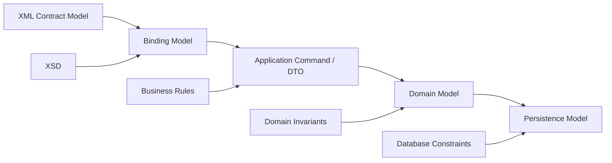
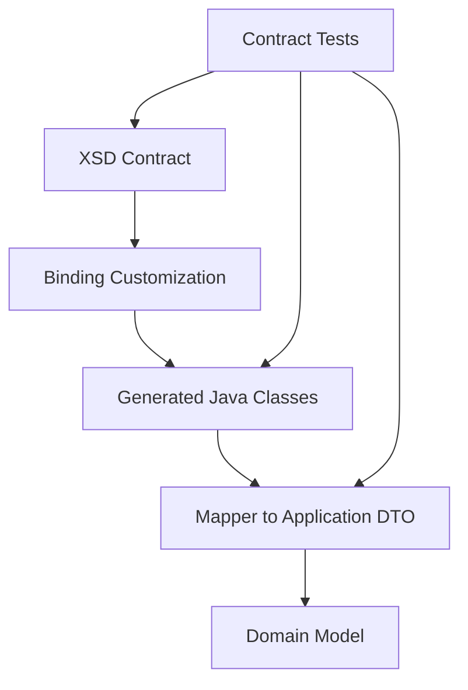
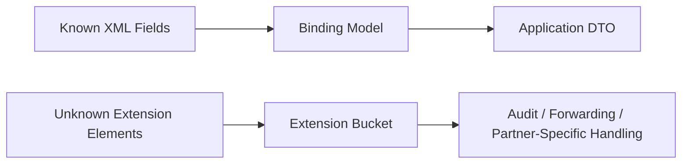
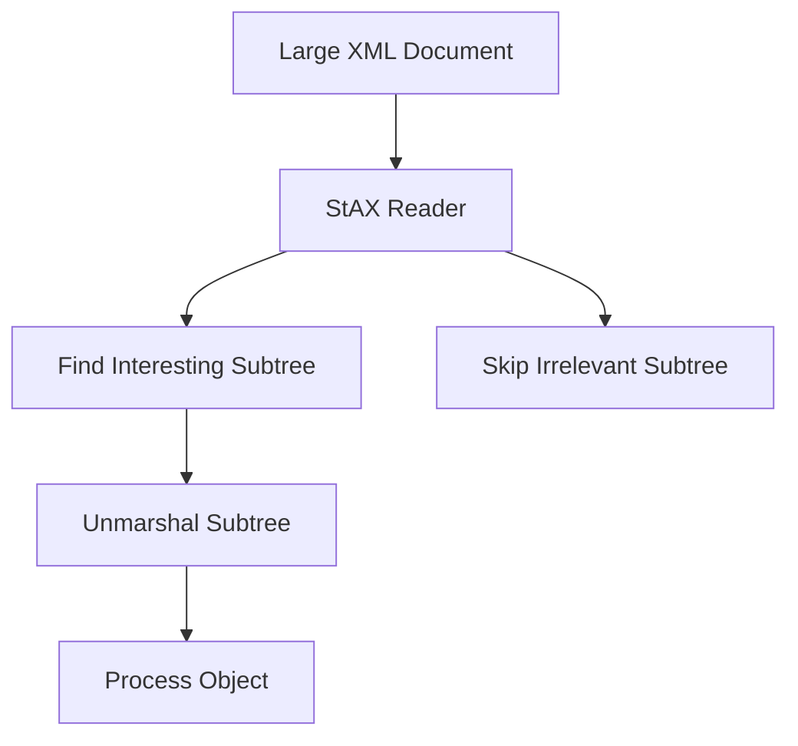
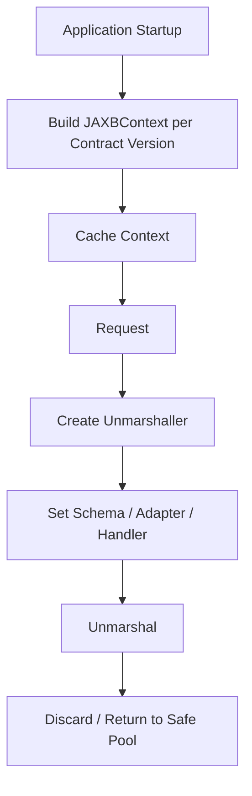
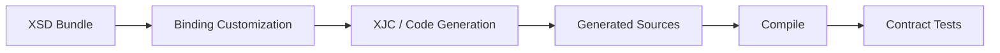
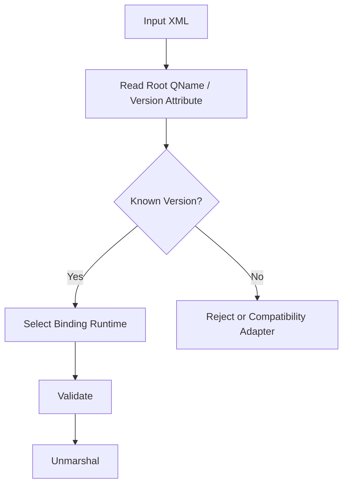

# Part 021 — XML Binding and Object Mapping Strategies

> Goal: mampu memilih dan menerapkan strategi object mapping XML di Java secara tepat: kapan memakai Jakarta XML Binding/JAXB-style binding, kapan tetap memakai DOM/SAX/StAX/XPath/XSLT, bagaimana menjaga XSD sebagai contract source of truth, dan bagaimana menghindari object model yang diam-diam merusak semantics XML.

XML binding terlihat menarik karena menjanjikan hal sederhana:

```text
XML document <-> Java object
```

Tetapi di production, mapping XML ke object bukan sekadar convenience API. Ia adalah **contract boundary**. Setiap keputusan binding menentukan bagaimana sistem menafsirkan:

- namespace;
- missing element;
- empty element;
- `xsi:nil`;
- whitespace;
- order element;
- decimal precision;
- date/time lexical form;
- unknown extension;
- default value;
- repeated group;
- mixed content;
- schema version.

Mental model yang benar:

```text
XML binding is not "XML parser replacement".
XML binding is a projection from XML infoset into a Java domain shape.

Projection always loses, changes, or normalizes something.
```

Karena itu, top-tier engineer tidak bertanya “pakai JAXB atau tidak?”, tetapi:

1. Apa source of truth contract-nya?
2. Apakah object model ini mewakili contract atau hanya view internal?
3. Informasi apa yang hilang setelah unmarshalling?
4. Apakah output bisa direkonstruksi secara deterministic?
5. Apakah validation dan security terjadi sebelum binding?
6. Bagaimana extension/versioning ditangani?
7. Bagaimana error mapping bisa dijelaskan ke partner atau auditor?

---

## 1. Posisi Binding dalam XML Processing Pipeline

Binding sebaiknya ditempatkan setelah parsing security dan contract validation dasar.

```mermaid
flowchart LR
    A[Raw XML Input] --> B[Input Envelope Limit]
    B --> C[Secure Parser]
    C --> D[XSD Validation]
    D --> E[Binding / Projection]
    E --> F[Domain Validation]
    F --> G[Application Use Case]

    H[Schema Version] --> D
    H --> E
    I[Binding Metadata] --> E
    J[Error Mapping] <-- D
    J <-- E
    J <-- F
```

Binding bukan lapisan pertama. Parser harus lebih dulu dikunci agar XML untrusted tidak bisa melakukan external entity resolution, entity expansion attack, atau memaksa parser membaca network/local resource. XSD validation juga sebaiknya terjadi sebelum object graph dipakai oleh business logic.

### 1.1 Pipeline yang Salah

```text
raw XML -> unmarshal directly -> business logic
```

Risiko:

- parser default binding library mungkin tidak cukup hardened;
- payload invalid bisa berubah menjadi partially populated object;
- unknown element bisa diabaikan tanpa evidence;
- namespace mismatch bisa menghasilkan object kosong;
- error lokasi XML sulit dikembalikan ke caller;
- object graph tampak valid karena Java field default, padahal XML tidak valid.

### 1.2 Pipeline yang Lebih Aman

```text
raw XML
  -> secure parse / secure unmarshal source
  -> XSD validation
  -> binding projection
  -> object-level semantic validation
  -> use case
```

Jika performance membutuhkan satu-pass flow, kita masih bisa memakai streaming validation dan unmarshalling secara hati-hati, tetapi invariant-nya tetap sama: **input harus dibatasi, resolver dikontrol, schema jelas, dan error bisa dijelaskan**.

---

## 2. Apa Itu Jakarta XML Binding / JAXB-style Binding?

Jakarta XML Binding adalah spesifikasi dan API untuk memetakan XML document ke Java object dan sebaliknya. Secara historis, banyak engineer mengenalnya sebagai JAXB. Di Java modern, dependency biasanya ditambahkan secara eksplisit lewat Jakarta XML Binding API dan implementation seperti Eclipse JAXB RI, bukan diasumsikan selalu tersedia di JDK runtime.

Operasi utamanya:

| Operation | Arah | Arti |
|---|---|---|
| Unmarshal | XML -> Java object | Membaca XML menjadi object graph |
| Marshal | Java object -> XML | Menulis object graph menjadi XML |
| Generate classes | XSD -> Java classes | Schema-first binding |
| Generate schema | Java classes -> XSD | Code-first contract generation |
| Adapter | XML lexical/value <-> Java value | Custom conversion |

Contoh sederhana:

```java
import jakarta.xml.bind.JAXBContext;
import jakarta.xml.bind.Unmarshaller;
import jakarta.xml.bind.Marshaller;

JAXBContext context = JAXBContext.newInstance(OrderDocument.class);

Unmarshaller unmarshaller = context.createUnmarshaller();
OrderDocument order = (OrderDocument) unmarshaller.unmarshal(xmlSource);

Marshaller marshaller = context.createMarshaller();
marshaller.setProperty(Marshaller.JAXB_FORMATTED_OUTPUT, Boolean.TRUE);
marshaller.marshal(order, outputStream);
```

Namun contoh sederhana ini belum production-grade. Ia belum menunjukkan:

- XSD validation;
- secure source configuration;
- namespace strategy;
- adapter precision;
- schema version handling;
- unknown field handling;
- deterministic serialization;
- error diagnostics;
- concurrency lifecycle.

---

## 3. Decision Matrix: Kapan Binding Cocok?

Binding cocok jika XML document memang data-oriented dan memiliki struktur stabil.

| Kondisi | Binding Cocok? | Alasan |
|---|---:|---|
| XML data-centric, regular, schema-stable | Ya | Object graph mewakili data dengan baik |
| Payload kecil-menengah | Ya | Memory object graph masih wajar |
| Business logic perlu banyak field | Ya | Object model lebih nyaman daripada XPath berulang |
| XSD dikelola dengan baik | Ya | Class generation bisa repeatable |
| Mixed content document-centric | Hati-hati | Object mapping sering awkward |
| Payload sangat besar | Hati-hati | Full object graph mahal |
| Integrasi butuh preserve exact lexical form | Hati-hati | Binding bisa menghilangkan lexical details |
| Unknown extension harus dipertahankan | Hati-hati | Perlu wildcard/DOM capture |
| Transformasi XML-ke-XML kompleks | Sering tidak | XSLT/StAX lebih natural |
| Routing berdasarkan beberapa field saja | Tidak perlu | XPath/StAX extraction cukup |
| Audit membutuhkan original payload fidelity | Binding saja tidak cukup | Simpan original/canonical evidence |

Rule praktis:

```text
Use binding when your application needs to work with XML data as business data.
Do not use binding merely because XML exists.
```

---

## 4. XML Contract vs Java Object Model

Kesalahan besar adalah menganggap XSD dan Java class punya expressiveness yang sama. Tidak benar.

### 4.1 XML Memiliki Hal yang Tidak Natural di Java

| XML/XSD Concept | Tantangan di Java |
|---|---|
| Element order | Java object field order tidak natural sebagai invariant bisnis |
| Namespace | Java package bukan namespace XML yang sama |
| `xs:choice` | Butuh union/sealed-like modelling atau wrapper |
| `xsi:nil` | Berbeda dari missing element dan empty element |
| Attribute vs element | Java field sama-sama property, meaning bisa hilang |
| Mixed content | Sulit dimodelkan sebagai POJO bersih |
| Wildcard `xs:any` | Butuh DOM/JAXBElement/extension bucket |
| Default/fixed values | Bisa terlihat seperti value asli padahal schema-supplied |
| Whitespace facets | Java `String` tidak memberi tahu lexical normalization |
| Decimal precision | `BigDecimal` harus dijaga scale/rounding-nya |

### 4.2 Java Memiliki Hal yang Tidak Ada di XML

| Java Concept | Risiko Saat Dimarshal |
|---|---|
| Inheritance hierarchy | Tidak selalu cocok dengan XSD derivation |
| `Optional<T>` | Tidak selalu didukung natural oleh binding |
| Immutable object | Binding sering butuh no-arg constructor/setter |
| Collections default empty | Missing vs empty list bisa kabur |
| `LocalDateTime` | Tidak punya timezone; XML lexical date/time harus eksplisit |
| Enum rename | Mengubah wire contract jika tidak dikontrol |
| Field default | Bisa menutupi missing data |

Karena itu, object mapping harus dianggap **projection layer**, bukan domain model murni.

---

## 5. Tiga Model yang Harus Dipisahkan

Production system sering gagal karena memakai satu class untuk semua hal:

```text
XML Binding Class = Domain Entity = Persistence Entity = API DTO
```

Ini terlihat hemat, tetapi biasanya menciptakan coupling buruk.

### 5.1 Model yang Lebih Sehat



| Model | Tujuan | Stabilitas |
|---|---|---|
| XML contract model | Wire compatibility | Bergantung partner/regulator |
| Binding model | Representasi XML di Java | Mengikuti XSD |
| Application DTO/command | Input use case | Mengikuti API/use case |
| Domain model | Invariant bisnis | Harus relatif stabil |
| Persistence model | Storage/query | Mengikuti database design |

Binding model boleh jelek secara domain jika memang XSD-nya jelek. Jangan memaksa binding class menjadi domain aggregate.

### 5.2 Anti-Pattern: Domain Dipaksa Mengikuti XSD

Contoh buruk:

```java
@XmlRootElement(name = "Order")
@Entity
public class Order {
    @Id
    private String orderId;

    @XmlElement(name = "CustomerName")
    private String customerName;

    @OneToMany
    @XmlElement(name = "Line")
    private List<OrderLine> lines;
}
```

Masalah:

- JPA lifecycle bercampur XML lifecycle;
- lazy loading bisa aktif saat marshalling;
- field persistence bocor ke wire contract;
- XML namespace/versioning memaksa domain berubah;
- security annotation dan serialization concern bercampur;
- testing menjadi rumit.

Lebih baik:

```text
OrderXmlDto -> OrderCommand -> OrderAggregate -> OrderRecord
```

---

## 6. Schema-First vs Code-First

### 6.1 Schema-First

Schema-first berarti XSD adalah source of truth, lalu Java class digenerate atau disesuaikan dari schema.



Cocok untuk:

- regulasi;
- partner integration;
- SOAP/WSDL ecosystem;
- financial/insurance/telco/healthcare payload;
- canonical enterprise messages;
- system yang harus patuh pada externally owned schema.

Kelebihan:

- wire contract explicit;
- compatibility lebih mudah diaudit;
- generated code bisa repeatable;
- validation bisa dilakukan sebelum business logic;
- partner lebih mudah align.

Kekurangan:

- generated code bisa verbose;
- object model tidak selalu indah;
- build tooling perlu dijaga;
- schema evolution memerlukan governance;
- customization binding perlu disciplined.

### 6.2 Code-First

Code-first berarti Java class dibuat dulu, lalu XML dan/atau XSD dihasilkan dari annotation.

Cocok untuk:

- internal service kecil;
- XML bukan public contract;
- contract tidak perlu strict external governance;
- model sangat sederhana.

Risiko:

- wire contract berubah saat refactor Java;
- annotation menjadi contract tersembunyi;
- namespace/versioning sering kurang matang;
- Java default/null behavior bocor ke XML;
- schema hasil generate belum tentu contract-friendly.

### 6.3 Rekomendasi Enterprise

Untuk enterprise/regulatory system:

```text
Prefer schema-first for externally consumed XML contracts.
Use code-first only for internal, low-risk, short-lived XML formats.
```

---

## 7. Jakarta XML Binding Annotation Mental Model

Binding annotation mengatur mapping antara Java property dan XML representation.

Contoh:

```java
import jakarta.xml.bind.annotation.XmlAccessType;
import jakarta.xml.bind.annotation.XmlAccessorType;
import jakarta.xml.bind.annotation.XmlAttribute;
import jakarta.xml.bind.annotation.XmlElement;
import jakarta.xml.bind.annotation.XmlRootElement;
import jakarta.xml.bind.annotation.XmlType;

@XmlRootElement(name = "Order", namespace = "urn:example:order:v1")
@XmlAccessorType(XmlAccessType.FIELD)
@XmlType(propOrder = {"customer", "lines", "total"})
public class OrderXml {

    @XmlAttribute(name = "id", required = true)
    private String id;

    @XmlElement(name = "Customer", required = true)
    private CustomerXml customer;

    @XmlElement(name = "Line", required = true)
    private List<OrderLineXml> lines = new ArrayList<>();

    @XmlElement(name = "Total", required = true)
    private MoneyXml total;
}
```

### 7.1 `@XmlAccessorType`

Gunakan secara explicit. Jangan mengandalkan default.

```java
@XmlAccessorType(XmlAccessType.FIELD)
```

Alasan:

- mapping lebih mudah dibaca;
- tidak tergantung getter/setter accidental;
- refactor method tidak mengubah XML;
- generated class lebih predictable.

### 7.2 `@XmlType(propOrder = ...)`

Element order penting dalam XML dan XSD `sequence`.

```java
@XmlType(propOrder = {"customer", "lines", "total"})
```

Tanpa order explicit, output bisa tidak sesuai XSD atau tidak deterministic.

### 7.3 `@XmlElement(required = true)` Bukan Pengganti Validation

`required = true` membantu schema generation dan metadata, tetapi jangan menganggap itu cukup sebagai runtime business validation. Tetap lakukan XSD validation dan semantic validation.

---

## 8. Namespace Strategy dalam Binding

Namespace adalah bagian dari nama element. Prefix bukan contract; namespace URI adalah contract.

### 8.1 Package-Level Namespace

Gunakan `package-info.java` untuk namespace default binding package.

```java
@jakarta.xml.bind.annotation.XmlSchema(
    namespace = "urn:example:order:v1",
    elementFormDefault = jakarta.xml.bind.annotation.XmlNsForm.QUALIFIED,
    attributeFormDefault = jakarta.xml.bind.annotation.XmlNsForm.UNQUALIFIED,
    xmlns = {
        @jakarta.xml.bind.annotation.XmlNs(prefix = "ord", namespaceURI = "urn:example:order:v1")
    }
)
package com.example.order.xml.v1;
```

Ini lebih rapi daripada mengulang namespace di setiap class.

### 8.2 Kesalahan Umum

```java
@XmlElement(name = "Customer")
private CustomerXml customer;
```

Jika package namespace tidak dikonfigurasi dan XML input menggunakan namespace, unmarshalling bisa gagal atau field menjadi null. Selalu sadar apakah element qualified atau unqualified.

### 8.3 Prefix Stability

Jangan menjadikan prefix sebagai business invariant:

```xml
<ord:Order xmlns:ord="urn:example:order:v1"/>
```

Setara secara namespace dengan:

```xml
<x:Order xmlns:x="urn:example:order:v1"/>
```

Jika downstream menuntut prefix tertentu, itu kebutuhan serialization/interoperability, bukan semantic XML correctness. Tangani di output layer dengan namespace prefix mapper/serializer policy, bukan di domain logic.

---

## 9. Null, Missing, Empty, dan `xsi:nil`

Ini salah satu area paling sering menyebabkan bug.

| XML Form | Meaning Potensial | Java Mapping Umum |
|---|---|---|
| Element absent | Tidak dikirim / default / tidak diketahui | `null` atau empty list |
| `<Name/>` | Empty string atau no content | `""` atau `null`, tergantung binding |
| `<Name></Name>` | Empty string | `""` |
| `<Name xsi:nil="true"/>` | Explicit nil | `null` dengan metadata hilang |
| `<Items/>` | Container kosong | object dengan list kosong |
| `<Item>` absent | Tidak ada item | empty list atau null |

Problem: Java `null` sering tidak cukup untuk membedakan absent dan explicit nil.

### 9.1 Contract Design Recommendation

Untuk field bisnis penting, definisikan semantics dengan jelas:

```xml
<xs:element name="MiddleName" type="xs:string" minOccurs="0"/>
<xs:element name="CancellationReason" type="xs:string" nillable="true" minOccurs="0"/>
```

Lalu dokumentasikan:

| Field | Missing | Empty | Nil |
|---|---|---|---|
| `MiddleName` | Tidak tersedia | Diketahui kosong | Tidak dipakai |
| `CancellationReason` | Order tidak cancelled | Invalid | Explicit unknown reason |

### 9.2 Java Mapping Strategy

Untuk high-risk field, jangan langsung map ke scalar. Gunakan wrapper semantic.

```java
public sealed interface XmlPresence<T> permits XmlPresence.Missing, XmlPresence.Nil, XmlPresence.Value {
    record Missing<T>() implements XmlPresence<T> {}
    record Nil<T>() implements XmlPresence<T> {}
    record Value<T>(T value) implements XmlPresence<T> {}
}
```

Binding library tidak selalu memberi ini langsung. Jika perlu, pertahankan DOM fragment atau gunakan custom unmarshal layer untuk field penting.

---

## 10. Collections dan Repeated Elements

XML repeated element bisa dimodelkan sebagai list.

```xml
<Order>
  <Line>...</Line>
  <Line>...</Line>
</Order>
```

```java
@XmlElement(name = "Line")
private List<OrderLineXml> lines = new ArrayList<>();
```

### 10.1 Live List Pattern

JAXB-style generated classes sering memakai live list:

```java
public List<OrderLineXml> getLine() {
    if (line == null) {
        line = new ArrayList<>();
    }
    return this.line;
}
```

Tidak ada setter. Caller memodifikasi list langsung.

Kelebihan:

- cocok untuk generated code;
- menghindari replace list accidental;
- simple untuk marshalling.

Risiko:

- object mutable;
- sulit enforce invariant;
- concurrent access berbahaya;
- domain model menjadi lemah.

Rekomendasi:

```text
Accept live-list mutability in binding model.
Convert to immutable application/domain model after unmarshalling.
```

### 10.2 Empty List vs Missing Container

Contoh:

```xml
<Order/>
```

vs

```xml
<Order>
  <Lines/>
</Order>
```

vs

```xml
<Order>
  <Lines>
    <Line>...</Line>
  </Lines>
</Order>
```

Jangan biarkan semua bentuk ini jatuh menjadi `List.of()` tanpa memeriksa contract. Dalam beberapa domain, missing `Lines` berarti invalid, sementara empty `Lines` berarti valid tapi order kosong.

---

## 11. `JAXBElement` dan Root Element Ambiguity

Jika class tidak punya `@XmlRootElement`, binding sering menggunakan `JAXBElement<T>` untuk membawa QName root.

```java
QName name = new QName("urn:example:order:v1", "Order");
JAXBElement<OrderXml> root = new JAXBElement<>(name, OrderXml.class, order);
marshaller.marshal(root, outputStream);
```

`JAXBElement` menyimpan:

- QName element;
- declared type;
- value;
- scope;
- nil marker.

Gunakan saat:

- type yang sama bisa muncul dengan beberapa element name;
- generated classes dari XSD memakai object factory;
- root element bukan fixed di class;
- substitution group perlu didukung.

Anti-pattern:

```java
OrderXml order = (OrderXml) unmarshaller.unmarshal(input);
```

Ini bisa gagal jika hasil sebenarnya `JAXBElement<OrderXml>`. Lebih aman memahami hasil berdasarkan generated model.

---

## 12. Adapters: Mengontrol Lexical dan Value Conversion

`XmlAdapter` digunakan untuk mengubah XML-facing type menjadi Java-facing type.

Contoh money:

```java
public final class BigDecimalScale2Adapter extends XmlAdapter<String, BigDecimal> {
    @Override
    public BigDecimal unmarshal(String value) {
        if (value == null) return null;
        return new BigDecimal(value).setScale(2, RoundingMode.UNNECESSARY);
    }

    @Override
    public String marshal(BigDecimal value) {
        if (value == null) return null;
        return value.setScale(2, RoundingMode.UNNECESSARY).toPlainString();
    }
}
```

Usage:

```java
@XmlJavaTypeAdapter(BigDecimalScale2Adapter.class)
@XmlElement(name = "Amount", required = true)
private BigDecimal amount;
```

### 12.1 Adapter yang Bagus

Adapter bagus bersifat:

- deterministic;
- tidak membaca database/live clock;
- tidak melakukan network call;
- tidak swallow error;
- preserving precision;
- punya unit test banyak;
- documented untuk lexical format.

### 12.2 Adapter yang Buruk

```java
public LocalDateTime unmarshal(String value) {
    return LocalDateTime.parse(value); // timezone semantics hilang
}
```

Jika XML field sebenarnya `xs:dateTime` dengan timezone, `LocalDateTime` bisa menghapus offset. Gunakan `OffsetDateTime`, `ZonedDateTime`, atau type semantic yang jelas.

---

## 13. Date/Time Mapping Strategy

XML date/time adalah area berisiko tinggi.

| XSD Type | Java Candidate | Catatan |
|---|---|---|
| `xs:date` | `LocalDate` | Tanpa timezone |
| `xs:time` | `OffsetTime` atau custom | Perlu offset semantics |
| `xs:dateTime` | `OffsetDateTime` / `Instant` / `XMLGregorianCalendar` | Jangan hilangkan offset tanpa sengaja |
| `xs:gYearMonth` | `YearMonth` | Butuh adapter |
| `xs:duration` | `Duration` / `Period` / custom | Calendar duration berbeda dari seconds duration |

Generated binding tradisional sering memakai `XMLGregorianCalendar`. Ini verbose, tapi ia merepresentasikan XML Schema date/time lebih dekat daripada `LocalDateTime`.

Production recommendation:

```text
At XML boundary, preserve XML semantics.
At application boundary, convert explicitly into domain time type.
```

Contoh:

```java
public record EffectiveWindow(
    Instant startInclusive,
    Instant endExclusive,
    ZoneOffset originalOffset
) {}
```

---

## 14. Decimal, Currency, dan Precision

Jangan pernah map monetary XML value ke `double`.

```java
private BigDecimal amount;
```

Tetapi `BigDecimal` saja belum cukup. Perhatikan:

- scale;
- rounding mode;
- lexical form;
- currency exponent;
- trailing zeros;
- total reconciliation;
- schema facets `fractionDigits` dan `totalDigits`.

Contoh XSD:

```xml
<xs:simpleType name="MoneyAmountType">
  <xs:restriction base="xs:decimal">
    <xs:totalDigits value="18"/>
    <xs:fractionDigits value="2"/>
  </xs:restriction>
</xs:simpleType>
```

Semantic validator tetap harus memeriksa:

```text
sum(line.amount) + tax - discount == total.amount
```

XSD tidak cukup untuk reconciliation rule.

---

## 15. Enum Mapping dan Compatibility

XML enum tampak sederhana:

```xml
<xs:simpleType name="OrderStatusType">
  <xs:restriction base="xs:string">
    <xs:enumeration value="SUBMITTED"/>
    <xs:enumeration value="ACCEPTED"/>
    <xs:enumeration value="REJECTED"/>
  </xs:restriction>
</xs:simpleType>
```

Java:

```java
public enum OrderStatusXml {
    SUBMITTED,
    ACCEPTED,
    REJECTED
}
```

Risiko:

- partner menambah enum baru;
- Java enum gagal unmarshal;
- unknown value tidak bisa diteruskan;
- rename enum mengubah wire value;
- enum internal dipakai langsung untuk contract.

### 15.1 Defensive Enum Strategy

Untuk external contract yang bisa berevolusi:

```java
public record ExternalCode(String value) {
    public boolean isKnown() {
        return switch (value) {
            case "SUBMITTED", "ACCEPTED", "REJECTED" -> true;
            default -> false;
        };
    }
}
```

Atau gunakan enum binding untuk strict contract, tetapi tangani compatibility di versioning policy.

Rule:

```text
Use Java enum only when unknown value should be rejected at boundary.
Use code wrapper when forward compatibility matters.
```

---

## 16. Wildcards dan Extension Points

XSD dapat mengizinkan extension:

```xml
<xs:any namespace="##other" processContents="lax" minOccurs="0" maxOccurs="unbounded"/>
```

Binding bisa menangkapnya sebagai DOM element list atau object list.

```java
@XmlAnyElement(lax = true)
private List<Object> extensions = new ArrayList<>();
```

### 16.1 Extension Bucket Pattern



Use case:

- preserve unknown extension for round-trip;
- support partner-specific add-ons;
- migrate contract gradually;
- keep audit evidence.

Risiko:

- extension bisa membawa data berbahaya;
- lax processing bisa mengaburkan validation;
- business logic bisa mulai bergantung pada unofficial extension;
- namespace governance melemah.

Policy minimum:

```text
Unknown extension must be either rejected, preserved as opaque evidence, or handled by explicitly registered extension processors.
Never silently consume and ignore high-risk extension elements.
```

---

## 17. Partial Binding Pattern

Tidak semua payload harus dibind seluruhnya.

Untuk payload besar:



Contoh use case:

- file settlement berisi jutaan records;
- regulatory report multi-section;
- partner feed berisi envelope besar;
- kita hanya perlu `Order` nodes tertentu.

Pseudo-code:

```java
XMLStreamReader reader = inputFactory.createXMLStreamReader(inputStream);
Unmarshaller unmarshaller = jaxbContext.createUnmarshaller();

while (reader.hasNext()) {
    int event = reader.next();
    if (event == XMLStreamConstants.START_ELEMENT
            && "Order".equals(reader.getLocalName())
            && "urn:example:order:v1".equals(reader.getNamespaceURI())) {
        JAXBElement<OrderXml> element = unmarshaller.unmarshal(reader, OrderXml.class);
        process(element.getValue());
    }
}
```

Perhatikan: saat unmarshal dari `XMLStreamReader`, posisi reader dan subtree consumption harus diuji. Jangan hanya berasumsi.

---

## 18. Validation dengan Binding

Binding bukan pengganti XSD validation.

### 18.1 Attach Schema ke Unmarshaller

```java
SchemaFactory schemaFactory = SchemaFactory.newInstance(XMLConstants.W3C_XML_SCHEMA_NS_URI);
Schema schema = schemaFactory.newSchema(schemaUrl);

Unmarshaller unmarshaller = context.createUnmarshaller();
unmarshaller.setSchema(schema);
unmarshaller.setEventHandler(event -> {
    // false = stop on first serious validation event
    return false;
});
```

Untuk production, error handler harus mengubah validation event menjadi diagnostic model:

```java
public record XmlBindingError(
    String phase,
    String message,
    Integer line,
    Integer column,
    String linkedExceptionType
) {}
```

### 18.2 Validation Phases

| Phase | Menangkap |
|---|---|
| Secure parse | Well-formedness, entity/resource policy |
| XSD validation | Contract structure/type constraints |
| Binding validation | Mapping failure, adapter failure |
| Application validation | Use-case consistency |
| Domain validation | Invariant bisnis |

Jangan gabungkan semua error menjadi “Invalid XML”. Caller butuh tahu apakah error berada di syntax, schema, mapping, atau business semantics.

---

## 19. Security untuk Binding

Binding library tetap melakukan XML parsing. Jadi hardening tetap relevan.

Checklist:

- gunakan secure parser/source jika memungkinkan;
- disable DTD/external entity untuk untrusted XML;
- kontrol schema import/include resolution;
- jangan izinkan adapter membaca arbitrary path/network;
- batasi ukuran input;
- batasi jumlah nodes/records;
- batasi kedalaman XML;
- sanitasi error message sebelum dikembalikan ke external caller;
- jangan log full payload berisi PII/secrets;
- jangan unmarshalling arbitrary class dari untrusted input.

### 19.1 Safe Source Pattern

Daripada memberi `File` atau raw URL langsung ke unmarshaller, lebih baik gunakan stream/resource yang sudah dikontrol.

```java
try (InputStream in = payloadStore.openLimitedStream(payloadId)) {
    Source source = new StreamSource(in);
    Object result = unmarshaller.unmarshal(source);
}
```

Hindari:

```java
unmarshaller.unmarshal(new File(userProvidedPath));
unmarshaller.unmarshal(new URL(userProvidedUrl));
```

Karena boundary resource menjadi kabur.

---

## 20. Lifecycle dan Threading

`JAXBContext` mahal dibuat. Biasanya dibuat sekali dan dicache per model package/version.

`Marshaller` dan `Unmarshaller` tidak sebaiknya dishare antar thread. Buat per operation atau gunakan pool dengan hati-hati.



Recommendation:

```java
public final class XmlBindingRuntime {
    private final JAXBContext context;
    private final Schema schema;

    public XmlBindingRuntime(JAXBContext context, Schema schema) {
        this.context = context;
        this.schema = schema;
    }

    public OrderXml readOrder(Source source) throws JAXBException {
        Unmarshaller u = context.createUnmarshaller();
        u.setSchema(schema);
        JAXBElement<OrderXml> root = u.unmarshal(source, OrderXml.class);
        return root.getValue();
    }
}
```

Keep runtime object immutable. Per-call mutable objects harus dibuat fresh.

---

## 21. Build-Time Code Generation

Schema-first project sering generate Java classes dari XSD.

Pipeline build:



### 21.1 Generated Code Policy

Tentukan sejak awal:

| Policy | Rekomendasi |
|---|---|
| Commit generated code? | Boleh untuk library contract stabil; tidak wajib untuk app internal |
| Modify generated code manually? | Tidak |
| Binding customization? | Ya, explicit dan versioned |
| Generated package per namespace version? | Ya |
| Regenerate in CI? | Ya, untuk mendeteksi drift |
| Diff generated output? | Ya, untuk review contract impact |

### 21.2 Binding Customization

Gunakan customization untuk memperbaiki naming, package, adapter, dan type mapping tanpa mengubah XSD external.

Contoh konseptual:

```xml
<jaxb:bindings version="3.0"
    xmlns:jaxb="https://jakarta.ee/xml/ns/jaxb"
    xmlns:xs="http://www.w3.org/2001/XMLSchema">

  <jaxb:bindings schemaLocation="order-v1.xsd">
    <jaxb:schemaBindings>
      <jaxb:package name="com.example.order.xml.v1"/>
    </jaxb:schemaBindings>
  </jaxb:bindings>
</jaxb:bindings>
```

Binding customization adalah bagian dari contract toolchain. Treat it as production artifact.

---

## 22. Mapping Binding Model ke Domain Model

Binding model tidak harus punya invariant domain. Domain conversion layer yang harus enforce.

```java
public final class OrderMapper {
    public OrderCommand toCommand(OrderXml xml) {
        return new OrderCommand(
            new OrderId(requireText(xml.getId(), "Order/@id")),
            toCustomer(xml.getCustomer()),
            xml.getLines().stream().map(this::toLine).toList(),
            toMoney(xml.getTotal())
        );
    }
}
```

### 22.1 Mapper Harus Path-Aware

Error mapping harus menunjuk lokasi XML/field contract.

```java
throw new XmlSemanticException(
    "/Order/Line[3]/Quantity",
    "Quantity must be positive"
);
```

Jangan hanya:

```text
IllegalArgumentException: invalid quantity
```

### 22.2 Conversion Rules Harus Explicit

| Conversion | Rule |
|---|---|
| String trimming | Hanya jika contract memang `xs:token` atau business rule mengizinkan |
| Date timezone | Preserve atau normalize dengan evidence |
| Decimal scale | Enforce dengan rounding policy explicit |
| Enum unknown | Reject atau map to `UNKNOWN_EXTERNAL_CODE` dengan raw value |
| Empty list | Reject jika min occurrence business > 0 |
| Extension | Preserve/reject/route berdasarkan policy |

---

## 23. Marshalling Strategy

Marshalling adalah contract publication. Jangan treat sebagai `toString()`.

### 23.1 Marshalling Flow


Output validation penting karena object graph bisa dibuat oleh code yang melewati unmarshal validation.

### 23.2 Marshaller Configuration

```java
Marshaller marshaller = context.createMarshaller();
marshaller.setSchema(schema);
marshaller.setProperty(Marshaller.JAXB_FORMATTED_OUTPUT, Boolean.FALSE);
marshaller.setProperty(Marshaller.JAXB_ENCODING, "UTF-8");
```

For deterministic output:

- set explicit encoding;
- define element order;
- control namespace prefixes if partner requires;
- avoid pretty printing for signed/canonical payload;
- validate output;
- use golden-file tests with canonical comparison.

---

## 24. Binding dan Versioning

Jangan gunakan satu package untuk banyak schema version.

```text
com.example.order.xml.v1
com.example.order.xml.v2
com.example.order.xml.v3
```

Runtime registry:

```java
public interface XmlContractRuntime<T> {
    String contractVersion();
    T unmarshal(Source source);
    void marshal(T value, Result result);
}
```

Version selection:



Avoid:

```java
JAXBContext.newInstance("com.example.order.xml"); // all versions mixed
```

Because class name collisions, QName ambiguity, and accidental compatibility can hide real contract breakage.

---

## 25. Handling Bad Partner Payloads

In enterprise integration, payload sering tidak ideal:

- namespace salah tapi local name benar;
- order element salah;
- date format tidak sesuai XSD;
- enum pakai lower-case;
- required field kosong;
- extra elements tidak dideklarasikan;
- encoding declaration salah;
- payload valid XSD tapi business-invalid.

Jangan cepat-cepat “memperbaiki” parser agar menerima semua. Buat policy:

| Defect | Action |
|---|---|
| Well-formedness error | Reject |
| Wrong namespace | Reject, kecuali ada formally approved compatibility adapter |
| Minor whitespace issue | Normalize jika contract mengizinkan |
| Unknown optional extension | Preserve or reject based on schema policy |
| Invalid date lexical form | Reject |
| Known partner legacy bug | Adapter khusus dengan evidence |
| Semantic invalidity | Reject dengan business diagnostic |

Compatibility adapter harus explicit:

```text
partner-x-v1-bugfix-normalizer
input: partner malformed-but-known XML
output: canonical valid XML
scope: partner X only
expiry: 2026-12-31
owner: integration platform team
```

---

## 26. Testing XML Binding

### 26.1 Test Categories

| Test | Tujuan |
|---|---|
| Unmarshal valid fixture | Memastikan XML valid menjadi object benar |
| Marshal then validate | Memastikan output sesuai XSD |
| Round-trip test | Mengetahui informasi yang hilang |
| Negative schema test | Memastikan invalid payload ditolak |
| Namespace test | Mencegah local-name-only bug |
| Nil/missing/empty test | Mencegah ambiguity |
| Adapter edge case | Date/decimal/enum precision |
| Version selection test | Memastikan runtime memilih schema benar |
| Unknown extension test | Preserve/reject sesuai policy |
| Golden output test | Deterministic serialization |

### 26.2 Round-Trip Caveat

Round-trip bukan selalu tujuan.

```text
XML -> object -> XML
```

Bisa berubah karena:

- namespace prefix berbeda;
- attribute order berubah;
- whitespace berubah;
- default values muncul/hilang;
- lexical decimal berubah dari `1.0` ke `1.00`;
- date timezone dinormalisasi.

Gunakan canonical comparison jika yang diuji adalah semantic XML equality. Gunakan byte-for-byte only jika output contract memang membutuhkan byte stability.

---

## 27. Observability dan Audit

Binding errors harus observable.

Minimal metrics:

| Metric | Dimensi |
|---|---|
| `xml.binding.unmarshal.count` | contract, version, result |
| `xml.binding.unmarshal.duration` | contract, version |
| `xml.binding.validation.error.count` | contract, error_type |
| `xml.binding.adapter.error.count` | adapter, field |
| `xml.binding.output.validation.error.count` | contract, version |
| `xml.binding.payload.size` | contract, source |

Audit evidence:

```json
{
  "payloadId": "p-20260702-0001",
  "contract": "order",
  "version": "v1",
  "rootQName": "{urn:example:order:v1}Order",
  "schemaBundle": "order-schema-bundle-1.8.3",
  "bindingRuntime": "order-binding-v1.8.3",
  "validationResult": "PASS",
  "unmarshalResult": "PASS",
  "semanticValidationResult": "PASS"
}
```

Do not log full XML by default. Store securely with retention/redaction policy.

---

## 28. Common Failure Modes

| Failure Mode | Root Cause | Prevention |
|---|---|---|
| Fields always null | Namespace mismatch | Package-level namespace tests |
| Random output order | Missing `propOrder` | Explicit order/golden tests |
| Invalid XML output | Marshal without output validation | Validate generated XML |
| Memory spike | Binding huge document | StAX partial binding |
| Silent unknown element | Lax binding/default behavior | Strict validation first |
| Date shifted | Wrong Java time type | Time adapter tests |
| Decimal rounded | `double` or bad adapter | `BigDecimal` with scale policy |
| Domain polluted | Binding class reused as entity | Separate models |
| Version conflict | One context for all versions | Runtime per contract version |
| Security incident | Untrusted XML unmarshalled directly | Secure parser/resource policy |

---

## 29. Production Reference Pattern

```mermaid
flowchart TD
    A[XML Payload] --> B[Payload Guard]
    B --> C[Root QName Sniffing]
    C --> D[Contract Runtime Registry]
    D --> E[Secure Validation]
    E --> F[Unmarshal to Binding Model]
    F --> G[Binding Diagnostics]
    G --> H[Map to Application Command]
    H --> I[Semantic Validation]
    I --> J[Use Case]

    K[Original Payload Store] <-- A
    L[Audit Evidence] <-- C
    L <-- E
    L <-- F
    L <-- I
```

Skeleton:

```java
public final class XmlOrderIngestionService {
    private final XmlContractRuntime<OrderXml> runtime;
    private final OrderMapper mapper;
    private final OrderUseCase useCase;

    public void ingest(InputStream payload, PayloadMetadata metadata) {
        GuardedXmlSource source = GuardedXmlSource.from(payload, metadata);
        OrderXml xml = runtime.unmarshal(source.asSource());
        OrderCommand command = mapper.toCommand(xml);
        useCase.submit(command);
    }
}
```

---

## 30. Practice: 20-Hour Deliberate Drill

### Drill 1 — Binding Setup

Ambil XSD sederhana `Order`, generate/buat binding class, unmarshal XML valid, lalu marshal kembali.

Acceptance criteria:

- namespace benar;
- output valid XSD;
- test mencakup missing required element.

### Drill 2 — Nil/Missing/Empty Matrix

Buat fixture untuk:

- absent element;
- empty element;
- `xsi:nil=true`;
- whitespace-only element.

Acceptance criteria:

- mapper membedakan semantics yang contract butuhkan;
- error message path-aware.

### Drill 3 — Partial Binding

Buat file XML dengan 10.000 `Order` element, proses dengan StAX, unmarshal hanya subtree `Order`.

Acceptance criteria:

- memory stabil;
- invalid order menghasilkan diagnostic dengan index record;
- processing tidak load full DOM.

### Drill 4 — Versioned Runtime

Buat `order-v1.xsd` dan `order-v2.xsd`. Implement registry berdasarkan root namespace.

Acceptance criteria:

- v1 dan v2 tidak bercampur package;
- unknown version ditolak;
- audit mencatat schema bundle version.

### Drill 5 — Output Validation

Generate XML dari domain object, marshal, validate output, lalu compare canonical output.

Acceptance criteria:

- generated XML deterministic;
- decimal/date adapter diuji;
- namespace prefix tidak dijadikan semantic assertion kecuali memang required.

---

## 31. Checklist

Gunakan checklist ini sebelum memilih binding:

- Apakah XML data-centric dan schema-stable?
- Apakah XSD adalah source of truth?
- Apakah binding model dipisah dari domain/persistence model?
- Apakah namespace dikonfigurasi explicit?
- Apakah null/missing/empty/nil semantics jelas?
- Apakah date/time dan decimal punya adapter/test?
- Apakah output XML divalidasi?
- Apakah unknown extension policy jelas?
- Apakah binding runtime versioned?
- Apakah `JAXBContext` dicache dan `Marshaller`/`Unmarshaller` dibuat per operation?
- Apakah secure parser/resource policy diterapkan?
- Apakah error path-aware dan audit-friendly?
- Apakah large payload memakai partial binding/streaming?

---

## 32. Key Takeaways

- XML binding adalah projection layer, bukan parser replacement.
- XSD dan Java object model tidak punya expressiveness yang sama.
- Schema-first lebih aman untuk external/regulatory contracts.
- Binding class sebaiknya dipisahkan dari domain dan persistence model.
- Namespace, nil/missing/empty, date/time, decimal, enum, dan extension adalah sumber bug utama.
- Output marshalling harus divalidasi, tidak diasumsikan benar.
- Untuk payload besar, gabungkan StAX dengan partial binding.
- Runtime binding harus versioned, observable, secure, dan testable.

