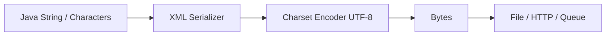
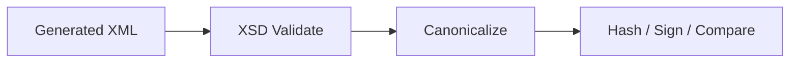
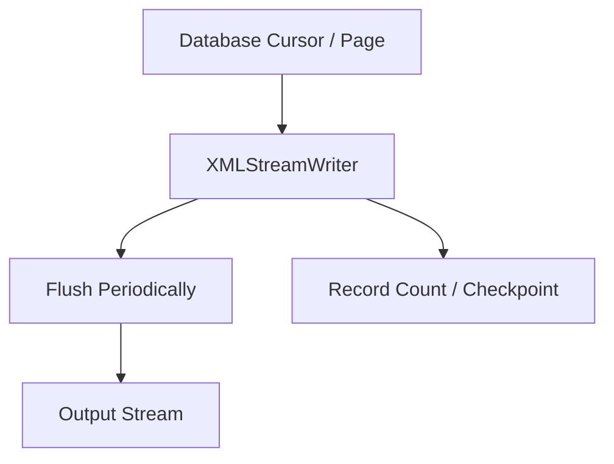
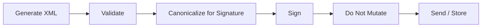

# Part 022 — XML Generation and Serialization

> Goal: mampu menghasilkan XML dari Java secara aman, valid, deterministic, namespace-correct, encoding-correct, testable, dan layak dipakai di production integration/regulatory pipelines.

Banyak engineer menganggap XML generation sebagai operasi sederhana:

```text
string concat -> output.xml
```

Di production, itu berbahaya. XML output adalah contract artifact. Ia bisa dikirim ke partner, regulator, payment network, policy admin system, document engine, atau audit archive. Output yang kelihatannya “mirip XML” belum tentu:

- well-formed;
- namespace-correct;
- valid terhadap XSD;
- aman dari injection;
- stabil secara serialization;
- benar encoding-nya;
- kompatibel dengan downstream parser;
- bisa ditandatangani/diaudit;
- deterministic untuk replay.

Mental model:

```text
XML generation = building an XML infoset + serializing it into bytes under a contract.
```

Ada dua layer berbeda:

```text
Logical XML model  ->  Serialized byte stream
(element, attribute, namespace, text)     (UTF-8, XML declaration, line endings, escaping)
```

Top-tier engineer selalu memisahkan keduanya.

---

## 1. Generation Strategy Matrix

| Strategy | Cocok Untuk | Hindari Jika |
|---|---|---|
| StAX `XMLStreamWriter` | Streaming output besar, deterministic generation | Butuh random tree mutation |
| DOM build + serialize | Dokumen kecil yang perlu mutation/random access | Payload besar/high throughput |
| JAXB/Jakarta XML Binding marshalling | Object model sudah mewakili XML contract | Perlu kontrol lexical/prefix sangat detail |
| XSLT transformation | XML-to-XML/HTML/text mapping declarative | Output heavily imperative/business branching |
| Template engine text | Non-XML text output | XML contract serius; raw escaping rawan |
| String concatenation | Hampir tidak pernah untuk XML production | Semua output untrusted/dynamic |

Rule praktis:

```text
Generate XML using XML-aware APIs.
Never construct production XML by string concatenation unless every value is static and proven safe.
```

---

## 2. Why String Concatenation Fails

Contoh buruk:

```java
String xml = "<Customer><Name>" + name + "</Name></Customer>";
```

Jika `name` bernilai:

```text
A & B <VIP>
```

Output menjadi:

```xml
<Customer><Name>A & B <VIP></Name></Customer>
```

Itu tidak well-formed. Jika value berasal dari user, bisa juga memicu XML injection:

```text
</Name><Role>ADMIN</Role><Name>
```

String concatenation gagal karena tidak memahami:

- escaping text;
- escaping attribute;
- namespace binding;
- XML declaration;
- character encoding;
- invalid XML characters;
- element order;
- well-formedness;
- output validation.

---

## 3. XML Generation Pipeline

Production XML generation sebaiknya berupa pipeline eksplisit.

```mermaid
flowchart LR
    A[Domain Data / Command / Event] --> B[Output Contract Model]
    B --> C[Semantic Output Validation]
    C --> D[XML Writer / Marshaller / Transformer]
    D --> E[XSD Validation]
    E --> F[Canonicalization / Formatting Policy]
    F --> G[Byte Stream]
    G --> H[Transport / Storage / Signature]

    I[Schema Version] --> E
    J[Serialization Policy] --> F
    K[Audit Evidence] <-- C
    K <-- E
    K <-- F
```

Setiap tahap punya failure mode berbeda:

| Stage | Failure |
|---|---|
| Contract model mapping | Required field missing, wrong currency, invalid state |
| Writer/marshaller | Namespace error, invalid char, unsupported type |
| XSD validation | Element order/type/cardinality invalid |
| Serialization | Encoding mismatch, pretty-print instability |
| Transport/storage | Truncation, wrong content-type, compression issue |
| Signature | Byte-level change after signing |

---

## 4. StAX Writer: Streaming XML Generation

StAX `XMLStreamWriter` cocok saat output besar atau kita ingin menulis secara forward-only.

Contoh:

```java
XMLOutputFactory outputFactory = XMLOutputFactory.newFactory();

try (OutputStream out = Files.newOutputStream(path)) {
    XMLStreamWriter writer = outputFactory.createXMLStreamWriter(out, "UTF-8");

    writer.writeStartDocument("UTF-8", "1.0");
    writer.writeStartElement("ord", "Order", "urn:example:order:v1");
    writer.writeNamespace("ord", "urn:example:order:v1");
    writer.writeAttribute("id", order.id());

    writer.writeStartElement("ord", "Customer", "urn:example:order:v1");
    writer.writeStartElement("ord", "Name", "urn:example:order:v1");
    writer.writeCharacters(order.customerName());
    writer.writeEndElement(); // Name
    writer.writeEndElement(); // Customer

    writer.writeEndElement(); // Order
    writer.writeEndDocument();
    writer.close();
}
```

### 4.1 Important StAX Writer Invariant

`XMLStreamWriter` membantu escaping text/attribute, tetapi tidak menjamin semua well-formedness logic untuk Anda. Anda tetap harus menulis start/end element secara seimbang, namespace dengan benar, dan urutan element sesuai contract.

Prinsip:

```text
XMLStreamWriter escapes values.
Your code still owns document structure.
```

---

## 5. Safe Element and Attribute Writing

### 5.1 Text Content

Gunakan:

```java
writer.writeCharacters(value);
```

Jangan:

```java
writer.writeRaw(value); // tidak ada di standard XMLStreamWriter; konsep ini berbahaya
```

Escaping text minimal mencakup karakter seperti `&`, `<`, dan `>` sesuai aturan writer. Untuk attribute, escaping juga harus memperhatikan quote.

### 5.2 Attribute Values

```java
writer.writeAttribute("status", statusCode);
```

Jangan menulis:

```java
writer.writeCharacters(" status=\"" + statusCode + "\"");
```

Attribute bukan text node. Writer method berbeda karena escaping dan posisi berbeda.

### 5.3 Invalid XML Characters

Escaping tidak menyelesaikan semua karakter invalid. Beberapa control character tidak valid dalam XML 1.0. Anda perlu policy:

- reject;
- sanitize dengan evidence;
- encode sebagai base64 jika memang binary/control payload;
- pindahkan ke attachment/side channel.

Utility example:

```java
public final class XmlCharPolicy {
    public static String requireXml10Text(String value, String path) {
        if (value == null) return null;
        for (int i = 0; i < value.length(); i++) {
            char ch = value.charAt(i);
            if (isInvalidXml10Char(ch)) {
                throw new IllegalArgumentException("Invalid XML character at " + path + " index " + i);
            }
        }
        return value;
    }

    private static boolean isInvalidXml10Char(char ch) {
        return !(ch == 0x9 || ch == 0xA || ch == 0xD
            || (ch >= 0x20 && ch <= 0xD7FF)
            || (ch >= 0xE000 && ch <= 0xFFFD));
    }
}
```

Catatan: handling supplementary Unicode code points perlu implementasi berbasis code point, bukan hanya `char`, jika sistem menerima karakter di luar BMP.

---

## 6. Namespace-Correct Generation

Namespace bug adalah bug XML output paling umum.

### 6.1 Correct Namespace Writing

```java
String ns = "urn:example:order:v1";
writer.writeStartElement("ord", "Order", ns);
writer.writeNamespace("ord", ns);
```

Element name adalah kombinasi:

```text
namespace URI + local name
```

Prefix hanya lexical alias di serialized XML.

### 6.2 Default Namespace Trap

```xml
<Order xmlns="urn:example:order:v1">
  <Customer>...</Customer>
</Order>
```

`Customer` berada di namespace yang sama karena default namespace berlaku untuk elements.

Tetapi attribute tidak otomatis masuk default namespace:

```xml
<Order xmlns="urn:example:order:v1" id="O-1"/>
```

`id` tidak namespaced kecuali ditulis dengan prefix/namespace.

### 6.3 Namespace Repairing

Beberapa StAX implementation mendukung property repairing namespaces.

```java
outputFactory.setProperty(XMLOutputFactory.IS_REPAIRING_NAMESPACES, Boolean.TRUE);
```

Ini bisa membantu, tetapi jangan jadikan pengganti pemahaman namespace. Untuk output contract penting, lebih baik explicit:

- prefix registry;
- namespace declaration di root/envelope;
- golden tests;
- XSD validation.

### 6.4 Prefix Policy

Secara semantic, prefix tidak penting. Secara interoperability, beberapa partner legacy bisa bergantung pada prefix. Jika demikian, dokumentasikan sebagai serialization policy:

```yaml
contract: order-v1
namespace: urn:example:order:v1
preferredPrefix: ord
requiredBy:
  - legacy-partner-a
```

Jangan menyebarkan string prefix di seluruh code. Buat registry.

```java
public record XmlNamespace(String prefix, String uri) {}

public final class OrderNamespaces {
    public static final XmlNamespace ORD = new XmlNamespace("ord", "urn:example:order:v1");
}
```

---

## 7. StAX Writer Helper Pattern

Raw StAX code bisa verbose. Buat helper kecil yang tetap transparent.

```java
public final class XmlWriterSupport {
    private final XMLStreamWriter writer;

    public XmlWriterSupport(XMLStreamWriter writer) {
        this.writer = writer;
    }

    public void element(String prefix, String localName, String namespaceUri, String value)
            throws XMLStreamException {
        writer.writeStartElement(prefix, localName, namespaceUri);
        if (value != null) {
            writer.writeCharacters(value);
        }
        writer.writeEndElement();
    }

    public void requiredElement(String prefix, String localName, String namespaceUri, String value, String path)
            throws XMLStreamException {
        if (value == null || value.isBlank()) {
            throw new IllegalArgumentException("Missing required XML value at " + path);
        }
        element(prefix, localName, namespaceUri, value);
    }
}
```

Tetap hindari helper yang terlalu magic. XML writer harus mudah diaudit.

---

## 8. DOM Build + Serialize

DOM cocok jika dokumen kecil dan perlu random mutation.

```java
DocumentBuilderFactory factory = DocumentBuilderFactory.newInstance();
factory.setNamespaceAware(true);
DocumentBuilder builder = factory.newDocumentBuilder();
Document doc = builder.newDocument();

String ns = "urn:example:order:v1";
Element order = doc.createElementNS(ns, "ord:Order");
order.setAttribute("id", "O-1001");
order.setAttributeNS(XMLConstants.XMLNS_ATTRIBUTE_NS_URI, "xmlns:ord", ns);
doc.appendChild(order);

Element customer = doc.createElementNS(ns, "ord:Customer");
customer.setTextContent("A & B <VIP>");
order.appendChild(customer);
```

Serialize:

```java
TransformerFactory tf = TransformerFactory.newInstance();
Transformer transformer = tf.newTransformer();
transformer.setOutputProperty(OutputKeys.ENCODING, "UTF-8");
transformer.setOutputProperty(OutputKeys.OMIT_XML_DECLARATION, "no");
transformer.setOutputProperty(OutputKeys.INDENT, "no");

transformer.transform(new DOMSource(doc), new StreamResult(outputStream));
```

### 8.1 DOM Trade-Off

| Kelebihan | Kekurangan |
|---|---|
| Mudah mutation | Memory mahal |
| Random access | Lambat untuk payload besar |
| Bisa compose fragments | Namespace mistakes tetap mungkin |
| Cocok untuk small document | Tidak streaming |

Gunakan DOM untuk:

- document kecil;
- post-processing XML fragment;
- dynamic insertion;
- signing/encryption libraries yang butuh DOM;
- test fixture construction.

Jangan gunakan DOM untuk:

- batch XML besar;
- jutaan repeated records;
- low-latency high-throughput output;
- transformation XML-to-XML yang lebih cocok XSLT/StAX.

---

## 9. JAXB/Jakarta XML Binding Marshalling

Jika binding model sudah mewakili output contract, marshalling membantu.

```java
JAXBContext context = JAXBContext.newInstance(OrderXml.class);
Marshaller marshaller = context.createMarshaller();
marshaller.setProperty(Marshaller.JAXB_ENCODING, "UTF-8");
marshaller.setProperty(Marshaller.JAXB_FORMATTED_OUTPUT, Boolean.FALSE);
marshaller.setSchema(orderSchema);
marshaller.marshal(orderXml, outputStream);
```

### 9.1 Jangan Marshal Domain Object Langsung

Better:

```text
Domain object -> XML DTO/binding model -> marshal -> validate output
```

Than:

```text
Domain object with XML annotations -> marshal
```

Karena domain lifecycle, persistence lazy loading, security fields, dan XML contract evolution tidak boleh saling mengikat.

### 9.2 Output Validation Remains Mandatory

Marshaller bisa menghasilkan XML yang well-formed, tetapi belum tentu valid terhadap XSD jika object graph tidak lengkap atau adapter menghasilkan lexical value invalid.

```text
Always validate generated XML when the XML crosses a trust/organization/regulatory boundary.
```

---

## 10. Transformer Serialization

`Transformer` sering digunakan untuk serialize DOM atau hasil transformation.

```java
Transformer transformer = transformerFactory.newTransformer();
transformer.setOutputProperty(OutputKeys.METHOD, "xml");
transformer.setOutputProperty(OutputKeys.ENCODING, "UTF-8");
transformer.setOutputProperty(OutputKeys.OMIT_XML_DECLARATION, "no");
transformer.setOutputProperty(OutputKeys.INDENT, "no");
transformer.transform(source, result);
```

Common output properties:

| Property | Meaning |
|---|---|
| `OutputKeys.METHOD` | `xml`, `html`, `text` |
| `OutputKeys.ENCODING` | Character encoding for stream result |
| `OutputKeys.OMIT_XML_DECLARATION` | Whether XML declaration is omitted |
| `OutputKeys.INDENT` | Pretty print hint |
| `OutputKeys.STANDALONE` | Standalone declaration |
| `OutputKeys.MEDIA_TYPE` | Media type hint |

### 10.1 Output Properties Apply to Serialization

Output properties matter when writing to stream-like results. They do not change the logical DOM tree itself. Jangan mengira `OutputKeys.INDENT` mengubah XML data model.

---

## 11. Encoding: Characters vs Bytes

XML logical content adalah character data. File/network output adalah bytes.



Invariants:

- XML declaration encoding harus cocok dengan actual bytes;
- HTTP `Content-Type` charset harus cocok;
- jangan pakai platform default encoding;
- gunakan UTF-8 kecuali contract memaksa lain;
- test dengan non-ASCII characters;
- jangan melakukan double encoding.

### 11.1 Bad Pattern

```java
String xml = generateXmlString();
Files.writeString(path, xml); // platform/default behavior risk depending API usage
```

Better:

```java
Files.writeString(path, xml, StandardCharsets.UTF_8);
```

Even better untuk streaming:

```java
try (OutputStream out = Files.newOutputStream(path)) {
    XMLStreamWriter writer = outputFactory.createXMLStreamWriter(out, "UTF-8");
    // write XML
}
```

### 11.2 XML Declaration

```xml
<?xml version="1.0" encoding="UTF-8"?>
```

Jika declaration bilang UTF-8 tetapi bytes sebenarnya ISO-8859-1, downstream bisa gagal atau membaca data salah.

---

## 12. Pretty Printing vs Deterministic Output

Pretty printing berguna untuk manusia, tetapi berbahaya untuk:

- digital signatures;
- byte-level golden tests;
- canonicalization;
- downstream yang whitespace-sensitive;
- mixed content;
- large file size.

Policy:

| Context | Pretty Print? |
|---|---:|
| Human debug copy | Ya, boleh |
| Machine-to-machine payload | Biasanya tidak |
| Signed XML | Tidak setelah signing |
| Audit canonical archive | Tidak, gunakan canonical form/policy |
| Test fixture source | Boleh, jika comparison canonical |
| Mixed content document | Hati-hati |

Jangan mengubah formatting setelah payload ditandatangani.

---

## 13. Canonicalization

Canonicalization membuat representasi XML lebih deterministic untuk comparison/signature tertentu. Namun canonical XML bukan pengganti contract design.

Gunakan canonicalization untuk:

- XML Signature;
- semantic-ish comparison;
- audit evidence hash;
- reducing serialization noise.

Tetapi pahami batasnya:

- canonicalization tidak memperbaiki schema invalid;
- canonicalization tidak membuat semantic business benar;
- canonicalization bisa sensitif terhadap namespace/whitespace context;
- canonicalization tidak selalu sesuai dengan partner-required lexical output.

Pipeline:



---

## 14. CDATA

CDATA sering disalahgunakan.

```xml
<Description><![CDATA[A & B <VIP>]]></Description>
```

CDATA hanya lexical representation untuk text content. Secara data model, itu tetap text.

Gunakan CDATA hanya jika:

- contract secara eksplisit meminta;
- payload menyimpan embedded markup as text;
- downstream legacy membutuhkan CDATA.

Jangan gunakan CDATA untuk “menghindari escaping” secara umum. Serializer normal sudah cukup.

Risiko:

- CDATA tidak boleh mengandung `]]>` tanpa splitting;
- output processor bisa mengubah CDATA menjadi escaped text;
- canonicalization dapat mengubah lexical representation;
- CDATA bukan security boundary.

---

## 15. Attribute vs Element Generation

Attribute cocok untuk metadata singkat yang tidak punya struktur kompleks.

```xml
<Order id="O-1001" version="1">
  <Customer>...</Customer>
</Order>
```

Element cocok untuk data bisnis yang bisa berkembang.

```xml
<Customer>
  <Name>...</Name>
  <TaxId>...</TaxId>
</Customer>
```

Generation rule:

- jangan menaruh long text di attribute;
- jangan menaruh structured data di attribute;
- jangan memakai attribute order sebagai invariant;
- jangan generate empty attribute jika missing semantics berbeda dari empty string;
- validate required attributes.

---

## 16. Empty Elements, Missing Elements, and Nil

Output generation harus intentional.

| Desired Meaning | XML Output |
|---|---|
| Field tidak berlaku | Omit element jika `minOccurs=0` |
| Field diketahui kosong | `<Name/>` atau `<Name></Name>` sesuai policy |
| Field explicit nil | `<Name xsi:nil="true"/>` jika nillable |
| List kosong | Omit container atau emit empty container sesuai contract |
| Required blank invalid | Reject before generation |

Example helper:

```java
public void optionalElement(String prefix, String local, String ns, String value)
        throws XMLStreamException {
    if (value == null) {
        return;
    }
    writer.writeStartElement(prefix, local, ns);
    writer.writeCharacters(value);
    writer.writeEndElement();
}
```

Nil requires namespace:

```xml
<Name xmlns:xsi="http://www.w3.org/2001/XMLSchema-instance" xsi:nil="true"/>
```

Do not emit `xsi:nil` unless schema allows `nillable="true"`.

---

## 17. Deterministic Serialization

Deterministic output berarti input logical yang sama menghasilkan XML output yang sama menurut comparison policy.

Controls:

| Area | Control |
|---|---|
| Element order | XSD sequence / explicit writer order / `propOrder` |
| Attribute order | Jangan bergantung; canonicalize jika perlu |
| Namespace prefix | Prefix registry jika lexical stability required |
| Encoding | Explicit UTF-8 |
| Decimal | `toPlainString()`, scale policy |
| Date/time | Explicit formatter and timezone policy |
| Collections | Stable sort jika order tidak intrinsic |
| Whitespace | Pretty-print policy |
| Optional fields | Omit/empty/nil policy |
| Reference data | Snapshot version |

### 17.1 Stable Ordering

Jika XML contract tidak menentukan order untuk repeating business elements, tetapi downstream diff/audit butuh stable output, sort explicitly.

```java
List<Line> lines = order.lines().stream()
    .sorted(Comparator.comparing(Line::lineNumber))
    .toList();
```

Jangan bergantung pada `HashMap` iteration order.

---

## 18. Large XML Output

Untuk output besar, pakai streaming.



Pattern:

```java
writer.writeStartDocument("UTF-8", "1.0");
writer.writeStartElement("rep", "Report", REPORT_NS);
writer.writeNamespace("rep", REPORT_NS);

int count = 0;
for (Transaction tx : transactionCursor) {
    writeTransaction(writer, tx);
    count++;
    if (count % 1000 == 0) {
        writer.flush();
    }
}

writer.writeEndElement();
writer.writeEndDocument();
writer.close();
```

Consider:

- output cannot be easily retried mid-stream unless writing to temp object/file;
- if failure occurs after partial output, mark artifact failed;
- validate large output via streaming validator if possible;
- store generation metadata/checkpoints;
- use temp file then atomic move/publish.

### 18.1 Atomic Publish Pattern

```text
generate to temp file
  -> close writer
  -> validate temp file
  -> compute hash
  -> move temp to final location
  -> publish event
```

Never publish partially written XML as final artifact.

---

## 19. Output Validation

Generated XML must be validated when contract matters.

```java
Schema schema = schemaFactory.newSchema(schemaFile);
Validator validator = schema.newValidator();
validator.validate(new StreamSource(generatedXmlFile));
```

For streaming generation, common strategies:

1. Write to temp file, then validate.
2. Pipe writer output through validator if architecture supports it.
3. Generate SAX events through `ValidatorHandler`.
4. Validate object model before writing plus sample/golden validation, but this is weaker.

Output validation catches:

- missing required element;
- wrong order;
- wrong namespace;
- invalid lexical date/decimal;
- invalid enum;
- unexpected element;
- nillable misuse.

It does not catch:

- wrong business total;
- wrong customer identity;
- stale reference data;
- invalid regulatory interpretation.

Semantic validation still needed.

---

## 20. XML Generation Error Model

Do not let low-level exception leak directly.

Better diagnostic:

```java
public record XmlGenerationError(
    String contract,
    String version,
    String phase,
    String path,
    String code,
    String message,
    Throwable cause
) {}
```

Example errors:

| Phase | Code | Example |
|---|---|---|
| mapping | `MISSING_REQUIRED_VALUE` | `/Order/Customer/Name` missing |
| formatting | `INVALID_DECIMAL_SCALE` | `/Order/Total/Amount` has scale 3 |
| writing | `XML_STREAM_ERROR` | writer failed |
| validation | `XSD_VALIDATION_FAILED` | invalid element order |
| publishing | `ARTIFACT_PUBLISH_FAILED` | cannot move temp file |

The caller should know whether generation failed before or after bytes were written.

---

## 21. XML Output Testing

### 21.1 Test Layers

| Test | Purpose |
|---|---|
| Unit writer test | One writer method produces correct fragment |
| Schema validation test | Output is XSD valid |
| XPath assertion test | Required values appear at correct paths |
| Golden file test | Output stable enough |
| Canonical comparison | Ignore irrelevant lexical differences |
| Encoding test | Non-ASCII survives round-trip |
| Namespace test | QName correct, not local-name-only |
| Invalid data test | Generator rejects invalid domain/DTO |
| Large output test | Memory stable and artifact complete |

### 21.2 XPath Assertions

```java
assertXPath("/ord:Order/@id", xml, "O-1001");
assertXPath("count(/ord:Order/ord:Line)", xml, "3");
```

Ensure namespace context is configured in tests. Local-name-only XPath hides namespace bugs.

### 21.3 Golden Files

Golden files are useful but fragile. Prefer canonical comparison:

```text
actual XML -> canonicalize -> compare to canonical expected
```

Use byte-for-byte only when output contract requires exact lexical representation.

---

## 22. Observability and Audit

Generation should emit evidence.

Minimal metrics:

| Metric | Dimensions |
|---|---|
| `xml.generation.count` | contract, version, result |
| `xml.generation.duration` | contract, version |
| `xml.generation.output.bytes` | contract, version |
| `xml.generation.validation.error.count` | contract, version, error_type |
| `xml.generation.publish.count` | destination, result |

Audit evidence:

```json
{
  "artifactId": "xml-out-20260702-0001",
  "contract": "order-report",
  "version": "v2",
  "schemaBundle": "order-report-schema-2.4.1",
  "serializationPolicy": "machine-utf8-noindent-v1",
  "recordCount": 15203,
  "sha256": "...",
  "generatedAt": "2026-07-02T10:15:30Z",
  "validationResult": "PASS"
}
```

Do not log full generated XML unless safe. Prefer payload ID, hash, contract version, root QName, and validation summary.

---

## 23. Security Considerations

XML generation can still have security issues.

| Risk | Example | Prevention |
|---|---|---|
| XML injection | raw string concat with user value | XML-aware writer |
| Sensitive data leak | marshal object with secret field | separate XML DTO |
| Invalid chars | control char from upstream | char policy |
| External resource write | result path user-controlled | controlled storage abstraction |
| Signature wrapping setup | bad namespace/id generation | signature-aware design |
| PII logging | logging full XML | redaction/payload vault |
| Zip/XML bomb output | generating unbounded records | output size limits |

Output generation must have limits:

- max records;
- max bytes;
- max text length per field;
- max nested structures;
- timeout/cancellation;
- storage quota;
- retention policy.

---

## 24. Transport and Content-Type

When sending XML over HTTP:

```http
Content-Type: application/xml; charset=UTF-8
```

or domain-specific media type:

```http
Content-Type: application/vnd.example.order+xml; charset=UTF-8
```

Ensure:

- body bytes match XML declaration;
- compression does not hide oversized payload risk;
- retry does not regenerate non-deterministic content unless intended;
- idempotency key ties to generated artifact hash/version;
- downstream response/error is correlated with artifact ID.

---

## 25. XML Signature and Post-Serialization Changes

If XML will be signed:



Do not:

- pretty print after signing;
- add namespace declaration after signing;
- change line endings after signing;
- reserialize with different library after signing;
- add metadata inside signed subtree.

Signature is byte/canonical-form sensitive depending algorithm. Treat signed XML as immutable artifact.

---

## 26. Anti-Patterns

| Anti-Pattern | Why Bad | Better |
|---|---|---|
| String concat XML | Injection/well-formedness bugs | StAX/JAXB/DOM/XSLT |
| Local-name-only generation tests | Miss namespace bugs | Namespace-aware XPath assertions |
| No output validation | Invalid XML reaches partner | Validate generated XML |
| Pretty-print everywhere | Breaks signatures/mixed content | Context-specific formatting policy |
| Marshal domain entity | Leaks fields/lazy loading | XML DTO/binding model |
| Platform default encoding | Environment-dependent | Explicit UTF-8 |
| Swallow writer errors | Partial artifact appears valid | Atomic publish + status |
| Byte-for-byte tests for semantic XML | Brittle | Canonical comparison |
| Hash before final serialization | Hash mismatch | Hash final bytes |
| Publish while writing | Partial file consumed | Temp + validate + atomic move |

---

## 27. Reference Implementation: Streaming Report Generator

```java
public final class SettlementReportXmlWriter {
    private static final String NS = "urn:example:settlement:v1";
    private static final String P = "set";

    private final XMLOutputFactory outputFactory;

    public SettlementReportXmlWriter(XMLOutputFactory outputFactory) {
        this.outputFactory = outputFactory;
    }

    public void writeReport(SettlementReport report, OutputStream out) {
        try {
            XMLStreamWriter w = outputFactory.createXMLStreamWriter(out, "UTF-8");
            w.writeStartDocument("UTF-8", "1.0");
            w.writeStartElement(P, "SettlementReport", NS);
            w.writeNamespace(P, NS);
            w.writeAttribute("reportId", report.reportId());
            w.writeAttribute("businessDate", report.businessDate().toString());

            writeHeader(w, report);
            writeTransactions(w, report.transactions());
            writeSummary(w, report);

            w.writeEndElement();
            w.writeEndDocument();
            w.close();
        } catch (XMLStreamException e) {
            throw new XmlGenerationException("Failed to generate settlement report XML", e);
        }
    }

    private void writeHeader(XMLStreamWriter w, SettlementReport report) throws XMLStreamException {
        w.writeStartElement(P, "Header", NS);
        element(w, "GeneratedAt", report.generatedAt().toString());
        element(w, "SourceSystem", report.sourceSystem());
        w.writeEndElement();
    }

    private void writeTransactions(XMLStreamWriter w, List<SettlementTransaction> transactions)
            throws XMLStreamException {
        w.writeStartElement(P, "Transactions", NS);
        for (SettlementTransaction tx : transactions) {
            w.writeStartElement(P, "Transaction", NS);
            w.writeAttribute("id", tx.id());
            element(w, "Amount", tx.amount().setScale(2, RoundingMode.UNNECESSARY).toPlainString());
            element(w, "Currency", tx.currency());
            element(w, "Status", tx.status());
            w.writeEndElement();
        }
        w.writeEndElement();
    }

    private void writeSummary(XMLStreamWriter w, SettlementReport report) throws XMLStreamException {
        w.writeStartElement(P, "Summary", NS);
        element(w, "TransactionCount", Integer.toString(report.transactions().size()));
        element(w, "TotalAmount", report.totalAmount().setScale(2, RoundingMode.UNNECESSARY).toPlainString());
        w.writeEndElement();
    }

    private void element(XMLStreamWriter w, String localName, String value) throws XMLStreamException {
        if (value == null) {
            throw new IllegalArgumentException("Missing required value for " + localName);
        }
        w.writeStartElement(P, localName, NS);
        w.writeCharacters(value);
        w.writeEndElement();
    }
}
```

This is not complete production code yet. Add:

- output validation;
- artifact temp file;
- hash;
- metrics;
- cancellation/limits;
- path-aware errors;
- tests.

---

## 28. Production Artifact Pattern

```java
public final class XmlArtifactGenerator {
    public GeneratedArtifact generate(SettlementReport report) {
        Path temp = storage.createTempPath("settlement", ".xml");

        try (OutputStream out = Files.newOutputStream(temp)) {
            writer.writeReport(report, out);
        } catch (Exception e) {
            storage.markFailed(temp, e);
            throw e;
        }

        validator.validate(temp);
        String hash = hashService.sha256(temp);
        long size = storage.size(temp);

        Path finalPath = storage.publishAtomically(temp, report.reportId() + ".xml");

        return new GeneratedArtifact(
            finalPath,
            hash,
            size,
            "settlement-report",
            "v1"
        );
    }
}
```

Key invariant:

```text
Only validated, closed, hashed XML artifact can be published as final.
```

---

## 29. Practice: 20-Hour Deliberate Drill

### Drill 1 — Safe Writer

Build a StAX writer for `Order` XML.

Acceptance criteria:

- no string concatenation;
- namespace correct;
- special characters escaped;
- output validates against XSD.

### Drill 2 — Encoding Test

Generate customer names containing:

```text
José
東京
A & B <VIP>
emoji 😀
```

Acceptance criteria:

- actual bytes are UTF-8;
- XML declaration says UTF-8;
- parser reads same values back.

### Drill 3 — Deterministic Output

Generate same logical report twice.

Acceptance criteria:

- canonical output equal;
- hash stable if policy requires byte stability;
- timestamps/reference data snapshots controlled.

### Drill 4 — Large Streaming Report

Generate 1 million transaction records to temp file.

Acceptance criteria:

- memory stable;
- file not published until validation passes;
- record count in audit evidence equals generated count.

### Drill 5 — Invalid Character and Missing Required Field

Feed invalid text and missing required values.

Acceptance criteria:

- generator rejects before publishing;
- error includes contract path;
- no partial final artifact exists.

---

## 30. Checklist

Before shipping XML generation code:

- Are we using XML-aware writer/marshaller/transformer?
- Is XML declaration encoding consistent with actual bytes?
- Is namespace URI correct and tested?
- Is prefix policy explicit if required by partner?
- Are text and attributes written through proper API methods?
- Are invalid XML characters rejected or handled by policy?
- Are missing/empty/nil semantics intentional?
- Is output validated against XSD?
- Is serialization deterministic enough for audit/replay?
- Are large outputs streamed to temp artifact first?
- Is final publish atomic?
- Is generated artifact hashed after final serialization?
- Are full payload logs avoided or redacted?
- Are output tests namespace-aware?
- Are signed XML artifacts immutable after signing?

---

## 31. Key Takeaways

- XML generation is contract publication, not string formatting.
- Use XML-aware APIs: StAX, DOM serializer, JAXB/Jakarta XML Binding, or XSLT.
- Writer APIs escape values, but your code still owns structure, namespace, order, and semantics.
- Encoding must be explicit and consistent across XML declaration, bytes, and transport metadata.
- Output validation is mandatory for cross-boundary XML.
- Pretty printing is a policy, not a default.
- Deterministic serialization requires control over order, namespace, date/time, decimal, optional fields, and reference data.
- Large XML output should use temp files, validation, hashing, and atomic publish.

