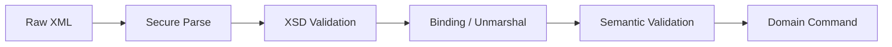
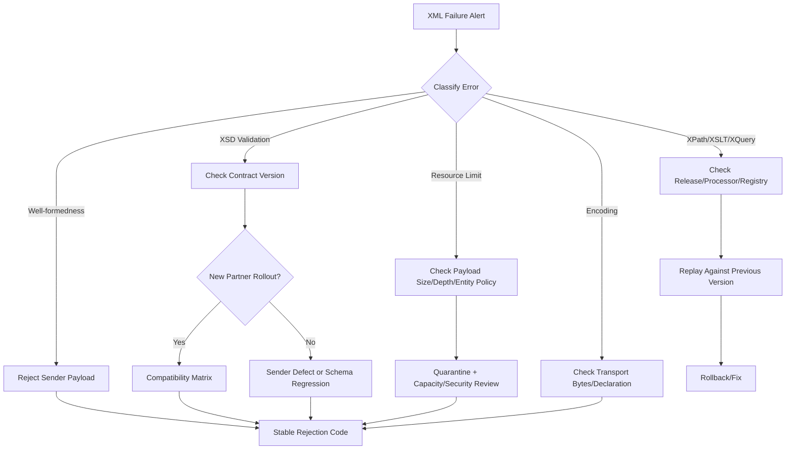
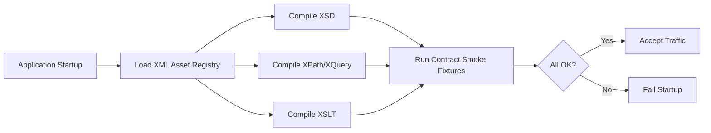

# Part 023 — XML Error Handling, Diagnostics, and Debugging

> Goal: mampu mendiagnosis kegagalan XML secara cepat, presisi, aman, dan audit-friendly: dari parse error, validation error, namespace bug, XPath mismatch, XSLT failure, sampai incident production dengan payload besar dan partner integration.

XML debugging sering terlihat sederhana:

```text
Parse failed at line 42.
```

Tapi di production, pesan itu jarang cukup. Kita perlu tahu:

- dokumen mana yang gagal;
- versi contract mana yang dipakai;
- parser/processor apa yang menjalankan;
- source URI/schema URI/stylesheet URI apa yang terlibat;
- line/column mana yang gagal;
- XPath lokasi logical mana yang gagal;
- apakah error berasal dari well-formedness, XSD, semantic rule, XPath, XSLT, XQuery, binding, atau serialization;
- apakah payload boleh dilihat/logged;
- apakah retry masuk akal;
- apakah failure disebabkan input, dependency, code regression, schema rollout, atau environment.

Mental model:

```text
XML failure = contract boundary violation + processing context + observable evidence.
```

Top-tier engineer tidak hanya menangkap exception. Mereka membangun diagnostic surface.

---

## 1. Error Taxonomy

Jangan mencampur semua kegagalan menjadi `XML_ERROR`. Itu membuat incident response lambat.

| Category | Contoh | Retry? | Owner Umum |
|---|---|---:|---|
| Transport/read error | file truncated, stream closed, decompression failed | mungkin | platform/integration |
| Encoding error | declared UTF-8 tapi byte bukan UTF-8 | tidak, kecuali source resend | sender/integration |
| Well-formedness error | tag tidak tertutup, illegal char, duplicate attr | tidak | sender |
| Namespace error | XPath tidak match, XSD element unknown | tidak | sender/schema governance |
| XSD validation error | missing required element, invalid enum, invalid decimal | tidak | sender/contract |
| Semantic validation error | date range invalid, state transition illegal | tidak | business/application |
| XPath evaluation error | invalid expression, missing namespace binding | tidak | application |
| XSLT compile error | broken stylesheet | tidak | application/release |
| XSLT runtime error | missing param, failed URI resolution | tergantung | application/environment |
| XQuery compile/runtime error | bad query/module/resource | tergantung | application/data platform |
| Binding error | object mapping mismatch, nil/empty ambiguity | tidak | application/contract |
| Serialization error | invalid output char, wrong namespace/prefix | tidak | application |
| Security rejection | DTD/external entity/resource blocked | tidak | sender/security policy |
| Resource limit | entity expansion, max element depth, timeout, max bytes | mungkin | sender/platform |

Operational rule:

```text
Classify first, then decide retry, quarantine, reject, escalate, or replay.
```

---

## 2. Diagnostic Context as a First-Class Object

A production XML pipeline needs a durable context object that moves through parse, validate, transform, and persist.

```java
public record XmlDiagnosticContext(
        String correlationId,
        String documentId,
        String sourceSystem,
        String partnerId,
        String contractName,
        String contractVersion,
        String parserKind,
        String processorName,
        String schemaSetId,
        String stylesheetId,
        boolean payloadLoggingAllowed
) {}
```

Never rely only on exception text. Exception text is unstable and often not enough for audit.

Better failure model:

```java
public record XmlDiagnosticEvent(
        String severity,
        String category,
        String code,
        String message,
        String publicMessage,
        String systemId,
        Integer line,
        Integer column,
        String xpathHint,
        String contractPath,
        String processor,
        String correlationId
) {}
```

Separate:

```text
message        = internal technical explanation
publicMessage  = safe message for sender/client
```

This matters because XML error messages can accidentally include payload snippets with PII or confidential fields.

---

## 3. Error Location: Physical vs Logical

XML processors usually report physical location:

```text
systemId: partner-a/order-20260702.xml
line: 187
column: 33
```

Engineers often want logical location:

```text
/envelope/body/order/items/item[17]/quantity
```

They are different.

| Location Type | Good For | Weakness |
|---|---|---|
| line/column | editor/debugging/raw payload | unstable after formatting/canonicalization |
| systemId/publicId | source resolution and schema include/import | often missing unless configured |
| XPath-like path | contract/business diagnostics | must be constructed by parser or post-processor |
| schema component | XSD design debugging | not always exposed by JAXP implementation |
| transformation stack | XSLT/XQuery failure triage | processor-specific |

Use both when possible.

```text
Physical location tells where bytes failed.
Logical location tells what contract field failed.
```

---

## 4. SAXParseException: Parse and Validation Diagnostics

DOM/SAX/XSD validation failures often surface as `SAXParseException`.

A useful collector:

```java
import org.xml.sax.ErrorHandler;
import org.xml.sax.SAXException;
import org.xml.sax.SAXParseException;

import java.util.ArrayList;
import java.util.List;

public final class CollectingSaxErrorHandler implements ErrorHandler {
    private final String correlationId;
    private final List<XmlDiagnosticEvent> events = new ArrayList<>();

    public CollectingSaxErrorHandler(String correlationId) {
        this.correlationId = correlationId;
    }

    @Override
    public void warning(SAXParseException e) {
        events.add(toEvent("WARN", "XML_WARNING", e));
    }

    @Override
    public void error(SAXParseException e) {
        events.add(toEvent("ERROR", "XML_VALIDATION_ERROR", e));
    }

    @Override
    public void fatalError(SAXParseException e) throws SAXException {
        events.add(toEvent("FATAL", "XML_FATAL_PARSE_ERROR", e));
        throw e; // do not continue after fatal well-formedness errors
    }

    public List<XmlDiagnosticEvent> events() {
        return List.copyOf(events);
    }

    private XmlDiagnosticEvent toEvent(String severity, String category, SAXParseException e) {
        return new XmlDiagnosticEvent(
                severity,
                category,
                "XML-" + severity,
                e.getMessage(),
                "XML document is not accepted by the configured contract.",
                e.getSystemId(),
                e.getLineNumber() > 0 ? e.getLineNumber() : null,
                e.getColumnNumber() > 0 ? e.getColumnNumber() : null,
                null,
                null,
                "JAXP/SAX",
                correlationId
        );
    }
}
```

Important nuance:

```text
warning/error/fatalError are processor callbacks, not automatically your business severity model.
```

For production, decide explicitly:

- Do warnings fail the document?
- Are validation errors aggregated or fail-fast?
- How many validation events are enough before stopping?
- Are all messages safe to return to sender?
- Are line/column values reliable for the input source type?

---

## 5. StAX Diagnostics

StAX failures commonly surface as `XMLStreamException` with a `Location`.

```java
import javax.xml.stream.Location;
import javax.xml.stream.XMLStreamException;

public final class StaxDiagnostics {
    public static XmlDiagnosticEvent from(String correlationId, XMLStreamException e) {
        Location location = e.getLocation();

        return new XmlDiagnosticEvent(
                "FATAL",
                "XML_STREAM_PARSE_ERROR",
                "XML-STAX-001",
                e.getMessage(),
                "XML stream could not be parsed.",
                location != null ? location.getSystemId() : null,
                location != null && location.getLineNumber() > 0 ? location.getLineNumber() : null,
                location != null && location.getColumnNumber() > 0 ? location.getColumnNumber() : null,
                null,
                null,
                "JAXP/StAX",
                correlationId
        );
    }
}
```

Do not assume all location fields exist. Some parsers may provide only line numbers, or no system ID.

StAX debugging checklist:

- Was the factory namespace-aware?
- Was DTD/entity support intentionally disabled?
- Did `next()` advance past the expected event?
- Did `getElementText()` consume the end element unexpectedly?
- Are you comparing local name without namespace URI?
- Did `characters()` style logic incorrectly assume a single text event? In StAX, text can also be split depending on parser and coalescing configuration.
- Did you close the `InputStream` or `XMLStreamReader` at the right boundary?

---

## 6. DOM Diagnostics

DOM errors are tricky because after parsing, much context is gone. DOM gives convenient navigation, but it does not automatically preserve all source line information.

Common DOM debugging failures:

| Symptom | Likely Cause |
|---|---|
| `getElementsByTagName("Order")` returns nothing | document uses namespace |
| XPath works in online tester but not Java | missing `NamespaceContext` |
| Output has random prefixes | serializer/provider chose generated prefixes |
| Text has unexpected whitespace | formatting whitespace is present as text nodes |
| Mutation creates invalid XML | DOM mutation bypasses schema semantics |
| Signature/canonical comparison fails | serialization changed whitespace/prefix/declaration |

Namespace-safe DOM helper:

```java
import org.w3c.dom.Element;
import org.w3c.dom.Node;
import org.w3c.dom.NodeList;

import java.util.Optional;

public final class DomFind {
    private DomFind() {}

    public static Optional<Element> firstChildElement(
            Element parent,
            String namespaceUri,
            String localName
    ) {
        NodeList children = parent.getChildNodes();
        for (int i = 0; i < children.getLength(); i++) {
            Node node = children.item(i);
            if (node instanceof Element element
                    && namespaceUri.equals(element.getNamespaceURI())
                    && localName.equals(element.getLocalName())) {
                return Optional.of(element);
            }
        }
        return Optional.empty();
    }
}
```

Do not debug namespace XML with raw tag names.

```text
Wrong: element.getTagName().equals("Order")
Right: namespaceUri + localName
```

---

## 7. Namespace Debugging Playbook

Most “XML is broken” incidents are actually namespace incidents.

Example:

```xml
<Order xmlns="urn:acme:order:v1">
  <Id>O-100</Id>
</Order>
```

This XPath does **not** match:

```xpath
/Order/Id
```

Because `Order` and `Id` are in namespace `urn:acme:order:v1`.

Correct approach:

```xpath
/o:Order/o:Id
```

with prefix binding:

```java
import javax.xml.XMLConstants;
import javax.xml.namespace.NamespaceContext;
import java.util.Iterator;
import java.util.Map;

public final class MapNamespaceContext implements NamespaceContext {
    private final Map<String, String> prefixToUri;

    public MapNamespaceContext(Map<String, String> prefixToUri) {
        this.prefixToUri = Map.copyOf(prefixToUri);
    }

    @Override
    public String getNamespaceURI(String prefix) {
        if (prefix == null) {
            throw new IllegalArgumentException("prefix must not be null");
        }
        return prefixToUri.getOrDefault(prefix, XMLConstants.NULL_NS_URI);
    }

    @Override
    public String getPrefix(String namespaceURI) {
        return prefixToUri.entrySet().stream()
                .filter(e -> e.getValue().equals(namespaceURI))
                .map(Map.Entry::getKey)
                .findFirst()
                .orElse(null);
    }

    @Override
    public Iterator<String> getPrefixes(String namespaceURI) {
        return prefixToUri.entrySet().stream()
                .filter(e -> e.getValue().equals(namespaceURI))
                .map(Map.Entry::getKey)
                .iterator();
    }
}
```

Namespace triage:

```text
1. Print root namespace URI and local name.
2. Print every declared namespace on root/envelope/body.
3. Verify XPath uses prefixes, not default namespace assumptions.
4. Verify XSD targetNamespace and elementFormDefault.
5. Verify payload namespace version matches selected schema version.
6. Verify transformation did not strip namespace declarations.
7. Verify output prefixes are irrelevant unless downstream incorrectly depends on prefix text.
```

Remember:

```text
Prefix is syntax. Namespace URI is identity.
```

---

## 8. XSD Validation Diagnostics

JAXP validation can tell you that a document does not match XSD, but production systems need richer evidence.

Minimal validation boundary:

```java
import org.xml.sax.SAXException;

import javax.xml.XMLConstants;
import javax.xml.transform.stream.StreamSource;
import javax.xml.validation.Schema;
import javax.xml.validation.SchemaFactory;
import javax.xml.validation.Validator;
import java.io.IOException;
import java.io.InputStream;

public final class XmlContractValidator {
    private final Schema schema;

    public XmlContractValidator(Schema schema) {
        this.schema = schema;
    }

    public ValidationReport validate(InputStream xml, XmlDiagnosticContext context)
            throws IOException {
        Validator validator = schema.newValidator();
        CollectingSaxErrorHandler handler = new CollectingSaxErrorHandler(context.correlationId());
        validator.setErrorHandler(handler);

        try {
            validator.validate(new StreamSource(xml));
            return ValidationReport.accepted(handler.events());
        } catch (SAXException e) {
            return ValidationReport.rejected(handler.events(), e.getMessage());
        }
    }
}
```

Production improvements:

- compile `Schema` once per schema bundle version;
- create `Validator` per validation run;
- attach `ErrorHandler` per document;
- set a secure `LSResourceResolver`;
- record schema bundle ID, not only schema filename;
- store normalized validation report;
- limit maximum validation errors collected;
- distinguish XSD rejection from semantic rejection.

Example report:

```java
import java.util.List;

public record ValidationReport(
        boolean accepted,
        List<XmlDiagnosticEvent> events,
        String terminalMessage
) {
    public static ValidationReport accepted(List<XmlDiagnosticEvent> events) {
        return new ValidationReport(true, List.copyOf(events), null);
    }

    public static ValidationReport rejected(List<XmlDiagnosticEvent> events, String terminalMessage) {
        return new ValidationReport(false, List.copyOf(events), terminalMessage);
    }
}
```

---

## 9. Validation Error Message Normalization

Raw parser messages differ across implementations and JDK versions. Do not build business behavior from exact text.

Bad pattern:

```java
if (exception.getMessage().contains("cvc-enumeration-valid")) {
    return "INVALID_STATUS";
}
```

Better pattern:

```text
Raw message -> diagnostic event -> stable application code -> public rejection reason
```

Example mapping:

| Raw Category | Stable Code | Public Message |
|---|---|---|
| Missing required element | `XML_CONTRACT_MISSING_FIELD` | Required XML field is missing. |
| Invalid enum | `XML_CONTRACT_INVALID_CODE` | XML field contains unsupported code value. |
| Invalid decimal | `XML_CONTRACT_INVALID_NUMBER` | XML numeric field has invalid format or precision. |
| Unexpected element | `XML_CONTRACT_UNEXPECTED_FIELD` | XML contains a field not allowed by this contract version. |
| Namespace mismatch | `XML_CONTRACT_NAMESPACE_MISMATCH` | XML namespace does not match selected contract version. |

Keep raw message for internal diagnostics; expose stable code externally.

---

## 10. XPath Diagnostics

XPath failures are usually one of five things:

1. wrong context node;
2. missing namespace binding;
3. expression assumes one match but gets zero/many;
4. type conversion issue;
5. XPath injection or unsafe dynamic expression.

Production XPath wrapper:

```java
import org.w3c.dom.Node;
import org.w3c.dom.NodeList;

import javax.xml.namespace.QName;
import javax.xml.xpath.XPath;
import javax.xml.xpath.XPathExpression;
import javax.xml.xpath.XPathExpressionException;
import javax.xml.xpath.XPathFactory;
import javax.xml.xpath.XPathConstants;
import java.util.Optional;

public final class SafeXPath {
    private final XPath xpath;

    public SafeXPath(MapNamespaceContext namespaceContext) {
        this.xpath = XPathFactory.newInstance().newXPath();
        this.xpath.setNamespaceContext(namespaceContext);
    }

    public Optional<String> optionalString(Node contextNode, String expression) {
        try {
            XPathExpression compiled = xpath.compile(expression);
            String value = (String) compiled.evaluate(contextNode, XPathConstants.STRING);
            return value == null || value.isBlank() ? Optional.empty() : Optional.of(value);
        } catch (XPathExpressionException e) {
            throw new XmlQueryException("Invalid XPath expression: " + expression, e);
        }
    }

    public NodeList nodes(Node contextNode, String expression) {
        try {
            XPathExpression compiled = xpath.compile(expression);
            return (NodeList) compiled.evaluate(contextNode, XPathConstants.NODESET);
        } catch (XPathExpressionException e) {
            throw new XmlQueryException("Invalid XPath expression: " + expression, e);
        }
    }
}
```

Avoid building XPath expressions from untrusted values:

```java
// Bad: dynamic value changes expression structure
String xpath = "//order[id='" + userInput + "']";
```

For JDK XPath 1.0, no standard variable binding is available through the simple helper unless you implement `XPathVariableResolver`. Prefer compiled, named expressions from a registry.

```text
XPath registry > ad-hoc string expressions scattered across code.
```

---

## 11. XSLT Diagnostics

XSLT has two failure phases:

```text
compile stylesheet -> run transformation
```

These must be diagnosed separately.

| Phase | Common Failure |
|---|---|
| Compile | syntax error, missing import/include, unsupported XSLT version, static type error |
| Runtime | missing parameter, bad source document, failed document() lookup, template logic error, invalid output |

JAXP `ErrorListener`:

```java
import javax.xml.transform.ErrorListener;
import javax.xml.transform.TransformerException;
import java.util.ArrayList;
import java.util.List;

public final class CollectingTransformErrorListener implements ErrorListener {
    private final String correlationId;
    private final List<XmlDiagnosticEvent> events = new ArrayList<>();

    public CollectingTransformErrorListener(String correlationId) {
        this.correlationId = correlationId;
    }

    @Override
    public void warning(TransformerException exception) {
        events.add(toEvent("WARN", "XSLT_WARNING", exception));
    }

    @Override
    public void error(TransformerException exception) throws TransformerException {
        events.add(toEvent("ERROR", "XSLT_ERROR", exception));
        throw exception;
    }

    @Override
    public void fatalError(TransformerException exception) throws TransformerException {
        events.add(toEvent("FATAL", "XSLT_FATAL_ERROR", exception));
        throw exception;
    }

    public List<XmlDiagnosticEvent> events() {
        return List.copyOf(events);
    }

    private XmlDiagnosticEvent toEvent(String severity, String category, TransformerException e) {
        var locator = e.getLocator();
        return new XmlDiagnosticEvent(
                severity,
                category,
                "XML-XSLT-" + severity,
                e.getMessage(),
                "XML transformation failed.",
                locator != null ? locator.getSystemId() : null,
                locator != null && locator.getLineNumber() > 0 ? locator.getLineNumber() : null,
                locator != null && locator.getColumnNumber() > 0 ? locator.getColumnNumber() : null,
                null,
                null,
                "JAXP/XSLT",
                correlationId
        );
    }
}
```

Production XSLT diagnostics should record:

- stylesheet ID/version/checksum;
- processor name/version;
- input contract version;
- parameters passed;
- `URIResolver` policy decisions;
- compile-time diagnostics;
- runtime diagnostics;
- output validation result;
- transformation duration;
- output size.

---

## 12. Saxon Diagnostics

For Saxon XPath/XQuery/XSLT, keep processor-specific diagnostics without leaking them into your public API.

Recommended model:

```text
Saxon exception -> internal diagnostic -> stable error code -> public rejection/incident event
```

Capture:

- static error vs dynamic error;
- query/stylesheet module URI;
- line/column if available;
- error code/QName if available;
- source document ID;
- external variables;
- Saxon edition/version;
- feature flags such as streaming/schema-awareness if relevant.

Do not create vendor lock-in at the domain layer:

```text
Domain service should know TRANSFORMATION_FAILED.
Diagnostic service may know Saxon error code.
```

---

## 13. Binding Diagnostics

XML binding errors are deceptive because they often look like Java object errors.

Common cases:

| Symptom | Likely Contract Bug |
|---|---|
| Java field is `null` | element missing, namespace mismatch, wrong accessor, adapter issue |
| empty string becomes `null` | adapter/conversion policy |
| enum fails | unknown code or version mismatch |
| date parsing fails | timezone/lexical format mismatch |
| decimal changes scale | `BigDecimal` conversion/serialization policy |
| unknown element ignored | lax binding or compatibility setting |

Debugging rule:

```text
When binding fails, inspect XML contract first, object model second.
```

A good binding pipeline validates before binding:



If binding is the first stage, you often lose precise contract diagnostics.

---

## 14. Encoding and Character Diagnostics

Encoding bugs are expensive because the XML may look correct after being copied through tools.

Checklist:

- Are bytes decoded according to XML declaration?
- Is input stream already decoded into a `Reader` with the wrong charset?
- Did upstream send UTF-8 with BOM?
- Did a file transfer system convert line endings or charset?
- Are invalid control characters present?
- Is output declaration consistent with actual bytes?
- Are logs displaying replacement characters `�`?

Prefer byte-level evidence for encoding incidents:

```text
documentId
sourceSystem
declaredEncoding
transportContentType
firstBytesHex
parseErrorLineColumn
```

Do not log full payload by default.

---

## 15. Payload Evidence Without Leaking Sensitive Data

XML payloads often contain PII, financial data, health data, legal text, credentials, or partner confidential data.

Evidence strategy:

| Evidence | Safe? | Use |
|---|---:|---|
| payload SHA-256 hash | usually yes | dedup/replay correlation |
| payload size | yes | resource triage |
| root QName | yes | contract detection |
| schema bundle ID | yes | validation context |
| line/column | yes | debugging |
| small redacted snippet | conditional | engineering triage |
| full payload in logs | usually no | avoid |
| encrypted quarantine artifact | yes with controls | replay/debug |

Redacted snippet model:

```java
public record PayloadEvidence(
        String sha256,
        long byteSize,
        String rootNamespace,
        String rootLocalName,
        String redactedSnippet,
        boolean fullPayloadStoredInQuarantine
) {}
```

Production rule:

```text
Logs are not archives. Archives need access control, retention, encryption, and audit.
```

---

## 16. Incident Triage Flow

Use a deterministic triage workflow.



Questions to answer in first 10 minutes of incident:

1. Is the failure isolated to one partner/source system?
2. Did schema/stylesheet/query/config change recently?
3. Did payload size/distribution change?
4. Is the root namespace different from expected?
5. Is this input rejection or application bug?
6. Are retries making things worse?
7. Can we replay from quarantine safely?
8. Is there a regulatory/audit reporting deadline affected?

---

## 17. Metrics for XML Diagnostics

Expose metrics that show contract health, not just system health.

Recommended metrics:

```text
xml.documents.received.count
xml.documents.accepted.count
xml.documents.rejected.count
xml.parse.error.count
xml.validation.error.count
xml.transformation.error.count
xml.security.rejection.count
xml.resource.limit.rejection.count
xml.processing.duration.ms
xml.validation.duration.ms
xml.transformation.duration.ms
xml.payload.size.bytes
xml.validation.errors.per.document
xml.replay.count
xml.quarantine.count
```

Useful dimensions:

- source system;
- partner ID;
- contract name;
- contract version;
- schema bundle ID;
- stylesheet/query ID;
- parser kind;
- processor name/version;
- rejection code.

Avoid high-cardinality dimensions:

- raw document ID in metrics;
- raw XPath from dynamic expressions;
- raw exception message;
- raw filename if unbounded.

Use logs/traces for high-cardinality details.

---

## 18. Structured Logging

Bad log:

```text
Failed to parse XML: cvc-complex-type.2.4.a: Invalid content was found...
```

Better log:

```json
{
  "event": "xml.validation.rejected",
  "correlationId": "corr-20260702-001",
  "documentId": "doc-123",
  "sourceSystem": "partner-a",
  "contractName": "order-ingest",
  "contractVersion": "v3",
  "schemaBundleId": "order-schema-3.4.1",
  "code": "XML_CONTRACT_UNEXPECTED_FIELD",
  "line": 187,
  "column": 33,
  "rootQName": "{urn:acme:order:v3}Order",
  "payloadSha256": "...",
  "payloadSizeBytes": 81142,
  "fullPayloadLogged": false
}
```

Logging rule:

```text
Make logs searchable by operational dimensions and safe by default.
```

---

## 19. Debugging Large XML Files

Large XML files change the debugging strategy.

Do not load a 2 GB file into DOM just to inspect one error.

Use:

- streaming parser with line/column;
- `grep`/split only when encoding-safe;
- quarantined byte artifact;
- bounded snippet extraction around physical location;
- streaming root/header extraction;
- schema validation in streaming mode;
- partial replay by envelope/item boundary when contract allows.

Bounded snippet extraction should be careful: line numbers are after decoding and XML normalization rules may make byte offsets non-trivial. For precise evidence, store both source bytes and parser line/column.

---

## 20. Debugging Namespace Mismatch in 5 Minutes

Reusable checklist:

```text
1. Capture root namespace URI + local name.
2. Capture selected schema target namespace.
3. Capture contract version selection rule.
4. Evaluate XPath local-name() only as temporary debugging tool.
5. Fix namespace binding, not expression by stripping namespaces.
6. Validate after transform to detect namespace loss.
7. Add regression fixture with actual partner payload.
```

Temporary debug XPath:

```xpath
/*[local-name()='Order']/*[local-name()='Id']
```

Do not ship this as normal production logic unless you intentionally accept namespace-agnostic XML. Namespace-agnostic matching can accept the wrong contract.

---

## 21. Debugging XSLT Output Differences

When output differs from expected golden file, classify the diff:

| Diff Type | Meaning |
|---|---|
| whitespace only | serializer/config/canonicalization issue |
| prefix difference only | usually logically equivalent XML |
| namespace URI difference | contract-breaking issue |
| element order difference | may be contract-breaking under XSD sequence |
| missing element | template match/context issue |
| duplicated element | template recursion/apply-templates issue |
| text escaped differently | serialization/output method issue |
| decimal/date lexical change | formatting policy issue |

Use XML-aware comparison for logical equality and canonical byte comparison only when byte stability is part of the contract.

---

## 22. Reproducible Debug Bundle

For serious production incidents, create a debug bundle.

```text
/debug-bundle
  metadata.json
  input.xml.enc
  input.sha256
  schema-bundle/
  stylesheet-bundle/
  query-bundle/
  processor-version.txt
  validation-report.json
  transform-report.json
  output.xml.enc
  environment.txt
```

`metadata.json` should include:

```json
{
  "correlationId": "corr-20260702-001",
  "documentId": "doc-123",
  "sourceSystem": "partner-a",
  "contractName": "order-ingest",
  "contractVersion": "v3",
  "schemaBundleId": "order-schema-3.4.1",
  "stylesheetId": "order-canonicalizer-2.1.0",
  "processor": "Saxon-HE",
  "javaVersion": "25",
  "timestamp": "2026-07-02T10:15:30Z"
}
```

Reproducibility rule:

```text
If you cannot replay the failure, you do not fully understand the failure.
```

---

## 23. Test Strategy for Diagnostics

Diagnostics need tests. Otherwise error handling quietly degrades.

Test fixtures:

| Fixture | Expected Diagnostic |
|---|---|
| malformed XML | fatal parse error with line/column |
| wrong namespace | namespace mismatch rejection |
| missing required element | stable missing-field code |
| invalid enum | stable invalid-code code |
| too-large payload | resource limit/security rejection |
| DTD/external entity | security rejection |
| broken stylesheet | compile-time transformation error |
| missing XSLT param | runtime transformation error |
| bad XPath | expression registry startup failure |
| invalid output | output validation rejection |

Diagnostic tests should assert stable fields:

- category;
- code;
- severity;
- contract version;
- presence of line/column when expected;
- no raw PII in public message;
- no full payload in logs.

Do not assert exact vendor exception message unless you pin the provider and accept brittle tests.

---

## 24. Startup Validation for XML Runtime

Catch broken XML assets before traffic.

At startup:

- compile all schemas;
- resolve all schema imports/includes from controlled catalog;
- compile all XSLT stylesheets;
- compile all XPath/XQuery expressions;
- validate test fixtures for each contract version;
- run minimal transform smoke tests;
- verify external resource access policy;
- publish runtime asset versions.

Startup failure is better than hidden runtime failure.



---

## 25. Practical Debugging Commands

These are not replacements for production diagnostics, but useful during local triage.

Check well-formedness with a known XML-aware tool:

```bash
xmllint --noout input.xml
```

Validate against XSD:

```bash
xmllint --noout --schema order.xsd input.xml
```

Pretty print carefully:

```bash
xmllint --format input.xml > formatted.xml
```

Warning: formatting changes whitespace and byte layout. Do not use formatted output as forensic evidence unless you explicitly label it as derived.

For Java-based replay, prefer a small deterministic CLI in the codebase:

```bash
java -jar xml-replay.jar \
  --input input.xml \
  --contract order-ingest:v3 \
  --schema-bundle order-schema-3.4.1 \
  --stylesheet order-canonicalizer-2.1.0
```

The replay tool should use the same parser configuration as production.

---

## 26. Common Anti-Patterns

| Anti-Pattern | Consequence |
|---|---|
| Catch `Exception` and return `INVALID_XML` | no triage signal |
| Log full payload on error | data leakage |
| Strip namespaces to “fix” XPath | contract ambiguity/security risk |
| Parse with DOM just for diagnostics | memory blow-up |
| Depend on exact parser message text | brittle across JDK/provider changes |
| Retry validation errors | load amplification |
| Ignore transformation warnings | silent output defects |
| Treat binding `null` as business default | hidden contract mismatch |
| No replay/quarantine | incident cannot be reproduced |
| No schema/stylesheet version in logs | impossible rollout debugging |

---

## 27. Production Diagnostic Checklist

Before calling an XML pipeline production-grade, verify:

- [ ] all parser/validator/transformer failures are classified;
- [ ] diagnostics include correlation ID and document ID;
- [ ] diagnostics include contract/schema/stylesheet/query version;
- [ ] parse errors include line/column when available;
- [ ] validation errors map to stable rejection codes;
- [ ] public error messages are PII-safe;
- [ ] full payload is never logged by default;
- [ ] quarantine storage is encrypted/access-controlled;
- [ ] namespace mismatches have explicit detection;
- [ ] XSLT/XQuery compile errors fail startup;
- [ ] runtime transformation errors are observable;
- [ ] metrics separate parse, validation, transformation, security, and resource-limit failures;
- [ ] replay uses the same runtime configuration as production;
- [ ] diagnostics have regression tests.

---

## 28. Kaufman Practice Loop

Use the next 20–40 minutes to build diagnostic reflexes.

### Drill 1 — Malformed XML

Create an XML file with an unclosed tag. Parse with SAX/StAX. Capture line/column and stable diagnostic code.

### Drill 2 — Namespace Bug

Create a valid namespaced XML. Write a broken XPath without namespace binding. Fix it using `NamespaceContext`.

### Drill 3 — XSD Rejection

Create three invalid documents:

- missing required element;
- invalid enum;
- unexpected element.

Map each to stable application codes.

### Drill 4 — XSLT Compile vs Runtime

Break a stylesheet syntax. Then create a runtime failure with a missing required parameter. Ensure diagnostics distinguish compile-time from runtime.

### Drill 5 — Safe Evidence

Create a rejection report that includes hash, size, root QName, line/column, and redacted snippet, but no full payload.

---

## 29. Mental Model Summary

```text
XML debugging is not about reading stack traces.
It is about preserving enough contract evidence to classify, reproduce, fix, and defend the processing decision.
```

The strongest XML engineers can answer:

- Is this XML not well-formed, not valid, or semantically unacceptable?
- Is the failure caused by input, schema, stylesheet, query, code, environment, or resource limits?
- Can we replay the failure exactly?
- Can we explain the rejection to a partner without leaking sensitive data?
- Can we prove which contract version accepted or rejected the document?

That is the standard for production-grade XML diagnostics.

---

## References

- Oracle Java API: `SAXParseException`, `ErrorHandler`, `javax.xml.stream.Location`, `XMLStreamException`, `ErrorListener`, `TransformerException`.
- Oracle JAXP Security Guide: secure processing, external access restrictions, and processing limits.
- W3C XML, XML Namespaces, XSD, XPath, XQuery, and XSLT specifications.
- Saxon documentation for s9api diagnostics and compiled XPath/XQuery/XSLT workflows.
