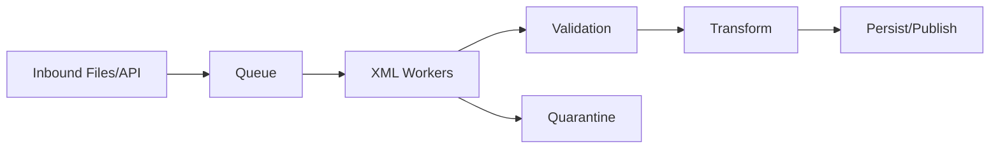
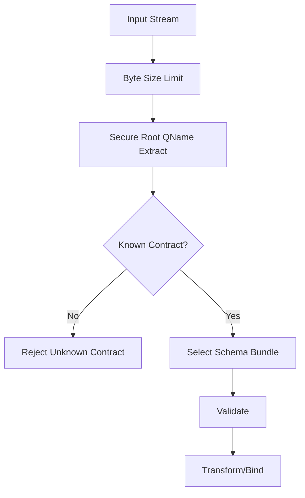
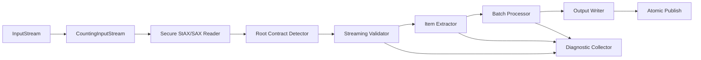

# Part 024 — Performance, Memory, and Throughput Engineering

> Goal: mampu merancang dan men-tune XML processing pipeline Java agar stabil di payload besar, throughput tinggi, transform kompleks, dan production traffic tanpa mengorbankan correctness, security, atau auditability.

XML performance bukan hanya “parser mana paling cepat”. Pertanyaan yang benar:

```text
What is the cheapest correct processing model for this contract and workload?
```

Ada pipeline XML yang butuh DOM karena dokumen kecil dan perlu mutation. Ada pipeline yang harus streaming karena file bisa ratusan MB/GB. Ada transform yang bottleneck-nya bukan parser, melainkan stylesheet, schema validation, XPath repeated evaluation, I/O, allocation, logging, atau output serialization.

Mental model:

```text
XML throughput = input bytes + parse model + validation strategy + query/transform cost + allocation + I/O + concurrency control + failure handling.
```

---

## 1. Performance Workload Taxonomy

Mulai dari workload, bukan API.

| Workload | Example | Recommended Starting Point |
|---|---|---|
| small config XML | app config, rule config | DOM/XPath with startup validation |
| small request XML | SOAP-ish request, partner API | DOM or binding after validation |
| large batch XML | daily regulatory/reporting file | StAX/SAX streaming |
| XML-to-XML mapping | partner canonicalization | XSLT with compiled stylesheet cache |
| XML query/report | querying many XML docs | XQuery/XML DB or indexed store |
| partial extraction | header/routing/metadata only | StAX/SAX |
| enrich and route | validate + lookup + transform | streaming pipeline + bounded enrichment |
| audit replay | deterministic reprocess | same production runtime + asset versions |

Rule:

```text
The best parser is the one that exposes exactly the access pattern you need, no more.
```

---

## 2. Cost Model

XML processing cost comes from several layers.


Performance questions:

- How many bytes are read?
- Are bytes decompressed?
- Is input decoded once or multiple times?
- Is a full tree built?
- Is XSD validation run once or multiple times?
- Are XPath/XSLT/XQuery expressions compiled repeatedly?
- Are intermediate XML strings created?
- Are outputs validated?
- Is logging copying payloads?
- Are retries duplicating CPU work?
- Are failures as expensive as successful cases?

---

## 3. DOM Memory Model

DOM is convenient because it gives random access. It is expensive because it materializes the document tree.

Cost drivers:

- one object per element/attribute/text node;
- namespace metadata;
- character arrays/strings;
- parent/child/sibling references;
- whitespace nodes;
- mutation overhead;
- GC pressure.

Use DOM when:

- payload is small and bounded;
- random access is needed;
- mutation is required;
- XPath-heavy logic benefits from tree model;
- latency is more important than memory footprint;
- document count is low enough for heap.

Avoid DOM when:

- payload size is unbounded;
- only partial extraction is needed;
- processing many large documents concurrently;
- pipeline can be expressed as streaming events;
- memory spikes cause GC pauses.

Practical guard:

```java
public final class XmlSizeGuard {
    private final long maxBytes;

    public XmlSizeGuard(long maxBytes) {
        this.maxBytes = maxBytes;
    }

    public void check(long contentLength) {
        if (contentLength < 0) {
            throw new IllegalArgumentException("unknown XML size must use streaming path");
        }
        if (contentLength > maxBytes) {
            throw new IllegalArgumentException("XML payload exceeds DOM limit: " + contentLength);
        }
    }
}
```

Do not rely on heap OOM as your XML size policy.

---

## 4. SAX and StAX Throughput Model

SAX and StAX avoid building full trees. They are ideal for:

- large XML;
- partial extraction;
- streaming validation;
- item-by-item processing;
- low allocation pipelines;
- early rejection.

SAX is push-based:

```text
parser controls loop -> handler receives callbacks
```

StAX is pull-based:

```text
application controls loop -> parser exposes next event
```

Throughput rule:

```text
For operational systems, StAX is often easier to compose; SAX is often minimal and fast but state-machine heavy.
```

StAX skeleton with early stop:

```java
import javax.xml.stream.XMLInputFactory;
import javax.xml.stream.XMLStreamConstants;
import javax.xml.stream.XMLStreamReader;
import java.io.InputStream;

public final class HeaderExtractor {
    private final XMLInputFactory factory;

    public HeaderExtractor(XMLInputFactory factory) {
        this.factory = factory;
    }

    public String extractMessageId(InputStream input) throws Exception {
        XMLStreamReader reader = factory.createXMLStreamReader(input);
        try {
            while (reader.hasNext()) {
                int event = reader.next();
                if (event == XMLStreamConstants.START_ELEMENT
                        && "urn:acme:envelope:v1".equals(reader.getNamespaceURI())
                        && "MessageId".equals(reader.getLocalName())) {
                    return reader.getElementText();
                }
            }
            throw new IllegalArgumentException("MessageId not found");
        } finally {
            reader.close();
        }
    }
}
```

Early extraction matters. If you only need a routing key, do not parse the entire file.

---

## 5. Validation Performance

XSD validation cost depends on:

- schema complexity;
- number of imported/included schemas;
- identity constraints;
- regex facets;
- large enumerations;
- nested content models;
- payload size;
- parser implementation;
- resolver latency;
- whether schema is compiled once or repeatedly.

Production rules:

```text
Compile Schema once per schema bundle version.
Create Validator per document.
Never resolve XSD imports/includes over network during hot-path validation.
```

Schema cache sketch:

```java
import javax.xml.validation.Schema;
import java.util.Map;
import java.util.concurrent.ConcurrentHashMap;

public final class SchemaRegistry {
    private final Map<String, Schema> schemasByBundleId = new ConcurrentHashMap<>();

    public Schema get(String bundleId) {
        Schema schema = schemasByBundleId.get(bundleId);
        if (schema == null) {
            throw new IllegalArgumentException("Unknown schema bundle: " + bundleId);
        }
        return schema;
    }

    public void register(String bundleId, Schema schema) {
        Schema previous = schemasByBundleId.putIfAbsent(bundleId, schema);
        if (previous != null) {
            throw new IllegalStateException("Duplicate schema bundle: " + bundleId);
        }
    }
}
```

Validation path:

```java
Validator validator = schema.newValidator(); // per document/run
validator.setErrorHandler(errorHandler);
validator.validate(source);
```

Do not share `Validator` across threads.

---

## 6. XPath Performance

XPath performance anti-pattern:

```java
for (Item item : items) {
    XPath xpath = XPathFactory.newInstance().newXPath();
    String value = xpath.evaluate("/a:b/a:c", document);
}
```

Problems:

- factory creation repeated;
- namespace context repeated;
- expression parsing repeated;
- global search from root repeated;
- DOM traversal repeated;
- string conversion hides zero/many match problems.

Better:

```java
import javax.xml.xpath.XPathExpression;
import java.util.Map;
import java.util.concurrent.ConcurrentHashMap;

public final class XPathRegistry {
    private final Map<String, XPathExpression> expressions = new ConcurrentHashMap<>();

    public XPathExpression get(String id) {
        XPathExpression expression = expressions.get(id);
        if (expression == null) {
            throw new IllegalArgumentException("Unknown XPath expression: " + id);
        }
        return expression;
    }

    public void register(String id, XPathExpression expression) {
        expressions.put(id, expression);
    }
}
```

Caution: thread-safety of compiled XPath expression can depend on implementation. For portable code, either evaluate with synchronization, per-thread compiled expressions, or use a processor API with documented concurrency semantics. Measure rather than assume.

XPath tuning:

- compile expressions at startup;
- bind namespaces once;
- avoid `//` on large documents unless necessary;
- evaluate relative XPath from known context nodes;
- avoid repeated root scans inside loops;
- use StAX/SAX extraction for simple large-file fields;
- use Saxon/XDM when XPath 2.0/3.1 features reduce code complexity.

---

## 7. XSLT Performance

XSLT cost has two phases:

```text
compile stylesheet -> execute transformation
```

Never compile stylesheet per request unless you are intentionally running dynamic user-provided stylesheets, which is usually not acceptable in secure production systems.

JAXP pattern:

```java
import javax.xml.transform.Templates;
import javax.xml.transform.Transformer;

public final class XsltRuntime {
    private final Templates templates;

    public XsltRuntime(Templates templates) {
        this.templates = templates;
    }

    public void transform(SourceFactory sourceFactory, ResultFactory resultFactory) throws Exception {
        Transformer transformer = templates.newTransformer(); // per run
        transformer.transform(sourceFactory.source(), resultFactory.result());
    }
}
```

Rules:

- cache `Templates`, not `Transformer`;
- create transformer per run;
- set parameters per run;
- avoid global mutable extension functions;
- avoid network `document()` lookups;
- validate output only when contract requires it, but do it deterministically;
- benchmark with realistic stylesheet and payloads.

XSLT performance anti-patterns:

| Anti-Pattern | Effect |
|---|---|
| compile stylesheet per request | high CPU + latency |
| huge intermediate result tree | memory blow-up |
| repeated `//` in templates | expensive traversal |
| unbounded `document()` calls | latency/security risk |
| overuse of extension functions | hidden imperative bottleneck |
| output as string then parse again | duplicate memory/CPU |

---

## 8. Saxon/XDM Performance

Saxon can improve expressiveness and sometimes performance, but it does not remove cost physics.

Use compiled artifacts:

```text
XPathCompiler -> XPathExecutable -> XPathSelector per run
XQueryCompiler -> XQueryExecutable -> XQueryEvaluator per run
XsltCompiler  -> XsltExecutable  -> Xslt30Transformer per run
```

General pattern:

```text
Processor/configuration: shared runtime object
Compiler: configure static context
Executable: compiled reusable artifact
Evaluator/Transformer/Selector: per execution dynamic context
```

Tuning points:

- compile at startup;
- reuse executable artifacts;
- avoid rebuilding XDM tree repeatedly;
- use document pools carefully only when lifecycle and memory are controlled;
- prefer streaming features only when stylesheet/query is streamable and processor edition supports it;
- keep external resource resolution local and deterministic;
- set clear limits for document size and transform duration.

---

## 9. I/O and Intermediate Representation

A common XML performance bug is unnecessary string materialization.

Bad pipeline:

```text
InputStream -> String -> DOM -> String -> XSLT -> String -> DOM -> String -> HTTP
```

Better pipeline:

```text
InputStream -> secure parse/validate -> transform Source -> Result OutputStream
```

Rules:

- keep bytes as streams when possible;
- avoid `String` for full XML documents;
- avoid `ByteArrayOutputStream` for huge output unless bounded;
- write to file/object storage atomically for batch output;
- use buffered I/O;
- avoid logging full payload or output;
- compress only when measured and beneficial;
- distinguish CPU bottleneck from I/O bottleneck.

---

## 10. Concurrency Model

XML APIs often have different thread-safety rules for factory, compiled artifact, and runtime evaluator.

Safe default:

```text
Immutable compiled artifacts may be shared if documented.
Mutable execution objects are per request/thread.
Factories are configured at startup and not mutated afterward; use per-thread/per-component if provider docs are unclear.
```

Operational matrix:

| Object | Sharing Strategy |
|---|---|
| `Schema` | share compiled schema per bundle version when provider supports documented behavior |
| `Validator` | create per validation run |
| `Templates` | share compiled stylesheet |
| `Transformer` | create per transformation run |
| `XPathFactory`/`XPath` | avoid shared mutable usage unless controlled |
| `XPathExpression` | verify provider thread-safety; otherwise per-thread/synchronized |
| `XMLStreamReader` | per input stream |
| `XMLStreamWriter` | per output stream |
| SAX handler | per parse run |
| DOM `Document` | request-scoped; do not mutate concurrently |
| Saxon executable | share if documented immutable/thread-safe |
| Saxon evaluator/selector/transformer | per execution unless docs say otherwise |

Concurrency failure symptoms:

- random validation errors;
- parameters bleeding between transformations;
- inconsistent output;
- incorrect namespace bindings;
- intermittent parser exceptions;
- memory leaks from thread-local caches;
- duplicate or missing diagnostic events.

---

## 11. Backpressure and Batching

Large XML processing often crosses messaging, file, database, and partner boundaries.

Throughput without backpressure becomes outage amplification.



Controls:

- bounded worker pool;
- bounded queue;
- max concurrent large files;
- separate pool for small vs large payloads;
- rate limit by partner/source;
- circuit breaker for downstream enrichment;
- batch commit size;
- output write throttling;
- quarantine rather than infinite retry.

Do not let one 2 GB XML file starve 10,000 small messages.

Workload separation:

```text
small-latency lane: request/response payloads
large-batch lane: files/reports/regulatory payloads
replay lane: controlled forensic reprocessing
```

---

## 12. Early Rejection

Reject as early as possible, but not earlier than correctness allows.

Early rejection gates:

```text
transport size -> media type -> first bytes -> root QName -> allowed namespace -> security policy -> schema validation -> semantic validation
```

Example root QName extraction before full validation:

```java
public record RootQName(String namespaceUri, String localName) {}
```

Use it to choose contract version, not to skip validation.



Early root detection can save CPU when traffic contains wrong payloads.

---

## 13. Security Limits Are Performance Controls Too

Security controls protect availability.

Key limits:

- maximum input bytes;
- maximum decompressed bytes;
- maximum element depth;
- maximum entity expansion;
- maximum number of attributes;
- maximum text node length;
- maximum transform duration;
- maximum output bytes;
- maximum validation errors collected;
- maximum replay concurrency.

JAXP has secure processing and processing-limit mechanisms, but do not rely only on parser limits. Add application-level limits at boundaries.

```text
Parser limits stop parser abuse.
Application limits stop workload abuse.
```

---

## 14. Payload Size Strategy

Define size classes.

| Class | Example Size | Strategy |
|---|---:|---|
| Tiny | < 32 KB | DOM/binding acceptable |
| Small | 32 KB–1 MB | DOM possible with guard; XSLT fine |
| Medium | 1–50 MB | streaming preferred; avoid repeated trees |
| Large | 50 MB–1 GB | streaming/batch lane; no DOM |
| Huge | > 1 GB | file pipeline, chunking, item boundary processing, strict backpressure |

These numbers are not universal. Tune based on heap, SLA, payload shape, concurrency, and GC behavior.

The important part is to define the classes explicitly.

---

## 15. Memory Budgeting

Capacity planning example:

```text
heap = 4 GB
large worker concurrency = 4
max per-worker live memory target = 512 MB
reserved for app/cache/GC headroom = 2 GB
```

If DOM expansion factor is unknown, you cannot safely allow large DOM parsing.

Safer policy:

```text
DOM lane accepts payload <= 1 MB.
Streaming lane handles payload > 1 MB.
Batch lane handles payload > 50 MB.
```

Memory budget checklist:

- max input size;
- max output size;
- max intermediate tree size;
- max concurrent workers;
- cache sizes for schema/stylesheet/query;
- diagnostic event cap;
- quarantine buffering policy;
- log event size cap;
- DB batch size;
- object storage upload strategy.

---

## 16. Caching Strategy

Cache things that are expensive and immutable.

Good cache candidates:

- compiled XSD `Schema` per schema bundle;
- compiled XSLT `Templates`/Saxon `XsltExecutable`;
- compiled XPath/XQuery expressions where thread-safety is controlled;
- namespace registry;
- contract metadata;
- small reference data used in transformation.

Bad cache candidates:

- raw unbounded XML documents;
- per-request `Transformer` with mutable parameters;
- `Validator` instances;
- DOM documents from live traffic;
- failed payloads in heap;
- huge generated output.

Cache key design:

```text
contractName + contractVersion + assetType + assetVersion + processorProfile
```

Include processor profile because XSLT/XQuery behavior can differ by processor/version/edition.

---

## 17. Benchmarking XML Processing

Do not benchmark toy XML and extrapolate.

Benchmark dimensions:

- payload size distribution;
- payload shape: shallow/wide vs deep/nested;
- namespace complexity;
- attribute count;
- text length;
- schema complexity;
- stylesheet complexity;
- valid vs invalid payload ratio;
- concurrency;
- cold startup vs warm cache;
- I/O source: memory/file/network/object storage;
- output sink;
- GC behavior.

Bad benchmark:

```text
Parse one 2 KB XML file 1 million times from a String.
```

Better benchmark matrix:

| Case | Payload | Operation | Expected Measurement |
|---|---|---|---|
| valid-small | 50 KB | validate + transform | p50/p95 latency |
| valid-medium | 10 MB | streaming extract + validate | throughput MB/s |
| invalid-early | 10 MB | root mismatch | early rejection latency |
| invalid-late | 10 MB | XSD error near end | worst-case rejection cost |
| transform-heavy | 1 MB | XSLT grouping | CPU allocation |
| large-output | 100 MB | stream write | output throughput |
| concurrency | mixed | worker pool | saturation point |

Measure failures too. Invalid XML can be more expensive than valid XML if diagnostics aggregate too much.

---

## 18. Profiling What Actually Hurts

Symptoms and likely causes:

| Symptom | Likely Cause |
|---|---|
| high GC pause | DOM/intermediate strings/large output buffers |
| high CPU in validation | schema complexity, regex facets, identity constraints |
| high CPU in transform | repeated traversal, grouping/sorting, extension functions |
| high latency p99 | large payloads sharing worker pool with small payloads |
| memory leak | unbounded cache, thread-local documents, retained diagnostics |
| slow startup | compiling many schemas/stylesheets synchronously |
| slow failure path | aggregated errors/snippets/full payload logging |
| random throughput drops | downstream I/O/backpressure missing |

Use profilers/JFR/heap dumps for evidence. Guessing parser speed rarely solves production bottlenecks.

---

## 19. Streaming Pipeline Pattern

A production streaming XML pipeline usually looks like this:



Characteristics:

- bounded memory;
- item-level checkpoints;
- deterministic contract selection;
- validation before side effects where possible;
- diagnostic collection capped;
- output atomically published only after success;
- replay from original artifact.

---

## 20. Split by Item Boundary

For huge XML, you often need item-level processing.

Example:

```xml
<Batch>
  <Header>...</Header>
  <Item>...</Item>
  <Item>...</Item>
  <Trailer>...</Trailer>
</Batch>
```

Strategy:

1. parse envelope/header;
2. validate global metadata;
3. stream each `Item`;
4. validate or map item;
5. write item result/checkpoint;
6. aggregate trailer/control totals;
7. publish final output.

Caution:

```text
Splitting can change validation semantics if XSD constraints depend on cross-item identity or document-level totals.
```

If schema uses identity constraints across the full document, item-level validation may not be equivalent.

---

## 21. Output Performance

Output can be the bottleneck.

Common mistakes:

- build entire output XML as `String`;
- write to temporary byte array for large reports;
- pretty-print production output unnecessarily;
- validate output twice;
- flush too often;
- write non-atomically to final location;
- sign/canonicalize without stable serialization policy.

Output rules:

```text
Stream large output.
Buffer small chunks.
Publish atomically.
Validate/sign after deterministic serialization if required.
```

Atomic file publish pattern:

```text
write /out/report.xml.tmp
fsync/close
validate/hash/sign if required
rename to /out/report.xml
emit publish event
```

For object storage, use staging key then promote/copy/manifest according to platform semantics.

---

## 22. Observability for Performance

Expose stage-level timing.

```text
xml.stage.read.ms
xml.stage.parse.ms
xml.stage.validate.ms
xml.stage.transform.ms
xml.stage.bind.ms
xml.stage.semantic_validate.ms
xml.stage.persist.ms
xml.stage.serialize.ms
xml.stage.total.ms
```

Also track:

```text
xml.input.bytes
xml.output.bytes
xml.items.count
xml.validation.errors.count
xml.transform.templates.cache.hit
xml.schema.cache.hit
xml.worker.queue.depth
xml.worker.active.count
xml.replay.active.count
```

Performance incident questions:

- Which stage got slower?
- Did payload size or shape change?
- Did invalid rate increase?
- Did schema/stylesheet version change?
- Did cache hit rate drop?
- Is one partner causing most load?
- Are large files blocking small requests?

---

## 23. Failure Path Performance

Production systems often optimize success path and ignore failure path.

Failure path costs:

- collecting too many validation errors;
- generating huge diagnostic reports;
- logging payload snippets;
- hashing huge payloads repeatedly;
- retrying non-retryable errors;
- quarantining synchronously on hot path;
- notifying too many systems;
- running transformation after validation should have rejected.

Set caps:

```text
maxValidationErrorsPerDocument = 100
maxDiagnosticMessageLength = 2000
maxRedactedSnippetBytes = 4096
maxQuarantineSyncBytes = configurable
maxRetriesForXmlContractError = 0
```

---

## 24. Production Tuning Checklist

- [ ] choose parser based on access pattern;
- [ ] enforce size limits before parsing;
- [ ] use streaming for unbounded payloads;
- [ ] compile XSD once per bundle version;
- [ ] create validator per document;
- [ ] compile XSLT once and create transformer per run;
- [ ] compile XPath/XQuery at startup where possible;
- [ ] avoid repeated root XPath scans;
- [ ] avoid full XML as `String` for large documents;
- [ ] avoid network resource resolution in hot path;
- [ ] separate small and large workload lanes;
- [ ] cap validation diagnostics;
- [ ] measure valid and invalid cases;
- [ ] track stage-level metrics;
- [ ] include schema/stylesheet version in performance dimensions;
- [ ] replay performance tests with realistic payloads;
- [ ] profile before tuning micro-details.

---

## 25. Capacity Planning Example

Scenario:

```text
Partner batch XML: 500 MB/day per partner
Partners: 20
Processing window: 2 hours
Average expansion/processing: validate + transform + persist
```

Required input throughput:

```text
500 MB * 20 / 2 hours = 5,000 MB/hour = ~1.39 MB/s
```

That number looks small, but real capacity must include:

- p95 payload size;
- burst arrival;
- invalid file handling;
- output size;
- transformation CPU;
- downstream database writes;
- retry/replay lane;
- maintenance windows;
- partner-specific schema versions;
- safety factor.

Capacity target might become:

```text
sustain 10 MB/s streaming validation+transform with 2x headroom
```

Do not size by average alone.

---

## 26. Performance Decision Matrix

| Requirement | Recommended Choice |
|---|---|
| Need random access small XML | DOM |
| Need partial extraction large XML | StAX/SAX |
| Need XML-to-XML declarative mapping | XSLT |
| Need complex XML query across documents | XQuery/XML DB |
| Need object domain model | Binding after validation |
| Need deterministic output | XML-aware writer + canonical policy |
| Need huge file processing | streaming + batch lane + checkpoints |
| Need strong audit replay | versioned assets + original payload archive |
| Need low-latency small request | precompiled schema/stylesheet + bounded DOM/binding |
| Need high throughput mixed traffic | workload lanes + backpressure |

---

## 27. Common Anti-Patterns

| Anti-Pattern | Why It Fails |
|---|---|
| DOM for every XML | memory and GC collapse |
| String concatenation/generation | escaping/encoding/namespace bugs |
| compile XSLT per request | CPU waste |
| share mutable Transformer | parameter bleed/thread bugs |
| share Validator | not thread-safe/reentrant |
| resolve schemas over HTTP | latency, outage, SSRF risk |
| unbounded validation error collection | failure path DoS |
| `//` everywhere in XPath | repeated full-tree scans |
| log payload on every failure | I/O + data leakage |
| no workload lanes | large files starve small requests |
| benchmark only happy path | invalid traffic outage surprise |
| tune parser before measuring | wrong bottleneck |

---

## 28. Kaufman Practice Loop

Use deliberate practice to build performance intuition.

### Drill 1 — DOM vs StAX Memory

Create a 100 MB XML file with repeated items. Parse with DOM and StAX. Observe heap and duration.

Expected learning:

```text
DOM cost scales with tree size; StAX cost scales closer to current event/item processing.
```

### Drill 2 — Compile Cache

Run XSLT 1,000 times with per-request compile vs cached `Templates`.

Expected learning:

```text
Compilation belongs outside hot path.
```

### Drill 3 — XPath Root Scan

Evaluate `//Item/Amount` repeatedly on a large DOM. Then evaluate relative XPath from each item context.

Expected learning:

```text
Expression shape matters as much as API choice.
```

### Drill 4 — Failure Path Cost

Create invalid XML with thousands of validation errors. Compare uncapped vs capped error collection.

Expected learning:

```text
Invalid input can be weaponized unless diagnostics are bounded.
```

### Drill 5 — Workload Lane

Run one huge file and many small files through a single worker pool. Then split lanes.

Expected learning:

```text
Fairness and isolation are performance features.
```

---

## 29. Mental Model Summary

```text
Production XML performance is controlled by shape, access pattern, compiled assets, memory boundaries, and concurrency isolation.
```

The strongest engineers do not ask only:

```text
Which parser is fastest?
```

They ask:

```text
What is the minimum representation that preserves correctness?
What can be compiled once?
What must be request-scoped?
What must be streamed?
What must be bounded?
What must be observable?
```

That is the path from XML API usage to production-grade XML throughput engineering.

---

## References

- Oracle Java API: DOM, SAX, StAX, `javax.xml.validation`, `javax.xml.transform`, and `java.xml` module documentation.
- Oracle JAXP Security Guide: secure processing, external access restrictions, and processing limits.
- W3C XML, XML Schema, XPath, XQuery, XSLT, and serialization specifications.
- Saxon documentation for s9api compiled XPath/XQuery/XSLT artifacts and processor lifecycle.
