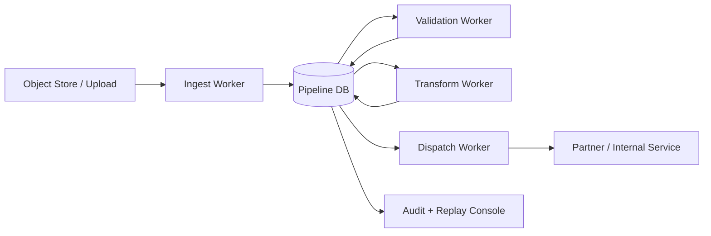
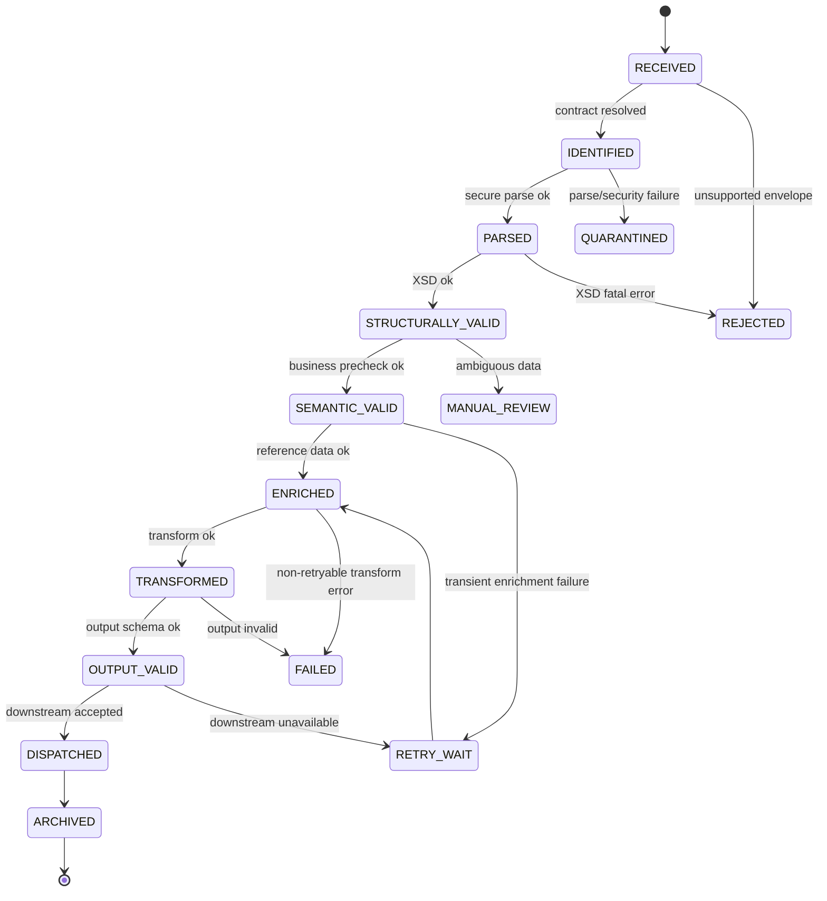
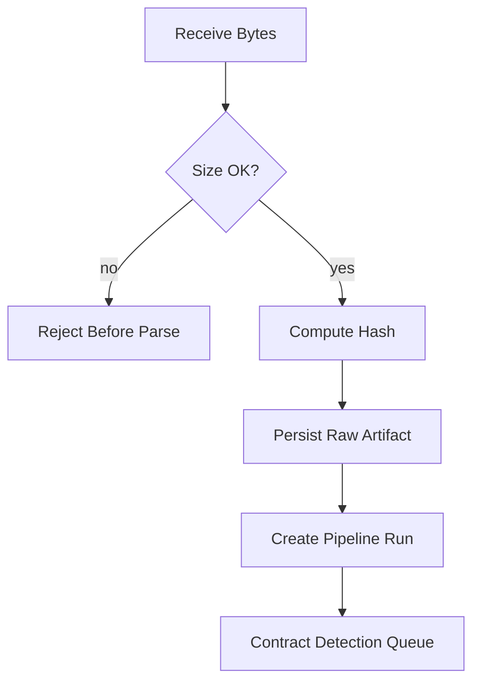
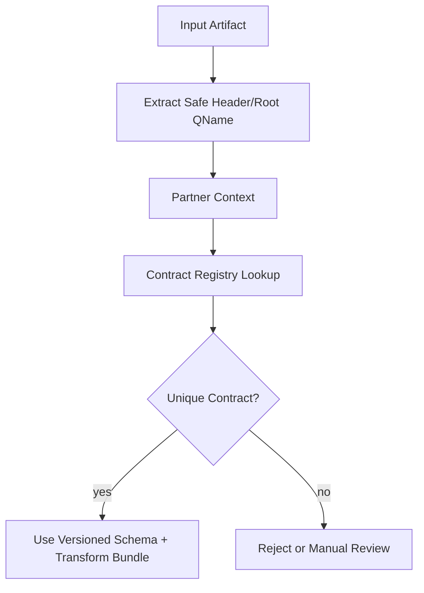
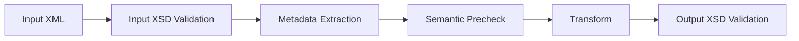
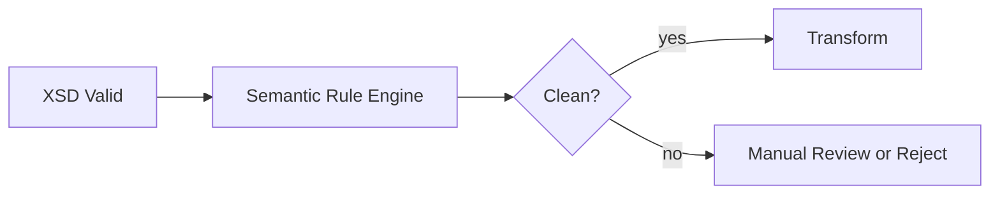
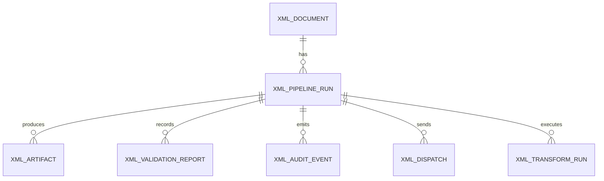
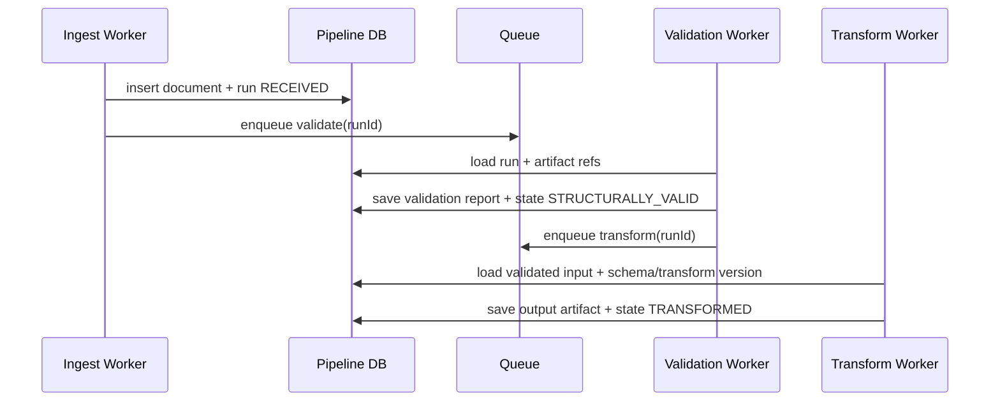
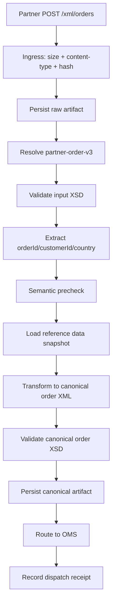

# Part 025 — XML Pipeline Architecture

> Goal: mampu merancang XML processing pipeline Java yang aman, deterministic, observable, replayable, dan tahan terhadap payload besar, schema evolution, transform failure, partner variation, dan kebutuhan audit/regulatory.

Di part sebelumnya kita membahas parser, XSD, XPath, XQuery, XSLT, binding, serialization, diagnostics, dan performance sebagai kemampuan terpisah. Di production, semua kemampuan itu jarang berdiri sendiri. Biasanya XML masuk sebagai **flow**:

```text
receive document -> identify contract -> parse safely -> validate -> extract metadata -> enrich -> transform -> route -> persist -> audit -> notify downstream
```

Itulah XML pipeline.

Pipeline yang baik bukan hanya “bisa memproses XML”. Pipeline yang baik memiliki boundary yang jelas:

- payload mana yang diterima;
- contract mana yang dipakai;
- policy keamanan mana yang aktif;
- kapan validasi terjadi;
- transform asset versi berapa yang digunakan;
- output apa yang dihasilkan;
- error apa yang retryable;
- bukti audit apa yang disimpan;
- bagaimana replay dilakukan tanpa mengubah hasil secara diam-diam.

Mental model utama:

```text
XML pipeline = controlled sequence of irreversible and reversible decisions over an XML artifact.
```

Yang berbahaya bukan hanya error parsing. Yang lebih berbahaya adalah keputusan diam-diam: schema auto-download, transform berubah tanpa versioning, XPath salah namespace, error dipotong, payload tersimpan tanpa hash, atau replay menggunakan asset versi baru.

---

## 1. Kaufman Deconstruction

Skill ini bisa dipecah menjadi beberapa sub-skill.

| Sub-skill | You must be able to answer |
|---|---|
| boundary design | Apa unit kerja pipeline: message, file, document, envelope, atau record? |
| contract identification | Bagaimana sistem menentukan schema/transform yang benar? |
| security policy | Resource eksternal apa yang boleh diakses parser/schema/XSLT? |
| validation strategy | Validasi dilakukan sekali, bertahap, atau per-stage? |
| metadata extraction | Field apa yang harus diekstrak sebelum full processing? |
| enrichment | Data eksternal apa yang boleh mempengaruhi output? |
| transformation | Transform asset apa yang dipakai dan bagaimana versioning-nya? |
| persistence | Apa yang disimpan: raw input, canonical XML, output, evidence, atau semua? |
| error handling | Error mana reject, retry, quarantine, manual review, atau ignore? |
| replay | Bisakah hasil lama direproduksi dengan konfigurasi lama? |
| observability | Metric dan log apa yang membuktikan pipeline bekerja benar? |
| governance | Siapa boleh mengubah schema, stylesheet, resolver, dan routing rule? |

Practice target untuk 20 jam:

```text
Build one production-like XML pipeline that can ingest, validate, transform, audit, fail safely, and replay a real XML contract.
```

Bukan targetnya:

```text
Learn every XML API.
```

Targetnya:

```text
Own the lifecycle of an XML artifact from intake to evidence.
```

---

## 2. Reference Pipeline Shape

Pipeline dasar:

```mermaid
flowchart LR
    A[Ingress] --> B[Envelope Detection]
    B --> C[Contract Resolution]
    C --> D[Secure Parse]
    D --> E[Structural Validation]
    E --> F[Metadata Extraction]
    F --> G[Semantic Prechecks]
    G --> H[Enrichment]
    H --> I[Transformation]
    I --> J[Output Validation]
    J --> K[Routing]
    K --> L[Persistence]
    L --> M[Audit Evidence]
    M --> N[Downstream Dispatch]
```



Dalam sistem besar, pipeline ini sering dipisah menjadi beberapa stage asynchronous:



Satu pipeline monolitik synchronous terlihat sederhana, tetapi sulit dioperasikan saat:

- payload besar;
- validasi lama;
- transform butuh enrichment;
- downstream sering gagal;
- ada manual review;
- replay dibutuhkan;
- partner mengirim data buruk tapi harus dipertahankan sebagai evidence.

Rule:

```text
If a stage can fail independently, observe it and persist its state independently.
```

---

## 3. Pipeline State Model

XML pipeline production-grade perlu state eksplisit. Jangan hanya `try-catch` lalu log.

Contoh lifecycle:



State harus merepresentasikan keputusan bisnis-operasional, bukan detail implementasi terlalu rendah.

Buruk:

```text
STARTED, STEP_1_DONE, STEP_2_DONE, STEP_3_DONE
```

Lebih baik:

```text
RECEIVED, CONTRACT_IDENTIFIED, STRUCTURALLY_VALID, TRANSFORMED, OUTPUT_VALID, DISPATCHED, QUARANTINED
```

Karena state ini bisa dipakai oleh:

- operator;
- audit reviewer;
- retry scheduler;
- manual review UI;
- SLA dashboard;
- replay tooling;
- incident analysis.

---

## 4. Artifact Model

Pipeline tidak hanya menghasilkan satu output. Ia menghasilkan artifact.

| Artifact | Purpose | Store? |
|---|---|---|
| raw input bytes | legal/audit evidence, replay source | yes for regulated/partner systems |
| normalized input | deterministic canonical view | often yes |
| validation report | reason for accept/reject | yes |
| extracted metadata | search/routing/indexing | yes |
| enrichment snapshot | reproducibility | yes if enrichment affects output |
| transform output | downstream payload | yes |
| output validation report | prove output is contract-valid | yes |
| dispatch receipt | prove delivery/acceptance | yes |
| error report | operator action | yes |
| processing manifest | full asset/config version graph | yes |

A useful artifact manifest:

```json
{
  "pipelineRunId": "run-20260702-000123",
  "documentId": "doc-abc",
  "inputHash": "sha256:...",
  "inputContentType": "application/xml",
  "detectedContract": "partner-order-v3",
  "schemaBundleVersion": "orders-schema-3.2.1",
  "transformBundleVersion": "partner-to-canonical-5.4.0",
  "securityPolicyVersion": "xml-policy-2026.07",
  "enrichmentSnapshotId": "snapshot-789",
  "outputHash": "sha256:...",
  "startedAt": "2026-07-02T10:00:00Z",
  "finishedAt": "2026-07-02T10:00:03Z",
  "result": "OUTPUT_VALID"
}
```

In regulated systems, manifest ini lebih penting daripada log biasa.

Log menjawab:

```text
What happened around that time?
```

Manifest menjawab:

```text
Exactly what input, contract, code, policy, and asset version produced this output?
```

---

## 5. Ingress Boundary

Ingress adalah titik paling berisiko. Semua asumsi buruk masuk dari sini.

Minimum checks:

| Check | Why |
|---|---|
| max byte size | prevent memory/disk abuse |
| content type allowlist | reject unexpected formats early |
| compression policy | prevent zip bomb / nested archive abuse |
| charset policy | avoid encoding confusion |
| XML declaration sanity | detect mismatch early |
| external entity disabled | prevent XXE/SSRF/local file reads |
| request correlation ID | trace across stages |
| raw hash | immutability evidence |
| storage before processing | preserve evidence even if processing fails |

Ingress should not perform heavy semantic work. It should do enough to make the artifact safe and traceable.



A common mistake:

```java
String xml = requestBodyAsString();
Document doc = parse(xml);
```

This hides:

- byte size;
- charset;
- content-type;
- raw hash;
- storage durability;
- parse limits;
- evidence trail.

Better mental model:

```text
The raw XML is an artifact first, a Java object later.
```

---

## 6. Contract Resolution

A pipeline cannot validate or transform safely until it knows which contract applies.

Contract can be resolved from:

| Signal | Example | Risk |
|---|---|---|
| endpoint | `/partners/acme/orders` | endpoint can drift from payload |
| partner ID | authenticated sender | same partner may send multiple versions |
| namespace URI | `urn:acme:order:v3` | namespace may be wrong or omitted |
| root QName | `{urn:...}OrderRequest` | insufficient alone for variants |
| schemaLocation | XML hint | should not be trusted blindly |
| envelope header | `<version>3.1</version>` | header may conflict with body |
| file naming convention | `ACME_ORDER_20260702.xml` | weak, operational only |
| out-of-band config | partner contract registry | strong if governed |

Production rule:

```text
schemaLocation is a hint, not authority.
```

Recommended approach:



A contract registry entry may contain:

```yaml
contractId: partner-order-v3
partner: acme
rootQName: "{urn:acme:order:v3}OrderRequest"
schemaBundle: orders-schema-3.2.1
inputValidationMode: strict
transformBundle: acme-order-to-canonical-5.4.0
outputContract: canonical-order-v2
securityPolicy: xml-partner-default-2026.07
routingPolicy: order-ingest
```

This is better than hardcoding schema paths inside code.

---

## 7. Secure Parse Stage

The parse stage should not have business logic. Its job:

1. apply parser security policy;
2. reject unsafe constructs;
3. expose a safe processing representation;
4. collect location-aware diagnostics;
5. avoid accidental network/filesystem access.

Example secure parser profile:

```java
final class XmlSecurityProfile {
    boolean disallowDoctype = true;
    boolean externalGeneralEntities = false;
    boolean externalParameterEntities = false;
    boolean loadExternalDtd = false;
    boolean xincludeAware = false;
    boolean expandEntityReferences = false;
    int maxElementDepth = 128;
    int maxAttributesPerElement = 256;
    long maxInputBytes = 50 * 1024 * 1024;
}
```

The exact features depend on parser/API, but architecture should make policy explicit.

Bad:

```java
DocumentBuilderFactory.newInstance().newDocumentBuilder().parse(input);
```

Better:

```java
DocumentBuilderFactory factory = SecureXmlFactories.newDocumentBuilderFactory(policy);
DocumentBuilder builder = factory.newDocumentBuilder();
builder.setErrorHandler(diagnostics.errorHandler());
Document document = builder.parse(source);
```

The key is not the helper method. The key is policy centralization.

```text
Every XML entry point must use the same default-deny policy.
```

---

## 8. Validation Stage

Validation should produce structured evidence, not just throw an exception.

Minimal validation result:

```java
public record ValidationIssue(
    Severity severity,
    String code,
    String message,
    Integer line,
    Integer column,
    String systemId,
    String schemaVersion,
    String contractId
) {}

public record ValidationReport(
    String documentId,
    String contractId,
    String schemaBundleVersion,
    boolean valid,
    List<ValidationIssue> issues
) {}
```

Do not collapse all validation failures to:

```text
Invalid XML
```

That creates operational blindness.

Validation stage options:

| Strategy | Use when | Trade-off |
|---|---|---|
| fail-fast | public API, high traffic, no operator correction | cheap but fewer diagnostics |
| aggregate errors | batch/regulatory/partner correction | more useful but more expensive |
| staged validation | envelope first, body later | good for routing and isolation |
| streaming validation | large files | low memory but harder diagnostics |
| post-transform validation | generated output must meet downstream contract | adds cost but catches mapping bugs |
| dual validation | migration between schema versions | useful for rollout but costly |

Recommended pipeline:



Why validate output? Because valid input does not guarantee valid output.

Transform can:

- omit required fields;
- create invalid enum;
- break namespace;
- round decimal incorrectly;
- generate illegal date;
- duplicate identifiers;
- violate ordering.

---

## 9. Metadata Extraction Stage

Metadata extraction answers operational questions:

- What document is this?
- Who sent it?
- What version is it?
- Which business entity does it affect?
- Can we deduplicate it?
- Where should it route?
- What should appear in search/UI?

Example metadata:

```json
{
  "documentId": "doc-abc",
  "partnerId": "acme",
  "contractId": "partner-order-v3",
  "businessKey": "ORDER-10001",
  "submittedAt": "2026-07-02T10:00:00Z",
  "customerId": "C-123",
  "documentType": "ORDER_REQUEST",
  "declaredVersion": "3.1"
}
```

Implementation choices:

| Method | Good for |
|---|---|
| StAX | fast header extraction, large documents |
| SAX | streaming extraction with state machine |
| XPath over DOM | small documents, many fields, simple code |
| Saxon XPath/XQuery | typed/more complex extraction |
| XSLT | extraction as transform into metadata XML/JSON-like output |

A common pattern:

```java
public interface MetadataExtractor {
    ExtractedMetadata extract(InputArtifact artifact, Contract contract);
}
```

For large XML, avoid building a full DOM just to get three routing fields.

```text
If metadata is in the envelope/header, extract it streaming.
```

---

## 10. Semantic Precheck Stage

XSD checks grammar. It does not fully check business meaning.

Examples of semantic rules:

| Rule | Why XSD is not enough |
|---|---|
| `effectiveDate <= expiryDate` | cross-field comparison |
| `currency` allowed for partner | external partner policy |
| `customerId` exists | requires database lookup |
| `lineTotal = qty * unitPrice` | arithmetic rule |
| `order cannot be cancelled after dispatch` | stateful business rule |
| `country requires tax ID` | conditional business rule |

Keep semantic precheck separate from XSD validation.



Design principle:

```text
XSD protects the shape. Semantic validation protects business truth.
```

Do not bury business validation inside XSLT unless it is intentionally governed as transformation logic. Hidden business rules in stylesheets are hard to audit.

---

## 11. Enrichment Stage

Enrichment adds external data needed for transformation/routing.

Examples:

- partner configuration;
- reference data;
- product catalog mapping;
- tax codes;
- customer status;
- jurisdiction mapping;
- canonical code table;
- regulatory rule version.

Enrichment is dangerous because it introduces time variance.

Same input XML can produce different output if reference data changes.

Production-grade enrichment must decide:

| Question | Required Decision |
|---|---|
| Is enrichment deterministic? | snapshot reference data version |
| Is lookup failure retryable? | classify failure type |
| Can stale data be used? | define staleness threshold |
| Is enrichment part of audit evidence? | store enrichment snapshot/hash |
| Can enrichment change output? | version and preserve it |

Example:

```java
public record EnrichmentContext(
    String referenceDataVersion,
    Map<String, String> codeMappings,
    Instant loadedAt,
    String snapshotHash
) {}
```

Avoid this:

```java
String taxCode = taxService.getCurrentTaxCode(country);
```

inside a transformation that must be replayable.

Better:

```java
EnrichmentContext ctx = enrichmentSnapshotService.loadFor(contract, processingDate);
transformer.setParameter("taxCodeMapVersion", ctx.referenceDataVersion());
```

---

## 12. Transformation Stage

Transformation is where XML pipelines become difficult.

A transformation stage should have:

- input contract;
- output contract;
- versioned transform asset;
- parameters;
- resolver policy;
- deterministic output rules;
- error listener;
- output validation;
- test coverage;
- audit manifest.

Example manifest:

```yaml
transformRun:
  inputContract: partner-order-v3
  outputContract: canonical-order-v2
  transformBundle: acme-order-to-canonical-5.4.0
  processor: Saxon-HE
  parameters:
    partnerId: acme
    referenceDataVersion: tax-map-2026.07.01
  resultHash: sha256:...
```

Transformation implementation choices:

| Need | Tool |
|---|---|
| simple object mapping | Java mapper / binding |
| XML-to-XML structural mapping | XSLT |
| complex multi-document XML query/map | XQuery/XSLT with Saxon |
| large streaming output | StAX or streaming XSLT where applicable |
| partner-specific canonicalization | XSLT bundle per partner/version |
| HTML/report generation | XSLT to HTML/text |

XSLT often wins when:

- source and target are both XML;
- transform must be declarative;
- mapping must be reviewed by integration specialists;
- output needs deterministic structure;
- tests can be golden-file based.

Java mapper often wins when:

- transformation depends heavily on domain services;
- output is not XML-centric;
- type-safe domain behavior matters;
- debugging in Java code is more important than declarative mapping.

---

## 13. Routing Stage

Routing should be explicit and explainable.

Routing can depend on:

- contract ID;
- document type;
- partner;
- business key;
- jurisdiction;
- validation result;
- semantic status;
- output type;
- manual review status;
- downstream availability.

Avoid routing hidden inside transformation.

Bad:

```xslt
<xsl:if test="/order/country = 'ID'">
  <!-- generate different output and rely on caller to infer route -->
</xsl:if>
```

Better:

```java
RoutingDecision decision = routingPolicy.decide(metadata, validation, semanticResult, outputContract);
```

Example decision:

```json
{
  "route": "REGULATORY_ID_ORDER_SUBMISSION",
  "reason": "country=ID and documentType=ORDER_REQUEST",
  "requiredOutputContract": "id-reg-order-v2",
  "retryPolicy": "partner-regulatory-default"
}
```

Routing decision should be stored because it affects auditability.

---

## 14. Persistence Stage

Persistence design determines replay, audit, and debugging quality.

Typical tables/collections:

| Store | Content |
|---|---|
| `xml_document` | raw artifact metadata, hash, source |
| `xml_pipeline_run` | run state, contract, versions, timings |
| `xml_validation_report` | input/output validation results |
| `xml_artifact` | raw/input/canonical/output/error artifact locations |
| `xml_metadata` | searchable extracted fields |
| `xml_transform_run` | transform asset, parameters, result hash |
| `xml_dispatch` | downstream route, attempts, response |
| `xml_audit_event` | immutable event timeline |

A simple relational shape:



Do not store only the final output. You will need the intermediate evidence when a partner says:

```text
Your system changed our data incorrectly.
```

You should be able to answer:

```text
This exact input hash, using schema bundle X and transform bundle Y, produced this exact output hash at this time.
```

---

## 15. Audit Event Model

Audit is not the same as logging.

Logging is diagnostic.
Audit is evidence.

Audit event example:

```json
{
  "eventId": "evt-001",
  "pipelineRunId": "run-123",
  "eventType": "INPUT_SCHEMA_VALIDATED",
  "occurredAt": "2026-07-02T10:00:02Z",
  "actor": "system:validation-worker",
  "contractId": "partner-order-v3",
  "assetVersion": "orders-schema-3.2.1",
  "result": "VALID",
  "inputHash": "sha256:...",
  "evidenceRef": "s3://.../validation-report.json"
}
```

Audit events should be:

- append-only;
- timestamped;
- correlated;
- minimal but sufficient;
- PII-safe;
- linked to durable artifacts;
- stable across deployments.

Do not put huge XML payloads directly into audit events. Store artifacts separately and reference them.

---

## 16. Idempotency and Deduplication

XML partner systems often resend payloads.

Reasons:

- timeout after successful processing;
- partner retry;
- batch resubmission;
- duplicate file upload;
- network uncertainty;
- manual resend.

Idempotency key candidates:

| Candidate | Strength |
|---|---|
| raw payload hash | strong for exact duplicate |
| partner + business key + version | strong for semantic duplicate |
| file name | weak alone |
| message ID in envelope | good if partner reliable |
| correlation ID | good for tracing but not always dedupe |

Recommended strategy:

```text
technical duplicate = same raw hash from same source
business duplicate = same partner + document type + business key + business version
```

Example:

```java
public record XmlIdempotencyKey(
    String partnerId,
    String documentType,
    String businessKey,
    String businessVersion,
    String rawSha256
) {}
```

Pipeline should define behavior:

| Duplicate Type | Behavior |
|---|---|
| same raw hash, already successful | return prior result/receipt |
| same business key, different raw hash | compare version or manual review |
| same message ID, different content | quarantine |
| resend after failed retryable stage | continue/retry from safe stage |
| resend after rejected invalid payload | return same rejection evidence |

---

## 17. Retry and Quarantine

Not every failure should retry.

Failure classification:

| Failure | Retry? | Destination |
|---|---:|---|
| malformed XML | no | rejected/quarantine |
| XXE/security violation | no | security quarantine |
| unsupported contract | no/manual | manual review |
| XSD validation error | no | rejected with report |
| reference data service timeout | yes | retry wait |
| transform asset missing | no | failed/deployment issue |
| downstream 503 | yes | retry wait |
| downstream validation rejection | no/manual | failed/manual review |
| database transient error | yes | retry wait |
| unknown exception | limited retry then failed | incident |

Retry must be stage-aware.

Bad:

```text
retry whole pipeline from raw input every time
```

Better:

```text
resume from last durable successful stage if input/artifacts/asset versions are unchanged
```

Quarantine is not trash. Quarantine is controlled storage for unsafe or unprocessable artifacts.

Quarantined items need:

- reason;
- severity;
- raw artifact reference;
- safe preview;
- who can access;
- manual action options;
- retention policy.

---

## 18. Stage Isolation and Transaction Boundaries

A pipeline mixes CPU, I/O, persistence, and external calls. One database transaction for the entire flow is usually wrong.

Better:

```text
Each durable stage commits its result and emits the next work item.
```

Example:



Key invariant:

```text
Never emit next work unless current stage evidence is durable.
```

If using queue + database, apply outbox pattern when consistency matters.

---

## 19. Pipeline Orchestration Options

| Option | Good for | Risk |
|---|---|---|
| in-process synchronous service | low latency simple request-response | hard replay, weak isolation |
| job workers + DB state | batch/document workflows | more moving parts |
| queue-based stages | throughput and isolation | ordering/idempotency complexity |
| workflow engine | long-running/manual/retry-rich process | operational overhead |
| file watcher + workers | batch feeds | file semantics and partial writes |
| object-store event pipeline | large artifacts | event duplication and consistency |

For enterprise XML, job/workflow-style design is often better than synchronous call stack.

Rule:

```text
If humans, retries, or audit are involved, model the pipeline state explicitly.
```

---

## 20. Observability Model

Metrics should map to pipeline stages.

Recommended metrics:

| Metric | Labels |
|---|---|
| `xml_pipeline_received_total` | partner, contract, channel |
| `xml_pipeline_rejected_total` | reason, contract |
| `xml_validation_duration_seconds` | contract, schemaVersion, result |
| `xml_transform_duration_seconds` | transformBundle, result |
| `xml_artifact_bytes` | contract, artifactType |
| `xml_pipeline_stage_duration_seconds` | stage, contract |
| `xml_dispatch_attempts_total` | route, result |
| `xml_quarantine_total` | reason, severity |
| `xml_replay_total` | contract, result |

Structured log fields:

```json
{
  "pipelineRunId": "run-123",
  "documentId": "doc-abc",
  "partnerId": "acme",
  "contractId": "partner-order-v3",
  "stage": "OUTPUT_VALIDATION",
  "schemaBundleVersion": "canonical-order-2.1.0",
  "result": "FAILED",
  "line": 42,
  "column": 17,
  "errorCode": "XSD_ENUM_INVALID"
}
```

Trace spans:

```text
xml.ingest
xml.contract.resolve
xml.parse
xml.validate.input
xml.extract.metadata
xml.semantic.precheck
xml.enrich
xml.transform
xml.validate.output
xml.route
xml.dispatch
```

Do not log full XML by default. Use payload hash and artifact reference.

---

## 21. Replay Architecture

Replay is not “run it again”. Replay must define what remains fixed.

Replay modes:

| Mode | Meaning |
|---|---|
| forensic replay | reproduce original output exactly |
| migration replay | process old input with new schema/transform |
| repair replay | rerun failed stage after fixing config/asset |
| downstream replay | resend already produced output |
| validation replay | revalidate corpus against new schema |

Forensic replay requires:

- raw input bytes;
- exact parser/security policy;
- schema bundle version;
- transform bundle version;
- enrichment snapshot;
- runtime version or compatibility notes;
- output serialization rules;
- stable clock/randomness policy.

Replay request example:

```json
{
  "mode": "FORENSIC",
  "pipelineRunId": "run-123",
  "useOriginalAssets": true,
  "dispatchDownstream": false,
  "requestedBy": "audit-user-1",
  "reason": "partner dispute"
}
```

Replay output should be compared by hash/canonical form.

```text
replay output hash == original output hash
```

If not equal, system must explain why.

---

## 22. Configuration and Asset Versioning

XML pipeline assets include:

- XSD bundles;
- XSLT stylesheets;
- XPath expressions;
- XQuery modules;
- resolver catalogs;
- mapping tables;
- routing rules;
- security profiles;
- partner profiles;
- output serialization config.

Treat them like code.

Minimum governance:

| Asset | Versioning Need |
|---|---|
| XSD | strict semantic version or date-based contract version |
| XSLT | immutable bundle version |
| XPath registry | review and test changes |
| resolver catalog | locked external resource behavior |
| partner config | approval workflow |
| mapping table | effective dating and snapshotting |
| routing rule | audit trail |

Do not deploy mutable `latest.xsd` or `current-transform.xsl` into production without resolved immutable version in manifest.

Bad:

```text
/schema/order.xsd
/xslt/partner-transform.xsl
```

Better:

```text
/schema/orders-schema-3.2.1/order.xsd
/xslt/acme-order-to-canonical-5.4.0/main.xsl
```

---

## 23. Code Architecture

A clean Java pipeline separates policy, stages, artifacts, and orchestration.

Example package structure:

```text
com.example.xmlpipeline
  artifact/
    InputArtifact.java
    OutputArtifact.java
    ArtifactStore.java
    ArtifactHash.java
  contract/
    Contract.java
    ContractRegistry.java
    SchemaBundle.java
    TransformBundle.java
  security/
    XmlSecurityPolicy.java
    SecureXmlFactories.java
    DenyByDefaultResourceResolver.java
  stage/
    PipelineStage.java
    IngestStage.java
    ContractResolutionStage.java
    ValidationStage.java
    MetadataExtractionStage.java
    EnrichmentStage.java
    TransformationStage.java
    OutputValidationStage.java
    DispatchStage.java
  diagnostics/
    ValidationReport.java
    TransformReport.java
    PipelineDiagnostic.java
  audit/
    AuditEvent.java
    AuditTrail.java
  replay/
    ReplayService.java
```

Stage interface:

```java
public interface PipelineStage<I, O> {
    StageResult<O> execute(PipelineContext context, I input);
}
```

Context:

```java
public record PipelineContext(
    String pipelineRunId,
    String documentId,
    Clock clock,
    XmlSecurityPolicy securityPolicy,
    ContractRegistry contractRegistry,
    ArtifactStore artifactStore,
    AuditTrail auditTrail
) {}
```

Stage result:

```java
public sealed interface StageResult<T> permits StageSuccess, StageRejected, StageRetryableFailure, StageFatalFailure {
    String stageName();
}
```

This makes failure classification explicit.

---

## 24. Example End-to-End Flow

Use case: partner submits order XML.



State changes:

```text
RECEIVED
CONTRACT_IDENTIFIED
STRUCTURALLY_VALID
SEMANTIC_VALID
ENRICHED
TRANSFORMED
OUTPUT_VALID
DISPATCHED
ARCHIVED
```

Evidence:

```text
raw hash
schema version
validation report
metadata
reference snapshot version
transform bundle version
output hash
dispatch receipt
audit timeline
```

---

## 25. Common Design Mistakes

### Mistake 1: Treating XML as String

Bad:

```java
String result = xml.replace("<old>", "<new>");
```

Why it fails:

- namespace ignorance;
- escaping errors;
- invalid structure;
- accidental replacement;
- no validation;
- impossible audit semantics.

Use parser/transformer.

---

### Mistake 2: Combining Validation, Mapping, and Dispatch

Bad:

```java
public void handle(String xml) {
    Document doc = parse(xml);
    validate(doc);
    String out = transform(doc);
    http.post(out);
}
```

This has weak recovery. If dispatch fails, what exactly succeeded? Was output persisted? Can it be resent without re-transforming?

Better: durable stage boundaries.

---

### Mistake 3: No Output Validation

Input XSD passes. Transform output is sent. Downstream rejects.

Output validation would catch it before dispatch.

---

### Mistake 4: Mutable Assets

Changing XSLT in place breaks replay and audit.

Use immutable versioned bundles.

---

### Mistake 5: Log-Only Diagnostics

Logs expire, are noisy, and are not structured evidence.

Persist validation/transform reports.

---

### Mistake 6: Retry Everything

Malformed XML will never become valid by retrying.

Classify failure.

---

## 26. Production Readiness Checklist

### Security

- [ ] all parser factories use central secure defaults;
- [ ] DTD/external entity behavior is explicit;
- [ ] schema/XSLT/XQuery external resource access is controlled;
- [ ] max size/depth/entity/attribute limits exist;
- [ ] full payload logging is disabled by default;
- [ ] quarantine is access-controlled.

### Contract

- [ ] contract registry maps partner/root/version to schema/transform;
- [ ] schema bundles are immutable;
- [ ] transform bundles are immutable;
- [ ] output contract is explicit;
- [ ] schemaLocation is not blindly trusted.

### Pipeline

- [ ] each failure-prone stage has state;
- [ ] durable evidence exists before next stage;
- [ ] retry policy is stage-aware;
- [ ] idempotency key is defined;
- [ ] duplicate behavior is documented;
- [ ] manual review path exists where needed.

### Audit

- [ ] raw input hash stored;
- [ ] output hash stored;
- [ ] validation reports persisted;
- [ ] transform manifest persisted;
- [ ] dispatch receipts stored;
- [ ] replay mode documented.

### Observability

- [ ] metrics per contract/stage/result;
- [ ] structured logs include run/document/contract IDs;
- [ ] traces map to pipeline stages;
- [ ] dashboards show backlog, failure, latency, and quarantine;
- [ ] alerts distinguish invalid input from system failures.

---

## 27. Practice Drill

Build a small but realistic pipeline:

```text
Input: partner invoice XML
Output: canonical invoice XML
Requirements:
- secure parse
- input XSD validation
- metadata extraction: invoiceId, supplierId, amount, currency
- semantic check: amount > 0
- enrichment: supplier code mapping from versioned JSON file
- XSLT transform
- output XSD validation
- artifact manifest
- replay command
```

Add failure cases:

1. malformed XML;
2. XXE payload;
3. wrong namespace;
4. invalid enum;
5. missing supplier mapping;
6. XSLT bug;
7. invalid output;
8. duplicate input;
9. downstream failure;
10. replay with original assets.

Expected result:

```text
You should be able to explain exactly which stage failed, why, whether retry is safe, and what evidence exists.
```

---

## 28. Mental Model Summary

A production XML pipeline is not just parser + mapper.

It is:

```text
artifact lifecycle + contract governance + secure processing + deterministic transformation + durable evidence + controlled replay
```

The main invariant:

```text
For every accepted XML artifact, the system can prove what contract was used, what decisions were made, what output was produced, and how to reproduce or explain it.
```

When you can design that, XML stops being “legacy format” and becomes a controlled integration substrate.

---

## 29. What Comes Next

Part 026 moves from internal pipeline architecture to **production integration patterns**:

- SOAP/XML services;
- batch XML feeds;
- regulatory submission;
- partner envelopes;
- canonical message design;
- schema registry;
- correlation IDs;
- contract negotiation;
- XML in message queues;
- XML over file/object-store pipelines;
- enterprise integration failure modes.
