# Part 026 — Production Integration Patterns

> Goal: mampu memilih dan menerapkan pattern integrasi XML yang tepat untuk sistem enterprise: SOAP/XML services, batch feeds, regulatory submission, partner envelopes, canonical messages, schema registry, correlation, retries, idempotency, and operational governance.

XML di production biasanya muncul bukan karena engineer ingin “pakai XML”. XML muncul karena ekosistem integrasi membutuhkannya:

- partner lama memakai SOAP;
- regulator mensyaratkan XSD;
- bank/insurance/telco memakai canonical XML;
- batch file dikirim lewat SFTP/object store;
- downstream hanya menerima payload XML;
- document-centric payload harus mempertahankan struktur dan evidence;
- transform antar versi kontrak perlu deterministic.

Pertanyaan yang benar bukan:

```text
Should we use XML or JSON?
```

Pertanyaan yang lebih berguna:

```text
Which integration boundary requires XML, and what production pattern makes that boundary safe, evolvable, and observable?
```

---

## 1. Integration Pattern Map

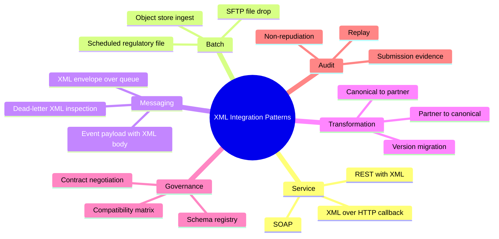

Each pattern optimizes for a different constraint:

| Pattern | Optimizes For |
|---|---|
| SOAP/XML service | strong contract, operation semantics, legacy interoperability |
| REST with XML body | simpler HTTP integration while preserving XML contract |
| SFTP/XML batch | large documents, partner batch ops, offline processing |
| object-store XML pipeline | scalable large artifact ingest |
| XML over queue | asynchronous decoupling |
| canonical XML model | internal consistency across partner variants |
| regulatory submission | evidence, strict validation, replay, non-repudiation |
| schema registry | governed contract discovery and reuse |

---

## 2. Pattern 1 — SOAP/XML Service Boundary

SOAP is verbose, but it still appears in enterprise integration because it packages:

- XML envelope;
- header/body distinction;
- operation-oriented service contract;
- WSDL/XSD contract;
- fault model;
- WS-* ecosystem in some environments.

Typical shape:

```xml
<soapenv:Envelope xmlns:soapenv="http://schemas.xmlsoap.org/soap/envelope/"
                  xmlns:ord="urn:example:order:v1">
  <soapenv:Header>
    <ord:CorrelationId>corr-123</ord:CorrelationId>
  </soapenv:Header>
  <soapenv:Body>
    <ord:SubmitOrderRequest>
      <ord:OrderId>O-10001</ord:OrderId>
    </ord:SubmitOrderRequest>
  </soapenv:Body>
</soapenv:Envelope>
```

Production concerns:

| Concern | Design Decision |
|---|---|
| envelope validation | validate SOAP envelope separately from body contract |
| body contract | resolve operation + body QName to XSD |
| headers | correlation, auth context, idempotency key |
| faults | map validation/business/system errors carefully |
| security | disable unsafe XML features and control external resources |
| observability | log operation + contract + correlation, not full body |
| versioning | namespace/WSDL evolution strategy |

Recommended flow:

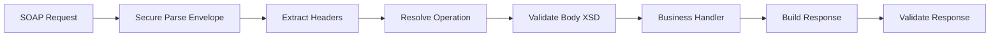

Use SOAP when:

- partner contract already exists;
- WSDL/XSD is mandated;
- fault/operation semantics are important;
- organization has SOAP infrastructure;
- regulatory/enterprise systems require it.

Avoid creating new SOAP services by default unless the boundary requires it.

---

## 3. Pattern 2 — REST Endpoint with XML Payload

Sometimes HTTP is simple REST-ish, but body remains XML.

Example:

```http
POST /partners/acme/orders
Content-Type: application/xml
X-Correlation-Id: corr-123
Idempotency-Key: acme-order-O-10001-v3
```

This avoids SOAP envelope complexity, but you must reintroduce the missing operational metadata:

| Metadata | Where |
|---|---|
| correlation ID | HTTP header |
| idempotency key | HTTP header or XML header |
| contract version | URL, header, namespace, or registry |
| partner identity | auth context, mTLS, token, endpoint |
| response status | HTTP status + structured XML/JSON error |

Request flow:

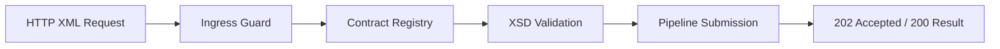

Response choices:

| Mode | Use when |
|---|---|
| synchronous `200` | small low-latency processing |
| asynchronous `202` | batch/long transform/downstream dependency |
| `400` with validation report | caller can fix immediately |
| `409` duplicate/conflict | idempotency/business duplicate |
| `422` semantic invalid | well-formed and schema-valid but business-invalid |
| `503` retryable system failure | caller may retry |

The key is to define whether XML submission means:

```text
accepted for processing
```

or

```text
fully processed and committed
```

Do not blur them.

---

## 4. Pattern 3 — Batch XML File Feed

Batch file feeds are common for:

- bank statements;
- claim submissions;
- telecom usage records;
- invoices;
- regulatory reports;
- partner order feeds;
- nightly reconciliations.

Batch feed lifecycle:

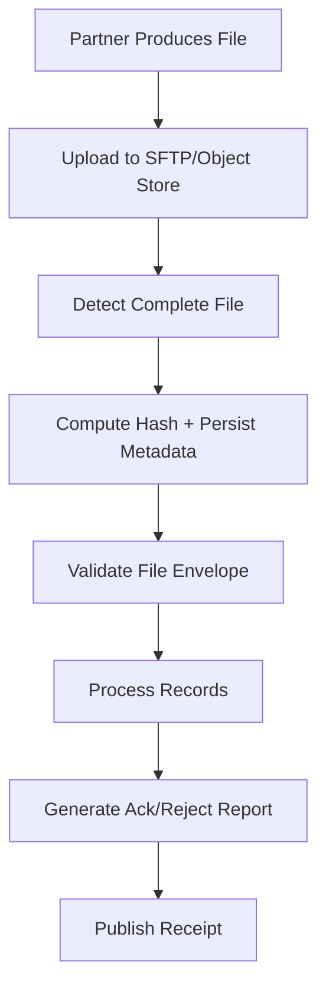

Important distinction:

```text
file-level validity != record-level validity
```

A file can be well-formed and schema-valid, while individual business records fail semantic checks.

Processing modes:

| Mode | Behavior |
|---|---|
| all-or-nothing | reject entire file if any record invalid |
| partial acceptance | accept valid records, reject invalid records |
| staged correction | hold file until partner fixes issues |
| manual review | ambiguous records reviewed by operators |

For large batch XML, avoid loading the whole file into memory unless it is bounded and small. Use SAX/StAX record streaming.

Example record streaming shape:

```text
<Batch>
  <Header>...</Header>
  <Record>...</Record>
  <Record>...</Record>
  <Trailer>...</Trailer>
</Batch>
```

Use StAX/SAX to process each `<Record>` independently, then persist per-record outcome.

---

## 5. Pattern 4 — Regulatory XML Submission

Regulatory XML integration has stricter requirements than ordinary partner integration.

Typical requirements:

- exact XSD compliance;
- prescribed namespace and file naming;
- digital signature or certificate flow;
- submission receipt;
- correction/amendment lifecycle;
- evidence retention;
- reproducible reports;
- audit trail;
- sometimes canonical XML/signature canonicalization.

Regulatory flow:

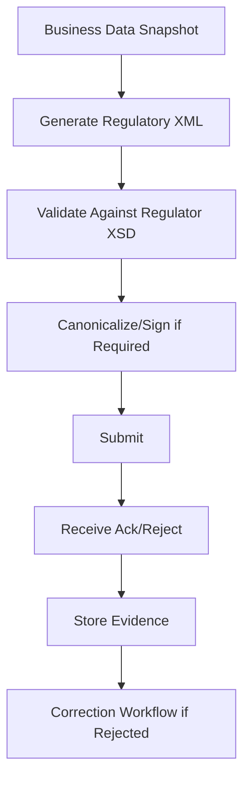

Critical design point:

```text
Regulatory XML should usually be generated from a frozen business snapshot, not live mutable database reads.
```

Why?

- submission must be reproducible;
- later correction needs known baseline;
- audit needs exact input state;
- data may change after submission.

Evidence package:

```yaml
regulatorySubmission:
  submissionId: reg-20260702-001
  regulator: example-authority
  reportingPeriod: 2026-06
  sourceSnapshotId: snapshot-abc
  schemaVersion: authority-xsd-2026.1
  generatorVersion: report-generator-4.2.0
  xmlHash: sha256:...
  signatureHash: sha256:...
  submittedAt: 2026-07-02T10:00:00Z
  receiptId: receipt-789
  status: ACCEPTED
```

Failure classification:

| Failure | Meaning |
|---|---|
| XML malformed | generator bug or serialization issue |
| XSD invalid | mapping/schema mismatch |
| signature invalid | canonicalization/certificate/signing problem |
| business rejection | regulator semantic rule |
| transport failure | retryable submission issue |
| duplicate submission | idempotency/lifecycle issue |

---

## 6. Pattern 5 — Partner Envelope + Canonical Body

Many enterprises wrap business XML in a partner envelope.

Example:

```xml
<PartnerMessage xmlns="urn:example:partner-envelope:v1">
  <Header>
    <PartnerId>ACME</PartnerId>
    <MessageId>msg-123</MessageId>
    <DocumentType>ORDER</DocumentType>
    <Version>3.1</Version>
    <CreatedAt>2026-07-02T10:00:00Z</CreatedAt>
  </Header>
  <Body>
    <ord:Order xmlns:ord="urn:acme:order:v3">
      <ord:OrderId>O-10001</ord:OrderId>
    </ord:Order>
  </Body>
</PartnerMessage>
```

Envelope responsibilities:

- sender identity;
- message ID;
- correlation ID;
- document type;
- version hint;
- timestamp;
- idempotency;
- optional signature/checksum;
- routing hints.

Body responsibilities:

- business payload;
- contract-specific structure;
- domain data.

Validation strategy:

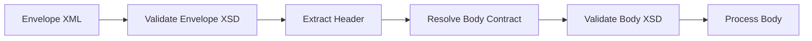

Do not validate only the envelope. Do not blindly trust body version from header if root namespace contradicts it.

---

## 7. Pattern 6 — Canonical XML Message Model

Canonical model reduces N-to-N partner mapping.

Without canonical model:

```text
Partner A -> Partner B
Partner A -> Partner C
Partner B -> Partner C
Partner C -> Partner A
```

With canonical model:

```text
Partner A -> Canonical -> Partner B
Partner B -> Canonical -> Partner C
Partner C -> Canonical -> Partner A
```

Diagram:

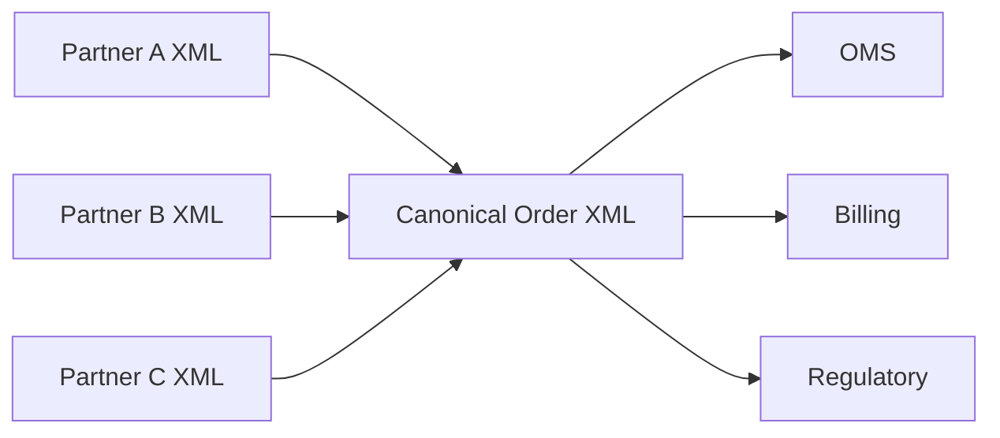

Canonical model benefits:

- internal consistency;
- fewer mappings;
- common validation;
- easier routing;
- centralized semantics;
- reusable downstream contracts.

Canonical model risks:

- becoming a giant over-generalized schema;
- leaking one partner's quirks into core model;
- slow governance;
- versioning complexity;
- false belief that all partner semantics are equivalent.

Rule:

```text
A canonical XML model should represent stable enterprise semantics, not the union of every partner's payload quirks.
```

---

## 8. Canonical Mapping Layers

Use layered transforms instead of one giant mapping.

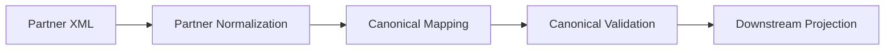

Layer examples:

| Layer | Responsibility |
|---|---|
| partner normalization | fix partner naming, namespace, date formats, optional wrapper |
| semantic mapping | map partner fields to canonical meaning |
| enrichment | add reference data / code mapping |
| canonical validation | prove output contract |
| downstream projection | create service-specific view |

Avoid this:

```text
one 3,000-line XSLT file that handles every partner, version, exception, and downstream format
```

Prefer:

```text
small versioned transform bundle with clear modules and tests
```

---

## 9. Pattern 7 — Schema Registry for XML

A schema registry is not only for Avro/JSON. XML-heavy systems also need contract discovery and governance.

XML schema registry stores:

- contract ID;
- namespace;
- root QName;
- XSD bundle version;
- owner;
- compatibility status;
- effective date;
- deprecation date;
- allowed partners;
- transform bundles;
- validation mode;
- documentation;
- test fixtures.

Example:

```yaml
contractId: canonical-order-v2
namespace: urn:example:canonical:order:v2
rootQName: "{urn:example:canonical:order:v2}Order"
schemaBundle: canonical-order-schema-2.3.0
ownerTeam: order-platform
compatibility: backward-compatible-with-2.2
status: active
effectiveFrom: 2026-07-01
deprecatedAfter: null
fixtures:
  valid:
    - order-minimal.xml
    - order-with-discounts.xml
  invalid:
    - order-missing-id.xml
    - order-invalid-currency.xml
```

Registry operations:

| Operation | Purpose |
|---|---|
| publish schema bundle | release new contract |
| validate compatibility | catch breaking changes |
| resolve contract | choose schema for payload |
| list consumers | assess impact |
| deprecate version | migration governance |
| attach fixtures | contract test reuse |
| map transform bundles | pipeline execution |

Registry is not just storage. It is governance.

---

## 10. Pattern 8 — XML over Messaging

XML can be used inside queues/topics when downstream contracts require XML.

Message shape:

```json
{
  "messageId": "msg-123",
  "correlationId": "corr-456",
  "contractId": "canonical-order-v2",
  "contentType": "application/xml",
  "payloadRef": "s3://bucket/artifacts/order.xml",
  "payloadHash": "sha256:..."
}
```

Prefer payload reference for large XML, not inline huge XML.

| Strategy | Use when |
|---|---|
| inline XML | small messages, simple broker, low retention cost |
| payload reference | large XML, audit/replay, durable artifact storage |
| compressed payload | network cost matters; beware decompression limits |
| chunked records | very large batch broken into records |

Queue processing concerns:

- idempotent consumer;
- duplicate messages;
- poison messages;
- dead-letter queue;
- schema version resolution;
- payload artifact retention;
- transform asset version;
- consumer compatibility.

Dead-letter messages should include enough context:

```json
{
  "messageId": "msg-123",
  "contractId": "canonical-order-v2",
  "payloadHash": "sha256:...",
  "failureStage": "OUTPUT_VALIDATION",
  "errorCode": "XSD_INVALID_ENUM",
  "firstFailedAt": "2026-07-02T10:00:00Z",
  "attempts": 5
}
```

---

## 11. Pattern 9 — XML File Drop over SFTP/Object Store

File-drop integration is operationally tricky.

Problems:

- detecting complete upload;
- duplicate files;
- partially written files;
- file renames;
- partner timezone;
- file naming convention drift;
- retry/resubmission;
- checksum mismatch;
- permission issues.

Robust file-drop protocol:

```text
partner uploads data.tmp
partner uploads data.sha256
partner renames data.tmp -> data.xml
pipeline processes data.xml only if checksum file exists and size stable
pipeline writes data.ack or data.reject
```

Object store variant:

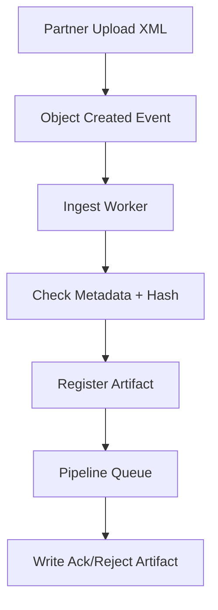

In cloud/object-store systems, object-created events can be duplicated. Consumers must be idempotent.

---

## 12. Pattern 10 — Acknowledgement and Rejection Reports

Partners need machine-readable feedback.

Basic ack:

```xml
<Acknowledgement xmlns="urn:example:ack:v1">
  <MessageId>msg-123</MessageId>
  <ReceivedAt>2026-07-02T10:00:00Z</ReceivedAt>
  <Status>ACCEPTED</Status>
  <ProcessingId>run-456</ProcessingId>
</Acknowledgement>
```

Validation rejection:

```xml
<RejectionReport xmlns="urn:example:reject:v1">
  <MessageId>msg-123</MessageId>
  <Status>REJECTED</Status>
  <ReasonCode>XSD_VALIDATION_FAILED</ReasonCode>
  <Issue>
    <Path>/Order/Lines/Line[2]/Currency</Path>
    <Line>42</Line>
    <Column>17</Column>
    <Code>INVALID_ENUM</Code>
    <Message>Currency is not allowed.</Message>
  </Issue>
</RejectionReport>
```

Design rejection reports carefully:

| Field | Why |
|---|---|
| message ID | partner correlation |
| processing ID | your internal trace |
| status | accepted/rejected/partial |
| issue code | machine-actionable |
| path | human/technical debugging |
| line/column | source-file debugging |
| severity | warning vs fatal |
| next action | resubmit, contact support, wait |

Do not leak internal stack traces or sensitive data.

---

## 13. Pattern 11 — Partial Acceptance for Batch XML

For batch files, partial acceptance often matters.

Example:

```xml
<BatchResult>
  <FileStatus>PARTIALLY_ACCEPTED</FileStatus>
  <AcceptedCount>998</AcceptedCount>
  <RejectedCount>2</RejectedCount>
  <RecordResult>
    <RecordId>R-1</RecordId>
    <Status>ACCEPTED</Status>
  </RecordResult>
  <RecordResult>
    <RecordId>R-2</RecordId>
    <Status>REJECTED</Status>
    <ReasonCode>INVALID_CUSTOMER_ID</ReasonCode>
  </RecordResult>
</BatchResult>
```

The architecture must answer:

- Are accepted records committed immediately?
- Can rejected records be resubmitted separately?
- Is order inside file meaningful?
- What happens if record 500 fails after 499 accepted?
- Can file-level trailer totals still be trusted?
- How do we reconcile accepted/rejected counts?

State model:

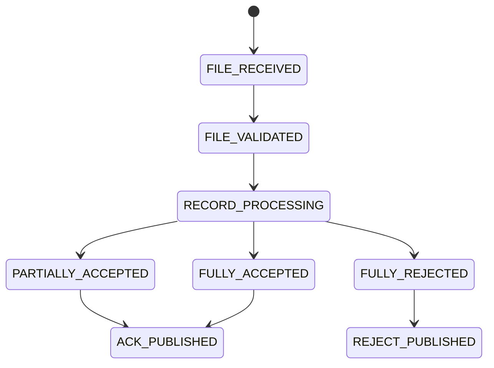

Partial acceptance requires per-record idempotency.

---

## 14. Pattern 12 — Contract Negotiation with Partners

XML integration fails when contracts are treated as static documents emailed once.

A good contract negotiation process includes:

1. business scenario definition;
2. sample payloads;
3. XSD review;
4. namespace/version agreement;
5. validation rule classification;
6. error report format;
7. idempotency behavior;
8. retry semantics;
9. SLA and support contacts;
10. test environment;
11. certification test pack;
12. rollout and deprecation plan.

Negotiation artifact:

```yaml
partner: acme
integration: order-submission
transport: HTTPS XML
contractVersion: 3.1
namespace: urn:acme:order:v3
idempotency: partnerId + orderId + orderVersion
retryableErrors:
  - HTTP_503
  - TIMEOUT
nonRetryableErrors:
  - XSD_VALIDATION_FAILED
  - UNSUPPORTED_VERSION
ackMode: asynchronous
ackSla: PT5M
schemaOwner: integration-platform
businessOwner: order-operations
```

This is not bureaucracy. It prevents production ambiguity.

---

## 15. Pattern 13 — Version Compatibility Matrix

Track who uses what.

Example:

| Contract | Version | Producer | Consumers | Status | Deprecation |
|---|---|---|---|---|---|
| `partner-order` | 2.0 | ACME | ingest-v1 | deprecated | 2026-12-31 |
| `partner-order` | 3.0 | ACME | ingest-v2 | active | none |
| `canonical-order` | 2.1 | ingest-v2 | OMS, Billing | active | none |
| `reg-order` | 2026.1 | reporting | regulator | active | 2027-01-31 |

Compatibility questions:

- Can new optional element be ignored by old consumers?
- Did enum extension break strict validators?
- Did namespace change require new contract ID?
- Are both old and new transform bundles deployed?
- Can we dual-write or dual-validate during migration?

Use dual validation during rollout:

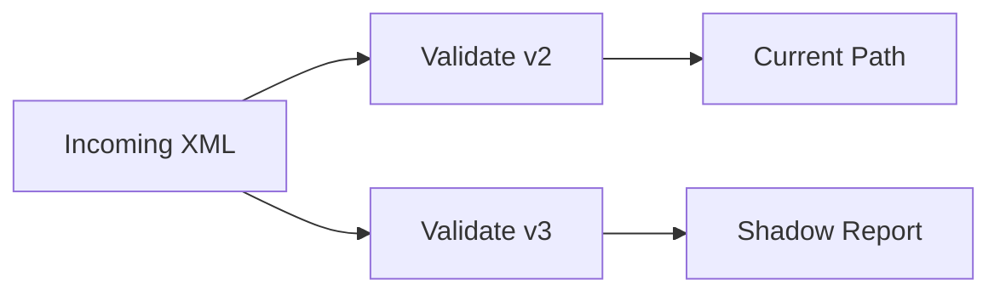

Do not silently accept a new schema version without registering downstream impact.

---

## 16. Pattern 14 — Correlation and Business Keys

Correlation IDs trace technical flow. Business keys trace domain impact.

| Key | Example | Purpose |
|---|---|---|
| correlation ID | `corr-123` | trace request across systems |
| message ID | `msg-456` | idempotency/partner message |
| document ID | `doc-789` | artifact identity |
| pipeline run ID | `run-abc` | processing instance |
| business key | `ORDER-10001` | domain entity |
| batch ID | `batch-20260702` | group processing |
| record ID | `line-17` | per-record result |

A useful log should have several IDs:

```json
{
  "correlationId": "corr-123",
  "messageId": "msg-456",
  "documentId": "doc-789",
  "pipelineRunId": "run-abc",
  "businessKey": "ORDER-10001",
  "contractId": "partner-order-v3",
  "stage": "TRANSFORM"
}
```

Do not use business key as correlation ID. One order can produce many technical interactions.

---

## 17. Pattern 15 — XML Error Contract

Error response is also a contract.

A production XML integration should define standard error categories:

| Category | Example |
|---|---|
| `MALFORMED_XML` | not well-formed |
| `UNSUPPORTED_CONTRACT` | namespace/version unknown |
| `XSD_VALIDATION_FAILED` | schema invalid |
| `SEMANTIC_VALIDATION_FAILED` | business rule failed |
| `DUPLICATE_MESSAGE` | already processed |
| `SECURITY_REJECTED` | unsafe XML feature |
| `TRANSFORM_FAILED` | mapping/runtime failure |
| `DOWNSTREAM_UNAVAILABLE` | retryable dependency failure |
| `INTERNAL_ERROR` | unexpected server error |

Error contract example:

```xml
<ErrorResponse xmlns="urn:example:error:v1">
  <CorrelationId>corr-123</CorrelationId>
  <ErrorCode>XSD_VALIDATION_FAILED</ErrorCode>
  <Retryable>false</Retryable>
  <Message>The submitted XML does not match the registered contract.</Message>
  <Issue>
    <Code>REQUIRED_ELEMENT_MISSING</Code>
    <Path>/Order/CustomerId</Path>
  </Issue>
</ErrorResponse>
```

Rules:

- never expose stack traces;
- make retryability explicit;
- make issue codes stable;
- include partner correlation;
- avoid leaking sensitive data;
- keep human message helpful but not security-sensitive.

---

## 18. Pattern 16 — XML Adapter Layer

Do not let partner XML leak everywhere.

Use adapter boundary:

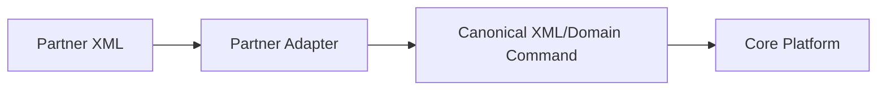

Adapter responsibilities:

- parse/validate partner XML;
- normalize partner quirks;
- map to canonical semantics;
- produce partner-specific error reports;
- handle partner versioning;
- isolate partner-specific code.

Core platform should not contain logic like:

```java
if (partner.equals("ACME") && xmlPath.equals("/foo/bar")) { ... }
```

That belongs in adapter.

Adapter package shape:

```text
integration/acme/order/v3
  AcmeOrderContract.java
  AcmeOrderValidator.java
  AcmeOrderMetadataExtractor.java
  AcmeOrderToCanonicalTransformer.java
  AcmeOrderErrorMapper.java
  fixtures/
    valid-minimal.xml
    invalid-missing-customer.xml
```

---

## 19. Pattern 17 — XML Gateway

For many partners, create an XML gateway in front of core services.

Gateway responsibilities:

- authentication/mTLS/token validation;
- content-type/size limits;
- XML security policy;
- contract resolution;
- validation;
- idempotency;
- audit artifact storage;
- routing to internal pipeline;
- ack/reject generation.

Architecture:

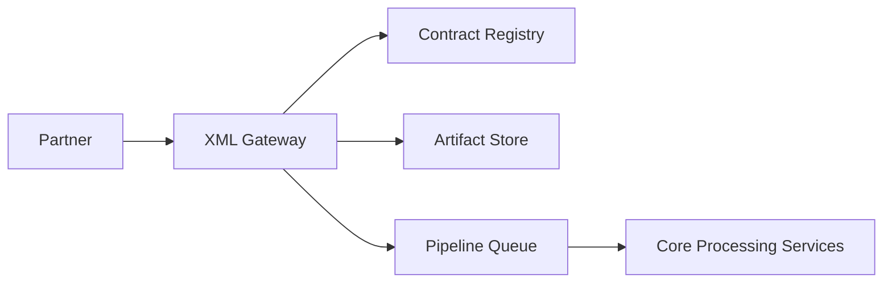

Why gateway?

- centralizes XML hardening;
- prevents every service from reimplementing XML parsing;
- improves audit consistency;
- isolates partner protocol concerns;
- enables controlled onboarding.

Risk:

- gateway can become a monolith;
- too much business logic may accumulate;
- schema/transform governance must be disciplined.

Keep gateway focused on integration boundary, not core domain policy.

---

## 20. Pattern 18 — XML Contract Testing Across Systems

Integration contract is not verified by unit tests alone.

Test layers:

| Layer | Test |
|---|---|
| parser hardening | XXE, DTD, entity expansion rejected |
| schema contract | valid/invalid fixtures |
| transform | golden output |
| compatibility | old/new schema fixtures |
| partner certification | agreed sample pack |
| replay | previous production artifacts still deterministic |
| error contract | rejection report shape and codes |
| performance | large payload / batch size |

Certification pack example:

```text
certification/acme/order-v3/
  valid/
    minimal-order.xml
    full-order.xml
    multi-line-order.xml
  invalid/
    wrong-namespace.xml
    missing-order-id.xml
    invalid-currency.xml
  expected/
    minimal-order-canonical.xml
    invalid-currency-rejection.xml
```

Contract tests should run before deploying schema or transform changes.

---

## 21. Pattern 19 — Partner-Specific Deviations

Reality: partners deviate from contract.

Types:

| Deviation | Example | Response |
|---|---|---|
| harmless extra whitespace | formatted XML | accept |
| namespace prefix difference | `a:Order` vs `ord:Order` same URI | accept |
| namespace URI wrong | typo URI | reject or negotiated compatibility shim |
| enum casing | `usd` instead of `USD` | reject or normalize with evidence |
| date format variant | `2026/07/02` | reject unless contract allows |
| missing required element | no customer ID | reject |
| unexpected optional element | extension | accept only if schema allows |

Be careful with compatibility shims.

If you silently normalize everything, your real contract disappears.

Recommended approach:

```text
strict by default, explicit deviation profile per partner/version, audit every normalization that changes semantics.
```

Deviation profile:

```yaml
partner: acme
contract: order-v3
allowedNormalizations:
  - code: TRIM_TEXT_FIELDS
    fields: [/Order/CustomerName]
  - code: UPPERCASE_CURRENCY
    fields: [/Order/Currency]
    audit: true
rejectedDeviations:
  - WRONG_NAMESPACE_URI
  - INVALID_DATE_FORMAT
```

---

## 22. Pattern 20 — Human Review Workflow

Some XML submissions cannot be auto-accepted or auto-rejected.

Examples:

- duplicate business key with different content;
- semantic ambiguity;
- partner migration exception;
- missing reference mapping;
- regulator rejection requiring correction;
- high-value transaction threshold.

Human review state:

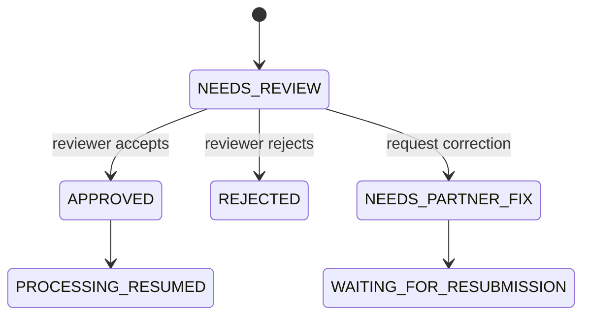

Review UI should show:

- sanitized payload preview;
- validation report;
- extracted metadata;
- difference from duplicate prior payload;
- contract version;
- partner profile;
- recommended action;
- audit history.

Manual decision must become audit evidence.

---

## 23. Pattern 21 — Downstream Dispatch and Receipts

Dispatch is often separate from XML transformation.

Dispatch must handle:

- retries;
- timeout ambiguity;
- idempotency;
- partner/downstream receipts;
- duplicate acceptance;
- rejection mapping;
- SLA.

Dispatch state:

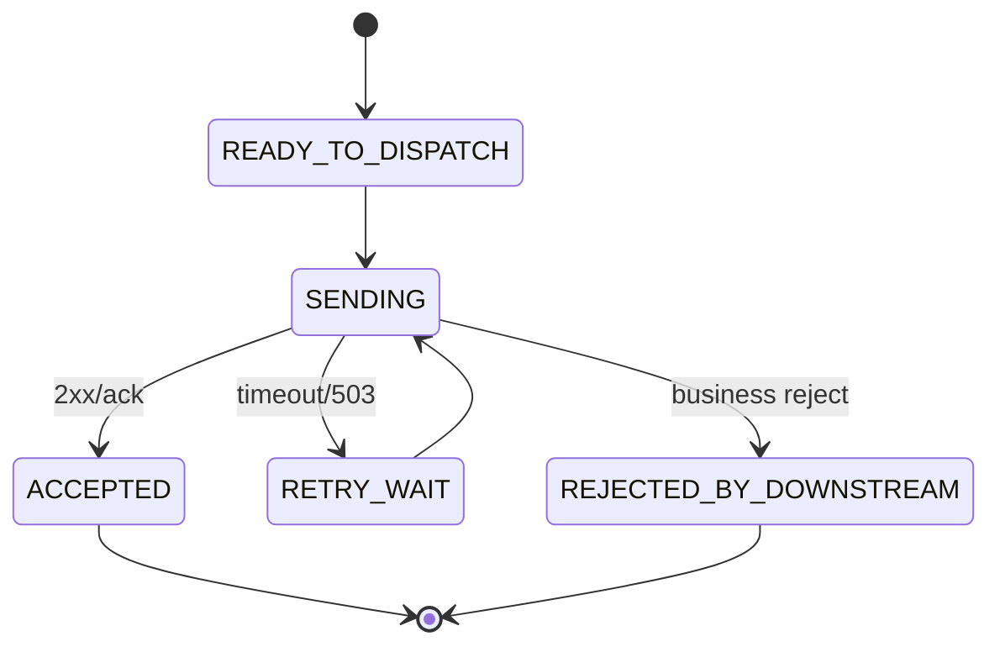

Receipt model:

```json
{
  "dispatchId": "dispatch-123",
  "route": "OMS_ORDER_INGEST",
  "payloadHash": "sha256:...",
  "attempt": 2,
  "sentAt": "2026-07-02T10:00:00Z",
  "result": "ACCEPTED",
  "downstreamReceiptId": "oms-789"
}
```

If timeout occurs after downstream accepted, retry can create duplicates unless idempotency is defined.

---

## 24. Pattern 22 — XML and Event-Driven Architecture

XML can coexist with event-driven architecture, but avoid treating huge XML documents as normal tiny events.

Better event:

```json
{
  "eventType": "XmlDocumentValidated",
  "documentId": "doc-123",
  "contractId": "canonical-order-v2",
  "payloadRef": "s3://.../canonical-order.xml",
  "payloadHash": "sha256:...",
  "metadata": {
    "businessKey": "ORDER-10001"
  }
}
```

The event announces state transition. The XML artifact remains in artifact storage.

Event patterns:

| Event | Meaning |
|---|---|
| `XmlDocumentReceived` | raw artifact persisted |
| `XmlInputValidated` | input passed schema |
| `XmlTransformationCompleted` | output artifact produced |
| `XmlOutputRejected` | generated output invalid |
| `XmlDispatchAccepted` | downstream accepted |
| `XmlDocumentQuarantined` | unsafe/unprocessable artifact |

Events should not replace artifact evidence.

---

## 25. Integration Failure Mode Catalog

| Failure Mode | Symptom | Prevention/Detection |
|---|---|---|
| wrong namespace | XPath returns nothing, validation fails | namespace-aware tests |
| schema drift | partner sends new element | contract registry + compatibility matrix |
| hidden DTD access | SSRF/file read risk | secure parser policy |
| payload too large | memory pressure | streaming + size limits |
| duplicate file | double processing | idempotency key |
| partial upload | parse error | complete-file protocol |
| transform changed silently | replay mismatch | immutable transform bundle |
| enum extension breaks consumer | downstream rejects | compatibility tests |
| timezone mismatch | wrong period/report | explicit timezone policy |
| ack ambiguity | partner retries | idempotent receipt model |
| partial batch inconsistency | counts mismatch | per-record state + trailer validation |
| manual fix invisible | audit gap | review event model |

---

## 26. Architecture Decision Matrix

| Situation | Recommended Pattern |
|---|---|
| partner mandates WSDL/SOAP | SOAP boundary + envelope/body validation |
| large nightly XML file | batch file feed + StAX/SAX record processing |
| regulator requires XSD submission | regulatory pipeline + evidence package |
| many partner variants | adapter layer + canonical XML model |
| large XML over queue | event with payload reference |
| frequent schema evolution | schema registry + compatibility matrix |
| manual correction required | explicit review workflow |
| downstream unreliable | durable dispatch stage + idempotency |
| replay/audit required | immutable artifacts + versioned assets |
| small internal config | startup DOM/XPath validation is enough |

---

## 27. Example Reference Integration Architecture

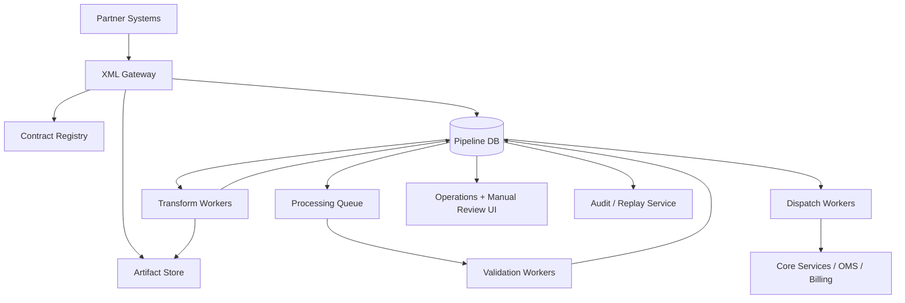

Responsibilities:

| Component | Responsibility |
|---|---|
| XML Gateway | ingress security, contract resolution, ack/reject |
| Contract Registry | schema/transform/version governance |
| Artifact Store | raw/canonical/output/error artifacts |
| Pipeline DB | state, metadata, evidence references |
| Validation Worker | XSD/security/semantic checks |
| Transform Worker | XSLT/mapper execution |
| Dispatch Worker | downstream delivery and receipts |
| Operations UI | review, retry, quarantine |
| Replay Service | forensic/migration/repair replay |

---

## 28. Production Checklist

### Contract

- [ ] contract ID exists for every accepted XML payload;
- [ ] namespace/root/version mapping is deterministic;
- [ ] schema bundles are immutable;
- [ ] transform bundles are immutable;
- [ ] compatibility matrix is maintained;
- [ ] partner deviations are explicit.

### Transport

- [ ] complete-file protocol exists for file feeds;
- [ ] HTTP timeout/retry/idempotency semantics are documented;
- [ ] message queues use payload reference for large XML;
- [ ] acknowledgements are machine-readable;
- [ ] duplicate submission behavior is deterministic.

### Processing

- [ ] envelope and body validation are separated where applicable;
- [ ] batch file and record-level states are separated;
- [ ] output validation exists;
- [ ] rejection reports use stable error codes;
- [ ] manual review decisions are audited.

### Operations

- [ ] correlation ID, message ID, document ID, run ID, and business key are captured;
- [ ] quarantine exists for unsafe/unprocessable XML;
- [ ] replay is supported for critical flows;
- [ ] dashboards show partner/contract failure rates;
- [ ] support teams can retrieve evidence by business key.

---

## 29. Practice Drill

Design an integration for this scenario:

```text
A partner submits a daily XML file containing 100,000 claim records through object storage.
The file has header, records, and trailer count.
Some records may be invalid while others should still be accepted.
The output must be canonical claim XML per accepted record.
A rejection report must be sent back.
Duplicate files must not create duplicate claims.
```

Design:

1. file ingest protocol;
2. artifact model;
3. schema validation strategy;
4. record streaming strategy;
5. idempotency key;
6. partial acceptance state;
7. transform bundle versioning;
8. output validation;
9. rejection report contract;
10. replay mode.

Expected answer should include a state diagram and table of failure classifications.

---

## 30. Mental Model Summary

Production XML integration is not about XML syntax. It is about boundary control.

The core invariant:

```text
Every XML integration boundary must define contract, transport semantics, idempotency, validation, error response, evidence, and evolution strategy.
```

When this invariant holds, XML systems are manageable.

When it does not, XML becomes a source of silent failures, partner disputes, operational ambiguity, and unreplayable transformations.

---

## 31. What Comes Next

Part 027 moves into **Testing XML Systems**:

- XMLUnit-style assertions;
- XPath assertions;
- XSD contract tests;
- golden files;
- canonical comparison;
- mutation testing;
- fixture governance;
- production replay tests;
- CI/CD guardrails for schema and transform changes.
