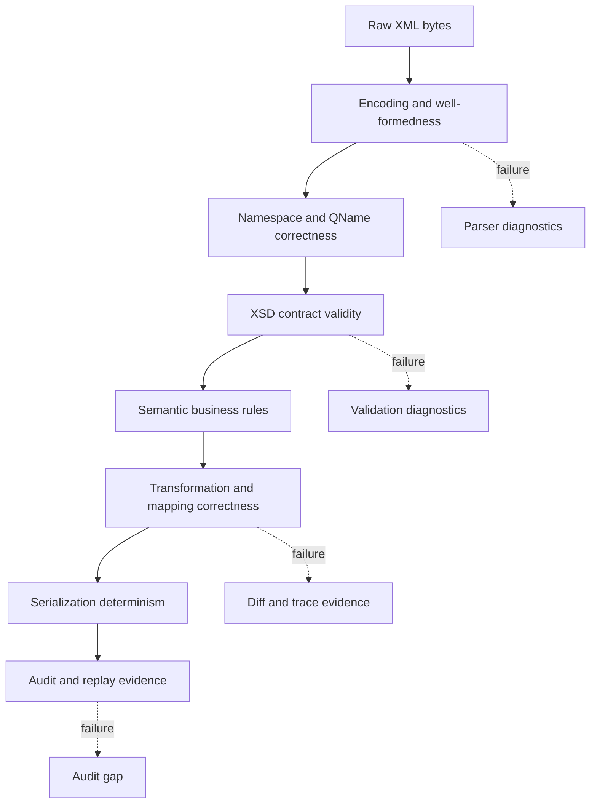
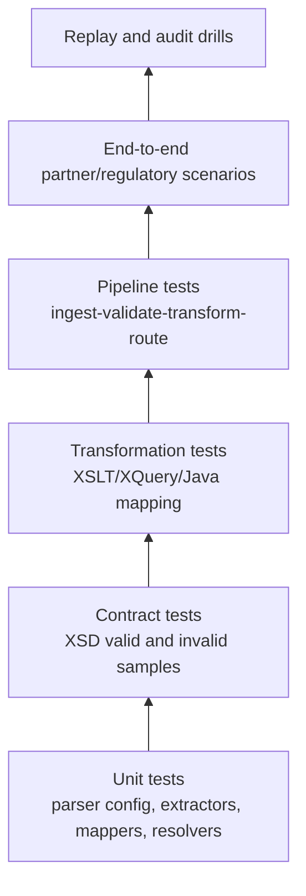
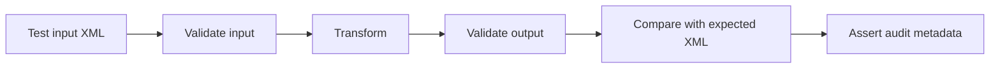
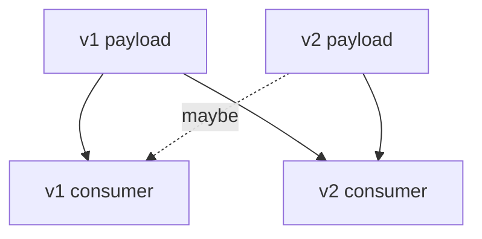

# Part 027 — Testing XML Systems

> Goal: build a testing discipline for XML-heavy Java systems where tests catch contract drift, namespace mistakes, unsafe parser configuration, transformation regressions, semantic mapping bugs, and audit-breaking output changes before they reach production.

This part is not about generic unit testing. It is about the specific failure modes of XML systems:

- a document is well-formed but not valid;
- a document is valid but semantically wrong;
- a namespace prefix changed but the qualified name did not;
- a default namespace made an XPath assertion silently fail;
- an XSLT output is structurally correct but contains a wrong normalized value;
- an XSD accepts data that downstream business rules reject;
- a golden-file comparison fails because of whitespace or attribute ordering noise;
- a parser security flag regressed during refactoring;
- a production payload cannot be replayed because the test fixture did not preserve enough evidence.

The top 1% skill is not “knowing XMLUnit”. It is knowing **what kind of correctness** each test is supposed to protect.

---

## 1. Kaufman Frame: Deconstruct the Skill

For this topic, the skill is:

> Given an XML-processing requirement, design tests that prove the pipeline is safe, contract-correct, transformation-correct, observable, replayable, and maintainable under schema evolution.

Break it down into sub-skills:

| Sub-skill | What you must be able to do |
|---|---|
| Structural testing | Assert element/attribute shape without being fooled by formatting or prefix noise. |
| Contract testing | Validate XML against XSD and check expected validation failures. |
| Semantic testing | Assert business meaning with XPath, domain rules, and expected normalized values. |
| Transformation testing | Verify XSLT/XQuery/Java mapping output with canonical comparison. |
| Streaming testing | Test SAX/StAX handlers without requiring full DOM materialization. |
| Security testing | Prove parser/validator/transformer hardening cannot be accidentally disabled. |
| Golden-file testing | Use stable fixtures without creating brittle snapshot tests. |
| Fixture governance | Treat sample XML files as versioned contract assets. |
| Evolution testing | Prove old/new schema compatibility and migration behavior. |
| Operational testing | Validate diagnostics, correlation, replay, redaction, and audit evidence. |

The immediate 20-hour practice target:

> Build a small but production-shaped XML test harness that can validate, compare, transform, assert, fuzz, and replay XML payloads across versions.

---

## 2. Mental Model: XML Testing Is Multi-Layer Correctness

A JSON API test often checks fields. XML testing needs more layers because XML has formal document structure, namespaces, schema types, transformation semantics, and serialization behavior.



A good XML test suite must answer separate questions:

1. **Can this XML be parsed safely?**
2. **Does it use the correct names, namespaces, and structure?**
3. **Does it satisfy the XSD contract?**
4. **Does it satisfy semantic rules that XSD cannot express cleanly?**
5. **Does transformation produce the intended target document?**
6. **Is output stable enough for audit, signing, diffing, and replay?**
7. **Can failure evidence explain what happened?**

Do not collapse all of these into one giant integration test. That creates slow tests with vague failure signals.

---

## 3. Testing Pyramid for XML Systems

A production XML system needs a pyramid, but its layers are XML-specific.



Recommended distribution:

| Layer | Volume | Speed | Primary failure caught |
|---|---:|---:|---|
| Parser/config unit tests | High | Very fast | Security regression, namespace misconfiguration. |
| XPath/assertion unit tests | High | Fast | Wrong node selection, missing field, default namespace bug. |
| XSD contract tests | Medium-high | Fast | Schema drift, invalid payload acceptance/rejection. |
| Transformation tests | Medium | Medium | Mapping regression, lost field, wrong format. |
| Pipeline tests | Medium-low | Slower | Stage ordering, evidence capture, quarantine behavior. |
| Partner/regulatory scenario tests | Low | Slow | Real-world compatibility. |
| Replay/audit drills | Low | Slow | Operational defensibility. |

The mistake is placing every XML sample at the top of the pyramid. Most failures can be caught earlier with smaller tests.

---

## 4. Fixture Governance: Treat XML Samples as Contracts

XML test fixtures are not random files. In enterprise systems, they are contract evidence.

A good fixture name encodes purpose:

```text
fixtures/
  invoice/v1/valid/minimal-invoice.xml
  invoice/v1/valid/full-invoice-with-tax-and-discount.xml
  invoice/v1/invalid/missing-required-buyer-id.xml
  invoice/v1/invalid/unknown-currency-code.xml
  invoice/v1/edge/empty-optional-note.xml
  invoice/v1/edge/nil-delivery-date.xml
  invoice/v2/compat/v1-payload-accepted-by-v2.xpect.xml
```

Use fixture metadata when payloads matter:

```yaml
id: invoice-v1-full-tax-discount
contract: invoice-v1.xsd
expectedOutcome: accepted
source: synthetic
containsPii: false
purpose:
  - validates tax and discount sections
  - verifies total amount normalization
  - exercises namespace-qualified extension point
owner: billing-platform
lastReviewed: 2026-07-02
```

Rules:

1. Every fixture must have a reason to exist.
2. Every invalid fixture must say which rule it violates.
3. Every golden output must declare which variability is ignored.
4. Every fixture containing production-like data must be sanitized.
5. Versioned contracts need versioned fixtures.

Avoid a directory named `test-data` filled with unexplained XML. That is not a test suite; it is archaeology.

---

## 5. Schema Contract Tests

XSD tests should prove both acceptance and rejection.

### 5.1 Minimal Java validation helper

```java
package com.example.xmltest;

import org.xml.sax.SAXException;

import javax.xml.XMLConstants;
import javax.xml.transform.Source;
import javax.xml.transform.stream.StreamSource;
import javax.xml.validation.Schema;
import javax.xml.validation.SchemaFactory;
import javax.xml.validation.Validator;
import java.io.StringReader;
import java.nio.file.Path;

public final class XmlSchemaAssertions {

    private final Schema schema;

    public XmlSchemaAssertions(Path schemaPath) {
        try {
            SchemaFactory factory = SchemaFactory.newInstance(XMLConstants.W3C_XML_SCHEMA_NS_URI);
            factory.setProperty(XMLConstants.ACCESS_EXTERNAL_DTD, "");
            factory.setProperty(XMLConstants.ACCESS_EXTERNAL_SCHEMA, "");
            this.schema = factory.newSchema(schemaPath.toFile());
        } catch (SAXException e) {
            throw new IllegalStateException("Invalid test schema: " + schemaPath, e);
        }
    }

    public void assertValid(String xml) throws Exception {
        Validator validator = schema.newValidator();
        validator.setProperty(XMLConstants.ACCESS_EXTERNAL_DTD, "");
        validator.setProperty(XMLConstants.ACCESS_EXTERNAL_SCHEMA, "");
        Source source = new StreamSource(new StringReader(xml));
        validator.validate(source);
    }

    public void assertInvalid(String xml) {
        try {
            assertValid(xml);
            throw new AssertionError("Expected XML to be invalid, but it was valid");
        } catch (Exception expected) {
            // In a real helper, return/capture diagnostics for assertion.
        }
    }
}
```

Key points:

- Compile `Schema` once per test class or test fixture group.
- Create a new `Validator` per validation call.
- Disable external DTD/schema access unless the test explicitly needs a controlled resolver.
- Test invalid cases, not only happy path cases.

### 5.2 Contract test matrix

For every XSD contract, maintain a matrix:

| Test class | Example |
|---|---|
| Required fields | missing `customerId`, missing `documentDate`. |
| Type constraints | invalid decimal scale, invalid date, invalid enum. |
| Cardinality | zero items, one item, many items, duplicate singleton. |
| Namespace | wrong namespace, missing namespace, unexpected version namespace. |
| Extension point | allowed extension, disallowed unknown element. |
| Backward compatibility | old payload accepted by new schema where promised. |
| Forward compatibility | new optional field ignored or quarantined by old consumer if promised. |
| Negative boundary | XML valid but business-invalid, to prove XSD is not overclaimed. |

Do not use XSD tests to prove all business rules. Use them to prove the contract boundary.

---

## 6. XPath Assertions

XPath assertions are ideal for checking specific facts without comparing entire documents.

Examples:

```java
assertThat(xml, hasXPath("/*[local-name()='Invoice']/*[local-name()='Total']/text()", equalTo("120.00")));
assertThat(xml, hasXPath("count(//*[local-name()='LineItem'])", equalTo("3")));
assertThat(xml, hasXPath("boolean(//*[local-name()='BuyerId'])", equalTo("true")));
```

However, prefer namespace-aware XPath where possible:

```java
Map<String, String> ns = Map.of(
    "inv", "urn:example:invoice:v1"
);

String expression = "/inv:Invoice/inv:Header/inv:BuyerId/text()";
```

Using `local-name()` everywhere is convenient, but it can hide namespace regressions. Use it only when you intentionally want namespace-insensitive checks.

### 6.1 XPath assertion categories

| Category | Use |
|---|---|
| Existence | Required node exists. |
| Absence | Forbidden node does not exist. |
| Cardinality | Exactly one header, at least one line item, no duplicate IDs. |
| Value | Normalized output value equals expected value. |
| Relationship | Sum of line items equals total. |
| Namespace | Element is in the correct namespace. |
| Redaction | Sensitive nodes are removed or masked. |
| Routing | Document type/version/partner can be extracted. |

### 6.2 Do not create XPath soup

Bad:

```java
assertXpath("/a:b/a:c/a:d/a:e/a:f/a:g", "x");
assertXpath("/a:b/a:c/a:d/a:e/a:f/a:h", "y");
assertXpath("/a:b/a:c/a:d/a:e/a:f/a:i", "z");
```

Better:

- name the semantic concept;
- centralize XPath expressions;
- use helper methods that communicate business intent.

```java
assertThatInvoice(xml).hasBuyerId("BUYER-001");
assertThatInvoice(xml).hasTotalAmount("120.00", "USD");
assertThatInvoice(xml).hasExactlyLineItems(3);
```

Production tests should read like contract statements, not implementation trivia.

---

## 7. XMLUnit: Structural Comparison Without False Failures

String equality is usually the wrong way to compare XML.

This is brittle:

```java
assertEquals(expectedXml, actualXml);
```

It fails on irrelevant differences:

- attribute order;
- indentation;
- line endings;
- namespace prefix changes where namespace URI is unchanged;
- XML declaration differences;
- insignificant whitespace.

Use structural comparison.

Typical XMLUnit dependency shape:

```xml
<dependency>
    <groupId>org.xmlunit</groupId>
    <artifactId>xmlunit-core</artifactId>
    <version>${xmlunit.version}</version>
    <scope>test</scope>
</dependency>
<dependency>
    <groupId>org.xmlunit</groupId>
    <artifactId>xmlunit-matchers</artifactId>
    <version>${xmlunit.version}</version>
    <scope>test</scope>
</dependency>
```

Example with `DiffBuilder`:

```java
import org.xmlunit.builder.DiffBuilder;
import org.xmlunit.diff.Diff;

import static org.junit.jupiter.api.Assertions.assertFalse;

public final class XmlDiffTest {

    @Test
    void generatedInvoiceShouldMatchExpectedStructure() {
        String expected = readFixture("expected/invoice.xml");
        String actual = generateInvoiceXml();

        Diff diff = DiffBuilder.compare(expected)
            .withTest(actual)
            .ignoreWhitespace()
            .checkForSimilar()
            .build();

        assertFalse(diff.hasDifferences(), () -> diff.toString());
    }
}
```

Use XMLUnit for:

- generated XML output;
- transformed XML output;
- normalized payloads;
- regression tests around namespace and structure;
- ignoring controlled differences like timestamp or generated ID.

Do not use XMLUnit to hide semantic uncertainty. If a field changes, decide whether it is irrelevant or important.

---

## 8. Golden-File Testing Without Snapshot Hell

Golden-file tests compare actual output to approved expected output.

They are useful when:

- output is large;
- structure matters;
- humans need to review mappings;
- regulatory format requires stable artifacts;
- transformation output must be reproducible.

They become dangerous when teams blindly update snapshots.

### 8.1 Good golden-file pattern

```text
src/test/resources/
  transformations/invoice-to-reg-report/
    input/invoice-v1-full.xml
    expected/report-v3-full.xml
    expected/report-v3-full.metadata.yml
```

Metadata:

```yaml
mappingVersion: invoice-to-reg-report:3.2.0
schemaInput: invoice-v1.xsd
schemaOutput: regulatory-report-v3.xsd
ignoredFields:
  - /Report/Header/GeneratedAt
reviewRequiredOnChange: true
purpose:
  - verifies tax subtotal mapping
  - verifies buyer jurisdiction normalization
  - verifies extension passthrough removal
```

### 8.2 Golden-file review checklist

When a golden file changes, review:

1. Did the input change?
2. Did the schema change?
3. Did the mapping rule change?
4. Did a serializer version change alter formatting only?
5. Did namespace URI or prefix change?
6. Is any ignored field too broad?
7. Is the new output still valid against the target schema?
8. Does the audit trail show mapping version and source fixture?

A golden-file update should be treated like a contract change.

---

## 9. Transformation Tests

Transformation tests are not just “input XML -> output XML”. They must prove:

- input validation behavior;
- transformation output;
- output validation behavior;
- diagnostic behavior on failure;
- deterministic mapping version.



### 9.1 XSLT transformation test shape

```java
@Test
void invoiceShouldTransformToRegulatoryReport() throws Exception {
    String input = readFixture("invoice/full-v1.xml");
    String expected = readFixture("reg-report/full-v3.expected.xml");

    inputValidator.assertValid(input);

    String actual = transformationService.transform(
        "invoice-to-reg-report",
        "3.2.0",
        input,
        Map.of("runMode", "TEST")
    );

    outputValidator.assertValid(actual);
    assertXmlSimilar(expected, actual);
    assertThat(actual).hasXPath("/reg:Report/reg:Header/reg:MappingVersion/text()", "3.2.0");
}
```

### 9.2 Test both push and pull mapping semantics

For XSLT, test:

- template match coverage;
- identity transform behavior;
- mode-specific behavior;
- grouping behavior;
- conditional omission;
- redaction;
- default template behavior;
- unhandled element policy.

A common bug: an identity transform silently copies source elements that should have been removed. Always test negative output cases:

```java
assertThat(actual).doesNotHaveXPath("//src:InternalRiskScore");
assertThat(actual).doesNotHaveXPath("//src:DebugMetadata");
```

---

## 10. Streaming Parser Tests

SAX/StAX code is often stateful. Test it as a state machine.

### 10.1 What to test

| Streaming behavior | Test case |
|---|---|
| Start/end event matching | Nested elements do not corrupt state. |
| Text accumulation | `characters()` fragmentation is handled. |
| Namespace matching | Match URI + local name, not prefix. |
| Large payload | Handler does not build entire document accidentally. |
| Early termination | Parser stops after target section if designed to. |
| Error location | Invalid payload returns useful line/column. |
| Partial extraction | Only required fields are captured. |
| Repeated sections | Batching flushes correctly. |

### 10.2 StAX extraction test

```java
@Test
void extractorShouldReadHeaderWithoutLoadingLineItems() throws Exception {
    String xml = readFixture("invoice/huge-with-100k-lines.xml");

    InvoiceHeader header = extractor.extractHeader(xml);

    assertEquals("INV-2026-0001", header.invoiceId());
    assertEquals("BUYER-001", header.buyerId());
    assertEquals("urn:example:invoice:v1", header.namespaceUri());
}
```

For large fixtures, do not commit 500 MB files into Git. Generate them deterministically in tests:

```java
String xml = SyntheticInvoiceXml.largeInvoice(100_000);
```

Then use one or two realistic large samples outside normal unit tests for nightly/performance gates.

---

## 11. Security Regression Tests

XML security configuration should be tested because it is easy to lose during refactoring.

### 11.1 XXE fixture

```xml
<?xml version="1.0"?>
<!DOCTYPE data [
  <!ENTITY xxe SYSTEM "file:///etc/passwd">
]>
<data>&xxe;</data>
```

Test:

```java
@Test
void parserShouldRejectExternalEntityPayload() {
    String xml = readFixture("security/xxe-file-entity.xml");

    assertThrows(XmlRejectedException.class, () -> xmlReader.parse(xml));
}
```

### 11.2 XML bomb fixture

```xml
<!DOCTYPE lolz [
 <!ENTITY lol "lol">
 <!ENTITY lol1 "&lol;&lol;&lol;&lol;&lol;&lol;&lol;&lol;&lol;&lol;">
 <!ENTITY lol2 "&lol1;&lol1;&lol1;&lol1;&lol1;&lol1;&lol1;&lol1;&lol1;&lol1;">
]>
<lolz>&lol2;</lolz>
```

Do not run intentionally heavy denial-of-service payloads without limits. Use minimal payloads that prove rejection.

### 11.3 External schema access test

If your validator should not fetch remote schemas, test it:

```xml
<Invoice
    xmlns="urn:example:invoice:v1"
    xmlns:xsi="http://www.w3.org/2001/XMLSchema-instance"
    xsi:schemaLocation="urn:example:invoice:v1 http://attacker.example/schema.xsd">
</Invoice>
```

The expected result is not “test server was unavailable”. The expected result is “external schema access denied by policy”.

---

## 12. Semantic Rule Tests Beyond XSD

XSD is not a business rule engine.

Examples that usually belong outside XSD:

- total amount must equal sum of line items after tax rounding;
- country-specific tax ID rules;
- partner-specific cutoff dates;
- cross-document consistency;
- reference data lookup;
- authorization-sensitive redaction;
- workflow-state-dependent requirements.

Represent these as semantic rules:

```java
public interface XmlBusinessRule {
    RuleResult evaluate(XmlDocumentView document, RuleContext context);
}
```

Test them independently:

```java
@Test
void totalMustEqualLineSumPlusTax() {
    XmlDocumentView document = XmlDocumentView.from(readFixture("invoice/invalid-total.xml"));

    RuleResult result = new InvoiceTotalRule().evaluate(document, testContext());

    assertFalse(result.accepted());
    assertEquals("INVOICE_TOTAL_MISMATCH", result.code());
    assertEquals("/inv:Invoice/inv:Total", result.location().xpath());
}
```

The output should include machine-readable code and human-readable explanation.

---

## 13. Contract Evolution Tests

For every schema version transition, create a compatibility matrix.



Example matrix:

| Payload | Consumer | Expected |
|---|---|---|
| v1 valid | v1 | accept |
| v1 valid | v2 | accept if backward compatibility promised |
| v2 with only optional additions | v1 | accept or ignore only if forward compatibility promised |
| v2 with required semantic change | v1 | reject with explicit unsupported version |
| v1 deprecated field | v2 | accept with warning or reject depending migration phase |

Test names should be explicit:

```java
@Test
void v2ConsumerShouldAcceptV1InvoiceDuringCompatibilityWindow() { }

@Test
void v1ConsumerShouldRejectV2InvoiceWithUnsupportedNamespace() { }
```

Do not discover compatibility policy by reading code. Encode it in tests.

---

## 14. Mutation Tests for XML Mapping

Mutation testing asks: “If this mapping were wrong, would a test fail?”

XML-specific mutations:

| Mutation | Expected failing test |
|---|---|
| Remove required element | XSD contract test fails. |
| Change namespace URI | Namespace assertion fails. |
| Change decimal scale | Value normalization test fails. |
| Swap buyer/seller IDs | Semantic mapping test fails. |
| Copy sensitive node | Redaction test fails. |
| Drop optional but important field | Golden-file or XPath assertion fails. |
| Change output version | Routing/version assertion fails. |
| Allow external DTD | Security regression test fails. |

You do not need a full mutation-testing framework to start. Manually introduce one defect per mapping area and verify test coverage.

Kaufman-style exercise:

> Pick one XSLT stylesheet. Break five mappings intentionally. If fewer than five tests fail, your suite is weaker than you think.

---

## 15. Testing XML Error Diagnostics

For production-grade XML, error tests must assert diagnostic quality.

Bad assertion:

```java
assertThrows(Exception.class, () -> pipeline.process(xml));
```

Better:

```java
XmlProcessingException ex = assertThrows(
    XmlProcessingException.class,
    () -> pipeline.process(xml)
);

assertEquals("XSD_VALIDATION_FAILED", ex.code());
assertEquals("invoice-v1", ex.contractId());
assertEquals("/inv:Invoice/inv:BuyerId", ex.location().xpath());
assertTrue(ex.safeMessage().contains("BuyerId"));
assertFalse(ex.safeMessage().contains("<NationalId>"));
```

Diagnostics are part of the contract between engineering, operations, support, and compliance.

Test that:

- error codes are stable;
- location is included where possible;
- raw sensitive values are not leaked;
- payload hash/correlation ID is available;
- failure stage is clear;
- retry/quarantine classification is correct.

---

## 16. Test Builders for XML

Hand-writing every XML fixture is slow. But fully dynamic builders can hide contract drift.

Use builders for variation, fixtures for canonical scenarios.

```java
String xml = InvoiceXmlBuilder.validV1()
    .withInvoiceId("INV-001")
    .withBuyerId("BUYER-001")
    .withLineItem("SKU-1", "2", "10.00")
    .withTotal("20.00")
    .build();
```

Design builder methods around contract concepts, not raw XML snippets:

Bad:

```java
builder.withElement("BuyerId", "BUYER-001");
```

Better:

```java
builder.withBuyerId("BUYER-001");
```

Add targeted invalid builders:

```java
String xml = InvoiceXmlBuilder.validV1()
    .withoutBuyerId()
    .build();
```

Never let the builder auto-fix the exact invalid case you are trying to test.

---

## 17. Property-Based and Fuzz Testing

Property-based tests generate many valid or semi-valid XML variants.

Good properties:

- parser never crashes with unhandled exception;
- validator returns deterministic accepted/rejected outcome;
- transform output is always well-formed;
- accepted transform output is valid against output XSD;
- redacted output never contains forbidden nodes;
- canonicalization is idempotent;
- parse → serialize → parse preserves selected semantic facts.

Example property:

```text
For every generated valid invoice:
  when transformed to regulatory report
  then output is well-formed
  and output validates against report-v3.xsd
  and output contains no internal-only fields
  and correlation ID is preserved.
```

Fuzz testing is especially useful for:

- namespace variations;
- whitespace variations;
- long text fields;
- Unicode and encoding edge cases;
- repeated sections;
- optional/missing/nil variants;
- unexpected attributes/elements.

Keep fuzz tests bounded. Randomness without reproducibility creates noise. Always print the seed for failing cases.

---

## 18. CI/CD Gates for XML Systems

Recommended pipeline gates:


Minimum gates:

| Gate | Required? | Why |
|---|---|---|
| Parser security tests | Yes | Prevent XXE/security regressions. |
| XSD valid/invalid samples | Yes | Protect contract boundary. |
| Namespace assertions | Yes | Prevent silent QName drift. |
| Transformation golden tests | Yes | Protect mapping behavior. |
| Output validation | Yes | Prevent invalid artifact generation. |
| Redaction tests | Yes if sensitive data exists | Prevent audit/privacy incident. |
| Compatibility tests | Yes for versioned contracts | Prevent partner breakage. |
| Large payload smoke | Yes for batch/large XML systems | Prevent memory failure. |

Do not put long-running partner scenario tests in every pull request unless they are stable and cheap. Run heavy suites nightly or before release.

---

## 19. Example Test Suite Layout

```text
src/test/java/com/example/xml/
  parser/
    SecureParserConfigurationTest.java
    NamespaceParsingTest.java
  validation/
    InvoiceV1SchemaValidationTest.java
    InvoiceV2CompatibilityTest.java
  xpath/
    InvoiceXPathAssertionsTest.java
  transform/
    InvoiceToRegReportTransformTest.java
    RedactionTransformTest.java
  streaming/
    InvoiceHeaderStaxExtractorTest.java
    LargeInvoiceSaxHandlerTest.java
  diagnostics/
    XmlErrorDiagnosticsTest.java
  security/
    XxeRejectionTest.java
    ExternalSchemaAccessTest.java
  audit/
    ReplayBundleGenerationTest.java

src/test/resources/xml/
  invoice/v1/valid/
  invoice/v1/invalid/
  invoice/v1/edge/
  invoice/v2/compat/
  transform/invoice-to-reg-report/
  security/
```

This layout mirrors failure categories, not implementation packages only. That makes the suite easier to audit.

---

## 20. Common Anti-Patterns

### Anti-pattern 1: Raw string comparison

Problem: formatting changes break tests; semantic changes may be missed.

Fix: XML-aware diff plus targeted XPath assertions.

### Anti-pattern 2: Only testing valid samples

Problem: schema becomes accidentally permissive.

Fix: invalid fixture suite with expected diagnostic code.

### Anti-pattern 3: Ignoring namespaces in all tests

Problem: wrong namespace passes tests.

Fix: namespace-aware assertions; use `local-name()` sparingly.

### Anti-pattern 4: Snapshot update without review

Problem: tests bless regressions.

Fix: golden-file metadata and review checklist.

### Anti-pattern 5: XSD treated as business-rule engine

Problem: schema becomes rigid and unreadable.

Fix: keep structural contract in XSD, semantic rules in rule layer.

### Anti-pattern 6: No security fixtures

Problem: parser hardening can regress silently.

Fix: XXE, XML bomb, external schema, and external stylesheet test fixtures.

### Anti-pattern 7: Production payload pasted into tests

Problem: privacy and compliance risk.

Fix: sanitize, synthesize, hash, and document fixture source.

---

## 21. Practice Lab

Build a small XML test harness for an `Invoice` contract.

### Step 1 — Create schemas

- `invoice-v1.xsd`
- `report-v1.xsd`

### Step 2 — Create fixtures

- valid minimal invoice;
- valid full invoice;
- invalid missing buyer ID;
- invalid bad decimal scale;
- edge case with optional note missing;
- edge case with nil delivery date;
- security fixture with DTD.

### Step 3 — Implement test utilities

- `assertXmlValid(schema, xml)`;
- `assertXmlInvalid(schema, xml, expectedCode)`;
- `assertXmlSimilar(expected, actual)`;
- `assertHasXPath(xml, expression, expected)`;
- `assertNoForbiddenSensitiveData(xml)`.

### Step 4 — Add transformation tests

- input validates;
- output validates;
- output structurally matches expected;
- generated timestamp is ignored or parameterized;
- mapping version is asserted.

### Step 5 — Add security tests

- parser rejects external entity;
- validator refuses remote schema;
- transformer refuses external stylesheet/document access.

### Step 6 — Add compatibility tests

- v1 payload accepted by v2 consumer if promised;
- v2 namespace rejected by v1 consumer if unsupported.

### Step 7 — Break the system intentionally

Introduce five defects:

1. remove parser hardening;
2. change namespace URI;
3. swap buyer and seller mapping;
4. remove output validation;
5. copy internal field into output.

Your test suite should catch all five.

---

## 22. Production Checklist

Before approving an XML test suite, verify:

- [ ] Parser security behavior is covered by tests.
- [ ] XSD tests include valid and invalid samples.
- [ ] Namespace correctness is explicitly tested.
- [ ] XPath assertions are centralized and named by business meaning.
- [ ] XML comparisons are structural, not raw string equality.
- [ ] Golden files have metadata and review discipline.
- [ ] Transformation tests validate both input and output contracts.
- [ ] Redaction and sensitive-data tests exist where applicable.
- [ ] Compatibility matrix exists for versioned contracts.
- [ ] Large payload behavior is tested or benchmarked.
- [ ] Diagnostic tests assert stable error codes and safe messages.
- [ ] Replay/audit evidence is tested for critical pipelines.
- [ ] Fixtures are sanitized and documented.

---

## 23. Key Takeaways

1. XML tests must protect multiple correctness layers: parse, namespace, schema, semantic rules, transformation, serialization, and audit.
2. XSD validation is necessary but not sufficient.
3. XPath assertions are powerful, but namespace discipline determines whether they are trustworthy.
4. XML-aware diffing is better than raw string comparison.
5. Golden files are useful only when governed.
6. Security regression tests are mandatory for untrusted XML.
7. Compatibility tests turn versioning promises into executable rules.
8. A strong XML test suite is a production safety system, not just a development convenience.

---

## References

- XMLUnit for Java supports testing XML output and XML comparison/assertion scenarios: https://github.com/xmlunit/xmlunit
- Oracle JAXP security guide covers XML processing limits and external access restrictions: https://docs.oracle.com/en/java/javase/24/security/java-api-xml-processing-jaxp-security-guide.html
- OWASP logging guidance warns against logging sensitive personal data, secrets, access tokens, and similar protected values: https://cheatsheetseries.owasp.org/cheatsheets/Logging_Cheat_Sheet.html
