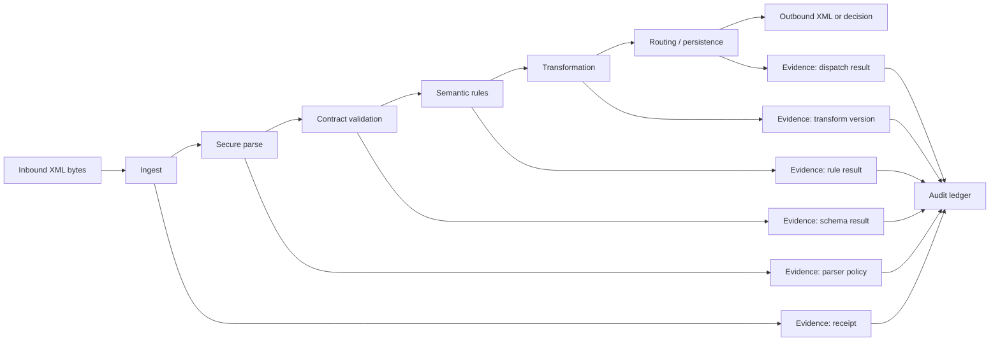
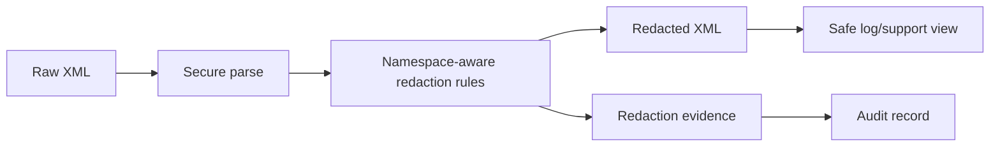
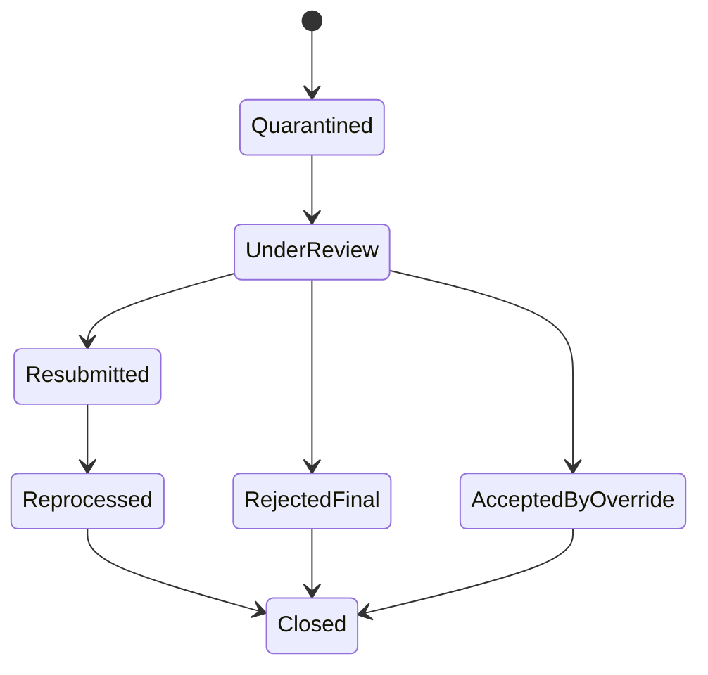
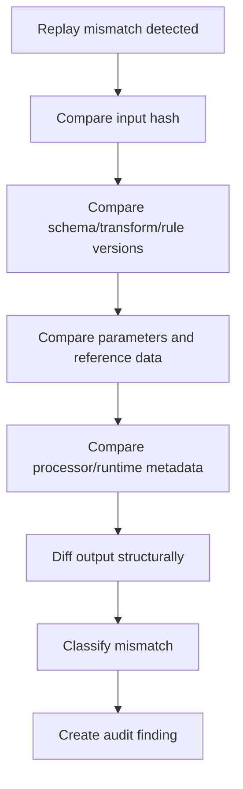

# Part 028 — Observability, Audit, and Regulatory Defensibility

> Goal: design XML-processing systems that can explain what happened, why it happened, which contract/rules were used, which payload version was processed, which transformation ran, what was emitted, what failed, and whether sensitive data was protected.

In XML-heavy enterprise systems, the output document is rarely the whole story. The real requirement is often:

> “Can we prove that this payload was received, interpreted, validated, transformed, routed, stored, rejected, or reported correctly under the rules active at that time?”

That is the domain of observability and audit.

Observability answers operational questions:

- Is the pipeline healthy?
- Where are failures happening?
- Which partners or contracts are affected?
- Did latency or payload size spike?
- Are transformations producing unexpected rejection rates?

Audit answers defensibility questions:

- What exact input was processed?
- Which schema version validated it?
- Which transformation version produced the output?
- Which rules were applied?
- Who or what triggered reprocessing?
- Was sensitive data protected?
- Can we replay the decision deterministically?

A mature XML platform treats both as first-class engineering concerns.

---

## 1. Kaufman Frame: What Skill Are We Building?

The skill:

> Given a production XML pipeline, design the logs, metrics, traces, audit records, payload lineage, replay evidence, and redaction controls needed to debug incidents and defend processing decisions.

Sub-skills:

| Sub-skill | What you must be able to do |
|---|---|
| Event modeling | Represent XML processing as stage-level lifecycle events. |
| Evidence capture | Store enough metadata to prove what happened without leaking secrets. |
| Metrics design | Track volume, latency, failure class, payload size, version, and partner health. |
| Log design | Write structured, safe, correlation-friendly logs. |
| Trace design | Connect parsing, validation, transformation, routing, and downstream calls. |
| Audit modeling | Store immutable decision records with schema/rule/transform versions. |
| Redaction | Prevent sensitive XML content from leaking to logs and support tools. |
| Replay | Re-run processing with controlled versions and compare outcomes. |
| Regulatory explanation | Produce human-readable and machine-readable evidence for review. |

This is not generic “add logs”. It is designing an evidence system around XML processing.

---

## 2. Mental Model: XML Pipeline as Evidence-Producing Machine

A production XML pipeline should produce two outputs:

1. the business output, such as accepted message, transformed XML, report, or rejection;
2. the evidence output, such as processing events, metrics, audit records, hashes, and replay bundle references.



The invariant:

> Every important processing decision must leave enough evidence to reconstruct the decision path later.

---

## 3. Observability vs Audit

Do not confuse these concepts.

| Concern | Observability | Audit |
|---|---|---|
| Primary user | Engineer/operator | Compliance, support, legal, regulator, business reviewer |
| Main question | Is the system working? | Can we prove what happened? |
| Data shape | Metrics, logs, traces, dashboards | Immutable records, evidence bundles, lineage, signed/hash-linked artifacts |
| Retention | Often shorter | Often longer, policy-driven |
| Granularity | Aggregated and sampled where possible | Complete for regulated events |
| Privacy posture | Avoid payload content | Strict minimization and redaction |
| Mutation | Logs may be rotated | Audit records should be append-only/controlled |

A system can be observable but not auditable. For regulatory systems, that is not enough.

---

## 4. Correlation Model

Correlation is the backbone of XML observability.

Recommended identifiers:

| ID | Purpose |
|---|---|
| `correlationId` | End-to-end journey across services. |
| `messageId` | Unique inbound message instance. |
| `payloadHash` | Stable hash of canonical or raw payload bytes. |
| `contractId` | Logical contract, such as `invoice-v1`. |
| `schemaVersion` | Exact schema artifact version. |
| `transformId` | Logical transformation name. |
| `transformVersion` | Exact stylesheet/query/code mapping version. |
| `partnerId` | External sender/receiver identity. |
| `caseId` | Business/regulatory case identifier when applicable. |
| `replayId` | Unique replay attempt identifier. |

Example processing context:

```java
public record XmlProcessingContext(
    String correlationId,
    String messageId,
    String partnerId,
    String contractId,
    String schemaVersion,
    String transformId,
    String transformVersion,
    String payloadHash,
    String receivedAt
) { }
```

Do not rely on XPath-extracted business IDs alone. A malformed or rejected XML may not contain valid business IDs.

---

## 5. Stage-Level Event Model

A good XML pipeline emits events per stage.

```java
public record XmlProcessingEvent(
    String correlationId,
    String messageId,
    String stage,
    String outcome,
    String reasonCode,
    String contractId,
    String schemaVersion,
    String transformId,
    String transformVersion,
    long durationMillis,
    long payloadBytes,
    String safeMessage
) { }
```

Stages:

| Stage | Typical outcome |
|---|---|
| `RECEIVED` | accepted for processing / rejected by size/type guard |
| `PARSED` | parsed / malformed XML |
| `VALIDATED` | valid / XSD invalid |
| `SEMANTIC_CHECKED` | accepted / business rule rejected |
| `ENRICHED` | enriched / reference data unavailable |
| `TRANSFORMED` | transformed / mapping failure |
| `OUTPUT_VALIDATED` | valid / generated invalid output |
| `ROUTED` | dispatched / downstream unavailable |
| `PERSISTED` | stored / persistence failed |
| `QUARANTINED` | quarantined / quarantine failure |
| `REPLAYED` | replay success / replay mismatch |

Each stage should have a bounded set of outcome codes. Free-text errors are not enough.

---

## 6. Metrics Design

Metrics should answer operational questions quickly.

### 6.1 Core XML pipeline metrics

| Metric | Dimensions | Why it matters |
|---|---|---|
| `xml.messages.received.count` | partner, contract, version | Volume and partner activity. |
| `xml.messages.accepted.count` | partner, contract, version | Accepted traffic. |
| `xml.messages.rejected.count` | partner, contract, reason | Rejection rate and root cause. |
| `xml.validation.duration` | contract, schemaVersion | Slow schema validation detection. |
| `xml.transformation.duration` | transformId, transformVersion | Slow stylesheet/query detection. |
| `xml.payload.size.bytes` | partner, contract | Large payload anomalies. |
| `xml.quarantine.count` | reason, partner | Operational backlog. |
| `xml.replay.count` | outcome, transformVersion | Replay activity and mismatch. |
| `xml.output.validation.failed.count` | transformId, schemaVersion | Mapping defects. |

### 6.2 Avoid high-cardinality labels

Do not put these in metric labels:

- full invoice ID;
- customer ID;
- raw filename if unbounded;
- full XPath location if unbounded;
- exception message;
- payload hash;
- case title;
- free-form partner reference.

High-cardinality fields belong in logs or audit records, not time-series dimensions.

### 6.3 SLO examples

| SLO | Example |
|---|---|
| Ingest availability | 99.9% of XML submissions accepted for processing when syntactically eligible. |
| Validation latency | 95% of payloads under 2 MB validated under 250 ms. |
| Transformation latency | 95% of standard transformations under 500 ms. |
| Quarantine handling | 99% of quarantined messages classified within 15 minutes. |
| Replay determinism | 100% deterministic replay for stored contract/transform versions unless external enrichment is explicitly non-deterministic. |

SLOs should be scoped by payload size and contract. Otherwise, one huge batch file can make the system look broken.

---

## 7. Structured Logging

Logs are for investigation, not payload dumping.

A structured log event:

```json
{
  "event": "xml.validation.failed",
  "correlationId": "corr-8f1d",
  "messageId": "msg-20260702-0001",
  "partnerId": "partner-a",
  "contractId": "invoice-v1",
  "schemaVersion": "1.4.2",
  "reasonCode": "XSD_REQUIRED_ELEMENT_MISSING",
  "location": "/inv:Invoice/inv:Header/inv:BuyerId",
  "line": 42,
  "column": 17,
  "payloadHash": "sha256:...",
  "safeMessage": "Required element BuyerId is missing"
}
```

Rules:

1. Log event name, not only message text.
2. Include correlation identifiers.
3. Include contract/schema/transform versions.
4. Include safe location if available.
5. Never log raw XML by default.
6. Redact sensitive values before logging.
7. Use stable reason codes.

Bad log:

```text
Error processing xml: javax.xml.transform.TransformerException: failed
```

Better log:

```text
event=xml.transform.failed correlationId=corr-8f1d messageId=msg-1 transformId=invoice-to-report transformVersion=3.2.0 reasonCode=MAPPING_REQUIRED_SOURCE_MISSING sourcePath=/inv:Invoice/inv:BuyerId
```

---

## 8. Redaction and Safe Payload Handling

XML payloads often contain sensitive data:

- national IDs;
- tax IDs;
- names;
- addresses;
- health information;
- payment details;
- authentication tokens;
- internal risk scores;
- investigation notes.

Design a redaction policy using namespace-aware paths.

```yaml
redactionPolicy: invoice-v1
rules:
  - path: /inv:Invoice/inv:Buyer/inv:NationalId
    action: mask
    replacement: "***"
  - path: /inv:Invoice/inv:Payment/inv:CardNumber
    action: remove
  - path: /inv:Invoice/inv:InternalRiskScore
    action: remove
  - path: /inv:Invoice/inv:Contact/inv:Email
    action: hash
```

Do not use regex over raw XML for serious redaction. Regex may miss namespace variations, whitespace, CDATA, escaped content, or repeated structures. Use XML-aware redaction.

### 8.1 Redaction pipeline



### 8.2 Redaction test requirements

Test that:

- forbidden nodes are absent;
- masked nodes do not leak original values;
- namespace-qualified paths work;
- unknown namespace version is rejected or handled explicitly;
- redaction failure blocks unsafe logging;
- support UI uses redacted view by default.

---

## 9. Audit Record Design

An audit record should preserve decision evidence without needing to read logs.

```java
public record XmlAuditRecord(
    String auditId,
    String correlationId,
    String messageId,
    String partnerId,
    String caseId,
    String contractId,
    String schemaVersion,
    String transformId,
    String transformVersion,
    String ruleSetVersion,
    String inputPayloadHash,
    String outputPayloadHash,
    String outcome,
    String reasonCode,
    String failureStage,
    String receivedAt,
    String completedAt,
    String replayBundleId
) { }
```

Recommended audit fields:

| Field | Purpose |
|---|---|
| `auditId` | Stable audit record identity. |
| `messageId` | Inbound message identity. |
| `correlationId` | Cross-service traceability. |
| `partnerId` | Sender/receiver accountability. |
| `contractId` | Logical XML contract. |
| `schemaVersion` | Exact schema used. |
| `ruleSetVersion` | Exact semantic rule set used. |
| `transformVersion` | Exact mapping used. |
| `inputPayloadHash` | Integrity reference. |
| `outputPayloadHash` | Output integrity reference. |
| `outcome` | Accepted/rejected/quarantined/dispatched. |
| `reasonCode` | Machine-readable decision reason. |
| `failureStage` | Stage where failure occurred. |
| `replayBundleId` | Link to replay evidence. |

Avoid storing unbounded raw XML inside the audit table. Store payloads in controlled object storage or archive storage, then reference them with immutable IDs and hashes.

---

## 10. Payload Hashing and Integrity

Hashing helps prove that the payload inspected later is the same payload processed earlier.

```java
import java.security.MessageDigest;
import java.util.HexFormat;

public final class PayloadHashes {

    public static String sha256(byte[] payload) {
        try {
            MessageDigest digest = MessageDigest.getInstance("SHA-256");
            return "sha256:" + HexFormat.of().formatHex(digest.digest(payload));
        } catch (Exception e) {
            throw new IllegalStateException("SHA-256 unavailable", e);
        }
    }
}
```

Decide what is hashed:

| Hash type | Use |
|---|---|
| Raw byte hash | Proves exact inbound bytes. Sensitive to line endings/encoding. |
| Canonical XML hash | Proves logical XML equivalence under canonicalization rules. Useful for signing/dedup where appropriate. |
| Redacted view hash | Proves what support/reviewer saw. |
| Output hash | Proves exact generated artifact. |

For regulated workflows, raw byte hash and output byte hash are usually important. Canonical hash may be useful but should not replace raw evidence unless the business explicitly accepts canonical equivalence.

---

## 11. Replay Bundle Design

Replay is the ability to re-run a past processing decision.

A replay bundle should include:

```text
replay-bundle/
  manifest.yml
  input/raw-payload.xml.enc
  input/raw-payload.sha256
  schemas/invoice-v1-1.4.2.xsd
  schemas/catalog.xml
  transforms/invoice-to-report-3.2.0.xsl
  rules/ruleset-2026-07-01.yml
  reference-data/reference-data-snapshot.json
  output/original-output.xml.enc
  output/original-output.sha256
  diagnostics/original-events.jsonl
```

Manifest:

```yaml
replayBundleId: rb-20260702-0001
messageId: msg-20260702-0001
contractId: invoice-v1
schemaVersion: 1.4.2
transformId: invoice-to-report
transformVersion: 3.2.0
ruleSetVersion: 2026-07-01
inputPayloadHash: sha256:...
outputPayloadHash: sha256:...
externalAccessPolicy: deny-all
createdAt: 2026-07-02T10:15:30Z
```

Replay requires deterministic dependencies. If transformation depends on current reference data, current date, random IDs, or downstream services, capture those values as inputs.

---

## 12. Deterministic Transformation Evidence

For each transformation, record:

- transformation ID;
- version;
- processor implementation and relevant version if operationally important;
- parameters;
- source contract;
- target contract;
- input hash;
- output hash;
- validation result;
- warnings;
- duration;
- external document access policy;
- URI resolver decisions.

Example event:

```json
{
  "event": "xml.transform.completed",
  "correlationId": "corr-8f1d",
  "messageId": "msg-20260702-0001",
  "transformId": "invoice-to-reg-report",
  "transformVersion": "3.2.0",
  "sourceContract": "invoice-v1",
  "targetContract": "reg-report-v3",
  "inputPayloadHash": "sha256:...",
  "outputPayloadHash": "sha256:...",
  "durationMillis": 187,
  "externalAccessPolicy": "deny-all",
  "outcome": "SUCCESS"
}
```

Do not allow a transformation runtime to silently use “latest stylesheet”. “Latest” is not defensible after a rule changes.

---

## 13. Validation Evidence

Validation evidence should distinguish:

- parse failed;
- schema resolution failed;
- schema compilation failed;
- XML failed validation;
- semantic rule failed;
- output validation failed.

Example validation result:

```json
{
  "stage": "VALIDATED",
  "outcome": "FAILED",
  "contractId": "invoice-v1",
  "schemaVersion": "1.4.2",
  "reasonCode": "XSD_REQUIRED_ELEMENT_MISSING",
  "location": {
    "xpath": "/inv:Invoice/inv:Header/inv:BuyerId",
    "line": 42,
    "column": 17
  },
  "safeMessage": "Required element BuyerId is missing"
}
```

For multiple validation errors, choose policy:

| Policy | Use |
|---|---|
| Fail-fast | High-throughput pipelines, immediate rejection. |
| Error aggregation | Partner onboarding, support feedback, regulatory submission reports. |
| Hybrid | Stop on unsafe parse errors, aggregate safe schema/business errors. |

The policy must be explicit and tested.

---

## 14. Audit-Friendly Error Taxonomy

Define stable error codes.

| Code | Meaning |
|---|---|
| `XML_SIZE_LIMIT_EXCEEDED` | Payload exceeded configured size limit. |
| `XML_MALFORMED` | XML was not well-formed. |
| `XML_UNSUPPORTED_NAMESPACE` | Namespace URI not supported. |
| `XML_UNSUPPORTED_VERSION` | Contract version not supported. |
| `XSD_VALIDATION_FAILED` | XSD validation failed. |
| `XSD_SCHEMA_RESOLUTION_FAILED` | Schema dependency could not be resolved. |
| `RULE_VALIDATION_FAILED` | Business rule rejected payload. |
| `TRANSFORM_FAILED` | Transformation runtime failed. |
| `OUTPUT_VALIDATION_FAILED` | Generated output failed target contract. |
| `ROUTING_FAILED_RETRYABLE` | Dispatch failed and may be retried. |
| `ROUTING_FAILED_FINAL` | Dispatch failed permanently. |
| `REDACTION_FAILED` | Safe view could not be produced. |
| `REPLAY_MISMATCH` | Replay result differs from original evidence. |

Each error code should define:

- retryability;
- owner;
- support action;
- customer/partner-visible message;
- internal diagnostic fields;
- whether payload enters quarantine;
- whether manual review is required.

---

## 15. Quarantine and Manual Review Observability

Not every XML failure should be thrown away.

Use quarantine for:

- partner payload rejected due to recoverable format issue;
- validation failures needing support review;
- transformation output mismatch;
- suspicious payload patterns;
- downstream dispatch failures;
- replay mismatch;
- redaction failure.

Quarantine record:

```java
public record XmlQuarantineRecord(
    String quarantineId,
    String messageId,
    String correlationId,
    String partnerId,
    String contractId,
    String reasonCode,
    String failureStage,
    String payloadHash,
    String safePreviewId,
    String assignedQueue,
    String status
) { }
```

Workflow states:



Manual override must be audited:

- who approved;
- why;
- what evidence was reviewed;
- what rule was overridden;
- whether output changed;
- whether partner was notified.

---

## 16. Regulatory Defensibility

A defensible XML system can answer:

1. What did we receive?
2. When did we receive it?
3. Who sent it?
4. Was it parsed safely?
5. Which contract was applied?
6. Which schema version was used?
7. Which semantic rules were used?
8. Which transformation was used?
9. What output was generated?
10. Was the output valid?
11. Where was it sent?
12. What failed, if anything?
13. Was sensitive data protected?
14. Can we replay the decision?
15. Did replay match the original result?

This is not only for regulators. It also helps internal engineering because incidents become evidence-driven instead of opinion-driven.

---

## 17. Data Retention and Minimization

Audit wants retention. Privacy wants minimization. Engineering must design the boundary.

| Data | Retention pattern |
|---|---|
| Raw XML payload | Store only when needed, encrypted, access-controlled, lifecycle-managed. |
| Redacted XML view | Store for support/debug use with shorter review path. |
| Payload hash | Store long-term as integrity reference. |
| Audit record | Store according to regulatory/business policy. |
| Metrics | Aggregated, usually less sensitive. |
| Logs | Shorter retention, no raw sensitive payload. |
| Replay bundle | Store for critical decisions with strict access and retention. |

Do not store raw XML indefinitely “just in case”. That creates risk and cost.

---

## 18. Safe Support Views

Support teams often need to inspect XML failures. Give them safe tools.

A support view should show:

- message ID;
- partner;
- received time;
- contract/version;
- validation errors;
- safe XPath locations;
- redacted XML preview;
- stage history;
- retry/replay status;
- allowed actions.

It should not show by default:

- raw personal identifiers;
- secrets;
- payment details;
- health data;
- internal investigation fields;
- access tokens;
- full unredacted payload.

Access to raw XML should require stronger authorization and should itself create an audit event.

---

## 19. Tracing XML Pipelines

Distributed tracing is useful when XML processing spans services.

Trace spans:

```text
xml.ingest
  xml.parse
  xml.validate.xsd
  xml.extract.metadata
  xml.validate.semantic
  xml.transform
  xml.validate.output
  xml.persist
  xml.dispatch
```

Recommended span attributes:

- `xml.contract_id`;
- `xml.schema_version`;
- `xml.transform_id`;
- `xml.transform_version`;
- `xml.payload_size_bucket`;
- `xml.outcome`;
- `xml.reason_code`;
- `partner.id`.

Do not add raw XML or sensitive field values to traces.

Use traces to answer:

- which stage consumed latency;
- whether schema validation or transformation caused slowdown;
- which downstream dispatch failed;
- whether retries duplicated processing;
- whether processing crossed expected service boundaries.

---

## 20. Dashboard Design

Operational dashboards should be contract-aware.

### 20.1 XML pipeline overview

Panels:

- messages received by partner and contract;
- accept/reject rate;
- top rejection reason codes;
- validation latency percentile;
- transformation latency percentile;
- payload size distribution;
- quarantine backlog;
- replay mismatch count;
- output validation failures;
- external access denial count.

### 20.2 Partner health dashboard

Panels:

- partner volume over time;
- partner rejection rate;
- schema version distribution;
- unsupported version attempts;
- top validation errors;
- late/missing batch files;
- acknowledgement latency.

### 20.3 Release health dashboard

Panels:

- transform version adoption;
- schema version adoption;
- rejection-rate change after deployment;
- output validation failures after deployment;
- performance regression by payload size bucket;
- replay success rate.

Dashboards should show both absolute count and rate. A partner with high failure count may simply have high traffic; a low-volume partner with 80% rejection rate may be more urgent.

---

## 21. Alerting Strategy

Alert on symptoms requiring action.

Good alerts:

- output validation failure rate > 0 for critical transform;
- rejection rate spikes above baseline for a partner;
- quarantine backlog exceeds threshold;
- transformation latency exceeds SLO;
- replay mismatch detected;
- redaction failure detected;
- external XML access attempt detected;
- unsupported schema version spike;
- batch file missing after SLA window.

Bad alerts:

- every single validation error;
- every partner typo;
- every malformed test submission;
- raw exception count without severity or impact.

Alert fatigue destroys operational discipline. Use dashboards for awareness, alerts for required intervention.

---

## 22. Replay Mismatch Analysis

A replay mismatch is serious.

Possible causes:

| Cause | Explanation |
|---|---|
| Missing dependency snapshot | Reference data changed. |
| Non-versioned transform | Replay used new mapping. |
| Non-deterministic parameter | Current date/time/random ID changed. |
| Processor/runtime change | XML processor behavior changed. |
| External document access | Transformation fetched a different resource. |
| Serialization difference | Output formatting changed. |
| Original evidence incomplete | Cannot reconstruct original environment. |

Replay mismatch workflow:



Do not silently overwrite original evidence with replay output.

---

## 23. Implementation Pattern: Evidence Sink

Keep evidence capture separate from business logic.

```java
public interface XmlEvidenceSink {
    void record(XmlProcessingEvent event);
    void recordAudit(XmlAuditRecord auditRecord);
    void recordQuarantine(XmlQuarantineRecord quarantineRecord);
}
```

Pipeline stage:

```java
public final class ValidatingStage {

    private final XmlValidator validator;
    private final XmlEvidenceSink evidenceSink;

    public ValidationResult validate(XmlProcessingContext context, byte[] payload) {
        long start = System.nanoTime();
        try {
            ValidationResult result = validator.validate(payload);
            evidenceSink.record(new XmlProcessingEvent(
                context.correlationId(),
                context.messageId(),
                "VALIDATED",
                result.accepted() ? "SUCCESS" : "FAILED",
                result.reasonCode(),
                context.contractId(),
                context.schemaVersion(),
                context.transformId(),
                context.transformVersion(),
                elapsedMillis(start),
                payload.length,
                result.safeMessage()
            ));
            return result;
        } catch (RuntimeException ex) {
            evidenceSink.record(new XmlProcessingEvent(
                context.correlationId(),
                context.messageId(),
                "VALIDATED",
                "ERROR",
                "VALIDATION_RUNTIME_ERROR",
                context.contractId(),
                context.schemaVersion(),
                context.transformId(),
                context.transformVersion(),
                elapsedMillis(start),
                payload.length,
                "Validation runtime error"
            ));
            throw ex;
        }
    }

    private static long elapsedMillis(long startNanos) {
        return (System.nanoTime() - startNanos) / 1_000_000;
    }
}
```

This pattern prevents each stage from inventing its own logging/audit behavior.

---

## 24. Common Anti-Patterns

### Anti-pattern 1: Raw XML in logs

This creates privacy, cost, and security risk.

Fix: log IDs, hashes, safe locations, and redacted snippets only when explicitly allowed.

### Anti-pattern 2: “Latest schema” in audit record

An audit record that says “latest” is useless after deployment.

Fix: persist exact schema artifact version.

### Anti-pattern 3: Transformation without version evidence

If you cannot prove which stylesheet ran, you cannot defend output.

Fix: every transform run records transform ID and version.

### Anti-pattern 4: Validation failure without XPath/location

Support cannot diagnose quickly.

Fix: capture line/column and safe logical path where possible.

### Anti-pattern 5: Metrics with high-cardinality labels

This damages observability systems.

Fix: keep unbounded IDs in logs/audit, not metrics labels.

### Anti-pattern 6: Replay without dependency snapshot

Replay result differs and nobody knows why.

Fix: snapshot schema, transform, rules, parameters, reference data, and external access decisions.

### Anti-pattern 7: Audit table as payload dump

This mixes evidence and sensitive content.

Fix: separate audit metadata from encrypted payload archive.

---

## 25. Practice Lab

Extend the XML pipeline from previous parts.

### Step 1 — Add correlation model

Generate:

- correlation ID;
- message ID;
- payload hash;
- contract ID;
- schema version;
- transform version.

### Step 2 — Emit stage events

Emit events for:

- received;
- parsed;
- validated;
- transformed;
- output validated;
- routed;
- quarantined.

### Step 3 — Add metrics

Track:

- message count;
- validation failures;
- transformation failures;
- latency;
- payload size;
- quarantine count.

### Step 4 — Add redacted view

Define redaction rules and create a support-safe XML preview.

### Step 5 — Add audit record

Store immutable record with:

- input hash;
- output hash;
- schema/transform/rule versions;
- outcome;
- reason code;
- replay bundle ID.

### Step 6 — Add replay bundle

Create a replay manifest with all deterministic dependencies.

### Step 7 — Test the evidence

Write tests that prove:

- no raw sensitive XML appears in logs;
- validation failure has reason code;
- output validation failure creates quarantine;
- audit record includes schema and transform version;
- replay bundle contains exact transform artifact;
- replay produces same output hash.

---

## 26. Production Checklist

Before approving an XML pipeline for regulated/enterprise use, verify:

- [ ] Every message has correlation ID and message ID.
- [ ] Raw payload hash is recorded.
- [ ] Contract ID and schema version are recorded.
- [ ] Transform ID and transform version are recorded.
- [ ] Semantic rule set version is recorded where applicable.
- [ ] Stage-level outcome events are emitted.
- [ ] Metrics are dimensioned by partner, contract, version, and reason code without unbounded cardinality.
- [ ] Logs are structured and payload-safe.
- [ ] Redaction policy is namespace-aware and tested.
- [ ] Audit records are immutable or controlled append-only.
- [ ] Raw payload storage is encrypted and access-controlled.
- [ ] Replay bundles include dependencies and hashes.
- [ ] Quarantine workflow is observable and auditable.
- [ ] Manual overrides create audit events.
- [ ] Alerts focus on actionable conditions.
- [ ] Support views default to redacted XML.
- [ ] Retention policy balances audit and minimization.

---

## 27. Key Takeaways

1. XML observability must be contract-aware: partner, schema version, transform version, reason code, and payload size matter.
2. Audit is not the same as logging. Audit is durable decision evidence.
3. Never rely on “latest” schema or stylesheet in regulated processing evidence.
4. Hash raw input and output artifacts to support integrity and replay.
5. Redaction must be XML-aware and namespace-aware.
6. Replay requires dependency snapshots, not just the original XML.
7. A defensible XML system can explain both successful and failed processing.
8. The best audit system is designed into the pipeline, not reconstructed during an incident.

---

## References

- OWASP Logging Cheat Sheet describes categories of data that should not be logged, including access tokens, sensitive personal data, passwords, connection strings, encryption keys, and payment data: https://cheatsheetseries.owasp.org/cheatsheets/Logging_Cheat_Sheet.html
- Oracle JAXP Security Guide covers secure XML processing, processing limits, and external access restrictions: https://docs.oracle.com/en/java/javase/24/security/java-api-xml-processing-jaxp-security-guide.html
- W3C Canonical XML 1.1 defines canonical XML as a normalized physical representation useful when XML equivalence and signatures matter: https://www.w3.org/TR/xml-c14n11/
