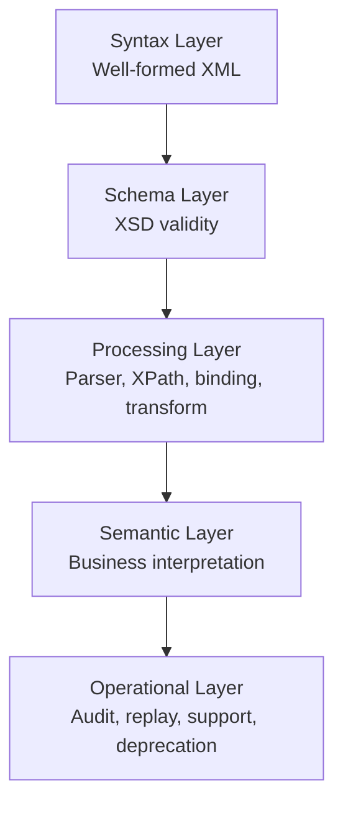
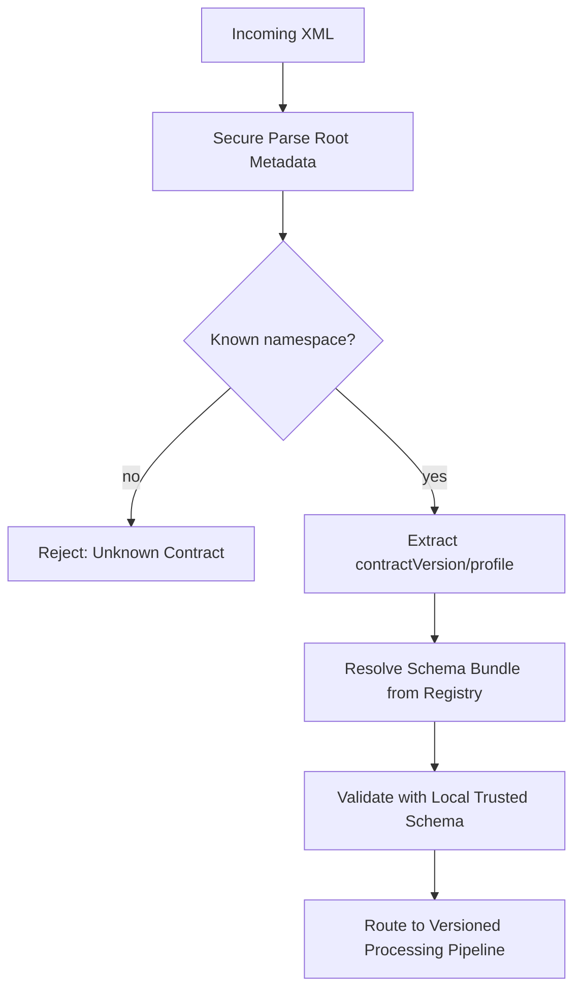
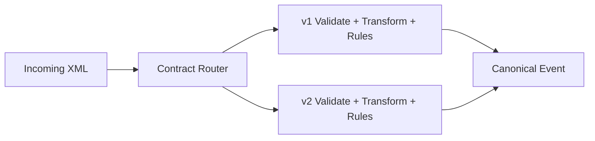
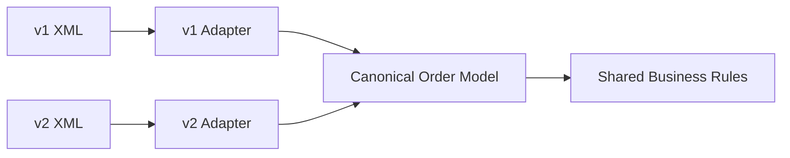
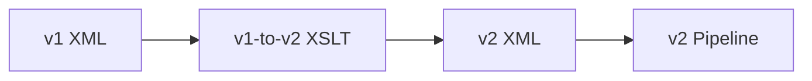
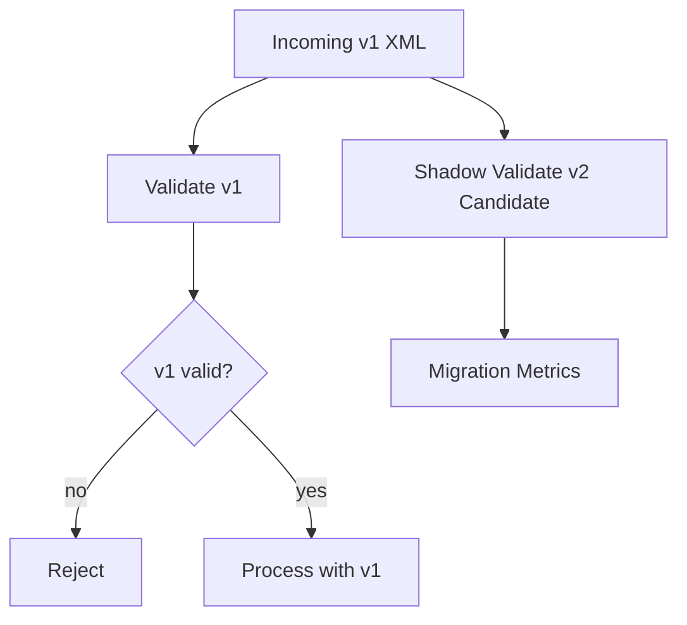
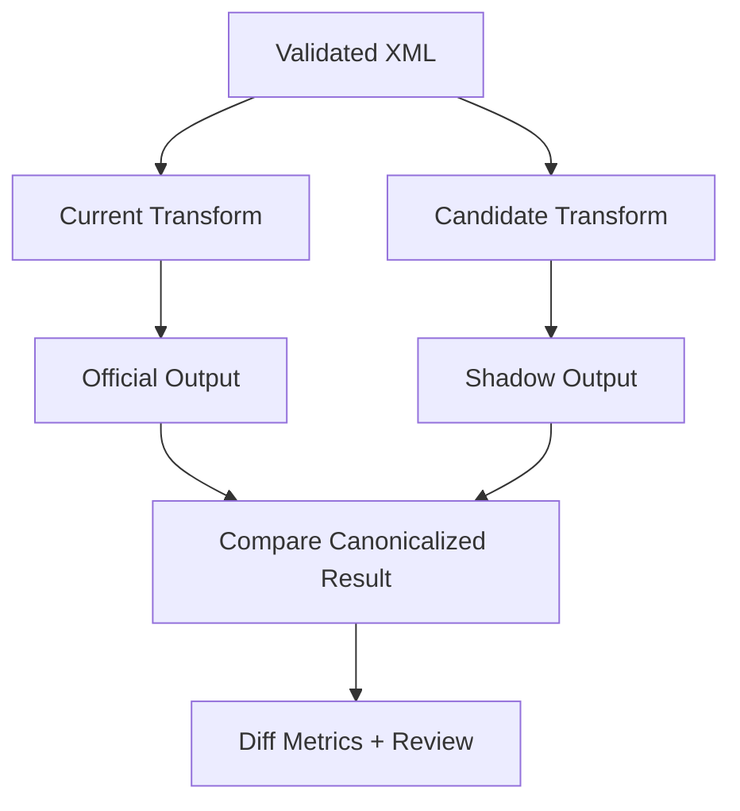
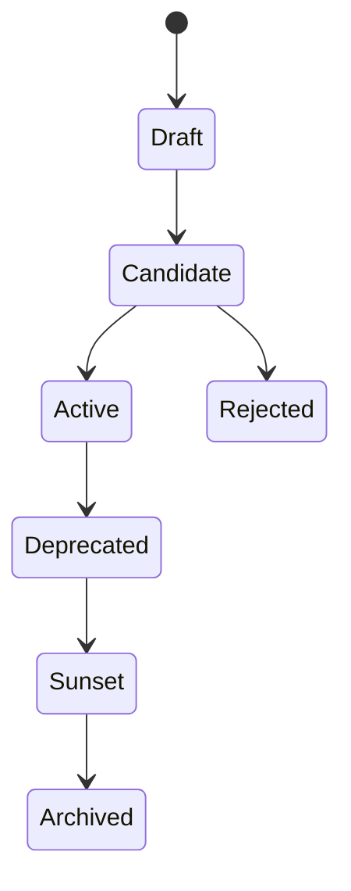

# Part 029 — XML Versioning, Compatibility, and Change Management

> Goal: design XML contracts that can evolve safely across services, partners, files, transformations, validation rules, and audit history without breaking production consumers.

XML versioning is not just a schema naming problem.

It is a distributed systems problem with a document format attached.

A production XML contract usually sits between multiple independently changing actors:

- the producer that emits XML,
- the consumer that parses XML,
- the XSD bundle that validates XML,
- the transformation layer that maps XML to another representation,
- the business-rule layer that interprets XML,
- the audit/replay layer that preserves evidence,
- the partner or regulator that may not upgrade on your timeline,
- and the operations team that must explain failures after deployment.

The hard part is not creating `v2.xsd`. The hard part is ensuring that version `v1`, `v1.1`, `v2`, partner-specific profiles, canonical models, transformation maps, error codes, and replay bundles all remain understandable, traceable, and safe.

This part builds the mental model and implementation patterns for that.

---

## 1. Kaufman Frame: What Skill Are We Building?

The skill:

> Given an existing XML contract used by multiple systems, design a safe evolution strategy that classifies changes, preserves compatibility where possible, introduces new versions where required, supports migration, and gives operations enough evidence to debug failures.

Sub-skills:

1. Identify the compatibility surface of an XML contract.
2. Classify changes as backward-compatible, forward-compatible, breaking, or semantically risky.
3. Choose namespace, schema location, type, and element versioning strategy.
4. Support multiple schema versions at runtime.
5. Implement dual validation and dual transformation during migrations.
6. Govern extension points without letting contracts become garbage bags.
7. Design partner rollout and deprecation workflows.
8. Preserve audit/replay correctness across contract versions.
9. Test compatibility with fixtures and consumer-driven examples.
10. Communicate contract change impact before deployment.

The learning target is practical:

> You should be able to review an XML contract change and predict who breaks, who silently misinterprets data, what has to be tested, and what runtime mechanism is needed to support the rollout.

---

## 2. The Core Mental Model: XML Compatibility Is About Meaning, Not Tags

A weak versioning model asks:

> “Did the XML validate?”

A stronger model asks:

> “Can every relevant consumer still interpret the document correctly under the contract it expects?”

These are different questions.

An XML payload can be schema-valid and still break a consumer because:

- a formerly optional field became required by business logic,
- a decimal precision changed,
- an enum value was added but downstream uses a closed switch statement,
- a namespace changed and XPath selectors no longer match,
- an element moved from one branch to another,
- a default value changed,
- a transformation assumes old ordering,
- a partner treats unknown elements as fatal even if the schema allows extension,
- the schema accepts both old and new structures but the semantic validator does not.

Compatibility is therefore a contract between four layers:



A production versioning strategy must preserve all five layers.

---

## 3. The Compatibility Surface

Before changing a contract, identify its compatibility surface.

The compatibility surface is every place where another system depends on the exact or implied shape of the XML.

Common dependency points:

| Surface | Example dependency | Risk |
|---|---|---|
| Root element | `/ord:Order` | Namespace/root changes break routing. |
| Namespace URI | `http://example.com/order/v1` | XPath, XSD import, JAXB binding, and partner validation may fail. |
| Element path | `/Order/Customer/Id` | Moving an element breaks extraction. |
| Cardinality | `minOccurs`, `maxOccurs` | Required/optional changes affect validation and code assumptions. |
| Datatype | `xs:string` to `xs:decimal` | Binding, validation, and transformation can fail. |
| Facets | max length, pattern, enum | Downstream storage and switch logic can break. |
| Default/fixed values | implicit status | Consumers may infer changed meaning silently. |
| Attribute vs element | `currency="USD"` vs `<Currency>` | XPath and binding break. |
| Order in sequence | XSD sequence order | Writers/validators may reject old ordering. |
| Extension point | `xs:any` | Consumers may ignore, reject, or mishandle extensions. |
| Error codes | `E101` | Support automation may route incorrectly. |
| Transformation output | partner-specific XML | Breaks consumers even if canonical input is valid. |
| Audit evidence | schema version field | Replay becomes ambiguous if not versioned. |

A schema file is only one artifact. The real contract includes code, fixtures, XPath expressions, documentation, mappings, and operational playbooks.

---

## 4. Change Classification

Every proposed XML change should be classified before implementation.

Use four categories.

### 4.1 Backward-Compatible Change

A new producer can send the new version, and old consumers can still process it correctly.

Examples, if consumers are designed correctly:

- adding an optional element at a safe extension location,
- adding an optional attribute that consumers ignore,
- relaxing a max length when downstream storage can handle it,
- adding a new optional section not required for old use cases,
- adding a new namespace-qualified extension under `xs:any` with `processContents="lax"`.

Caution: “schema-compatible” does not automatically mean “consumer-compatible”.

Adding an enum value is often schema-compatible for the producer but breaking for consumers with exhaustive switch logic.

### 4.2 Forward-Compatible Change

An old producer can still send old XML, and a new consumer can process it correctly.

Examples:

- new consumer accepts missing new optional field,
- new consumer handles old namespace and maps it to new canonical form,
- new consumer supports default behavior for old documents,
- validation service accepts both old and new schema versions.

Forward compatibility is mainly a consumer design property.

### 4.3 Breaking Change

Existing consumers or producers fail validation, parsing, transformation, or semantic interpretation.

Examples:

- renaming an element,
- changing namespace URI without compatibility bridge,
- making optional element required,
- changing datatype incompatibly,
- moving a field to a different path,
- removing an enum value still used in production,
- changing meaning of a value without changing its name,
- changing decimal scale when downstream stores fixed precision,
- changing identity constraints,
- changing output order required by a legacy partner.

Breaking changes require explicit versioning or coordinated deployment.

### 4.4 Semantically Risky Change

The XML remains valid and consumers still parse it, but business meaning changes.

Examples:

- `Amount` changes from gross to net,
- `Date` changes from local business date to UTC timestamp,
- `Status=APPROVED` now means automatically approved instead of manually approved,
- `CustomerId` changes from internal ID to partner ID,
- `Priority` ordering changes from `1=highest` to `1=lowest`.

These are the most dangerous changes because tests may pass while decisions become wrong.

A production governance process should treat semantic changes as breaking unless proven otherwise.

---

## 5. Compatibility Decision Matrix

Use this matrix during schema review.

| Proposed change | Usually safe? | Required checks |
|---|---:|---|
| Add optional element at end of sequence | Sometimes | Consumer ignores unknown? Binding supports? Partner validators? |
| Add optional element inside strict sequence | Risky | Old validators may reject; order-sensitive writers may fail. |
| Add required element | No | Requires new version or coordinated rollout. |
| Remove optional element | Risky | Consumers may rely semantically even if optional. |
| Rename element | No | Requires mapping bridge or new version. |
| Change namespace URI | No | Requires explicit version boundary. |
| Add enum value | Risky | Check switch statements, storage, reports, mappings. |
| Relax max length | Sometimes | Check database columns, UI, partner constraints. |
| Tighten max length | No | Existing payloads may fail. |
| Change `xs:string` to `xs:decimal` | No | Existing lexical values may fail. |
| Add `xs:any` extension point | Sometimes | Governance required; avoid unbounded semantics. |
| Change default value | Risky | Silent behavior change. |
| Add new optional attribute | Sometimes | Consumers must ignore unknown attributes safely. |
| Reorder XSD sequence | Risky | XML instance order may change and validators may fail. |
| Add new transformation target field | Sometimes | Target consumer contract decides. |

A good review does not ask, “Is it elegant?” It asks, “What exactly changes for every parser, validator, mapper, and decision point?”

---

## 6. Namespace Versioning Strategy

Namespace versioning is one of the most important design choices.

There are three common models.

### 6.1 Major Version in Namespace URI

Example:

```xml
<ord:Order xmlns:ord="https://schemas.example.com/order/v1">
    ...
</ord:Order>
```

New major version:

```xml
<ord:Order xmlns:ord="https://schemas.example.com/order/v2">
    ...
</ord:Order>
```

Use this when a change is structurally or semantically breaking.

Benefits:

- very explicit version boundary,
- XPath and schema selection are unambiguous,
- old and new contracts can coexist,
- audit records can identify contract family easily.

Costs:

- all namespace-qualified XPath expressions must be updated or mapped,
- JAXB/generated classes may duplicate,
- transformations need version-specific entry points,
- partners must opt into new namespace.

Use for major changes.

Do not create a new namespace for every small optional field change. That creates version fragmentation.

### 6.2 Stable Namespace with Version Attribute

Example:

```xml
<ord:Order xmlns:ord="https://schemas.example.com/order" version="1.2">
    ...
</ord:Order>
```

Benefits:

- XPath namespace remains stable,
- tooling may be simpler,
- minor versions can be expressed without namespace churn.

Risks:

- schema selection becomes application-specific,
- old validators may not know which version attribute matters,
- root namespace no longer gives enough information,
- semantic differences can hide behind the same QName.

Use only when the schema selection and semantic version policy are explicit.

### 6.3 Versionless Namespace with Versioned Artifacts

Example:

```text
order.xsd
order-1.0.xsd
order-1.1.xsd
order-2.0.xsd
```

Namespace stays constant; artifact version changes.

This can work inside controlled platforms, but it is dangerous for external integration because a namespace-qualified XML instance does not reveal enough about expected schema version.

If you use this model, include explicit metadata:

```xml
<ord:Order xmlns:ord="https://schemas.example.com/order"
           contractVersion="1.3"
           profile="partner-a">
    ...
</ord:Order>
```

And make schema resolution deterministic.

---

## 7. Recommended Policy: Major Namespace, Minor Compatible Version

A pragmatic enterprise policy:

1. Put **major breaking version** in namespace URI.
2. Put **minor compatible version** in metadata.
3. Keep minor versions backward-compatible inside the same major namespace.
4. Require a new namespace for incompatible structural or semantic change.
5. Use adapter transformations between major versions.
6. Keep old major versions alive for an explicit deprecation window.

Example:

```xml
<ord:Order xmlns:ord="https://schemas.example.com/order/v1"
           contractVersion="1.4"
           profile="standard">
    ...
</ord:Order>
```

This gives you:

- namespace-level routing for major versions,
- metadata-level audit for minor versions,
- explicit migration path,
- enough flexibility for compatible evolution.

---

## 8. Schema Selection at Runtime

A production XML service should not randomly load schemas by `xsi:schemaLocation` from the payload.

Payload-supplied schema locations are hints, not authority.

A safer model:



The runtime owns the schema registry.

The incoming payload may say:

```xml
xsi:schemaLocation="https://schemas.example.com/order/v1 http://random.example.com/order.xsd"
```

The service should not fetch that remote schema. It should map the namespace/version/profile to a trusted local artifact.

Schema registry entry example:

```yaml
contract: order
majorVersion: v1
minorVersion: 1.4
namespace: https://schemas.example.com/order/v1
profile: standard
schemaBundle: order-v1.4-standard.zip
status: active
validFrom: 2026-07-01T00:00:00Z
validTo: null
compatibleWith:
  - 1.2
  - 1.3
```

Runtime rule:

> Contract resolution is a policy decision, not a network lookup.

---

## 9. Versioned Java Validation Service

A versioned validation service should separate:

- schema bundle loading,
- contract resolution,
- validation execution,
- error mapping,
- audit evidence.

Example model:

```java
public record XmlContractKey(
        String contractName,
        String namespaceUri,
        String majorVersion,
        String minorVersion,
        String profile
) {}

public record ValidationRequest(
        String correlationId,
        byte[] payload,
        XmlContractKey declaredContract
) {}

public record ValidationResult(
        boolean valid,
        XmlContractKey resolvedContract,
        String schemaBundleId,
        String schemaBundleHash,
        List<ValidationError> errors
) {}
```

Resolution should be explicit:

```java
public interface XmlContractRegistry {
    ResolvedXmlContract resolve(XmlContractKey key);
}

public record ResolvedXmlContract(
        XmlContractKey key,
        javax.xml.validation.Schema schema,
        String schemaBundleId,
        String schemaBundleHash,
        ContractStatus status
) {}
```

A common anti-pattern is passing arbitrary `File xsd` into validation logic. That makes runtime behavior hard to audit.

Better:

```java
public final class VersionedXmlValidator {
    private final XmlContractRegistry registry;

    public ValidationResult validate(ValidationRequest request) {
        ResolvedXmlContract contract = registry.resolve(request.declaredContract());

        Validator validator = contract.schema().newValidator();
        CollectingErrorHandler errors = new CollectingErrorHandler();
        validator.setErrorHandler(errors);

        try {
            validator.validate(new StreamSource(new ByteArrayInputStream(request.payload())));
        } catch (SAXException | IOException ex) {
            errors.addFatal(ex);
        }

        return new ValidationResult(
                errors.isEmpty(),
                contract.key(),
                contract.schemaBundleId(),
                contract.schemaBundleHash(),
                errors.toList()
        );
    }
}
```

Important lifecycle point:

- cache compiled `Schema`,
- create a fresh `Validator` per validation operation,
- record schema bundle identity in audit evidence,
- never depend on mutable classpath resources without artifact identity.

---

## 10. Supporting Multiple Versions at Runtime

There are four common runtime strategies.

### 10.1 Parallel Versioned Pipelines

Each major version has its own pipeline.



Pros:

- clear isolation,
- safe for breaking changes,
- simple audit,
- version-specific failures are visible.

Cons:

- duplicated logic,
- more tests,
- more operations surface.

Use when major versions differ significantly.

### 10.2 Normalize to Canonical Model

Version-specific adapters map XML into a stable internal canonical model.



Pros:

- shared downstream rules,
- easier reporting,
- isolates partner/version differences.

Cons:

- canonical model can become too generic,
- semantic loss can occur,
- adapter correctness becomes critical.

Use when downstream processing should be independent of external contract version.

### 10.3 Upgrade Transform at Ingest

Old XML is transformed to new XML before processing.



Pros:

- one main pipeline,
- transformation can be audited,
- old inputs can be replayed into new engine.

Cons:

- transformation may invent missing data,
- old semantics may not map cleanly,
- legal/regulatory replay may require original-version processing.

Use when v2 is a clean superset and old semantics can be mapped safely.

### 10.4 Tolerant Reader

A new consumer accepts old and new shapes directly.

Pros:

- simple for small changes,
- no transformation artifact required.

Cons:

- parser code becomes conditional spaghetti,
- silent ambiguity risk,
- testing matrix grows.

Use only for minor compatible changes.

---

## 11. Dual Validation Pattern

During migration, validate payloads against both old and new contracts.

This is useful when preparing consumers for future changes.

Example flow:



Rules:

- The authoritative validation remains the current production contract.
- Shadow validation does not reject production traffic.
- Shadow errors are recorded as migration readiness signals.
- Do not leak shadow validation errors to partners unless part of migration program.

This helps answer:

- How many current payloads would fail v2?
- Which partners rely on deprecated fields?
- Which optional fields are actually missing in production?
- Which constraints are too strict for real-world data?

A Java result model:

```java
public record DualValidationResult(
        ValidationResult primary,
        Optional<ValidationResult> shadow,
        MigrationReadiness readiness
) {}
```

This is a practical way to reduce migration risk before announcing a hard cutover.

---

## 12. Dual Transformation Pattern

When changing transformation logic, run old and new transformations side by side.



Use cases:

- migrating XSLT 1.0 to XSLT 3.0,
- changing canonical mapping,
- replacing custom Java mapper with XSLT,
- introducing partner-specific adapter,
- changing rounding/date/namespace logic.

Comparison should not be naive string comparison unless output is deterministic.

Normalize before comparing:

- canonicalize namespace prefixes if necessary,
- ignore allowed timestamp fields,
- compare semantically important nodes with XPath,
- sort unordered collections if contract permits,
- record exact diff for review.

A migration is ready only when the diff set is understood, not merely small.

---

## 13. XML Extension Points

Extension points allow future-compatible growth.

But unmanaged extension points destroy contract clarity.

Common XSD pattern:

```xml
<xs:complexType name="OrderType">
    <xs:sequence>
        <xs:element name="OrderId" type="xs:string"/>
        <xs:element name="Amount" type="xs:decimal"/>
        <xs:any namespace="##other" processContents="lax" minOccurs="0" maxOccurs="unbounded"/>
    </xs:sequence>
</xs:complexType>
```

This means foreign-namespace extension elements may appear.

Use extension points for:

- partner metadata,
- optional future sections,
- non-core annotations,
- jurisdiction-specific data,
- regulator-specific addenda.

Do not use extension points for:

- required business fields,
- fields that must be processed by all consumers,
- ambiguous key/value bags,
- bypassing governance,
- hiding incompatible changes.

Governance rules:

1. Extension elements must be namespace-qualified.
2. Extension owner must be known.
3. Extension semantics must be documented.
4. Core processing must define whether extensions are ignored, preserved, copied, or rejected.
5. Audit must record whether extensions existed.
6. Transformations must not silently drop extensions unless explicitly allowed.

A mature policy distinguishes:

| Extension handling | Meaning |
|---|---|
| Ignore | Extension does not affect core processing. |
| Preserve | Extension is copied to downstream output. |
| Validate lax | Validate if schema is available; otherwise allow. |
| Validate strict | Reject if extension schema is unavailable. |
| Reject | Extension not allowed for this contract/profile. |

---

## 14. Profile Versioning

Sometimes the same base contract has profiles.

Examples:

- `standard`,
- `partner-a`,
- `partner-b`,
- `regulator-monthly`,
- `internal-replay`,
- `minimal`,
- `full`.

A profile is not necessarily a new major version. It is a constrained or extended usage of a base contract.

Profile metadata:

```xml
<ord:Order xmlns:ord="https://schemas.example.com/order/v1"
           contractVersion="1.4"
           profile="partner-a">
    ...
</ord:Order>
```

Profile rules:

- base schema validates common structure,
- profile schema or semantic validator enforces partner-specific constraints,
- profile has its own test fixtures,
- profile-specific transformations are versioned,
- profile-specific rejection codes are documented.

Avoid profile explosion.

If every partner has a unique schema, you no longer have a shared contract. You have many private contracts with similar names.

A good profile exists because the variation is real and governed, not because one partner asked for a shortcut.

---

## 15. Deprecation Workflow

Deprecation is an engineering workflow, not a documentation note.

A contract version lifecycle:



Meaning:

| State | Meaning |
|---|---|
| Draft | Being designed; not used in integration. |
| Candidate | Available for testing/shadow validation. |
| Active | Supported for production. |
| Deprecated | Still accepted, but migration required. |
| Sunset | No longer accepted for new production traffic. |
| Archived | Preserved for audit/replay only. |
| Rejected | Design was abandoned. |

Deprecation checklist:

1. Identify all producers and consumers.
2. Publish migration guide.
3. Provide old-to-new mapping.
4. Add shadow validation readiness metrics.
5. Add warning metrics for deprecated usage.
6. Notify owners with concrete cutover dates.
7. Support dual validation/transformation during transition.
8. Freeze old contract except critical fixes.
9. Block new integrations on deprecated version.
10. Preserve archived schema bundle for replay.

A version is not safely removed until you can prove that no supported input/output path requires it.

---

## 16. Contract Change Review Template

Every XML contract PR should answer these questions.

```md
# XML Contract Change Review

## Summary
- Contract:
- Current version:
- Proposed version:
- Change type: backward-compatible / forward-compatible / breaking / semantic-risk
- Owner:

## XML Surface Changed
- Namespace:
- Root element:
- Element paths:
- Types/facets:
- Cardinality:
- Enum values:
- Defaults/fixed values:
- Extensions:
- Error codes:

## Runtime Impact
- Validators affected:
- XPath expressions affected:
- XSLT/XQuery affected:
- Java binding classes affected:
- Database/storage affected:
- Partner systems affected:
- Audit/replay affected:

## Compatibility Evidence
- Old valid fixtures still accepted?
- Old invalid fixtures still rejected?
- New valid fixtures accepted?
- New invalid fixtures rejected?
- Consumer-driven examples tested?
- Shadow validation results?
- Transformation diff reviewed?

## Rollout
- Release artifact:
- Deployment order:
- Dual-run period:
- Deprecation date:
- Rollback plan:
```

This template prevents “small schema change” from bypassing system-level review.

---

## 17. Testing Compatibility

Compatibility needs dedicated tests.

Do not rely only on current happy-path fixtures.

Test categories:

### 17.1 Historical Fixture Tests

Keep real or sanitized historical payloads.

For each contract version:

- valid historical payloads must remain valid unless intentionally sunset,
- invalid historical payloads must remain invalid for the same reason,
- diagnostics should remain stable enough for operations.

### 17.2 Consumer-Driven XML Examples

Consumers provide examples of what they require.

For each consumer:

- required XPath paths,
- tolerated optional fields,
- unsupported enum values,
- expected transformation output,
- semantic assumptions.

### 17.3 Version Matrix Tests

Example matrix:

| Input version | Validator | Adapter | Canonical output | Expected |
|---|---|---|---|---|
| v1.2 | v1.2 | v1 adapter | canonical-2025 | pass |
| v1.3 | v1.4 | v1 adapter | canonical-2025 | pass |
| v2.0 | v2.0 | v2 adapter | canonical-2026 | pass |
| v1.1 deprecated | v1.4 | v1 adapter | canonical-2025 | warn/pass |
| unknown | none | none | none | reject |

### 17.4 Mutation Tests

Mutate XML to verify contract boundaries:

- remove required element,
- add unknown enum,
- change namespace,
- exceed max length,
- add extension element,
- reorder sequence,
- send old version with new field,
- send new version with old namespace.

### 17.5 Replay Tests

Replay archived payloads under their original schema/transform versions.

Rule:

> Historical replay must use historical contract artifacts unless the purpose is explicitly migration simulation.

---

## 18. Transformation Versioning

Schemas and transformations must be versioned together.

A common production failure:

> Schema changed, but XSLT still expects the old path.

Version transformation artifacts with explicit compatibility metadata.

Example:

```yaml
transformId: order-v1-to-canonical-2026.07
inputContract:
  namespace: https://schemas.example.com/order/v1
  minMinorVersion: 1.2
  maxMinorVersion: 1.4
outputContract:
  model: canonical-order
  version: 2026.07
engine:
  type: saxon
  xsltVersion: 3.0
artifactHash: sha256:...
status: active
```

At runtime, log:

- input contract key,
- transform ID,
- transform artifact hash,
- processor version,
- output contract key,
- warning count,
- result hash.

This is essential for audit and replay.

---

## 19. Error Code Versioning

Error codes are part of the contract.

If consumers or support workflows depend on error codes, changing them is a breaking change.

Bad pattern:

```text
SCHEMA_ERROR
```

Better:

```text
XML-VAL-REQ-001: Required element missing
XML-VAL-TYPE-002: Invalid lexical value for typed field
XML-VAL-ENUM-003: Unsupported controlled value
XML-SEM-REF-004: Referenced customer not found
XML-SEC-EXT-005: External entity is not allowed
```

Version error catalogs:

```yaml
catalog: order-validation-errors
version: 2026.07
codes:
  XML-VAL-REQ-001:
    severity: reject
    messageTemplate: Required element is missing.
    stable: true
```

Rules:

- Do not reuse old codes for new meanings.
- Deprecate codes instead of changing semantics.
- Keep mapping from schema errors to business-facing errors.
- Preserve raw diagnostic separately for engineers.

---

## 20. Rollout Strategies

### 20.1 Producer-First Rollout

A producer starts emitting new version.

Safe only when all consumers can already accept it.

Use for backward-compatible changes.

### 20.2 Consumer-First Rollout

Consumers are upgraded before producers emit new version.

Best for most migrations.

Flow:

1. Deploy consumer support for old and new versions.
2. Enable shadow validation/transformation.
3. Verify readiness metrics.
4. Allow selected producers to emit new version.
5. Expand rollout.
6. Deprecate old version.

### 20.3 Gateway Translation Rollout

An XML gateway translates old partner XML to new internal XML.

Useful when partners cannot upgrade quickly.

Risk: gateway becomes permanent complexity. Put a deprecation date on translation paths.

### 20.4 Big-Bang Rollout

All parties switch at once.

Avoid unless:

- number of parties is small,
- rollback is simple,
- integration window is controlled,
- old/new coexistence is impossible,
- operational support is ready.

Big-bang migration in XML integrations often fails because external parties do not deploy like internal services.

---

## 21. Rollback and Replay

Versioning strategy must include rollback.

Questions:

- Can the service accept old XML after v2 deployment?
- Can new output be transformed back to old output?
- Can v2-created records be interpreted by v1 consumers?
- Are schema bundles immutable and available?
- Are transformation artifacts immutable and available?
- Does audit record enough artifact identity to replay?

A safe rollback is not always possible.

Example: v2 introduces a required field with no v1 equivalent. Once v2-only data is stored, v1 output may be lossy.

Therefore classify rollback type:

| Rollback type | Meaning |
|---|---|
| Runtime rollback | Redeploy old code/artifacts. |
| Contract rollback | Stop accepting/emitting new contract. |
| Data rollback | Revert persisted records. |
| Compatibility rollback | Keep code but route traffic to old adapter. |
| Forward-fix | Do not rollback; patch new version. |

Contract review must specify which rollback is realistic.

---

## 22. XML Versioning in Regulatory Systems

Regulatory XML has stricter requirements.

A regulator may require:

- exact schema version used for submission,
- unchanged historical files,
- reproducible report generation,
- traceable correction submissions,
- formal acknowledgement/rejection response,
- evidence of validation before submission,
- retention of source data and generated XML.

Design implications:

1. Never overwrite old schema bundles.
2. Store schema/transform artifact hashes.
3. Store generated XML hash and submission ID.
4. Preserve acknowledgement payloads.
5. Support correction/amendment versioning.
6. Distinguish business effective date from submission version.
7. Keep replay environment able to run old artifacts.

A regulator changing a schema is not just a dependency update. It is a reporting process change.

---

## 23. Common Implementation Pattern: Contract Registry

A contract registry can be simple at first.

It does not need to be a large platform. It needs to be authoritative.

Minimal registry fields:

```yaml
contractName: order
namespaceUri: https://schemas.example.com/order/v1
majorVersion: v1
minorVersion: 1.4
profile: standard
status: active
schemaBundleId: order-v1.4-standard
schemaBundleHash: sha256:...
createdAt: 2026-07-02T00:00:00Z
validFrom: 2026-07-02T00:00:00Z
validTo: null
owners:
  - order-platform
compatibleMinorVersions:
  - 1.2
  - 1.3
transforms:
  canonical:
    id: order-v1-to-canonical-2026.07
    hash: sha256:...
```

Runtime responsibilities:

- resolve contract,
- validate status,
- load immutable artifacts,
- expose diagnostics,
- emit metrics by contract key,
- prevent unknown contract execution.

Do not let every service invent its own contract lookup rules.

---

## 24. Anti-Patterns in Versioning

### 24.1 “Just Add v2 Folder”

Creating a folder is not versioning.

Without runtime routing, compatibility tests, migration guide, and artifact identity, it is only file organization.

### 24.2 “Namespace Does Not Matter”

Namespace matters because XPath, XSD imports, binding, transformations, and routing all depend on expanded names.

Changing namespace is effectively changing the contract identity.

### 24.3 “Optional Means Safe”

Optional means schema allows absence. It does not mean consumers ignore presence.

### 24.4 “Enum Additions Are Harmless”

Enum additions often break code with closed assumptions.

Treat enum addition as risky until all consumers are checked.

### 24.5 “Latest Schema Wins”

Historical replay must not accidentally use latest schema.

Replay must use the artifact version that was authoritative at the time of processing.

### 24.6 “We Can Remove Old Version After Deploy”

External partners, archived payloads, correction flows, and audit replay may still require old artifacts.

Deprecation and removal are different states.

---

## 25. Production Readiness Checklist

Before releasing an XML contract change:

- [ ] Change classified: compatible, breaking, or semantic-risk.
- [ ] Namespace/version policy applied correctly.
- [ ] Schema artifact is immutable and identified by hash.
- [ ] Runtime registry updated.
- [ ] Parser/validator does not fetch schema from payload URLs.
- [ ] Old valid fixtures tested.
- [ ] Old invalid fixtures tested.
- [ ] New valid/invalid fixtures added.
- [ ] Consumer XPath and binding dependencies reviewed.
- [ ] XSLT/XQuery transformations reviewed.
- [ ] Error catalog updated without reusing meanings.
- [ ] Observability labels include contract version/profile.
- [ ] Audit records include schema and transform artifact IDs.
- [ ] Rollout strategy documented.
- [ ] Rollback or forward-fix strategy documented.
- [ ] Deprecation window defined if applicable.
- [ ] Partner migration guide prepared.

---

## 26. Practice Drills

### Drill 1: Classify Changes

For an existing schema, propose ten changes:

- add optional field,
- add required field,
- add enum,
- rename element,
- change namespace,
- relax max length,
- tighten pattern,
- add extension point,
- remove field,
- change date meaning.

Classify each and write the required rollout plan.

### Drill 2: Build a Contract Registry

Implement a small Java registry:

- maps namespace/version/profile to schema bundle,
- caches compiled `Schema`,
- rejects unknown status,
- emits contract identity in validation result.

### Drill 3: Dual Validation

Run current production fixtures against a candidate schema and report:

- pass count,
- fail count,
- top failing paths,
- partner/profile distribution,
- readiness recommendation.

### Drill 4: Versioned Transformation

Create `v1-to-v2.xsl` and test:

- old fixture transforms to v2,
- output validates against v2,
- semantic fields are preserved,
- missing data is explicitly defaulted or rejected.

---

## 27. Summary

XML versioning is contract evolution under distributed ownership.

The core invariants:

1. Version meaning, not just filenames.
2. Treat namespace as contract identity.
3. Separate major breaking version from minor compatible evolution.
4. Resolve schemas from trusted registry, not payload URLs.
5. Cache immutable artifacts and record their hashes.
6. Support multiple versions explicitly.
7. Use dual validation and dual transformation to reduce migration risk.
8. Govern extension points.
9. Version error codes and transformations too.
10. Preserve old artifacts for audit and replay.

Top-level XML engineers do not ask only, “Is this schema valid?”

They ask:

> “Can every producer, consumer, validator, transformer, support workflow, and replay path still interpret this document correctly across time?”
