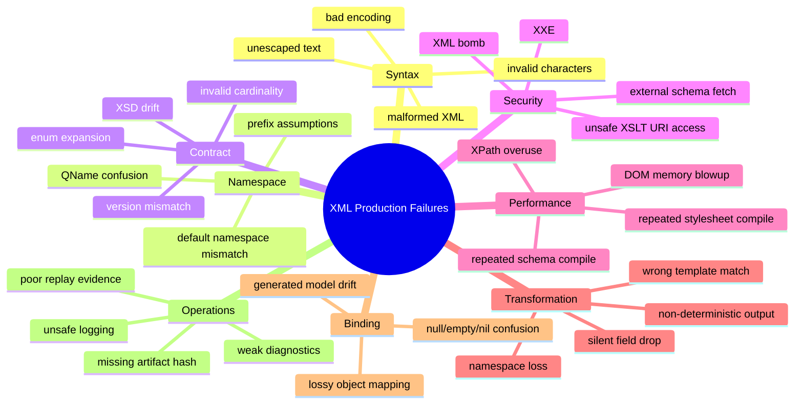
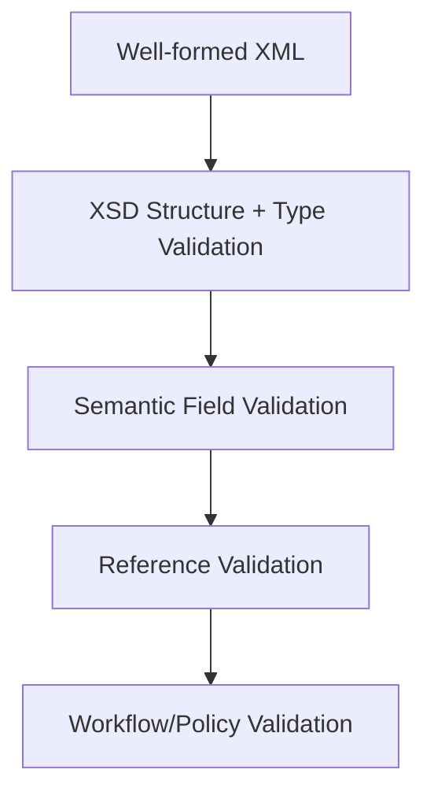
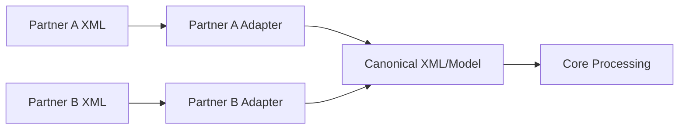

# Part 030 — XML Anti-Patterns and Failure Modes

> Goal: recognize, diagnose, and prevent the XML failure modes that repeatedly cause production incidents in Java systems.

By now, we have covered XML parsing, XSD validation, XPath, XQuery, XSLT, binding, serialization, testing, observability, and versioning.

This part is different.

It is not organized by API. It is organized by failure.

A strong engineer is not only someone who knows how to call `DocumentBuilderFactory`, `XMLInputFactory`, `SchemaFactory`, `XPathFactory`, or `TransformerFactory`. A strong engineer can look at a production symptom and quickly reason:

- which layer likely failed,
- which assumption was violated,
- which evidence is needed,
- which fix prevents recurrence,
- which regression test should be added.

This is how XML knowledge becomes operational judgment.

---

## 1. Failure Taxonomy

Most XML incidents fall into one or more of these categories:



The same root cause can appear in multiple categories.

Example: a namespace drift can cause XPath extraction failure, XSLT template mismatch, validation rejection, and missing audit metadata.

---

## 2. Anti-Pattern: XML Treated as “Just a String”

### Symptom

Code builds XML using string concatenation:

```java
String xml = "<Customer><Name>" + name + "</Name></Customer>";
```

It works until `name` contains:

```text
A&B <Partner>
```

Then production receives malformed XML.

### Root Cause

The code ignores XML escaping, encoding, namespace, and structural correctness.

XML is not string formatting. It is a structured document with grammar rules.

### Failure Modes

- malformed XML,
- injection into document structure,
- broken signatures/canonicalization,
- invalid output when special characters appear,
- encoding mismatch,
- test fixtures pass because they use only simple ASCII data.

### Prevention

Use structured writers:

- `XMLStreamWriter`,
- DOM builder plus serializer,
- JAXB/Jakarta XML Binding marshaller,
- XSLT output,
- dedicated XML serialization library.

Example:

```java
XMLOutputFactory outputFactory = XMLOutputFactory.newFactory();
StringWriter out = new StringWriter();

XMLStreamWriter writer = outputFactory.createXMLStreamWriter(out);
writer.writeStartDocument("UTF-8", "1.0");
writer.writeStartElement("Customer");
writer.writeStartElement("Name");
writer.writeCharacters(name);
writer.writeEndElement();
writer.writeEndElement();
writer.writeEndDocument();
writer.close();
```

`writeCharacters` exists because text content must be escaped according to XML rules.

### Regression Test

Include values with:

- `&`, `<`, `>`, quotes,
- non-ASCII characters,
- emoji if business domain permits,
- newline/tab,
- control character attempts,
- long text.

---

## 3. Anti-Pattern: Namespace-Blind Parsing

### Symptom

XPath or DOM lookup returns nothing:

```java
NodeList nodes = document.getElementsByTagName("OrderId");
```

The XML clearly contains:

```xml
<OrderId xmlns="https://schemas.example.com/order/v1">O-123</OrderId>
```

### Root Cause

The code treats local names as globally unique.

In namespace-aware XML, the real element name is the expanded name:

```text
{namespace-uri}local-name
```

The prefix is not identity. The namespace URI is identity.

### Failure Modes

- XPath returns empty result,
- XSLT template does not match,
- DOM traversal extracts wrong element from another namespace,
- validation passes but business extraction fails,
- default namespace breaks previously working queries.

### Prevention

Always parse namespace-aware:

```java
DocumentBuilderFactory factory = DocumentBuilderFactory.newInstance();
factory.setNamespaceAware(true);
```

Use namespace URI lookups:

```java
NodeList nodes = document.getElementsByTagNameNS(
        "https://schemas.example.com/order/v1",
        "OrderId"
);
```

For XPath, register namespace prefixes explicitly:

```java
xpath.setNamespaceContext(new NamespaceContext() {
    @Override
    public String getNamespaceURI(String prefix) {
        return switch (prefix) {
            case "ord" -> "https://schemas.example.com/order/v1";
            default -> XMLConstants.NULL_NS_URI;
        };
    }

    @Override public String getPrefix(String uri) { return null; }
    @Override public Iterator<String> getPrefixes(String uri) { return Collections.emptyIterator(); }
});
```

Then query:

```xpath
/ord:Order/ord:OrderId
```

### Regression Test

Test equivalent documents using different prefixes:

```xml
<a:Order xmlns:a="https://schemas.example.com/order/v1"/>
<b:Order xmlns:b="https://schemas.example.com/order/v1"/>
<Order xmlns="https://schemas.example.com/order/v1"/>
```

All should behave the same.

---

## 4. Anti-Pattern: Believing Prefixes Are Stable

### Symptom

A consumer rejects XML because it expected `ord:Order`, but producer emits `o:Order` with the same namespace URI.

### Root Cause

The consumer treats prefix as semantic identity.

In XML namespace semantics, prefix is only a local abbreviation. The namespace URI carries identity.

### Failure Modes

- brittle string checks,
- invalid signature/canonicalization assumptions,
- false validation failures in custom validators,
- false diffs in tests,
- partner disputes over harmless prefix changes.

### Prevention

- Compare expanded names, not prefix strings.
- Use canonicalization if physical representation matters.
- In tests, compare XML structurally, not by raw string unless deterministic output is the goal.
- Document prefix preferences as serialization convention, not semantic contract.

Bad:

```java
if (node.getNodeName().equals("ord:Order")) { ... }
```

Better:

```java
if ("Order".equals(node.getLocalName())
        && "https://schemas.example.com/order/v1".equals(node.getNamespaceURI())) {
    ...
}
```

---

## 5. Anti-Pattern: Parser Created with Defaults

### Symptom

Security scan flags XXE. Or production unexpectedly tries to reach internal URLs while parsing XML.

### Root Cause

Parser defaults are not an application security policy.

An XML parser may support DTDs, external entities, external schemas, or external stylesheets depending on implementation/configuration. For untrusted XML, the application must explicitly deny dangerous behavior.

### Failure Modes

- XXE file disclosure,
- SSRF via external entity,
- XML bomb/entity expansion DoS,
- external schema fetch latency,
- nondeterministic validation based on network availability,
- production outage when external URL is down.

### Prevention

Create secure factory builders.

Example DOM factory hardening:

```java
public static DocumentBuilderFactory secureDocumentBuilderFactory() throws ParserConfigurationException {
    DocumentBuilderFactory factory = DocumentBuilderFactory.newInstance();
    factory.setNamespaceAware(true);
    factory.setFeature(XMLConstants.FEATURE_SECURE_PROCESSING, true);

    factory.setFeature("http://apache.org/xml/features/disallow-doctype-decl", true);
    factory.setFeature("http://xml.org/sax/features/external-general-entities", false);
    factory.setFeature("http://xml.org/sax/features/external-parameter-entities", false);
    factory.setFeature("http://apache.org/xml/features/nonvalidating/load-external-dtd", false);

    factory.setXIncludeAware(false);
    factory.setExpandEntityReferences(false);
    return factory;
}
```

Also secure:

- `SAXParserFactory`,
- `XMLInputFactory`,
- `SchemaFactory`,
- `TransformerFactory`,
- Saxon processor resource resolvers.

### Regression Test

Add fixtures attempting:

- external file entity,
- HTTP external entity,
- nested entity expansion,
- external DTD,
- external schema import,
- stylesheet `document()` access if XSLT is used.

The expected behavior should be rejection without outbound network access.

---

## 6. Anti-Pattern: DOM for Everything

### Symptom

Small test files pass. Production with 200 MB XML causes:

- high heap usage,
- GC pauses,
- `OutOfMemoryError`,
- slow ingestion,
- CPU spikes,
- pod/container restart.

### Root Cause

DOM materializes the XML document as an in-memory tree. The memory footprint is much larger than the file size because nodes, strings, attributes, and object overhead are allocated.

### Failure Modes

- memory blowup,
- latency spikes,
- inability to process large batch files,
- cascading retries,
- dead-letter/quarantine flood,
- noisy-neighbor impact in shared runtime.

### Prevention

Use DOM only when you need:

- random tree navigation,
- mutation across document regions,
- small/medium documents,
- convenient XPath over full tree,
- document-level transformations where size is bounded.

Use SAX/StAX when:

- extracting a few fields,
- processing repeated records,
- handling large files,
- streaming validation,
- routing based on header plus iterating items.

Decision rule:

> If the XML contains many repeated business records and you process one record at a time, default to streaming.

### Regression Test

Run tests with:

- 1 KB,
- 1 MB,
- 50 MB,
- realistic worst-case payload,
- many small repeated nodes,
- large text nodes.

Track heap and latency, not just correctness.

---

## 7. Anti-Pattern: Recompiling Schema or Stylesheet per Request

### Symptom

CPU usage is high. Throughput is poor. Profiling shows repeated schema/stylesheet compilation.

### Root Cause

The code treats expensive immutable artifacts as request-scoped.

Bad:

```java
Schema schema = schemaFactory.newSchema(schemaFile); // every request
Validator validator = schema.newValidator();
```

Bad:

```java
Transformer transformer = transformerFactory.newTransformer(xsltSource); // every request
```

### Failure Modes

- unnecessary CPU cost,
- high latency,
- lock contention,
- increased allocation,
- poor scaling under load,
- inconsistent behavior if artifact files change under process.

### Prevention

Cache compiled artifacts:

- `Schema` per schema bundle/version,
- `Templates` per stylesheet/version,
- Saxon `XsltExecutable`, `XPathExecutable`, `XQueryExecutable`,
- namespace maps and compiled XPath registries.

Create per-request mutable execution objects:

- `Validator`,
- `Transformer`,
- Saxon selectors/transformers as appropriate,
- input/output streams.

Pattern:

```java
public final class XmlArtifactCache {
    private final ConcurrentMap<String, Schema> schemas = new ConcurrentHashMap<>();
    private final ConcurrentMap<String, Templates> templates = new ConcurrentHashMap<>();

    public Schema schema(String key, Supplier<Schema> compiler) {
        return schemas.computeIfAbsent(key, ignored -> compiler.get());
    }

    public Templates templates(String key, Supplier<Templates> compiler) {
        return templates.computeIfAbsent(key, ignored -> compiler.get());
    }
}
```

### Regression Test

Benchmark with warm cache and cold cache separately.

Operational metric:

```text
xml_schema_compile_total
xml_stylesheet_compile_total
xml_artifact_cache_hit_ratio
```

In steady state, compile count should not grow with request count.

---

## 8. Anti-Pattern: Shared Mutable XML Runtime Objects

### Symptom

Intermittent wrong output under concurrent load.

Single-threaded tests pass.

### Root Cause

The code shares objects that are not thread-safe or not intended for concurrent execution.

Common risky objects:

- `DocumentBuilder`,
- `SAXParser`,
- `XMLStreamReader`,
- `XMLStreamWriter`,
- `Validator`,
- `Transformer`,
- Saxon dynamic selectors/transformers,
- mutable DOM `Document`,
- mutable namespace contexts.

### Failure Modes

- mixed parameters between transformations,
- wrong validation errors,
- corrupted output,
- race conditions,
- intermittent exceptions,
- data leakage between requests.

### Prevention

Separate immutable compiled artifacts from mutable execution objects.

Safe-ish pattern:

```text
Factory / compiled artifact: app-scoped if documented safe
Execution object: request-scoped
Input/output stream: request-scoped
Parameters: request-scoped
```

Do not optimize by sharing mutable parser/transformer instances unless the API explicitly allows it.

### Regression Test

Run concurrent tests:

- different transformation parameters per request,
- different input versions,
- repeated runs with high parallelism,
- output hash verification,
- no shared mutable global state.

---

## 9. Anti-Pattern: Silent Field Drop in Transformation

### Symptom

Output XML is valid but missing fields.

No error is thrown.

### Root Cause

XSLT or Java mapping does not handle a source path, and the pipeline treats absence as acceptable.

Typical causes:

- template match misses due to namespace,
- identity transform not used where preservation expected,
- `xsl:value-of` returns empty string silently,
- optional field becomes semantically required downstream,
- new source field added but mapping not updated,
- extension elements dropped.

### Failure Modes

- regulatory report incomplete,
- partner rejects downstream XML,
- audit trail lacks source-to-output explanation,
- data loss hidden by valid schema,
- reconciliation mismatch.

### Prevention

Use mapping accountability.

For each important field:

| Source XPath | Target XPath | Rule | Required? | Test fixture |
|---|---|---|---:|---|
| `/ord:Order/ord:Amount` | `/can:Order/can:TotalAmount` | copy decimal | yes | `order-basic.xml` |
| `/ord:Order/ord:CustomerId` | `/can:Order/can:Party/can:Id` | normalize id | yes | `order-customer.xml` |

Add transformation assertions:

```xpath
exists(/can:Order/can:TotalAmount)
```

For XSLT, use explicit termination for impossible states:

```xml
<xsl:if test="empty(ord:Amount)">
    <xsl:message terminate="yes">Order amount is required for canonical mapping.</xsl:message>
</xsl:if>
```

### Regression Test

Every required business field should have:

- positive mapping test,
- missing source test,
- invalid source test,
- output assertion,
- audit evidence assertion.

---

## 10. Anti-Pattern: XPath as Business Logic Dumping Ground

### Symptom

A service contains dozens of long XPath strings with nested predicates.

Example:

```xpath
/ord:Order[ord:Status='A' and ord:Amount > 1000 and not(ord:Hold)]/ord:Customer[ord:Type='VIP']/ord:Id
```

### Root Cause

XPath is used as ungoverned business logic rather than targeted XML selection/assertion.

### Failure Modes

- hard-to-test rules,
- duplicated predicates,
- brittle namespace handling,
- XPath injection if user values are concatenated,
- hidden semantic changes,
- poor observability.

### Prevention

Use XPath for selection. Put business rules into named, tested rule units.

Better:

```java
String status = xmlValue("order.status", doc);
BigDecimal amount = xmlDecimal("order.amount", doc);
boolean hold = xmlBoolean("order.hold", doc);

RuleResult result = highValueOrderRule.evaluate(status, amount, hold);
```

If XPath expressions are part of the rule system, treat them as versioned rule artifacts:

- named expression ID,
- owner,
- namespace registry,
- test fixtures,
- compiled expression cache,
- injection-safe variables,
- audit output.

### Regression Test

For every important XPath expression:

- missing node,
- multiple nodes,
- blank text,
- namespace prefix variation,
- malicious parameter input,
- changed contract version.

---

## 11. Anti-Pattern: Binding Model Equals Domain Model

### Symptom

JAXB-generated classes spread across business logic. A schema change forces large refactoring.

### Root Cause

The XML binding model is treated as the domain model.

But XML contracts often represent external document structure, not internal business concepts.

### Failure Modes

- external schema changes leak into core domain,
- `null`/empty/nil semantics become unclear,
- generated classes gain business behavior,
- validation responsibility becomes scattered,
- multiple contract versions pollute domain services.

### Prevention

Use explicit mapping boundary:

```text
XML document -> Binding/Extraction DTO -> Semantic validation -> Domain command/model
```

The binding class should be disposable. The domain model should express business invariants.

Example:

```java
public record OrderCommand(
        String orderId,
        Money amount,
        CustomerReference customer,
        LocalDate businessDate
) {}
```

Map from XML-specific model into domain-specific command.

### Regression Test

When XSD changes, core domain tests should not fail unless business meaning changes.

---

## 12. Anti-Pattern: Ambiguous Null, Empty, Missing, and Nil

### Symptom

Different systems interpret these as equivalent:

```xml
<Name/>
<Name></Name>
<Name xsi:nil="true"/>
<!-- Name missing entirely -->
```

But they may mean different things.

### Root Cause

The contract does not define absence semantics.

### Failure Modes

- unintended clearing of fields,
- default values applied incorrectly,
- validation passes but business semantics wrong,
- partner sends empty to mean unknown while system treats it as blank,
- update APIs erase data accidentally.

### Prevention

Define field state explicitly.

For each nullable/optional field:

| XML state | Meaning | Allowed? |
|---|---|---:|
| Missing | no change / not provided | yes/no |
| Empty element | blank value | yes/no |
| `xsi:nil=true` | explicitly null | yes/no |
| Whitespace only | blank after normalization? | yes/no |

In Java, model states deliberately:

```java
sealed interface XmlFieldState<T> {
    record Missing<T>() implements XmlFieldState<T> {}
    record Nil<T>() implements XmlFieldState<T> {}
    record Present<T>(T value) implements XmlFieldState<T> {}
    record Invalid<T>(String reason) implements XmlFieldState<T> {}
}
```

Do not collapse states too early.

---

## 13. Anti-Pattern: XSD Used for All Business Rules

### Symptom

Schema becomes huge, rigid, and unreadable. Teams try to encode cross-field and external-reference rules in XSD.

### Root Cause

XSD is treated as the only validation layer.

XSD is strong for structural and datatype constraints. It is not the right place for every business invariant, especially rules requiring databases, time windows, permissions, workflow state, or cross-system lookup.

### Failure Modes

- schema complexity explodes,
- versioning becomes hard,
- error messages become poor,
- rules cannot access external context,
- partner cannot understand rejection reason,
- schema changes required for business policy changes.

### Prevention

Layer validation:



Use XSD for:

- required structure,
- datatypes,
- cardinality,
- basic constraints,
- controlled vocabulary when stable.

Use semantic validators for:

- cross-field conditions,
- external reference checks,
- jurisdiction rules,
- temporal rules,
- workflow-state rules,
- entitlement checks.

---

## 14. Anti-Pattern: XSD Too Loose to Be Useful

### Symptom

Almost any XML validates.

Schema is full of:

```xml
<xs:any processContents="skip" minOccurs="0" maxOccurs="unbounded"/>
```

and fields typed as `xs:string` even for amounts and dates.

### Root Cause

The schema avoids making decisions.

### Failure Modes

- validation gives false confidence,
- errors move downstream,
- partner contracts become ambiguous,
- semantic validators must compensate for weak structure,
- invalid data persists.

### Prevention

Use constraints where they express stable contract truth:

- `xs:decimal` for money-like values,
- explicit date/time type with documented timezone semantics,
- meaningful `minOccurs`,
- controlled patterns for identifiers,
- bounded string lengths aligned with storage/domain limits,
- governed extension points.

The schema should reject structurally invalid documents early without trying to encode every business rule.

---

## 15. Anti-Pattern: External Resource Access Hidden in Validation or XSLT

### Symptom

Validation or transformation sometimes hangs or fails depending on network.

Logs show requests to schema URLs, DTD URLs, or document references.

### Root Cause

XSD imports/includes, DTDs, XSLT `document()`, or URI resolvers access external resources at runtime.

### Failure Modes

- nondeterministic builds/runs,
- production latency,
- SSRF risk,
- outage when external host is down,
- unreviewed artifact changes,
- audit cannot prove exact schema used.

### Prevention

Use local artifact bundles and locked-down resolvers.

Resolver policy:

| Resource type | Runtime policy |
|---|---|
| DTD | deny for untrusted XML |
| External entity | deny |
| XSD include/import | resolve only from trusted bundle/catalog |
| XSLT include/import | resolve only from trusted bundle/catalog |
| XSLT document() | deny by default; allowlist only if necessary |
| HTTP/HTTPS from parser | deny by default |

Example principle:

> Runtime XML processing must be deterministic without network access unless an explicitly reviewed integration step performs the network call.

---

## 16. Anti-Pattern: Invalid Encoding Assumptions

### Symptom

Special characters become corrupted:

```text
Müller -> Müller
```

Or parser throws encoding errors.

### Root Cause

The system mixes byte streams, character readers, XML declarations, HTTP headers, and database encodings incorrectly.

### Failure Modes

- mojibake,
- signature mismatch,
- invalid XML characters,
- partner rejection,
- audit hash mismatch,
- replay mismatch.

### Prevention

Rules:

1. Prefer parsing from bytes/InputStream so XML declaration can be honored.
2. Do not convert bytes to `String` without known charset.
3. Emit explicit encoding.
4. Hash bytes, not reconstructed strings, when preserving evidence.
5. Validate character repertoire if partner/regulator restricts it.
6. Test non-ASCII fixtures.

Bad:

```java
String xml = new String(bytes); // platform default charset risk
```

Better:

```java
try (InputStream in = new ByteArrayInputStream(bytes)) {
    documentBuilder.parse(in);
}
```

For output, be explicit:

```java
try (Writer writer = new OutputStreamWriter(out, StandardCharsets.UTF_8)) {
    // serialize XML as UTF-8
}
```

---

## 17. Anti-Pattern: Over-Logging Payloads

### Symptom

Logs contain full XML payloads with personal, financial, credential, or confidential data.

### Root Cause

Debug convenience became production logging.

### Failure Modes

- privacy incident,
- regulatory breach,
- credential exposure,
- large log cost,
- support users see data they should not,
- incident response expands because logs become sensitive stores.

### Prevention

Log metadata, not raw payload, by default:

- correlation ID,
- contract key,
- payload size,
- payload hash,
- validation stage,
- error code,
- safe XPath path,
- partner ID if allowed,
- schema/transform artifact IDs.

For payload inspection:

- store encrypted payload in controlled evidence store,
- redact sensitive fields,
- restrict access,
- expire according to retention policy,
- log access to payload evidence.

Redaction should be structural, not regex-only.

Example redaction policy:

```yaml
redactions:
  - xpath: /ord:Order/ord:Customer/ord:NationalId
    action: mask
  - xpath: /ord:Order/ord:Payment/ord:CardNumber
    action: remove
  - xpath: /ord:Order/ord:AccessToken
    action: remove
```

---

## 18. Anti-Pattern: Weak Error Messages

### Symptom

Support sees:

```text
Invalid XML
```

No line, column, path, contract version, schema version, or reason.

### Root Cause

The pipeline collapses all XML errors into one generic exception.

### Failure Modes

- slow incident triage,
- partner cannot fix payload,
- support escalates unnecessarily,
- replay is impossible,
- errors cannot be grouped by cause,
- monitoring cannot detect top failure patterns.

### Prevention

Use layered error taxonomy:

```text
XML-SYN-001 malformed XML
XML-SEC-001 DTD not allowed
XML-VAL-001 schema validation failed
XML-SEM-001 semantic rule failed
XML-MAP-001 transformation failed
XML-OUT-001 output validation failed
```

Error object:

```java
public record XmlProcessingError(
        String code,
        String stage,
        String severity,
        String message,
        String safePath,
        Integer line,
        Integer column,
        String contractVersion,
        String artifactId
) {}
```

Expose safe partner-facing errors and preserve detailed engineer diagnostics internally.

---

## 19. Anti-Pattern: No Replay Evidence

### Symptom

A partner asks why a document was rejected last month. The team can see a rejection status but cannot reproduce it.

### Root Cause

The system did not preserve enough evidence:

- original payload bytes/hash,
- schema bundle version,
- transform version,
- rule version,
- reference data snapshot,
- runtime configuration,
- error details.

### Failure Modes

- impossible audit defense,
- inconsistent reprocessing,
- disputes with partners/regulators,
- inability to debug historical incidents,
- risky manual fixes.

### Prevention

Store replay bundle metadata:

```yaml
correlationId: c-123
payloadHash: sha256:...
payloadLocation: evidence://xml/c-123/input
contractKey: order:v1:1.4:standard
schemaBundleHash: sha256:...
transformId: order-v1-to-canonical-2026.07
transformHash: sha256:...
ruleSetVersion: 2026.07.1
referenceDataSnapshot: refdata-2026-07-02T00:00Z
processingResult: rejected
errorCodes:
  - XML-VAL-REQ-001
```

Replay must be deterministic enough to explain the original decision.

---

## 20. Anti-Pattern: Latest Artifact Used for Historical Reprocessing

### Symptom

A payload rejected last month now passes when replayed. Or a payload that passed now fails.

### Root Cause

Replay uses current schema, current transform, or current rules instead of historical artifacts.

### Failure Modes

- audit mismatch,
- correction files generated under wrong rules,
- false claims that previous decision was wrong,
- inability to satisfy regulator evidence.

### Prevention

Separate replay modes:

| Mode | Purpose | Artifacts |
|---|---|---|
| Historical replay | Reproduce original decision | original artifacts |
| Migration replay | Test under candidate version | candidate artifacts |
| Repair replay | Reprocess after approved fix | explicit repair artifacts |

Every replay job should declare mode explicitly.

---

## 21. Anti-Pattern: Schema and Code Drift

### Symptom

Schema says field is optional, Java code assumes required. Or schema allows enum value that Java code rejects.

### Root Cause

Schema, binding model, semantic validators, and transformations evolve separately without compatibility tests.

### Failure Modes

- valid XML rejected by application,
- invalid XML accepted because code ignores schema,
- generated classes out of date,
- partner contract mismatch,
- production bug after schema-only change.

### Prevention

CI gates:

- compile schema bundle,
- generate binding classes if applicable,
- run fixture validation,
- run semantic validation,
- run transformation tests,
- run XPath extraction tests,
- run backward compatibility matrix,
- block unreviewed schema/code drift.

Treat schema as source code.

---

## 22. Anti-Pattern: File-Based Batch Without Idempotency

### Symptom

A large XML file is processed twice. Downstream records duplicate.

### Root Cause

The pipeline has no stable file/document/record identity and no idempotent processing boundary.

### Failure Modes

- duplicate orders/submissions,
- double billing/reporting,
- inconsistent acknowledgements,
- hard manual cleanup,
- replay fear.

### Prevention

Use idempotency keys:

- file hash,
- source system ID,
- document ID,
- record ID,
- contract version,
- processing mode.

For batch XML, distinguish:

```text
file idempotency: have we seen this file?
record idempotency: have we processed this business record?
output idempotency: have we emitted this downstream artifact?
```

Persist stage results.

Do not rely only on filename.

---

## 23. Anti-Pattern: Treating Validation Success as Business Success

### Symptom

Dashboard shows “XML valid”, but business process fails later.

### Root Cause

XSD validation is mistaken for complete processing correctness.

### Failure Modes

- false green metrics,
- late rejection,
- unclear ownership,
- partner confusion,
- missing semantic validation evidence.

### Prevention

Report stages separately:

```text
received
well_formed
schema_valid
semantic_valid
transformed
output_valid
accepted
rejected
quarantined
submitted
acknowledged
```

A payload can be:

- schema-valid but semantically invalid,
- semantically valid but transformation-failed,
- transformed but downstream-rejected,
- submitted but regulator-rejected.

Make the pipeline state explicit.

---

## 24. Anti-Pattern: Unbounded XPath/XSLT/XQuery Execution

### Symptom

Certain inputs cause long CPU time or memory growth.

### Root Cause

Complex expressions or transformations run without limits, especially over large documents.

### Failure Modes

- CPU exhaustion,
- service latency spike,
- denial of service,
- large temporary trees,
- unbounded result documents,
- slow regex or grouping operations.

### Prevention

- Set payload size limits.
- Prefer streaming where possible.
- Compile expressions but bound inputs.
- Restrict external resource access.
- Use timeouts at service/job level.
- Monitor execution time by expression/transform ID.
- Review complex XPath/XSLT/XQuery as code.

Metric examples:

```text
xml_xpath_eval_duration_ms{expression_id="order-id"}
xml_xslt_transform_duration_ms{transform_id="order-v1-canonical"}
xml_xquery_eval_duration_ms{query_id="monthly-report"}
```

---

## 25. Anti-Pattern: Golden Files Without Intent

### Symptom

Tests fail because formatting changed. Engineers blindly approve new golden files.

### Root Cause

Golden-file tests compare bytes without defining what differences matter.

### Failure Modes

- noisy tests,
- accidental semantic changes approved,
- formatting-only changes block delivery,
- namespace prefix changes mistaken for failures,
- important missing field hidden in large diff.

### Prevention

Use the right comparison mode:

| Test goal | Comparison strategy |
|---|---|
| Exact deterministic artifact | byte/string compare after controlled serialization |
| XML structural equivalence | XML-aware comparison |
| Business mapping correctness | XPath assertions |
| Signature/canonicalization | canonical byte comparison |
| Partner fixture | exact compare if partner requires exact output |

Golden files need review notes:

```md
## Golden Change Review
- Which field changed?
- Why is it expected?
- Is it formatting-only or semantic?
- Which contract version changed?
- Which downstream consumer is affected?
```

---

## 26. Anti-Pattern: One Giant XSLT Stylesheet

### Symptom

A single stylesheet has thousands of lines, many modes, global variables, partner-specific conditions, and hidden dependencies.

### Root Cause

Transformation logic evolved without modular design.

### Failure Modes

- hard debugging,
- accidental template override,
- partner-specific logic leaks into standard output,
- poor testability,
- high regression risk,
- difficult migration to XSLT 2/3.

### Prevention

Modularize by responsibility:

```text
common-functions.xsl
identity-base.xsl
order-core-map.xsl
partner-a-adapter.xsl
partner-b-adapter.xsl
redaction.xsl
output-format.xsl
```

Use explicit modes:

```xml
<xsl:mode name="canonical" on-no-match="shallow-skip"/>
<xsl:mode name="redact" on-no-match="shallow-copy"/>
```

Test modules separately and together.

---

## 27. Anti-Pattern: Partner-Specific Logic Everywhere

### Symptom

Core pipeline contains conditions like:

```java
if (partner.equals("A")) { ... }
if (partner.equals("B")) { ... }
```

or XSLT contains dozens of partner branches.

### Root Cause

Partner variation is not isolated behind adapter/profile boundaries.

### Failure Modes

- core logic becomes unstable,
- partner changes affect unrelated partners,
- versioning becomes unclear,
- tests grow combinatorially,
- ownership is ambiguous.

### Prevention

Use adapter architecture:



Partner-specific code belongs in:

- profile schema,
- adapter transform,
- partner-specific semantic rules,
- profile-specific test fixtures.

Core processing should consume canonical semantics.

---

## 28. Anti-Pattern: No Quarantine Strategy

### Symptom

Invalid XML either disappears, retries forever, or blocks the whole batch.

### Root Cause

Failure handling is not designed as part of the pipeline.

### Failure Modes

- poison message loops,
- batch starvation,
- manual recovery chaos,
- duplicate processing,
- lost evidence,
- poor partner feedback.

### Prevention

Define failure destinations:

| Failure | Destination | Action |
|---|---|---|
| Malformed XML | reject/quarantine | no retry unless source corrected |
| Security violation | reject/security event | no retry |
| Schema invalid | reject/quarantine | partner/source fix |
| Semantic invalid | business rejection | correction workflow |
| Transient reference lookup | retry | bounded retry |
| Transform bug | internal incident | pause/reprocess after fix |
| Downstream unavailable | retry/backoff | preserve idempotency |

Quarantine record must include:

- safe reason,
- payload reference/hash,
- contract identity,
- stage,
- retry eligibility,
- owner,
- next action.

---

## 29. Incident Diagnosis Playbook

When an XML incident happens, diagnose in layers.

### Step 1: Identify the Stage

Ask:

- Did parsing fail?
- Did schema validation fail?
- Did semantic validation fail?
- Did transformation fail?
- Did output validation fail?
- Did downstream reject?
- Did audit/replay fail?

### Step 2: Identify Contract Identity

Collect:

- namespace URI,
- root QName,
- contract version,
- profile,
- schema bundle ID/hash,
- transform ID/hash,
- producer/partner,
- payload size,
- correlation ID.

### Step 3: Inspect Minimal Safe Evidence

Do not immediately dump full payload into chat/logs/tickets.

Use:

- safe XPath excerpts,
- line/column,
- error path,
- redacted snippet,
- payload hash,
- fixture reproduction.

### Step 4: Reproduce Locally

Use the same:

- payload bytes,
- schema bundle,
- parser settings,
- transform artifact,
- rule version,
- reference data snapshot if relevant.

### Step 5: Classify Fix

| Root cause | Fix type |
|---|---|
| Bad producer payload | partner/source correction |
| Schema too strict | contract change |
| Code ignores namespace | parser/query fix |
| Transform drops field | mapping fix |
| Processor unsafe | security config fix |
| Payload too large | streaming/performance fix |
| Version mismatch | routing/registry fix |
| Missing evidence | observability/audit fix |

### Step 6: Add Regression Test

No incident is closed until a regression test exists.

---

## 30. Failure Mode Table

| Symptom | Likely cause | Evidence | Preventive control |
|---|---|---|---|
| XPath returns empty | namespace mismatch | root QName, namespace context | namespace-aware tests |
| OutOfMemoryError | DOM on large payload | heap dump, payload size | streaming parser |
| Valid XML rejected | schema/code drift | schema version, code rule | compatibility tests |
| Output missing field | transform miss | source/target XPath diff | mapping assertions |
| Slow validation | schema compile per request | compile metrics | schema cache |
| Remote URL call during parse | external entity/schema | network logs | deny external access |
| Partner rejects prefix | prefix-dependent consumer | output sample | educate/fix structural compare |
| Historical replay differs | latest artifacts used | audit artifact IDs | immutable artifact replay |
| Duplicate records | no idempotency key | duplicate business IDs | stage idempotency |
| Logs expose PII | raw payload logging | log sample | redaction/evidence store |
| Empty field clears value | missing/empty/nil ambiguity | payload state | explicit field state policy |
| Enum breaks consumer | closed switch | exception/log | enum compatibility review |

---

## 31. Engineering Review Checklist

For any production XML component:

- [ ] Parser is namespace-aware.
- [ ] Parser has secure defaults and external access policy.
- [ ] Payload size limits exist.
- [ ] DOM usage is justified by document size/access pattern.
- [ ] Streaming is used for large repeated records.
- [ ] Schema artifacts are immutable and cached.
- [ ] Validators are request-scoped.
- [ ] Stylesheets/queries are compiled and versioned.
- [ ] Transformers/selectors are not shared unsafely.
- [ ] XPath expressions are named, tested, and namespace-explicit.
- [ ] Binding model does not leak into core domain unnecessarily.
- [ ] Missing/empty/nil semantics are documented.
- [ ] Output generation uses XML writers/serializers, not string concat.
- [ ] Output validation exists for critical documents.
- [ ] Transformation mappings have field-level assertions.
- [ ] Error taxonomy is actionable.
- [ ] Logs are redacted and safe.
- [ ] Replay evidence records artifact versions/hashes.
- [ ] Idempotency exists for batch and message processing.
- [ ] Quarantine/retry behavior is explicit.
- [ ] Compatibility tests guard schema/version changes.

---

## 32. Kaufman Deliberate Practice: Failure Drills

To internalize this material, practice diagnosing failures quickly.

### Drill 1: Namespace Failure

Create three XML files with identical local names but different namespaces/prefixes. Write XPath tests that fail first, then fix them with `NamespaceContext`.

### Drill 2: XXE Attempt

Create a malicious XML with external entity. Verify your parser rejects it and no network/file access occurs.

### Drill 3: DOM Blowup Simulation

Generate a large XML with 500,000 records. Try DOM extraction, then StAX extraction. Compare memory and latency.

### Drill 4: Transformation Field Drop

Add a new source field and show that old XSLT drops it. Add mapping assertion that catches the drop.

### Drill 5: Replay Mismatch

Process a payload with schema v1, then change schema to v2. Demonstrate why historical replay must use v1 artifact identity.

### Drill 6: Null/Empty/Nil Semantics

Create four payloads representing missing, empty, nil, and present value. Map them into explicit Java field states.

### Drill 7: Concurrent Transformer Bug

Intentionally share a mutable transformer with request-specific parameters. Run concurrent tests. Then fix with compiled template cache and request-scoped transformer.

---

## 33. Summary

Production XML incidents are rarely mysterious once you classify them by layer.

The most important anti-patterns are:

1. Treating XML as string formatting.
2. Ignoring namespaces.
3. Trusting parser defaults.
4. Using DOM for unbounded payloads.
5. Recompiling schemas/stylesheets per request.
6. Sharing mutable XML runtime objects across threads.
7. Allowing transformations to silently drop fields.
8. Turning XPath into unmanaged business logic.
9. Treating binding models as domain models.
10. Collapsing missing/empty/nil into the same state.
11. Encoding all rules in XSD or making XSD too loose.
12. Allowing hidden external resource access.
13. Logging raw payloads.
14. Losing replay evidence.
15. Using latest artifacts for historical replay.
16. Processing batch files without idempotency.
17. Treating validation success as business success.

The senior-level habit is simple:

> For every XML processing step, know its input contract, output contract, resource limits, security policy, artifact version, error model, and replay evidence.

That is how XML processing becomes production engineering instead of parser glue.
