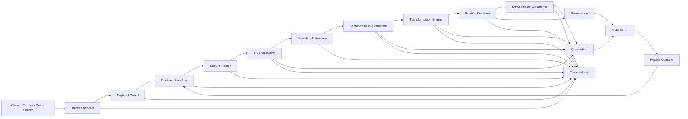
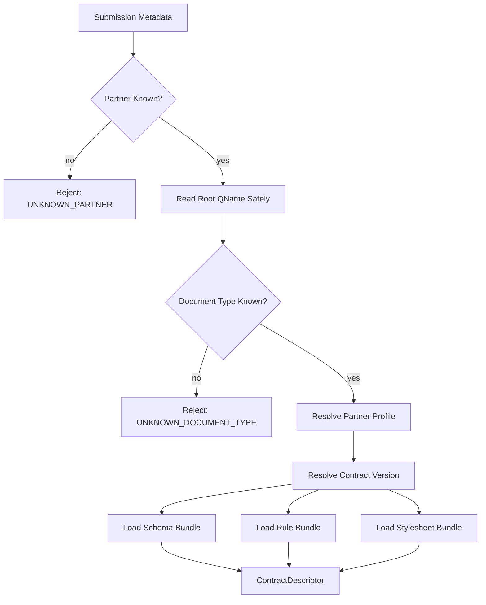
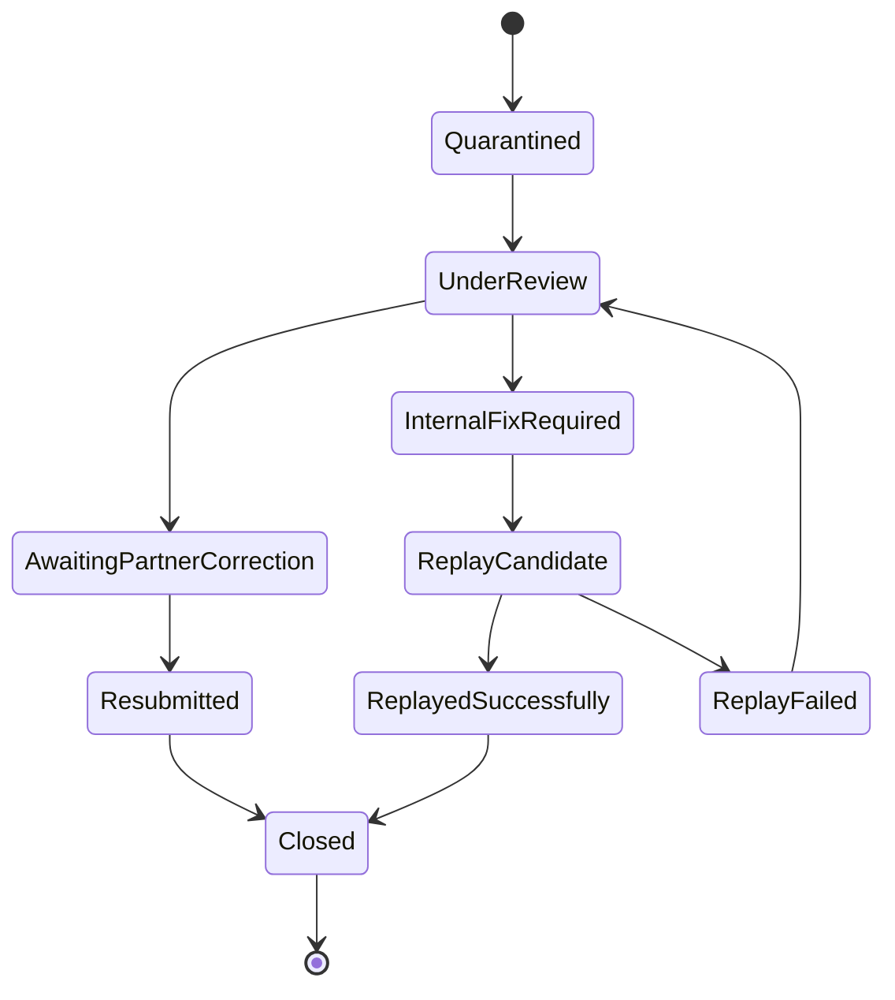
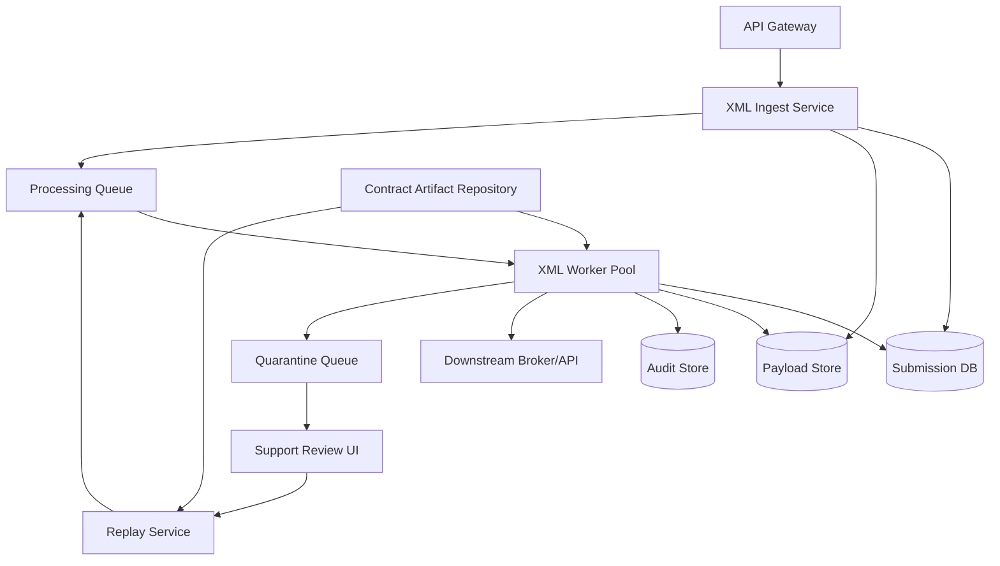
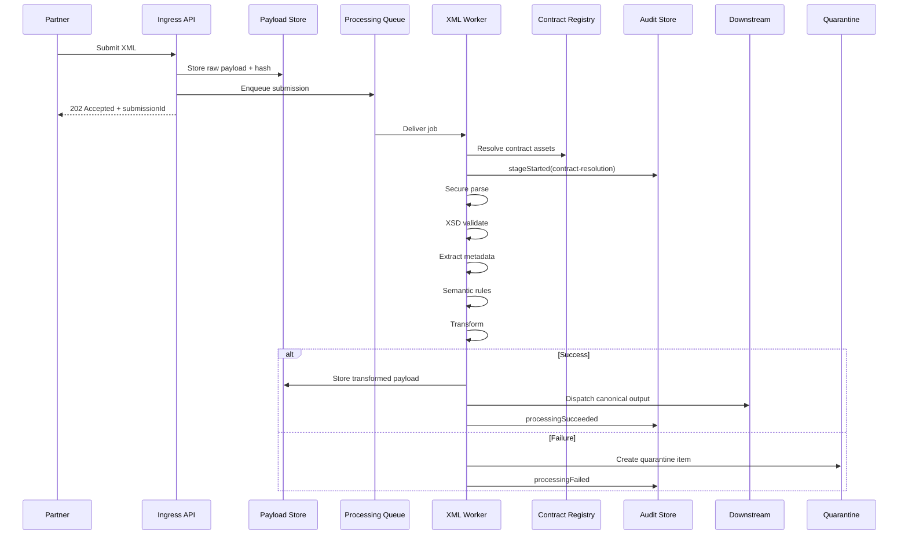
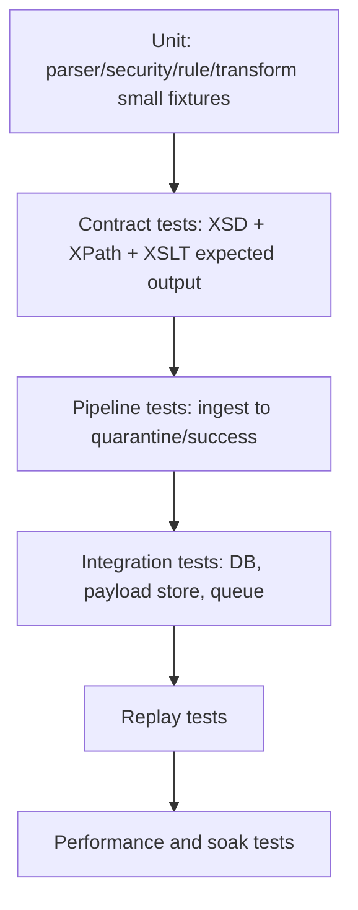

------
title: Learn Java XML In Action - Part 031
description: Reference architecture for a production-grade Java XML processing service covering secure ingest, validation, transformation, routing, persistence, audit, replay, observability, and deployment boundaries.
series: learn-java-xml-in-action
seriesTitle: Learn Java XML In Action: XML Technologies, Processing, XSD, XPath, XQuery, XSLT, and Production Grade Usage
order: 31
partTitle: Reference Architecture: Production-Grade XML Service
tags:
- java
- xml
- jaxp
- xsd
- xslt
- xpath
- architecture
- production
- audit
- security
date: 2026-07-02
---

# Reference Architecture: Production-Grade XML Service

Part ini adalah sintesis dari seluruh seri sebelum capstone. Kita tidak lagi membahas DOM, SAX, StAX, XSD, XPath, XQuery, dan XSLT sebagai API terpisah. Kita akan menyusunnya sebagai **service architecture** yang bisa menerima XML dari partner/regulator/internal system, memvalidasi kontrak, menjalankan transformasi, menyimpan evidence, memberi error yang actionable, dan bisa direplay secara defensible.

Target akhirnya: kamu mampu mendesain service XML yang tidak sekadar “bisa parse XML”, tetapi punya karakteristik production-grade:

- aman terhadap XML-specific attack;
- deterministic dalam pemilihan schema dan stylesheet;
- observable di setiap stage;
- bisa menjelaskan mengapa suatu payload diterima/ditolak;
- bisa direplay dengan versi asset yang sama;
- bisa berevolusi ketika schema partner berubah;
- bisa dioperasikan oleh tim support tanpa membuka PII mentah;
- bisa dipertanggungjawabkan dalam audit/regulatory review.

> Mental model: **XML service adalah mesin kontrak dan evidence**, bukan hanya parser.

---

## 1. Learning Objectives

Setelah part ini, kamu harus bisa:

1. Menyusun boundary service XML berdasarkan stage: ingest, parse, validate, extract, transform, route, persist, audit, replay.
2. Memilih kapan memakai DOM, SAX, StAX, XPath, XSLT, XQuery, atau binding dalam satu pipeline.
3. Mendesain contract registry untuk XSD, Schematron-like semantic rules, XPath rules, XSLT stylesheets, dan compatibility matrix.
4. Menentukan idempotency model untuk payload XML dari partner atau batch file.
5. Mendesain audit trail yang menyimpan cukup evidence tanpa membocorkan data sensitif.
6. Menentukan failure taxonomy yang bisa dipakai oleh API response, dashboard, quarantine, dan support workflow.
7. Membuat deployment topology untuk throughput tinggi dan failure isolation.

---

## 2. Problem Frame

Bayangkan ada service bernama `xml-integration-service`.

Service ini menerima payload seperti:

- regulatory submission XML;
- order update XML dari partner;
- insurance claim XML;
- financial reconciliation XML;
- healthcare document XML;
- telco provisioning XML;
- legacy SOAP payload;
- nightly batch file berisi banyak XML records.

Service harus melakukan:

1. menerima payload;
2. menentukan contract version;
3. menolak payload yang berbahaya sebelum masuk deeper processing;
4. parse dengan secure configuration;
5. validasi XSD;
6. ekstrak metadata seperti partner ID, correlation ID, document type, business key;
7. validasi semantic rules;
8. transformasi ke canonical XML atau domain event;
9. route ke downstream service;
10. simpan input, output, hash, error, dan asset version untuk audit;
11. quarantine payload bermasalah;
12. replay ketika ada bug fix atau schema migration.

Masalah ini tidak bisa diselesaikan dengan satu `DocumentBuilder.parse()` di controller.

---

## 3. Architecture Overview



Arsitektur ini sengaja stage-based. Setiap stage harus punya:

- input jelas;
- output jelas;
- error type jelas;
- metric jelas;
- audit event jelas;
- timeout/resource boundary jelas;
- versioned asset dependency jelas.

Kalau stage tidak punya hal-hal ini, biasanya service sulit di-debug saat incident.

---

## 4. Core Invariants

Production-grade XML service harus menjaga invariant berikut.

### 4.1 Payload is never trusted

Payload XML dari external source dianggap hostile sampai terbukti aman.

Implikasi:

- external entity access disabled;
- DTD disabled kecuali use case benar-benar membutuhkan dan dikontrol ketat;
- resolver default-deny;
- size limit sebelum parse;
- depth/entity/attribute/text limit;
- timeout per stage;
- redaction sebelum logging.

### 4.2 Contract resolution is deterministic

Service tidak boleh “menebak schema” berdasarkan file yang kebetulan tersedia di classpath.

Deterministic contract resolution berarti:

- document type diambil dari trusted metadata, envelope, namespace, atau root element;
- partner profile ikut menentukan contract;
- schema version dipilih dari registry;
- semua imported schema resolved dari local catalog/artifact bundle;
- tidak ada fetch ke network saat runtime validation;
- schema asset version dicatat dalam audit.

### 4.3 Validation is not business approval

XSD hanya menjawab: “Apakah XML ini sesuai grammar kontrak?”

XSD tidak cukup untuk:

- business eligibility;
- cross-record consistency;
- authorization;
- regulatory interpretation;
- temporal rule;
- duplicate detection;
- downstream readiness.

Karena itu pipeline butuh stage semantic rule terpisah.

### 4.4 Transformation must be reproducible

Output transformasi harus bisa direproduksi jika input dan asset version sama.

Karena itu transformation engine harus mencatat:

- stylesheet ID;
- stylesheet version;
- processor implementation/version jika relevan;
- parameter set;
- reference data snapshot/version;
- input payload hash;
- output payload hash;
- runtime policy flags.

### 4.5 Replay is a first-class capability

Replay bukan sekadar “run ulang job”. Replay harus bisa menjawab:

- payload mana yang dipakai;
- contract version mana yang dipakai;
- schema bundle mana yang dipakai;
- stylesheet mana yang dipakai;
- rule set mana yang dipakai;
- reference data mana yang dipakai;
- hasil lama dan hasil baru berbeda di mana;
- apakah replay boleh mengirim ulang ke downstream atau hanya dry-run.

---

## 5. Reference Package Structure

Contoh struktur Java service:

```text
com.company.xmlintegration
├── api
│   ├── XmlSubmissionController.java
│   ├── XmlBatchController.java
│   └── dto
├── application
│   ├── XmlProcessingService.java
│   ├── XmlReplayService.java
│   ├── XmlQuarantineService.java
│   └── XmlProcessingPipeline.java
├── pipeline
│   ├── Stage.java
│   ├── StageContext.java
│   ├── PayloadGuardStage.java
│   ├── ContractResolutionStage.java
│   ├── ParseStage.java
│   ├── XsdValidationStage.java
│   ├── MetadataExtractionStage.java
│   ├── SemanticRuleStage.java
│   ├── TransformationStage.java
│   ├── RoutingStage.java
│   └── DispatchStage.java
├── xml
│   ├── parser
│   ├── validation
│   ├── xpath
│   ├── xquery
│   ├── xslt
│   ├── serialization
│   └── resolver
├── contract
│   ├── ContractRegistry.java
│   ├── ContractDescriptor.java
│   ├── SchemaBundle.java
│   ├── StylesheetBundle.java
│   └── CompatibilityMatrix.java
├── domain
│   ├── SubmissionId.java
│   ├── PartnerId.java
│   ├── DocumentType.java
│   ├── ContractVersion.java
│   ├── ProcessingStatus.java
│   └── ProcessingFailure.java
├── persistence
│   ├── SubmissionRepository.java
│   ├── AuditEventRepository.java
│   ├── PayloadStore.java
│   └── QuarantineRepository.java
├── observability
│   ├── XmlMetrics.java
│   ├── XmlTraceAttributes.java
│   └── SafeXmlLogger.java
└── config
    ├── XmlSecurityProperties.java
    ├── XmlPipelineProperties.java
    └── XmlProcessorConfiguration.java
```

Poin penting: package `xml` berisi primitive XML processing, sedangkan package `pipeline` berisi orchestration. Jangan mencampur `DocumentBuilderFactory` setup langsung di controller.

---

## 6. Domain Model

Minimal domain model:

```java
public record XmlSubmission(
        SubmissionId submissionId,
        PartnerId partnerId,
        DocumentType documentType,
        ContractVersion requestedContractVersion,
        PayloadRef originalPayload,
        PayloadHash originalPayloadHash,
        Instant receivedAt
) {}
```

```java
public record ContractDescriptor(
        DocumentType documentType,
        ContractVersion version,
        String namespaceUri,
        String rootElementLocalName,
        SchemaBundle schemaBundle,
        RuleBundle ruleBundle,
        StylesheetBundle inboundStylesheet,
        CompatibilityPolicy compatibilityPolicy
) {}
```

```java
public record ProcessingFailure(
        FailureCode code,
        FailureCategory category,
        String safeMessage,
        Optional<XmlLocation> location,
        Optional<String> fieldPath,
        Map<String, String> diagnosticAttributes,
        boolean retryable
) {}
```

```java
public enum FailureCategory {
    PAYLOAD_GUARD,
    CONTRACT_RESOLUTION,
    PARSE,
    XSD_VALIDATION,
    METADATA_EXTRACTION,
    SEMANTIC_VALIDATION,
    TRANSFORMATION,
    ROUTING,
    DISPATCH,
    PERSISTENCE,
    INTERNAL
}
```

Design choice penting: `safeMessage` adalah pesan untuk client/support. Detail internal seperti stack trace, file path lokal, secret, atau full XML fragment tidak boleh dimasukkan ke public error.

---

## 7. Pipeline Contract

Gunakan stage abstraction agar setiap tahap bisa diuji, diukur, dan diganti.

```java
public interface Stage<I, O> {
    O execute(I input, StageContext context) throws ProcessingException;
}
```

```java
public final class StageContext {
    private final SubmissionId submissionId;
    private final CorrelationId correlationId;
    private final PartnerId partnerId;
    private final Clock clock;
    private final AuditRecorder auditRecorder;
    private final XmlMetrics metrics;
    private final Map<String, Object> attributes = new HashMap<>();

    public void putAttribute(String key, Object value) {
        attributes.put(key, value);
    }

    public Optional<Object> getAttribute(String key) {
        return Optional.ofNullable(attributes.get(key));
    }

    // getters omitted
}
```

Pipeline bukan tempat untuk menyembunyikan business rule. Pipeline hanya mengorkestrasi stage.

```java
public final class XmlProcessingPipeline {
    private final PayloadGuardStage payloadGuard;
    private final ContractResolutionStage contractResolution;
    private final ParseStage parse;
    private final XsdValidationStage validation;
    private final MetadataExtractionStage metadataExtraction;
    private final SemanticRuleStage semanticRules;
    private final TransformationStage transformation;
    private final RoutingStage routing;
    private final DispatchStage dispatch;

    public ProcessingResult process(RawPayload rawPayload, StageContext context) {
        GuardedPayload guarded = payloadGuard.execute(rawPayload, context);
        ContractDescriptor contract = contractResolution.execute(guarded, context);
        ParsedXml parsed = parse.execute(new ParseInput(guarded, contract), context);
        ValidatedXml valid = validation.execute(new ValidationInput(parsed, contract), context);
        ExtractedMetadata metadata = metadataExtraction.execute(valid, context);
        SemanticallyAccepted accepted = semanticRules.execute(new SemanticInput(valid, metadata, contract), context);
        TransformedPayload transformed = transformation.execute(new TransformInput(accepted, contract), context);
        RouteDecision route = routing.execute(new RoutingInput(transformed, metadata), context);
        DispatchResult dispatchResult = dispatch.execute(new DispatchInput(transformed, route), context);
        return ProcessingResult.accepted(context.submissionId(), dispatchResult);
    }
}
```

Di production, stage perlu wrapper untuk metrics, trace, timeout, dan audit:

```java
public final class InstrumentedStage<I, O> implements Stage<I, O> {
    private final String stageName;
    private final Stage<I, O> delegate;

    @Override
    public O execute(I input, StageContext context) {
        long started = System.nanoTime();
        context.auditRecorder().stageStarted(context.submissionId(), stageName);
        try {
            O output = delegate.execute(input, context);
            context.metrics().recordStageSuccess(stageName, System.nanoTime() - started);
            context.auditRecorder().stageSucceeded(context.submissionId(), stageName);
            return output;
        } catch (ProcessingException e) {
            context.metrics().recordStageFailure(stageName, e.failure().code());
            context.auditRecorder().stageFailed(context.submissionId(), stageName, e.failure());
            throw e;
        }
    }
}
```

---

## 8. Ingress Adapter

Ingress adapter menerima input dari HTTP, message broker, SFTP, object storage, atau batch folder.

Tugasnya:

- assign submission ID;
- assign correlation ID;
- capture source metadata;
- enforce maximum request/file size sebelum parse;
- store raw payload bytes atau stream reference;
- calculate payload hash;
- normalize transport-level metadata;
- tidak melakukan XML parse berat.

Contoh HTTP ingestion:

```java
@PostMapping(
    path = "/xml-submissions",
    consumes = {"application/xml", "text/xml"},
    produces = "application/json"
)
public ResponseEntity<SubmissionResponse> submit(
        @RequestHeader("X-Partner-Id") String partnerId,
        @RequestHeader(value = "X-Correlation-Id", required = false) String correlationId,
        InputStream body
) {
    XmlSubmissionCommand command = XmlSubmissionCommand.fromHttp(
            PartnerId.of(partnerId),
            CorrelationId.optional(correlationId),
            body
    );
    ProcessingResult result = processingService.process(command);
    return ResponseEntity.accepted().body(SubmissionResponse.from(result));
}
```

Untuk payload besar, jangan load semua ke `String`. Gunakan stream ke object storage/temp file dengan limit dan hash incremental.

---

## 9. Payload Guard

Payload guard berjalan sebelum parser XML penuh.

Validasi awal:

- maximum bytes;
- allowed content type;
- allowed encoding jika policy membatasi;
- forbidden control characters;
- compression bomb guard untuk file compressed;
- maximum records untuk batch;
- duplicate payload hash optional;
- source allowlist/partner authentication.

Contoh:

```java
public final class PayloadGuardStage implements Stage<RawPayload, GuardedPayload> {
    private final XmlPipelineProperties properties;
    private final PayloadStore payloadStore;

    @Override
    public GuardedPayload execute(RawPayload input, StageContext context) {
        if (input.sizeBytes() > properties.maxPayloadBytes()) {
            throw ProcessingException.of(FailureCode.PAYLOAD_TOO_LARGE);
        }
        if (!properties.allowedContentTypes().contains(input.contentType())) {
            throw ProcessingException.of(FailureCode.UNSUPPORTED_CONTENT_TYPE);
        }
        PayloadHash hash = payloadStore.hash(input.ref());
        return new GuardedPayload(input.ref(), hash, input.contentType(), input.sizeBytes());
    }
}
```

Payload guard tidak boleh menganggap XML valid. Ia hanya mencegah workload berbahaya atau jelas salah masuk ke parser.

---

## 10. Contract Resolver

Contract resolver menentukan schema/rules/stylesheet yang akan dipakai.

Sumber signal:

- partner profile;
- transport endpoint;
- envelope header;
- root namespace URI;
- root local name;
- explicit version attribute;
- submitted document type;
- configured default version per partner.



Contract resolver tidak boleh resolve import dari URL random yang muncul di XML instance. Semua schema import harus dikelola lewat catalog atau local registry.

Contoh descriptor YAML:

```yaml
contracts:
  - documentType: CLAIM_SUBMISSION
    version: 2026-01
    namespaceUri: "urn:company:claims:submission:2026-01"
    rootElement: "ClaimSubmission"
    schemaBundle: "claim-submission-xsd-2026-01"
    ruleBundle: "claim-submission-rules-2026-01"
    inboundStylesheet: "claim-submission-to-canonical-2026-01"
    compatibility:
      acceptsMinorVersions: true
      deprecated: false
      sunsetDate: null
```

---

## 11. Secure Parser Layer

Secure parser layer harus menjadi shared infrastructure. Jangan biarkan setiap developer membuat factory sendiri.

Contoh factory configuration untuk DOM/SAX style:

```java
public final class SecureDomFactoryProvider {
    public DocumentBuilderFactory newFactory() {
        DocumentBuilderFactory factory = DocumentBuilderFactory.newInstance();
        factory.setNamespaceAware(true);
        factory.setXIncludeAware(false);
        factory.setExpandEntityReferences(false);

        setFeature(factory, XMLConstants.FEATURE_SECURE_PROCESSING, true);
        setFeature(factory, "http://apache.org/xml/features/disallow-doctype-decl", true);
        setFeature(factory, "http://xml.org/sax/features/external-general-entities", false);
        setFeature(factory, "http://xml.org/sax/features/external-parameter-entities", false);
        setFeature(factory, "http://apache.org/xml/features/nonvalidating/load-external-dtd", false);

        factory.setAttribute(XMLConstants.ACCESS_EXTERNAL_DTD, "");
        factory.setAttribute(XMLConstants.ACCESS_EXTERNAL_SCHEMA, "");
        return factory;
    }

    private void setFeature(DocumentBuilderFactory factory, String feature, boolean enabled) {
        try {
            factory.setFeature(feature, enabled);
        } catch (ParserConfigurationException e) {
            throw new IllegalStateException("Required XML parser feature unsupported: " + feature, e);
        }
    }
}
```

Untuk StAX:

```java
public final class SecureStaxFactoryProvider {
    public XMLInputFactory newInputFactory() {
        XMLInputFactory factory = XMLInputFactory.newFactory();
        factory.setProperty(XMLInputFactory.IS_NAMESPACE_AWARE, true);
        factory.setProperty(XMLInputFactory.SUPPORT_DTD, false);
        factory.setProperty("javax.xml.stream.isSupportingExternalEntities", false);
        factory.setXMLResolver((publicId, systemId, baseUri, namespace) -> {
            throw new XMLStreamException("External XML resource access is disabled");
        });
        return factory;
    }
}
```

Prinsipnya: factory configuration adalah policy, bukan convenience detail.

---

## 12. XSD Validation Stage

Validation stage menerima parsed source atau stream source dan contract descriptor.

Tugas:

- load compiled `Schema` dari cache;
- validate dengan `Validator` baru per request;
- inject resolver/catalognya;
- collect structured validation errors;
- attach schema bundle version ke audit;
- reject jika invalid;
- lanjut jika valid.

```java
public final class XsdValidationStage implements Stage<ValidationInput, ValidatedXml> {
    private final SchemaCache schemaCache;

    @Override
    public ValidatedXml execute(ValidationInput input, StageContext context) {
        Schema schema = schemaCache.get(input.contract().schemaBundle());
        Validator validator = schema.newValidator();
        CollectingErrorHandler errors = new CollectingErrorHandler();
        validator.setErrorHandler(errors);

        try {
            validator.validate(input.parsedXml().source());
        } catch (SAXException | IOException e) {
            throw ProcessingException.of(FailureCode.XSD_VALIDATION_FAILED, e);
        }

        if (errors.hasErrors()) {
            throw ProcessingException.of(FailureCode.XSD_VALIDATION_FAILED, errors.toFailureDetails());
        }

        context.auditRecorder().recordValidationSuccess(
                context.submissionId(),
                input.contract().schemaBundle().id(),
                input.contract().schemaBundle().version()
        );

        return new ValidatedXml(input.parsedXml(), input.contract());
    }
}
```

Catatan lifecycle:

- `Schema` bisa dicache sebagai compiled grammar;
- `Validator` dibuat per request;
- `ErrorHandler` dibuat per request;
- resolver policy harus default-deny/local-only.

---

## 13. Metadata Extraction Stage

Metadata extraction harus deterministic dan explicit.

Contoh metadata:

- business key;
- partner business ID;
- document date;
- declared version;
- country/jurisdiction;
- product type;
- submission type;
- number of child records;
- optional risk flags.

Gunakan XPath registry, bukan XPath string tersebar di code.

```yaml
metadataExtractors:
  CLAIM_SUBMISSION:
    2026-01:
      businessKey:
        xpath: "/c:ClaimSubmission/c:Header/c:ClaimNumber/text()"
        required: true
      declaredVersion:
        xpath: "/c:ClaimSubmission/@version"
        required: true
      jurisdiction:
        xpath: "/c:ClaimSubmission/c:Header/c:Jurisdiction/text()"
        required: true
```

Java abstraction:

```java
public interface MetadataExtractor {
    ExtractedMetadata extract(ValidatedXml xml, ContractDescriptor contract);
}
```

Pola penting:

- XPath compiled saat startup atau saat contract load;
- namespace context berasal dari contract descriptor;
- missing value dibedakan dari blank value;
- extraction failure memiliki field path dan safe message;
- hasil extraction dicatat di audit jika tidak sensitif.

---

## 14. Semantic Rule Stage

Semantic validation bukan XSD.

Contoh semantic rule:

- `SubmissionDate` tidak boleh future date;
- `TotalAmount` harus sama dengan sum line amount;
- country tertentu membutuhkan additional section;
- amendment harus refer ke prior submission;
- partner hanya boleh submit product tertentu;
- ID harus unik untuk partner dalam periode tertentu;
- field tertentu mandatory hanya jika status tertentu.

Rule stage bisa memakai:

- Java rule object;
- XPath/XQuery assertion;
- Schematron-style rule engine;
- hybrid rule registry;
- database/reference data lookup.

Contoh Java rule:

```java
public interface XmlSemanticRule {
    RuleId id();
    RuleSeverity severity();
    Optional<RuleViolation> evaluate(ValidatedXml xml, ExtractedMetadata metadata, RuleContext context);
}
```

Contoh XPath assertion:

```yaml
rules:
  - id: CLAIM_TOTAL_MATCHES_LINE_SUM
    severity: ERROR
    expression: "xs:decimal(/c:ClaimSubmission/c:Summary/c:TotalAmount) = sum(/c:ClaimSubmission/c:Lines/c:Line/c:Amount/xs:decimal(.))"
    message: "Claim total amount must equal sum of line amounts."
```

Rule design guideline:

- rule ID stabil;
- rule message stabil;
- rule version jelas;
- rule severity jelas;
- rule output structured;
- rule tidak diam-diam mutate payload;
- rule bisa diuji dengan fixture minimal.

---

## 15. Transformation Stage

Transformation stage mengubah XML validated menjadi:

- canonical XML;
- downstream partner XML;
- domain event JSON;
- HTML/PDF input representation;
- text report;
- normalized database command.

Untuk XML-to-XML, XSLT sering menjadi pilihan paling maintainable jika mapping banyak berbasis struktur dokumen.

```java
public final class TransformationStage implements Stage<TransformInput, TransformedPayload> {
    private final StylesheetCache stylesheetCache;
    private final PayloadStore payloadStore;

    @Override
    public TransformedPayload execute(TransformInput input, StageContext context) {
        StylesheetBundle stylesheet = input.contract().inboundStylesheet();
        CompiledStylesheet compiled = stylesheetCache.get(stylesheet);

        TransformParameters parameters = TransformParameters.builder()
                .put("submission-id", context.submissionId().value())
                .put("partner-id", input.metadata().partnerId().value())
                .put("processing-date", LocalDate.now(context.clock()).toString())
                .build();

        PayloadRef output = compiled.transform(input.acceptedXml().source(), parameters);
        PayloadHash outputHash = payloadStore.hash(output);

        context.auditRecorder().recordTransformation(
                context.submissionId(),
                stylesheet.id(),
                stylesheet.version(),
                outputHash
        );

        return new TransformedPayload(output, outputHash, stylesheet);
    }
}
```

Transformation invariant:

- compiled stylesheet dicache;
- runtime transformer dibuat per request;
- parameters explicit;
- URI resolver controlled;
- result divalidasi jika output masih XML contract;
- output hash disimpan;
- transform failure tidak menghilangkan original payload.

---

## 16. Routing Stage

Routing menentukan tujuan berdasarkan metadata, contract, partner profile, dan processing result.

Contoh routing decision:

```java
public record RouteDecision(
        RouteId routeId,
        DestinationType destinationType,
        String destinationName,
        DispatchMode dispatchMode,
        boolean requiresAcknowledgement,
        boolean retryable
) {}
```

Routing harus deterministic dan audit-friendly.

Contoh policy:

```yaml
routes:
  - id: CLAIM_SUBMISSION_DEFAULT
    when:
      documentType: CLAIM_SUBMISSION
      jurisdiction: ID
      productType: HEALTH
    destination:
      type: KAFKA_TOPIC
      name: canonical-claim-submissions
    dispatchMode: AT_LEAST_ONCE
    requiresAcknowledgement: true
```

Jangan hardcode route dalam XSLT kecuali route memang bagian dari transformation output contract. Routing adalah orchestration concern.

---

## 17. Persistence Model

Minimal table model:

```sql
CREATE TABLE xml_submission (
    submission_id           VARCHAR(64) PRIMARY KEY,
    partner_id              VARCHAR(64) NOT NULL,
    document_type           VARCHAR(128),
    contract_version        VARCHAR(64),
    status                  VARCHAR(64) NOT NULL,
    original_payload_ref    VARCHAR(512) NOT NULL,
    original_payload_hash   VARCHAR(128) NOT NULL,
    transformed_payload_ref VARCHAR(512),
    transformed_hash        VARCHAR(128),
    failure_code            VARCHAR(128),
    failure_category        VARCHAR(64),
    received_at             TIMESTAMP NOT NULL,
    completed_at            TIMESTAMP,
    created_at              TIMESTAMP NOT NULL,
    updated_at              TIMESTAMP NOT NULL
);
```

```sql
CREATE TABLE xml_processing_audit_event (
    id                  BIGSERIAL PRIMARY KEY,
    submission_id       VARCHAR(64) NOT NULL,
    event_time          TIMESTAMP NOT NULL,
    stage_name          VARCHAR(128) NOT NULL,
    event_type          VARCHAR(64) NOT NULL,
    asset_type          VARCHAR(64),
    asset_id            VARCHAR(128),
    asset_version       VARCHAR(64),
    failure_code        VARCHAR(128),
    safe_message        TEXT,
    attributes_json     JSONB,
    FOREIGN KEY (submission_id) REFERENCES xml_submission(submission_id)
);
```

```sql
CREATE TABLE xml_quarantine_item (
    quarantine_id       VARCHAR(64) PRIMARY KEY,
    submission_id       VARCHAR(64) NOT NULL,
    reason_code         VARCHAR(128) NOT NULL,
    failure_category    VARCHAR(64) NOT NULL,
    safe_summary        TEXT NOT NULL,
    assigned_to         VARCHAR(128),
    review_status       VARCHAR(64) NOT NULL,
    created_at          TIMESTAMP NOT NULL,
    resolved_at         TIMESTAMP,
    FOREIGN KEY (submission_id) REFERENCES xml_submission(submission_id)
);
```

Payload besar biasanya lebih baik disimpan di object storage atau content-addressed storage, sedangkan database menyimpan reference dan hash.

---

## 18. Idempotency Design

Idempotency mencegah duplicate processing dan duplicate downstream effect.

Candidate idempotency key:

```text
partnerId + documentType + businessKey + declaredVersion
```

Atau:

```text
partnerId + payloadHash
```

Atau:

```text
partnerId + externalSubmissionId
```

Trade-off:

| Key | Kelebihan | Risiko |
|---|---|---|
| Payload hash | Simple, exact duplicate detection | Payload dengan whitespace/order berbeda bisa dianggap beda |
| External submission ID | Cocok jika partner punya ID stabil | Perlu trust partner dan handle collision |
| Business key | Cocok untuk domain-level duplicate | Butuh metadata extraction lebih dulu |
| Composite key | Lebih akurat | Lebih kompleks dan perlu governance |

Production pattern:

- register submission early;
- mark processing status transactionally;
- make downstream dispatch idempotent;
- store route dispatch attempt;
- support replay mode `DRY_RUN`, `REPROCESS_ONLY`, `REDISPATCH_ALLOWED`.

---

## 19. Quarantine Workflow

Quarantine bukan trash bin. Quarantine adalah workflow untuk payload yang butuh review atau perbaikan.



Quarantine item harus punya:

- failure category;
- failure code;
- safe summary;
- location jika ada;
- field path jika ada;
- original payload reference;
- current owner;
- review status;
- allowed action;
- evidence link;
- partner communication template.

Jangan mengirim raw stack trace ke partner. Gunakan stable rejection code.

---

## 20. Replay Architecture

Replay harus memisahkan tiga mode:

### 20.1 Diagnostic replay

Tujuan: reproduce result lama.

- memakai asset version lama;
- tidak dispatch ke downstream;
- membandingkan observed output dengan stored output;
- dipakai untuk incident analysis.

### 20.2 Migration replay

Tujuan: menjalankan payload lama dengan asset version baru.

- memakai schema/stylesheet/rules baru;
- tidak dispatch kecuali approved;
- menghasilkan diff;
- dipakai untuk schema migration.

### 20.3 Operational redispatch

Tujuan: mengirim ulang output yang sudah valid ke downstream.

- tidak mengubah transformasi;
- memakai output artifact yang sudah ada;
- membutuhkan idempotency key downstream;
- perlu approval jika high-risk.

Replay command:

```java
public record ReplayCommand(
        SubmissionId submissionId,
        ReplayMode mode,
        Optional<ContractVersion> targetContractVersion,
        boolean allowDispatch,
        String reason,
        UserId requestedBy
) {}
```

Replay audit event harus jelas membedakan result original dan result replay.

---

## 21. Observability Model

Metric minimal:

- submissions received by partner/document type;
- validation failures by schema version/failure code;
- transformation failures by stylesheet version;
- parse failure rate;
- processing latency by stage;
- payload size distribution;
- queue backlog;
- quarantine count by category;
- replay success/failure count;
- downstream dispatch latency/failure.

Trace attributes:

```text
xml.submission_id
xml.partner_id
xml.document_type
xml.contract_version
xml.schema_bundle
xml.stylesheet_bundle
xml.stage
xml.failure_code
xml.payload_size_bucket
xml.replay_mode
```

Safe structured log example:

```json
{
  "event": "xml.validation.failed",
  "submissionId": "sub_01J...",
  "partnerId": "partner-a",
  "documentType": "CLAIM_SUBMISSION",
  "contractVersion": "2026-01",
  "failureCode": "XSD_ELEMENT_REQUIRED",
  "fieldPath": "/ClaimSubmission/Header/ClaimNumber",
  "line": 42,
  "column": 17,
  "payloadHash": "sha256:...",
  "schemaBundle": "claim-submission-xsd-2026-01"
}
```

Do not log:

- full payload by default;
- secrets;
- credentials;
- raw PII;
- full medical/financial content;
- local filesystem paths exposed to client;
- stack trace in partner-facing response.

---

## 22. Deployment Topology

Basic topology:



High-throughput pattern:

- API ingest cepat dan async;
- worker pool melakukan parsing/validation/transformation;
- schema/stylesheet compiled cache per worker;
- payload store menyimpan raw artifact;
- queue memberi backpressure;
- quarantine flow terpisah dari happy path;
- replay service tidak memakai kapasitas worker production tanpa limit.

Isolation boundaries:

| Boundary | Alasan |
|---|---|
| Ingest vs processing | Upload cepat, processing bisa berat |
| Validation vs transformation | Error contract berbeda |
| Quarantine vs main path | Payload buruk tidak memblokir good traffic |
| Replay vs live traffic | Replay bisa mahal dan bursty |
| Contract repository vs runtime | Asset governance lebih jelas |

---

## 23. Configuration Baseline

```yaml
xml:
  security:
    disallowDoctype: true
    supportExternalEntities: false
    accessExternalDtd: ""
    accessExternalSchema: ""
    accessExternalStylesheet: ""
    maxPayloadBytes: 10485760
    maxBatchRecords: 10000
    maxXmlDepth: 128
    maxTextNodeBytes: 1048576
  processing:
    defaultTimeoutMs: 30000
    validationTimeoutMs: 10000
    transformationTimeoutMs: 15000
    replayTimeoutMs: 60000
  cache:
    schemaMaxEntries: 256
    stylesheetMaxEntries: 256
    xpathMaxEntries: 1024
  audit:
    storePayloadHash: true
    storeOriginalPayload: true
    storeTransformedPayload: true
    logRawPayload: false
  replay:
    maxConcurrentJobs: 4
    allowDispatchByDefault: false
```

Configuration harus diuji. Jangan hanya mengandalkan file YAML yang terlihat benar.

---

## 24. Contract Artifact Bundle

Struktur bundle:

```text
claim-submission-2026-01/
├── descriptor.yaml
├── schemas/
│   ├── claim-submission.xsd
│   ├── common-types.xsd
│   └── catalog.xml
├── rules/
│   ├── semantic-rules.yaml
│   └── xpath-assertions.xq
├── transforms/
│   ├── inbound-to-canonical.xsl
│   └── canonical-to-partner-ack.xsl
├── tests/
│   ├── valid/
│   ├── invalid-xsd/
│   ├── invalid-semantic/
│   └── expected-output/
└── metadata/
    ├── changelog.md
    ├── compatibility.yaml
    └── owners.yaml
```

Bundle invariant:

- self-contained;
- versioned;
- reviewed;
- tested;
- immutable setelah release;
- checksum recorded;
- compatible dengan replay.

---

## 25. End-to-End Sequence



---

## 26. API Response Model

Untuk async submission:

```json
{
  "submissionId": "sub_01JXYZ",
  "status": "ACCEPTED",
  "correlationId": "corr_abc",
  "links": {
    "status": "/xml-submissions/sub_01JXYZ"
  }
}
```

Untuk status rejected:

```json
{
  "submissionId": "sub_01JXYZ",
  "status": "REJECTED",
  "failure": {
    "code": "XSD_ELEMENT_REQUIRED",
    "category": "XSD_VALIDATION",
    "message": "Required element ClaimNumber is missing.",
    "fieldPath": "/ClaimSubmission/Header/ClaimNumber",
    "line": 42,
    "column": 17
  }
}
```

Error response harus stable. Jangan membuat client bergantung pada raw parser message yang bisa berubah antar implementation.

---

## 27. Testing Strategy for the Reference Architecture

Testing pyramid untuk XML service:



Minimal test suite:

- secure parser rejects XXE fixture;
- oversized payload rejected before parse;
- unknown namespace rejected deterministically;
- valid payload passes XSD;
- invalid payload returns stable failure code;
- semantic rule violation produces field path;
- transform output matches golden file after canonical comparison;
- stylesheet import cannot fetch network;
- repeated same submission is idempotent;
- replay with same asset produces same hash;
- replay with new asset produces explainable diff;
- quarantine created for validation failure;
- audit events contain stage, asset version, and hash.

---

## 28. Performance Design

Performance rules:

1. Stream before tree when payload is large.
2. Cache compiled schema, stylesheet, and XPath/XQuery where safe.
3. Do not share mutable runtime objects across threads.
4. Avoid stringifying entire XML for every stage.
5. Store payload as bytes/stream reference, not giant database text by default.
6. Bound worker concurrency based on CPU, memory, and downstream capacity.
7. Separate live traffic and replay traffic.
8. Measure failure path, not only success path.

Capacity dimensions:

| Dimension | Design Question |
|---|---|
| Payload size | What happens at P95/P99 XML size? |
| Node count | Can DOM explode memory? |
| Schema complexity | Does validation latency scale badly? |
| Stylesheet complexity | Is transformation CPU-heavy? |
| Downstream speed | Does dispatcher create backlog? |
| Replay load | Can historical replay starve live traffic? |
| Error volume | Can quarantine/support handle spikes? |

---

## 29. Security Design Review

Checklist:

- [ ] DTD disabled unless explicitly justified.
- [ ] External entity disabled.
- [ ] External DTD/schema/stylesheet access disabled or allowlisted.
- [ ] Resolver is default-deny.
- [ ] Payload size limit enforced before parse.
- [ ] Processing limits configured and tested.
- [ ] XML factories centralized.
- [ ] Raw XML not logged by default.
- [ ] PII redaction policy implemented.
- [ ] Partner-facing error does not expose internal paths/stack trace.
- [ ] Schema/stylesheet bundle is immutable after release.
- [ ] Replay permissions separated from normal processing.
- [ ] Quarantine UI has access control.
- [ ] Contract artifact changes require review.
- [ ] Security regression fixtures exist.

---

## 30. Architecture Decision Records

Buat ADR untuk keputusan seperti:

```text
ADR-001: Use StAX for large batch XML ingestion
ADR-002: Disable DTD and external entity access globally
ADR-003: Use local XML catalog for schema resolution
ADR-004: Cache compiled Schema and XSLT Templates/XsltExecutable
ADR-005: Store original payload in object storage with hash reference
ADR-006: Use async processing after ingress
ADR-007: Separate replay workers from live processing workers
ADR-008: Use XPath registry for metadata extraction
ADR-009: Use XSLT for XML-to-canonical transformation
ADR-010: Treat semantic validation as separate stage after XSD
```

ADR membantu ketika engineer baru bertanya: “Kenapa tidak langsung parse ke object dan selesai?”

---

## 31. Production Readiness Checklist

### Contract

- [ ] Contract descriptor exists.
- [ ] Schema bundle self-contained.
- [ ] Schema imports resolved locally.
- [ ] Compatibility policy documented.
- [ ] Deprecated versions have sunset policy.
- [ ] Golden fixtures exist.

### Runtime

- [ ] XML security properties enabled.
- [ ] Schema cache implemented.
- [ ] Stylesheet cache implemented.
- [ ] Mutable processors not shared across threads.
- [ ] Stage timeout exists.
- [ ] Payload size guard exists.

### Failure

- [ ] Failure taxonomy stable.
- [ ] Error code documented.
- [ ] Quarantine path tested.
- [ ] Retry policy explicit.
- [ ] Poison payload does not block queue.
- [ ] Replay mode tested.

### Audit

- [ ] Input hash stored.
- [ ] Output hash stored.
- [ ] Contract version stored.
- [ ] Schema/stylesheet/rule version stored.
- [ ] Stage events stored.
- [ ] PII-safe audit view exists.

### Operations

- [ ] Dashboard exists.
- [ ] Alert thresholds exist.
- [ ] Runbook exists.
- [ ] Support-safe diagnostic view exists.
- [ ] Backlog and quarantine metrics monitored.
- [ ] Capacity test executed.

---

## 32. Common Architecture Mistakes

### Mistake 1: Controller does everything

Controller melakukan parse, validate, transform, persist, dan call downstream.

Dampak:

- sulit test;
- error taxonomy kacau;
- no replay;
- no audit boundary;
- security config tersebar.

Fix: stage-based application pipeline.

### Mistake 2: Schema version inferred from classpath

Dampak:

- non-deterministic replay;
- incident sulit direproduce;
- deployment mengubah behavior tanpa contract release.

Fix: explicit contract registry and immutable asset bundle.

### Mistake 3: XSD treated as all validation

Dampak:

- business-invalid payload masuk downstream;
- rule berubah tanpa trace;
- XSD menjadi terlalu kompleks.

Fix: separate grammar validation and semantic validation.

### Mistake 4: Raw payload logged everywhere

Dampak:

- PII leakage;
- compliance risk;
- expensive logging;
- support access problem.

Fix: hash, metadata, redacted snippets, controlled payload viewer.

### Mistake 5: Replay not designed from day one

Dampak:

- incident recovery manual;
- audit answer lemah;
- migration risky;
- downstream duplicate side effects.

Fix: immutable artifacts, payload store, asset version record, replay modes.

---

## 33. Kaufman Practice for This Part

Untuk menguasai part ini, jangan hanya membaca diagram. Build versi kecilnya.

Latihan 90 menit:

1. Buat satu XSD sederhana untuk `OrderSubmission`.
2. Buat satu XML valid dan tiga XML invalid.
3. Buat pipeline dengan stage: guard, resolve, validate, extract, transform, persist audit.
4. Gunakan XPath untuk ekstrak `orderId` dan `partnerId`.
5. Gunakan XSLT identity-transform plus mapping kecil ke canonical XML.
6. Simpan audit event in-memory.
7. Buat replay command yang menjalankan ulang payload yang sama.
8. Pastikan output hash replay sama.

Kriteria berhasil:

- payload invalid menghasilkan failure code stabil;
- payload valid menghasilkan canonical XML;
- audit mencatat schema version dan stylesheet version;
- parser security test menolak XXE fixture;
- replay menghasilkan hash sama.

---

## 34. Summary

Reference architecture ini menyatukan seluruh skill XML production-grade:

- parser security dari awal;
- deterministic contract resolution;
- XSD validation sebagai grammar boundary;
- XPath/XQuery/rule engine sebagai semantic layer;
- XSLT sebagai transformation engine;
- persistence sebagai evidence store;
- quarantine sebagai operational workflow;
- replay sebagai audit and recovery capability;
- observability sebagai cara memahami sistem saat failure.

Jika kamu hanya mengambil satu prinsip dari part ini, ambil ini:

> XML service yang baik bukan service yang bisa membaca XML, tetapi service yang bisa membuktikan bagaimana XML diproses, dengan asset version, failure evidence, dan replay yang deterministik.

---

## Official References

- Java SE `java.xml` module documentation: JAXP, DOM, SAX, StAX, validation, transformation.
- Java JAXP Security Guide: secure processing, processing limits, external access controls.
- Java `javax.xml.validation` API documentation: `SchemaFactory`, `Schema`, `Validator`.
- W3C XML Schema, XPath, XQuery, and XSLT recommendations.
- Saxon s9api documentation for advanced XPath/XQuery/XSLT execution in Java.
