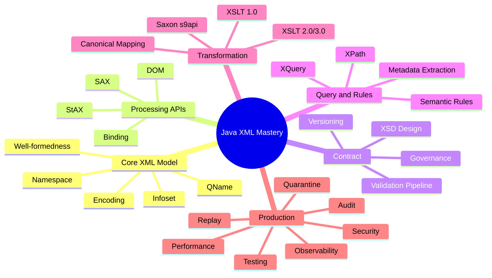

------
title: Learn Java XML In Action - Part 032
description: Capstone 20-hour practice plan and mastery checklist for Java XML, XML technologies, secure processing, XSD, XPath, XQuery, XSLT, testing, observability, and production-grade implementation.
series: learn-java-xml-in-action
seriesTitle: Learn Java XML In Action: XML Technologies, Processing, XSD, XPath, XQuery, XSLT, and Production Grade Usage
order: 32
partTitle: Capstone: 20-Hour Practice Plan and Mastery Checklist
tags:
- java
- xml
- jaxp
- xsd
- xpath
- xquery
- xslt
- saxon
- capstone
- mastery
date: 2026-07-02
---

# Capstone: 20-Hour Practice Plan and Mastery Checklist

Ini adalah bagian terakhir seri **Learn Java XML In Action**.

Part ini mengubah 31 part sebelumnya menjadi rencana latihan 20 jam ala Josh Kaufman: skill dipecah, target dibuat jelas, friction dikurangi, feedback loop dipercepat, dan latihan diarahkan ke kemampuan nyata. Tujuannya bukan menghafal API XML, tetapi mampu membangun, men-debug, mengamankan, dan mengoperasikan XML processing system dalam Java.

> Target skill: **mampu mendesain dan mengimplementasikan Java XML processing pipeline yang aman, validatable, transformable, testable, observable, dan replayable untuk workload enterprise/regulatory.**

---

## 1. What “Mastery” Means Here

Dalam konteks seri ini, mastery bukan berarti tahu semua detail XML specification. Mastery berarti kamu bisa membuat keputusan engineering yang benar di bawah constraint nyata.

Kamu dianggap menguasai skill ini jika bisa:

1. Menjelaskan kapan XML masih tepat dipakai.
2. Membedakan well-formed, valid, dan semantically valid XML.
3. Memilih DOM, SAX, StAX, binding, XPath, XQuery, atau XSLT berdasarkan workload.
4. Mengonfigurasi parser secara aman terhadap XXE dan XML bomb class of attacks.
5. Mendesain XSD yang evolvable dan tidak merusak compatibility.
6. Menjalankan XSD validation pipeline dengan error yang actionable.
7. Menggunakan XPath untuk extraction, assertion, testing, dan diagnostics.
8. Menggunakan XSLT untuk transformation yang deterministic dan testable.
9. Menggunakan Saxon/XDM ketika XPath/XSLT/XQuery 2.0/3.x diperlukan.
10. Menghasilkan XML dengan namespace, escaping, encoding, dan serialization yang benar.
11. Menulis test yang membandingkan XML secara struktural, bukan string naïve.
12. Mengobservasi XML pipeline dengan metrics, traces, audit events, dan safe logs.
13. Mendesain replay dan quarantine flow.
14. Menghasilkan architecture review yang defensible.

---

## 2. Skill Deconstruction



Pembelajaran efektif terjadi ketika kamu menyatukan cabang ini melalui satu proyek kecil, bukan mempelajari setiap API secara terpisah tanpa konteks.

---

## 3. Capstone Project

Bangun service kecil bernama:

```text
regulatory-xml-gateway
```

Use case:

Partner mengirim XML `CaseSubmission`. Service harus:

1. menerima XML;
2. menolak payload berbahaya;
3. resolve contract version;
4. validasi XSD;
5. ekstrak metadata dengan XPath;
6. validasi semantic rule;
7. transformasi ke canonical XML dengan XSLT;
8. simpan audit event;
9. quarantine payload invalid;
10. replay submission;
11. expose status endpoint;
12. punya test suite dan performance notes.

Minimal XML domain:

```xml
<case:CaseSubmission xmlns:case="urn:example:case:submission:2026-01" version="2026-01">
    <case:Header>
        <case:SubmissionId>SUB-1001</case:SubmissionId>
        <case:PartnerId>PARTNER-A</case:PartnerId>
        <case:SubmittedAt>2026-07-02T10:15:30Z</case:SubmittedAt>
    </case:Header>
    <case:Case>
        <case:CaseId>CASE-9001</case:CaseId>
        <case:CaseType>ENFORCEMENT</case:CaseType>
        <case:Priority>HIGH</case:Priority>
        <case:Amount currency="IDR">1250000.00</case:Amount>
    </case:Case>
</case:CaseSubmission>
```

Canonical output:

```xml
<canonical:RegulatoryCase xmlns:canonical="urn:example:canonical:case:2026-01">
    <canonical:Correlation>
        <canonical:SubmissionId>SUB-1001</canonical:SubmissionId>
        <canonical:PartnerId>PARTNER-A</canonical:PartnerId>
    </canonical:Correlation>
    <canonical:Case>
        <canonical:Id>CASE-9001</canonical:Id>
        <canonical:Type>ENFORCEMENT</canonical:Type>
        <canonical:Priority>HIGH</canonical:Priority>
        <canonical:DeclaredAmount currency="IDR">1250000.00</canonical:DeclaredAmount>
    </canonical:Case>
</canonical:RegulatoryCase>
```

---

## 4. 20-Hour Practice Plan

Rencana ini dibagi menjadi 10 sesi × 2 jam. Jangan skip testing dan diagnostics. Top 1% skill muncul dari kemampuan menangani failure, bukan hanya happy path.

| Session | Duration | Focus | Output |
|---:|---:|---|---|
| 1 | 2h | Core XML model and namespace drills | XML fixtures valid/invalid, namespace notes |
| 2 | 2h | Secure parsing with DOM/SAX/StAX | Parser factory module + XXE regression tests |
| 3 | 2h | XSD contract design | `case-submission.xsd` + compatibility notes |
| 4 | 2h | Java XSD validation pipeline | `SchemaCache`, `Validator`, structured errors |
| 5 | 2h | XPath extraction and assertions | metadata extraction registry + XPath tests |
| 6 | 2h | XSLT transformation | inbound-to-canonical stylesheet + golden tests |
| 7 | 2h | Saxon/XDM advanced runtime | optional Saxon path for XPath/XSLT 3.0 use case |
| 8 | 2h | XML generation, serialization, and comparison | deterministic output + XMLUnit/canonical comparison |
| 9 | 2h | Pipeline, audit, quarantine, replay | stage-based processing + audit model |
| 10 | 2h | Performance, failure drills, final review | benchmark notes + mastery checklist |

---

## 5. Session 1: Core XML Model and Namespace Drills

### Goal

Menghilangkan bug dasar: namespace mismatch, QName confusion, invalid XML, dan salah asumsi text/attribute.

### Build

Buat folder:

```text
src/test/resources/xml/case-submission/
├── valid-case-submission.xml
├── invalid-missing-header.xml
├── invalid-wrong-namespace.xml
├── invalid-bad-encoding.xml
└── invalid-duplicate-root.xml
```

### Drill

1. Parse root element.
2. Print namespace URI, local name, and prefix.
3. Buktikan bahwa prefix bukan identity kontrak.
4. Buat XML dengan prefix berbeda tapi namespace URI sama.
5. Buat XML dengan prefix sama tapi namespace URI berbeda.
6. Catat hasilnya.

### Self-correction questions

- Apakah matching element memakai namespace URI + local name?
- Apakah default namespace berlaku untuk attribute?
- Apakah whitespace di text node diperlakukan sebagai data?
- Apakah parser membaca encoding dari XML declaration atau asumsi caller?

### Done when

Kamu bisa menjelaskan mengapa XPath `/CaseSubmission/Header` gagal pada XML bernamespace default.

---

## 6. Session 2: Secure Parsing with DOM/SAX/StAX

### Goal

Membangun shared XML parser module yang aman.

### Build

```text
com.example.xml.security
├── SecureDomFactoryProvider.java
├── SecureSaxFactoryProvider.java
├── SecureStaxFactoryProvider.java
├── RejectingEntityResolver.java
└── XmlSecurityProperties.java
```

### Required tests

- XXE file read attempt rejected.
- External DTD network fetch rejected.
- Billion-laughs style entity expansion rejected or DTD blocked.
- Oversized payload rejected before parse.
- Valid XML still parses.

### Example malicious fixture

```xml
<?xml version="1.0"?>
<!DOCTYPE data [
  <!ENTITY xxe SYSTEM "file:///etc/passwd">
]>
<data>&xxe;</data>
```

### Self-correction questions

- Apakah secure config dipakai oleh semua parser path?
- Apakah resolver default-deny?
- Apakah test gagal kalau secure feature dihapus?
- Apakah error message aman untuk client?

### Done when

Kamu bisa menghapus salah satu secure feature dan melihat test security gagal.

---

## 7. Session 3: XSD Contract Design

### Goal

Mendesain XSD yang validatable, readable, dan evolvable.

### Build

```text
contracts/case-submission-2026-01/
├── schemas/case-submission.xsd
├── schemas/common-types.xsd
├── schemas/catalog.xml
├── descriptor.yaml
└── tests/
```

### XSD requirements

- namespace: `urn:example:case:submission:2026-01`;
- root: `CaseSubmission`;
- required `Header`;
- required `SubmissionId`, `PartnerId`, `SubmittedAt`;
- required `CaseId`, `CaseType`, `Priority`, `Amount`;
- `CaseType` enum: `ENFORCEMENT`, `SUPERVISION`, `COMPLAINT`;
- `Priority` enum: `LOW`, `MEDIUM`, `HIGH`;
- amount type decimal with currency attribute;
- `version` attribute fixed or constrained.

### Design constraints

- Jangan gunakan `xs:any` tanpa namespace/processContents policy.
- Jangan menjadikan semua field optional.
- Jangan pakai `xs:string` untuk semua tipe.
- Pisahkan common types jika reusable.
- Tuliskan compatibility notes.

### Done when

Minimal 1 valid XML lolos dan 5 invalid XML gagal dengan reason yang dipahami.

---

## 8. Session 4: Java XSD Validation Pipeline

### Goal

Mengubah XSD menjadi runtime validation pipeline.

### Build

```text
com.example.xml.validation
├── SchemaCache.java
├── SchemaBundle.java
├── SchemaBundleLoader.java
├── LocalOnlyResourceResolver.java
├── CollectingValidationErrorHandler.java
├── ValidationError.java
└── XsdValidationService.java
```

### Required behavior

- `Schema` compiled once per bundle version.
- `Validator` created per validation call.
- Errors collected with line/column if available.
- External schema access blocked.
- Validation result structured.

### Validation result model

```java
public record ValidationResult(
        boolean valid,
        List<ValidationError> errors,
        String schemaBundleId,
        String schemaBundleVersion
) {}
```

### Done when

Validation failure can be displayed like:

```json
{
  "code": "XSD_VALIDATION_FAILED",
  "line": 18,
  "column": 29,
  "message": "Required element CaseId is missing.",
  "schemaBundle": "case-submission-2026-01"
}
```

---

## 9. Session 5: XPath Extraction and Assertions

### Goal

Membuat XPath registry untuk metadata extraction dan lightweight rule assertion.

### Build

```text
com.example.xml.xpath
├── NamespaceRegistry.java
├── XPathExpressionRegistry.java
├── XPathMetadataExtractor.java
├── XPathAssertion.java
└── XPathEvaluationException.java
```

### Metadata fields

- submission ID;
- partner ID;
- submitted at;
- case ID;
- case type;
- priority;
- amount;
- currency.

### Example registry

```yaml
metadata:
  submissionId: "/case:CaseSubmission/case:Header/case:SubmissionId/text()"
  partnerId: "/case:CaseSubmission/case:Header/case:PartnerId/text()"
  caseId: "/case:CaseSubmission/case:Case/case:CaseId/text()"
  priority: "/case:CaseSubmission/case:Case/case:Priority/text()"
```

### Required tests

- extraction succeeds for valid XML;
- missing required field raises structured error;
- wrong namespace returns missing, not wrong value;
- XPath injection is impossible because user input is not concatenated into expression.

### Done when

Metadata extraction returns typed object:

```java
public record CaseSubmissionMetadata(
        String submissionId,
        String partnerId,
        Instant submittedAt,
        String caseId,
        String caseType,
        String priority,
        BigDecimal amount,
        String currency
) {}
```

---

## 10. Session 6: XSLT Transformation

### Goal

Mengubah inbound XML menjadi canonical XML dengan XSLT yang deterministic.

### Build

```text
contracts/case-submission-2026-01/transforms/
└── inbound-to-canonical.xsl
```

### Stylesheet requirements

- use explicit namespace prefixes;
- template match root;
- output canonical namespace;
- preserve amount and currency;
- do not copy unknown inbound nodes blindly;
- support parameter `processing-date` optional;
- output deterministic XML.

### Golden test

Input:

```text
valid-case-submission.xml
```

Expected output:

```text
expected-canonical-case.xml
```

Use XML structural comparison, not raw string equality unless serialization is canonicalized.

### Done when

Transform output passes:

- XML well-formedness check;
- canonical output XSD validation if you define canonical XSD;
- golden XML structural comparison;
- no external stylesheet import/network access.

---

## 11. Session 7: Saxon/XDM Advanced Runtime

### Goal

Memahami kapan JDK XPath/XSLT cukup dan kapan Saxon/XDM memberi benefit.

### Build optional module

```text
com.example.xml.saxon
├── SaxonProcessorProvider.java
├── SaxonXPathService.java
├── SaxonXsltService.java
└── SaxonSecurityPolicy.java
```

### Use cases to try

- XPath 3.1 expression with sequence handling.
- XSLT 2.0 grouping if you add multiple case records.
- XSLT function for reusable mapping.
- XDM typed value inspection.

### Important lifecycle

- `Processor` as shared runtime root.
- compiler configured with static context.
- executable cached where safe.
- transformer/selector created per execution.
- URI/resource resolver controlled.

### Done when

Kamu bisa menjelaskan:

- kenapa JDK XPath 1.0 tidak cukup untuk XPath 3.1 use case;
- apa beda static context dan dynamic context;
- kenapa compiled executable dicache tapi runtime evaluator tidak dishare sembarangan.

---

## 12. Session 8: XML Generation, Serialization, and Comparison

### Goal

Menghasilkan XML yang valid, namespace-correct, dan testable.

### Build

```text
com.example.xml.serialization
├── XmlWriterService.java
├── DeterministicXmlSerializer.java
├── XmlCanonicalComparator.java
└── XmlOutputValidator.java
```

### Drills

1. Generate acknowledgment XML dengan StAX.
2. Pastikan escaping benar untuk `&`, `<`, `>`, quote dalam attribute.
3. Pastikan namespace prefix tidak hardcoded sebagai identity.
4. Serialize dengan encoding UTF-8.
5. Compare output dengan XML structural comparison.
6. Validate output against ACK XSD.

### Example ACK

```xml
<ack:SubmissionAcknowledgement xmlns:ack="urn:example:ack:2026-01">
    <ack:SubmissionId>SUB-1001</ack:SubmissionId>
    <ack:Status>ACCEPTED</ack:Status>
</ack:SubmissionAcknowledgement>
```

### Done when

Changing namespace prefix from `ack` to `a` does not break structural tests.

---

## 13. Session 9: Pipeline, Audit, Quarantine, Replay

### Goal

Menyatukan semua primitive menjadi processing service.

### Build

```text
com.example.gateway.pipeline
├── XmlProcessingPipeline.java
├── PayloadGuardStage.java
├── ContractResolutionStage.java
├── XsdValidationStage.java
├── MetadataExtractionStage.java
├── SemanticRuleStage.java
├── TransformationStage.java
├── AuditRecorder.java
├── QuarantineService.java
└── ReplayService.java
```

### Required statuses

```java
public enum SubmissionStatus {
    RECEIVED,
    PROCESSING,
    ACCEPTED,
    REJECTED,
    QUARANTINED,
    REPLAYED,
    DISPATCHED
}
```

### Audit event example

```java
public record AuditEvent(
        String submissionId,
        String stage,
        String eventType,
        Instant occurredAt,
        Map<String, String> attributes
) {}
```

### Replay requirements

- replay same payload;
- same contract version should produce same output hash;
- new contract version runs dry-run;
- dispatch disabled by default;
- replay audit event created.

### Done when

You can run:

```text
submit valid XML -> accepted -> canonical output hash stored -> replay -> same hash
submit invalid XML -> quarantined -> failure code stored -> safe status response
```

---

## 14. Session 10: Performance, Failure Drills, Final Review

### Goal

Menguji service sebagai sistem, bukan hanya code.

### Drills

1. Generate 1,000 small XML payloads.
2. Generate 10 large XML payloads.
3. Compare DOM vs StAX extraction memory behavior.
4. Run validation with schema cache enabled/disabled.
5. Run transform with stylesheet cache enabled/disabled.
6. Measure P50/P95/P99 latency per stage.
7. Inject invalid namespace spike.
8. Inject downstream failure.
9. Run replay burst and ensure live processing is not starved.
10. Confirm logs do not leak raw payload.

### Minimal benchmark output

```text
Scenario: 1000 valid small payloads
Parser: StAX
Schema cache: enabled
Stylesheet cache: enabled
P50 latency: ... ms
P95 latency: ... ms
P99 latency: ... ms
Max heap observed: ... MB
Validation failures: 0
Transformation failures: 0
```

### Done when

You can explain bottleneck and next optimization without guessing.

---

## 15. Mastery Checklist

### XML Core

- [ ] I can distinguish document, element, attribute, text, namespace URI, prefix, and QName.
- [ ] I know why namespace URI matters more than prefix.
- [ ] I can explain default namespace behavior for elements and attributes.
- [ ] I can diagnose well-formedness error vs validation error.
- [ ] I can explain how encoding affects XML reading/writing.

### Parser Strategy

- [ ] I know when DOM is acceptable.
- [ ] I know when SAX is appropriate.
- [ ] I know when StAX is better than SAX.
- [ ] I can avoid loading huge XML into memory unnecessarily.
- [ ] I can model SAX/StAX processing as state machine.
- [ ] I can separate parser lifecycle from business logic.

### Security

- [ ] I can explain XXE.
- [ ] I can explain entity expansion risk.
- [ ] I can configure parser to reject DTD/external entities.
- [ ] I can configure external DTD/schema/stylesheet access policy.
- [ ] I can write security regression fixtures.
- [ ] I can prevent raw sensitive XML from being logged.
- [ ] I can design default-deny resolver policy.

### XSD

- [ ] I can design simple and complex types.
- [ ] I understand occurrence constraints.
- [ ] I understand `nillable`, missing, empty, and default/fixed differences.
- [ ] I know when to use element vs attribute.
- [ ] I can design enum/facet restrictions without overfitting.
- [ ] I can modularize schema with `include` and `import` correctly.
- [ ] I can version schema without breaking every partner.
- [ ] I can explain why XSD is not full business validation.

### Java Validation

- [ ] I can use `SchemaFactory`, `Schema`, and `Validator` correctly.
- [ ] I can cache compiled schema safely.
- [ ] I know `Validator` should be per-use, not shared across threads.
- [ ] I can collect validation errors with line/column.
- [ ] I can resolve schema imports locally.
- [ ] I can produce stable validation failure codes.

### XPath

- [ ] I can write namespace-aware XPath.
- [ ] I understand context node.
- [ ] I understand axes and predicates.
- [ ] I can compile XPath expressions.
- [ ] I can avoid XPath injection.
- [ ] I can use XPath for tests, metadata extraction, and diagnostics.
- [ ] I know when JDK XPath 1.0 is insufficient.

### XQuery

- [ ] I can explain FLWOR.
- [ ] I know when XQuery is better than Java loops.
- [ ] I can query multi-document XML collections.
- [ ] I can parameterize query input.
- [ ] I can separate XQuery module governance from application code.

### XSLT

- [ ] I understand template matching.
- [ ] I understand push vs pull style.
- [ ] I can write identity transform.
- [ ] I can use modes.
- [ ] I can pass parameters.
- [ ] I can test transformation with golden XML.
- [ ] I can cache compiled stylesheet.
- [ ] I can control `URIResolver`/resource access.
- [ ] I know when Saxon/XSLT 2.0/3.0 is useful.

### Binding and Serialization

- [ ] I know when XML binding helps.
- [ ] I know when binding hides XML contract details dangerously.
- [ ] I can generate XML safely with StAX.
- [ ] I can handle escaping and encoding.
- [ ] I can validate generated XML.
- [ ] I can compare XML structurally.

### Testing

- [ ] I have valid and invalid fixtures.
- [ ] I have security fixtures.
- [ ] I test schema compatibility.
- [ ] I test XPath extraction.
- [ ] I test XSLT output.
- [ ] I compare XML structurally, not naïvely by raw string.
- [ ] I can run replay tests.
- [ ] I can test failure taxonomy.

### Production Architecture

- [ ] I can design stage-based XML pipeline.
- [ ] I can design contract registry.
- [ ] I can design schema/stylesheet asset bundles.
- [ ] I can design quarantine workflow.
- [ ] I can design replay modes.
- [ ] I can design audit evidence.
- [ ] I can define observability metrics.
- [ ] I can define safe logging policy.
- [ ] I can reason about idempotency.

---

## 16. Failure Drill Bank

Use these drills repeatedly.

### Drill A: Namespace drift

Change namespace URI from:

```text
urn:example:case:submission:2026-01
```

to:

```text
urn:example:case:submission:2026-02
```

Expected:

- contract resolution fails or resolves new contract explicitly;
- XPath extraction does not silently return wrong values;
- error code stable.

### Drill B: Prefix change

Change prefix from `case` to `c` while namespace URI remains same.

Expected:

- validation passes;
- XPath extraction passes if namespace context is correct;
- tests do not depend on prefix.

### Drill C: Missing required element

Remove `CaseId`.

Expected:

- XSD validation fails;
- line/column captured if available;
- quarantine item created.

### Drill D: Business-invalid amount

Set amount to negative if XSD allows decimal but business rule forbids negative.

Expected:

- XSD may pass;
- semantic rule fails;
- failure category is semantic validation, not XSD.

### Drill E: XXE attempt

Add external entity.

Expected:

- parser rejects before content expansion;
- no file/network access;
- security regression test passes.

### Drill F: Stylesheet network import

Add stylesheet import from HTTP URL.

Expected:

- transformation setup rejects external access;
- audit records transformation configuration failure.

### Drill G: Replay drift

Change stylesheet and replay historical payload.

Expected:

- diagnostic replay with old asset produces same output hash;
- migration replay with new asset produces different output and diff.

---

## 17. Architecture Review Questions

Saat review design XML system, tanyakan:

1. Apa source payload dan trust level-nya?
2. Berapa P50/P95/P99 payload size?
3. Apakah XML harus diproses full tree atau streaming?
4. Bagaimana contract version ditentukan?
5. Apakah schema import resolved dari network?
6. Bagaimana parser dikonfigurasi terhadap XXE?
7. Apa boundary antara XSD validation dan semantic validation?
8. Apakah XPath namespace-aware?
9. Apakah transformation deterministic?
10. Apakah stylesheet/rule/schema version dicatat?
11. Apakah output divalidasi?
12. Apakah raw payload disimpan? Di mana? Dengan encryption/access control apa?
13. Apakah logs mengandung PII?
14. Bagaimana idempotency key dibuat?
15. Apa yang terjadi kalau downstream gagal?
16. Bagaimana quarantine dikelola?
17. Bagaimana replay dilakukan?
18. Apakah replay bisa dispatch ulang?
19. Apakah contract migration bisa diuji sebelum rollout?
20. Apa runbook ketika validation failure spike?

---

## 18. Design Rubric

Gunakan rubric ini untuk menilai solusi.

| Level | Description |
|---:|---|
| 1 | Bisa parse XML happy path, tetapi security, validation, error handling belum jelas. |
| 2 | Bisa validasi XSD dan transformasi sederhana, tetapi lifecycle/cache/error taxonomy belum matang. |
| 3 | Secure parser, validation, XPath extraction, XSLT, tests, dan structured errors sudah ada. |
| 4 | Pipeline punya audit, observability, quarantine, replay, schema/stylesheet versioning. |
| 5 | Sistem punya compatibility governance, performance model, incident playbook, migration replay, dan support-safe tooling. |

Target seri ini: minimal **Level 4**, dan menuju **Level 5** untuk environment enterprise/regulatory.

---

## 19. Anti-Cheat Rules

Agar latihan benar-benar membentuk skill:

- Jangan copy-paste parser setup tanpa memahami setiap feature.
- Jangan memakai raw string comparison untuk XML test.
- Jangan menganggap XSD = business validation.
- Jangan hardcode XPath tersebar di service class.
- Jangan compile schema/stylesheet berulang untuk setiap request.
- Jangan share mutable `Validator`, `Transformer`, atau runtime selector lintas thread.
- Jangan log raw XML payload.
- Jangan membuat replay belakangan setelah incident.
- Jangan menyebut service production-ready sebelum ada failure fixtures.

---

## 20. Minimal Implementation Acceptance Criteria

Capstone dianggap lulus jika memenuhi semua ini:

### Functional

- [ ] Valid XML accepted.
- [ ] Invalid XML rejected with stable error.
- [ ] Unknown namespace rejected deterministically.
- [ ] Metadata extracted correctly.
- [ ] XSLT output generated.
- [ ] Output XML valid.
- [ ] Status endpoint returns processing result.

### Security

- [ ] XXE fixture rejected.
- [ ] External DTD blocked.
- [ ] External schema blocked unless local resolver allows.
- [ ] External stylesheet blocked unless local resolver allows.
- [ ] Payload size limit exists.
- [ ] Raw XML not logged by default.

### Testing

- [ ] XSD valid/invalid fixtures.
- [ ] XPath extraction tests.
- [ ] XSLT golden tests.
- [ ] Security regression tests.
- [ ] Replay test.
- [ ] Quarantine test.

### Operations

- [ ] Metrics by stage.
- [ ] Audit event by stage.
- [ ] Failure taxonomy.
- [ ] Quarantine record.
- [ ] Payload hash.
- [ ] Schema/stylesheet/rule version recorded.
- [ ] Replay mode implemented.

---

## 21. Example Final Folder Layout

```text
regulatory-xml-gateway/
├── README.md
├── pom.xml
├── src/main/java/com/example/gateway/
│   ├── api/
│   ├── application/
│   ├── contract/
│   ├── domain/
│   ├── persistence/
│   ├── pipeline/
│   ├── xml/
│   └── observability/
├── src/main/resources/
│   ├── application.yaml
│   └── contracts/
│       └── case-submission-2026-01/
│           ├── descriptor.yaml
│           ├── schemas/
│           ├── transforms/
│           ├── rules/
│           └── tests/
├── src/test/java/com/example/gateway/
│   ├── xml/
│   ├── validation/
│   ├── xpath/
│   ├── xslt/
│   ├── pipeline/
│   └── replay/
└── src/test/resources/
    └── xml-fixtures/
```

---

## 22. Final Mental Models

### XML as contract

XML bukan hanya format. XML adalah kontrak dengan grammar, namespace, version, dan compatibility policy.

### Parser as security boundary

Parser bukan utility netral. Parser adalah boundary yang bisa membuka file, network, entity, memory, dan CPU jika salah konfigurasi.

### XSD as grammar validation

XSD menjamin struktur dan tipe, bukan kebenaran business end-to-end.

### XPath as precise address language

XPath adalah cara menunjuk bagian XML secara eksplisit. Tanpa namespace awareness, XPath di XML enterprise hampir selalu rapuh.

### XSLT as deterministic transformation engine

XSLT bukan sekadar templating. Untuk XML-to-XML mapping yang kompleks, ia bisa lebih auditable daripada Java imperative mapping.

### Pipeline as evidence machine

Pipeline XML production-grade harus menghasilkan evidence: asset version, hash, validation result, transformation result, and replay trail.

### Replay as design requirement

Replay bukan fitur tambahan. Dalam domain audit/regulatory, replay adalah cara membuktikan dan memperbaiki processing history.

---

## 23. What to Learn Next

Setelah seri ini, materi lanjutan yang paling natural:

1. **Build From Scratch: Production-Grade XML Gateway with Java**  
   Implementasi penuh service dari capstone, lengkap dengan database, queue, object storage, observability, and replay UI.

2. **Java SOAP, WSDL, WS-Security, and Enterprise Integration In Action**  
   Cocok jika XML muncul di legacy enterprise integration.

3. **Schema Governance and Contract Testing Platform**  
   Fokus pada registry, compatibility analysis, schema release workflow, and contract CI.

4. **Document Processing Architecture**  
   XML, PDF, HTML, office document, signature, canonicalization, audit, and regulatory submission pipelines.

5. **Data Transformation Engineering with XSLT, XQuery, and Mapping Governance**  
   Fokus advanced transformation layer, mapping versioning, diff, traceability, and migration.

---

## 24. Series Completion Notice

Seri **Learn Java XML In Action: XML Technologies, Processing, XSD, XPath, XQuery, XSLT, and Production Grade Usage** selesai di part ini.

Total: **32 part**.

Coverage utama:

- XML core model;
- Java XML stack and JAXP;
- DOM, SAX, StAX;
- secure XML processing;
- XSD design and validation;
- XPath and advanced XPath/XDM;
- XQuery;
- XSLT 1.0/2.0/3.0 and Saxon;
- XML binding;
- XML generation and serialization;
- diagnostics;
- performance;
- pipeline architecture;
- production integration patterns;
- testing;
- observability and audit;
- versioning;
- failure modes;
- reference architecture;
- 20-hour mastery plan.

Final principle:

> Engineer yang kuat dalam XML bukan yang paling banyak hafal tag atau API, tetapi yang bisa menjaga kontrak, security, compatibility, transformation correctness, evidence, dan replayability dalam sistem yang berubah terus.

---

## Official References

- Java SE `java.xml` module documentation.
- Java JAXP Security Guide.
- Java `javax.xml.validation`, `javax.xml.xpath`, `javax.xml.transform`, and `javax.xml.stream` APIs.
- W3C XML, XML Schema, XPath, XQuery, XSLT, XDM, and Canonical XML specifications.
- Saxon s9api documentation.
- OWASP XML External Entity Prevention Cheat Sheet.
- OWASP Logging Cheat Sheet.
