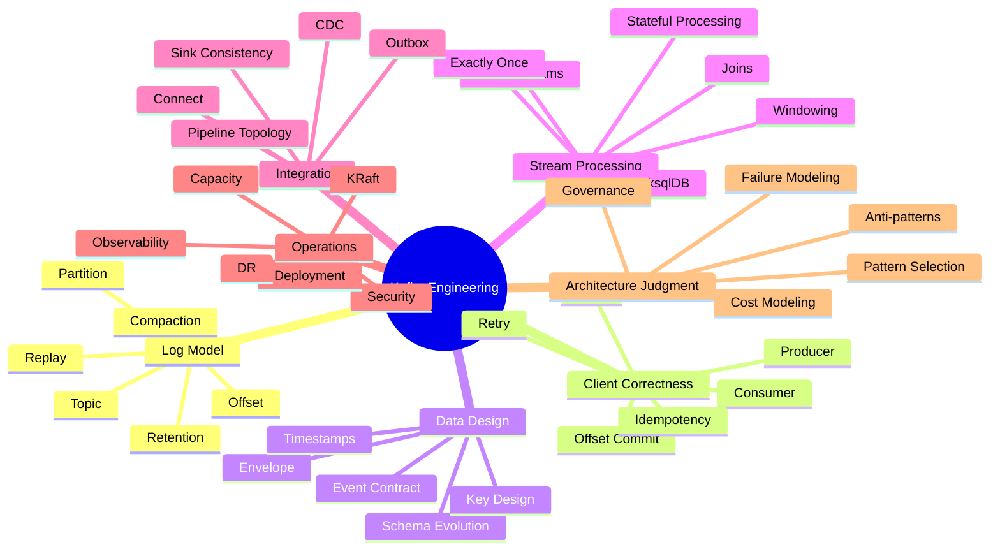
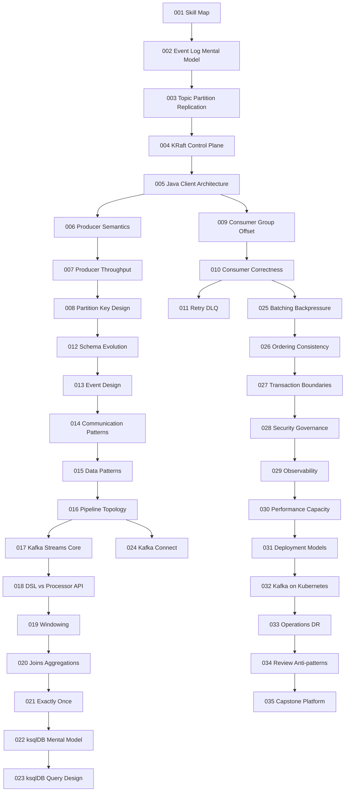
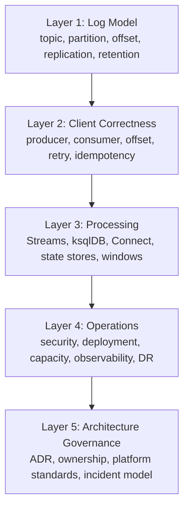
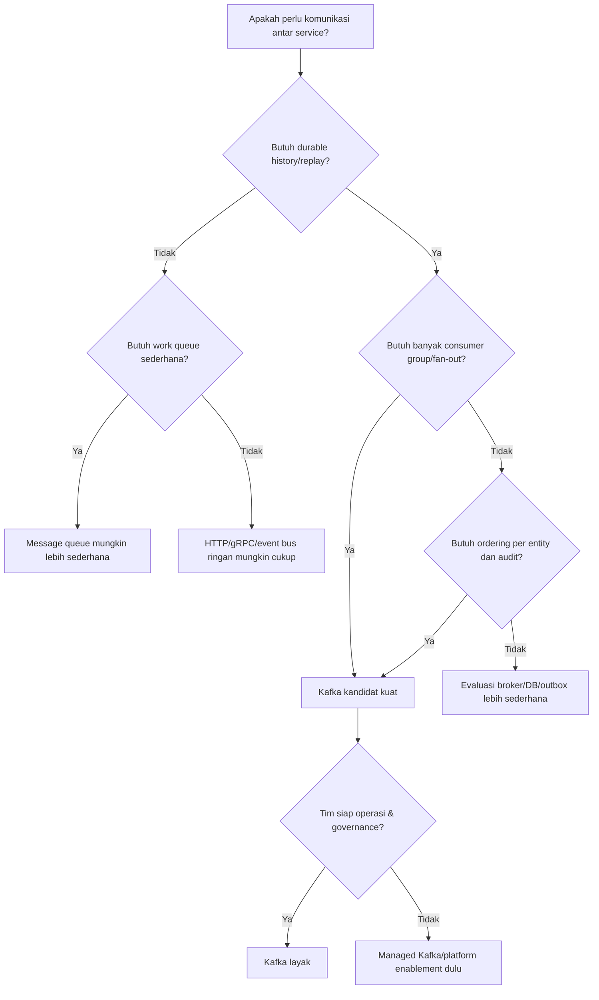
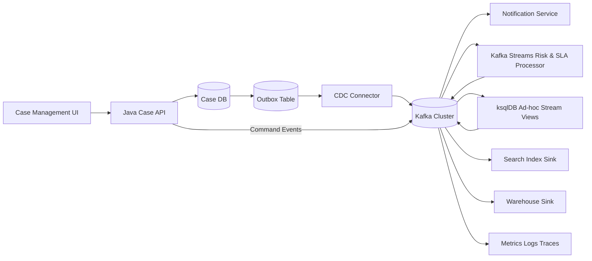
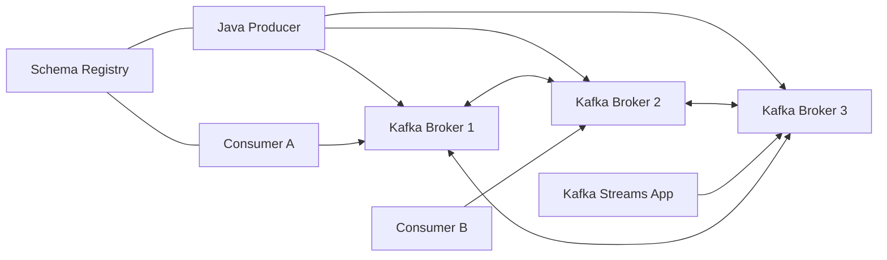

------
title: Learn Java Kafka in Action - Part 001
description: Kaufman-style skill map for mastering Java Kafka, Kafka Streams, ksqlDB, event-driven patterns, and production deployment without wasting effort on shallow template learning.
series: learn-java-kafka-in-action
seriesTitle: Learn Java Kafka in Action
order: 1
partTitle: Kaufman Skill Map
tags:
  - java
  - kafka
  - kafka-streams
  - ksqldb
  - event-driven-architecture
  - distributed-systems
  - kaufman
  - series
date: 2026-07-01
---

# Part 001 — Kaufman Skill Map

## 1. Tujuan Part Ini

Part ini bukan pengantar Kafka biasa. Tujuannya adalah membuat **peta belajar yang tajam** agar seluruh seri ini tidak berubah menjadi kumpulan API tutorial, snippet producer-consumer, atau konfigurasi yang dihafalkan tanpa model mental.

Target kita adalah membangun kemampuan untuk:

1. Mendesain sistem event-driven berbasis Kafka dengan reasoning yang defensible.
2. Memilih pattern komunikasi dan data yang cocok, bukan sekadar “pakai Kafka karena asynchronous”.
3. Mengimplementasikan producer, consumer, Kafka Streams, dan ksqlDB dengan correctness yang jelas.
4. Menjelaskan trade-off delivery semantics, ordering, retention, replay, compaction, schema evolution, batching, dan deployment.
5. Mendiagnosis incident Kafka: lag, rebalance storm, duplicate processing, missing events, hot partition, broken schema, state-store corruption, dan throughput collapse.
6. Membuat architecture decision record yang bisa dipertanggungjawabkan di level engineering handbook.

Kafka adalah distributed event streaming platform. Dokumentasi Apache Kafka menggambarkan Kafka sebagai sistem terdistribusi yang terdiri dari server dan client yang berkomunikasi melalui high-performance TCP network protocol, serta bisa dideploy di bare metal, VM, container, on-premise, dan cloud. Untuk seri ini, kita menganggap Kafka sebagai **platform log terdistribusi untuk data-in-motion**, bukan sekadar message broker.

> Baseline modern: Kafka 4.0 dan setelahnya hanya mendukung KRaft mode; ZooKeeper mode sudah dihapus. Karena itu, seri ini memakai pendekatan **KRaft-first**. ZooKeeper hanya akan muncul sebagai konteks historis atau migrasi legacy, bukan sebagai deployment target baru.

## 2. Cara Kaufman Diterapkan di Seri Ini

Josh Kaufman dalam *The First 20 Hours* menekankan bahwa belajar skill baru secara efektif tidak dimulai dari membaca semua buku atau dokumentasi, tetapi dari memecah skill menjadi sub-skill, belajar cukup untuk self-correction, menghilangkan hambatan latihan, dan berlatih dengan feedback cepat.

Untuk Kafka, penerapannya seperti ini.

| Kaufman Principle | Adaptasi untuk Kafka Engineering | Output yang Kita Kejar |
|---|---|---|
| Deconstruct the skill | Pecah Kafka menjadi log, partition, producer, consumer, schema, stream processing, deployment, dan operations | Peta skill yang tidak tumpang tindih |
| Learn enough to self-correct | Belajar indikator salah: duplicate, lag, ordering break, lost output, wrong schema, wrong partition key | Bisa mendeteksi dan memperbaiki desain sendiri |
| Remove practice barriers | Siapkan environment, sample domain, naming convention, observability, dan lab berulang | Tidak habis waktu setup |
| Practice deliberately | Latihan bukan hanya coding, tetapi failure simulation dan design review | Engineering judgment meningkat |
| Feedback loop | Gunakan metrics, logs, consumer lag, tests, replay, benchmark, dan postmortem | Belajar dari bukti, bukan feeling |

### Prinsip Penting

Kaufman bukan berarti “cukup 20 jam lalu expert”. Dalam seri ini, 20 jam pertama dipakai untuk mencapai **operational fluency**: cukup paham untuk membuat sistem kecil, membaca failure signal, dan tidak salah total. Setelah itu, setiap part memperdalam satu sub-skill sampai level production-grade.

## 3. Skill yang Sebenarnya Kita Pelajari

Kafka sering terlihat seperti satu teknologi. Dalam praktik, Kafka adalah gabungan beberapa skill yang berbeda.



Jika kita belajar Kafka hanya dari `ProducerRecord` dan `@KafkaListener`, kita hanya menyentuh satu cabang kecil: client API. Skill top-tier berada pada kemampuan menghubungkan semua cabang tersebut.

## 4. Mental Model Besar: Kafka Bukan Queue Biasa

Kafka dapat dipakai untuk use case yang mirip message queue, tetapi model internalnya berbeda. Queue tradisional biasanya menekankan **work distribution**: message dikonsumsi lalu hilang dari antrean. Kafka menekankan **durable ordered log**: record ditulis ke log, consumer membaca berdasarkan posisi, dan record tetap ada sampai retention atau compaction menghapusnya.

Perbedaan ini mengubah cara berpikir.

| Pertanyaan | Queue Thinking | Kafka Log Thinking |
|---|---|---|
| Apa yang terjadi setelah message dibaca? | Message biasanya dihapus atau dianggap selesai | Record tetap ada sampai retention/compaction |
| Siapa yang menyimpan posisi konsumsi? | Broker sering mengelola state delivery | Consumer group menyimpan offset |
| Bisa replay? | Biasanya terbatas atau sulit | Natural jika data masih ada |
| Fan-out banyak service? | Sering butuh exchange/subscription model | Banyak consumer group bisa membaca log yang sama |
| Ordering boundary? | Queue bisa memberi ordering tertentu | Ordering utama adalah per-partition |
| Scaling read? | Tambah consumer | Tambah consumer sampai batas jumlah partition per group |

Konsekuensi desain: ketika memakai Kafka, kita tidak hanya mendesain “pesan”, tetapi juga mendesain **riwayat perubahan yang bisa dibaca ulang**.

## 5. Capability Target: Apa Artinya “Top 1%” untuk Kafka?

Istilah top 1% tidak boleh dimaknai sebagai hafal semua konfigurasi. Untuk Kafka, engineer sangat kuat biasanya punya lima kemampuan berikut.

### 5.1 Log-Native Thinking

Mereka berpikir dalam bentuk:

- fakta yang terjadi,
- urutan fakta per entity,
- posisi baca,
- kemampuan replay,
- retensi data,
- dan materialized view yang bisa dibangun ulang.

Mereka tidak langsung bertanya “queue apa yang dipakai?”, tetapi bertanya:

> Apakah sistem ini membutuhkan shared durable history, fan-out, replay, auditability, atau stream processing?

Jika jawabannya tidak, Kafka mungkin overkill.

### 5.2 Semantics Discipline

Mereka tidak sembarang bilang “exactly once”. Mereka membedakan:

- producer write exactly once ke Kafka,
- consumer processing once di aplikasi,
- database side effect exactly once,
- Kafka Streams read-process-write transaction,
- external sink idempotency,
- dan end-to-end business correctness.

Kafka bisa membantu semantics tertentu, tetapi tidak otomatis membuat semua side effect external menjadi exactly-once.

### 5.3 Key and Partition Design

Mereka sadar bahwa key bukan sekadar field teknis. Key menentukan:

- partition placement,
- ordering boundary,
- parallelism,
- hot spot risk,
- join co-partitioning,
- state locality,
- dan repartition cost.

Key yang salah bisa membuat seluruh arsitektur rapuh walaupun kode producer-consumer benar.

### 5.4 Failure-First Design

Mereka selalu bertanya:

- Apa yang terjadi jika producer timeout tapi broker sudah menulis record?
- Apa yang terjadi jika consumer berhasil update DB tapi crash sebelum commit offset?
- Apa yang terjadi jika schema baru incompatible?
- Apa yang terjadi jika satu partition panas?
- Apa yang terjadi jika downstream lambat?
- Apa yang terjadi jika harus replay 14 hari data?

Kafka engineering yang kuat adalah engineering terhadap kondisi gagal, bukan hanya happy path.

### 5.5 Operational Literacy

Mereka bisa membaca sinyal:

- consumer lag,
- under-replicated partitions,
- offline partitions,
- request latency,
- produce/fetch throughput,
- rebalance frequency,
- state restore duration,
- transaction abort rate,
- disk utilization,
- network saturation,
- page cache behavior,
- dan broker/controller health.

Tanpa literacy ini, Kafka mudah berubah menjadi black box.

## 6. Roadmap 20 Jam Pertama

Ini bukan keseluruhan seri. Ini adalah loop awal berdasarkan Kaufman agar kita cepat mencapai fluency.

| Jam | Fokus | Aktivitas | Feedback Signal |
|---:|---|---|---|
| 0–1 | Setup mental model | Pahami log, topic, partition, offset, consumer group | Bisa menjelaskan Kafka tanpa menyebut Spring |
| 1–3 | Producer basic | Kirim record dengan key, header, callback, serializer | Bisa melihat offset dan partition hasil produce |
| 3–5 | Consumer basic | Poll loop, manual commit, group id, replay | Bisa replay dari awal dan menjelaskan efek offset |
| 5–7 | Failure scenario | Simulasikan duplicate, crash sebelum commit, poison pill | Bisa menjelaskan at-least-once secara konkret |
| 7–9 | Schema | Definisikan event envelope dan evolution rule | Bisa membedakan compatible vs breaking change |
| 9–11 | Partitioning | Uji key cardinality dan hot partition | Bisa memilih key berdasarkan invariant domain |
| 11–14 | Kafka Streams | Buat KStream -> KTable aggregation kecil | Bisa menjelaskan state store dan changelog |
| 14–16 | Windowing | Buat tumbling/session window sederhana | Bisa menjelaskan event-time vs processing-time |
| 16–18 | Observability | Tambahkan metrics, lag check, logging correlation ID | Bisa membaca bottleneck sederhana |
| 18–20 | Mini review | Buat ADR untuk satu pipeline end-to-end | Bisa mempertahankan desain dari trade-off |

Setelah 20 jam pertama, seri ini memperluas setiap skill sampai level production-grade.

## 7. Peta Seri 35 Part dalam Bentuk Dependency



Dependency ini penting. Misalnya, belajar Kafka Streams exactly-once sebelum memahami offset commit akan membuat konsepnya tampak magis. Belajar deployment sebelum memahami partition dan replication akan membuat konfigurasi terasa seperti ritual.

## 8. Apa yang Tidak Akan Diulang

Agar pembelajaran efisien, seri ini tidak akan mengulang materi yang sudah menjadi prasyarat:

- Java syntax, class, interface, generics, collections.
- Java Stream API non-Kafka.
- Threading dasar dan executor dasar, kecuali relevan langsung ke Kafka client.
- SQL basic dan relational modeling basic.
- Docker dan Kubernetes fundamental.
- Spring Boot basic.
- JPA/persistence basic.

Jika contoh memakai Spring, Spring hanya sebagai adapter. Fokus tetap pada Kafka semantics.

## 9. Knowledge Layers: Dari API ke Architecture

Kafka bisa dipahami dalam lima layer.



Banyak tutorial berhenti di Layer 2. Seri ini naik sampai Layer 5.

## 10. Core Vocabulary yang Harus Stabil

Sebelum masuk ke implementasi, vocabulary berikut harus tepat.

| Istilah | Makna Singkat | Kesalahan Umum |
|---|---|---|
| Record | Unit data yang ditulis ke Kafka, terdiri dari key, value, headers, timestamp | Menyebut semua record sebagai message tanpa memikirkan key/timestamp |
| Topic | Nama log logical yang terdiri dari partition | Menganggap topic selalu sama dengan entity/domain aggregate |
| Partition | Ordered append-only log shard | Mengharapkan global ordering lintas partition |
| Offset | Posisi record di dalam partition | Menganggap offset adalah ID bisnis |
| Consumer group | Sekumpulan consumer dengan `group.id` yang berbagi partition | Mengira semua consumer akan menerima semua record dalam group yang sama |
| Retention | Kebijakan berapa lama/berapa besar log disimpan | Menganggap record hilang setelah dikonsumsi |
| Compaction | Retensi berdasarkan latest value per key | Mengira compaction langsung menghapus duplicate secara real-time |
| Rebalance | Perubahan assignment partition ke consumer | Mengira rebalance selalu error, padahal bagian dari mekanisme scaling/failure |
| Schema | Kontrak struktur record value/key | Menganggap JSON bebas tanpa governance aman untuk produksi |
| Changelog | Topic internal untuk restore state store | Menghapus internal topic tanpa memahami konsekuensinya |

## 11. Skill Decomposition: Apa yang Harus Bisa Dilakukan

### 11.1 Log and Storage Skill

Kamu harus bisa:

- Menjelaskan mengapa Kafka menyimpan data sebagai log segment.
- Menjelaskan offset sebagai posisi fisik/logical dalam partition.
- Membedakan retention time/size dan log compaction.
- Menentukan kapan topic compacted cocok dan kapan berbahaya.
- Menjelaskan dampak partition count terhadap throughput, ordering, dan operasional.

### 11.2 Producer Skill

Kamu harus bisa:

- Mendesain key yang tepat.
- Mengatur `acks`, retries, delivery timeout, request timeout, linger, batch size, compression.
- Menjelaskan idempotent producer.
- Menangani callback, exception, dan backpressure.
- Membuat producer yang observable dan aman secara operasional.

### 11.3 Consumer Skill

Kamu harus bisa:

- Menjelaskan poll loop dan offset commit.
- Membedakan auto commit vs manual commit.
- Mendesain retry dan DLQ tanpa menghancurkan ordering.
- Menjaga idempotency side effect.
- Menghindari `max.poll.interval.ms` failure.
- Membaca consumer lag dengan benar.

### 11.4 Schema and Event Design Skill

Kamu harus bisa:

- Mendesain event sebagai fakta domain, bukan DTO internal bocor.
- Menentukan compatibility rule.
- Mengelola evolution tanpa breaking consumer.
- Mendesain envelope: event id, aggregate id, correlation id, causation id, occurred at, schema version.
- Membedakan event, command, notification, dan snapshot.

### 11.5 Stream Processing Skill

Kamu harus bisa:

- Menentukan kapan memakai Kafka Streams, ksqlDB, Kafka Connect, atau service biasa.
- Mendesain KStream, KTable, GlobalKTable.
- Menjelaskan state store, changelog, repartition topic.
- Mendesain windowing dengan event-time, grace period, dan late event policy.
- Menjelaskan exactly-once stream processing secara terbatas dan tepat.

### 11.6 Deployment and Operations Skill

Kamu harus bisa:

- Membaca KRaft topology.
- Mendesain broker/controller placement.
- Menentukan replication factor dan min ISR sesuai durability target.
- Mengamankan Kafka dengan TLS/SASL/ACL.
- Mendesain observability dashboard.
- Melakukan capacity planning kasar.
- Membuat runbook incident.

## 12. Kafka Decision Framework

Sebelum memakai Kafka, jawab pertanyaan berikut.



Kafka cocok ketika sistem membutuhkan satu atau beberapa karakteristik berikut:

- High-throughput append-only event ingestion.
- Banyak consumer independen membaca data yang sama.
- Replay historis untuk rebuild state.
- Event-driven integration lintas service.
- Stream processing stateful.
- Audit trail dan temporal trace.
- CDC pipeline.
- Materialized view async.

Kafka kurang cocok ketika:

- Kebutuhan hanya request-response sederhana.
- Tim butuh strict synchronous transaction lintas service.
- Volume rendah dan tidak butuh replay.
- Operasional Kafka tidak tersedia.
- Data harus dihapus segera per message setelah dibaca.
- Ordering global total wajib tanpa kompromi.

## 13. Practice Domain untuk Seri Ini

Agar contoh tidak abstrak, seri ini akan memakai domain campuran yang relevan untuk sistem enterprise/regulatory.

Domain utama:

> **Regulatory Case Enforcement Platform**

Entity contoh:

- `case`
- `party`
- `violation`
- `notice`
- `inspection`
- `evidence`
- `decision`
- `appeal`
- `penalty`
- `workflow-task`

Event contoh:

- `CaseOpened`
- `EvidenceSubmitted`
- `RiskScoreUpdated`
- `NoticeIssued`
- `DeadlineBreached`
- `CaseEscalated`
- `DecisionRendered`
- `AppealFiled`
- `PenaltyAssessed`

Kenapa domain ini cocok?

1. Ada lifecycle state machine.
2. Ada auditability tinggi.
3. Ada banyak projection/read model.
4. Ada deadline/windowing.
5. Ada cross-entity correlation.
6. Ada retry, escalation, DLQ, dan governance concerns.
7. Ada kebutuhan defensibility: kenapa keputusan sistem terjadi.

## 14. Reference Architecture yang Akan Dibangun Bertahap



Arsitektur ini sengaja mencakup:

- synchronous API + local DB,
- outbox/CDC,
- Kafka sebagai event backbone,
- consumer service,
- Kafka Streams stateful processing,
- ksqlDB untuk SQL stream processing,
- sink ke search/warehouse,
- observability.

Kita tidak akan membangun semuanya di part awal, tetapi semua konsep akan kembali ke arsitektur ini.

## 15. Invariant yang Harus Dijaga

Kafka design yang baik biasanya dimulai dari invariant.

Contoh invariant domain:

1. Semua event untuk satu `caseId` harus bisa diproses berurutan.
2. Event tidak boleh kehilangan `eventId`, `occurredAt`, dan `correlationId`.
3. Consumer yang melakukan side effect harus idempotent.
4. Schema event tidak boleh berubah secara breaking tanpa migration plan.
5. Replay tidak boleh menghasilkan penalti ganda.
6. DLQ harus bisa direplay dengan jejak alasan kegagalan.
7. Lag SLA harus didefinisikan per consumer group, bukan global.
8. Retention harus lebih panjang dari kebutuhan replay, audit, dan recovery.
9. Topic internal Kafka Streams tidak boleh dihapus manual tanpa recovery plan.
10. Deployment Kafka harus mempertimbangkan failure domain broker, disk, network, dan controller.

Top-tier engineer membedakan “sistem jalan” dari “invariant tetap benar ketika gagal”.

## 16. Latihan Utama per Skill

| Skill | Drill | Bukti Penguasaan |
|---|---|---|
| Log model | Produce 10 event ke 3 partition, inspect offset | Bisa menjelaskan urutan per partition |
| Replay | Reset consumer group ke earliest | Bisa menjelaskan efek offset reset |
| Duplicate handling | Crash consumer setelah side effect sebelum commit | Bisa membuat idempotency strategy |
| Partitioning | Ubah key dari `caseId` ke `tenantId` | Bisa menjelaskan hot partition dan ordering change |
| Schema evolution | Tambah optional field lalu ubah required field | Bisa menjelaskan mana compatible |
| Retry | Simulasikan poison pill | Bisa memisahkan transient vs permanent failure |
| Streams | Aggregasi deadline breach per agency | Bisa menjelaskan state store dan changelog |
| Windowing | Hitung SLA breach per 15 menit event-time | Bisa menjelaskan late event |
| Observability | Buat dashboard lag + throughput | Bisa mendeteksi bottleneck |
| Deployment | Simulasikan broker failure | Bisa menjelaskan leader/replica effect |

## 17. Rubrik Level Kemampuan

### Level 1 — API User

Bisa membuat producer dan consumer. Masih sering:

- memakai random key,
- auto commit tanpa sadar risiko,
- tidak punya DLQ strategy,
- tidak tahu retention,
- tidak tahu consumer group semantics.

### Level 2 — Application Engineer

Bisa membuat service Kafka yang cukup benar:

- manual commit,
- retry sederhana,
- schema jelas,
- logging correlation id,
- basic metrics.

Masih terbatas pada satu service.

### Level 3 — Distributed Systems Engineer

Bisa mendesain pipeline lintas service:

- partitioning berdasarkan invariant,
- idempotency end-to-end,
- replay-safe consumer,
- schema governance,
- operational dashboard,
- failure mode analysis.

### Level 4 — Platform/Staff Engineer

Bisa membuat Kafka sebagai platform:

- topic standards,
- ACL model,
- connector governance,
- capacity planning,
- deployment topology,
- DR runbook,
- incident response,
- cost/performance trade-off.

### Level 5 — Principal-Level Kafka Architect

Bisa menentukan kapan Kafka tidak perlu dipakai, membangun prinsip enterprise-wide, dan mengarahkan migrasi multi-year tanpa membuat organisasi terjebak event spaghetti.

## 18. Common Misconceptions yang Harus Dibuang Sejak Awal

### Misconception 1: Kafka adalah replacement semua REST API

Salah. Kafka bagus untuk event propagation, async integration, replay, dan stream processing. Kafka buruk untuk interaksi yang butuh immediate request-response sederhana, validasi synchronous, atau transaction boundary tunggal.

### Misconception 2: Kafka otomatis membuat sistem loosely coupled

Tidak selalu. Jika event schema bocor dari model internal service, consumer bisa menjadi sangat tightly coupled. Loose coupling datang dari kontrak event yang stabil, ownership jelas, dan versioning disiplin.

### Misconception 3: Exactly-once berarti side effect external pasti once

Tidak. Exactly-once di Kafka/Kafka Streams punya batas. Begitu consumer menulis ke database, memanggil API external, mengirim email, atau membuat file, correctness bergantung pada idempotency dan transaction boundary external.

### Misconception 4: Partition banyak selalu lebih baik

Tidak. Partition meningkatkan parallelism, tetapi juga meningkatkan metadata, file handle, replication overhead, rebalance cost, recovery time, dan kompleksitas operasi.

### Misconception 5: DLQ menyelesaikan error handling

DLQ hanya memindahkan problem. Tanpa classification, replay policy, schema, alert, dan ownership, DLQ berubah menjadi kuburan data.

### Misconception 6: Consumer lag selalu buruk

Lag adalah sinyal, bukan diagnosis. Lag bisa normal saat batch processing, replay, maintenance, atau traffic spike sementara. Yang penting adalah lag relative terhadap SLA, processing rate, dan catch-up ability.

## 19. Core Design Questions

Gunakan pertanyaan berikut dalam setiap desain Kafka.

### Topic and Event

1. Apa fakta bisnis yang direpresentasikan event ini?
2. Apakah event ini command, fact, notification, atau snapshot?
3. Siapa owner schema?
4. Berapa retention yang dibutuhkan?
5. Apakah event harus compacted?

### Key and Partition

1. Apa entity yang membutuhkan ordering?
2. Apakah key cardinality cukup tinggi?
3. Apa risiko hot key?
4. Apakah downstream join membutuhkan co-partitioning?
5. Apa konsekuensi jika partition count berubah?

### Producer

1. Apa guarantee yang diharapkan saat broker timeout?
2. Apakah producer idempotence diperlukan?
3. Apa trade-off latency vs throughput?
4. Bagaimana record gagal dikirim terlihat di observability?
5. Apakah event publish terikat transaksi database?

### Consumer

1. Kapan offset dicommit?
2. Apa yang terjadi jika crash setelah side effect?
3. Apakah processing idempotent?
4. Bagaimana poison pill ditangani?
5. Apa strategi replay?

### Stream Processing

1. Apakah operasi stateless atau stateful?
2. Apakah window memakai event-time?
3. Bagaimana late event ditangani?
4. Berapa ukuran state store?
5. Bagaimana state direstore saat instance baru naik?

### Operations

1. Apa SLO per pipeline?
2. Apa metric utama untuk alert?
3. Apa failure domain deployment?
4. Bagaimana upgrade dilakukan?
5. Apa DR strategy?

## 20. Mini-ADR Template untuk Kafka

Gunakan template ini sepanjang seri.

```md
# ADR: <Decision Title>

## Status
Proposed | Accepted | Superseded

## Context
Apa problem bisnis/teknisnya?
Kenapa Kafka dipertimbangkan?
Apa constraint volume, latency, ordering, compliance, audit, dan operasional?

## Decision
Apa yang diputuskan?
Topic apa, key apa, schema apa, retention apa, consumer group apa?

## Alternatives Considered
- REST/gRPC
- Traditional message queue
- Database polling
- CDC only
- Kafka with different topic/key model

## Consequences
### Positive
...

### Negative
...

### Failure Modes
...

### Operational Requirements
Metrics, alerts, replay, DLQ, ownership.

## Review Date
Kapan keputusan ini harus dievaluasi ulang?
```

## 21. Learning Artifacts yang Akan Dibuat

Sepanjang seri, kita akan membuat beberapa artefak berulang:

1. **Concept note**: definisi konsep dan mental model.
2. **Design checklist**: pertanyaan sebelum implementasi.
3. **Failure table**: failure mode, symptom, cause, mitigation.
4. **Configuration baseline**: konfigurasi awal yang masuk akal, bukan magic number universal.
5. **Code skeleton**: producer/consumer/streams minimal yang bisa diperluas.
6. **ADR**: keputusan desain.
7. **Runbook**: langkah operasi saat incident.
8. **Lab**: simulasi kecil untuk membangun intuisi.

## 22. Prinsip Penulisan Code dalam Seri Ini

Contoh code akan mengikuti prinsip:

- explicit over magical,
- error path terlihat,
- configuration diberi reasoning,
- logging memiliki correlation context,
- record key tidak asal,
- side effect dipisahkan dari offset commit,
- testability dipikirkan sejak awal.

Contoh Spring akan tetap menjelaskan Kafka primitive di baliknya. Framework tidak boleh menyembunyikan semantics.

## 23. Practice Setup Minimal

Kita belum masuk setup penuh, tetapi kamu perlu mental model environment berikut:



Untuk latihan lokal, satu broker cukup untuk konsep dasar. Untuk memahami replication dan failure domain, perlu multi-broker. Untuk produksi, kita akan bahas deployment topology di bagian akhir.

## 24. First Principles Cheat Sheet

Simpan prinsip ini. Hampir semua part berikutnya kembali ke sini.

1. Kafka menyimpan record dalam partitioned append-only log.
2. Ordering hanya kuat di dalam satu partition.
3. Offset adalah posisi baca dalam partition, bukan business ID.
4. Consumer group membagi partition antar member; consumer group berbeda membaca independen.
5. Producer key mempengaruhi partition dan ordering.
6. Retention menentukan replay horizon.
7. Compaction menyimpan latest value per key, tetapi tidak real-time deterministic cleanup.
8. Retry bisa menciptakan duplicate; duplicate harus dianggap normal dalam at-least-once system.
9. Exactly-once memiliki boundary; jangan perluas maknanya ke external side effect tanpa bukti.
10. Schema adalah kontrak jangka panjang.
11. Stream processing stateful membutuhkan state restore, changelog, dan time semantics.
12. Kafka yang tidak observable adalah liability.

## 25. Self-Test

Jawab tanpa melihat dokumentasi.

1. Kenapa Kafka bukan queue biasa?
2. Apa beda topic dan partition?
3. Kenapa ordering global sulit di Kafka?
4. Apa arti offset commit?
5. Apa yang terjadi jika consumer crash setelah update DB tetapi sebelum commit offset?
6. Kenapa key design adalah keputusan arsitektural?
7. Apa beda retention dan compaction?
8. Kapan Kafka overkill?
9. Apa boundary dari exactly-once?
10. Metric apa yang kamu lihat saat consumer lambat?

Jika belum bisa menjawab dengan yakin, tidak masalah. Part berikutnya mulai membangun modelnya dari log.

## 26. Ringkasan

Part ini membangun peta skill. Kita tidak akan belajar Kafka sebagai kumpulan tutorial API, tetapi sebagai disiplin distributed systems: log, partition, ordering, consumer position, schema, event semantics, stream state, deployment, dan operations.

Dengan kerangka Kaufman, kita memecah skill menjadi bagian kecil, membangun feedback cepat, dan berlatih lewat failure scenario. Tujuan akhir bukan hanya bisa membuat producer-consumer, tetapi bisa membuat sistem Kafka yang benar, observable, scalable, replay-safe, dan bisa dipertanggungjawabkan.

## 27. Referensi

- Apache Kafka Documentation — Introduction: https://kafka.apache.org/documentation/
- Apache Kafka 4.0 Upgrade Guide: https://kafka.apache.org/40/getting-started/upgrade/
- Apache Kafka KRaft Operations: https://kafka.apache.org/41/operations/kraft/
- Confluent Kafka Consumer Design: https://docs.confluent.io/kafka/design/consumer-design.html
- Confluent Kafka Streams Concepts: https://docs.confluent.io/platform/current/streams/concepts.html
