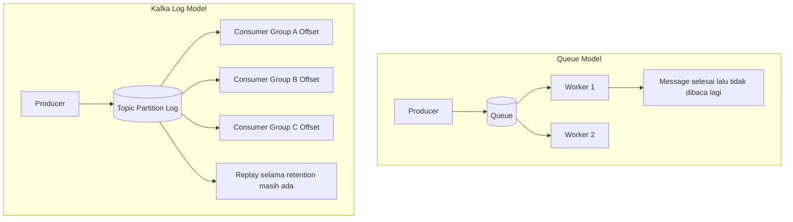
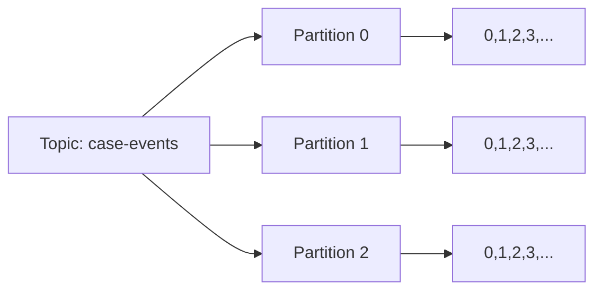
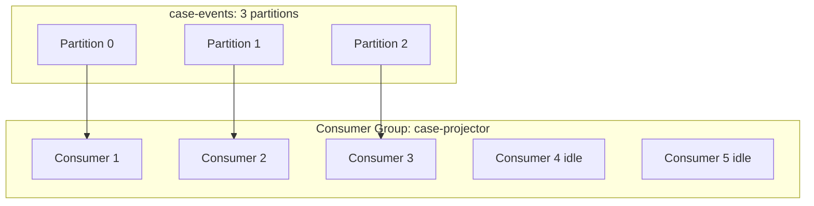
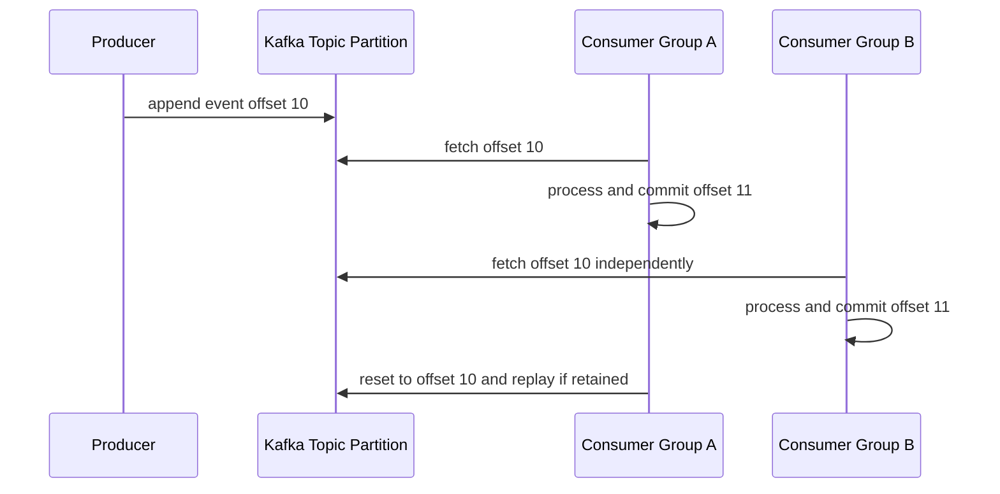
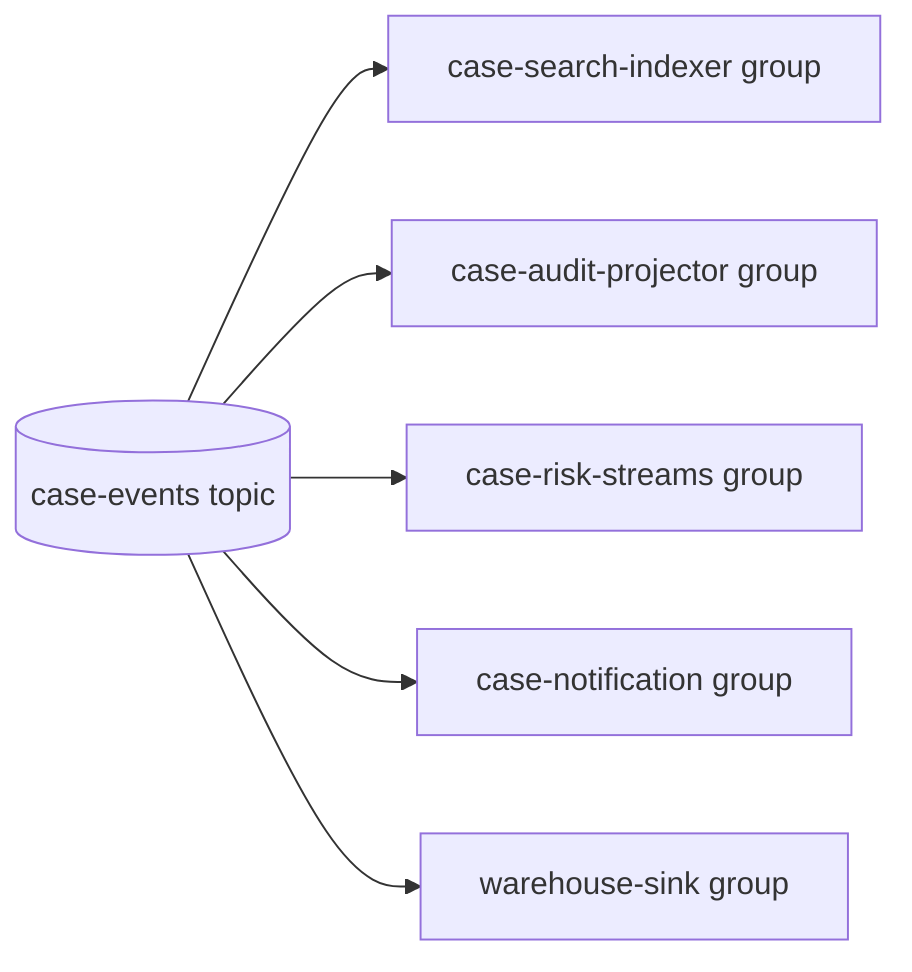

------
title: Learn Java Kafka in Action - Part 002
description: Deep mental model of Kafka as a distributed append-only event log, including topics, partitions, offsets, ordering, retention, replay, fan-out, and why Kafka is not a normal queue.
series: learn-java-kafka-in-action
seriesTitle: Learn Java Kafka in Action
order: 2
partTitle: Kafka as Distributed Commit Log
tags:
  - java
  - kafka
  - distributed-log
  - event-streaming
  - partitioning
  - offset
  - retention
  - replay
  - series
date: 2026-07-01
---

# Part 002 — Kafka as Distributed Commit Log

## 1. Tujuan Part Ini

Part ini membangun model mental paling penting dalam Kafka:

> Kafka adalah distributed, partitioned, replicated, append-only log untuk event stream.

Jika model ini kuat, producer, consumer, Kafka Streams, ksqlDB, retry, DLQ, compaction, replay, dan deployment akan lebih mudah dipahami. Jika model ini lemah, Kafka akan terlihat seperti message queue yang aneh dan penuh konfigurasi.

Setelah part ini, kamu harus bisa menjelaskan:

1. Apa itu log dalam konteks Kafka.
2. Kenapa topic dipecah menjadi partition.
3. Kenapa offset adalah posisi, bukan ID bisnis.
4. Kenapa Kafka memberi ordering per partition, bukan global ordering.
5. Kenapa record tidak hilang saat dibaca.
6. Kenapa replay adalah fitur native.
7. Kenapa fan-out consumer group adalah konsekuensi dari log model.
8. Kapan Kafka cocok dan kapan queue biasa lebih masuk akal.

## 2. Dari Queue ke Log: Perubahan Cara Berpikir

Banyak engineer pertama kali mendekati Kafka dari pengalaman message queue. Itu wajar, tetapi berbahaya jika tidak dikoreksi.

Queue biasa biasanya menjawab pertanyaan:

> “Pekerjaan apa yang belum diambil worker?”

Kafka menjawab pertanyaan berbeda:

> “Fakta apa saja yang sudah terjadi, dalam urutan tertentu, dan siapa saja yang sudah membaca sampai posisi mana?”

Perbedaan ini mendasar.



Dalam queue model, message lifecycle sering melekat pada delivery ke worker. Dalam Kafka, record lifecycle melekat pada retention policy log, sedangkan progress consumer disimpan sebagai offset.

## 3. Apa Itu Log?

Log adalah sequence append-only.

Bayangkan file yang hanya bisa ditambah di ujung kanan:

```text
offset:  0       1       2       3       4
record:  e0  ->  e1  ->  e2  ->  e3  ->  e4
```

Properti penting log:

1. **Append-only**: record baru ditulis di akhir.
2. **Ordered by offset**: setiap record dalam partition punya offset meningkat.
3. **Immutable record**: record yang sudah ditulis tidak diedit in-place.
4. **Readable by position**: consumer membaca dari offset tertentu.
5. **Replayable**: jika data masih ada, consumer bisa membaca ulang.

Kafka memakai log sebagai primitive storage dan messaging. Producer append record. Consumer fetch record dari offset tertentu. Broker menyimpan log segment di disk.

## 4. Record: Unit Terkecil yang Kita Desain

Kafka record biasanya memiliki:

| Komponen | Fungsi |
|---|---|
| Key | Menentukan partition placement dan sering menjadi identity/affinity entity |
| Value | Payload event/data |
| Headers | Metadata tambahan seperti correlation id, trace id, schema hint |
| Timestamp | Waktu record; bisa create time atau log append time tergantung konfigurasi |
| Offset | Posisi record dalam partition, diberikan broker |
| Partition | Log shard tempat record berada |
| Topic | Nama logical stream |

Contoh event domain:

```json
{
  "eventId": "evt-9d3b...",
  "eventType": "CaseEscalated",
  "caseId": "CASE-2026-00042",
  "occurredAt": "2026-07-01T10:15:30Z",
  "reason": "SLA_BREACHED",
  "previousStage": "INVESTIGATION",
  "newStage": "ENFORCEMENT_REVIEW"
}
```

Kafka tidak memahami domain semantics dari JSON tersebut. Kafka hanya melihat bytes untuk key dan value setelah serialization. Domain correctness adalah tanggung jawab aplikasi, schema governance, dan consumer behavior.

## 5. Topic: Nama Logical untuk Stream

Topic adalah stream logical. Misalnya:

- `case-events`
- `case-command-results`
- `risk-score-updated`
- `notice-issued`
- `inspection-events`
- `case-deadline-breaches`

Tetapi topic bukan satu file log tunggal. Topic terdiri dari satu atau banyak partition.



Setiap partition punya offset sequence sendiri. Offset `42` di partition 0 berbeda dari offset `42` di partition 1. Karena itu, identitas posisi record secara teknis adalah kombinasi:

```text
topic + partition + offset
```

Bukan offset saja.

## 6. Partition: Unit Ordering, Parallelism, dan Replication

Partition adalah konsep paling menentukan dalam Kafka.

Partition berperan sebagai:

1. **Unit ordering**: Kafka menjaga urutan record dalam satu partition berdasarkan offset.
2. **Unit parallelism**: partition bisa dibaca oleh consumer berbeda dalam satu consumer group.
3. **Unit storage distribution**: partition tersebar di broker.
4. **Unit replication**: partition memiliki leader dan replica.
5. **Unit failure/recovery**: leadership dan catch-up terjadi per partition.

### 6.1 Ordering Boundary

Kafka tidak memberi total global order untuk seluruh topic multi-partition. Kafka memberi order per partition.

```text
Partition 0: A0 -> A1 -> A2 -> A3
Partition 1: B0 -> B1 -> B2 -> B3
Partition 2: C0 -> C1 -> C2 -> C3
```

Tidak ada jawaban tunggal untuk pertanyaan:

> Apakah A2 terjadi sebelum B1?

Kafka hanya bisa menjamin A0 sebelum A1 sebelum A2 dalam partition 0, dan B0 sebelum B1 dalam partition 1.

Untuk domain system, ini berarti:

- Jika semua event untuk satu `caseId` harus berurutan, key harus membuat semua event `caseId` masuk partition yang sama.
- Jika event satu entity tersebar ke banyak partition, consumer tidak bisa mengandalkan offset order untuk entity tersebut.

### 6.2 Parallelism Boundary

Dalam satu consumer group, satu partition pada satu waktu hanya dikonsumsi oleh satu consumer member. Jika topic punya 3 partition dan consumer group punya 5 consumer, hanya 3 consumer yang aktif membaca partition; 2 sisanya idle untuk topic tersebut.



Ini akan dibahas detail di part consumer group. Untuk part ini, cukup pegang satu prinsip:

> Partition count membatasi parallelism maksimum dalam satu consumer group.

## 7. Offset: Posisi, Bukan Identitas Bisnis

Offset adalah integer monoton meningkat dalam partition. Dokumentasi consumer Kafka menjelaskan bahwa consumer melakukan fetch ke broker berdasarkan offset, lalu menerima chunk log mulai dari posisi offset tersebut. Ini memberi consumer kontrol untuk menentukan apa yang dikonsumsi dan memungkinkan reconsume jika dibutuhkan.

Contoh:

```text
Topic: case-events
Partition: 0

Offset 0: CaseOpened(caseId=CASE-1)
Offset 1: EvidenceSubmitted(caseId=CASE-1)
Offset 2: CaseEscalated(caseId=CASE-1)
Offset 3: DecisionRendered(caseId=CASE-1)
```

Offset bukan:

- ID event bisnis,
- timestamp,
- urutan global sistem,
- nomor transaksi,
- atau primary key domain.

Offset adalah posisi dalam log. Jangan simpan offset sebagai identity bisnis. Jangan expose offset ke user sebagai nomor kasus. Jangan gunakan offset sebagai ordering lintas topic.

## 8. Consumer Position: Membaca Log dengan Bookmark

Consumer tidak “menghapus” record. Consumer menyimpan posisi baca.

```text
Partition 0:
0       1       2       3       4       5       6
|-------|-------|-------|-------|-------|-------|
                                ^
                                committed offset = 4
```

Secara konseptual, committed offset adalah bookmark consumer group. Jika consumer restart, ia bisa mulai lagi dari posisi yang sudah dicommit.

Namun detail penting:

- Offset commit biasanya berarti “record sampai posisi tertentu dianggap sudah diproses oleh group ini”.
- Jika commit terlalu awal, data bisa dianggap selesai padahal side effect belum terjadi.
- Jika commit terlalu lambat, data bisa diproses ulang setelah crash.
- Pemilihan strategi commit menentukan delivery semantics aplikasi.

Kafka menyimpan consumer offset di internal topic `__consumer_offsets`. Dokumentasi Confluent menjelaskan offset sebagai identifier integer yang menandai record berikutnya yang harus dibaca consumer dalam partition, dan offset tersebut di-checkpoint ke internal topic `__consumer_offsets`.

## 9. Record Tidak Hilang Setelah Dibaca

Ini salah satu perbedaan paling penting dari queue.

Dalam Kafka:

1. Producer menulis record ke partition.
2. Consumer group A membaca dan commit offset.
3. Consumer group B tetap bisa membaca record yang sama.
4. Consumer group A bisa reset offset dan replay jika record masih berada dalam retention.
5. Record akan dihapus berdasarkan retention/compaction, bukan karena sudah dibaca.



Konsekuensi:

- Kafka sangat cocok untuk fan-out.
- Kafka cocok untuk audit/replay.
- Consumer progress independent per group.
- Storage planning penting karena data bertahan setelah dibaca.

## 10. Retention: Horizon Replay

Retention menentukan berapa lama atau seberapa besar data disimpan.

Dua model umum:

1. Time-based retention: simpan data selama durasi tertentu, misalnya 7 hari.
2. Size-based retention: simpan data sampai ukuran tertentu.

Contoh:

```properties
retention.ms=604800000
retention.bytes=107374182400
```

Jika retention 7 hari, consumer yang mati 10 hari mungkin tidak bisa catch up dari offset lama karena record sudah dihapus. Artinya retention adalah bagian dari availability dan recovery design.

### 10.1 Retention sebagai Business Decision

Jangan menentukan retention hanya dari kapasitas disk. Tanya:

- Berapa lama consumer boleh down?
- Berapa lama kita perlu replay untuk rebuild projection?
- Apakah ada kebutuhan audit/regulatory?
- Apakah event ini source of truth atau derived stream?
- Apakah data mengandung PII dan tunduk deletion policy?
- Berapa biaya storage vs risiko kehilangan kemampuan replay?

### 10.2 Retention dan Replay Safety

Retention panjang tidak otomatis aman. Replay bisa menyebabkan side effect ulang:

- email terkirim ulang,
- penalti terbuat dua kali,
- search index duplicate,
- external API dipanggil ulang,
- state transition mundur.

Jadi replay membutuhkan idempotent consumer dan semantic guard.

## 11. Compaction: Latest State per Key

Log compaction adalah retention policy yang mempertahankan latest value untuk setiap key. Dokumentasi Confluent menjelaskan bahwa topic compaction memungkinkan Kafka menyimpan nilai terbaru untuk setiap message key dan membuang value lama, cocok untuk restore state setelah failure atau reload cache setelah restart.

Contoh topic compacted:

```text
key=CASE-1 value={status: OPEN}
key=CASE-2 value={status: OPEN}
key=CASE-1 value={status: ESCALATED}
key=CASE-1 value={status: CLOSED}
```

Setelah compaction, Kafka boleh mempertahankan setidaknya latest value per key:

```text
key=CASE-2 value={status: OPEN}
key=CASE-1 value={status: CLOSED}
```

Compaction cocok untuk:

- latest profile per user,
- current case status,
- configuration snapshot,
- Kafka Streams changelog,
- cache reload topic,
- materialized view source.

Compaction tidak cocok jika:

- semua historical event harus disimpan,
- setiap transition adalah audit fact,
- duplicate historical record penting,
- consumer harus menghitung ulang dari seluruh event history.

Penting: compaction tidak menjamin hanya ada satu record per key setiap saat. Cleanup terjadi asynchronous dan bergantung kondisi segment/log cleaner. Consumer tetap harus tahan melihat beberapa value untuk key yang sama.

## 12. Replay: Superpower yang Berbahaya Jika Tidak Disiplin

Replay berarti membaca ulang record lama dari offset tertentu.

Replay berguna untuk:

1. Rebuild read model.
2. Memperbaiki bug consumer lalu proses ulang data.
3. Mengisi service baru dari event historis.
4. Audit dan investigasi.
5. Backfill derived topic.
6. Disaster recovery.

Tetapi replay berbahaya jika consumer tidak dirancang untuknya.

### 12.1 Replay-Safe Consumer

Consumer replay-safe memiliki properti:

- idempotent write,
- deterministic transformation,
- tidak mengirim side effect irreversible tanpa guard,
- bisa membedakan event lama vs event baru jika perlu,
- menyimpan processed event id atau version check,
- memiliki mode backfill/replay yang jelas,
- observability memisahkan normal processing dari replay processing.

### 12.2 Replay-Unsafe Consumer

Consumer tidak replay-safe jika:

- mengirim email setiap melihat `NoticeIssued`, tanpa dedup,
- menambah saldo/penalti tanpa idempotency key,
- memanggil API external tanpa request id stabil,
- membuat row baru tanpa unique constraint,
- mengandalkan wall-clock processing time untuk logic historis,
- mengirim notifikasi real-time untuk event lama saat backfill.

## 13. Fan-Out: Banyak Consumer Group Membaca History yang Sama

Karena record tetap ada, Kafka mendukung banyak consumer group membaca topic yang sama secara independen.



Masing-masing group punya offset sendiri. Jika `case-search-indexer` lag, itu tidak otomatis membuat `case-risk-streams` lag. Jika `warehouse-sink` ingin replay dari awal, group lain tidak terganggu.

Ini sangat kuat untuk enterprise integration. Namun ada governance cost:

- Siapa owner topic?
- Siapa boleh consume?
- Bagaimana schema evolution dikomunikasikan?
- Bagaimana PII dikendalikan?
- Bagaimana consumer yang tidak diketahui dampaknya dilacak?
- Bagaimana capacity dihitung jika consumer group bertambah?

## 14. Kafka as Event History vs Kafka as Work Queue

Kafka bisa dipakai sebagai work queue, tetapi tidak selalu ideal.

### 14.1 Event History Use Case

Contoh:

```text
CaseOpened -> EvidenceSubmitted -> NoticeIssued -> DeadlineBreached -> CaseEscalated
```

Karakteristik:

- Event merepresentasikan fakta bisnis.
- Banyak consumer mungkin tertarik.
- Replay berguna.
- Ordering per entity penting.
- Retention/audit penting.

Kafka sangat cocok.

### 14.2 Work Queue Use Case

Contoh:

```text
Generate PDF report job
Send one-off email job
Resize uploaded image job
```

Karakteristik:

- Message adalah task, bukan domain fact.
- Setelah selesai, task tidak penting untuk replay banyak consumer.
- Delayed retry, priority, per-message ack/deadline mungkin penting.
- Work stealing mungkin lebih natural.

Kafka bisa digunakan, tetapi queue seperti RabbitMQ/SQS/Celery-style worker queue mungkin lebih sederhana tergantung kebutuhan.

### 14.3 Rule of Thumb

Gunakan Kafka jika record punya nilai sebagai history yang dapat dibaca ulang oleh lebih dari satu consumer atau digunakan untuk membangun state turunan. Gunakan queue biasa jika message hanya unit pekerjaan yang harus diselesaikan satu worker dan tidak punya nilai historis jangka panjang.

## 15. Topic Design: Event Stream Bukan Dumping Ground

Topic yang buruk sering menjadi awal event spaghetti.

### 15.1 Terlalu Generic

```text
events
all-events
notifications
data-change
```

Masalah:

- ownership kabur,
- schema campur aduk,
- consumer sulit evolve,
- retention tidak seragam,
- security sulit,
- observability tidak informatif.

### 15.2 Terlalu Granular

```text
case-opened
case-closed
case-escalated
case-reassigned
case-comment-added
case-tag-added
...
```

Masalah:

- topic explosion,
- consumer harus subscribe banyak topic,
- ordering lintas event type sulit,
- governance berat,
- ACL dan retention menyebar.

### 15.3 Domain-Aligned

```text
case-events
inspection-events
notice-events
payment-events
risk-score-events
```

Lebih sehat jika:

- event dalam topic memiliki lifecycle/ownership sama,
- key strategy sama,
- retention mirip,
- consumer bisa memahami stream sebagai domain history,
- schema evolution bisa dikelola.

Tidak ada aturan universal. Topic design adalah trade-off antara ownership, ordering, retention, security, volume, dan consumer ergonomics.

## 16. Log Granularity dan Event Type

Ada dua pendekatan umum.

### 16.1 Topic per Event Type

Contoh:

```text
case-opened
case-escalated
case-closed
```

Kelebihan:

- schema homogen,
- consumer mudah memilih event tertentu,
- retention bisa spesifik,
- ACL granular.

Kekurangan:

- ordering lifecycle satu case tersebar,
- jumlah topic bertambah cepat,
- consumer lifecycle projection lebih kompleks,
- sulit melihat full history entity dari satu stream.

### 16.2 Topic per Aggregate/Domain Stream

Contoh:

```text
case-events
```

Dengan `eventType` di payload/header.

Kelebihan:

- history satu aggregate/domain lebih utuh,
- ordering per key lebih natural,
- consumer lifecycle projection lebih mudah,
- topic count lebih terkendali.

Kekurangan:

- schema polymorphism perlu governance,
- consumer harus filter event type,
- retention sama untuk banyak event type,
- ACL tidak granular per event type.

Untuk regulatory case lifecycle, `case-events` sering lebih masuk akal karena ordering dan audit trail lifecycle penting. Untuk high-volume specialized event seperti telemetry, topic per event class bisa lebih cocok.

## 17. Key Design dalam Log Mental Model

Key bukan sekadar metadata. Key menentukan partition jika default partitioner digunakan.

Misalnya kita punya topic `case-events` dengan 6 partition.

Jika key = `caseId`:

```text
CASE-1 -> partition 2
CASE-2 -> partition 5
CASE-3 -> partition 2
CASE-4 -> partition 1
```

Semua event untuk `CASE-1` akan masuk partition yang sama selama jumlah partition dan partitioner behavior tidak berubah secara merusak. Ini menjaga ordering per case.

Jika key = `tenantId`:

- ordering per tenant lebih kuat,
- tetapi tenant besar bisa membuat hot partition,
- parallelism turun jika tenant sedikit.

Jika key = random UUID:

- distribusi rata,
- tetapi ordering per case hilang.

Key design akan dibahas mendalam di Part 008. Untuk sekarang, ingat:

> Key adalah kontrak ordering dan locality, bukan sekadar cara menyebar load.

## 18. Ordering: Apa yang Dijamin dan Tidak Dijamin

Kafka broker menjaga offset order dalam partition. Consumer membaca record dalam urutan offset untuk partition tersebut. Namun beberapa hal sering disalahpahami.

### 18.1 Dijamin

- Record dalam partition punya offset meningkat.
- Consumer membaca partition berdasarkan offset order.
- Jika producer mengirim record dengan key sama ke partition sama, ordering dapat dipertahankan selama konfigurasi producer tidak merusak ordering pada failure/retry scenario.

### 18.2 Tidak Dijamin

- Global ordering lintas partition.
- Ordering berdasarkan timestamp.
- Ordering lintas topic.
- Ordering side effect external jika consumer paralel internal sembarangan.
- Ordering jika key berubah untuk entity yang sama.

Kafka Streams documentation membedakan offset order dan timestamp order. Broker menjamin offset order per partition, tetapi timestamp record tidak harus monoton meningkat. Untuk windowing dan stateful processing, out-of-order berdasarkan timestamp harus ditangani dengan grace period dan trade-off latency/correctness.

## 19. Time dalam Log

Kafka record punya timestamp, tetapi log order tetap offset order. Ini menciptakan dua timeline:

1. **Log timeline**: urutan record berdasarkan offset.
2. **Event timeline**: waktu bisnis `occurredAt` atau record timestamp.

Contoh:

```text
Offset 10: occurredAt=10:00
Offset 11: occurredAt=10:05
Offset 12: occurredAt=09:58  <-- late/out-of-order by event time
```

Untuk consumer biasa, ini mungkin tidak masalah. Untuk windowed aggregation, ini sangat penting.

Misalnya menghitung jumlah `DeadlineBreached` per 15 menit berdasarkan waktu kejadian. Jika event 09:58 baru datang setelah window 09:45–10:00 ditutup, kita harus punya policy:

- terima late event sampai grace period tertentu,
- drop late event,
- kirim correction event,
- atau rebuild aggregation offline.

Time semantics akan dibahas mendalam di Part 019.

## 20. Kafka Log dan Database Log

Kafka sering dibandingkan dengan commit log database. Analogi ini berguna, tetapi tidak sempurna.

| Aspek | Database Commit Log | Kafka Log |
|---|---|---|
| Tujuan utama | Recovery internal database | Event streaming dan consumption external |
| Reader | Database engine | Banyak client/consumer group |
| Retention | Biasanya internal recovery/replication | Configurable untuk replay/integration |
| Schema | Terkait table/internal format | Aplikasi mengelola schema record |
| Ordering | Transaction/log order internal | Per-partition offset order |
| Side effect | Database state mutation | Consumer-defined processing |

Mental model yang sehat:

> Kafka adalah commit log yang diekspos sebagai platform integrasi dan pemrosesan stream.

## 21. Why Pull-Based Consumption Matters

Kafka consumer menarik data dari broker. Dokumentasi consumer design menjelaskan bahwa Kafka memakai model producer push ke broker dan consumer pull dari broker. Pull-based design membantu consumer yang tertinggal untuk catch up dan memungkinkan batching agresif karena consumer dapat menarik data yang tersedia setelah posisi saat ini.

Konsekuensi:

- Consumer mengontrol pace baca.
- Consumer lambat tidak langsung dipaksa menerima push tanpa kapasitas.
- Batching fetch lebih natural.
- Lag menjadi ukuran jarak antara producer progress dan consumer progress.
- Backpressure terjadi sebagai pertumbuhan lag, bukan broker memaksa consumer.

Namun pull model juga berarti:

- Consumer harus poll secara rutin.
- Processing lama bisa menyebabkan group menganggap consumer tidak sehat.
- Batch terlalu besar bisa memperbesar latency dan retry blast radius.
- Commit strategy menjadi penting.

## 22. End-to-End Example: Case Lifecycle Stream

Misalnya kita memiliki topic:

```text
topic: case-events
partitions: 3
key: caseId
```

Event masuk:

```text
CaseOpened(CASE-1)
EvidenceSubmitted(CASE-2)
EvidenceSubmitted(CASE-1)
NoticeIssued(CASE-1)
CaseEscalated(CASE-2)
DecisionRendered(CASE-1)
```

Partition assignment contoh:

```text
Partition 0:
  offset 0: EvidenceSubmitted(CASE-2)
  offset 1: CaseEscalated(CASE-2)

Partition 1:
  offset 0: CaseOpened(CASE-1)
  offset 1: EvidenceSubmitted(CASE-1)
  offset 2: NoticeIssued(CASE-1)
  offset 3: DecisionRendered(CASE-1)

Partition 2:
  empty
```

Karena key = `caseId`, lifecycle `CASE-1` berurutan di partition 1 dan `CASE-2` berurutan di partition 0. Tetapi tidak ada global order tunggal antara `CASE-1` dan `CASE-2`.

Consumer group:

```text
group: case-search-indexer
  consumer A reads partition 0
  consumer B reads partition 1
  consumer C reads partition 2

group: case-audit-projector
  consumer X reads partition 0,1,2
```

Dua group membaca stream yang sama untuk tujuan berbeda. Offset mereka independen.

## 23. Failure Reasoning dari Log Model

### Scenario 1: Consumer Crash Setelah Process Sebelum Commit

1. Consumer membaca offset 10.
2. Consumer update database.
3. Consumer crash sebelum commit offset 11.
4. Consumer baru mengambil partition.
5. Consumer mulai dari offset terakhir yang committed, misalnya 10.
6. Record offset 10 diproses ulang.

Kesimpulan: at-least-once processing bisa menghasilkan duplicate side effect. Solusi bukan “matikan duplicate”, tetapi desain idempotency.

### Scenario 2: Consumer Down Lebih Lama dari Retention

1. Retention topic 3 hari.
2. Consumer group mati 5 hari.
3. Offset lama menunjuk record yang sudah dihapus.
4. Consumer tidak bisa catch up dari posisi lama.

Kesimpulan: retention harus disesuaikan dengan recovery objective.

### Scenario 3: Salah Key Menghilangkan Ordering

1. Event `CaseOpened(CASE-1)` dikirim dengan key random A.
2. Event `CaseEscalated(CASE-1)` dikirim dengan key random B.
3. Keduanya masuk partition berbeda.
4. Consumer group memproses partition berbeda secara paralel.
5. `CaseEscalated` bisa diproses sebelum `CaseOpened`.

Kesimpulan: key design adalah correctness decision.

### Scenario 4: Replay Mengirim Email Ulang

1. `NoticeIssued` event diproses notification service.
2. Service mengirim email.
3. Enam bulan kemudian topic direplay untuk rebuild notification audit.
4. Consumer lama tidak punya replay mode.
5. Email terkirim ulang.

Kesimpulan: side effect irreversible harus guarded by idempotency dan replay mode.

## 24. Design Checklist: Apakah Ini Log yang Baik?

Sebelum membuat topic baru, jawab:

1. Apa domain fact yang direpresentasikan?
2. Siapa owner topic?
3. Apa key-nya dan kenapa?
4. Ordering apa yang dibutuhkan?
5. Berapa partition awal?
6. Apakah partition bisa ditambah nanti tanpa merusak asumsi?
7. Berapa retention dan kenapa?
8. Apakah compacted atau delete retention?
9. Siapa consumer utama?
10. Apakah consumer harus replay-safe?
11. Apakah schema akan di-govern dengan registry?
12. Apakah payload mengandung PII?
13. Apa metric keberhasilan stream ini?
14. Apa yang terjadi jika consumer tertinggal 24 jam?
15. Apa yang terjadi jika event harus dikoreksi?

## 25. Mini Lab: Melihat Log dengan Mata Sendiri

Lab ini konseptual. Implementasi CLI detail akan muncul di part berikutnya.

### 25.1 Buat Topic

```bash
kafka-topics.sh \
  --bootstrap-server localhost:9092 \
  --create \
  --topic case-events \
  --partitions 3 \
  --replication-factor 1
```

### 25.2 Produce Event dengan Key

```bash
kafka-console-producer.sh \
  --bootstrap-server localhost:9092 \
  --topic case-events \
  --property parse.key=true \
  --property key.separator=:
```

Input:

```text
CASE-1:{"eventType":"CaseOpened","caseId":"CASE-1"}
CASE-1:{"eventType":"EvidenceSubmitted","caseId":"CASE-1"}
CASE-2:{"eventType":"CaseOpened","caseId":"CASE-2"}
CASE-1:{"eventType":"NoticeIssued","caseId":"CASE-1"}
```

### 25.3 Consume from Beginning

```bash
kafka-console-consumer.sh \
  --bootstrap-server localhost:9092 \
  --topic case-events \
  --from-beginning \
  --property print.key=true \
  --property print.partition=true \
  --property print.offset=true
```

Observe:

- Event `CASE-1` masuk partition yang sama.
- Offset meningkat per partition.
- Record tetap bisa dibaca ulang dengan consumer group baru.

### 25.4 Pertanyaan Setelah Lab

1. Apakah output terlihat globally ordered?
2. Apakah offset dimulai dari 0 di setiap partition?
3. Apa yang terjadi jika kamu menjalankan consumer dengan group id baru?
4. Apa yang terjadi jika kamu memakai key random?
5. Apa yang terjadi jika topic retention dibuat sangat pendek?

## 26. Anti-Pattern Awal

### 26.1 Topic sebagai Shared Garbage Pipe

Satu topic `all-events` untuk semua domain adalah jalan cepat menuju chaos. Retention, schema, ACL, dan ownership menjadi tidak jelas.

### 26.2 Key Random untuk Semua Event

Random key memang menyebar load, tetapi menghancurkan ordering entity. Jika ordering per entity penting, random key adalah bug arsitektur.

### 26.3 Offset sebagai Business Sequence

Offset bukan nomor bisnis. Offset bisa berbeda per partition, berubah antar environment, dan tidak punya arti domain.

### 26.4 Retention Default Tanpa Rationale

Retention default sering dipakai tanpa berpikir. Padahal retention menentukan replay horizon dan recovery ability.

### 26.5 Replay Tanpa Idempotency

Replay adalah fitur, tetapi tanpa idempotency bisa menjadi incident generator.

## 27. Failure Table

| Failure | Root Cause | Symptom | Mitigation |
|---|---|---|---|
| Event entity diproses tidak urut | Key salah atau berubah | State transition invalid | Key by aggregate/entity id |
| Consumer duplicate side effect | Crash sebelum offset commit | Row/email/penalty ganda | Idempotency key, unique constraint, processed event store |
| Consumer tidak bisa catch up | Retention terlalu pendek | Offset out of range | Retention sesuai RTO/replay horizon |
| Hot partition | Key cardinality rendah/skew tinggi | Satu broker/partition overload | Key redesign, sharding key, separate heavy tenant |
| Replay menyebabkan notifikasi ulang | Consumer tidak replay-safe | Email/API call ulang | Replay mode, dedup, side-effect guard |
| Consumer group tidak scale | Partition lebih sedikit dari consumer | Consumer idle | Partition planning, workload split |
| Audit history hilang | Compaction dipakai untuk event history | Event lama tidak tersedia | Delete retention untuk event facts; compacted topic untuk latest state |

## 28. Staff-Level Heuristics

1. Mulai dari invariant ordering, bukan dari jumlah partition.
2. Treat retention as recovery design, not storage cleanup only.
3. Treat key as domain contract.
4. Treat consumer duplicate as normal, not exceptional.
5. Treat replay as production operation that needs runbook.
6. Treat topic creation as API design.
7. Treat schema as public contract.
8. Treat Kafka as shared infrastructure with governance cost.
9. Prefer explicit event ownership over shared utility topics.
10. Never claim exactly-once end-to-end without naming the boundary.

## 29. Self-Test

Jawab dengan contoh.

1. Kenapa Kafka record tidak hilang setelah consumer membaca?
2. Apa identitas posisi record yang lengkap?
3. Kenapa offset bukan ID bisnis?
4. Apa perbedaan retention dan compaction?
5. Apa risiko key = random UUID?
6. Apa risiko key = tenantId?
7. Apa arti replay-safe consumer?
8. Kenapa consumer group berbeda bisa membaca data yang sama?
9. Apa yang terjadi jika consumer down lebih lama dari retention?
10. Kapan queue biasa lebih cocok daripada Kafka?

## 30. Ringkasan

Kafka harus dipahami sebagai log terdistribusi. Producer append record, broker menyimpan record dalam partition, consumer membaca dari offset, dan record tetap ada sampai retention atau compaction menghapusnya.

Model ini memberi Kafka kekuatan besar: replay, fan-out, ordering per entity, stream processing, dan auditability. Tetapi model yang sama membawa risiko: duplicate processing, ordering boundary yang sering disalahpahami, retention yang salah, key design yang buruk, dan replay yang tidak aman.

Part berikutnya akan memperdalam struktur fisik Kafka: topic, partition, replica, leader, ISR, durability, dan quorum.

## 31. Referensi

- Apache Kafka Documentation — Introduction: https://kafka.apache.org/documentation/
- Apache Kafka 4.0 Upgrade Guide: https://kafka.apache.org/40/getting-started/upgrade/
- Confluent Kafka Consumer Design: https://docs.confluent.io/kafka/design/consumer-design.html
- Confluent Kafka Log Compaction: https://docs.confluent.io/kafka/design/log_compaction.html
- Confluent Kafka Streams Concepts: https://docs.confluent.io/platform/current/streams/concepts.html
