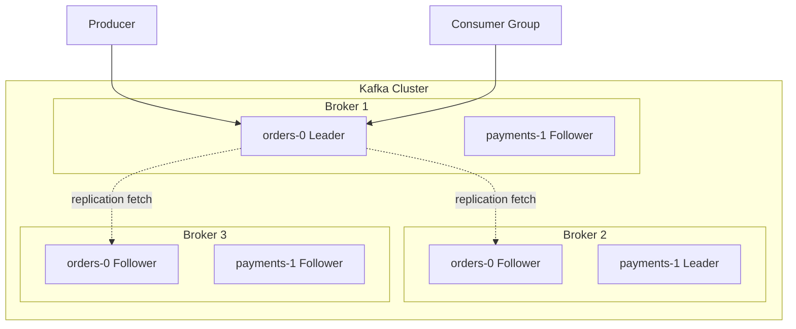
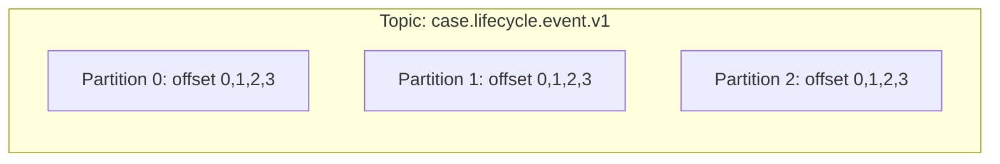
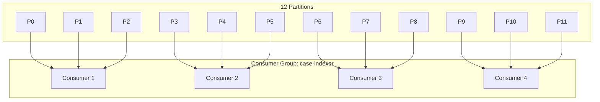
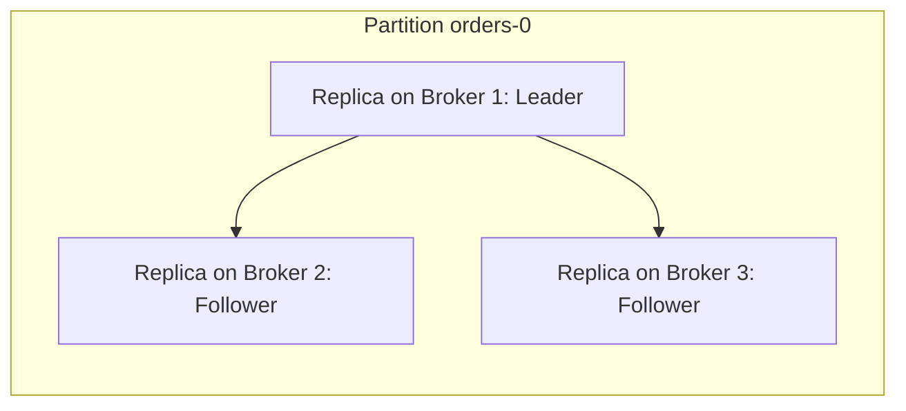
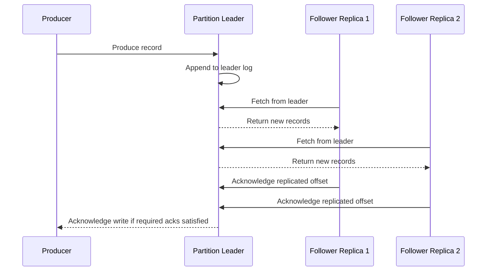
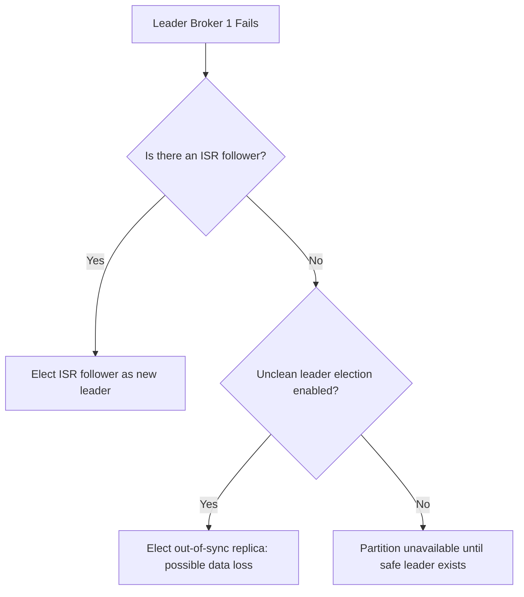

# Part 003 - Topic, Partition, Replica, Leader, ISR

Part 001 defined the skill map. Part 002 built the mental model of Kafka as a distributed append-only log. This part moves one layer down: how Kafka physically represents that log as topics, partitions, replicas, leaders, and in-sync replicas.

This is the point where Kafka stops being a vocabulary exercise and becomes a distributed-systems design exercise. Most production Kafka failures are not caused by developers forgetting an API call. They come from weak mental models around partitioning, replication, durability, leadership, and operational boundaries.

The goal of this part is simple: after reading it, you should be able to look at any Kafka topic and reason about:

- what unit provides ordering;
- what unit provides parallelism;
- what unit fails independently;
- what unit is replicated;
- what a producer write actually waits for;
- when a record is durable enough to be consumed safely;
- when Kafka prefers availability over safety;
- how topic design shapes the whole system for years.

---

## 1. Kaufman Framing: Deconstruct the Physical Model

Josh Kaufman's first move is to deconstruct a skill into smaller sub-skills. For Kafka topic and replication design, the sub-skills are:

| Sub-skill | What You Must Be Able To Do |
|---|---|
| Topic modeling | Choose topic boundaries based on event semantics, ownership, retention, and consumers. |
| Partition modeling | Choose partition keys and partition count based on ordering, parallelism, throughput, and future growth. |
| Replica reasoning | Understand how Kafka stores multiple copies of each partition for availability and durability. |
| Leader reasoning | Know why reads and writes go through the partition leader. |
| ISR reasoning | Know what it means for a replica to be caught up enough to participate in committed writes. |
| Durability reasoning | Connect `acks`, `min.insync.replicas`, replication factor, and unclean leader election. |
| Failure modeling | Predict what happens when a broker, disk, network path, controller, or follower fails. |

The practice target is not memorization. The target is being able to reason from first principles during design review or incident response.

---

## 2. The Core Object Model

A Kafka cluster contains brokers. Brokers host partitions. A topic is split into partitions. Each partition has replicas. One replica is the leader. Other replicas are followers. A subset of replicas that are caught up with the leader are called in-sync replicas, or ISR.



A topic is a logical stream. A partition is the actual ordered log. A replica is a copy of a partition. A broker is a server that stores replicas and serves client traffic.

The most important compression of the model is this:

> Topic is the name. Partition is the ordered log. Replica is the copy. Leader is the active copy. ISR is the safe-enough replica set.

---

## 3. Topic: The Semantic Stream Boundary

A topic should represent a stream of facts, commands, state changes, or integration records with a coherent meaning. It is not just a technical bucket.

Good topic boundaries usually have these properties:

- one primary domain meaning;
- one owning team or bounded context;
- compatible retention expectation;
- compatible security classification;
- compatible schema evolution path;
- predictable consumer population;
- stable replay semantics.

Bad topic boundaries usually mix unrelated semantics because it feels convenient at first.

For example, this is usually weak:

```text
company-events
```

It hides too much. Does it contain customer events, payment events, identity events, fraud signals, audit facts, operational metrics, or commands? The topic becomes impossible to secure, retain, evolve, replay, and document correctly.

A stronger boundary is:

```text
customer.lifecycle.v1
payment.transaction.v1
case.enforcement-status.v1
notification.email-command.v1
```

This does not mean every event type needs its own topic. It means every topic needs a defensible semantic boundary.

### 3.1 Topic Naming Should Encode Ownership and Meaning

A production topic name is an operational interface. It appears in ACLs, dashboards, incident reports, schema subjects, runbooks, source code, and replay scripts.

A practical pattern:

```text
<domain>.<entity-or-process>.<event-kind>.<version>
```

Examples:

```text
case.lifecycle.event.v1
case.enforcement-action.command.v1
payment.transaction.event.v1
identity.user-profile.snapshot.v1
risk.case-score.fact.v1
```

Avoid names that encode implementation details that may change quickly:

```text
springboot-payment-topic
new-events
temp-topic
kafka-test-final
```

The topic name should survive framework changes.

---

## 4. Partition: Ordering, Parallelism, and Storage Unit

A partition is the unit of ordered append. Kafka guarantees ordering within a partition, not globally across a topic.



The same offset number can exist in different partitions. Offset `42` in partition `0` and offset `42` in partition `1` are unrelated.

A record's identity in Kafka is effectively:

```text
topic + partition + offset
```

A record's business identity is something else:

```text
eventId
caseId
transactionId
aggregateId
correlationId
causationId
```

Confusing Kafka identity with business identity is a common source of bugs.

### 4.1 Partition Is the Ordering Boundary

If all events for the same case must be processed in order, they must use a key that maps to the same partition.

```java
ProducerRecord<String, CaseLifecycleEvent> record =
    new ProducerRecord<>(
        "case.lifecycle.event.v1",
        event.caseId(),
        event
    );
```

This means `caseId` becomes the ordering boundary.

The consequence is direct:

- same key usually means same partition;
- same partition means ordered relative processing;
- different partitions means no global order guarantee;
- changing the key changes the ordering contract.

### 4.2 Partition Is the Parallelism Boundary

Within one consumer group, a partition can be actively consumed by only one consumer instance at a time. Therefore, the maximum useful parallelism for a consumer group is bounded by partition count.

If a topic has 12 partitions, one consumer group can have up to 12 active consumers for that topic. A 13th consumer may be idle for that topic.

This is not a Kafka bug. It is how Kafka preserves per-partition order.



A partition count decision is therefore not only a storage decision. It is a concurrency contract.

### 4.3 Partition Is the Failure and Recovery Unit

When a broker fails, leadership changes happen per partition. When a consumer restarts, assignments happen per partition. When lag accumulates, you measure it per partition. When hot keys create imbalance, the symptom appears as one or a few hot partitions.

A good Kafka engineer thinks in partition-level evidence, not only topic-level averages.

Weak diagnostic:

```text
The topic has 500 ms consumer latency.
```

Stronger diagnostic:

```text
Partition 7 has 1.8 million lag while other partitions are below 5,000. The consumer group is healthy, but key distribution is skewed. The p99 processing time is dominated by one tenant's events.
```

---

## 5. Replica: The Availability and Durability Copy

Kafka replicates data at the partition level. If a topic has replication factor `3`, each partition has three replicas spread across brokers where possible.



A replica is not a separate independent stream. It is a copy of the same partition log.

Replication factor changes the availability and durability profile:

| Replication Factor | Meaning | Typical Use |
|---:|---|---|
| 1 | One copy only | Local dev, disposable data, never critical production data. |
| 2 | One extra copy | Better than 1, but weak for broker maintenance plus failure. |
| 3 | Common production baseline | Can usually tolerate one broker failure while still accepting safe writes if configured correctly. |
| 4 or more | Higher redundancy | Useful for stricter failure-domain requirements, but increases storage and replication traffic. |

Replication factor alone does not guarantee safe writes. It must be interpreted together with `acks`, `min.insync.replicas`, ISR health, and leader election settings.

---

## 6. Leader and Follower Model

For each partition, one replica is the leader. Producers write to the leader. Consumers typically read from the leader. Followers replicate from the leader.

The leader is responsible for ordering writes for that partition.



The leader/follower model gives Kafka a clear per-partition serialization point. That is the reason Kafka can offer high throughput while preserving order inside a partition.

The trade-off is that a hot partition leader can become a bottleneck.

---

## 7. ISR: In-Sync Replicas

ISR means in-sync replicas. These are replicas that are considered caught up enough with the leader.

Do not treat ISR as a static list. It changes as followers fall behind, recover, or fail.

A partition with replication factor `3` may have:

```text
replicas: [1, 2, 3]
leader: 1
isr: [1, 2, 3]
```

If broker `3` becomes slow and falls behind:

```text
replicas: [1, 2, 3]
leader: 1
isr: [1, 2]
```

If broker `2` also falls behind:

```text
replicas: [1, 2, 3]
leader: 1
isr: [1]
```

This is where durability semantics become concrete.

---

## 8. The Durability Equation

For critical data, the basic durability equation is:

```text
replication.factor >= 3
min.insync.replicas >= 2
producer acks = all
unclean.leader.election.enable = false
```

This does not make data magically indestructible. It defines a strong default failure posture.

### 8.1 `acks=0`

The producer does not wait for broker acknowledgment.

Use case:

- telemetry where loss is acceptable;
- local experiments;
- extremely high-volume low-value data.

Risk:

- the producer can think data was sent when no broker persisted it.

### 8.2 `acks=1`

The leader acknowledges after writing to its local log.

Use case:

- moderate durability requirements;
- workloads that prefer availability/latency over stronger durability.

Risk:

- if the leader fails before followers replicate, acknowledged records can be lost.

### 8.3 `acks=all`

The leader waits for the configured in-sync replica requirement before acknowledging.

Use case:

- financial events;
- case lifecycle events;
- regulatory audit events;
- workflow state transitions;
- anything that must survive a broker failure once acknowledged.

But `acks=all` only becomes meaningful with `min.insync.replicas`.

### 8.4 `min.insync.replicas`

`min.insync.replicas` defines the minimum number of in-sync replicas required for a write to succeed when producer `acks=all` is used.

Example:

```properties
replication.factor=3
min.insync.replicas=2
```

If ISR has three replicas, writes succeed.

```text
ISR = [1, 2, 3]
acks=all write succeeds
```

If ISR has two replicas, writes still succeed.

```text
ISR = [1, 2]
acks=all write succeeds
```

If ISR has only one replica, writes fail.

```text
ISR = [1]
acks=all write fails with NotEnoughReplicas or NotEnoughReplicasAfterAppend
```

This is a deliberate safety behavior. Kafka is refusing to acknowledge a write that cannot meet the configured durability requirement.

### 8.5 Durability Trade-off Table

| Configuration | Availability | Durability | Failure Behavior |
|---|---:|---:|---|
| RF=1, acks=1 | High | Low | Broker loss can mean data loss and outage. |
| RF=3, acks=1 | High | Medium | Leader failure can lose recently acknowledged data. |
| RF=3, minISR=2, acks=all | Medium | High | Writes fail when only one ISR remains. |
| RF=3, minISR=3, acks=all | Lower | Very strict | Any single replica lag can block writes. |
| RF=3, unclean election enabled | Higher | Unsafe | Out-of-sync replica may become leader and lose committed-looking data. |

The best setting depends on the domain, but for business-critical event streams, the common baseline is RF=3, minISR=2, acks=all, and unclean leader election disabled.

---

## 9. High Watermark and Committed Records

Kafka followers replicate from the leader. A record should not be treated as safely visible until it is sufficiently replicated according to Kafka's log replication protocol.

The high watermark represents the highest offset that is known to be replicated to the necessary in-sync replicas and is safe for consumers to read.

Mental model:

```text
Leader Log:      [0][1][2][3][4][5][6]
Follower A Log:  [0][1][2][3][4][5]
Follower B Log:  [0][1][2][3][4]
High Watermark:              ^ offset 4
```

A producer may have appended records beyond the high watermark, but consumers should only see committed records. This prevents consumers from reading data that might disappear after a leader change.

For design review, you do not need to memorize every internal replication variable. You need to remember the invariant:

> Kafka separates append from committed visibility to protect consumers from unstable tail records.

---

## 10. Leader Election and Unclean Election

When a partition leader fails, Kafka needs a new leader. Ideally, the new leader is selected from the ISR.

If a new leader is in the ISR, it should have the committed data needed to continue safely.

If unclean leader election is enabled, Kafka may elect a replica that is not in the ISR. This can restore availability but can lose data.



For most systems where Kafka is used as a source of truth, unclean leader election should stay disabled.

For disposable metrics, lossy telemetry, or workloads where availability beats correctness, it may be acceptable. But it must be an explicit business decision, not a forgotten default.

---

## 11. Topic Design Is a Long-Lived Architecture Decision

Topic design is expensive to change because it affects:

- producer code;
- consumer code;
- schema registry subjects;
- ACLs;
- dashboards;
- retention policies;
- replay scripts;
- data lineage;
- ownership;
- contracts with other teams.

A topic is not just an implementation detail. It is a distributed API.

### 11.1 Topic Boundary Decision Matrix

| Question | If Yes | Design Implication |
|---|---|---|
| Do events have different retention needs? | Yes | Separate topics. |
| Do events have different access-control needs? | Yes | Separate topics. |
| Do events evolve under different owners? | Yes | Separate topics. |
| Do events have the same key/order boundary? | Yes | Same topic may be reasonable. |
| Do consumers usually need all event types together? | Yes | Same topic may be reasonable. |
| Is one event type much higher volume? | Yes | Consider separate topic to isolate scaling. |
| Are schemas unrelated? | Yes | Separate topics are usually cleaner. |

### 11.2 Multi-Type Topic vs Single-Type Topic

A multi-type topic can be valid when events belong to the same aggregate lifecycle.

Example:

```text
case.lifecycle.event.v1
```

It may contain:

```text
CaseOpened
CaseAssigned
CaseEscalated
CaseClosed
```

This is coherent because consumers often need the lifecycle as a stream.

A weak multi-type topic:

```text
events.v1
```

It may contain:

```text
UserRegistered
PaymentCaptured
FraudScoreUpdated
EmailSent
KubernetesPodRestarted
```

This is not a lifecycle. It is a junk drawer.

---

## 12. Partition Key Design

The partition key chooses the ordering and locality contract.

### 12.1 Good Key Candidates

| Domain Need | Candidate Key |
|---|---|
| Case state transitions must be ordered | `caseId` |
| Account balance events must be ordered | `accountId` |
| Payment lifecycle must be ordered | `paymentId` |
| Order lifecycle must be ordered | `orderId` |
| Tenant-isolated processing is required | `tenantId`, but watch hot tenants |
| User profile mutations must be ordered | `userId` |

### 12.2 Bad Key Candidates

| Key | Problem |
|---|---|
| Random UUID per event | Good distribution, no entity ordering. |
| Timestamp | Hot partitions and poor semantic grouping. |
| Constant string | All records go to one partition. |
| Low-cardinality status | Hot partitions by status. |
| Nullable key by accident | Records may distribute differently than intended. |

### 12.3 Hot Key Problem

A hot key is a key that receives disproportionately high traffic. If one tenant, account, merchant, or case generates most of the events, one partition can become hot.

Symptoms:

- one partition has much higher append rate;
- consumer lag isolated to one partition;
- one broker has higher network/disk load;
- increasing consumers does not help;
- p99 latency follows the hot key.

Possible mitigations:

- split the aggregate if semantically valid;
- shard the key with a secondary suffix if strict ordering is not required globally;
- route high-volume tenants to dedicated topics;
- use hierarchical processing: first partition by tenant bucket, then enforce entity ordering downstream;
- separate command ingestion from state transition stream.

Never shard a key blindly. Sharding can destroy ordering guarantees.

---

## 13. Partition Count Design

Partition count determines upper-bound parallelism, affects broker resource usage, and shapes future scaling.

Too few partitions:

- insufficient consumer parallelism;
- hot brokers;
- difficult throughput scaling;
- large partitions that take longer to move.

Too many partitions:

- more open files;
- more metadata;
- more leader elections;
- more recovery work;
- more consumer assignment overhead;
- more operational noise;
- more small segments and controller/broker load.

A practical initial sizing method:

```text
required_partitions = max(
  target_consumer_parallelism,
  producer_throughput_required / safe_throughput_per_partition,
  consumer_throughput_required / safe_processing_per_consumer
)
```

Then round up with growth margin, but avoid treating partition count as free.

### 13.1 Example Sizing

Suppose:

```text
Target peak ingress: 60 MB/s
Safe write per partition: 5 MB/s
Target consumer instances: 16
Expected growth multiplier: 2x
```

Throughput requirement:

```text
60 / 5 = 12 partitions
```

Consumer parallelism requirement:

```text
16 partitions minimum
```

Growth-adjusted:

```text
16 * 2 = 32 partitions
```

A reasonable starting point may be 32 partitions, assuming broker capacity supports it.

This is not a universal formula. It is a forcing function for explicit assumptions.

---

## 14. Replica Placement and Rack Awareness

If all replicas for a partition end up in the same failure domain, replication becomes less useful.

Failure domains include:

- physical host;
- rack;
- availability zone;
- Kubernetes node pool;
- storage system;
- network segment;
- power domain;
- cloud region.

Rack awareness helps Kafka place replicas across configured broker racks.

A simple target:

```text
replication.factor=3
replicas placed across three availability zones when possible
min.insync.replicas=2
```

This allows one zone or broker failure while keeping safe writes possible, assuming enough ISR remains and network partitions do not isolate the quorum/control plane.

---

## 15. Java AdminClient: Creating Topics Deliberately

Do not let application auto-topic creation define production topology. Use explicit topic creation through infrastructure-as-code, platform tooling, or controlled AdminClient scripts.

Example AdminClient topic creation:

```java
import org.apache.kafka.clients.admin.AdminClient;
import org.apache.kafka.clients.admin.NewTopic;

import java.util.List;
import java.util.Map;
import java.util.Properties;

public class CreateCaseTopic {
    public static void main(String[] args) throws Exception {
        Properties props = new Properties();
        props.put("bootstrap.servers", "localhost:9092");

        try (AdminClient admin = AdminClient.create(props)) {
            NewTopic topic = new NewTopic(
                "case.lifecycle.event.v1",
                12,
                (short) 3
            ).configs(Map.of(
                "min.insync.replicas", "2",
                "cleanup.policy", "delete",
                "retention.ms", String.valueOf(7L * 24 * 60 * 60 * 1000)
            ));

            admin.createTopics(List.of(topic)).all().get();
        }
    }
}
```

For production, treat this as an example of the API shape, not as the recommended deployment path. In real systems, topic creation should be reviewed, versioned, and repeatable.

---

## 16. Producer Configuration for Critical Events

A producer that writes critical events should explicitly encode durability behavior.

```java
Properties props = new Properties();
props.put("bootstrap.servers", "localhost:9092");
props.put("key.serializer", "org.apache.kafka.common.serialization.StringSerializer");
props.put("value.serializer", "com.example.kafka.CaseEventSerializer");

props.put("acks", "all");
props.put("enable.idempotence", "true");
props.put("retries", Integer.toString(Integer.MAX_VALUE));
props.put("delivery.timeout.ms", "120000");
props.put("request.timeout.ms", "30000");
props.put("max.in.flight.requests.per.connection", "5");
```

This does not eliminate all failure modes. It creates a safer baseline:

- `acks=all` requires the broker-side durability threshold;
- idempotence reduces duplicate writes caused by retry;
- retries handle transient broker/network failure;
- delivery timeout bounds how long the producer will try;
- in-flight request limits preserve idempotence constraints in modern clients.

The topic-side `min.insync.replicas` still matters. Producer and topic configuration must be reviewed together.

---

## 17. Consumer View: Partition Assignment Is Ownership

A consumer does not own a topic. It owns assigned partitions for a period of time.

```java
consumer.subscribe(List.of("case.lifecycle.event.v1"));

while (running) {
    ConsumerRecords<String, CaseLifecycleEvent> records =
        consumer.poll(Duration.ofMillis(500));

    for (ConsumerRecord<String, CaseLifecycleEvent> record : records) {
        process(record.key(), record.value());
    }

    consumer.commitSync();
}
```

The simple loop hides a major contract:

- records are fetched by partition;
- offsets are tracked per partition;
- rebalances move partition ownership;
- duplicate processing is possible around commit boundaries;
- slow processing can cause group instability;
- partition-level lag is the diagnostic unit.

The consumer group part will go deeper later. For now, connect this back to partitioning: partition count shapes how much work can be distributed in a single group.

---

## 18. Failure Scenario Reasoning

### 18.1 Broker Hosting a Follower Fails

Initial state:

```text
replicas = [1, 2, 3]
leader = 1
isr = [1, 2, 3]
min.insync.replicas = 2
```

Broker `3` fails:

```text
replicas = [1, 2, 3]
leader = 1
isr = [1, 2]
```

Writes with `acks=all` still succeed because ISR size is 2.

### 18.2 Another Follower Falls Behind

Broker `2` becomes slow:

```text
isr = [1]
```

Writes with `acks=all` fail. This is expected. Kafka is protecting the durability contract.

A weak operator response is:

```text
Lower min.insync.replicas to 1 so the application works.
```

A stronger response is:

```text
Kafka is refusing unsafe writes. Diagnose why replicas are out of ISR: disk, network, broker CPU, GC, controller health, or overloaded partition leadership.
```

### 18.3 Leader Fails with Healthy ISR

Initial:

```text
leader = 1
isr = [1, 2, 3]
```

Broker `1` fails. Kafka elects `2` or `3` as new leader. The partition remains available after leadership transition.

### 18.4 Leader Fails with No ISR Follower

Initial:

```text
leader = 1
isr = [1]
```

Broker `1` fails.

If unclean leader election is disabled:

```text
partition unavailable
```

If unclean leader election is enabled:

```text
out-of-sync replica may become leader
possible data loss
```

This is not a tuning detail. It is a business safety decision.

---

## 19. Production Topic Profiles

### 19.1 Critical Domain Event Topic

```properties
replication.factor=3
min.insync.replicas=2
cleanup.policy=delete
retention.ms=2592000000
unclean.leader.election.enable=false
```

Producer:

```properties
acks=all
enable.idempotence=true
```

Use for:

- lifecycle events;
- payment events;
- enforcement workflow events;
- case audit transitions;
- high-value integration facts.

### 19.2 Compacted State Topic

```properties
replication.factor=3
min.insync.replicas=2
cleanup.policy=compact
unclean.leader.election.enable=false
```

Use for:

- latest customer profile by customer ID;
- latest case status by case ID;
- materialized state backing Kafka Streams;
- changelog topics.

Compacted topics are not an event history replacement. They preserve latest value per key over time subject to compaction behavior.

### 19.3 Retry Topic

```properties
replication.factor=3
min.insync.replicas=2
cleanup.policy=delete
retention.ms=604800000
```

Use for retry records that are still operationally relevant.

### 19.4 DLQ Topic

```properties
replication.factor=3
min.insync.replicas=2
cleanup.policy=delete
retention.ms=2592000000
```

A DLQ topic must have enough retention for investigation and replay. It also needs a schema that captures failure context, not just the original payload.

---

## 20. Common Anti-Patterns

### 20.1 Replication Factor 1 in Production

This is not a cost optimization. It is accepting data loss and downtime as normal behavior.

### 20.2 `acks=all` Without `min.insync.replicas`

`acks=all` sounds safe, but the broker-side threshold matters. Review both sides.

### 20.3 Unbounded Topic Creation by Applications

Auto-created topics often have wrong partition count, replication factor, retention, and ownership. Disable or control it in production environments.

### 20.4 Topic-per-Customer Without a Strong Reason

This creates operational explosion: ACLs, metadata, partitions, dashboards, schemas, and lifecycle management multiply quickly.

### 20.5 One Mega Topic for Everything

This destroys schema governance, access control, replay discipline, retention policy, and domain ownership.

### 20.6 Increasing Partitions to Fix Every Problem

More partitions may improve parallelism but will not fix:

- slow downstream database writes;
- bad consumer code;
- poison messages;
- hot keys;
- undersized brokers;
- schema evolution failure;
- bad retry design.

### 20.7 Ignoring Per-Partition Metrics

Topic-level averages hide skew. Always inspect partition-level lag, bytes in, bytes out, leader distribution, and replica health.

---

## 21. Design Review Checklist

Use this checklist before approving a production topic.

### 21.1 Semantic Boundary

- What domain owns the topic?
- What business fact or command does it represent?
- Is it a stream of facts, commands, snapshots, or technical integration records?
- Is the name stable and meaningful?
- Does it mix unrelated schemas?

### 21.2 Partitioning

- What is the partition key?
- What ordering does the key guarantee?
- What ordering does it not guarantee?
- What is the expected key cardinality?
- Is hot-key risk understood?
- What is the partition count based on?
- What is the expected consumer parallelism?

### 21.3 Replication and Durability

- What is the replication factor?
- What is `min.insync.replicas`?
- What producer `acks` are required?
- Is idempotence enabled for critical producers?
- Is unclean leader election disabled?
- Are replicas spread across failure domains?

### 21.4 Retention and Recovery

- How long must events be retained?
- Is replay expected?
- Can consumers rebuild state from this topic?
- Is compaction needed?
- What happens after retention deletes old records?

### 21.5 Operations

- Who owns the topic?
- Which services produce?
- Which services consume?
- Which dashboards exist?
- Which alerts exist?
- What is the replay procedure?
- What is the DLQ procedure?

---

## 22. Deliberate Practice Lab

### Lab Goal

Create a topic design proposal for a regulatory case lifecycle system.

### Scenario

A case management platform emits events when:

- a case is opened;
- evidence is attached;
- an officer is assigned;
- risk score changes;
- enforcement action is proposed;
- enforcement action is approved;
- case is closed.

Different consumers include:

- search indexer;
- audit archive;
- notification service;
- risk model service;
- reporting warehouse;
- workflow projection service.

### Tasks

1. Choose whether to use one lifecycle topic or multiple topics.
2. Choose the partition key.
3. Choose partition count assumptions.
4. Choose replication factor and `min.insync.replicas`.
5. Define retention.
6. Define whether compaction is needed.
7. Define at least three failure scenarios.
8. Explain what can be replayed safely.
9. Explain what cannot be guaranteed.

### Expected Reasoning Direction

A strong answer will likely separate lifecycle facts from large evidence payloads and risk score facts. It will probably key lifecycle events by `caseId`. It will distinguish event history from latest case status. It will require RF=3, minISR=2, `acks=all`, idempotent producers, and unclean leader election disabled for critical lifecycle events.

---

## 23. Self-Correction Questions

Answer these without looking back.

1. Why does Kafka guarantee order only within a partition?
2. Why does increasing consumers beyond partition count not improve active parallelism for one group?
3. What does ISR mean?
4. Why is replication factor not enough to guarantee durable acknowledged writes?
5. What does `min.insync.replicas=2` mean with RF=3?
6. What happens when ISR shrinks below `min.insync.replicas` and producer uses `acks=all`?
7. Why is unclean leader election dangerous?
8. Why is topic design a distributed API decision?
9. What symptoms indicate a hot partition?
10. Why can a random UUID key be harmful for entity lifecycle events?

---

## 24. Summary

Kafka topic design is not a naming exercise. It is where domain semantics meet distributed-systems mechanics.

The key invariants:

- a topic is the semantic stream boundary;
- a partition is the ordered log and parallelism unit;
- a replica is a copy of a partition;
- the leader serializes reads and writes for a partition;
- ISR is the set of replicas caught up enough for safe replication;
- `acks=all` must be paired with `min.insync.replicas`;
- unclean leader election trades safety for availability;
- partition key design defines the ordering contract;
- partition count defines the upper bound of consumer group parallelism;
- topic design becomes part of your architecture, operations, and governance surface.

If you can reason through these mechanics under failure, you are ready to move into the next part: the KRaft metadata control plane.

---

## References

- Apache Kafka Documentation: https://kafka.apache.org/documentation/
- Apache Kafka Upgrade Notes 4.0: https://kafka.apache.org/40/getting-started/upgrade/
- Confluent Kafka Design: Consumers: https://docs.confluent.io/kafka/design/consumer-design.html
- Confluent Topic Configuration Reference: https://docs.confluent.io/platform/current/installation/configuration/topic-configs.html
- Confluent Kafka Log Compaction Design: https://docs.confluent.io/kafka/design/log_compaction.html
