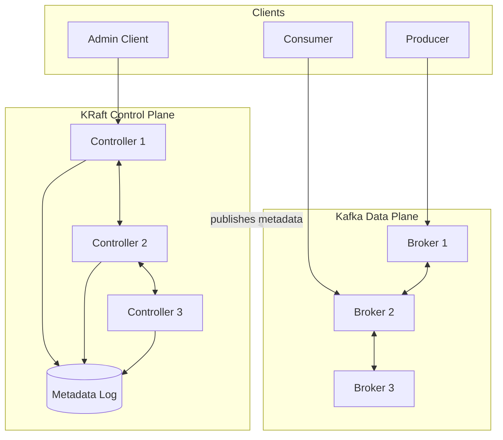
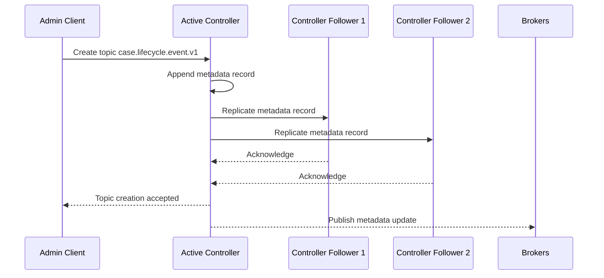
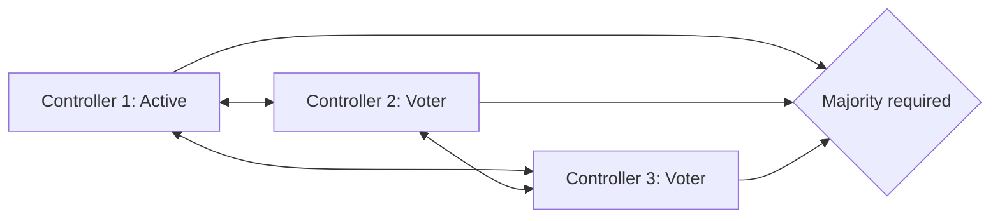
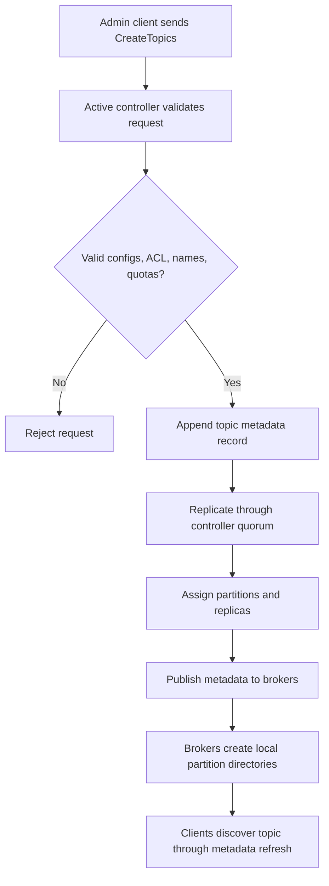
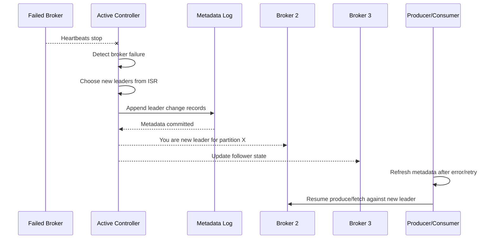

# Part 004 - KRaft and Kafka Control Plane

Part 003 explained topic, partition, replica, leader, and ISR. This part explains the system that coordinates those moving pieces: Kafka's control plane.

Modern Kafka should be understood as KRaft-first. Kafka 4.0 removed ZooKeeper mode, so production architecture and learning material should not treat ZooKeeper as the default path for new systems. You may still encounter older clusters, migrations, or legacy documentation, but the forward-looking mental model is KRaft.

KRaft is not merely a dependency replacement. It changes the way Kafka stores and replicates cluster metadata. Instead of relying on an external ZooKeeper ensemble for metadata coordination, Kafka uses an internal metadata quorum. That quorum stores metadata changes in a replicated metadata log.

For a Kafka engineer, the control plane is where cluster truth lives.

---

## 1. Kaufman Framing: Learn the Control Plane Enough to Self-Correct

A beginner sees Kafka as producers, consumers, topics, and brokers.

A senior engineer separates Kafka into:

- data plane;
- control plane;
- client coordination plane;
- operational management plane.

This part focuses on the control plane.

You should be able to answer:

- who knows which broker is alive;
- who knows which partition has which leader;
- who creates topics;
- who tracks partition assignments;
- who updates ISR metadata;
- who persists ACL and topic metadata;
- what happens if controllers lose quorum;
- what can still work when the control plane is degraded;
- what cannot work when the control plane is degraded.

The practical outcome: during an incident, you should not confuse a broker data-plane problem with a metadata quorum problem.

---

## 2. Data Plane vs Control Plane

Kafka has two broad categories of work.

| Plane | Responsibility | Example Operations |
|---|---|---|
| Data plane | Move records between producers, brokers, replicas, and consumers. | Produce, fetch, replicate partition data. |
| Control plane | Manage cluster metadata and coordination decisions. | Topic creation, partition leadership, ISR changes, broker registration, configs, ACL metadata. |



Data plane problems often show up as produce latency, fetch latency, under-replicated partitions, disk saturation, or network bottlenecks.

Control plane problems often show up as failed admin operations, delayed leadership changes, metadata propagation issues, topic creation failure, partition reassignment failure, or broker registration trouble.

---

## 3. What KRaft Replaces

Historically, Kafka used ZooKeeper to store and coordinate cluster metadata. In modern Kafka, KRaft replaces that external coordination path with Kafka's own metadata quorum.

Do not reduce this to:

```text
ZooKeeper removed, KRaft added.
```

The deeper change is:

```text
Kafka metadata is now represented as a replicated log managed by Kafka controllers.
```

This is conceptually aligned with Kafka's core strength: ordered replicated logs.

---

## 4. KRaft Roles: Broker and Controller

In KRaft mode, Kafka servers can have roles. The two important roles are:

| Role | Responsibility |
|---|---|
| Broker | Stores partition data and serves produce/fetch traffic. |
| Controller | Participates in metadata quorum and manages cluster metadata. |

A server can be configured through `process.roles`.

Example dedicated broker:

```properties
process.roles=broker
node.id=4
listeners=PLAINTEXT://broker-4:9092
controller.quorum.voters=1@controller-1:9093,2@controller-2:9093,3@controller-3:9093
```

Example dedicated controller:

```properties
process.roles=controller
node.id=1
listeners=CONTROLLER://controller-1:9093
controller.listener.names=CONTROLLER
controller.quorum.voters=1@controller-1:9093,2@controller-2:9093,3@controller-3:9093
```

For serious production environments, dedicated controller nodes are easier to reason about than combined broker/controller roles because control-plane resource isolation matters.

---

## 5. Metadata Log Mental Model

In KRaft, metadata changes are records in a metadata log. Controllers replicate this log through a quorum protocol.

Examples of metadata changes:

- topic created;
- partition added;
- broker registered;
- broker fenced;
- partition leader changed;
- ISR changed;
- topic config changed;
- ACL metadata changed.



The metadata log gives Kafka an ordered history of cluster metadata changes. This is why KRaft is not an add-on. It is the foundation of modern Kafka cluster coordination.

---

## 6. Active Controller and Controller Quorum

A KRaft controller quorum has one active controller at a time. Other controllers are standby/followers. The active controller handles metadata changes and coordinates cluster decisions.

A typical production quorum uses an odd number of controllers:

```text
3 controllers tolerate 1 controller failure
5 controllers tolerate 2 controller failures
```

This follows majority quorum logic.



A 3-controller quorum requires 2 available voters for majority. If only one controller remains reachable, the control plane loses quorum.

---

## 7. Broker Registration and Metadata Propagation

Brokers must register with the controller quorum. The controllers maintain metadata about brokers and partitions, then brokers receive metadata updates.

A broker needs metadata to know:

- which partitions it hosts;
- which partitions it leads;
- which replicas it should fetch;
- which topic configs apply;
- which cluster features and versions are active;
- which brokers are available.

Client metadata also depends on this. Producers and consumers periodically refresh metadata so they know which broker is leader for each partition.

This explains why stale or unstable metadata causes client-visible symptoms such as:

- `NotLeaderOrFollowerException`;
- `LeaderNotAvailableException`;
- metadata refresh loops;
- produce retries;
- consumer fetch failures;
- admin operation failures.

---

## 8. Control Plane Failure Modes

### 8.1 One Controller Fails in a 3-Controller Quorum

State:

```text
controllers = [1, 2, 3]
available = [1, 2]
majority = 2
```

The quorum remains available. If the failed controller was active, another controller can be elected.

Expected impact:

- temporary control-plane disruption;
- metadata operations may retry;
- data plane may continue;
- no immediate topic data loss solely because a controller failed.

### 8.2 Two Controllers Fail in a 3-Controller Quorum

State:

```text
controllers = [1, 2, 3]
available = [1]
majority = 2
```

The quorum is unavailable.

Expected impact:

- topic creation fails;
- partition reassignment fails;
- some metadata changes cannot be committed;
- leadership changes may be blocked;
- broker registration/fencing cannot progress normally;
- cluster recovery is constrained until quorum returns.

Existing data-plane operations may continue for partitions with stable leaders, but the cluster loses the ability to safely make many coordination decisions.

This distinction matters: losing control-plane quorum is not identical to losing all data immediately, but it is a severe cluster availability and recoverability problem.

### 8.3 Network Partition Between Brokers and Controllers

If brokers cannot communicate reliably with controllers, they may not receive metadata changes or may become fenced depending on the failure pattern.

Symptoms:

- brokers appear unavailable to the controller;
- partition leadership becomes unstable;
- clients receive metadata errors;
- replicas may stop being assigned correctly;
- admin operations fail or hang.

### 8.4 Controller Disk Pressure

Controllers store metadata log data. Disk pressure on controllers is a control-plane risk.

Symptoms:

- metadata log append latency;
- controller instability;
- quorum replication delay;
- failed metadata mutations;
- controller process crash if disk is exhausted.

### 8.5 Controller CPU or GC Pressure

A controller with high CPU or GC pauses can delay metadata processing.

Symptoms:

- slow topic creation;
- delayed leadership election;
- broker heartbeat/session issues;
- metadata propagation lag;
- noisy client retries.

---

## 9. What Happens During Topic Creation

When an admin client creates a topic, the operation is not just a directory being created on a broker.

A simplified flow:



This is why topic creation can fail even if brokers are running. The control plane must be healthy enough to validate, commit, and propagate the metadata update.

---

## 10. What Happens During Partition Leader Failure

When a broker hosting partition leaders fails, the controller must decide new leaders for affected partitions.



If the control plane is unhealthy, leader recovery can be delayed or blocked. This is why controller health directly affects data-plane availability after failures.

---

## 11. KRaft Cluster Configuration Essentials

This is not a complete production config. It is a reading map for the key properties.

### 11.1 Controller Properties

```properties
process.roles=controller
node.id=1
controller.listener.names=CONTROLLER
listeners=CONTROLLER://controller-1:9093
listener.security.protocol.map=CONTROLLER:SSL
controller.quorum.voters=1@controller-1:9093,2@controller-2:9093,3@controller-3:9093
metadata.log.dir=/var/lib/kafka/meta
```

Important ideas:

- `process.roles` determines server role;
- `node.id` must uniquely identify the server;
- `controller.quorum.voters` defines the controller voter set;
- `metadata.log.dir` separates metadata storage location where configured;
- controller listener security matters because this is cluster coordination traffic.

### 11.2 Broker Properties

```properties
process.roles=broker
node.id=4
listeners=PLAINTEXT://broker-4:9092
advertised.listeners=PLAINTEXT://broker-4:9092
inter.broker.listener.name=PLAINTEXT
controller.quorum.voters=1@controller-1:9093,2@controller-2:9093,3@controller-3:9093
log.dirs=/var/lib/kafka/data
```

Important ideas:

- broker node IDs must be unique;
- brokers know the controller quorum voters;
- brokers expose client/inter-broker listeners;
- broker data logs are separate from controller metadata logs in dedicated-role deployments.

### 11.3 Production Listener Reality

Production listener configuration usually includes separate security and network surfaces:

- client listener;
- inter-broker listener;
- controller listener;
- internal vs external advertised listeners;
- TLS or mTLS;
- SASL authentication;
- network policy or firewall constraints.

Misconfigured listeners are one of the most common Kafka deployment problems.

---

## 12. Dedicated Controllers vs Combined Mode

KRaft supports configuring process roles, but production environments should usually prefer dedicated controllers for clearer resource isolation.

| Model | Benefit | Risk |
|---|---|---|
| Dedicated controllers | Control-plane isolation, simpler failure reasoning, safer scaling. | More nodes to operate. |
| Combined broker/controller | Fewer nodes, simpler local dev. | Data-plane load can affect control-plane stability. |

For local development, combined mode is acceptable. For production, dedicated controllers are usually cleaner.

A good production mental model:

```text
controllers are the cluster brain
brokers are the data muscles
```

Do not overload the brain with data-plane heavy lifting unless you have a strong reason.

---

## 13. Quorum Sizing

The controller quorum should usually be odd-sized.

| Controller Voters | Majority Required | Failures Tolerated |
|---:|---:|---:|
| 1 | 1 | 0 |
| 3 | 2 | 1 |
| 5 | 3 | 2 |
| 7 | 4 | 3 |

A single controller is only acceptable for local development or disposable environments.

Three controllers are a common production baseline.

Five controllers may be justified when:

- failure-domain requirements are stricter;
- controller maintenance must overlap with failure tolerance;
- cluster scale and organizational risk justify extra operational cost.

More is not automatically better. More voters increase coordination overhead and operational complexity.

---

## 14. Failure Domain Placement

Controller placement is as important as broker placement.

A bad layout:

```text
controller-1: zone-a
controller-2: zone-a
controller-3: zone-a
```

One zone failure can remove the whole quorum.

A better layout:

```text
controller-1: zone-a
controller-2: zone-b
controller-3: zone-c
```

But this assumes inter-zone latency is acceptable. A quorum protocol is sensitive to latency and connectivity. Do not stretch a controller quorum across distant regions casually.

Regional high availability and multi-region disaster recovery are not the same design problem.

---

## 15. Metadata Version and Upgrade Awareness

Modern Kafka has cluster feature/version concepts that matter during upgrades. You do not need to memorize every release note, but you must know the operational invariant:

> Upgrade is not only replacing binaries. Kafka cluster metadata and feature levels must move in a controlled sequence.

A careless upgrade can break clients, brokers, metadata compatibility, or rollback assumptions.

A safe upgrade posture includes:

- read release notes;
- verify supported upgrade path;
- upgrade test cluster first;
- check client compatibility;
- check broker config changes;
- check removed features;
- check metadata version requirements;
- perform rolling upgrade;
- delay feature finalization until rollback window is understood;
- monitor controller and broker metrics closely.

Kafka 4.0 and later require KRaft mode, so ZooKeeper-mode clusters must be migrated before they can upgrade into that line.

---

## 16. KRaft and Java Applications

Most Java application developers will not call KRaft APIs directly. They feel KRaft indirectly through:

- faster or slower metadata operations;
- leadership changes;
- topic creation behavior;
- metadata refresh errors;
- producer retries;
- consumer group stability;
- admin client operations;
- cluster upgrade behavior.

Application code should not depend on controller internals, but production-grade Java Kafka services must be designed for metadata changes.

### 16.1 Producer Metadata Handling

A producer maintains metadata about topic partitions and leaders. If a leader changes, produce requests may fail temporarily, then the producer refreshes metadata and retries.

Design implication:

- configure retries deliberately;
- use idempotence for critical writes;
- avoid treating every transient metadata error as permanent;
- expose producer error metrics;
- log enough context without flooding logs.

### 16.2 Consumer Metadata Handling

Consumers also need current partition leader and group coordination information.

Design implication:

- expect rebalances;
- handle `poll` loop correctly;
- avoid long blocking processing inside the poll thread without a strategy;
- monitor rebalance rate;
- monitor partition-level lag;
- understand assignment changes after broker failure.

### 16.3 AdminClient Metadata Operations

AdminClient is the application-visible entry point into control-plane operations.

Example:

```java
try (AdminClient admin = AdminClient.create(props)) {
    admin.describeCluster()
        .nodes()
        .get()
        .forEach(node -> System.out.println(node.id() + " " + node.host()));
}
```

Use AdminClient carefully in application startup. A common anti-pattern is making business service startup depend on topic creation in a fragile way. Production topic lifecycle should usually be managed outside the service runtime.

---

## 17. Control Plane Observability

You cannot operate KRaft well without controller visibility.

Monitor at least:

- active controller identity;
- controller quorum health;
- metadata log replication status;
- controller request latency;
- broker registration/fencing events;
- partition leadership election rate;
- offline partitions;
- under-replicated partitions;
- metadata propagation errors;
- controller CPU, memory, disk, and network;
- authentication failures on controller listeners;
- failed admin operations.

Broker metrics alone are not enough.

### 17.1 Incident Smell: Metadata Storm

Symptoms:

- frequent topic creation/deletion;
- large numbers of partition changes;
- repeated broker joins/leaves;
- consumer groups constantly rebalancing;
- clients repeatedly refreshing metadata;
- controller CPU elevated;
- admin operations slow.

Potential causes:

- unstable brokers;
- Kubernetes pod churn;
- auto-topic creation abuse;
- excessive partitions;
- aggressive deployment rollouts;
- network instability;
- misconfigured listeners;
- bad health checks causing restarts.

---

## 18. KRaft-Specific Operational Anti-Patterns

### 18.1 Treating Controllers as Disposable Sidecars

Controllers are not auxiliary helper processes. They are the metadata quorum. Losing quorum severely limits the cluster's ability to change and recover.

### 18.2 Running All Controllers on One Failure Domain

This defeats the purpose of a quorum.

### 18.3 Starving Controllers

Controllers need stable CPU, memory, disk, and network. Do not place them on noisy nodes with unpredictable resource pressure.

### 18.4 Stretching Controller Quorum Across Distant Regions

High-latency quorum communication can harm metadata operation latency and stability. Multi-region DR should be designed deliberately instead of stretching one cluster blindly.

### 18.5 Auto-Creating Topics in Production

Auto topic creation creates uncontrolled metadata mutations and often incorrect topic defaults. This is worse in large organizations because it turns the metadata plane into an unreviewed shared mutable surface.

### 18.6 Ignoring Listener Security

Controller listeners should not be casually exposed. Control-plane communication must be protected like any privileged cluster coordination channel.

---

## 19. Design Review: KRaft Cluster Readiness Checklist

### 19.1 Topology

- How many controllers exist?
- Are controllers dedicated or combined?
- Which failure domains are controllers placed in?
- Can the quorum tolerate one node or zone failure?
- Is inter-controller latency acceptable?

### 19.2 Broker Integration

- Do brokers have stable `node.id` values?
- Are controller quorum voters configured correctly?
- Are listeners and advertised listeners correct?
- Is inter-broker communication isolated and secured?
- Can brokers resolve controller addresses reliably?

### 19.3 Security

- Is the controller listener protected?
- Are TLS/mTLS/SASL settings consistent?
- Are ACLs and authorizer settings compatible with KRaft?
- Are secrets rotated safely?

### 19.4 Operations

- Are controller metrics scraped?
- Are controller logs centralized?
- Is quorum loss alerted?
- Are broker registration failures alerted?
- Are failed admin operations tracked?
- Is rolling restart procedure tested?
- Is upgrade procedure tested?

### 19.5 Recovery

- What is the procedure if one controller fails?
- What is the procedure if controller quorum is lost?
- What is the procedure if controller disk fills?
- What is the procedure if a controller node is permanently lost?
- Are metadata backup and recovery assumptions documented?

---

## 20. Local Practice Lab: Inspecting KRaft Concepts

This lab is conceptual. You can adapt it to local Kafka, Docker Compose, or a Kubernetes operator environment.

### 20.1 Start a Small KRaft Cluster

Minimum local learning target:

```text
1 combined broker/controller for local dev
```

Better learning target:

```text
3 controllers + 3 brokers
```

### 20.2 Observe Metadata Behavior

Perform these operations:

1. create a topic;
2. describe the topic;
3. produce records;
4. consume records;
5. stop the leader broker for one partition;
6. observe new leader assignment;
7. stop one controller;
8. observe whether admin operations still work;
9. stop enough controllers to lose quorum;
10. observe what fails and what continues.

### 20.3 Questions to Answer

- Which operations require healthy control plane?
- Which operations can continue temporarily without metadata changes?
- How do clients react to leader movement?
- How long does metadata refresh take?
- What errors appear in producer logs?
- What errors appear in consumer logs?
- What errors appear in controller logs?

The goal is not to memorize log lines. The goal is to build a cause-and-effect map.

---

## 21. Staff-Level Mental Model

A staff-level Kafka engineer distinguishes between four kinds of truth:

| Truth Type | Where It Lives | Example |
|---|---|---|
| Business truth | Event payload and domain model | Case approved, payment captured. |
| Log truth | Partition log | Record at topic-partition-offset. |
| Metadata truth | KRaft metadata log | Partition leader is broker 4. |
| Consumer truth | Consumer offsets and state | Consumer group processed through offset 900. |

Incidents often happen when teams confuse these.

Example:

```text
The event exists in Kafka, so the case was processed.
```

Not necessarily. The event may exist in the log, but the consumer offset may not have advanced, the projection may have failed, or the state store may be rebuilding.

Example:

```text
The broker is up, so the cluster is healthy.
```

Not necessarily. The controller quorum may be degraded, ISR may be shrinking, partitions may be offline, or clients may be unable to resolve advertised listeners.

Example:

```text
The topic exists, so producers can write.
```

Not necessarily. Partition leaders may be unavailable, ISR may be below `min.insync.replicas`, ACLs may reject writes, or metadata may be stale.

This layered model prevents shallow diagnosis.

---

## 22. Architecture Decision Record Template

Use this template when approving a KRaft production deployment.

```md
# ADR: Kafka KRaft Deployment Topology

## Context
We need a Kafka cluster for <domain/workload> with <availability/durability/latency> requirements.

## Decision
We will deploy <N> dedicated KRaft controllers and <M> brokers across <failure domains>.

## Controller Quorum
- controller count:
- majority required:
- failures tolerated:
- placement:
- listener security:

## Broker Topology
- broker count:
- storage type:
- rack/zone awareness:
- listener model:

## Operational Model
- upgrade strategy:
- restart strategy:
- monitoring:
- alerting:
- backup/recovery assumption:

## Risks
- quorum loss:
- network partition:
- metadata storm:
- controller disk pressure:
- broker churn:

## Alternatives Considered
- managed Kafka:
- combined role deployment:
- different controller count:
- different failure-domain layout:
```

---

## 23. Self-Correction Questions

1. What is the difference between Kafka data plane and control plane?
2. What does KRaft replace?
3. Why is KRaft more than just removing ZooKeeper?
4. What does `process.roles=controller` mean?
5. What does `process.roles=broker` mean?
6. Why should production clusters usually prefer dedicated controllers?
7. What happens when a 3-controller quorum loses one controller?
8. What happens when a 3-controller quorum loses two controllers?
9. Why can existing produce/fetch traffic continue briefly even when some control-plane operations fail?
10. Why is controller listener security important?
11. Why is stretching a controller quorum across regions risky?
12. What client-visible symptoms can come from metadata instability?

---

## 24. Summary

KRaft is the foundation of modern Kafka's metadata control plane.

The key invariants:

- Kafka 4.0 and later are KRaft-only;
- the control plane manages cluster metadata and coordination decisions;
- the data plane moves records;
- controllers participate in a metadata quorum;
- metadata changes are stored in a replicated metadata log;
- one active controller coordinates metadata changes;
- losing controller quorum is a severe operational failure;
- dedicated controllers improve production failure isolation;
- listener, quorum, node identity, and failure-domain placement are first-class architecture decisions;
- Java clients feel control-plane health indirectly through metadata refresh, retries, leader movement, and admin operations.

At this point in the series, you should understand both the physical data model and the metadata control plane. The next part moves into Java Kafka client internals: producer, consumer, admin client, serializers, network behavior, callbacks, and threading model.

---

## References

- Apache Kafka Documentation: https://kafka.apache.org/documentation/
- Apache Kafka 4.0 Upgrade Notes: https://kafka.apache.org/40/getting-started/upgrade/
- Apache Kafka KRaft Operations: https://kafka.apache.org/37/operations/kraft/
- Confluent KRaft Overview: https://docs.confluent.io/platform/current/kafka-metadata/kraft.html
- Confluent Configure and Monitor KRaft: https://docs.confluent.io/platform/current/kafka-metadata/config-kraft.html
