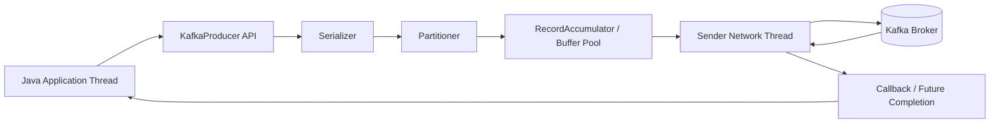
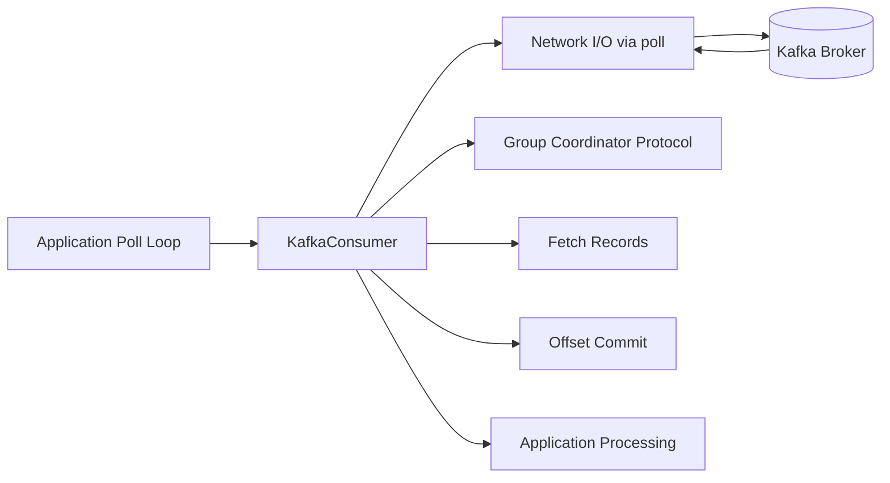
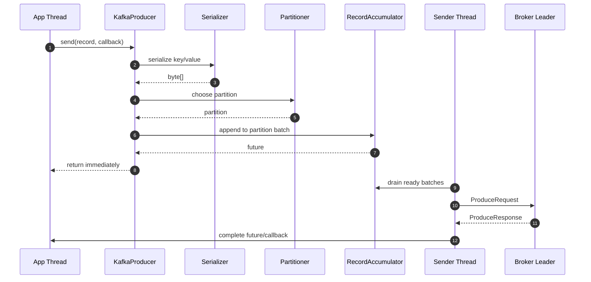
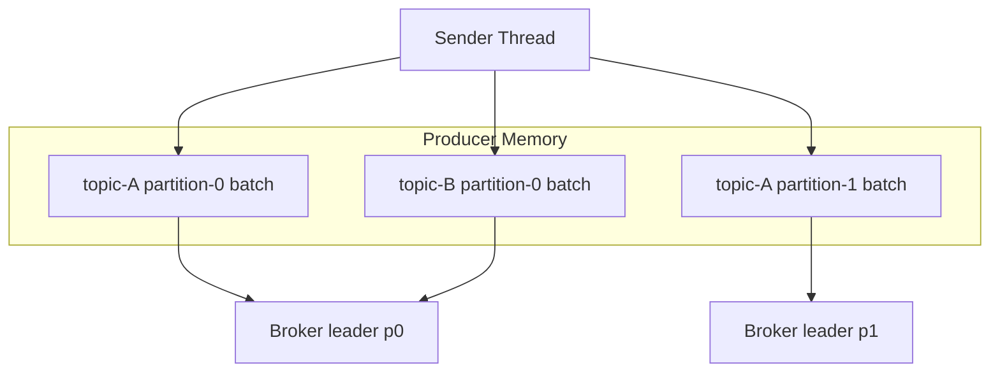
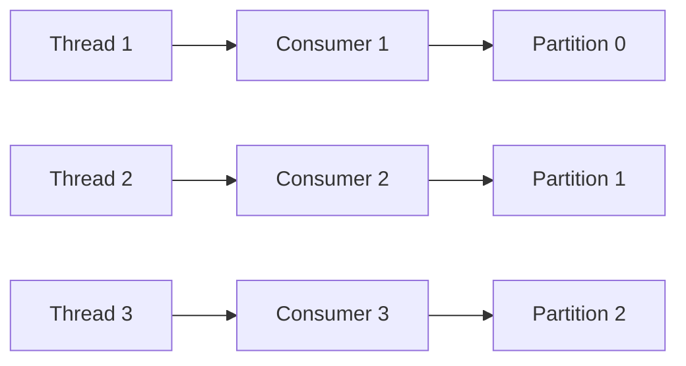
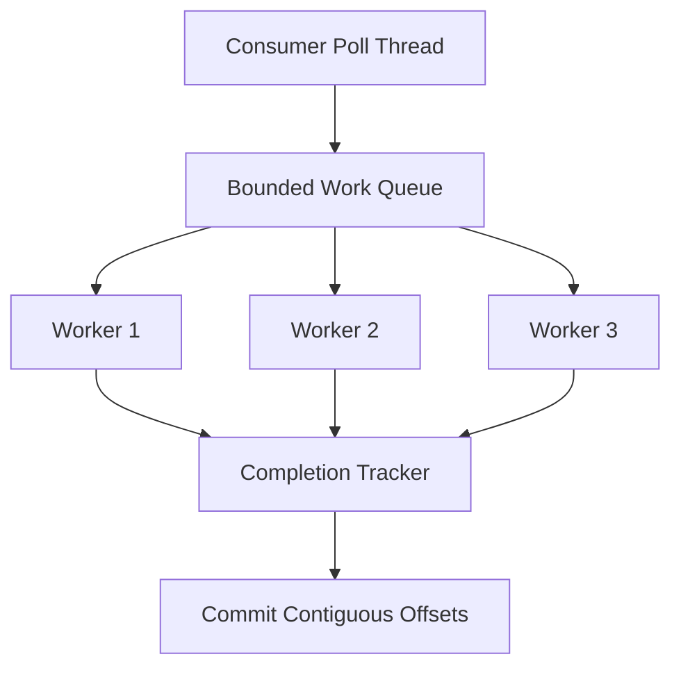
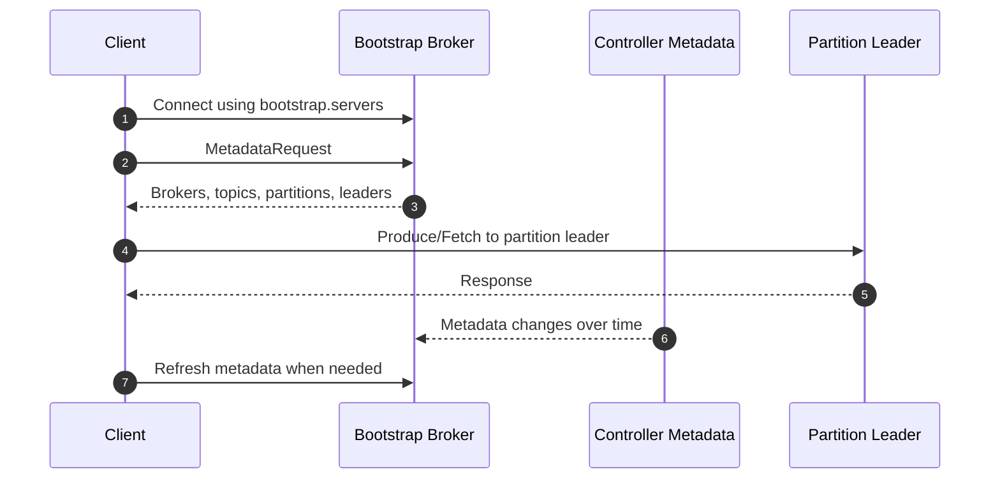
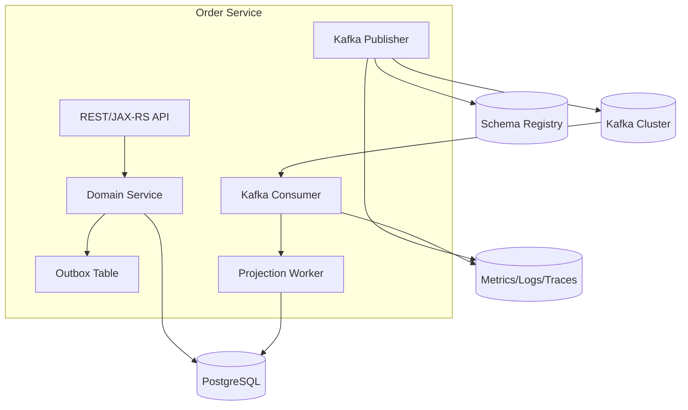

------
title: Learn Java Kafka in Action - Part 005
description: Deep dive into Java Kafka client architecture: producer, consumer, admin client, networking, metadata, threading, serializers, interceptors, lifecycle, and production-safe usage patterns.
series: learn-java-kafka-in-action
seriesTitle: Learn Java Kafka in Action
order: 5
partTitle: Java Client Architecture
tags:
  - java
  - kafka
  - kafka-client
  - producer
  - consumer
  - admin-client
  - distributed-systems
  - series
date: 2026-07-01
---

# Part 005 — Java Client Architecture

## 1. Tujuan Part Ini

Di part sebelumnya kita melihat Kafka dari sisi broker: topic, partition, replication, ISR, dan KRaft control plane. Mulai part ini kita pindah ke sisi aplikasi Java.

Tujuan part ini adalah memahami **arsitektur internal Java Kafka client** agar kita tidak memperlakukan `KafkaProducer`, `KafkaConsumer`, dan `AdminClient` sebagai black box.

Setelah part ini, kita harus bisa menjawab:

1. Apa yang benar-benar terjadi ketika aplikasi Java memanggil `producer.send(record)`?
2. Kenapa producer umumnya boleh dipakai lintas thread, sedangkan consumer tidak boleh dipakai sembarang lintas thread?
3. Kenapa metadata cluster bisa stale dan bagaimana client menyegarkannya?
4. Apa hubungan serializer, partitioner, accumulator, sender thread, broker connection, callback, dan future?
5. Kenapa `consumer.poll()` bukan sekadar mengambil data, tetapi juga menjalankan bagian penting dari protokol consumer?
6. Bagaimana lifecycle client yang benar dalam service produksi?
7. Kapan harus memakai AdminClient dan kapan tidak?

Part ini belum membahas tuning throughput secara penuh. Itu akan masuk Part 007. Di sini kita fokus pada **struktur kerja client** dan invariant penggunaannya.

## 2. Mental Model Ringkas

Kafka Java client bukan wrapper HTTP sederhana. Kafka client adalah stateful network client yang menyimpan metadata cluster, membuka koneksi TCP ke broker, mengelola request/response, melakukan retry, mem-buffer record, dan berpartisipasi dalam protokol cluster.



Untuk consumer, modelnya berbeda.



Perbedaan kritis:

| Client | Model Dominan | Threading Rule | Risiko Utama |
|---|---|---|---|
| `KafkaProducer` | Async buffered sender | Producer instance thread-safe | Callback blocking, buffer exhaustion, wrong close/flush |
| `KafkaConsumer` | Poll-driven state machine | Consumer instance tidak untuk shared concurrent access | Poll starvation, rebalance bug, unsafe worker handoff |
| `AdminClient` | Async control-plane request client | Dipakai untuk operasi administratif | Mengubah cluster dari aplikasi runtime tanpa guardrail |

## 3. Kaufman Deconstruction

Kita pecah skill “menggunakan Kafka Java client” menjadi sub-skill yang bisa dilatih.

| Sub-skill | Yang Harus Dikuasai | Failure Signal |
|---|---|---|
| Producer lifecycle | Create once, reuse, flush/close properly | Latency spike, buffer exhaustion, lost on shutdown |
| Producer async model | Future, callback, sender thread | Callback lambat, deadlock, unobserved send failure |
| Serialization | Key/value serializer, schema-aware serialization | Bad payload, schema mismatch, poison record |
| Partition routing | Key, partitioner, metadata | Hot partition, ordering broken |
| Consumer poll loop | Poll, process, commit, heartbeat/coordinator | Lag naik, rebalance storm, duplicate processing |
| Consumer threading | One consumer per poll thread or safe handoff | ConcurrentModification, commit race, offset disorder |
| Admin operations | Create topic, inspect configs, describe cluster | Unsafe auto-create, wrong RF/partition count |
| Observability | Client metrics, logs, callback error path | Silent failure, no lag visibility |

Di tahap ini kita belum mengejar semua konfigurasi. Kita mengejar **self-correction**: mampu melihat gejala dan tahu bagian client mana yang mungkin salah.

## 4. Java Client Dependency Baseline

Untuk aplikasi Java murni, dependency minimum biasanya:

```xml
<dependency>
    <groupId>org.apache.kafka</groupId>
    <artifactId>kafka-clients</artifactId>
    <version>${kafka.clients.version}</version>
</dependency>
```

Untuk production project, versi client harus dipilih sadar:

1. Client Kafka biasanya kompatibel lintas versi broker dalam rentang tertentu, tetapi fitur baru membutuhkan broker dan client yang mendukung.
2. Jangan upgrade client hanya karena library lain menarik dependency transitive.
3. Lock versi client melalui dependency management.
4. Jalankan integration test terhadap cluster target, bukan hanya unit test.

Contoh dependency management:

```xml
<dependencyManagement>
    <dependencies>
        <dependency>
            <groupId>org.apache.kafka</groupId>
            <artifactId>kafka-clients</artifactId>
            <version>${kafka.clients.version}</version>
        </dependency>
    </dependencies>
</dependencyManagement>
```

Dalam organisasi besar, versi client adalah keputusan platform. Jangan biarkan setiap service memilih versi sendiri tanpa compatibility matrix.

## 5. Producer Architecture

`KafkaProducer` terlihat sederhana:

```java
producer.send(new ProducerRecord<>(topic, key, value));
```

Tetapi secara internal ada beberapa tahap.



### 5.1 Application Thread

Application thread melakukan:

1. Validasi record.
2. Serialization.
3. Partition selection.
4. Append ke buffer.
5. Return `Future<RecordMetadata>`.

Artinya `send()` bukan selalu operasi non-blocking sempurna. Ia bisa blocking jika:

1. Metadata topic belum tersedia.
2. Buffer penuh.
3. Serializer lambat.
4. Max block time tercapai.
5. Interceptor melakukan pekerjaan berat.

Invariant:

> Jangan menaruh serialization berat, I/O eksternal, atau logic bisnis mahal di jalur `send()`.

### 5.2 Serializer

Serializer mengubah object Java menjadi bytes. Kafka broker tidak peduli struktur object; broker menyimpan bytes.

```java
public interface Serializer<T> extends Closeable {
    byte[] serialize(String topic, T data);
}
```

Risiko serializer:

| Risiko | Contoh | Dampak |
|---|---|---|
| Non-deterministic serialization | Field order berubah tanpa schema | Consumer gagal membaca |
| Hidden schema change | Rename field tanpa kompatibilitas | Poison event |
| Heavy CPU serialization | JSON reflection berlebihan | Producer latency naik |
| External dependency | Serializer memanggil service lain | Send path tidak stabil |

Rule:

> Serializer harus deterministic, cepat, side-effect-free, dan schema-aware untuk data kontrak antar-service.

### 5.3 Partitioner

Partitioner menentukan partition target ketika record tidak menetapkan partition eksplisit.

Input utama:

1. Topic.
2. Key bytes.
3. Value bytes.
4. Metadata cluster.
5. Jumlah partition topic.

Key design sangat penting karena partition adalah batas ordering. Kalau semua order milik `orderId=123` harus diproses berurutan, key biasanya harus mengandung `orderId` atau aggregate id yang setara.

Anti-pattern:

```java
new ProducerRecord<>("order-events", UUID.randomUUID().toString(), event);
```

Jika key random dipakai untuk event yang sebenarnya perlu ordering per order, ordering per aggregate akan pecah.

### 5.4 Record Accumulator dan Buffer Pool

Producer tidak selalu mengirim satu record sebagai satu network request. Record ditampung dulu per topic-partition dalam batch.



Parameter yang terkait, tetapi akan dibahas detail di Part 007:

| Config | Fungsi |
|---|---|
| `buffer.memory` | Total memory producer untuk buffering |
| `batch.size` | Target ukuran batch per partition |
| `linger.ms` | Waktu menunggu agar batch terisi |
| `compression.type` | Compression untuk batch |
| `max.block.ms` | Batas blocking saat metadata/buffer tidak tersedia |

Jika producer lebih cepat dari broker/network, buffer bisa penuh. Saat itu `send()` dapat blocking dan akhirnya gagal.

### 5.5 Sender Network Thread

Producer memiliki background sender thread yang:

1. Mengambil batch siap kirim.
2. Mengelompokkan request per broker.
3. Mengirim ProduceRequest.
4. Menerima response.
5. Menangani retry.
6. Menyelesaikan callback/future.

Implikasi penting:

1. Callback dieksekusi pada jalur internal producer; jangan blocking di callback.
2. Jika callback lambat, completion record lain bisa ikut tertahan.
3. Jangan memanggil operasi berat, HTTP call, DB write, atau synchronous wait panjang dari callback.

Callback yang baik:

```java
producer.send(record, (metadata, exception) -> {
    if (exception != null) {
        metrics.increment("kafka.producer.send.error", "topic", record.topic());
        log.warn("Failed to publish event topic={} key={}", record.topic(), record.key(), exception);
        return;
    }

    metrics.increment("kafka.producer.send.success", "topic", metadata.topic());
});
```

Callback yang buruk:

```java
producer.send(record, (metadata, exception) -> {
    auditRepository.save(...);          // DB I/O di callback
    httpClient.post(...);               // External I/O di callback
    anotherProducer.flush();            // Bisa memperburuk blocking
});
```

## 6. Producer Lifecycle Pattern

Producer adalah resource mahal. Jangan create-close per message.

Buruk:

```java
public void publish(OrderEvent event) {
    try (KafkaProducer<String, OrderEvent> producer = new KafkaProducer<>(props)) {
        producer.send(new ProducerRecord<>("order-events", event.orderId(), event));
    }
}
```

Masalah:

1. Membuka koneksi berulang.
2. Metadata fetch berulang.
3. Batching tidak efektif.
4. Throughput hancur.
5. Shutdown path rawan kehilangan record jika tidak flush dengan benar.

Lebih baik:

```java
public final class OrderEventPublisher implements AutoCloseable {
    private final KafkaProducer<String, OrderEvent> producer;
    private final String topic;

    public OrderEventPublisher(Properties props, String topic) {
        this.producer = new KafkaProducer<>(props);
        this.topic = topic;
    }

    public CompletableFuture<RecordMetadata> publish(OrderEvent event) {
        ProducerRecord<String, OrderEvent> record = new ProducerRecord<>(
            topic,
            event.orderId(),
            event
        );

        CompletableFuture<RecordMetadata> result = new CompletableFuture<>();

        producer.send(record, (metadata, exception) -> {
            if (exception != null) {
                result.completeExceptionally(exception);
            } else {
                result.complete(metadata);
            }
        });

        return result;
    }

    @Override
    public void close() {
        producer.flush();
        producer.close();
    }
}
```

Design note:

1. Satu producer per logical config profile biasanya cukup.
2. Pisahkan producer untuk workload dengan SLA berbeda jika config-nya harus berbeda.
3. Jangan campur critical event dan noisy telemetry event dalam producer yang sama jika backpressure telemetry bisa mengganggu critical path.

## 7. Consumer Architecture

Consumer tidak sama dengan producer. Consumer adalah state machine yang dikendalikan oleh `poll()`.

```java
while (running.get()) {
    ConsumerRecords<String, OrderEvent> records = consumer.poll(Duration.ofMillis(500));
    for (ConsumerRecord<String, OrderEvent> record : records) {
        process(record);
    }
    consumer.commitSync();
}
```

`poll()` bukan hanya mengambil record. Dalam model consumer, `poll()` juga terkait dengan:

1. Network I/O.
2. Fetch request.
3. Group coordination.
4. Partition assignment.
5. Rebalance callback.
6. Heartbeat/progress semantics, tergantung protocol dan versi.
7. Timeout detection.

Jika aplikasi berhenti memanggil `poll()` terlalu lama, consumer bisa dianggap tidak sehat atau melanggar `max.poll.interval.ms`.

## 8. Consumer Threading Rule

Rule produksi:

> Satu `KafkaConsumer` sebaiknya dimiliki oleh satu poll thread. Jangan akses instance consumer yang sama secara concurrent dari banyak thread.

Kenapa?

Consumer menyimpan state internal:

1. Subscription.
2. Assignment partition.
3. Position offset.
4. In-flight fetch.
5. Pending commit.
6. Rebalance state.
7. Coordinator connection.

Concurrent access tanpa koordinasi bisa merusak asumsi lifecycle.

### 8.1 Pattern A — One Consumer per Thread



Cocok untuk:

1. Processing relatif cepat.
2. Satu record diproses inline.
3. Commit mudah dijaga.
4. Throughput ditingkatkan dengan menambah consumer instance sampai batas partition.

### 8.2 Pattern B — Poll Thread + Worker Pool



Cocok untuk:

1. Processing mahal.
2. I/O downstream lambat.
3. Perlu parallelism lebih besar dari jumlah partition.

Tetapi pattern ini berbahaya jika offset commit tidak didesain benar.

Contoh bug:

```text
Partition 0 records: offset 10, 11, 12
Worker finishes: 12 first, then 10, while 11 still running
Consumer commits offset 13
Process crashes
Offset 11 hilang secara logical karena sudah dilewati commit
```

Rule:

> Jika processing parallel per partition, commit hanya boleh maju sampai offset contiguous yang sudah selesai.

### 8.3 Pause/Resume untuk Backpressure

Consumer bisa mengambil data lebih cepat daripada worker menyelesaikan pekerjaan. Gunakan bounded queue dan `pause()`/`resume()`.

```java
if (workQueue.remainingCapacity() < LOW_WATERMARK) {
    consumer.pause(consumer.assignment());
}

if (workQueue.remainingCapacity() > HIGH_WATERMARK) {
    consumer.resume(consumer.assignment());
}
```

Namun poll tetap harus dipanggil agar consumer tetap hidup.

```java
while (running.get()) {
    ConsumerRecords<K, V> records = consumer.poll(Duration.ofMillis(200));
    dispatch(records);
    maybePauseOrResume();
    maybeCommitCompletedOffsets();
}
```

## 9. Consumer Lifecycle

Lifecycle aman:

```java
public final class OrderEventConsumer implements Runnable, AutoCloseable {
    private final KafkaConsumer<String, OrderEvent> consumer;
    private final AtomicBoolean running = new AtomicBoolean(true);

    public OrderEventConsumer(Properties props, String topic) {
        this.consumer = new KafkaConsumer<>(props);
        this.consumer.subscribe(List.of(topic), new ConsumerRebalanceListener() {
            @Override
            public void onPartitionsRevoked(Collection<TopicPartition> partitions) {
                commitCurrentProgress();
            }

            @Override
            public void onPartitionsAssigned(Collection<TopicPartition> partitions) {
                log.info("Assigned partitions {}", partitions);
            }
        });
    }

    @Override
    public void run() {
        try {
            while (running.get()) {
                ConsumerRecords<String, OrderEvent> records = consumer.poll(Duration.ofMillis(500));
                for (ConsumerRecord<String, OrderEvent> record : records) {
                    process(record);
                }
                consumer.commitSync();
            }
        } catch (WakeupException e) {
            if (running.get()) {
                throw e;
            }
        } finally {
            try {
                commitCurrentProgress();
            } finally {
                consumer.close();
            }
        }
    }

    @Override
    public void close() {
        running.set(false);
        consumer.wakeup();
    }

    private void process(ConsumerRecord<String, OrderEvent> record) {
        // domain processing here
    }

    private void commitCurrentProgress() {
        try {
            consumer.commitSync();
        } catch (Exception e) {
            log.warn("Failed to commit offsets during shutdown/rebalance", e);
        }
    }
}
```

Key points:

1. Shutdown dari thread lain dilakukan dengan `wakeup()`.
2. Jangan langsung `close()` dari thread lain saat poll loop aktif tanpa koordinasi.
3. Commit saat partition revoked mengurangi duplicate setelah rebalance.
4. Processing harus punya idempotency karena commit bisa gagal setelah side effect berhasil.

## 10. Metadata Lifecycle

Kafka client tidak selalu tahu cluster penuh sejak awal. `bootstrap.servers` hanya titik masuk.



`bootstrap.servers` bukan daftar semua broker wajib, tetapi harus cukup untuk menemukan cluster.

Risiko:

| Masalah | Gejala | Penyebab Umum |
|---|---|---|
| Wrong advertised listener | Client connect gagal ke broker leader | Broker mengiklankan host yang tidak bisa dijangkau client |
| Metadata stale | `LEADER_NOT_AVAILABLE`, retry | Topic baru, leader pindah, broker restart |
| Auto-create topic tidak sengaja | Topic muncul dengan default buruk | Producer kirim ke typo topic |
| Topic authorization denied | Send/fetch gagal | ACL tidak lengkap |

Rule platform:

> Untuk production, topic penting sebaiknya dibuat eksplisit melalui IaC/Admin pipeline, bukan mengandalkan auto-create dari producer.

## 11. AdminClient Architecture

`AdminClient` digunakan untuk operasi administratif:

1. Create topic.
2. Describe topic.
3. Describe cluster.
4. Alter configs.
5. List offsets.
6. Inspect consumer groups.
7. Manage ACL, tergantung environment.

Contoh create topic eksplisit:

```java
try (AdminClient admin = AdminClient.create(adminProps)) {
    NewTopic topic = new NewTopic("order-events", 12, (short) 3)
        .configs(Map.of(
            "cleanup.policy", "delete",
            "retention.ms", String.valueOf(Duration.ofDays(7).toMillis())
        ));

    admin.createTopics(List.of(topic)).all().get(30, TimeUnit.SECONDS);
}
```

Namun jangan jadikan setiap microservice bebas membuat topic sendiri saat startup tanpa kontrol.

Masalah umum:

1. Race condition antar service.
2. Config topic tidak konsisten.
3. Partition count berubah tanpa impact analysis.
4. Retention salah.
5. ACL belum siap.

Lebih baik:

```text
Topic Lifecycle:
Architecture Decision -> Schema Review -> IaC Change -> Platform Approval -> Deployment -> Runtime Validation
```

AdminClient boleh digunakan aplikasi untuk introspection ringan atau health readiness tertentu, tetapi perubahan cluster harus dijaga guardrail.

## 12. Interceptor

Producer dan consumer mendukung interceptor.

Use case:

1. Inject tracing header.
2. Metrics tambahan.
3. Audit metadata.
4. Header normalization.

Jangan gunakan interceptor untuk:

1. Logic bisnis utama.
2. External I/O blocking.
3. Mutasi payload kompleks.
4. Authorization custom yang seharusnya ada di broker/platform.

Contoh producer interceptor concept:

```java
public class TraceProducerInterceptor implements ProducerInterceptor<String, OrderEvent> {
    @Override
    public ProducerRecord<String, OrderEvent> onSend(ProducerRecord<String, OrderEvent> record) {
        Headers headers = record.headers();
        headers.add("trace-id", currentTraceId().getBytes(StandardCharsets.UTF_8));
        return record;
    }

    @Override
    public void onAcknowledgement(RecordMetadata metadata, Exception exception) {
        // metrics only, no blocking I/O
    }

    @Override
    public void close() {}

    @Override
    public void configure(Map<String, ?> configs) {}
}
```

## 13. Header Design in Client Layer

Kafka record punya key, value, timestamp, dan headers.

Header cocok untuk metadata teknis:

| Header | Fungsi |
|---|---|
| `trace-id` | Distributed tracing |
| `correlation-id` | Menghubungkan command/event/reply |
| `causation-id` | Event penyebab langsung |
| `event-id` | Deduplication/idempotency |
| `schema-version` | Debugging/compatibility aid |
| `tenant-id` | Routing/security context, jika sesuai |

Jangan menaruh semua data bisnis di header. Header bukan pengganti schema event.

## 14. Error Surfaces di Java Client

Error producer bisa muncul di beberapa tempat:

| Lokasi | Contoh | Cara Tangani |
|---|---|---|
| Constructor | Config invalid, serializer class tidak ada | Fail fast startup |
| `send()` immediate | Serialization error, buffer timeout, metadata timeout | Return failure ke caller |
| Callback/future | Broker reject, timeout, authorization, unknown topic | Metrics + retry policy higher layer |
| `flush()`/`close()` | Pending send gagal | Shutdown logging dan alert |

Error consumer:

| Lokasi | Contoh | Cara Tangani |
|---|---|---|
| `poll()` | Deserialization error, authorization, wakeup | Classify retryable/non-retryable |
| Processing | DB failure, validation error | Retry/DLQ/idempotency |
| Commit | Commit failed, rebalance race | Retry or accept duplicate possibility |
| Rebalance listener | Commit during revoke fails | Log, metrics, idempotent processing |

Important:

> Kafka client retry menyelesaikan sebagian problem network/protocol. Ia tidak menyelesaikan correctness bisnis.

## 15. Deserialization Boundary

Consumer deserialization sering diremehkan. Jika deserializer melempar exception di `poll()`, aplikasi bahkan belum mendapatkan `ConsumerRecord` untuk dikirim ke DLQ secara mudah.

Pattern yang lebih aman untuk sistem besar:

1. Consume sebagai bytes atau schema-aware envelope.
2. Tangani deserialization dalam layer aplikasi yang bisa menghasilkan DLQ record lengkap.
3. Simpan original bytes/header untuk forensic jika policy memungkinkan.
4. Pisahkan invalid schema, invalid domain, dan downstream failure.

Contoh wrapper:

```java
public sealed interface DecodeResult<T> permits DecodeResult.Valid, DecodeResult.Invalid {
    record Valid<T>(T value) implements DecodeResult<T> {}
    record Invalid<T>(byte[] raw, String reason, Exception cause) implements DecodeResult<T> {}
}
```

## 16. Client Config Baseline

Producer baseline untuk event bisnis penting:

```properties
bootstrap.servers=kafka-1:9092,kafka-2:9092,kafka-3:9092
client.id=order-service-producer
key.serializer=org.apache.kafka.common.serialization.StringSerializer
value.serializer=com.example.kafka.OrderEventSerializer
acks=all
enable.idempotence=true
retries=2147483647
delivery.timeout.ms=120000
request.timeout.ms=30000
linger.ms=5
batch.size=32768
compression.type=zstd
max.in.flight.requests.per.connection=5
```

Consumer baseline:

```properties
bootstrap.servers=kafka-1:9092,kafka-2:9092,kafka-3:9092
client.id=order-service-consumer-1
group.id=order-projection-service
key.deserializer=org.apache.kafka.common.serialization.StringDeserializer
value.deserializer=com.example.kafka.OrderEventDeserializer
enable.auto.commit=false
auto.offset.reset=earliest
max.poll.records=500
max.poll.interval.ms=300000
fetch.min.bytes=1
isolation.level=read_committed
```

Catatan:

1. `isolation.level=read_committed` relevan jika membaca topic dengan transactional producer.
2. `auto.offset.reset=earliest` bukan selalu benar; untuk service baru yang harus membangun state dari awal, benar. Untuk alert consumer non-critical, mungkin `latest` lebih cocok.
3. `client.id` harus informatif agar metrics/log broker bisa ditelusuri.

## 17. Client Identity

Gunakan `client.id` dan `group.id` sebagai bagian observability.

Contoh naming:

```text
client.id = <service-name>-<role>-<instance-id>
group.id  = <service-name>-<consumer-purpose>
```

Contoh:

```text
client.id = order-service-producer-pod-7c9d
group.id  = order-projection-service
```

Jangan gunakan group id generik:

```text
group.id = consumer-group
client.id = app
```

Dalam incident, nama generik memperlambat diagnosis.

## 18. Health Check dan Readiness

Health check Kafka client sering salah.

Bad readiness:

```java
return producer != null;
```

Lebih baik readiness memeriksa hal yang relevan:

1. Bisa resolve metadata topic wajib.
2. Producer tidak sedang stuck buffer exhaustion.
3. Consumer assignment sudah siap jika service harus consume.
4. Authorization topic tersedia.
5. Schema registry tersedia jika serializer butuh.

Namun jangan membuat health check terlalu mahal sampai menambah beban control plane.

AdminClient readiness example:

```java
public boolean canDescribeRequiredTopic(AdminClient admin, String topic) {
    try {
        admin.describeTopics(List.of(topic))
            .allTopicNames()
            .get(3, TimeUnit.SECONDS);
        return true;
    } catch (Exception e) {
        return false;
    }
}
```

## 19. Logging Strategy

Log client harus membantu incident, bukan membanjiri.

Log saat producer send gagal:

```text
level=WARN
message="Kafka publish failed"
topic=order-events
key=ORD-123
clientId=order-service-producer-pod-7c9d
exceptionClass=TimeoutException
```

Jangan log full payload untuk event sensitif. Untuk regulatory/audit system, payload bisa mengandung data pribadi atau rahasia enforcement.

Gunakan:

1. Event id.
2. Aggregate id.
3. Topic.
4. Partition.
5. Offset, untuk consumer.
6. Schema id/version.
7. Trace id.

## 20. Metrics yang Wajib Dipahami

Producer metrics:

| Metric Concept | Arti |
|---|---|
| Record send rate | Laju record keluar |
| Record error rate | Gagal publish |
| Request latency | Waktu request ke broker |
| Batch size average | Efektivitas batching |
| Buffer available bytes | Sisa buffer |
| Record retry rate | Retry broker/network |

Consumer metrics:

| Metric Concept | Arti |
|---|---|
| Records consumed rate | Laju konsumsi |
| Fetch latency | Waktu fetch |
| Commit latency | Waktu commit |
| Assigned partitions | Jumlah partition assigned |
| Consumer lag | Jarak offset end vs committed/processed |
| Rebalance count/time | Stabilitas group |

Rule:

> Jangan deploy Kafka client tanpa dashboard minimal untuk error rate, latency, lag, retry, dan rebalance.

## 21. Common Architecture Mistakes

### 21.1 Create Producer per Request

Gejala:

1. Latency tinggi.
2. Connection churn.
3. Throughput rendah.
4. Broker log noisy.

Fix:

1. Reuse producer.
2. Close saat service shutdown.
3. Pisahkan producer hanya jika config/SLA berbeda.

### 21.2 Blocking Callback

Gejala:

1. Send completion lambat.
2. Memory naik.
3. Throughput drop.

Fix:

1. Callback hanya metrics/log ringan.
2. Kalau perlu side effect, kirim ke executor terpisah dengan bounded queue.

### 21.3 Shared Consumer Across Threads

Gejala:

1. Race condition.
2. Commit offset salah.
3. Rebalance weird.

Fix:

1. One consumer per thread.
2. Poll thread + worker pool dengan completion tracker.
3. Gunakan `wakeup()` untuk shutdown.

### 21.4 Auto-Commit untuk Side Effect Non-Idempotent

Gejala:

1. Data hilang secara logical.
2. Offset maju sebelum DB write selesai.

Fix:

1. Disable auto commit.
2. Commit setelah side effect berhasil.
3. Tambahkan idempotency di downstream.

### 21.5 Topic Creation di Runtime Tanpa Governance

Gejala:

1. Topic typo.
2. Retention default salah.
3. RF salah.
4. Partition count salah.

Fix:

1. Topic IaC.
2. Naming convention.
3. Schema and ACL review.

## 22. Reference Mini-Architecture



Client architecture decision:

1. Producer dipakai oleh publisher component, bukan langsung tersebar di semua domain service.
2. Consumer punya poll loop sendiri.
3. Serialization melalui schema-aware layer.
4. Observability dari client diekspos sebagai first-class signal.
5. Topic lifecycle tidak dibuat ad hoc dari business code.

## 23. Practice: Build a Client Skeleton

### 23.1 Task

Buat mini project dengan tiga class:

1. `KafkaProducerFactory`
2. `OrderEventPublisher`
3. `OrderEventConsumerRunner`

Target:

1. Producer reusable.
2. Callback mengubah `Future` menjadi `CompletableFuture`.
3. Consumer memakai manual commit.
4. Shutdown memakai `wakeup()`.
5. Semua record log memakai topic/key/partition/offset.

### 23.2 Acceptance Criteria

Producer:

- Tidak create-close per message.
- `client.id` jelas.
- Send failure tidak silent.
- `flush()` saat shutdown.

Consumer:

- `enable.auto.commit=false`.
- Commit setelah processing.
- `WakeupException` ditangani benar.
- Tidak ada shared consumer concurrent access.

Observability:

- Counter success/failure publish.
- Counter records processed.
- Timer processing latency.
- Gauge assigned partitions.

## 24. Design Review Checklist

Gunakan checklist ini saat mereview service Java Kafka.

### Producer

- [ ] Apakah producer instance direuse?
- [ ] Apakah callback tidak blocking?
- [ ] Apakah send failure diamati?
- [ ] Apakah serializer deterministic dan schema-aware?
- [ ] Apakah key sesuai ordering boundary?
- [ ] Apakah config critical producer memakai `acks=all` dan idempotence jika perlu?
- [ ] Apakah shutdown melakukan flush/close?

### Consumer

- [ ] Apakah satu consumer hanya dimiliki satu poll thread?
- [ ] Apakah auto commit disabled untuk processing dengan side effect?
- [ ] Apakah commit dilakukan setelah processing berhasil?
- [ ] Apakah rebalance listener mengamankan progress?
- [ ] Apakah processing idempotent?
- [ ] Apakah poison event strategy jelas?
- [ ] Apakah lag dan rebalance termonitor?

### Admin/Platform

- [ ] Apakah topic dibuat melalui governance/IaC?
- [ ] Apakah AdminClient runtime tidak mengubah cluster tanpa guardrail?
- [ ] Apakah `client.id` dan `group.id` punya naming convention?
- [ ] Apakah ACL dan schema dependency dicek sebelum production?

## 25. Interview-Level Questions

1. Mengapa `KafkaProducer.send()` bisa blocking walaupun API-nya asynchronous?
2. Kenapa `KafkaProducer` bisa direuse lintas thread, tetapi `KafkaConsumer` tidak boleh dipakai sembarang lintas thread?
3. Apa yang dilakukan `consumer.poll()` selain mengambil record?
4. Bagaimana cara shutdown consumer dari thread lain dengan aman?
5. Kenapa callback producer tidak boleh melakukan DB call?
6. Apa beda `client.id` dan `group.id`?
7. Kenapa topic auto-create berbahaya di production?
8. Bagaimana metadata broker didapat dari `bootstrap.servers`?
9. Di mana deserialization error sebaiknya ditangani?
10. Bagaimana desain poll thread + worker pool agar commit offset tidak melewati record yang belum selesai?

## 26. Ringkasan

Java Kafka client adalah stateful distributed-system client, bukan library I/O sederhana.

Producer bekerja dengan model async buffered sender: application thread melakukan serialization dan append ke accumulator; sender thread mengirim batch ke broker dan menyelesaikan callback. Karena itu producer cocok direuse, tetapi callback harus ringan.

Consumer bekerja dengan poll-driven state machine. `poll()` menggerakkan fetch, group coordination, assignment, dan progress. Karena consumer menyimpan banyak state internal, satu instance consumer harus dimiliki satu poll thread atau disinkronisasi sangat hati-hati. Untuk sistem produksi, pattern paling aman adalah one consumer per thread atau poll thread dengan worker pool yang punya offset completion tracker.

AdminClient berguna untuk control-plane operation, tetapi perubahan cluster harus dikelola dengan governance. Aplikasi bisnis sebaiknya tidak bebas membuat atau mengubah topic produksi tanpa review.

Part berikutnya akan masuk ke **Producer Reliability and Delivery Semantics**: `acks`, retries, idempotence, timeout, ordering, duplicates, transactional producer, dan producer fencing.

## 27. Referensi

- Apache Kafka Documentation — Java client, producer, consumer, configuration.
- Apache Kafka Producer Configs.
- Apache Kafka Consumer Configs.
- Apache Kafka Javadocs — `KafkaProducer`, `KafkaConsumer`.
- Confluent Documentation — Java client overview, delivery semantics, producer/consumer configuration.
