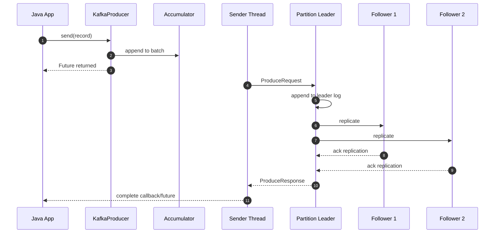
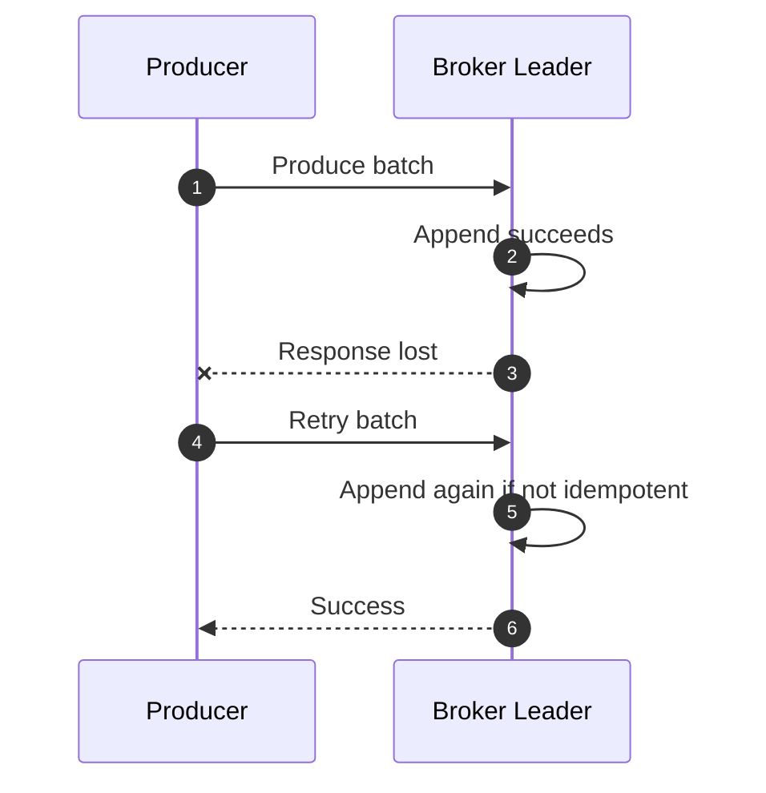
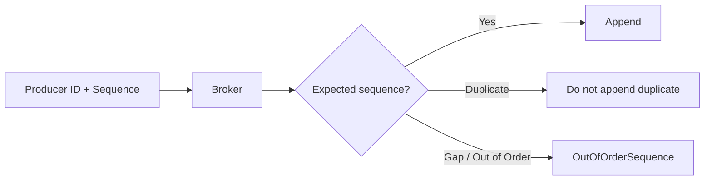
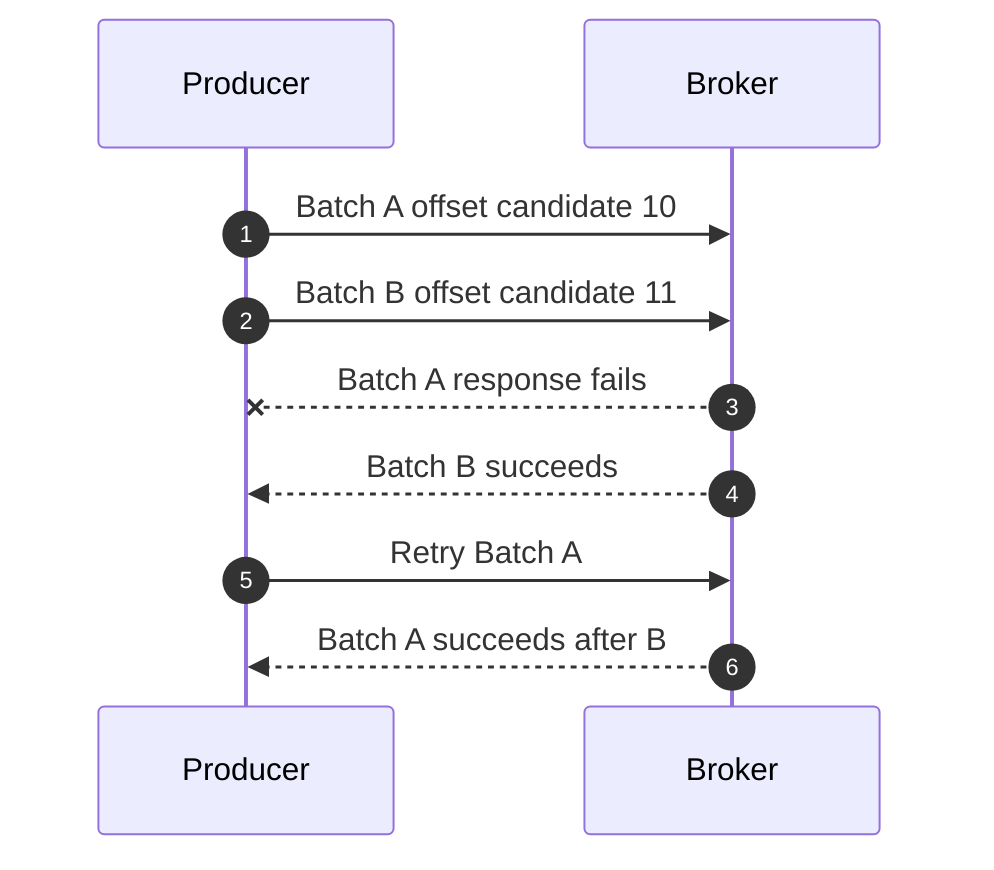
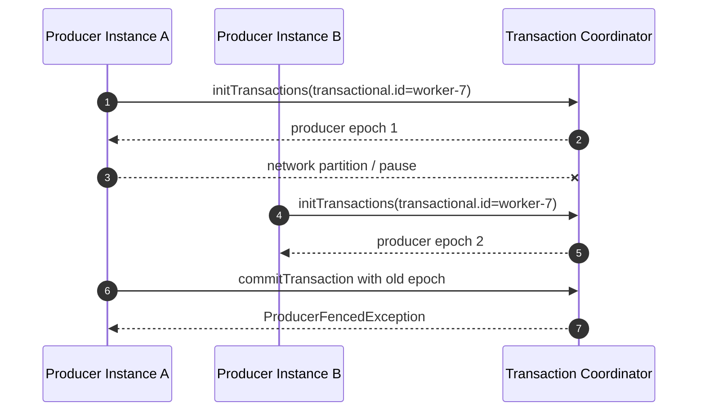

------
title: Learn Java Kafka in Action - Part 006
description: Production-grade guide to Kafka producer reliability and delivery semantics: acks, retries, idempotence, ordering, timeouts, transactions, fencing, and failure reasoning.
series: learn-java-kafka-in-action
seriesTitle: Learn Java Kafka in Action
order: 6
partTitle: Producer Reliability and Delivery Semantics
tags:
  - java
  - kafka
  - producer
  - delivery-semantics
  - idempotence
  - transactions
  - reliability
  - series
date: 2026-07-01
---

# Part 006 — Producer Reliability and Delivery Semantics

## 1. Tujuan Part Ini

Part ini membahas pertanyaan yang sering terlihat sederhana tetapi sebenarnya menentukan correctness sistem:

> Ketika aplikasi Java memanggil `producer.send()`, kapan kita boleh percaya bahwa event benar-benar tersimpan, tidak hilang, tidak terduplikasi, dan tetap berurutan?

Jawaban pendeknya: **tergantung konfigurasi, failure mode, key/partition, broker durability, retry, idempotence, transaction, dan cara aplikasi menangani error**.

Setelah part ini, kita harus bisa:

1. Membedakan at-most-once, at-least-once, effectively-once, idempotent write, dan transactional write.
2. Menjelaskan efek `acks=0`, `acks=1`, dan `acks=all`.
3. Memahami hubungan `acks`, `retries`, `enable.idempotence`, `max.in.flight.requests.per.connection`, `delivery.timeout.ms`, dan `request.timeout.ms`.
4. Menentukan config producer untuk event critical vs telemetry.
5. Menjelaskan kapan duplicate bisa terjadi.
6. Menjelaskan kapan ordering bisa rusak.
7. Menggunakan transactional producer dengan benar.
8. Menghindari klaim “exactly once” yang terlalu luas.

## 2. Delivery Semantics: Vocabulary yang Harus Rapi

Banyak bug Kafka berasal dari istilah yang dipakai longgar.

| Istilah | Makna Praktis | Catatan |
|---|---|---|
| At-most-once | Record diproses/kirim maksimal sekali | Bisa hilang |
| At-least-once | Record tidak hilang jika retry berhasil | Bisa duplikat |
| Exactly-once producer write | Retry producer tidak membuat duplicate di partition untuk producer session tertentu | Bukan end-to-end business exactly-once |
| Effectively-once | Hasil bisnis tampak sekali karena idempotency/dedup | Butuh desain aplikasi |
| Transactional write | Beberapa write Kafka dan/atau offset send dibuat atomic dalam transaksi Kafka | Terbatas pada boundary Kafka transaction |

Rule:

> Kafka bisa membantu reliability, tetapi correctness bisnis tetap tanggung jawab desain aplikasi.

Contoh: producer idempotent bisa mencegah duplicate batch akibat retry producer. Tetapi jika API caller memanggil endpoint `POST /orders/123/submit` dua kali dan aplikasi membuat dua event berbeda, Kafka tidak tahu bahwa itu duplicate bisnis.

## 3. Delivery Pipeline



Titik failure:

1. App crash sebelum `send()`.
2. Serialization gagal.
3. Buffer penuh.
4. Metadata tidak tersedia.
5. Request timeout.
6. Broker leader crash sebelum append.
7. Leader append sukses tetapi response hilang.
8. Follower tidak cukup in-sync.
9. Producer retry mengirim ulang.
10. Callback gagal diamati aplikasi.

Delivery semantics adalah hasil gabungan dari semua titik ini.

## 4. `acks`: Kapan Broker Menganggap Write Sukses

`acks` menentukan kriteria broker sebelum mengirim response sukses ke producer.

| `acks` | Broker Response Setelah | Kelebihan | Risiko |
|---|---|---|---|
| `0` | Producer tidak menunggu response | Latency paling rendah | Producer tidak tahu gagal; data bisa hilang |
| `1` | Leader menulis record | Lebih cepat dari all | Jika leader crash sebelum replication, data bisa hilang |
| `all` / `-1` | Leader menunggu ISR sesuai durability config | Durability terbaik | Latency lebih tinggi; bisa gagal jika ISR tidak cukup |

Untuk event bisnis penting, default engineering stance:

```properties
acks=all
```

Namun `acks=all` sendiri belum cukup. Ia harus dipasangkan dengan broker/topic durability config seperti:

```properties
replication.factor=3
min.insync.replicas=2
unclean.leader.election.enable=false
```

Durability equation:

```text
Durable write ≈ replication.factor >= 3
             + min.insync.replicas >= 2
             + producer acks=all
             + unclean leader election disabled
             + disk/network capacity sehat
             + application observes send failure
```

Jika aplikasi mengabaikan callback error, `acks=all` tidak menyelamatkan correctness.

## 5. `retries`: Mengulang Request Tidak Sama dengan Aman

Producer retry berguna untuk error transient:

1. Leader election.
2. Network glitch.
3. Temporary broker overload.
4. Not enough replicas sementara.
5. Request timeout yang masih bisa dipulihkan.

Tetapi retry punya risiko duplicate jika producer tidak idempotent.

Failure klasik:



Dari sisi producer, request pertama terlihat gagal. Dari sisi broker, record pertama sudah masuk. Jika producer retry tanpa idempotence, duplicate bisa muncul.

## 6. Idempotent Producer

Idempotent producer membuat retry producer aman terhadap duplicate write pada partition yang sama, selama berada dalam boundary yang didukung Kafka.

Konsep internal:

1. Producer mendapatkan producer id.
2. Record batch memiliki sequence number per partition.
3. Broker menolak batch dengan sequence number yang tidak sesuai.
4. Retry dari batch yang sama tidak menghasilkan duplicate append.



Config modern producer umumnya:

```properties
enable.idempotence=true
acks=all
retries=2147483647
max.in.flight.requests.per.connection=5
```

Important nuance:

> Idempotent producer mencegah duplicate akibat retry internal producer. Ia tidak mencegah duplicate akibat aplikasi membuat event yang sama dua kali dengan event id berbeda.

## 7. Config Compatibility untuk Idempotence

Idempotence membutuhkan kombinasi config yang kompatibel.

| Config | Requirement / Rationale |
|---|---|
| `enable.idempotence=true` | Mengaktifkan sequence-based duplicate protection |
| `acks=all` | Broker harus memastikan durable append ke ISR |
| `retries > 0` | Idempotence berguna bersama retry |
| `max.in.flight.requests.per.connection <= 5` | Menjaga ordering/sequence guarantee dalam batas Kafka |

Jika config bertentangan, Kafka client modern dapat men-disable idempotence jika tidak eksplisit, atau melempar config exception jika idempotence eksplisit diaktifkan.

Baseline aman untuk event penting:

```properties
enable.idempotence=true
acks=all
retries=2147483647
max.in.flight.requests.per.connection=5
delivery.timeout.ms=120000
request.timeout.ms=30000
```

## 8. Ordering dan `max.in.flight.requests.per.connection`

Kafka hanya menjamin ordering dalam satu partition. Tetapi producer config bisa merusak ordering jika retry dan in-flight request tidak dikendalikan.

Failure tanpa idempotence:



Hasil log bisa menjadi:

```text
Batch B
Batch A
```

Padahal aplikasi mengirim A sebelum B.

Dengan idempotence, broker menggunakan sequence number untuk menjaga order dalam partition sesuai batas protocol.

Rule:

> Jika ordering per aggregate penting, gunakan key yang stabil dan idempotent producer. Jangan hanya mengandalkan “producer mengirim berurutan”.

## 9. Timeout Semantics

Timeout producer sering disalahpahami.

| Config | Arti |
|---|---|
| `request.timeout.ms` | Batas menunggu response untuk satu request sebelum dianggap perlu retry/fail |
| `delivery.timeout.ms` | Batas total waktu record sejak send sampai sukses/gagal final |
| `max.block.ms` | Batas blocking di `send()` saat metadata/buffer tidak tersedia |
| `linger.ms` | Waktu sengaja menunggu untuk batching |
| `transaction.timeout.ms` | Batas transaksi terbuka sebelum coordinator abort |

Important:

```text
request.timeout.ms < delivery.timeout.ms
```

Jika `delivery.timeout.ms` terlalu kecil, producer bisa gagal sebelum retry cukup. Jika terlalu besar, aplikasi terlalu lama menunggu failure signal.

Untuk event critical, timeout harus disejajarkan dengan:

1. SLA endpoint.
2. Retry policy aplikasi.
3. Circuit breaker.
4. Broker election time.
5. Network latency.
6. Observability alert threshold.

## 10. `send()` Return Success Bukan Berarti Business Success

Producer success berarti broker menerima record sesuai config. Ia tidak berarti:

1. Consumer sudah memproses.
2. Downstream DB sudah update.
3. Event sesuai schema bisnis.
4. Workflow selesai.
5. Tidak ada duplicate bisnis.
6. Semua region menerima event.

Jangan menulis API seperti ini tanpa clarity:

```java
public SubmitOrderResponse submit(SubmitOrderCommand command) {
    producer.send(toRecord(command));
    return SubmitOrderResponse.success();
}
```

Pertanyaan design:

1. Apakah response success berarti command diterima, event tersimpan, atau order benar-benar submitted?
2. Apakah caller perlu event id untuk tracking?
3. Apa yang terjadi jika send gagal setelah DB commit?
4. Apa yang terjadi jika send sukses tetapi caller timeout?

Untuk command critical, outbox pattern sering lebih defensible daripada direct producer send dari request thread. Itu akan dibahas lebih dalam di Part 015 dan Part 027.

## 11. Delivery Profiles

### 11.1 Critical Business Event

Contoh:

1. `OrderSubmitted`
2. `PaymentCaptured`
3. `CaseEscalated`
4. `EnforcementNoticeIssued`

Config stance:

```properties
acks=all
enable.idempotence=true
retries=2147483647
max.in.flight.requests.per.connection=5
delivery.timeout.ms=120000
request.timeout.ms=30000
compression.type=zstd
```

Application stance:

1. Observe callback/future.
2. Use stable event id.
3. Use stable aggregate key.
4. Persist source-of-truth before publish or use outbox.
5. Downstream idempotency required.
6. Alert on send failure.

### 11.2 Telemetry / Metrics Event

Contoh:

1. Clickstream low value.
2. Debug metric.
3. High-volume non-critical trace event.

Possible stance:

```properties
acks=1
enable.idempotence=false
retries=3
linger.ms=50
compression.type=lz4
```

Tetapi jangan copy ini ke event bisnis. Low durability config hanya boleh dipakai jika kehilangan data dapat diterima.

### 11.3 Audit Event

Audit event butuh perhatian khusus.

Config stance mirip critical event, tetapi design stance lebih ketat:

1. Event id wajib.
2. Actor wajib.
3. Timestamp source wajib.
4. Causation/correlation wajib.
5. Schema compatibility ketat.
6. Retention sesuai regulasi.
7. Publish failure tidak boleh silent.
8. Immutable audit log harus punya reconciliation.

Kafka bisa menjadi bagian audit pipeline, tetapi jangan klaim audit defensible tanpa retention, access control, schema governance, replay policy, dan reconciliation.

## 12. Handling Producer Result di Java

### 12.1 Fire-and-Forget: Hindari untuk Event Penting

```java
producer.send(record);
```

Ini hanya aman untuk data yang boleh hilang atau jika ada observability lain yang menangkap failure. Untuk event bisnis penting, ini anti-pattern.

### 12.2 Callback

```java
producer.send(record, (metadata, exception) -> {
    if (exception != null) {
        log.warn("Kafka publish failed topic={} key={}", record.topic(), record.key(), exception);
        metrics.increment("kafka.publish.failure", "topic", record.topic());
        return;
    }

    metrics.increment("kafka.publish.success", "topic", metadata.topic());
    log.debug(
        "Kafka publish success topic={} partition={} offset={}",
        metadata.topic(),
        metadata.partition(),
        metadata.offset()
    );
});
```

### 12.3 Future Bridge

```java
public CompletableFuture<RecordMetadata> publish(OrderEvent event) {
    ProducerRecord<String, OrderEvent> record = new ProducerRecord<>(
        "order-events",
        event.orderId(),
        event
    );

    CompletableFuture<RecordMetadata> future = new CompletableFuture<>();

    producer.send(record, (metadata, exception) -> {
        if (exception != null) {
            future.completeExceptionally(exception);
        } else {
            future.complete(metadata);
        }
    });

    return future;
}
```

### 12.4 Synchronous Wait: Pakai dengan Hati-Hati

```java
RecordMetadata metadata = producer
    .send(record)
    .get(5, TimeUnit.SECONDS);
```

Berguna untuk:

1. CLI/admin tool.
2. Test.
3. Startup validation.
4. Low-throughput critical path dengan SLA jelas.

Berbahaya untuk:

1. High-throughput request path.
2. Callback thread.
3. Event loop/reactive thread.

## 13. Error Classification

Producer exception harus diklasifikasi.

| Error Type | Contoh | Bias Tindakan |
|---|---|---|
| Retriable transient | Temporary leader unavailable, network glitch | Internal retry producer atau retry aplikasi dengan backoff |
| Authorization/config | Topic authorization failed, invalid config | Fail fast, alert platform |
| Serialization | Invalid payload/schema | Bug aplikasi atau schema mismatch |
| Timeout | Delivery timeout, request timeout | Ambiguous: bisa sudah tertulis atau belum |
| Fencing | Producer fenced | Instance duplicate/zombie; stop producer |
| Record too large | Message exceeds limit | Fix payload design/config |

Important timeout nuance:

> Saat producer menerima timeout, status record bisa ambiguous. Jangan otomatis membuat side effect lain yang mengasumsikan record pasti tidak tertulis.

Dengan idempotent producer, retry internal mengurangi duplicate karena ambiguous response. Tetapi jika aplikasi membuat record baru dengan event id baru setelah timeout, duplicate bisnis masih bisa terjadi.

## 14. Transactional Producer

Transactional producer dipakai ketika kita perlu atomicity dalam boundary Kafka.

Use case utama:

1. Consume-transform-produce dengan offset commit atomic ke Kafka.
2. Menulis ke beberapa topic/partition secara atomic.
3. Kafka Streams exactly-once processing.

Bukan solusi langsung untuk:

1. Atomic commit antara PostgreSQL dan Kafka tanpa pattern tambahan.
2. Exactly-once side effect ke REST API eksternal.
3. Menghilangkan kebutuhan idempotent consumer.

### 14.1 Transactional Config

```properties
transactional.id=order-transformer-0
enable.idempotence=true
acks=all
retries=2147483647
max.in.flight.requests.per.connection=5
transaction.timeout.ms=60000
```

`transactional.id` harus stabil untuk logical producer instance, tetapi tidak boleh dipakai bersamaan oleh dua instance aktif. Jika dua producer memakai `transactional.id` yang sama, producer lama/zombie bisa difence.

### 14.2 Transaction API

```java
producer.initTransactions();

while (running) {
    ConsumerRecords<String, OrderEvent> records = consumer.poll(Duration.ofMillis(500));

    if (records.isEmpty()) {
        continue;
    }

    try {
        producer.beginTransaction();

        for (ConsumerRecord<String, OrderEvent> record : records) {
            ProjectionEvent output = transform(record.value());
            producer.send(new ProducerRecord<>(
                "order-projection-events",
                record.key(),
                output
            ));
        }

        Map<TopicPartition, OffsetAndMetadata> offsets = offsetsToCommit(records);
        producer.sendOffsetsToTransaction(offsets, consumer.groupMetadata());

        producer.commitTransaction();
    } catch (ProducerFencedException | OutOfOrderSequenceException | AuthorizationException fatal) {
        producer.close();
        throw fatal;
    } catch (KafkaException e) {
        producer.abortTransaction();
    }
}
```

Consumer yang membaca output transactional harus memakai:

```properties
isolation.level=read_committed
```

Jika tidak, consumer bisa melihat record yang nanti diabort.

## 15. Producer Fencing

Producer fencing mencegah zombie producer menulis setelah instance pengganti mengambil alih transactional identity.

Scenario:



Implication:

1. Fenced producer harus berhenti.
2. Jangan catch lalu retry seolah transient biasa.
3. Di Kubernetes, pastikan transactional id tidak dipakai dua pod aktif kecuali memang ingin fencing.

## 16. Transaction Boundary Caveat: DB + Kafka

Misal:

```java
@Transactional
public void submitOrder(SubmitOrderCommand command) {
    orderRepository.save(order);
    producer.send(orderSubmittedRecord).get();
}
```

Ini tidak membuat PostgreSQL dan Kafka menjadi satu distributed transaction.

Failure matrix:

| DB Commit | Kafka Send | Result |
|---|---|---|
| Fail | Not sent | Safe fail |
| Success | Success | Good |
| Success | Fail | DB updated, event missing |
| Unknown | Unknown | Hard reconciliation |

Alternatif umum:

1. Transactional outbox.
2. CDC from outbox table.
3. Idempotent publisher.
4. Reconciliation job.
5. Clear command status state.

Kafka transaction tidak otomatis menyelesaikan atomicity dengan database eksternal.

## 17. Event ID dan Idempotency Key

Setiap event bisnis penting harus punya event id.

```json
{
  "eventId": "01JZ6R5A9AG6Z7G2T7V9H0R2EY",
  "eventType": "OrderSubmitted",
  "aggregateType": "Order",
  "aggregateId": "ORD-123",
  "occurredAt": "2026-07-01T10:15:30Z",
  "payload": {
    "orderId": "ORD-123",
    "customerId": "CUST-9"
  }
}
```

Producer idempotence memakai sequence internal. Business idempotency memakai event id.

Rule:

> Jangan mengandalkan Kafka offset sebagai event id bisnis. Offset berubah antar topic, partition, replay pipeline, dan environment.

## 18. Send Failure Strategy

Saat publish gagal, pilihan kita:

| Strategy | Cocok Untuk | Risiko |
|---|---|---|
| Fail request | Synchronous command yang butuh publish before success | Latency, ambiguous timeout |
| Store outbox | Critical business event | Butuh publisher/reconciliation |
| Drop | Telemetry low-value | Data loss accepted |
| Local retry queue | Short transient outage | Memory loss jika process crash |
| Dead-letter publish failure | Invalid event after serialization/design issue | Bisa recursive jika Kafka unavailable |

Untuk event critical, pattern paling defensible biasanya:

```text
Write business state + outbox in DB transaction
Async publisher reads outbox
Publisher sends to Kafka with idempotent producer
Mark outbox published after ack
Reconciliation checks stuck outbox rows
```

## 19. Practical Config Profiles

### 19.1 Safe Business Producer

```properties
bootstrap.servers=kafka-1:9092,kafka-2:9092,kafka-3:9092
client.id=order-service-business-producer
key.serializer=org.apache.kafka.common.serialization.StringSerializer
value.serializer=com.example.kafka.OrderEventSerializer
acks=all
enable.idempotence=true
retries=2147483647
max.in.flight.requests.per.connection=5
delivery.timeout.ms=120000
request.timeout.ms=30000
max.block.ms=60000
linger.ms=5
batch.size=32768
compression.type=zstd
```

### 19.2 Low-Latency Producer with Some Durability

```properties
client.id=notification-service-producer
acks=1
enable.idempotence=true
retries=10
delivery.timeout.ms=30000
request.timeout.ms=10000
linger.ms=0
compression.type=lz4
```

Catatan: `acks=1` dengan idempotence bisa menjadi konflik tergantung versi/config karena idempotence membutuhkan `acks=all`. Jangan aktifkan kombinasi ini tanpa validasi. Jika idempotence wajib, gunakan `acks=all`.

### 19.3 High-Volume Telemetry Producer

```properties
client.id=telemetry-producer
acks=1
enable.idempotence=false
retries=3
linger.ms=50
batch.size=65536
compression.type=lz4
delivery.timeout.ms=30000
```

Hanya gunakan jika kehilangan sebagian event diterima secara bisnis.

## 20. Testing Producer Semantics

### 20.1 Unit Test Tidak Cukup

Mock producer bisa memvalidasi bahwa code memanggil `send()`, tetapi tidak membuktikan:

1. Retry behavior.
2. Idempotence.
3. Ordering saat broker failure.
4. Timeout semantics.
5. Transaction abort visibility.

Gunakan integration test dengan broker nyata.

### 20.2 Test Cases

| Test | Cara | Expected |
|---|---|---|
| Send success | Produce record, consume back | Metadata valid |
| Serialization failure | Payload invalid | Future/caller gagal, tidak silent |
| Broker unavailable | Stop broker leader | Retry/failure sesuai timeout |
| Duplicate retry | Simulate response loss jika mungkin | Tidak duplicate dengan idempotence |
| Transaction abort | Begin, send, abort | Consumer read_committed tidak melihat record |
| Fencing | Dua producer same transactional.id | Producer lama fenced |

### 20.3 Property to Assert

Untuk event critical:

```text
For each business event id, downstream materialized state must apply it at most once.
```

Ini bukan hanya producer test; ini test end-to-end idempotency.

## 21. Observability untuk Delivery Semantics

Metrics penting:

| Metric | Kenapa Penting |
|---|---|
| `record-error-rate` | Publish gagal |
| `record-retry-rate` | Broker/network tidak stabil |
| `request-latency-avg/max` | Broker/network latency |
| `record-send-rate` | Throughput |
| `buffer-available-bytes` | Backpressure producer |
| `batch-size-avg` | Batching efektif atau tidak |
| `outgoing-byte-rate` | Network pressure |
| Transaction abort count | EOS/transaction instability |

Log minimal saat failure:

```text
eventId=01JZ6R5A9AG6Z7G2T7V9H0R2EY
eventType=OrderSubmitted
aggregateId=ORD-123
topic=order-events
key=ORD-123
clientId=order-service-business-producer
exception=TimeoutException
```

Alert:

1. Send error rate > 0 untuk critical topic.
2. Retry rate spike.
3. Delivery timeout spike.
4. Producer buffer exhaustion.
5. Transaction abort/fencing unexpected.

## 22. Decision Matrix

| Requirement | Recommended Producer Strategy |
|---|---|
| Must not lose accepted business command | Outbox + idempotent producer + reconciliation |
| Must preserve order per aggregate | Key by aggregate id + idempotent producer |
| Can tolerate duplicate downstream but not loss | At-least-once + idempotent consumer |
| Can tolerate loss for low-value telemetry | Lower acks/retries, high batching |
| Consume-process-produce atomically in Kafka | Transactional producer + `sendOffsetsToTransaction` |
| DB and Kafka atomicity required | Outbox/CDC, not Kafka transaction alone |
| Multi-topic atomic Kafka write | Transactional producer |
| Regulatory audit trail | Strong producer config + immutable event id + retention/security/governance |

## 23. Failure Reasoning Examples

### 23.1 Leader Crash After Append Before Response

Question:

> Producer gets timeout. Did the event get written?

Answer:

Maybe.

If leader appended record but response was lost, record may exist. Producer retry with idempotence should not duplicate. Application-level retry with new event id can duplicate business event.

### 23.2 `acks=1`, Leader Crash Before Follower Replication

Question:

> Producer got success. Can the event still disappear?

Answer:

Yes. If only leader had the record and leader crashed before followers replicated it, a new leader without the record can be elected, depending cluster state and election policy.

### 23.3 `acks=all`, ISR Too Small

Question:

> Why did producer fail when broker is still up?

Answer:

If `min.insync.replicas=2` and ISR drops to 1, broker rejects writes with not-enough-replicas behavior. This is correct: Kafka is refusing to acknowledge a write that does not meet durability requirement.

### 23.4 Duplicate Event Despite Idempotent Producer

Question:

> Idempotence is enabled. Why did downstream see duplicate order submitted?

Possible reasons:

1. Application produced same business event twice with different event id.
2. Two service instances handled same command.
3. Outbox publisher did not mark row and republished with new event id.
4. Consumer applied event twice because downstream idempotency missing.
5. Different producers produced semantically same event.

Idempotent producer is not business deduplication.

## 24. Mini Lab

### 24.1 Build Three Producer Profiles

Create:

1. `BusinessEventProducerConfig`
2. `TelemetryProducerConfig`
3. `TransactionalTransformerProducerConfig`

Each must explicitly set:

1. `client.id`
2. `acks`
3. `enable.idempotence`
4. `retries`
5. `delivery.timeout.ms`
6. `request.timeout.ms`
7. `max.in.flight.requests.per.connection`
8. Serializer classes

### 24.2 Simulate Failure

Run local Kafka, then:

1. Produce 1000 events.
2. Kill broker leader mid-send.
3. Observe retry and final send result.
4. Verify consumed event ids are unique.
5. Repeat with idempotence disabled.

### 24.3 Transaction Visibility Test

1. Create transactional producer.
2. Begin transaction.
3. Send 10 records.
4. Abort transaction.
5. Consume with `read_committed`.
6. Consume with `read_uncommitted`.
7. Compare visibility.

## 25. Design Review Checklist

### Producer Config

- [ ] Is `acks` explicitly set?
- [ ] Is idempotence enabled for critical events?
- [ ] Are retries and timeout configured intentionally?
- [ ] Is `max.in.flight.requests.per.connection` compatible with ordering/idempotence?
- [ ] Is `delivery.timeout.ms` aligned with SLA?
- [ ] Is `compression.type` selected deliberately?

### Application Semantics

- [ ] Does every critical event have `eventId`?
- [ ] Is key aligned with ordering boundary?
- [ ] Does application observe send failure?
- [ ] Is timeout treated as ambiguous?
- [ ] Is downstream idempotent?
- [ ] Is there an outbox/reconciliation path if DB state and Kafka publish must not diverge?

### Transactional Producer

- [ ] Is `transactional.id` stable and unique per logical instance?
- [ ] Are fatal exceptions treated as fatal?
- [ ] Do output consumers use `read_committed` if needed?
- [ ] Is transaction duration below `transaction.timeout.ms`?
- [ ] Is DB/Kafka atomicity not falsely assumed?

## 26. Interview-Level Questions

1. Why can `acks=1` return success and still lose data later?
2. What does idempotent producer protect against?
3. What does idempotent producer not protect against?
4. Why can producer timeout be ambiguous?
5. Why does idempotence require compatible `acks`, retries, and in-flight settings?
6. What happens when two producers use the same `transactional.id`?
7. Why is Kafka transaction not enough for DB + Kafka atomicity?
8. What is the difference between producer idempotence and consumer idempotency?
9. Why should critical events have business event ids?
10. When is `acks=0` acceptable?

## 27. Ringkasan

Producer reliability bukan satu config. Ia adalah kombinasi antara broker durability, producer acknowledgement, retry, idempotence, ordering boundary, timeout, transaction, dan application-level handling.

Untuk event bisnis penting, stance default adalah `acks=all`, idempotence enabled, retries tinggi, timeout jelas, stable key, event id, callback/future observed, dan downstream idempotency. Untuk atomicity antara database dan Kafka, gunakan pattern seperti outbox/CDC; jangan menganggap Kafka transaction menyelesaikan distributed transaction eksternal.

Transactional producer kuat untuk atomic Kafka write dan consume-process-produce flow, tetapi membutuhkan `transactional.id`, fencing awareness, abort handling, dan consumer `read_committed` jika output aborted tidak boleh terlihat.

Part berikutnya akan membahas **Producer Throughput, Batching, and Compression**: bagaimana mencapai throughput tinggi tanpa merusak latency, memory, ordering, dan reliability.

## 28. Referensi

- Apache Kafka Documentation — Producer configs and message delivery semantics.
- Apache Kafka Producer Configs — `acks`, `enable.idempotence`, retries, timeout, in-flight requests.
- Apache Kafka Javadocs — `KafkaProducer` and transactions.
- Confluent Documentation — Message delivery guarantees and transactions.
- Confluent Pattern Catalog — Idempotent Writer.
