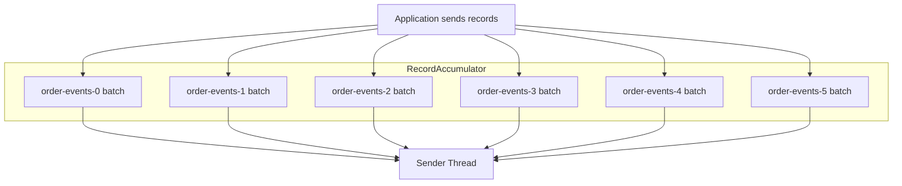
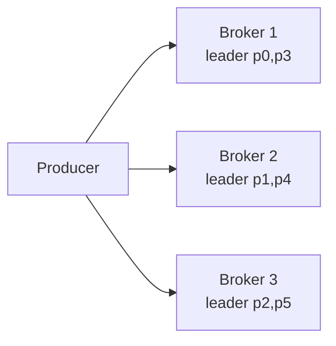
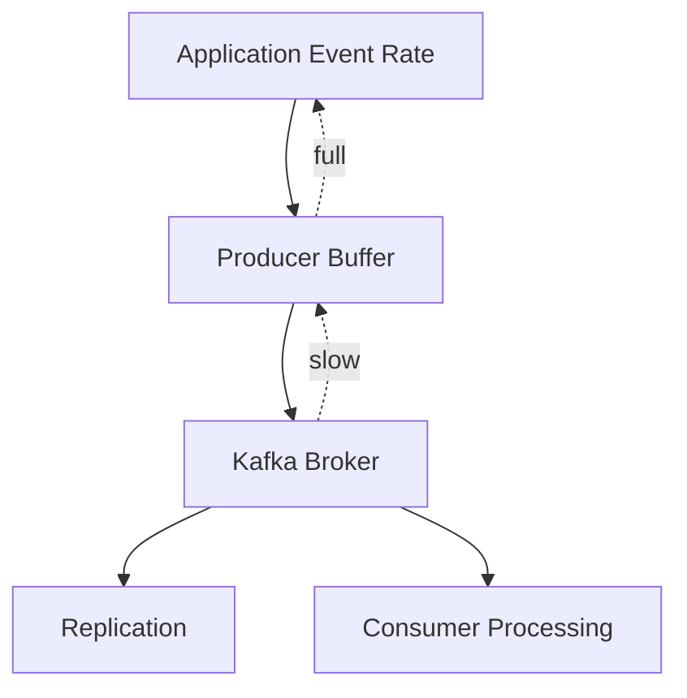
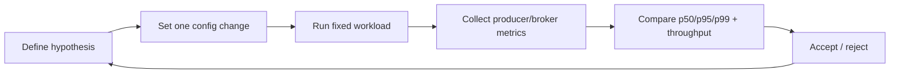

------
title: Learn Java Kafka in Action - Part 007
description: Producer throughput, batching, compression, memory pressure, latency trade-offs, and Java-side tuning model for production Kafka systems.
series: learn-java-kafka-in-action
seriesTitle: Learn Java Kafka in Action
order: 7
partTitle: Producer Throughput, Batching, and Compression
tags:
  - java
  - kafka
  - producer
  - batching
  - compression
  - throughput
  - latency
  - performance
  - series
date: 2026-07-01
---

# Part 007 — Producer Throughput, Batching, and Compression

## 1. Tujuan Part Ini

Part sebelumnya membahas **reliability** producer: `acks`, idempotence, retries, timeout, ordering, dan transaksi. Part ini membahas sisi lain yang sama pentingnya: **throughput engineering**.

Kafka producer yang benar secara semantik belum tentu cukup cepat. Producer yang cepat belum tentu aman. Dalam sistem produksi, kita jarang men-tuning satu parameter secara terisolasi. Kita menyeimbangkan beberapa gaya tekanan sekaligus:

1. latency event individual,
2. throughput agregat,
3. CPU producer,
4. CPU broker,
5. network bandwidth,
6. memory pressure di JVM,
7. compression ratio,
8. broker backpressure,
9. ordering dan duplicate risk,
10. downstream processing capacity.

Tujuan part ini adalah membuat kita bisa menjawab:

- Mengapa producer throughput rendah walaupun cluster Kafka terlihat idle?
- Kapan `linger.ms` membantu dan kapan merusak latency?
- Mengapa `batch.size` besar belum tentu menaikkan throughput?
- Bagaimana compression mengubah network, CPU, disk, dan latency?
- Bagaimana membaca gejala producer bottleneck dari metrics?
- Bagaimana menyusun tuning plan yang defensible, bukan trial-and-error acak?

> Mental model utama: **Kafka producer bukan mengirim satu record satu request. Producer mengumpulkan record menjadi batch per topic-partition, lalu sender thread mengirim batch ke broker leader. Throughput Kafka sebagian besar lahir dari batching, compression, sequential I/O, dan paralelisme partition.**

## 2. Skill Deconstruction ala Kaufman

Kaufman menyarankan skill kompleks dipecah menjadi sub-skill kecil yang bisa dilatih. Untuk producer performance, skill-nya bisa dipecah seperti ini:

| Sub-skill | Pertanyaan yang Harus Bisa Dijawab |
|---|---|
| Batch formation | Bagaimana record berubah menjadi batch per partition? |
| Memory model | Apa yang terjadi ketika `buffer.memory` penuh? |
| Network model | Berapa request yang dikirim, ke broker mana, dan kapan? |
| Compression model | Codec mana yang cocok untuk payload dan workload tertentu? |
| Latency model | Komponen apa saja yang membentuk end-to-end produce latency? |
| Backpressure model | Bagaimana producer bereaksi saat broker/downstream melambat? |
| Benchmarking | Bagaimana mengukur perubahan tanpa bias dan noise? |
| Production tuning | Parameter mana yang aman dinaikkan dan apa failure mode-nya? |

Kita tidak mulai dari “set `linger.ms=20` dan `batch.size=64KB`”. Itu resep dangkal. Kita mulai dari invariant.

## 3. Producer Data Path: Dari `send()` ke Broker

Secara konseptual, flow Java Kafka producer seperti ini:


Critical detail:

1. `send()` biasanya tidak langsung melakukan network round-trip penuh.
2. Record diserialisasi, dipilih partition-nya, lalu masuk ke `RecordAccumulator`.
3. Accumulator menyimpan batch per topic-partition.
4. Sender thread mengambil batch yang siap dan mengirim ke broker leader partition tersebut.
5. Broker mengembalikan acknowledgement sesuai konfigurasi `acks`.
6. Callback dipanggil setelah response diterima atau error final terjadi.

Implikasinya: performance producer tidak hanya ditentukan oleh seberapa cepat application thread memanggil `send()`, tetapi oleh seberapa efisien batch terbentuk, bagaimana batch dikompresi, berapa request yang dikirim, dan seberapa cepat broker leader merespons.

## 4. Throughput vs Latency: Trade-off yang Tidak Bisa Dihapus

Producer tuning hampir selalu berhadapan dengan trade-off:

| Optimasi | Biasanya Menaikkan | Biasanya Mengorbankan |
|---|---|---|
| Larger batch | Throughput, compression ratio | Latency, memory usage |
| Higher linger | Batch fullness, fewer requests | Per-record latency |
| Compression | Network/disk efficiency | CPU producer/broker, sometimes latency |
| More partitions | Parallelism | Ordering simplicity, metadata, memory, operations |
| More producer instances | Throughput isolation | Connection count, coordination, observability complexity |
| Higher in-flight | Network utilization | Ordering risk if idempotence disabled |
| Larger buffer | Burst absorption | Heap/native pressure, delayed failure |

Top engineer tidak bertanya “config terbaik apa?”. Pertanyaannya:

> Workload ini latency-sensitive, throughput-sensitive, cost-sensitive, atau correctness-sensitive?

Contoh:

- fraud decision event mungkin membutuhkan low latency dan strict ordering per account,
- telemetry event mungkin membutuhkan high throughput dan compression tinggi,
- audit event membutuhkan durability dan traceability,
- clickstream event lebih toleran terhadap delay kecil demi throughput.

## 5. Batch Formation Mental Model

Kafka producer melakukan batching **per topic-partition**, bukan satu batch global untuk seluruh topic.

Misalkan topic `order-events` memiliki 6 partition. Jika producer mengirim event dengan key tersebar ke 6 partition, producer dapat membentuk batch terpisah:



Konsekuensi penting:

1. Topic dengan banyak partition tetapi traffic rendah per partition bisa menghasilkan batch kecil.
2. Key cardinality dan distribusi memengaruhi batch fullness.
3. Batch size besar tidak efektif jika traffic per partition tidak cukup untuk mengisi batch.
4. Hot partition bisa penuh terus, sementara partition lain mengirim batch kecil.
5. Compression ratio biasanya lebih baik jika batch berisi lebih banyak record serupa.

### 5.1 `batch.size`

`batch.size` adalah batas atas ukuran batch per partition. Ini bukan jaminan bahwa setiap batch akan sebesar itu.

Jika `batch.size=131072` byte tetapi producer hanya punya sedikit record untuk partition tersebut, batch tetap bisa dikirim lebih kecil ketika kondisi lain terpenuhi, misalnya `linger.ms` habis atau sender siap mengirim.

Cara berpikir yang benar:

```text
actual_batch_size = min(
  accumulated_records_for_partition,
  configured_batch_size,
  request_size_limit,
  available_buffer_memory,
  time_pressure_due_to_linger_or_flush
)
```

Gejala `batch.size` terlalu kecil:

- request rate tinggi,
- average batch size rendah,
- compression ratio buruk,
- broker network/request overhead tinggi,
- CPU per message tinggi.

Gejala `batch.size` terlalu besar:

- memory naik,
- producer buffer pressure naik,
- latency naik pada low-volume partition,
- GC pressure meningkat,
- tuning tidak berdampak karena batch jarang penuh.

### 5.2 `linger.ms`

`linger.ms` memberi producer waktu tambahan untuk menunggu record lain agar batch lebih penuh. Batasnya: producer akan mengirim ketika batch penuh atau linger selesai, mana yang terjadi lebih dulu.

`linger.ms` bukan “delay semua message secara membabi buta”. Ia adalah **upper bound waiting time** pada batch yang belum penuh, dan effective delay bisa dipengaruhi broker backpressure.

Pattern umum:

| Workload | `linger.ms` Bias Awal |
|---|---:|
| low-latency command/event | 0–5 ms |
| balanced service event | 5–20 ms |
| high-throughput telemetry | 20–100 ms, ukur ketat |
| batch ingestion | 50–500 ms, jika latency memang tidak kritis |

Jangan copy nilai ini tanpa benchmark. Gunakan sebagai starting hypothesis.

### 5.3 `buffer.memory`

`buffer.memory` adalah total memory yang bisa dipakai producer untuk buffering record sebelum dikirim. Saat buffer penuh, `send()` dapat block sampai memory tersedia atau sampai `max.block.ms` tercapai.

Kondisi buffer penuh biasanya berarti salah satu dari ini:

1. broker lambat,
2. network bottleneck,
3. batch terlalu besar untuk memory yang tersedia,
4. producer menghasilkan event lebih cepat dari Kafka menerima,
5. partition leader tidak tersedia,
6. metadata tidak available,
7. request timeout/retry menahan buffer terlalu lama.

Producer buffer bukan mekanisme durability. Jika aplikasi mati sebelum record terkirim dan acknowledged, record dalam memory hilang.

## 6. Compression: Mengurangi Byte, Membayar CPU

Kafka producer mendukung compression pada level batch. Secara praktik, compression adalah salah satu tuning paling berdampak untuk throughput karena Kafka workload sering network-bound atau disk-bound.

Codec umum:

| Codec | Karakter Umum | Cocok Untuk |
|---|---|---|
| `none` | Tanpa CPU compression, byte besar | Debug, payload kecil, latency sangat ketat, benchmark baseline |
| `gzip` | Compression ratio tinggi, CPU lebih berat | Archival, batch ingestion, payload text besar |
| `snappy` | Cepat, ratio sedang | General purpose lama, latency rendah |
| `lz4` | Cepat, ratio baik | Throughput tinggi dengan CPU moderat |
| `zstd` | Ratio sangat baik, fleksibel | High-throughput modern, cost-sensitive network/storage |

Compression bekerja lebih baik ketika:

1. batch lebih besar,
2. record dalam batch mirip secara struktur,
3. payload verbose seperti JSON,
4. schema binary masih punya repetisi field/value,
5. key distribution tidak menyebar terlalu tipis ke terlalu banyak partition.

Compression kurang membantu ketika:

1. payload sudah terkompresi,
2. record sangat kecil dan batch tidak penuh,
3. CPU producer sudah bottleneck,
4. latency tail lebih penting daripada throughput,
5. broker CPU sudah tinggi.

### 6.1 Compression Mengubah Bottleneck

Sebelum compression:

```text
producer CPU: 20%
network:      90%
broker CPU:   35%
disk:         75%
```

Sesudah `zstd`:

```text
producer CPU: 55%
network:      45%
broker CPU:   50%
disk:         40%
```

Ini mungkin bagus jika network/disk mahal. Tapi jika producer CPU sudah 80%, compression berat bisa memperburuk latency.

Rule:

> Compression bukan optimasi gratis. Ia menukar byte dengan CPU.

## 7. Request, In-flight, dan Parallelism

Producer mengirim request ke broker leader. Karena partition leader tersebar di broker berbeda, producer dapat punya request paralel ke beberapa broker.



Tingkat parallelism dipengaruhi oleh:

1. jumlah partition yang aktif,
2. distribusi leader partition antar broker,
3. `max.in.flight.requests.per.connection`,
4. ukuran batch,
5. broker response time,
6. network bandwidth,
7. compression cost,
8. application send concurrency.

### 7.1 `max.in.flight.requests.per.connection`

Parameter ini membatasi jumlah request unacknowledged per connection. Nilai lebih tinggi dapat meningkatkan network utilization, tetapi historically punya risiko reordering ketika retries terjadi dan idempotence tidak aktif.

Dengan idempotent producer modern, ordering lebih aman selama konfigurasi kompatibel. Namun, reasoning-nya tetap perlu jelas:

- Jangan menaikkan in-flight untuk “memperbaiki” semua masalah throughput.
- Jika bottleneck adalah batch kecil, in-flight tinggi tidak banyak membantu.
- Jika bottleneck adalah broker throttling, in-flight tinggi bisa memperparah pressure.
- Jika service membutuhkan ordering ketat dan konfigurasi legacy non-idempotent, in-flight harus hati-hati.

## 8. Latency Breakdown

Produce latency bukan satu angka tunggal. Ia gabungan beberapa komponen:


Approximation:

```text
produce_latency = serialization_time
                + partition_selection_time
                + accumulator_wait
                + linger_wait
                + sender_queue_wait
                + network_round_trip
                + broker_append_time
                + replication_ack_wait
                + callback_dispatch_time
```

Tail latency sering memburuk bukan karena median path, tetapi karena:

1. broker leader overload,
2. batch menunggu linger pada low traffic partition,
3. retries,
4. GC pause,
5. DNS/network jitter,
6. ISR shrink menyebabkan ack wait lebih lama,
7. metadata refresh saat leader berubah,
8. producer buffer exhaustion.

## 9. Java Implementation Pattern: Producer Config Profiles

Kita tidak membuat satu config untuk semua service. Kita buat profile berdasarkan workload.

### 9.1 Balanced Service Event Producer

```java
import org.apache.kafka.clients.producer.ProducerConfig;
import org.apache.kafka.common.serialization.StringSerializer;

import java.util.Properties;

public final class BalancedProducerConfig {
    public static Properties create(String bootstrapServers) {
        Properties props = new Properties();
        props.put(ProducerConfig.BOOTSTRAP_SERVERS_CONFIG, bootstrapServers);
        props.put(ProducerConfig.KEY_SERIALIZER_CLASS_CONFIG, StringSerializer.class.getName());
        props.put(ProducerConfig.VALUE_SERIALIZER_CLASS_CONFIG, StringSerializer.class.getName());

        // Correctness baseline
        props.put(ProducerConfig.ACKS_CONFIG, "all");
        props.put(ProducerConfig.ENABLE_IDEMPOTENCE_CONFIG, "true");

        // Balanced throughput/latency baseline
        props.put(ProducerConfig.BATCH_SIZE_CONFIG, Integer.toString(64 * 1024));
        props.put(ProducerConfig.LINGER_MS_CONFIG, "10");
        props.put(ProducerConfig.COMPRESSION_TYPE_CONFIG, "lz4");
        props.put(ProducerConfig.BUFFER_MEMORY_CONFIG, Long.toString(64L * 1024L * 1024L));

        // Bounded failure behavior
        props.put(ProducerConfig.DELIVERY_TIMEOUT_MS_CONFIG, "120000");
        props.put(ProducerConfig.REQUEST_TIMEOUT_MS_CONFIG, "30000");
        props.put(ProducerConfig.MAX_BLOCK_MS_CONFIG, "10000");

        return props;
    }
}
```

Catatan:

- Ini bukan “best config”. Ini baseline untuk eksperimen.
- `compression.type=lz4` sering masuk akal untuk balance, tetapi benchmark payload nyata tetap wajib.
- `buffer.memory=64MB` memberi burst room lebih besar daripada default umum, tetapi harus disesuaikan jumlah producer instance dan heap.
- `delivery.timeout.ms` harus lebih besar daripada kombinasi request timeout + retry behavior.

### 9.2 Low-Latency Producer

```java
public final class LowLatencyProducerConfig {
    public static Properties create(String bootstrapServers) {
        Properties props = BalancedProducerConfig.create(bootstrapServers);

        props.put(ProducerConfig.BATCH_SIZE_CONFIG, Integer.toString(16 * 1024));
        props.put(ProducerConfig.LINGER_MS_CONFIG, "0");
        props.put(ProducerConfig.COMPRESSION_TYPE_CONFIG, "none");
        props.put(ProducerConfig.MAX_BLOCK_MS_CONFIG, "3000");

        return props;
    }
}
```

Trade-off:

- request rate naik,
- broker overhead naik,
- compression hilang,
- cost per message naik,
- latency median bisa turun,
- tail latency masih bisa buruk jika broker/network bermasalah.

### 9.3 High-Throughput Producer

```java
public final class HighThroughputProducerConfig {
    public static Properties create(String bootstrapServers) {
        Properties props = BalancedProducerConfig.create(bootstrapServers);

        props.put(ProducerConfig.BATCH_SIZE_CONFIG, Integer.toString(256 * 1024));
        props.put(ProducerConfig.LINGER_MS_CONFIG, "50");
        props.put(ProducerConfig.COMPRESSION_TYPE_CONFIG, "zstd");
        props.put(ProducerConfig.BUFFER_MEMORY_CONFIG, Long.toString(256L * 1024L * 1024L));
        props.put(ProducerConfig.MAX_REQUEST_SIZE_CONFIG, Integer.toString(2 * 1024 * 1024));

        return props;
    }
}
```

Trade-off:

- throughput bisa naik,
- network byte turun,
- producer CPU naik,
- memory naik,
- low-volume partition bisa mengalami delay,
- broker setting juga harus kompatibel dengan request/message size.

## 10. Backpressure dan Failure Behavior

Producer harus dianggap sebagai bagian dari distributed flow-control system. Saat Kafka atau network melambat, producer akan menunjukkan gejala.



Backpressure path:

1. broker leader lambat menerima batch,
2. request tertunda,
3. batch tetap menahan memory,
4. accumulator penuh,
5. `send()` block,
6. `max.block.ms` bisa meledak,
7. aplikasi mulai gagal membuat event,
8. upstream service latency ikut naik.

### 10.1 Anti-pattern: Infinite Producer Buffer Illusion

Kesalahan umum:

```text
Masalah: send() mulai block.
Solusi dangkal: naikkan buffer.memory sangat besar.
```

Ini bisa menunda gejala, bukan menyelesaikan bottleneck. Jika broker hanya mampu menerima 50 MB/s dan aplikasi menghasilkan 200 MB/s, buffer sebesar apa pun akhirnya penuh.

Solusi yang benar harus menjawab:

- Apakah rate aplikasi memang valid?
- Apakah event bisa di-sample, aggregate, atau drop secara eksplisit?
- Apakah topic partition cukup?
- Apakah broker/network/disk cukup?
- Apakah compression bisa mengurangi byte?
- Apakah downstream consumer ikut menyebabkan retention/lag pressure?
- Apakah service perlu local durable queue sebelum Kafka?

## 11. Metrics yang Harus Dibaca

Producer tuning tanpa metrics hanyalah tebak-tebakan. Minimal pantau:

| Metric Area | Contoh Sinyal | Makna |
|---|---|---|
| Throughput | record-send-rate, byte-rate | Output aktual producer |
| Batch | batch-size-avg, batch-size-max, records-per-request-avg | Apakah batch cukup penuh? |
| Latency | request-latency-avg, request-latency-max | Broker/network response |
| Retry | record-retry-rate, record-error-rate | Reliability pressure |
| Buffer | buffer-available-bytes, bufferpool-wait-ratio | Backpressure producer |
| Compression | compression-rate-avg | Efisiensi codec/payload |
| Metadata | metadata-age, connection metrics | Cluster discovery dan broker connection |
| Queue | record-queue-time-avg/max | Waktu record menunggu di accumulator |

Interpretasi cepat:

| Gejala | Kemungkinan Penyebab | Investigasi |
|---|---|---|
| batch-size-avg kecil | traffic per partition rendah, linger kecil | cek key distribution, partition count, linger |
| record-queue-time tinggi | sender/broker lambat, linger tinggi | cek request latency, broker metrics |
| bufferpool-wait tinggi | producer lebih cepat dari broker | cek broker network/disk, compression, rate limit |
| retry-rate naik | broker/network/ISR issue | cek broker logs, leader changes, under-replicated partitions |
| compression-rate buruk | batch kecil/payload tidak compressible | cek batch size, codec, payload |
| request-latency max spike | broker overload, GC, network jitter | korelasi dengan broker dan JVM metrics |

## 12. Benchmark Methodology

Benchmark producer harus menjawab satu pertanyaan per eksperimen. Jangan mengubah 8 config sekaligus.

### 12.1 Experimental Loop



Contoh hypothesis:

```text
Hypothesis:
Increasing linger.ms from 5ms to 20ms will increase records-per-request
by at least 30% and reduce broker request rate without increasing p99
produce latency beyond 150ms.
```

### 12.2 Workload Harus Stabil

Pastikan:

1. payload size distribution realistis,
2. key distribution realistis,
3. number of partitions sama dengan produksi atau model produksi,
4. broker hardware/setelan mirip,
5. warm-up cukup,
6. GC/logging noise dikontrol,
7. p95/p99 diukur, bukan hanya average,
8. consumer tidak menjadi hidden bottleneck jika benchmark end-to-end,
9. retry/error dihitung sebagai hasil, bukan diabaikan.

### 12.3 Tuning Order yang Masuk Akal

Urutan tuning yang sering efektif:

1. Validasi correctness config: `acks`, idempotence, timeout.
2. Ukur baseline throughput/latency/error.
3. Cek batch fullness.
4. Naikkan `linger.ms` kecil-kecilan.
5. Naikkan `batch.size` jika batch sering penuh atau request terlalu banyak.
6. Aktifkan compression dan bandingkan codec.
7. Cek buffer pressure.
8. Cek partition distribution dan broker leader spread.
9. Baru pertimbangkan producer parallelism atau partition count.
10. Dokumentasikan keputusan.

## 13. Payload Size dan Message Size Limit

Message besar sering menyebabkan masalah non-linear. Kafka bisa mengirim message besar jika semua limit konsisten, tetapi itu tidak berarti desainnya baik.

Parameter terkait:

- producer `max.request.size`,
- broker `message.max.bytes`,
- topic `max.message.bytes`,
- consumer `fetch.max.bytes`,
- consumer `max.partition.fetch.bytes`,
- replica fetch size.

Anti-pattern:

```text
Mengirim dokumen 20MB sebagai satu event Kafka karena “Kafka bisa handle bytes”.
```

Konsekuensi:

1. batch efficiency buruk,
2. memory pressure tinggi,
3. retry mahal,
4. p99 latency rusak,
5. consumer fetch perlu dinaikkan,
6. replication cost naik,
7. compaction/retention menjadi mahal,
8. DLQ/replay lebih berisiko.

Pattern yang lebih baik:

- simpan payload besar di object storage,
- kirim event metadata + pointer + checksum,
- pastikan object lifecycle sesuai retention event,
- desain idempotency untuk fetch external object,
- audit akses object jika domain regulated.

## 14. Producer Instance Lifecycle

`KafkaProducer` Java dirancang untuk dipakai ulang. Membuat producer per request adalah anti-pattern berat.

Anti-pattern:

```java
public void publish(OrderEvent event) {
    try (KafkaProducer<String, String> producer = new KafkaProducer<>(props)) {
        producer.send(record(event)).get();
    }
}
```

Masalah:

1. connection setup berulang,
2. metadata fetch berulang,
3. batching hilang,
4. compression efficiency buruk,
5. latency tinggi,
6. resource leak risk,
7. throughput sangat rendah.

Pattern lebih baik:

```java
public final class OrderEventPublisher implements AutoCloseable {
    private final KafkaProducer<String, String> producer;
    private final String topic;

    public OrderEventPublisher(KafkaProducer<String, String> producer, String topic) {
        this.producer = producer;
        this.topic = topic;
    }

    public void publish(OrderEvent event) {
        ProducerRecord<String, String> record = new ProducerRecord<>(
                topic,
                event.orderId(),
                event.toJson()
        );

        producer.send(record, (metadata, exception) -> {
            if (exception != null) {
                // In real systems, map this to metrics, alert, retry boundary, or fail-fast policy.
                System.err.printf("Failed to publish order event id=%s error=%s%n",
                        event.eventId(), exception.getMessage());
                return;
            }

            // Keep callback lightweight. Do not perform slow downstream work here.
            System.out.printf("Published event id=%s topic=%s partition=%d offset=%d%n",
                    event.eventId(), metadata.topic(), metadata.partition(), metadata.offset());
        });
    }

    @Override
    public void close() {
        producer.flush();
        producer.close();
    }
}
```

Callback harus ringan. Jangan melakukan blocking DB call berat di callback producer. Callback berjalan di thread internal producer; memperlambat callback dapat memperlambat progress producer.

## 15. Synchronous Send: Kapan Boleh?

Synchronous send dengan `.get()` berguna untuk:

1. command-line migration tool,
2. test deterministik,
3. low-throughput admin workflow,
4. explicit durability checkpoint,
5. local debugging.

Tetapi untuk high-throughput service, `.get()` per record menghancurkan batching dan parallelism.

Anti-pattern:

```java
for (OrderEvent event : events) {
    producer.send(toRecord(event)).get();
}
```

Lebih baik:

```java
for (OrderEvent event : events) {
    producer.send(toRecord(event), callback);
}
producer.flush();
```

Untuk batch job, kirim asynchronous, kumpulkan error, lalu `flush()` di boundary yang jelas.

## 16. Tuning Berdasarkan Workload

### 16.1 Financial/Audit Event

Prioritas:

1. durability,
2. ordering per entity,
3. traceability,
4. bounded duplicate handling,
5. reasonable latency.

Config tendency:

```properties
acks=all
enable.idempotence=true
compression.type=lz4
linger.ms=5
batch.size=32768
```

Design tendency:

- event id wajib,
- idempotent consumer wajib,
- schema compatibility ketat,
- audit metadata lengkap,
- DLQ tidak boleh menjadi graveyard.

### 16.2 Telemetry/Clickstream

Prioritas:

1. throughput,
2. cost per GB,
3. compression,
4. partition distribution,
5. controlled data loss policy jika domain mengizinkan.

Config tendency:

```properties
acks=all
compression.type=zstd
linger.ms=50
batch.size=262144
buffer.memory=268435456
```

Design tendency:

- key mungkin bukan userId jika menyebabkan skew,
- sampling/aggregation bisa valid,
- schema ringkas,
- high partition count bisa masuk akal tetapi harus dihitung.

### 16.3 User-Facing Workflow Event

Prioritas:

1. latency p95/p99,
2. correctness,
3. bounded retry,
4. predictable failure.

Config tendency:

```properties
acks=all
enable.idempotence=true
compression.type=lz4
linger.ms=0
batch.size=16384
max.block.ms=3000
```

Design tendency:

- jangan block request thread terlalu lama,
- gunakan outbox jika DB transaction harus sinkron,
- expose publish failure sebagai state yang jelas,
- hindari synchronous Kafka dependency untuk critical user path jika tidak perlu.

## 17. Common Performance Incidents

### 17.1 Incident: Throughput Rendah, CPU Rendah

Gejala:

- producer CPU rendah,
- broker CPU rendah,
- throughput rendah,
- batch-size-avg kecil,
- request rate relatif tinggi.

Kemungkinan:

1. synchronous send per record,
2. traffic per partition terlalu rendah,
3. `linger.ms=0`,
4. partition terlalu banyak untuk volume,
5. producer dibuat per request,
6. payload kecil tanpa batching efektif.

Fix:

- reuse producer,
- async send,
- naikkan linger kecil,
- evaluasi partition count,
- gabungkan event kecil jika domain memungkinkan.

### 17.2 Incident: Buffer Exhaustion

Gejala:

- `TimeoutException: Failed to allocate memory within max.block.ms`,
- bufferpool-wait-ratio naik,
- request-latency naik,
- retry-rate naik.

Kemungkinan:

1. broker overloaded,
2. network issue,
3. topic leader unavailable,
4. request terlalu besar,
5. producer rate terlalu tinggi,
6. ISR/replication lambat.

Fix:

- cek broker leader metrics,
- cek under-replicated partitions,
- cek network egress,
- turunkan produce rate atau tambahkan partition/broker,
- pakai compression,
- jangan hanya menaikkan buffer.

### 17.3 Incident: Compression Membuat Latency Naik

Gejala:

- network byte turun,
- producer CPU naik,
- p99 latency naik,
- GC mungkin naik.

Kemungkinan:

1. codec terlalu berat,
2. batch terlalu besar,
3. producer CPU saturated,
4. callback/logging overhead,
5. payload tidak cukup compressible.

Fix:

- bandingkan `lz4`, `snappy`, `zstd`, `none`,
- ukur compression-rate,
- naikkan CPU allocation,
- gunakan binary schema,
- kurangi batch/linger untuk latency-sensitive path.

## 18. Configuration Decision Matrix

| Requirement | Prefer | Avoid |
|---|---|---|
| Strict durability | `acks=all`, idempotence, RF>=3, min ISR aligned | `acks=1`, unbounded silent retry assumption |
| Low latency | low linger, smaller batch, fast codec/no compression | huge linger, huge batch without p99 measurement |
| High throughput | batching, compression, sufficient partitions | sync send per record, producer per request |
| Cost efficiency | compression, compact payload, larger batch | verbose JSON without compression |
| Burst tolerance | adequate buffer, rate limiting, async send | infinite buffer illusion |
| Hot key risk | key analysis, salting where valid | blind key by tenant/user if skewed |
| Operational clarity | metrics per producer/topic | shared anonymous producer with no client.id discipline |

## 19. `client.id` dan Observability Identity

Tuning must be attributable. Selalu set `client.id` dengan nama service dan role.

```properties
client.id=order-service-event-producer-v1
```

Jika semua producer memakai client.id default, metrics menjadi sulit dibaca. Untuk production:

```text
<domain>-<service>-<purpose>-producer-<version>
```

Contoh:

```text
billing-invoice-event-producer-v1
risk-scoring-decision-producer-v2
catalog-price-change-producer-v1
```

## 20. Practice Lab

### Lab 1 — Batch Visibility

Buat producer sederhana yang mengirim 1 juta event kecil ke topic 12 partition. Jalankan beberapa config:

| Run | batch.size | linger.ms | compression.type |
|---|---:|---:|---|
| A | 16384 | 0 | none |
| B | 65536 | 5 | lz4 |
| C | 131072 | 20 | lz4 |
| D | 262144 | 50 | zstd |

Ukur:

- records/sec,
- MB/sec,
- p50/p95/p99 callback latency,
- batch-size-avg,
- records-per-request-avg,
- compression-rate-avg,
- producer CPU,
- broker network in,
- broker request rate.

Pertanyaan:

1. Run mana yang paling tinggi throughput-nya?
2. Run mana yang p99 latency-nya paling buruk?
3. Apakah compression menurunkan network byte?
4. Apakah batch-size-avg mendekati batch.size?
5. Apakah bottleneck pindah dari network ke CPU?

### Lab 2 — Partition Count vs Batch Fullness

Dengan traffic rate sama, bandingkan topic 3, 12, dan 48 partition.

Expected insight:

- partition terlalu sedikit bisa membatasi parallelism,
- partition terlalu banyak bisa membuat traffic per partition tipis,
- batch fullness dapat turun ketika partition count naik tanpa volume cukup.

### Lab 3 — Synchronous vs Asynchronous Send

Bandingkan:

```java
producer.send(record).get();
```

vs:

```java
producer.send(record, callback);
```

Expected insight:

- synchronous per record menurunkan throughput drastis,
- async send memanfaatkan accumulator dan sender thread,
- `flush()` harus ditempatkan di batch boundary, bukan per event.

## 21. Architecture Review Questions

Gunakan pertanyaan ini saat review service producer:

1. Apa workload class-nya: low-latency, balanced, high-throughput, atau batch ingestion?
2. Berapa payload size p50/p95/p99?
3. Apakah producer async atau sync?
4. Apakah producer instance reusable?
5. Apakah `client.id` jelas?
6. Berapa `batch.size`, `linger.ms`, `compression.type`, dan alasannya?
7. Apakah key distribution mendukung batch fullness dan ordering?
8. Apakah ada buffer exhaustion alert?
9. Apakah p99 callback latency dipantau?
10. Apakah broker leader distribution merata?
11. Apakah message size limit konsisten dari producer sampai consumer?
12. Apakah benchmark memakai payload realistis?
13. Apakah retry/error rate masuk SLO?
14. Apakah publish failure punya policy eksplisit?
15. Apakah config dibedakan per workload atau copy-paste global?

## 22. Common Anti-Patterns

### 22.1 Producer per Request

Menghancurkan batching, connection reuse, metadata cache, dan throughput.

### 22.2 `.get()` per Message

Membuat Kafka seperti RPC sinkron dan menonaktifkan sebagian besar keunggulan producer.

### 22.3 Tuning Tanpa Metrics

Mengubah `linger.ms`, `batch.size`, dan compression tanpa melihat batch-size-avg, records-per-request, p99 latency, dan CPU.

### 22.4 Oversized Event

Mengirim payload besar langsung ke Kafka tanpa mempertimbangkan memory, retry, fetch, DLQ, dan replay.

### 22.5 One Config for Every Producer

Service audit event, clickstream, dan user-facing workflow tidak punya profil performance yang sama.

### 22.6 Buffer as Durability

Buffer producer adalah memory sementara, bukan durable queue.

### 22.7 Compression as Religion

Compression bagus untuk banyak kasus, tetapi tetap harus diuji terhadap CPU dan p99 latency.

## 23. Production Checklist

Sebelum producer dianggap production-ready:

- [ ] Producer instance reusable.
- [ ] Async send digunakan untuk high-throughput path.
- [ ] Callback ringan dan non-blocking.
- [ ] `client.id` jelas.
- [ ] `acks=all` dan idempotence dipertimbangkan/diaktifkan sesuai requirement.
- [ ] `batch.size` dan `linger.ms` dipilih berdasarkan benchmark.
- [ ] Compression dipilih berdasarkan payload nyata.
- [ ] `buffer.memory` dan heap sizing konsisten.
- [ ] `max.block.ms` punya policy failure.
- [ ] Message size limit divalidasi end-to-end.
- [ ] Producer metrics diekspor.
- [ ] p95/p99 publish latency dipantau.
- [ ] Retry/error rate dipantau.
- [ ] Buffer exhaustion alert tersedia.
- [ ] Backpressure policy jelas.
- [ ] Benchmark artifact disimpan.

## 24. Kaufman Deliberate Practice

Latihan 20 jam awal untuk part ini:

| Jam | Fokus | Output |
|---:|---|---|
| 1–2 | Baca data path producer | Diagram producer internal versi sendiri |
| 3–4 | Eksperimen sync vs async | Tabel throughput dan latency |
| 5–6 | Eksperimen batch/linger | Grafik batch-size vs p99 |
| 7–8 | Eksperimen compression | Codec comparison table |
| 9–10 | Buffer pressure simulation | Failure note dan metrics screenshot |
| 11–12 | Hot partition test | Distribusi partition dan batch fullness |
| 13–14 | Message size test | Limit matrix producer/broker/consumer |
| 15–16 | Observability setup | Dashboard producer minimal |
| 17–18 | Tuning ADR | Decision record lengkap |
| 19–20 | Incident drill | Runbook producer throughput collapse |

## 25. Ringkasan

Producer throughput bukan hasil dari satu “magic config”. Ia muncul dari interaksi:

1. batching per partition,
2. linger time,
3. compression,
4. memory buffer,
5. network request parallelism,
6. broker leader distribution,
7. payload shape,
8. key distribution,
9. retry dan acknowledgement behavior,
10. application send pattern.

Keahlian tingkat lanjut adalah mampu menjelaskan **mengapa** tuning tertentu cocok untuk workload tertentu, membaca metrics untuk membuktikannya, dan mengetahui failure mode dari setiap kompromi.

Part berikutnya masuk ke akar dari banyak masalah batching, ordering, dan scalability: **partitioning dan key design**.

## 26. Referensi

- Apache Kafka Documentation — Producer Configurations: `https://kafka.apache.org/41/configuration/producer-configs/`
- Apache Kafka Documentation — Design: `https://kafka.apache.org/41/design/design/`
- Confluent Documentation — Producer Configuration Reference: `https://docs.confluent.io/platform/current/installation/configuration/producer-configs.html`
- Confluent Documentation — Optimize Clients for Throughput: `https://docs.confluent.io/cloud/current/client-apps/optimizing/throughput.html`
- Confluent Developer Tutorial — Optimize Kafka Producer Throughput: `https://developer.confluent.io/confluent-tutorials/optimize-producer-throughput/kafka/`
