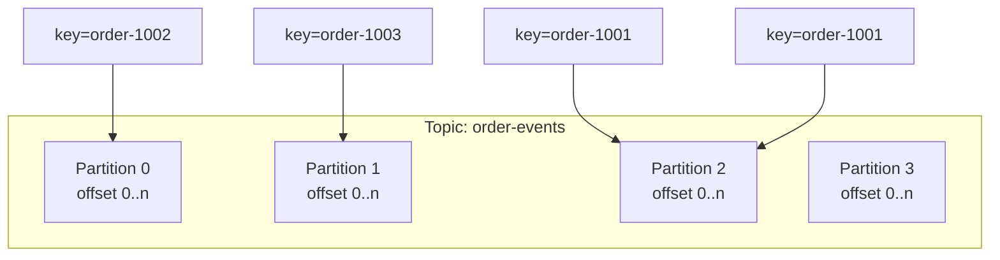
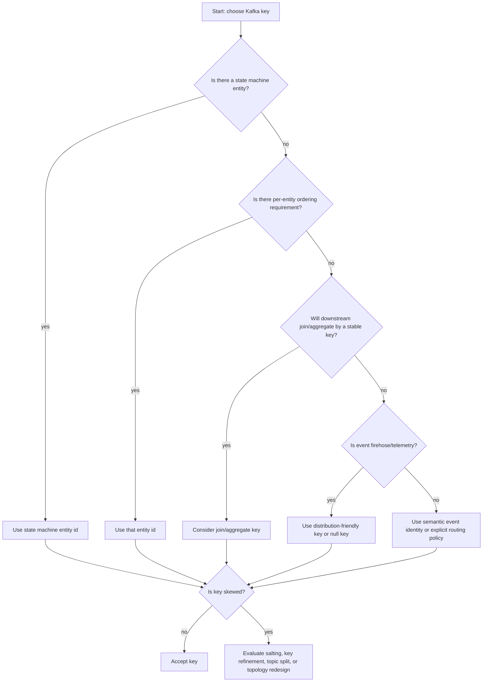
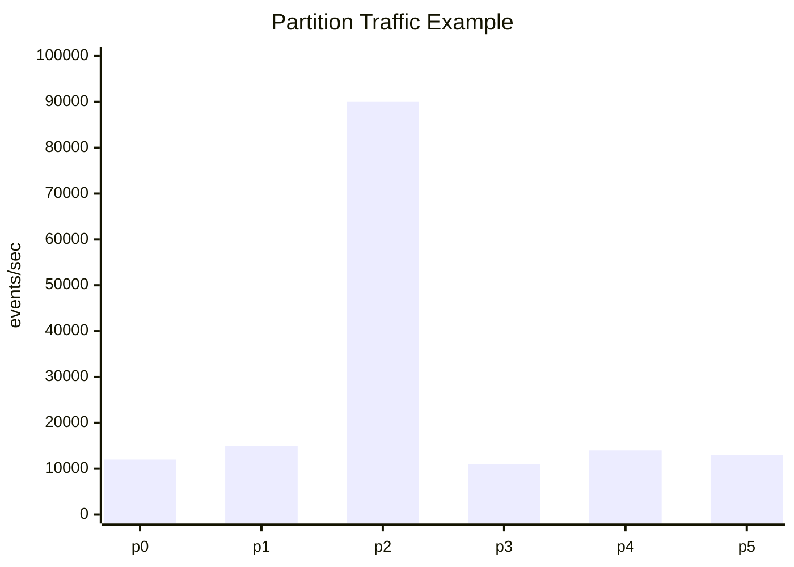
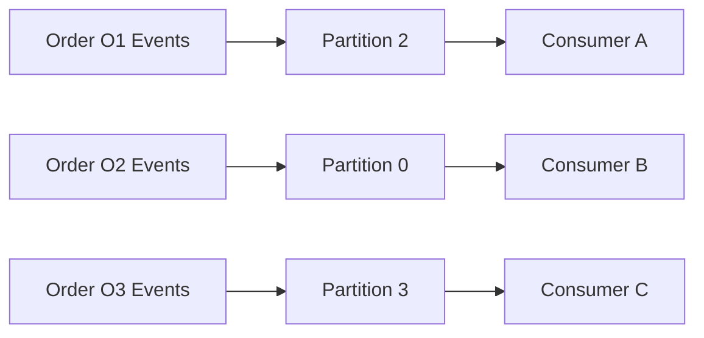
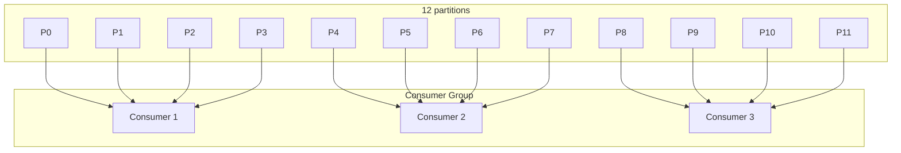
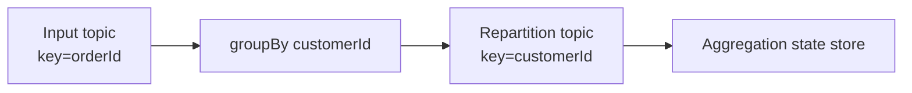
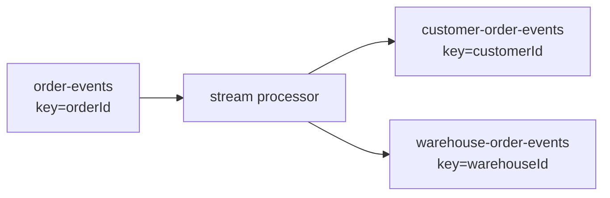

------
title: Learn Java Kafka in Action - Part 008
description: Partitioning and key design for Java Kafka systems, covering ordering boundaries, entity affinity, skew, hot partitions, repartitioning, tenant strategy, and custom partitioner trade-offs.
series: learn-java-kafka-in-action
seriesTitle: Learn Java Kafka in Action
order: 8
partTitle: Partitioning and Key Design
tags:
  - java
  - kafka
  - partitioning
  - key-design
  - ordering
  - scalability
  - hot-partition
  - event-driven-architecture
  - series
date: 2026-07-01
---

# Part 008 — Partitioning and Key Design

## 1. Tujuan Part Ini

Part 007 membahas batching dan throughput producer. Namun batching, ordering, load distribution, dan consumer parallelism sangat bergantung pada satu keputusan yang sering dianggap sepele: **key Kafka**.

Di Kafka, key bukan hanya field teknis. Key adalah deklarasi desain:

> “Semua event dengan key yang sama harus masuk ke ordering lane yang sama.”

Karena Kafka memberi ordering dalam partition, bukan global ordering across seluruh topic, key menentukan boundary ordering, affinity, parallelism, dan risiko hot partition.

Tujuan part ini:

1. memahami partition sebagai unit ordering dan parallelism,
2. memilih key berdasarkan invariant domain,
3. membedakan key untuk ordering vs key untuk query,
4. mendeteksi dan mengurangi skew/hot partition,
5. memahami risiko menambah partition setelah topic berjalan,
6. merancang tenant-aware dan entity-aware partitioning,
7. tahu kapan custom partitioner valid dan kapan berbahaya,
8. membuat partitioning decision record yang bisa direview.

## 2. Mental Model: Partition sebagai Ordering Lane

Topic Kafka terdiri dari beberapa partition. Setiap partition adalah ordered log.



Jika `order-1001` selalu dipetakan ke partition 2, maka event untuk order itu dibaca berurutan oleh consumer group yang sama. Tetapi event untuk `order-1001` dan `order-1002` tidak punya global order yang pasti jika berada di partition berbeda.

Invariant:

```text
Kafka ordering guarantee = ordering within one partition.
Kafka parallelism unit    = partition.
Kafka consumer ownership  = partition per consumer group member.
Kafka key consequence     = maps related events to a partition.
```

## 3. Key Design Bukan Sekadar Hashing

Default mental model teknis:

```text
partition = hash(serialized_key) % number_of_partitions
```

Tetapi desain sebenarnya adalah domain-level:

```text
key = entity whose event ordering must be preserved together
```

Contoh:

| Domain | Candidate Key | Kenapa |
|---|---|---|
| Order lifecycle | `orderId` | Created → Paid → Packed → Shipped harus berurutan per order |
| Account ledger | `accountId` | Debit/credit harus berurutan per account |
| Customer profile | `customerId` | Update profile harus berurutan per customer |
| Inventory item | `skuId` atau `warehouseId:skuId` | Stock mutation harus konsisten per stock bucket |
| Payment transaction | `paymentId` | Status transition harus berurutan per payment |
| Device telemetry | `deviceId` | Reading per device berurutan jika dibutuhkan |
| Tenant audit | `tenantId` mungkin buruk | Bisa hot jika tenant besar dominan |

Key terbaik bukan key yang paling mudah. Key terbaik adalah key yang menjaga invariant domain tanpa menghancurkan distribusi load.

## 4. Tiga Fungsi Key yang Sering Tercampur

Kafka key sering dipakai untuk beberapa tujuan sekaligus:

1. partition routing,
2. semantic identity,
3. compaction key,
4. join key di Kafka Streams/ksqlDB,
5. idempotency/dedup key,
6. query lookup key di materialized view.

Masalah muncul ketika satu key dipaksa memenuhi semua tujuan.

Contoh:

```json
{
  "key": "customer-123",
  "eventType": "OrderPaid",
  "orderId": "order-999",
  "customerId": "customer-123"
}
```

Jika key topic order event adalah `customerId`, maka semua order customer yang sama masuk partition sama. Ini menjaga ordering per customer, tetapi:

- parallelism turun untuk customer besar,
- order lifecycle per `orderId` tetap berurutan karena subset dari customer,
- hot customer bisa membuat hot partition,
- consumer yang memproses order independent bisa terhambat.

Jika key adalah `orderId`:

- lifecycle order rapi,
- load lebih tersebar,
- event customer-level tidak punya ordering global,
- join by customer mungkin butuh repartition.

Kesimpulan:

> Key harus dipilih berdasarkan primary invariant topic, bukan semua kebutuhan downstream sekaligus.

## 5. Ordering Boundary

Pertanyaan utama untuk memilih key:

> Event mana yang jika diproses out-of-order akan membuat state salah?

Contoh order lifecycle:

```text
OrderCreated(orderId=O1)
OrderPaid(orderId=O1)
OrderCancelled(orderId=O1)
```

Jika `OrderCancelled` diproses sebelum `OrderCreated`, state machine kacau. Maka `orderId` adalah ordering boundary yang kuat.

Contoh fraud signal:

```text
CardUsed(cardId=C1, transactionId=T1)
CardUsed(cardId=C1, transactionId=T2)
```

Jika risk engine butuh sequence per card, key `cardId` masuk akal. Tapi jika risk decision independent per transaction dan state store menyimpan aggregated card state secara terpisah, key `transactionId` mungkin lebih scalable, dengan pipeline agregasi lain keyed by `cardId`.

## 6. Partitioning Decision Tree



Decision tree ini bukan substitusi domain analysis, tetapi mencegah keputusan key yang asal.

## 7. Cardinality dan Skew

Dua metrik penting:

1. **cardinality**: jumlah distinct key,
2. **skew**: ketimpangan volume antar key.

High cardinality tidak otomatis bagus. Jika satu key menyumbang 60% traffic, tetap hot.

Contoh:

| Key | Events/minute |
|---|---:|
| tenant-A | 900,000 |
| tenant-B | 50,000 |
| tenant-C | 25,000 |
| others | 25,000 |

Key `tenantId` terlihat high-level rapi, tetapi tenant-A akan membuat hot partition.

Distribusi yang lebih baik mungkin:

```text
key = tenantId + ":" + entityId
```

atau untuk telemetry:

```text
key = deviceId
```

atau untuk tenant besar:

```text
key = tenantId + ":" + shard(orderId)
```

Tetapi salting/sharding key punya konsekuensi ordering. Jangan gunakan salting jika ordering per original key wajib.

## 8. Hot Partition

Hot partition terjadi ketika satu atau beberapa partition menerima traffic jauh lebih besar daripada partition lain.



Gejala:

1. producer latency naik hanya untuk partition tertentu,
2. broker leader partition tersebut CPU/network tinggi,
3. consumer lag tinggi pada partition tertentu,
4. consumer group total lag terlihat naik walaupun sebagian consumer idle,
5. batching tidak seimbang,
6. Kafka Streams task tertentu menjadi bottleneck.

Penyebab umum:

- key cardinality rendah,
- satu tenant/user/account sangat dominan,
- custom partitioner salah,
- partition count terlalu sedikit,
- event type dengan volume ekstrem dicampur dengan event type lain,
- key memakai status/type yang hanya punya sedikit nilai.

Anti-pattern key:

```text
key = eventType
key = countryCode
key = tenantId   // jika tenant skew ekstrem
key = booleanFlag
key = date
key = status
```

Key dengan cardinality rendah hampir pasti menciptakan hot partition.

## 9. Key Stability dan Perubahan Partition Count

Dengan hash modulo partition count, menambah partition dapat mengubah mapping key ke partition.

Contoh sederhana:

```text
old partition = hash(key) % 6
new partition = hash(key) % 12
```

Banyak key akan berpindah partition setelah jumlah partition berubah. Konsekuensi:

1. ordering per key bisa terganggu selama transisi jika producer/metadata tidak seragam,
2. stateful consumer/Kafka Streams bisa melihat key di partition baru,
3. compacted topic semantics tetap berdasarkan key, tetapi physical placement berubah,
4. join/repartition topic bisa perlu re-evaluasi,
5. operational rollout harus hati-hati.

Prinsip:

> Pilih partition count dengan horizon kapasitas yang cukup. Menambah partition mungkin valid, tetapi jangan dianggap free operation tanpa konsekuensi ordering dan state locality.

Untuk topic yang benar-benar membutuhkan ordering ketat per key dan long-lived state, penambahan partition harus direncanakan dengan runbook.

## 10. Null Key dan Unkeyed Events

Tidak semua event butuh key. Untuk firehose yang tidak butuh ordering per entity, null key bisa valid.

Contoh:

- raw clickstream,
- infrastructure metrics,
- stateless notification,
- log ingestion,
- sampling event,
- non-entity telemetry.

Kelebihan null key:

1. producer bisa mendistribusikan record untuk batching/load balance,
2. tidak ada fake ordering guarantee,
3. cocok untuk stateless processing.

Kekurangan:

1. tidak ada per-entity order,
2. Kafka Streams join/groupBy sering butuh repartition,
3. compaction tidak berguna tanpa meaningful key,
4. idempotency harus memakai field lain di value/header.

Rule:

> Null key lebih baik daripada key palsu yang menciptakan hot partition dan ordering illusion.

## 11. Composite Key

Composite key sering diperlukan ketika entity boundary bersifat multi-dimensional.

Contoh inventory:

```text
warehouseId:skuId
```

Mengapa bukan hanya `skuId`?

- Stock `SKU-1` di warehouse A dan B bisa bergerak independen.
- Jika key hanya `skuId`, semua warehouse untuk SKU populer masuk satu partition.
- Jika key `warehouseId:skuId`, ordering dijaga per stock bucket.

Contoh regulated case management:

```text
jurisdictionId:caseId
```

Mengapa bukan hanya `caseId`?

- Jika `caseId` global unique, cukup `caseId`.
- Jika tidak, jurisdiction menjadi namespace.
- Query/audit bisa tetap menyimpan jurisdiction di value/header.

Composite key harus canonical:

1. field order stabil,
2. delimiter aman,
3. normalisasi casing,
4. encoding jelas,
5. versi key dipertimbangkan,
6. tidak mengandung PII jika topic/security tidak sesuai.

## 12. Key Serialization Matters

Hashing dilakukan terhadap serialized key bytes. Maka key serialization harus stabil.

Anti-pattern:

```java
String key = objectMapper.writeValueAsString(Map.of(
    "orderId", orderId,
    "tenantId", tenantId
));
```

Jika urutan field JSON berubah, bytes berubah, partition bisa berubah.

Lebih baik:

```java
String key = tenantId + ":" + orderId;
```

atau pakai binary schema yang canonical dan kompatibel.

Key requirements:

- deterministic,
- stable across service versions,
- not dependent on map iteration order,
- not dependent on locale/timezone,
- not containing mutable attributes,
- not containing random UUID unless event identity memang random,
- not too large.

## 13. Mutable Key Anti-Pattern

Jangan gunakan field yang bisa berubah sebagai Kafka key jika ordering/state harus stabil.

Contoh buruk:

```text
key = customerEmail
```

Email bisa berubah. Jika customer mengganti email, event berikutnya pindah partition. State keyed by email pecah.

Lebih baik:

```text
key = customerId
```

Email tetap di payload sebagai attribute.

Contoh buruk lain:

```text
key = orderStatus
```

Status berubah, cardinality rendah, hot partition, tidak menjaga lifecycle order.

## 14. Entity Affinity

Entity affinity berarti event yang berkaitan dengan entity yang sama masuk ke partition sama agar consumer bisa memprosesnya secara lokal dan berurutan.



Manfaat:

1. per-entity ordering,
2. consumer state simpler,
3. lock contention lebih rendah,
4. local cache/state store efektif,
5. dedup lebih mudah.

Biaya:

1. hot entity bisa membatasi throughput,
2. cross-entity transaction tetap sulit,
3. rebalancing memindahkan partition ownership,
4. key choice menjadi API contract topic.

## 15. Tenant-Aware Partitioning

Multi-tenant platform sering tergoda memakai `tenantId` sebagai key. Kadang benar, sering salah.

### 15.1 Key `tenantId`

Cocok jika:

- ordering seluruh event tenant wajib,
- volume antar tenant relatif seimbang,
- tenant count tinggi,
- per-tenant isolation lebih penting dari throughput.

Risiko:

- tenant besar membuat hot partition,
- parallelism per tenant hanya satu partition,
- noisy neighbor kuat.

### 15.2 Key `tenantId:entityId`

Cocok jika:

- ordering hanya wajib per entity dalam tenant,
- tenant besar punya banyak entity,
- ingin distribusi lebih baik,
- downstream masih butuh tenant affinity di payload/header.

Risiko:

- tidak ada global ordering per tenant,
- per-tenant replay perlu filter banyak partition,
- tenant-level aggregation butuh repartition/grouping.

### 15.3 Topic per Tenant

Cocok hanya untuk kasus khusus:

- tenant sangat besar,
- isolasi compliance ekstrem,
- lifecycle tenant sedikit dan stabil,
- operasi topic automation matang.

Risiko:

- topic explosion,
- ACL explosion,
- monitoring explosion,
- schema governance lebih kompleks,
- controller/metadata overhead.

### 15.4 Dedicated Cluster per Tenant

Cocok untuk:

- regulated isolation sangat tinggi,
- tenant enterprise sangat besar,
- noisy neighbor unacceptable,
- billing/cost isolation wajib.

Risiko:

- cost tinggi,
- platform operations berat,
- upgrade/DR per tenant.

## 16. Partition Count Strategy

Partition count adalah kapasitas parallelism awal topic. Ia memengaruhi:

1. max consumer parallelism per consumer group,
2. max producer write parallelism,
3. broker leader distribution,
4. batch fullness,
5. file handles dan metadata,
6. recovery time,
7. Kafka Streams task count,
8. future scaling room.

Rough capacity thinking:

```text
required_partitions_by_consumer = ceil(target_processing_throughput / throughput_per_consumer_instance)
required_partitions_by_producer = ceil(target_write_throughput / throughput_per_partition_leader)
required_partitions_by_ordering = enough lanes without breaking ordering boundary
chosen_partitions = max(required_consumer, required_producer, minimum_operational_parallelism)
```

Tetapi jangan over-partition tanpa alasan. Terlalu banyak partition dapat menaikkan overhead dan menurunkan batch fullness untuk traffic rendah.

### 16.1 Starting Heuristic

Untuk service event moderate:

```text
partitions = 6, 12, 24, or 48
```

Gunakan angka yang divisible oleh banyak faktor agar scaling consumer mudah:

- 12 bisa dibagi 1, 2, 3, 4, 6, 12,
- 24 bisa dibagi 1, 2, 3, 4, 6, 8, 12, 24,
- 48 bisa dibagi lebih banyak.

Ini heuristic, bukan hukum. Topic audit low volume mungkin cukup 3–6 partition. Telemetry besar bisa butuh ratusan, tetapi harus dihitung dan diuji.

## 17. Consumer Parallelism Consequence

Dalam satu consumer group, satu partition hanya dikonsumsi oleh satu consumer instance pada satu waktu. Jika topic punya 12 partition, consumer group efektif maksimal 12 active consumers untuk topic itu.



Jika tambah consumer ke 20 instance untuk topic 12 partition, 8 instance idle. Maka partition count harus dirancang bersama consumer scaling model.

## 18. Key untuk Kafka Streams

Kafka Streams membuat key menjadi lebih penting karena operasi stateful bergantung pada co-partitioning.

Operasi seperti:

- `groupByKey`,
- aggregation,
- stream-table join,
- table-table join,
- windowed aggregation,
- materialized view,

sering membutuhkan data dengan key yang benar.

Jika key salah, Kafka Streams melakukan repartition:



Repartition bukan dosa, tetapi punya biaya:

1. extra topic,
2. extra network I/O,
3. extra serialization,
4. extra storage,
5. extra latency,
6. extra failure surface,
7. extra operational visibility.

Design question:

> Apakah topic upstream harus keyed untuk command/event lifecycle, atau untuk downstream analytics aggregation?

Sering jawabannya: upstream topic keyed by lifecycle entity, downstream pipeline membuat derived/repartitioned topic untuk analytic view.

## 19. Key untuk Compacted Topic

Untuk compacted topic, key menentukan record mana yang dianggap versi terbaru dari entity yang sama.

Contoh compacted topic `customer-profile`:

```text
key=customer-1 value={name: "A", tier: "Silver"}
key=customer-1 value={name: "A", tier: "Gold"}
```

Log compaction dapat mempertahankan latest value per key. Maka key harus merepresentasikan identity state.

Jangan gunakan event id sebagai key pada compacted state topic:

```text
key=eventId
```

Itu membuat setiap event unik sehingga compaction tidak menggabungkan state per entity.

Untuk compacted topic:

```text
key = state entity id
value = latest state representation or tombstone
```

## 20. Key untuk Idempotency

Idempotency key tidak selalu sama dengan Kafka key.

Contoh:

```json
{
  "eventId": "evt-123",
  "orderId": "order-999",
  "eventType": "OrderPaid"
}
```

Kafka key bisa `orderId` untuk ordering. Idempotency key bisa `eventId` untuk dedup.

Jika event type dapat dipublish ulang dengan eventId sama, consumer menyimpan processed event id. Jika business operation idempotent per order+eventType, dedup key bisa composite:

```text
dedupKey = orderId + ":" + eventType + ":" + eventVersion
```

Jangan mencampur tanpa sengaja:

- Kafka key: routing/order.
- Idempotency key: duplicate detection.
- Business key: domain identity.
- Correlation id: trace causal flow.

## 21. Custom Partitioner

Custom partitioner bisa valid, tetapi harus jarang. Default partitioner sudah cukup untuk sebagian besar kasus.

Custom partitioner valid ketika:

1. butuh compatibility dengan legacy partition mapping,
2. butuh rack/geography-aware routing tertentu,
3. butuh tenant isolation khusus,
4. butuh partial salting dengan aturan domain eksplisit,
5. butuh deterministic mapping yang tidak berubah walau partition count tertentu.

Custom partitioner berbahaya ketika:

1. dibuat karena tidak memahami default key hashing,
2. memakai random untuk event yang butuh ordering,
3. memakai mutable state tanpa thread-safety,
4. sulit diuji,
5. tidak punya metrics,
6. tidak didokumentasikan sebagai contract.

Skeleton:

```java
import org.apache.kafka.clients.producer.Partitioner;
import org.apache.kafka.common.Cluster;

import java.nio.charset.StandardCharsets;
import java.util.Map;
import java.util.zip.CRC32;

public final class TenantAwarePartitioner implements Partitioner {
    @Override
    public int partition(
            String topic,
            Object key,
            byte[] keyBytes,
            Object value,
            byte[] valueBytes,
            Cluster cluster
    ) {
        int partitions = cluster.partitionCountForTopic(topic);
        if (keyBytes == null || keyBytes.length == 0) {
            return 0; // Example only: this would create a hot partition. Do not do this in production.
        }

        CRC32 crc32 = new CRC32();
        crc32.update(keyBytes);
        long hash = crc32.getValue();
        return (int) (hash % partitions);
    }

    @Override
    public void close() {
    }

    @Override
    public void configure(Map<String, ?> configs) {
    }
}
```

Contoh di atas sengaja menunjukkan jebakan: fallback `return 0` untuk null key akan menciptakan hot partition. Fallback harus didesain serius.

## 22. Salting dan Key Splitting

Salting berarti menambahkan shard/salt ke key untuk menyebar load.

Contoh:

```text
original key = tenant-A
salted key   = tenant-A:shard-03
```

Manfaat:

- mengurangi hot partition,
- menaikkan parallelism untuk heavy key,
- membantu throughput.

Biaya:

- ordering global tenant-A hilang,
- aggregation harus merge beberapa shard,
- consumer logic lebih kompleks,
- idempotency harus hati-hati,
- Kafka Streams state bisa tersebar.

Salting valid jika:

1. ordering per original key tidak wajib, atau
2. ordering hanya wajib di sub-entity, atau
3. downstream bisa merge secara commutative/associative, atau
4. heavy key memang perlu dipecah dengan explicit business semantics.

Contoh valid:

```text
key = tenantId + ":" + orderId
```

Ini bukan random salt; ini memperjelas bahwa ordering boundary adalah order dalam tenant, bukan tenant global.

Contoh berbahaya:

```text
key = accountId + ":" + random(0..9)
```

Untuk ledger account, ini bisa merusak ordering debit/credit.

## 23. Pattern: Split Topic by Access Pattern

Kadang satu topic dipaksa melayani terlalu banyak kebutuhan. Solusi bukan custom partitioner, tetapi split topic.

Contoh problem:

- service A butuh order lifecycle keyed by `orderId`,
- service B butuh customer aggregation keyed by `customerId`,
- service C butuh warehouse fulfillment keyed by `warehouseId`.

Jangan membuat satu topic `all-events` dengan key ambigu. Buat topology:



Keuntungan:

1. upstream event menjaga lifecycle invariant,
2. downstream derived topic optimized untuk consumer tertentu,
3. repartition cost eksplisit,
4. ownership lebih jelas,
5. schema bisa disesuaikan.

## 24. Pattern: Command Topic vs Event Topic Key

Command topic dan event topic bisa punya key berbeda.

Command:

```text
topic = payment-commands
key   = paymentId
value = CapturePaymentCommand
```

Event:

```text
topic = payment-events
key   = paymentId
value = PaymentCaptured
```

Ini rapi jika payment lifecycle adalah boundary. Tetapi untuk command yang harus diurutkan per account:

```text
topic = ledger-commands
key   = accountId
value = PostLedgerEntryCommand
```

Event output:

```text
topic = ledger-events
key   = accountId
value = LedgerEntryPosted
```

Rule:

> Key command harus mengikuti consistency boundary command handler. Key event harus mengikuti state transition boundary yang perlu dipertahankan downstream.

Sering sama, tetapi tidak harus selalu sama.

## 25. Pattern: Outbox Key

Dalam transactional outbox, key Kafka biasanya ditentukan saat event ditulis ke outbox table.

Outbox columns:

```sql
CREATE TABLE outbox_event (
    id              UUID PRIMARY KEY,
    aggregate_type  TEXT NOT NULL,
    aggregate_id    TEXT NOT NULL,
    event_type      TEXT NOT NULL,
    kafka_topic     TEXT NOT NULL,
    kafka_key       TEXT NOT NULL,
    payload         JSONB NOT NULL,
    created_at      TIMESTAMPTZ NOT NULL,
    published_at    TIMESTAMPTZ
);
```

Jika aggregate root adalah ordering boundary:

```text
kafka_key = aggregate_id
```

Jika aggregate id tidak globally unique:

```text
kafka_key = aggregate_type + ":" + aggregate_id
```

Outbox publisher tidak boleh asal mengganti key karena key adalah bagian dari event contract.

## 26. Partitioning ADR Template

Gunakan template ini untuk setiap topic penting.

```mdx
# ADR: Partitioning Strategy for `<topic-name>`

## Context

Describe workload, producers, consumers, event volume, ordering requirement, and growth horizon.

## Decision

Kafka key: `<key expression>`
Partition count: `<N>`
Replication factor: `<RF>`
Compaction: `<true/false>`

## Ordering Invariant

Events with the same `<key>` must be processed in order because ...

## Distribution Analysis

Estimated key cardinality:
Estimated top-key volume:
Expected skew:
Hot partition mitigation:

## Consumer Parallelism

Current consumer instances:
Target max consumer instances:
Throughput per consumer:

## Kafka Streams / ksqlDB Impact

Does this key support downstream joins/aggregations?
Will repartition be required?

## Evolution Risk

What happens if partitions are increased?
What happens if key format changes?

## Alternatives Considered

- key by X
- key by Y
- null key
- custom partitioner

## Operational Checks

Metrics:
Alerts:
Runbook:

## Consequences

Positive:
Negative:
Unknowns:
```

## 27. Java Key Builder Pattern

Jangan menyebar key construction di banyak tempat. Buat key builder yang eksplisit dan dites.

```java
public final class KafkaKeys {
    private KafkaKeys() {
    }

    public static String orderKey(String tenantId, String orderId) {
        requireSafeSegment("tenantId", tenantId);
        requireSafeSegment("orderId", orderId);
        return tenantId + ":order:" + orderId;
    }

    public static String inventoryKey(String warehouseId, String skuId) {
        requireSafeSegment("warehouseId", warehouseId);
        requireSafeSegment("skuId", skuId);
        return warehouseId + ":sku:" + skuId;
    }

    private static void requireSafeSegment(String field, String value) {
        if (value == null || value.isBlank()) {
            throw new IllegalArgumentException(field + " must not be blank");
        }
        if (value.contains(":")) {
            throw new IllegalArgumentException(field + " must not contain ':'");
        }
    }
}
```

Test:

```java
import org.junit.jupiter.api.Test;

import static org.junit.jupiter.api.Assertions.*;

class KafkaKeysTest {
    @Test
    void orderKeyIsStable() {
        assertEquals("tenant-1:order:order-99", KafkaKeys.orderKey("tenant-1", "order-99"));
    }

    @Test
    void orderKeyRejectsUnsafeDelimiter() {
        assertThrows(IllegalArgumentException.class,
                () -> KafkaKeys.orderKey("tenant:1", "order-99"));
    }
}
```

## 28. Partition Distribution Test

Sebelum production, uji distribusi key.

```java
import org.apache.kafka.common.utils.Utils;

import java.nio.charset.StandardCharsets;
import java.util.HashMap;
import java.util.List;
import java.util.Map;

public final class PartitionDistributionCheck {
    public static Map<Integer, Integer> distribution(List<String> keys, int partitions) {
        Map<Integer, Integer> counts = new HashMap<>();
        for (String key : keys) {
            byte[] bytes = key.getBytes(StandardCharsets.UTF_8);
            int partition = Utils.toPositive(Utils.murmur2(bytes)) % partitions;
            counts.merge(partition, 1, Integer::sum);
        }
        return counts;
    }
}
```

Gunakan test ini dengan sample key produksi atau synthetic distribution yang realistis. Jangan hanya test dengan UUID random jika produksi sebenarnya skewed by tenant.

Metrics yang dicari:

1. max/min partition load ratio,
2. top partition percentage,
3. top key percentage,
4. p95 key frequency,
5. distribution setelah partition count berubah.

## 29. Observability untuk Partitioning

Minimal dashboard:

| Signal | Tujuan |
|---|---|
| bytes in per partition | mendeteksi hot partition |
| records in per partition | melihat skew event count |
| producer record-send-rate by topic/client | korelasi producer |
| consumer lag per partition | melihat bottleneck specific partition |
| Kafka Streams task process rate | mendeteksi hot task |
| broker leader bytes in | melihat broker hot karena leader placement |
| top keys sampling | melihat domain skew |

Top keys sampling harus hati-hati jika mengandung PII. Untuk regulated systems, gunakan hashed key atau controlled debugging pipeline.

## 30. Failure Scenarios

### 30.1 Key Berubah Setelah Release

Gejala:

- stateful consumer melihat duplicate entity state,
- ordering pecah,
- partition distribution berubah drastis,
- Kafka Streams state store membesar/aneh,
- compaction tidak lagi menghapus versi lama entity.

Penyebab:

- format key berubah,
- serializer key berubah,
- field mutable dipakai,
- partitioner berubah,
- producer baru dan lama berjalan dengan key logic berbeda.

Mitigasi:

- version key contract,
- test key compatibility,
- deploy dual-write/derived topic jika perlu,
- jangan ubah key topic existing tanpa migration plan.

### 30.2 Tenant Besar Membuat Hot Partition

Gejala:

- lag hanya pada beberapa partition,
- tenant kecil normal,
- consumer tambahan idle,
- broker leader tertentu overload.

Mitigasi:

- split tenant besar ke dedicated topic/cluster,
- gunakan key `tenantId:entityId`,
- derived topic per access pattern,
- salting jika ordering tenant global tidak wajib,
- quota/rate limit tenant.

### 30.3 Menambah Partition Mengganggu Assumption

Gejala:

- key mapping berubah,
- cache hit rate turun,
- state locality berubah,
- consumer reprocessing/rebalancing meningkat.

Mitigasi:

- plan maintenance window,
- validate producer metadata refresh,
- validate ordering requirement,
- monitor lag dan duplicate,
- update ADR dan capacity model.

## 31. Architecture Review Questions

1. Apa ordering invariant topic ini?
2. Field apa yang dipakai sebagai Kafka key?
3. Apakah key immutable?
4. Apakah key globally unique atau perlu namespace?
5. Berapa cardinality key?
6. Berapa traffic top 1%, top 5%, top 10% key?
7. Apakah ada tenant/entity besar yang bisa hot?
8. Apakah key juga dipakai untuk compaction?
9. Apakah key juga dipakai untuk Kafka Streams join?
10. Apakah repartition downstream diterima?
11. Apa konsekuensi jika partition count bertambah?
12. Apakah key builder dites?
13. Apakah custom partitioner dipakai? Kenapa?
14. Apakah null key lebih jujur daripada key palsu?
15. Apakah dashboard bisa melihat lag per partition?

## 32. Common Anti-Patterns

### 32.1 Key by Event Type

```text
key = "OrderCreated"
```

Cardinality rendah, hot partition, tidak menjaga entity ordering.

### 32.2 Key by Tenant Without Skew Analysis

Bagus di whiteboard, sering buruk di produksi jika tenant size tidak merata.

### 32.3 Key by Mutable Attribute

Email, phone, status, display name, category bisa berubah.

### 32.4 Random Key for Ordered Entity

Menyebar load tetapi menghancurkan per-entity ordering.

### 32.5 Event ID as Key for Lifecycle Topic

Membuat setiap event tersebar, sehingga lifecycle entity tidak berurutan.

### 32.6 One Mega Topic with Ambiguous Key

Satu topic untuk semua event membuat key contract tidak jelas dan consumer sulit bernalar.

### 32.7 Custom Partitioner Without ADR

Custom partitioning adalah API contract. Tanpa dokumentasi dan test, ia menjadi hidden infrastructure bug.

## 33. Practice Lab

### Lab 1 — Key Distribution Simulation

Buat synthetic dataset:

- 1 juta order,
- 100 tenant,
- tenant-A menghasilkan 50% order,
- tenant lain merata.

Bandingkan key:

1. `tenantId`,
2. `orderId`,
3. `tenantId:orderId`,
4. null key,
5. salted tenant key.

Ukur:

- partition distribution,
- max/min ratio,
- top partition percentage,
- ordering guarantee yang hilang/didapat,
- Kafka Streams repartition impact.

### Lab 2 — Partition Count Change

Simulasikan key mapping untuk 12 partition dan 24 partition. Hitung berapa persen key pindah partition.

Pertanyaan:

1. Apakah service mengasumsikan stable partition placement?
2. Apakah state store bisa handle remapping?
3. Apakah ordering selama rollout aman?

### Lab 3 — Hot Key Incident Drill

Buat topic 12 partition. Kirim 70% traffic dengan key sama. Jalankan 12 consumer.

Amati:

- hanya satu partition lag besar,
- hanya satu consumer sibuk,
- menambah consumer tidak membantu,
- partition key adalah bottleneck.

## 34. Kaufman Deliberate Practice

| Jam | Fokus | Output |
|---:|---|---|
| 1–2 | Mapping ordering invariant | daftar entity boundary |
| 3–4 | Key candidate analysis | matrix key alternatif |
| 5–6 | Distribution simulation | histogram partition load |
| 7–8 | Hot key lab | incident notes |
| 9–10 | Partition count simulation | remapping percentage |
| 11–12 | Kafka Streams repartition reasoning | topology diagram |
| 13–14 | Compacted topic key design | state topic ADR |
| 15–16 | Tenant strategy | tenant partitioning decision |
| 17–18 | Java key builder | tested key utility |
| 19–20 | Architecture review | final ADR |

## 35. Ringkasan

Partitioning dan key design adalah keputusan arsitektur, bukan detail producer API.

Prinsip utama:

1. Kafka ordering berlaku dalam partition.
2. Key menentukan partition untuk event keyed.
3. Key harus mengikuti ordering invariant domain.
4. Key yang salah menyebabkan hot partition, broken ordering, dan stateful processing cost.
5. Cardinality tinggi belum cukup; skew harus dianalisis.
6. Null key valid jika ordering per entity tidak dibutuhkan.
7. Composite key sering lebih tepat daripada tenant-only key.
8. Key serialization harus stabil.
9. Custom partitioner harus jarang dan terdokumentasi.
10. Partitioning strategy harus punya ADR.

Part berikutnya akan masuk ke sisi konsumsi: **consumer groups, offset ownership, rebalancing, lag, dan processing lifecycle**.

## 36. Referensi

- Apache Kafka Documentation — Design: `https://kafka.apache.org/41/design/design/`
- Apache Kafka Documentation — Producer Configurations: `https://kafka.apache.org/41/configuration/producer-configs/`
- Confluent Documentation — Kafka Partition Key: `https://www.confluent.io/learn/kafka-partition-key/`
- Confluent Documentation — Log Compaction: `https://docs.confluent.io/kafka/design/log_compaction.html`
- Kafka Streams Documentation — Core Concepts: `https://kafka.apache.org/42/streams/core-concepts/`
