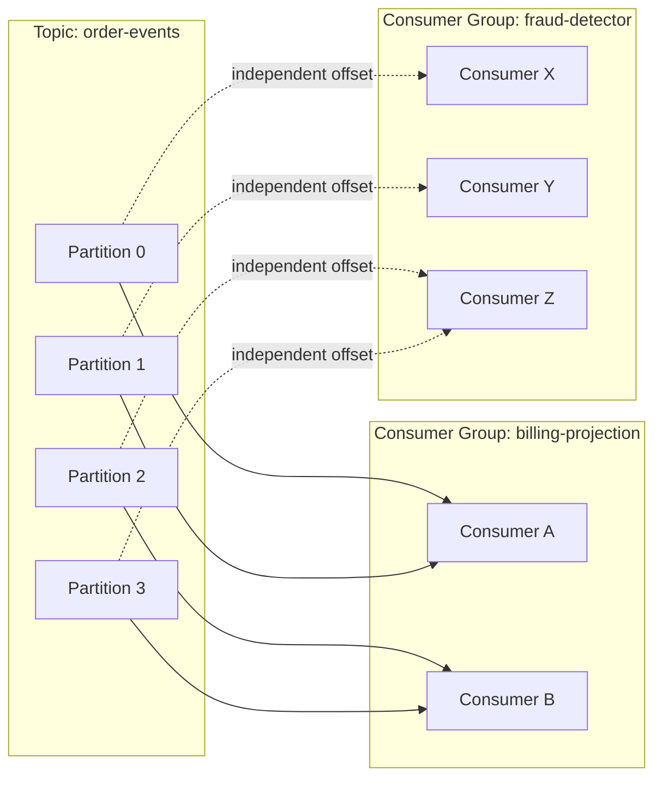
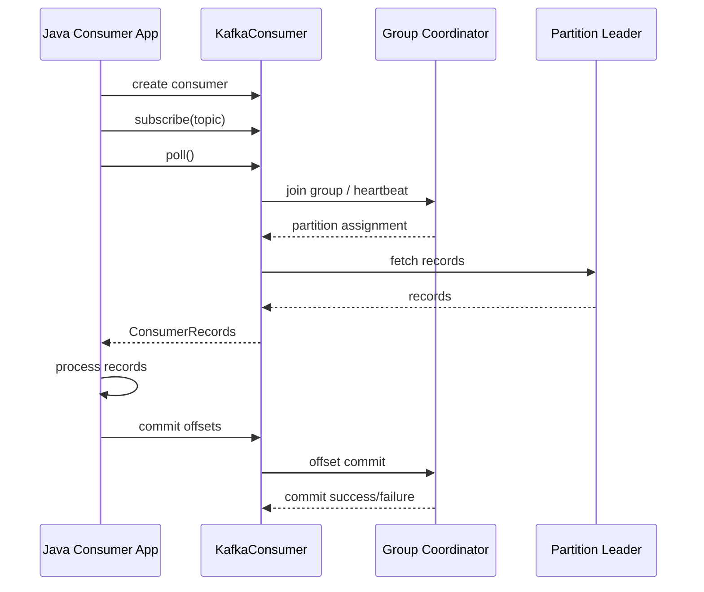
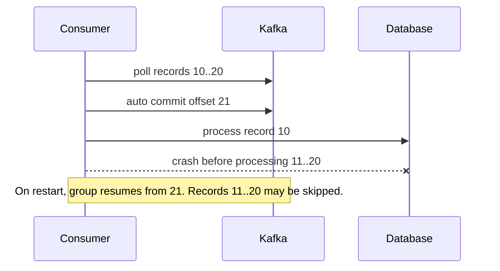
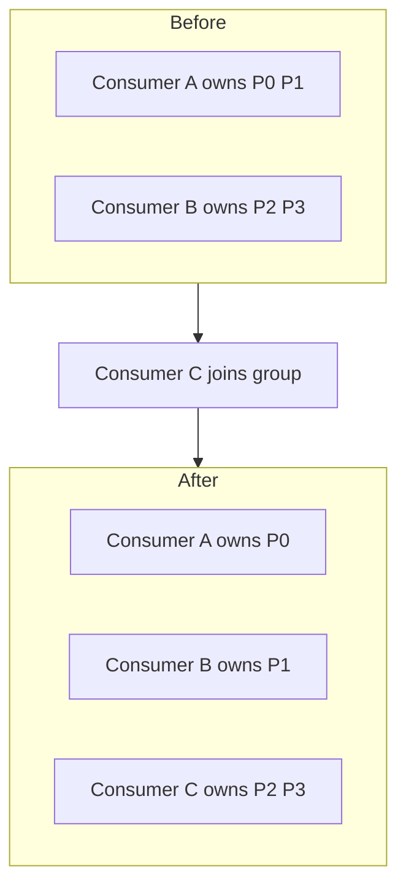
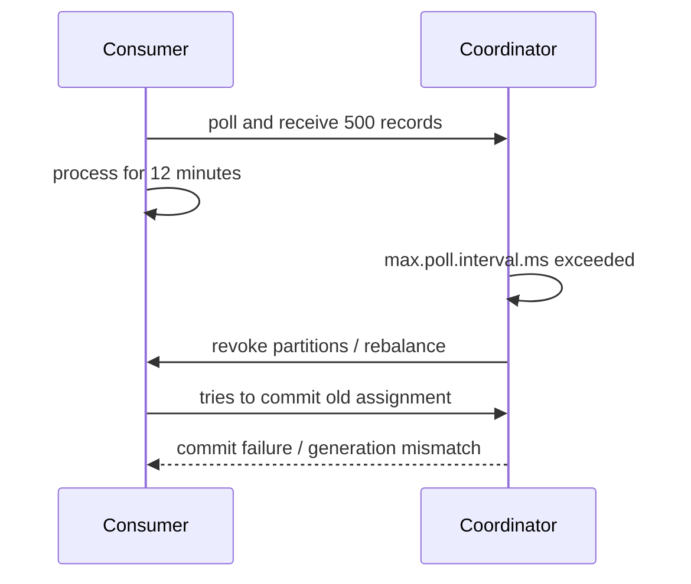
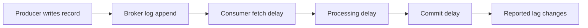
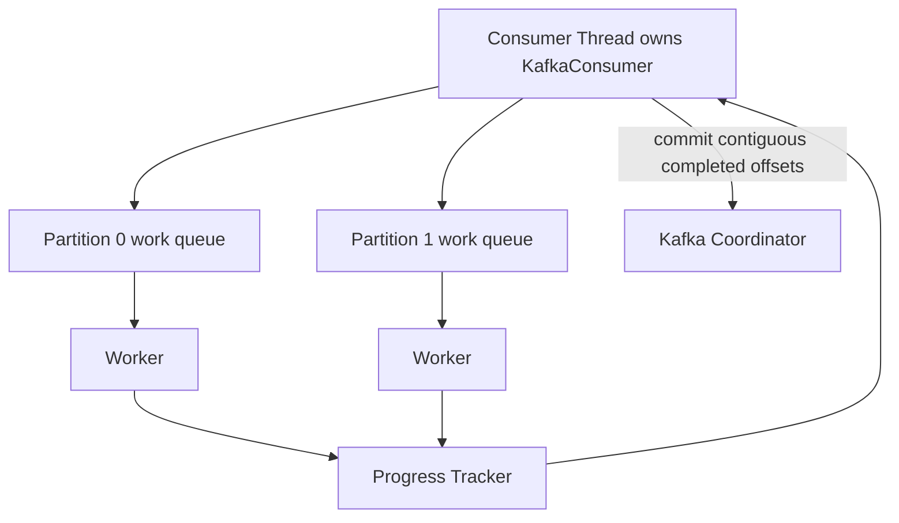
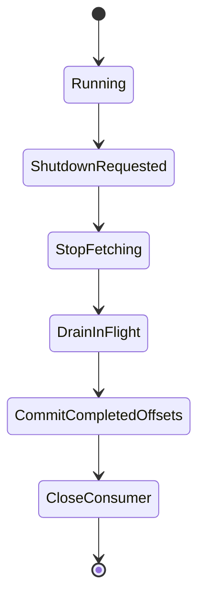

# Part 009 — Consumer Groups and Offset Ownership

This part is about the mechanics that make Kafka consumption scalable and dangerous at the same time.

A producer writes records into topic partitions. A consumer does not simply "read a topic". A consumer belongs to a **consumer group**, receives ownership of some partitions, reads from those partitions, processes records, and commits offsets that represent group progress.

The correctness of a Kafka consumer is mostly determined by one invariant:

> A committed offset must mean: every record before that offset for that partition has been processed durably according to the consumer's contract.

If that invariant is false, the system lies to itself. It may skip records, repeat side effects, corrupt projections, or silently violate audit requirements.

---

## 1. Kaufman Skill Decomposition

Josh Kaufman's useful framing is: deconstruct the skill, learn enough to self-correct, remove practice barriers, and practice deliberately. For Kafka consumption, the skill is not "call `poll()` and loop". The skill is understanding **ownership + progress + failure**.

### 1.1 Subskills

| Subskill | What You Need to Become Fluent In |
|---|---|
| Partition ownership | Which consumer owns which partition at a point in time. |
| Offset semantics | Difference between fetched position, processed offset, committed offset, end offset, and lag. |
| Poll loop control | How `poll()`, processing, commit, heartbeat, and rebalance interact. |
| Rebalance reasoning | What happens when consumers join, leave, pause, crash, or exceed poll interval. |
| Commit strategy | Auto commit, sync commit, async commit, partition-aware commit, commit on revoke. |
| Parallel processing | How to process concurrently without breaking offset correctness. |
| Recovery | How a restarted consumer resumes and what it may repeat or skip. |
| Observability | Which metrics reveal stuck, slow, unstable, or incorrect consumers. |

### 1.2 Practice Target

By the end of this part, you should be able to design a consumer and answer these questions without guessing:

1. What exactly does this consumer group commit?
2. Is the offset committed before or after the side effect?
3. What happens if the process crashes between processing and commit?
4. What happens if the consumer is too slow and exceeds `max.poll.interval.ms`?
5. What happens during partition revocation?
6. Is duplicate processing acceptable, prevented, or dangerous?
7. Can this consumer process records concurrently without committing ahead of unfinished work?

---

## 2. Mental Model: Consumer Group as Partition Ownership Protocol

A Kafka topic can have many partitions. A consumer group is a named set of consumers that collaboratively consume those partitions.

Within a single consumer group:

- one partition is assigned to at most one active consumer at a time;
- one consumer can own multiple partitions;
- adding consumers beyond the number of partitions does not increase parallelism for that topic;
- the group stores committed offsets independently from other groups;
- different groups can consume the same topic independently.



A consumer group is not a queue in the traditional sense. It is a **distributed cursor management and partition assignment mechanism**.

---

## 3. Core Vocabulary

### 3.1 Topic Partition

A topic partition is the unit of:

- ordering;
- parallelism;
- ownership;
- offset progress;
- replay;
- lag measurement.

If a topic has 12 partitions, the maximum useful consumer parallelism for one group reading that topic is usually 12 consumers. More consumers can exist, but some will be idle for that topic.

### 3.2 Offset

An offset is the position of a record within a partition.

Offsets are not global. Offset `42` in partition `0` is unrelated to offset `42` in partition `1`.

A critical detail: Kafka commits the **next offset to read**, not "the offset just processed".

If records `10`, `11`, and `12` have been processed safely, the committed offset should become `13`.

```text
records:          10    11    12    13    14
processed:        yes   yes   yes   no    no
committed offset: 13
meaning:          resume from 13
```

### 3.3 Position vs Committed Offset

A consumer has several positions that engineers often confuse.

| Concept | Meaning |
|---|---|
| Current position | The next offset the consumer client will fetch from its local view. |
| Fetched record offset | The offset of a record returned by `poll()`. |
| Processed offset | The last offset for which business processing succeeded. |
| Committed offset | The next offset persisted as group progress. |
| End offset | The current end of the partition log. |
| Lag | Difference between end offset and committed/current consumed position, depending on metric definition. |

A consumer can fetch records and advance its local position without committing them. That means it may have records in memory that Kafka considers unprocessed from the group progress perspective.

### 3.4 Consumer Group ID

`group.id` identifies the logical consumer group.

Two applications with the same `group.id` share partition ownership and offsets. Two applications with different `group.id`s consume independently.

This is powerful and risky:

- same `group.id` for replicas of the same service: correct;
- same `group.id` accidentally reused by another service: dangerous;
- new `group.id` for backfill/replay: useful;
- random `group.id` on every deployment: usually a disaster because it defeats stable progress.

### 3.5 Group Coordinator

Kafka assigns a broker as group coordinator. The coordinator manages group membership, receives heartbeats, triggers rebalances, and stores offset commits in Kafka's internal offset storage.

You rarely interact with the coordinator directly, but you see its consequences through:

- rebalances;
- commit failures;
- member timeouts;
- assignment changes;
- generation mismatch errors.

### 3.6 Generation

A generation is a version of group membership and assignment.

When a rebalance occurs, the group moves to a new generation. Commits from an old generation may fail because the consumer may no longer own the partition it is trying to commit.

This is why committing during rebalance callbacks matters.

---

## 4. Consumer Lifecycle

A Java consumer usually follows this shape:

```java
Properties props = new Properties();
props.put(ConsumerConfig.BOOTSTRAP_SERVERS_CONFIG, "localhost:9092");
props.put(ConsumerConfig.GROUP_ID_CONFIG, "billing-projection");
props.put(ConsumerConfig.KEY_DESERIALIZER_CLASS_CONFIG, StringDeserializer.class.getName());
props.put(ConsumerConfig.VALUE_DESERIALIZER_CLASS_CONFIG, StringDeserializer.class.getName());
props.put(ConsumerConfig.ENABLE_AUTO_COMMIT_CONFIG, "false");

try (KafkaConsumer<String, String> consumer = new KafkaConsumer<>(props)) {
    consumer.subscribe(List.of("order-events"));

    while (running) {
        ConsumerRecords<String, String> records = consumer.poll(Duration.ofMillis(500));

        for (ConsumerRecord<String, String> record : records) {
            process(record);
        }

        consumer.commitSync();
    }
}
```

This is the beginner version. Production-grade consumers need stronger reasoning around commits, errors, partition revocation, slow processing, and shutdown.

### 4.1 Lifecycle Diagram



The application thread drives the consumer. If the application stops polling for too long, the consumer group can assume it is unhealthy and trigger rebalance.

---

## 5. The Offset Commit Invariant

The strongest mental model is this:

```text
committed offset N for partition P
= "this group promises it no longer needs records with offset < N from P"
```

Therefore:

- committing too early risks data loss;
- committing too late risks duplicates;
- committing out of order risks both data loss and duplicates;
- committing without idempotent processing is unsafe for non-repeatable side effects;
- committing during partition revocation must only include finished work.

### 5.1 Commit Example

Suppose a consumer reads records from partition `orders-0`:

```text
poll returns offsets: 100, 101, 102
```

After processing all three successfully, commit:

```text
TopicPartition("orders", 0) -> OffsetAndMetadata(103)
```

Not `102`. The committed offset is the next offset to read.

### 5.2 Commit Map Example

```java
TopicPartition partition = new TopicPartition("order-events", 0);
OffsetAndMetadata nextOffset = new OffsetAndMetadata(record.offset() + 1);
consumer.commitSync(Map.of(partition, nextOffset));
```

This is useful when different partitions progress at different speeds.

---

## 6. Auto Commit vs Manual Commit

### 6.1 Auto Commit

With auto commit, the consumer periodically commits offsets for records returned by `poll()`.

```properties
enable.auto.commit=true
auto.commit.interval.ms=5000
```

This is simple, but dangerous for many business consumers. Auto commit can mark records as consumed before the side effect is durable.



Auto commit can be acceptable for:

- metrics/log aggregation where occasional loss is tolerable;
- stateless best-effort consumers;
- prototype applications;
- consumers whose processing happens fully before the next auto commit interval and where loss is acceptable.

It is usually not acceptable for:

- payment workflows;
- order state machines;
- regulatory audit events;
- projections that must be reconstructable;
- email/SMS dispatch without idempotency;
- inventory mutation;
- compliance reporting.

### 6.2 Manual Commit

With manual commit:

```properties
enable.auto.commit=false
```

The application decides when offsets are safe to commit.

Manual commit makes correctness possible, but not automatic. A manual commit placed in the wrong location is still wrong.

---

## 7. `commitSync()` vs `commitAsync()`

### 7.1 `commitSync()`

`commitSync()` blocks until the commit succeeds or fails unrecoverably.

Use it when correctness matters more than commit latency:

- during shutdown;
- during partition revocation;
- after a critical batch;
- before releasing ownership-sensitive resources.

Downside: it adds latency and can reduce throughput if called too often.

### 7.2 `commitAsync()`

`commitAsync()` does not block the poll loop. It can improve throughput, but introduces ordering hazards.

Imagine:

1. async commit offset `100` is sent;
2. async commit offset `200` is sent;
3. commit `200` succeeds;
4. commit `100` callback returns later and fails/retries incorrectly.

A naive retry of the older commit can move group progress backward or create confusing recovery behavior.

A safer pattern is:

- use async commit during normal processing;
- do not retry old async commits blindly;
- use sync commit on shutdown/rebalance;
- track monotonic offsets per partition.

### 7.3 Practical Rule

For business-critical consumers, start with `commitSync()` after bounded batches. Optimize only after you can prove commit latency is the bottleneck.

---

## 8. Rebalance Mental Model

A rebalance happens when the consumer group membership or subscribed topic metadata changes. Kafka must redistribute partitions among active group members.

Triggers include:

- consumer starts;
- consumer shuts down;
- consumer crashes;
- consumer misses heartbeats/session timeout;
- consumer exceeds max poll interval;
- topic partition count changes;
- subscription changes;
- deployment rollout;
- network instability.

### 8.1 Before and After Rebalance



During rebalance, a consumer may lose partitions. Once a partition is revoked, the consumer must not keep processing and committing offsets for that partition unless the framework provides a safe handoff model.

### 8.2 Rebalance Is a Correctness Event

A rebalance is not merely a performance event. It changes ownership.

Before losing a partition, a consumer should:

1. stop accepting new work for that partition;
2. finish or cancel in-flight work;
3. commit only offsets for completed records;
4. release partition-scoped resources;
5. allow the new owner to continue safely.

---

## 9. ConsumerRebalanceListener

Java consumers can register a `ConsumerRebalanceListener` when subscribing.

```java
consumer.subscribe(List.of("order-events"), new ConsumerRebalanceListener() {
    @Override
    public void onPartitionsRevoked(Collection<TopicPartition> partitions) {
        // Commit offsets for completed work before losing ownership.
        consumer.commitSync(currentOffsetsFor(partitions));
    }

    @Override
    public void onPartitionsAssigned(Collection<TopicPartition> partitions) {
        // Initialize partition-local state if needed.
    }
});
```

This callback is where many production bugs live.

Common mistakes:

- committing offsets for work still running in worker threads;
- ignoring partition revocation entirely;
- blocking too long in the callback;
- reinitializing state without reading committed offset;
- treating assignment as stable forever.

---

## 10. Eager, Cooperative, Static, and Newer Rebalance Models

### 10.1 Eager Rebalance

Classic eager rebalance revokes all partitions from all members, then assigns again.

Pros:

- simpler mental model;
- works broadly;
- easy to reason about from scratch.

Cons:

- stop-the-world effect for the group;
- expensive for stateful consumers;
- high latency during deployments;
- unnecessary movement of partitions.

### 10.2 Cooperative Rebalance

Cooperative rebalancing tries to move only partitions that must move.

Pros:

- reduced disruption;
- better for Kafka Streams and stateful consumers;
- fewer unnecessary revocations.

Cons:

- more subtle callback behavior;
- consumers may keep some partitions while giving up others;
- application code must handle partial revocation correctly.

### 10.3 Static Membership

Static membership uses stable member identity so restarts do not always look like entirely new members.

This is useful for:

- rolling deployments;
- stateful consumers;
- reducing reassignment churn;
- predictable partition ownership.

But static membership is not magic. If a member is truly gone, the group must still recover.

### 10.4 Next-Generation Consumer Rebalance Protocol

Modern Kafka versions include improvements to consumer group rebalance protocols, including a newer protocol designed to reduce rebalance cost and improve scalability. The exact operational choice depends on Kafka version, client version, and platform support.

Treat rebalance protocol selection as part of production compatibility planning, not a random tuning flag.

---

## 11. `poll()` Is More Than Fetch

`poll()` does more than retrieve records. It also drives consumer group coordination.

A healthy consumer must call `poll()` often enough to:

- send heartbeats or participate in heartbeat-driven group management;
- handle rebalances;
- fetch records;
- maintain liveness;
- avoid `max.poll.interval.ms` violations.

If processing a batch takes too long, the consumer may be considered stuck even if the process is alive.

### 11.1 Common Slow Consumer Failure



The fix is not always "increase `max.poll.interval.ms`". Sometimes the fix is:

- reduce `max.poll.records`;
- make processing bounded;
- use pause/resume;
- split slow workloads;
- move blocking I/O away from partition ownership thread carefully;
- add backpressure;
- improve downstream latency.

---

## 12. Important Consumer Configurations

### 12.1 Offset Management

| Config | Meaning | Production Guidance |
|---|---|---|
| `enable.auto.commit` | Whether offsets are committed automatically. | Use `false` for business-critical consumers. |
| `auto.commit.interval.ms` | Auto commit frequency. | Relevant only when auto commit is enabled. |
| `auto.offset.reset` | Start position when no committed offset exists. | Use intentionally: `earliest`, `latest`, or `none`. |

`auto.offset.reset` is often misunderstood. It does not reset offsets every time the consumer starts. It applies when there is no valid committed offset for the group/partition or when the offset is out of range.

### 12.2 Liveness and Polling

| Config | Meaning | Failure Mode |
|---|---|---|
| `session.timeout.ms` | How long coordinator waits without detecting consumer liveness. | Too low causes false evictions under GC/network jitter. |
| `heartbeat.interval.ms` | Heartbeat cadence. | Must be lower than session timeout. |
| `max.poll.interval.ms` | Max time between `poll()` calls. | Long processing can trigger rebalance. |
| `max.poll.records` | Max records returned in one poll. | Too high can create long processing batches. |

### 12.3 Fetch and Throughput

| Config | Meaning | Trade-off |
|---|---|---|
| `fetch.min.bytes` | Broker waits for at least this much data if available. | Higher throughput, potentially higher latency. |
| `fetch.max.wait.ms` | Max wait time for fetch response. | Bounds latency when traffic is low. |
| `max.partition.fetch.bytes` | Max bytes per partition in fetch. | Needed for large records, impacts memory. |
| `fetch.max.bytes` | Max bytes per fetch response. | Controls memory/network batch size. |

### 12.4 Assignment Strategy

| Config | Meaning |
|---|---|
| `partition.assignment.strategy` | Determines how partitions are assigned among consumers. |
| `group.instance.id` | Enables static membership when configured. |

Choose assignment strategy deliberately. Randomly changing it during deployment can trigger wider movement than expected.

---

## 13. Subscribe vs Assign

### 13.1 `subscribe()`

`subscribe()` participates in consumer group management.

```java
consumer.subscribe(List.of("order-events"));
```

Use it for normal scalable service consumption.

Pros:

- automatic partition assignment;
- group offset management;
- horizontal scaling;
- rebalance support.

Cons:

- must handle rebalances;
- less direct control over partition ownership.

### 13.2 `assign()`

`assign()` manually assigns partitions.

```java
TopicPartition p0 = new TopicPartition("order-events", 0);
consumer.assign(List.of(p0));
consumer.seek(p0, 0L);
```

Use it for:

- admin tools;
- replay jobs;
- targeted debugging;
- custom partition processors;
- migration/backfill utilities.

Avoid using `assign()` as a replacement for consumer groups in normal services unless you are prepared to build your own ownership and failover model.

---

## 14. Offset Reset and Replay

### 14.1 New Group

If a new consumer group has no committed offsets, `auto.offset.reset` determines where it starts.

```properties
auto.offset.reset=earliest
```

starts from the earliest retained offset.

```properties
auto.offset.reset=latest
```

starts from new records written after the consumer begins.

```properties
auto.offset.reset=none
```

fails if no offset exists. This is useful when accidental new groups are dangerous.

### 14.2 Explicit Seek

For controlled replay, use `seek()` after assignment.

```java
consumer.assign(List.of(partition));
consumer.seek(partition, replayOffset);
```

For service consumers, avoid hidden replay behavior. Replays should be visible, planned, and often use separate group IDs or dedicated jobs.

---

## 15. Lag: Useful but Not Sufficient

Consumer lag is usually the difference between produced position and consumed/committed position.

Lag is useful for detecting backlog, but lag alone does not tell you:

- whether processing is correct;
- whether records are failing repeatedly;
- whether offsets are being committed too early;
- whether side effects are durable;
- whether one partition is hot;
- whether event timestamps are stale;
- whether the consumer is stuck on poison records.

### 15.1 Lag Decomposition



High lag can mean:

- producer rate increased;
- consumer processing slowed;
- downstream dependency degraded;
- partition skew;
- rebalance storm;
- broker fetch latency;
- large messages;
- blocked commit;
- poison pill loop.

Low lag can also be misleading if offsets are committed before processing.

---

## 16. Safe Single-Threaded Consumer Pattern

The simplest correct pattern is often a single poll/process/commit loop.

```java
public final class ReliableBatchConsumer implements Runnable {
    private final KafkaConsumer<String, OrderEvent> consumer;
    private volatile boolean running = true;

    public ReliableBatchConsumer(KafkaConsumer<String, OrderEvent> consumer) {
        this.consumer = consumer;
    }

    @Override
    public void run() {
        try {
            consumer.subscribe(List.of("order-events"));

            while (running) {
                ConsumerRecords<String, OrderEvent> records = consumer.poll(Duration.ofMillis(500));
                if (records.isEmpty()) {
                    continue;
                }

                for (ConsumerRecord<String, OrderEvent> record : records) {
                    processOne(record);
                }

                consumer.commitSync();
            }
        } finally {
            try {
                consumer.commitSync();
            } finally {
                consumer.close();
            }
        }
    }

    public void shutdown() {
        running = false;
        consumer.wakeup();
    }
}
```

This pattern gives at-least-once processing if `processOne()` completes before commit and side effects are durable.

Weaknesses:

- one slow record blocks the whole consumer;
- commit after whole batch can repeat the whole batch on crash;
- no partition-specific progress;
- no advanced error handling.

Still, it is much safer than a premature multi-threaded design.

---

## 17. Partition-Aware Commit Pattern

When records from multiple partitions are processed, commit offsets per partition.

```java
Map<TopicPartition, OffsetAndMetadata> offsets = new HashMap<>();

for (ConsumerRecord<String, OrderEvent> record : records) {
    processOne(record);

    TopicPartition tp = new TopicPartition(record.topic(), record.partition());
    offsets.put(tp, new OffsetAndMetadata(record.offset() + 1));
}

consumer.commitSync(offsets);
```

This is better than whole-consumer commit when some partitions progress and others fail.

But be careful: if processing later records in the same partition succeeds while an earlier record fails, you must not commit past the failed earlier record.

---

## 18. Parallel Processing Is an Offset Problem

The Java `KafkaConsumer` itself is not thread-safe. You should not call `poll()`, `commitSync()`, `seek()`, `pause()`, or `resume()` concurrently from arbitrary worker threads.

A common safe architecture is:

- one consumer thread owns the `KafkaConsumer`;
- worker threads process records;
- progress is reported back to the consumer thread;
- commits happen only from the consumer thread;
- commits advance only through contiguous completed offsets per partition.



The hard part is **contiguous progress**.

Suppose partition `0` has records:

```text
10, 11, 12, 13
```

Workers finish:

```text
10 done
11 still running
12 done
13 done
```

The safe committed offset is `11`, not `14`, because record `11` is incomplete.

---

## 19. Pause and Resume for Backpressure

`pause()` and `resume()` let the consumer stop fetching from specific partitions without leaving the group.

Use cases:

- worker queue for a partition is full;
- downstream dependency is degraded;
- partition contains slow records;
- maintain `poll()` cadence while not accepting more data;
- avoid `max.poll.interval.ms` violation.

Conceptual pattern:

```java
if (workerQueue.isFull(tp)) {
    consumer.pause(List.of(tp));
}

if (workerQueue.hasCapacity(tp)) {
    consumer.resume(List.of(tp));
}
```

Pause does not commit offsets and does not release partition ownership. It is local flow control.

---

## 20. Shutdown Protocol

A Kafka consumer shutdown is a correctness event.

A safe shutdown should:

1. stop accepting new work;
2. wake up the polling thread;
3. finish or cancel in-flight work according to policy;
4. commit completed offsets;
5. close the consumer;
6. release resources.



Do not just kill the process and assume Kubernetes/systemd will make it correct. It may make it restart, not correct.

---

## 21. Failure Matrix

| Failure | What Happens | Safe Design Response |
|---|---|---|
| Crash before processing | Offset not committed; record will be retried. | Accept duplicate potential. |
| Crash after processing before commit | Side effect done; offset not committed; duplicate on restart. | Make side effect idempotent. |
| Commit before processing then crash | Offset advanced; record skipped. | Do not commit early for critical work. |
| Rebalance during processing | Partition ownership may move. | Commit completed offsets on revoke; stop revoked work. |
| Slow batch exceeds poll interval | Consumer removed from group. | Bound batch time; pause/resume; reduce `max.poll.records`. |
| Poison pill repeatedly fails | Consumer stuck at same offset. | Retry/DLQ policy; classify error. |
| Downstream DB slow | Lag increases; poll interval risk. | Backpressure, queue bounds, circuit breaker. |
| Async commit callback arrives late | Commit order confusion. | Track monotonic offsets; sync on close/revoke. |

---

## 22. Decision Framework

### 22.1 Choose Commit Strategy

| Requirement | Suggested Strategy |
|---|---|
| Best-effort telemetry | Auto commit may be acceptable. |
| Business state projection | Manual commit after durable write. |
| External side effect like email | Manual commit + idempotency key. |
| High-throughput analytics | Batched manual commit, tolerate duplicates. |
| Regulatory/audit workflow | Manual commit + immutable processing ledger + replay plan. |
| Long processing per record | Pause/resume or decouple from consumer thread carefully. |

### 22.2 Choose Consumer Group ID Strategy

| Situation | Group ID Choice |
|---|---|
| Normal service replicas | Stable service-specific group ID. |
| Blue/green same logical service | Be explicit: same group for handover, different group for shadow. |
| Backfill job | Dedicated replay group ID or manual assignment. |
| Debug one partition | Manual assign/seek, not production group. |
| Shadow consumer | Different group ID. |

### 22.3 Choose Poll Size

| Symptom | Likely Adjustment |
|---|---|
| Processing exceeds poll interval | Reduce `max.poll.records` or process asynchronously with pause/resume. |
| Too many commits | Commit per batch rather than per record. |
| High memory usage | Lower fetch sizes and max records. |
| Low throughput | Increase fetch/batch sizes after measuring processing bottleneck. |
| Hot partition lag | Fix partition key or split workload; adding consumers alone may not help. |

---

## 23. Observability Checklist

Monitor at least:

- consumer lag per topic-partition;
- records consumed rate;
- records processed rate;
- commit latency and commit failure count;
- rebalance count and duration;
- assigned partitions per instance;
- poll loop latency;
- processing latency per record/batch;
- time since last successful poll;
- time since last successful commit;
- DLQ/retry rate;
- downstream dependency latency;
- worker queue depth if parallel processing exists;
- partition skew.

### 23.1 Alert Smells

Alerting only on total group lag is weak. Better alerts combine symptoms:

```text
high lag + low processing rate + high DB latency = downstream bottleneck
high rebalance count + deployment = rollout assignment churn
high rebalance count + no deployment = liveness/network/GC issue
low lag + high failure rate = possible premature commit or DLQ drain issue
one partition high lag + others low = key skew or poison pill
```

---

## 24. Architecture Review Questions

Use these questions in design review:

1. What is the `group.id`, and who owns it?
2. Is `enable.auto.commit` disabled for critical processing?
3. What exact side effect happens before commit?
4. Is the side effect idempotent?
5. What offset is committed after a record succeeds?
6. What happens on crash after side effect but before commit?
7. What happens during partition revocation?
8. How long can processing take relative to `max.poll.interval.ms`?
9. Is processing single-threaded, partition-threaded, or unordered parallel?
10. How is contiguous completed offset tracked?
11. Is there a replay plan?
12. How will we detect rebalance storms?
13. Is lag measured per partition, not only per topic/group?
14. What happens if one record is poison?
15. Does the consumer own any external locks/resources per partition?

---

## 25. Deliberate Practice Lab

### Lab 1 — Offset Commit Crash Matrix

Build a local consumer that writes consumed events to a database table.

Run three variants:

1. commit before DB insert;
2. commit after DB insert;
3. commit after idempotent DB upsert.

Inject a crash at these points:

- before processing;
- after DB write before commit;
- after commit before DB write;
- during batch processing.

Record whether the result is:

- skipped record;
- duplicate side effect;
- safe replay;
- stuck consumer.

### Lab 2 — Rebalance During Processing

Start a topic with four partitions and a consumer group with two instances.

1. Make processing sleep for 30 seconds per record.
2. Start a third instance.
3. Observe partition revocation.
4. Add `ConsumerRebalanceListener`.
5. Commit only completed offsets on revoke.
6. Compare behavior before and after.

### Lab 3 — Hot Partition Lag

Produce records with only one key into a topic with six partitions.

Observe:

- one partition has all records;
- only one consumer processes meaningful load;
- adding consumers does not fix throughput.

Then change key cardinality and compare.

---

## 26. Production Defaults Starting Point

These are not universal, but they are safer starting points for critical Java consumers:

```properties
enable.auto.commit=false
auto.offset.reset=none
max.poll.records=100
max.poll.interval.ms=300000
isolation.level=read_committed
```

Use `auto.offset.reset=none` when accidental new groups are dangerous. Use `earliest` deliberately for bootstrap/replay consumers.

`isolation.level=read_committed` matters when reading from transactional producers and you do not want uncommitted transactional records.

---

## 27. Common Anti-Patterns

### 27.1 Auto Commit in a Business Workflow

Symptom:

```properties
enable.auto.commit=true
```

with DB writes, external API calls, or workflow transitions.

Risk: offset may advance before processing is durable.

### 27.2 One Consumer Group Shared by Two Logical Services

Two services accidentally use the same `group.id` and split partitions between them.

Risk: each service sees only part of the topic.

### 27.3 Commit Latest Offset in Batch After Partial Failure

Processing records `100..199`, record `142` fails, but consumer commits `200`.

Risk: record `142` is skipped.

### 27.4 Parallel Processing Without Contiguous Offset Tracking

Workers finish out of order and commit the highest completed offset.

Risk: unfinished lower offsets are skipped after crash.

### 27.5 Increasing `max.poll.interval.ms` Forever

This hides slow processing instead of controlling work size.

Risk: long recovery times, slow rebalances, high duplicate window, bad deploy behavior.

---

## 28. Mental Model Summary

A Kafka consumer group is a partition ownership protocol plus an offset ledger.

The central invariant is:

```text
Commit offset N only when all records with offset < N in that partition are durably processed.
```

Everything else follows from that:

- auto commit is dangerous when processing is not complete;
- manual commit is necessary but not sufficient;
- rebalance is ownership transfer;
- slow processing can remove the consumer from the group;
- parallel processing requires contiguous offset tracking;
- lag is useful but not proof of correctness;
- idempotency is required whenever duplicate processing can happen.

---

## 29. References

- Apache Kafka Documentation: https://kafka.apache.org/documentation/
- Apache Kafka Consumer Rebalance Protocol: https://kafka.apache.org/43/operations/consumer-rebalance-protocol/
- Confluent Kafka Consumer Design: https://docs.confluent.io/kafka/design/consumer-design.html
- Confluent Consumer Configuration Reference: https://docs.confluent.io/platform/current/installation/configuration/consumer-configs.html
- Confluent Kafka Consumer Guide: https://docs.confluent.io/platform/current/clients/consumer.html
- KafkaConsumer Javadocs: https://javadoc.io/doc/org.apache.kafka/kafka-clients/latest/org/apache/kafka/clients/consumer/KafkaConsumer.html
