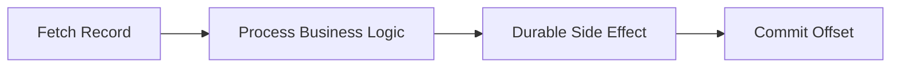
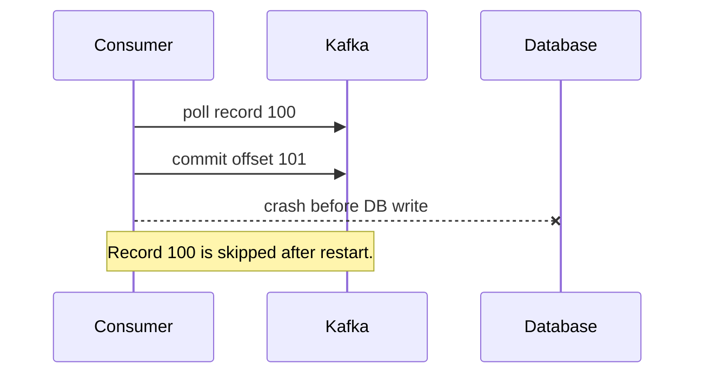
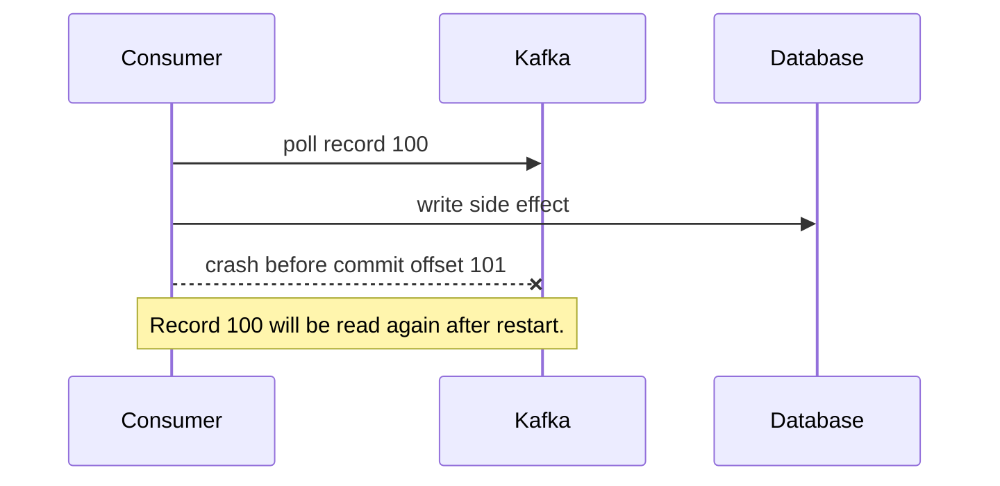
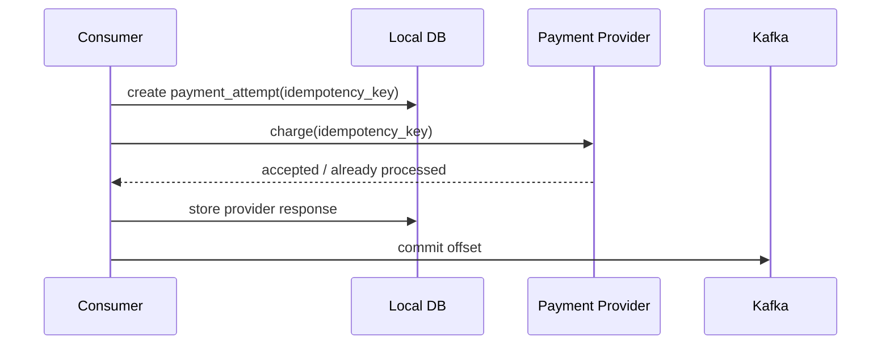
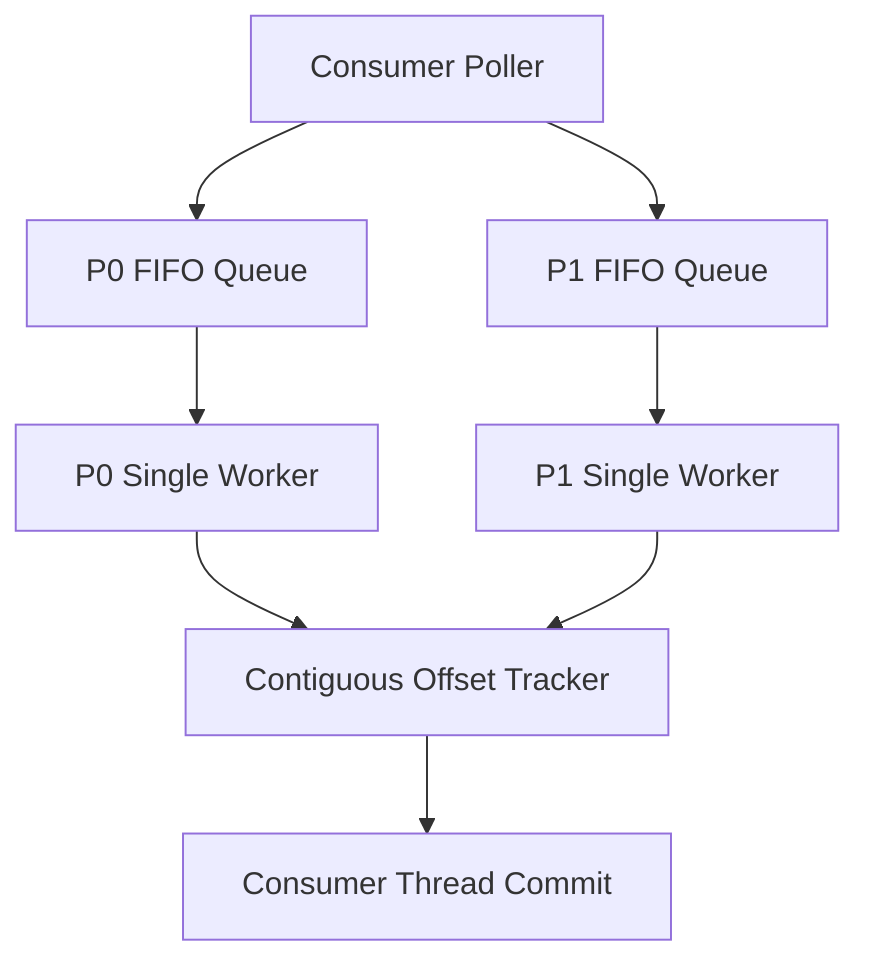
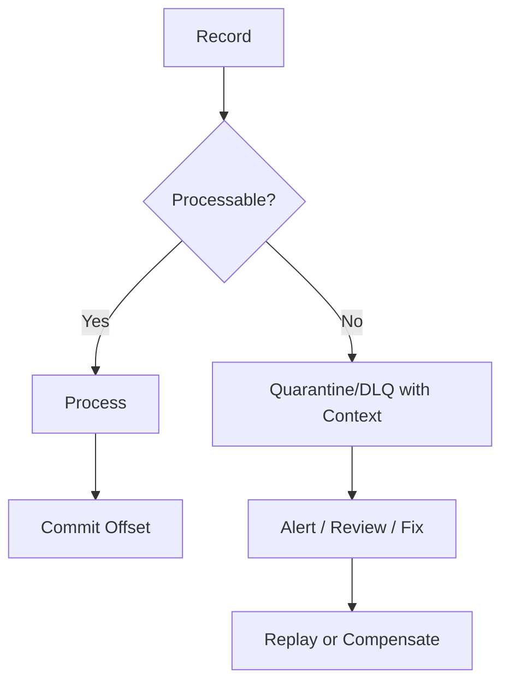
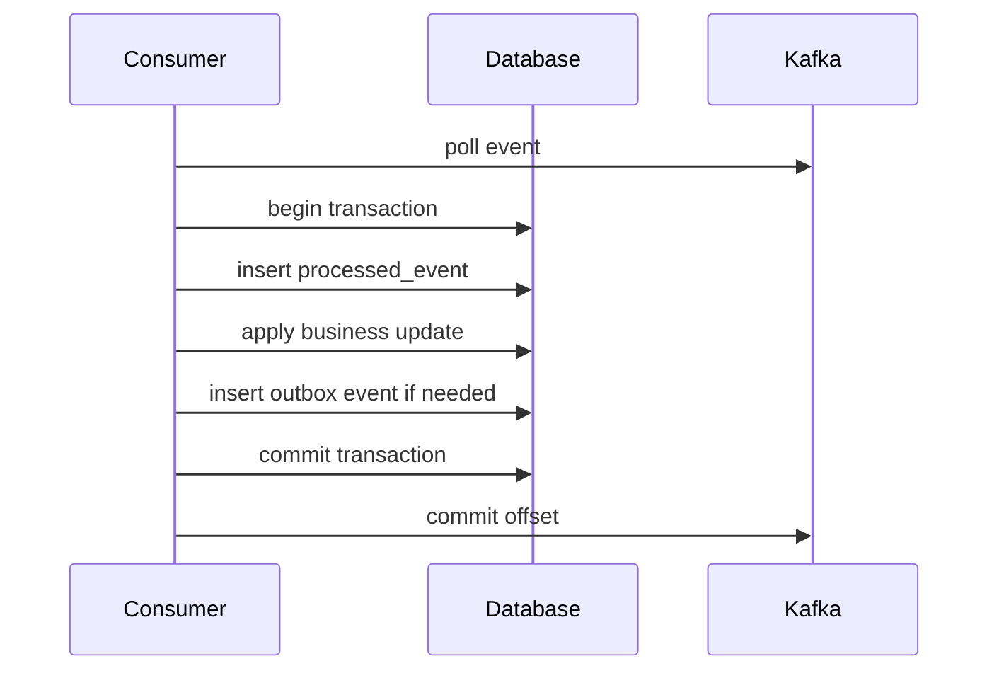

# Part 010 — Consumer Correctness Patterns

Part 009 explained how consumer groups own partitions and commit offsets. This part answers the more important question:

> How do we make a Kafka consumer correct when crashes, retries, duplicates, rebalances, and downstream failures are normal?

A Kafka consumer is correct only relative to a contract. "Correct" may mean best-effort logging, exactly one account balance mutation, monotonic case-state projection, an eventually consistent read model, or an auditable workflow transition. These are not the same problem.

This part focuses on practical Java consumer correctness patterns.

---

## 1. Kaufman Skill Decomposition

The skill is not memorizing delivery guarantee names. The skill is designing the relationship between:

- record consumption;
- business processing;
- side effects;
- offset commit;
- retry;
- deduplication;
- recovery.

### 1.1 Subskills

| Subskill | Production Meaning |
|---|---|
| Delivery semantics | Know what can be lost, duplicated, repeated, or skipped. |
| Commit placement | Place commits after the correct durability boundary. |
| Idempotent side effects | Make duplicate processing safe. |
| Deduplication | Track processed event identity when side effects are not naturally idempotent. |
| Ordering control | Avoid committing past unfinished earlier records. |
| Error classification | Separate transient, permanent, poison, and infrastructure errors. |
| Replay safety | Make backfills and reprocessing predictable. |
| Concurrency safety | Process in parallel without breaking partition order and offset rules. |

---

## 2. The Core Correctness Equation

A consumer loop has four conceptual steps:

```text
fetch record -> process -> make side effect durable -> commit offset
```

Changing the order changes the semantics.



The central equation:

```text
Correctness = delivery semantics + idempotency + commit discipline + error policy
```

Kafka can help with delivery and ordering inside partitions. It cannot automatically make your database write, REST call, email send, cache update, or workflow transition correct.

---

## 3. Delivery Semantics Refresher

### 3.1 At-Most-Once

A record is processed zero or one time.

This usually means committing before processing.



Use only when loss is acceptable.

Examples:

- non-critical metrics;
- debug event sampling;
- lossy analytics;
- cache warming where source of truth exists elsewhere.

Avoid for:

- financial mutation;
- regulatory state transition;
- case lifecycle progression;
- customer notification that must be auditable;
- inventory mutation;
- entitlement provisioning.

### 3.2 At-Least-Once

A record is processed one or more times.

This usually means processing first, then committing offset.



At-least-once is often the right baseline, but only if duplicate side effects are safe.

### 3.3 Effectively-Once

Effectively-once means duplicates may happen at the Kafka delivery level, but the externally visible business effect happens once according to the business key.

This is usually implemented with:

- idempotency key;
- unique constraint;
- upsert;
- event version check;
- monotonic state transition;
- processed-event ledger;
- transactional write of business effect and dedup marker.

Effectively-once is often the practical target for Java business services.

### 3.4 Exactly-Once

Kafka has exactly-once semantics for specific Kafka read-process-write scenarios using idempotent producers and transactions. Kafka Streams can use exactly-once processing semantics for Kafka-in/Kafka-out topologies.

But that does not automatically make arbitrary external systems exactly once.

If a consumer reads Kafka and calls a third-party HTTP API, Kafka transactions cannot force that external API to roll back.

---

## 4. Side Effect Taxonomy

Before designing a consumer, classify the side effect.

| Side Effect | Duplicate Risk | Preferred Pattern |
|---|---:|---|
| Insert immutable event row | Medium | Unique event ID. |
| Upsert projection by entity ID/version | Low if versioned | Monotonic version check. |
| Increment balance/counter | High | Ledger entry + derived balance, not blind increment. |
| Send email/SMS | High | Notification request ID + send ledger. |
| Call payment provider | Very high | Provider idempotency key + local transaction. |
| Update cache | Low | Idempotent overwrite; cache can rebuild. |
| Advance workflow state | High | State transition guard + command/event ID. |
| Publish another Kafka event | Medium | Transactional producer or outbox. |

Correctness starts by refusing to treat all side effects as equivalent.

---

## 5. Pattern 1 — At-Most-Once Consumer

### 5.1 Shape

```java
while (running) {
    ConsumerRecords<String, Event> records = consumer.poll(Duration.ofMillis(500));

    for (ConsumerRecord<String, Event> record : records) {
        consumer.commitSync(Map.of(
            new TopicPartition(record.topic(), record.partition()),
            new OffsetAndMetadata(record.offset() + 1)
        ));

        process(record); // May never happen if process crashes.
    }
}
```

### 5.2 When It Makes Sense

Use at-most-once when:

- data loss is acceptable;
- records are samples;
- another system remains source of truth;
- downstream cost of duplicates is worse than loss;
- the consumer is not part of a critical state machine.

### 5.3 Failure Mode

If the process crashes after commit but before processing, the record is skipped permanently for that group.

For most business domains, this is unacceptable.

---

## 6. Pattern 2 — Basic At-Least-Once Consumer

### 6.1 Shape

```java
while (running) {
    ConsumerRecords<String, Event> records = consumer.poll(Duration.ofMillis(500));

    for (ConsumerRecord<String, Event> record : records) {
        process(record); // Must finish durably before commit.
    }

    consumer.commitSync();
}
```

### 6.2 Guarantee

If processing succeeds and commit fails, the record may be processed again.

Therefore, the side effect must tolerate duplicates.

### 6.3 Example Use

A consumer builds a read model:

```java
void process(ConsumerRecord<String, OrderEvent> record) {
    OrderEvent event = record.value();
    projectionRepository.upsertOrderStatus(
        event.orderId(),
        event.version(),
        event.status()
    );
}
```

This is safe if `upsertOrderStatus` refuses to overwrite newer versions with older versions.

---

## 7. Pattern 3 — Idempotent Consumer with Unique Event ID

Every event should have a stable identity.

```json
{
  "eventId": "01JZ4Y2HVR7Q9Y2NJ5K40M5QJ8",
  "eventType": "OrderPaid",
  "aggregateId": "ORD-10001",
  "aggregateVersion": 7,
  "occurredAt": "2026-07-01T10:00:00Z",
  "payload": {}
}
```

A consumer can store `eventId` in a processed-event table.

### 7.1 Database Schema

```sql
create table processed_kafka_event (
    consumer_name text not null,
    event_id text not null,
    topic text not null,
    partition int not null,
    offset bigint not null,
    processed_at timestamptz not null default now(),
    primary key (consumer_name, event_id)
);
```

### 7.2 Transactional Dedup + Side Effect

```java
@Transactional
public void handle(ConsumerRecord<String, OrderEvent> record) {
    OrderEvent event = record.value();

    boolean firstTime = processedEventRepository.tryInsert(
        "billing-projection",
        event.eventId(),
        record.topic(),
        record.partition(),
        record.offset()
    );

    if (!firstTime) {
        return;
    }

    billingProjectionRepository.apply(event);
}
```

The important part is that the dedup marker and business side effect are committed in the same local transaction.

### 7.3 Crash Matrix

| Crash Point | Result |
|---|---|
| Before DB transaction | Event reprocessed. Safe. |
| During DB transaction | Transaction rolls back. Event reprocessed. Safe. |
| After DB commit before Kafka commit | Event reprocessed, dedup marker prevents duplicate side effect. Safe. |
| After Kafka commit | Event not reprocessed. Safe if side effect committed first. |

---

## 8. Pattern 4 — Versioned Projection Consumer

For state projections, event ID may be less important than aggregate version.

Example event:

```json
{
  "eventType": "CaseEscalated",
  "caseId": "CASE-9001",
  "caseVersion": 12,
  "newState": "ESCALATED",
  "occurredAt": "2026-07-01T10:15:00Z"
}
```

Projection update:

```sql
update case_projection
set state = :newState,
    version = :eventVersion,
    updated_at = now()
where case_id = :caseId
  and version < :eventVersion;
```

This makes duplicate or older events harmless.

### 8.1 Invariant

```text
Projection version must only move forward.
```

### 8.2 What This Solves

- duplicate events;
- replayed events;
- late older events;
- crash after DB update before offset commit;
- consumer restart.

### 8.3 What It Does Not Solve

- missing events if producer never emitted them;
- wrong event version from source;
- cross-aggregate consistency;
- side effects that are not state overwrite/update;
- bad partition key causing per-aggregate disorder.

---

## 9. Pattern 5 — Ledger Instead of Mutation

Blind increments are dangerous.

Bad:

```sql
update account
set balance = balance + :amount
where account_id = :accountId;
```

If the consumer repeats the record, the balance is wrong.

Better:

```sql
create table account_ledger_entry (
    entry_id text primary key,
    account_id text not null,
    amount numeric not null,
    event_id text not null unique,
    created_at timestamptz not null default now()
);
```

Then derive balance:

```sql
select account_id, sum(amount) as balance
from account_ledger_entry
group by account_id;
```

Or maintain a cached balance from the ledger inside the same transaction.

### 9.1 Why This Matters

A ledger gives you:

- idempotency through unique `event_id`;
- auditability;
- replayability;
- correction entries instead of destructive mutation;
- forensic trace for incidents.

This pattern is essential for money-like, quota-like, or compliance-sensitive state.

---

## 10. Pattern 6 — Idempotent External API Call

External APIs are the hardest side effect.

Suppose a consumer charges a payment provider.

Bad pattern:

```java
paymentClient.charge(orderId, amount);
consumer.commitSync();
```

If the process crashes after charge but before commit, Kafka will redeliver and may charge again.

Better pattern:

1. Create a local payment attempt with a stable idempotency key.
2. Call provider with that idempotency key.
3. Store provider response.
4. Commit Kafka offset after local durable update.



### 10.1 External Side Effect Rule

If the external system supports idempotency keys, use them.

If it does not, you need a stronger workflow design:

- local pending state;
- reconciliation job;
- manual review path;
- exactly once business policy may be impossible;
- do not pretend Kafka offset commit solves it.

---

## 11. Pattern 7 — Workflow State Transition Guard

For state machines, idempotency is not just event ID. It is transition validity.

Example:

```text
NEW -> UNDER_REVIEW -> ESCALATED -> ENFORCEMENT_ACTIONED -> CLOSED
```

A consumer should not blindly set states.

```sql
update case_workflow
set state = :nextState,
    version = :eventVersion
where case_id = :caseId
  and state = :expectedPreviousState
  and version < :eventVersion;
```

If zero rows are updated, classify the reason:

- duplicate event;
- stale event;
- illegal transition;
- missing case;
- out-of-order event;
- data corruption.

Do not collapse all of these into "ignore".

---

## 12. Pattern 8 — Partition-Ordered Processing

Kafka only guarantees order within a partition. If entity state requires ordered processing, all events for that entity must use the same partitioning key.

```text
key = caseId
```

Then a single consumer instance processes that entity's partition order.

### 12.1 Hazard: Async Processing Breaks Local Order

You can break ordering inside your own consumer:

```java
for (ConsumerRecord<String, Event> record : records) {
    executor.submit(() -> process(record));
}
consumer.commitSync(); // Wrong: tasks may still be running.
```

Even worse, tasks may finish out of order.

### 12.2 Safer Partition Worker Model



This preserves order per partition while allowing parallelism across partitions.

---

## 13. Pattern 9 — Contiguous Offset Tracker

When processing out of the polling thread, track completed offsets per partition.

Example state:

```text
Partition 0:
  base committed: 100
  completed: 100, 101, 103, 104
  missing: 102
  safe next commit: 102
```

Even though `103` and `104` finished, you cannot commit `105` because `102` is not complete.

### 13.1 Simple Tracker Concept

```java
public final class PartitionProgress {
    private long nextCommittableOffset;
    private final NavigableSet<Long> completed = new TreeSet<>();

    public PartitionProgress(long initialNextOffset) {
        this.nextCommittableOffset = initialNextOffset;
    }

    public void markCompleted(long offset) {
        completed.add(offset);

        while (completed.remove(nextCommittableOffset)) {
            nextCommittableOffset++;
        }
    }

    public long nextCommittableOffset() {
        return nextCommittableOffset;
    }
}
```

This is conceptual. Production implementation must handle partition assignment, revocation, failed records, memory bounds, and shutdown.

---

## 14. Pattern 10 — Batch Consumer with Partial Failure Control

Batch processing increases throughput but complicates correctness.

Suppose a poll returns:

```text
partition 0: offsets 10, 11, 12
partition 1: offsets 50, 51
```

If `partition 0 / offset 11` fails but others succeed, safe commits are:

```text
partition 0 -> 11
partition 1 -> 52
```

Do not commit partition `0 -> 13`.

### 14.1 Partition-Aware Batch Handling

```java
Map<TopicPartition, Long> nextOffsets = new HashMap<>();

for (TopicPartition tp : records.partitions()) {
    List<ConsumerRecord<String, Event>> partitionRecords = records.records(tp);

    for (ConsumerRecord<String, Event> record : partitionRecords) {
        try {
            process(record);
            nextOffsets.put(tp, record.offset() + 1);
        } catch (Exception ex) {
            break; // Stop this partition at first failure.
        }
    }
}

Map<TopicPartition, OffsetAndMetadata> commitMap = nextOffsets.entrySet().stream()
    .collect(Collectors.toMap(
        Map.Entry::getKey,
        e -> new OffsetAndMetadata(e.getValue())
    ));

consumer.commitSync(commitMap);
```

This pattern allows other partitions to move while one partition is blocked.

---

## 15. Error Classification

Not every error should be retried forever.

| Error Type | Example | Correct Response |
|---|---|---|
| Transient infrastructure | DB connection timeout | Retry with backoff. |
| Downstream overload | HTTP 503 | Backoff, circuit breaker, pause. |
| Business conflict | Duplicate event | Treat as success if idempotent. |
| Validation error | Missing required field | DLQ/quarantine after classification. |
| Poison pill | Deserialization or impossible payload | DLQ/quarantine; do not block forever. |
| Authorization/config | 403 from internal API | Stop consumer and alert. |
| Corruption | Invalid event sequence | Quarantine and page owner. |

Part 011 will go deep into retry topics and DLQ. Here the important correctness point is: **an error policy determines whether offset can advance**.

---

## 16. Poison Pill Correctness

A poison pill is a record that will never process successfully without human/code/data intervention.

If your consumer retries poison forever, the partition is blocked.

If your consumer skips poison silently, correctness is broken.

A safer policy:

1. classify the error;
2. persist failure context;
3. send to DLQ/quarantine with original topic/partition/offset/key/headers/payload/error;
4. commit past it only if the business owner accepts that DLQ is now the recovery path;
5. provide replay tooling from DLQ.



Committing past DLQ is a business decision, not just a technical decision.

---

## 17. Deserialization Failure Boundary

A subtle failure: if deserialization happens before your application sees the record, your consumer may fail before your normal error handler can inspect the payload.

Mitigations:

- use framework-level error deserializers when available;
- keep schemas compatible;
- use Schema Registry compatibility checks;
- treat schema evolution as production governance;
- monitor deserialization error rate;
- include raw payload handling in DLQ path if possible.

The key point: consumer correctness starts before business logic if the bytes cannot become a valid object.

---

## 18. Rebalance Correctness

During rebalance, partitions may be revoked. If you process asynchronously, a revoked partition may still have in-flight work.

Safe handling:

1. pause revoked partitions;
2. stop dispatching new work for them;
3. wait briefly for in-flight work or cancel according to policy;
4. commit only contiguous completed offsets;
5. discard or hand off incomplete work;
6. let new owner reprocess from committed offset.

### 18.1 Revocation Callback Pattern

```java
@Override
public void onPartitionsRevoked(Collection<TopicPartition> partitions) {
    workerPool.stopAccepting(partitions);
    workerPool.awaitCompletion(partitions, Duration.ofSeconds(20));

    Map<TopicPartition, OffsetAndMetadata> offsets = progressTracker.offsetsFor(partitions);
    consumer.commitSync(offsets);

    progressTracker.clear(partitions);
}
```

Never commit offsets from tasks that are merely submitted. Commit only completed offsets.

---

## 19. Transaction Boundary with Local Database

For Kafka-in / DB-write consumers, the practical correctness pattern is usually:

```text
Kafka record -> local DB transaction -> Kafka offset commit
```

Inside the DB transaction:

- insert dedup marker;
- apply business change;
- maybe write outbox event;
- commit DB transaction.

Then commit Kafka offset.



If Kafka commit fails after DB commit, the event is replayed. The DB dedup marker makes the replay safe.

This gives effectively-once business effect for the local database, not universal exactly-once across all systems.

---

## 20. Offset Storage in External DB?

Some teams store Kafka offsets in the same DB transaction as business changes.

Example table:

```sql
create table consumer_partition_offset (
    consumer_name text not null,
    topic text not null,
    partition int not null,
    next_offset bigint not null,
    updated_at timestamptz not null default now(),
    primary key (consumer_name, topic, partition)
);
```

This can provide atomicity between business state and offset state, but it is advanced.

Trade-offs:

| Benefit | Cost |
|---|---|
| Atomic local DB state + offset | You leave standard Kafka group offset flow. |
| Precise replay control | More custom code. |
| Strong audit trail | Need manual seek on startup. |
| Easier forensic debugging | More operational responsibility. |

Use this only when the team can own the complexity.

---

## 21. Consumer Correctness with Kafka Transactions

Kafka transactions are useful when a consumer reads from Kafka and writes back to Kafka.

Pattern:

```text
consume input topic -> process -> produce output topic -> commit consumed offsets as part of transaction
```

This can make Kafka input offsets and Kafka output records atomic.

But it does not include arbitrary external systems unless they participate in the same transaction protocol, which they usually do not.

Kafka Streams uses these ideas for exactly-once processing semantics in Kafka-centric topologies. We will go deeper in Part 021.

---

## 22. Idempotency Key Design

An idempotency key must be stable for the operation you want to deduplicate.

Bad keys:

- random UUID generated by consumer on every attempt;
- timestamp of processing;
- request ID that changes on retry;
- offset alone if event may be copied to another topic and replayed;
- entity ID alone if multiple operations are valid for same entity.

Good keys:

- event ID assigned at source;
- command ID assigned by caller;
- aggregate ID + aggregate version;
- provider operation ID;
- business operation ID, such as `paymentAttemptId`;
- topic + partition + offset for ingestion ledger when source lacks event ID.

### 22.1 Choosing the Key

| Use Case | Good Idempotency Key |
|---|---|
| Projection update | `aggregateId + aggregateVersion` |
| Notification send | `notificationRequestId` |
| Payment charge | `paymentAttemptId` |
| Audit ingestion | `eventId` or `topic+partition+offset` |
| Workflow transition | `commandId` or `eventId + expectedState` |
| CDC event | source table primary key + source commit/version metadata |

---

## 23. Deduplication Window

Not all deduplication must be stored forever.

For audit-critical workflows, permanent dedup may be required.

For high-volume telemetry, a bounded dedup window may be enough.

Options:

| Dedup Store | Best For | Risk |
|---|---|---|
| Relational unique constraint | Critical business effects | Storage growth. |
| Redis/set with TTL | Short duplicate window | Duplicate after TTL. |
| Kafka compacted topic | Distributed dedup state | More topology complexity. |
| Local cache | Hot duplicate suppression | Not durable. |
| State store in Kafka Streams | Stream processing apps | Requires changelog/recovery design. |

Do not use a TTL dedup window when late replay after months must be safe.

---

## 24. Time, Ordering, and Idempotency

Do not rely on wall-clock processing time to decide event correctness unless the domain explicitly uses processing time.

Prefer:

- source event timestamp;
- aggregate version;
- command sequence;
- database transaction log position;
- monotonic state version.

Bad pattern:

```java
if (event.occurredAt().isAfter(projection.updatedAt())) {
    updateProjection(event);
}
```

This can fail if clocks skew or events are delayed.

Better:

```java
if (event.aggregateVersion() > projection.version()) {
    updateProjection(event);
}
```

---

## 25. Correctness Test Matrix

Every critical consumer should be tested against failure injection.

| Test | Expected Result |
|---|---|
| Crash before processing | Record reprocessed. |
| Crash after side effect before commit | Duplicate attempt, no duplicate business effect. |
| Crash after commit | No reprocessing needed. |
| Duplicate same event | No duplicate business effect. |
| Older version after newer version | Ignored or quarantined safely. |
| Poison payload | DLQ/quarantine, partition not blocked forever. |
| DB timeout | Retry/backoff without committing. |
| Rebalance mid-batch | Commit only completed offsets. |
| Worker finishes offsets out of order | Commit only contiguous completed offset. |
| Replay from earliest | Projection converges to correct state. |

---

## 26. Java Example: Idempotent Projection Consumer

### 26.1 Event Model

```java
public record CaseEvent(
    String eventId,
    String caseId,
    long caseVersion,
    String eventType,
    String newState,
    Instant occurredAt
) {}
```

### 26.2 Handler

```java
public final class CaseProjectionHandler {
    private final ProcessedEventRepository processedEvents;
    private final CaseProjectionRepository projections;

    public CaseProjectionHandler(
        ProcessedEventRepository processedEvents,
        CaseProjectionRepository projections
    ) {
        this.processedEvents = processedEvents;
        this.projections = projections;
    }

    @Transactional
    public void handle(ConsumerRecord<String, CaseEvent> record) {
        CaseEvent event = record.value();

        boolean firstTime = processedEvents.insertIfAbsent(
            "case-projection-consumer",
            event.eventId(),
            record.topic(),
            record.partition(),
            record.offset()
        );

        if (!firstTime) {
            return;
        }

        int updated = projections.updateIfNewer(
            event.caseId(),
            event.caseVersion(),
            event.newState(),
            event.occurredAt()
        );

        if (updated == 0) {
            // Could be duplicate/stale event or missing case.
            // Production code should classify and record this outcome.
            projections.recordNoop(event.eventId(), event.caseId(), event.caseVersion());
        }
    }
}
```

### 26.3 Poll Loop

```java
while (running) {
    ConsumerRecords<String, CaseEvent> records = consumer.poll(Duration.ofMillis(500));
    Map<TopicPartition, OffsetAndMetadata> offsets = new HashMap<>();

    for (ConsumerRecord<String, CaseEvent> record : records) {
        handler.handle(record);

        TopicPartition tp = new TopicPartition(record.topic(), record.partition());
        offsets.put(tp, new OffsetAndMetadata(record.offset() + 1));
    }

    if (!offsets.isEmpty()) {
        consumer.commitSync(offsets);
    }
}
```

This gives at-least-once delivery with effectively-once projection effect, assuming the database transaction is correct.

---

## 27. Java Example: Do Not Commit After Submitted Tasks

Bad:

```java
ConsumerRecords<String, Event> records = consumer.poll(Duration.ofMillis(500));

for (ConsumerRecord<String, Event> record : records) {
    executor.submit(() -> handler.handle(record));
}

consumer.commitSync(); // Wrong. Tasks may not have completed.
```

Better conceptual shape:

```java
ConsumerRecords<String, Event> records = consumer.poll(Duration.ofMillis(500));

dispatchToPartitionWorkers(records);
Map<TopicPartition, OffsetAndMetadata> completedOffsets = progressTracker.completedOffsets();

if (!completedOffsets.isEmpty()) {
    consumer.commitSync(completedOffsets);
}
```

The consumer thread commits only offsets that workers have completed and reported.

---

## 28. Business-Level Correctness Review

For each consumer, write a mini contract:

```md
## Consumer Contract

Name: case-projection-consumer
Input topic: case-events
Group ID: case-projection-v1
Partition key assumption: key = caseId
Delivery target: at-least-once delivery, effectively-once projection update
Side effect: update case_projection table
Idempotency key: eventId and caseId+caseVersion
Commit point: after DB transaction commits
Duplicate behavior: processed_event prevents repeated side effect
Out-of-order behavior: version guard ignores older event
Poison behavior: send to case-events-dlq with original metadata
Replay behavior: safe from earliest if projection table is rebuilt
Owner: case platform team
```

This is more valuable than saying "Kafka consumer is exactly once".

---

## 29. Production Checklist

Before shipping a critical consumer:

- [ ] `enable.auto.commit=false`.
- [ ] Offset commit happens after durable side effect.
- [ ] Duplicate processing is safe.
- [ ] Idempotency key is stable and domain-correct.
- [ ] Business side effect and dedup marker are in one local transaction when possible.
- [ ] Partition key preserves required ordering.
- [ ] Batch failure does not commit past failed record.
- [ ] Rebalance callback commits only completed offsets.
- [ ] Consumer does not call `KafkaConsumer` methods from random worker threads.
- [ ] `max.poll.records` and processing time are bounded.
- [ ] Poison pill policy exists.
- [ ] DLQ/quarantine preserves original metadata.
- [ ] Replay from retained history has been tested.
- [ ] Lag is monitored per partition.
- [ ] Duplicate/noop/stale event counts are observable.
- [ ] Shutdown drains or safely cancels in-flight work.

---

## 30. Anti-Patterns

### 30.1 "Kafka Guarantees Exactly Once, So We Are Safe"

Kafka's exactly-once features do not automatically cover your database, email provider, payment gateway, or third-party API.

### 30.2 Offset as Business Identity

`topic+partition+offset` can identify an ingested Kafka record, but it may not identify the business operation if records are copied, compacted, replayed through another topic, or regenerated.

Prefer source event ID or business operation ID.

### 30.3 Ignoring Duplicate Events

Duplicates are not rare edge cases. They are normal in at-least-once systems.

### 30.4 Non-Idempotent Increment

Blind increments with at-least-once delivery corrupt state.

Use ledger, unique operation ID, or versioned transition.

### 30.5 Parallelism Without Offset Discipline

Submitting work to a thread pool and committing immediately is a common data-loss bug.

### 30.6 DLQ Without Replay Path

A DLQ that nobody can inspect, fix, and replay is not recovery. It is a graveyard.

---

## 31. Mental Model Summary

A correct Kafka consumer is designed around this question:

> If this exact record is processed twice, does the business state remain correct?

If the answer is no, the consumer is not production-safe under at-least-once delivery.

Use these principles:

- commit after durable side effect;
- assume duplicates;
- design idempotency at the business operation level;
- use unique constraints and version guards;
- preserve partition order when it matters;
- never commit past unfinished earlier offsets;
- classify errors before deciding whether offset can advance;
- test crash windows deliberately.

---

## 32. References

- Apache Kafka Documentation: https://kafka.apache.org/documentation/
- Apache Kafka Consumer Rebalance Protocol: https://kafka.apache.org/43/operations/consumer-rebalance-protocol/
- Confluent Kafka Consumer Design: https://docs.confluent.io/kafka/design/consumer-design.html
- Confluent Kafka Delivery Semantics: https://docs.confluent.io/kafka/design/delivery-semantics.html
- Confluent Kafka Consumer Guide: https://docs.confluent.io/platform/current/clients/consumer.html
- KafkaConsumer Javadocs: https://javadoc.io/doc/org.apache.kafka/kafka-clients/latest/org/apache/kafka/clients/consumer/KafkaConsumer.html
