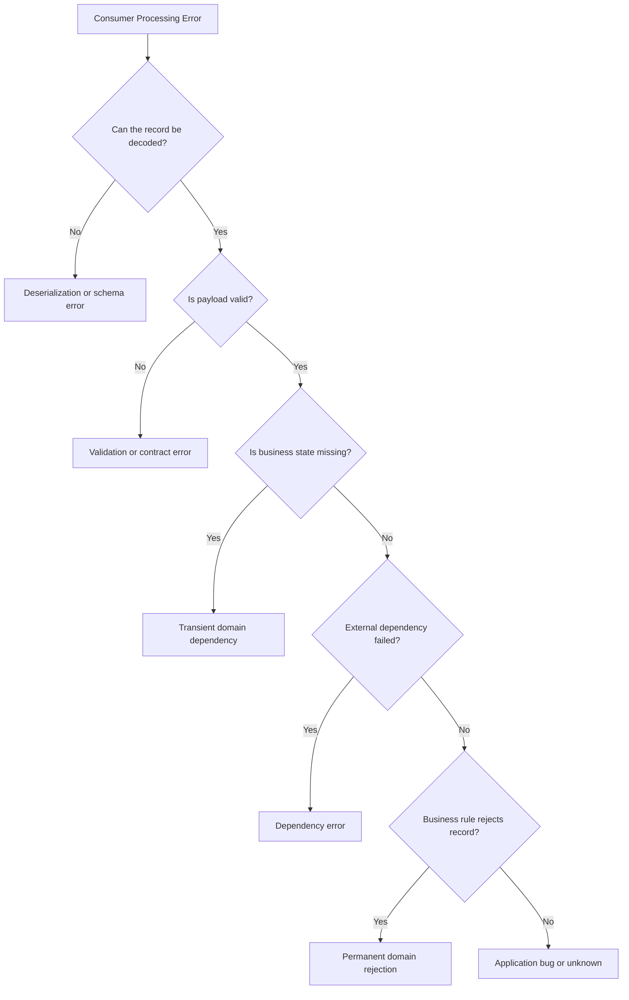
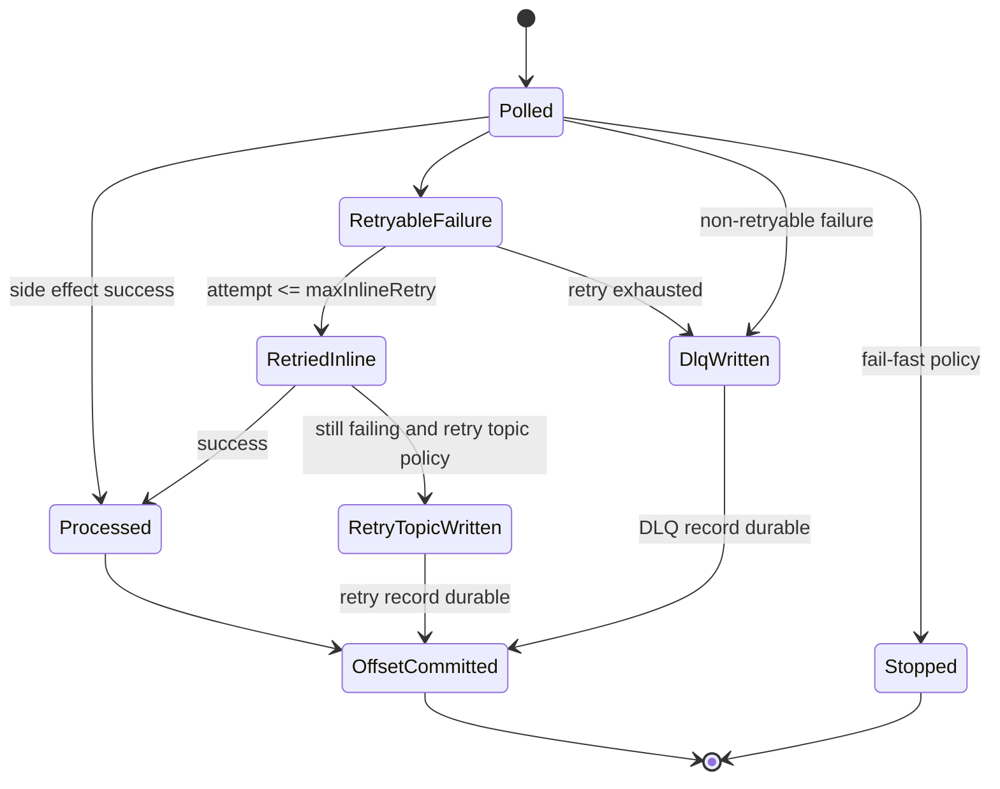
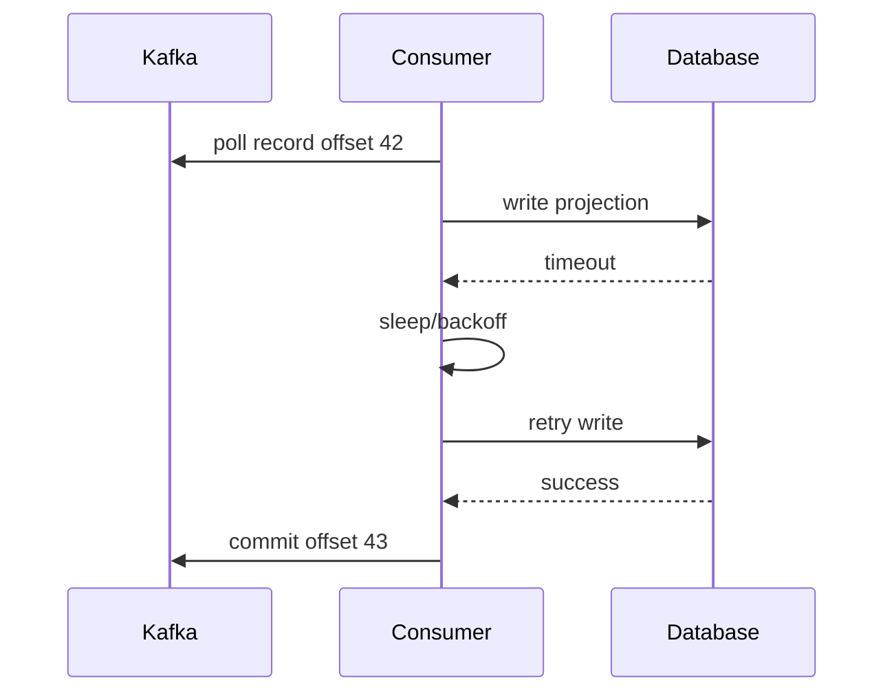
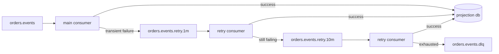
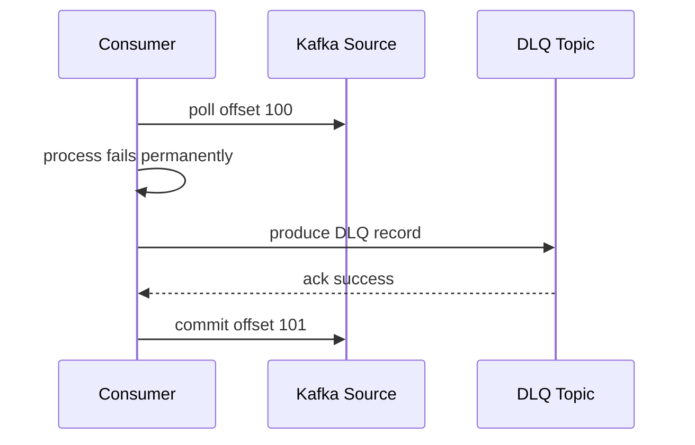
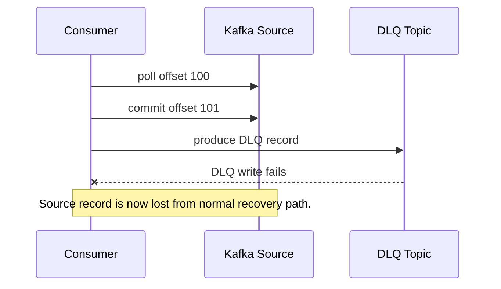
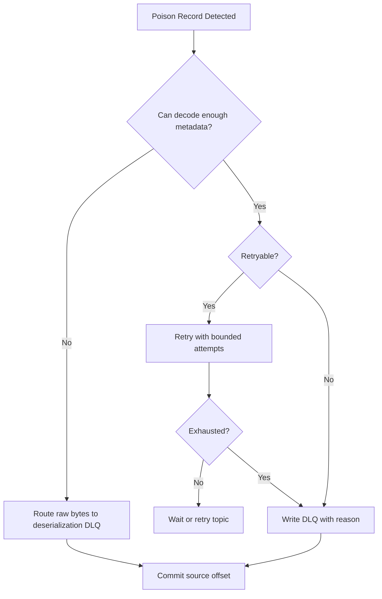
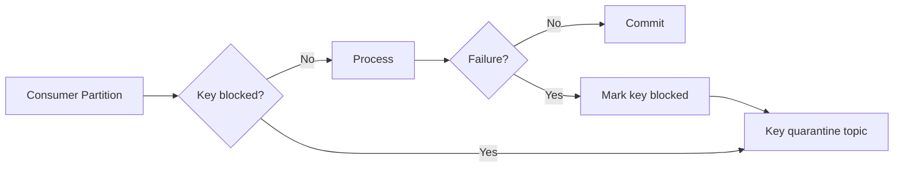
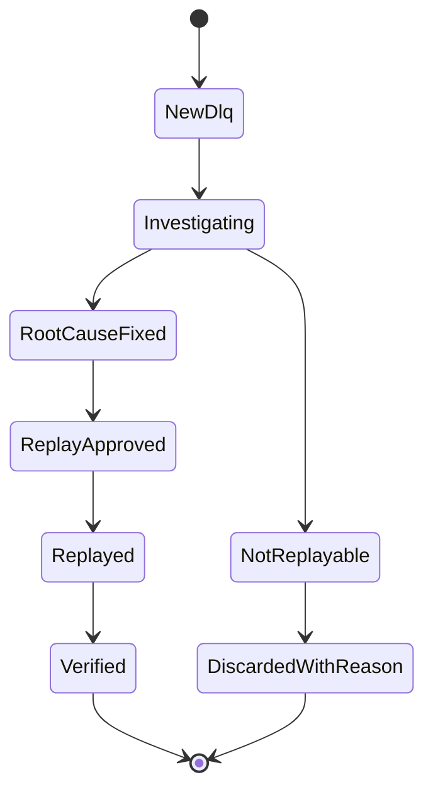

# Part 011 — Error Handling, Retry Topics, and DLQ

Part 010 covered consumer correctness: commit after durable side effect, design idempotency, and avoid committing past unfinished work. This part goes deeper into what happens when processing fails.

In Kafka systems, error handling is not a catch block. It is a **distributed recovery policy**.

A production consumer must answer these questions precisely:

- Should the partition stop, retry, skip, quarantine, or continue?
- Is the failure transient, permanent, poison, schema-related, downstream-related, or infrastructure-related?
- When is it safe to commit the offset?
- Does retry preserve ordering?
- Where is the failed record stored?
- Can the failed record be replayed safely?
- Who owns remediation?
- What metric or alert proves the system is degrading before users notice?

This part treats retry and DLQ as first-class architecture, not afterthoughts.

---

## 1. Kaufman Skill Decomposition

The target skill is the ability to design a Kafka consumer that keeps processing healthy records while preserving failed records for diagnosis and replay, without hiding data loss or corrupting business state.

### 1.1 Subskills

| Subskill | Production Meaning |
|---|---|
| Error classification | Decide whether an error is transient, permanent, poison, data-contract, dependency, or infrastructure-related. |
| Offset discipline | Commit only when the failed record is either successfully processed or safely transferred to another durable recovery path. |
| Retry topology design | Choose between blocking retry, retry topics, scheduled retry, partition quarantine, and DLQ. |
| Ordering trade-off | Know whether retry may reorder records for the same business key. |
| DLQ envelope design | Preserve original payload, metadata, error reason, correlation ID, schema identity, and replay context. |
| Replay operation | Reprocess DLQ records in a controlled, auditable, idempotent way. |
| Observability | Alert on error rate, retry age, DLQ growth, poison concentration, lag, and retry exhaustion. |
| Human remediation loop | Give operations and engineering enough context to fix data, code, config, or dependency issues. |

### 1.2 The Mental Shift

A weak consumer says:

> If processing fails, catch exception and continue.

A production-grade consumer says:

> Each failure must move the record into exactly one known state: retried, parked, dead-lettered, skipped by explicit policy, or successfully processed.

The important invariant:

```text
No failed record may disappear silently.
```

---

## 2. Failure Taxonomy

Before choosing retry or DLQ, classify the failure.



### 2.1 Deserialization Error

The consumer cannot turn bytes into the expected Java object.

Common causes:

- producer used wrong serializer;
- schema ID does not exist in Schema Registry;
- consumer expects Avro but record is JSON;
- field type changed incompatibly;
- payload is truncated or corrupted;
- topic contains mixed event types without envelope or subject strategy discipline.

Deserialization errors are dangerous because the consumer may fail before user code receives a usable domain object.

Policy options:

| Policy | Use When | Risk |
|---|---|---|
| Stop partition | Strict systems where bad input must block further records. | One poison record can stop progress. |
| Consume raw bytes and route to DLQ | You need robust quarantine. | Requires custom deserialization boundary. |
| Framework-level error deserializer | You use a framework that exposes failed payload metadata. | Framework behavior must be deeply understood. |

### 2.2 Validation Error

The record is decoded but violates local validation.

Examples:

- required business field is blank;
- timestamp is outside allowed range;
- enum value is unsupported;
- amount is negative;
- tenant ID does not match topic convention;
- event version is unsupported.

Usually this is not solved by retry. If the same record is retried without changing payload or code, it will fail again.

Good policy:

```text
validation error -> DLQ or quarantine -> commit original offset after DLQ write succeeds
```

### 2.3 Transient Dependency Error

The payload is valid, but a dependency is temporarily unavailable.

Examples:

- database connection timeout;
- REST API returns 503;
- rate limit from downstream system;
- Redis cluster failover;
- lock acquisition timeout;
- schema registry transient network failure;
- downstream service deployment restart.

Good policy:

```text
transient dependency error -> bounded retry with backoff -> retry topic or partition pause -> DLQ after exhaustion
```

### 2.4 Transient Domain Error

The event is valid, but the state required to process it has not arrived yet.

Example:

```text
OrderApproved arrives before CustomerCreated projection exists.
```

This is common in eventually consistent systems.

Policy options:

- retry with delay;
- use stream-table join if the dependency is a Kafka stream/table problem;
- create pending state;
- route to a waiting room topic;
- redesign producer ordering or partition key;
- use a workflow engine for long-lived dependency waits.

### 2.5 Permanent Domain Rejection

The event is valid but not acceptable according to business rules.

Examples:

- duplicate command already applied;
- invalid state transition;
- quote expired;
- case already closed;
- entitlement revoked;
- regulatory hold prevents progression.

Do not blindly DLQ all permanent domain rejections. Some are expected business outcomes.

A better classification:

| Domain Outcome | Kafka Handling |
|---|---|
| Expected rejection | Emit rejection event, commit offset. |
| Unexpected impossible state | Quarantine/DLQ with investigation. |
| Duplicate event | Idempotent no-op, commit offset. |
| Stale event | Ignore with metric, commit offset. |

### 2.6 Application Bug

The consumer throws `NullPointerException`, `IllegalStateException`, mapping failure, or invariant breach.

Policy:

- do not infinite-retry hot loops;
- preserve failed record;
- alert engineering;
- include app version and stack fingerprint;
- consider stopping the consumer if continuing risks corruption.

Application bugs are not solved by DLQ alone. DLQ preserves evidence; it does not fix code.

---

## 3. Error Handling State Machine

A production consumer needs explicit failure states.



The key point:

```text
Commit original offset only after the original record has either succeeded or been durably transferred to a recovery topic.
```

If the app commits before DLQ write succeeds, the record can be lost.

---

## 4. Retry Strategy Matrix

There is no universal retry strategy. The right pattern depends on failure type, ordering requirement, throughput requirement, and operational tolerance.

| Strategy | Preserves Partition Order | Throughput Impact | Operational Complexity | Best For |
|---|---:|---:|---:|---|
| Fail fast / stop on error | Yes | High impact | Low | Strict ordered workflows, financial ledger, regulatory lifecycle. |
| Blocking inline retry | Yes while blocked | Medium/high | Low | Short transient failures. |
| Pause partition and resume later | Yes for paused partition | Medium | Medium | Dependency outage scoped to partition/key. |
| Retry topic | No, unless carefully keyed and gated | Low on main consumer | Medium/high | High-throughput pipelines with transient failures. |
| Delayed retry topic ladder | Usually no | Low on main consumer | High | Retry after seconds/minutes/hours. |
| DLQ directly | No retry | Low | Medium | Non-retryable poison records. |
| Quarantine partition/key | Can preserve selected ordering | Medium | High | Ordered domain where one bad key should not stop all keys. |

---

## 5. Blocking Retry

Blocking retry means the consumer does not move past the failed record until retry succeeds, retry is exhausted, or the process stops.



### 5.1 When Blocking Retry Is Good

Use it when:

- ordering matters strongly;
- failures are expected to clear quickly;
- throughput is moderate;
- duplicate side effects are safe;
- max retry duration is below `max.poll.interval.ms` constraints or you use `pause()`/continued polling correctly.

### 5.2 Why `Thread.sleep()` in the Poll Loop Is Risky

A naive implementation:

```java
while (true) {
    ConsumerRecords<String, OrderEvent> records = consumer.poll(Duration.ofSeconds(1));
    for (ConsumerRecord<String, OrderEvent> record : records) {
        try {
            process(record);
            consumer.commitSync(Map.of(
                new TopicPartition(record.topic(), record.partition()),
                new OffsetAndMetadata(record.offset() + 1)
            ));
        } catch (Exception e) {
            Thread.sleep(60_000); // dangerous
        }
    }
}
```

Problems:

- sleeping too long can violate consumer liveness expectations;
- the consumer stops polling;
- group rebalances may occur;
- heartbeats and poll interval behavior must be understood;
- one bad record blocks the whole assigned partition and possibly batch;
- downstream outage can cause lag explosion.

A safer pattern is to use bounded short retries, `pause()` for affected partitions, and continue polling enough to keep the consumer alive.

### 5.3 Bounded Inline Retry Skeleton

```java
public final class RetryPolicy {
    private final int maxAttempts;
    private final Duration initialBackoff;
    private final Duration maxBackoff;

    public RetryPolicy(int maxAttempts, Duration initialBackoff, Duration maxBackoff) {
        this.maxAttempts = maxAttempts;
        this.initialBackoff = initialBackoff;
        this.maxBackoff = maxBackoff;
    }

    public boolean canRetry(int attempt) {
        return attempt < maxAttempts;
    }

    public Duration backoffFor(int attempt) {
        long millis = initialBackoff.toMillis() * (1L << Math.min(attempt, 10));
        return Duration.ofMillis(Math.min(millis, maxBackoff.toMillis()));
    }
}
```

Bounded retry rule:

```text
retry_count <= configured limit
backoff is capped
failure is classified
metrics are emitted
record is not lost after exhaustion
```

---

## 6. Retry Topics

Retry topics move failed records out of the main consumer path into one or more delayed retry paths.



### 6.1 Why Retry Topics Exist

They solve this operational problem:

> A few failing records should not block an entire high-throughput topic for minutes or hours.

The original consumer can write the failed record to a retry topic, commit the original offset, and continue processing later records.

This is useful for:

- downstream service temporarily unavailable;
- remote API rate limiting;
- eventual dependency readiness;
- enrichment data not available yet;
- temporary database contention;
- large batch import where some records need later retry.

### 6.2 What Retry Topics Break

Retry topics can break strict ordering.

Example:

```text
partition 0:
  offset 10: AccountSuspended(accountId=7)
  offset 11: AccountClosed(accountId=7)
```

If offset 10 fails and is moved to retry topic while offset 11 continues, the consumer may close the account before suspension is applied.

This may be acceptable in analytics. It is often unacceptable in lifecycle systems.

### 6.3 Ordering-Aware Retry Decision

| Domain Requirement | Recommended Policy |
|---|---|
| Strict per-key state machine | Blocking retry, partition pause, or per-key quarantine. |
| Independent immutable events | Retry topic is usually acceptable. |
| Analytics enrichment | Retry topic is usually acceptable. |
| Financial ledger | Avoid reordering; fail fast or use ordered compensation model. |
| Notification sending | Retry topic is common. |
| Regulatory case lifecycle | Preserve state transition order or use workflow state guard. |

### 6.4 Retry Topic Naming

Use deterministic names.

```text
<domain>.<event-stream>.retry.<delay>
<domain>.<event-stream>.dlq
```

Examples:

```text
orders.lifecycle.retry.30s
orders.lifecycle.retry.5m
orders.lifecycle.retry.1h
orders.lifecycle.dlq
```

Avoid vague names:

```text
retry-topic
errors
failed-events
misc-dlq
```

Good names encode ownership and source.

### 6.5 Retry Headers

The retry record should carry metadata.

| Header | Meaning |
|---|---|
| `x-original-topic` | Source topic. |
| `x-original-partition` | Source partition. |
| `x-original-offset` | Source offset. |
| `x-original-timestamp` | Original Kafka timestamp. |
| `x-event-id` | Stable event identity. |
| `x-correlation-id` | Request/workflow correlation. |
| `x-trace-id` | Distributed trace identity. |
| `x-retry-attempt` | Retry attempt number. |
| `x-first-failed-at` | First failure timestamp. |
| `x-last-failed-at` | Last failure timestamp. |
| `x-error-class` | Exception class. |
| `x-error-code` | Stable application error code. |
| `x-error-stack-hash` | Fingerprint for grouping. |
| `x-consumer-app` | Failing app name. |
| `x-consumer-version` | Failing app version/build SHA. |

Do not rely only on logs. Logs expire, are sampled, or are hard to correlate. Retry/DLQ metadata must be durable.

---

## 7. DLQ Design

A dead letter queue is not a trash bin. It is a **durable investigation and replay stream**.

Bad DLQ:

```json
{
  "payload": "...",
  "error": "failed"
}
```

Good DLQ:

```json
{
  "dlqId": "01JZ2WRY3QZ8RQPH3TD1Z2FZ89",
  "source": {
    "topic": "orders.lifecycle",
    "partition": 7,
    "offset": 2849112,
    "timestamp": "2026-07-01T09:41:12.441Z"
  },
  "record": {
    "key": "order-9032",
    "headers": {
      "x-event-id": "evt-0192",
      "x-correlation-id": "corr-8731",
      "x-schema-id": "421"
    },
    "payloadEncoding": "avro-binary",
    "payloadBase64": "AAAB..."
  },
  "failure": {
    "firstFailedAt": "2026-07-01T09:41:12.812Z",
    "lastFailedAt": "2026-07-01T10:02:00.112Z",
    "attempt": 4,
    "category": "VALIDATION_ERROR",
    "errorCode": "ORDER_STATUS_UNKNOWN",
    "exceptionClass": "com.acme.orders.UnknownStatusException",
    "message": "Unsupported order status: LEGACY_HOLD",
    "stackHash": "sha256:76f5..."
  },
  "consumer": {
    "application": "order-projection-consumer",
    "version": "2026.07.01-17-g4e8a9c1",
    "consumerGroup": "order-projection-v2"
  },
  "replay": {
    "replayable": true,
    "requiresManualFix": true,
    "notes": "Map LEGACY_HOLD before replay."
  }
}
```

### 7.1 DLQ Envelope Invariants

A DLQ record must answer:

1. What exactly failed?
2. Where did it come from?
3. Why did it fail?
4. How many times was it tried?
5. Which application version failed it?
6. Is it safe to replay?
7. What human or automated action is required?

### 7.2 DLQ Payload Representation

Options:

| Representation | Pros | Cons |
|---|---|---|
| Raw bytes encoded as Base64 | Preserves exact original payload. | Harder to inspect. |
| Decoded JSON | Easy to inspect. | May lose original binary/schema details. |
| Both raw and decoded | Best for operations. | Larger DLQ record. |
| Pointer to object storage | Supports huge payloads. | Adds dependency and lifecycle management. |

For high-value systems, store raw payload and decoded diagnostic projection.

### 7.3 DLQ Topic Configuration

DLQ topics should usually have:

- sufficient retention for remediation SLA;
- replication factor aligned with production durability;
- strict ACLs because payload may contain sensitive data;
- schema for the DLQ envelope;
- monitoring on growth and age;
- ownership metadata;
- replay tooling;
- explicit cleanup policy.

Example topic naming:

```text
orders.lifecycle.dlq
quotes.pricing.dlq
payments.commands.dlq
case-management.transitions.dlq
```

---

## 8. Offset Discipline with Retry and DLQ

This is the most important section.

### 8.1 Commit After DLQ Write

Correct:



Incorrect:



The invariant:

```text
source offset commit depends on recovery write success
```

### 8.2 Retry Topic Write Is a Side Effect

Writing to a retry topic is also a side effect. Treat it like a durable handoff.

```text
process failed -> write retry record -> wait for ack -> commit original offset
```

If the process crashes after retry topic write but before source offset commit, the source record may be reprocessed and written to retry again. Therefore retry-topic writes must be idempotent or deduplicated.

Use headers:

```text
x-original-topic + x-original-partition + x-original-offset
```

as stable identity for retry duplicate detection.

### 8.3 Transactional Retry/DLQ Handoff

For higher correctness, a Kafka transaction can atomically produce retry/DLQ records and commit consumed offsets as part of a consume-transform-produce flow.

Conceptual flow:

```text
begin transaction
  consume source record
  produce retry or DLQ record
  send offsets to transaction
commit transaction
```

This is useful when the recovery destination is Kafka and the offset commit must be atomic with output records.

But remember:

```text
Kafka transactions do not make external database writes atomic with Kafka unless you design an external consistency strategy.
```

For DB + Kafka, use outbox, idempotency, deduplication, or workflow-level compensation.

---

## 9. Plain Java Consumer Error Handling Skeleton

This skeleton intentionally avoids framework magic.

```java
public final class ReliableConsumer<K, V> implements AutoCloseable {
    private final KafkaConsumer<K, V> consumer;
    private final KafkaProducer<K, DlqEnvelope> dlqProducer;
    private final RecordProcessor<K, V> processor;
    private final FailureClassifier failureClassifier;
    private final RetryPublisher<K, V> retryPublisher;

    public void run() {
        while (!Thread.currentThread().isInterrupted()) {
            ConsumerRecords<K, V> records = consumer.poll(Duration.ofMillis(500));

            for (ConsumerRecord<K, V> record : records) {
                TopicPartition tp = new TopicPartition(record.topic(), record.partition());

                try {
                    processor.process(record);
                    commitNext(tp, record.offset() + 1);
                } catch (Exception failure) {
                    FailureDecision decision = failureClassifier.classify(record, failure);
                    handleFailure(record, failure, decision);
                }
            }
        }
    }

    private void handleFailure(
        ConsumerRecord<K, V> record,
        Exception failure,
        FailureDecision decision
    ) {
        TopicPartition tp = new TopicPartition(record.topic(), record.partition());

        switch (decision.action()) {
            case RETRY_INLINE -> retryInline(record, failure, decision);
            case WRITE_RETRY_TOPIC -> {
                retryPublisher.publish(record, failure, decision).join();
                commitNext(tp, record.offset() + 1);
            }
            case WRITE_DLQ -> {
                DlqEnvelope envelope = DlqEnvelope.from(record, failure, decision);
                dlqProducer.send(new ProducerRecord<>(decision.dlqTopic(), record.key(), envelope)).join();
                commitNext(tp, record.offset() + 1);
            }
            case STOP -> throw new FatalConsumerException("Stopping on failure", failure);
        }
    }

    private void commitNext(TopicPartition tp, long nextOffset) {
        consumer.commitSync(Map.of(tp, new OffsetAndMetadata(nextOffset)));
    }

    @Override
    public void close() {
        consumer.close();
        dlqProducer.close();
    }
}
```

Important details:

- `send(...).join()` is shown to emphasize waiting for Kafka ack before commit;
- production code should handle producer exceptions and shutdown carefully;
- if processing is parallelized, commit logic must track contiguous completed offsets;
- retry and DLQ production may use transactions if Kafka-only atomicity is required;
- classifiers should emit metrics for every failure decision.

---

## 10. Failure Classifier Design

A classifier maps exception + record + context into a recovery decision.

```java
public enum FailureAction {
    RETRY_INLINE,
    WRITE_RETRY_TOPIC,
    WRITE_DLQ,
    STOP
}

public record FailureDecision(
    FailureAction action,
    String category,
    String errorCode,
    boolean replayable,
    String retryTopic,
    String dlqTopic,
    int attempt,
    Duration backoff
) {}
```

Example classification:

```java
public final class DefaultFailureClassifier implements FailureClassifier {
    @Override
    public FailureDecision classify(ConsumerRecord<?, ?> record, Exception error) {
        if (error instanceof ValidationException validation) {
            return new FailureDecision(
                FailureAction.WRITE_DLQ,
                "VALIDATION_ERROR",
                validation.errorCode(),
                true,
                null,
                record.topic() + ".dlq",
                currentAttempt(record),
                Duration.ZERO
            );
        }

        if (error instanceof DependencyUnavailableException dependency) {
            int attempt = currentAttempt(record);
            if (attempt < 3) {
                return new FailureDecision(
                    FailureAction.WRITE_RETRY_TOPIC,
                    "TRANSIENT_DEPENDENCY",
                    dependency.errorCode(),
                    true,
                    record.topic() + ".retry.1m",
                    record.topic() + ".dlq",
                    attempt + 1,
                    Duration.ofMinutes(1)
                );
            }
        }

        if (error instanceof InvariantViolationException invariant) {
            return new FailureDecision(
                FailureAction.STOP,
                "INVARIANT_VIOLATION",
                invariant.errorCode(),
                false,
                null,
                record.topic() + ".dlq",
                currentAttempt(record),
                Duration.ZERO
            );
        }

        return new FailureDecision(
            FailureAction.WRITE_DLQ,
            "UNKNOWN",
            "UNKNOWN_CONSUMER_FAILURE",
            true,
            null,
            record.topic() + ".dlq",
            currentAttempt(record),
            Duration.ZERO
        );
    }
}
```

Avoid classification based only on exception class if domain context matters. A `NotFoundException` may mean:

- expected missing optional reference;
- transient projection lag;
- permanent invalid foreign key;
- wrong tenant routing;
- stale event;
- serious data corruption.

Context matters.

---

## 11. Poison Pill Handling

A poison pill is a record that repeatedly fails and prevents progress.

Poison pills often come from:

- incompatible schema;
- malformed payload;
- unsupported enum;
- null where non-null is required;
- business state impossible under current code;
- consumer bug triggered by a rare value;
- oversized payload;
- unexpected compression or encoding;
- tenant-specific bad configuration.

### 11.1 Poison Pill Policy



### 11.2 Deserialization Boundary Pattern

If deserialization failures happen before user code, consider consuming raw bytes first, then decode inside your controlled boundary.

```java
Properties props = new Properties();
props.put(ConsumerConfig.KEY_DESERIALIZER_CLASS_CONFIG, ByteArrayDeserializer.class.getName());
props.put(ConsumerConfig.VALUE_DESERIALIZER_CLASS_CONFIG, ByteArrayDeserializer.class.getName());
```

Then:

```java
try {
    DecodedEvent event = decoder.decode(record.headers(), record.value());
    processor.process(event);
    commitNext(tp, record.offset() + 1);
} catch (SchemaDecodeException e) {
    dlqWriter.writeRaw(record, e);
    commitNext(tp, record.offset() + 1);
}
```

This adds code, but gives you control over quarantine.

---

## 12. Preserving Ordering Under Failure

Ordering is the hardest part of retry design.

### 12.1 Strict Partition Stop

```text
If offset N fails, do not process N+1.
```

Pros:

- preserves partition order;
- simplest correctness model;
- good for state machines.

Cons:

- one bad record blocks whole partition;
- lag can grow quickly;
- hot partitions create operational pressure.

### 12.2 Retry Topic with Reordering

```text
If offset N fails, move N to retry topic and continue N+1.
```

Pros:

- main topic continues;
- good throughput;
- isolates transient dependency failures.

Cons:

- breaks strict per-key ordering;
- requires idempotent and monotonic business logic;
- retry may apply after newer event.

### 12.3 Per-Key Quarantine

For advanced systems, quarantine only the failing business key while continuing other keys.



This requires:

- key-level block registry;
- idempotent processing;
- careful offset semantics;
- replay control;
- deterministic key extraction;
- operational UI or tooling.

Use it only when partition-level blocking is too expensive and ordering per key still matters.

### 12.4 Monotonic State Guard

If retry topics can reorder events, protect state transitions.

Example state transition table:

| Current State | Incoming Event | Action |
|---|---|---|
| `CREATED` | `APPROVED` | Apply. |
| `APPROVED` | `FULFILLED` | Apply. |
| `FULFILLED` | `APPROVED` | Ignore as stale or investigate. |
| `CANCELLED` | `FULFILLED` | Reject/investigate. |

Implementation idea:

```sql
UPDATE order_projection
SET status = :newStatus,
    version = :eventVersion,
    updated_at = now()
WHERE order_id = :orderId
  AND version < :eventVersion;
```

This makes stale retry safer.

---

## 13. DLQ Replay

DLQ replay is a production operation, not a developer convenience.

### 13.1 Replay Preconditions

Before replaying, answer:

- Was the root cause fixed?
- Are side effects idempotent?
- Is replay order required?
- Should replay use original key?
- Should replay use original timestamp?
- Should replay target the original topic or a repair topic?
- Should only selected records be replayed?
- Has the owning team approved?
- Is there a rollback plan?
- What metrics confirm replay success?

### 13.2 Replay Modes

| Replay Mode | Meaning | Use When |
|---|---|---|
| Replay to original topic | Produce corrected/original event to source topic. | Consumers should process as normal new input. |
| Replay to repair topic | Produce to dedicated remediation stream. | You need controlled repair semantics. |
| Direct repair job | Read DLQ and update target system directly. | Kafka path is not appropriate or would cause duplicate side effects. |
| Manual discard | Mark as intentionally not replayed. | Record is invalid and should not affect state. |

### 13.3 Replay State Machine



### 13.4 Replay Audit Record

Maintain a replay audit trail:

```json
{
  "dlqId": "01JZ2WRY3QZ8RQPH3TD1Z2FZ89",
  "decision": "REPLAYED_TO_REPAIR_TOPIC",
  "approvedBy": "platform-oncall",
  "approvedAt": "2026-07-01T11:00:00Z",
  "replayTopic": "orders.lifecycle.repair",
  "replayRecordOffset": 9123,
  "reason": "Consumer bug fixed in version 2026.07.01-19",
  "verification": "projection updated for order-9032"
}
```

For regulated workflows, this audit trail is not optional.

---

## 14. Observability

Retry and DLQ without observability are silent failure systems.

### 14.1 Metrics

| Metric | Why It Matters |
|---|---|
| `consumer.records.processed.total` | Throughput baseline. |
| `consumer.records.failed.total` | Error rate by category. |
| `consumer.retry.published.total` | Retry volume. |
| `consumer.retry.exhausted.total` | Records moving to DLQ after retry. |
| `consumer.dlq.published.total` | DLQ growth. |
| `consumer.dlq.publish.failed.total` | Potential data loss risk. |
| `consumer.processing.duration` | Latency per record. |
| `consumer.retry.age.max` | Oldest retry waiting. |
| `consumer.dlq.age.max` | Remediation SLA breach risk. |
| `consumer.poison.by.topic.partition.offset` | Poison location. |
| `consumer.error.stack_hash.count` | Group repeated failures. |
| `consumer.lag` | Backlog. |
| `consumer.paused.partitions` | Flow-control or poison impact. |

### 14.2 Alert Rules

Good alerts are actionable.

Examples:

```text
DLQ published > 0 for payments.commands in 5 minutes
```

```text
retry.exhausted.total increased for case.transitions
```

```text
oldest DLQ record age > remediation SLA
```

```text
DLQ publish failure > 0
```

```text
same stack_hash appears in > 100 records in 10 minutes
```

Avoid noisy alerts:

```text
any exception log line exists
```

Exceptions can be expected under retry policy. Alert on failed recovery, policy exhaustion, or SLO impact.

---

## 15. Operational Runbook

### 15.1 When DLQ Increases

1. Identify topic, consumer group, app version, and stack hash.
2. Group by error category and error code.
3. Sample records by key and tenant.
4. Determine whether failure is data, schema, dependency, config, or code.
5. Check whether retry is exhausted or bypassed.
6. Check whether source lag is increasing.
7. Decide: hotfix, config fix, data correction, schema rollback, dependency recovery, or replay.
8. Document replay/discard decision.

### 15.2 DLQ Triage Table

| Symptom | Likely Cause | First Action |
|---|---|---|
| Sudden DLQ spike after deployment | Consumer bug or schema expectation changed. | Compare app version and recent deploy. |
| DLQ only for one tenant | Tenant data/config issue. | Inspect tenant-specific config and payload. |
| DLQ after producer deployment | Producer schema/contract change. | Check schema version and producer release. |
| Retry age increasing but DLQ stable | Dependency outage or retry delay too long. | Inspect dependency health and retry workers. |
| DLQ publish failures | Kafka/ACL/schema issue on DLQ topic. | Treat as high-severity data-loss risk. |
| Same key repeatedly fails | Poison key or invalid lifecycle state. | Quarantine key and inspect history. |

---

## 16. Common Anti-Patterns

### 16.1 Infinite Retry Loop

```text
while true retry same poison record forever
```

Damage:

- partition blocked;
- CPU wasted;
- alerts noisy;
- actual root cause hidden.

Fix:

- bounded retry;
- classify failure;
- DLQ after exhaustion;
- alert on repeated stack hash.

### 16.2 Commit Before Recovery Write

Damage:

- record can disappear;
- no replay path;
- audit gap.

Fix:

```text
write recovery destination -> wait for ack -> commit source offset
```

### 16.3 One Global DLQ for Everything

Damage:

- no ownership;
- hard to route alerts;
- sensitive data mixed;
- replay becomes dangerous.

Fix:

- domain-specific DLQs;
- standardized envelope;
- owner metadata.

### 16.4 DLQ Graveyard

A DLQ graveyard receives records but no one remediates them.

Fix:

- SLA for DLQ age;
- owner per topic;
- replay/discard workflow;
- weekly review;
- dashboard by category.

### 16.5 Retry Topic Without Idempotency

Damage:

- duplicate side effects;
- state corruption;
- duplicate notification;
- repeated external API calls.

Fix:

- event ID;
- idempotency key;
- dedup store;
- monotonic state guard.

### 16.6 Treating Business Rejection as Technical Failure

Damage:

- DLQ polluted with expected outcomes;
- operations investigates normal behavior;
- event flow loses semantic clarity.

Fix:

- emit domain rejection events;
- commit offset;
- reserve DLQ for unexpected/non-processable records.

---

## 17. Design Templates

### 17.1 Error Policy Table

Use this table in architecture reviews.

| Failure Category | Retry? | Max Attempts | Recovery Destination | Preserve Order? | Commit When? | Alert? |
|---|---:|---:|---|---:|---|---:|
| Deserialization | No | 0 | raw DLQ | No | DLQ acked | Yes |
| Validation | No | 0 | DLQ | Usually no | DLQ acked | Yes by threshold |
| Dependency 503 | Yes | 5 | retry topics then DLQ | Depends | retry/DLQ acked | Yes if exhausted |
| Rate limit | Yes | 10 | delayed retry | No | retry acked | Yes if age high |
| Missing projection | Yes | 5 | waiting/retry topic | Depends | retry acked | Yes if old |
| Duplicate event | No | 0 | none | Yes | idempotent no-op done | No or metric only |
| Invariant breach | No | 0 | stop + DLQ/manual | Yes | do not auto commit unless policy says | Yes high severity |

### 17.2 ADR Template

```md
# ADR: Error Handling Policy for <consumer-name>

## Context
- Source topic:
- Consumer group:
- Business criticality:
- Ordering requirement:
- Side effects:

## Failure Categories
- Deserialization:
- Validation:
- Transient dependency:
- Domain rejection:
- Application invariant breach:

## Decision
- Retry strategy:
- DLQ topic:
- Retry topics:
- Max attempts:
- Backoff:
- Commit rule:
- Idempotency mechanism:

## Consequences
- Ordering trade-off:
- Replay procedure:
- Alerting:
- Ownership:
```

---

## 18. Practice Lab

### Lab Goal

Build a Java Kafka consumer that processes `OrderPaid` events and updates a projection table. It must handle:

- valid records;
- validation failures;
- transient database timeout;
- duplicate event ID;
- poison record;
- retry exhaustion;
- DLQ replay.

### Requirements

1. Use manual offset commit.
2. Commit only after successful DB write or successful DLQ/retry write.
3. Use event ID for idempotency.
4. Write transient failures to retry topic after bounded inline attempts.
5. Write validation failures directly to DLQ.
6. Include original topic, partition, offset, event ID, correlation ID, error code, and app version in DLQ envelope.
7. Add metrics for processed, failed, retry-published, DLQ-published, and DLQ-publish-failed.
8. Write a small replay tool that reads DLQ and writes selected records to a repair topic.

### Failure Injection

| Scenario | Expected Result |
|---|---|
| DB timeout once | Inline retry succeeds, offset committed. |
| DB unavailable for 10 minutes | Retry topics receive records, source topic continues if ordering policy allows. |
| Invalid enum | DLQ write succeeds, source offset committed. |
| DLQ topic ACL denied | Source offset not committed; alert emitted. |
| Duplicate event ID | No-op, offset committed. |
| Consumer crash after retry write before commit | Source record may be retried; duplicate retry record handled by original offset identity. |

---

## 19. Senior Engineering Heuristics

1. **Retry is not free.** It consumes capacity, hides latency, and can amplify outages.
2. **DLQ is not failure handling by itself.** It is evidence preservation plus remediation workflow.
3. **Commit is a promise.** Once committed, the consumer says every prior record is handled according to policy.
4. **Ordering and throughput trade off directly.** Retry topics improve throughput but may break ordering.
5. **Classify before retrying.** Retrying permanent failures is operational waste.
6. **Replay must be idempotent.** Otherwise remediation can become a second incident.
7. **DLQ topics need owners.** A shared unowned DLQ becomes a graveyard.
8. **A failed DLQ write is high severity.** It means your recovery path is broken.
9. **Use stable error codes.** Exception messages change; error codes support dashboards and automation.
10. **Design for diagnosis.** Every failed record should carry enough context to debug without hunting across logs.

---

## 20. Mental Model Summary

```text
Kafka error handling = failure classification + recovery topology + offset discipline + replay governance
```

A robust consumer does not merely catch exceptions. It moves each record through a known lifecycle:

```text
processed -> committed
retryable -> retry topic -> committed
non-retryable -> DLQ -> committed
fatal invariant -> stop and alert
```

The top 1% engineering mindset is not “how do I avoid errors?” It is:

> When failure happens, can I prove what happened to every record, why, and how to recover safely?

---

## 21. References

- Apache Kafka Documentation — Producer, Consumer, Transactions, and Configuration: `https://kafka.apache.org/documentation/`
- Confluent — Error Handling Patterns for Apache Kafka Applications: `https://www.confluent.io/blog/error-handling-patterns-in-kafka/`
- Confluent — Kafka Dead Letter Queue: `https://www.confluent.io/learn/kafka-dead-letter-queue/`
- Confluent — Kafka Connect Deep Dive: Error Handling and Dead Letter Queues: `https://www.confluent.io/blog/kafka-connect-deep-dive-error-handling-dead-letter-queues/`
- Confluent — Kafka Consumer Design: `https://docs.confluent.io/kafka/design/consumer-design.html`
