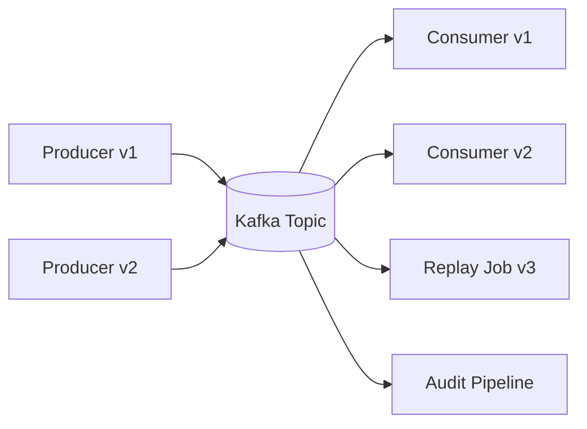
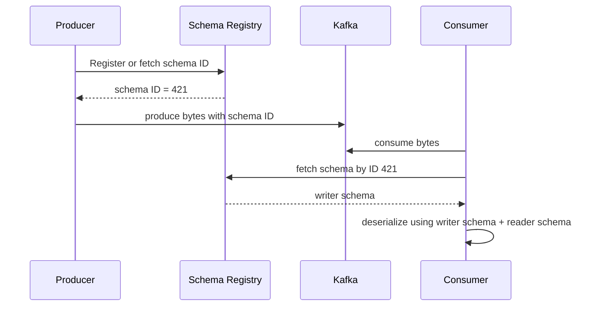
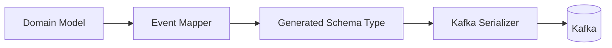
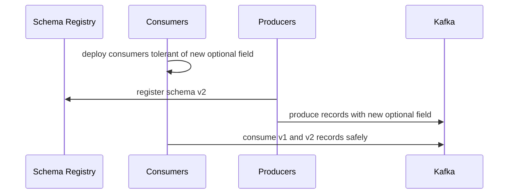

# Part 012 — Schema Contracts and Evolution

Part 011 focused on failed records, retry, and DLQ. Many DLQ incidents begin earlier: a producer changes data shape and consumers are not ready.

Kafka topics are long-lived integration surfaces. Once multiple services consume a topic, the message schema becomes a **distributed contract**.

A schema is not only a serialization detail. It is an agreement about:

- fields;
- names;
- types;
- optionality;
- defaults;
- meaning;
- compatibility;
- ownership;
- evolution rules;
- producer and consumer expectations.

This part explains how to design schema contracts that evolve safely over time.

---

## 1. Kaufman Skill Decomposition

The target skill is the ability to evolve Kafka event contracts without breaking consumers, corrupting projections, or creating ambiguous data.

### 1.1 Subskills

| Subskill | Production Meaning |
|---|---|
| Format selection | Choose Avro, Protobuf, JSON Schema, or raw JSON based on system constraints. |
| Compatibility reasoning | Know whether a schema change is backward, forward, full, or breaking. |
| Subject naming | Decide schema identity boundaries across topics, records, and event types. |
| Optionality design | Use defaults and nullable fields intentionally. |
| Semantic evolution | Avoid changing field meaning under the same name. |
| Consumer upgrade strategy | Deploy producers and consumers in safe order. |
| Governance | Prevent incompatible contracts from reaching production. |
| Java integration | Generate types, configure serializers, handle schema IDs, and test compatibility. |
| Operational diagnosis | Debug schema ID, deserialization, compatibility, and registry availability incidents. |

### 1.2 The Core Mental Model

```text
Kafka payload = bytes
Schema Registry = versioned meaning of those bytes
Consumer code = interpretation of that meaning
```

If any of the three drift, the system breaks.

---

## 2. Why Schemas Matter More in Kafka Than REST

In REST, a service often calls another service synchronously. If the response contract breaks, failure is immediate.

In Kafka:

- events may be consumed by unknown services;
- events may be retained for days, months, or forever;
- old events may be replayed by new code;
- new events may be consumed by old code during rolling deployment;
- one topic may feed projections, search, analytics, ML, notifications, and audit;
- producers and consumers are deployed independently.

This creates a stronger compatibility requirement.



The contract must survive mixed versions.

---

## 3. Serialization Format Options

### 3.1 Raw JSON

Raw JSON is easy to start with.

Example:

```json
{
  "orderId": "ord-1001",
  "status": "APPROVED",
  "approvedAt": "2026-07-01T10:12:00Z"
}
```

Pros:

- human-readable;
- simple tooling;
- no code generation required;
- easy debugging with CLI tools.

Cons:

- weak type enforcement;
- schema often exists only in documentation;
- breaking changes are discovered late;
- large payload size;
- ambiguous numeric/date handling;
- no built-in compatibility gate unless paired with JSON Schema and registry.

Use raw JSON only for low-criticality or transitional systems, and still define a contract.

### 3.2 Avro

Avro is common in Kafka ecosystems because it is compact, schema-driven, and designed for schema evolution.

Example Avro schema:

```json
{
  "type": "record",
  "name": "OrderApproved",
  "namespace": "com.acme.orders.events",
  "fields": [
    { "name": "eventId", "type": "string" },
    { "name": "orderId", "type": "string" },
    { "name": "approvedAt", "type": "string" },
    { "name": "approvalReason", "type": ["null", "string"], "default": null }
  ]
}
```

Pros:

- compact binary encoding;
- mature Kafka integration;
- strong schema evolution support;
- generated Java classes or generic records;
- widely supported by Schema Registry.

Cons:

- less human-readable on the wire;
- unions can be awkward;
- schema design discipline is required;
- Java generated classes may leak into domain model if not isolated.

### 3.3 Protobuf

Protocol Buffers are schema-first and widely used for service APIs and cross-language systems.

Example:

```proto
syntax = "proto3";

package com.acme.orders.events;

message OrderApproved {
  string event_id = 1;
  string order_id = 2;
  string approved_at = 3;
  string approval_reason = 4;
}
```

Pros:

- compact;
- strongly typed;
- excellent cross-language support;
- explicit field numbers;
- good for organizations already using gRPC/protobuf.

Cons:

- field number management is critical;
- `proto3` default values can make absence ambiguous;
- schema evolution rules differ from Avro;
- semantic optionality must be designed carefully.

### 3.4 JSON Schema

JSON Schema gives structured validation for JSON payloads.

Pros:

- readable payloads;
- schema validation;
- compatible with JSON-centric consumers;
- useful when human inspection matters.

Cons:

- larger payload;
- schema evolution can be more nuanced;
- less compact than binary formats;
- validation and compatibility behavior must be tested carefully.

### 3.5 Format Selection Matrix

| Requirement | Recommended Direction |
|---|---|
| High-throughput internal Kafka pipelines | Avro or Protobuf. |
| Strong Kafka ecosystem integration | Avro is common. |
| Cross-language platform with gRPC | Protobuf. |
| Human-readable operational payloads | JSON Schema. |
| Analytics and data lake integration | Avro often works well. |
| Strict contract enforcement | Avro, Protobuf, or JSON Schema with registry. |
| Fast prototype only | Raw JSON, but add schema before production. |

---

## 4. Schema Registry Mental Model

Schema Registry is a service that stores versioned schemas and provides schema IDs used during serialization/deserialization.



### 4.1 Important Concepts

| Concept | Meaning |
|---|---|
| Schema | Definition of record structure. |
| Subject | Namespace under which schema versions evolve. |
| Version | Version number within a subject. |
| Schema ID | Global or registry-level identifier used in payload encoding. |
| Compatibility mode | Rule that accepts or rejects new schema versions. |
| Serializer | Client component that writes schema-aware bytes. |
| Deserializer | Client component that resolves bytes back into Java objects. |

### 4.2 What Schema Registry Does Not Do

Schema Registry does not automatically guarantee:

- your business meaning is unchanged;
- all consumers understand new enum values;
- default values are semantically safe;
- old replayed events are meaningful to new code;
- a field rename is harmless;
- every event type belongs in the same topic;
- your generated Java model is a good domain model.

It enforces structural compatibility, not full business correctness.

---

## 5. Subject Naming Strategy

A subject defines the compatibility scope.

Common strategies:

| Strategy | Typical Subject | Meaning |
|---|---|---|
| Topic name | `<topic>-value` | One value schema evolves per topic. |
| Record name | `<fully-qualified-record-name>` | Same record type can be reused across topics. |
| Topic record name | `<topic>-<fully-qualified-record-name>` | Multiple record types per topic while scoped by topic. |

### 5.1 Topic Name Strategy

Example:

```text
orders.lifecycle-value
```

Best when:

- one event type per topic;
- topic contract is simple;
- compatibility should be enforced at topic level.

Risk:

- difficult if many unrelated event types are placed in one topic;
- can encourage broad envelope schemas with weak typing.

### 5.2 Record Name Strategy

Example:

```text
com.acme.orders.events.OrderApproved
```

Best when:

- record type is reused across topics;
- event type identity matters more than topic;
- consumers deserialize by record type.

Risk:

- compatibility is global for that record name;
- accidental reuse can couple unrelated topics.

### 5.3 Topic Record Name Strategy

Example:

```text
orders.lifecycle-com.acme.orders.events.OrderApproved
```

Best when:

- a topic carries multiple event types;
- each event type needs independent evolution;
- compatibility should be scoped to topic + type.

Risk:

- more subjects to manage;
- naming consistency becomes important.

### 5.4 Recommendation

For high-discipline domain event streams:

```text
Prefer one event family per topic.
Use TopicNameStrategy when topic has one schema family.
Use TopicRecordNameStrategy when topic intentionally carries multiple event types.
Avoid ungoverned mixed event topics.
```

---

## 6. Compatibility Modes

Compatibility mode defines whether a new schema version can coexist with existing readers/writers.

### 6.1 Backward Compatibility

A new consumer using the new schema can read data written with the previous schema.

```text
new reader reads old writer data
```

Commonly useful when consumers are upgraded before producers or when replaying old data with new code.

Typical safe Avro change:

```json
{ "name": "approvalReason", "type": ["null", "string"], "default": null }
```

Adding a field with a default allows the new reader to read old records that do not contain the field.

### 6.2 Forward Compatibility

An old consumer using the old schema can read data written with the new schema.

```text
old reader reads new writer data
```

This matters during rolling deployment when producers may emit new records before all consumers are upgraded.

### 6.3 Full Compatibility

Both backward and forward compatibility hold.

```text
new reader reads old writer data
old reader reads new writer data
```

This is stricter and often desirable for shared enterprise topics.

### 6.4 Transitive Compatibility

Non-transitive compatibility checks only against the latest version. Transitive compatibility checks against all previous versions.

| Mode | Checks Against |
|---|---|
| `BACKWARD` | latest previous version |
| `BACKWARD_TRANSITIVE` | all previous versions |
| `FORWARD` | latest previous version |
| `FORWARD_TRANSITIVE` | all previous versions |
| `FULL` | latest previous version both ways |
| `FULL_TRANSITIVE` | all previous versions both ways |
| `NONE` | no compatibility check |

For long-retention topics and replay-heavy systems, transitive compatibility is usually safer.

---

## 7. Safe and Unsafe Schema Changes

Exact rules depend on schema format. The table below gives practical engineering intuition.

| Change | Usually Safe? | Notes |
|---|---:|---|
| Add optional field with default | Yes | Good default is critical. |
| Add required field without default | No | Old records do not have it. |
| Remove field consumed by old readers | Risky | May be forward-compatible depending on format, but semantically dangerous. |
| Rename field | Usually no | Often equivalent to remove + add. |
| Change field type | Usually no | Some promotions may be allowed, but test. |
| Add enum value | Structurally possible in some formats, semantically risky | Old code may not handle it. |
| Change field meaning | No | Registry cannot detect semantic break. |
| Change units from cents to dollars | No | Same type, broken meaning. |
| Change timestamp timezone semantics | No | Same type, broken meaning. |
| Reuse Protobuf field number | No | Can corrupt interpretation. |
| Delete Protobuf field without reserving | Risky | Reserve field numbers/names. |

---

## 8. Semantic Compatibility

A schema can be structurally compatible and still break production.

### 8.1 Example: Unit Change

Old schema:

```json
{ "name": "amount", "type": "long", "doc": "Amount in cents" }
```

New producer starts sending dollars while schema remains `long`.

Registry accepts it because structure is unchanged. Consumers produce wrong financial results.

Correct approach:

- never change meaning under same field;
- add a new field if necessary;
- document units;
- use domain-specific names such as `amountCents`;
- add contract tests.

### 8.2 Example: Enum Expansion

Old consumer:

```java
switch (status) {
    case CREATED -> handleCreated();
    case APPROVED -> handleApproved();
    case CANCELLED -> handleCancelled();
}
```

New producer emits:

```text
ON_HOLD
```

Even if schema evolution allows new enum value, old consumer may fail or misclassify.

Better consumer:

```java
switch (status) {
    case CREATED -> handleCreated();
    case APPROVED -> handleApproved();
    case CANCELLED -> handleCancelled();
    default -> throw new UnsupportedEventValueException("Unsupported status: " + status);
}
```

But even this should route to a controlled DLQ with a clear error code.

---

## 9. Java Producer Configuration with Schema Registry

Example Avro producer configuration:

```java
Properties props = new Properties();
props.put(ProducerConfig.BOOTSTRAP_SERVERS_CONFIG, "localhost:9092");
props.put(ProducerConfig.KEY_SERIALIZER_CLASS_CONFIG, StringSerializer.class.getName());
props.put(ProducerConfig.VALUE_SERIALIZER_CLASS_CONFIG, KafkaAvroSerializer.class.getName());
props.put("schema.registry.url", "http://localhost:8081");
props.put(ProducerConfig.ACKS_CONFIG, "all");
props.put(ProducerConfig.ENABLE_IDEMPOTENCE_CONFIG, "true");
```

Example produce:

```java
OrderApproved event = OrderApproved.newBuilder()
    .setEventId("evt-1001")
    .setOrderId("ord-9001")
    .setApprovedAt("2026-07-01T10:12:00Z")
    .setApprovalReason(null)
    .build();

ProducerRecord<String, OrderApproved> record = new ProducerRecord<>(
    "orders.lifecycle",
    event.getOrderId().toString(),
    event
);

producer.send(record).get();
```

Keep generated Avro/Protobuf classes at the boundary. Do not let transport-generated types dominate your internal domain model unless the service is intentionally schema-bound.

Recommended layering:



---

## 10. Java Consumer Configuration with Schema Registry

Example Avro consumer configuration:

```java
Properties props = new Properties();
props.put(ConsumerConfig.BOOTSTRAP_SERVERS_CONFIG, "localhost:9092");
props.put(ConsumerConfig.GROUP_ID_CONFIG, "order-projection-v2");
props.put(ConsumerConfig.KEY_DESERIALIZER_CLASS_CONFIG, StringDeserializer.class.getName());
props.put(ConsumerConfig.VALUE_DESERIALIZER_CLASS_CONFIG, KafkaAvroDeserializer.class.getName());
props.put("schema.registry.url", "http://localhost:8081");
props.put("specific.avro.reader", "true");
props.put(ConsumerConfig.ENABLE_AUTO_COMMIT_CONFIG, "false");
```

Example consumer boundary:

```java
ConsumerRecords<String, OrderApproved> records = consumer.poll(Duration.ofMillis(500));

for (ConsumerRecord<String, OrderApproved> record : records) {
    OrderApproved event = record.value();
    OrderApproval domainEvent = mapper.toDomain(event);
    processor.process(domainEvent);
    commitNext(record);
}
```

Important:

- deserialization can fail before `record.value()` is usable;
- schema registry outages can affect deserialization if schema is not cached;
- consumers should define behavior for unknown schema versions and unsupported semantic values;
- old records must remain readable if replay is required.

---

## 11. Schema Evolution Examples

### 11.1 Safe Additive Change

Version 1:

```json
{
  "type": "record",
  "name": "OrderApproved",
  "fields": [
    { "name": "eventId", "type": "string" },
    { "name": "orderId", "type": "string" }
  ]
}
```

Version 2:

```json
{
  "type": "record",
  "name": "OrderApproved",
  "fields": [
    { "name": "eventId", "type": "string" },
    { "name": "orderId", "type": "string" },
    { "name": "approvalReason", "type": ["null", "string"], "default": null }
  ]
}
```

This is usually safe because old records can be read with a default.

### 11.2 Breaking Required Field Addition

Version 2:

```json
{ "name": "approvedByUserId", "type": "string" }
```

If no default is provided, old records do not contain this field. New consumers reading old records may fail.

### 11.3 Field Rename

Changing:

```text
customerId -> accountId
```

is usually not a rename to the schema system. It is removal plus addition.

Safer migration:

1. Add `accountId` as optional with default.
2. Populate both fields from producer.
3. Upgrade consumers to prefer `accountId`.
4. Stop using `customerId` after all consumers are migrated.
5. Remove only when compatibility and retention rules allow.

### 11.4 Type Change

Changing:

```text
amount: string -> amount: long
```

is generally breaking. Use a new field:

```text
amountText -> amountCents
```

and migrate consumers explicitly.

---

## 12. Deployment Order for Schema Changes

### 12.1 Additive Field Migration



Typical order:

1. Register compatible schema.
2. Deploy consumers that tolerate both old and new form.
3. Deploy producers that populate new field.
4. Monitor deserialization errors and DLQ.
5. Later, make field required only if retention and consumer migration allow it.

### 12.2 Removing a Field

Field removal is harder.

Safe-ish order:

1. Prove field is not used by any consumer.
2. Deploy consumers that no longer require it.
3. Stop producer dependency on it.
4. Wait past retention/replay requirements.
5. Remove only when compatibility mode allows.

In many organizations, removing event fields is not worth the risk. Mark as deprecated instead.

---

## 13. Contract Testing

Schema Registry compatibility checks are necessary but insufficient.

### 13.1 Test Layers

| Test | Catches |
|---|---|
| Schema compatibility test | Structural breaking changes. |
| Golden payload test | Deserialization of known historical records. |
| Consumer contract test | Consumer logic behavior for old/new schemas. |
| Semantic invariant test | Units, enum handling, state transition assumptions. |
| Replay test | Whether old retained events still process. |
| Producer contract test | Producer emits required metadata and valid schema. |

### 13.2 Golden Payload Test

Keep representative historical payloads.

```text
src/test/resources/golden/orders/OrderApproved-v1.avro
src/test/resources/golden/orders/OrderApproved-v2.avro
src/test/resources/golden/orders/OrderApproved-with-null-reason.avro
```

Test:

```java
@Test
void shouldReadHistoricalOrderApprovedV1() {
    byte[] payload = loadGoldenPayload("OrderApproved-v1.avro");
    OrderApproved event = avroDecoder.decode(payload, OrderApproved.class);

    OrderApproval domain = mapper.toDomain(event);

    assertThat(domain.orderId()).isEqualTo("ord-9001");
    assertThat(domain.approvalReason()).isEmpty();
}
```

### 13.3 Semantic Contract Test

```java
@Test
void amountMustRemainInCents() {
    PaymentCaptured event = PaymentCaptured.newBuilder()
        .setPaymentId("pay-1")
        .setAmountCents(12345L)
        .build();

    Money money = mapper.toMoney(event);

    assertThat(money).isEqualTo(Money.ofCents(12345));
}
```

This catches meaning drift that registry cannot detect.

---

## 14. Multi-Type Topic Design

A topic may contain multiple event types, especially when modeling a lifecycle stream.

Example:

```text
orders.lifecycle
  OrderCreated
  OrderApproved
  OrderCancelled
  OrderFulfilled
```

### 14.1 Benefits

- preserves per-order lifecycle ordering if keyed by `orderId`;
- consumers can subscribe to one lifecycle stream;
- replay is cohesive;
- audit trail is easier.

### 14.2 Risks

- schema subject strategy becomes more important;
- consumers must handle unknown event types;
- topic can become a dumping ground;
- compatibility may be hard if using one broad envelope schema;
- filtering cost increases.

### 14.3 Envelope Pattern

```json
{
  "eventId": "evt-1001",
  "eventType": "OrderApproved",
  "eventVersion": 2,
  "occurredAt": "2026-07-01T10:12:00Z",
  "producer": "order-service",
  "correlationId": "corr-11",
  "payload": {
    "orderId": "ord-9001",
    "approvedBy": "user-91"
  }
}
```

The envelope is useful, but do not make payload `map<string, object>` in a way that avoids real schema governance.

A better approach is often:

```text
shared metadata envelope + strongly typed payload per event type
```

---

## 15. Schema Governance

Production Kafka platforms need a governance loop.

### 15.1 Ownership

Every schema subject should have:

- owning team;
- source repository;
- review channel;
- compatibility mode;
- deprecation policy;
- data classification;
- retention expectation;
- replay expectation.

### 15.2 Review Checklist

Before approving a schema change:

- Is the change structurally compatible?
- Is it semantically compatible?
- Are defaults meaningful?
- Are units documented?
- Are enum expansions safe for old consumers?
- Is field optionality intentional?
- Is the subject naming strategy correct?
- Are consumers known?
- Does replay of old data still work?
- Are privacy/security classifications updated?
- Are golden payload tests updated?

### 15.3 Schema Documentation Standard

Each field should document:

| Attribute | Example |
|---|---|
| Meaning | `Amount captured by payment provider.` |
| Unit | `minor currency unit / cents`. |
| Nullability | `null when payment method is offline`. |
| Source | `payment authorization response`. |
| Stability | `stable`, `experimental`, `deprecated`. |
| PII | `none`, `personal`, `sensitive`. |
| Compatibility note | `do not change unit`. |

A field without meaning is a future incident.

---

## 16. Schema Registry Failure Modes

### 16.1 Registry Unavailable During Produce

Producer may fail if it needs to register or fetch schema ID and registry is unavailable.

Mitigations:

- avoid auto-registering schemas in production if governance requires pre-registration;
- deploy registry highly available;
- configure client retries/timeouts;
- pre-warm or cache schemas where appropriate;
- alert on registry errors.

### 16.2 Registry Unavailable During Consume

Consumer may fail if it sees a schema ID not in local cache and cannot fetch it.

Mitigations:

- HA registry;
- stable networking;
- consumer retry policy;
- avoid deploying consumers into environments without registry access;
- monitor deserialization errors separately from business processing errors.

### 16.3 Incompatible Schema Registered

This should be blocked by compatibility mode and CI checks.

If it reaches production:

- stop affected producer;
- identify schema ID and subject version;
- determine whether bad records were produced;
- route bad records to DLQ or repair pipeline;
- deploy tolerant consumers if possible;
- document incident.

### 16.4 Schema ID Mismatch

Symptoms:

- consumer says unknown magic byte;
- schema ID not found;
- class cast exception;
- consumer expects specific record but receives another type;
- DLQ spike after producer release.

First checks:

1. Confirm serializer/deserializer classes.
2. Confirm topic uses expected format.
3. Inspect schema ID from payload.
4. Check subject naming strategy.
5. Check producer release and schema version.
6. Check whether topic contains multiple event types.

---

## 17. Anti-Patterns

### 17.1 Schema in Wiki Only

If schema is only documented in a wiki, producers can break consumers without automated checks.

Fix:

- schema files in source control;
- CI compatibility checks;
- registry enforcement;
- generated types or validation.

### 17.2 One Giant Generic Event

```json
{
  "type": "SomethingHappened",
  "data": {}
}
```

Damage:

- no useful compatibility checks;
- consumers guess structure;
- DLQ increases from runtime surprises;
- event meaning drifts.

Fix:

- typed events;
- explicit schema per event type;
- envelope only for common metadata.

### 17.3 Changing Meaning Without Changing Schema

Damage:

- registry cannot protect you;
- projections silently corrupt;
- analytics becomes inconsistent.

Fix:

- semantic version discipline;
- new field for new meaning;
- field docs;
- semantic tests.

### 17.4 Auto-Register Everything in Production

Auto-registration is convenient in development but risky in production if any producer can create new schema versions without review.

Fix:

- pre-register schemas through CI/CD;
- restrict registry write ACLs;
- use compatibility gates;
- require owner approval.

### 17.5 Reusing Protobuf Field Numbers

Damage:

- old data may be interpreted as a different field;
- corruption can be silent.

Fix:

```proto
reserved 4, 7, 9;
reserved "legacy_status", "old_reason";
```

### 17.6 Required Fields Too Early

New required fields make old retained records unreadable.

Fix:

- start optional with meaningful default;
- migrate producers;
- upgrade consumers;
- enforce requirement at business layer later if needed.

---

## 18. Architecture Decision Framework

### 18.1 Format Decision

```text
Choose Avro when Kafka-native evolution and compact records matter.
Choose Protobuf when cross-language/gRPC ecosystem alignment matters.
Choose JSON Schema when human-readable JSON and validation matter.
Avoid raw JSON for critical long-lived contracts unless wrapped in strong validation and tests.
```

### 18.2 Compatibility Decision

| Topic Type | Suggested Compatibility |
|---|---|
| Short retention internal cache update | `BACKWARD` may be enough. |
| Long retention domain events | `BACKWARD_TRANSITIVE` or `FULL_TRANSITIVE`. |
| Shared enterprise integration | `FULL_TRANSITIVE` preferred. |
| Experimental private topic | `BACKWARD` with clear owner may be acceptable. |
| Audit/regulatory stream | Strong transitive compatibility plus semantic review. |

### 18.3 Subject Strategy Decision

| Topic Shape | Suggested Strategy |
|---|---|
| One schema per topic | Topic name strategy. |
| Multiple event types per topic | Topic record name strategy. |
| Same record reused across topics | Record name strategy, carefully governed. |
| Unclear event ownership | Fix ownership before choosing strategy. |

---

## 19. Practice Lab

### Lab Goal

Create a schema-governed Kafka event stream for `OrderLifecycle`.

### Tasks

1. Define Avro or Protobuf schemas for:
   - `OrderCreated`
   - `OrderApproved`
   - `OrderCancelled`
2. Register schemas in Schema Registry.
3. Configure compatibility mode.
4. Build a Java producer using schema-aware serializer.
5. Build a Java consumer using schema-aware deserializer.
6. Add a new optional field to `OrderApproved`.
7. Prove old consumers do not break.
8. Attempt a breaking change and confirm CI/registry rejects it.
9. Add golden payload tests for v1 and v2.
10. Simulate unknown enum value and route to controlled DLQ.

### Expected Learning

After the lab, you should be able to explain:

- where schema ID is stored;
- what subject was used;
- why the change was or was not compatible;
- how old records are replayed by new code;
- how semantic breaks escape structural compatibility;
- what operational signal appears when schema breaks production.

---

## 20. Senior Engineering Heuristics

1. **Every Kafka topic is an API.** Treat schemas like public contracts.
2. **Compatibility is not the same as correctness.** Registry checks structure; engineers protect meaning.
3. **Defaults are business decisions.** A default is not just a technical workaround.
4. **Never change field meaning under the same name.** Add a new field or event type.
5. **Schema ownership must be explicit.** Shared topics without owners decay.
6. **Replay makes old schemas live forever.** Retention and compatibility are connected.
7. **Enum expansion is a deployment event.** Old consumers may not understand new values.
8. **Generated classes are boundary types.** Keep domain model clean unless intentionally coupled.
9. **Schema Registry is critical infrastructure.** Monitor it like Kafka itself.
10. **Governance should be automated.** Manual review without CI enforcement is weak.

---

## 21. Mental Model Summary

```text
Schema evolution = structural compatibility + semantic stability + deployment choreography + governance
```

A safe Kafka schema strategy ensures that:

- old consumers can survive new producers during rolling deploys;
- new consumers can replay old records;
- incompatible changes are blocked before production;
- semantic changes are reviewed explicitly;
- every field has meaning, units, and ownership;
- DLQ and observability reveal contract failures quickly.

The top-level engineering rule:

> Kafka preserves bytes. Your schema strategy preserves meaning.

---

## 22. References

- Confluent Schema Registry Documentation: `https://docs.confluent.io/platform/current/schema-registry/index.html`
- Confluent Schema Registry Concepts: `https://docs.confluent.io/platform/current/schema-registry/fundamentals/index.html`
- Confluent Schema Evolution and Compatibility: `https://docs.confluent.io/platform/current/schema-registry/fundamentals/schema-evolution.html`
- Confluent Schema Subjects: `https://developer.confluent.io/courses/schema-registry/schema-subjects/`
- Apache Kafka Documentation — Serialization and Clients: `https://kafka.apache.org/documentation/`
- Apache Avro Specification: `https://avro.apache.org/docs/`
- Protocol Buffers Language Guide: `https://protobuf.dev/overview/`
- JSON Schema Specification: `https://json-schema.org/`
