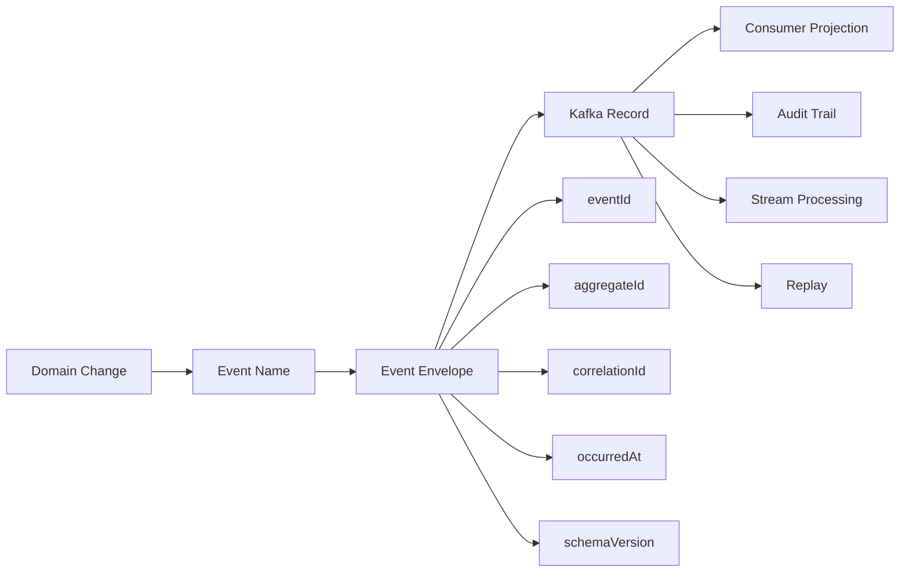
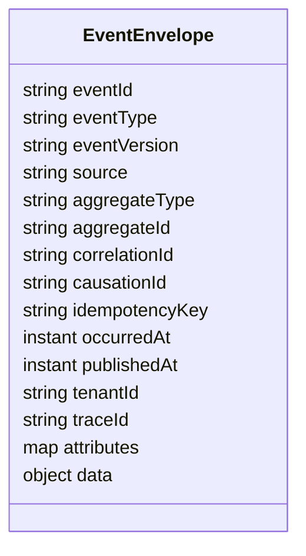
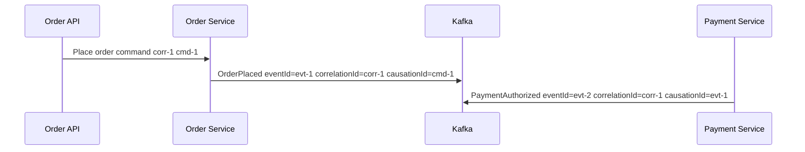
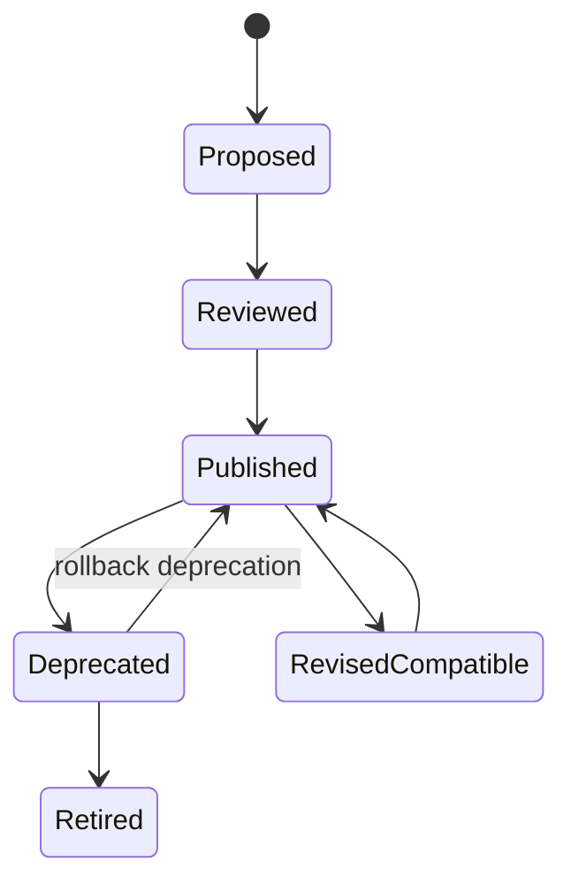
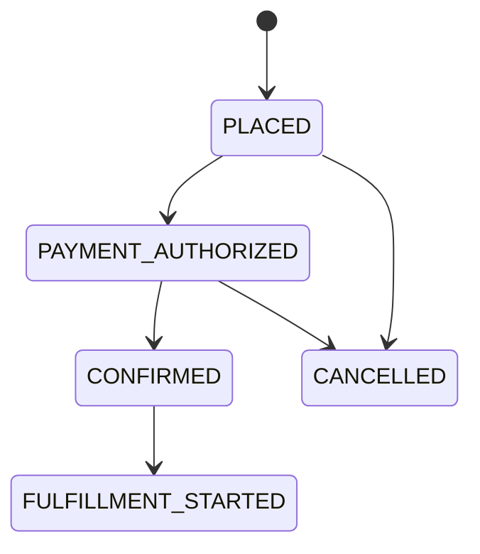
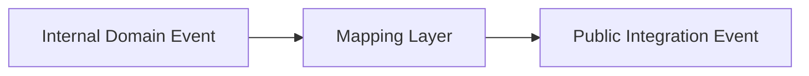

# Part 013 — Event Design and Versioning

Part 012 focused on schema contracts. This part moves one layer higher.

A schema can be syntactically compatible and still be a bad event. A Kafka event is not just a JSON/Avro/Protobuf payload moving through a topic. In a serious distributed system, an event becomes a long-lived record of a business fact, a coordination signal, an integration contract, a replay source, and sometimes an audit artifact.

The core question in this part:

> How do we design Kafka events that remain correct, understandable, evolvable, and useful after the original producer team has changed, downstream consumers have multiplied, and the system has been replayed many times?

Kafka gives us durable ordered logs. It does not automatically give us good event semantics.

---

## 1. Kaufman Skill Decomposition

The skill is **event modeling for distributed systems**.

We deconstruct it into subskills:

| Subskill | Production Meaning |
|---|---|
| Fact modeling | Distinguish facts from commands, requests, snapshots, and notifications. |
| Naming | Name events after business state changes, not implementation details. |
| Envelope design | Carry metadata required for tracing, causality, replay, audit, and routing. |
| Identity design | Use stable event IDs, aggregate IDs, correlation IDs, causation IDs, and idempotency keys. |
| Time semantics | Separate event time, processing time, ingestion time, and valid/business time. |
| Versioning | Evolve schema and meaning without breaking consumers. |
| Topic placement | Decide whether event type, aggregate type, bounded context, or lifecycle stage defines the topic. |
| Consumer empathy | Design events so consumers can act without hidden producer knowledge. |
| Replay safety | Make events deterministic enough to rebuild projections. |
| Governance | Use review rules, compatibility checks, and deprecation policy. |

### 1.1 Target Capability

After this part, we want to be able to look at an event and answer:

1. What business fact happened?
2. Who owns the meaning of this fact?
3. What entity or aggregate does it belong to?
4. Is ordering needed, and along what key?
5. Can the event be replayed safely?
6. Can future consumers understand it without reading the producer code?
7. Can the event evolve without semantic traps?
8. Can the event support audit, debugging, and incident reconstruction?

That is the difference between producing messages and designing event contracts.

---

## 2. Mental Model: Event as Durable Business Evidence

A Kafka record has:

- topic;
- partition;
- offset;
- key;
- value;
- headers;
- timestamp.

An event has more meaning:

- something happened;
- at a business-relevant time;
- to a business entity or process;
- under a causal chain;
- observed and emitted by a responsible service;
- with enough data for intended consumers;
- under an explicit compatibility and retention policy.

A good event is not merely serializable. It is interpretable.



### 2.1 The Production Rule

A Kafka event should survive these changes:

- the producer implementation is rewritten;
- the consumer team changes;
- a new downstream use case appears;
- data is replayed months later;
- schema evolves;
- a bug investigation needs causality;
- a regulator asks why a state transition happened.

If the event is only understandable with current code and tribal knowledge, it is not a production-grade event.

---

## 3. Event, Command, Message, Notification, and Snapshot

Many Kafka systems fail because teams call every record an event.

### 3.1 Event

An event is a statement of fact.

Examples:

- `OrderPlaced`
- `QuoteApproved`
- `PaymentCaptured`
- `CustomerAddressChanged`
- `FraudReviewEscalated`
- `CaseAssigned`
- `EntitlementRevoked`

Good event names use past tense because the change already happened.

```text
Good:    OrderPlaced
Weak:    PlaceOrder
Bad:     OrderMessage
Bad:     OrderData
Bad:     OrderUpdated
```

`OrderUpdated` is often too vague. It hides what changed. If different consumers care about different changes, vague update events force consumers to diff payloads or infer intent.

### 3.2 Command

A command expresses intent.

Examples:

- `PlaceOrder`
- `ApproveQuote`
- `CapturePayment`
- `AssignCase`

Commands can be sent through Kafka, but they have different semantics:

- there is usually an intended handler;
- failure matters to the sender;
- duplicate handling must be explicit;
- ordering and retry can change side effects;
- authorization is usually important.

Kafka can carry commands, but Kafka topics are not a replacement for every synchronous workflow. A command topic should not pretend to be a fact log.

### 3.3 Notification

A notification says: “something may have changed; check the source.”

Example:

```json
{
  "eventType": "CustomerChanged",
  "customerId": "cus-123"
}
```

This is lighter than an event-carried state transfer. It reduces payload duplication but increases coupling to a source API.

### 3.4 Snapshot

A snapshot carries current state at a point in time.

Examples:

- `CustomerSnapshotPublished`
- `InventoryPositionSnapshot`
- `AccountBalanceSnapshot`

Snapshots are useful for bootstrapping and compacted topics, but they are not the same as business events. A snapshot tells what is true now. An event tells what changed.

### 3.5 Event-Carried State Transfer

This event includes enough changed state for consumers to update themselves without calling the producer.

Example:

```json
{
  "eventType": "CustomerAddressChanged",
  "customerId": "cus-123",
  "newAddress": {
    "country": "ID",
    "city": "Jakarta",
    "postalCode": "12940"
  }
}
```

This reduces runtime coupling but creates a stronger data contract.

---

## 4. Event Naming Rules

Event names should be stable, precise, and domain-owned.

### 4.1 Use Business Language

Prefer:

```text
QuoteApproved
OrderSubmitted
InvoiceIssued
CaseEscalated
PolicySuspended
```

Avoid:

```text
QuoteRowInserted
OrderDTOUpdated
InvoiceControllerCompleted
CaseStatusChangedToE2
PolicyTableChanged
```

Implementation-oriented names leak internals and become obsolete.

### 4.2 Prefer Specific Facts Over Generic Update Events

Generic events are tempting:

```text
CustomerUpdated
OrderUpdated
CaseUpdated
ProductChanged
```

They look flexible but push complexity to consumers.

Specific events are better when the meaning differs:

```text
CustomerEmailChanged
CustomerKycVerified
CustomerRiskTierChanged
OrderDeliveryAddressChanged
OrderCancelled
OrderFulfillmentStarted
```

### 4.3 When Generic Events Are Acceptable

Generic change events can be valid when:

- the topic is a CDC stream;
- consumers are data replication systems;
- payload includes explicit changed fields;
- consumers do not need business intent;
- event name is intentionally technical.

Example:

```text
CustomerRecordChanged
```

This is acceptable for CDC. It is weaker for domain integration.

---

## 5. Event Envelope Design

A production event usually needs an envelope.

The envelope should contain cross-cutting metadata. The payload should contain domain data.



### 5.1 Recommended Envelope Fields

| Field | Meaning | Required? |
|---|---|---|
| `eventId` | Unique identity of this event occurrence. | Yes |
| `eventType` | Stable name such as `OrderPlaced`. | Yes |
| `eventVersion` | Semantic/schema version of event type. | Yes |
| `source` | Service or bounded context that emitted the event. | Yes |
| `aggregateType` | Entity/process type such as `Order`, `Quote`, `Case`. | Usually |
| `aggregateId` | Business identity used for ordering and correlation. | Usually |
| `correlationId` | End-to-end business request/process correlation. | Yes |
| `causationId` | Event/command/message that caused this event. | Recommended |
| `idempotencyKey` | Key for deduplication or safe side effects. | Recommended |
| `occurredAt` | When the business fact happened. | Yes |
| `publishedAt` | When the event was published to Kafka. | Recommended |
| `tenantId` | Tenant boundary in multi-tenant systems. | If multi-tenant |
| `traceId` | Distributed tracing identity. | Recommended |
| `data` | Domain payload. | Yes |

### 5.2 Why `eventId` Matters

Without `eventId`, consumers struggle to deduplicate.

`eventId` should identify the occurrence, not merely the aggregate.

```text
orderId = ord-123

OrderPlaced eventId       = evt-001
OrderPaymentCaptured      = evt-002
OrderShipmentRequested    = evt-003
```

If the producer retries the same send, it should ideally preserve the same `eventId`. If the business action is re-executed, it may create a new event. That distinction is important.

### 5.3 Why `correlationId` Matters

`correlationId` connects all records in one business journey.

Example:

```text
HTTP request: POST /orders
correlationId: corr-789

OrderPlaced.correlationId = corr-789
PaymentAuthorized.correlationId = corr-789
InventoryReserved.correlationId = corr-789
FulfillmentStarted.correlationId = corr-789
```

This supports:

- debugging;
- tracing;
- audit;
- customer support;
- incident reconstruction;
- compliance reporting.

### 5.4 Why `causationId` Matters

`causationId` points to the immediate cause.



`correlationId` groups the journey. `causationId` explains the direct chain.

### 5.5 Why `occurredAt` and `publishedAt` Are Different

`occurredAt` is business time.

`publishedAt` is broker publication time or producer publication time.

They differ when:

- outbox publishing is delayed;
- producer retries;
- CDC connector lags;
- offline device data arrives later;
- batch job emits historical events;
- replay republishes old events.

Never use Kafka ingestion time as a universal substitute for domain time.

---

## 6. CloudEvents and Kafka Event Metadata

CloudEvents is a specification for describing event data in a common way across services, platforms, and systems. It defines standard attributes such as event ID, source, type, subject, time, content type, and data schema.

Kafka systems do not have to use CloudEvents, but the specification is useful as a vocabulary.

A CloudEvents-like envelope can reduce custom metadata drift across teams.

Example JSON shape:

```json
{
  "specversion": "1.0",
  "id": "evt-01J2RF7Z6PTFZ7A5CXQ2J7G8HG",
  "source": "urn:service:order-service",
  "type": "com.example.order.OrderPlaced.v1",
  "subject": "order/ord-123",
  "time": "2026-07-01T09:31:02Z",
  "datacontenttype": "application/json",
  "dataschema": "https://schema.example.com/order-placed/v1",
  "correlationid": "corr-abc",
  "causationid": "cmd-xyz",
  "data": {
    "orderId": "ord-123",
    "customerId": "cus-456",
    "totalAmount": "250000.00",
    "currency": "IDR"
  }
}
```

### 6.1 Practical Rule

Use CloudEvents when you need cross-platform interoperability or organization-wide event consistency.

Use a custom envelope when your organization has deeper domain-specific needs, but do not invent names randomly. Align with common concepts where possible.

---

## 7. Kafka Key Design and Event Identity

Part 008 covered partitioning. Here we focus on semantic identity.

The Kafka record key should usually represent the ordering boundary.

For aggregate events:

```text
key = aggregateId
```

Examples:

| Event | Recommended Key | Reason |
|---|---|---|
| `OrderPlaced` | `orderId` | Order lifecycle must be ordered per order. |
| `OrderCancelled` | `orderId` | Must follow prior order events. |
| `CustomerEmailChanged` | `customerId` | Customer profile changes must be ordered per customer. |
| `InventoryReserved` | `skuId + warehouseId` | Inventory consistency is usually per item-location. |
| `CaseEscalated` | `caseId` | Case lifecycle ordering. |

### 7.1 Key Is Not Always Event ID

`eventId` is unique per event occurrence.

`key` is usually stable per entity or ordering boundary.

```text
key     = order-123
value.eventId = evt-999
```

If `key = eventId`, every event may scatter across partitions, destroying per-aggregate ordering.

### 7.2 Key Should Match Consumer Invariants

Ask:

> What must not be processed out of order?

That answer often gives the key.

---

## 8. Event Payload Design

A payload should be sufficient, minimal, and stable.

### 8.1 Sufficient

A consumer should not need hidden producer state for normal operation.

Weak:

```json
{
  "orderId": "ord-123",
  "status": "APPROVED"
}
```

Better:

```json
{
  "orderId": "ord-123",
  "approval": {
    "approvedAt": "2026-07-01T09:31:02Z",
    "approvedBy": "user-17",
    "approvalPolicy": "AUTO_LOW_RISK_V3",
    "riskScore": 21
  }
}
```

The better event explains why the state changed.

### 8.2 Minimal

Do not dump the full database row into every domain event unless the event is explicitly a snapshot or CDC record.

Bad domain event:

```json
{
  "orderId": "ord-123",
  "customerId": "cus-456",
  "internalLockVersion": 14,
  "dbShard": "s3",
  "lastModifiedByBatchJob": false,
  "hibernateProxyClass": "...",
  "allFieldsFromOrderTable": "..."
}
```

Too much data expands contract surface and makes future changes expensive.

### 8.3 Stable

Avoid fields that expose implementation details:

- database table names;
- internal enum codes without domain meaning;
- framework class names;
- temporary workflow stage names;
- internal retry attempt counters;
- storage shard identifiers;
- UI-specific labels.

### 8.4 Payload Should Not Require Diffing

If the business event is `CustomerEmailChanged`, include old and new values when useful:

```json
{
  "customerId": "cus-123",
  "oldEmail": "old@example.com",
  "newEmail": "new@example.com",
  "changedBy": "user-7",
  "reason": "CUSTOMER_REQUEST"
}
```

Do not force consumers to reconstruct prior state just to understand what happened.

---

## 9. Event Versioning Strategy

There are two types of versioning:

1. **Schema versioning** — shape-level compatibility.
2. **Semantic versioning** — meaning-level compatibility.

Part 012 covered schema. Here we focus on meaning.

### 9.1 Semantic Versioning Is Harder Than Schema Versioning

This can be schema-compatible but semantically breaking:

```text
field: status
old meaning: approval status
new meaning: fulfillment status
```

The field name and type stay the same. Consumers still deserialize. But their logic becomes wrong.

### 9.2 Compatible Event Changes

Usually safe:

- add optional field with default;
- add metadata field;
- add enum value only if consumers tolerate unknown values;
- add nested optional object;
- document stronger constraints without invalidating existing data.

### 9.3 Dangerous Event Changes

Usually unsafe:

- rename event type;
- change event meaning;
- change key semantics;
- change timestamp meaning;
- remove field still used by consumers;
- turn optional field into required field;
- change unit or currency semantics;
- reuse enum value with new meaning;
- collapse multiple precise events into one vague event;
- split one event into multiple required events without migration.

### 9.4 Version in Event Type or Schema?

Common options:

```text
Event type includes version:
com.example.order.OrderPlaced.v1
com.example.order.OrderPlaced.v2

Schema Registry handles version:
subject = orders-value
schema version = 7
```

Both can work, but they solve different problems.

| Strategy | Good For | Risk |
|---|---|---|
| Schema Registry version only | Compatible structural evolution. | Semantic breaking changes can hide. |
| Event type version | Semantic breaking changes. | Too many event types if overused. |
| Topic version | Major migration or new lifecycle. | Operational complexity and duplicated streams. |

### 9.5 Recommended Rule

Use schema evolution for compatible changes.

Use new event type or topic for semantic breaking changes.

Do not hide semantic breaking changes behind schema compatibility.

---

## 10. Event Lifecycle Model

Events need lifecycle management.



### 10.1 Proposed

Before publishing:

- identify owner;
- define event type;
- define topic;
- define key;
- define envelope;
- define payload;
- define consumers if known;
- define retention;
- define compatibility mode;
- define examples;
- define PII classification.

### 10.2 Reviewed

Architecture review should check:

- Is this event a fact?
- Is the name precise?
- Is the key correct?
- Does payload expose internals?
- Is replay safe?
- Is schema compatibility defined?
- Are time semantics explicit?
- Is ownership clear?

### 10.3 Published

Once published, assume unknown consumers can appear. Even internal topics become organizational contracts quickly.

### 10.4 Deprecated

Deprecation requires:

- replacement event;
- migration guide;
- consumer inventory;
- deadline;
- monitoring;
- rollback plan.

### 10.5 Retired

Retirement can happen only when:

- no active producers emit old event;
- no active consumers require old event;
- historical replay requirement is understood;
- retention/audit obligations allow removal.

---

## 11. Topic Design and Event Design

Topic design shapes consumer coupling.

### 11.1 Topic Per Aggregate Type

Example:

```text
order.events
customer.events
payment.events
```

Good when:

- lifecycle events share ordering boundary;
- consumers commonly need all changes for an aggregate;
- event volume is manageable;
- one bounded context owns the stream.

Risk:

- topic becomes a mixed bag;
- many consumers filter most records;
- schema subject strategy becomes more complex.

### 11.2 Topic Per Event Type

Example:

```text
order.placed
order.cancelled
payment.captured
```

Good when:

- event types have very different consumers;
- volume differs greatly;
- retention differs;
- security differs;
- schema simplicity matters.

Risk:

- topic explosion;
- harder lifecycle reconstruction;
- consumers subscribe to many topics.

### 11.3 Topic Per Bounded Context

Example:

```text
sales.events
billing.events
fulfillment.events
```

Good when:

- team ownership maps to bounded contexts;
- consumers care about domain context;
- governance is organized by domain.

Risk:

- too broad if context is large;
- consumers may receive unrelated events.

### 11.4 Topic Per Tenant Is Usually Dangerous

Avoid topic-per-tenant unless there are strong isolation, regulatory, or throughput reasons.

Topic-per-tenant can create:

- operational explosion;
- ACL sprawl;
- consumer subscription complexity;
- metadata overhead;
- uneven partition distribution.

Often better:

```text
key = tenantId + aggregateId
payload.tenantId = tenantId
ACL = service-level or prefixed topic-level
```

But strict regulated isolation may justify physical separation.

---

## 12. Event Design for Regulatory and Audit Systems

For enforcement lifecycle, case management, compliance, and regulatory systems, event design needs stronger guarantees.

### 12.1 Audit-Grade Event Requirements

An audit-grade event should answer:

- what changed;
- when it happened;
- who or what caused it;
- under which rule/policy/version;
- which prior event or command caused it;
- what data was known at decision time;
- whether the event was automatic or manual;
- whether the event is reversible;
- which user/service had authority;
- whether any correction event superseded it.

### 12.2 Example: Case Escalation Event

```json
{
  "eventId": "evt-01J2S0...",
  "eventType": "CaseEscalated",
  "eventVersion": "1.0",
  "source": "case-management-service",
  "aggregateType": "Case",
  "aggregateId": "case-2026-00091",
  "correlationId": "corr-921",
  "causationId": "evt-previous",
  "occurredAt": "2026-07-01T10:20:00Z",
  "publishedAt": "2026-07-01T10:20:02Z",
  "data": {
    "caseId": "case-2026-00091",
    "fromLevel": "L1_REVIEW",
    "toLevel": "L2_ENFORCEMENT_REVIEW",
    "reasonCode": "SLA_BREACH",
    "ruleId": "case-escalation-policy",
    "ruleVersion": "2026.07.0",
    "actorType": "SYSTEM",
    "actorId": "sla-monitor-service",
    "decisionInputs": {
      "ageHours": 73,
      "slaThresholdHours": 72,
      "priority": "HIGH"
    }
  }
}
```

The event is not just `status = ESCALATED`. It preserves the decision context.

### 12.3 Corrections Instead of Mutation

Kafka logs are append-oriented. If a prior event was wrong, prefer a correction event.

Examples:

```text
CaseEscalationCorrected
InvoiceIssuedCorrected
PaymentAllocationReversed
CustomerKycDecisionRevised
```

Do not pretend the old event never happened if auditability matters.

---

## 13. Java Event Envelope Example

Below is a simple Java shape. In production, this might be generated from Avro/Protobuf or represented as a generic envelope plus typed payload.

```java
import java.time.Instant;
import java.util.Map;
import java.util.Objects;

public record EventEnvelope<T>(
        String eventId,
        String eventType,
        String eventVersion,
        String source,
        String aggregateType,
        String aggregateId,
        String correlationId,
        String causationId,
        String idempotencyKey,
        Instant occurredAt,
        Instant publishedAt,
        String tenantId,
        String traceId,
        Map<String, String> attributes,
        T data
) {
    public EventEnvelope {
        Objects.requireNonNull(eventId, "eventId");
        Objects.requireNonNull(eventType, "eventType");
        Objects.requireNonNull(eventVersion, "eventVersion");
        Objects.requireNonNull(source, "source");
        Objects.requireNonNull(occurredAt, "occurredAt");
        Objects.requireNonNull(data, "data");
    }
}
```

Payload example:

```java
import java.math.BigDecimal;
import java.time.Instant;

public record OrderPlaced(
        String orderId,
        String customerId,
        BigDecimal totalAmount,
        String currency,
        Instant placedAt
) {}
```

Producer sketch:

```java
EventEnvelope<OrderPlaced> event = new EventEnvelope<>(
        eventId,
        "OrderPlaced",
        "1.0",
        "order-service",
        "Order",
        orderId,
        correlationId,
        commandId,
        commandId,
        placedAt,
        Instant.now(),
        tenantId,
        traceId,
        Map.of("channel", "api"),
        new OrderPlaced(orderId, customerId, totalAmount, "IDR", placedAt)
);

ProducerRecord<String, EventEnvelope<OrderPlaced>> record =
        new ProducerRecord<>("order.events", orderId, event);

producer.send(record);
```

Key point:

```text
Kafka key = orderId
Envelope eventId = unique event occurrence
Envelope idempotencyKey = stable command/business action identity
```

---

## 14. Header vs Payload Metadata

Kafka headers are useful but not always visible in downstream tooling.

### 14.1 Good Header Uses

Headers are good for:

- trace propagation;
- content type;
- schema metadata;
- lightweight routing hints;
- producer library metadata;
- compression/encryption markers;
- framework integration.

### 14.2 Good Payload Metadata Uses

Payload envelope is better for:

- event ID;
- event type;
- business time;
- correlation ID;
- causation ID;
- aggregate ID;
- tenant ID;
- audit attributes.

Why? Because payload is usually persisted, indexed, replayed, transformed, and inspected more consistently than headers.

### 14.3 Practical Rule

If losing the metadata would break audit, replay, or business interpretation, put it in the envelope payload, not only in Kafka headers.

---

## 15. Time Semantics

Time is one of the most common sources of subtle bugs.

### 15.1 Types of Time

| Time | Meaning | Example |
|---|---|---|
| Event time | When the business fact happened. | Customer placed order at 10:01. |
| Publish time | When producer emitted to Kafka. | Producer sent at 10:02. |
| Broker timestamp | Kafka record timestamp. | Broker log timestamp. |
| Processing time | When consumer processed it. | Projection updated at 10:03. |
| Valid time | When fact is valid in business domain. | Policy effective from Aug 1. |
| Transaction time | When system recorded the fact. | DB committed at 10:01:59. |

### 15.2 Example

A regulatory policy change is approved today but effective next month.

```json
{
  "eventType": "PolicyRuleApproved",
  "occurredAt": "2026-07-01T10:00:00Z",
  "publishedAt": "2026-07-01T10:00:02Z",
  "data": {
    "ruleId": "late-filing-penalty-v4",
    "approvedAt": "2026-07-01T10:00:00Z",
    "effectiveFrom": "2026-08-01T00:00:00Z"
  }
}
```

Consumers must not confuse approval time with effective time.

---

## 16. Event Ordering and Causality

Kafka orders records per partition. It does not globally order a distributed business process.

### 16.1 Per-Aggregate Ordering

For order lifecycle:

```text
key = orderId
```

Expected sequence:

```text
OrderPlaced -> PaymentAuthorized -> OrderConfirmed -> FulfillmentStarted
```

But payment may be owned by another service. Its topic may use `paymentId` or `orderId` depending on design. Cross-topic ordering is not guaranteed.

### 16.2 Causality Is Not the Same as Offset Order

Offset order tells:

```text
record A appeared before record B in one partition
```

Causality tells:

```text
record B happened because of record A
```

Use `causationId` for causality, not offset arithmetic.

### 16.3 State Machine Consumers

For lifecycle consumers, enforce allowed transitions.



Consumer rule:

```text
Never trust event arrival order alone. Validate transition invariants.
```

---

## 17. Idempotency and Event Design

Idempotency is easier when the event carries the right identity.

### 17.1 Consumer Dedup Table

```sql
CREATE TABLE processed_event (
    consumer_name VARCHAR(120) NOT NULL,
    event_id VARCHAR(120) NOT NULL,
    processed_at TIMESTAMPTZ NOT NULL DEFAULT now(),
    PRIMARY KEY (consumer_name, event_id)
);
```

Consumer flow:

```text
1. Begin transaction.
2. Insert (consumer_name, event_id).
3. If duplicate key, skip.
4. Apply side effect/projection.
5. Commit transaction.
6. Commit Kafka offset.
```

### 17.2 Idempotency Key vs Event ID

`eventId` identifies the event occurrence.

`idempotencyKey` identifies the business action that should not be applied twice.

Example:

```text
Command: Approve quote commandId=cmd-123
Event: QuoteApproved eventId=evt-456 idempotencyKey=cmd-123
```

If the producer accidentally emits two different event IDs for the same command, consumers can still deduplicate by idempotency key when appropriate.

---

## 18. Event Design Patterns

### 18.1 Domain Event

Represents a business fact.

```text
OrderPlaced
InvoiceIssued
CaseEscalated
```

Use for service integration and business process propagation.

### 18.2 Integration Event

Externalized event intended for other bounded contexts.

It may be derived from internal domain events and cleaned for public consumption.



This protects internal model evolution.

### 18.3 CDC Event

Represents database row-level change.

Good for:

- replication;
- search indexing;
- analytics;
- migration;
- outbox publication.

Less ideal as a domain event because it may not express business intent.

### 18.4 State Snapshot Event

Represents full current state.

Good for compacted topics and cache warming.

### 18.5 Correction Event

Represents a correction to earlier facts.

Essential when audit matters.

### 18.6 Tombstone Event

In Kafka compacted topics, a record with key and null value can act as a tombstone for compaction. This is a storage/log semantics pattern and must be designed carefully because consumers need to understand deletion semantics.

---

## 19. Event Design Anti-Patterns

### 19.1 The DTO Dump

Producer serializes API response or database entity directly.

Problem:

- exposes internals;
- breaks consumers when API changes;
- includes irrelevant fields;
- couples event model to persistence or UI.

### 19.2 The Vague Update

```text
EntityUpdated
```

Problem:

- consumers infer intent;
- audit is weak;
- replay logic becomes conditional and fragile.

### 19.3 The Command Disguised as Event

```text
SendEmailEvent
```

This is likely a command: `SendEmail`.

Problem:

- unclear ownership;
- unclear success/failure semantics;
- retries may cause duplicate side effects.

### 19.4 The Global Event

```text
business.events
```

Everything goes into one mega-topic.

Problem:

- schema chaos;
- retention conflict;
- security conflict;
- consumer filtering overhead;
- ownership ambiguity.

### 19.5 The Meaning Mutation

Same event name, same field names, changed meaning.

Problem:

- compatibility tooling cannot detect it;
- consumers silently become wrong.

### 19.6 The Hidden Join Requirement

Event contains only IDs, but every consumer must call producer APIs to understand it.

Problem:

- runtime coupling;
- API fan-out;
- inconsistent reads;
- replay becomes slow or impossible.

---

## 20. Design Review Checklist

Before approving a new event, ask:

### 20.1 Semantics

- Is this a fact, command, notification, or snapshot?
- Is the event name past tense and business meaningful?
- Is the event precise enough?
- Does it represent a stable concept?

### 20.2 Ownership

- Which bounded context owns the event?
- Who approves schema changes?
- Who handles deprecation?
- Who supports consumers during incidents?

### 20.3 Kafka Placement

- Which topic?
- Which key?
- How many partitions?
- Is ordering boundary explicit?
- Is retention appropriate?
- Is compaction appropriate?

### 20.4 Contract

- Is schema compatibility mode defined?
- Are examples included?
- Are enum evolution rules documented?
- Are nullable fields intentional?
- Are units and currency explicit?

### 20.5 Operations

- Can event be replayed?
- Can consumer deduplicate?
- Can we trace causality?
- Can we diagnose producer bugs?
- Can we migrate to v2 safely?

### 20.6 Compliance

- Does it contain PII?
- Does it contain secrets?
- Does retention violate policy?
- Does it need encryption or tokenization?
- Does it preserve decision context?

---

## 21. ADR Template for Event Design

```md
# ADR: Publish <EventName>

## Status
Proposed | Accepted | Deprecated | Retired

## Context
What business state change needs to be communicated?

## Event Classification
Domain event | Integration event | CDC event | Snapshot | Command | Notification

## Event Name
<EventName>

## Owner
<service/team/bounded context>

## Topic
<topic-name>

## Key
<key expression>

## Ordering Requirement
What must be ordered and why?

## Envelope
Required metadata fields.

## Payload
Fields, meaning, units, examples.

## Schema Strategy
Format, subject, compatibility mode.

## Versioning Strategy
Compatible evolution rules and breaking-change plan.

## Consumers
Known consumers and expected use.

## Retention and Replay
Retention period, compaction, replay safety.

## Security and Privacy
PII, secrets, tenant boundary, ACL.

## Audit Requirement
Decision context and causality fields.

## Alternatives Considered
API call, command topic, CDC, batch file, database read.
```

---

## 22. Worked Example: Bad to Better Event

### 22.1 Initial Event

```json
{
  "eventType": "OrderUpdated",
  "orderId": "ord-123",
  "status": "APPROVED"
}
```

Problems:

- vague name;
- unclear status dimension;
- no event ID;
- no causality;
- no business time;
- no reason;
- weak audit value;
- hard to version semantically.

### 22.2 Better Event

```json
{
  "eventId": "evt-01J2S4TRZ6T8H0JX0FZP9M7E8R",
  "eventType": "OrderApproved",
  "eventVersion": "1.0",
  "source": "order-service",
  "aggregateType": "Order",
  "aggregateId": "ord-123",
  "correlationId": "corr-abc",
  "causationId": "cmd-approve-789",
  "idempotencyKey": "cmd-approve-789",
  "occurredAt": "2026-07-01T10:10:00Z",
  "publishedAt": "2026-07-01T10:10:01Z",
  "tenantId": "tenant-a",
  "data": {
    "orderId": "ord-123",
    "approvalType": "AUTO",
    "approvedBy": "risk-policy-engine",
    "policyId": "order-approval-policy",
    "policyVersion": "2026.07.0",
    "riskScore": 18,
    "currency": "IDR",
    "totalAmount": "250000.00"
  }
}
```

This event is longer, but it is more useful and safer.

### 22.3 When Shorter Is Better

Not every event needs everything. A high-volume telemetry event may intentionally use a compact schema.

The rule is not “always verbose”. The rule is:

> Include enough information for the event's operational, business, audit, and replay purpose.

---

## 23. Practice Lab

### 23.1 Lab: Redesign Vague Events

Given these events:

```text
CustomerUpdated
PaymentChanged
CaseStatusUpdated
QuoteModified
OrderProcessed
```

For each, produce:

1. more precise event names;
2. aggregate key;
3. envelope fields;
4. required payload fields;
5. versioning concern;
6. replay concern.

### 23.2 Lab: Design Event for Case Escalation

Design a `CaseEscalated` event for a regulatory case system.

Requirements:

- support audit;
- preserve rule version;
- support manual and automatic escalation;
- allow replay into a read model;
- support deduplication;
- avoid PII leakage where not needed.

Deliverables:

- event name;
- topic;
- key;
- envelope;
- payload;
- schema compatibility mode;
- sample JSON;
- ADR.

### 23.3 Lab: Breaking Change Detection

Review this proposed change:

```text
OrderApproved.v1:
  approvedBy = user ID or service ID

OrderApproved.v2:
  approvedBy = display name
```

Question:

- Is this schema-compatible?
- Is it semantically compatible?
- How should it be changed safely?

Expected answer:

- It may be schema-compatible if the field remains string.
- It is semantically breaking because identity semantics changed.
- Add a new field such as `approvedByDisplayName`, keep `approvedByActorId`, or publish a new event version.

---

## 24. Production Readiness Rubric

| Level | Event Design Capability |
|---|---|
| L1 | Can produce and consume typed events. |
| L2 | Can distinguish event, command, snapshot, and notification. |
| L3 | Can design envelope, key, time, and versioning strategy. |
| L4 | Can review event contracts for compatibility, replay, audit, privacy, and ownership. |
| L5 | Can govern an organization-wide event model across teams and lifecycles. |

Top-level Kafka engineers operate at L4/L5. They do not only ask “does it serialize?” They ask “will this event still be correct under replay, scale, audit, and evolution?”

---

## 25. Key Takeaways

- A Kafka event is a durable statement of fact, not merely a message payload.
- Good event names are precise, past tense, and domain-owned.
- Event schema compatibility is not enough; semantic compatibility matters more.
- Use stable identifiers: `eventId`, `aggregateId`, `correlationId`, `causationId`, and idempotency keys.
- Keep Kafka key aligned with ordering boundary.
- Separate `occurredAt`, `publishedAt`, processing time, and effective/valid time.
- Do not mutate event meaning under the same name.
- In audit-grade systems, preserve decision context, actor, rule version, and causality.
- Treat event lifecycle as a governed product: proposed, reviewed, published, deprecated, retired.

---

## 26. References

- Apache Kafka Documentation — https://kafka.apache.org/documentation/
- Apache Kafka Design — https://kafka.apache.org/42/design/design/
- Confluent Schema Evolution and Compatibility — https://docs.confluent.io/platform/current/schema-registry/fundamentals/schema-evolution.html
- CloudEvents Specification — https://github.com/cloudevents/spec
- CloudEvents Project — https://cloudevents.io/
