# Part 014 — Communication Patterns with Kafka

Part 013 designed good events. This part asks a larger architectural question:

> When should services communicate through Kafka, and what pattern are they actually using?

Kafka is often introduced as “asynchronous communication.” That is true but incomplete. Kafka communication can mean many different things:

- event notification;
- event-carried state transfer;
- command dispatch;
- request/reply;
- workflow choreography;
- CDC integration;
- stream processing pipeline;
- audit/event log;
- data distribution backbone.

These patterns have different correctness, coupling, latency, ownership, retry, and observability consequences.

A top-level engineer does not say “use Kafka because it is scalable.” They ask:

- What kind of communication is this?
- Who owns the fact or decision?
- Does the sender need an answer?
- Is ordering required?
- What happens if the consumer is down?
- What happens if the event is replayed?
- What is the failure boundary?
- Is Kafka reducing coupling or just hiding it?

---

## 1. Kaufman Skill Decomposition

The skill is **choosing and implementing Kafka communication patterns intentionally**.

| Subskill | Production Meaning |
|---|---|
| Pattern identification | Recognize whether a Kafka topic carries facts, commands, snapshots, or requests. |
| Coupling analysis | Understand temporal, semantic, data, operational, and ownership coupling. |
| Delivery reasoning | Choose retry, DLQ, idempotency, and offset strategy per pattern. |
| Ordering design | Align topic key and partition count with business ordering needs. |
| Consumer isolation | Let services evolve independently without accidental shared internals. |
| Workflow design | Decide between choreography, orchestration, and hybrid coordination. |
| API vs Kafka choice | Know when synchronous API is better than Kafka. |
| Replay safety | Know which patterns can be replayed and which must not be blindly replayed. |
| Observability | Trace asynchronous flows end to end. |
| Governance | Make topic ownership, schema ownership, and consumer contracts explicit. |

### 1.1 Practice Goal

By the end of this part, you should be able to take a business interaction like “approve quote and start fulfillment” and decide whether to use:

- REST/gRPC;
- Kafka domain event;
- Kafka command topic;
- Kafka request/reply;
- workflow engine;
- CDC/outbox;
- stream processing pipeline;
- some combination of these.

---

## 2. Communication Is Not Just Transport

A service communication choice defines:

- timing;
- ownership;
- failure behavior;
- retry behavior;
- consistency boundary;
- observability model;
- data contract;
- operational responsibility.

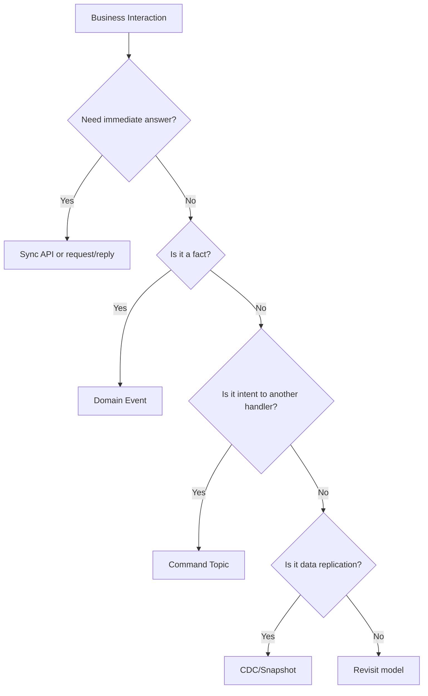

Kafka is excellent when you want durable asynchronous distribution. It is weaker when you need immediate validation, low-latency request/response, strict per-request success semantics, or human-readable transactional boundaries without additional design.

---

## 3. Coupling Model

Kafka can reduce temporal coupling, but it does not eliminate all coupling.

### 3.1 Types of Coupling

| Coupling Type | Meaning | Kafka Effect |
|---|---|---|
| Temporal coupling | Sender and receiver must be online at same time. | Usually reduced. |
| Location coupling | Sender must know receiver network location. | Reduced. |
| Semantic coupling | Receiver depends on meaning of data. | Still exists. |
| Schema coupling | Receiver depends on payload shape. | Still exists; managed by schema governance. |
| Operational coupling | Sender/receiver share failure impact. | Reduced but not eliminated. |
| Ordering coupling | Receiver depends on event order. | Must be designed via key/partition. |
| Lifecycle coupling | Event cannot change without coordinating consumers. | Still exists. |
| Backpressure coupling | Slow consumer affects sender. | Often reduced; broker absorbs, but lag grows. |

### 3.2 The Hidden Coupling Trap

A common anti-pattern:

```text
Service A emits event with only entity ID.
Service B consumes event and immediately calls Service A API to fetch details.
```

This looks asynchronous but creates runtime coupling:

- replay depends on Service A API availability;
- B sees current state, not event-time state;
- API spikes during replay;
- B may observe data inconsistent with the event;
- Service A cannot change API without affecting B.

This may still be acceptable for lightweight notifications, but it must be intentional.

---

## 4. Pattern 1: Publish/Subscribe Domain Events

### 4.1 Intent

A service publishes a fact. Many consumers may react independently.

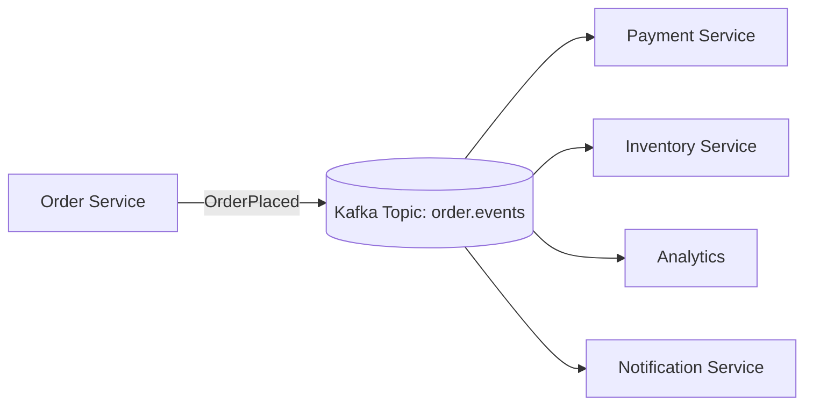

### 4.2 Example

```text
Topic: order.events
Key: orderId
Event: OrderPlaced
```

Consumers:

- payment initiates authorization;
- inventory reserves stock;
- analytics updates funnel metrics;
- notification sends confirmation;
- audit stores journey.

### 4.3 Strengths

- decouples producer from consumers;
- supports fan-out;
- supports replay;
- supports independent scaling;
- supports late-joining consumers;
- preserves event history within retention.

### 4.4 Risks

- business flow becomes implicit;
- consumers can have hidden dependencies;
- duplicate side effects are possible;
- event schema becomes organizational contract;
- ordering is only per partition;
- failures are delayed and asynchronous.

### 4.5 Java Producer Sketch

```java
ProducerRecord<String, OrderPlaced> record =
        new ProducerRecord<>("order.events", orderId, orderPlaced);

producer.send(record, (metadata, exception) -> {
    if (exception != null) {
        // Persist failure, retry, or surface publication error depending on outbox strategy.
        log.error("Failed to publish OrderPlaced orderId={}", orderId, exception);
    }
});
```

### 4.6 Decision Rule

Use domain-event pub/sub when:

- a durable business fact occurred;
- multiple consumers may care;
- sender does not require immediate consumer response;
- eventual consistency is acceptable;
- replay is valuable;
- event can be designed as stable contract.

---

## 5. Pattern 2: Event-Carried State Transfer

### 5.1 Intent

The event carries enough state for consumers to update local views without calling the producer.

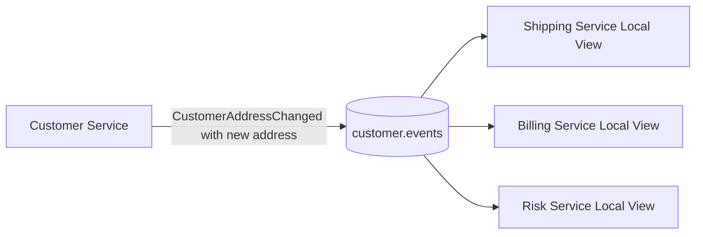

### 5.2 Example

```json
{
  "eventType": "CustomerAddressChanged",
  "customerId": "cus-123",
  "newAddress": {
    "country": "ID",
    "city": "Jakarta",
    "postalCode": "12940"
  },
  "changedAt": "2026-07-01T09:00:00Z"
}
```

### 5.3 Strengths

- reduces synchronous API calls;
- makes replay deterministic;
- allows consumer autonomy;
- protects producer from query fan-out;
- supports local read models.

### 5.4 Risks

- larger payloads;
- stronger data contract;
- PII propagation;
- data duplication;
- consumers may keep stale projections if they miss or mishandle events.

### 5.5 Data Minimization Rule

Carry enough state for intended consumers, not every producer field.

For regulated domains, classify each field:

| Field | Needed? | PII? | Retention Concern? | Consumer Justification |
|---|---:|---:|---:|---|
| customerId | Yes | Possibly | Medium | Entity identity |
| fullName | Maybe | Yes | High | Only if required |
| email | Maybe | Yes | High | Notification use case |
| riskTier | Yes | No/medium | Medium | Risk decisions |
| internalDbVersion | No | No | Low | Producer internal only |

### 5.6 Decision Rule

Use event-carried state transfer when:

- consumers need stable event-time state;
- API fan-out would be harmful;
- replay must not depend on current producer API state;
- data contract and privacy controls are manageable.

---

## 6. Pattern 3: Lightweight Event Notification

### 6.1 Intent

The event tells consumers that something changed, but consumers fetch details elsewhere if needed.

```mermaid
flowchart LR
    A[Product Service] -->|ProductChanged productId| K[(product.notifications)]
    K --> B[Search Indexer]
    B -->|GET /products/{id}| A
```

### 6.2 Example

```json
{
  "eventType": "ProductChanged",
  "productId": "prd-123",
  "changedAt": "2026-07-01T09:10:00Z"
}
```

### 6.3 Strengths

- small payload;
- lower schema complexity;
- avoids publishing sensitive data broadly;
- useful for cache invalidation;
- simple for low-criticality updates.

### 6.4 Risks

- consumer runtime dependency on producer API;
- replay may fetch current state, not historical state;
- producer API may be overloaded during catch-up;
- failure modes cross asynchronous/synchronous boundary;
- less useful for audit.

### 6.5 Decision Rule

Use notification events when:

- consumers only need to know “something changed”;
- historical event-time state is not required;
- API lookup is acceptable;
- producer API can handle replay/catch-up traffic;
- privacy concerns make full event payload undesirable.

Do not use notification events when consumers need deterministic reconstruction.

---

## 7. Pattern 4: Command Topic

### 7.1 Intent

A producer sends an instruction to be handled by one logical handler group.

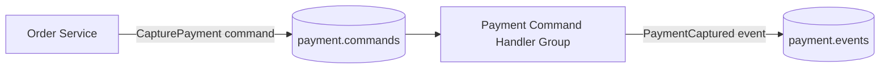

### 7.2 Command vs Event

| Command | Event |
|---|---|
| Intent | Fact |
| Usually imperative | Usually past tense |
| Has target capability | Broadcastable |
| May fail as business operation | Already happened |
| Requires handler semantics | Requires consumer interpretation |
| Replay can be dangerous | Replay is often expected |

### 7.3 Example Command

```json
{
  "commandId": "cmd-789",
  "commandType": "CapturePayment",
  "target": "payment-service",
  "correlationId": "corr-123",
  "issuedAt": "2026-07-01T09:11:00Z",
  "data": {
    "orderId": "ord-123",
    "paymentMethodId": "pm-456",
    "amount": "250000.00",
    "currency": "IDR"
  }
}
```

### 7.4 Command Handling Requirements

A command topic needs:

- command ID;
- idempotency key;
- authorization model;
- target handler ownership;
- response/event model;
- retry policy;
- DLQ policy;
- timeout/escalation model;
- duplicate command behavior;
- command expiry if applicable.

### 7.5 Replay Warning

Do not blindly replay command topics.

Replaying `CapturePayment` can charge customers again unless idempotency is perfect and external provider semantics are safe.

For audit, keep command history. For recovery, prefer replaying facts into projections rather than re-executing side-effecting commands.

### 7.6 Decision Rule

Use command topics when:

- sender does not need immediate synchronous response;
- one capability should handle the request;
- idempotency is strong;
- command expiry and retry are explicit;
- resulting facts are emitted as events.

Avoid command topics when a normal synchronous API gives clearer success/failure semantics.

---

## 8. Pattern 5: Kafka Request/Reply

### 8.1 Intent

A service sends a request through Kafka and waits for a reply on a reply topic.

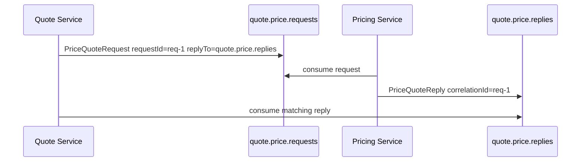

### 8.2 When It Appears Attractive

Teams use Kafka request/reply because:

- network location is decoupled;
- request can survive temporary receiver downtime;
- traffic can be buffered;
- consumers can scale via consumer group;
- communication remains inside Kafka infrastructure.

### 8.3 Problems

Kafka request/reply is more complex than HTTP/gRPC:

- client must manage correlation IDs;
- reply topic needs cleanup/retention;
- timeout semantics are application-defined;
- late replies must be handled;
- duplicate requests/replies are possible;
- backpressure is less immediate;
- debugging is harder;
- low-latency RPC expectations may not fit Kafka.

### 8.4 Java Correlation Sketch

```java
String requestId = UUID.randomUUID().toString();
String replyTopic = "quote.price.replies";

PriceQuoteRequest request = new PriceQuoteRequest(
        requestId,
        quoteId,
        customerId,
        items,
        replyTopic
);

ProducerRecord<String, PriceQuoteRequest> record =
        new ProducerRecord<>("quote.price.requests", quoteId, request);
record.headers().add("reply-to", replyTopic.getBytes(StandardCharsets.UTF_8));
record.headers().add("correlation-id", requestId.getBytes(StandardCharsets.UTF_8));

producer.send(record).get(500, TimeUnit.MILLISECONDS);

// Separate consumer loop receives replies and completes pending futures by correlation ID.
```

### 8.5 Decision Rule

Use Kafka request/reply rarely.

Consider it when:

- the receiver may be temporarily offline;
- buffering is valuable;
- response latency can tolerate Kafka path;
- duplicate and late replies are safe;
- correlation and cleanup are engineered carefully.

Prefer HTTP/gRPC when:

- caller needs immediate answer;
- low latency matters;
- request is simple;
- synchronous failure is clearer;
- the operation is naturally query-like.

---

## 9. Pattern 6: Workflow Choreography

### 9.1 Intent

Multiple services react to each other's events without a central orchestrator.

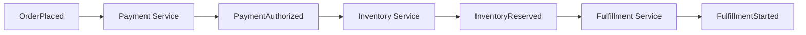

### 9.2 Strengths

- services are autonomous;
- no central workflow bottleneck;
- new consumers can join;
- business events form audit trail;
- scalable for loosely coupled processes.

### 9.3 Risks

- flow is hard to see;
- cycles can appear;
- compensation is scattered;
- no single owner of end-to-end SLA;
- debugging requires correlation across services;
- process versioning is difficult.

### 9.4 Choreography Works Best When

- each step is owned by a clear service;
- process is naturally decentralized;
- eventual consistency is acceptable;
- compensation is simple;
- observability is strong;
- event names and correlation IDs are disciplined.

### 9.5 Choreography Fails When

- process has many conditional branches;
- human tasks are involved;
- strict SLA tracking is required;
- compensation is complex;
- audit requires explicit process state;
- business wants to know “where is this case now?”

In those cases, orchestration or workflow engine may be better.

---

## 10. Pattern 7: Workflow Orchestration + Kafka Events

### 10.1 Intent

A workflow engine or orchestrator owns process state and emits/consumes Kafka events for integration.

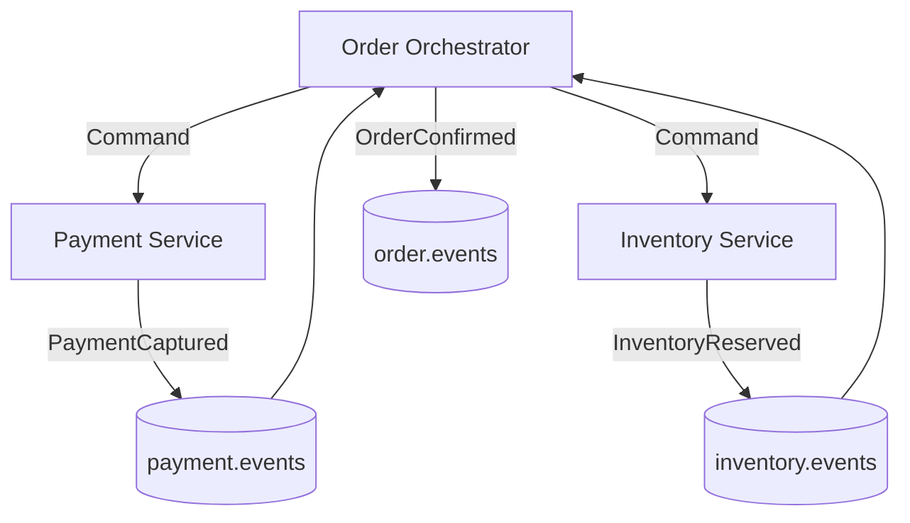

### 10.2 Strengths

- visible process state;
- easier SLA tracking;
- explicit compensation;
- better human workflow support;
- process versioning can be centralized;
- audit can be clearer.

### 10.3 Risks

- orchestrator can become god service;
- service autonomy may reduce;
- command/event boundary must be disciplined;
- orchestration state must be highly reliable;
- coupling moves into workflow definitions.

### 10.4 Decision Rule

Use orchestration when:

- process is long-running;
- process has branches, timers, human tasks, or escalation;
- business needs process visibility;
- compensation logic is non-trivial;
- regulatory defensibility requires explicit state transitions.

Use Kafka events around the orchestrator to keep integration durable and observable.

---

## 11. Pattern 8: Brokered Integration Between Systems

### 11.1 Intent

Kafka acts as integration backbone between applications, databases, SaaS systems, and data platforms.

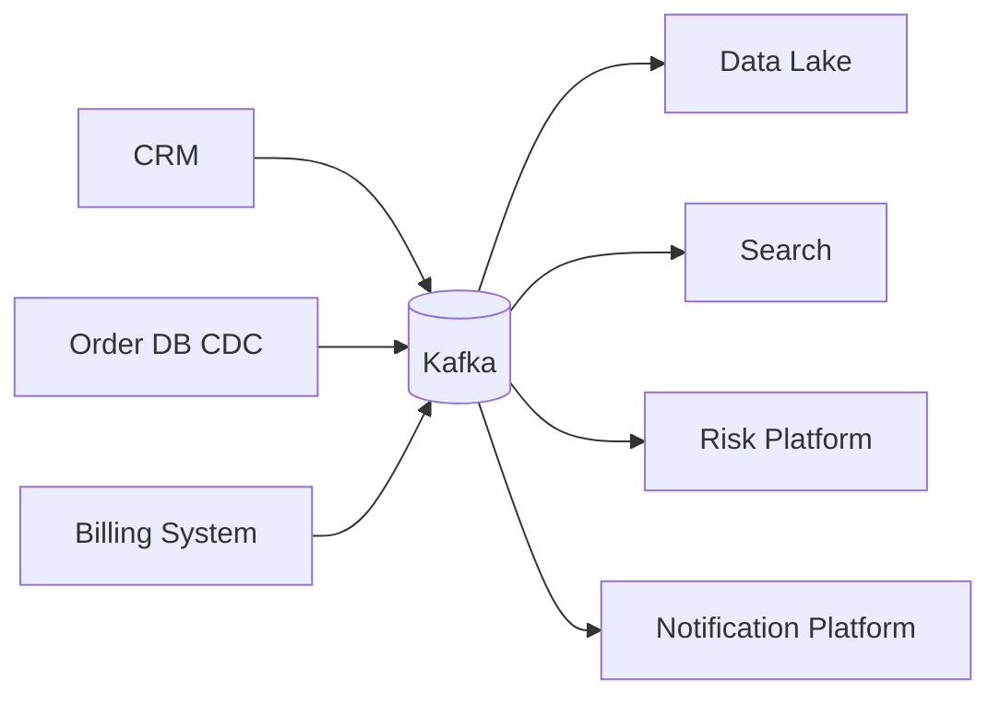

### 11.2 Strengths

- many-to-many integration without point-to-point explosion;
- durable buffer;
- replayable data movement;
- shared event backbone;
- independent consumer onboarding.

### 11.3 Risks

- Kafka becomes enterprise junk drawer;
- topic ownership blurs;
- schema governance becomes mandatory;
- PII spreads broadly;
- data lineage becomes hard;
- retention/cost grows.

### 11.4 Decision Rule

Use brokered integration when:

- multiple systems need the same data stream;
- replay and decoupling are valuable;
- data governance is strong;
- ownership and cataloging are explicit.

Do not treat Kafka as a dumping ground.

---

## 12. Pattern 9: Audit and Compliance Event Log

### 12.1 Intent

Kafka topics capture decision events and lifecycle transitions for investigation, reporting, or regulatory defense.

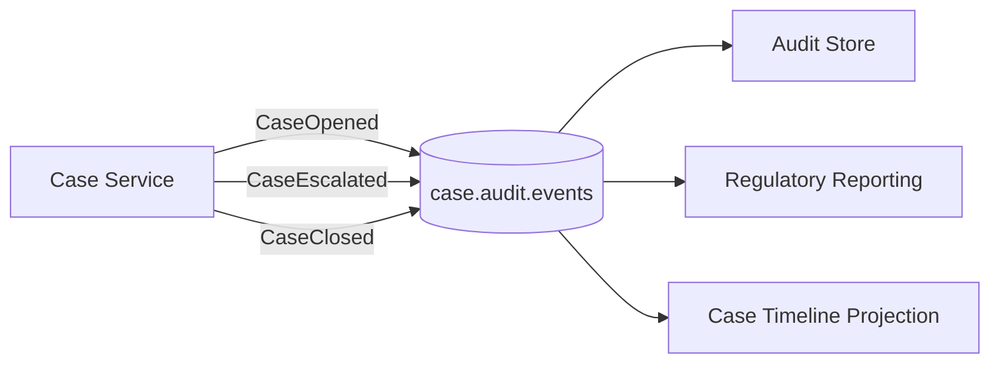

### 12.2 Requirements

Audit event logs require:

- stable event identity;
- actor identity;
- decision rule version;
- causality;
- immutable correction model;
- retention policy;
- privacy classification;
- replayable projection;
- access controls;
- lineage.

### 12.3 Kafka Alone Is Not Enough

Kafka retention may not satisfy long-term audit needs. Often Kafka feeds an immutable or append-only audit store designed for long retention, query, legal hold, and reporting.

Kafka is the event transport/log segment. The audit platform is the long-term evidence system.

---

## 13. Pattern 10: Data Pipeline and Stream Processing

### 13.1 Intent

Kafka topics form stages in a data pipeline.

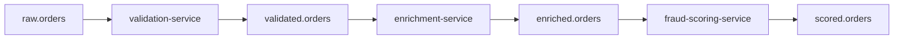

### 13.2 Strengths

- clear stages;
- replay by stage;
- independent scaling;
- isolation of expensive processing;
- observability at each boundary.

### 13.3 Risks

- too many intermediate topics;
- unclear ownership;
- duplicated schema variants;
- data drift;
- latency accumulates;
- exactly-once assumptions become complicated.

### 13.4 Decision Rule

Use pipeline stages when each stage is independently meaningful, observable, replayable, and owned.

Avoid creating topics for every trivial function call.

---

## 14. Sync API vs Kafka Decision Matrix

| Requirement | Prefer Sync API | Prefer Kafka |
|---|---:|---:|
| Immediate user response needed | Yes | Usually no |
| Durable async fan-out | No | Yes |
| Query current state | Yes | No |
| Replay historical changes | No | Yes |
| Many independent consumers | No | Yes |
| Strict request timeout semantics | Yes | Maybe |
| Consumer may be offline | No | Yes |
| Low-latency simple lookup | Yes | No |
| Event audit trail | Maybe | Yes |
| Backpressure buffer | Maybe | Yes |
| Side-effecting command | Maybe | Only with strong idempotency |

### 14.1 Practical Rule

Use synchronous APIs for questions and immediate decisions.

Use Kafka for durable facts, asynchronous propagation, fan-out, buffering, replay, and stream processing.

---

## 15. Retry and DLQ by Pattern

Not all Kafka communication patterns should retry the same way.

| Pattern | Retry Strategy | DLQ Meaning | Replay Safety |
|---|---|---|---|
| Domain event | Retry consumer processing; DLQ malformed/unprocessable events. | Consumer could not interpret/process fact. | Usually yes if idempotent. |
| Event-carried state | Retry projection update. | Projection failed for a state change. | Usually yes. |
| Notification | Retry lightweight handling or refetch. | Notification could not be handled. | Maybe; refetch gets current state. |
| Command | Retry carefully with idempotency and expiry. | Command could not be executed. | Dangerous if side effects. |
| Request/reply | Timeout + retry by requester. | Request or reply failed. | Application-specific. |
| Audit event | Retry strongly; avoid loss. | Serious audit pipeline issue. | Yes, but preserve original fact. |
| Pipeline stage | Retry stage processing. | Bad input or stage bug. | Yes if deterministic/idempotent. |

### 15.1 Command Expiry Example

```json
{
  "commandType": "ReserveInventory",
  "commandId": "cmd-123",
  "expiresAt": "2026-07-01T09:15:00Z",
  "data": {
    "orderId": "ord-123",
    "sku": "sku-9",
    "quantity": 2
  }
}
```

Expired commands should not execute blindly after long lag.

---

## 16. Observability for Kafka Communication

Asynchronous systems need explicit observability.

### 16.1 Required Correlation Fields

At minimum:

- `eventId` or `messageId`;
- `correlationId`;
- `causationId`;
- `eventType` or `commandType`;
- `aggregateId`;
- `source`;
- `occurredAt`;
- `publishedAt`.

### 16.2 Trace Flow

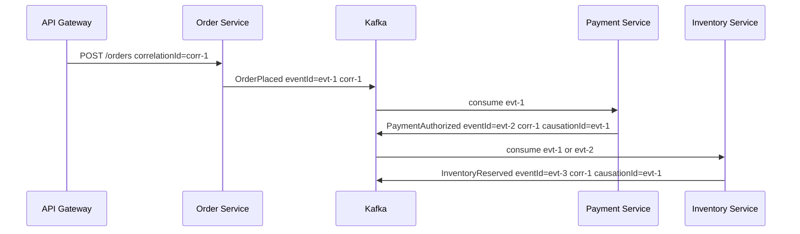

### 16.3 Metrics by Pattern

| Pattern | Important Metrics |
|---|---|
| Domain event | publish rate, consumer lag, processing errors, DLQ rate, duplicate rate |
| Command | command age, execution success, expiry count, duplicate command count |
| Request/reply | timeout rate, late reply rate, pending request count, reply lag |
| Pipeline | per-stage lag, throughput, bad input count, processing latency |
| Audit | missing sequence detection, ingestion delay, audit store write failure |

---

## 17. Java Consumer Pattern Examples

### 17.1 Event Consumer Skeleton

```java
while (running.get()) {
    ConsumerRecords<String, OrderPlaced> records = consumer.poll(Duration.ofMillis(500));

    for (ConsumerRecord<String, OrderPlaced> record : records) {
        OrderPlaced event = record.value();
        try {
            orderProjection.apply(event);
        } catch (Exception e) {
            retryPublisher.publish(record, e);
            // Commit decision depends on retry topology.
        }
    }

    consumer.commitSync();
}
```

### 17.2 Command Handler Skeleton

```java
while (running.get()) {
    ConsumerRecords<String, CapturePaymentCommand> records = consumer.poll(Duration.ofMillis(500));

    for (ConsumerRecord<String, CapturePaymentCommand> record : records) {
        CapturePaymentCommand command = record.value();

        if (command.isExpired(clock.instant())) {
            commandAudit.markExpired(command.commandId());
            continue;
        }

        if (commandLog.alreadyHandled(command.commandId())) {
            continue;
        }

        PaymentResult result = paymentGateway.capture(
                command.idempotencyKey(),
                command.amount(),
                command.currency()
        );

        paymentEventPublisher.publish(result.toEvent());
        commandLog.markHandled(command.commandId());
    }

    consumer.commitSync();
}
```

The command handler is more careful because replay and retry can cause external side effects.

---

## 18. Pattern Composition

Real systems combine patterns.

### 18.1 Order Example

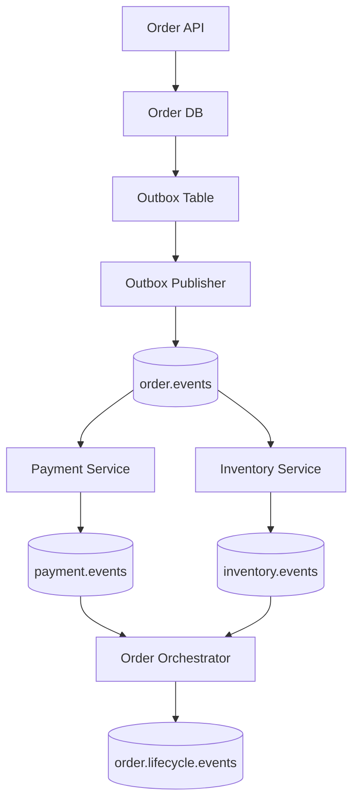

This combines:

- synchronous API for user command;
- local transaction for order persistence;
- outbox for DB + Kafka consistency;
- domain event pub/sub;
- payment/inventory events;
- orchestration for lifecycle decision;
- event log for audit/projection.

### 18.2 Why Composition Matters

A mature architecture does not force every interaction through one pattern. It chooses the pattern that matches the invariant.

---

## 19. Architecture Decision Framework

For every proposed Kafka communication path, answer these questions:

### 19.1 Interaction Type

- Is it a fact?
- Is it a command?
- Is it a query?
- Is it a notification?
- Is it a snapshot?
- Is it CDC?

### 19.2 Sender Expectation

- Does sender need an immediate answer?
- Can sender continue if no consumer handles it now?
- Does sender know or care who consumes it?

### 19.3 Consumer Behavior

- Is there one logical handler or many independent consumers?
- Are side effects idempotent?
- Can events be replayed?
- Can consumers process out of order?

### 19.4 Data Contract

- Is payload sufficient?
- Does consumer need producer API?
- Does event expose internal data?
- Is PII controlled?

### 19.5 Failure Semantics

- What happens if producer sends duplicate?
- What happens if consumer fails halfway?
- What happens if topic lags for six hours?
- What happens if replay occurs?
- What happens if DLQ fills?

### 19.6 Operations

- Who owns topic?
- Who owns schema?
- Who monitors lag?
- Who replays DLQ?
- Who approves changes?

---

## 20. Anti-Patterns

### 20.1 Kafka as RPC Replacement Everywhere

Using Kafka request/reply for every service call creates unnecessary complexity.

Symptoms:

- reply topics everywhere;
- pending future maps;
- timeout bugs;
- late reply confusion;
- complex local state;
- worse latency than HTTP.

### 20.2 Command Replay Without Idempotency

Replaying command topics causes duplicate side effects.

Examples:

- duplicate payment capture;
- duplicate email;
- duplicate shipment;
- duplicate case escalation;
- duplicate entitlement grant.

### 20.3 Event as Database Row Dump

This creates semantic coupling to persistence model.

### 20.4 Choreography Without Visibility

A business process spans 12 services, but no system knows the process state.

Symptoms:

- support cannot answer where case/order is stuck;
- incident response searches logs manually;
- SLA breach detection is delayed;
- compensation is inconsistent.

### 20.5 Notification That Pretends to Be Fact

A notification event with only ID is used as if it captured historical state.

Replay then reconstructs wrong history because consumers fetch current state.

### 20.6 Shared Topic Without Ownership

Everyone publishes to `events`.

No clear schema, retention, ACL, owner, or compatibility policy.

---

## 21. Pattern Selection Cheat Sheet

| Situation | Recommended Pattern |
|---|---|
| “Order was placed; many systems may react.” | Domain event pub/sub |
| “Customer profile changed; consumers need local copy.” | Event-carried state transfer |
| “Product changed; search index can refetch.” | Lightweight notification |
| “Ask payment service to capture payment asynchronously.” | Command topic with idempotency |
| “Need price calculation now before user sees quote.” | Sync API, not Kafka |
| “Need durable asynchronous price request with delayed response.” | Kafka request/reply, carefully |
| “Long-running case lifecycle with escalation and human steps.” | Workflow orchestration + Kafka events |
| “Replicate DB changes into lake/search.” | CDC/Kafka Connect pipeline |
| “Build real-time fraud features.” | Stream processing pipeline |
| “Preserve decision history.” | Audit event log + long-term audit store |

---

## 22. Worked Example: Quote Approval Flow

### 22.1 Requirements

- User submits quote.
- Pricing must be calculated before response.
- Risk review may be asynchronous.
- Approved quote should trigger document generation.
- Rejected quote should notify user.
- Audit trail must show decisions.

### 22.2 Pattern Selection

| Step | Pattern | Reason |
|---|---|---|
| Submit quote | Sync API | User needs immediate acknowledgement. |
| Calculate price | Sync API or internal module | User response depends on it. |
| Persist quote + outbox | Local transaction + outbox | Avoid DB/Kafka inconsistency. |
| Publish `QuoteSubmitted` | Domain event | Durable fact. |
| Risk review | Event consumer or command | Async decision. |
| Publish `QuoteApproved`/`QuoteRejected` | Domain event | Business fact. |
| Generate document | Event consumer | Independent side effect. |
| Notify user | Event consumer | Independent side effect. |
| Audit | Event log projection | Regulatory traceability. |

### 22.3 Flow

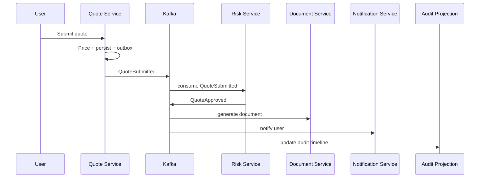

### 22.4 Why Not Kafka for Pricing Request?

Because the user response depends on pricing immediately. A synchronous call or same-service module is simpler unless pricing is long-running or can be delayed.

---

## 23. Practice Lab

### 23.1 Classify Interactions

Classify each as event, command, notification, request/reply, orchestration, or sync API:

1. “Customer changed email; billing and shipping need to update local views.”
2. “Order service needs fraud score before accepting order.”
3. “Case breached SLA and must be escalated.”
4. “Search index should update when product changes.”
5. “Payment should be captured after order is confirmed.”
6. “Monthly compliance report needs all case lifecycle transitions.”

For each, define:

- topic name if Kafka is used;
- key;
- payload style;
- retry/DLQ approach;
- replay risk;
- owner.

### 23.2 Design a Command Topic

Design `payment.commands` for `CapturePayment`.

Include:

- command ID;
- idempotency key;
- expiry;
- correlation ID;
- response event;
- duplicate behavior;
- DLQ behavior;
- external payment provider retry policy.

### 23.3 Diagnose Hidden Coupling

Given:

```text
CustomerService emits CustomerChanged(customerId).
Five consumers call GET /customers/{id} immediately.
```

Identify:

- failure modes;
- replay issue;
- API load issue;
- event-time consistency issue;
- when this design is acceptable;
- when event-carried state is better.

---

## 24. Production Readiness Rubric

| Level | Communication Pattern Capability |
|---|---|
| L1 | Can publish and consume Kafka messages. |
| L2 | Can distinguish event, command, request, and notification. |
| L3 | Can choose sync API vs Kafka based on latency, coupling, and failure semantics. |
| L4 | Can design retry, DLQ, replay, idempotency, and observability per pattern. |
| L5 | Can govern organization-wide event communication architecture across domains. |

---

## 25. Key Takeaways

- Kafka reduces temporal coupling, but schema and semantic coupling still exist.
- Domain event pub/sub is for durable facts and independent consumers.
- Event-carried state transfer improves consumer autonomy but expands data contract and privacy scope.
- Notifications are lightweight but create runtime dependency on producer APIs.
- Command topics require strong idempotency, expiry, and explicit handler semantics.
- Kafka request/reply should be used sparingly; it is not a universal RPC replacement.
- Choreography is powerful but can become invisible; orchestration is better for complex, long-running, auditable workflows.
- Pattern choice determines retry, DLQ, replay, and observability design.
- A mature Kafka architecture composes patterns rather than forcing everything through one style.

---

## 26. References

- Apache Kafka Documentation — https://kafka.apache.org/documentation/
- Apache Kafka Design — https://kafka.apache.org/42/design/design/
- Confluent Kafka Introduction — https://docs.confluent.io/kafka/introduction.html
- Confluent Event-Driven Architecture — https://www.confluent.io/learn/event-driven-architecture/
- Confluent Event-Driven Microservices Communication — https://www.confluent.io/use-case/event-driven-microservices-communication/
- Confluent Kafka Consumer Design — https://docs.confluent.io/kafka/design/consumer-design.html
