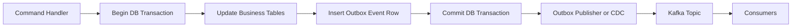
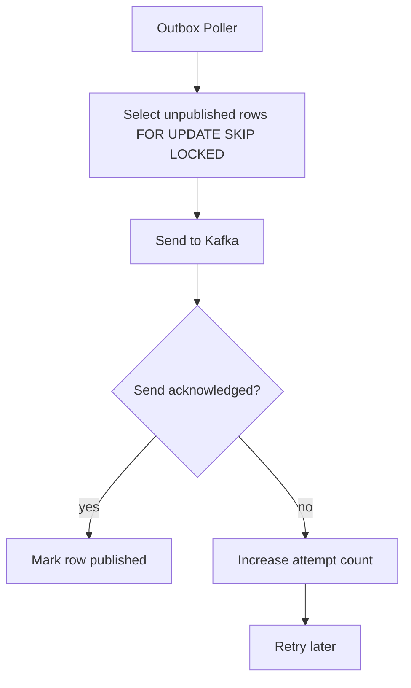
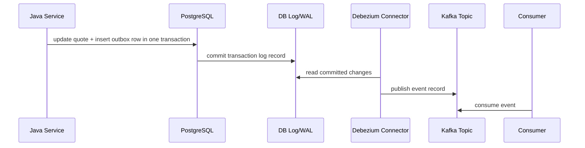
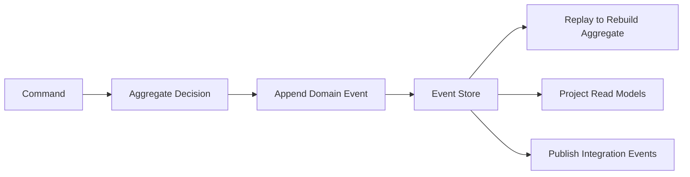
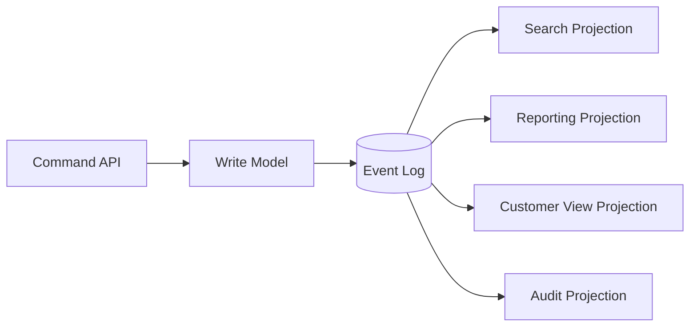
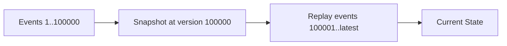
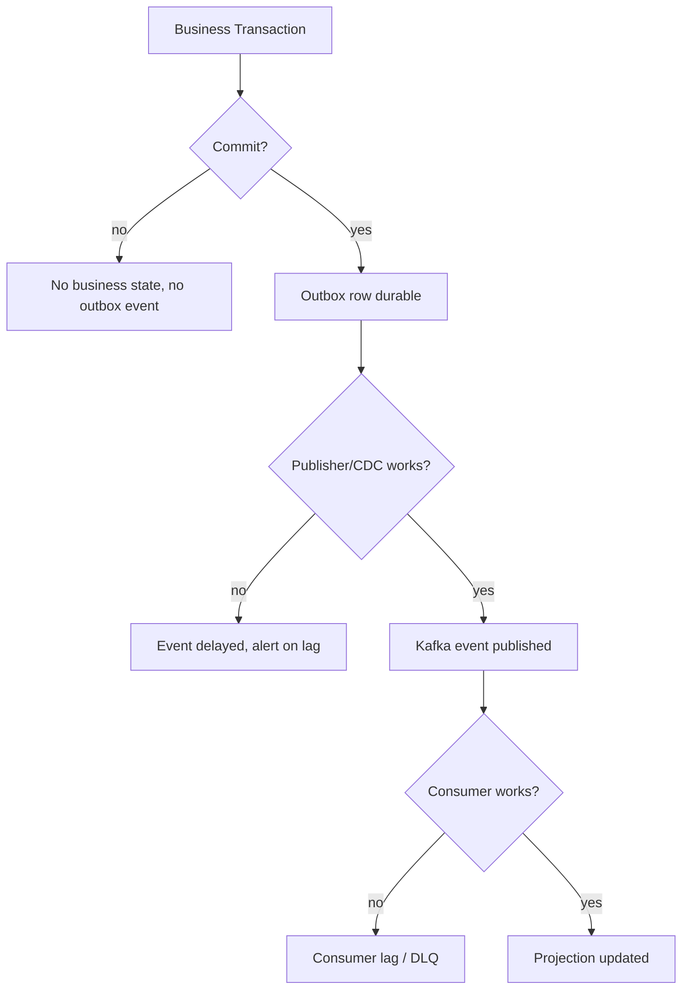

# Part 015 — Data Patterns: CDC, Outbox, Event Sourcing

Part 014 explained Kafka communication patterns. This part focuses on a deeper problem:

> How do we move business state into Kafka without lying about consistency?

Most production Kafka mistakes are not caused by not knowing `send()` or `poll()`. They happen because a service updates a database and publishes an event as if those two writes were automatically atomic.

They are not.

A Java service that writes PostgreSQL and then publishes Kafka has at least two durable systems:

1. the service database;
2. the Kafka log.

A failure can happen between those writes. If we do not model that boundary explicitly, we create silent divergence:

- database updated but event missing;
- event published but database transaction rolled back;
- event published twice;
- event published out of business order;
- consumer built a projection from a fact that was not actually committed;
- replay reconstructs a different state from the operational database.

A top-level engineer treats Kafka data patterns as **consistency architecture**, not integration plumbing.

---

## 1. Kaufman Skill Decomposition

The skill is **choosing and implementing the right Kafka data pattern for a state movement problem**.

| Subskill | Production Meaning |
|---|---|
| Consistency boundary analysis | Know exactly which writes must be atomic and which can be eventually consistent. |
| CDC reasoning | Understand how database changes become Kafka records through log capture. |
| Outbox design | Publish domain events reliably without dual-write inconsistency. |
| Event sourcing design | Use event log as the source of truth when the domain genuinely needs event history. |
| CQRS projection design | Build read models from event streams with replay and idempotency. |
| Snapshot and compaction design | Manage long history, current state, bootstrap, and storage cost. |
| Replay safety | Know which topics can be replayed, from where, by whom, and with what side effects. |
| Schema and versioning | Keep event evolution compatible with long-lived consumers and historical records. |
| Failure modelling | Explain what happens if DB commit, CDC, Kafka, consumer, or projection fails. |
| Governance | Define ownership, retention, audit, and operational runbooks. |

### 1.1 Practice Goal

By the end of this part, you should be able to inspect a business flow like:

> Approve quote, persist approval, publish `QuoteApproved`, update search index, notify fulfillment, and produce an audit trail.

And decide whether to use:

- application-level dual write;
- transactional outbox;
- CDC from business tables;
- CDC from an outbox table;
- event sourcing;
- CQRS projection;
- compacted topic as current-state cache;
- Kafka Connect sink;
- Kafka Streams projection;
- workflow orchestration with Kafka events.

The goal is not “use outbox everywhere.” The goal is to know what each pattern guarantees and what each pattern leaves outside the boundary.

---

## 2. The Core Problem: Dual Writes

A dual write occurs when one business operation writes two systems separately:

```java
@Transactional
public void approveQuote(ApproveQuoteCommand command) {
    quoteRepository.approve(command.quoteId(), command.apverId());

    kafkaTemplate.send(
        "quote.events",
        command.quoteId(),
        new QuoteApproved(command.quoteId(), command.apverId(), Instant.now())
    );
}
```

The code looks simple. The failure model is not.

### 2.1 Failure Matrix

| Step | Failure | Result |
|---|---|---|
| DB update fails before commit | Kafka not called | Safe if exception aborts flow. |
| DB update commits, process crashes before Kafka send | Database says approved, Kafka has no event. |
| Kafka send succeeds, DB transaction later rolls back | Kafka says approved, database says not approved. |
| Kafka send times out but actually succeeds | Retry may publish duplicate event. |
| DB commit succeeds, Kafka retries and publishes later | Consumer sees event after delay. |
| Kafka publish succeeds, consumer fails | Event remains in Kafka, but side effect may be partial. |

The bug is not only duplicate messages. The bug is **unmodelled truth**.

### 2.2 Why Local Transactions Do Not Solve This

A local database transaction can atomically update:

- `quotes`;
- `quote_items`;
- `quote_audit_log`;
- `outbox_events`.

It cannot atomically update Kafka unless Kafka participates in the same transaction protocol. In typical service architecture, the DB and Kafka are independent transactional systems.

Distributed two-phase commit is usually avoided because it couples availability and failure modes across systems. Kafka design in modern microservices typically uses **local transaction + asynchronous publication** rather than XA-style global transaction.

### 2.3 The Production Question

The real question is:

> What must be atomic with the business state?

If the event represents the same business fact as the DB update, then event creation should be in the same local DB transaction as the business update.

That leads to the transactional outbox pattern.

---

## 3. Transactional Outbox Pattern

The transactional outbox pattern stores the event to be published in an `outbox` table inside the same database transaction as the business state change.



The invariant is:

> If the business state commits, the outbox event commits. If the business state rolls back, the outbox event rolls back.

This does not mean the event is already in Kafka at commit time. It means the event is durably recorded for publication.

### 3.1 Outbox Table Shape

A practical outbox table should support:

- event identity;
- aggregate identity;
- aggregate type;
- event type;
- event version;
- payload;
- metadata;
- occurrence timestamp;
- publication status when using polling publisher;
- trace/correlation identifiers;
- ordering per aggregate;
- retention and cleanup.

Example PostgreSQL schema:

```sql
CREATE TABLE outbox_events (
    id                  UUID PRIMARY KEY,
    aggregate_type      TEXT NOT NULL,
    aggregate_id        TEXT NOT NULL,
    aggregate_version   BIGINT NOT NULL,
    event_type          TEXT NOT NULL,
    event_version       INTEGER NOT NULL,
    topic               TEXT NOT NULL,
    kafka_key           TEXT NOT NULL,
    payload             JSONB NOT NULL,
    headers             JSONB NOT NULL DEFAULT '{}'::jsonb,
    occurred_at         TIMESTAMPTZ NOT NULL,
    created_at          TIMESTAMPTZ NOT NULL DEFAULT now(),
    published_at        TIMESTAMPTZ NULL,
    publish_attempts    INTEGER NOT NULL DEFAULT 0,
    last_publish_error  TEXT NULL
);

CREATE INDEX idx_outbox_unpublished
ON outbox_events (created_at)
WHERE published_at IS NULL;

CREATE UNIQUE INDEX uq_outbox_aggregate_version
ON outbox_events (aggregate_type, aggregate_id, aggregate_version);
```

The unique `(aggregate_type, aggregate_id, aggregate_version)` is optional but useful when your aggregate has monotonic versions. It prevents accidental double creation of the same aggregate event.

### 3.2 Java/MyBatis-Style Command Handler

```java
public final class QuoteApprovalService {

    private final QuoteMapper quoteMapper;
    private final OutboxEventMapper outboxEventMapper;
    private final ObjectMapper objectMapper;

    @Transactional
    public void approve(ApproveQuoteCommand command) {
        Quote quote = quoteMapper.findForUpdate(command.quoteId())
                .orElseThrow(() -> new QuoteNotFoundException(command.quoteId()));

        quote.approve(command.approvedBy(), command.reason());
        quoteMapper.updateApprovalState(quote);

        QuoteApproved event = new QuoteApproved(
                quote.id(),
                quote.version(),
                command.approvedBy(),
                command.reason(),
                Instant.now()
        );

        OutboxEvent row = OutboxEvent.builder()
                .id(UUID.randomUUID())
                .aggregateType("Quote")
                .aggregateId(quote.id().value())
                .aggregateVersion(quote.version())
                .eventType("QuoteApproved")
                .eventVersion(1)
                .topic("quote.events.v1")
                .kafkaKey(quote.id().value())
                .payload(toJson(event))
                .headers(Map.of(
                        "correlationId", command.correlationId(),
                        "causationId", command.commandId(),
                        "producer", "quote-service"
                ))
                .occurredAt(event.occurredAt())
                .build();

        outboxEventMapper.insert(row);
    }

    private JsonNode toJson(Object value) {
        return objectMapper.valueToTree(value);
    }
}
```

The important property is not the mapper technology. It is that `quoteMapper.updateApprovalState()` and `outboxEventMapper.insert()` happen inside the same local transaction.

### 3.3 Polling Publisher Variant

A simple outbox publisher polls unpublished rows and publishes them to Kafka.



Pseudo-code:

```java
public final class OutboxPublisher {

    private final OutboxEventMapper mapper;
    private final KafkaProducer<String, byte[]> producer;

    public void publishBatch() {
        List<OutboxEvent> events = mapper.claimBatch(100);

        for (OutboxEvent event : events) {
            ProducerRecord<String, byte[]> record = toRecord(event);

            try {
                producer.send(record).get(5, TimeUnit.SECONDS);
                mapper.markPublished(event.id(), Instant.now());
            } catch (Exception ex) {
                mapper.markFailed(event.id(), ex.getMessage());
            }
        }
    }
}
```

This is easy to understand but has subtle issues:

- if Kafka send succeeds and `markPublished` fails, the same row may be published again;
- publisher throughput depends on DB polling;
- ordering can be broken if multiple publisher instances claim rows carelessly;
- long unprocessed outbox tables become operational debt;
- the publisher has to be scaled and monitored like a production component.

So the consumer side must still be idempotent.

### 3.4 Polling Query Pattern

For PostgreSQL, a common pattern is:

```sql
WITH next_events AS (
    SELECT id
    FROM outbox_events
    WHERE published_at IS NULL
    ORDER BY created_at
    LIMIT #{limit}
    FOR UPDATE SKIP LOCKED
)
UPDATE outbox_events e
SET publish_attempts = publish_attempts + 1
FROM next_events n
WHERE e.id = n.id
RETURNING e.*;
```

This lets multiple poller instances claim different rows. But remember: parallel claiming can weaken ordering unless your query groups by aggregate key or your downstream consumers are robust to temporary order variation.

### 3.5 Outbox with CDC

Instead of polling the outbox table, a CDC connector captures committed inserts from the database transaction log and publishes them to Kafka.



This variant removes the custom polling publisher and relies on database log capture. It is often operationally cleaner when the organization already runs Kafka Connect and Debezium.

The outbox row still remains the consistency anchor.

---

## 4. CDC: Change Data Capture

Change Data Capture publishes changes from a database into Kafka.

CDC usually reads from database logs rather than querying tables repeatedly. For PostgreSQL, this commonly involves logical decoding and replication slots. For MySQL, it commonly involves the binlog. The connector turns committed database changes into Kafka records.

### 4.1 CDC as Integration Pattern

CDC is useful when:

- an existing database is the source of truth;
- you need to stream changes without modifying application code heavily;
- downstream systems need near-real-time data propagation;
- analytics, search, cache, or read models need data updates;
- you need a migration bridge from legacy systems.

CDC is not automatically domain eventing. A row update is not necessarily a business event.

### 4.2 Table CDC vs Outbox CDC

| Approach | What Kafka Receives | Strength | Risk |
|---|---|---|---|
| Business table CDC | Row-level inserts/updates/deletes | Easy to mirror database state | Leaks database schema, weak business semantics. |
| Outbox table CDC | Domain event rows | Strong semantic events | Requires app to write outbox events intentionally. |
| Hybrid | Business table CDC plus curated events | Flexible migration path | More governance needed. |

### 4.3 Business Table CDC Example

Suppose `quotes` table changes from `DRAFT` to `APPROVED`. A generic CDC connector may publish something like:

```json
{
  "before": {
    "id": "Q-1001",
    "status": "DRAFT"
  },
  "after": {
    "id": "Q-1001",
    "status": "APPROVED"
  },
  "op": "u",
  "ts_ms": 1782910000000
}
```

This is useful for replication, search indexing, cache invalidation, or warehouse ingestion.

But it does not necessarily answer:

- who approved the quote?
- why was it approved?
- was this automatic or manual?
- was approval final or provisional?
- what business rule was evaluated?
- is this a correction or original approval?

A domain event should carry business meaning:

```json
{
  "eventId": "6f5d7d6b-7d6a-4a8d-8f9c-1ed9f3e51f70",
  "eventType": "QuoteApproved",
  "quoteId": "Q-1001",
  "approvedBy": "user-882",
  "approvalPolicy": "STANDARD_MARGIN_POLICY",
  "approvedAt": "2026-07-01T08:31:20Z",
  "reason": "Margin threshold satisfied"
}
```

Both may be valid, but they serve different purposes.

### 4.4 Debezium Outbox Event Router Shape

Debezium provides an outbox event router transformation for the outbox pattern. Conceptually, it captures changes in an outbox table and routes them into event topics.

A representative connector configuration might look like this:

```json
{
  "name": "quote-outbox-connector",
  "config": {
    "connector.class": "io.debezium.connector.postgresql.PostgresConnector",
    "database.hostname": "postgres",
    "database.port": "5432",
    "database.user": "debezium",
    "database.password": "secret",
    "database.dbname": "quote_db",
    "topic.prefix": "dbserver.quote",
    "table.include.list": "public.outbox_events",
    "transforms": "outbox",
    "transforms.outbox.type": "io.debezium.transforms.outbox.EventRouter",
    "transforms.outbox.table.field.event.id": "id",
    "transforms.outbox.table.field.event.key": "aggregate_id",
    "transforms.outbox.table.field.event.payload": "payload",
    "transforms.outbox.route.by.field": "aggregate_type",
    "transforms.outbox.route.topic.replacement": "${routedByValue}.events"
  }
}
```

Do not treat this as copy-paste production config. Exact options depend on Debezium and connector versions, database setup, converter choices, topic naming, and security requirements. The important concept is:

> the application commits an outbox row; CDC captures it; transformation maps it into a domain Kafka event.

### 4.5 CDC Failure Modes

| Failure | Effect | Mitigation |
|---|---|---|
| Connector down | Kafka events delayed | Monitor connector task status and source lag. |
| Replication slot grows | Database disk pressure | Alert on replication lag and WAL retention. |
| Schema changes break connector | Pipeline stops or emits unexpected records | Use migration checklist and contract tests. |
| Outbox table grows indefinitely | DB bloat | Cleanup policy after safe publication. |
| Topic routing misconfigured | Events land in wrong topic | Automated connector config validation. |
| Downstream consumer fails | Kafka retains event but projection stale | Consumer lag alerts and replay runbook. |

CDC gives strong capture of committed database changes, but it introduces a new operational dependency: the connector and database log retention are now part of your production data path.

---

## 5. Event Sourcing

Event sourcing is different from outbox and CDC.

With event sourcing, the authoritative state is the sequence of domain events. Current state is derived by replaying events.



In CRUD systems, events are often a side effect of state change.

In event-sourced systems, state is a fold over events:

```java
QuoteState state = events.stream()
        .reduce(QuoteState.empty(), QuoteState::apply, (a, b) -> b);
```

### 5.1 Event Sourcing Invariant

> The event stream is the source of truth; database tables are projections or snapshots.

This is a strong design choice. It can be powerful, but it is not free.

### 5.2 When Event Sourcing Fits

Event sourcing fits when:

- history is first-class, not incidental;
- auditability requires exact sequence of business facts;
- decisions depend on previous events;
- corrections must preserve original facts;
- temporal queries matter;
- domain behavior is state-machine heavy;
- replaying new projections from historical facts is valuable;
- business wants explainability, not just current state.

Examples:

- enforcement lifecycle transitions;
- financial ledger movements;
- order lifecycle with compensations;
- policy decision history;
- quote approval history;
- entitlement changes;
- workflow audit trail.

### 5.3 When Event Sourcing Is Overkill

Event sourcing is often overkill when:

- only current state matters;
- history is low value;
- team has weak event modeling discipline;
- schema evolution maturity is low;
- replay side effects are not well understood;
- reporting can be solved through CDC or audit tables;
- the domain is mostly CRUD with simple validation.

A common failure is using Kafka retention as a pseudo-event-store without event-sourcing discipline.

### 5.4 Kafka as Event Store?

Kafka can store long-lived logs, but using Kafka as an event store requires deliberate decisions:

- retention must preserve required history;
- topic compaction may remove older values with the same key;
- event ordering is per partition;
- aggregate stream boundaries must align with partition key;
- schema evolution must support historical replay;
- snapshots may be needed for fast aggregate loading;
- GDPR/legal deletion requirements must be modelled;
- operational replay and consumer offset resets must be controlled.

Kafka can be part of an event-sourcing architecture. It is not automatically a complete event store.

### 5.5 Event-Sourced Aggregate Example

```java
public final class QuoteAggregate {

    private QuoteId id;
    private QuoteStatus status = QuoteStatus.DRAFT;
    private long version = 0;

    public List<QuoteEvent> handle(ApproveQuote command) {
        if (status != QuoteStatus.PRICED) {
            throw new InvalidTransitionException(status, QuoteStatus.APPROVED);
        }

        return List.of(new QuoteApproved(
                command.quoteId(),
                version + 1,
                command.approvedBy(),
                command.reason(),
                Instant.now()
        ));
    }

    public void apply(QuoteEvent event) {
        switch (event) {
            case QuoteApproved approved -> {
                this.id = approved.quoteId();
                this.status = QuoteStatus.APPROVED;
                this.version = approved.aggregateVersion();
            }
            case QuoteRejected rejected -> {
                this.id = rejected.quoteId();
                this.status = QuoteStatus.REJECTED;
                this.version = rejected.aggregateVersion();
            }
            default -> throw new UnsupportedEventException(event.type());
        }
    }
}
```

The aggregate does not mutate state directly as the primary durable operation. It emits events. The persisted event stream becomes the truth.

---

## 6. CQRS with Kafka

Command Query Responsibility Segregation separates the write model from one or more read models.

Kafka is useful because read models can subscribe to event streams and build query-optimized projections.



### 6.1 Read Model Examples

| Projection | Storage | Purpose |
|---|---|---|
| Quote search index | Elasticsearch/OpenSearch | Filter and search quotes. |
| Customer quote summary | PostgreSQL/Redis | Fast customer dashboard. |
| Compliance audit view | PostgreSQL/object storage | Explain lifecycle transitions. |
| Fulfillment queue | Kafka topic/table | Trigger downstream work. |
| Revenue analytics | Warehouse/lakehouse | BI and trend analysis. |

### 6.2 Projection Invariant

> A projection is disposable if it can be rebuilt from retained events.

This is a powerful operational idea. It changes how we treat bugs:

- fix projection code;
- reset consumer offset or create new consumer group;
- replay from historical events;
- rebuild the read model;
- compare old and new projection;
- swap traffic after validation.

But this only works if event retention, schema compatibility, and replay side effects are designed correctly.

### 6.3 Projection Consumer Pattern

```java
public final class QuoteSummaryProjector {

    private final QuoteSummaryRepository repository;

    public void handle(QuoteEvent event) {
        switch (event) {
            case QuoteCreated e -> repository.upsertCreated(e.quoteId(), e.customerId(), e.createdAt());
            case QuotePriced e -> repository.updatePrice(e.quoteId(), e.totalAmount(), e.currency(), e.pricedAt());
            case QuoteApproved e -> repository.markApproved(e.quoteId(), e.approvedBy(), e.approvedAt());
            case QuoteRejected e -> repository.markRejected(e.quoteId(), e.rejectedBy(), e.reason(), e.rejectedAt());
        }
    }
}
```

The projection must be idempotent. Replay means the same event may be applied again.

### 6.4 Idempotent Projection SQL

```sql
CREATE TABLE quote_projection_applied_events (
    event_id UUID PRIMARY KEY,
    applied_at TIMESTAMPTZ NOT NULL DEFAULT now()
);

-- transaction boundary:
-- 1. insert event_id into applied table
-- 2. update projection
-- 3. commit offset only after transaction commits
```

Pseudo-code:

```java
@Transactional
public void apply(QuoteApproved event) {
    int inserted = appliedEventMapper.insertIfAbsent(event.eventId());
    if (inserted == 0) {
        return;
    }

    quoteSummaryMapper.markApproved(
            event.quoteId(),
            event.approvedBy(),
            event.approvedAt()
    );
}
```

Idempotency belongs in the projection’s durable store, not only in memory.

---

## 7. Compacted Topics as Current-State Streams

Kafka log compaction retains the latest value for a key, eventually removing older records with the same key. This makes compacted topics useful for current-state distribution.

Example topics:

- `customer.profile.current.v1`;
- `product.catalog.current.v1`;
- `quote.status.current.v1`;
- `tenant.configuration.current.v1`;
- `risk.policy.current.v1`.

### 7.1 Compaction Is Not Event History

A compacted topic is not a complete event history.

If key `Q-1001` has values:

1. `DRAFT`;
2. `PRICED`;
3. `APPROVED`;
4. `CANCELLED`.

Compaction may eventually leave only the latest value:

```json
{
  "quoteId": "Q-1001",
  "status": "CANCELLED"
}
```

That is useful for reconstructing current state. It is not sufficient for audit history.

### 7.2 Tombstones

A tombstone is a record with a key and a null value. In compacted topics, tombstones represent deletion markers.

```java
producer.send(new ProducerRecord<>(
        "customer.profile.current.v1",
        customerId,
        null
));
```

Consumers must understand tombstones. A consumer that assumes value is always non-null will fail in production.

### 7.3 Event Topic vs Current-State Topic

| Topic Type | Retention | Meaning | Replay Result |
|---|---|---|---|
| Event topic | Time/size or infinite | Sequence of facts | Reconstruct history or projection. |
| Compacted current-state topic | Latest value per key | Latest known state | Bootstrap cache/table. |
| Hybrid compacted + delete retention | Latest state plus deletion windows | Cache invalidation/current state | Bootstrap with deletion awareness. |

Do not mix event history and current-state snapshots casually in one topic. Consumers will build wrong mental models.

---

## 8. Pattern Comparison

| Pattern | Source of Truth | Kafka Record Meaning | Best For | Main Risk |
|---|---|---|---|---|
| Dual write | DB | Intended event | Simple prototypes | Lost/mismatched events. |
| Polling outbox | DB + outbox table | Domain event | Reliable publication without CDC | Duplicate publication, ordering, poller ops. |
| CDC business table | DB table | Row change | Replication, search, analytics | Leaking schema as contract. |
| CDC outbox | DB + outbox table | Domain event | Reliable domain event publication | Connector ops and schema governance. |
| Event sourcing | Event log | Source-of-truth fact | Audit-heavy domains, temporal logic | Complexity and replay/versioning burden. |
| CQRS projection | Event log | Projection input | Query optimization | Stale or non-idempotent projections. |
| Compacted topic | Latest keyed value | Current state | Cache/bootstrap/table distribution | Mistaken for full history. |

---

## 9. Decision Framework

Ask these questions before choosing a pattern.

### 9.1 Is the Event a Business Fact or a Row Change?

If downstream consumers care about business meaning, prefer domain events.

If downstream consumers only need data replication, business table CDC may be enough.

### 9.2 Must DB Update and Event Creation Be Atomic?

If yes, avoid direct DB + Kafka dual write. Use outbox or event sourcing.

### 9.3 Is Historical Replay a Requirement?

If yes, design retention, schema evolution, and side-effect boundaries. Do not assume Kafka defaults preserve your audit history forever.

### 9.4 Is Current State Enough?

If yes, a compacted topic or CDC snapshot stream may be enough.

### 9.5 Who Owns the Schema?

- Domain event schema: owning service/domain team.
- CDC schema: database owner/platform team, but consumers must not be surprised by table migrations.
- Projection schema: projection owner.
- Integration topic schema: explicit cross-team contract.

### 9.6 Can Consumers Be Replayed Safely?

If replay triggers emails, payments, external API calls, or legal side effects, the pipeline is not replay-safe unless those effects are separated and idempotent.

---

## 10. Regulatory and Audit-Grade Design

For regulated systems, the question is often not only:

> What is the current status?

It is:

> Why did the status become this value, who caused it, under which rule, using which evidence, and what changed later?

Kafka can help, but only if event semantics are designed for audit.

### 10.1 Audit Event Metadata

Audit-grade events should consider:

- stable event id;
- actor id and actor type;
- system component;
- decision policy/rule version;
- reason code;
- correlation id;
- causation id;
- source command id;
- previous state;
- new state;
- evidence references;
- tenant/jurisdiction;
- effective timestamp;
- occurrence timestamp;
- recording timestamp;
- schema version;
- signature/hash when required.

Example:

```json
{
  "eventId": "fd279c03-59ec-48f7-91a6-faa77a07c0e2",
  "eventType": "EnforcementCaseEscalated",
  "caseId": "CASE-2026-00091",
  "previousStage": "INVESTIGATION",
  "newStage": "FORMAL_REVIEW",
  "actor": {
    "type": "USER",
    "id": "officer-1182"
  },
  "decision": {
    "policyId": "ESCALATION_POLICY",
    "policyVersion": "2026.07.01",
    "reasonCode": "EVIDENCE_THRESHOLD_MET"
  },
  "evidenceRefs": ["doc-981", "finding-441"],
  "correlationId": "corr-711",
  "causationId": "cmd-889",
  "occurredAt": "2026-07-01T09:11:00Z",
  "recordedAt": "2026-07-01T09:11:01Z"
}
```

### 10.2 Correction Instead of Mutation

For audit domains, avoid rewriting history silently.

Instead of mutating an old event, publish correction events:

- `QuoteApproved`;
- `QuoteApprovalCorrected`;
- `QuoteApprovalRevoked`.

This preserves the trail and lets projections derive current state with full history.

---

## 11. Snapshotting

Snapshotting stores derived state at a point in history so rebuilding does not require replaying every event from the beginning.



### 11.1 Snapshot Use Cases

- event-sourced aggregate loading;
- projection rebuild acceleration;
- compacted current-state topics;
- periodic audit checkpoints;
- migration validation;
- disaster recovery bootstrap.

### 11.2 Snapshot Risks

- snapshot schema evolves separately from event schema;
- snapshot may hide historical bugs;
- snapshot may be inconsistent if built from partial events;
- consumers may treat snapshot as authoritative without knowing its version;
- old snapshots can become invalid when projection logic changes.

### 11.3 Snapshot Event Shape

```json
{
  "eventType": "QuoteSnapshotCreated",
  "quoteId": "Q-1001",
  "snapshotVersion": 8,
  "lastIncludedEventVersion": 124,
  "state": {
    "status": "APPROVED",
    "totalAmount": "9500.00",
    "currency": "USD"
  },
  "createdAt": "2026-07-01T10:00:00Z"
}
```

Make the boundary explicit: `lastIncludedEventVersion` or offset boundaries matter for deterministic recovery.

---

## 12. Replay Design

Replay is one of Kafka’s superpowers. It is also one of its most dangerous operations.

### 12.1 Replay Types

| Replay Type | Purpose | Risk |
|---|---|---|
| Projection rebuild | Recompute read model | Side effects accidentally repeated. |
| DLQ replay | Reprocess failed records | Poison pill returns if not fixed. |
| Backfill | Populate new topic/projection | Historical schema issues. |
| Incident repair | Correct corrupted downstream state | Partial replay can miss dependencies. |
| Audit reconstruction | Rebuild timeline | Requires full retention and stable semantics. |

### 12.2 Replay-Safe Consumer Rule

A replay-safe consumer must either:

1. write only idempotent deterministic state; or
2. separate non-repeatable side effects behind an idempotency barrier; or
3. explicitly reject replay and require a manual procedure.

### 12.3 Replay Runbook Template

```md
# Replay Runbook

## Scope
- Source topic:
- Consumer group:
- Partition range:
- Offset/time range:
- Target projection/table/topic:

## Preconditions
- Schema versions supported:
- Side effects disabled or idempotent:
- DLQ root cause fixed:
- Capacity checked:
- Stakeholders notified:

## Execution
1. Pause live consumer or deploy replay consumer.
2. Record current offsets.
3. Reset offsets or start isolated group.
4. Replay into shadow projection if possible.
5. Validate record counts and checksums.
6. Promote or swap read model.
7. Resume live processing.

## Rollback
- Restore previous projection snapshot:
- Reset offsets to recorded point:
- Disable replay consumer:

## Evidence
- Operator:
- Time window:
- Offset boundaries:
- Validation result:
```

In regulated systems, replay itself may need an audit trail.

---

## 13. Data Pattern Failure Models

### 13.1 Outbox Failure Model



The outbox turns lost-event bugs into delayed-publication bugs. That is a major improvement because delayed publication is observable and recoverable.

### 13.2 Event Sourcing Failure Model

| Failure | Effect | Mitigation |
|---|---|---|
| Append event fails | Command fails; no state change | Retry command safely. |
| Duplicate command | Duplicate event risk | Command idempotency and expected version check. |
| Projection fails | Write model still valid, read model stale | Projection replay. |
| Event schema evolves badly | Historical replay breaks | Compatibility and upcasters. |
| Event correction needed | Cannot mutate old fact blindly | Publish correction/reversal event. |
| Aggregate stream too long | Slow load | Snapshot. |

### 13.3 CDC Failure Model

CDC shifts failure from application publisher to connector and database log management. That is often good, but only if platform operations are mature.

---

## 14. Topic Design for Data Patterns

### 14.1 Domain Event Topics

Example:

```text
quote.events.v1
case.events.v1
order.events.v1
invoice.events.v1
```

Good for domain facts. Key by aggregate id when per-aggregate ordering matters.

### 14.2 Outbox Source Topics

If using Debezium raw outbox table changes, you may see raw topics such as:

```text
dbserver.quote.public.outbox_events
```

These are connector/internal topics unless transformed into clean domain topics.

### 14.3 Current-State Topics

```text
quote.current.v1
customer.profile.current.v1
product.catalog.current.v1
```

Use compaction and make tombstone behavior explicit.

### 14.4 Projection Output Topics

```text
quote.approval-summary.v1
case.escalation-score.v1
order.fulfillment-ready.v1
```

These are derived data products. Ownership and rebuild procedures must be documented.

---

## 15. Java Implementation Patterns

### 15.1 Outbox Event Builder

```java
public final class OutboxEvents {

    public static OutboxEvent fromDomainEvent(
            DomainEvent event,
            String topic,
            String kafkaKey,
            TraceContext traceContext
    ) {
        return OutboxEvent.builder()
                .id(event.eventId())
                .aggregateType(event.aggregateType())
                .aggregateId(event.aggregateId())
                .aggregateVersion(event.aggregateVersion())
                .eventType(event.eventType())
                .eventVersion(event.eventVersion())
                .topic(topic)
                .kafkaKey(kafkaKey)
                .payload(event.payload())
                .headers(Map.of(
                        "correlationId", traceContext.correlationId(),
                        "causationId", traceContext.causationId(),
                        "producer", "quote-service"
                ))
                .occurredAt(event.occurredAt())
                .build();
    }
}
```

### 15.2 Domain Event Interface

```java
public interface DomainEvent {
    UUID eventId();
    String eventType();
    int eventVersion();
    String aggregateType();
    String aggregateId();
    long aggregateVersion();
    Instant occurredAt();
    JsonNode payload();
}
```

### 15.3 Idempotent Command Handler

```java
@Transactional
public void approve(ApproveQuoteCommand command) {
    if (commandMapper.exists(command.commandId())) {
        return;
    }

    commandMapper.insert(command.commandId(), command.requestedBy(), Instant.now());

    Quote quote = quoteMapper.findForUpdate(command.quoteId())
            .orElseThrow();

    quote.approve(command.requestedBy(), command.reason());
    quoteMapper.update(quote);

    outboxEventMapper.insert(OutboxEvents.fromDomainEvent(
            QuoteApproved.from(quote, command),
            "quote.events.v1",
            quote.id().value(),
            command.traceContext()
    ));
}
```

This prevents retries of the same command from producing repeated business events.

---

## 16. Anti-Patterns

### 16.1 Publishing Directly After DB Commit Without Outbox

This is the classic lost-event bug.

Use it only when loss is acceptable or the event is non-critical telemetry.

### 16.2 Treating CDC Row Changes as Domain Events

A row update is not automatically a business fact. Database schema is optimized for storage and queries; event schema should be optimized for durable business meaning.

### 16.3 Infinite Event Sourcing Ambition

Do not event-source a simple CRUD domain only to appear sophisticated. Event sourcing adds a permanent modelling burden.

### 16.4 Compacted Topic as Audit Log

Compaction removes old values. That is the opposite of audit history.

### 16.5 Replay Without Side-Effect Control

A consumer that sends emails or calls payment APIs cannot be replayed casually.

### 16.6 Outbox Without Cleanup

An outbox table that grows forever becomes a hidden production database problem.

### 16.7 No Event Identity

Without `eventId`, deduplication, tracing, and audit become weaker.

### 16.8 Overloading One Topic With Multiple Contracts

A generic `events` topic with many unrelated schemas creates governance chaos and brittle consumers.

---

## 17. Testing Strategy

### 17.1 Unit Tests

Test aggregate decisions:

```java
@Test
void approvedQuoteEmitsQuoteApprovedEvent() {
    Quote quote = pricedQuote();

    List<QuoteEvent> events = quote.handle(new ApproveQuote(...));

    assertThat(events).singleElement().isInstanceOf(QuoteApproved.class);
}
```

### 17.2 Transaction Tests

Verify business state and outbox row commit together:

```java
@Test
void approvalCreatesOutboxEventInSameTransaction() {
    service.approve(command);

    assertThat(quoteMapper.find(command.quoteId()).status()).isEqualTo(APPROVED);
    assertThat(outboxEventMapper.findByAggregateId(command.quoteId())).hasSize(1);
}
```

Also test rollback:

```java
@Test
void rollbackDoesNotCreateOutboxEvent() {
    assertThatThrownBy(() -> service.approve(invalidCommand))
            .isInstanceOf(InvalidTransitionException.class);

    assertThat(outboxEventMapper.findByAggregateId(invalidCommand.quoteId())).isEmpty();
}
```

### 17.3 Contract Tests

Validate:

- schema compatibility;
- required metadata;
- topic name;
- key selection;
- event type;
- version;
- semantic examples.

### 17.4 Integration Tests

Use Testcontainers or equivalent local integration environment to test:

- database commit;
- Debezium capture;
- Kafka topic emission;
- consumer projection update;
- duplicate handling;
- restart behavior.

### 17.5 Replay Tests

Create a test that feeds historical events twice and expects the same final projection.

```java
@Test
void projectionIsIdempotentUnderReplay() {
    events.forEach(projector::handle);
    Projection first = repository.load("Q-1001");

    events.forEach(projector::handle);
    Projection second = repository.load("Q-1001");

    assertThat(second).isEqualTo(first);
}
```

---

## 18. Observability

### 18.1 Outbox Metrics

Track:

- unpublished row count;
- oldest unpublished age;
- publish attempts;
- publish failures;
- rows published per second;
- duplicate publish count;
- cleanup lag.

### 18.2 CDC Metrics

Track:

- connector task state;
- source lag;
- replication slot/WAL growth;
- records per second;
- error rate;
- connector restarts;
- schema-change failures.

### 18.3 Projection Metrics

Track:

- consumer lag;
- applied events per second;
- projection write latency;
- duplicate event count;
- projection error count;
- DLQ count;
- replay mode indicator.

### 18.4 Audit Evidence

For high-defensibility systems, capture:

- event id;
- command id;
- actor id;
- offset;
- partition;
- topic;
- schema id/version;
- projection version;
- replay batch id when replayed.

---

## 19. Design Checklists

### 19.1 Outbox Checklist

- [ ] Business update and outbox insert happen in the same local transaction.
- [ ] Event has stable `eventId`.
- [ ] Event has aggregate id and aggregate version if ordering matters.
- [ ] Kafka key is documented.
- [ ] Topic is documented.
- [ ] Event schema is registered and versioned.
- [ ] Publisher/CDC lag is monitored.
- [ ] Duplicate publication is expected and consumers are idempotent.
- [ ] Outbox cleanup policy exists.
- [ ] Replay procedure exists.

### 19.2 CDC Checklist

- [ ] Connector ownership is clear.
- [ ] Database log retention impact is understood.
- [ ] Schema migration process includes CDC validation.
- [ ] Connector internal topics are backed up or recoverable.
- [ ] Source lag alert exists.
- [ ] Raw CDC topics are not exposed as domain API accidentally.
- [ ] Security credentials are rotated.
- [ ] Connector restart behavior is tested.

### 19.3 Event Sourcing Checklist

- [ ] Event stream is truly source of truth.
- [ ] Aggregate versioning prevents concurrent conflicting writes.
- [ ] Events represent business facts, not technical deltas.
- [ ] Historical events remain readable.
- [ ] Upcaster/migration strategy exists.
- [ ] Snapshot strategy exists when needed.
- [ ] Projection rebuild runbook exists.
- [ ] Side effects are separated from replay.
- [ ] Correction/reversal event strategy exists.

### 19.4 CQRS Checklist

- [ ] Projection is idempotent.
- [ ] Projection lag is visible.
- [ ] Projection can be rebuilt from source events.
- [ ] Consumers know staleness expectations.
- [ ] Read model schema is owned separately from event schema.
- [ ] Backfill and migration path exist.

---

## 20. Architecture Decision Record Template

```md
# ADR: Kafka Data Pattern for <Flow Name>

## Context
- Business operation:
- Source of truth:
- Database tables involved:
- Kafka topics involved:
- Consumers:
- Audit/regulatory requirements:

## Problem
We need to publish/derive <data/event> when <business state change> occurs without creating inconsistent DB/Kafka state.

## Options
1. Direct DB + Kafka dual write
2. Polling transactional outbox
3. CDC outbox
4. Business table CDC
5. Event sourcing
6. CQRS projection only

## Decision
Chosen pattern:

## Rationale
- Consistency boundary:
- Failure behavior:
- Operational complexity:
- Replay requirements:
- Consumer contract:

## Event Contract
- Topic:
- Key:
- Event type:
- Schema subject:
- Compatibility mode:
- Retention:

## Failure Handling
- Publisher/connector failure:
- Duplicate publication:
- Consumer failure:
- DLQ/replay:

## Observability
- Metrics:
- Alerts:
- Dashboards:

## Consequences
- Positive:
- Negative:
- Follow-up work:
```

---

## 21. Deliberate Practice

### Exercise 1 — Dual Write Failure Analysis

Take this flow:

```text
Create order -> insert order row -> publish OrderCreated -> reserve inventory
```

Write a failure matrix for:

- DB insert failure;
- DB commit success + Kafka failure;
- Kafka success + DB rollback;
- duplicate publish;
- inventory consumer failure.

Then redesign with outbox.

### Exercise 2 — Outbox Schema Design

Design an outbox table for `EnforcementCaseEscalated`.

Include:

- event id;
- case id;
- stage transition;
- actor;
- reason code;
- policy version;
- evidence references;
- correlation id;
- aggregate version;
- topic;
- key.

### Exercise 3 — CDC vs Domain Event

Given table `quote_status_history`, decide whether downstream services should consume:

- raw CDC;
- curated domain event;
- both.

Explain why.

### Exercise 4 — Replay Safety Review

Pick three consumers:

1. search index projector;
2. email notification sender;
3. compliance audit writer.

For each, decide whether replay is safe, unsafe, or safe only with idempotency barrier.

### Exercise 5 — Event Sourcing Fit Analysis

Evaluate whether `Quote` should be event-sourced.

Consider:

- lifecycle complexity;
- audit requirements;
- volume;
- query needs;
- correction rules;
- team maturity;
- schema evolution.

---

## 22. Mental Model Summary

- Dual writes are the root consistency hazard.
- Outbox makes event creation atomic with business state, but publication remains asynchronous.
- CDC captures committed database changes; CDC outbox captures committed domain events.
- Business table CDC is replication; domain events are semantic contracts.
- Event sourcing makes events the source of truth, not a side effect.
- CQRS projections must be disposable and replayable.
- Compacted topics distribute current state, not full history.
- Replay is powerful only if consumers are idempotent and side effects are controlled.
- Audit-grade systems need event semantics, metadata, correction strategy, and evidence boundaries.

---

## 23. References

- Apache Kafka Documentation — https://kafka.apache.org/documentation/
- Confluent Kafka Design and Concepts — https://docs.confluent.io/
- Confluent Event Sourcing Course — https://developer.confluent.io/courses/event-sourcing/
- Debezium Outbox Event Router — https://debezium.io/documentation/reference/stable/transformations/outbox-event-router.html
- Confluent Schema Registry Fundamentals — https://docs.confluent.io/platform/current/schema-registry/fundamentals/
