# Part 016 — Pipeline Topology Design

Part 015 explained how data enters Kafka reliably through outbox, CDC, event sourcing, and CQRS. This part asks the next question:

> Once data is in Kafka, how should we design the pipeline topology so it remains understandable, evolvable, observable, and safe to operate?

A Kafka pipeline is not just a sequence of consumers. It is a distributed data product composed of:

- source contracts;
- topic boundaries;
- processing stages;
- state stores;
- enrichment dependencies;
- retry and DLQ paths;
- output contracts;
- ownership boundaries;
- replay and rebuild procedures;
- deployment units;
- operational SLOs.

A junior design says:

> Service A reads topic X and writes topic Y.

A senior design asks:

- What is the semantic meaning of X and Y?
- Is this transformation deterministic?
- Can it be replayed?
- Who owns the output?
- Does this stage preserve ordering?
- Does this stage repartition?
- Is enrichment local, remote, or table-backed?
- What happens when downstream is slow?
- Can we rebuild the output from retained inputs?
- How do we observe correctness, not just throughput?

---

## 1. Kaufman Skill Decomposition

The skill is **designing Kafka pipelines as explicit, operable topologies**.

| Subskill | Production Meaning |
|---|---|
| Topology modelling | Represent pipeline stages, topics, state, and dependencies clearly. |
| Contract boundary design | Define where semantic contracts start and end. |
| Transformation classification | Distinguish map/filter/enrich/join/aggregate/project/sink. |
| Ownership assignment | Know which team owns each input, output, processor, and runbook. |
| Replay reasoning | Decide what can be rebuilt and what cannot. |
| Scaling design | Align partitioning, consumer groups, state stores, and throughput goals. |
| Failure routing | Place retry, DLQ, quarantine, and compensation boundaries intentionally. |
| Observability design | Measure lag, freshness, correctness, error rate, and business completeness. |
| Evolution planning | Add, split, migrate, and deprecate stages safely. |
| Governance | Document lineage, schema, retention, SLO, and access rules. |

### 1.1 Practice Goal

By the end of this part, you should be able to design a pipeline like:

```text
quote.events.v1
  -> quote.normalized.v1
  -> quote.enriched.v1
  -> quote.approval-summary.v1
  -> search index / dashboard / fulfillment trigger
```

And explain:

- why each topic exists;
- who owns each contract;
- what each stage guarantees;
- what each stage can replay;
- where ordering is preserved or lost;
- where state lives;
- what happens under partial failure;
- how to deploy and monitor it.

---

## 2. Pipeline as a Graph, Not a Chain

A real pipeline is usually a graph.

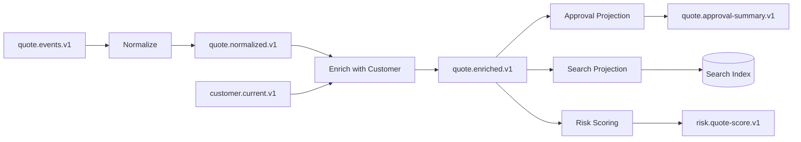

This graph has:

- source event topic;
- normalization stage;
- current-state enrichment topic;
- enriched event topic;
- multiple downstream projections;
- side outputs;
- external sink.

Each edge should have a contract. Each node should have an owner.

### 2.1 Why Graph Thinking Matters

Chain thinking hides important questions:

- Can `Risk Scoring` be redeployed without affecting search?
- Can `Approval Projection` replay independently?
- Does `Enrich with Customer` depend on a remote API?
- If customer data is late, does the pipeline block, emit partial event, or route to retry?
- Does `quote.enriched.v1` become a stable product or an internal implementation topic?
- What happens if one branch is slow?

Kafka makes fan-out easy. Governance makes fan-out safe.

---

## 3. Topology Vocabulary

### 3.1 Source

A source is where data enters the topology.

Examples:

- domain event topic;
- outbox CDC topic;
- raw CDC table topic;
- external connector source;
- command topic;
- compacted reference-data topic;
- replay/backfill topic.

### 3.2 Processor

A processor consumes records, performs a transformation, and may emit records.

Processor types:

| Processor Type | Example | State? |
|---|---|---|
| Map | Convert field names | Usually stateless |
| Filter | Drop irrelevant events | Stateless |
| Validate | Check contract/business invariants | Stateless or stateful |
| Normalize | Convert raw source into canonical event | Usually stateless |
| Enrich | Add customer/product/policy data | Often stateful |
| Join | Combine streams/tables | Stateful |
| Aggregate | Count/sum/window | Stateful |
| Project | Build read model | Stateful/external |
| Route | Branch to output topics | Stateless or stateful |
| Sink | Write to external system | External state |

### 3.3 Sink

A sink is an output target:

- Kafka output topic;
- database table;
- search index;
- cache;
- object storage;
- warehouse;
- external API;
- notification system;
- workflow engine.

Kafka-to-Kafka sinks are easier to replay than external side-effecting sinks.

### 3.4 State Store

State may live in:

- Kafka Streams local state store;
- compacted Kafka topic;
- external database;
- Redis/cache;
- warehouse table;
- object storage;
- in-memory ephemeral cache.

Every state store needs an answer for:

- rebuild source;
- backup/restore;
- schema evolution;
- consistency with offsets;
- ownership;
- retention.

---

## 4. The Source-Transform-Sink Skeleton

A basic pipeline skeleton:

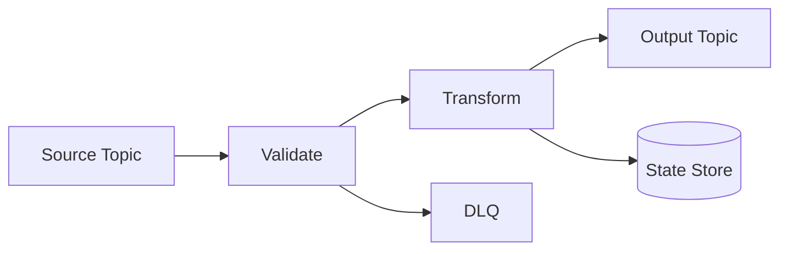

This is the minimum. Production pipelines also need:

- retry topics;
- metrics;
- schema validation;
- idempotency;
- offset strategy;
- error classification;
- deployment unit;
- ownership metadata;
- replay procedure;
- capacity model.

### 4.1 Stage Contract Template

```md
# Pipeline Stage Contract

## Stage
- Name:
- Owner:
- Runtime: Java consumer / Kafka Streams / ksqlDB / Kafka Connect / other

## Inputs
- Topic:
- Key:
- Schema:
- Retention:
- Ordering assumption:

## Outputs
- Topic/sink:
- Key:
- Schema:
- Semantics:

## Processing
- Transformation type:
- Deterministic:
- Stateful:
- External dependencies:
- Idempotency strategy:

## Failure Handling
- Retry:
- DLQ:
- Poison pill policy:
- Replay support:

## Operations
- SLO:
- Metrics:
- Alerts:
- Runbook:
```

---

## 5. Transformation Classes

### 5.1 Stateless Transform

Example: rename fields, normalize currency code, filter irrelevant event type.

```java
public NormalizedQuoteEvent normalize(RawQuoteEvent raw) {
    return new NormalizedQuoteEvent(
            raw.quoteId(),
            raw.customerId(),
            raw.amount().setScale(2, RoundingMode.HALF_UP),
            raw.currency().toUpperCase(Locale.ROOT),
            raw.occurredAt()
    );
}
```

Stateless transforms are easiest to scale and replay.

### 5.2 Validation Stage

Validation has two categories:

| Validation Type | Example | Failure Destination |
|---|---|---|
| Technical | Invalid schema, missing required field | DLQ/quarantine |
| Business | Negative price, illegal status transition | Domain rejection event or DLQ depending on meaning |

Do not send every validation failure to a generic DLQ. Some are business facts and deserve explicit rejection events.

### 5.3 Enrichment Stage

Enrichment adds context from another source.

Examples:

- add customer segment to quote;
- add product category to order;
- add jurisdiction policy to enforcement case;
- add FX rate to invoice;
- add risk score to approval request.

Enrichment can be implemented through:

- local table loaded from compacted Kafka topic;
- Kafka Streams `KTable`/`GlobalKTable`;
- cache/database lookup;
- remote API call;
- pre-join upstream topic.

### 5.4 Aggregation Stage

Aggregation computes derived state:

- count orders per customer;
- total quote value per account;
- number of failed payments in 10 minutes;
- session duration;
- rolling fraud score;
- SLA breach count.

Aggregations introduce state and time semantics. They require stricter observability.

### 5.5 Projection Stage

Projection writes a read model.

Projection examples:

- quote summary table;
- case lifecycle view;
- customer timeline;
- materialized approval queue;
- OpenSearch index;
- Redis lookup cache.

Projection stages must be idempotent and usually need their own applied-event tracking.

---

## 6. Fan-Out Pattern

Fan-out lets multiple consumers process the same source independently.

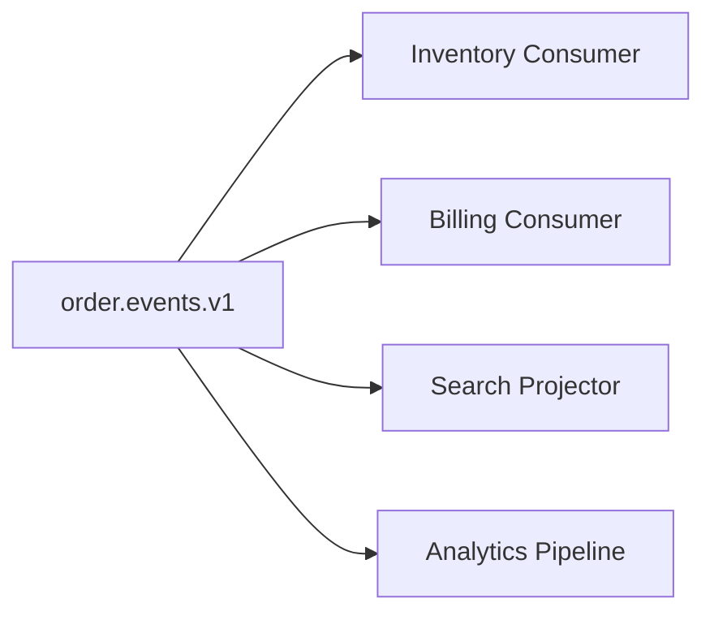

Each consumer group gets its own offset. This is Kafka's strength.

### 6.1 Fan-Out Benefits

- independent scaling;
- independent deployment;
- independent replay;
- loose runtime coupling;
- multiple data products from the same facts.

### 6.2 Fan-Out Risks

- too many consumers relying on unstable event internals;
- topic schema evolution becomes politically hard;
- producer becomes blocked by fear of breaking consumers;
- consumers duplicate transformation logic;
- hidden business workflows emerge through uncoordinated subscriptions.

### 6.3 Fan-Out Rule

> Fan-out is safe when the source topic is a stable product contract, not an implementation detail.

If the topic is internal, keep fan-out limited or publish a curated downstream product topic.

---

## 7. Branching and Routing

Branching splits records by predicate.

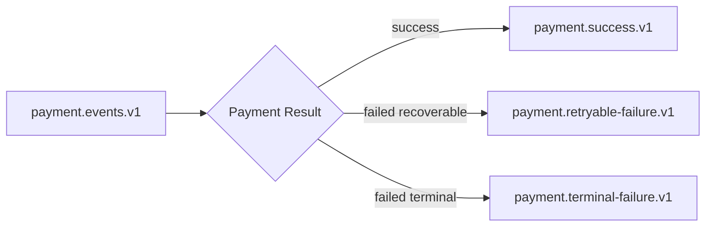

Branching is useful when downstream ownership differs by category.

### 7.1 Branching Design Questions

- Is the branch condition stable?
- Does each branch need a different schema?
- Are branches domain facts or processing routes?
- Can a record belong to multiple branches?
- What happens when a new branch is added?
- Are old consumers affected?

### 7.2 Processing Route vs Domain Event

A topic named `payment.retryable-failure.v1` may be an internal processing route.

A topic named `payment.failed.v1` may be a domain event.

Do not confuse them. Processing topics can change with implementation. Domain event topics are contracts.

---

## 8. Fan-In and Merge

Fan-in merges multiple sources into one output.

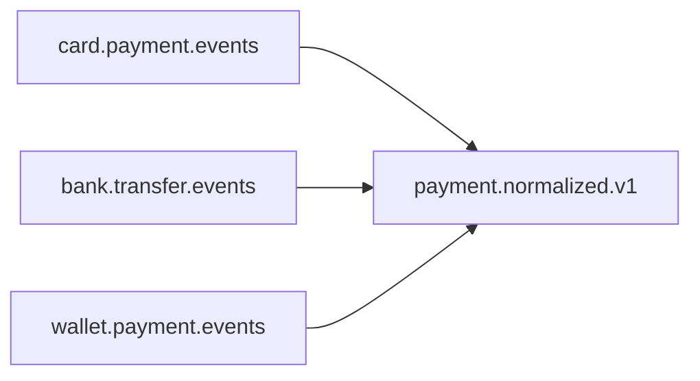

### 8.1 Fan-In Risks

- incompatible semantics;
- source-specific fields leak into common schema;
- ordering across sources is not guaranteed;
- duplicate identities;
- mismatched timestamps;
- inconsistent retry semantics;
- one noisy source harms shared output.

### 8.2 Canonicalization Rule

A merged output topic should not be a bag of source-specific fields. It should represent a stable canonical contract.

Bad:

```json
{
  "cardAuthCode": "...",
  "bankRef": "...",
  "walletProvider": "..."
}
```

Better:

```json
{
  "paymentId": "PAY-1001",
  "methodType": "CARD",
  "amount": "100.00",
  "currency": "USD",
  "status": "AUTHORIZED",
  "authorizedAt": "2026-07-01T10:00:00Z",
  "source": {
    "system": "card-gateway",
    "reference": "AUTH-991"
  }
}
```

---

## 9. Enrichment Topologies

### 9.1 Remote Lookup Enrichment

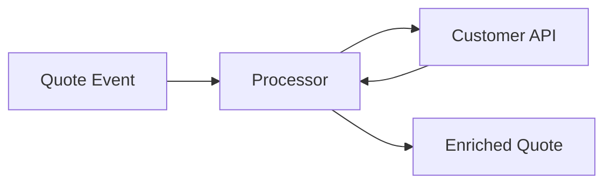

This is simple but dangerous at scale:

- remote API latency slows processing;
- API outage blocks pipeline;
- retry can amplify load;
- ordering can be affected;
- replay can overload the dependency.

Use remote lookup only when throughput is low, dependency is reliable, or cache/fallback exists.

### 9.2 Local Table Enrichment

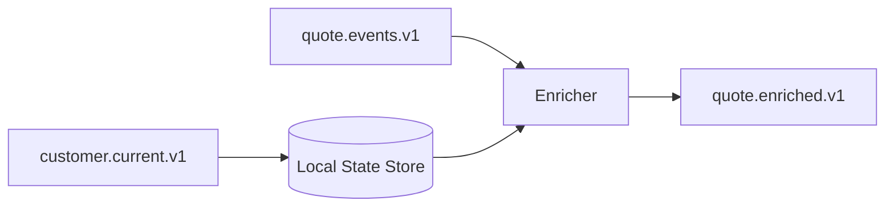

This is usually better for high-throughput stream processing.

Reference data arrives through Kafka and is materialized locally. The event processing path avoids synchronous network calls.

### 9.3 Global Table Enrichment

For small reference datasets, a global table can replicate all reference data to each processing instance. This avoids co-partitioning requirements but increases memory/disk footprint.

### 9.4 Enrichment Staleness

Enrichment always has a time question:

> Should the event be enriched with reference data as of event time, processing time, or latest known value?

Examples:

| Use Case | Correct Enrichment Time |
|---|---|
| Audit decision | Reference data as of decision time. |
| Dashboard display | Latest known reference data may be acceptable. |
| Billing calculation | Effective-time policy required. |
| Search indexing | Latest known value often acceptable. |
| Regulatory explanation | Historical/effective version required. |

Do not hide this decision inside code.

---

## 10. Join Topology

Joins combine streams and/or tables.

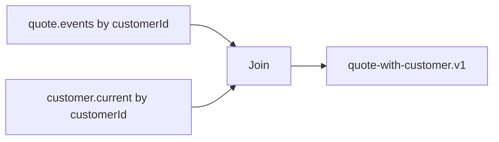

### 10.1 Join Questions

- Are the inputs keyed the same way?
- Is repartitioning needed?
- Is one side a stream or table?
- Are late records expected?
- What is the join window?
- What happens when reference data is missing?
- Is output deterministic under replay?
- What is the state store retention?

### 10.2 Missing Reference Data Policy

When enrichment data is missing, options include:

| Policy | Behavior | Use When |
|---|---|---|
| Drop | Ignore record | Non-critical telemetry. |
| DLQ | Quarantine record | Missing data indicates bug. |
| Retry | Delay and try again | Reference may arrive soon. |
| Emit partial | Continue with missing fields | Downstream tolerates partial data. |
| Emit pending state | Model incomplete data explicitly | Business flow has pending semantics. |
| Use default | Fill fallback value | Default is legally/business valid. |

A hidden default is often worse than a visible pending state.

---

## 11. Repartitioning

Repartitioning changes the key distribution so downstream operations can group, join, or aggregate correctly.

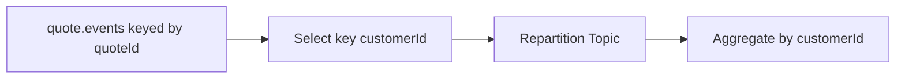

### 11.1 Why Repartitioning Happens

You may need repartitioning when:

- grouping by a different key;
- joining two streams/tables by a different key;
- changing ownership boundary;
- building customer-level aggregate from quote-level events;
- correcting a poor upstream key choice.

### 11.2 Repartition Cost

Repartitioning is a full Kafka write/read shuffle:

- more network IO;
- more broker storage;
- more latency;
- more internal topics;
- more state restore cost;
- more operational complexity.

Do not fear repartitioning, but make it visible in design.

### 11.3 Repartition Design Rule

> Key topics by the dominant ordering and processing boundary, not by arbitrary entity id.

A wrong key early in the pipeline can force expensive downstream shuffles.

---

## 12. Topic Boundary Design

A topic boundary should exist when it creates one of these values:

- stable contract for another team;
- replay checkpoint;
- fan-out point;
- ownership boundary;
- failure isolation boundary;
- expensive transformation reuse;
- audit boundary;
- materialized data product.

A topic should not exist only because “every method returns a topic.”

### 12.1 Too Few Topics

Symptoms:

- generic mega-topic;
- consumers filter most records;
- schema chaos;
- ACLs too broad;
- unrelated retention needs conflict;
- impossible ownership.

### 12.2 Too Many Topics

Symptoms:

- topic-per-step with no contract value;
- operational noise;
- unclear lineage;
- many internal schemas;
- too much broker metadata;
- hard cleanup.

### 12.3 Boundary Heuristic

Create a topic when you need a durable, observable, independently consumable boundary.

Avoid creating a topic for purely local computation inside one application unless it helps state recovery or operational isolation.

---

## 13. Internal vs Product Topics

### 13.1 Internal Topic

An internal topic is an implementation detail.

Examples:

- retry topic;
- repartition topic;
- changelog topic;
- intermediate normalization topic used only by one owning service;
- DLQ/quarantine topic.

Internal topics can change faster but need clear naming and restricted access.

### 13.2 Product Topic

A product topic is a stable data/event contract.

Examples:

- `quote.events.v1`;
- `customer.profile.current.v1`;
- `case.lifecycle.v1`;
- `payment.authorized.v1`.

Product topics need stronger governance:

- schema compatibility;
- documentation;
- owners;
- retention;
- SLO;
- consumer communication;
- deprecation policy.

### 13.3 Naming Convention Example

```text
<domain>.<entity-or-capability>.<semantic-type>.v<major>
```

Examples:

```text
quote.lifecycle.events.v1
quote.current.state.v1
quote.approval.summary.v1
quote.approval.retry.v1
quote.approval.dlq.v1
```

Do not let naming become religious. The point is predictability and meaning.

---

## 14. Pipeline Ownership Model

Every pipeline needs owners at three levels:

| Ownership Level | Responsibility |
|---|---|
| Source owner | Maintains source schema, quality, retention, and meaning. |
| Processor owner | Maintains transformation code, deployment, retry, DLQ, and SLO. |
| Output owner | Maintains output contract, consumers, and deprecation. |

In small teams one group may own all three. In large organizations, they often differ.

### 14.1 Ownership Metadata

For each topic, document:

```yaml
owner: quote-platform-team
slack: '#quote-platform'
pager: quote-platform-oncall
schemaOwner: quote-domain-team
dataClassification: confidential
retention: 30d
cleanupPolicy: delete
consumerSlo: p95 freshness < 60s
replaySupported: true
```

This metadata matters during incidents.

---

## 15. Runtime Choice: Consumer, Streams, ksqlDB, Connect

### 15.1 Plain Java Consumer

Use when:

- custom side effects;
- complex external transactions;
- imperative workflow;
- simple projection;
- low-level control over offset commit;
- integration with existing service logic.

Risk:

- you must implement state, retry, idempotency, and offset discipline yourself.

### 15.2 Kafka Streams

Use when:

- Kafka-to-Kafka stream processing;
- stateful joins/aggregations;
- local state stores;
- exactly-once Kafka read-process-write requirement;
- topology testability;
- Java-native processing.

Risk:

- state stores, repartition topics, task assignment, and restore behavior require operational understanding.

### 15.3 ksqlDB

Use when:

- SQL is sufficient;
- rapid materialized views;
- common filters/joins/aggregations;
- platform wants declarative stream processing;
- transformation ownership can be expressed as SQL artifacts.

Risk:

- complex domain logic, custom error handling, and strict lifecycle control may be harder than in Java.

### 15.4 Kafka Connect

Use when:

- source/sink integration is standard;
- connector exists and is mature;
- data movement is more important than custom domain logic;
- configuration-driven pipeline is desired.

Risk:

- connector-specific semantics, DLQ behavior, offset management, and schema conversion must be understood.

### 15.5 Decision Table

| Need | Preferred Tool |
|---|---|
| DB -> Kafka CDC | Kafka Connect + Debezium |
| Kafka -> Elasticsearch | Kafka Connect sink if connector meets semantics |
| Kafka -> Kafka join/aggregate | Kafka Streams or ksqlDB |
| Complex Java domain transition | Plain Java consumer or service |
| Declarative materialized view | ksqlDB |
| External API side effect | Plain Java consumer with idempotency |
| Stateful stream processing with tests | Kafka Streams |

---

## 16. Failure Handling Topology

A production topology includes failure routes.

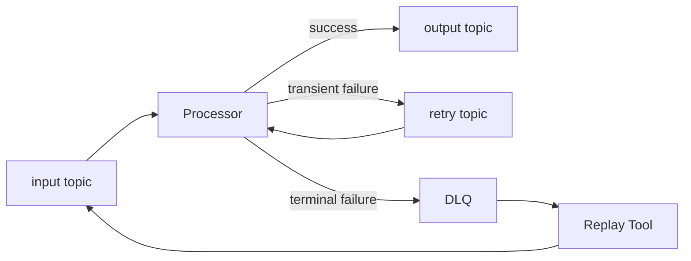

### 16.1 Failure Classification

| Failure Type | Example | Route |
|---|---|---|
| Deserialization | Invalid payload | DLQ/quarantine |
| Schema compatibility | Missing required field | DLQ or reject event |
| Transient dependency | DB timeout | Retry |
| Permanent dependency | Unknown customer id | Pending/reject/DLQ depending on domain |
| Business invalid | Illegal transition | Business event, not technical DLQ |
| Bug | Null pointer | Stop, alert, fix, replay |

### 16.2 Retry Boundary

Place retry where it preserves correctness.

Bad retry:

- blocks all records behind one poison pill;
- breaks ordering without documentation;
- retries forever;
- hides failure from operators;
- overloads downstream dependency.

Good retry:

- bounded;
- observable;
- classified;
- idempotent;
- has DLQ escape;
- has replay tool.

---

## 17. Backpressure and Flow Control

Kafka decouples producer and consumer time, but it does not remove capacity problems. It stores them as lag.

### 17.1 Backpressure Signals

- consumer lag increasing;
- oldest unprocessed event age increasing;
- retry topic growth;
- DLQ growth;
- processor latency rising;
- state store restore time rising;
- external sink queue increasing;
- broker disk/network pressure.

### 17.2 Flow-Control Options

| Option | Use When | Risk |
|---|---|---|
| Pause consumer partitions | Downstream temporary pressure | Must resume correctly. |
| Reduce poll batch size | Per-record work is heavy | Lower throughput. |
| Increase consumers | Partition count allows scaling | More concurrency complexity. |
| Buffer internally | Small bursts | Memory pressure. |
| Retry with delay topic | Transient failures | Ordering changes. |
| Shed low-priority records | Non-critical telemetry | Data loss if misclassified. |
| Scale downstream sink | Sink is bottleneck | Cost and dependency constraints. |

### 17.3 Freshness SLO

For business pipelines, lag in records is not enough. Use freshness:

```text
freshness = now - event.occurredAt or now - event.recordedAt
```

A topic with 10 records of lag can be worse than 10,000 records if the 10 records are old and business-critical.

---

## 18. Observability and Lineage

### 18.1 Topology-Level Dashboard

Track per stage:

- input rate;
- output rate;
- processing latency;
- consumer lag;
- event freshness;
- error rate;
- retry count;
- DLQ count;
- rebalance count;
- state restore time;
- output completeness.

### 18.2 Business Completeness Metrics

Technical metrics are insufficient.

Examples:

- number of approved quotes vs number of fulfillment triggers;
- number of created orders vs indexed orders;
- number of payment captures vs settlement records;
- number of escalated cases vs audit entries.

Completeness checks find semantic pipeline bugs that lag metrics miss.

### 18.3 Lineage Metadata

Every output should be traceable to inputs:

```json
{
  "eventId": "out-123",
  "sourceEvents": [
    {
      "topic": "quote.events.v1",
      "partition": 3,
      "offset": 91811,
      "eventId": "quote-event-991"
    },
    {
      "topic": "customer.current.v1",
      "partition": 1,
      "offset": 11102,
      "eventId": "customer-snapshot-441"
    }
  ],
  "processor": "quote-enricher",
  "processorVersion": "2026.07.01"
}
```

This is especially valuable for audit, debugging, and reproducibility.

---

## 19. Evolution Patterns

### 19.1 Add New Consumer

Safest evolution:

- no source change;
- new consumer group;
- independent deployment;
- replay from earliest or latest depending on use case.

### 19.2 Add New Output Topic

Useful when creating a new data product.

Need:

- schema;
- owner;
- retention;
- SLO;
- backfill plan;
- deprecation plan if replacing old output.

### 19.3 Split Pipeline Stage

Before:

```text
input -> normalize+enrich+project -> output
```

After:

```text
input -> normalize -> normalized topic -> enrich -> enriched topic -> project
```

Split when:

- transformation is reused;
- failure domains differ;
- ownership differs;
- stage has separate scaling needs;
- observability needs better isolation.

Do not split merely for aesthetics.

### 19.4 Merge Pipeline Stages

Merge when:

- intermediate topic has no independent value;
- latency matters;
- operational overhead is high;
- ownership is same;
- replay boundary is not needed.

### 19.5 Version Output Contract

When breaking semantic changes are needed:

```text
quote.enriched.v1
quote.enriched.v2
```

Run both during migration. Do not surprise existing consumers.

---

## 20. Deployment Unit Design

A pipeline stage may be deployed as:

- part of an existing domain service;
- separate stream processor app;
- Kafka Streams application;
- ksqlDB persistent query;
- Kafka Connect connector;
- scheduled/batch backfill job.

### 20.1 Deployment Decision Questions

- Does it need independent scaling?
- Does it need independent release cadence?
- Does it own state stores?
- Does it have different operational SLO?
- Does it call external dependencies?
- Does it need domain model access?
- Does it belong to platform or product team?

### 20.2 Microservice Boundary Warning

Do not create a new deployable service for every topic transformation. Operational overhead is real:

- CI/CD;
- monitoring;
- on-call;
- configs;
- secrets;
- scaling;
- logs;
- versioning;
- incident response.

A topology should be modular in design, not necessarily fragmented into dozens of deployments.

---

## 21. Example: Quote Approval Pipeline

### 21.1 Requirements

- Quote service publishes lifecycle events reliably.
- Fulfillment needs approved quotes.
- Search needs enriched quote data.
- Risk team needs approval metrics.
- Compliance needs audit trail.
- Replay must be possible for search and risk.
- Email notification must not be blindly replayed.

### 21.2 Proposed Topology

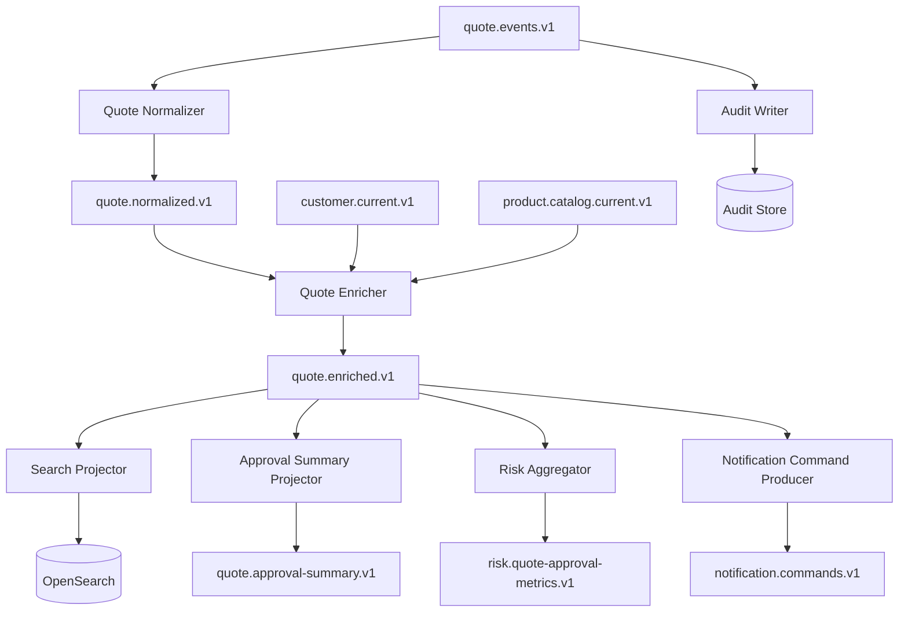

### 21.3 Design Notes

- `quote.events.v1` is the domain event source.
- `quote.normalized.v1` is an internal or semi-product boundary depending on reuse.
- `quote.enriched.v1` is a product topic if multiple teams consume it.
- Search and risk are replayable.
- Notification is isolated behind `notification.commands.v1` to avoid email side effects during projection replay.
- Audit writer consumes original domain events to avoid losing semantics through enrichment transformation.

### 21.4 Failure Handling

| Stage | Failure | Handling |
|---|---|---|
| Normalizer | Invalid event | DLQ with schema/error metadata. |
| Enricher | Missing customer | Pending/retry depending on business rule. |
| Search projector | OpenSearch down | Retry with backoff; idempotent upsert. |
| Risk aggregator | State store restore | Let Streams restore; monitor lag. |
| Notification producer | Duplicate event | Command idempotency key = source event id. |
| Audit writer | DB down | Retry; high-priority alert. |

---

## 22. Testing Pipeline Topologies

### 22.1 Topology Unit Tests

For Kafka Streams, use topology tests to verify:

- input record;
- transformation;
- output topic;
- key;
- timestamp;
- headers;
- state store update.

### 22.2 Contract Tests

For every output topic:

- schema compatibility;
- key format;
- required metadata;
- semantic examples;
- null/tombstone behavior;
- error envelope.

### 22.3 Integration Tests

Run the actual pipeline with Kafka and dependencies:

- source topic input;
- processor app;
- output topic assertion;
- retry topic assertion;
- DLQ assertion;
- state store restoration;
- restart behavior.

### 22.4 Replay Tests

Replay the same input twice and assert deterministic output where expected.

```java
@Test
void quoteSummaryProjectionIsDeterministicUnderReplay() {
    publishHistoricalQuoteEvents();
    runProjectorUntilCaughtUp();
    QuoteSummary first = repository.find("Q-1001");

    resetProjectionAndOffsets();
    publishHistoricalQuoteEvents();
    runProjectorUntilCaughtUp();
    QuoteSummary second = repository.find("Q-1001");

    assertThat(second).isEqualTo(first);
}
```

### 22.5 Chaos Tests

Inject:

- processor crash after output write before offset commit;
- downstream sink timeout;
- invalid input record;
- reference data delay;
- rebalance during processing;
- state store restoration;
- duplicate input event;
- out-of-order event.

A topology that only works in a happy-path local demo is not production-ready.

---

## 23. Architecture Review Checklist

### 23.1 Topology Clarity

- [ ] Topology graph exists.
- [ ] All input and output topics are listed.
- [ ] Internal vs product topics are marked.
- [ ] State stores are identified.
- [ ] External dependencies are identified.
- [ ] Ownership is documented.

### 23.2 Contract Safety

- [ ] Input schemas are versioned.
- [ ] Output schemas are versioned.
- [ ] Key semantics are documented.
- [ ] Tombstone behavior is documented.
- [ ] Retention is documented.
- [ ] Compatibility mode is defined.

### 23.3 Correctness

- [ ] Ordering assumptions are explicit.
- [ ] Repartitioning is visible.
- [ ] Idempotency exists for side effects.
- [ ] Offset commit strategy is safe.
- [ ] Replay behavior is defined.
- [ ] Duplicate handling is tested.

### 23.4 Failure Handling

- [ ] Retry policy exists.
- [ ] DLQ/quarantine policy exists.
- [ ] Poison pill procedure exists.
- [ ] Missing reference data policy exists.
- [ ] Downstream outage behavior exists.
- [ ] Manual repair runbook exists.

### 23.5 Operations

- [ ] Lag metrics exist.
- [ ] Freshness metrics exist.
- [ ] Error metrics exist.
- [ ] Business completeness metrics exist.
- [ ] Dashboards exist.
- [ ] Alerts have owners.
- [ ] Capacity model exists.

---

## 24. Anti-Patterns

### 24.1 Topic-per-Function

Creating a topic after every tiny code function creates operational noise without meaningful boundaries.

### 24.2 Mega-Topic

One topic for every event in the company creates schema chaos, broad ACLs, and inefficient consumers.

### 24.3 Hidden Remote API in Stream Processor

A high-throughput Kafka processor that calls a slow synchronous API can turn a streaming system into a distributed timeout generator.

### 24.4 No Ownership for Intermediate Topics

An intermediate topic consumed by another team has become a product topic whether you admit it or not.

### 24.5 Replay Triggers Side Effects

If replay sends emails, charges cards, or opens cases, your pipeline is unsafe.

### 24.6 Lag-Only Observability

Lag can be zero while output is wrong. Add business completeness metrics.

### 24.7 Repartitioning by Accident

Kafka Streams and ksqlDB can create repartition topics when key requirements change. Understand and monitor them.

### 24.8 Transformation Without Semantic Contract

If no one can explain what an output topic means, consumers will infer meaning and create accidental contracts.

---

## 25. Pipeline ADR Template

```md
# ADR: Pipeline Topology for <Pipeline Name>

## Context
- Business capability:
- Source topic/table/API:
- Consumers:
- Latency/freshness requirement:
- Audit/regulatory requirement:

## Topology
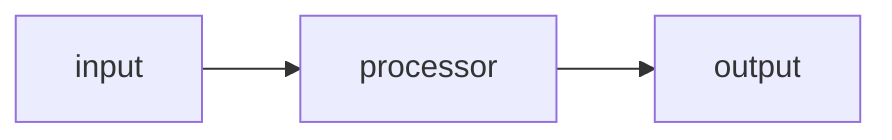

## Stages
| Stage | Owner | Runtime | Input | Output | State | Replay |
|---|---|---|---|---|---|---|

## Topic Contracts
| Topic | Type | Owner | Key | Schema | Retention | Product/Internal |
|---|---|---|---|---|---|---|

## Correctness
- Ordering assumptions:
- Repartitioning:
- Idempotency:
- Offset strategy:
- Time semantics:

## Failure Handling
- Retry:
- DLQ:
- Missing reference data:
- Downstream outage:
- Replay:

## Observability
- Technical metrics:
- Business metrics:
- Alerts:
- Dashboards:

## Evolution
- Versioning plan:
- Backfill plan:
- Deprecation plan:

## Consequences
- Benefits:
- Costs:
- Open risks:
```

---

## 26. Deliberate Practice

### Exercise 1 — Draw a Real Topology

Pick one business flow:

- quote approval;
- order fulfillment;
- payment settlement;
- enforcement escalation;
- fraud scoring.

Draw the topology with:

- source topics;
- processors;
- output topics;
- state stores;
- retry/DLQ;
- external sinks.

### Exercise 2 — Classify Topics

For each topic in your topology, classify it as:

- domain event;
- current-state topic;
- command topic;
- internal retry;
- DLQ;
- repartition/changelog;
- product projection;
- external integration topic.

### Exercise 3 — Identify Repartition Points

Find every stage where key changes.

For each, explain:

- old key;
- new key;
- why key changes;
- cost;
- ordering impact;
- alternative design.

### Exercise 4 — Design Failure Routes

For each stage, define:

- retryable errors;
- terminal errors;
- business invalid cases;
- DLQ payload;
- replay path.

### Exercise 5 — Business Completeness Metric

Design one metric that proves semantic correctness.

Examples:

```text
approved_quotes_total == fulfillment_triggers_total + intentionally_skipped_quotes_total
```

or:

```text
case_escalated_events_total == audit_escalation_rows_total
```

---

## 27. Mental Model Summary

- A Kafka pipeline is a graph of contracts, state, ownership, and failure paths.
- Topic boundaries should represent durable, observable, independently consumable value.
- Internal topics and product topics require different governance.
- Enrichment design is mostly about dependency and time semantics.
- Repartitioning is a necessary but costly shuffle; make it explicit.
- Replay is a design requirement, not an emergency trick.
- Observability must include business completeness, not only lag.
- Pipeline topology should be reviewed like application architecture, not treated as glue code.

---

## 28. References

- Apache Kafka Documentation — https://kafka.apache.org/documentation/
- Apache Kafka Streams Processor API — https://kafka.apache.org/documentation/streams/developer-guide/processor-api.html
- Confluent Kafka Streams Concepts — https://docs.confluent.io/platform/current/streams/concepts.html
- Confluent Kafka Streams Architecture — https://docs.confluent.io/platform/current/streams/architecture.html
- Confluent Kafka Connect Documentation — https://docs.confluent.io/platform/current/connect/
