# Part 017 — Kafka Streams Core Model

Part 016 modelled Kafka pipelines as explicit source-transform-sink topologies. This part zooms into the most important Java-native runtime for building those topologies: **Kafka Streams**.

Kafka Streams is not a separate cluster. It is a Java library embedded inside your application process. Your application instances consume Kafka input topics, execute a topology, maintain local state when needed, and write results back to Kafka output topics.

This distinction matters.

A Kafka Streams application is operated like a normal Java service, but it behaves like a distributed stream processor:

- it has partition-parallel tasks;
- it has state that must be restored after failure;
- it creates internal topics for changelog and repartitioning;
- it rebalances when instances join or leave;
- it must preserve key partitioning for stateful operations;
- it can be replayed from Kafka input topics;
- it can scale horizontally, but only within partition and state constraints.

A junior engineer asks:

> How do I write `.map()`, `.filter()`, and `.to()`?

A senior engineer asks:

> What topology did I create, what internal topics did it generate, where is state stored, how is it recovered, which key defines correctness, how will this rebalance under deployment, and what happens during replay?

That is the skill of this part.

---

## 1. Kaufman Skill Decomposition

The skill is **building and operating Kafka Streams applications as distributed, stateful Java systems**.

| Subskill | Production Meaning |
|---|---|
| Topology modelling | Understand the graph of sources, processors, state stores, repartition topics, and sinks. |
| Stream-table reasoning | Know when a topic should be treated as a stream of facts or a table of latest state. |
| Task reasoning | Map input topic partitions to Kafka Streams tasks and understand the scaling ceiling. |
| State store reasoning | Know which operations require local state and how that state is backed up. |
| Repartition reasoning | Predict when Kafka Streams must reshuffle data by key. |
| Changelog reasoning | Understand how local state survives crashes through Kafka changelog topics. |
| Serde discipline | Treat serialization as part of the contract, not plumbing. |
| Failure recovery | Explain how an instance restores state after process, node, or pod failure. |
| Deployment sizing | Align instances, stream threads, partitions, state size, and restore time. |
| Operability | Observe lag, restore progress, thread state, task assignment, and topology health. |

### 1.1 Practice Goal

By the end of this part, you should be able to inspect a Kafka Streams design and answer:

- What are the input and output topics?
- Which operations are stateless?
- Which operations are stateful?
- Which topics are internal?
- Which keys determine correctness?
- How many tasks can run in parallel?
- How large can local state become?
- How long will restoration take after failure?
- Which metrics prove the app is healthy?
- What must be documented before production approval?

---

## 2. Kafka Streams Is a Library, Not a Cluster

Kafka Streams runs inside your Java application.

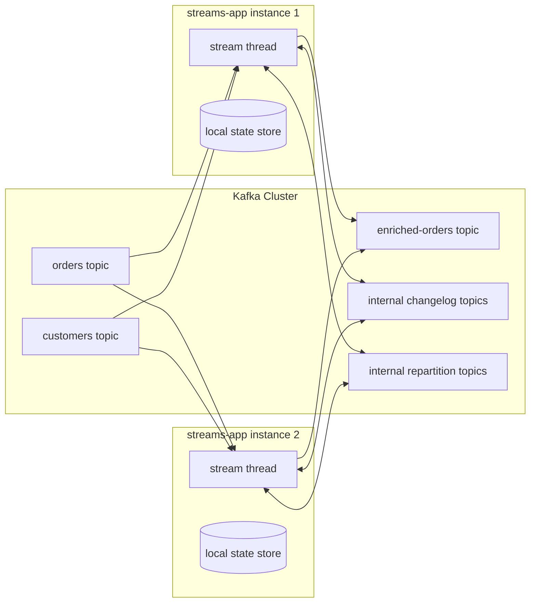

There is no separate Kafka Streams master node. There is no external job manager like a standalone stream-processing cluster. Kafka itself coordinates partition assignment through the consumer group protocol. Each application instance participates in the same `application.id`, which also acts as the consumer group identity.

### 2.1 Implications

| Fact | Engineering Consequence |
|---|---|
| Streams is embedded in your JVM | You deploy, monitor, and restart it like an application service. |
| Kafka assigns partitions to instances | Scaling depends on topic partition count and task assignment. |
| State is local | Disk sizing, restore time, and host/pod lifecycle matter. |
| Changelog is in Kafka | Kafka retention, replication, and compaction affect state recovery. |
| Repartition topics are Kafka topics | Topic governance must include internal topics. |
| App identity is `application.id` | Changing it changes consumer group and internal topic namespace. |

### 2.2 What Kafka Streams Is Good At

Kafka Streams is strong when the problem is:

- Kafka-in, Kafka-out stream processing;
- low-latency transformations;
- stateful aggregation;
- stream-table joins;
- event enrichment from compacted reference data;
- materialized views inside Java services;
- operationally simple stream processing without a separate compute cluster;
- topology unit testing with `TopologyTestDriver`;
- domain-specific streaming applications owned by service teams.

### 2.3 What Kafka Streams Is Not Ideal For

Kafka Streams is often the wrong abstraction when the problem is:

- arbitrary batch analytics;
- ad hoc analytical SQL over large historical datasets;
- complex cross-stream global joins without partition alignment;
- heavyweight ML feature pipelines requiring specialized execution engines;
- non-Kafka source/sink orchestration where Kafka Connect is a better fit;
- global workflow orchestration where a workflow engine is more appropriate;
- multi-step human process management.

Kafka Streams is a stream processor, not a business process engine, not a database replacement, and not a universal ETL platform.

---

## 3. The Core Vocabulary

Kafka Streams has a small set of concepts that combine into powerful systems.

| Concept | Meaning |
|---|---|
| `StreamsBuilder` | Builder used to define a topology with the DSL. |
| `Topology` | The executable processor graph. |
| Source processor | Reads records from Kafka topics. |
| Processor | Transforms, filters, joins, aggregates, or forwards records. |
| Sink processor | Writes records to Kafka topics. |
| `KStream` | Record stream: each record is an independent fact or event. |
| `KTable` | Changelog table: each key represents latest known state. |
| `GlobalKTable` | Fully replicated table on each instance. |
| Task | Unit of parallelism assigned from input topic partitions. |
| Stream thread | JVM thread running one or more tasks. |
| State store | Local key-value/window/session store used by stateful operations. |
| Changelog topic | Kafka topic backing up a state store. |
| Repartition topic | Internal topic used to reshuffle data by key. |
| Serde | Serializer/deserializer for key and value types. |
| `application.id` | Application identity, consumer group, and internal topic namespace. |

---

## 4. Topology: The Graph You Actually Deploy

A Kafka Streams application starts as code, but what matters operationally is the topology graph.

```java
StreamsBuilder builder = new StreamsBuilder();

KStream<String, OrderCreated> orders = builder.stream("orders.v1");

KStream<String, HighValueOrder> highValueOrders = orders
    .filter((orderId, order) -> order.totalAmount().compareTo(Money.of("1000.00")) >= 0)
    .mapValues(order -> HighValueOrder.from(order));

highValueOrders.to("high-value-orders.v1");

Topology topology = builder.build();
```

Conceptually:

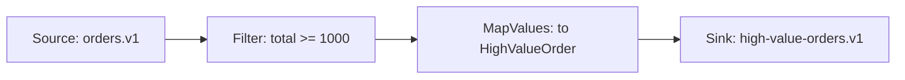

This example is stateless. It does not need a state store or changelog topic. If the application crashes, another instance can resume from committed offsets and continue.

A stateful topology is different:

```java
KTable<String, Long> orderCountByCustomer = builder
    .stream("orders.v1", Consumed.with(Serdes.String(), orderSerde))
    .selectKey((orderId, order) -> order.customerId())
    .groupByKey(Grouped.with(Serdes.String(), orderSerde))
    .count(Materialized.as("order-count-by-customer"));

orderCountByCustomer
    .toStream()
    .to("customer-order-counts.v1", Produced.with(Serdes.String(), Serdes.Long()));
```

Conceptually:

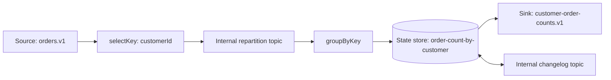

That topology has much more operational weight:

- key changes may trigger repartitioning;
- aggregation needs a local state store;
- state store is backed by a changelog topic;
- recovery depends on restoring that state;
- scaling depends on input/repartition topic partitions;
- correctness depends on the selected key.

---

## 5. KStream, KTable, and GlobalKTable

The hardest conceptual jump in Kafka Streams is not the API. It is the **stream-table duality**.

### 5.1 KStream

A `KStream<K, V>` is a stream of independent records.

Use `KStream` when each record is meaningful as an event:

- `OrderCreated`
- `PaymentAuthorized`
- `CaseEscalated`
- `DeviceTelemetryReceived`
- `QuoteSubmitted`
- `ShipmentDelayed`

A `KStream` record says:

> This happened.

If multiple records have the same key, they are not automatically replacements. They are separate facts.

Example:

```text
key=order-1 value=OrderCreated(total=100)
key=order-1 value=OrderAmended(total=120)
key=order-1 value=OrderCancelled(reason="fraud")
```

Those are three events.

### 5.2 KTable

A `KTable<K, V>` represents the latest value per key. It is a changelog table.

Use `KTable` when the topic represents state:

- latest customer profile;
- latest account status;
- latest product price;
- latest inventory quantity;
- latest case state;
- latest policy version;
- latest feature flag.

A `KTable` record says:

> For this key, the latest state is now this.

Example:

```text
key=customer-7 value=CustomerStatus(active=true, segment="gold")
key=customer-7 value=CustomerStatus(active=false, segment="gold")
```

The second record supersedes the first for table lookup purposes.

### 5.3 Tombstone

For a table-like topic, a record with a key and a `null` value is a tombstone. It means deletion of that key from the table view.

```text
key=customer-7 value=null
```

This matters for compacted topics, CDC topics, and KTable joins.

### 5.4 GlobalKTable

A `GlobalKTable<K, V>` is a table where every application instance consumes the full topic and keeps a complete local copy.

Use it for relatively small reference data:

- country codes;
- product catalog subset;
- regulatory rule metadata;
- exchange rate table;
- tenant configuration;
- feature flags;
- service routing map.

Do not use `GlobalKTable` for huge or high-churn tables unless you are deliberately accepting memory/disk, restoration, and network cost on every instance.

### 5.5 Comparison

| Abstraction | Represents | Key Meaning | Common Use |
|---|---|---|---|
| `KStream` | Sequence of facts | Routing/order boundary | Events, commands, telemetry, audit facts |
| `KTable` | Latest state per key | Primary key | Profiles, balances, statuses, materialized views |
| `GlobalKTable` | Full copy of reference table on each instance | Lookup key | Small reference/enrichment datasets |

---

## 6. Stream-Table Duality

A stream can be seen as a changelog of a table. A table can be seen as the result of replaying a changelog.

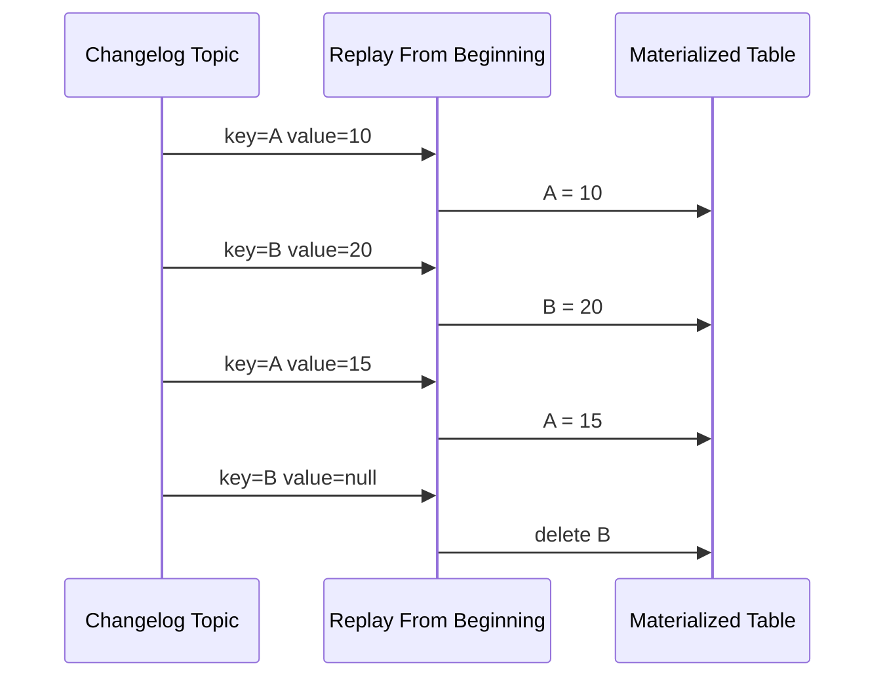

Final table:

```text
A = 15
B = deleted
```

This is why Kafka can be both:

- an event log;
- a source for materialized views;
- a replication backbone;
- a recovery mechanism for state stores.

### 6.1 Practical Mental Rule

Ask this before choosing `KStream` or `KTable`:

> If I replay all records for the same key, do I care about every fact, or only the latest value?

If every fact matters, use stream semantics.

If latest value matters, use table semantics.

### 6.2 Common Mistake

A common mistake is treating a domain event topic as a `KTable` just because it has keys.

For example, this is usually wrong:

```text
orders.events.v1 as KTable<orderId, OrderEvent>
```

Why? Because `OrderCreated`, `OrderPaid`, `OrderPacked`, and `OrderCancelled` are not replacements for each other. They are different facts in the lifecycle.

A better design is either:

- consume the event stream and build a materialized order state table; or
- publish a separate compacted `orders.current-state.v1` topic.

---

## 7. Tasks: The Unit of Parallelism

Kafka Streams parallelism is based on **tasks**.

A task processes a subset of input partitions. For simple topologies, each input partition often maps to one task. For multi-source topologies, task assignment depends on partition alignment.

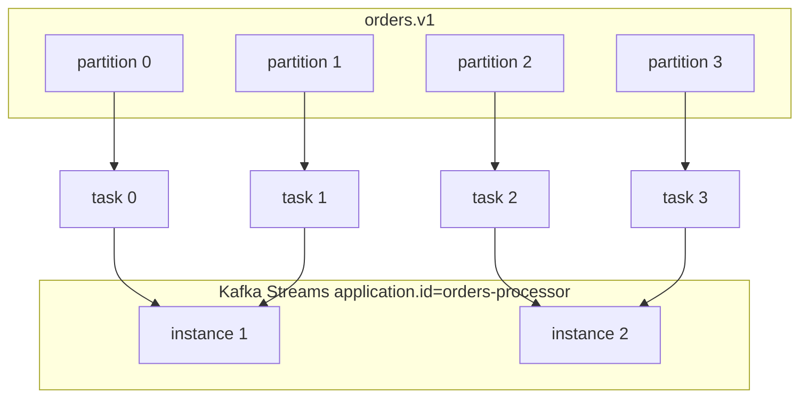

If the input topic has 4 partitions, maximum useful task parallelism is roughly 4 for that source. Adding 20 instances will not create 20 active tasks for that topic.

### 7.1 Instance vs Thread vs Task

| Layer | Meaning |
|---|---|
| Application instance | One JVM process running the Kafka Streams application. |
| Stream thread | Worker thread inside the JVM. |
| Task | Assigned unit of partition processing. |
| Partition | Kafka log shard feeding tasks. |

One instance can run multiple stream threads. One stream thread can run multiple tasks.

### 7.2 Scaling Rule

You scale Kafka Streams by balancing:

```text
parallelism = min(topic_partition_capacity, task_count, instance_count * num.stream.threads)
```

This is not exact for every topology, but it is the mental model.

If you have:

- 6 input partitions;
- 2 application instances;
- 2 stream threads per instance;

then you have up to 4 active stream threads, but 6 tasks may be distributed across those 4 threads.

If you have:

- 6 input partitions;
- 10 application instances;
- 1 stream thread each;

then only 6 instances can actively process tasks for that input. The other instances may be idle or standby depending on configuration and topology.

---

## 8. Stateless Processing

Stateless operations do not need local state across records.

Common stateless operations:

- `filter`
- `map`
- `mapValues`
- `flatMap`
- `flatMapValues`
- `peek`
- `branch` or split-style routing
- header enrichment
- validation
- schema conversion
- projection

Example:

```java
builder.stream("payments.authorized.v1", Consumed.with(Serdes.String(), paymentSerde))
    .filter((paymentId, payment) -> payment.amount().isPositive())
    .mapValues(PaymentProjection::from)
    .to("payments.projection.v1", Produced.with(Serdes.String(), projectionSerde));
```

Stateless processing is easier to operate because:

- no state restore;
- no changelog topic;
- fewer internal resources;
- simpler replay;
- less disk pressure;
- lower recovery time.

But stateless does not mean risk-free. You still must handle:

- serialization errors;
- output schema compatibility;
- duplicate records after retry;
- poison messages;
- output topic authorization;
- throughput and backpressure;
- deployment rebalance.

---

## 9. Stateful Processing

Stateful operations require remembering information across records.

Common stateful operations:

- `count`
- `aggregate`
- `reduce`
- windowed aggregation;
- joins;
- deduplication;
- suppression;
- custom state store lookup;
- table materialization.

Example:

```java
KTable<String, Long> countByCustomer = builder
    .stream("orders.created.v1", Consumed.with(Serdes.String(), orderSerde))
    .selectKey((orderId, order) -> order.customerId())
    .groupByKey(Grouped.with(Serdes.String(), orderSerde))
    .count(Materialized.as("orders-count-by-customer"));
```

This creates local state per task. The state must be durable enough to survive crashes. Kafka Streams achieves this by writing state changes to changelog topics.

### 9.1 Local State Store

A state store is local to the application instance that owns the task.

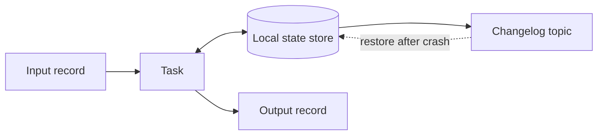

The store is local for low-latency access. The changelog is remote for recovery.

### 9.2 Changelog Topic

A changelog topic records mutations to the state store. If an instance dies, another instance can restore the state store by replaying the changelog.

For example:

```text
state store: orders-count-by-customer
internal changelog topic: <application.id>-orders-count-by-customer-changelog
```

The exact topic naming depends on topology and naming conventions, but the principle is stable: **local state is backed by Kafka**.

### 9.3 State Store Failure Model

| Failure | What Happens |
|---|---|
| Process crash | Task is reassigned; state is restored from changelog if local files unavailable. |
| Pod rescheduled to another node | Local disk may be empty; full restore may be needed. |
| Local state directory deleted | State is rebuilt from changelog. |
| Changelog topic lost | State cannot be reliably restored. |
| Changelog retention misconfigured | Long restore or incorrect state risk depending on topic type and retention. |
| Disk full | Instance may fail or stall; stateful apps need disk SLOs. |

---

## 10. Repartition Topics

A repartition topic is created when records must be regrouped by a different key before a stateful operation.

Example:

```java
builder.stream("orders.created.v1", Consumed.with(Serdes.String(), orderSerde))
    .selectKey((orderId, order) -> order.customerId())
    .groupByKey()
    .count();
```

Input key is `orderId`, but aggregation key is `customerId`. Kafka Streams cannot correctly count by customer unless all records for the same customer go to the same task. It therefore writes to an internal repartition topic keyed by `customerId`.

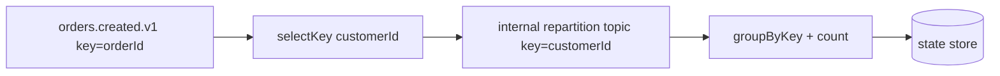

### 10.1 Repartition Cost

Repartitioning is not free.

It adds:

- an extra Kafka write;
- an extra Kafka read;
- serialization/deserialization cost;
- broker disk IO;
- network transfer;
- more internal topics;
- more failure and lag surfaces;
- possible cross-AZ traffic cost;
- more operational complexity.

### 10.2 Repartition Design Rule

Do not avoid repartitioning blindly. Sometimes it is exactly the right thing.

But every repartition should have a named reason:

```text
We repartition from orderId to customerId because the correctness boundary of the aggregation is customer-level order count.
```

If the team cannot explain the correctness boundary, the repartition is probably accidental.

---

## 11. Application ID

`application.id` is one of the most important Kafka Streams configurations.

It defines:

- consumer group identity;
- offset namespace;
- internal topic prefix;
- state store identity;
- deployment identity;
- reset/replay boundary.

Example:

```properties
application.id=orders-risk-scoring-v1
bootstrap.servers=kafka-1:9092,kafka-2:9092,kafka-3:9092
```

### 11.1 Changing `application.id`

Changing `application.id` is not a harmless rename.

It usually means:

- a new consumer group;
- offsets start from configured reset policy;
- internal topics have different names;
- state may rebuild from scratch;
- output may be regenerated;
- duplicate downstream effects may happen.

Treat changing `application.id` like creating a new application deployment identity.

### 11.2 Versioning `application.id`

For compatible code changes, keep the same `application.id`.

For incompatible topology changes, a new `application.id` may be safer, but you must plan:

- input offset starting point;
- output topic strategy;
- dual-run comparison;
- cutover;
- decommission old app;
- cleanup internal topics.

---

## 12. Serdes Are Part of the Architecture

Kafka Streams relies heavily on Serdes.

Serde errors are not implementation noise. They are contract failures.

You need Serdes for:

- input topic keys;
- input topic values;
- output topic keys;
- output topic values;
- repartition topic keys;
- repartition topic values;
- state store keys;
- state store values;
- changelog topic keys;
- changelog topic values.

### 12.1 Default Serdes

A simple application can set default Serdes:

```properties
default.key.serde=org.apache.kafka.common.serialization.Serdes$StringSerde
default.value.serde=io.confluent.kafka.streams.serdes.avro.SpecificAvroSerde
```

But advanced applications often specify Serdes explicitly at the operation boundary:

```java
KStream<String, OrderCreated> orders = builder.stream(
    "orders.created.v1",
    Consumed.with(Serdes.String(), orderCreatedSerde)
);

orders.to(
    "orders.validated.v1",
    Produced.with(Serdes.String(), validatedOrderSerde)
);
```

Explicit Serdes reduce surprise, especially when a topology contains multiple event types.

### 12.2 Serde Anti-Pattern

Bad:

```java
builder.stream("some-topic")
    .mapValues(value -> convert(value))
    .to("some-output");
```

If the Serdes are implicit and the topic contains contract-sensitive data, the topology is harder to review.

Better:

```java
builder.stream("orders.created.v1", Consumed.with(orderIdSerde, orderCreatedSerde))
    .mapValues(OrderValidated::from)
    .to("orders.validated.v1", Produced.with(orderIdSerde, orderValidatedSerde));
```

---

## 13. Time in Kafka Streams

Kafka Streams uses timestamps for time-sensitive operations, especially windowing. Windowing is covered deeply in Part 019, but the core model starts here.

Each record has a timestamp. That timestamp may represent:

- event time;
- ingestion time;
- processing time;
- custom extracted domain time.

For serious systems, choose timestamp semantics deliberately.

Example:

```java
public final class OrderTimestampExtractor implements TimestampExtractor {
    @Override
    public long extract(ConsumerRecord<Object, Object> record, long partitionTime) {
        OrderEvent event = (OrderEvent) record.value();
        return event.occurredAt().toEpochMilli();
    }
}
```

Configuration:

```properties
default.timestamp.extractor=com.acme.kafka.OrderTimestampExtractor
```

### 13.1 Why Time Semantics Matter

If you use processing time accidentally, late-arriving records may be assigned to the wrong window.

If you use event time, you need to decide:

- how late is acceptable;
- whether late records update previous results;
- whether old windows are closed;
- whether outputs are emitted early or suppressed;
- how downstream interprets corrections.

This becomes critical in fraud, risk, compliance, billing, SLA, and regulatory systems.

---

## 14. Lifecycle of a Kafka Streams Application

A simplified lifecycle:

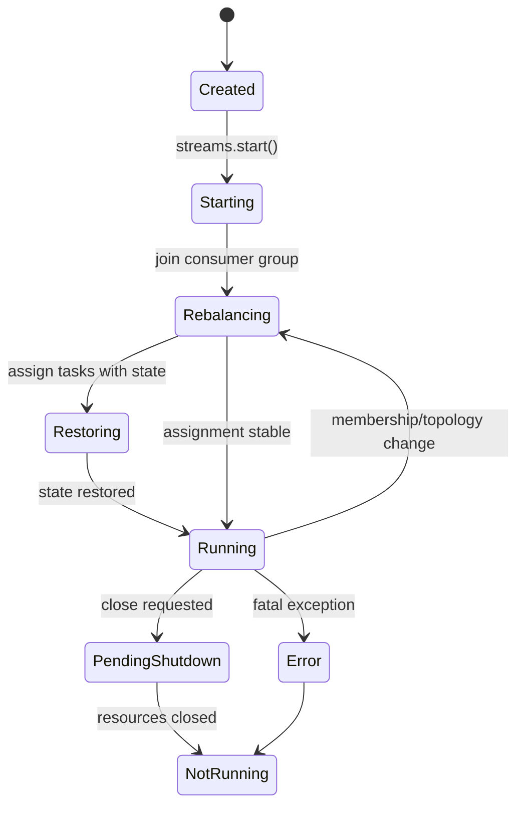

Production services should expose readiness based on this lifecycle. A process being alive is not enough. A stateful Streams instance may be alive but still restoring.

### 14.1 Readiness Rule

A Kafka Streams application is not ready merely because the JVM started.

It is ready when:

- topology is started;
- broker connection is healthy;
- assigned tasks are running;
- required state stores are restored;
- fatal error handler has not tripped;
- lag is within startup expectations;
- output topic permissions are valid.

---

## 15. Minimal Production Skeleton

```java
public final class OrdersRiskScoringApplication {

    public static void main(String[] args) {
        Properties props = new Properties();
        props.put(StreamsConfig.APPLICATION_ID_CONFIG, "orders-risk-scoring-v1");
        props.put(StreamsConfig.BOOTSTRAP_SERVERS_CONFIG, "localhost:9092");
        props.put(StreamsConfig.NUM_STREAM_THREADS_CONFIG, 2);
        props.put(StreamsConfig.STATE_DIR_CONFIG, "/var/lib/orders-risk-scoring/state");
        props.put(StreamsConfig.DEFAULT_KEY_SERDE_CLASS_CONFIG, Serdes.StringSerde.class);

        StreamsBuilder builder = new StreamsBuilder();

        KStream<String, OrderCreated> orders = builder.stream(
            "orders.created.v1",
            Consumed.with(Serdes.String(), orderCreatedSerde())
        );

        orders
            .filter((orderId, order) -> order.totalAmount().isPositive())
            .mapValues(RiskCandidate::from)
            .to("orders.risk-candidates.v1", Produced.with(Serdes.String(), riskCandidateSerde()));

        KafkaStreams streams = new KafkaStreams(builder.build(), props);

        streams.setUncaughtExceptionHandler(exception -> {
            // In production, log with correlation, alert, and choose replacement/shutdown policy deliberately.
            return StreamsUncaughtExceptionHandler.StreamThreadExceptionResponse.SHUTDOWN_APPLICATION;
        });

        Runtime.getRuntime().addShutdownHook(new Thread(streams::close));

        streams.start();
    }
}
```

This skeleton is intentionally simple. The advanced parts are not the method calls; they are the operational decisions around application ID, state directory, Serdes, exception policy, readiness, and metrics.

---

## 16. State Directory and Storage

Stateful Kafka Streams applications use local disk.

Configuration:

```properties
state.dir=/var/lib/<app-name>/kafka-streams
```

Important questions:

- Is the disk ephemeral or persistent?
- What happens when a pod is rescheduled?
- How large can state stores grow?
- How fast can state restore from changelog?
- What is the restore SLO?
- Is disk IO monitored?
- Is state directory cleaned only during planned resets?
- Are changelog topics replicated enough?

### 16.1 Ephemeral Disk vs Persistent Disk

| Storage | Benefit | Cost |
|---|---|---|
| Ephemeral local disk | Fast, simple, disposable | Full restore after reschedule |
| Persistent volume | Faster restart on same volume | More operational complexity |
| Local SSD | High performance | Node affinity and failure-domain planning |
| Network volume | Easier persistence | Latency and throughput risk |

There is no universal answer. The correct choice depends on state size, restore time, deployment platform, and recovery SLO.

---

## 17. Internal Topics Governance

Kafka Streams can create internal topics. They are not random noise.

They may contain:

- repartitioned records;
- state store changelog entries;
- windowed state;
- aggregation updates.

Internal topics need governance because they affect:

- broker storage;
- replication;
- security ACLs;
- backup assumptions;
- reset behavior;
- disaster recovery;
- cost allocation;
- operational dashboards.

### 17.1 Internal Topic Checklist

Before production, document:

```yaml
applicationId: orders-risk-scoring-v1
inputTopics:
  - orders.created.v1
outputTopics:
  - orders.risk-candidates.v1
stateStores:
  - risk-score-by-customer
expectedInternalTopics:
  - orders-risk-scoring-v1-risk-score-by-customer-changelog
  - orders-risk-scoring-v1-...-repartition
retentionPolicy:
  changelog: compacted
  repartition: delete after processing window
owner: risk-platform-team
recoverySlo: restore within 15 minutes for p95 state size
```

---

## 18. Scaling Model

Kafka Streams scaling is constrained by partitioning and state.

### 18.1 Stateless Scaling

Stateless scaling is mostly about input partitions and downstream capacity.

```text
More instances -> more consumer group members -> more partition assignments -> more parallel processing
```

But if the topic has only 3 partitions, adding a 10th instance does not create 10 active consumers for that topic.

### 18.2 Stateful Scaling

Stateful scaling includes all stateless concerns plus:

- state migration during rebalance;
- changelog restore time;
- standby replicas if configured;
- local disk capacity;
- RocksDB or state-store performance;
- internal topic throughput;
- repartition load;
- cache behavior;
- window retention.

### 18.3 Scaling Decision Table

| Symptom | Likely Cause | Response |
|---|---|---|
| High input lag, low CPU | Too few partitions or blocked downstream | Increase partitions if safe, inspect processing bottleneck. |
| High CPU, low lag | Compute-heavy transformation | Add instances/threads, optimize code, consider offloading. |
| High restore time | Large state store or slow changelog replay | Tune state, storage, standby, restore path. |
| High broker IO | Repartition/changelog heavy topology | Reduce repartitions, review aggregation design. |
| Frequent rebalances | Unstable deployment or long processing | Tune lifecycle, max poll, cooperative protocol, shutdown. |
| Uneven task load | Key skew or hot partitions | Redesign key, split heavy keys, add sharding strategy. |

---

## 19. Correctness Invariants

Use these invariants in code review.

### 19.1 Key Invariant

> Every stateful operation must use a key that matches the business correctness boundary.

Counting orders by customer requires `customerId`, not `orderId`.

Joining payment to order often requires `orderId`, not `customerId`.

Escalation state by case requires `caseId`, not `tenantId`.

### 19.2 Repartition Invariant

> If the key changes before a stateful operation, expect repartitioning.

If repartitioning is unacceptable, redesign the topic key upstream or change the processing model.

### 19.3 State Restore Invariant

> Local state is disposable only if the changelog is durable and complete.

Deleting local state is safe only if the changelog can rebuild it and the topology version is compatible.

### 19.4 Topology Evolution Invariant

> Renaming state stores or processors can change internal topic names and reset behavior.

Stable naming matters for production upgrades.

### 19.5 Output Idempotency Invariant

> Downstream systems must tolerate duplicate or regenerated output unless the entire end-to-end boundary is explicitly controlled.

Kafka Streams can provide strong guarantees inside Kafka boundaries, but external systems still need idempotency.

---

## 20. Observability Model

A Kafka Streams app needs observability at several layers.

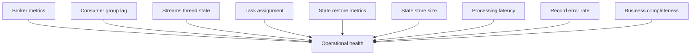

### 20.1 Minimum Dashboard

A production dashboard should include:

- application status;
- stream thread states;
- consumer lag per input topic;
- records consumed rate;
- records produced rate;
- processing latency;
- commit latency;
- rebalance count/duration;
- state restore progress;
- state store size;
- internal topic lag;
- skipped/dropped/error records;
- DLQ rate if error handling is integrated;
- business-level output count/freshness.

### 20.2 Business Completeness

Technical metrics are not enough.

For example, for an order risk topology:

```text
orders.created.count == orders.risk-candidates.count + orders.filtered-out.count + orders.error.count
```

This invariant catches silent data loss that broker metrics may not expose.

---

## 21. Failure Reasoning Matrix

| Scenario | Expected Behavior | Design Requirement |
|---|---|---|
| App instance crashes | Tasks move to surviving/new instance | Changelog and offsets must be valid. |
| Broker unavailable briefly | App retries/polls depending on client behavior | Alert on sustained unavailability. |
| State directory lost | State restored from changelog | Restore time must fit SLO. |
| Input topic receives bad schema | Deserialization failure | Error strategy and contract testing. |
| Output topic unavailable | Processing may fail/stall | Clear exception policy and alerting. |
| Rebalance during deployment | Tasks pause/move | Graceful shutdown and readiness. |
| Hot key dominates partition | One task overloaded | Key design or sharding required. |
| Internal topic ACL missing | App fails at runtime | Provision internal topic permissions. |
| Topology changed incompatibly | State restore may fail or output changes | Versioned deployment/reset plan. |

---

## 22. Architecture Review Questions

Ask these before approving a Kafka Streams application.

### 22.1 Topology

- Can we draw the topology as source-process-store-sink?
- Which operations are stateful?
- Which operations trigger repartition?
- Are state stores named deliberately?
- Are processor names stable enough for upgrades?

### 22.2 Contracts

- What are the input schema versions?
- What are the output schema versions?
- What Serdes are used at each boundary?
- Is the output a stream or table?
- Are tombstones handled correctly?

### 22.3 State

- How large will state grow?
- What is the retention model?
- What is the restore SLO?
- Is local disk capacity enough?
- What happens during reschedule?

### 22.4 Operations

- What is the `application.id`?
- How many instances and stream threads?
- How many input partitions?
- What internal topics are expected?
- What metrics define readiness?
- What metrics define correctness?

### 22.5 Failure

- What happens on poison record?
- What happens on schema mismatch?
- What happens on output failure?
- What happens on rebalance?
- What happens if state restore exceeds SLO?

---

## 23. Common Anti-Patterns

### 23.1 Treating Kafka Streams Like a Stateless REST Service

A stateful Streams app has local state, changelog topics, restore behavior, and rebalance implications. Do not deploy it with the same assumptions as a stateless API.

### 23.2 Ignoring Internal Topics

Internal topics consume storage and define recovery. They must be observed and governed.

### 23.3 Accidental Repartitioning

Changing keys casually before aggregation can introduce hidden cost and latency.

### 23.4 Huge GlobalKTable

Replicating a large table to every instance can overload startup, disk, memory, and network.

### 23.5 Unstable Application ID

Changing `application.id` during routine deploys causes new group identity and state namespace.

### 23.6 No State Restore Test

If you never test restore from empty state directory, you do not know your recovery time.

### 23.7 Business Logic Hidden in Lambdas

Large anonymous lambdas inside topology definitions make review, testing, metrics, and exception handling harder.

---

## 24. Practice Lab

### 24.1 Build a Stateless Topology

Create:

```text
orders.created.v1 -> orders.high-value.v1
```

Rules:

- input key: `orderId`;
- output key: `orderId`;
- filter: `totalAmount >= 1000`;
- no state store;
- explicit Serdes;
- topology description printed at startup.

Expected topology:

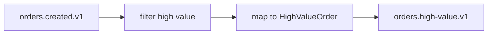

### 24.2 Build a Stateful Topology

Create:

```text
orders.created.v1 -> customer-order-counts.v1
```

Rules:

- input key: `orderId`;
- aggregate by `customerId`;
- state store name: `order-count-by-customer`;
- output key: `customerId`;
- expect repartition;
- document internal topics.

Expected topology:

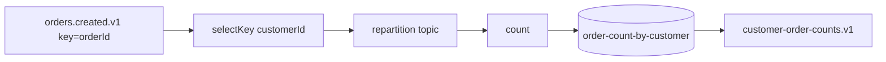

### 24.3 Failure Drill

Run the stateful app, produce 1 million records, stop the app, delete local state directory, restart, and measure:

- restore duration;
- output correctness;
- changelog read rate;
- CPU;
- disk IO;
- lag during restore;
- readiness behavior.

Write the result as:

```yaml
restoreDrill:
  app: orders-count-v1
  inputRecords: 1000000
  stateStore: order-count-by-customer
  localStateDeleted: true
  restoreDuration: "..."
  correctnessCheck: "passed/failed"
  bottleneck: "broker/network/disk/cpu/serde"
  productionRisk: "..."
```

---

## 25. ADR Template

```markdown
# ADR: Kafka Streams Topology for <Use Case>

## Context
We need to process <input events> and produce <output events/table> for <business reason>.

## Input Topics
- <topic>: key=<key>, value=<schema>, semantics=<stream/table>

## Output Topics
- <topic>: key=<key>, value=<schema>, semantics=<stream/table>

## Topology
<Mermaid diagram>

## Key Decisions
- Processing abstraction: Kafka Streams
- application.id: <id>
- state stores: <stores>
- repartition topics expected: <yes/no + why>
- changelog topics expected: <yes/no + why>

## Correctness Boundary
The key for stateful processing is <key> because <reason>.

## State and Recovery
- Expected state size:
- Restore SLO:
- Local disk strategy:
- Changelog replication:

## Error Handling
- Deserialization errors:
- Business validation errors:
- Output failures:

## Observability
- Lag metrics:
- Restore metrics:
- Business completeness metrics:

## Alternatives Considered
- Plain consumer:
- ksqlDB:
- Kafka Connect:
- External stream processor:

## Consequences
- Benefits:
- Costs:
- Risks:
```

---

## 26. Summary

Kafka Streams is a Java library for building distributed stream-processing applications over Kafka topics. The API is approachable, but the production model is deep.

The core mental model is:

```text
Kafka Streams application = topology + application.id + tasks + local state + internal topics + deployment instances
```

The most important production questions are:

- What is the topology?
- What are the stream/table semantics?
- What is the key correctness boundary?
- What state is local?
- What changelog topics back that state?
- What repartition topics are created?
- How does the app recover after failure?
- How does it scale?
- How is correctness observed?

Part 018 will compare the Kafka Streams DSL with the Processor API, including when the high-level API is enough and when custom processors, state stores, punctuators, and topology-level control are required.

---

## References

- Apache Kafka Documentation — Kafka Streams Core Concepts: https://kafka.apache.org/documentation/streams/
- Apache Kafka Documentation — Streams DSL: https://kafka.apache.org/documentation/streams/developer-guide/dsl-api/
- Apache Kafka Documentation — Processor API: https://kafka.apache.org/documentation/streams/developer-guide/processor-api/
- Confluent Documentation — Kafka Streams Architecture: https://docs.confluent.io/platform/current/streams/architecture.html
- Confluent Documentation — Kafka Streams Concepts: https://docs.confluent.io/platform/current/streams/concepts.html
- Apache Kafka Javadocs — Kafka Streams: https://kafka.apache.org/javadoc/
