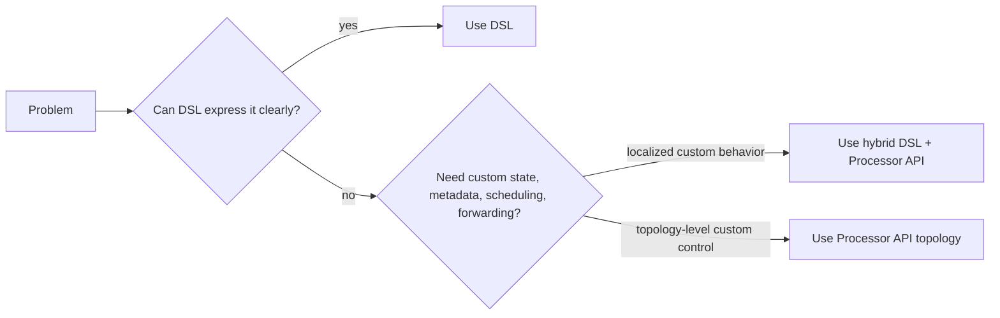
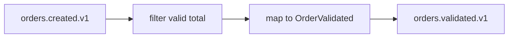
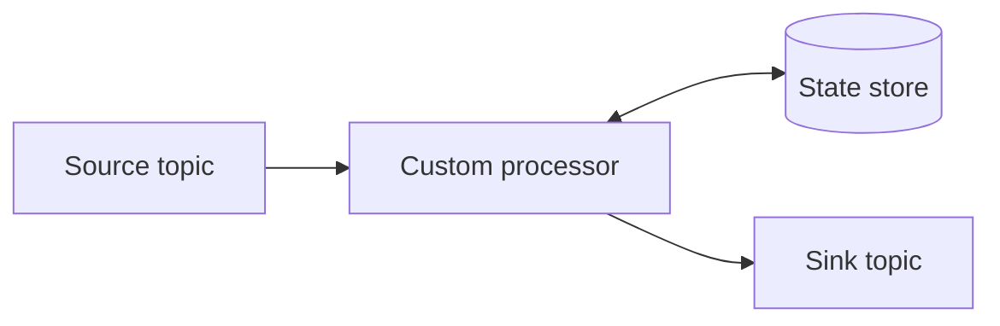
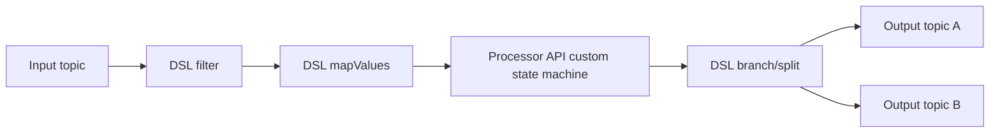
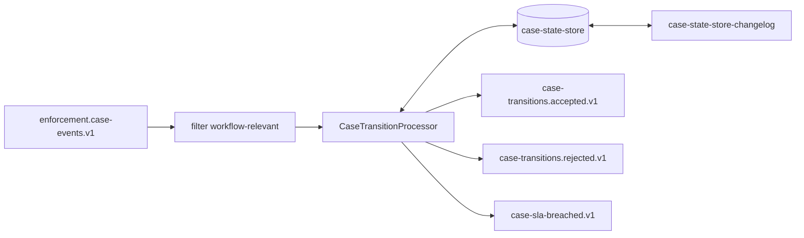

# Part 018 — Streams DSL vs Processor API

Part 017 introduced the Kafka Streams core model: topology, tasks, stream threads, local state, changelog topics, repartition topics, and stream-table semantics.

This part answers a practical design question:

> Should we implement this topology with the Kafka Streams DSL, the Processor API, or both?

The wrong framing is:

> DSL is beginner; Processor API is advanced.

The better framing is:

> The DSL expresses common stream-processing transformations safely and concisely. The Processor API gives lower-level control when the topology needs custom state, custom scheduling, custom forwarding, metadata access, or fine-grained record handling.

A top engineer does not choose the lower-level API to look advanced. They choose the lowest complexity abstraction that still preserves correctness, operability, and evolvability.

---

## 1. Kaufman Skill Decomposition

The skill is **choosing and combining Kafka Streams APIs intentionally**.

| Subskill | Production Meaning |
|---|---|
| DSL fluency | Express map/filter/group/join/aggregate/window operations clearly. |
| Processor API fluency | Build custom processors with state stores, record metadata, scheduling, and forwarding. |
| Abstraction choice | Select the right API for correctness and maintainability. |
| Topology naming | Give stable names to processors and state stores for operational clarity. |
| State handling | Know when built-in materialization is enough and when custom stores are needed. |
| Time handling | Use stream-time or wall-clock punctuation deliberately. |
| Testability | Use `TopologyTestDriver` for deterministic topology tests. |
| Failure boundaries | Handle deserialization, business errors, state corruption, and output errors explicitly. |
| Migration design | Evolve from DSL to Processor API without breaking state or outputs. |
| Review discipline | Explain API choice in an ADR, not just in code. |

### 1.1 Practice Goal

By the end of this part, you should be able to:

- implement simple transformations with DSL;
- identify when DSL becomes contorted;
- implement a custom processor safely;
- attach and query a state store;
- use punctuators intentionally;
- test a topology without a running Kafka cluster;
- name topology nodes and stores deliberately;
- review topology API choices in production design.

---

## 2. The Three Implementation Modes

Most real Kafka Streams systems use one of three modes.

| Mode | Description | Best For |
|---|---|---|
| Pure DSL | Topology is expressed entirely with high-level DSL operations. | Standard map/filter/join/aggregate/window pipelines. |
| Pure Processor API | Topology is built manually from sources, processors, stores, and sinks. | Highly custom record-by-record processing. |
| Hybrid | DSL for common flow, Processor API for custom stages. | Most advanced production applications. |

### 2.1 Mental Model



The default should be DSL unless there is a clear reason not to use it.

---

## 3. Streams DSL

The DSL is the high-level API built around `KStream`, `KTable`, and `GlobalKTable`.

It is excellent for operations like:

- read topic;
- filter records;
- map keys/values;
- branch streams;
- group by key;
- count/reduce/aggregate;
- join stream/table/table;
- window aggregations;
- write to output topic;
- materialize tables;
- suppress intermediate results;
- transform values with attached state stores.

### 3.1 DSL Example: Validation Pipeline

```java
StreamsBuilder builder = new StreamsBuilder();

KStream<String, OrderCreated> orders = builder.stream(
    "orders.created.v1",
    Consumed.with(Serdes.String(), orderCreatedSerde)
);

orders
    .filter((orderId, order) -> order.totalAmount().isPositive())
    .mapValues(OrderValidated::from)
    .to("orders.validated.v1", Produced.with(Serdes.String(), orderValidatedSerde));
```

Topology:



This should stay DSL. Processor API would add noise without meaningful benefit.

### 3.2 DSL Example: Aggregation

```java
KTable<String, Long> countByCustomer = builder
    .stream("orders.created.v1", Consumed.with(Serdes.String(), orderCreatedSerde))
    .selectKey((orderId, order) -> order.customerId())
    .groupByKey(Grouped.with(Serdes.String(), orderCreatedSerde))
    .count(Materialized.as("order-count-by-customer"));

countByCustomer
    .toStream()
    .to("customers.order-count.v1", Produced.with(Serdes.String(), Serdes.Long()));
```

DSL is also appropriate here because count-by-key is a standard stateful operation.

### 3.3 DSL Strengths

| Strength | Why It Matters |
|---|---|
| Concise | Less custom code means fewer bugs. |
| Semantically rich | Operations reveal intent: `groupByKey`, `aggregate`, `join`. |
| Optimizable | Kafka Streams can optimize some topology patterns. |
| Built-in materialization | State stores and changelog topics are managed. |
| Easier review | Common operations are familiar to Kafka engineers. |
| Easier testing | DSL topology can be tested with `TopologyTestDriver`. |

### 3.4 DSL Weaknesses

The DSL becomes awkward when you need:

- access to record headers;
- access to topic/partition/offset metadata;
- custom state lookup/update logic not shaped like aggregate/join;
- multiple conditional forwards to dynamic child processors;
- custom scheduling with stream time or wall-clock time;
- stateful dedup with custom expiry semantics;
- custom retry/quarantine side-output logic;
- fine-grained metrics per stage;
- integration with external local resources;
- careful control over tombstone forwarding;
- protocol-like processing with state machines.

When the DSL becomes a puzzle, use the Processor API for the puzzle piece.

---

## 4. Processor API

The Processor API is the lower-level API for defining custom processors and connecting them into a topology. It allows direct interaction with:

- processor context;
- record metadata;
- headers;
- state stores;
- scheduled punctuation;
- forwarding;
- commit requests;
- custom topology nodes.

### 4.1 Processor API Mental Model



The processor receives one record at a time, decides what to do, optionally reads/writes state, and forwards zero, one, or many records downstream.

### 4.2 Modern Processor Skeleton

```java
public final class DeduplicateOrderProcessor
    implements Processor<String, OrderCreated, String, OrderCreated> {

    private ProcessorContext<String, OrderCreated> context;
    private KeyValueStore<String, Long> seenOrderStore;
    private final Duration retention;

    public DeduplicateOrderProcessor(Duration retention) {
        this.retention = retention;
    }

    @Override
    public void init(ProcessorContext<String, OrderCreated> context) {
        this.context = context;
        this.seenOrderStore = context.getStateStore("seen-orders");

        this.context.schedule(
            Duration.ofMinutes(5),
            PunctuationType.WALL_CLOCK_TIME,
            timestamp -> expireOldEntries(timestamp)
        );
    }

    @Override
    public void process(Record<String, OrderCreated> record) {
        String eventId = record.value().eventId();
        Long firstSeenAt = seenOrderStore.get(eventId);

        if (firstSeenAt != null) {
            return;
        }

        seenOrderStore.put(eventId, record.timestamp());
        context.forward(record);
    }

    private void expireOldEntries(long now) {
        // Use a real indexed store or window store for large production cases.
        // This simplified example avoids hiding the Processor API concept.
    }

    @Override
    public void close() {
        // Release resources if any were allocated.
    }
}
```

State store registration:

```java
StoreBuilder<KeyValueStore<String, Long>> seenOrdersStore = Stores.keyValueStoreBuilder(
    Stores.persistentKeyValueStore("seen-orders"),
    Serdes.String(),
    Serdes.Long()
);

StreamsBuilder builder = new StreamsBuilder();
builder.addStateStore(seenOrdersStore);

builder.stream("orders.created.v1", Consumed.with(Serdes.String(), orderCreatedSerde))
    .process(() -> new DeduplicateOrderProcessor(Duration.ofHours(24)), "seen-orders")
    .to("orders.created.deduplicated.v1", Produced.with(Serdes.String(), orderCreatedSerde));
```

### 4.3 Why This May Need Processor API

Deduplication can sometimes be expressed with windowed aggregation, but custom dedup often needs:

- event ID based state independent of message key;
- custom retention logic;
- side output for duplicates;
- custom metrics;
- record header inspection;
- different behavior by source topic;
- custom cleanup scheduling.

That is where Processor API earns its complexity.

---

## 5. Decision Matrix

| Requirement | Prefer DSL | Prefer Processor API |
|---|---:|---:|
| Simple map/filter/project | ✅ | ❌ |
| Standard aggregation | ✅ | ❌ |
| Standard joins | ✅ | ❌ |
| Windowed counts/sums | ✅ | ❌ |
| Custom state machine | ⚠️ | ✅ |
| Header-dependent routing | ⚠️ | ✅ |
| Need topic/partition/offset metadata | ⚠️ | ✅ |
| Need scheduled cleanup | ⚠️ | ✅ |
| Multiple custom forwards | ⚠️ | ✅ |
| Fine-grained per-record control | ⚠️ | ✅ |
| Low boilerplate required | ✅ | ❌ |
| Highly explicit topology control | ❌ | ✅ |

Legend:

- ✅ = usually good fit;
- ⚠️ = possible but may become awkward;
- ❌ = avoid unless there is a strong reason.

---

## 6. Hybrid Topology Pattern

A common production design is:

- use DSL for most transformations;
- isolate custom logic in one or two named processors;
- return to DSL for standard operations.



Example:

```java
KStream<String, CaseEvent> cases = builder.stream(
    "cases.events.v1",
    Consumed.with(Serdes.String(), caseEventSerde)
);

KStream<String, CaseTransition> transitions = cases
    .filter((caseId, event) -> event.isWorkflowRelevant())
    .mapValues(CaseTransition::from)
    .processValues(
        () -> new CaseStateMachineProcessor(),
        Named.as("case-state-machine"),
        "case-state-store"
    );

transitions.to("cases.transitions.accepted.v1", Produced.with(Serdes.String(), transitionSerde));
```

The exact API method variants available depend on Kafka Streams version, but the design pattern is stable: keep normal stream flow in DSL and use a custom processor at the point where custom stateful behavior is required.

---

## 7. Topology Naming Discipline

Kafka Streams can auto-generate names for processors, stores, and internal topics. Auto-generated names are convenient in prototypes but risky in production.

### 7.1 Why Names Matter

Names affect:

- topology description readability;
- internal topic names;
- state store names;
- changelog names;
- metrics labels;
- upgrade compatibility;
- reset and cleanup operations;
- architecture reviews.

### 7.2 Use Explicit Names

```java
builder.stream(
        "orders.created.v1",
        Consumed.with(Serdes.String(), orderSerde).withName("source-orders-created")
    )
    .filter(
        (orderId, order) -> order.totalAmount().isPositive(),
        Named.as("filter-positive-total")
    )
    .selectKey(
        (orderId, order) -> order.customerId(),
        Named.as("select-key-customer-id")
    )
    .groupByKey(Grouped.with(Serdes.String(), orderSerde).withName("group-by-customer-id"))
    .count(Materialized.as("order-count-by-customer"));
```

Do not over-name every trivial node in experimental code. But in production, name any node that:

- creates state;
- creates internal topics;
- appears in metrics;
- has business significance;
- may need stable identity across upgrades.

---

## 8. State Stores with Processor API

The Processor API gives explicit state store access.

Common store types:

- persistent key-value store;
- in-memory key-value store;
- window store;
- session store;
- timestamped key-value store;
- versioned key-value store, depending on Kafka version and use case.

### 8.1 Persistent Key-Value Store

```java
StoreBuilder<KeyValueStore<String, CaseState>> storeBuilder = Stores.keyValueStoreBuilder(
    Stores.persistentKeyValueStore("case-state-store"),
    Serdes.String(),
    caseStateSerde
);

builder.addStateStore(storeBuilder);
```

Processor usage:

```java
@Override
public void init(ProcessorContext<String, CaseTransition> context) {
    this.context = context;
    this.caseStateStore = context.getStateStore("case-state-store");
}
```

### 8.2 Store Design Questions

Before adding a custom state store, answer:

- What is the key?
- What is the value?
- How large can it grow?
- How is old state removed?
- Is the store backed by a changelog?
- What is the restore SLO?
- Does the store need timestamp/version awareness?
- Can the store be rebuilt from input topics?
- Does state schema need compatibility rules?

### 8.3 State Store Anti-Pattern

Bad:

```text
Store everything forever because it is convenient.
```

Better:

```text
Store only what the processor needs for correctness, define expiry, and make restore time measurable.
```

---

## 9. Punctuators

A punctuator is scheduled logic executed by Kafka Streams based on time.

Two broad time concepts matter:

| Type | Meaning | Use Case |
|---|---|---|
| Stream time | Advances based on record timestamps seen by the task. | Event-time cleanup, window-like behavior. |
| Wall-clock time | Advances based on system time. | Periodic flushing, external heartbeat, operational cleanup. |

Example:

```java
context.schedule(
    Duration.ofMinutes(1),
    PunctuationType.WALL_CLOCK_TIME,
    timestamp -> emitExpiredCases(timestamp)
);
```

### 9.1 Stream-Time Trap

Stream time advances only when records arrive. If a partition is idle, stream-time punctuation may not fire as expected.

Use stream-time punctuation when the logic is tied to event progress.

Use wall-clock punctuation when the logic is tied to real elapsed time.

### 9.2 Punctuator Safety Rules

- Keep punctuator work bounded.
- Do not scan huge stores every minute without an index strategy.
- Avoid blocking remote calls.
- Emit metrics for execution time.
- Make cleanup idempotent.
- Consider partition/task locality.
- Document whether punctuation is stream-time or wall-clock.

---

## 10. Record Metadata and Headers

The Processor API can access record metadata and headers. This is useful for:

- audit routing;
- schema version routing;
- tenant metadata;
- trace propagation;
- dead-letter enrichment;
- source topic specific behavior;
- migration compatibility logic.

Example concept:

```java
@Override
public void process(Record<String, EventEnvelope> record) {
    Headers headers = record.headers();
    String sourceTopic = context.recordMetadata()
        .map(RecordMetadata::topic)
        .orElse("unknown");

    // Use metadata carefully; do not couple business semantics to physical topic names unless deliberate.
    context.forward(record.withValue(transform(record.value(), headers, sourceTopic)));
}
```

### 10.1 Metadata Coupling Warning

Physical metadata should not accidentally become business logic.

Bad:

```text
If topic name contains "premium", apply premium rule.
```

Better:

```text
Use explicit tenant/product/policy fields in the event envelope, and treat topic metadata as operational context.
```

---

## 11. Error Boundaries

Kafka Streams errors usually appear in one of these places:

- deserialization;
- transformation logic;
- state store access;
- serialization;
- production to output topic;
- rebalance/restore lifecycle;
- fatal stream thread exception.

### 11.1 DSL Error Handling

DSL logic often uses lambdas. Do not let business exceptions leak randomly.

Bad:

```java
.mapValues(order -> riskScore(order))
```

Better:

```java
.flatMapValues(order -> {
    try {
        return List.of(riskScore(order));
    } catch (BusinessRuleException ex) {
        // Prefer explicit error stream or custom processor for rich DLQ behavior.
        return List.of();
    }
})
```

For serious DLQ behavior, a custom processor is usually cleaner because it can capture headers, metadata, exception details, and route side outputs more explicitly.

### 11.2 Processor API Error Boundary

```java
@Override
public void process(Record<String, OrderCreated> record) {
    try {
        OrderRiskScored scored = scorer.score(record.value());
        context.forward(record.withValue(scored), "risk-output");
    } catch (RecoverableBusinessException ex) {
        ErrorEnvelope error = ErrorEnvelope.from(record, ex);
        context.forward(record.withValue(error), "business-error-output");
    } catch (RuntimeException ex) {
        throw ex; // let fatal handler decide; do not hide unknown corruption.
    }
}
```

The key is not “catch everything”. The key is to classify failures.

| Failure | Typical Action |
|---|---|
| Invalid business data | Route to validation error topic. |
| Poison schema | Deserialization handler or DLQ. |
| External dependency unavailable | Avoid remote call in stream path if possible; otherwise retry/circuit-break carefully. |
| State corruption | Fail fast and restore/rebuild. |
| Unknown bug | Fail fast; alert; do not silently skip. |

---

## 12. Testing with TopologyTestDriver

`TopologyTestDriver` lets you test Kafka Streams topology logic without running a Kafka cluster.

This is essential for deliberate practice and production regression tests.

### 12.1 Basic Test Shape

```java
@Test
void shouldRouteHighValueOrders() {
    StreamsBuilder builder = new StreamsBuilder();
    OrdersTopology.build(builder, orderSerde, highValueSerde);

    Properties props = new Properties();
    props.put(StreamsConfig.APPLICATION_ID_CONFIG, "test-orders-topology");
    props.put(StreamsConfig.BOOTSTRAP_SERVERS_CONFIG, "dummy:9092");

    try (TopologyTestDriver driver = new TopologyTestDriver(builder.build(), props)) {
        TestInputTopic<String, OrderCreated> input = driver.createInputTopic(
            "orders.created.v1",
            Serdes.String().serializer(),
            orderSerde.serializer()
        );

        TestOutputTopic<String, HighValueOrder> output = driver.createOutputTopic(
            "orders.high-value.v1",
            Serdes.String().deserializer(),
            highValueSerde.deserializer()
        );

        input.pipeInput("order-1", new OrderCreated("order-1", Money.of("1500.00")));

        KeyValue<String, HighValueOrder> result = output.readKeyValue();
        assertEquals("order-1", result.key);
    }
}
```

### 12.2 What to Test

Test more than the happy path:

- key preservation;
- key changes;
- repartition-triggering operations;
- state store update;
- tombstone handling;
- duplicate handling;
- late event behavior;
- output topic routing;
- error topic routing;
- schema conversion;
- window boundary;
- punctuation behavior;
- restore assumptions where possible.

### 12.3 What TopologyTestDriver Does Not Prove

It does not fully prove:

- broker performance;
- rebalance behavior;
- network failure handling;
- actual restore time from changelog;
- production ACL correctness;
- multi-instance assignment;
- cross-AZ traffic cost;
- real serialization registry availability.

So use it for deterministic logic tests, not as the only production validation.

---

## 13. DSL vs Processor API Examples by Use Case

### 13.1 Event Projection

Use DSL.

```java
orders
    .mapValues(OrderSummary::from)
    .to("orders.summary.v1");
```

Reason: simple one-to-one stateless projection.

### 13.2 Count by Customer

Use DSL.

```java
orders
    .selectKey((orderId, order) -> order.customerId())
    .groupByKey()
    .count(Materialized.as("count-by-customer"));
```

Reason: standard aggregation.

### 13.3 Custom Regulatory State Machine

Use Processor API or hybrid.

```text
Input: enforcement.case-events.v1
State: current legal status, escalation timers, pending obligations
Output: accepted transitions, rejected transitions, SLA breach events
```

Reason: domain state machine with custom validation, scheduled checks, and side outputs.

### 13.4 Enrich Order with Product Table

Use DSL with `KTable` or `GlobalKTable`.

```java
orders.join(products, (order, product) -> enrich(order, product));
```

Reason: standard stream-table enrichment.

### 13.5 Deduplicate with Custom Expiry

Use Processor API or hybrid.

Reason: custom state expiry and duplicate side output are easier with a processor.

### 13.6 Header-Based Multi-Tenant Routing

Use Processor API if headers are central to routing logic.

Reason: header access and multiple dynamic forwarding paths are lower-level concerns.

---

## 14. Case Study: Compliance Case Transition Processor

Imagine a regulatory case management platform.

Input topic:

```text
enforcement.case-events.v1
```

Events:

- `CaseOpened`
- `EvidenceRequested`
- `EvidenceReceived`
- `PreliminaryFindingIssued`
- `EscalatedToInvestigation`
- `PenaltyProposed`
- `CaseClosed`

Requirement:

- enforce valid state transitions;
- reject illegal transitions;
- emit audit-grade transition decisions;
- track SLA timers;
- emit breach events;
- preserve per-case ordering;
- support replay for audit reconstruction.

This is not a simple `groupBy().aggregate()` if the transition rules are complex and require multiple side outputs.

### 14.1 Topology



### 14.2 Why Hybrid

Use DSL for:

- input binding;
- basic filtering;
- output topic declarations where possible.

Use Processor API for:

- state machine evaluation;
- state store update;
- transition rejection output;
- SLA punctuation;
- audit metadata enrichment;
- custom metrics.

### 14.3 Review Invariants

- Input key must be `caseId`.
- State store key must be `caseId`.
- Rejected transitions must not update state.
- Accepted transitions must update state before forwarding the accepted decision.
- SLA breach emission must be idempotent.
- Replay must produce the same accepted/rejected transition sequence for the same input history.
- Any rule version change must be explicitly represented.

---

## 15. Performance Considerations

### 15.1 DSL Performance

The DSL is usually efficient enough. Performance issues more often come from:

- bad key distribution;
- unnecessary repartitioning;
- huge state stores;
- inefficient Serdes;
- excessive object allocation;
- remote calls in processing path;
- unbounded aggregation;
- poorly tuned RocksDB/state store settings;
- cross-AZ broker traffic;
- topic partition mismatch.

Do not rewrite DSL into Processor API just because of a vague performance worry.

### 15.2 Processor API Performance

Processor API gives control but also makes it easier to create problems:

- scanning entire state stores too often;
- blocking stream threads;
- doing remote I/O per record;
- forwarding too many small records;
- creating large objects per record;
- using inefficient state keys;
- skipping metrics;
- swallowing exceptions.

The lower-level API exposes power and foot-guns together.

---

## 16. Production Code Organization

Avoid putting topology, business logic, Serdes, error handling, and config into one giant class.

Recommended structure:

```text
src/main/java/com/acme/orders/streams/
  OrdersStreamsApplication.java
  OrdersTopology.java
  serde/
    OrderCreatedSerdeFactory.java
  processor/
    DeduplicateOrderProcessor.java
    CaseStateMachineProcessor.java
  model/
    OrderCreated.java
    OrderValidated.java
  state/
    StateStoreNames.java
  config/
    StreamsAppConfig.java
  observability/
    StreamsStateListener.java
    StreamsUncaughtExceptionPolicy.java
```

### 16.1 Topology Factory

```java
public final class OrdersTopology {

    public static Topology build(OrdersTopologyDependencies deps) {
        StreamsBuilder builder = new StreamsBuilder();

        builder.stream(
                deps.inputTopic(),
                Consumed.with(deps.orderIdSerde(), deps.orderCreatedSerde())
                    .withName("source-orders-created")
            )
            .filter(
                (orderId, order) -> order.totalAmount().isPositive(),
                Named.as("filter-positive-total")
            )
            .mapValues(
                OrderValidated::from,
                Named.as("map-order-validated")
            )
            .to(
                deps.outputTopic(),
                Produced.with(deps.orderIdSerde(), deps.orderValidatedSerde())
                    .withName("sink-orders-validated")
            );

        return builder.build();
    }
}
```

This makes topology testable and reviewable.

---

## 17. Topology Description Review

Always print and inspect topology description before production.

```java
Topology topology = OrdersTopology.build(deps);
System.out.println(topology.describe());
```

Review for:

- unexpected repartition topics;
- unnamed processors;
- wrong source topic;
- wrong sink topic;
- unexpected state stores;
- unexpected sub-topologies;
- topology changes across releases.

### 17.1 CI Check Idea

Store an approved topology description snapshot.

On pull request:

- build topology;
- render `topology.describe()`;
- compare to approved snapshot;
- require review if topology changed.

This catches accidental repartitions and state store renames early.

---

## 18. Migration Patterns

### 18.1 DSL to Hybrid

Start:

```java
orders.mapValues(this::applyComplexRules)
```

When complexity grows, extract:

```java
orders.processValues(
    () -> new ComplexRuleProcessor(ruleEngine),
    Named.as("complex-rule-processor"),
    "rule-evaluation-state-store"
)
```

Migration checklist:

- preserve input/output topics;
- preserve output schema;
- preserve state semantics;
- name new state store deliberately;
- decide whether old state can migrate;
- run dual-output comparison if high risk;
- test replay from a known offset range.

### 18.2 Processor API to DSL

Sometimes custom code can be simplified back to DSL after requirements stabilize.

Do this when:

- custom logic is equivalent to built-in aggregation/join;
- no custom headers/metadata/scheduling are needed;
- state store can be represented by materialized DSL operation;
- tests prove output equivalence.

Lower-level code should not become permanent just because it was written first.

---

## 19. Advanced Review: API Choice Smell Test

Use this smell test in design review.

### 19.1 DSL Smells

DSL may be wrong if:

- lambdas exceed a few lines and hide stateful behavior;
- exception handling is scattered across lambdas;
- multiple side outputs are simulated awkwardly;
- header/topic/offset metadata is needed but inaccessible;
- a fake aggregate is used to implement a state machine;
- business rules are unreadable in chained calls.

### 19.2 Processor API Smells

Processor API may be wrong if:

- it reimplements `count`, `aggregate`, or `join` manually;
- it has no tests;
- it scans huge state stores frequently;
- it blocks on remote APIs;
- it catches and ignores broad exceptions;
- it creates unstable processor/store names;
- it hides output routing in imperative code without diagrams;
- it stores unbounded data without retention.

---

## 20. Practice Lab

### 20.1 DSL Lab: Customer Order Count

Build a DSL topology:

```text
orders.created.v1 -> customers.order-count.v1
```

Requirements:

- input key: `orderId`;
- aggregate key: `customerId`;
- store name: `order-count-by-customer`;
- explicit Serdes;
- topology description printed;
- test with `TopologyTestDriver`;
- verify output count after multiple orders per customer.

### 20.2 Processor API Lab: Event ID Dedup

Build a custom processor:

```text
orders.created.v1 -> orders.created.deduplicated.v1
```

Requirements:

- dedup key: `eventId`, not Kafka message key;
- persistent state store: `seen-event-ids`;
- duplicate records are dropped or routed to `orders.duplicates.v1`;
- test duplicate and non-duplicate paths;
- document expiry strategy.

### 20.3 Hybrid Lab: Case Transition State Machine

Build a hybrid topology:

```text
case.events.v1 -> case.transitions.accepted.v1
                 -> case.transitions.rejected.v1
```

Requirements:

- input key: `caseId`;
- state store: `case-state-store`;
- valid transitions update state;
- invalid transitions route to rejected output;
- output includes `previousState`, `attemptedEvent`, `decision`, `ruleVersion`;
- test replay determinism.

---

## 21. ADR Template

```markdown
# ADR: Kafka Streams API Choice for <Topology>

## Context
We need to process <input> into <output> with <state/latency/correctness requirement>.

## Decision
We will use:
- [ ] Pure DSL
- [ ] Pure Processor API
- [ ] Hybrid DSL + Processor API

## Why
<Explain why this abstraction fits the problem.>

## Topology
<Mermaid diagram>

## DSL Operations
- <operation>: <reason>

## Processor API Components
- Processor: <name>
- State stores: <names>
- Punctuators: <stream-time/wall-clock + interval>
- Side outputs: <topics>

## State
- Key:
- Value:
- Retention:
- Restore SLO:

## Error Handling
- Business validation:
- Deserialization:
- Unknown runtime exception:

## Testing
- TopologyTestDriver cases:
- Replay test:
- State restore drill:

## Alternatives Considered
- Pure DSL:
- Pure Processor API:
- ksqlDB:
- Plain consumer:

## Consequences
- Benefits:
- Costs:
- Operational risks:
```

---

## 22. Summary

The Kafka Streams DSL and Processor API are not competing philosophies. They are two levels of control.

Use the DSL when the problem is a standard stream-processing transformation:

- map;
- filter;
- branch;
- aggregate;
- join;
- window;
- materialize.

Use the Processor API when the problem needs lower-level control:

- custom state machine;
- custom state store access;
- headers and metadata;
- multiple side outputs;
- scheduled punctuation;
- custom cleanup;
- precise forwarding;
- rich error routing.

The professional move is to use the simplest abstraction that makes the topology correct, observable, testable, and evolvable.

Part 019 will go deep into windowing and time semantics: event time, processing time, stream time, tumbling windows, hopping windows, session windows, grace periods, late events, suppression, and downstream correction models.

---

## References

- Apache Kafka Documentation — Streams DSL: https://kafka.apache.org/documentation/streams/developer-guide/dsl-api/
- Apache Kafka Documentation — Processor API: https://kafka.apache.org/documentation/streams/developer-guide/processor-api/
- Apache Kafka Documentation — Testing a Streams Application: https://kafka.apache.org/documentation/streams/developer-guide/testing/
- Confluent Documentation — Kafka Streams Architecture: https://docs.confluent.io/platform/current/streams/architecture.html
- Confluent Documentation — Test Kafka Streams Code: https://docs.confluent.io/platform/current/streams/developer-guide/test-streams.html
- Apache Kafka Javadocs — Kafka Streams: https://kafka.apache.org/javadoc/
