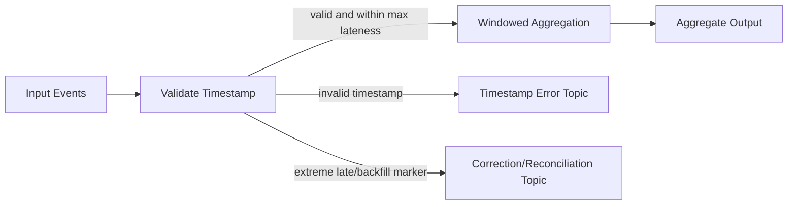
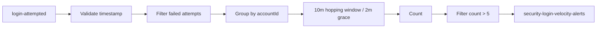
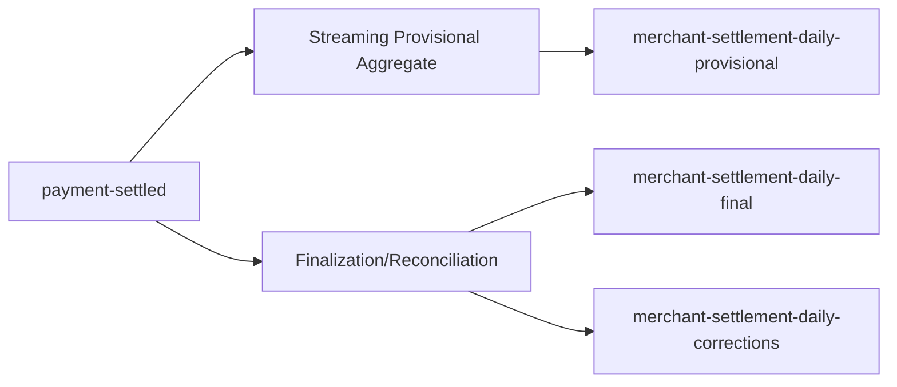

# Part 019 — Windowing and Time Semantics

Parts 017 and 018 introduced Kafka Streams as a Java library, the topology model, the DSL, the Processor API, state stores, changelog topics, and custom processors.

This part focuses on one of the highest-leverage concepts in stream processing:

> Time is not a single thing.

In batch systems, time often looks simple because the dataset is already bounded. In stream systems, time is part of the correctness model. The system must decide whether a record belongs to a computation, whether it is late, whether it should update a previous result, whether a window is closed, and whether the output is provisional or final.

A production Kafka Streams engineer must be able to answer questions like:

- Is this result based on event time, ingestion time, processing time, or stream time?
- What happens when a record arrives 30 minutes late?
- Can this window emit multiple updates?
- When is a result final?
- How much state will this window keep?
- What is the operational cost of a larger grace period?
- What happens after a restart?
- Can we replay and get the same result?
- Does the downstream system tolerate corrections?

The hard part is not using `TimeWindows.ofSizeAndGrace(...)`. The hard part is designing an explicit time contract.

---

## 1. Kaufman Skill Decomposition

The skill is **designing time-aware stream computations that are correct, explainable, and operable**.

| Subskill | Production Meaning |
|---|---|
| Event-time modeling | Use business occurrence time rather than arrival time when correctness depends on when something actually happened. |
| Timestamp extraction | Decide where Kafka Streams gets each record timestamp. |
| Stream-time reasoning | Understand how Kafka Streams advances time based on observed record timestamps. |
| Window selection | Choose tumbling, hopping, sliding, or session windows intentionally. |
| Grace-period design | Decide how long to accept late records after the window end. |
| Late-event handling | Define whether late records update old results, go to DLQ, are dropped, or trigger correction flow. |
| Suppression design | Decide whether downstream should see intermediate updates or final window results only. |
| Retention sizing | Bound local state and changelog size for windows. |
| Deterministic testing | Prove behavior for out-of-order, late, duplicate, and boundary timestamp records. |
| Operational review | Monitor dropped records, window-store size, restore time, latency, and output churn. |

### 1.1 Practice Goal

By the end of this part, you should be able to:

- distinguish event time, ingestion time, processing time, and stream time;
- implement a timestamp extractor safely;
- choose the right window type for a business problem;
- design grace periods with a latency/state/correctness trade-off;
- explain when windows produce updates versus final results;
- use suppression deliberately;
- write deterministic tests for window boundaries and late events;
- review time semantics in an architecture design.

---

## 2. The Core Mental Model

A windowed Kafka Streams computation answers this question:

> For each key, which records belong to which bounded slice of time, and when should the result be emitted?

There are four separate concerns:

| Concern | Question |
|---|---|
| Timestamp source | What timestamp is assigned to each record? |
| Window assignment | Which window does the record belong to? |
| Window closing | Until when can the window still accept late records? |
| Output emission | Should the system emit every update or only the final answer? |

A simple-looking requirement can hide all four.

Example requirement:

> Count failed login attempts per user per 10-minute window.

A naive implementation may simply do:

```java id="ux3m3m"
stream
    .groupByKey()
    .windowedBy(TimeWindows.ofSizeWithNoGrace(Duration.ofMinutes(10)))
    .count();
```

But a production implementation must clarify:

- Is the 10-minute window based on when the login happened or when the event reached Kafka?
- What if the mobile client was offline and emits the login event 7 minutes late?
- What if a connector backfills events from yesterday?
- Is the downstream fraud system allowed to receive revised counts?
- Does the UI need final counts only?
- What is the maximum accepted correction delay?
- Should records beyond the grace period be dropped, routed, or counted in a special correction topic?

Without a time contract, windowing code is an unreviewed business decision disguised as infrastructure.

---

## 3. The Four Time Concepts

Kafka and Kafka Streams commonly involve four time concepts.

| Time Type | Meaning | Common Source | Good For | Danger |
|---|---|---|---|---|
| Event time | When the business event actually happened. | Event payload field, domain timestamp. | Audits, analytics, fraud, SLA, regulatory timelines. | Requires timestamp quality and late-event policy. |
| Ingestion time | When the event entered Kafka. | Producer/broker timestamp depending topic config. | Pipeline monitoring, approximate arrival ordering. | Can differ from business occurrence time. |
| Processing time | When the application processes the record. | JVM wall clock. | Operational timeout, scheduled maintenance, side effects. | Non-deterministic under replay. |
| Stream time | Kafka Streams' observed time based on max record timestamps processed per task. | Advanced internally from input record timestamps. | Window closure and event-time operations. | Can stall if no new records advance timestamps. |

The strongest default for business computations is usually:

> Use event time for correctness, processing time for operational mechanics.

### 3.1 Event Time

Event time is the timestamp that describes when the fact occurred in the domain.

Example:

```json id="vxq5db"
{
  "eventId": "evt-8821",
  "eventType": "PaymentCaptured",
  "occurredAt": "2026-07-01T10:15:22.418Z",
  "capturedAt": "2026-07-01T10:15:21.900Z",
  "publishedAt": "2026-07-01T10:15:23.011Z",
  "paymentId": "pay-901",
  "amount": "250000.00",
  "currency": "IDR"
}
```

For revenue aggregation, `occurredAt` or `capturedAt` may be the correct event-time field. For pipeline latency, `publishedAt` may be relevant. For debugging, Kafka record timestamp may be relevant.

Do not assume one timestamp satisfies every use case.

### 3.2 Ingestion Time

Ingestion time is when the record enters Kafka. Kafka record timestamp can be set by the producer or by the broker depending topic configuration.

Ingestion time is useful for:

- monitoring pipeline delay;
- estimating backlog age;
- detecting producer stalls;
- debugging operational incidents.

It is often wrong for business windows.

If a payment happened at 23:59:59 but arrived at 00:00:03, a daily revenue report based on ingestion time will put it on the wrong business day.

### 3.3 Processing Time

Processing time is the wall-clock time when the stream application handles the record.

Processing time is useful for:

- periodic cleanup;
- punctuators based on wall-clock time;
- external timeout checks;
- circuit-breaker behavior;
- metrics and logging.

Processing time is dangerous for deterministic business results. A replay tomorrow will produce different processing-time values than the original run.

### 3.4 Stream Time

Kafka Streams event-time operations use the concept of stream time.

A useful mental model:

> Stream time is the highest event timestamp observed so far by a task.

When new records arrive, stream time can advance. Windows close relative to stream time, not necessarily wall-clock time.

This creates an important operational consequence:

> A window may not close just because real time passed. It closes when stream-time advances beyond the window end plus grace period.

If no new records arrive with timestamps beyond the window, final output may not be emitted even though the wall clock moved forward.

This surprises many teams using suppression.

---

## 4. Timestamp Extractors

Kafka Streams needs a timestamp for every record.

By default, it can use the Kafka record timestamp. But many production systems need a custom `TimestampExtractor` that reads a domain timestamp from the payload.

### 4.1 Example: Domain Timestamp Extractor

```java id="vp2dfv"
import org.apache.kafka.clients.consumer.ConsumerRecord;
import org.apache.kafka.streams.processor.TimestampExtractor;

import java.time.Instant;

public final class PaymentEventTimestampExtractor implements TimestampExtractor {

    @Override
    public long extract(ConsumerRecord<Object, Object> record, long partitionTime) {
        Object value = record.value();

        if (!(value instanceof PaymentEvent event)) {
            // Fail fast for schema/configuration mismatch.
            throw new IllegalArgumentException("Expected PaymentEvent but got: " + value);
        }

        Instant occurredAt = event.occurredAt();

        if (occurredAt == null) {
            // Do not silently use current time for business correctness.
            throw new IllegalArgumentException("PaymentEvent.occurredAt is required");
        }

        long timestamp = occurredAt.toEpochMilli();

        if (timestamp < 0) {
            throw new IllegalArgumentException("Invalid negative event timestamp: " + timestamp);
        }

        return timestamp;
    }
}
```

Configure it:

```java id="f0i1pm"
Properties props = new Properties();
props.put(StreamsConfig.APPLICATION_ID_CONFIG, "payment-window-service");
props.put(StreamsConfig.BOOTSTRAP_SERVERS_CONFIG, "localhost:9092");
props.put(StreamsConfig.DEFAULT_TIMESTAMP_EXTRACTOR_CLASS_CONFIG,
          PaymentEventTimestampExtractor.class.getName());
```

### 4.2 Timestamp Extractor Rules

| Rule | Reason |
|---|---|
| Prefer explicit domain timestamp for business windows. | Kafka timestamp may represent publish time, not occurrence time. |
| Validate null/invalid timestamps. | Silent fallbacks corrupt aggregates. |
| Avoid `Instant.now()` as fallback for business windows. | Replay becomes non-deterministic. |
| Capture timestamp quality metrics. | Bad clocks and malformed events are data-quality incidents. |
| Document timestamp precedence. | Future producers must know which field drives windows. |

### 4.3 Bad Timestamp Fallback

This looks harmless:

```java id="k4ar1j"
return event.occurredAt() == null
    ? System.currentTimeMillis()
    : event.occurredAt().toEpochMilli();
```

It is usually wrong.

A missing `occurredAt` becomes a current-time event. The record may be counted in the wrong window and may hide a producer defect. For audit or regulatory systems, this can silently rewrite the timeline.

Better options:

- reject the record to a schema/error topic;
- use producer-published timestamp only if this is explicitly part of the contract;
- tag the event as timestamp-imputed and keep it out of official aggregates;
- stop the topology if timestamp integrity is mandatory.

---

## 5. Window Types

Kafka Streams supports multiple windowing patterns. Each one encodes a different business shape.

| Window Type | Shape | Example | Best For |
|---|---|---|---|
| Tumbling | Fixed, non-overlapping | 10:00-10:05, 10:05-10:10 | Periodic counts, simple dashboards, billing buckets. |
| Hopping | Fixed, overlapping | 10-minute window every 1 minute | Moving analytics, rolling trends. |
| Sliding | Based on event-time difference between records | Pair events within 30 seconds | Correlation, near-time matching. |
| Session | Dynamic windows separated by inactivity gap | User activity session | User behavior, burst grouping, sessionization. |

### 5.1 Tumbling Window

A tumbling window is fixed and non-overlapping.

```mermaid id="s4pkdo"
timeline
    title Tumbling Windows
    10:00 : W1 starts
    10:05 : W1 ends / W2 starts
    10:10 : W2 ends / W3 starts
    10:15 : W3 ends
```

Example:

```java id="j831ju"
KTable<Windowed<String>, Long> failedLogins = loginEvents
    .filter((userId, event) -> event.failed())
    .groupByKey()
    .windowedBy(TimeWindows.ofSizeAndGrace(
        Duration.ofMinutes(5),
        Duration.ofMinutes(2)
    ))
    .count(Materialized.as("failed-logins-5m-store"));
```

Interpretation:

- each user has 5-minute windows;
- late records are accepted for up to 2 minutes after window end;
- output may update when late records arrive within grace;
- state must be retained long enough to support the window and grace.

Good use cases:

- count payments per merchant per minute;
- aggregate API errors per service per 5 minutes;
- compute order volume per region per hour.

Poor use cases:

- user sessions;
- activity bursts with irregular duration;
- correlations where windows must overlap.

### 5.2 Hopping Window

A hopping window is fixed and overlapping.

Example: 10-minute window advanced every 1 minute.

```mermaid id="q4yx0a"
gantt
    title Hopping Windows: size=10m, advance=1m
    dateFormat HH:mm
    axisFormat %H:%M
    W1 :active, 10:00, 10m
    W2 :active, 10:01, 10m
    W3 :active, 10:02, 10m
    W4 :active, 10:03, 10m
```



A single event may belong to many windows.

```java id="tm75j2"
KTable<Windowed<String>, Long> rollingFailures = loginEvents
    .filter((userId, event) -> event.failed())
    .groupByKey()
    .windowedBy(TimeWindows.ofSizeAndGrace(
            Duration.ofMinutes(10),
            Duration.ofMinutes(2)
        )
        .advanceBy(Duration.ofMinutes(1)))
    .count(Materialized.as("failed-logins-rolling-10m-store"));
```

Hopping windows are useful for rolling metrics, but they increase state and output volume.

If window size is 10 minutes and advance is 1 minute, each record may contribute to up to 10 windows. That multiplies compute, state, changelog writes, and downstream updates.

### 5.3 Sliding Window

Sliding windows match events that occur within a time difference of each other. They are useful when the window is about pairwise or correlation distance rather than a fixed calendar bucket.

Example use cases:

- payment authorization followed by capture within 15 minutes;
- login followed by password reset within 5 minutes;
- fraud signal correlation within 30 seconds.

A sliding join or aggregation can be a better fit than forcing all records into tumbling buckets.

### 5.4 Session Window

A session window groups records separated by less than an inactivity gap.

```mermaid id="wufiqh"
timeline
    title Session Window Example
    10:00 : click
    10:01 : click
    10:03 : click
    10:20 : click after inactivity gap
    10:21 : click
```

If the inactivity gap is 10 minutes:

- 10:00, 10:01, and 10:03 belong to one session;
- 10:20 and 10:21 belong to another session.

```java id="pxwqky"
KTable<Windowed<String>, Long> userSessions = clickEvents
    .groupByKey()
    .windowedBy(SessionWindows.ofInactivityGapAndGrace(
        Duration.ofMinutes(10),
        Duration.ofMinutes(2)
    ))
    .count(Materialized.as("user-click-session-store"));
```

Session windows are dynamic. They may merge when an event arrives between two existing sessions.

That means the output can be more complex than fixed windows. A late event can merge sessions and revise prior results.

---

## 6. Window Boundaries

Boundary rules matter.

For fixed windows, records belong based on timestamp and window interval. A common convention is start-inclusive, end-exclusive:

```text id="yhh3fi"
[10:00:00.000, 10:05:00.000)
```

That means:

- `10:00:00.000` belongs to the window;
- `10:04:59.999` belongs to the window;
- `10:05:00.000` belongs to the next window.

Always test boundaries.

### 6.1 Boundary Test Cases

For a 5-minute tumbling window:

| Record Timestamp | Expected Window |
|---|---|
| 10:00:00.000 | 10:00-10:05 |
| 10:04:59.999 | 10:00-10:05 |
| 10:05:00.000 | 10:05-10:10 |
| 10:09:59.999 | 10:05-10:10 |
| 10:10:00.000 | 10:10-10:15 |

A top engineer includes these tests because boundary errors are invisible in happy-path demos.

---

## 7. Grace Period

The grace period controls how long a window accepts late records after the window end.

Mental model:

```text id="z7jgxv"
window open interval = [windowStart, windowEnd)
late acceptance interval = [windowEnd, windowEnd + grace]
closed after = windowEnd + grace
```

For a window `10:00-10:05` with 2-minute grace:

- event timestamp `10:04:59` belongs to the window;
- it may arrive after 10:05 and still update the window;
- once stream time passes 10:07, records for that window are considered too late.

### 7.1 Grace Period Trade-Off

| Larger Grace | Smaller Grace |
|---|---|
| More tolerant of out-of-order/late records. | Lower output latency. |
| More accurate under delayed arrival. | Less state retained. |
| More state and changelog pressure. | More late records dropped. |
| Final results delayed longer. | Faster final results. |
| Better for correctness-sensitive analytics. | Better for near-real-time alerting. |

There is no universally correct grace period.

A good grace period comes from measured event lateness distribution and business tolerance.

### 7.2 Lateness Distribution

Before picking grace, measure this:

```text id="u0urdt"
lateness = ingestion_time - event_time
```

Example distribution:

| Percentile | Lateness |
|---:|---:|
| p50 | 1.2s |
| p90 | 8s |
| p95 | 20s |
| p99 | 2m |
| p99.9 | 17m |
| max | 6h |

Design options:

| Business Requirement | Possible Grace |
|---|---|
| Fraud alert must fire fast, corrections acceptable. | 30s-2m |
| Dashboard should be mostly accurate. | p99 lateness, e.g. 2m |
| Billing aggregate must be accurate. | Longer grace or separate reconciliation pipeline. |
| Regulatory reporting must be complete. | Use streaming preliminary output plus batch/replay finalization. |

### 7.3 A Bad Grace Decision

Bad:

> Set grace to 24 hours just in case.

Why it is dangerous:

- final output is delayed if using suppression;
- state store grows;
- changelog grows;
- restore time grows;
- RocksDB/disk pressure grows;
- query result semantics become harder to explain;
- downstream systems may receive corrections for a whole day.

Better:

> Pick grace from measured lateness and define a separate correction/reconciliation path for extreme late events.

---

## 8. Late Events

Late events are not one problem. There are several classes.

| Class | Description | Example | Suggested Handling |
|---|---|---|---|
| Mild out-of-order | Arrives after newer records but before grace closes. | Mobile network delay. | Process normally. |
| Too late | Arrives after window end plus grace. | Backfill from yesterday. | Drop with metric, DLQ, correction topic, or batch reconciliation. |
| Bad timestamp | Timestamp missing or impossible. | `occurredAt = 1970-01-01`. | Reject or quarantine. |
| Duplicate late event | Same event arrives again. | Producer retry after outage. | Dedup before aggregation if necessary. |
| Retroactive correction | New fact changes old business state. | Payment reversed after settlement. | Emit correction event, not silent rewrite. |

### 8.1 Dropping Late Events Is a Business Decision

Kafka Streams can drop records that arrive after the grace period. Operationally, that may be fine. Semantically, it means:

> This record will not affect the official window result.

That must be acceptable to the domain.

For example:

- real-time fraud scoring may tolerate late drops;
- legal case timeline reconstruction may not;
- financial settlement may require correction flow.

### 8.2 Late-Event Side Output Pattern

Kafka Streams DSL does not always make side-output as natural as some stream processors. A practical design is to classify records before windowing.



You can implement this with Processor API when classification requires state or metadata.

---

## 9. Suppression

By default, a windowed aggregation often emits intermediate updates.

Example:

```text id="okpq4p"
10:01 count=1
10:02 count=2
10:04 count=3
10:06 late event arrives, count=4
```

This is correct for a changelog-like output but not always suitable for downstream systems.

Suppression can hold intermediate results and emit only final results after the window closes.

```java id="qbwfhc"
KTable<Windowed<String>, Long> counts = loginEvents
    .groupByKey()
    .windowedBy(TimeWindows.ofSizeAndGrace(
        Duration.ofMinutes(5),
        Duration.ofMinutes(2)
    ))
    .count(Materialized.as("login-counts-5m-store"))
    .suppress(Suppressed.untilWindowCloses(
        Suppressed.BufferConfig.unbounded()
    ));
```

### 9.1 Suppression Trade-Off

| Suppression Benefit | Suppression Cost |
|---|---|
| Downstream sees final results only. | Output delayed until window closes. |
| Avoids repeated updates. | Requires buffering. |
| Useful for final reports. | Can increase memory/disk pressure. |
| Simplifies downstream consumers. | Can surprise teams if stream-time does not advance. |

### 9.2 Bounded vs Unbounded Suppression Buffer

An unbounded buffer is simple but risky.

Production systems should evaluate:

- expected number of keys per open window;
- window size;
- grace period;
- event rate;
- output record size;
- memory budget;
- behavior when buffer limit is hit.

For high-cardinality systems, suppression needs careful sizing and monitoring.

### 9.3 Suppression and Stream-Time Stalling

Because final emission depends on window closure and stream-time advancement, an idle partition can delay final output.

Example:

- last event timestamp seen: 10:04;
- window: 10:00-10:05;
- grace: 2 minutes;
- stream-time has not passed 10:07;
- wall clock is 10:30;
- final suppressed output may still not be emitted.

This is not a bug. It is a consequence of event-time semantics.

Design responses:

- do not use suppression when wall-clock deadline is required;
- emit provisional updates and finalize with batch/reconciliation;
- use Processor API with wall-clock punctuator for operational deadline, but document non-event-time semantics;
- use heartbeat/tick events if appropriate, with care.

---

## 10. Retention and State Size

Windowed aggregations need state.

State size depends on:

```text id="on0pdt"
state_size ≈ active_keys × open_windows_per_key × value_size × overhead
```

Open windows are affected by:

- window size;
- grace period;
- hopping advance interval;
- session merge behavior;
- retention configuration;
- key cardinality;
- skew.

### 10.1 State Size Example

Suppose:

- 5 million active users;
- 10-minute hopping window;
- advance every 1 minute;
- 2-minute grace;
- each user contributes to around 10 overlapping windows;
- aggregate value plus overhead around 100 bytes.

Approximate state:

```text id="sbph9v"
5,000,000 × 10 × 100 bytes = 5,000,000,000 bytes ≈ 5 GB before RocksDB/changelog overhead
```

That is only one store. Add changelog, compaction overhead, RocksDB indexes, cache, and restore time.

### 10.2 Hopping Windows Multiply State

Tumbling window:

```text id="mx1qp1"
1 event -> 1 window
```

Hopping window with size 10m, advance 1m:

```text id="ckzyfs"
1 event -> up to 10 windows
```

This is the most common hidden cost of rolling analytics.

---

## 11. Output Semantics

A windowed aggregation result can be one of several semantic types.

| Output Type | Meaning | Downstream Requirement |
|---|---|---|
| Provisional update | Current best known aggregate. May change. | Upsert-capable consumer. |
| Final window result | No more updates expected after grace. | Append-friendly consumer. |
| Correction result | Revises a previous final output. | Correction-aware consumer. |
| Reconciliation result | Batch/replay-derived authoritative result. | Versioned/auditable consumer. |

Do not publish a provisional result to a topic named like final truth.

Bad:

```text id="ivmyy8"
payment-daily-total-final
```

when the topology emits updates during the window.

Better:

```text id="lgeka0"
payment-daily-total-provisional
payment-daily-total-final
payment-daily-total-corrections
```

---

## 12. Windowed Keys

Windowed aggregations produce keys that include both the original key and the window.

Conceptually:

```text id="q5f1o3"
WindowedKey(originalKey="merchant-77", windowStart="10:00", windowEnd="10:05")
```

In Java:

```java id="k048os"
KTable<Windowed<String>, Long> counts = stream
    .groupByKey()
    .windowedBy(TimeWindows.ofSizeAndGrace(
        Duration.ofMinutes(5),
        Duration.ofMinutes(1)))
    .count();

counts.toStream().foreach((windowedKey, count) -> {
    String merchantId = windowedKey.key();
    Instant start = Instant.ofEpochMilli(windowedKey.window().start());
    Instant end = Instant.ofEpochMilli(windowedKey.window().end());

    System.out.printf("merchant=%s window=%s-%s count=%d%n",
        merchantId, start, end, count);
});
```

### 12.1 Output Topic Key Design

When writing windowed results to a topic, decide whether consumers should receive:

- Kafka Streams default windowed key serialization;
- flattened key fields in the value;
- a business key like `merchantId|windowStart`;
- a compacted topic keyed by aggregate identity.

For external consumers, a clear aggregate identity is often better than leaking internal windowed key encoding.

Example output:

```json id="f5m0g5"
{
  "aggregateId": "merchant-77|2026-07-01T10:00:00Z|PT5M",
  "merchantId": "merchant-77",
  "windowStart": "2026-07-01T10:00:00Z",
  "windowEnd": "2026-07-01T10:05:00Z",
  "status": "PROVISIONAL",
  "count": 42,
  "computedAt": "2026-07-01T10:03:12Z"
}
```

---

## 13. Design Example: Fraud Velocity Window

Requirement:

> Detect accounts with more than 5 failed login attempts in 10 minutes.

### 13.1 Clarify Time Contract

| Question | Decision |
|---|---|
| Timestamp | `LoginAttempted.occurredAt` from identity service. |
| Window | 10-minute hopping window advanced every 1 minute. |
| Grace | 2 minutes based on measured p99 mobile lateness. |
| Output | Provisional alerts allowed; final report separate. |
| Late beyond grace | Send to security-late-login-events topic. |
| Duplicate | Dedup by `eventId` before count if producer can duplicate. |
| Downstream | Alert service must handle repeated updates per account/window. |

### 13.2 Topology Sketch



### 13.3 Java Sketch

```java id="fi5ui2"
StreamsBuilder builder = new StreamsBuilder();

KStream<String, LoginAttempted> attempts = builder.stream(
    "identity.login-attempted.v1",
    Consumed.with(Serdes.String(), loginAttemptSerde)
);

attempts
    .filter((accountId, event) -> event.failed())
    .groupByKey(Grouped.with(Serdes.String(), loginAttemptSerde))
    .windowedBy(TimeWindows
        .ofSizeAndGrace(Duration.ofMinutes(10), Duration.ofMinutes(2))
        .advanceBy(Duration.ofMinutes(1)))
    .count(Materialized.as("failed-login-velocity-store"))
    .toStream()
    .filter((windowedAccount, count) -> count > 5)
    .map((windowedAccount, count) -> {
        LoginVelocityAlert alert = LoginVelocityAlert.from(windowedAccount, count);
        String alertKey = alert.accountId() + "|" + alert.windowStart();
        return KeyValue.pair(alertKey, alert);
    })
    .to("security.login-velocity-alerts.v1",
        Produced.with(Serdes.String(), loginVelocityAlertSerde));
```

### 13.4 Review Notes

This topology is intentionally provisional. Because it uses hopping windows and no suppression, it may emit multiple alerts for the same account/window as counts change.

That is acceptable only if the downstream alert service is idempotent by `alertKey`.

If the downstream system sends SMS or locks accounts on every message, this design is dangerous.

---

## 14. Design Example: Daily Merchant Settlement

Requirement:

> Compute daily settled payment totals per merchant.

This is very different from fraud velocity.

### 14.1 Clarify Time Contract

| Question | Decision |
|---|---|
| Timestamp | Settlement effective time, not publish time. |
| Window | Daily tumbling window in settlement timezone. |
| Grace | Long enough for expected settlement delays, maybe hours. |
| Output | Final results only after grace. |
| Late beyond grace | Correction event and reconciliation report. |
| Duplicate | Strong dedup by settlement event ID. |
| Downstream | Ledger/reporting must support correction. |

### 14.2 Warning: Time Zone

Kafka Streams windows are based on epoch timestamps and durations, not business calendars like “Jakarta business day” unless you explicitly model it.

A “daily window” is not automatically the same as:

- merchant local business day;
- settlement calendar day;
- banking day;
- regulatory reporting day.

For calendar-sensitive domains, consider deriving a `businessDate` field upstream and aggregating by `merchantId|businessDate`, or carefully implementing calendar-aware assignment in a custom processor.

### 14.3 Provisional vs Final

Settlement often benefits from two flows:



Trying to force all settlement truth into a single streaming window with huge grace can make the system slow, state-heavy, and hard to operate.

---

## 15. Testing Window Semantics

Windowing must be tested with explicit timestamps.

### 15.1 Test Matrix

| Scenario | Input | Expected |
|---|---|---|
| First record in window | timestamp at start | count=1 in that window |
| End boundary | timestamp exactly at window end | belongs to next window |
| Out-of-order within grace | older timestamp arrives after newer timestamp | updates previous window |
| Late beyond grace | record arrives after stream-time closes window | dropped or routed depending design |
| Duplicate | same `eventId` twice | counted once if dedup required |
| Suppression | intermediate updates | not emitted until close |
| Idle stream | wall-clock passes but stream-time does not | final output may not emit |

### 15.2 TopologyTestDriver Sketch

```java id="d5fvoz"
@Test
void countsFailedLoginsWithinFiveMinuteWindow() {
    StreamsBuilder builder = new StreamsBuilder();
    buildTopology(builder);

    try (TopologyTestDriver driver = new TopologyTestDriver(
            builder.build(), testProperties())) {

        TestInputTopic<String, LoginAttempted> input = driver.createInputTopic(
            "identity.login-attempted.v1",
            new StringSerializer(),
            loginAttemptSerializer
        );

        TestOutputTopic<String, LoginVelocityAlert> output = driver.createOutputTopic(
            "security.login-velocity-alerts.v1",
            new StringDeserializer(),
            loginVelocityAlertDeserializer
        );

        Instant t = Instant.parse("2026-07-01T10:00:00Z");

        input.pipeInput("acct-1", failedLogin("evt-1", t), t);
        input.pipeInput("acct-1", failedLogin("evt-2", t.plusSeconds(60)), t.plusSeconds(60));
        input.pipeInput("acct-1", failedLogin("evt-3", t.plusSeconds(120)), t.plusSeconds(120));
        input.pipeInput("acct-1", failedLogin("evt-4", t.plusSeconds(180)), t.plusSeconds(180));
        input.pipeInput("acct-1", failedLogin("evt-5", t.plusSeconds(240)), t.plusSeconds(240));
        input.pipeInput("acct-1", failedLogin("evt-6", t.plusSeconds(241)), t.plusSeconds(241));

        assertThat(output.isEmpty()).isFalse();
    }
}
```

### 15.3 Late Event Test Sketch

```java id="ju1u4x"
@Test
void dropsRecordAfterGraceExpires() {
    Instant windowStart = Instant.parse("2026-07-01T10:00:00Z");

    input.pipeInput("acct-1", failedLogin("evt-1", windowStart.plusSeconds(10)), windowStart.plusSeconds(10));

    // Advance stream-time beyond window end + grace.
    input.pipeInput("acct-2", failedLogin("evt-advance", windowStart.plus(Duration.ofMinutes(8))),
        windowStart.plus(Duration.ofMinutes(8)));

    // This belongs to 10:00-10:05, but arrives after stream-time passed 10:07.
    input.pipeInput("acct-1", failedLogin("evt-too-late", windowStart.plusSeconds(20)),
        windowStart.plusSeconds(20));

    // Assert late handling according to design: dropped metric, no aggregate update, or side output.
}
```

Note: test APIs and serializers vary by Kafka version and your project conventions. The invariant is more important than the exact test helper syntax: always control record timestamps.

---

## 16. Observability for Windowing

Windowing incidents are often data-quality incidents, not just infrastructure incidents.

### 16.1 Metrics to Watch

| Metric/Signal | Why It Matters |
|---|---|
| Record lateness distribution | Validates grace-period assumptions. |
| Dropped late records | Indicates data loss from the aggregate perspective. |
| State store size | Predicts disk pressure and restore time. |
| Changelog throughput | Shows cost of stateful updates. |
| Suppression buffer size | Prevents memory/disk surprises. |
| Output update rate | Detects downstream churn. |
| Restore duration | Affects deploy/recovery time. |
| Stream task lag | Shows whether event-time computation is falling behind. |
| Timestamp validation failures | Indicates producer contract violation. |

### 16.2 Business Metrics

For regulatory or financial domains, also emit:

- number of records counted per window;
- number of records rejected per reason;
- maximum event lateness per window;
- aggregate version;
- first/last source offset per input partition if auditability requires it;
- computation timestamp;
- topology version.

### 16.3 Log Context

When logging late or invalid records, include:

```text id="f4p1x2"
eventId
record key
topic/partition/offset
record timestamp
extracted event timestamp
observed stream-time
window start/end
grace period
reason
application.id
topology version
```

Do not log sensitive payload blindly.

---

## 17. Common Anti-Patterns

### 17.1 Using Processing Time for Business Facts

Symptom:

```java id="iwgikz"
long now = System.currentTimeMillis();
```

inside business aggregation logic.

Impact:

- replay changes results;
- incident reconstruction becomes difficult;
- audit timeline is wrong.

Better:

- use event time for business windows;
- use processing time only for operational deadlines.

### 17.2 Huge Grace Period as a Safety Blanket

Symptom:

```java id="zco6lp"
.grace(Duration.ofDays(7))
```

without measured lateness data.

Impact:

- huge state;
- delayed final output;
- slow restore;
- unclear result finality.

Better:

- measure lateness;
- choose grace intentionally;
- create correction/reconciliation flow for extreme cases.

### 17.3 Publishing Provisional Updates as Final Truth

Symptom:

A downstream system assumes each aggregate event is final, but Kafka Streams emits repeated updates.

Impact:

- duplicate notifications;
- double settlement;
- unstable dashboards;
- inconsistent reports.

Better:

- name topics honestly;
- include `status: PROVISIONAL|FINAL|CORRECTION`;
- use suppression only when operationally safe.

### 17.4 Ignoring Time Zone Semantics

Symptom:

Daily window built with `Duration.ofDays(1)` but business asks for local business day.

Impact:

- wrong daily reports;
- wrong cutoffs near daylight-saving transitions;
- merchant/regulatory mismatch.

Better:

- model `businessDate` explicitly;
- define reporting calendar;
- test boundary dates.

### 17.5 No Boundary Tests

Symptom:

Tests only use middle-of-window timestamps.

Impact:

- off-by-one window bugs;
- wrong event placement at exact boundary;
- hard-to-debug production discrepancies.

Better:

- test start, end-minus-1ms, exact-end, late-within-grace, late-after-grace.

---

## 18. Decision Framework

Use this review table before approving a windowed topology.

| Decision | Question | Required Answer |
|---|---|---|
| Timestamp source | Which timestamp drives computation? | Field, fallback, validation rule. |
| Window type | Why tumbling/hopping/sliding/session? | Business shape and trade-off. |
| Window size | Why this duration? | Domain rationale or SLO. |
| Advance interval | For hopping windows, why this interval? | Output smoothness vs cost. |
| Grace period | How was it chosen? | Lateness distribution and business tolerance. |
| Late beyond grace | What happens? | Drop, metric, DLQ, correction, reconciliation. |
| Output status | Are outputs provisional or final? | Topic name and schema field. |
| Suppression | Used or not? | Reason and buffer policy. |
| State size | Expected cardinality and retention? | Capacity estimate. |
| Restore time | How long can recovery take? | Operational target. |
| Test plan | What boundary cases are tested? | Explicit timestamp tests. |
| Observability | What metrics prove correctness? | Lateness, drops, state, output churn. |

---

## 19. ADR Template

```md id="y68fnr"
# ADR: Windowing Strategy for <Use Case>

## Context
We need to compute <aggregate/correlation/session> from <input topics> for <business purpose>.

## Decision
We will use <tumbling/hopping/sliding/session> windows of <duration> with <grace period>.
The timestamp source is <field/config>.
Outputs are <provisional/final/correction-aware>.

## Rationale
- Business time is defined as <definition>.
- Measured lateness distribution is <summary>.
- The chosen window matches <business shape>.
- The chosen grace period balances <correctness/latency/state>.

## Late Event Policy
- Within grace: <behavior>.
- Beyond grace: <drop/DLQ/correction/reconciliation>.
- Invalid timestamp: <behavior>.

## State and Capacity
- Estimated active keys: <number>.
- Estimated open windows per key: <number>.
- Expected state size: <number>.
- Restore time target: <duration>.

## Output Contract
- Topic: <topic>.
- Key: <key format>.
- Output status: <provisional/final/correction>.
- Downstream idempotency requirement: <requirement>.

## Consequences
- <positive consequence>
- <negative consequence>
- <operational monitoring requirement>

## Tests
- Window boundary tests.
- Out-of-order tests.
- Late-within-grace tests.
- Late-after-grace tests.
- Suppression/finality tests.
```

---

## 20. Deliberate Practice

### Exercise 1 — Choose Window Type

For each requirement, choose tumbling, hopping, sliding, or session window.

| Requirement | Your Choice | Reason |
|---|---|---|
| Count API errors per service every 1 minute. |  |  |
| Detect a user making 5 transfers within 10 minutes, evaluated every minute. |  |  |
| Group website clicks into visits with 30-minute inactivity gap. |  |  |
| Match payment authorization and capture within 15 minutes. |  |  |
| Compute merchant daily settlement report. |  |  |

### Exercise 2 — Grace Period Design

Given lateness distribution:

| Percentile | Lateness |
|---:|---:|
| p50 | 2s |
| p95 | 45s |
| p99 | 4m |
| p99.9 | 1h |

Design two strategies:

1. A low-latency alerting strategy.
2. An accuracy-sensitive reporting strategy.

For each, specify:

- window type;
- grace period;
- output status;
- late-beyond-grace handling;
- state risk.

### Exercise 3 — Boundary Test

For a 15-minute tumbling window with 3-minute grace, write test cases for:

- exact window start;
- exact window end;
- event late within grace;
- event late after grace;
- stream-time advancement;
- suppressed final output.

### Exercise 4 — Architecture Review

Review this design:

> We count daily orders per merchant using a 24-hour tumbling window, 24-hour grace, and suppression. The output topic is `merchant-order-count-final`.

Find at least five risks.

Expected areas:

- calendar semantics;
- state size;
- suppression delay;
- late event correction;
- topic naming;
- replay/finality;
- merchant timezone;
- restoration time.

---

## 21. Mental Model Summary

A senior Kafka Streams engineer sees windowing as a correctness contract, not just an API call.

Key invariants:

1. **Timestamp source defines reality.** If timestamp extraction is wrong, every window is wrong.
2. **Window type encodes business shape.** Tumbling, hopping, sliding, and session windows are not interchangeable.
3. **Grace period encodes tolerance for disorder.** Larger grace improves late-record tolerance but increases state and delays finality.
4. **Suppression changes output semantics.** It can make outputs final, but at the cost of buffering and delayed emission.
5. **Stream-time is not wall-clock time.** Final output may wait for timestamps to advance.
6. **Late-event policy is a business decision.** Dropping late records may be unacceptable in audit, settlement, or regulatory workflows.
7. **Windowed output must be honest.** Provisional, final, and correction events are different contracts.
8. **Tests must control timestamps.** Without explicit timestamp tests, window correctness is mostly unproven.

In the next part, we build on this foundation to study stateful processing: aggregations, joins, repartition topics, state stores, and the operational consequences of keeping state inside Kafka Streams applications.

---

## References

- Apache Kafka Documentation — Streams API, event-time processing, windowing, joins, and stateful operations: https://kafka.apache.org/documentation/
- Apache Kafka Streams Core Concepts: https://kafka.apache.org/42/streams/core-concepts/
- Apache Kafka Streams DSL API: https://kafka.apache.org/40/streams/developer-guide/dsl-api/
- Confluent Kafka Streams Concepts: https://docs.confluent.io/platform/current/streams/concepts.html
- Confluent Kafka Streams Windowing Course: https://developer.confluent.io/courses/kafka-streams/windowing/
- Confluent Tutorial — Emit Final Window Results with Suppression: https://developer.confluent.io/confluent-tutorials/window-final-result/kstreams/
