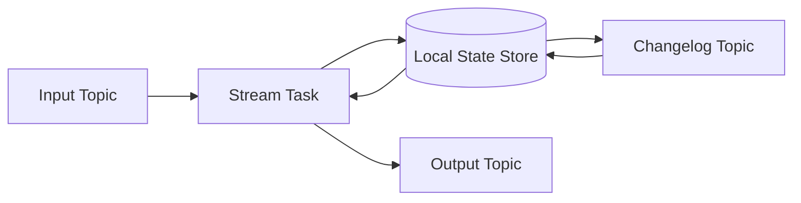
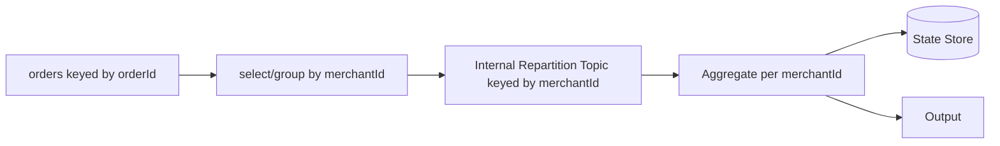
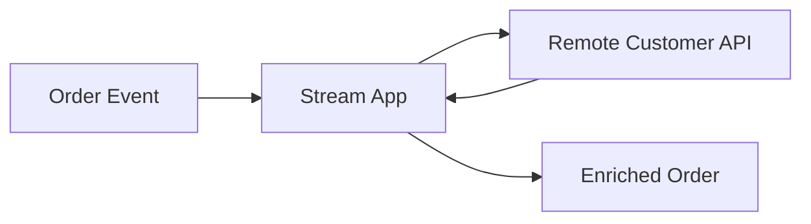
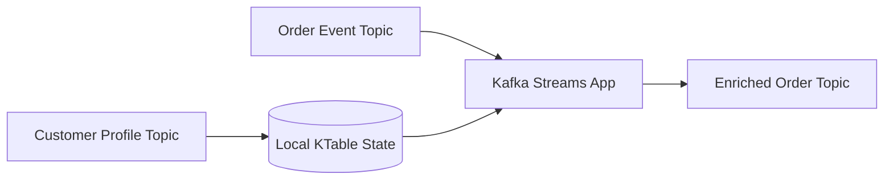
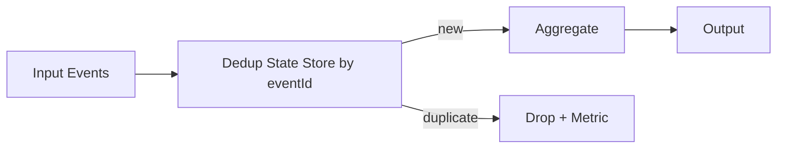
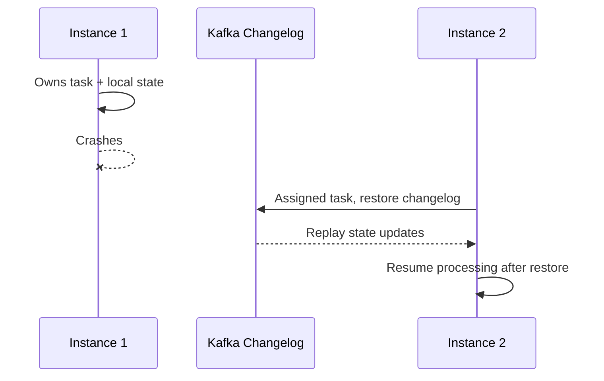
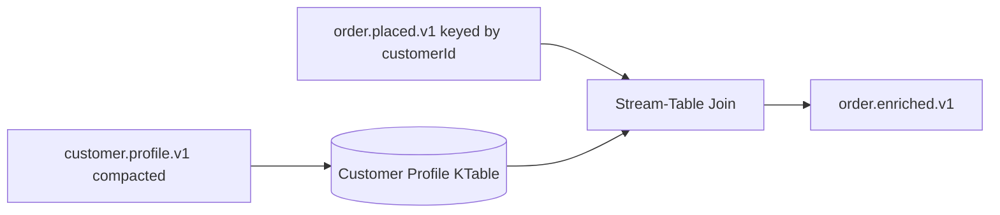
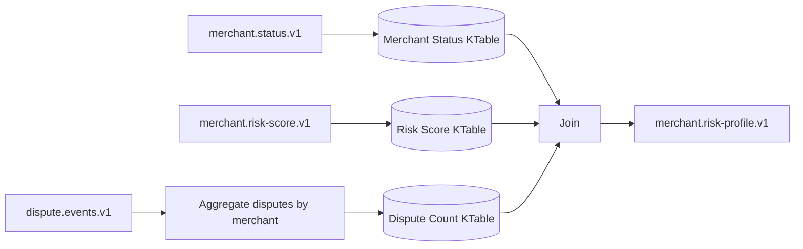

# Part 020 — Stateful Processing, Joins, and Aggregations

Part 019 covered time semantics and windowing. Now we move into the heart of Kafka Streams production engineering:

> stateful processing.

Stateless processing is easy to reason about. A record comes in, a record goes out. Stateful processing is different. The output depends not only on the current record, but also on what the application remembers from previous records.

This part covers:

- aggregations;
- reductions;
- counts;
- stream-table duality;
- KStream, KTable, and GlobalKTable joins;
- stream-stream, stream-table, and table-table joins;
- repartition topics;
- changelog topics;
- state stores;
- tombstones;
- compaction;
- restore behavior;
- testing and observability;
- design review discipline.

The goal is not merely to know the DSL methods. The goal is to predict what Kafka Streams will materialize, repartition, store, restore, and emit.

---

## 1. Kaufman Skill Decomposition

The skill is **designing stateful Kafka Streams topologies that remain correct under scale, restart, replay, skew, schema evolution, and topology change**.

| Subskill | Production Meaning |
|---|---|
| State mental model | Understand that aggregations and joins require local state and changelog topics. |
| Stream-table duality | Know when a topic is a sequence of events and when it represents latest state. |
| Grouping discipline | Know when `groupBy` causes repartition and how to control it. |
| Aggregation design | Choose `count`, `reduce`, or `aggregate` based on semantic need. |
| Join design | Choose stream-stream, stream-table, table-table, or GlobalKTable join intentionally. |
| Key alignment | Ensure both sides of a join are co-partitioned or intentionally global. |
| Tombstone semantics | Understand deletes in KTable and compacted topics. |
| State-store operations | Size, monitor, restore, backup assumptions, and interactive queries awareness. |
| Output correctness | Know whether output is update stream, changelog, fact event, or projection. |
| Evolution discipline | Avoid accidental internal topic/state-store breakage when topology evolves. |

### 1.1 Practice Goal

By the end of this part, you should be able to:

- explain what local state Kafka Streams creates for common operations;
- predict when repartition topics are created;
- design aggregates that are idempotent and replay-safe;
- choose the right join type for a business problem;
- reason about tombstones and deletions;
- estimate state and changelog cost;
- test stateful topologies deterministically;
- review stateful topology design like a platform engineer.

---

## 2. Stateless vs Stateful Processing

### 2.1 Stateless Processing

A stateless transformation depends only on the current record.

Examples:

```java id="gr4k67"
stream.filter((key, value) -> value.isValid());
stream.mapValues(value -> normalize(value));
stream.selectKey((oldKey, value) -> value.customerId());
```

Properties:

- no durable local state;
- no state restore;
- usually simpler scaling;
- output is determined by one input record at a time.

### 2.2 Stateful Processing

A stateful transformation depends on current record plus remembered previous records.

Examples:

```java id="r08m7g"
stream.groupByKey().count();
stream.groupByKey().aggregate(...);
orders.join(customersTable, ...);
clicks.windowedBy(...).count();
```

Properties:

- local state store is involved;
- changelog topic is usually involved;
- restore time matters;
- key distribution matters;
- rebalancing moves state ownership;
- topology naming becomes operationally important.

### 2.3 Mental Model



Local state makes processing fast because lookups are local. Changelog topics make the state recoverable because another instance can restore state after failure or rebalance.

---

## 3. Stream-Table Duality

Kafka Streams is built around a powerful idea:

> A table is a stream of updates. A stream of updates can be materialized as a table.

### 3.1 KStream

A `KStream<K, V>` is an event stream.

Each record is a fact or occurrence:

```text id="f5f36d"
OrderCreated(order-1)
OrderPaid(order-1)
OrderShipped(order-1)
```

Multiple records with the same key are still distinct events.

Use `KStream` when records mean:

- something happened;
- every occurrence matters;
- duplicates may need event-level handling;
- order of events matters within key;
- append history matters.

### 3.2 KTable

A `KTable<K, V>` is a changelog view of latest value by key.

Records mean updates:

```text id="bqzp80"
customer-1 -> name=Ayu, tier=SILVER
customer-1 -> name=Ayu, tier=GOLD
customer-1 -> null   // tombstone/delete
```

Only the latest value per key represents current table state.

Use `KTable` when records mean:

- current profile;
- latest configuration;
- account status;
- inventory level;
- materialized projection;
- dimension table.

### 3.3 Same Topic, Different Interpretation

A topic can be consumed as stream or table depending on semantics.

| Topic | As KStream | As KTable |
|---|---|---|
| `orders.events` | Every order event matters. | Usually wrong unless events are updates. |
| `customer-profile-changelog` | Profile update events. | Current profile by customer ID. |
| `product-price-updates` | Every price change event. | Latest price by SKU. |
| `merchant-status` | Status change history. | Current merchant status. |

The topic contract must say whether records are facts or upserts.

---

## 4. Aggregations

Aggregations turn many records into summarized state.

Kafka Streams DSL usually follows this shape:

```java id="ybb3a3"
stream
    .groupByKey()
    .aggregate(...);
```

or:

```java id="shn0h5"
stream
    .groupBy((key, value) -> newKey)
    .count();
```

### 4.1 `count`

Use `count` when the aggregate is simply number of records.

```java id="xyvbjm"
KTable<String, Long> ordersPerCustomer = orders
    .groupByKey(Grouped.with(Serdes.String(), orderSerde))
    .count(Materialized.as("orders-per-customer-store"));
```

Semantics:

- for each key, maintain count;
- output is a `KTable` changelog of counts;
- local state stores current count per key;
- changelog topic backs the state store.

Watch out:

- duplicate input records increase count;
- count is not idempotent unless input is deduplicated;
- tombstone semantics depend on source and aggregation type;
- count output emits updates, not final immutable facts.

### 4.2 `reduce`

Use `reduce` when the aggregate value has the same type as the input value and can be combined associatively.

Example: keep latest event by version.

```java id="o3ee57"
KTable<String, OrderEvent> latestOrderEvent = orderEvents
    .groupByKey(Grouped.with(Serdes.String(), orderEventSerde))
    .reduce((oldValue, newValue) ->
        newValue.version() >= oldValue.version() ? newValue : oldValue,
        Materialized.as("latest-order-event-store")
    );
```

Good for:

- max/min;
- latest-by-version;
- cumulative same-type merge.

Poor for:

- different output type;
- complex accumulator;
- operations needing explicit initialization.

### 4.3 `aggregate`

Use `aggregate` when output type differs from input type or needs explicit accumulator initialization.

```java id="eahsbk"
KTable<String, CustomerOrderSummary> summaries = orders
    .groupByKey(Grouped.with(Serdes.String(), orderSerde))
    .aggregate(
        CustomerOrderSummary::empty,
        (customerId, order, summary) -> summary.add(order),
        Materialized.<String, CustomerOrderSummary, KeyValueStore<Bytes, byte[]>>as(
                "customer-order-summary-store")
            .withKeySerde(Serdes.String())
            .withValueSerde(customerOrderSummarySerde)
    );
```

Good for:

- custom summary object;
- multiple counters;
- min/max/sum in one state;
- domain-specific accumulator.

Watch out:

- accumulator must be replay-safe;
- avoid non-deterministic fields like `computedAt = now()` inside the aggregate state;
- handle duplicates if input can duplicate;
- keep state small.

### 4.4 Aggregate State Design

Bad accumulator:

```java id="zg3xa8"
public record CustomerOrderSummary(
    String customerId,
    List<String> allOrderIds,
    BigDecimal total,
    Instant lastUpdatedAt
) {}
```

Problems:

- unbounded list grows forever;
- `lastUpdatedAt` may be processing time;
- replay may differ;
- state restore becomes expensive.

Better accumulator:

```java id="zh0ezi"
public record CustomerOrderSummary(
    String customerId,
    long orderCount,
    BigDecimal total,
    BigDecimal maxOrderAmount,
    long lastEventVersion
) {
    static CustomerOrderSummary empty() {
        return new CustomerOrderSummary(null, 0, BigDecimal.ZERO, BigDecimal.ZERO, -1);
    }

    CustomerOrderSummary add(OrderPlaced order) {
        if (order.version() <= lastEventVersion) {
            return this;
        }

        return new CustomerOrderSummary(
            order.customerId(),
            orderCount + 1,
            total.add(order.amount()),
            maxOrderAmount.max(order.amount()),
            order.version()
        );
    }
}
```

This still has assumptions. Version-based dedup only works if version is monotonic per customer. If not, use event-id dedup with bounded retention.

---

## 5. Grouping and Repartitioning

Grouping defines the key by which state is partitioned.

### 5.1 `groupByKey`

Use `groupByKey` when the current Kafka record key is already the grouping key.

```java id="uumrof"
orders.groupByKey().count();
```

If the topic is keyed by `customerId`, this counts per customer.

No repartition is needed if key and serde are already correct.

### 5.2 `groupBy`

Use `groupBy` when you need to change the grouping key.

```java id="fmcxfm"
orders
    .groupBy((orderId, order) -> order.merchantId(),
             Grouped.with(Serdes.String(), orderSerde))
    .count(Materialized.as("orders-per-merchant-store"));
```

This usually causes repartitioning.

Why?

Kafka Streams must ensure all records with the same new key are processed by the same task. If the input topic is keyed by `orderId`, records for the same `merchantId` are spread across partitions. Kafka Streams creates an internal repartition topic keyed by `merchantId`.

### 5.3 Repartition Topic Mental Model



Repartition is not bad. Accidental repartition is bad.

### 5.4 Repartition Cost

Repartition adds:

- extra Kafka writes;
- extra Kafka reads;
- serialization/deserialization;
- network traffic;
- storage in internal topic;
- consumer lag surface;
- operational topic governance;
- potential data skew under poor key design.

### 5.5 Explicit Repartitioning

For important topologies, make repartition explicit and named.

```java id="bf4qfc"
KStream<String, OrderPlaced> ordersByMerchant = orders
    .selectKey((orderId, order) -> order.merchantId())
    .repartition(Repartitioned
        .<String, OrderPlaced>as("orders-by-merchant")
        .withKeySerde(Serdes.String())
        .withValueSerde(orderSerde));

KTable<String, Long> counts = ordersByMerchant
    .groupByKey(Grouped.with(Serdes.String(), orderSerde))
    .count(Materialized.as("orders-per-merchant-store"));
```

This creates more predictable internal topic names and makes the topology easier to operate.

### 5.6 Co-Partitioning

For joins, both sides often must be co-partitioned:

- same key;
- compatible partition count;
- same partitioning strategy.

If keys do not align, Kafka Streams must repartition or the join will be incorrect/unavailable depending operation.

Key alignment is a design-time concern, not an implementation detail.

---

## 6. State Stores

State stores hold local materialized state.

Common store types:

| Store Type | Use |
|---|---|
| KeyValueStore | Latest value per key, non-windowed aggregates. |
| WindowStore | Windowed aggregates and windowed joins. |
| SessionStore | Session window state. |
| Timestamped stores | Store value plus timestamp metadata. |
| Versioned stores | Support timestamped historical table semantics in newer Kafka Streams designs. |

### 6.1 Materialization

Materialization gives a state store a name and serdes.

```java id="s7e1rp"
Materialized.<String, CustomerOrderSummary, KeyValueStore<Bytes, byte[]>>as(
        "customer-order-summary-store")
    .withKeySerde(Serdes.String())
    .withValueSerde(customerOrderSummarySerde);
```

State store names matter because they affect:

- internal changelog topic names;
- interactive query lookup;
- metrics;
- topology compatibility;
- operational debugging.

Do not let important stores receive accidental generated names.

### 6.2 Changelog Topics

A changelog topic backs up the state store.

Conceptually:

```text id="zz442a"
state store update -> changelog record
```

On restart or task migration:

```text id="qz02g9"
changelog topic -> restore local state store
```

### 6.3 Changelog Topic Naming

Internal topic names often include:

```text id="cl55bu"
<application.id>-<store-name>-changelog
```

If `application.id = payment-aggregator` and store name is `merchant-daily-total-store`, expect a changelog topic similar to:

```text id="yb2sob"
payment-aggregator-merchant-daily-total-store-changelog
```

This is why naming is operational design.

### 6.4 State Store Sizing

Approximate non-windowed state:

```text id="wmw2me"
state_size ≈ number_of_keys × average_value_size × overhead
```

Approximate windowed state:

```text id="jyopsi"
state_size ≈ active_keys × open_windows_per_key × average_value_size × overhead
```

Add:

- RocksDB metadata;
- block cache;
- indexes;
- changelog topic storage;
- compaction lag;
- standby replicas if configured;
- restore bandwidth.

### 6.5 State Store Hygiene

| Practice | Reason |
|---|---|
| Name important stores explicitly. | Stable operations and easier debugging. |
| Keep values compact. | Reduces RocksDB, changelog, and restore cost. |
| Avoid unbounded collections. | Prevents state explosion. |
| Define retention intentionally. | Prevents stale state growth. |
| Monitor restore time. | Determines deploy and recovery SLO. |
| Use deterministic aggregation logic. | Replay must produce equivalent state. |

---

## 7. Tombstones and Deletes

A tombstone is a record with key and null value.

In compacted topics, tombstones represent delete markers.

```text id="q5j9n4"
customer-1 -> {"tier":"GOLD"}
customer-1 -> null
```

For `KTable`, a null value means delete current state for that key.

### 7.1 Tombstone Use Cases

- delete customer profile from projection;
- remove product from catalog;
- disable merchant configuration;
- clear aggregate state;
- propagate domain deletion or anonymization.

### 7.2 Tombstone Risks

| Risk | Example |
|---|---|
| Accidental delete | Serializer emits null for malformed value. |
| Join disappearance | Stream-table join no longer finds right-side value. |
| Projection inconsistency | Downstream consumer ignores tombstones. |
| Compaction misunderstanding | Teams expect immediate physical deletion. |

### 7.3 Delete Is a Contract

If a topic is consumed as a table, tombstone behavior must be documented.

Topic contract should state:

- whether null values are allowed;
- what null means;
- whether consumers must delete local state;
- whether delete is reversible;
- retention and compaction expectations.

---

## 8. Joins

Joins combine data from two sources.

Kafka Streams join design depends on whether each side is a stream or table.

| Join Type | Left | Right | Meaning |
|---|---|---|---|
| Stream-stream | Event stream | Event stream | Correlate events within a time window. |
| Stream-table | Event stream | Current state table | Enrich event with latest known state. |
| Table-table | State table | State table | Maintain joined materialized view. |
| Stream-GlobalKTable | Event stream | Replicated table | Enrich from small/global dimension table. |

### 8.1 Stream-Stream Join

Use stream-stream join when both sides are events and you want to correlate events within a time window.

Example:

> Match `PaymentAuthorized` with `PaymentCaptured` within 15 minutes.

```java id="qqyduw"
KStream<String, PaymentAuthorized> authorized = builder.stream(
    "payment.authorized.v1",
    Consumed.with(Serdes.String(), paymentAuthorizedSerde)
);

KStream<String, PaymentCaptured> captured = builder.stream(
    "payment.captured.v1",
    Consumed.with(Serdes.String(), paymentCapturedSerde)
);

KStream<String, PaymentLifecycleEvent> lifecycle = authorized.join(
    captured,
    (auth, cap) -> PaymentLifecycleEvent.captured(auth, cap),
    JoinWindows.ofTimeDifferenceAndGrace(
        Duration.ofMinutes(15),
        Duration.ofMinutes(2)
    ),
    StreamJoined.with(Serdes.String(), paymentAuthorizedSerde, paymentCapturedSerde)
);
```

Properties:

- window is required;
- both sides are buffered in window stores;
- out-of-order behavior depends on timestamps and grace;
- duplicates can multiply outputs;
- key alignment is mandatory.

### 8.2 Stream-Stream Join Output Multiplication

If one authorization joins multiple captures, outputs multiply.

```text id="jyid2o"
auth-1 joins cap-1 -> output 1
auth-1 joins cap-2 -> output 2
```

If this is invalid in the domain, enforce cardinality before or after the join.

Possible strategies:

- deduplicate captures by payment ID;
- aggregate captures before joining;
- validate one-to-one invariant;
- route cardinality violations to exception topic.

### 8.3 Stream-Table Join

Use stream-table join when the left side is an event and the right side is current state.

Example:

> Enrich each order event with the current customer tier.

```java id="eywp07"
KStream<String, OrderPlaced> orders = builder.stream(
    "order.placed.v1",
    Consumed.with(Serdes.String(), orderPlacedSerde)
);

KTable<String, CustomerProfile> customers = builder.table(
    "customer.profile.v1",
    Consumed.with(Serdes.String(), customerProfileSerde),
    Materialized.as("customer-profile-store")
);

KStream<String, EnrichedOrder> enriched = orders.join(
    customers,
    (order, customer) -> EnrichedOrder.from(order, customer)
);
```

Properties:

- output occurs when stream side receives records;
- table updates alone do not re-emit old stream events;
- join uses latest table value at processing/event-time semantics depending store behavior and configuration;
- missing table value may drop output for inner join or produce null for left join.

### 8.4 Stream-Table Join Caveat

A stream-table join is not historical unless designed that way.

If an order from 10:00 is processed at 10:30 and customer tier changed at 10:20, the join may use the latest customer profile, not necessarily the profile at 10:00.

If historical correctness matters, options include:

- include needed dimension fields in the event at source time;
- use versioned tables where applicable;
- model effective-dated dimension data;
- perform join in a system designed for temporal joins;
- build custom state keyed by effective time.

### 8.5 Table-Table Join

Use table-table join when both sides are current-state views and you want a maintained projection.

Example:

> Maintain current merchant risk profile from merchant status and risk score table.

```java id="vmtk3z"
KTable<String, MerchantStatus> merchantStatus = builder.table(
    "merchant.status.v1",
    Consumed.with(Serdes.String(), merchantStatusSerde)
);

KTable<String, RiskScore> riskScores = builder.table(
    "merchant.risk-score.v1",
    Consumed.with(Serdes.String(), riskScoreSerde)
);

KTable<String, MerchantRiskProfile> profile = merchantStatus.join(
    riskScores,
    (status, risk) -> MerchantRiskProfile.from(status, risk),
    Materialized.as("merchant-risk-profile-store")
);
```

Properties:

- updates from either side can update output;
- tombstones can remove joined results;
- output is a changelog table;
- consumers must understand upsert/delete semantics.

### 8.6 GlobalKTable Join

A `GlobalKTable` replicates all table data to each Kafka Streams instance.

Use it when:

- dimension table is small enough;
- you need lookup by a key derived from stream value;
- co-partitioning is inconvenient or impossible;
- local full replication is acceptable.

Example:

```java id="kp0ji0"
GlobalKTable<String, Product> products = builder.globalTable(
    "product.catalog.v1",
    Consumed.with(Serdes.String(), productSerde)
);

KStream<String, EnrichedOrderLine> enriched = orderLines.join(
    products,
    (orderLineKey, orderLine) -> orderLine.productId(),
    (orderLine, product) -> EnrichedOrderLine.from(orderLine, product)
);
```

Risks:

- every instance stores the full table;
- restore can be expensive;
- unsuitable for high-cardinality large dimensions;
- stale data during restore/startup must be considered.

---

## 9. Join Decision Framework

| Requirement | Recommended Join |
|---|---|
| Correlate two event streams within time. | Stream-stream join. |
| Enrich events with latest reference data. | Stream-table join. |
| Maintain current projection from two state tables. | Table-table join. |
| Enrich events from small dimension table with non-co-partitioned key. | Stream-GlobalKTable join. |
| Need historical dimension as-of event time. | Do not assume normal stream-table join is enough; design temporal model. |
| Need one-to-many relationship. | Consider repartition/flatMap/modeling; validate cardinality. |
| Need external database lookup. | Prefer Kafka materialized table; avoid per-record remote calls. |

---

## 10. Enrichment Pattern

A common Kafka Streams pattern is local enrichment.

Bad pattern:



Problems:

- remote API latency limits throughput;
- outage propagates into stream processing;
- retries can duplicate effects;
- backpressure becomes complex;
- replay can overload external service.

Better pattern:



The enrichment data is streamed into Kafka and materialized locally.

---

## 11. Aggregation Correctness Patterns

### 11.1 Idempotent Aggregation

If input can duplicate, naive aggregation is wrong.

Example:

```java id="itxq07"
summary.total = summary.total.add(order.amount());
```

If the same order event is processed twice, total doubles.

Options:

| Strategy | When Useful | Cost |
|---|---|---|
| Idempotent source events | Producer guarantees unique final event per aggregate transition. | Requires source discipline. |
| Dedup by event ID | Duplicate records are possible. | Needs dedup state and retention. |
| Versioned transition | Events have monotonic version per entity. | Requires strict entity versioning. |
| Recompute from compacted state | Latest state rather than additive events. | Different event model. |
| Periodic reconciliation | Aggregate must be financially/audit accurate. | Additional pipeline. |

### 11.2 Dedup Before Aggregate

Simplified sketch:



Dedup state must have retention. Infinite dedup is usually not feasible.

### 11.3 Monotonic State Transition

For entity workflows, use versioned transitions.

Example:

```java id="fpm5r2"
public CustomerCaseSummary apply(CaseEvent event) {
    if (event.entityVersion() <= this.lastAppliedVersion) {
        return this;
    }

    return switch (event.type()) {
        case CASE_OPENED -> opened(event);
        case CASE_ESCALATED -> escalated(event);
        case CASE_CLOSED -> closed(event);
    };
}
```

This pattern is strong for regulatory workflow projections because it prevents old duplicate events from rolling back state.

But it only works if the source guarantees monotonic version per entity.

---

## 12. Output Semantics of Aggregates

Aggregations output updates.

A `KTable` aggregate converted to stream emits a changelog of the aggregate.

```java id="yvs53n"
ordersPerCustomer
    .toStream()
    .to("customer.order-summary.v1", Produced.with(Serdes.String(), summarySerde));
```

The output topic should be treated as an upsert stream unless you deliberately convert it into immutable fact events.

### 12.1 Upsert Output

```json id="yp8cdt"
{
  "customerId": "cust-1",
  "orderCount": 10,
  "totalAmount": "1200000.00",
  "aggregateVersion": 42,
  "status": "CURRENT"
}
```

Consumers should store latest by key.

### 12.2 Immutable Aggregate Event

```json id="dzynkd"
{
  "eventId": "evt-agg-901",
  "eventType": "CustomerOrderSummaryUpdated",
  "customerId": "cust-1",
  "previousOrderCount": 9,
  "newOrderCount": 10,
  "aggregateVersion": 42,
  "occurredAt": "2026-07-01T10:15:00Z"
}
```

Consumers treat each output as an event.

Do not confuse these contracts.

---

## 13. Internal Topics

Stateful Kafka Streams topologies commonly create internal topics.

| Internal Topic Type | Purpose |
|---|---|
| Repartition topic | Shuffle records by new key before stateful operation or join. |
| Changelog topic | Backup local state store. |

### 13.1 Why Internal Topics Matter

Internal topics are still Kafka topics. They consume:

- broker storage;
- network bandwidth;
- partition count capacity;
- monitoring surface;
- ACL/security governance;
- disaster recovery consideration.

They also affect operational behavior:

- restore speed;
- rolling deploy stability;
- lag interpretation;
- topology compatibility.

### 13.2 Naming and Topology Stability

Generated internal names can change if the topology changes.

Use explicit names for:

- state stores;
- repartition operations;
- processors where topology compatibility matters.

This helps avoid accidental state loss or expensive rebuilds during topology evolution.

---

## 14. Rebalance and State Movement

When a Kafka Streams instance starts, stops, crashes, or scales, tasks can move.

If a task owns state, the new owner must restore state from changelog unless local state is still available.



### 14.1 Operational Consequences

| Design Choice | Consequence |
|---|---|
| Large state store | Longer restore time. |
| Many small stores | More operational complexity. |
| High update rate | Larger changelog throughput. |
| Poor key distribution | Hot tasks and uneven restore. |
| No standby replicas | Slower failover. |
| Frequent deployments | More rebalances and restore pressure. |

---

## 15. Joins and Key Design

Join correctness starts with keys.

### 15.1 Good Key Alignment

Order topic:

```text id="zwycg7"
key = customerId
value = OrderPlaced
```

Customer table:

```text id="nqri11"
key = customerId
value = CustomerProfile
```

Stream-table join is natural.

### 15.2 Bad Key Alignment

Order topic:

```text id="b5r8v4"
key = orderId
value.customerId = customerId
```

Customer table:

```text id="jm5k34"
key = customerId
value = CustomerProfile
```

You cannot join directly by Kafka record key. You must rekey orders by customer ID or use a different pattern.

```java id="zik37w"
KStream<String, OrderPlaced> ordersByCustomer = orders
    .selectKey((orderId, order) -> order.customerId())
    .repartition(Repartitioned.as("orders-by-customer"));
```

This is not an implementation detail. It changes cost, partitioning, and ordering boundary.

---

## 16. Table Modeling: Latest State vs Event History

A common design error is using an event-history topic as a KTable.

Example topic:

```text id="x3z8kk"
key=order-1, value=OrderCreated
key=order-1, value=OrderPaid
key=order-1, value=OrderCancelled
```

If consumed as KTable, latest value is `OrderCancelled`. The previous events are not current state; they are history.

This can be valid only if each event value represents a full current state update or if your table value model intentionally represents latest status.

Better topic split:

| Topic | Meaning |
|---|---|
| `order.events.v1` | Immutable order event history. |
| `order.current-state.v1` | Compacted latest order state by order ID. |

---

## 17. Example: Customer Tier Enrichment

### 17.1 Requirement

> Enrich each `OrderPlaced` event with customer tier for downstream routing.

### 17.2 Design

| Decision | Choice |
|---|---|
| Left side | `KStream<String, OrderPlaced>` keyed by `customerId`. |
| Right side | `KTable<String, CustomerProfile>` keyed by `customerId`. |
| Join | Left join if orders without profile should still flow; inner join if profile is mandatory. |
| Output | Immutable enriched order event. |
| Missing customer | Route with `tier=UNKNOWN` or exception topic depending business rule. |
| Table source | Compacted customer profile topic. |
| State store | Named customer profile store. |

### 17.3 Topology



### 17.4 Java Sketch

```java id="le8xmq"
KTable<String, CustomerProfile> customerProfiles = builder.table(
    "customer.profile.v1",
    Consumed.with(Serdes.String(), customerProfileSerde),
    Materialized.<String, CustomerProfile, KeyValueStore<Bytes, byte[]>>as("customer-profile-store")
        .withKeySerde(Serdes.String())
        .withValueSerde(customerProfileSerde)
);

KStream<String, OrderPlaced> ordersByCustomer = builder
    .stream("order.placed.v1", Consumed.with(Serdes.String(), orderPlacedSerde));

KStream<String, EnrichedOrderPlaced> enriched = ordersByCustomer.leftJoin(
    customerProfiles,
    (order, profile) -> EnrichedOrderPlaced.from(order, profile)
);

enriched.to("order.enriched.v1",
    Produced.with(Serdes.String(), enrichedOrderSerde));
```

### 17.5 Review Questions

- Are orders actually keyed by customer ID?
- If not, where is repartition done and named?
- Is customer profile topic compacted?
- What does tombstone mean for customer profile?
- Should historical customer tier at order time be used instead of latest tier?
- Can downstream tolerate profile missing?
- Is enriched output an event or upsert?

---

## 18. Example: Merchant Risk Projection

### 18.1 Requirement

> Maintain a current merchant risk projection from merchant status, risk score, and recent dispute aggregate.

This is table-table plus aggregate.



### 18.2 Design Notes

- `merchant.status.v1` should be keyed by merchant ID.
- `merchant.risk-score.v1` should be keyed by merchant ID.
- dispute events may need rekeying by merchant ID.
- dispute aggregate may be windowed or non-windowed depending requirement.
- output is a current projection, likely compacted.
- tombstones from any input must have defined impact.

### 18.3 Failure Modes

| Failure | Impact | Mitigation |
|---|---|---|
| Risk score table restore slow | Projection startup delayed. | Monitor restore, size store, standby replicas. |
| Dispute events keyed by dispute ID | Repartition required. | Explicit `repartition`. |
| Merchant status tombstone ignored | Deleted merchant remains in projection. | Propagate tombstone semantics. |
| Aggregate double counts duplicate disputes | Risk profile inflated. | Dedup or monotonic event versioning. |
| Output interpreted as event history | Consumers process updates incorrectly. | Document upsert contract and compaction. |

---

## 19. Testing Stateful Topologies

Stateful tests must verify state, output, and edge cases.

### 19.1 Aggregation Test Matrix

| Scenario | Expected |
|---|---|
| First record for key | Initializes aggregate. |
| Second record for key | Updates aggregate. |
| Duplicate event | Dropped or idempotently ignored if required. |
| Different key | Independent aggregate. |
| Tombstone | Delete or ignore depending contract. |
| Restart/replay | Same final aggregate. |
| Repartition | Output still grouped by intended key. |

### 19.2 Join Test Matrix

| Scenario | Expected |
|---|---|
| Right table has value before stream event | Enriched output. |
| Stream event arrives before table value | Inner join drops or left join emits null-based output. |
| Table updates after stream event | No old stream event re-emitted for stream-table join. |
| Table tombstone | Future stream events see missing value. |
| Repartitioned key | Join still works. |
| Duplicate left event | Duplicate outputs unless deduped. |

### 19.3 TopologyTestDriver Sketch: Stream-Table Join

```java id="z6js0m"
@Test
void enrichesOrderWithCustomerProfile() {
    StreamsBuilder builder = new StreamsBuilder();
    buildTopology(builder);

    try (TopologyTestDriver driver = new TopologyTestDriver(builder.build(), props())) {
        TestInputTopic<String, CustomerProfile> customers = driver.createInputTopic(
            "customer.profile.v1",
            new StringSerializer(),
            customerProfileSerializer
        );

        TestInputTopic<String, OrderPlaced> orders = driver.createInputTopic(
            "order.placed.v1",
            new StringSerializer(),
            orderPlacedSerializer
        );

        TestOutputTopic<String, EnrichedOrderPlaced> output = driver.createOutputTopic(
            "order.enriched.v1",
            new StringDeserializer(),
            enrichedOrderDeserializer
        );

        customers.pipeInput("cust-1", new CustomerProfile("cust-1", "GOLD"));
        orders.pipeInput("cust-1", new OrderPlaced("order-1", "cust-1"));

        EnrichedOrderPlaced enriched = output.readValue();
        assertThat(enriched.customerTier()).isEqualTo("GOLD");
    }
}
```

### 19.4 Test the Negative Case

```java id="lgm7iz"
@Test
void doesNotReemitOldOrderWhenCustomerProfileChanges() {
    customers.pipeInput("cust-1", profile("SILVER"));
    orders.pipeInput("cust-1", order("order-1"));

    assertThat(output.readValue().customerTier()).isEqualTo("SILVER");

    customers.pipeInput("cust-1", profile("GOLD"));

    // Stream-table join does not reprocess old stream record merely because table changed.
    assertThat(output.isEmpty()).isTrue();
}
```

This test prevents a common misunderstanding.

---

## 20. Observability for Stateful Processing

Stateful Kafka Streams applications need more than consumer lag.

### 20.1 Metrics and Signals

| Signal | Why It Matters |
|---|---|
| State store size | Disk pressure and restore cost. |
| Changelog topic throughput | State update intensity. |
| Restore rate and duration | Recovery SLO. |
| Repartition topic lag | Shuffle bottleneck. |
| RocksDB read/write latency | Local state performance. |
| Cache hit ratio | Store efficiency. |
| Commit latency | Transaction/state consistency pressure. |
| Task idle time | Partition imbalance or input skew. |
| Dropped records | Serde/tombstone/join/filter issues. |
| Output rate | Detect update storms. |

### 20.2 Business Observability

For stateful projections, also expose:

- aggregate version;
- input event count;
- duplicate count;
- last applied event timestamp;
- last applied source offset if needed;
- tombstone count;
- join miss count;
- unknown dimension count;
- correction count.

### 20.3 Join Miss Metric

A join miss is often business-significant.

Example:

```text id="sr8l9g"
orders_enrichment_customer_profile_missing_total{service="order-enricher"}
```

If this metric spikes, possible causes:

- customer profile topic lag;
- wrong key;
- missing reference data;
- table restore incomplete;
- producer contract violation;
- deployment ordering issue.

---

## 21. Performance Considerations

### 21.1 Key Skew

A hot key creates hot state.

Example:

```text id="v92nh8"
merchantId = "DEFAULT" receives 40% of all records
```

Impact:

- one task becomes hot;
- one RocksDB store segment is heavily updated;
- one changelog partition is hot;
- scaling instances does not fix the single hot key.

Mitigations:

- fix key design;
- split aggregate into sharded partial aggregates then merge;
- use hierarchical aggregation;
- avoid fake default keys;
- handle high-volume entities separately.

### 21.2 Cache and Commit Interval

Kafka Streams may cache state updates before forwarding/committing. This can reduce output churn but affect perceived latency.

Design questions:

- Does downstream need every intermediate update?
- Is compaction of updates acceptable?
- What is the maximum acceptable delay?
- How does this interact with exactly-once settings?

### 21.3 Serialization Cost

Stateful operations serialize values frequently:

- into state store;
- into changelog;
- into repartition topics;
- into output topics.

Large nested objects hurt throughput and restore time.

Keep aggregate values compact and purpose-built.

---

## 22. Evolution Risks

Changing a stateful topology is riskier than changing a stateless topology.

### 22.1 Risky Changes

| Change | Risk |
|---|---|
| Rename state store | New changelog topic; old state not reused. |
| Change aggregate value schema incompatibly | Restore/deserialization failure. |
| Change grouping key | Requires new repartition and new state semantics. |
| Change window size | Old window store no longer semantically compatible. |
| Remove/reorder unnamed processors | Internal names may change. |
| Change `application.id` | Starts a new application with new offsets and internal topics. |

### 22.2 Safe Evolution Pattern

For major changes:

1. Create a new output topic version.
2. Use a new `application.id` or explicit migration plan.
3. Backfill/replay from source topics.
4. Run old and new topology in parallel.
5. Compare outputs.
6. Cut over consumers.
7. Retire old topology and internal topics after retention/rollback window.

### 22.3 State Migration Is a Project

Do not casually promise in-place state migration.

It involves:

- changelog compatibility;
- serde compatibility;
- store name stability;
- topology description compatibility;
- rollback plan;
- data validation;
- operational rehearsal.

For many teams, replay into a new application version is safer.

---

## 23. Anti-Patterns

### 23.1 Remote Lookup Per Record

Symptom:

```java id="htgq8g"
stream.mapValues(order -> customerApi.getCustomer(order.customerId()))
```

Impact:

- throughput collapse;
- external outage stalls processing;
- replay overloads API;
- poor failure isolation.

Better:

- materialize reference data as KTable or GlobalKTable.

### 23.2 Accidental Repartition

Symptom:

```java id="s8c4qa"
.groupBy((key, value) -> value.someField())
```

without recognizing internal topic creation.

Impact:

- unexpected storage/network cost;
- surprise lag;
- hard-to-understand topology.

Better:

- name repartition topics explicitly;
- review topology description;
- document key changes.

### 23.3 Treating Changelog Output as Immutable Events

Symptom:

Consumers append every aggregate update to a ledger as if each were a new business event.

Impact:

- inflated counts;
- duplicate side effects;
- unstable downstream state.

Better:

- document upsert semantics;
- use compacted output topic;
- include aggregate identity and version.

### 23.4 Unbounded Aggregate Values

Symptom:

Aggregate stores all event IDs forever.

Impact:

- state explosion;
- slow restore;
- RocksDB pressure.

Better:

- bounded dedup windows;
- approximate structures when acceptable;
- external audit store for full history;
- compact summary state.

### 23.5 Joining Without Temporal Semantics

Symptom:

Stream-table join used for historical regulatory report.

Impact:

- event enriched with wrong version of dimension data;
- audit discrepancy.

Better:

- include dimension snapshot in source event;
- model effective-dated table;
- use temporal join strategy.

---

## 24. Architecture Review Checklist

Before approving a stateful topology, answer these questions.

### 24.1 State

| Question | Answer Required |
|---|---|
| What state stores are created? | Names, types, expected size. |
| What changelog topics are created? | Names, retention/compaction expectation. |
| What is the restore time target? | Measured or estimated. |
| Are standby replicas needed? | Based on recovery SLO. |
| Are aggregate values bounded? | Proof or mitigation. |

### 24.2 Repartition

| Question | Answer Required |
|---|---|
| Does the topology change keys? | Where and why. |
| Are repartition topics named? | Explicit names. |
| What is the partition count? | Scaling rationale. |
| Is key distribution healthy? | Cardinality/skew analysis. |

### 24.3 Joins

| Question | Answer Required |
|---|---|
| Which join type is used? | Stream-stream/table/global. |
| Are keys aligned? | Proof or repartition plan. |
| Is join temporal or latest-state? | Explicit semantic statement. |
| What happens on missing right side? | Drop/null/exception. |
| What do tombstones mean? | Delete semantics. |

### 24.4 Output

| Question | Answer Required |
|---|---|
| Is output event or upsert? | Topic contract. |
| Can output emit multiple updates per key? | Downstream idempotency. |
| Is output compacted? | Topic config. |
| Are schemas compatible? | Schema Registry policy. |

### 24.5 Evolution

| Question | Answer Required |
|---|---|
| What changes break state compatibility? | Known risk list. |
| Is topology naming stable? | Store/repartition/processor names. |
| What is rollback plan? | Old app/output retained. |
| How will new output be validated? | Shadow run/diff. |

---

## 25. ADR Template

```md id="cf4ng1"
# ADR: Stateful Kafka Streams Topology for <Use Case>

## Context
We need to build <projection/enrichment/aggregation/correlation> from <input topics>.

## Decision
We will use Kafka Streams with <aggregation/join/window> operations.
State stores:
- <store-name>: <type>, <key>, <value>, <expected size>

Internal topics:
- <repartition-topic>: <purpose>
- <changelog-topic>: <purpose>

## Input Contracts
- Topic: <topic>
- Key: <key contract>
- Value: <schema>
- Tombstone meaning: <meaning>

## Grouping/Repartitioning
- Current key: <key>
- Required key: <key>
- Repartition required: <yes/no>
- Reason: <reason>

## Join Semantics
- Join type: <stream-stream/stream-table/table-table/global>
- Join key: <key>
- Temporal semantics: <latest-state/event-time/windowed>
- Missing-right behavior: <behavior>

## Aggregation Semantics
- Aggregate type: <count/reduce/aggregate>
- Idempotency strategy: <strategy>
- Duplicate handling: <strategy>
- State boundedness: <proof>

## Output Contract
- Topic: <topic>
- Key: <key>
- Output type: <immutable event/upsert/changelog>
- Compaction: <enabled/disabled>
- Downstream requirements: <idempotency/upsert/delete handling>

## Operations
- Expected state size: <estimate>
- Restore time target: <duration>
- Metrics: <list>
- Alerting: <list>

## Evolution Plan
- Compatibility risks: <list>
- Migration strategy: <in-place/replay/new app id>
- Rollback plan: <plan>
```

---

## 26. Deliberate Practice

### Exercise 1 — Choose the Right Join

For each requirement, choose a join type.

| Requirement | Join Type | Reason |
|---|---|---|
| Enrich each order with current customer profile. |  |  |
| Match authorization and capture within 15 minutes. |  |  |
| Maintain current merchant risk projection from status and score. |  |  |
| Enrich orders with small product catalog keyed by product ID while order topic is keyed by order ID. |  |  |
| Build legally accurate report using customer profile as of order time. |  |  |

### Exercise 2 — Find Repartition

Given:

```text id="kd9z0t"
Topic: order.placed.v1
Key: orderId
Value: { orderId, customerId, merchantId, amount }
```

You need:

1. total order amount per customer;
2. total order amount per merchant;
3. enrich order with customer profile keyed by customerId.

For each, identify:

- current key;
- required key;
- whether repartition is required;
- internal topic name you would use;
- ordering consequence.

### Exercise 3 — Aggregation Correctness

Design an aggregate for:

> Count unique enforcement actions per case.

Assume duplicate events can occur.

Specify:

- key;
- dedup strategy;
- state store(s);
- retention;
- output contract;
- duplicate metric;
- replay behavior.

### Exercise 4 — State Size Estimate

Estimate state for:

- 3 million active customers;
- summary value average 300 bytes;
- RocksDB/changelog overhead factor 3x;
- standby replica count 1.

Then explain deployment implications.

### Exercise 5 — Topology Evolution

You have a store named `customer-summary-store` with Avro schema v1. You need to change the aggregate value shape significantly.

Design a migration plan using:

- new output topic;
- parallel run;
- replay;
- validation;
- cutover;
- rollback.

---

## 27. Mental Model Summary

Stateful Kafka Streams design is distributed systems design compressed into Java code.

Key invariants:

1. **State is local but recoverable.** Local stores are backed by Kafka changelog topics.
2. **Grouping defines state ownership.** If the grouping key changes, repartitioning is usually required.
3. **Repartition is a shuffle.** It has real cost in storage, network, latency, and operations.
4. **KStream records are events.** KTable records are updates to latest state.
5. **Aggregates emit updates.** Do not treat them as immutable business facts unless explicitly modeled.
6. **Joins require semantic clarity.** Stream-stream correlation, stream-table enrichment, table-table projection, and GlobalKTable lookup solve different problems.
7. **Tombstones are part of the contract.** Null values can mean delete, and consumers must know that.
8. **State size determines operability.** Restore time, disk pressure, changelog throughput, and rebalance behavior must be designed.
9. **Topology names are operational API.** Store and repartition names should be stable and intentional.
10. **Evolution needs a migration plan.** Stateful topology changes can break restore, output semantics, and downstream consumers.

In the next part, we will build on these concepts and study exactly-once stream processing: idempotent production, transactions, state/changelog/output consistency, and what exactly-once does and does not guarantee.

---

## References

- Apache Kafka Documentation — Kafka Streams API, stateful operations, joins, windowing, event-time processing: https://kafka.apache.org/documentation/
- Apache Kafka Streams Core Concepts: https://kafka.apache.org/42/streams/core-concepts/
- Apache Kafka Streams DSL API: https://kafka.apache.org/40/streams/developer-guide/dsl-api/
- Confluent Kafka Streams Architecture: https://docs.confluent.io/platform/current/streams/architecture.html
- Confluent Kafka Streams DSL API Guide: https://docs.confluent.io/platform/current/streams/developer-guide/dsl-api.html
- Confluent Kafka Streams Joins Course: https://developer.confluent.io/courses/kafka-streams/joins/
- Confluent Blog — Crossing the Streams: Joins in Apache Kafka: https://www.confluent.io/blog/crossing-streams-joins-apache-kafka/
