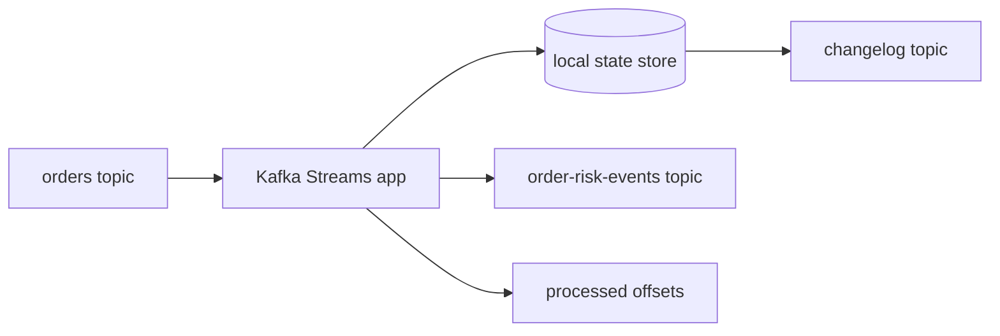
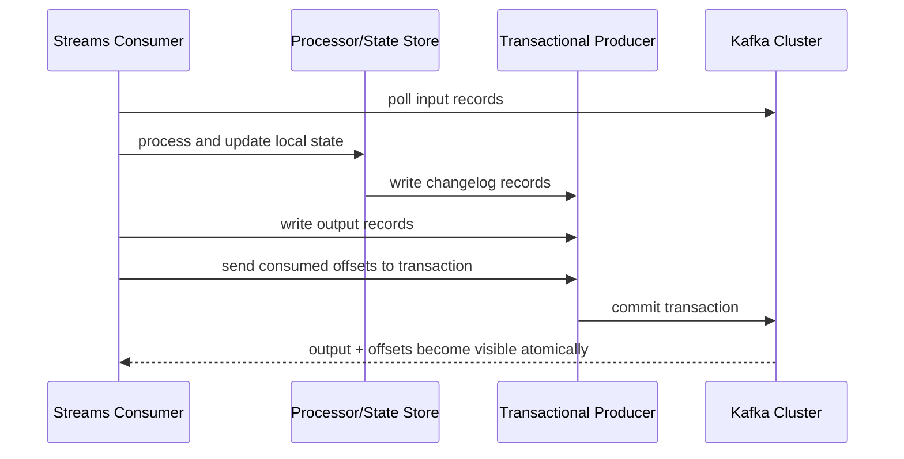
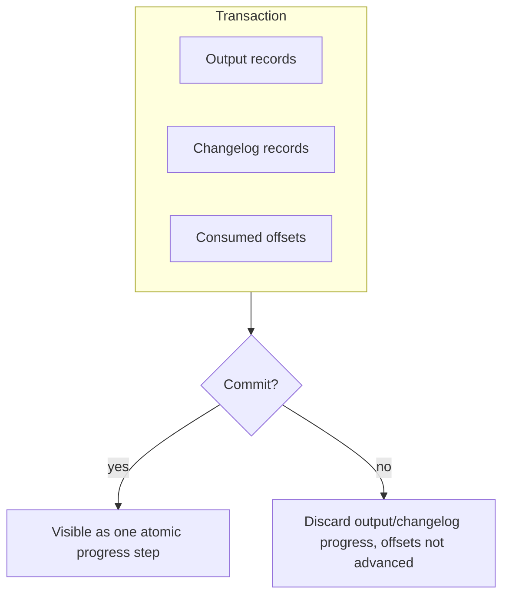
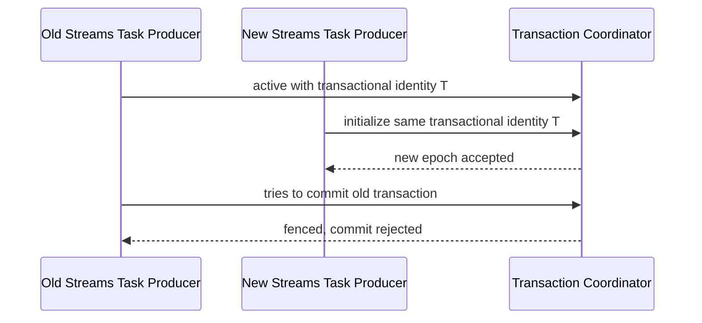
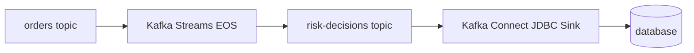
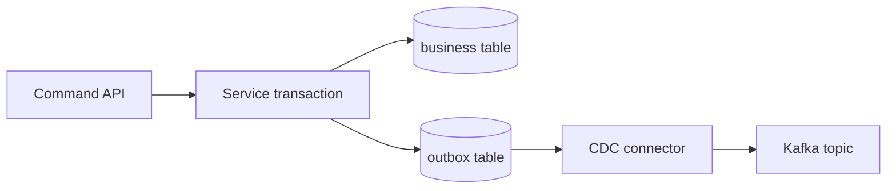
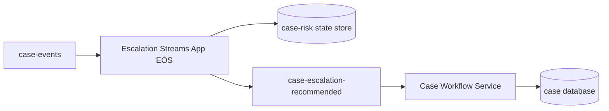
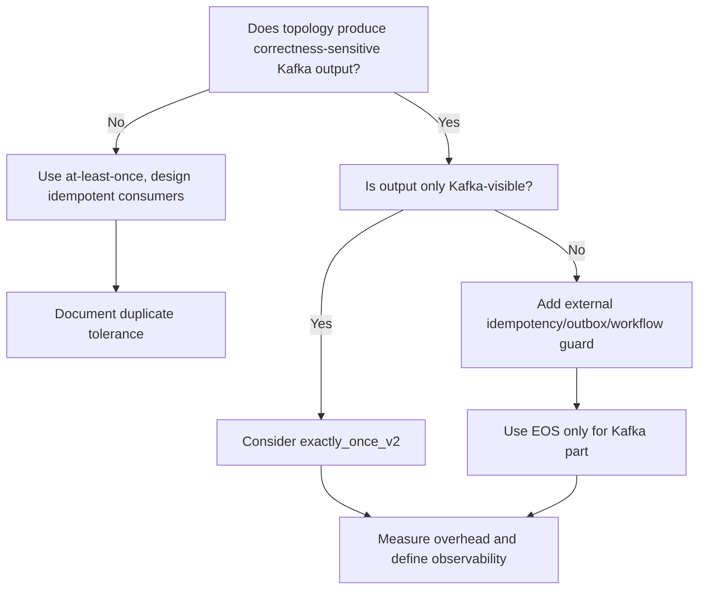

# Part 021 — Exactly-Once Stream Processing

Part 020 covered stateful processing, joins, and aggregations. This part covers one of the most misunderstood topics in Kafka engineering:

> exactly-once stream processing.

Exactly-once is not a slogan. It is a boundary. It has a scope, a cost, and failure modes.

For Kafka Streams, exactly-once processing means Kafka Streams can coordinate these actions so that they are committed atomically within Kafka:

- consumed input offsets;
- produced output records;
- state-store updates backed by changelog topics;
- transaction commit/abort around a processing batch.

It does **not** mean every external side effect in your whole business system happens exactly once. HTTP calls, database writes, emails, payment captures, and third-party API calls are outside Kafka's transactional boundary unless you add a separate correctness pattern.

This part teaches how to reason about that boundary precisely.

---

## 1. Kaufman Skill Decomposition

The target skill is **using exactly-once processing intentionally without lying to yourself about the guarantees**.

| Subskill | Production Meaning |
|---|---|
| Guarantee boundary | Know what Kafka EOS covers and what it does not cover. |
| Transaction mental model | Understand how producer transactions coordinate output and offset commits. |
| State consistency | Understand why state store, changelog, and offset commits must move together. |
| Failure reasoning | Predict results after crash, rebalance, retry, and producer fencing. |
| Configuration discipline | Set `processing.guarantee` correctly and avoid conflicting producer settings. |
| External effect design | Use outbox, idempotency, or workflow guards for non-Kafka side effects. |
| Performance awareness | Know that transactions add overhead and operational surfaces. |
| Observability | Monitor commit/abort, lag, rebalance, state restore, and transaction-related failures. |
| Testing strategy | Test deterministic replay, crash recovery, and duplicate suppression separately. |
| Architecture review | Challenge broad “exactly-once system” claims. |

### 1.1 Practice Goal

By the end of this part, you should be able to:

- explain exactly-once in Kafka Streams without hand-waving;
- decide whether a topology needs `exactly_once_v2` or `at_least_once` plus idempotency;
- identify when external side effects break EOS assumptions;
- reason through crash windows;
- design a stream processing topology whose output and state remain consistent after replay;
- review an architecture diagram and find false EOS claims.

---

## 2. The Problem EOS Solves

Consider a Kafka Streams topology:



For each input record, the application may:

1. read from an input topic;
2. update a local state store;
3. write the state update to a changelog topic;
4. emit output records;
5. commit the consumed offset.

If these actions are not coordinated, crash recovery can produce inconsistent outcomes.

### 2.1 At-Least-Once Failure Example

Suppose the application processes `order-123`:

1. reads `orders[0]@100`;
2. updates local state: `riskScore(order-123)=80`;
3. emits `HighRiskOrderDetected(order-123)`;
4. crashes before committing offset `101`.

After restart, Kafka Streams reads offset `100` again. The output may be emitted again.

At-least-once is safe for no-loss processing, but duplicates are possible.

### 2.2 Why Duplicates Are Not Always Harmless

Duplicates can be harmless if outputs are naturally idempotent:

- overwriting a materialized view by primary key;
- setting `customer_status = SUSPENDED` repeatedly;
- recalculating deterministic aggregate state.

Duplicates can be dangerous if outputs represent effects:

- sending notification emails;
- creating payment captures;
- opening duplicate enforcement cases;
- applying duplicate penalty fees;
- emitting downstream facts that consumers treat as unique.

Exactly-once is most valuable when the output is itself consumed as a correctness-sensitive event stream.

---

## 3. The Correct Mental Model

Exactly-once in Kafka Streams is best understood as:

> atomic read-process-write across Kafka topics and Kafka-backed state.

It coordinates Kafka input offsets, Kafka output records, and Kafka Streams state/changelog updates.



If the transaction commits, the output records and input offset progress become visible together.

If the transaction aborts, partial output is not visible to consumers using `read_committed`, and the input offsets are not committed as processed.

---

## 4. Three Different “Exactly-Once” Claims

Engineers often mix three claims that are not equivalent.

| Claim | Meaning | Usually True? |
|---|---|---|
| Exactly-once Kafka write | A producer avoids duplicate records caused by retries. | Possible with idempotent producer. |
| Exactly-once Kafka read-process-write | Input offsets and Kafka outputs are committed atomically. | Possible with Kafka transactions / Kafka Streams EOS. |
| Exactly-once business effect | Every real-world effect happens exactly once. | Rarely true without additional design. |

The third claim is where most architecture reviews fail.

### 4.1 The Boundary Rule

Use this rule:

> Kafka exactly-once ends at Kafka's transaction boundary.

If a side effect crosses into another system, you need a separate design:

- transactional outbox;
- idempotency key;
- deduplication table;
- state transition guard;
- saga/workflow engine;
- compensation;
- external system idempotency token;
- manual reconciliation process.

---

## 5. Kafka Streams Processing Guarantees

Kafka Streams supports these processing guarantees:

| Guarantee | Typical Config | Meaning |
|---|---|---|
| At-least-once | `processing.guarantee=at_least_once` | No loss under normal recovery, but duplicate processing/output can occur. |
| Exactly-once v2 | `processing.guarantee=exactly_once_v2` | Kafka Streams uses transactions to couple state/changelog/output/offset progress. |

For production, do not choose exactly-once because it sounds safer. Choose it because the topology's output semantics require it and the cost is justified.

### 5.1 Minimal Streams Config

```java
Properties props = new Properties();
props.put(StreamsConfig.APPLICATION_ID_CONFIG, "order-risk-streams-v1");
props.put(StreamsConfig.BOOTSTRAP_SERVERS_CONFIG, "kafka-1:9092,kafka-2:9092,kafka-3:9092");

props.put(StreamsConfig.PROCESSING_GUARANTEE_CONFIG, StreamsConfig.EXACTLY_ONCE_V2);
props.put(StreamsConfig.COMMIT_INTERVAL_MS_CONFIG, 1000);

props.put(StreamsConfig.DEFAULT_KEY_SERDE_CLASS_CONFIG, Serdes.StringSerde.class);
props.put(StreamsConfig.DEFAULT_VALUE_SERDE_CLASS_CONFIG, SpecificAvroSerde.class);
```

Important notes:

- `application.id` identifies the consumer group, internal topic prefix, and state ownership boundary.
- Changing `application.id` is effectively creating a new application from Kafka's perspective.
- `commit.interval.ms` affects transaction commit frequency and latency/throughput trade-off.
- Exactly-once does not eliminate the need to design idempotent downstream consumers.

---

## 6. How Kafka Streams Uses Transactions

Kafka Streams builds on Kafka producer transactions.

A transactional producer can:

1. begin a transaction;
2. send output records;
3. send consumed offsets as part of the transaction;
4. commit or abort.

Kafka Streams hides much of this ceremony, but the mental model matters.



### 6.1 Why Offsets Must Be in the Transaction

If output commits without offset commit, the same input may be processed again and duplicate output may appear.

If offset commits without output commit, input may be skipped and output lost.

EOS coordinates them.

| Output | Offset | Result |
|---|---|---|
| committed | committed | safe progress |
| committed | not committed | duplicate risk |
| not committed | committed | loss risk |
| aborted | not committed | safe retry |

Exactly-once aims to make the visible states collapse to either safe progress or safe retry.

---

## 7. State Store Consistency

Kafka Streams state is local for performance, but it is recoverable because it is backed by Kafka changelog topics.

For EOS, state consistency means:

- the local state update;
- the changelog update;
- output records;
- consumed offset progress;

are coordinated so that recovery does not expose a state/output mismatch.

### 7.1 Example: Risk Aggregate

Input events:

```text
OrderSubmitted(orderId=o-1, customerId=c-7, amount=900)
OrderSubmitted(orderId=o-2, customerId=c-7, amount=700)
```

Topology:

```java
KTable<String, Long> customerExposure = builder
    .stream("orders", Consumed.with(Serdes.String(), orderSerde))
    .groupBy((orderId, order) -> order.customerId(), Grouped.with(Serdes.String(), orderSerde))
    .aggregate(
        () -> 0L,
        (customerId, order, total) -> total + order.amount(),
        Materialized.<String, Long, KeyValueStore<Bytes, byte[]>>as("customer-exposure-store")
            .withKeySerde(Serdes.String())
            .withValueSerde(Serdes.Long())
    );
```

Kafka Streams may create:

- a repartition topic because grouping changed the key;
- a state store for aggregate state;
- a changelog topic for the state store.

EOS ensures Kafka-visible progress for this processing step is atomic.

---

## 8. What EOS Does Not Fix

Exactly-once is powerful but narrow. It does not fix bad semantics.

### 8.1 Non-Deterministic Processing

Bad:

```java
.mapValues(order -> new RiskDecision(
    order.id(),
    UUID.randomUUID().toString(),
    Instant.now(),
    calculateRisk(order)
))
```

This is not replay-stable. A replay can produce different IDs and timestamps.

Better:

```java
.mapValues((readOnlyKey, order) -> new RiskDecision(
    order.id(),
    deterministicDecisionId(order.id(), order.version()),
    order.submittedAt(),
    calculateRisk(order)
))
```

For correctness-sensitive streams, prefer deterministic output derived from input records and stable reference data.

### 8.2 External Side Effects

Bad:

```java
.foreach((key, event) -> paymentGateway.capture(event.paymentId(), event.amount()));
```

If the app crashes after external payment capture but before Kafka transaction commit, Kafka may retry the input. The external payment system may see the call again.

Better options:

- emit `PaymentCaptureRequested` to Kafka, then let a dedicated idempotent payment command handler process it;
- use an external idempotency key supported by the payment provider;
- record side effects in a transactional outbox inside the owner service;
- use a workflow engine to guard state transition.

### 8.3 Semantic Duplicates

EOS does not know that two different records semantically represent the same business command.

Example:

```text
PaymentRequested(commandId=c-1, paymentId=p-9)
PaymentRequested(commandId=c-2, paymentId=p-9)
```

Kafka EOS treats these as two input records. Business idempotency must be enforced by `paymentId`, not Kafka offset.

---

## 9. Read Committed and Downstream Visibility

Kafka consumers can choose isolation level:

```properties
isolation.level=read_committed
```

A downstream consumer using `read_committed` sees only committed transactional records.

A downstream consumer using `read_uncommitted` may observe aborted transactional records.

For EOS pipelines, downstream consumers that depend on transactional visibility should use `read_committed`.

### 9.1 Visibility Is Not the Same as Business Finality

`read_committed` means the Kafka transaction committed.

It does not mean:

- the business process is finished;
- all downstream projections have caught up;
- all external systems have applied the effect;
- the decision is legally final;
- the event cannot be corrected later.

For regulatory workflows, event finality must be explicit in the domain model.

---

## 10. Crash Matrix

Use this matrix during architecture reviews.

| Failure Moment | At-Least-Once Outcome | EOS Outcome | Still Need |
|---|---|---|---|
| Crash before output | Input reprocessed | Input reprocessed | deterministic logic |
| Crash after output before offset commit | Possible duplicate output | Transaction aborted or hidden | downstream `read_committed` |
| Crash after state update before changelog durability | State restored from last durable changelog | Transaction controls visible progress | changelog retention and restore capacity |
| Crash after external API call | External effect may duplicate | EOS does not help | idempotency/outbox/workflow guard |
| Rebalance during processing | Records may be reassigned | Transaction must close/abort safely | bounded processing time |
| Producer fencing | Old producer instance fails | Prevents split-brain writer | clean deployment/shutdown discipline |
| Broker failover | Retry/timeout behavior | Transaction coordinator handles state | correct broker/client configs |

---

## 11. Producer Fencing Mental Model

Transactions require identity. Kafka uses transactional identity to prevent an old producer instance from continuing after a newer instance with the same identity takes over.

This is called fencing.



Fencing prevents split-brain transactional writers.

### 11.1 Operational Implication

Do not run duplicate Streams instances with the same `application.id` and incompatible state directories or deployment assumptions unless you understand the rebalance and task assignment behavior.

For blue/green deployment, decide whether the new deployment is:

- same logical application rolling forward;
- separate version with a new `application.id`;
- migration topology with controlled cutover;
- backfill/replay job isolated from production application state.

---

## 12. EOS and `application.id`

`application.id` is not a cosmetic string.

It determines:

- consumer group identity;
- internal topic names;
- state store/changelog ownership;
- transactional identity prefixing;
- operational identity in metrics and ACLs.

### 12.1 Bad Practice

```properties
application.id=streams-app
```

This is too generic. It does not encode domain, purpose, or version boundary.

### 12.2 Better Practice

```properties
application.id=orders-risk-scoring-streams-v1
```

Use a stable but meaningful name. Add version suffix only when topology/state compatibility requires a new application identity.

---

## 13. Commit Interval Trade-Off

`commit.interval.ms` influences how frequently Kafka Streams commits progress.

Lower interval:

- lower output visibility latency;
- more frequent transactions;
- higher overhead.

Higher interval:

- better batching and throughput;
- higher visible output latency;
- more work replayed after crash.

### 13.1 Decision Table

| Workload | Suggested Direction |
|---|---|
| User-facing low-latency alerting | lower commit interval, measure overhead |
| Heavy aggregation pipeline | higher interval, optimize throughput |
| Regulatory audit event derivation | prefer correctness and deterministic replay over raw latency |
| Backfill job | throughput-oriented, but preserve transactional boundary if output correctness needs it |

Do not tune by folklore. Measure.

---

## 14. EOS With Windowed Aggregations

Windowed aggregations introduce additional concepts:

- event time;
- grace period;
- late records;
- suppression;
- window store retention;
- changelog size.

Exactly-once ensures atomicity for processing progress. It does not decide whether a late event should be accepted.

That is controlled by window semantics.

### 14.1 Example

```java
KTable<Windowed<String>, Long> suspiciousCounts = orders
    .groupBy((orderId, order) -> order.customerId(), Grouped.with(Serdes.String(), orderSerde))
    .windowedBy(TimeWindows.ofSizeAndGrace(Duration.ofMinutes(5), Duration.ofMinutes(2)))
    .count(Materialized.as("suspicious-order-counts"));
```

If a record arrives after the grace period, it may be dropped for that window. Exactly-once does not override that rule.

---

## 15. EOS With Joins

Joins need state. State means restore. Restore means changelog correctness.

### 15.1 Stream-Stream Join

A stream-stream join is usually windowed:

```java
orders.join(
    payments,
    (order, payment) -> new PaidOrder(order.id(), payment.id(), order.amount()),
    JoinWindows.ofTimeDifferenceAndGrace(Duration.ofMinutes(10), Duration.ofMinutes(2)),
    StreamJoined.with(Serdes.String(), orderSerde, paymentSerde)
);
```

EOS ensures the join output and offset progress are transactional. It does not guarantee that every real-world payment arrives within the join window. That is a business/time semantics decision.

### 15.2 Stream-Table Join

A stream-table join uses current table state at processing time.

```java
orders.leftJoin(
    customerRiskTable,
    (order, risk) -> enrich(order, risk)
);
```

EOS does not make the table state historically correct unless your topology explicitly models temporal versioning.

If you need “join order with customer risk as of order time,” a plain KTable join may be insufficient.

---

## 16. External Database Writes: The Trap

A common anti-pattern:

```java
orders.foreach((key, order) -> {
    RiskDecision decision = calculate(order);
    jdbcTemplate.update("insert into risk_decision ...", decision.id(), decision.score());
});
```

This breaks Kafka EOS because the database write is outside Kafka's transaction.

### 16.1 Safer Alternatives

#### Alternative A — Kafka Output + Sink Connector



The sink connector still needs idempotent write design, usually upsert by deterministic key.

#### Alternative B — Outbox Owned by Database Service



Use this when the database is the source of truth and Kafka is the integration/event stream.

#### Alternative C — Idempotent Consumer Table

```sql
create table processed_event (
    consumer_name text not null,
    event_id text not null,
    processed_at timestamptz not null default now(),
    primary key (consumer_name, event_id)
);
```

The consumer checks/inserts the idempotency key in the same transaction as the business effect.

---

## 17. EOS vs Idempotent Consumer

EOS and idempotent consumer solve different problems.

| Design | Solves | Does Not Solve |
|---|---|---|
| Kafka Streams EOS | Atomic Kafka read-process-write | External side effects |
| Idempotent consumer | Duplicate business effect | Lost writes without transaction discipline |
| Outbox | DB + event publication consistency | Downstream duplicates by itself |
| Saga/workflow | Multi-step business process consistency | Low-level Kafka transaction atomicity |

For high-value systems, combine patterns instead of pretending one pattern solves everything.

---

## 18. Regulatory Workflow Example

Suppose we process enforcement case events:

```text
CaseCreated
EvidenceSubmitted
RiskThresholdExceeded
CaseEscalated
PenaltyRecommended
```

A Kafka Streams app derives escalation recommendations.

### 18.1 Good EOS Boundary



The Streams app only emits recommendations. The workflow service owns the actual state transition and guards idempotency.

### 18.2 Bad EOS Claim

> “The Streams app is exactly-once, therefore the case will be escalated exactly once.”

Wrong. The actual case transition is outside Kafka Streams. The workflow service must enforce:

- case current state;
- transition precondition;
- recommendation idempotency key;
- audit trail;
- authorization;
- appeal/correction process.

---

## 19. Java Topology Example

```java
public final class OrderRiskTopology {

    public static Topology build(Serde<OrderSubmitted> orderSerde,
                                 Serde<RiskDecision> decisionSerde) {
        StreamsBuilder builder = new StreamsBuilder();

        KStream<String, OrderSubmitted> orders = builder.stream(
            "orders.submitted.v1",
            Consumed.with(Serdes.String(), orderSerde)
        );

        KTable<String, Long> exposureByCustomer = orders
            .selectKey((orderId, order) -> order.customerId())
            .groupByKey(Grouped.with(Serdes.String(), orderSerde))
            .aggregate(
                () -> 0L,
                (customerId, order, total) -> total + order.amountInCents(),
                Materialized.<String, Long, KeyValueStore<Bytes, byte[]>>as("exposure-by-customer")
                    .withKeySerde(Serdes.String())
                    .withValueSerde(Serdes.Long())
            );

        exposureByCustomer
            .toStream()
            .filter((customerId, exposure) -> exposure >= 1_000_000L)
            .mapValues((customerId, exposure) -> RiskDecision.highExposure(
                deterministicDecisionId(customerId, exposure),
                customerId,
                exposure
            ))
            .to("risk.decisions.v1", Produced.with(Serdes.String(), decisionSerde));

        return builder.build();
    }

    private static String deterministicDecisionId(String customerId, long exposure) {
        return "risk-exposure:" + customerId + ":" + exposure;
    }
}
```

Config:

```java
Properties props = new Properties();
props.put(StreamsConfig.APPLICATION_ID_CONFIG, "orders-risk-scoring-streams-v1");
props.put(StreamsConfig.BOOTSTRAP_SERVERS_CONFIG, System.getenv("KAFKA_BOOTSTRAP_SERVERS"));
props.put(StreamsConfig.PROCESSING_GUARANTEE_CONFIG, StreamsConfig.EXACTLY_ONCE_V2);
props.put(StreamsConfig.COMMIT_INTERVAL_MS_CONFIG, 1000);
props.put(StreamsConfig.NUM_STREAM_THREADS_CONFIG, 2);
```

Review points:

- grouping by customer creates a repartition topic;
- aggregate creates a state store and changelog topic;
- output key is customer ID;
- decision ID is deterministic;
- external case transition is not performed inside Streams.

---

## 20. Testing Strategy

### 20.1 Unit Test Topology Semantics

Use `TopologyTestDriver` for deterministic transformation tests.

```java
try (TopologyTestDriver driver = new TopologyTestDriver(topology, props)) {
    TestInputTopic<String, OrderSubmitted> input = driver.createInputTopic(
        "orders.submitted.v1",
        Serdes.String().serializer(),
        orderSerde.serializer()
    );

    TestOutputTopic<String, RiskDecision> output = driver.createOutputTopic(
        "risk.decisions.v1",
        Serdes.String().deserializer(),
        decisionSerde.deserializer()
    );

    input.pipeInput("o-1", new OrderSubmitted("o-1", "c-1", 700_000L));
    input.pipeInput("o-2", new OrderSubmitted("o-2", "c-1", 400_000L));

    RiskDecision decision = output.readValue();
    assertThat(decision.customerId()).isEqualTo("c-1");
}
```

This tests topology behavior, not the full broker transaction protocol.

### 20.2 Integration Test Transaction Visibility

Use real Kafka for transaction behavior:

- start Streams app with `exactly_once_v2`;
- produce input records;
- force crash during processing;
- restart app;
- consume output with `read_committed`;
- assert no duplicate committed output for deterministic keys;
- verify state restore and lag recovery.

### 20.3 External Effect Test

If there is an external sink:

- inject duplicate Kafka records;
- inject retry after partial DB commit;
- assert idempotency table/business key prevents duplicate effect;
- assert reconciliation report can identify uncertain outcomes.

---

## 21. Observability for EOS

Monitor at four layers.

### 21.1 Streams Application Metrics

Watch:

- process rate;
- process latency;
- commit latency;
- poll latency;
- skipped records;
- dropped late records;
- task restoration time;
- state store size;
- rebalance rate;
- thread state transitions.

### 21.2 Producer Transaction Signals

Watch:

- transaction commit latency;
- transaction abort rate;
- producer errors;
- timeout errors;
- fencing exceptions;
- request retries;
- buffer exhaustion.

### 21.3 Consumer Signals

Watch:

- lag by partition;
- max poll interval violations;
- rebalance duration;
- assignment churn;
- input rate vs output rate.

### 21.4 Business Correctness Signals

Watch:

- duplicate business keys;
- missing downstream projections;
- reconciliation drift;
- replay output count vs expected count;
- idempotency rejection count;
- manual intervention count.

Technical EOS without business observability is not enough.

---

## 22. Alert Design

Bad alert:

> Kafka Streams app error count > 0.

Better alerts:

| Alert | Why It Matters |
|---|---|
| Transaction abort rate above baseline | Indicates repeated failed progress. |
| Commit latency p95 above SLO | Output visibility and progress delayed. |
| Consumer lag growing while input stable | Processing bottleneck or transaction issue. |
| Rebalance count spike | Task churn can amplify transaction aborts. |
| State restore duration above threshold | Recovery objective at risk. |
| Business duplicate count > 0 | Correctness invariant broken. |

---

## 23. Performance Cost Model

EOS has cost:

- transaction coordination;
- commit overhead;
- extra broker metadata/state;
- potential latency from transaction commit interval;
- sensitivity to transaction coordinator health;
- more complex error states;
- throughput impact under small transaction batches.

### 23.1 Tuning Levers

| Lever | Effect | Risk |
|---|---|---|
| Increase `commit.interval.ms` | Better batching | More replay work after crash, higher visibility latency |
| Increase input partitions | More parallelism | More tasks/state/changelog overhead |
| Increase stream threads | More in-process parallelism | CPU contention, RocksDB pressure |
| Optimize Serdes | Lower CPU/size | Compatibility risk if changed badly |
| Reduce repartitions | Lower IO/state | Requires better key design |
| Use deterministic compacted output | Downstream dedup easier | Not suitable for all fact streams |

---

## 24. Common Anti-Patterns

### 24.1 “EOS Solves Our Payment Duplicate Problem”

No. Payment side effects are outside Kafka unless modeled as Kafka records and handled idempotently by the payment owner.

### 24.2 Calling REST APIs Inside Processor Logic

This creates retry ambiguity and latency amplification.

Prefer emitting commands/events and letting dedicated handlers own side effects.

### 24.3 Random IDs in Output Events

Random output IDs make replay produce different facts.

Prefer deterministic IDs derived from stable input identity.

### 24.4 Using EOS to Hide Bad Event Design

EOS cannot repair ambiguous event identity, missing causation ID, or non-idempotent business operations.

### 24.5 Ignoring Downstream Isolation Level

If downstream consumers read uncommitted data, the transactional visibility guarantee is weakened.

### 24.6 Changing `application.id` Accidentally

This can create a new logical app with new offsets and internal topics. Treat it as a migration event.

### 24.7 Believing TopologyTestDriver Proves EOS

TopologyTestDriver is excellent for deterministic logic tests. It does not prove broker transaction behavior.

---

## 25. Architecture Review Checklist

Use this checklist before approving EOS usage.

### 25.1 Scope

- [ ] What exact output requires exactly-once semantics?
- [ ] Is the output Kafka-only or does it trigger external side effects?
- [ ] Which consumers depend on `read_committed`?
- [ ] What is the business key for idempotency?

### 25.2 Topology

- [ ] What operations create state stores?
- [ ] What operations create repartition topics?
- [ ] Are state store names stable and intentional?
- [ ] Are internal topics covered by ACLs and retention policy?

### 25.3 Determinism

- [ ] Are output IDs deterministic?
- [ ] Are timestamps derived from event time where needed?
- [ ] Is reference data versioned or stable?
- [ ] Can replay reproduce the same logical output?

### 25.4 Operations

- [ ] What is the commit interval and why?
- [ ] What is the expected transaction commit latency?
- [ ] What happens during rolling deploy?
- [ ] What happens during state restore?
- [ ] What alerts catch repeated aborts or fencing errors?

### 25.5 External Systems

- [ ] Is there any DB write inside the stream processor?
- [ ] Is there any HTTP call inside the stream processor?
- [ ] Are side effects idempotent?
- [ ] Is there a reconciliation path?

---

## 26. Decision Framework: EOS or Not?



### 26.1 When EOS Is a Good Fit

- stateful Kafka Streams aggregation producing downstream facts;
- stream-stream join producing business events;
- deduplicated projection topic consumed by many services;
- financial/regulatory derived events where duplicate emitted facts are costly;
- materialized Kafka output where offsets and output must advance together.

### 26.2 When At-Least-Once Is Often Enough

- metrics pipeline with idempotent upsert sink;
- dashboard projection where duplicates are overwritten by key;
- enrichment stream where downstream consumer dedups by event ID;
- low-value notification with duplicate suppression downstream;
- high-throughput analytics where duplicate tolerance is explicitly accepted.

---

## 27. ADR Template

```md
# ADR: Processing Guarantee for <Topology Name>

## Context
- Input topics:
- Output topics:
- State stores:
- Repartition topics:
- Changelog topics:
- External systems touched:

## Decision
We will use <at_least_once | exactly_once_v2>.

## Rationale
- Correctness requirement:
- Duplicate tolerance:
- Replay requirement:
- Latency/throughput target:
- Operational cost accepted:

## EOS Boundary
- Covered by Kafka transaction:
- Not covered by Kafka transaction:

## External Side Effect Strategy
- Idempotency key:
- Outbox/reconciliation:
- Failure handling:

## Observability
- Technical metrics:
- Business correctness metrics:
- Alerts:

## Rollout Plan
- Initial deployment:
- Backfill/replay:
- Rollback:

## Consequences
- Positive:
- Negative:
- Follow-up work:
```

---

## 28. Deliberate Practice

### Exercise 1 — Classify Guarantees

For each workload, classify whether it needs EOS, idempotency, outbox, or a combination:

1. Customer risk aggregate emits `RiskThresholdExceeded`.
2. Stream app sends email directly.
3. Stream app writes `case_projection` to PostgreSQL.
4. Stream app emits compacted customer profile projection.
5. Stream app calls payment gateway.
6. Stream app derives fraud alert topic consumed by multiple services.

Expected reasoning:

- Kafka-only derived outputs may benefit from EOS.
- External side effects require idempotency/outbox/workflow guards.
- Compacted projections may tolerate duplicates if key/value semantics are correct.

### Exercise 2 — Crash Window Analysis

Draw the crash windows for this flow:

```text
input event -> aggregate state -> output event -> offset commit
```

Then explain how behavior changes under:

- at-least-once;
- exactly-once;
- exactly-once plus downstream `read_uncommitted`;
- exactly-once plus external DB write.

### Exercise 3 — Determinism Review

Given this pseudo-code:

```java
.mapValues(event -> new OutputEvent(
    UUID.randomUUID().toString(),
    Instant.now(),
    event.customerId(),
    score(event)
))
```

Rewrite it to be replay-safe.

---

## 29. Summary

Exactly-once stream processing is not magic. It is a transactional boundary around Kafka-visible read-process-write progress.

The critical invariants are:

- input offset progress and output visibility must move together;
- state store changes and changelog records must be recoverable consistently;
- downstream consumers must respect transactional visibility when needed;
- external side effects are outside Kafka EOS;
- deterministic event design still matters;
- business idempotency is not optional for real-world workflows.

A senior engineer can enable `exactly_once_v2`.

A top-tier engineer can explain precisely what remains unsafe after enabling it.

---

## 30. References

- Apache Kafka Documentation — https://kafka.apache.org/documentation/
- Kafka Streams Concepts, Confluent Documentation — https://docs.confluent.io/platform/current/streams/concepts.html
- Kafka Streams Architecture, Confluent Documentation — https://docs.confluent.io/platform/current/streams/architecture.html
- Kafka Message Delivery Guarantees, Confluent Documentation — https://docs.confluent.io/kafka/design/delivery-semantics.html
- Kafka Streams Developer Guide — https://kafka.apache.org/documentation/streams/
