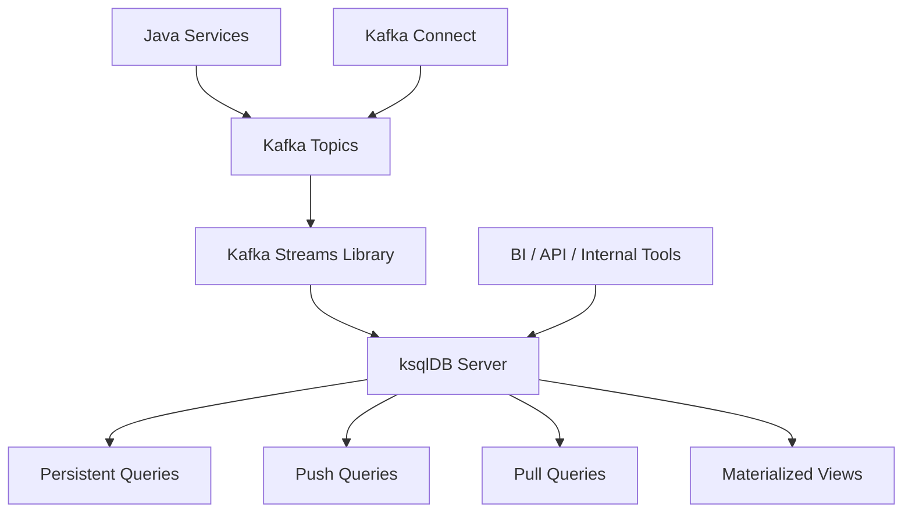
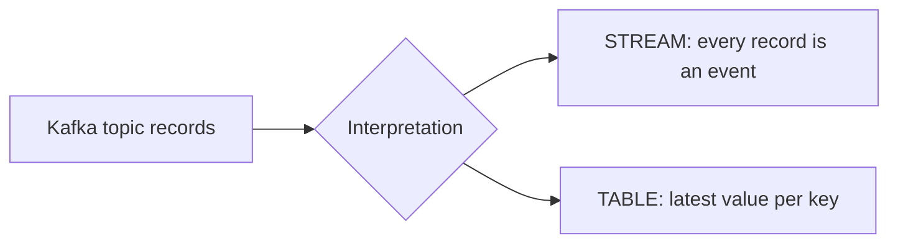
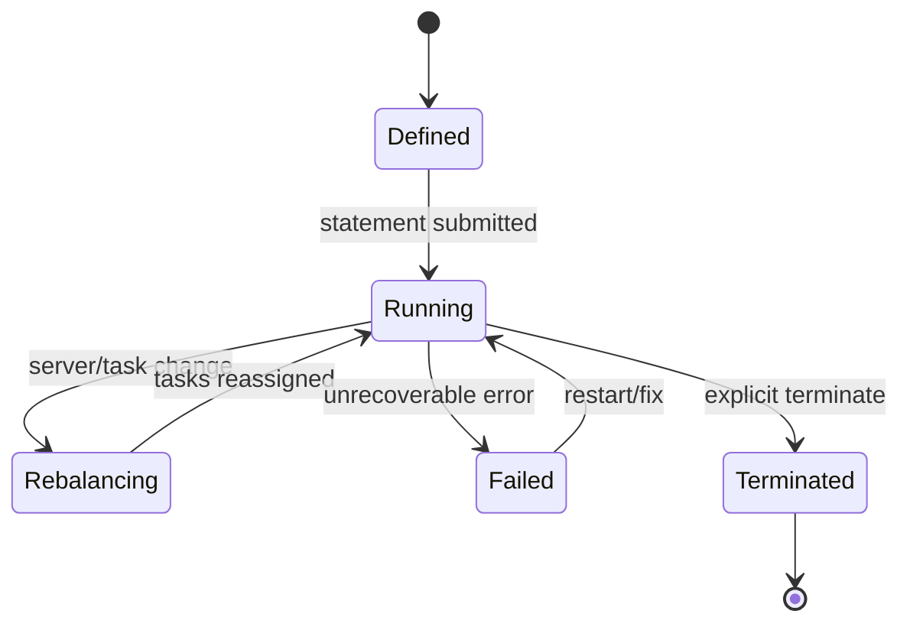
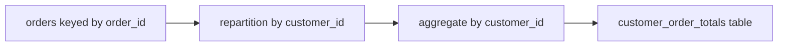
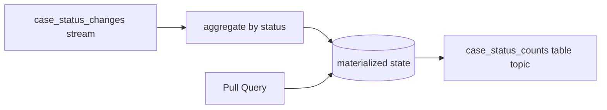
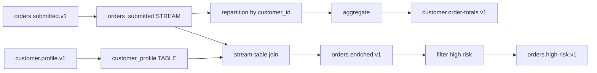
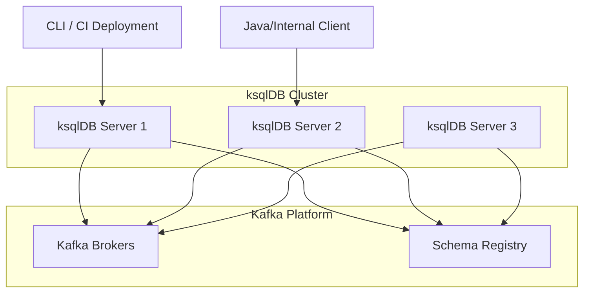
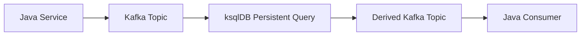
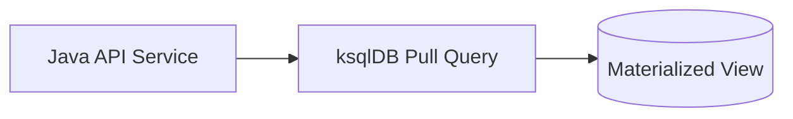
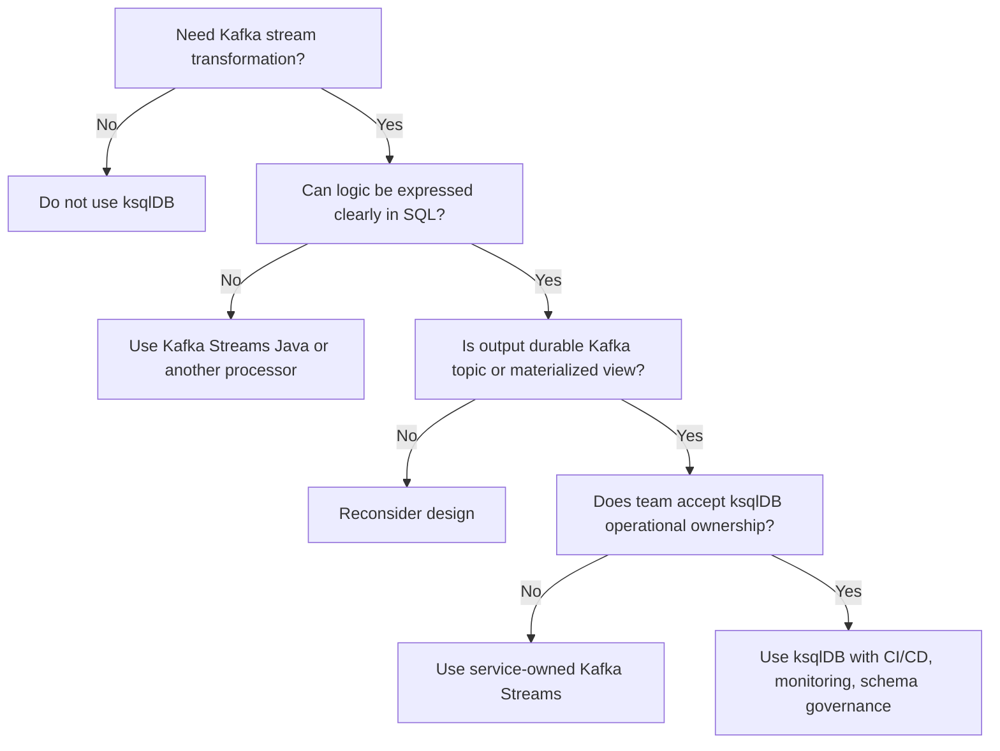

# Part 022 — ksqlDB Mental Model

Part 021 closed the Kafka Streams correctness block with exactly-once stream processing. Now we move to ksqlDB.

ksqlDB is often explained as “SQL for Kafka.” That is true, but incomplete.

A better mental model is:

> ksqlDB is a server-managed stream processing layer that lets teams define Kafka Streams-style transformations, tables, materialized views, and continuous queries using SQL.

It is not a generic relational database. It is not a replacement for every Kafka Streams Java app. It is not a free abstraction over partitioning, key design, time semantics, schema compatibility, or operational ownership.

It is powerful when used in the right boundary.

---

## 1. Kaufman Skill Decomposition

The target skill is **knowing when and how to use ksqlDB without hiding Kafka semantics from yourself**.

| Subskill | Production Meaning |
|---|---|
| SQL-over-streams mental model | Understand that SQL statements compile into persistent streaming work. |
| STREAM vs TABLE | Know the difference between immutable event stream and changelog/latest-state table. |
| Query type selection | Choose persistent, push, or pull query based on access pattern. |
| Materialized view thinking | Understand derived tables as continuously updated state. |
| Key/value/schema discipline | Control Kafka key, value format, serialization, schema evolution, and repartitioning. |
| Runtime boundary | Know that ksqlDB runs as a server cluster and uses Kafka Streams under the hood. |
| Operational ownership | Manage queries, state, scaling, ACLs, monitoring, and upgrades. |
| Java integration | Know when Java services should call ksqlDB and when they should own Kafka Streams logic. |
| Limit awareness | Avoid using ksqlDB for side effects, opaque business workflows, or complex custom processors. |
| Review discipline | Challenge “just write SQL” designs that ignore topology and failure semantics. |

### 1.1 Practice Goal

By the end of this part, you should be able to:

- explain ksqlDB using Kafka Streams concepts;
- model streams and tables correctly;
- distinguish persistent, push, and pull queries;
- decide between ksqlDB, Kafka Streams, Kafka Connect, and normal Java services;
- identify hidden repartitioning and stateful query costs;
- design a small production-grade ksqlDB topology.

---

## 2. Where ksqlDB Sits in the Kafka Stack



ksqlDB is built on top of Kafka Streams. That means many concepts from Parts 017–021 still apply:

- topics;
- keys;
- partitions;
- Serdes;
- stream/table duality;
- state stores;
- changelog topics;
- repartitioning;
- windowing;
- joins;
- processing guarantees.

The syntax changes. The distributed systems reality does not.

---

## 3. ksqlDB Is Not a Traditional Database

A relational database usually answers queries over stored tables.

ksqlDB processes rows as events flow through Kafka topics.

| Concept | Relational Database | ksqlDB |
|---|---|---|
| Data source | Tables stored in DB | Kafka topics |
| Query style | Mostly finite query over current data | Continuous or streaming query over event flow |
| State | Database storage engine | Kafka Streams state stores + Kafka topics |
| Mutation | SQL insert/update/delete | Events/changelog records in Kafka |
| Scaling unit | DB server/partitioning | Kafka partitions + ksqlDB tasks |
| Consistency boundary | DB transaction | Kafka/Streams processing boundary |
| Query lifecycle | Query runs and returns | Persistent query may run indefinitely |

The danger is importing relational assumptions into event streaming.

---

## 4. The Two Core Abstractions: STREAM and TABLE

ksqlDB has two foundational logical abstractions:

- `STREAM`
- `TABLE`

They map closely to Kafka Streams concepts:

| ksqlDB | Kafka Streams Equivalent | Meaning |
|---|---|---|
| `STREAM` | `KStream` | Sequence of independent events/facts. |
| `TABLE` | `KTable` | Changelog/latest value per key. |

### 4.1 STREAM Mental Model

A stream is an append-only sequence of events.

Examples:

- `OrderSubmitted`
- `PaymentAuthorized`
- `CaseEscalated`
- `ShipmentDelayed`
- `UserClicked`

A stream asks:

> What happened?

Example:

```sql
CREATE STREAM orders_submitted (
  order_id STRING KEY,
  customer_id STRING,
  amount_cents BIGINT,
  submitted_at BIGINT
) WITH (
  KAFKA_TOPIC='orders.submitted.v1',
  VALUE_FORMAT='AVRO'
);
```

This statement does not copy all data into a traditional table. It declares a logical schema over a Kafka topic.

### 4.2 TABLE Mental Model

A table represents latest state per key.

Examples:

- latest customer profile;
- current account balance projection;
- current case status;
- latest device configuration;
- product catalog by SKU.

A table asks:

> What is the current value for this key?

Example:

```sql
CREATE TABLE customer_profile (
  customer_id STRING PRIMARY KEY,
  segment STRING,
  risk_tier STRING,
  updated_at BIGINT
) WITH (
  KAFKA_TOPIC='customer.profile.v1',
  VALUE_FORMAT='AVRO'
);
```

A table topic is usually compacted because older values for a key can be superseded by newer values.

---

## 5. Stream-Table Duality

The same Kafka topic can often be interpreted as either:

- a log of events;
- a changelog of state.



Example records:

```text
key=c-1 value={segment=bronze, risk=low}
key=c-1 value={segment=silver, risk=medium}
key=c-2 value={segment=gold, risk=low}
```

As a stream:

- three profile change events happened.

As a table:

- current `c-1` profile is `silver/medium`;
- current `c-2` profile is `gold/low`.

Choosing STREAM vs TABLE is not syntax preference. It is semantic commitment.

---

## 6. Query Types

ksqlDB has three major query types:

1. persistent queries;
2. push queries;
3. pull queries.

### 6.1 Persistent Queries

Persistent queries run continuously on the server and write results to Kafka topics.

They are created using statements like:

- `CREATE STREAM AS SELECT`;
- `CREATE TABLE AS SELECT`;
- `INSERT INTO ... SELECT`.

Example:

```sql
CREATE STREAM high_value_orders AS
SELECT
  order_id,
  customer_id,
  amount_cents
FROM orders_submitted
WHERE amount_cents >= 1000000
EMIT CHANGES;
```

This creates a continuously running transformation. New matching input records produce output records.

### 6.2 Push Queries

Push queries subscribe to continuous changes and stream results back to the client.

Example:

```sql
SELECT order_id, customer_id, amount_cents
FROM high_value_orders
EMIT CHANGES;
```

Use push queries for:

- live dashboards;
- debugging;
- internal operational views;
- streaming query clients that can handle continuous results.

Do not use push queries as a casual substitute for a durable application integration if another service needs reliable processing. For service-to-service integration, Kafka topics are usually the durable contract.

### 6.3 Pull Queries

Pull queries read current state from materialized tables.

Example:

```sql
SELECT customer_id, total_amount_cents
FROM customer_order_totals
WHERE customer_id = 'c-123';
```

Use pull queries for:

- low-latency lookup by key;
- operational inspection;
- lightweight serving over materialized views;
- API read models when constraints fit.

Pull queries require materialized state. They are not arbitrary full-table analytical scans.

---

## 7. Persistent Query Lifecycle

A persistent query has a lifecycle.



Operationally, a persistent query is closer to a deployed stream processor than to a one-off SQL statement.

You must think about:

- ownership;
- deployment pipeline;
- schema compatibility;
- output topic naming;
- state storage;
- query restart;
- monitoring;
- rollback;
- access control.

---

## 8. Source, Sink, and Derived Objects

### 8.1 Source STREAM/TABLE

A source object declares schema over an existing Kafka topic.

```sql
CREATE STREAM orders_submitted (
  order_id STRING KEY,
  customer_id STRING,
  amount_cents BIGINT,
  submitted_at BIGINT
) WITH (
  KAFKA_TOPIC='orders.submitted.v1',
  VALUE_FORMAT='AVRO'
);
```

### 8.2 Derived STREAM

A derived stream writes to a new Kafka topic.

```sql
CREATE STREAM expensive_orders
WITH (
  KAFKA_TOPIC='orders.expensive.v1',
  VALUE_FORMAT='AVRO'
) AS
SELECT
  order_id,
  customer_id,
  amount_cents
FROM orders_submitted
WHERE amount_cents >= 1000000
EMIT CHANGES;
```

### 8.3 Derived TABLE

A derived table materializes state.

```sql
CREATE TABLE customer_order_totals
WITH (
  KAFKA_TOPIC='customer.order-totals.v1',
  VALUE_FORMAT='AVRO'
) AS
SELECT
  customer_id,
  COUNT(*) AS order_count,
  SUM(amount_cents) AS total_amount_cents
FROM orders_submitted
GROUP BY customer_id
EMIT CHANGES;
```

This table is not static. It is continuously updated as new orders arrive.

---

## 9. Keys Matter More Than SQL Makes It Look

SQL can hide partitioning. Production cannot.

If a query groups by or joins on a different key than the source topic key, ksqlDB may need repartitioning.

```sql
CREATE TABLE customer_order_totals AS
SELECT
  customer_id,
  COUNT(*) AS order_count,
  SUM(amount_cents) AS total_amount_cents
FROM orders_submitted
GROUP BY customer_id
EMIT CHANGES;
```

If `orders_submitted` is keyed by `order_id`, grouping by `customer_id` changes the key. That requires data redistribution.



### 9.1 Review Questions

Ask:

- What is the input topic key?
- What is the output key?
- Does this query repartition?
- How many partitions does the output topic have?
- Are both sides of a join co-partitioned?
- Is the key stable and high-cardinality enough?
- Does the key match downstream lookup/access patterns?

---

## 10. Value Format and Schema

Common formats include:

- Avro;
- Protobuf;
- JSON Schema;
- JSON;
- primitive formats for simple keys/values.

For production event systems, prefer schema-managed formats with Schema Registry where possible.

Example:

```sql
CREATE STREAM payments_authorized (
  payment_id STRING KEY,
  order_id STRING,
  amount_cents BIGINT,
  authorized_at BIGINT
) WITH (
  KAFKA_TOPIC='payments.authorized.v1',
  VALUE_FORMAT='AVRO'
);
```

### 10.1 Key Format vs Value Format

Do not assume key format is the same as value format.

You may need to specify:

```sql
WITH (
  KAFKA_TOPIC='orders.submitted.v1',
  KEY_FORMAT='KAFKA',
  VALUE_FORMAT='AVRO'
)
```

The key is part of the partitioning and table identity model. Treat it as first-class schema.

---

## 11. Materialized Views

A materialized view in ksqlDB is a continuously maintained table derived from streams/tables.

Example:

```sql
CREATE TABLE case_status_counts AS
SELECT
  status,
  COUNT(*) AS case_count
FROM case_status_changes
GROUP BY status
EMIT CHANGES;
```

Mental model:



Materialized views are useful for serving current state, but they have operational cost:

- state storage;
- changelog topics;
- restore time;
- repartition topics;
- query compatibility;
- key design constraints.

---

## 12. ksqlDB vs Kafka Streams Java

| Use ksqlDB When | Use Kafka Streams Java When |
|---|---|
| Transformation is expressible in SQL. | Logic needs custom Java code or libraries. |
| Team benefits from declarative SQL. | Strong type-safe domain model is needed. |
| You want fast iteration for stream/table derivation. | You need complex testing, custom processors, or advanced state control. |
| Operational team can manage ksqlDB queries. | Service team owns code, lifecycle, and deployment. |
| Output is Kafka stream/table. | Logic integrates deeply with service internals. |
| Query is mostly filtering, projection, aggregation, join. | Logic includes non-trivial algorithms, workflow, external policies. |

### 12.1 A Useful Boundary

ksqlDB is excellent for:

- derived topics;
- materialized views;
- stream-table enrichment;
- operational projections;
- real-time aggregations;
- SQL-accessible transformation pipelines.

Kafka Streams Java is better for:

- custom state machines;
- complex domain rules;
- custom processors;
- advanced testing and packaging discipline;
- library integration;
- fine-grained error handling;
- strongly governed service code.

---

## 13. ksqlDB vs Kafka Connect

| Use Kafka Connect | Use ksqlDB |
|---|---|
| Move data between Kafka and external systems. | Transform/query data already in Kafka. |
| Source/sink integration. | Filtering, joining, aggregating, materializing. |
| Connector lifecycle and offset management. | Query lifecycle and state management. |
| JDBC, Debezium, S3, Elasticsearch, etc. | Stream/table SQL over Kafka topics. |

Bad design:

```text
Use ksqlDB to simulate a connector by calling external APIs.
```

ksqlDB is not a general side-effect execution engine.

---

## 14. ksqlDB vs Flink/Spark

ksqlDB is Kafka-native and convenient for many Kafka-centered workloads. But it is not always the right general stream processing engine.

Consider other engines when you need:

- very complex event-time processing;
- advanced batch/stream unification;
- large analytical state with lakehouse integration;
- specialized operators unavailable in ksqlDB;
- broader ecosystem integration outside Kafka-centered architecture.

The point is not tool loyalty. The point is semantic fit.

---

## 15. Example: Order Risk Pipeline

### 15.1 Source Stream

```sql
CREATE STREAM orders_submitted (
  order_id STRING KEY,
  customer_id STRING,
  amount_cents BIGINT,
  submitted_at BIGINT
) WITH (
  KAFKA_TOPIC='orders.submitted.v1',
  VALUE_FORMAT='AVRO'
);
```

### 15.2 Source Table

```sql
CREATE TABLE customer_profile (
  customer_id STRING PRIMARY KEY,
  risk_tier STRING,
  segment STRING,
  updated_at BIGINT
) WITH (
  KAFKA_TOPIC='customer.profile.v1',
  VALUE_FORMAT='AVRO'
);
```

### 15.3 Enriched Stream

```sql
CREATE STREAM enriched_orders
WITH (
  KAFKA_TOPIC='orders.enriched.v1',
  VALUE_FORMAT='AVRO'
) AS
SELECT
  o.order_id,
  o.customer_id,
  o.amount_cents,
  p.risk_tier,
  p.segment
FROM orders_submitted o
LEFT JOIN customer_profile p
  ON o.customer_id = p.customer_id
EMIT CHANGES;
```

### 15.4 Aggregated Table

```sql
CREATE TABLE customer_order_totals
WITH (
  KAFKA_TOPIC='customer.order-totals.v1',
  VALUE_FORMAT='AVRO'
) AS
SELECT
  customer_id,
  COUNT(*) AS order_count,
  SUM(amount_cents) AS total_amount_cents
FROM orders_submitted
GROUP BY customer_id
EMIT CHANGES;
```

### 15.5 High-Risk Stream

```sql
CREATE STREAM high_risk_orders
WITH (
  KAFKA_TOPIC='orders.high-risk.v1',
  VALUE_FORMAT='AVRO'
) AS
SELECT
  order_id,
  customer_id,
  amount_cents,
  risk_tier
FROM enriched_orders
WHERE risk_tier = 'HIGH' OR amount_cents >= 1000000
EMIT CHANGES;
```

---

## 16. Hidden Topology Behind the SQL

The SQL looks simple. The runtime topology is not trivial.



Review the generated/executed topology like you would review Kafka Streams code.

---

## 17. Query Naming and Ownership

Every persistent query should have an owner.

Bad ownership:

```text
Someone created a ksqlDB query for a dashboard; now production depends on it.
```

Better ownership metadata:

```text
query: customer_order_totals_v1
owner: orders-platform-team
purpose: materialized customer order total for risk scoring
input: orders.submitted.v1
output: customer.order-totals.v1
sla: p95 update latency <= 5 seconds
runbook: docs/runbooks/customer-order-totals.md
```

### 17.1 Naming Guidelines

Use names that reveal semantics:

- `orders_submitted` for source stream;
- `customer_order_totals` for aggregate table;
- `orders_high_risk` for derived stream;
- avoid generic names like `stream1`, `test_table`, `query2`.

---

## 18. Deployment Architecture

A ksqlDB deployment usually contains:

- one or more ksqlDB server instances;
- Kafka cluster;
- Schema Registry if using schema-managed formats;
- state storage for ksqlDB/Kafka Streams tasks;
- REST API access;
- CLI or deployment automation;
- monitoring and logs.



### 18.1 State Storage

Because ksqlDB uses Kafka Streams, stateful queries need local state storage. Treat storage as part of the production design.

Consider:

- disk size;
- disk performance;
- restore time;
- pod restart behavior;
- state directory lifecycle;
- changelog topic retention;
- availability during rebalances.

---

## 19. Processing Guarantees

ksqlDB can use Kafka Streams processing guarantees. The key options conceptually map to:

- at-least-once;
- exactly-once v2.

Exactly-once in ksqlDB has the same boundary principle as Part 021:

> it covers Kafka/Streams processing, not arbitrary external business effects.

Use exactly-once with care and measure overhead.

---

## 20. Pull Query as Serving Layer

A materialized table can serve key-based lookups.

Example:

```sql
SELECT customer_id, total_amount_cents
FROM customer_order_totals
WHERE customer_id = 'c-1001';
```

This can be useful for internal APIs.

But review:

- expected QPS;
- p95/p99 latency;
- key cardinality;
- consistency expectations;
- availability requirements;
- security model;
- fallback behavior;
- query routing;
- operational ownership.

A pull query can be convenient, but a high-SLO production API may still require a dedicated read model service.

---

## 21. Push Query as Live Stream View

A push query continuously emits changes.

```sql
SELECT *
FROM high_risk_orders
EMIT CHANGES;
```

Use for:

- live debugging;
- operational monitoring;
- real-time console views;
- exploratory stream inspection.

Be careful using it for core service integration. Durable integration usually belongs on Kafka topics, not transient client connections.

---

## 22. Time Semantics in ksqlDB

ksqlDB queries inherit Kafka stream-processing time concerns:

- event time;
- processing time;
- window boundaries;
- grace periods;
- late events;
- timestamp columns;
- output finality.

Example windowed aggregate:

```sql
CREATE TABLE orders_per_customer_5m AS
SELECT
  customer_id,
  COUNT(*) AS order_count,
  SUM(amount_cents) AS amount_sum
FROM orders_submitted
WINDOW TUMBLING (SIZE 5 MINUTES, GRACE PERIOD 2 MINUTES)
GROUP BY customer_id
EMIT CHANGES;
```

Review questions:

- Which timestamp determines event time?
- What happens to late records?
- Is output intermediate or final?
- Does the consumer understand windowed keys?
- What is the retention policy?

---

## 23. Joins in ksqlDB

ksqlDB supports stream/table style joins, but the same semantics from Kafka Streams apply.

### 23.1 Stream-Table Enrichment

```sql
CREATE STREAM enriched_orders AS
SELECT
  o.order_id,
  o.customer_id,
  o.amount_cents,
  p.risk_tier
FROM orders_submitted o
LEFT JOIN customer_profile p
  ON o.customer_id = p.customer_id
EMIT CHANGES;
```

This joins each order event with current customer profile state.

Caution:

- this is not necessarily profile-as-of-order-time;
- key alignment matters;
- table must be materialized;
- late profile updates do not necessarily rewrite past stream events.

### 23.2 Stream-Stream Join

Use when both sides are event streams and temporal proximity matters.

```sql
CREATE STREAM paid_orders AS
SELECT
  o.order_id,
  o.customer_id,
  p.payment_id,
  p.amount_cents
FROM orders_submitted o
JOIN payments_authorized p
  WITHIN 10 MINUTES
  ON o.order_id = p.order_id
EMIT CHANGES;
```

Review:

- join window;
- grace period;
- out-of-order events;
- duplicate events;
- repartitioning;
- output identity.

---

## 24. Error Handling Mental Model

ksqlDB reduces code but does not remove bad data.

Potential failure classes:

- deserialization error;
- incompatible schema;
- null key where table requires key;
- malformed timestamp;
- join key mismatch;
- repartition topic ACL issue;
- state store restore failure;
- output topic schema registration failure;
- query termination due to unrecoverable runtime error.

Operational design should include:

- query status monitoring;
- processing log inspection;
- schema compatibility pipeline;
- DLQ/error handling strategy where applicable;
- replay/backfill plan;
- query migration plan.

---

## 25. Java Integration Patterns

Java services can interact with ksqlDB in several ways.

### 25.1 Prefer Kafka Topics for Durable Integration



This is the most Kafka-native integration style.

### 25.2 Use Pull Query for Lookup When Appropriate



Use this when:

- lookup is key-based;
- latency is acceptable;
- ksqlDB availability is part of API dependency model;
- ownership is clear.

### 25.3 Avoid ksqlDB as Hidden Business Logic Dump

If your Java service cannot explain why a decision happened because the logic lives in ad hoc SQL owned by no team, the architecture is weak.

---

## 26. Governance and CI/CD

Do not manually paste production SQL forever.

Treat ksqlDB statements as deployable artifacts:

```text
ksql/
  001-create-orders-submitted.sql
  002-create-customer-profile.sql
  003-create-enriched-orders.sql
  004-create-customer-order-totals.sql
  005-create-high-risk-orders.sql
```

CI/CD should check:

- syntax;
- schema compatibility;
- topic naming;
- ownership metadata;
- ACL requirements;
- expected internal topics;
- migration/rollback plan;
- query ID tracking;
- destructive changes.

### 26.1 Migration Discipline

For non-trivial changes:

1. create new output topic/version;
2. deploy new query;
3. backfill if needed;
4. dual-run and compare;
5. move consumers;
6. terminate old query;
7. archive old topic/state if allowed.

---

## 27. Security Model

ksqlDB needs permissions against Kafka resources.

Review:

- who can create/drop streams and tables;
- who can run pull/push queries;
- who can terminate persistent queries;
- which topics ksqlDB can read;
- which output topics it can write;
- permissions for internal/repartition/changelog topics;
- Schema Registry access;
- secrets management;
- audit logging.

A powerful SQL interface over production Kafka is also a powerful risk surface.

---

## 28. Observability

Monitor both query-level and Kafka-level signals.

### 28.1 Query-Level

- query status;
- error messages;
- rows processed rate;
- rows emitted rate;
- persistent query lag;
- state store size;
- query restarts;
- failed deserialization count.

### 28.2 Kafka-Level

- input topic lag;
- output topic production rate;
- repartition topic volume;
- changelog topic volume;
- broker request latency;
- Schema Registry errors;
- ACL authorization failures.

### 28.3 Business-Level

- expected vs actual output count;
- aggregate drift;
- missing keys;
- duplicate keys where uniqueness is expected;
- stale materialized view age;
- late event rate.

---

## 29. Anti-Patterns

### 29.1 “It Is SQL, So It Is Simple”

The SQL is simple. The topology may not be.

Always review partitioning, state, and query lifecycle.

### 29.2 Unowned Persistent Queries

A persistent query is production software. It needs an owner.

### 29.3 Using Pull Queries for Arbitrary Analytics

Pull queries are not a general warehouse query engine.

### 29.4 Ignoring Key Format

Many ksqlDB problems come from treating key as incidental. Key is identity, partitioning, and table lookup boundary.

### 29.5 Reusing One Mega ksqlDB Cluster for Everything

Separate blast radius if workloads have very different SLOs, data sensitivity, or ownership.

### 29.6 Treating Derived Topics as Temporary

If another service consumes the derived topic, it is a contract.

### 29.7 Hiding Critical Business Rules in Ad Hoc SQL

If logic is critical, it must be versioned, reviewed, tested, observable, and owned.

---

## 30. Decision Framework



---

## 31. Architecture Review Checklist

### 31.1 Semantics

- [ ] Is each object correctly modeled as STREAM or TABLE?
- [ ] What business meaning does each record carry?
- [ ] Are tombstones/deletes expected?
- [ ] Is output a fact event, projection, or intermediate topic?

### 31.2 Keys and Partitions

- [ ] What is the key of each input topic?
- [ ] What is the key of each output topic?
- [ ] Does the query repartition?
- [ ] Are joins co-partitioned where required?
- [ ] Are keys compatible with pull query access patterns?

### 31.3 State

- [ ] Which queries materialize state?
- [ ] What is the estimated state size?
- [ ] What is the restore time target?
- [ ] What changelog/internal topics are created?
- [ ] What happens during rebalance?

### 31.4 Operations

- [ ] Who owns the query?
- [ ] How is SQL deployed?
- [ ] How is rollback handled?
- [ ] What metrics and alerts exist?
- [ ] What ACLs are needed?
- [ ] What happens if query fails?

### 31.5 Evolution

- [ ] Is output schema versioned?
- [ ] Is compatibility checked?
- [ ] Can consumers migrate safely?
- [ ] Is there a backfill plan?
- [ ] Are old queries terminated safely?

---

## 32. ADR Template

```md
# ADR: Use ksqlDB for <Pipeline/View Name>

## Context
- Source topics:
- Source STREAM/TABLE objects:
- Derived objects:
- Output topics:
- Consumers:
- Required latency:
- Required correctness:

## Decision
We will use ksqlDB to implement <persistent query/materialized view>.

## Rationale
- Why SQL is sufficient:
- Why Kafka Streams Java is not required:
- Why Kafka Connect is not the right boundary:
- Operational ownership:

## Semantics
- STREAM/TABLE choices:
- Key design:
- Window/time semantics:
- Join semantics:
- Processing guarantee:

## Operations
- Deployment method:
- Query owner:
- Monitoring:
- Alerts:
- Runbook:
- Rollback:

## Evolution
- Schema compatibility:
- Topic versioning:
- Migration plan:
- Backfill plan:

## Consequences
- Benefits:
- Risks:
- Follow-up actions:
```

---

## 33. Deliberate Practice

### Exercise 1 — Classify Objects

Classify each as STREAM or TABLE:

1. `OrderSubmitted`
2. `CustomerProfileUpdated`
3. latest customer profile by ID
4. case status transition events
5. current case status by case ID
6. payment authorization events
7. current account balance projection

Explain why.

### Exercise 2 — Find Hidden Repartition

Input topic `orders.submitted.v1` is keyed by `order_id`.

Query:

```sql
CREATE TABLE customer_totals AS
SELECT customer_id, SUM(amount_cents) AS total
FROM orders_submitted
GROUP BY customer_id
EMIT CHANGES;
```

Questions:

- Does this repartition?
- What should the output key be?
- What is the operational cost?
- What happens if one customer is extremely hot?

### Exercise 3 — Choose Runtime

Choose ksqlDB, Kafka Streams Java, Kafka Connect, or normal Java service:

1. JDBC database to Kafka CDC ingestion.
2. Filter high-value orders into a derived Kafka topic.
3. Complex regulatory case state machine with custom transition guards.
4. Materialized customer order total by customer ID.
5. Call third-party payment API for each approved payment.
6. Join order stream with current customer profile.

---

## 34. Summary

ksqlDB is best understood as a declarative stream processing runtime over Kafka.

The key invariants are:

- STREAM means event sequence;
- TABLE means latest state/changelog by key;
- persistent queries are production workloads;
- keys and partitions still matter;
- materialized views imply state, changelog, restore, and ownership;
- ksqlDB is built on Kafka Streams, so stream-processing semantics still apply;
- SQL reduces code, not distributed systems complexity.

A mid-level engineer can write ksqlDB queries.

A top-tier engineer can review the hidden topology behind the SQL.

---

## 35. References

- ksqlDB Overview, Confluent Documentation — https://docs.confluent.io/platform/current/ksqldb/overview.html
- Architecture of ksqlDB, Confluent Documentation — https://docs.confluent.io/platform/current/ksqldb/operate-and-deploy/how-it-works.html
- ksqlDB Queries, Confluent Documentation — https://docs.confluent.io/platform/current/ksqldb/concepts/queries.html
- ksqlDB Stream Processing Concepts, Confluent Documentation — https://docs.confluent.io/platform/current/ksqldb/concepts/overview.html
- ksqlDB Processing Guarantees, Confluent Documentation — https://docs.confluent.io/platform/current/ksqldb/operate-and-deploy/processing-guarantees.html
- Kafka Streams Documentation — https://kafka.apache.org/documentation/streams/
