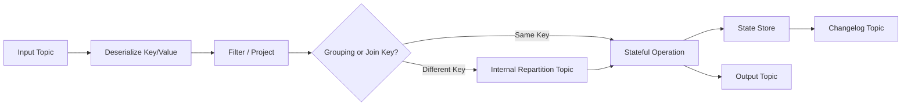
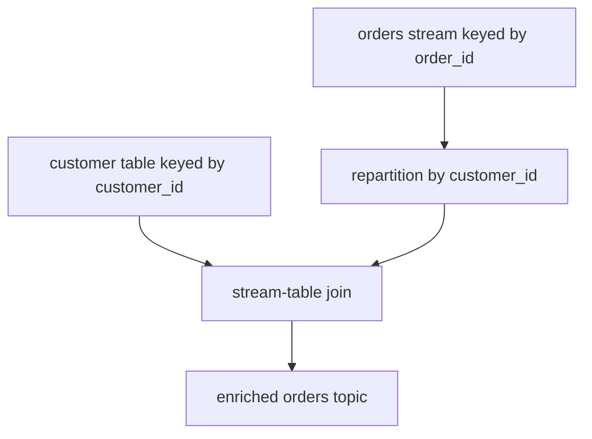
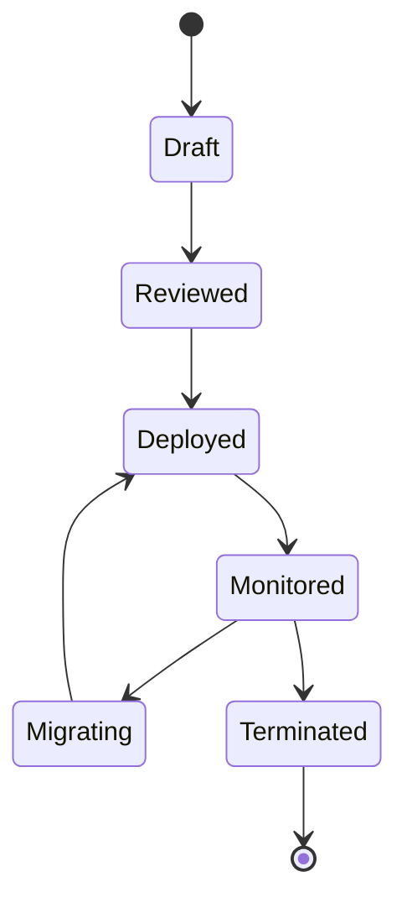
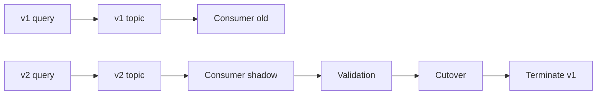
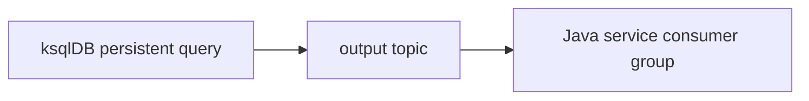
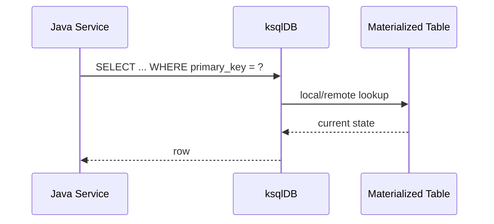
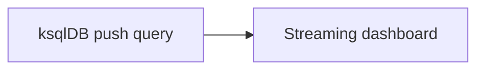

# Part 023 — ksqlDB Stream/Table Query Design

Part 022 built the ksqlDB mental model: ksqlDB is not a relational database that happens to talk to Kafka. It is a server-managed stream processing runtime that exposes Kafka Streams-like behavior through SQL.

This part turns that mental model into query design discipline.

The core idea:

> A ksqlDB statement is not just SQL text. It is an executable topology over Kafka topics, keys, partitions, schemas, state stores, and changelog topics.

A weak engineer sees:

```sql
SELECT customer_id, SUM(amount) FROM orders GROUP BY customer_id;
```

A strong engineer sees:

- source topic format;
- key format;
- repartition boundary;
- state store size;
- changelog topic;
- restore time;
- output topic contract;
- query ownership;
- late event behavior;
- schema compatibility;
- backfill/replay plan;
- operational blast radius.

That is the level of thinking we want.

---

## 1. Kaufman Skill Decomposition

The target skill is **designing ksqlDB queries as production stream topologies**.

| Subskill | Production Meaning |
|---|---|
| Source registration | Know when `CREATE STREAM`/`CREATE TABLE` only registers an existing Kafka topic. |
| Derived topology design | Know when `CREATE STREAM AS SELECT` and `CREATE TABLE AS SELECT` create new output topics and persistent work. |
| Key discipline | Control Kafka key, logical primary key, join key, grouping key, and repartitioning. |
| Stream/table selection | Model immutable events as streams and latest state/changelog as tables. |
| Join semantics | Choose stream-stream, stream-table, or table-table joins based on time and state. |
| Windowing | Use tumbling, hopping, and session windows with explicit late-event policy. |
| Aggregation finality | Understand update streams, changelog tables, suppression-like behavior, and output semantics. |
| Materialized views | Design pull-queryable tables intentionally. |
| Query lifecycle | Deploy, version, pause, terminate, migrate, and roll back persistent queries. |
| Operational review | Estimate cost: partitions, state, restore, hidden topics, lag, CPU, memory, disk. |

### 1.1 Practice Goal

By the end of this part, you should be able to:

- design a ksqlDB query and predict its underlying Kafka topology;
- explain whether a query emits a stream, a table, or a materialized view;
- identify hidden repartitioning before production;
- select the correct join type;
- design windowed aggregations with late data handling;
- write query migrations safely;
- decide when ksqlDB should be rejected in favor of Java Kafka Streams.

---

## 2. The Query Design Invariant

Use this invariant:

> Every ksqlDB query must have an explicitly reviewed input contract, key contract, output contract, state contract, and operational owner.

Do not approve a production ksqlDB query until these five questions are answered:

| Contract | Question |
|---|---|
| Input | Which Kafka topics are read, and what schema/key formats do they use? |
| Key | What field is the Kafka key at each stage? |
| Output | What topic/object does the query create, and who consumes it? |
| State | Does the query create local state, changelog topics, or repartition topics? |
| Owner | Which team owns query deployment, alerting, schema evolution, and rollback? |

SQL text is the visible part. The topology is the real system.

---

## 3. ksqlDB Object Types

ksqlDB has two primary logical object types:

| Object | Mental Model | Backed By | Usually Used For |
|---|---|---|---|
| `STREAM` | sequence of immutable facts | Kafka topic | events, commands, notifications, CDC events |
| `TABLE` | latest state by key / changelog | Kafka topic | profile, balance, status, aggregate view |

A stream says:

> These rows happened.

A table says:

> For this key, this is the current value.

This distinction controls joins, aggregations, deletion behavior, query output, and pull-query eligibility.

---

## 4. Registering vs Deriving

ksqlDB has two different categories of DDL-like statements.

### 4.1 Register Existing Topic

`CREATE STREAM` or `CREATE TABLE` registers an existing Kafka topic with ksqlDB metadata.

```sql
CREATE STREAM orders_submitted (
  order_id STRING KEY,
  customer_id STRING,
  amount_cents BIGINT,
  submitted_at STRING
) WITH (
  KAFKA_TOPIC = 'commerce.orders.submitted.v1',
  VALUE_FORMAT = 'AVRO',
  KEY_FORMAT = 'KAFKA'
);
```

This does not necessarily create a new transformation.

It tells ksqlDB:

- where the topic is;
- how to deserialize key/value;
- which columns exist;
- whether the object should be treated as stream or table.

### 4.2 Derive New Topic and Persistent Query

`CREATE STREAM AS SELECT` or `CREATE TABLE AS SELECT` creates a new persistent query and output topic.

```sql
CREATE STREAM high_value_orders
WITH (
  KAFKA_TOPIC = 'commerce.orders.high-value.v1',
  VALUE_FORMAT = 'AVRO',
  PARTITIONS = 12
) AS
SELECT
  order_id,
  customer_id,
  amount_cents
FROM orders_submitted
WHERE amount_cents >= 1000000
EMIT CHANGES;
```

This is production work.

It introduces:

- long-running processing;
- new Kafka output topic;
- query lifecycle;
- offset progress;
- scaling behavior;
- monitoring requirement;
- failure and restart behavior.

---

## 5. The Hidden Topology Behind SQL

A simple ksqlDB query can represent multiple runtime stages.



The most important hidden operation is repartitioning.

If the query groups or joins by a field that is not already the Kafka key, ksqlDB may need to redistribute records so rows with the same logical key arrive at the same processing task.

Repartition is not bad.

Unreviewed repartition is bad.

---

## 6. Key Design in ksqlDB

A Kafka topic has a physical key. ksqlDB has logical key columns. These must be aligned deliberately.

### 6.1 Why Key Matters

The key controls:

- partition placement;
- per-key ordering;
- aggregation grouping;
- table primary key;
- stream-table join correctness;
- changelog compaction;
- pull query lookup shape;
- state store layout.

### 6.2 Example: Bad Key for Customer Aggregation

Input topic:

| Field | Value |
|---|---|
| Kafka key | `order_id` |
| value.customer_id | `C-100` |
| value.amount_cents | `250000` |

Query:

```sql
CREATE TABLE customer_order_totals AS
SELECT
  customer_id,
  SUM(amount_cents) AS total_amount_cents
FROM orders_submitted
GROUP BY customer_id
EMIT CHANGES;
```

The grouping key is `customer_id`, not `order_id`.

ksqlDB must co-locate all rows for each customer. That requires repartitioning unless the source is already keyed by `customer_id`.

### 6.3 Better Design

Make the repartition explicit as a product-level design decision.

```sql
CREATE STREAM orders_by_customer
WITH (
  KAFKA_TOPIC = 'commerce.orders.by-customer.v1',
  VALUE_FORMAT = 'AVRO',
  PARTITIONS = 24
) AS
SELECT *
FROM orders_submitted
PARTITION BY customer_id
EMIT CHANGES;
```

Then aggregate:

```sql
CREATE TABLE customer_order_totals
WITH (
  KAFKA_TOPIC = 'commerce.customer-order-totals.v1',
  VALUE_FORMAT = 'AVRO'
) AS
SELECT
  customer_id,
  COUNT(*) AS order_count,
  SUM(amount_cents) AS total_amount_cents
FROM orders_by_customer
GROUP BY customer_id
EMIT CHANGES;
```

This makes the cost visible and governable.

---

## 7. STREAM Query Patterns

STREAM queries model event-to-event transformations.

### 7.1 Projection

```sql
CREATE STREAM order_public_events AS
SELECT
  order_id,
  customer_id,
  amount_cents
FROM orders_submitted
EMIT CHANGES;
```

Use when consumers need a sanitized or narrowed event contract.

### 7.2 Filtering

```sql
CREATE STREAM suspicious_orders AS
SELECT *
FROM orders_submitted
WHERE amount_cents >= 10000000
EMIT CHANGES;
```

Use when a downstream topic represents a meaningful event subset.

### 7.3 Enrichment

```sql
CREATE STREAM enriched_orders AS
SELECT
  o.order_id,
  o.customer_id,
  c.risk_tier,
  o.amount_cents
FROM orders_submitted o
LEFT JOIN customers c
  ON o.customer_id = c.customer_id
EMIT CHANGES;
```

Use when a stream event should carry reference data at processing time.

Be explicit: the enrichment is time-relative. If customer risk tier changes later, old enriched orders are not automatically rewritten.

---

## 8. TABLE Query Patterns

TABLE queries model latest state.

### 8.1 Aggregate Table

```sql
CREATE TABLE customer_order_stats AS
SELECT
  customer_id,
  COUNT(*) AS order_count,
  SUM(amount_cents) AS total_amount_cents,
  MAX(amount_cents) AS max_order_amount_cents
FROM orders_by_customer
GROUP BY customer_id
EMIT CHANGES;
```

This creates a continuously updated table.

Consumers of the output topic see a changelog, not a sequence of independent final facts.

### 8.2 Latest State Table

A table can be built over a compacted topic of latest entity state:

```sql
CREATE TABLE customer_profiles (
  customer_id STRING PRIMARY KEY,
  email STRING,
  risk_tier STRING,
  status STRING
) WITH (
  KAFKA_TOPIC = 'crm.customer-profiles.v1',
  VALUE_FORMAT = 'AVRO',
  KEY_FORMAT = 'KAFKA'
);
```

This represents the current customer profile by `customer_id`.

---

## 9. Persistent Query Output Semantics

A persistent query continuously writes output rows.

For streams:

> Output rows are usually interpreted as new events.

For tables:

> Output rows are usually interpreted as changelog updates.

This difference is subtle but critical.

Example:

```sql
CREATE TABLE customer_totals AS
SELECT customer_id, SUM(amount_cents) AS total
FROM orders_by_customer
GROUP BY customer_id
EMIT CHANGES;
```

If customer `C-100` has three orders, the output topic may contain multiple updates:

| Output Event | Meaning |
|---|---|
| `C-100 -> total=100` | current total after first order |
| `C-100 -> total=300` | current total after second order |
| `C-100 -> total=450` | current total after third order |

A downstream sink must know this is a changelog.

Do not treat every table output row as an independent domain event.

---

## 10. Windowed Aggregation

Windowed aggregation scopes state by key and time interval.

```sql
CREATE TABLE customer_order_totals_5m AS
SELECT
  customer_id,
  COUNT(*) AS order_count,
  SUM(amount_cents) AS total_amount_cents
FROM orders_by_customer
WINDOW TUMBLING (SIZE 5 MINUTES, GRACE PERIOD 2 MINUTES)
GROUP BY customer_id
EMIT CHANGES;
```

Review these parameters:

| Parameter | Meaning |
|---|---|
| window type | tumbling, hopping, session |
| size | duration of window |
| advance interval | for hopping windows |
| inactivity gap | for session windows |
| grace period | how long late events are accepted |
| timestamp source | event timestamp or custom timestamp column |
| retention | how long state must be retained |
| output interpretation | intermediate updates or final-ish results |

### 10.1 Tumbling Window

Use for fixed, non-overlapping time buckets.

Example:

- fraud count per card per 5 minutes;
- API error count per route per minute;
- payment volume per merchant per hour.

### 10.2 Hopping Window

Use for overlapping rolling analysis.

Example:

- suspicious order count over the last 10 minutes, evaluated every 1 minute;
- moving activity count;
- rolling SLA breach detection.

### 10.3 Session Window

Use for activity bursts separated by inactivity.

Example:

- browsing session;
- order editing session;
- case handling session.

---

## 11. Time Semantics in Query Design

A ksqlDB query must define what timestamp means.

Common choices:

| Timestamp | Meaning | Risk |
|---|---|---|
| broker timestamp | when Kafka received/created record | may not equal business time |
| event timestamp field | when business event occurred | requires producer correctness |
| processing time | when ksqlDB processed row | poor for replay consistency |

Prefer event time when business correctness depends on when something actually happened.

Example:

```sql
CREATE STREAM payments_authorized (
  payment_id STRING KEY,
  merchant_id STRING,
  amount_cents BIGINT,
  authorized_at BIGINT
) WITH (
  KAFKA_TOPIC = 'payments.authorized.v1',
  VALUE_FORMAT = 'AVRO',
  TIMESTAMP = 'authorized_at'
);
```

This makes windowing use `authorized_at`.

### 11.1 Failure Case

A payment authorized at 10:01 arrives at Kafka at 10:08.

If the query uses processing time, the payment belongs to the 10:08 window.

If the query uses event time, the payment belongs to the 10:01 window and may be accepted or dropped depending on grace period.

That is a product decision, not just SQL syntax.

---

## 12. Join Types

ksqlDB joins are not all the same.

| Join Type | Inputs | Time Dependency | Typical Use |
|---|---|---|---|
| stream-stream | event + event | window required | correlate events close in time |
| stream-table | event + latest state | stream event timestamp | enrich event with current table value |
| table-table | latest state + latest state | changelog driven | maintain combined current view |

---

## 13. Stream-Stream Join

Stream-stream joins correlate two event streams within a time window.

Example:

```sql
CREATE STREAM payment_order_matches AS
SELECT
  p.payment_id,
  p.order_id,
  o.customer_id,
  p.amount_cents
FROM payments_authorized p
JOIN orders_submitted o
  WITHIN 10 MINUTES
  ON p.order_id = o.order_id
EMIT CHANGES;
```

Use when both sides are events.

Typical questions:

- How long can the second event arrive after the first?
- What happens if one side never arrives?
- Are duplicates possible?
- Is the join key already the Kafka key on both sides?
- Is out-of-order arrival expected?

### 13.1 Stream-Stream Join Failure Modes

| Failure | Cause | Mitigation |
|---|---|---|
| missed match | window too small | tune window/grace based on measured delay |
| huge state | window too large | bound window and monitor state size |
| duplicate matches | duplicate events | event id dedup upstream or downstream |
| repartition storm | join key not co-partitioned | explicitly repartition and size partitions |

---

## 14. Stream-Table Join

Stream-table joins enrich each event with the latest table value at processing time.

Example:

```sql
CREATE STREAM risk_enriched_orders AS
SELECT
  o.order_id,
  o.customer_id,
  c.risk_tier,
  o.amount_cents
FROM orders_by_customer o
LEFT JOIN customer_profiles c
  ON o.customer_id = c.customer_id
EMIT CHANGES;
```

This does not mean:

> join with the customer profile that was valid when the order happened.

It means approximately:

> when the order is processed, look up the current table value by key.

For historical correctness, you may need a temporal model, versioned reference event, or custom Kafka Streams logic.

---

## 15. Table-Table Join

Table-table joins maintain a combined latest-state view.

Example:

```sql
CREATE TABLE customer_account_summary AS
SELECT
  c.customer_id,
  c.status,
  c.risk_tier,
  a.account_status,
  a.balance_cents
FROM customer_profiles c
LEFT JOIN account_profiles a
  ON c.customer_id = a.customer_id
EMIT CHANGES;
```

Output changes when either table changes.

Use for current-state views, not event-correlation facts.

---

## 16. Partitioning Requirements for Joins

For a distributed join, records with the same join key must be processed by the same task.



If sources are not co-partitioned by the join key, ksqlDB may repartition.

For production review, document:

- join key;
- current source key;
- whether repartition occurs;
- partition count compatibility;
- expected key cardinality;
- hot-key risk;
- state store size;
- changelog topic retention.

---

## 17. Synthetic Keys and Output Keys

When a query groups, partitions, or joins, the output key may change.

Review output key explicitly.

Bad output contract:

> This query emits customer totals.

Good output contract:

> This query emits a compactable changelog keyed by `customer_id`; value contains `order_count`, `total_amount_cents`, and `last_updated_at`.

This distinction determines whether downstream consumers can safely:

- upsert into a database;
- compact the topic;
- issue pull queries;
- join this table with another object;
- replay into a projection.

---

## 18. Pull Query Design

Pull queries retrieve current state from a materialized table.

Example:

```sql
SELECT customer_id, order_count, total_amount_cents
FROM customer_order_stats
WHERE customer_id = 'C-100';
```

Use pull queries for:

- lookup by primary key;
- internal operational dashboard;
- low-volume service read path;
- queryable derived state.

Do not use pull queries as a general analytical database replacement.

Review:

| Concern | Question |
|---|---|
| key lookup | Is the query bounded by primary key? |
| freshness | What is acceptable stream lag? |
| availability | What happens when ksqlDB is down? |
| authorization | Who can query what state? |
| load | Is this a high-QPS production API path? |
| fallback | Can the caller degrade gracefully? |

---

## 19. Push Query Design

Push queries subscribe to continuous changes.

Example:

```sql
SELECT customer_id, total_amount_cents
FROM customer_order_stats
WHERE total_amount_cents > 10000000
EMIT CHANGES;
```

Use push queries for:

- development exploration;
- operational monitoring;
- streaming dashboards;
- low-volume internal tools;
- prototypes.

For high-criticality machine-to-machine integration, prefer a durable output topic from a persistent query.

Why?

Because topics provide:

- replay;
- independent consumer offset;
- durable contract;
- backpressure isolation;
- consumer group scaling;
- lifecycle ownership.

---

## 20. Persistent Query Lifecycle

A persistent query is deployable infrastructure.

Treat it like application code.

### 20.1 Lifecycle States



### 20.2 Deployment Checklist

Before deploying:

- query is stored in version control;
- input topics exist;
- schemas are compatible;
- output topic name is reviewed;
- partition count is explicit;
- key format is explicit;
- expected state size is estimated;
- alert rules are defined;
- rollback path is defined;
- downstream consumer contract is documented.

---

## 21. Query Versioning Pattern

Do not mutate production semantics in place casually.

Prefer versioned output topics:

```sql
CREATE TABLE customer_order_stats_v2
WITH (
  KAFKA_TOPIC = 'commerce.customer-order-stats.v2',
  VALUE_FORMAT = 'AVRO',
  PARTITIONS = 24
) AS
SELECT
  customer_id,
  COUNT(*) AS order_count,
  SUM(amount_cents) AS total_amount_cents,
  AVG(amount_cents) AS avg_amount_cents
FROM orders_by_customer
GROUP BY customer_id
EMIT CHANGES;
```

Migration flow:



This supports shadow validation before cutover.

---

## 22. Query Rollback Pattern

Rollback is not always `DROP QUERY`.

Consider:

| Problem | Safer Response |
|---|---|
| wrong output schema | stop v2 query, keep v1 running |
| wrong aggregation logic | deploy corrected v3 topic, replay input |
| downstream broken | pause/cut over consumer, not necessarily query |
| state corrupted by bad logic | rebuild output from clean input |
| input schema broke | stop query and fix producer/schema governance |

A query that produced wrong output may have already polluted downstream systems.

Rollback may require data repair.

---

## 23. Output Topic Naming

Use topic names that reveal contract and ownership.

Poor:

```text
orders_stream
foo_table
customer_results
```

Better:

```text
commerce.orders.high-value.v1
commerce.customer-order-stats.changelog.v1
risk.orders.enriched.v1
ops.payment-authorization-latency-5m.v1
```

Naming should encode:

- domain;
- entity or process;
- event/view type;
- whether it is product or internal;
- version.

---

## 24. Internal vs Product Topics

Some topics are implementation details. Others are product contracts.

| Topic Type | Who Consumes | Stability |
|---|---|---|
| product topic | other teams/services | strong compatibility required |
| derived view topic | selected consumers | schema/key governed |
| internal repartition topic | ksqlDB runtime | not consumed directly |
| changelog topic | runtime recovery/state | not consumed directly unless explicitly designed |

Do not let other teams consume internal topics.

If a topic is meant for consumption, name it and govern it as a product topic.

---

## 25. Schema and Format Choices

ksqlDB query design includes serialization decisions.

Common options:

| Format | Usage |
|---|---|
| AVRO | strong schema evolution, common in Confluent ecosystem |
| PROTOBUF | strong typing, nested contracts, multi-language compatibility |
| JSON_SR | JSON with Schema Registry support |
| JSON | simpler, weaker governance if not registry-backed |
| KAFKA key format | primitive Kafka key |

For production systems, prefer registry-backed formats for product topics.

Review:

- key format;
- value format;
- schema subject naming;
- compatibility mode;
- null/tombstone handling;
- decimal/time logical types;
- field naming convention;
- Java DTO mapping.

---

## 26. Tombstones and Deletes

In Kafka changelog/table semantics, a null value for a key can represent a delete/tombstone.

This matters for:

- compacted topics;
- table sources;
- materialized views;
- sink connectors;
- downstream projections.

Review what deletion means.

Example questions:

- Does deleting a customer profile remove enrichment data?
- Should historical events remain valid after reference table deletion?
- Should output table emit tombstones?
- Can downstream sinks handle tombstones?
- Does the topic use compaction, delete retention, or both?

Do not treat delete semantics as an afterthought.

---

## 27. Performance Design

Performance is mostly about data movement, state, and serialization.

### 27.1 Cost Drivers

| Driver | Why It Matters |
|---|---|
| input throughput | determines CPU/network load |
| partition count | determines parallelism ceiling |
| repartition | adds read/write/network/storage cost |
| state store size | affects disk and restore time |
| window retention | multiplies state |
| join window | increases buffered state |
| serialization | affects CPU and payload size |
| query count | may duplicate work if topologies are not shared |

### 27.2 Performance Review Questions

Ask:

- What is expected input records/sec?
- What is expected peak records/sec?
- What is value size P50/P95/P99?
- How many unique keys per day?
- How many active windows?
- What is state size after 1 day, 7 days, 30 days?
- What is restore time objective?
- What happens if one key gets 20% of traffic?

---

## 28. ksqlDB vs Java Kafka Streams

Use ksqlDB when:

- transformation is expressible declaratively;
- SQL improves reviewability;
- query lifecycle can be owned centrally;
- no complex custom Java logic is needed;
- output is a derived stream/table/materialized view;
- operational team can run ksqlDB reliably.

Use Java Kafka Streams when:

- custom processor logic is needed;
- domain behavior is complex;
- testing requires fine-grained unit control;
- state access pattern is custom;
- error policy is domain-specific;
- deployment should live with service code;
- business logic should not be hidden in platform SQL.

Use plain Java consumer when:

- side effects dominate;
- external API/database calls are the main behavior;
- you need workflow, idempotency, and transaction boundaries.

---

## 29. Java Service Integration Patterns

Java services can integrate with ksqlDB in three broad ways.

### 29.1 Consume Output Topic

Preferred for durable integration.



Pros:

- durable;
- replayable;
- decoupled;
- scalable;
- good for production pipelines.

### 29.2 Pull Query Lookup

Useful for current-state lookup.



Use for low-to-moderate read paths where ksqlDB availability and freshness are acceptable.

### 29.3 Push Query Subscription

Useful for tools/dashboards, less ideal for critical durable integration.



For backend integration, output topics are usually better.

---

## 30. Testing ksqlDB Queries

Testing must cover both SQL syntax and streaming semantics.

### 30.1 Test Levels

| Level | Purpose |
|---|---|
| syntax validation | query parses and objects exist |
| topology review | hidden repartition/state understood |
| fixture test | known input produces expected output |
| replay test | historical data rebuilds expected state |
| late data test | out-of-order events handled correctly |
| schema compatibility test | producer/consumer changes remain safe |
| performance test | query handles expected throughput |
| failover test | query resumes after server restart |

### 30.2 Fixture Example

Input:

| time | key | amount |
|---|---|---:|
| 10:00 | C-1 | 100 |
| 10:01 | C-1 | 200 |
| 10:02 | C-2 | 500 |

Expected table:

| key | total |
|---|---:|
| C-1 | 300 |
| C-2 | 500 |

Also test duplicate events if source is at-least-once.

---

## 31. Observability

A ksqlDB production query needs observability at four levels.

| Level | Signals |
|---|---|
| input topic | produce rate, schema errors, partition skew |
| query runtime | query status, processing rate, errors, restarts |
| Kafka Streams layer | task metrics, commit latency, state restore, rebalance |
| output topic | produce rate, consumer lag, schema evolution, tombstones |

Alert on symptoms that imply customer/business impact:

- query not running;
- output rate drops to zero while input rate is non-zero;
- consumer lag grows beyond SLO;
- state restore takes too long;
- repeated deserialization errors;
- repartition topic grows unexpectedly;
- pull query latency exceeds budget;
- DLQ/error topic receives records.

---

## 32. Security and Governance

ksqlDB introduces another actor in your Kafka security model.

Review:

- which service principal ksqlDB runs as;
- read ACLs for input topics;
- write ACLs for output topics;
- internal topic permissions;
- Schema Registry permissions;
- who can submit persistent queries;
- who can run pull queries;
- whether query output leaks sensitive fields;
- audit logging for query changes.

A ksqlDB cluster with broad permissions can become a data exfiltration path.

Treat SQL deployment permissions like production code deployment permissions.

---

## 33. Common Anti-Patterns

### 33.1 SQL Without Topology Review

Symptom:

> “It is just a SQL query.”

Reality:

It may create repartition topics, state stores, changelogs, and output contracts.

### 33.2 Table Output Treated as Fact Event

A table changelog update is not always a domain event.

Do not send `customer_total=500` to a downstream workflow that expects “new customer total fact” unless the semantics are clear.

### 33.3 Hidden Repartition on Hot Key

Grouping by `tenant_id` may send enormous traffic to one partition for a large tenant.

### 33.4 Pull Query as High-QPS OLTP Database

ksqlDB materialized views are useful, but not a blanket replacement for operational databases.

### 33.5 No Query Versioning

Changing query output in place can break consumers and make rollback hard.

### 33.6 Business Workflow in ksqlDB

ksqlDB is good at stream transformations. Complex workflow state machines with guards, escalation, compensation, and human decisions usually belong in service/workflow code.

---

## 34. Architecture Review Checklist

Before approving a ksqlDB query, answer:

### Input

- What topics are read?
- What are their key/value formats?
- Are schemas registry-backed?
- What is the expected throughput?

### Key and Partitioning

- What is the input key?
- What is the grouping/join key?
- Does the query repartition?
- What partition count is required?
- Is there hot-key risk?

### State

- Does the query aggregate, join, or window?
- What is state size?
- What is restore time?
- What changelog/internal topics are created?

### Output

- Is output a stream or table?
- What is the output key?
- Is the output topic a product contract?
- What compatibility mode applies?

### Operations

- Who owns deployment?
- What alerts exist?
- What is rollback plan?
- How is query versioned?
- How is data repair handled?

---

## 35. Decision Matrix

| Use Case | ksqlDB Fit | Better Alternative When... |
|---|---:|---|
| filter events into product topic | high | custom domain logic needed |
| aggregate by key | high | extremely custom state model needed |
| stream-table enrichment | high | historical temporal join required |
| dashboard materialized view | high | analytical workload is complex/ad hoc |
| CDC ingestion | low | use Kafka Connect/Debezium |
| external API side effect | low | use Java consumer/service |
| regulatory workflow state machine | low-medium | transitions require complex guards/audit workflow |
| lightweight exploration | high | result must become durable production interface |

---

## 36. ADR Template

```markdown
# ADR: ksqlDB Query for <derived stream/table>

## Context
- Input topics:
- Input key/value formats:
- Current partitioning:
- Business requirement:

## Decision
- Query type: CSAS / CTAS / persistent query / pull query
- Output object:
- Output topic:
- Output key:
- Output value format:

## Topology
- Repartition required: yes/no
- Stateful operation: yes/no
- Windowing: yes/no
- Join type:
- Expected state size:

## Operations
- Owner:
- Deployment method:
- Monitoring:
- Rollback:
- Replay/backfill:

## Consequences
- Benefits:
- Trade-offs:
- Known risks:
```

---

## 37. Deliberate Practice

### Exercise 1 — Predict Topology

Input topic `orders.submitted.v1` is keyed by `order_id`.

Query:

```sql
CREATE TABLE customer_totals AS
SELECT customer_id, SUM(amount_cents) AS total
FROM orders_submitted
GROUP BY customer_id
EMIT CHANGES;
```

Answer:

- Does it repartition?
- What is the output key?
- Is output stream or table?
- Is output a fact event or changelog?
- What state is maintained?

### Exercise 2 — Choose Join Type

Pick the correct join type:

1. Match payment authorization with order submitted within 5 minutes.
2. Enrich order event with current customer risk tier.
3. Build latest customer + account profile summary.
4. Detect login followed by password reset within 10 minutes.
5. Attach current merchant profile to payment event.

### Exercise 3 — Design a Production Query

Design a query for:

> “Maintain total approved payment amount per merchant per 10-minute window, accepting events up to 3 minutes late.”

Specify:

- source stream;
- timestamp field;
- key;
- repartition need;
- window type;
- grace period;
- output topic;
- output semantics;
- monitoring.

---

## 38. Summary

ksqlDB query design is stream topology design using SQL.

The key invariants are:

- `CREATE STREAM/TABLE` registers an existing topic;
- `CSAS/CTAS` creates persistent query work and usually an output topic;
- STREAM means event sequence;
- TABLE means latest state/changelog by key;
- keys determine grouping, joins, state, and pull-query shape;
- repartitioning is often necessary but must be reviewed;
- windowing requires explicit time and late-event policy;
- query output semantics must be documented;
- persistent queries need deployment, monitoring, rollback, and ownership.

A mid-level engineer writes valid SQL.

A senior engineer predicts the topology.

A top-tier engineer designs the lifecycle, contract, and failure model around it.

---

## 39. References

- ksqlDB Queries, Confluent Documentation — https://docs.confluent.io/platform/current/ksqldb/concepts/queries.html
- ksqlDB Joins Overview, Confluent Documentation — https://docs.confluent.io/platform/current/ksqldb/developer-guide/joins/overview.html
- Join Event Streams with ksqlDB, Confluent Documentation — https://docs.confluent.io/platform/current/ksqldb/developer-guide/joins/join-streams-and-tables.html
- Partition Data to Enable Joins, Confluent Documentation — https://docs.confluent.io/platform/current/ksqldb/developer-guide/joins/partition-data.html
- Time and Windows in ksqlDB Queries, Confluent Documentation — https://docs.confluent.io/platform/current/ksqldb/concepts/time-and-windows-in-ksqldb-queries.html
- CREATE STREAM AS SELECT, Confluent Documentation — https://docs.confluent.io/platform/current/ksqldb/developer-guide/ksqldb-reference/create-stream-as-select.html
- CREATE TABLE AS SELECT, Confluent Documentation — https://docs.confluent.io/platform/current/ksqldb/developer-guide/ksqldb-reference/create-table-as-select.html
