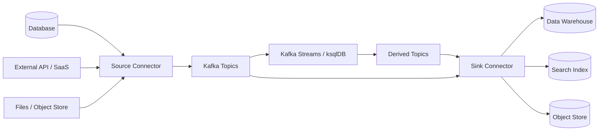
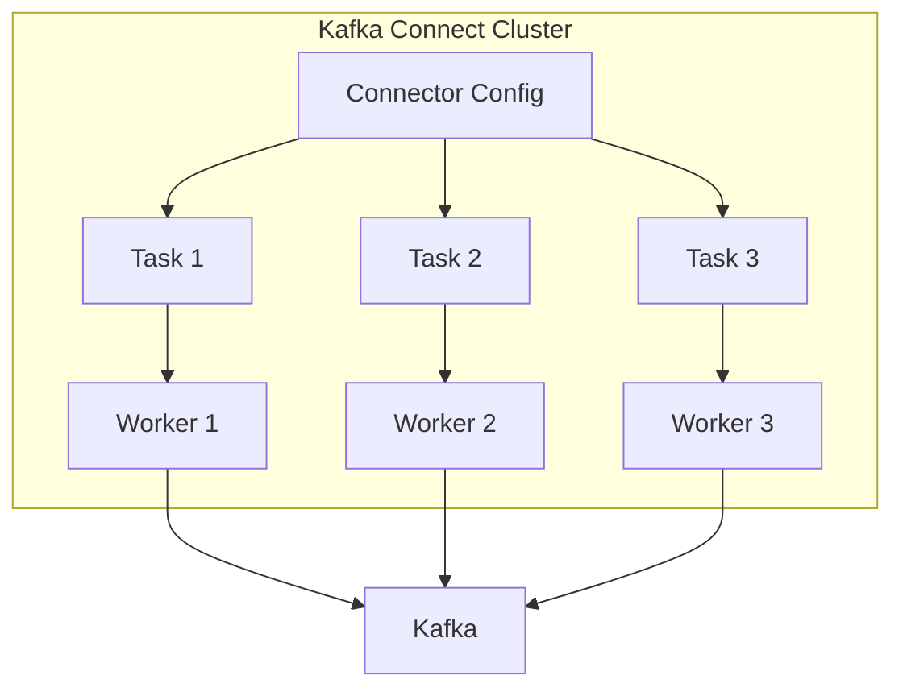
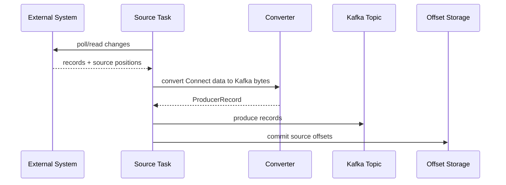
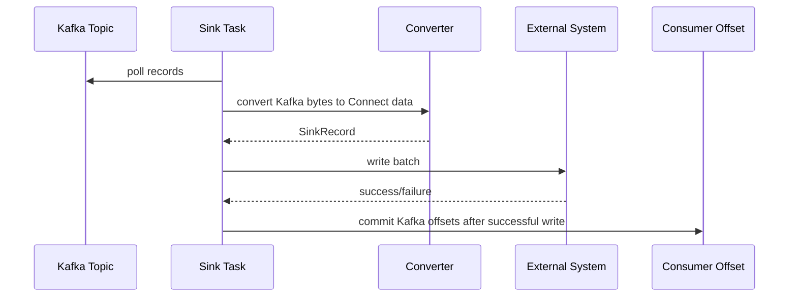
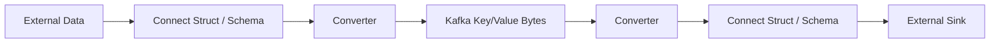
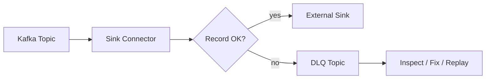
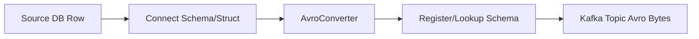
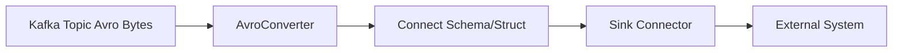

# Part 024 — Kafka Connect Integration Architecture

Part 023 focused on ksqlDB query design. Now we move to Kafka Connect.

Kafka Connect exists because most real Kafka platforms do not only contain custom Java producers and consumers. They integrate with databases, object storage, search systems, data warehouses, SaaS systems, observability systems, and legacy applications.

The central idea:

> Kafka Connect is the integration runtime for moving data between Kafka and external systems using connector plugins, workers, tasks, converters, offsets, and operational control APIs.

Do not treat Kafka Connect as “just a connector config.”

A connector is production infrastructure.

It has ownership, schema contracts, offset state, retry behavior, throughput limits, credentials, monitoring, upgrade risk, and failure modes.

---

## 1. Kaufman Skill Decomposition

The target skill is **designing and operating Kafka Connect pipelines as first-class production systems**.

| Subskill | Production Meaning |
|---|---|
| Runtime model | Understand workers, connectors, tasks, plugins, and distributed mode. |
| Source vs sink | Know how data enters Kafka and leaves Kafka. |
| Offset discipline | Know where progress is stored and how replay/restart works. |
| Converter model | Distinguish Connect internal data from Kafka wire formats. |
| Schema governance | Use Schema Registry and compatible formats intentionally. |
| SMT boundaries | Use Single Message Transforms for simple reshaping, not business processing. |
| Error handling | Design fail-fast, tolerate, retry, and DLQ behavior. |
| Throughput/scaling | Tune `tasks.max`, batching, polling, partitioning, and external system limits. |
| Operations | Manage lifecycle through REST/API/GitOps/operator. |
| Security | Handle credentials, ACLs, TLS, secrets, and least privilege. |

### 1.1 Practice Goal

By the end of this part, you should be able to:

- explain Kafka Connect architecture without hand-waving;
- choose source/sink connector patterns correctly;
- review connector configs for correctness and risk;
- reason about connector offsets and replay;
- decide when SMT is enough and when stream processing is needed;
- design DLQ/error handling for connector pipelines;
- operate connectors with observability and runbooks.

---

## 2. Where Kafka Connect Fits



Kafka Connect is best for standardized integration.

It is not best for:

- complex domain workflows;
- heavy event correlation;
- stateful business processing;
- human-in-the-loop case lifecycle;
- external side effects requiring custom compensation logic.

Those usually belong in Java services, Kafka Streams, workflow engines, or specialized ingestion systems.

---

## 3. Core Runtime Model

Kafka Connect has five primary concepts.

| Concept | Meaning |
|---|---|
| worker | JVM process that runs connector/task execution |
| connector | logical integration definition and coordinator |
| task | parallel unit of work assigned to workers |
| converter | translates between Connect data model and Kafka record bytes |
| transform | per-record lightweight transformation before/after Kafka |



A connector defines *what* to move.

Tasks perform the work.

Workers provide runtime execution and coordination.

---

## 4. Source Connectors

A source connector moves data from an external system into Kafka.

Examples:

- database CDC to Kafka;
- JDBC polling to Kafka;
- object storage files to Kafka;
- SaaS events to Kafka;
- metrics/logs to Kafka.

General source flow:



Important source connector questions:

- What external position is tracked?
- Can the source be replayed?
- Is ordering important?
- How does it handle deletes?
- Does it capture schema changes?
- Does it support snapshots?
- Can it resume after failure without duplicates or gaps?
- What is the source system load?

---

## 5. Sink Connectors

A sink connector moves data from Kafka to an external system.

Examples:

- Kafka to Elasticsearch/OpenSearch;
- Kafka to Snowflake/BigQuery/warehouse;
- Kafka to object storage;
- Kafka to relational database;
- Kafka to search index;
- Kafka to data lake.

General sink flow:



Important sink connector questions:

- Is the sink write idempotent?
- Does sink support upsert or only append?
- How are tombstones handled?
- What is the primary key in the sink?
- What happens on duplicate delivery?
- What batch size is safe?
- Can the sink handle Kafka replay?
- What is the external system rate limit?

---

## 6. Standalone vs Distributed Mode

Kafka Connect can run standalone or distributed.

| Mode | Use Case | State Storage | Production Fit |
|---|---|---|---|
| standalone | local dev, simple one-node testing | local files | low |
| distributed | production clusters | Kafka internal topics | high |

For production, assume distributed mode.

Distributed mode uses Kafka topics for:

- connector configurations;
- connector/task status;
- connector offsets.

These internal topics are part of your production state.

Do not treat them as disposable.

---

## 7. Internal Topics

A distributed Connect cluster usually needs internal topics such as:

| Topic Purpose | Meaning |
|---|---|
| config storage | connector configurations |
| offset storage | source connector positions |
| status storage | connector/task status |

Design them intentionally:

- replication factor appropriate to cluster criticality;
- compaction enabled where required by Connect;
- ACLs restricted to Connect principal;
- monitored like infrastructure topics;
- backed up or recoverable by deployment process;
- not consumed by application teams.

If offset storage is lost, source connector replay/gap behavior depends on the connector and source system.

---

## 8. Workers, Connectors, and Tasks

### 8.1 Worker

A worker is the JVM runtime.

It provides:

- plugin loading;
- REST API;
- task execution;
- rebalance/assignment;
- converter config;
- security config;
- offset/status/config storage;
- metrics/logging.

### 8.2 Connector

A connector is the logical integration instance.

It defines:

- connector class;
- source/sink system configuration;
- topics or topic patterns;
- task parallelism;
- transforms;
- error handling;
- converter overrides;
- connector-specific settings.

### 8.3 Task

A task is the parallel execution unit.

`tasks.max` sets an upper bound, not a guaranteed number of productive tasks.

Actual parallelism depends on connector capabilities.

Examples:

- sink connector parallelism is often limited by Kafka topic partitions;
- source connector parallelism depends on source partitioning model;
- JDBC source polling one table may not benefit from many tasks;
- object store sink may parallelize by topic/partition/file rotation.

---

## 9. Connector Configuration Shape

A connector config usually has this shape:

```json
{
  "name": "orders-jdbc-sink",
  "config": {
    "connector.class": "io.confluent.connect.jdbc.JdbcSinkConnector",
    "tasks.max": "4",
    "topics": "commerce.orders.approved.v1",
    "connection.url": "jdbc:postgresql://postgres:5432/reporting",
    "connection.user": "${file:/mnt/secrets/jdbc.properties:user}",
    "connection.password": "${file:/mnt/secrets/jdbc.properties:password}",
    "insert.mode": "upsert",
    "pk.mode": "record_key",
    "auto.create": "false",
    "auto.evolve": "false",
    "value.converter": "io.confluent.connect.avro.AvroConverter",
    "value.converter.schema.registry.url": "http://schema-registry:8081",
    "errors.tolerance": "none"
  }
}
```

Review connector configs like code.

Do not paste random connector configs into production.

---

## 10. Converter Model

Converters are commonly misunderstood.

Kafka Connect has an internal data model. Connectors and SMTs operate on that internal model. Converters translate between the internal model and bytes in Kafka.



Common converters:

| Converter | Use |
|---|---|
| AvroConverter | Avro with Schema Registry |
| ProtobufConverter | Protobuf with Schema Registry |
| JsonSchemaConverter | JSON Schema with Schema Registry |
| JsonConverter | JSON, optionally schemas enabled |
| StringConverter | strings |
| ByteArrayConverter | raw bytes |

Production guidance:

- use registry-backed formats for governed product topics;
- be explicit about key converter and value converter;
- avoid accidental JSON-without-schema for critical contracts;
- document how nulls, decimals, timestamps, and logical types map;
- test sink behavior with tombstones.

---

## 11. Serializer vs Converter

Do not confuse producer serializers with Connect converters.

| Concern | Java Producer/Consumer | Kafka Connect |
|---|---|---|
| byte conversion | serializer/deserializer | converter |
| data model | application DTO | Connect Schema/Struct |
| config location | app config | worker/connector config |
| schema registration | serializer-specific | converter-specific |
| transformation point | app code/interceptor | SMT/connector |

A Java service usually controls serialization in code.

A connector controls conversion in configuration/runtime.

---

## 12. Single Message Transforms

Single Message Transforms are lightweight per-record transformations.

Good SMT use cases:

- rename fields;
- insert static metadata;
- route topic based on field;
- extract key from value;
- mask simple fields;
- drop fields;
- unwrap Debezium envelope when appropriate.

Bad SMT use cases:

- complex business decisions;
- multi-record aggregation;
- joins;
- stateful deduplication;
- external API calls;
- workflow transitions;
- regulatory decision logic.

Use this invariant:

> SMTs are for record shape adaptation, not business processing.

If you need state, time, joins, branching, or domain rules, use Kafka Streams, ksqlDB, or a Java service.

---

## 13. Source Offset Semantics

Source connector offsets represent progress in the external source.

Examples:

| Source | Offset Could Mean |
|---|---|
| database CDC | log sequence number / binlog position |
| JDBC polling | incrementing column / timestamp |
| file source | file path + byte position |
| SaaS API | cursor / page token / updated-at |

Offset correctness depends on connector implementation.

Ask:

- Is offset committed after Kafka write succeeds?
- Can source positions expire?
- Is the source read idempotent?
- What happens if the connector restarts before offset commit?
- Can duplicates occur?
- Can gaps occur?
- How is snapshot completion tracked?

---

## 14. Sink Offset Semantics

Sink connectors consume Kafka records and commit consumer offsets after successful writes.

But “successful write” depends on connector implementation and sink system behavior.

Failure examples:

| Scenario | Result |
|---|---|
| sink write succeeds, offset commit fails | duplicate write after restart possible |
| sink write partially succeeds | connector-specific retry/duplicate risk |
| sink rejects one record in batch | batch may fail or DLQ depending config |
| sink rate-limits | lag grows, retries/backoff needed |
| sink schema mismatch | connector task may fail or route to DLQ |

Design sink writes to be idempotent whenever possible.

For databases, prefer upsert with stable primary key when semantics permit.

For object storage, understand file rotation and duplicate file risk.

For search indexes, use deterministic document ID.

---

## 15. Delivery Semantics

Kafka Connect is commonly at-least-once in practice, but exact guarantees depend on connector type, connector implementation, Kafka configuration, and external system semantics.

Do not write “exactly-once” in an architecture document unless you can specify:

- source connector guarantee;
- Kafka write guarantee;
- offset commit behavior;
- sink idempotency;
- external transaction behavior;
- duplicate handling;
- recovery scenario.

Use this review language instead:

> This connector pipeline is designed for at-least-once delivery with idempotent sink writes keyed by `<business_key>`. Duplicate records may be delivered after task restart, but repeated writes converge to the same external state.

That is more defensible.

---

## 16. Error Handling Modes

Connector error handling generally falls into three patterns.

| Mode | Behavior | Use When |
|---|---|---|
| fail fast | stop task on error | correctness is more important than continuity |
| tolerate/log | skip problematic records | non-critical pipeline, loss acceptable and tracked |
| DLQ | route bad records to error topic | malformed records should be inspected/replayed |

A common sink connector DLQ style config:

```properties
errors.tolerance=all
errors.deadletterqueue.topic.name=connect.dlq.orders-jdbc-sink.v1
errors.deadletterqueue.context.headers.enable=true
errors.log.enable=true
errors.log.include.messages=false
```

Review whether the DLQ topic contains sensitive data before enabling full message logging or broad access.

---

## 17. DLQ Design for Connect

A Connect DLQ is not a trash bin.

It is an operational queue for failed records.

DLQ contract:

| Field | Decision |
|---|---|
| topic name | stable and connector-specific |
| retention | long enough for investigation |
| access | limited to owning team/SRE |
| headers | include error context if safe |
| replay | documented replay tool/runbook |
| alerting | non-zero DLQ rate alerts |
| classification | schema, conversion, sink, transform, poison record |



Never enable DLQ without defining who looks at it.

---

## 18. Connector Lifecycle

Kafka Connect exposes a REST API for connector lifecycle operations.

Common operations:

- list connectors;
- create/update connector config;
- inspect connector status;
- inspect task status;
- pause connector;
- resume connector;
- restart connector/task;
- delete connector.

Lifecycle should be automated.

Production options:

- GitOps-managed connector configs;
- Terraform/Ansible/Helm/Operator;
- Confluent CLI or API;
- Strimzi KafkaConnector custom resources;
- platform-managed UI with approval workflow.

Manual REST calls are acceptable for emergency operations but weak as the only deployment model.

---

## 19. Rebalance and Task Assignment

In distributed mode, workers coordinate task assignment.

Worker changes can trigger task rebalances.

Operational impacts:

- tasks pause and resume;
- source polling may stop briefly;
- sink lag may grow;
- external connections may be recreated;
- duplicate writes may occur if offsets are not yet committed;
- source snapshots may need connector-specific recovery.

Review connector behavior during:

- worker restart;
- rolling upgrade;
- task failure;
- connector config update;
- plugin upgrade;
- Kafka outage;
- external system outage.

---

## 20. Scaling Connectors

Scaling Kafka Connect is not just adding workers.

### 20.1 Scaling Dimensions

| Dimension | Meaning |
|---|---|
| workers | more JVM capacity and placement |
| tasks.max | max task parallelism for connector |
| topic partitions | upper bound for many sink connector tasks |
| source partitions | parallelizable units in external source |
| batch size | records per write/poll |
| external throughput | DB/API/object store capacity |
| network | worker-to-Kafka and worker-to-sink bandwidth |

### 20.2 Sink Scaling Example

Topic has 6 partitions.

Connector config:

```properties
tasks.max=12
```

Many sink connectors cannot use more than 6 active consuming tasks for that topic because Kafka partitions are the parallelism boundary.

`tasks.max=12` is not magic.

### 20.3 Source Scaling Example

A JDBC source polling one table by incrementing ID may have limited task parallelism.

A CDC connector may parallelize differently depending on connector implementation and source database constraints.

Always read connector-specific documentation.

---

## 21. Backpressure and External System Protection

Kafka can often ingest faster than external sinks can consume.

A sink connector must protect the external system.

Symptoms of backpressure:

- growing consumer lag;
- repeated sink timeouts;
- task failures;
- retry storms;
- increased batch latency;
- external database lock contention;
- API rate-limit errors.

Controls:

- batch size;
- max in-flight requests;
- connector-specific retry/backoff;
- task parallelism;
- topic partition count;
- sink-side indexes and write path;
- rate limiting proxy;
- circuit breaker outside Connect if necessary.

Do not scale tasks blindly if the sink is already overloaded.

---

## 22. Schema Registry Integration

Kafka Connect integrates well with Schema Registry through converters.

Source connector flow with Avro converter:



Sink connector flow:



Review:

- schema compatibility mode;
- nullable fields;
- default values;
- decimal precision/scale;
- timestamp mapping;
- enum evolution;
- logical type support;
- sink schema auto-create/evolve behavior.

Disable auto-create/evolve in regulated or critical systems unless you explicitly govern it.

---

## 23. JDBC Source Pattern

JDBC source polling is tempting but easy to misuse.

Typical modes:

| Mode | Meaning | Risk |
|---|---|---|
| bulk | read full table repeatedly | heavy load, duplicates |
| incrementing | use increasing column | misses updates to old rows |
| timestamp | use update timestamp | clock/update semantics risk |
| timestamp+incrementing | combine timestamp and ID | better but still polling-based |

For true change capture, prefer CDC when supported.

Use polling JDBC source when:

- data volume is moderate;
- latency requirement is loose;
- missed update semantics are acceptable or controlled;
- source table has proper indexing;
- database load is reviewed.

---

## 24. JDBC Sink Pattern

JDBC sink can be useful for projections/reporting tables.

Review:

- `insert.mode`: insert/upsert/update;
- `pk.mode`: record key, record value, Kafka coordinates;
- primary key mapping;
- tombstone/delete behavior;
- auto-create/evolve policy;
- batch size;
- transaction behavior;
- duplicate write behavior;
- deadlock/lock contention;
- schema migration process.

For projection tables, prefer deterministic primary key and idempotent upsert.

Example:

```properties
insert.mode=upsert
pk.mode=record_key
delete.enabled=true
auto.create=false
auto.evolve=false
```

Only use `delete.enabled=true` if tombstone semantics are intentional and tested.

---

## 25. Object Storage Sink Pattern

Object storage sinks are common for data lake/archive pipelines.

Design questions:

- file format: JSON, Avro, Parquet;
- partitioning path: topic/date/hour/tenant;
- rotation policy: time, size, schedule;
- late data handling;
- exactly-once claims vs object store behavior;
- schema evolution in files;
- small files problem;
- compaction/deletion semantics;
- replay behavior;
- data retention and privacy deletion.

Example path contract:

```text
s3://company-data-lake/kafka/commerce/orders-approved/v1/dt=2026-07-01/hour=10/part-000.avro
```

Path layout is a downstream data contract.

---

## 26. Search Sink Pattern

Search sinks usually require idempotent document IDs.

Review:

- document ID mapping;
- upsert vs insert;
- delete/tombstone handling;
- index rollover;
- mapping compatibility;
- retry behavior;
- duplicate events;
- partial update semantics;
- backpressure under index pressure.

Bad:

> Generate random document ID per event.

Better:

> Use stable business key or event ID depending on whether the index represents latest state or event history.

---

## 27. Managed vs Self-Managed Connect

| Option | Benefits | Trade-Offs |
|---|---|---|
| managed connectors | less ops, vendor-managed scaling/upgrades | connector catalog limits, cost, platform constraints |
| self-managed Connect | full control, custom plugins, private networking | own upgrades, monitoring, scaling, plugin security |

Choose based on:

- connector availability;
- compliance constraints;
- network topology;
- custom plugin requirement;
- operational maturity;
- cost model;
- support expectations.

Do not choose self-managed just because it feels more powerful.

Power means operational responsibility.

---

## 28. Security Model

A connector can be highly privileged.

It may read production databases, write customer data, and access Kafka topics.

Security review:

### Kafka

- Connect worker principal;
- ACLs for input/output topics;
- ACLs for internal topics;
- consumer group permissions;
- transactional permissions if connector requires them;
- Schema Registry permissions.

### External System

- least-privilege DB user/API token;
- read-only for source where possible;
- write-only/specific table for sink where possible;
- credential rotation;
- secret storage;
- network allowlists;
- TLS validation.

### Data Governance

- PII fields;
- masking/tokenization;
- DLQ access;
- logs with sensitive data;
- audit trail for config changes.

---

## 29. Plugin Management

Kafka Connect uses connector plugins.

Plugin mistakes cause production incidents.

Review:

- plugin version;
- compatibility with Kafka/Connect version;
- transitive dependency conflicts;
- classloader isolation;
- CVEs;
- licensing;
- upgrade procedure;
- rollback procedure;
- staging validation;
- connector-specific breaking changes.

Never upgrade connector plugins directly in production without validating:

- config compatibility;
- output format;
- offset compatibility;
- schema changes;
- task recovery behavior.

---

## 30. Observability

Monitor Connect at worker, connector, task, Kafka, and external-system levels.

| Level | Signals |
|---|---|
| worker | JVM memory, CPU, GC, thread count, REST availability |
| connector | state, config version, pause/resume status |
| task | failed/running state, error trace, record rate, batch latency |
| Kafka | consumer lag, producer errors, request latency, topic throughput |
| internal topics | availability, compaction, replication, ACL errors |
| external system | write latency, rate limits, DB locks, API errors |
| DLQ | records/sec, error class, growth, unprocessed age |

Alert examples:

- connector state is `FAILED`;
- one or more tasks are `FAILED`;
- sink consumer lag exceeds SLO;
- DLQ receives records;
- source connector throughput drops to zero while source changes exist;
- retry errors exceed threshold;
- external sink write latency spikes;
- internal Connect topic under-replicated.

---

## 31. Troubleshooting Runbook

### 31.1 Connector Not Moving Data

Check:

1. connector status;
2. task status;
3. worker logs;
4. source/sink connectivity;
5. topic ACLs;
6. converter errors;
7. Schema Registry connectivity;
8. external credentials;
9. consumer lag or source offset movement;
10. recent config/plugin changes.

### 31.2 Task Failed

Classify error:

| Error Type | Common Cause |
|---|---|
| auth | bad credentials, expired token, ACL missing |
| serialization | converter mismatch, schema incompatibility |
| transform | SMT failed on unexpected field/null |
| sink write | constraint violation, mapping error, timeout |
| source read | database unavailable, cursor expired |
| config | invalid connector property |
| plugin | missing dependency, incompatible version |

### 31.3 DLQ Growing

Investigate:

- which connector/task emits DLQ records;
- error headers;
- sample failed record;
- schema version;
- recent producer changes;
- recent sink schema changes;
- replay safety.

Do not replay DLQ blindly.

---

## 32. Replay and Backfill

Connector replay depends on direction.

### 32.1 Source Replay

Potential methods:

- reset source connector offsets;
- create new connector with new name and output topic;
- source-specific snapshot;
- database point-in-time export;
- replay CDC log if still retained.

Risks:

- duplicates;
- missing old source log segments;
- source load spike;
- schema drift;
- inconsistent snapshot;
- downstream reprocessing impact.

### 32.2 Sink Replay

Potential methods:

- reset sink consumer offsets;
- deploy new sink connector name/group;
- replay from timestamp;
- write to new sink target;
- truncate/rebuild sink projection.

Risks:

- duplicate external writes;
- destructive deletes;
- rate limit breach;
- index corruption;
- inconsistent upsert semantics.

Always specify replay key and idempotency behavior.

---

## 33. Connector Ownership Model

Every connector needs an owner.

Ownership should cover:

- connector config;
- source/sink credentials;
- schema evolution;
- topic ownership;
- DLQ triage;
- data quality;
- SLO and alerts;
- plugin upgrades;
- replay/backfill;
- incident response.

Avoid “platform owns all connectors” unless platform also owns data semantics.

A better split:

| Responsibility | Owner |
|---|---|
| Connect cluster runtime | platform team |
| connector plugin catalog | platform team |
| connector config | domain/data team |
| data contract | producing/owning domain |
| external sink correctness | consuming/sink team |
| DLQ investigation | connector owner with platform support |

---

## 34. Kafka Connect vs Alternatives

| Use Case | Kafka Connect | Kafka Streams | ksqlDB | Java Service |
|---|---:|---:|---:|---:|
| DB CDC ingestion | excellent | poor | poor | medium/custom |
| object storage sink | excellent | poor | poor | medium/custom |
| search indexing | high | medium | poor-medium | high/custom |
| stateful aggregation | poor | excellent | high | medium |
| SQL projection | poor | medium | excellent | medium |
| external API side effect | medium/connector-specific | poor | poor | excellent |
| complex workflow | poor | medium | poor | excellent |
| field rename/drop | high with SMT | medium | medium | medium |

Use Connect for integration plumbing.

Use stream processors for data transformation.

Use services for domain behavior.

---

## 35. Common Anti-Patterns

### 35.1 Connector as Business Logic Engine

A connector should not encode complex domain decisions.

### 35.2 Auto-Create Everything

Allowing connectors to auto-create database tables or evolve schemas in critical systems can produce uncontrolled data contracts.

### 35.3 Ignoring DLQ

A DLQ without owner, alert, and replay path is silent data loss with extra steps.

### 35.4 Over-Scaling Tasks

Increasing `tasks.max` without understanding source/sink limits can overload external systems.

### 35.5 Consuming Internal Connect Topics

Internal topics are runtime state, not product data.

### 35.6 Random Sink IDs

Using random IDs in search/database sinks turns replay into duplication.

### 35.7 Connector Config Drift

Manual UI edits with no Git history make incident response and rollback fragile.

---

## 36. Production Readiness Checklist

### Runtime

- Connect cluster deployed in distributed mode.
- Internal topics configured and replicated.
- Workers have resource limits and monitoring.
- Plugin versions are pinned.
- Rolling restart procedure exists.

### Connector

- Config stored in version control.
- `tasks.max` reviewed.
- Source/sink throughput tested.
- Converter configured explicitly.
- SMTs reviewed.
- Error handling configured.
- DLQ owner defined.

### Data

- Topic contract documented.
- Key/value format documented.
- Schema compatibility set.
- Tombstone behavior tested.
- Replay semantics documented.
- PII handling reviewed.

### Operations

- Alerts configured.
- Runbook exists.
- Backfill/replay plan exists.
- Upgrade plan exists.
- Credential rotation tested.
- Disaster recovery assumptions documented.

---

## 37. ADR Template

```markdown
# ADR: Kafka Connect Pipeline for <source/sink>

## Context
- Source system:
- Sink system:
- Kafka topics:
- Business purpose:
- Data owner:

## Decision
- Connector class:
- Mode: source/sink
- Connect cluster:
- tasks.max:
- Converter:
- Schema Registry usage:
- SMTs:

## Semantics
- Delivery model:
- Offset behavior:
- Idempotency strategy:
- Delete/tombstone behavior:
- Replay/backfill plan:

## Operations
- Owner:
- Alerts:
- DLQ:
- Credentials:
- Plugin version:
- Rollback:

## Consequences
- Benefits:
- Trade-offs:
- Known risks:
```

---

## 38. Deliberate Practice

### Exercise 1 — Source Connector Review

A team wants to use JDBC source with `timestamp` mode to ingest `orders`.

Questions:

- What updates could be missed?
- What index is required?
- What happens if source clock semantics are wrong?
- Is CDC better?
- How would you validate no gaps?

### Exercise 2 — Sink Idempotency

A Kafka topic contains `CustomerProfileUpdated` events keyed by `customer_id`.

A JDBC sink writes to `customer_profile_projection`.

Design:

- primary key;
- insert mode;
- delete behavior;
- duplicate handling;
- replay plan;
- schema migration process.

### Exercise 3 — DLQ Runbook

A sink connector starts sending records to DLQ after a producer deployment.

Write a runbook:

- detect;
- classify;
- stop/pause decision;
- inspect sample;
- identify producer/schema change;
- fix;
- replay;
- postmortem.

### Exercise 4 — Choose Runtime

Choose Connect, Kafka Streams, ksqlDB, or Java service:

1. Copy compacted customer profile topic into PostgreSQL projection.
2. Aggregate payment totals per merchant per 5 minutes.
3. Ingest database changes into Kafka.
4. Call credit bureau API after case approval.
5. Rename a field from `cust_id` to `customer_id` in an integration topic.
6. Correlate login events and password reset events within 10 minutes.

---

## 39. Summary

Kafka Connect is the integration runtime of a Kafka platform.

The key invariants are:

- source connectors move external data into Kafka;
- sink connectors move Kafka data into external systems;
- workers run tasks;
- distributed mode stores config, offsets, and status in Kafka internal topics;
- converters are not serializers, but they define Kafka wire format for Connect;
- SMTs are for simple record-level adaptation, not business logic;
- connector offsets and sink idempotency determine replay safety;
- DLQs need ownership, alerting, and replay plans;
- connector configs must be versioned and reviewed like code;
- external system limits are part of the Kafka architecture.

A mid-level engineer can deploy a connector.

A senior engineer can operate it.

A top-tier engineer can reason about its contracts, offsets, replay behavior, and failure modes before the incident happens.

---

## 40. References

- Kafka Connect, Confluent Documentation — https://docs.confluent.io/platform/current/connect/index.html
- Kafka Connect Worker Configuration Properties, Confluent Documentation — https://docs.confluent.io/platform/current/connect/references/allconfigs.html
- Kafka Connect REST Interface, Confluent Documentation — https://docs.confluent.io/platform/current/connect/references/restapi.html
- Integrate Schemas from Kafka Connect with Schema Registry, Confluent Documentation — https://docs.confluent.io/platform/current/schema-registry/connect.html
- Kafka Sink Connector Configuration Reference, Confluent Documentation — https://docs.confluent.io/platform/current/installation/configuration/connect/sink-connect-configs.html
- Troubleshoot Self-Managed Kafka Connect, Confluent Documentation — https://docs.confluent.io/platform/current/connect/troubleshoot.html
- Kafka Connect User Guide, Apache Kafka Documentation — https://kafka.apache.org/documentation/#connect
