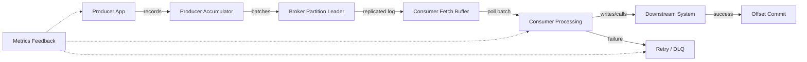
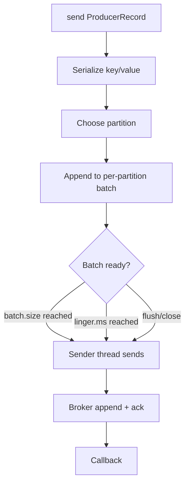
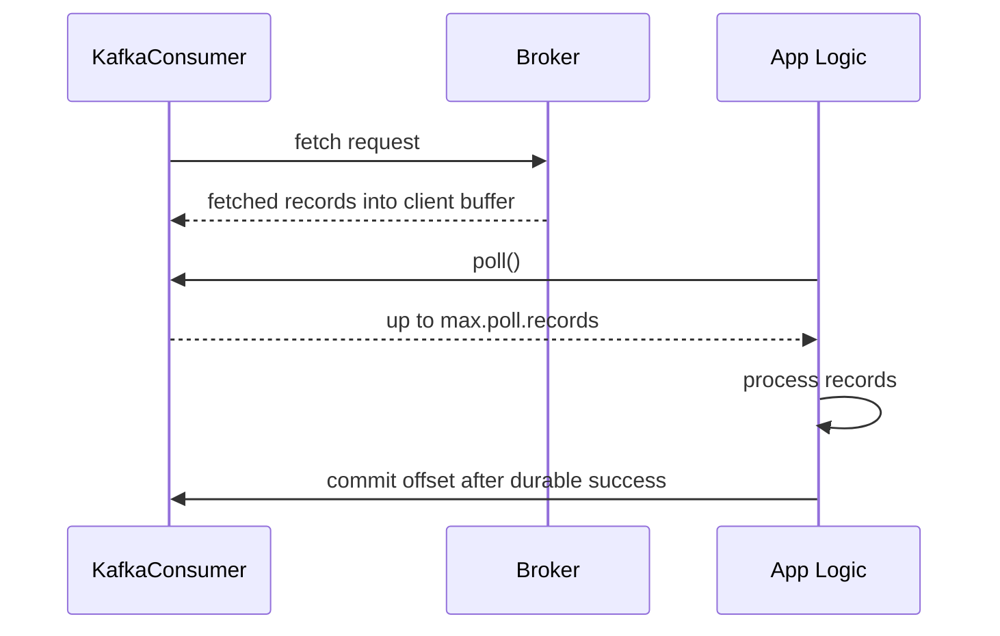
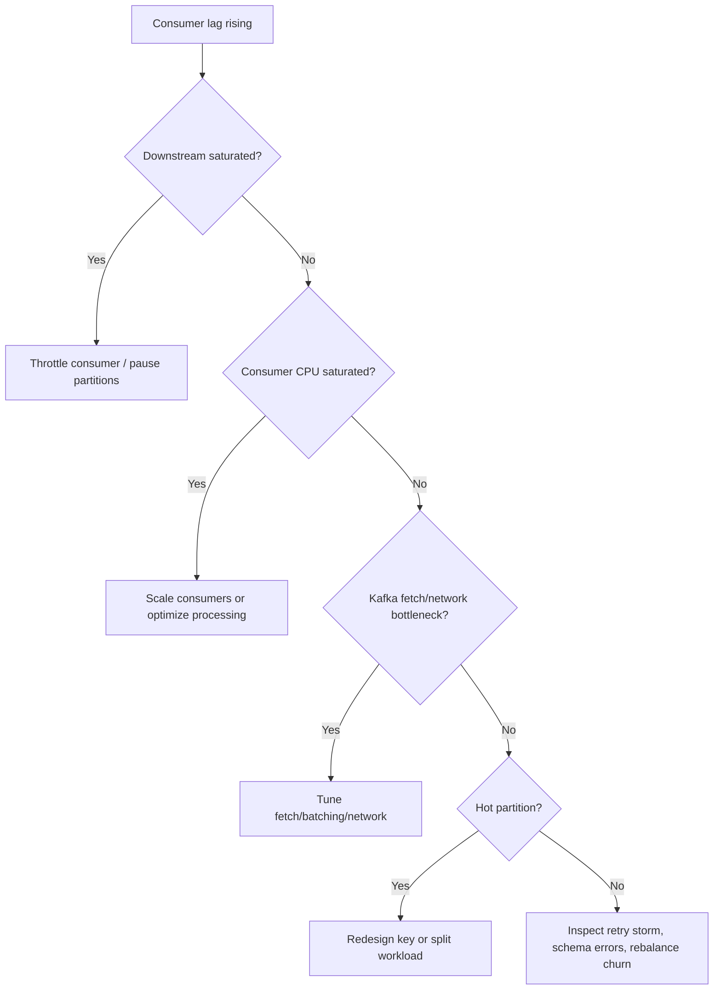
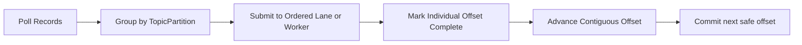
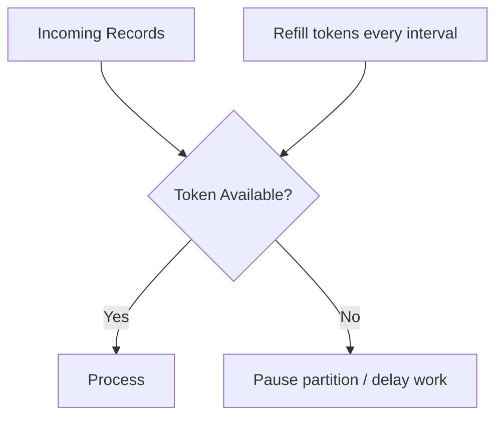
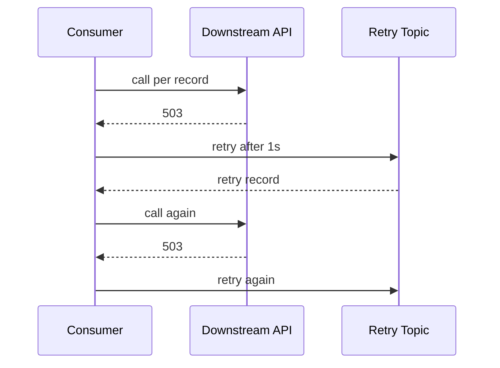
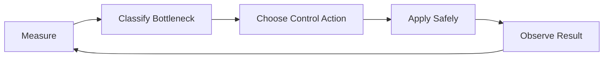

# Part 025 — Batching, Backpressure, and Flow Control

Part 024 covered Kafka Connect as the integration runtime between Kafka and external systems.

Now we need a deeper production skill: **how to keep Kafka-based systems stable when load, latency, downstream capacity, retry pressure, and batching behavior interact**.

Kafka can absorb large volumes of events, but Kafka does not magically make downstream systems faster. If a consumer writes to a slow database, calls a rate-limited API, performs expensive validation, or waits on another service, the pipeline can still collapse.

The central idea:

> A Kafka pipeline is stable only when the sustained input rate is less than or equal to the durable processing capacity of every critical downstream stage.

Batching improves efficiency. Backpressure prevents uncontrolled overload. Flow control is the explicit mechanism that keeps the system inside its safe operating envelope.

---

## 1. Kaufman Skill Decomposition

The target skill is **designing Kafka applications that preserve correctness while controlling throughput, latency, memory, and downstream pressure**.

| Subskill | Production Meaning |
|---|---|
| Producer batching | Understand how records become batches before network send. |
| Compression economics | Know when compression reduces network/disk pressure and when it increases CPU pressure. |
| Buffer discipline | Prevent producer memory exhaustion and hidden blocking. |
| Consumer poll control | Bound how much work is accepted per polling cycle. |
| Fetch tuning | Control the broker-to-consumer data transfer shape. |
| Downstream pressure | Protect databases, APIs, caches, and object stores from overload. |
| Bounded concurrency | Use worker pools, queues, semaphores, and per-partition ordering carefully. |
| Pause/resume | Stop fetching from selected partitions without leaving the consumer group. |
| Retry pressure | Avoid retry storms that amplify the original incident. |
| Operational feedback | Use lag, age, latency, error rate, and saturation to tune safely. |

### 1.1 Practice Goal

By the end of this part, you should be able to:

1. Explain why increasing Kafka throughput can make correctness worse if offset commits are not disciplined.
2. Tune a Java producer for throughput without accidentally increasing tail latency beyond the business SLA.
3. Tune a Java consumer so it does not accept more work than the downstream can finish safely.
4. Design bounded parallel processing without breaking per-key ordering.
5. Build a feedback loop using lag, processing latency, retry rate, and downstream saturation.

---

## 2. The Mental Model: Flow, Not Just Throughput

Most Kafka performance mistakes come from looking at one metric in isolation.

Do not ask only:

> How many records per second can Kafka handle?

Ask instead:

> What is the safe end-to-end flow rate across producer, broker, consumer, processing logic, downstream sink, retry path, and replay path?



The flow is only healthy when:

```text
sustained_produce_rate <= broker_admission_capacity
sustained_consume_rate <= consumer_processing_capacity
consumer_processing_capacity <= downstream_safe_capacity
retry_rate + normal_rate <= total_pipeline_capacity
```

If any inequality is false, the system needs one or more of:

- throttling,
- batching,
- scaling,
- partition redesign,
- downstream optimization,
- delayed retry,
- load shedding,
- circuit breaking,
- or business-level degradation.

---

## 3. Batching: Why It Exists

Batching exists because distributed systems have fixed costs.

Sending one record at a time pays overhead repeatedly:

- application serialization,
- producer accumulator bookkeeping,
- network syscall,
- TCP framing,
- broker request handling,
- disk append,
- replication,
- acknowledgement,
- consumer fetch,
- deserialization,
- downstream write.

Batching amortizes these costs across many records.

```text
cost_per_record = fixed_batch_cost / records_per_batch + variable_record_cost
```

The trade-off:

| Larger Batch | Smaller Batch |
|---|---|
| Better throughput | Lower waiting latency |
| Better compression | More network overhead |
| Fewer requests | More requests |
| Higher memory usage | Lower memory usage |
| Higher burst impact downstream | Smoother per-record latency |

There is no universally correct batch size. The right setting is workload-specific.

---

## 4. Producer-Side Batching

A Kafka producer does not immediately send every record as a separate network request. It collects records into per-partition batches inside the producer accumulator.



### 4.1 Important Producer Controls

| Setting | Meaning | Failure Mode if Misused |
|---|---|---|
| `batch.size` | Upper bound of bytes per partition batch. | Too small causes excessive requests; too large increases memory and latency. |
| `linger.ms` | Maximum wait to accumulate more records before sending. | Too high increases latency; too low reduces batching efficiency. |
| `compression.type` | Compression codec for record batches. | Wrong codec can shift bottleneck from network to CPU. |
| `buffer.memory` | Total memory available for unsent records. | Exhaustion causes producer blocking or send failures. |
| `max.block.ms` | How long `send()` may block on metadata/buffer availability. | Too high hides backpressure; too low may fail during transient pressure. |
| `delivery.timeout.ms` | Upper bound for send success/failure including retries. | Too low fails during temporary broker pressure; too high delays failure signal. |
| `max.in.flight.requests.per.connection` | Concurrency of unacknowledged requests per connection. | Misconfiguration can affect ordering under retry conditions. |

The key production skill is reading these settings as a **control surface**, not as independent knobs.

### 4.2 Throughput-Optimized Producer Profile

Use when:

- metrics/log ingestion,
- analytics events,
- CDC fan-out,
- high-volume product telemetry,
- bulk indexing pipelines.

Example profile:

```properties
acks=all
enable.idempotence=true
compression.type=zstd
batch.size=65536
linger.ms=10
buffer.memory=134217728
delivery.timeout.ms=120000
request.timeout.ms=30000
max.in.flight.requests.per.connection=5
```

Interpretation:

- `acks=all` and idempotence preserve reliability.
- Compression reduces network and broker disk pressure.
- Larger `batch.size` and modest `linger.ms` improve request efficiency.
- Larger buffer absorbs short bursts, not sustained overload.

Do not copy this blindly. Benchmark it against real payload size, broker configuration, network, and SLA.

### 4.3 Low-Latency Producer Profile

Use when:

- user-visible workflow events,
- fraud/risk decisions,
- command handoff,
- SLA-sensitive orchestration.

Example profile:

```properties
acks=all
enable.idempotence=true
compression.type=lz4
batch.size=16384
linger.ms=0
delivery.timeout.ms=30000
request.timeout.ms=10000
```

Interpretation:

- Smaller batches reduce waiting latency.
- `linger.ms=0` favors immediate send.
- Compression remains useful if payloads are non-trivial, but benchmark CPU impact.

### 4.4 Producer Backpressure Signal

Producer backpressure often appears as:

- increasing `record-queue-time-avg`,
- increasing `bufferpool-wait-time-total`,
- falling `record-send-rate`,
- increasing `request-latency-avg`,
- send callback errors,
- blocked application threads,
- rising application request latency.

The anti-pattern is treating producer backpressure as a Kafka-only problem.

It may be caused by:

- broker disk saturation,
- network saturation,
- metadata instability,
- partition hot spot,
- too-small batch size,
- too-large payload,
- slow acknowledgement due to ISR pressure,
- bad client-side concurrency.

---

## 5. Consumer-Side Flow Control

A consumer has two different responsibilities:

1. Poll Kafka often enough to stay healthy in the consumer group.
2. Avoid accepting more records than it can process and commit correctly.

These responsibilities can conflict.

If processing is slow and the consumer stops polling too long, it can exceed `max.poll.interval.ms`, triggering a rebalance. If it polls too aggressively, it may flood memory or downstream systems.

### 5.1 Consumer Fetch vs Consumer Poll

Fetch and poll are related but not identical.



Fetch controls how data is transferred from broker to client.

Poll controls how much data the application receives per processing cycle.

### 5.2 Important Consumer Controls

| Setting | Meaning | Production Use |
|---|---|---|
| `max.poll.records` | Maximum records returned by a single `poll()`. | Bound work accepted per loop. |
| `max.poll.interval.ms` | Maximum delay between polls before consumer considered failed. | Must exceed worst-case processing cycle or use pause/resume/worker design. |
| `fetch.min.bytes` | Minimum bytes broker should accumulate before responding. | Increase for throughput-oriented consumers. |
| `fetch.max.wait.ms` | Maximum wait for `fetch.min.bytes`. | Bounds added fetch latency. |
| `max.partition.fetch.bytes` | Maximum bytes per partition returned. | Protects memory; must allow largest batch to make progress. |
| `fetch.max.bytes` | Maximum bytes per fetch response. | Controls total response size. |
| `session.timeout.ms` | Group failure detection window. | Too low causes false rebalances; too high slows failure recovery. |
| `heartbeat.interval.ms` | Heartbeat frequency for classic protocol. | Usually lower than session timeout. |

### 5.3 Consumer Profiles

#### Profile A — Low-Latency Workflow Consumer

```properties
enable.auto.commit=false
max.poll.records=50
max.poll.interval.ms=300000
fetch.min.bytes=1
fetch.max.wait.ms=100
```

Use when:

- each event triggers business logic,
- downstream latency matters,
- ordering/correctness is more important than bulk throughput.

#### Profile B — Bulk Sink Consumer

```properties
enable.auto.commit=false
max.poll.records=1000
max.poll.interval.ms=900000
fetch.min.bytes=1048576
fetch.max.wait.ms=500
```

Use when:

- consumer writes batches to object storage,
- database bulk insert is efficient,
- latency budget allows larger batches.

#### Profile C — External API Consumer

```properties
enable.auto.commit=false
max.poll.records=100
max.poll.interval.ms=600000
fetch.min.bytes=1
fetch.max.wait.ms=100
```

But the real control is not just Kafka config. It is bounded concurrency and rate limiting around the API.

---

## 6. Downstream Backpressure

Backpressure means the downstream system communicates, directly or indirectly, that it cannot accept more work at the current rate.

Common downstream pressure signals:

| Downstream | Pressure Signal |
|---|---|
| Database | connection pool saturation, lock waits, deadlocks, slow commits, increasing write latency |
| REST API | HTTP 429, 503, timeout, rising p95/p99, circuit breaker open |
| Search index | bulk rejection, queue saturation, refresh pressure |
| Object storage | throttling, slow upload, request errors |
| Cache | timeout, eviction storm, CPU saturation |
| Workflow engine | job backlog, lock timeout, incident count |

Kafka does not remove these limits. Kafka makes the pressure easier to buffer, observe, and replay.

### 6.1 The Backpressure Decision Tree



The decision tree matters because “add consumers” is often the wrong first move.

If there are 12 partitions and 20 consumers in the same group, only up to 12 consumers can actively consume that topic. If the bottleneck is downstream database writes, adding consumers can make the database fail faster.

---

## 7. Pause/Resume as a Flow-Control Primitive

Java `KafkaConsumer` supports pausing and resuming specific assigned partitions.

Use this when:

- downstream is temporarily saturated,
- a tenant/key is rate-limited,
- one partition has poison data,
- you need to keep heartbeats/polls active while not retrieving more records from selected partitions.

Important distinction:

> Pause/resume is local to the consumer instance. It does not change the group assignment globally.

### 7.1 Pause/Resume Pattern

```java
public final class BackpressureAwareConsumer implements Runnable {
    private final KafkaConsumer<String, OrderEvent> consumer;
    private final DownstreamHealth downstreamHealth;
    private volatile boolean running = true;

    public BackpressureAwareConsumer(
            KafkaConsumer<String, OrderEvent> consumer,
            DownstreamHealth downstreamHealth
    ) {
        this.consumer = consumer;
        this.downstreamHealth = downstreamHealth;
    }

    @Override
    public void run() {
        try {
            while (running) {
                if (!downstreamHealth.canAcceptMoreWork()) {
                    consumer.pause(consumer.assignment());
                    consumer.poll(Duration.ofMillis(250)); // keep consumer alive
                    continue;
                }

                if (!consumer.paused().isEmpty()) {
                    consumer.resume(consumer.paused());
                }

                ConsumerRecords<String, OrderEvent> records =
                        consumer.poll(Duration.ofMillis(500));

                for (ConsumerRecord<String, OrderEvent> record : records) {
                    processDurably(record);
                }

                consumer.commitSync();
            }
        } finally {
            consumer.close();
        }
    }

    public void shutdown() {
        running = false;
        consumer.wakeup();
    }
}
```

The key detail is that the consumer still calls `poll()` while paused. That keeps group membership healthy.

### 7.2 Partition-Level Pause

Pausing all partitions is blunt. In advanced systems, pause only partitions whose downstream lane is saturated.

```java
Map<TopicPartition, PartitionLane> lanes = new HashMap<>();

for (TopicPartition partition : consumer.assignment()) {
    PartitionLane lane = lanes.get(partition);
    if (lane != null && lane.isSaturated()) {
        consumer.pause(List.of(partition));
    } else if (consumer.paused().contains(partition)) {
        consumer.resume(List.of(partition));
    }
}
```

This allows healthy partitions to continue flowing while unhealthy partitions cool down.

---

## 8. Bounded Parallelism Without Breaking Correctness

A common design is:

```text
poll records -> submit to worker pool -> commit offsets later
```

This is dangerous unless offset commits respect contiguous completion per partition.

### 8.1 Wrong Pattern

```java
for (ConsumerRecord<String, Event> record : records) {
    executor.submit(() -> process(record));
}
consumer.commitSync(); // wrong: workers may not have finished
```

This commits offsets before durable processing succeeds.

Crash scenario:

1. Consumer polls records 100–199.
2. It submits them to workers.
3. It commits offset 200 immediately.
4. JVM crashes before workers finish.
5. Kafka resumes from 200.
6. Records 100–199 are lost from the consumer’s perspective.

### 8.2 Correct Pattern: Contiguous Offset Tracker

Offsets can be committed only when all previous records in that partition have completed.



Example tracker:

```java
public final class PartitionOffsetTracker {
    private long nextCommitOffset;
    private final NavigableSet<Long> completed = new TreeSet<>();

    public PartitionOffsetTracker(long initialNextCommitOffset) {
        this.nextCommitOffset = initialNextCommitOffset;
    }

    public synchronized void markCompleted(long offset) {
        completed.add(offset);
        while (completed.remove(nextCommitOffset)) {
            nextCommitOffset++;
        }
    }

    public synchronized Optional<Long> committableOffset() {
        return Optional.of(nextCommitOffset);
    }
}
```

Remember: Kafka commits the **next offset to read**, not the last processed offset.

If offset `42` is processed, the committed offset is `43` only when all prior offsets are also complete.

### 8.3 Safer Pattern: Partition-Affine Worker Lane

If ordering matters, process one partition serially while using parallelism across partitions.

```java
Map<TopicPartition, ExecutorService> lanes = new ConcurrentHashMap<>();

for (TopicPartition tp : consumer.assignment()) {
    lanes.computeIfAbsent(tp, ignored -> Executors.newSingleThreadExecutor());
}

for (ConsumerRecord<String, Event> record : records) {
    TopicPartition tp = new TopicPartition(record.topic(), record.partition());
    lanes.get(tp).submit(() -> processDurably(record));
}
```

This keeps per-partition ordering but uses multiple partitions concurrently.

The downside: one slow partition lane can accumulate backlog.

---

## 9. Rate Limiting and Token Buckets

Backpressure can be reactive. Rate limiting is proactive.

Use rate limiting when:

- downstream API has a documented QPS limit,
- tenant workloads must be isolated,
- database write capacity is known,
- retry traffic must not exceed a safe budget.

### 9.1 Token Bucket Model



A token bucket allows bursts up to bucket capacity but enforces long-term rate.

Pseudo-code:

```java
if (tenantLimiter.tryAcquire(record.key())) {
    process(record);
} else {
    pausePartition(record.topic(), record.partition());
    scheduleResume(record.topic(), record.partition(), Duration.ofSeconds(1));
}
```

For multi-tenant systems, use per-tenant token buckets so one tenant cannot exhaust shared downstream capacity.

---

## 10. Retry Pressure and Amplification

Retries are not free. They can multiply traffic.

If the normal event rate is `N` and the retry rate is `R`, the actual processing demand is:

```text
actual_demand = N + R + replay + duplicate_processing
```

During incidents, `R` can exceed `N`.

### 10.1 Retry Storm Example



If thousands of consumers retry every second, the downstream may never recover.

### 10.2 Safer Retry Controls

Use:

- exponential backoff,
- jitter,
- bounded attempts,
- retry topic delay tiers,
- circuit breaker,
- DLQ quarantine,
- per-tenant retry budget,
- operator-controlled replay.

Retry design must be part of flow control.

---

## 11. Flow Control in Kafka Streams

Kafka Streams abstracts the consumer/producer loop, but flow still matters.

Important controls include:

| Area | Control |
|---|---|
| Parallelism | number of input partitions, `num.stream.threads`, number of app instances |
| Commit behavior | `commit.interval.ms`, processing guarantee |
| State cache | `cache.max.bytes.buffering` / replacement config in newer versions depending on client version |
| RocksDB | block cache, write buffer, compaction behavior |
| Repartitioning | topology shape, key choice, repartition topic volume |
| External calls | avoid blocking calls inside topology when possible |

A Kafka Streams app is not safe simply because it is “managed.” If a processor performs slow external calls, stream threads are blocked.

Recommended pattern:

- Kafka Streams for deterministic stream transformations, joins, aggregations, materialized views.
- Separate side-effect consumer for external calls when side effects need isolation, retries, idempotency, and rate limiting.

---

## 12. Flow Control in Kafka Connect

Connectors also need flow control.

Source connector pressure:

- source DB load,
- CDC log retention,
- connector task capacity,
- Kafka producer pressure.

Sink connector pressure:

- destination write throughput,
- bulk size,
- retry/backoff,
- DLQ volume,
- task parallelism,
- partition assignment.

Common trap:

> Increasing `tasks.max` on a sink connector can overload the destination system and increase failure rate.

Treat connector scaling as a downstream capacity decision, not only a Kafka decision.

---

## 13. Flow Control in ksqlDB

ksqlDB queries are continuous Kafka Streams applications under the hood.

Flow-control concerns:

- query topology complexity,
- repartition topics,
- state store size,
- window retention,
- join cardinality,
- query concurrency,
- pull-query load on materialized state,
- server CPU/memory/disk.

A persistent query that looks simple in SQL can create expensive internal topics and state stores.

Always inspect:

- explain plan,
- generated topics,
- repartition behavior,
- state store growth,
- query lag,
- server resource usage.

---

## 14. Capacity Envelope

A production Kafka pipeline needs a documented capacity envelope.

Example:

```yaml
pipeline: order-status-projection
input_topic: order.events.v1
partitions: 24
average_payload_bytes: 1800
p95_payload_bytes: 7200
normal_rate_rps: 3500
peak_rate_rps: 9000
consumer_instances: 6
max_poll_records: 500
downstream_db_safe_write_rps: 7000
retry_budget_rps: 500
max_acceptable_lag_age: 5m
max_replay_lag_age: 2h
```

The capacity envelope should answer:

1. What is the normal rate?
2. What is the peak rate?
3. What is the safe downstream rate?
4. What retry rate can be tolerated?
5. How much lag is acceptable?
6. How fast can the system catch up after downtime?
7. What gets throttled first?
8. What alert fires before user impact?

---

## 15. Lag Is Not One Metric

Consumer lag is often misunderstood.

| Metric | Meaning |
|---|---|
| records lag | Number of records behind log end offset. |
| lag age | Age of oldest unprocessed record. |
| processing latency | Time spent processing each record/batch. |
| end-to-end latency | Time from event occurrence to final visible effect. |
| commit latency | Time until offset is durably committed after processing. |
| retry lag | Delay accumulated in retry path. |
| restore lag | State store restoration delay. |

A low record lag can still be bad if the records are old and business SLA is time-based.

A high record lag can be acceptable during planned backfill if lag age and catch-up rate are within the runbook.

### 15.1 Catch-Up Rate

```text
catch_up_rate = consume_rate - produce_rate
recovery_time = backlog / catch_up_rate
```

If `consume_rate <= produce_rate`, the system will never catch up.

---

## 16. Operational Control Loop

A flow-controlled Kafka system needs an explicit control loop.



### 16.1 Measurement

Collect:

- input rate,
- output rate,
- lag age,
- consumer lag by partition,
- processing latency,
- downstream latency,
- downstream saturation,
- retry rate,
- DLQ rate,
- rebalance count,
- producer queue time,
- broker request latency.

### 16.2 Classification

Classify as:

- producer bottleneck,
- broker bottleneck,
- consumer CPU bottleneck,
- partition skew,
- downstream bottleneck,
- retry storm,
- rebalance storm,
- schema/poison pill failure,
- state restore/backfill event.

### 16.3 Control Action

Possible actions:

| Bottleneck | Control Action |
|---|---|
| Producer request overhead | Increase batching/compression after benchmarking. |
| Producer memory pressure | Reduce rate, increase buffer only if bursts are expected, inspect broker pressure. |
| Broker disk/network | Add brokers, rebalance partitions, reduce payload, compress. |
| Consumer CPU | Scale consumers up to partition count, optimize code, increase batching. |
| Downstream DB | Reduce consumer rate, batch writes, add indexes cautiously, scale DB. |
| External API | Token bucket, circuit breaker, delayed retry, DLQ. |
| Hot partition | Key redesign, split entity, shard key, special lane. |
| Retry storm | Increase delay, open circuit, cap attempts, pause replay. |

---

## 17. Java Consumer Pattern: Bounded Batch Sink

This pattern is useful for database writes where bulk insert is more efficient than per-record writes.

```java
public final class BatchSinkConsumer {
    private final KafkaConsumer<String, OrderEvent> consumer;
    private final OrderProjectionRepository repository;
    private final int batchSize;

    public BatchSinkConsumer(
            KafkaConsumer<String, OrderEvent> consumer,
            OrderProjectionRepository repository,
            int batchSize
    ) {
        this.consumer = consumer;
        this.repository = repository;
        this.batchSize = batchSize;
    }

    public void run() {
        List<ConsumerRecord<String, OrderEvent>> buffer = new ArrayList<>(batchSize);

        while (true) {
            ConsumerRecords<String, OrderEvent> records = consumer.poll(Duration.ofMillis(500));

            for (ConsumerRecord<String, OrderEvent> record : records) {
                buffer.add(record);

                if (buffer.size() >= batchSize) {
                    flushAndCommit(buffer);
                    buffer.clear();
                }
            }

            if (!buffer.isEmpty()) {
                flushAndCommit(buffer);
                buffer.clear();
            }
        }
    }

    private void flushAndCommit(List<ConsumerRecord<String, OrderEvent>> records) {
        repository.upsertAll(records.stream()
                .map(ConsumerRecord::value)
                .toList());

        Map<TopicPartition, OffsetAndMetadata> offsets = new HashMap<>();
        for (ConsumerRecord<String, OrderEvent> record : records) {
            TopicPartition tp = new TopicPartition(record.topic(), record.partition());
            offsets.merge(
                    tp,
                    new OffsetAndMetadata(record.offset() + 1),
                    (oldValue, newValue) -> newValue.offset() > oldValue.offset() ? newValue : oldValue
            );
        }

        consumer.commitSync(offsets);
    }
}
```

This is safe only if:

- `upsertAll` is atomic enough for your correctness requirement,
- duplicate writes are idempotent,
- records are not processed out of order when order matters,
- partial batch failure is handled intentionally.

---

## 18. Java Consumer Pattern: External API with Rate Limit

```java
public final class RateLimitedApiConsumer {
    private final KafkaConsumer<String, PaymentEvent> consumer;
    private final PaymentGateway gateway;
    private final RateLimiter limiter;

    public void run() {
        while (true) {
            ConsumerRecords<String, PaymentEvent> records = consumer.poll(Duration.ofMillis(250));

            if (!limiter.canAcquire(records.count())) {
                consumer.pause(consumer.assignment());
                sleep(Duration.ofMillis(500));
                continue;
            }

            if (!consumer.paused().isEmpty()) {
                consumer.resume(consumer.paused());
            }

            for (ConsumerRecord<String, PaymentEvent> record : records) {
                limiter.acquire();
                gateway.submit(record.value().idempotencyKey(), record.value());
            }

            consumer.commitSync();
        }
    }

    private static void sleep(Duration duration) {
        try {
            Thread.sleep(duration.toMillis());
        } catch (InterruptedException e) {
            Thread.currentThread().interrupt();
            throw new IllegalStateException(e);
        }
    }
}
```

This pattern requires idempotency at the gateway boundary. Otherwise, retries and crashes can duplicate external side effects.

---

## 19. Anti-Patterns

### 19.1 “Increase `max.poll.records` Until Lag Drops”

This can overload memory and downstream systems. It may reduce poll overhead but increase processing latency and failure blast radius.

### 19.2 “Add More Consumers” Without Checking Partition Count

Consumer parallelism for a topic partition set is bounded by partition count per consumer group.

### 19.3 “Use Huge Batches Everywhere”

Huge batches improve throughput but can worsen p99 latency, retry cost, memory pressure, and partial failure handling.

### 19.4 “Retry Immediately Forever”

This converts downstream incidents into retry storms.

### 19.5 “Pause Without Polling”

If the consumer stops polling too long, it may leave the group and trigger rebalances.

### 19.6 “Commit Before Downstream Success”

This creates data loss from the consumer’s perspective.

### 19.7 “Unbounded Executor Queue”

Unbounded queues hide overload until memory pressure or JVM death.

---

## 20. Production Design Checklist

Before deploying a high-throughput Kafka pipeline, answer these:

### Producer

- What is the target p50/p95/p99 publish latency?
- What is the target throughput?
- What is the average and p99 payload size?
- Which compression codec was benchmarked?
- What is the safe buffer memory envelope?
- What happens when broker acknowledgements slow down?
- What is the send failure policy?

### Consumer

- Is auto commit disabled for non-trivial processing?
- What is the maximum accepted work per poll?
- Is `max.poll.interval.ms` compatible with worst-case processing time?
- Are slow downstream systems protected by rate limiting?
- Is pause/resume used correctly when needed?
- Are offsets committed only after durable processing?
- Can processing catch up after downtime?

### Downstream

- What is safe sustained write/call capacity?
- What is the retry budget?
- Are duplicate side effects safe?
- Is there a DLQ or quarantine path?
- Are circuit breakers configured?
- Is replay operator-controlled?

### Observability

- Do we track lag age, not only record lag?
- Do we track processing latency?
- Do we track downstream latency and saturation?
- Do we alert on retry storm risk?
- Do we alert on rebalance churn?
- Do we know catch-up rate?

---

## 21. Lab: Build a Backpressure-Aware Consumer

### 21.1 Scenario

You consume `payment.commands.v1` and call a payment provider limited to 500 requests per second.

### 21.2 Tasks

1. Disable auto commit.
2. Set `max.poll.records=100`.
3. Implement a token bucket limiter.
4. Pause partitions when no tokens are available.
5. Keep polling while paused.
6. Commit offsets only after provider acknowledgement.
7. Add idempotency key to provider calls.
8. Emit failed records to retry topic with exponential backoff.
9. Alert when retry rate exceeds 10% of normal input rate.

### 21.3 Expected Learning

You should observe:

- lag rises during throttling,
- downstream remains stable,
- no consumer rebalance occurs during short pauses,
- duplicate provider calls are suppressed by idempotency key,
- catch-up time can be calculated from input and processing rate.

---

## 22. Architecture Review Questions

Use these during design review:

1. What is the slowest stage in the pipeline?
2. What happens when that stage slows by 10x?
3. Is the system allowed to build lag?
4. How much lag is acceptable?
5. What is the catch-up rate after recovery?
6. What is the retry amplification factor?
7. What is the downstream safe capacity?
8. Are there tenant-level or key-level hot spots?
9. Are offsets committed only after durable success?
10. Can operators pause, throttle, replay, or quarantine traffic safely?

---

## 23. Summary

Batching, backpressure, and flow control are not performance details. They are correctness and availability mechanisms.

The production invariant:

> A Kafka application must not accept more work than it can durably process, commit, retry, and recover within its business SLA.

Producer batching controls how efficiently records enter Kafka. Consumer polling controls how much work enters application logic. Pause/resume, bounded concurrency, rate limiting, and retry budgets control whether downstream systems survive pressure.

If you understand flow control, you can design Kafka systems that degrade predictably instead of failing explosively.

In Part 026, we go deeper into **ordering, consistency, and idempotency**: how to preserve business correctness when events arrive out of order, are duplicated, are replayed, or are processed by multiple services.

---

## 24. References

- Apache Kafka Documentation — Producer configuration, consumer configuration, consumer API, event streaming model.
- Confluent Documentation — Producer configs, consumer configs, Java client behavior, Kafka Connect and stream processing operational references.
- Spring for Apache Kafka Documentation — container pause/resume behavior for Spring-based applications.
