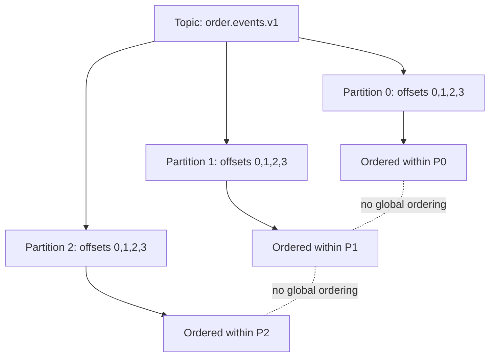
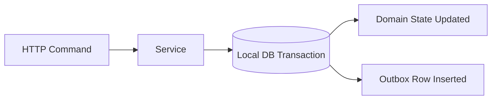
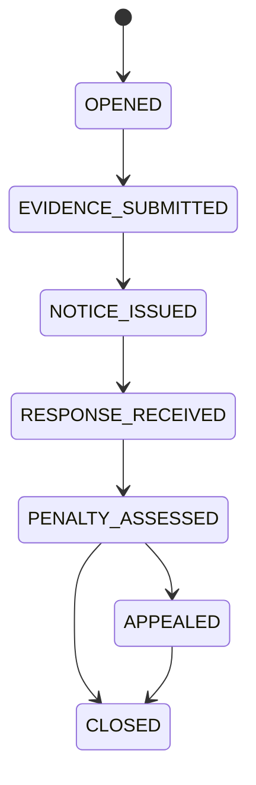
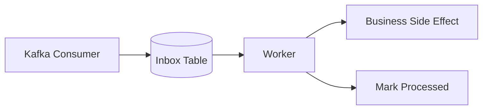
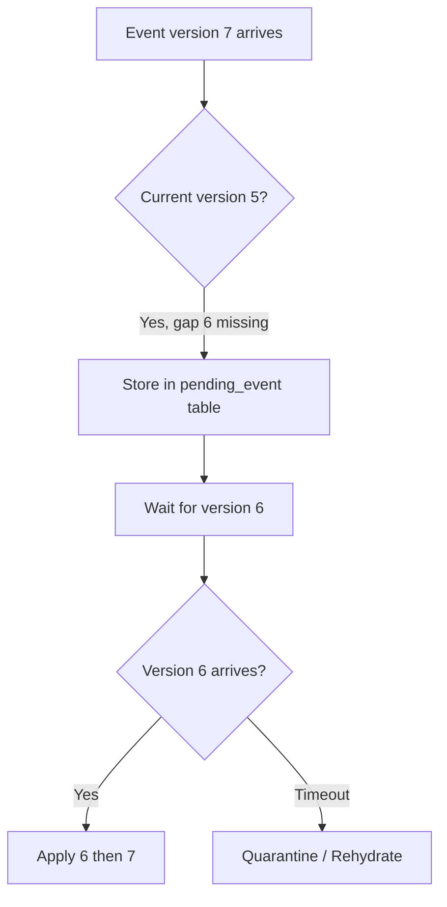

# Part 026 — Ordering, Consistency, and Idempotency

Part 025 covered batching, backpressure, and flow control.

Now we move to the correctness triangle of event-driven systems:

1. **Ordering** — In what sequence should facts be interpreted?
2. **Consistency** — What state is allowed to be visible at each point in time?
3. **Idempotency** — What happens if the same event or command is processed more than once?

The central idea:

> Kafka gives strong ordering within a partition, but business correctness requires explicit design for key choice, sequence, duplicate handling, state transitions, and consistency boundaries.

This is where many Kafka systems fail quietly. They pass load tests, but break under replay, retry, rebalance, cross-partition workflows, or late-arriving events.

---

## 1. Kaufman Skill Decomposition

The target skill is **designing Kafka systems that remain correct under duplicates, retries, replay, partial failure, and distributed timing ambiguity**.

| Subskill | Production Meaning |
|---|---|
| Partition ordering | Understand Kafka’s actual ordering boundary. |
| Domain ordering | Model the order business logic needs, not only broker order. |
| Causal reasoning | Track why one event happened after another. |
| Per-aggregate sequencing | Use version/sequence to protect entity state. |
| Idempotent consumer | Make repeated processing safe. |
| Deduplication | Choose event ID, command ID, aggregate version, or hash-based dedup strategy. |
| Projection consistency | Build read models that converge correctly. |
| External side effects | Prevent duplicate API calls, payments, notifications, or workflow transitions. |
| Replay safety | Ensure historical replay does not corrupt current state. |
| Auditability | Explain why state changed and whether duplicates/out-of-order events were ignored. |

### 1.1 Practice Goal

By the end of this part, you should be able to:

1. Explain why Kafka does not provide global ordering across all partitions.
2. Choose a key that preserves the business ordering boundary.
3. Design an idempotent consumer using database constraints.
4. Detect stale, duplicate, and out-of-order events.
5. Build a projection that tolerates replay.
6. Separate Kafka exactly-once semantics from external side-effect idempotency.

---

## 2. Ordering: The First Misunderstanding

Kafka ordering is often summarized badly as:

> Kafka preserves order.

A production-grade version is:

> Kafka preserves append order within a single topic-partition. It does not provide one global order across all partitions in a topic, nor across multiple topics.



There is no meaningful total order between:

```text
partition-0 offset-100
partition-1 offset-35
partition-2 offset-901
```

Unless your application creates one.

---

## 3. Five Types of Order

Advanced engineers distinguish different meanings of “order.”

| Order Type | Meaning | Example |
|---|---|---|
| Broker order | Order records were appended to a partition. | Offset 11 after offset 10. |
| Producer send order | Order a producer attempted to send records. | Producer called `send(A)` then `send(B)`. |
| Event time order | Order events occurred in the real world/domain. | Payment happened before shipment. |
| Processing order | Order consumer logic handled records. | Worker processed B before A. |
| Visibility order | Order users/systems observed state changes. | UI saw `SHIPPED` before `PAID`. |

Kafka gives you broker order per partition. It does not automatically give event-time order, processing order, visibility order, or cross-service causal order.

### 3.1 Domain Example

Suppose an order lifecycle emits:

```text
OrderCreated(orderId=O-1, version=1)
OrderPaid(orderId=O-1, version=2)
OrderShipped(orderId=O-1, version=3)
```

If all records use key `orderId=O-1`, Kafka will place them on the same partition and preserve their relative broker order.

If keys are inconsistent:

```text
OrderCreated key = customerId
OrderPaid    key = paymentId
OrderShipped key = orderId
```

Those events may go to different partitions. Your consumer can see them in any relative order.

---

## 4. The Ordering Boundary Is a Business Decision

A Kafka key is not only a routing detail. It defines the strongest practical ordering boundary.

| Business Requirement | Likely Key |
|---|---|
| Order lifecycle must be sequential | `orderId` |
| Account balance updates must be sequential | `accountId` |
| Case workflow transition must be sequential | `caseId` |
| Device telemetry only needs per-device order | `deviceId` |
| Tenant isolation matters more than entity ordering | composite `tenantId:entityId` or tenant-aware partitioning |
| Global audit ordering required | separate single-partition audit topic or external sequencer |

The key question:

> Which entity becomes incorrect if its events are processed out of order?

That entity usually belongs in the Kafka key.

---

## 5. Regulatory Workflow Example

Consider an enforcement case lifecycle:

```text
CaseOpened -> EvidenceSubmitted -> NoticeIssued -> ResponseReceived -> PenaltyAssessed -> AppealFiled -> CaseClosed
```

For regulatory defensibility, transitions must be explainable and monotonic.

Bad key strategy:

```text
EvidenceSubmitted key = documentId
NoticeIssued key = officerId
PenaltyAssessed key = penaltyId
AppealFiled key = appealId
```

The case projection may observe:

```text
PenaltyAssessed before NoticeIssued
CaseClosed before AppealFiled
```

Correcter key strategy:

```text
key = caseId
```

Then the case lifecycle has a single partition ordering boundary.

But this has a trade-off: one very active case can become a hot key.

Production design requires choosing between:

- strict per-case ordering,
- throughput via sharding,
- workflow-level sequencing,
- or external state machine enforcement.

---

## 6. When One Partition Is Not Enough

A single key can become a throughput bottleneck.

Examples:

- one tenant produces 60% of traffic,
- one account has millions of transactions,
- one regulatory mega-case has thousands of documents,
- one device sends high-frequency telemetry.

Options:

| Strategy | Benefit | Cost |
|---|---|---|
| Keep strict key | Strong ordering | Hot partition risk |
| Shard key | Higher throughput | Loses strict per-entity order unless re-sequenced |
| Split by sub-entity | Balanced if domain allows | Requires domain decomposition |
| Use command sequencer | Preserves logical order | Adds service and latency |
| Use state machine guard | Allows out-of-order arrival | More complex consumer logic |

### 6.1 Sharded Key Example

```text
key = accountId + ':' + shardNumber
```

This spreads load but destroys natural per-account ordering unless each update is independent or reassembled by sequence.

Use only when the domain allows it.

---

## 7. Consistency Boundaries

Kafka systems are distributed. You must define where consistency is strong and where it is eventual.

### 7.1 Local Transaction Boundary

A service can usually guarantee consistency inside its local database transaction:



Inside the DB transaction:

- state update and outbox insert are atomic,
- constraints can enforce invariant,
- version can be incremented,
- idempotency key can be stored.

Outside that boundary:

- Kafka publication is asynchronous,
- downstream projections are eventually consistent,
- consumers can lag,
- retries can duplicate.

### 7.2 Eventual Consistency Is Not a Bug

Eventual consistency is acceptable when:

- the business tolerates delay,
- stale reads are bounded and observable,
- users get appropriate status,
- reconciliation exists,
- state transitions remain monotonic,
- audit trail explains the sequence.

It is not acceptable when:

- immediate decisioning is required,
- legal/regulatory deadlines depend on visibility,
- duplicate external side effects are harmful,
- stale reads trigger irreversible actions.

---

## 8. Idempotency: The Core Invariant

Idempotency means processing the same input more than once has the same durable effect as processing it once.

```text
apply(event)
apply(event)
apply(event)

final_state == apply(event) once
```

This does not mean the code executes only once. It means the durable business effect occurs only once.

### 8.1 Duplicate Sources

Kafka consumers must expect duplicates from:

- producer retry after uncertain acknowledgement,
- consumer crash after side effect before offset commit,
- rebalance during processing,
- manual replay,
- DLQ replay,
- retry topic reprocessing,
- CDC snapshot + streaming overlap,
- upstream bug,
- cross-region replication/recovery,
- operator backfill.

Duplicates are normal. Design for them.

---

## 9. Four Idempotency Keys

Different use cases need different keys.

| Key Type | Use When | Example |
|---|---|---|
| `eventId` | Each event has a stable unique identity. | `evt-01H...` |
| `commandId` | User/API command must execute once. | `cmd-submit-payment-123` |
| `aggregateId + version` | Entity state transition is sequential. | `caseId=C-1, version=7` |
| business natural key | Operation has natural uniqueness. | invoice number, payment reference |

### 9.1 `eventId`

Good for duplicate suppression at event level.

Weakness: if upstream emits two different event IDs for the same business action, `eventId` dedup does not help.

### 9.2 `commandId`

Good for external commands:

```text
SubmitPayment(commandId=CMD-123, paymentId=P-9)
```

If command is retried, the handler recognizes `CMD-123`.

### 9.3 `aggregateId + version`

Best for ordered state transitions.

```text
CaseStatusChanged(caseId=C-1, version=5, status=NOTICE_ISSUED)
```

The consumer can reject:

- duplicate version,
- stale version,
- future version if gap not allowed.

### 9.4 Natural Business Key

Example:

```text
payment_provider_reference = 'PAY-ABC-999'
```

If the natural key is truly unique and stable, use a database unique constraint.

---

## 10. Database-Backed Idempotent Consumer

The most reliable dedup mechanism is usually a durable store with a uniqueness constraint.

### 10.1 Processed Event Table

```sql
CREATE TABLE processed_kafka_event (
    consumer_name       TEXT NOT NULL,
    topic_name          TEXT NOT NULL,
    partition_number    INTEGER NOT NULL,
    event_id            TEXT NOT NULL,
    processed_at        TIMESTAMPTZ NOT NULL DEFAULT now(),
    PRIMARY KEY (consumer_name, event_id)
);
```

### 10.2 Idempotent Processing Transaction

```java
public final class IdempotentCaseEventConsumer {
    private final CaseProjectionRepository projectionRepository;
    private final ProcessedEventRepository processedEventRepository;

    public void handle(ConsumerRecord<String, CaseEvent> record) {
        CaseEvent event = record.value();

        try {
            projectionRepository.inTransaction(() -> {
                boolean firstTime = processedEventRepository.tryInsert(
                        "case-projection-consumer",
                        record.topic(),
                        record.partition(),
                        event.eventId()
                );

                if (!firstTime) {
                    return; // duplicate event, no durable effect
                }

                projectionRepository.apply(event);
            });
        } catch (Exception e) {
            throw new EventProcessingException(event.eventId(), e);
        }
    }
}
```

`tryInsert` should rely on a unique constraint, not only an application-side check.

Application-side check is race-prone:

```text
if (!exists(eventId)) insert(eventId)
```

Two concurrent workers can both pass `exists`.

Use:

```sql
INSERT INTO processed_kafka_event (...)
VALUES (...)
ON CONFLICT DO NOTHING;
```

---

## 11. Versioned Projection Pattern

For entity state, `eventId` is not enough. You also need version monotonicity.

### 11.1 Projection Table

```sql
CREATE TABLE case_projection (
    case_id             TEXT PRIMARY KEY,
    status              TEXT NOT NULL,
    version             BIGINT NOT NULL,
    last_event_id       TEXT NOT NULL,
    updated_at          TIMESTAMPTZ NOT NULL
);
```

### 11.2 Apply Only Next Version

```sql
UPDATE case_projection
SET status = :newStatus,
    version = :eventVersion,
    last_event_id = :eventId,
    updated_at = now()
WHERE case_id = :caseId
  AND version = :eventVersion - 1;
```

If affected rows = 1, transition applied.

If affected rows = 0, investigate:

| Condition | Meaning | Action |
|---|---|---|
| current version == event version | duplicate | ignore if same event or equivalent state |
| current version > event version | stale event | ignore or audit |
| current version < event version - 1 | gap | hold, retry later, or quarantine |
| no row exists and event version == 1 | create projection | insert |
| no row exists and event version > 1 | missing history | retry/quarantine |

### 11.3 Java Version Guard

```java
public ApplyResult apply(CaseStatusChanged event) {
    int updated = jdbc.update("""
        UPDATE case_projection
        SET status = ?, version = ?, last_event_id = ?, updated_at = now()
        WHERE case_id = ? AND version = ?
        """,
        event.status().name(),
        event.version(),
        event.eventId(),
        event.caseId(),
        event.version() - 1
    );

    if (updated == 1) {
        return ApplyResult.APPLIED;
    }

    CaseProjection current = findById(event.caseId());

    if (current == null && event.version() == 1) {
        insertInitial(event);
        return ApplyResult.APPLIED;
    }

    if (current != null && current.version() >= event.version()) {
        return ApplyResult.DUPLICATE_OR_STALE;
    }

    return ApplyResult.GAP_DETECTED;
}
```

This pattern turns ordering ambiguity into explicit state.

---

## 12. Monotonic State Machine Guard

Some domains should reject invalid transitions even if versions appear sequential.

Example case lifecycle:



Consumer guard:

```java
public boolean canTransition(CaseStatus current, CaseStatus next) {
    return switch (current) {
        case OPENED -> next == CaseStatus.EVIDENCE_SUBMITTED;
        case EVIDENCE_SUBMITTED -> next == CaseStatus.NOTICE_ISSUED;
        case NOTICE_ISSUED -> next == CaseStatus.RESPONSE_RECEIVED;
        case RESPONSE_RECEIVED -> next == CaseStatus.PENALTY_ASSESSED;
        case PENALTY_ASSESSED -> next == CaseStatus.APPEALED || next == CaseStatus.CLOSED;
        case APPEALED -> next == CaseStatus.CLOSED;
        case CLOSED -> false;
    };
}
```

This is not merely defensive programming. It is regulatory defensibility:

- invalid transitions are detected,
- ignored transitions are explainable,
- duplicate events do not rewrite history,
- stale events cannot roll back status.

---

## 13. Idempotent External Side Effects

Kafka exactly-once processing does not automatically make external side effects exactly-once.

External side effects include:

- charging a card,
- sending email/SMS,
- creating a ticket,
- calling a government registry,
- updating a third-party CRM,
- invoking a workflow engine,
- sending a webhook.

If a consumer crashes after the side effect but before committing the offset, Kafka will redeliver the record. Your code may call the external system again.

### 13.1 External Idempotency Key

Use an idempotency key at the external API boundary.

```java
PaymentRequest request = new PaymentRequest(
        event.paymentId(),
        event.amount(),
        event.currency()
);

paymentGateway.charge(
        event.commandId(), // idempotency key
        request
);
```

The external system should guarantee:

```text
same idempotency key + same payload => same result
same idempotency key + different payload => conflict
```

If the external system does not support idempotency, build your own outbox/inbox around that side effect and accept operational risk.

---

## 14. Inbox Pattern

The inbox pattern stores incoming messages before processing them.



Use when:

- side effect is expensive,
- processing needs retries independent of Kafka polling,
- external API has rate limits,
- you need operator visibility into pending work,
- you need strong dedup around external side effects.

### 14.1 Inbox Table

```sql
CREATE TABLE message_inbox (
    message_id      TEXT PRIMARY KEY,
    source_topic    TEXT NOT NULL,
    source_partition INTEGER NOT NULL,
    source_offset   BIGINT NOT NULL,
    payload         JSONB NOT NULL,
    status          TEXT NOT NULL,
    attempt_count   INTEGER NOT NULL DEFAULT 0,
    next_attempt_at TIMESTAMPTZ,
    created_at      TIMESTAMPTZ NOT NULL DEFAULT now(),
    updated_at      TIMESTAMPTZ NOT NULL DEFAULT now()
);
```

Consumer responsibility:

1. Insert inbox row idempotently.
2. Commit Kafka offset after inbox insert.
3. Let controlled workers process inbox rows.

This shifts retry/flow control from Kafka consumer loop to a durable work table.

---

## 15. Ledger Pattern

For financial or audit-grade systems, avoid overwriting state blindly.

Instead of:

```sql
UPDATE account SET balance = balance + :amount;
```

Use a ledger:

```sql
CREATE TABLE account_ledger_entry (
    ledger_entry_id TEXT PRIMARY KEY,
    account_id      TEXT NOT NULL,
    event_id        TEXT NOT NULL UNIQUE,
    amount_delta    NUMERIC NOT NULL,
    entry_type      TEXT NOT NULL,
    created_at      TIMESTAMPTZ NOT NULL DEFAULT now()
);
```

The balance is derived from ledger entries or maintained with strict transactional updates.

Benefits:

- duplicate events rejected by `event_id` unique constraint,
- audit trail preserved,
- corrections can be additive instead of destructive,
- replay can rebuild balance.

---

## 16. Handling Out-of-Order Events

When an event arrives out of order, choose one of four strategies.

| Strategy | Use When | Risk |
|---|---|---|
| Ignore stale events | Projection already moved forward. | May hide upstream disorder if not audited. |
| Hold future events | Missing prior events may arrive soon. | Requires buffer and timeout. |
| Requery source of truth | Projection can repair from authoritative store. | Adds load and coupling. |
| Quarantine | Event violates invariant. | Requires operational process. |

### 16.1 Gap Buffer



This is useful for domains where short-term disorder is expected but strict sequence is required.

---

## 17. Replay Safety

Replay is one of Kafka’s superpowers. It is also one of the fastest ways to corrupt a poorly designed system.

A replay-safe consumer must answer:

1. Will duplicate events be ignored?
2. Will external side effects be suppressed?
3. Will stale events roll back current state?
4. Will projections be rebuilt into a separate target or overwrite live state?
5. Is replay bounded by topic, partition, offset, timestamp, or event ID?
6. Are schema versions still readable?
7. Are correction events handled correctly?

### 17.1 Safe Projection Rebuild

Safer approach:

```text
old projection table: case_projection
new projection table: case_projection_rebuild_20260701
```

Steps:

1. Create new projection table.
2. Replay from earliest offset into new table.
3. Validate counts/checksums/business invariants.
4. Switch read traffic.
5. Keep old table for rollback window.

Avoid replaying destructive side effects directly into live systems.

---

## 18. Consistency Pattern Matrix

| Pattern | Ordering Strategy | Idempotency Strategy | Best For |
|---|---|---|---|
| Idempotent projection | key by aggregate ID | event ID + version guard | read models |
| Inbox worker | key by work entity | inbox primary key | external side effects |
| Ledger | key by account/case | unique ledger entry/event ID | financial/audit trail |
| State machine guard | key by workflow ID | version + transition validation | lifecycle systems |
| Compacted state topic | key by entity ID | latest value/tombstone | cache/read-side state |
| Command handler | key by aggregate ID | command ID | user/API commands |
| Reconciliation job | batch key/range | natural key/upsert | repair/backfill |

---

## 19. Kafka Streams Considerations

Kafka Streams can provide exactly-once processing for Kafka read-process-write boundaries, but it does not remove domain ordering requirements.

Watch for:

- repartition changing physical partition placement,
- joins requiring co-partitioning,
- windowed joins accepting out-of-order data within grace period,
- state store restoration replaying changelog data,
- tombstones in KTables,
- external side effects inside processors.

If your topology writes only to Kafka and state stores, Kafka Streams exactly-once can be powerful.

If your topology calls external APIs, you still need external idempotency.

---

## 20. Testing Ordering and Idempotency

Unit tests are not enough. You need scenario tests.

### 20.1 Required Test Cases

| Test | Expected Behavior |
|---|---|
| Same event delivered twice | second delivery ignored |
| Event version 3 before version 2 | held/quarantined/rejected explicitly |
| Stale event after current version 5 | ignored and audited |
| Crash after DB write before offset commit | redelivery does not duplicate state |
| Crash after external API call before offset commit | idempotency key suppresses duplicate side effect |
| DLQ replay | no duplicate durable effect |
| Full topic replay | projection rebuild deterministic |
| Invalid state transition | rejected/quarantined with reason |

### 20.2 Example Test Shape

```java
@Test
void duplicateEventShouldNotChangeProjectionTwice() {
    CaseStatusChanged event = new CaseStatusChanged(
            "evt-1",
            "case-1",
            1L,
            CaseStatus.OPENED
    );

    consumer.handle(record(event));
    consumer.handle(record(event));

    CaseProjection projection = repository.findByCaseId("case-1");
    assertThat(projection.version()).isEqualTo(1L);
    assertThat(processedEventRepository.countByEventId("evt-1")).isEqualTo(1);
}
```

---

## 21. Observability

Ordering and idempotency need explicit metrics.

Track:

| Metric | Meaning |
|---|---|
| duplicate event count | upstream retry/replay or bug rate |
| stale event count | out-of-order or replay volume |
| version gap count | missing event or disorder |
| invalid transition count | domain invariant violation |
| idempotency conflict count | same key with different payload |
| external duplicate suppression count | side-effect replay avoided |
| quarantine count | records requiring operator review |
| projection rebuild checksum mismatch | non-deterministic projection logic |

A mature Kafka platform treats ignored duplicates as important signals, not silent success.

---

## 22. Anti-Patterns

### 22.1 “Exactly-Once Means No Duplicates Anywhere”

Exactly-once processing has a boundary. External systems, databases, APIs, and humans require separate idempotency design.

### 22.2 “Use Timestamp to Decide Latest State”

Timestamps can be skewed, delayed, or corrected. Use version/sequence when correctness matters.

### 22.3 “Key by Tenant Only”

This may preserve tenant grouping but destroy entity-level ordering if multiple entities under the same tenant interleave heavily.

### 22.4 “Dedup in Memory”

In-memory dedup disappears on restart and does not protect multiple instances.

### 22.5 “Replay Directly Into Side Effects”

Historical replay can resend emails, duplicate payments, or re-trigger workflows.

### 22.6 “Ignore Out-of-Order Events Without Metrics”

Silent ignore hides upstream defects.

### 22.7 “Use Global Ordering as a Requirement Without Challenging It”

Global ordering is expensive and often unnecessary. Usually the real requirement is per-entity, per-account, per-case, or per-workflow ordering.

---

## 23. Production Checklist

### Ordering

- What is the required ordering boundary?
- Is the Kafka key aligned with that boundary?
- Are all events for the same aggregate keyed consistently?
- Are repartition operations understood?
- Are cross-topic ordering assumptions avoided?
- Are hot keys identified and accepted or mitigated?

### Consistency

- Where is strong consistency required?
- Where is eventual consistency acceptable?
- What is the source of truth?
- Can projections be rebuilt deterministically?
- Are stale reads acceptable in the user journey?
- Is reconciliation available?

### Idempotency

- What key suppresses duplicates?
- Is dedup durable and shared across instances?
- Are database unique constraints used?
- Are external side effects idempotent?
- Are command idempotency and event dedup separated?
- Are DLQ and replay safe?

### Auditability

- Can we explain why an event was ignored?
- Can we explain why a transition was rejected?
- Can we reconstruct state from event history?
- Are correction events modeled explicitly?
- Are operator actions logged?

---

## 24. Lab: Build an Idempotent Case Projection

### 24.1 Scenario

You consume `case.lifecycle.events.v1` and build `case_projection` for a regulatory case-management UI.

Events contain:

```json
{
  "eventId": "evt-123",
  "caseId": "case-456",
  "version": 7,
  "eventType": "NOTICE_ISSUED",
  "occurredAt": "2026-07-01T10:00:00Z"
}
```

### 24.2 Tasks

1. Use `caseId` as Kafka key.
2. Create `processed_kafka_event` table with unique `eventId` per consumer.
3. Create `case_projection` with `caseId`, `status`, `version`, and `lastEventId`.
4. Apply only `version = currentVersion + 1`.
5. Ignore duplicate/stale events with metrics.
6. Quarantine future events with version gaps.
7. Reject invalid lifecycle transitions.
8. Write tests for duplicate, stale, gap, invalid transition, and replay.
9. Add dashboard panels for duplicate count, stale count, gap count, and invalid transition count.

### 24.3 Expected Learning

You should learn that correctness is not a single Kafka configuration. It is a set of domain and storage invariants:

```text
same event -> one durable effect
same aggregate -> monotonic version
invalid transition -> rejected
missing prior event -> gap detected
replay -> deterministic result
```

---

## 25. Architecture Review Questions

Use these questions in a design review:

1. What is the exact business ordering requirement?
2. What Kafka key implements that requirement?
3. What happens if events arrive out of order?
4. What happens if the same event is processed twice?
5. What happens if the consumer crashes after DB write but before offset commit?
6. What happens if the consumer crashes after external API call but before offset commit?
7. Can we replay the topic without side effects?
8. Can we rebuild projections from scratch?
9. Are stale events ignored, held, or quarantined?
10. Are invalid transitions visible to operators?
11. Does the design require impossible global ordering?
12. Can auditors understand why final state was reached?

---

## 26. Summary

Kafka gives you an ordered log per partition. Business correctness requires much more:

- choose the key that matches the domain ordering boundary,
- use durable idempotency keys,
- protect state with version guards,
- reject invalid transitions,
- design external side effects with idempotency,
- make replay deterministic,
- measure duplicates, stale events, and gaps.

The core invariant:

> Every consumer must be safe under duplicate delivery, replay, crash recovery, and out-of-order arrival according to the domain’s declared consistency model.

In Part 027, we move from consumer-local correctness to **multi-service transaction boundaries**: local transactions, outbox, Kafka transactions, saga, compensation, workflow boundary, and regulatory auditability across services.

---

## 27. References

- Apache Kafka Documentation — topic partitions, ordering, producer/consumer behavior, delivery guarantees, and event streaming model.
- Confluent Documentation — Kafka partition key, delivery semantics, Schema Registry, Kafka Streams, and client behavior.
- Enterprise integration and distributed systems practice — idempotent receiver, inbox/outbox, saga, ledger, and projection rebuild patterns.
