# Part 027 — Multi-Service Transaction Boundaries

Part 026 covered ordering, consistency, and idempotency.

Now we address one of the hardest parts of Kafka architecture:

> How do we keep a multi-service system correct when one business action touches a local database, Kafka topics, downstream services, external APIs, and sometimes a workflow engine?

The short answer:

> Kafka gives strong primitives for durable event logs, consumer offsets, idempotent producers, and Kafka-native transactions. It does not magically make your database, payment provider, notification system, search index, and case-management workflow part of one global ACID transaction.

This part is about **transaction boundary design**.

A top-level Kafka engineer should be able to answer these questions clearly:

1. What is the atomic boundary of this operation?
2. Which side effects can happen twice?
3. Which side effects can be delayed?
4. Which side effects require compensation?
5. Which state is authoritative?
6. Which event is audit-grade evidence?
7. How do we recover after crash, replay, and partial commit?

---

## 1. Kaufman Skill Decomposition

The target skill is **designing event-driven workflows that remain correct without pretending distributed ACID exists everywhere**.

| Subskill | Production Meaning |
|---|---|
| Transaction boundary modeling | Know exactly what commits atomically and what does not. |
| Dual-write diagnosis | Detect unsafe DB + Kafka write patterns. |
| Outbox design | Publish reliable events after local DB commit. |
| CDC reasoning | Understand how database log capture changes reliability and latency. |
| Kafka transaction usage | Use transactions for Kafka read-process-write boundaries only where appropriate. |
| Inbox/idempotency | Protect consumers from duplicates and replay. |
| Saga design | Coordinate long-running multi-service workflows through events/commands. |
| Compensation | Undo or neutralize business effects when rollback is impossible. |
| Auditability | Preserve enough evidence to explain every transition. |
| Failure matrix design | Enumerate crash points and recovery behavior before implementation. |

### 1.1 Practice Goal

By the end of this part, you should be able to:

1. Explain why dual-write is unsafe.
2. Choose between direct publish, Kafka transaction, outbox, CDC, and saga.
3. Design an outbox table and publisher that is replay-safe.
4. Use Kafka transactions only inside the correct boundary.
5. Build an inbox/idempotent consumer for downstream services.
6. Model a multi-service order workflow as a saga.
7. Write an architecture decision record for transaction strategy.

---

## 2. The Central Boundary Problem

Consider this Java service:

```java
public Quote approveQuote(ApproveQuoteCommand command) {
    Quote quote = quoteRepository.findById(command.quoteId());
    quote.approve(command.apverId());
    quoteRepository.save(quote);

    kafkaTemplate.send("quote.approved.v1", quote.id(), QuoteApproved.from(quote));

    return quote;
}
```

It looks simple. It is also dangerous.

There are two separate systems:

1. The local database.
2. Kafka.

They do not commit atomically in this code.

### 2.1 Failure Matrix

| Step | DB State | Kafka State | Failure Effect |
|---|---:|---:|---|
| Before DB commit | unchanged | no event | Safe retry. |
| After DB commit, before Kafka send | approved | no event | Invisible state change to downstream services. |
| After Kafka send, before response | approved | event published | Client may retry and produce duplicate intent. |
| Kafka send succeeds but acknowledgement lost | approved | event may exist | Producer may retry. |
| DB rollback after Kafka send | not approved | event exists | Downstream observes false fact. |

This is the **dual-write problem**.

> Dual-write means one business operation writes to two durable systems without one atomic commit boundary covering both writes.

Kafka does not remove this problem. It gives patterns to design around it.

---

## 3. Transaction Boundary Vocabulary

Before choosing a pattern, define the boundaries.

| Boundary | Atomic? | Example |
|---|---:|---|
| Local DB transaction | Yes, within one database | Update order + insert outbox row. |
| Kafka producer transaction | Yes, within Kafka topics/partitions and consumed offsets | Consume input, produce output, commit offsets atomically. |
| DB + Kafka transaction | Usually no | Updating PostgreSQL and publishing Kafka event. |
| Kafka + external REST API | No | Consume event then call payment gateway. |
| Multi-service business workflow | No global atomic commit | Quote → order → payment → fulfillment. |
| Regulatory case lifecycle | Usually long-running, stateful, auditable | Case opened → evidence requested → escalation → enforcement action. |

A strong design does not hide these boundaries. It makes them explicit.

---

## 4. The Wrong Pattern: Local DB Then Kafka Send

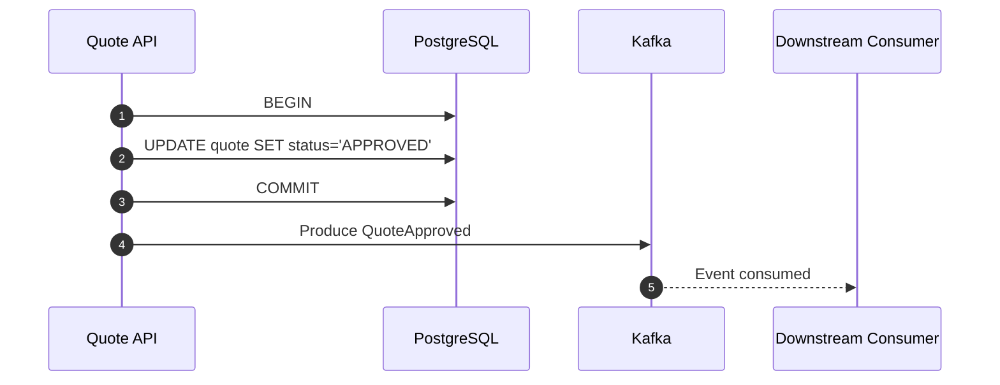

The dangerous window is between DB commit and Kafka publish.

If the service crashes in that window, the quote is approved but no event exists.

### 4.1 When Is Direct Publish Acceptable?

Direct publish can be acceptable only when the event is not part of the correctness model.

Examples:

| Use Case | Direct Publish Acceptable? | Reason |
|---|---:|---|
| Debug telemetry | Yes | Loss is tolerable. |
| Cache warm notification | Maybe | Cache can be rebuilt. |
| Audit event | No | Loss breaks evidence. |
| Billing event | No | Loss causes financial inconsistency. |
| Workflow transition | No | Downstream lifecycle stalls. |
| Regulatory enforcement state | No | Loss breaks defensibility. |

A useful rule:

> If a downstream service must observe the event for the business process to remain correct, do not use naive dual-write.

---

## 5. Pattern 1 — Transactional Outbox

Transactional outbox solves the DB + Kafka dual-write problem by writing the business state and an event record in the **same local database transaction**.

The event is later published to Kafka by a relay process.

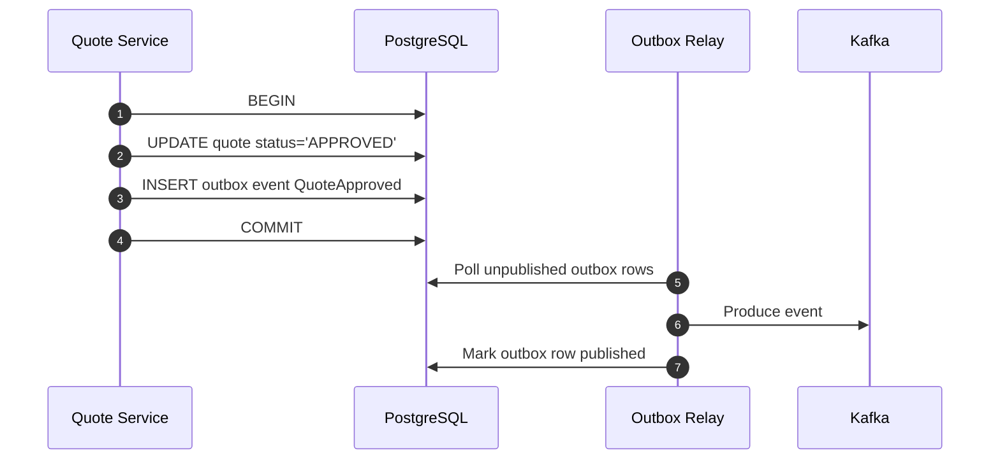

The local DB commit becomes the source of truth for both:

1. Entity state.
2. Intent to publish event.

### 5.1 Outbox Table Design

```sql
CREATE TABLE outbox_event (
    id                 UUID PRIMARY KEY,
    aggregate_type     VARCHAR(100) NOT NULL,
    aggregate_id       VARCHAR(100) NOT NULL,
    aggregate_version  BIGINT NOT NULL,
    event_type         VARCHAR(200) NOT NULL,
    event_version      INTEGER NOT NULL,
    topic              VARCHAR(200) NOT NULL,
    partition_key      VARCHAR(300) NOT NULL,
    payload            JSONB NOT NULL,
    headers            JSONB NOT NULL DEFAULT '{}',
    status             VARCHAR(30) NOT NULL DEFAULT 'PENDING',
    attempt_count      INTEGER NOT NULL DEFAULT 0,
    next_attempt_at    TIMESTAMPTZ NOT NULL DEFAULT now(),
    created_at         TIMESTAMPTZ NOT NULL DEFAULT now(),
    published_at       TIMESTAMPTZ,
    last_error         TEXT
);

CREATE INDEX idx_outbox_pending
ON outbox_event (status, next_attempt_at, created_at)
WHERE status IN ('PENDING', 'FAILED_RETRYABLE');

CREATE UNIQUE INDEX uq_outbox_aggregate_event
ON outbox_event (aggregate_type, aggregate_id, aggregate_version, event_type);
```

Important fields:

| Field | Purpose |
|---|---|
| `id` | Stable event ID for deduplication. |
| `aggregate_id` | Business entity boundary. |
| `aggregate_version` | Monotonic transition guard. |
| `event_type` | Semantic event name. |
| `topic` | Destination topic. |
| `partition_key` | Kafka key chosen intentionally. |
| `payload` | Event body. |
| `headers` | Correlation, causation, tenant, trace, schema metadata. |
| `status` | Relay lifecycle. |
| `attempt_count` | Retry control. |
| `last_error` | Operational debugging. |

### 5.2 Application Transaction Example

```java
public final class QuoteApprovalService {
    private final QuoteMapper quoteMapper;
    private final OutboxEventMapper outboxMapper;
    private final TransactionManager tx;

    public Quote approve(ApproveQuoteCommand command) {
        return tx.required(() -> {
            Quote quote = quoteMapper.findForUpdate(command.quoteId())
                    .orElseThrow(() -> new NotFoundException("quote not found"));

            quote.approve(command.approverId());
            quoteMapper.updateStatusAndVersion(quote);

            QuoteApproved event = QuoteApproved.from(quote, command.correlationId());

            outboxMapper.insert(new OutboxEventRow(
                    event.eventId(),
                    "Quote",
                    quote.id().toString(),
                    quote.version(),
                    "QuoteApproved",
                    1,
                    "quote.approved.v1",
                    quote.id().toString(),
                    Json.write(event),
                    Json.write(EventHeaders.from(command))
            ));

            return quote;
        });
    }
}
```

The key invariant:

> If the quote is approved, the outbox row exists. If the transaction rolls back, neither the quote transition nor the outbox event exists.

### 5.3 Relay Publisher Example

```java
public final class OutboxRelay implements Runnable {
    private final OutboxEventMapper outboxMapper;
    private final KafkaProducer<String, byte[]> producer;
    private final TransactionManager tx;

    @Override
    public void run() {
        List<OutboxEventRow> batch = outboxMapper.claimBatch(100);

        for (OutboxEventRow row : batch) {
            try {
                ProducerRecord<String, byte[]> record = new ProducerRecord<>(
                        row.topic(),
                        row.partitionKey(),
                        row.payloadBytes()
                );
                record.headers().add("event-id", row.id().toString().getBytes(UTF_8));
                record.headers().add("event-type", row.eventType().getBytes(UTF_8));
                record.headers().add("aggregate-id", row.aggregateId().getBytes(UTF_8));

                producer.send(record).get();

                tx.required(() -> {
                    outboxMapper.markPublished(row.id());
                    return null;
                });
            } catch (Exception ex) {
                tx.required(() -> {
                    outboxMapper.markRetryableFailure(row.id(), ex.getMessage());
                    return null;
                });
            }
        }
    }
}
```

This simple relay is understandable but has one subtle issue:

> Publishing to Kafka and marking the row as published are still two separate systems.

If the relay publishes successfully and crashes before `markPublished`, it may publish the same event again later.

Therefore downstream consumers must still be idempotent.

### 5.4 Outbox Guarantee

Transactional outbox gives:

| Property | Guarantee |
|---|---|
| DB state + event intent atomicity | Yes |
| Event eventually published | Yes, if relay operates correctly |
| Kafka event exactly once globally | No |
| Duplicate event possible | Yes |
| Consumer idempotency still required | Yes |
| Auditability | Strong if event row is retained |

Outbox changes the problem from:

> “Event may be lost.”

into:

> “Event may be duplicated, but not silently lost.”

That is usually the better failure mode.

---

## 6. Pattern 2 — CDC Outbox

Instead of polling the outbox table directly, a CDC connector can read the database transaction log and publish changes to Kafka.

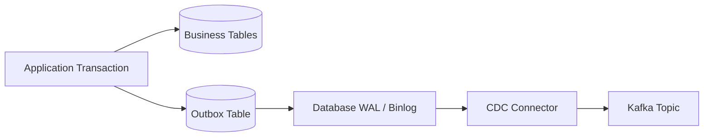

This pattern is common with Debezium.

### 6.1 Why CDC Helps

| Concern | Polling Relay | CDC Outbox |
|---|---|---|
| Extra DB polling load | Yes | Lower, reads log |
| Event order relative to DB commit | Approximate by polling | Based on log order |
| Operational dependency | Application-owned relay | Kafka Connect + connector |
| Transformation | Application code | Connector SMT / routing |
| Failure surface | App scheduler + DB + Kafka | Connect cluster + DB log + Kafka |

CDC outbox is powerful, but it moves operational complexity to Kafka Connect and the database log configuration.

### 6.2 CDC Outbox Invariants

1. The outbox row is inserted in the same transaction as business state.
2. The CDC connector reads only committed changes.
3. The connector publishes to Kafka with stable key and payload routing.
4. The consumer remains idempotent.
5. Connector lag is monitored as part of business process latency.

### 6.3 When CDC Outbox Is Better

Use CDC outbox when:

1. You already operate Kafka Connect reliably.
2. Multiple services need consistent outbox publishing.
3. Polling overhead is unacceptable.
4. You want database commit order to be reflected more naturally.
5. You need operational uniformity across many services.

Avoid CDC outbox when:

1. The team cannot operate connectors, offsets, and schema routing.
2. The database log retention is too short for outage recovery.
3. The application needs complex custom publish logic that does not belong in connector transforms.
4. Security policy does not allow CDC access to the database log.

---

## 7. Pattern 3 — Kafka Transactions

Kafka transactions are useful when the atomic boundary is inside Kafka.

Typical read-process-write flow:

1. Consume from input topic.
2. Process records.
3. Produce to output topic.
4. Commit consumed offsets.
5. Make output records and offset commits atomic.

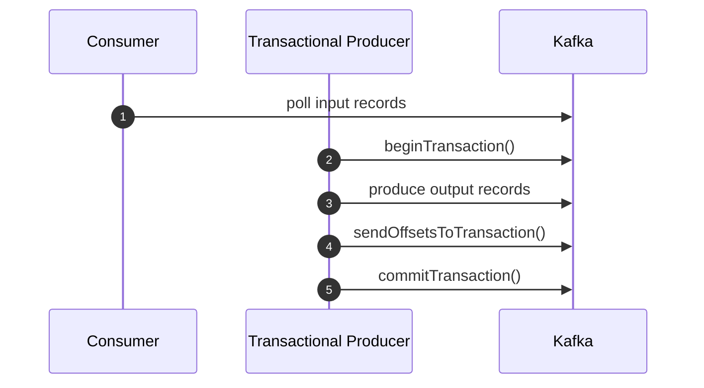

### 7.1 Java Transaction Skeleton

```java
Properties props = new Properties();
props.put(ProducerConfig.BOOTSTRAP_SERVERS_CONFIG, bootstrapServers);
props.put(ProducerConfig.KEY_SERIALIZER_CLASS_CONFIG, StringSerializer.class.getName());
props.put(ProducerConfig.VALUE_SERIALIZER_CLASS_CONFIG, ByteArraySerializer.class.getName());
props.put(ProducerConfig.TRANSACTIONAL_ID_CONFIG, "risk-score-worker-7");
props.put(ProducerConfig.ENABLE_IDEMPOTENCE_CONFIG, "true");

KafkaProducer<String, byte[]> producer = new KafkaProducer<>(props);
producer.initTransactions();

while (running) {
    ConsumerRecords<String, byte[]> records = consumer.poll(Duration.ofMillis(500));
    if (records.isEmpty()) {
        continue;
    }

    try {
        producer.beginTransaction();

        for (ConsumerRecord<String, byte[]> record : records) {
            ProducerRecord<String, byte[]> output = transform(record);
            producer.send(output);
        }

        Map<TopicPartition, OffsetAndMetadata> offsets = currentOffsets(records);
        producer.sendOffsetsToTransaction(offsets, consumer.groupMetadata());
        producer.commitTransaction();
    } catch (ProducerFencedException fatal) {
        throw fatal;
    } catch (Exception retryable) {
        producer.abortTransaction();
    }
}
```

### 7.2 What Kafka Transactions Do Guarantee

| Scenario | Covered? | Explanation |
|---|---:|---|
| Input offsets + output records atomic in Kafka | Yes | Offsets and output are committed together. |
| Duplicate output from retry inside Kafka transaction | Prevented for committed transactions | Aborted transactions are hidden from `read_committed` consumers. |
| Zombie producer fencing | Yes | `transactional.id` fences old producers. |
| Local DB update atomic with Kafka output | No | DB is outside Kafka transaction. |
| External REST call atomic with Kafka output | No | REST system is outside Kafka transaction. |
| Email/payment/notification exactly once | No | Requires external idempotency. |

### 7.3 When to Use Kafka Transactions

Use Kafka transactions when:

1. The workflow is Kafka-in/Kafka-out.
2. Outputs are derived from consumed records.
3. Offsets and outputs must move together.
4. You can control consumer isolation level.
5. You understand transaction timeout and fencing behavior.

Do not use Kafka transactions as a substitute for outbox when the local database is authoritative.

---

## 8. Pattern 4 — Inbox Pattern

The inbox pattern records consumed event IDs before or during business processing.

It protects consumers from duplicates caused by retry, replay, relay crash, or producer uncertainty.

```sql
CREATE TABLE inbox_event (
    consumer_name   VARCHAR(150) NOT NULL,
    event_id        UUID NOT NULL,
    topic           VARCHAR(200) NOT NULL,
    partition_no    INTEGER NOT NULL,
    offset_no       BIGINT NOT NULL,
    processed_at    TIMESTAMPTZ NOT NULL DEFAULT now(),
    PRIMARY KEY (consumer_name, event_id)
);
```

### 8.1 Consumer Example

```java
public void handle(ConsumerRecord<String, QuoteApproved> record) {
    QuoteApproved event = record.value();

    tx.required(() -> {
        boolean firstTime = inboxMapper.insertIfAbsent(
                "order-service.quote-approved-handler",
                event.eventId(),
                record.topic(),
                record.partition(),
                record.offset()
        );

        if (!firstTime) {
            return null;
        }

        orderMapper.createDraftOrderIfAbsent(
                event.quoteId(),
                event.customerId(),
                event.approvedPrice()
        );

        return null;
    });
}
```

The invariant:

> The business side effect and the inbox record are committed together in the consumer database.

This makes duplicate events safe.

### 8.2 Inbox vs Dedup Table

| Pattern | Main Use |
|---|---|
| Inbox table | Record consumed event identity. |
| Dedup table | Prevent duplicate commands or requests. |
| Ledger table | Preserve append-only business facts. |
| Projection version column | Ignore stale aggregate versions. |

In high-integrity workflows, you often use more than one.

---

## 9. Pattern 5 — Saga

A saga coordinates a long-running business process using a series of local transactions and messages.

Each step commits locally. If a later step fails, the system executes compensating actions.

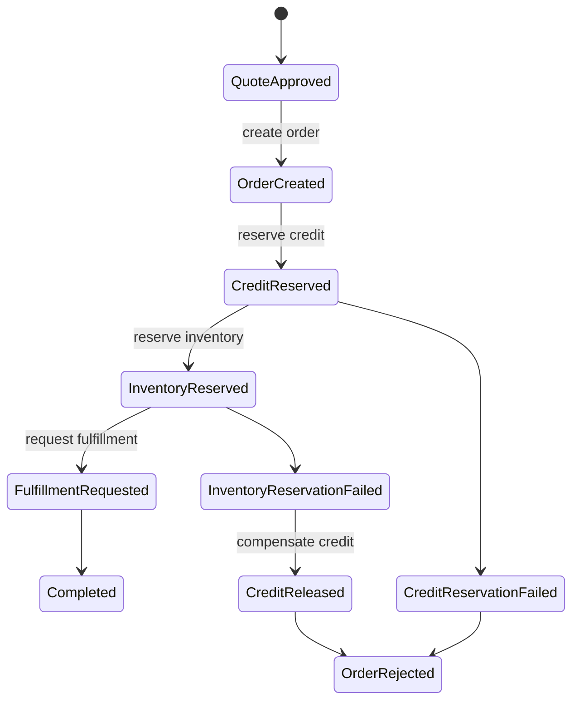

### 9.1 Choreography Saga

In choreography, services react to each other’s events.

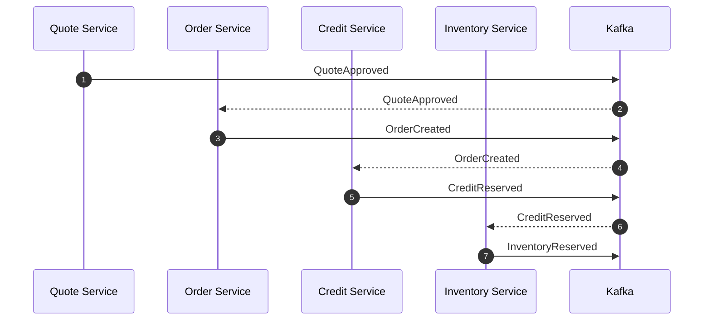

Pros:

1. No central coordinator.
2. Services are loosely coupled at runtime.
3. Good for simple flows.

Cons:

1. Hard to see global process state.
2. Failure handling is distributed.
3. Compensation logic may be scattered.
4. Audit trail must be reconstructed from many topics.

### 9.2 Orchestration Saga

In orchestration, a coordinator decides the next command.

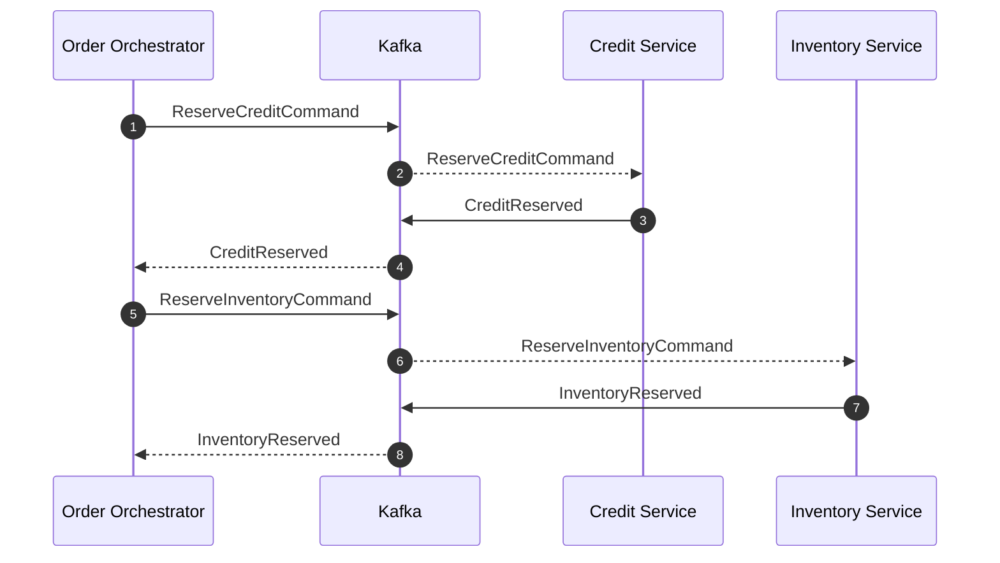

Pros:

1. Global workflow state is explicit.
2. Easier timeout handling.
3. Easier regulatory audit narrative.
4. Compensation is centralized.

Cons:

1. Coordinator can become a coupling point.
2. Requires careful state machine design.
3. More operational responsibility.

### 9.3 Choreography vs Orchestration Decision Matrix

| Criterion | Choreography | Orchestration |
|---|---|---|
| Simple event propagation | Strong | Overkill |
| Complex branching | Weak | Strong |
| Regulatory traceability | Medium | Strong |
| Team autonomy | Strong | Medium |
| Central process visibility | Weak | Strong |
| Timeout handling | Distributed | Centralized |
| Compensation | Scattered | Explicit |
| Debuggability | Harder | Easier |

For complex case management, enforcement lifecycle, or order orchestration, orchestration often wins because the process itself is a first-class domain object.

---

## 10. Commands, Events, and Saga Boundaries

Do not blur command and event semantics.

| Message | Meaning | Example |
|---|---|---|
| Command | Please do this | `ReserveCreditCommand` |
| Event | This happened | `CreditReserved` |
| Rejection event | This requested action failed | `CreditReservationRejected` |
| Timeout event | Expected response did not arrive | `CreditReservationTimedOut` |
| Compensation command | Please undo/neutralize previous effect | `ReleaseCreditCommand` |
| Compensation event | Undo/neutralization happened | `CreditReleased` |

A common anti-pattern is naming commands as events:

```text
Bad:  CreditShouldBeReserved
Good: ReserveCreditCommand
Good: CreditReserved
Good: CreditReservationRejected
```

Events are facts. Commands are requests.

---

## 11. Compensation Is Not Rollback

Rollback means the original change never became visible.

Compensation means a later action neutralizes or reverses the business effect.

| Original Action | Compensation |
|---|---|
| Reserve credit | Release credit |
| Create draft order | Cancel draft order |
| Request fulfillment | Send cancellation request |
| Open enforcement case | Close as superseded / withdrawn |
| Notify customer | Send correction notice |

Compensation must be modeled as real business behavior.

Do not hide it as technical cleanup.

### 11.1 Compensation Event Design

```json
{
  "eventId": "4a8b1a9c-b6d8-43e7-a722-b43eac4b9a43",
  "eventType": "CreditReleased",
  "eventVersion": 1,
  "correlationId": "order-2026-00019",
  "causationId": "InventoryReservationRejected.eventId",
  "aggregateId": "credit-reservation-8831",
  "reason": "INVENTORY_UNAVAILABLE",
  "releasedAmount": "1200000.00",
  "occurredAt": "2026-07-01T10:15:30Z"
}
```

For audit-grade systems, compensation should answer:

1. What was reversed?
2. Why was it reversed?
3. Who or what caused it?
4. Was the original effect visible?
5. What state is valid now?

---

## 12. Timeout as a Domain Event

Distributed systems cannot assume silence means success.

A saga step needs timeout policy.

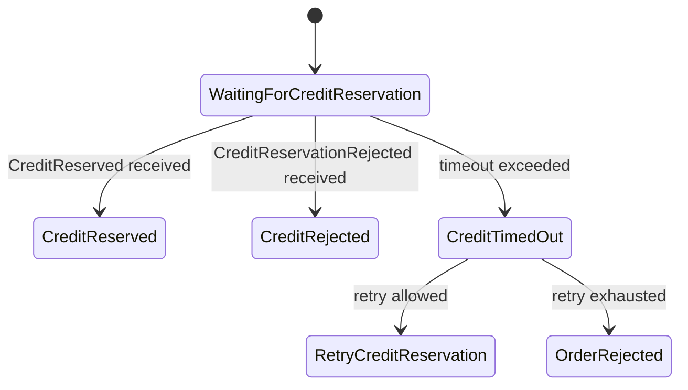

A timeout should usually become an explicit state transition, not just a log line.

### 12.1 Timeout Policy

| Field | Example |
|---|---|
| Step | `WAITING_FOR_CREDIT_RESERVATION` |
| Deadline | `2026-07-01T10:20:00Z` |
| Retry limit | `3` |
| Retry backoff | exponential, capped |
| Timeout event | `CreditReservationTimedOut` |
| Compensation | `CancelOrderCommand` or `ReleaseCreditCommand` |

---

## 13. Workflow Engine Boundary

Kafka is not a workflow engine.

Kafka is excellent at durable event distribution. It does not automatically provide:

1. Human task assignment.
2. Timers as business objects.
3. Visual process instance state.
4. BPMN decision gateways.
5. Built-in compensation modeling.
6. Case lifecycle audit views.

For complex process orchestration, Kafka often works beside a workflow engine.

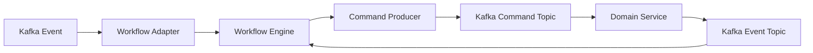

The key design question:

> Is Kafka carrying facts and commands, while the workflow engine owns process state? Or is a Kafka Streams/Java service owning process state?

Both can work. Mixing them without clear ownership creates subtle bugs.

---

## 14. Reference Architecture: Order Saga with Outbox and Inbox

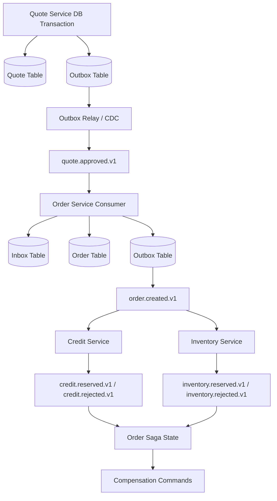

Notice the repeated pattern:

1. Consume event idempotently.
2. Update local state.
3. Insert outbox event/command.
4. Publish asynchronously.
5. Downstream consumes idempotently.

This is the backbone of reliable event-driven workflows.

---

## 15. State Machine Guard for Workflow Correctness

A saga should reject invalid transitions.

```java
public enum OrderSagaState {
    STARTED,
    CREDIT_RESERVED,
    INVENTORY_RESERVED,
    READY_FOR_FULFILLMENT,
    COMPENSATING,
    REJECTED,
    COMPLETED
}
```

```java
public void apply(CreditReserved event) {
    if (state != OrderSagaState.STARTED) {
        throw new InvalidTransitionException(state, "CreditReserved");
    }
    this.creditReservationId = event.reservationId();
    this.state = OrderSagaState.CREDIT_RESERVED;
    this.version++;
}
```

For replay-tolerant consumers, invalid transition handling should distinguish:

| Case | Action |
|---|---|
| Duplicate event | Ignore safely. |
| Stale event | Ignore and audit. |
| Impossible transition | Quarantine / DLQ. |
| Valid transition | Apply and publish next command. |

---

## 16. Transaction Boundary Decision Framework

Use this framework during architecture review.

### 16.1 Question 1 — What Is the System of Record?

| System of Record | Preferred Pattern |
|---|---|
| Local relational DB | Transactional outbox + inbox |
| Kafka topic | Kafka transactions / stream processing |
| Event store | Event sourcing + projections |
| External SaaS | Idempotent command + reconciliation |
| Workflow engine | Engine-owned state + Kafka integration |

### 16.2 Question 2 — Can the Side Effect Be Repeated?

| Side Effect | Repeat-Safe? | Required Control |
|---|---:|---|
| Updating projection by version | Usually | Version guard |
| Inserting audit event | Yes if event ID unique | Unique constraint |
| Sending email | No | Notification idempotency key |
| Charging payment | No | Provider idempotency key |
| Creating shipment | No | External idempotency / reconciliation |
| Producing Kafka event | Duplicate possible | Event ID + consumer idempotency |

### 16.3 Question 3 — Is Compensation Meaningful?

| Operation | Compensation Quality |
|---|---|
| Reserve inventory | Good: release inventory |
| Reserve credit | Good: release credit |
| Send customer notification | Weak: send correction |
| Publish audit event | Usually no delete; publish correction |
| Enforcement decision | Must preserve history; supersede/revoke |

### 16.4 Question 4 — What Is the Required User Experience?

| UX Requirement | Architecture Implication |
|---|---|
| Immediate confirmation | Local state transition + async fulfillment |
| Strong finality | Synchronous dependency or pending state |
| Long-running review | Saga/workflow state |
| Human approval | Workflow engine or case state machine |
| Regulatory evidence | Append-only event/audit ledger |

---

## 17. Failure Modeling Checklist

For every transaction boundary, enumerate these crash points.

### 17.1 Producer Service with Outbox

| Crash Point | Expected Recovery |
|---|---|
| Before DB commit | Command retried; no state/event exists. |
| After DB commit before response | Client may retry; command idempotency prevents duplicate transition. |
| After outbox row exists before relay publishes | Relay publishes later. |
| After relay publishes before marking published | Event may publish again; consumer idempotency handles duplicate. |
| Relay permanently fails | Pending outbox alert fires. |
| Kafka unavailable | Outbox backlog grows; business state remains committed. |

### 17.2 Consumer with Inbox

| Crash Point | Expected Recovery |
|---|---|
| Before inbox insert | Kafka redelivers; process normally. |
| After inbox insert before business update in same tx | Impossible if same transaction rolls back. |
| After business update before offset commit | Kafka redelivers; inbox detects duplicate. |
| After outbox insert before offset commit | Kafka redelivers; inbox detects duplicate; outbox event exists. |
| After offset commit | Processing complete. |

### 17.3 Saga Coordinator

| Crash Point | Expected Recovery |
|---|---|
| Before state transition persisted | Event redelivered and applied. |
| After state transition before command published | Outbox publishes command later. |
| After command published before command marked sent | Duplicate command possible; receiver idempotency required. |
| Waiting for response | Timeout job emits timeout transition. |
| Compensation partially complete | Compensation state machine resumes. |

---

## 18. Regulatory and Audit-Grade Considerations

In regulatory or enforcement systems, transaction design is not only about technical correctness.

It must be explainable.

A defensible event-driven workflow needs:

1. Stable event IDs.
2. Correlation and causation IDs.
3. Actor identity.
4. Decision rationale.
5. Input evidence reference.
6. State before and after.
7. Timestamp semantics.
8. Correction/supersession model.
9. Replay/reconstruction procedure.
10. Immutable audit retention policy.

### 18.1 Audit Event Example

```json
{
  "eventId": "7be0c2b4-3d6e-4b8c-99bc-9d03ac8b80be",
  "eventType": "CaseEscalated",
  "eventVersion": 1,
  "caseId": "CASE-2026-008812",
  "previousState": "UNDER_REVIEW",
  "newState": "ESCALATED",
  "actor": {
    "type": "SYSTEM",
    "id": "rules-engine",
    "reason": "risk_score_threshold_exceeded"
  },
  "causationId": "RiskScoreCalculated.eventId",
  "correlationId": "CASE-2026-008812",
  "evidenceRefs": [
    "document:doc-881",
    "transaction:txn-933"
  ],
  "occurredAt": "2026-07-01T12:01:00Z"
}
```

A later correction should not mutate or erase this event. It should append another event.

---

## 19. Anti-Patterns

### 19.1 “Kafka Is Our Transaction Manager”

Kafka transactions are not distributed transactions across every system.

Use them for Kafka-native boundaries. Use outbox/inbox/saga for multi-system boundaries.

### 19.2 “Exactly Once Means No Idempotency Needed”

Exactly-once Kafka processing does not make external APIs exactly-once.

You still need idempotency keys for side effects outside Kafka.

### 19.3 “DLQ Is Compensation”

A DLQ is an operational quarantine. It is not a business compensation model.

### 19.4 “Rollback the Event”

Events are historical facts. If the business fact was wrong, publish a correction or supersession event.

### 19.5 “One Giant Saga Topic”

A mega-topic for all workflow commands and events makes authorization, schema, retention, and ownership harder.

### 19.6 “No Explicit Pending State”

If a process depends on asynchronous downstream work, model pending states explicitly.

Bad:

```text
Order status = APPROVED
```

Better:

```text
Order status = CREDIT_RESERVATION_PENDING
Order status = INVENTORY_RESERVATION_PENDING
Order status = READY_FOR_FULFILLMENT
```

---

## 20. Architecture Decision Record Template

```md
# ADR: Transaction Boundary for <Workflow Name>

## Context
<Business operation, involved systems, consistency requirement.>

## Systems Involved
- Service:
- Local database:
- Kafka topics:
- External systems:
- Workflow engine:

## System of Record
<Which system owns authoritative state?>

## Chosen Pattern
<Outbox / CDC outbox / Kafka transaction / saga / workflow orchestration / hybrid.>

## Atomic Boundary
<Exactly what commits atomically?>

## Non-Atomic Side Effects
<What can happen before/after other effects?>

## Duplicate Strategy
<Event ID, command ID, idempotency table, external idempotency key.>

## Ordering Strategy
<Partition key, aggregate version, sequence.>

## Compensation Strategy
<Compensation commands/events and terminal states.>

## Timeout Strategy
<Deadlines, retries, timeout events.>

## Recovery Procedure
<Crash points and expected recovery behavior.>

## Observability
<Metrics, logs, traces, audit events, dashboards, alerts.>

## Consequences
<Trade-offs accepted.>
```

---

## 21. Observability for Transaction Boundaries

### 21.1 Metrics

| Metric | Why It Matters |
|---|---|
| Outbox pending count | Publishing backlog. |
| Outbox oldest pending age | Business latency risk. |
| Outbox publish failure rate | Kafka or serialization issue. |
| Inbox duplicate count | Retry/replay/producer uncertainty. |
| Saga pending count by state | Workflow bottleneck. |
| Saga timeout count | Downstream failure or insufficient timeout. |
| Compensation count | Business failure and operational stress. |
| DLQ count by event type | Data quality or consumer defect. |
| External idempotency conflict count | Duplicate command pressure. |

### 21.2 Logs

A useful transaction-boundary log includes:

```json
{
  "level": "INFO",
  "message": "outbox event published",
  "eventId": "...",
  "aggregateType": "Order",
  "aggregateId": "ORD-991",
  "aggregateVersion": 7,
  "topic": "order.created.v1",
  "partitionKey": "ORD-991",
  "correlationId": "...",
  "attemptCount": 1
}
```

### 21.3 Traces

Trace propagation should include:

1. HTTP request span.
2. DB transaction span.
3. Outbox insert span.
4. Relay publish span.
5. Kafka consume span.
6. Downstream transaction span.

Do not rely only on offset numbers for workflow debugging. Use correlation IDs.

---

## 22. Deliberate Practice

### Exercise 1 — Dual-Write Failure Table

Take one service method in your system that updates a database and publishes Kafka.

Write a crash matrix with these columns:

1. Step.
2. DB state.
3. Kafka state.
4. Client-visible state.
5. Recovery behavior.
6. Duplicate risk.
7. Data-loss risk.

### Exercise 2 — Outbox Design

Design an outbox table for one aggregate.

Required fields:

1. Event ID.
2. Aggregate ID.
3. Aggregate version.
4. Topic.
5. Partition key.
6. Payload.
7. Headers.
8. Status.
9. Attempt count.
10. Error field.

### Exercise 3 — Inbox Consumer

Implement a consumer that:

1. Inserts an inbox row with unique `(consumer_name, event_id)`.
2. Applies a business update in the same transaction.
3. Commits offset only after DB commit.
4. Ignores duplicate event IDs safely.

### Exercise 4 — Saga State Machine

Model a workflow with at least four services.

Define:

1. States.
2. Events.
3. Commands.
4. Timeouts.
5. Compensation actions.
6. Terminal states.
7. Invalid transition behavior.

### Exercise 5 — External Side Effect Idempotency

Pick an external side effect such as email, payment, document generation, or shipment creation.

Define:

1. Idempotency key.
2. Retry policy.
3. Timeout behavior.
4. Reconciliation job.
5. Compensation/correction model.

---

## 23. Mental Model Summary

A production Kafka transaction model is built from explicit boundaries:

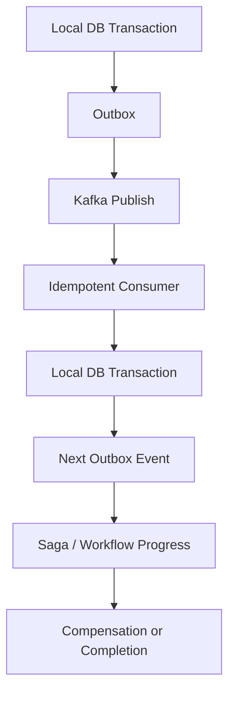

Key conclusions:

1. Local DB + Kafka direct write is unsafe for correctness-critical events.
2. Transactional outbox makes event intent atomic with local state.
3. Outbox still allows duplicate publication; consumers must be idempotent.
4. Kafka transactions solve Kafka-native read-process-write atomicity.
5. Kafka transactions do not cover databases or external APIs.
6. Saga is the correct model for long-running multi-service business workflows.
7. Compensation is business behavior, not technical rollback.
8. Audit-grade systems need explicit event identity, causation, correction, and state transition evidence.

---

## 24. References

- Apache Kafka Documentation — Transactions, producers, consumers, and design: https://kafka.apache.org/documentation/
- Apache Kafka Producer Configs — idempotence and transactional configuration: https://kafka.apache.org/documentation/#producerconfigs
- Confluent — Kafka delivery semantics: https://docs.confluent.io/kafka/design/delivery-semantics.html
- Confluent Blog — Transactions in Apache Kafka: https://www.confluent.io/blog/transactions-apache-kafka/
- Debezium Documentation — Outbox Event Router: https://debezium.io/documentation/reference/stable/transformations/outbox-event-router.html

---

## 25. What Comes Next

Part 028 moves from correctness to protection:

> How do we secure Kafka with service identity, TLS/mTLS, SASL, ACLs, least privilege, topic governance, tenant isolation, and auditability?
