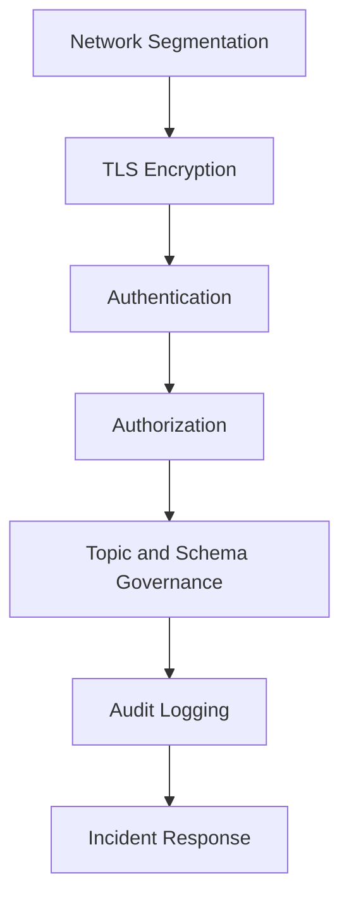
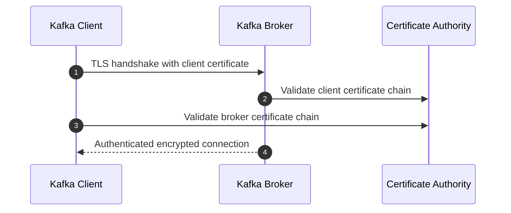
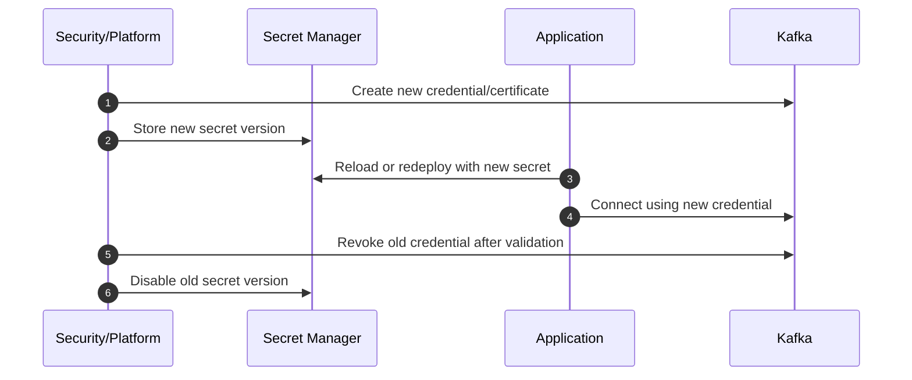
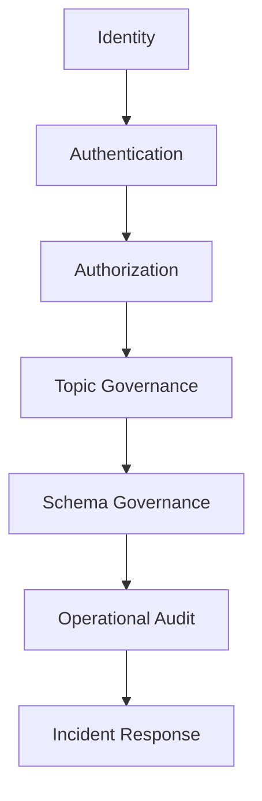

# Part 028 — Security, ACL, SASL, mTLS, and Governance

Part 027 covered multi-service transaction boundaries.

Now we move to production security and governance.

Kafka security is not one switch. It is a layered model:

1. Network boundary.
2. Encryption in transit.
3. Authentication.
4. Authorization.
5. Service identity.
6. Topic governance.
7. Schema governance.
8. Secrets management.
9. Audit logging.
10. Operational response.

The central idea:

> Kafka is a shared distributed log. If identity, authorization, and governance are weak, Kafka becomes a high-throughput data exfiltration and corruption platform.

A top-level Kafka engineer should not only know how to set `security.protocol=SASL_SSL`. They should be able to design who can produce, consume, create topics, alter configs, read schemas, run connectors, execute ksqlDB queries, and access regulated event data.

---

## 1. Kaufman Skill Decomposition

The target skill is **securing and governing Kafka as a multi-service, multi-team, production data platform**.

| Subskill | Production Meaning |
|---|---|
| Threat modeling | Identify what can go wrong before choosing controls. |
| TLS/mTLS | Encrypt traffic and optionally authenticate clients with certificates. |
| SASL | Authenticate clients using mechanisms such as SCRAM, OAuth/OIDC, Kerberos, or PLAIN over TLS. |
| Principal modeling | Map service identity to Kafka permissions. |
| ACL design | Grant least-privilege access to topics, groups, transactional IDs, and cluster operations. |
| Tenant isolation | Prevent cross-domain data access and operational blast radius. |
| Topic governance | Control naming, ownership, retention, compaction, schema, and lifecycle. |
| Secrets rotation | Rotate credentials/certificates without outage. |
| Auditability | Track who accessed or changed what. |
| Incident response | Revoke access, quarantine topics, and investigate suspicious activity. |

### 1.1 Practice Goal

By the end of this part, you should be able to:

1. Draw a Kafka threat model.
2. Choose between mTLS, SASL/SCRAM, OAuth/OIDC, and managed identity patterns.
3. Design ACLs for producer, consumer, Kafka Streams, Connect, and ksqlDB workloads.
4. Avoid dangerous wildcard permissions.
5. Build a topic governance model with owners and data classification.
6. Define a credential rotation and incident-response runbook.
7. Review Java Kafka client security configuration.

---

## 2. Threat Model First

Security design should start with failure modes, not configuration snippets.

### 2.1 Assets

| Asset | Why It Matters |
|---|---|
| Topic data | May contain customer, financial, regulated, or operational data. |
| Consumer group offsets | Can reveal processing behavior and enable unauthorized replay. |
| Schema Registry | Can expose event structure and sensitive fields. |
| Connect connectors | Can move large volumes of data into or out of external systems. |
| ksqlDB queries | Can derive, join, and expose data from multiple streams. |
| Broker configs | Can weaken durability, retention, or access control. |
| Credentials | Can impersonate producers, consumers, or admins. |

### 2.2 Threats

| Threat | Example |
|---|---|
| Unauthorized produce | Malicious service publishes fake `PaymentReceived` event. |
| Unauthorized consume | Team reads `customer.pii.v1` without approval. |
| Topic squatting | Service creates topic name before platform governance. |
| Schema poisoning | Producer registers incompatible or misleading schema. |
| Data exfiltration | Connector streams sensitive topic to unauthorized sink. |
| Credential leakage | SASL password in Git repository. |
| Principal reuse | Many services share one Kafka user, destroying accountability. |
| ACL drift | Temporary broad access remains forever. |
| Replay abuse | Consumer reads old events for unauthorized reconstruction. |
| Admin misuse | User alters retention or deletes topic. |

### 2.3 Security Objective

A secure Kafka platform should provide:

1. Confidentiality — unauthorized parties cannot read data.
2. Integrity — unauthorized parties cannot produce or alter data/config.
3. Availability — security controls do not create fragile operations.
4. Accountability — every access maps to a stable identity.
5. Least privilege — permissions are scoped to the minimum needed.
6. Recoverability — credentials can be revoked and rotated quickly.
7. Governance — topics/schemas/connectors have owners and lifecycle rules.

---

## 3. Kafka Security Stack



| Layer | Control |
|---|---|
| Network | Private subnets, firewall, security groups, Kubernetes network policies. |
| Encryption | TLS for client-broker and broker-broker traffic. |
| Authentication | mTLS, SASL/SCRAM, SASL/OAUTHBEARER, Kerberos, managed identity. |
| Authorization | Kafka ACLs or platform RBAC. |
| Governance | Topic ownership, schema compatibility, data classification, connector review. |
| Audit | Broker logs, platform audit logs, IAM logs, SIEM integration. |
| Operations | Rotation, revocation, emergency ACL deny, incident playbook. |

Security is strongest when each layer assumes the previous one can fail.

---

## 4. Encryption in Transit: TLS

TLS protects traffic between clients and brokers, and between brokers if configured.

Without TLS, credentials and event payloads can be exposed on the network.

### 4.1 Listener Model

Kafka can expose multiple listeners for different audiences.

```properties
listeners=INTERNAL://broker-1:9092,EXTERNAL://broker-1.example.com:9094
advertised.listeners=INTERNAL://broker-1.kafka.svc:9092,EXTERNAL://broker-1.example.com:9094
listener.security.protocol.map=INTERNAL:SSL,EXTERNAL:SASL_SSL
inter.broker.listener.name=INTERNAL
```

Typical listener separation:

| Listener | Audience | Security |
|---|---|---|
| INTERNAL | Brokers and internal platform components | SSL or SASL_SSL |
| APPLICATION | Application services | SASL_SSL / mTLS |
| ADMIN | Platform operators | Strong auth, restricted network |
| REPLICATION | Cluster linking / replication | Dedicated identity and ACLs |

Do not expose broker listeners broadly without authentication and authorization.

---

## 5. Authentication Options

Authentication answers:

> Who are you?

Kafka supports multiple authentication patterns depending on distribution and deployment.

### 5.1 mTLS

mTLS uses client certificates. Both server and client verify each other.



Pros:

1. Strong cryptographic identity.
2. No shared password in application config.
3. Good for service-to-service environments.
4. Works well with certificate automation.

Cons:

1. Certificate lifecycle must be operated carefully.
2. Principal mapping can be tricky.
3. Rotation requires coordination.
4. Debugging certificate failures can be painful.

### 5.2 SASL/SCRAM

SCRAM uses username/password-style credentials with challenge-response semantics.

Pros:

1. Common and widely supported.
2. Easier than mTLS for many application teams.
3. Credentials can be rotated through secret stores.

Cons:

1. Passwords must be protected.
2. Credential sharing is common if governance is weak.
3. Rotation discipline is required.

### 5.3 SASL/PLAIN

SASL/PLAIN sends username/password through SASL and should be used only over TLS.

Use it only when backed by appropriate enterprise identity integration and transport encryption.

### 5.4 SASL/OAUTHBEARER or OIDC

OAuth/OIDC allows token-based authentication integrated with identity providers.

Pros:

1. Centralized identity.
2. Short-lived credentials.
3. Better integration with enterprise access control.

Cons:

1. More moving parts.
2. Token validation and claim mapping must be designed.
3. Availability of identity provider becomes important.

### 5.5 Authentication Decision Matrix

| Requirement | Preferred Option |
|---|---|
| Strong service identity with cert automation | mTLS |
| Simpler app credentials | SASL/SCRAM over TLS |
| Enterprise identity provider integration | OAuth/OIDC |
| Legacy/simple internal setup | SASL/PLAIN over TLS only |
| Kerberos enterprise environment | SASL/GSSAPI |
| Cloud-managed Kafka | Provider IAM / managed identity if available |

---

## 6. Principal Modeling

A Kafka principal is the authenticated identity used for authorization.

Bad model:

```text
User:kafka-app
```

used by every service.

Better model:

```text
User:svc-quote-api-prod
User:svc-order-worker-prod
User:svc-risk-streams-prod
User:connect-crm-source-prod
User:ksqldb-analytics-prod
```

### 6.1 Identity Rules

1. One runtime service should have one stable identity.
2. Do not share credentials across unrelated services.
3. Separate environments: dev, staging, prod.
4. Separate humans from applications.
5. Separate CI/CD deploy identity from runtime identity.
6. Separate producer identity from admin identity.
7. Expire temporary access automatically.

### 6.2 Principal Naming Convention

```text
svc-<domain>-<component>-<env>
```

Examples:

```text
svc-quote-api-prod
svc-order-saga-prod
svc-billing-outbox-relay-prod
svc-risk-streams-prod
svc-cdc-postgres-connect-prod
```

A naming convention improves auditability and ACL review.

---

## 7. Authorization with ACLs

Authorization answers:

> What are you allowed to do?

Kafka ACLs grant or deny operations on resources.

Common resource types:

| Resource Type | Example |
|---|---|
| Topic | `quote.approved.v1` |
| Group | `order-service.quote-approved-handler` |
| Cluster | cluster-level admin operations |
| TransactionalId | `risk-score-worker-*` |
| DelegationToken | token operations where supported |

Common operations:

| Operation | Meaning |
|---|---|
| Read | Consume from topic or read group metadata. |
| Write | Produce to topic. |
| Create | Create resource. |
| Delete | Delete resource. |
| Alter | Alter resource/config. |
| Describe | Inspect resource metadata. |
| DescribeConfigs | Read configs. |
| AlterConfigs | Change configs. |
| IdempotentWrite | Required for idempotent producer at cluster level in some configurations. |

### 7.1 Producer ACL

A producer usually needs:

1. `Write` on target topic.
2. `Describe` on target topic.
3. `IdempotentWrite` if required by cluster authorization model.
4. `Write`/`Describe` on transactional ID if using transactions.

Example intent:

```text
Principal: User:svc-quote-api-prod
Allow Write, Describe on Topic:quote.approved.v1
```

### 7.2 Consumer ACL

A consumer usually needs:

1. `Read` on source topic.
2. `Describe` on source topic.
3. `Read` on consumer group.

Example intent:

```text
Principal: User:svc-order-worker-prod
Allow Read, Describe on Topic:quote.approved.v1
Allow Read on Group:order-service.quote-approved-handler
```

### 7.3 Kafka Streams ACL

Kafka Streams applications may need more than simple consume/produce ACLs.

They often need:

1. Read source topics.
2. Write sink topics.
3. Create/write/read internal repartition topics.
4. Create/write/read changelog topics.
5. Read consumer group based on `application.id`.
6. Access transactional IDs if exactly-once is enabled.

For a Streams app with:

```properties
application.id=risk-score-streams-prod
```

internal topics may look like:

```text
risk-score-streams-prod-<store-name>-changelog
risk-score-streams-prod-<node-name>-repartition
```

Design implication:

> `application.id` is a security and governance boundary, not just a config string.

### 7.4 Kafka Connect ACL

Connect requires permissions for:

1. Connector source/sink topics.
2. Internal config topic.
3. Internal offset topic.
4. Internal status topic.
5. Consumer groups.
6. Producer writes.
7. Sometimes topic creation.

Connect is high-risk because it can move data at scale.

Never grant broad wildcard topic access to a shared Connect principal unless the Connect cluster is itself strongly governed.

### 7.5 ksqlDB ACL

ksqlDB may need access to:

1. Input topics.
2. Output topics.
3. Internal processing topics.
4. Consumer groups.
5. Command topic.
6. Schema Registry subjects.

Because ksqlDB can join and materialize data, access to ksqlDB is effectively access to derived data products.

---

## 8. Least Privilege Design

### 8.1 Bad ACL Pattern

```text
User:svc-order-api-prod has Read,Write on Topic:* 
```

This is operationally convenient and architecturally dangerous.

Failure modes:

1. Service can accidentally write to wrong topic.
2. Compromised service can exfiltrate all topic data.
3. Audit logs cannot prove intended access.
4. Data classification becomes meaningless.

### 8.2 Better ACL Pattern

```text
User:svc-order-api-prod:
  Write,Describe Topic:order.created.v1
  Write,Describe Topic:order.cancelled.v1
  Read,Describe  Topic:quote.approved.v1
  Read           Group:order-service.quote-approved-handler
```

### 8.3 Prefix ACLs

Prefix ACLs can reduce operational overhead, but use them carefully.

Good use:

```text
User:svc-risk-streams-prod:
  Read Topic:risk.input.
  Write Topic:risk.output.
  All Topic:risk-score-streams-prod-
```

Dangerous use:

```text
User:svc-any-prod:
  Read Topic:
```

Prefix ACLs should align with ownership boundaries.

---

## 9. Topic Governance

Security and governance meet at the topic.

A topic should not be just a string. It should have metadata.

### 9.1 Topic Metadata

| Field | Example |
|---|---|
| Name | `quote.approved.v1` |
| Owner team | CPQ Platform |
| Domain | Quote |
| Data classification | Internal / Confidential / Restricted |
| Contains PII | Yes/No |
| Retention | 90 days |
| Cleanup policy | delete / compact / compact,delete |
| Schema subject | `quote.approved.v1-value` |
| Compatibility mode | backward/full/transitive depending on policy |
| Allowed producers | `svc-quote-api-prod` |
| Allowed consumers | `svc-order-worker-prod`, `svc-analytics-prod` |
| SLA/SLO | availability, freshness, lag |
| Replay policy | allowed, restricted, approval required |

### 9.2 Topic Naming Convention

Recommended domain-event convention:

```text
<domain>.<entity-or-capability>.<event-name>.v<major>
```

Examples:

```text
quote.quote-approved.v1
order.order-created.v1
billing.invoice-issued.v1
case.case-escalated.v1
```

Alternative compact convention:

```text
<domain>.<event-name>.v<major>
```

Examples:

```text
quote.approved.v1
order.created.v1
case.escalated.v1
```

The exact convention matters less than consistent ownership and metadata.

### 9.3 Topic Creation Policy

Do not allow arbitrary application topic creation in production unless the platform has strong guardrails.

Governed topic creation should validate:

1. Name.
2. Owner.
3. Partition count.
4. Replication factor.
5. Retention.
6. Cleanup policy.
7. Schema requirement.
8. Data classification.
9. Allowed principals.
10. Cost/blast-radius impact.

---

## 10. Data Classification

Kafka security must respect data sensitivity.

| Classification | Example | Control |
|---|---|---|
| Public | Product catalog events | Basic authz, normal retention |
| Internal | Operational status events | Team-scoped ACL |
| Confidential | Customer order events | Strict ACL, audit, limited consumers |
| Restricted | PII, enforcement, payment, legal events | Explicit approval, encryption, masking, strict retention |

### 10.1 PII and Sensitive Data

Avoid placing unnecessary sensitive fields in event payloads.

Bad:

```json
{
  "customerId": "C-991",
  "fullName": "...",
  "nationalId": "...",
  "birthDate": "...",
  "address": "...",
  "quoteApproved": true
}
```

Better:

```json
{
  "customerId": "C-991",
  "quoteId": "Q-881",
  "approvedAt": "2026-07-01T10:00:00Z",
  "riskBand": "STANDARD"
}
```

Use references when possible. Publish sensitive data only when the consumer genuinely needs it.

### 10.2 Field-Level Protection

For highly sensitive data, consider:

1. Application-level encryption for selected fields.
2. Tokenization.
3. Data minimization.
4. Separate restricted topics.
5. Different retention policy.
6. Strict consumer approval.
7. Audit logging of consumption.

Kafka topic ACLs protect topic access, not individual fields.

---

## 11. Schema Registry Governance

Schema Registry is part of the security boundary.

A consumer that can access a schema may infer business meaning even without current data access.

Governance should define:

1. Who can register schemas.
2. Who can read schemas.
3. Compatibility modes per subject.
4. Review process for breaking changes.
5. Sensitive field naming rules.
6. Deprecation policy.

### 11.1 Schema Subject Ownership

| Subject | Owner | Compatibility |
|---|---|---|
| `quote.approved.v1-value` | CPQ Platform | BACKWARD or FULL depending on consumer model |
| `order.created.v1-value` | Order Platform | BACKWARD |
| `case.escalated.v1-value` | Enforcement Platform | FULL_TRANSITIVE for stricter audit needs |

Schema governance should be integrated with CI/CD.

---

## 12. Java Client Security Configuration

### 12.1 SASL/SCRAM over TLS

```properties
bootstrap.servers=kafka-1.example.com:9094,kafka-2.example.com:9094
security.protocol=SASL_SSL
sasl.mechanism=SCRAM-SHA-512
sasl.jaas.config=org.apache.kafka.common.security.scram.ScramLoginModule required \
  username="svc-order-worker-prod" \
  password="${KAFKA_PASSWORD}";
ssl.truststore.location=/etc/kafka/secrets/truststore.p12
ssl.truststore.password=${TRUSTSTORE_PASSWORD}
ssl.truststore.type=PKCS12
```

Do not hardcode secrets in source code.

### 12.2 mTLS Client

```properties
bootstrap.servers=kafka-1.example.com:9094,kafka-2.example.com:9094
security.protocol=SSL
ssl.truststore.location=/etc/kafka/secrets/truststore.p12
ssl.truststore.password=${TRUSTSTORE_PASSWORD}
ssl.truststore.type=PKCS12
ssl.keystore.location=/etc/kafka/secrets/keystore.p12
ssl.keystore.password=${KEYSTORE_PASSWORD}
ssl.keystore.type=PKCS12
ssl.key.password=${KEY_PASSWORD}
```

### 12.3 Java Properties Builder

```java
public final class KafkaSecurityProperties {
    public static Properties scramSsl(
            String bootstrapServers,
            String username,
            String password,
            Path truststorePath,
            String truststorePassword
    ) {
        Properties props = new Properties();
        props.put(CommonClientConfigs.BOOTSTRAP_SERVERS_CONFIG, bootstrapServers);
        props.put(CommonClientConfigs.SECURITY_PROTOCOL_CONFIG, "SASL_SSL");
        props.put(SaslConfigs.SASL_MECHANISM, "SCRAM-SHA-512");
        props.put(SaslConfigs.SASL_JAAS_CONFIG,
                "org.apache.kafka.common.security.scram.ScramLoginModule required " +
                "username=\"" + username + "\" " +
                "password=\"" + password + "\";");
        props.put(SslConfigs.SSL_TRUSTSTORE_LOCATION_CONFIG, truststorePath.toString());
        props.put(SslConfigs.SSL_TRUSTSTORE_PASSWORD_CONFIG, truststorePassword);
        props.put(SslConfigs.SSL_TRUSTSTORE_TYPE_CONFIG, "PKCS12");
        return props;
    }
}
```

In production, prefer secret injection through your platform secret manager, not plain environment variables if stronger mechanisms are available.

---

## 13. Broker-Side Security Configuration Sketch

This is a simplified illustration, not a complete production config.

```properties
process.roles=broker
listeners=SASL_SSL://broker-1:9094
advertised.listeners=SASL_SSL://broker-1.example.com:9094
listener.security.protocol.map=SASL_SSL:SASL_SSL

ssl.keystore.location=/etc/kafka/secrets/broker.keystore.p12
ssl.keystore.password=${KEYSTORE_PASSWORD}
ssl.keystore.type=PKCS12
ssl.truststore.location=/etc/kafka/secrets/broker.truststore.p12
ssl.truststore.password=${TRUSTSTORE_PASSWORD}
ssl.truststore.type=PKCS12

sasl.enabled.mechanisms=SCRAM-SHA-512
listener.name.sasl_ssl.scram-sha-512.sasl.jaas.config=org.apache.kafka.common.security.scram.ScramLoginModule required;

authorizer.class.name=org.apache.kafka.metadata.authorizer.StandardAuthorizer
allow.everyone.if.no.acl.found=false
super.users=User:platform-kafka-admin
```

Important production notes:

1. Do not set `allow.everyone.if.no.acl.found=true` in production unless you have a very specific migration plan.
2. Protect super users aggressively.
3. Separate admin listener/network where possible.
4. Validate inter-broker and controller listener security separately.
5. Keep controller quorum security in scope for KRaft clusters.

---

## 14. ACL Examples as Intent

Exact CLI syntax varies by version/distribution, but the intent should be clear.

### 14.1 Producer

```bash
kafka-acls \
  --bootstrap-server kafka.example.com:9094 \
  --command-config admin.properties \
  --add \
  --allow-principal User:svc-quote-api-prod \
  --operation Write \
  --operation Describe \
  --topic quote.approved.v1
```

### 14.2 Consumer

```bash
kafka-acls \
  --bootstrap-server kafka.example.com:9094 \
  --command-config admin.properties \
  --add \
  --allow-principal User:svc-order-worker-prod \
  --operation Read \
  --operation Describe \
  --topic quote.approved.v1

kafka-acls \
  --bootstrap-server kafka.example.com:9094 \
  --command-config admin.properties \
  --add \
  --allow-principal User:svc-order-worker-prod \
  --operation Read \
  --group order-service.quote-approved-handler
```

### 14.3 Kafka Streams Internal Topics

```bash
kafka-acls \
  --bootstrap-server kafka.example.com:9094 \
  --command-config admin.properties \
  --add \
  --allow-principal User:svc-risk-streams-prod \
  --operation All \
  --topic risk-score-streams-prod- \
  --resource-pattern-type prefixed
```

Be careful: `All` on a prefix is acceptable only when the prefix is exclusively owned by that application.

---

## 15. Governance for Kafka Streams, Connect, and ksqlDB

### 15.1 Kafka Streams Governance

Require each Streams application to declare:

1. `application.id`.
2. Source topics.
3. Sink topics.
4. Internal topic prefix.
5. State stores.
6. Exactly-once setting.
7. Data classification.
8. Restore-time expectation.
9. Owner and on-call.

### 15.2 Kafka Connect Governance

Require each connector to declare:

1. Connector owner.
2. Source/sink system.
3. Topic list or pattern.
4. Data classification.
5. Error handling and DLQ policy.
6. Secret references.
7. Connector principal.
8. External system permission.
9. Backfill/replay policy.
10. Decommission plan.

### 15.3 ksqlDB Governance

Require each persistent query to declare:

1. Query owner.
2. Input streams/tables.
3. Output topic/table.
4. Join sources.
5. Data classification of output.
6. Retention.
7. Query version.
8. Rollback plan.
9. Access policy for pull/push query.

ksqlDB can create derived data products. Govern output topics as seriously as source topics.

---

## 16. Multi-Tenant Kafka

Multi-tenancy can mean different things.

| Model | Description | Isolation Strength |
|---|---|---:|
| Shared cluster, shared topics | Multiple teams share topic space | Weak |
| Shared cluster, topic prefixes | Teams own prefixes/domains | Medium |
| Shared cluster, separate principals and quotas | ACL + quota isolation | Medium/Strong |
| Separate clusters by environment/domain | Stronger blast-radius control | Strong |
| Managed Kafka with IAM/RBAC | Depends on provider configuration | Medium/Strong |

### 16.1 Tenant Isolation Controls

1. Topic prefix ownership.
2. Principal per service/team.
3. ACL per topic/group/transactional ID.
4. Client quotas.
5. Network segmentation.
6. Schema subject ownership.
7. Connector isolation.
8. ksqlDB access separation.
9. Audit logs.
10. Data classification review.

### 16.2 Quotas

Quotas protect availability.

Use quotas to prevent one tenant/service from exhausting:

1. Producer bandwidth.
2. Consumer bandwidth.
3. Request rate.
4. Controller/admin operation capacity.

Security includes availability protection, not only confidentiality.

---

## 17. Secrets Management and Rotation

### 17.1 Bad Practices

1. Credentials in Git.
2. Credentials in container image.
3. Shared service account across many apps.
4. Manual untracked password rotation.
5. Long-lived certificates without renewal process.
6. Admin credentials available to application runtime.

### 17.2 Better Practices

1. Use a secret manager.
2. Inject secrets at runtime.
3. Use separate identities per workload.
4. Rotate credentials regularly.
5. Automate certificate issuance/renewal.
6. Alert on expiring certificates.
7. Revoke unused principals.
8. Keep admin credentials separate.

### 17.3 Rotation Runbook



Rotation should be observable:

1. Which apps switched?
2. Which apps still use old credentials?
3. Are there authentication failures?
4. Is any old credential still active after deadline?

---

## 18. Security Observability

### 18.1 Metrics and Logs

| Signal | Meaning |
|---|---|
| Authentication failure count | Bad credentials, attack, expired cert. |
| Authorization failure count | Missing ACL, suspicious access attempt. |
| Topic creation events | Governance bypass or deployment activity. |
| ACL changes | Permission drift or emergency access. |
| Consumer group creation | New data access path. |
| Connector creation/update | Potential data movement. |
| ksqlDB query creation | Derived data access. |
| Schema registration | Contract evolution or schema poisoning risk. |
| Certificate expiry | Upcoming outage risk. |

### 18.2 Audit Questions

A Kafka audit trail should answer:

1. Who produced to this topic?
2. Who consumed from this topic?
3. Who changed topic configuration?
4. Who created or deleted topics?
5. Who changed ACLs?
6. Who registered schema versions?
7. Who created connectors or ksqlDB queries?
8. Which credential was used?
9. From which host/network?
10. At what time?

---

## 19. Incident Response

### 19.1 Credential Leak

Steps:

1. Identify leaked principal.
2. Revoke or disable credential.
3. Rotate replacement credential.
4. Review ACLs for leaked principal.
5. Search audit logs for suspicious access.
6. Check consumed topics and produced topics.
7. Reprocess or quarantine suspicious events if needed.
8. Document timeline.
9. Add preventive control.

### 19.2 Unauthorized Produce

Steps:

1. Stop offending principal.
2. Identify topic, partition, offset range.
3. Determine event types affected.
4. Quarantine or mark suspicious records through downstream controls.
5. Publish correction/supersession events if needed.
6. Rebuild projections from trusted offset range if required.
7. Tighten ACLs and schema registration controls.

### 19.3 Unauthorized Consume

Steps:

1. Revoke read ACL.
2. Identify data classification of consumed topics.
3. Determine offset range and time window.
4. Review logs for source IP/host.
5. Notify security/privacy stakeholders according to policy.
6. Rotate affected credentials if necessary.
7. Review why access was granted.

---

## 20. Production Security Checklist

### 20.1 Cluster

- [ ] TLS enabled for client-broker traffic.
- [ ] Broker-broker/controller traffic secured.
- [ ] Authentication enabled.
- [ ] Authorization enabled.
- [ ] `allow.everyone.if.no.acl.found=false`.
- [ ] Super users minimized.
- [ ] Admin access separated from app access.
- [ ] Audit logs retained.
- [ ] Topic auto-creation policy reviewed.
- [ ] Quotas configured for critical tenants.

### 20.2 Application

- [ ] Unique principal per service.
- [ ] No shared runtime credentials.
- [ ] Secrets stored in secret manager.
- [ ] Client uses TLS certificate validation.
- [ ] ACLs limited to required topics/groups.
- [ ] Transactional ID ACL scoped if transactions are used.
- [ ] Consumer group names are service-specific.
- [ ] No wildcard access unless justified by ADR.
- [ ] Logs do not print secrets or sensitive payloads.

### 20.3 Topic

- [ ] Owner assigned.
- [ ] Data classification assigned.
- [ ] Retention reviewed.
- [ ] Cleanup policy reviewed.
- [ ] Schema subject configured.
- [ ] Compatibility mode selected.
- [ ] Producer list approved.
- [ ] Consumer list approved.
- [ ] Replay policy documented.

### 20.4 Connect and ksqlDB

- [ ] Dedicated principal per Connect cluster or connector class.
- [ ] Internal topics secured.
- [ ] Connector configs do not expose secrets.
- [ ] DLQ topics governed.
- [ ] ksqlDB command/internal/output topics secured.
- [ ] Persistent queries reviewed as data products.

---

## 21. Architecture Review Questions

Ask these before approving a Kafka security design:

1. What principal does each service use?
2. Can that principal read or write anything outside its domain?
3. Can any app create topics in production?
4. Who can register schemas?
5. Who can run ksqlDB queries?
6. Who can create or update connectors?
7. What happens when a credential leaks?
8. Can we rotate secrets without outage?
9. Can we prove who consumed restricted data?
10. Are internal topics protected?
11. Are topic prefixes aligned with ownership?
12. Are wildcard ACLs justified and time-bound?
13. Is PII minimized in event payloads?
14. Is retention compatible with privacy and audit policy?
15. Are admin and runtime identities separate?

---

## 22. Anti-Patterns

### 22.1 One User for All Services

This destroys accountability and makes least privilege impossible.

### 22.2 Wildcard Read on All Topics

This turns Kafka into a data lake with no access boundary.

### 22.3 TLS Without Authorization

Encryption protects transport. It does not decide who may read/write.

### 22.4 ACLs Without Ownership Metadata

Permissions drift when nobody owns topics.

### 22.5 Connect Cluster with Broad Access

A compromised connector can exfiltrate entire domains.

### 22.6 ksqlDB as Ungoverned Analytics Backdoor

ksqlDB can join and materialize sensitive derived data. Govern it.

### 22.7 Secrets in App Config Repository

This is a security incident waiting to happen.

### 22.8 No Credential Rotation Test

A rotation process that has never been tested is only a document.

---

## 23. Deliberate Practice

### Exercise 1 — Threat Model a Kafka Domain

Choose one domain such as order, billing, case management, or customer profile.

Document:

1. Topics.
2. Producers.
3. Consumers.
4. Sensitive fields.
5. Unauthorized produce impact.
6. Unauthorized consume impact.
7. Admin misuse impact.
8. Credential leak response.

### Exercise 2 — Write Least-Privilege ACL Intent

For one service, list:

1. Topics it produces.
2. Topics it consumes.
3. Consumer group.
4. Transactional ID if any.
5. Internal topics if Kafka Streams.
6. Required operations only.

### Exercise 3 — Design Topic Metadata

For one topic, write a topic governance record:

1. Name.
2. Owner.
3. Data classification.
4. Retention.
5. Schema subject.
6. Compatibility mode.
7. Allowed producers.
8. Allowed consumers.
9. Replay policy.

### Exercise 4 — Credential Rotation Simulation

Design and test a rotation plan:

1. Create new credential.
2. Deploy app with new credential.
3. Verify authentication success.
4. Revoke old credential.
5. Confirm old credential fails.
6. Check monitoring alerts.

### Exercise 5 — ksqlDB Governance Review

Pick one persistent query and answer:

1. What data does it read?
2. What derived data does it create?
3. Who can query the result?
4. Does the output contain more sensitive data than the input?
5. What is the retention and deletion policy?

---

## 24. Mental Model Summary

Kafka security is a layered control system.



Key conclusions:

1. Kafka security starts with threat modeling.
2. TLS encrypts traffic but does not replace authentication or authorization.
3. Each service should have a distinct principal.
4. ACLs should be least-privilege and aligned with topic ownership.
5. Kafka Streams, Connect, and ksqlDB need special governance because they create internal topics and derived data paths.
6. Topic metadata is part of the security model.
7. Sensitive fields require data minimization and sometimes field-level protection.
8. Secrets rotation and incident response must be practiced, not only documented.
9. Wildcards are governance debt unless tightly scoped and justified.
10. Kafka is a data platform; secure it like one.

---

## 25. References

- Apache Kafka Documentation — Security: https://kafka.apache.org/documentation/#security
- Apache Kafka Documentation — Authorization and ACLs: https://kafka.apache.org/43/security/authorization-and-acls/
- Confluent Documentation — Security Overview: https://docs.confluent.io/platform/current/security/overview.html
- Confluent Documentation — ACL Authorization: https://docs.confluent.io/platform/current/security/authorization/acls/overview.html
- Confluent Documentation — SASL/PLAIN: https://docs.confluent.io/platform/current/security/authentication/sasl/plain/overview.html
- Confluent Documentation — TLS/mTLS Authentication: https://docs.confluent.io/platform/current/security/authentication/mutual-tls/overview.html

---

## 26. What Comes Next

Part 029 moves into production observability:

> How do we observe Kafka brokers, producers, consumers, Kafka Streams tasks, Connect workers, ksqlDB queries, lag, rebalances, errors, traces, and SLOs?
