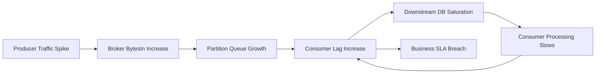
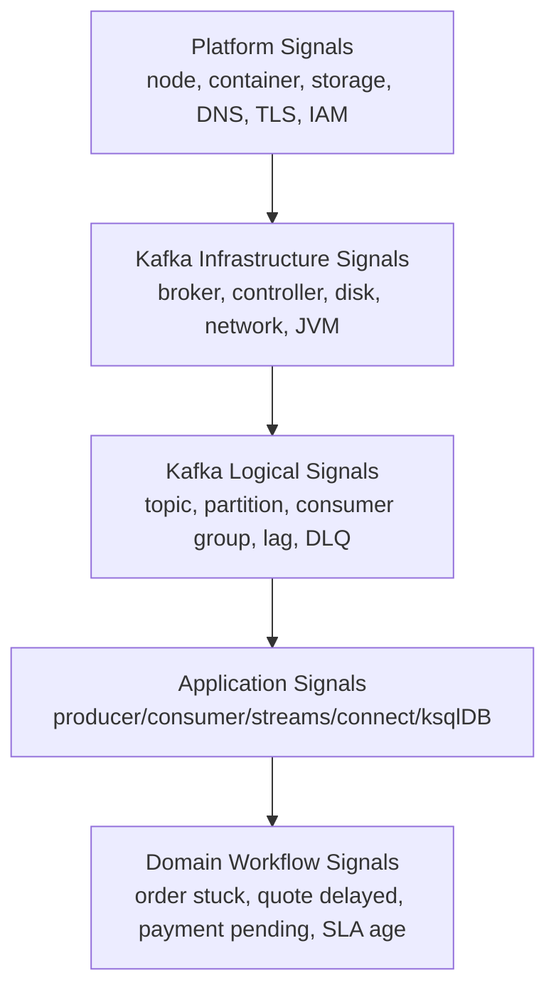
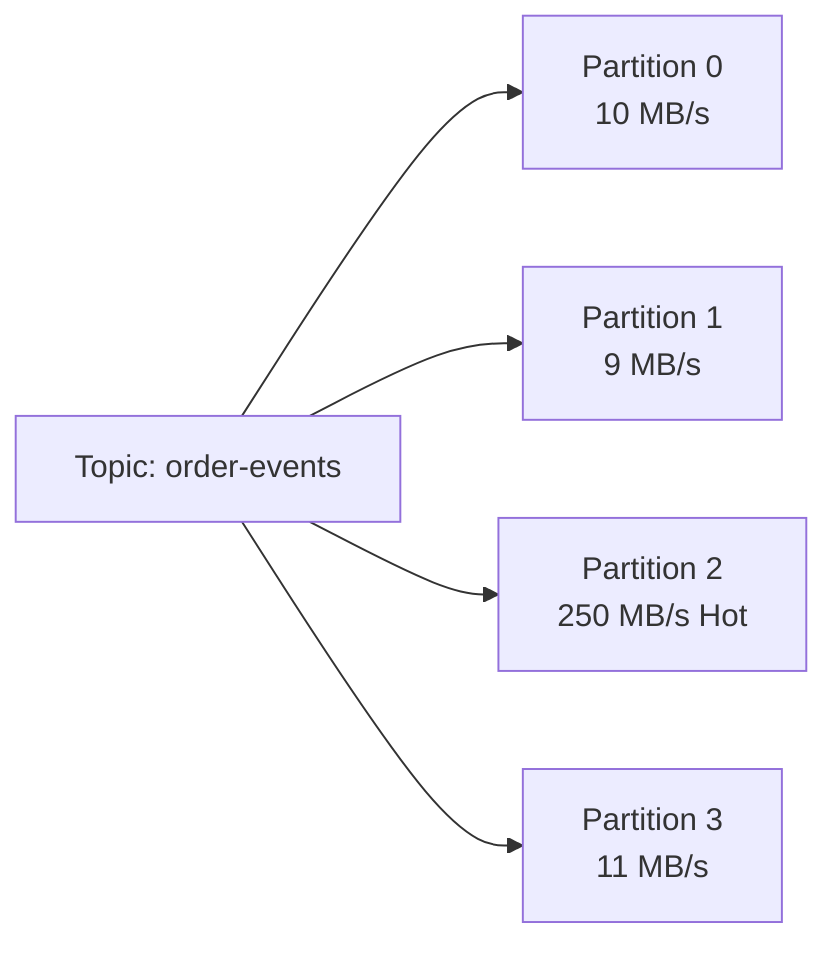
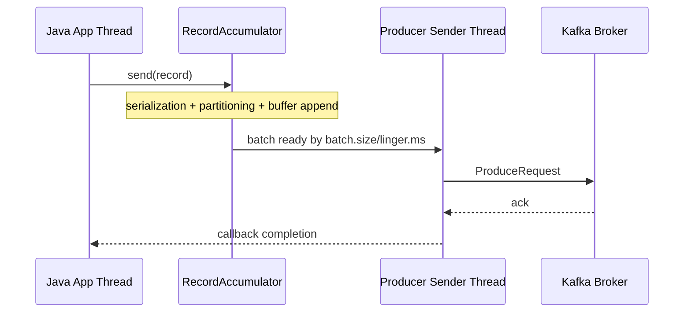
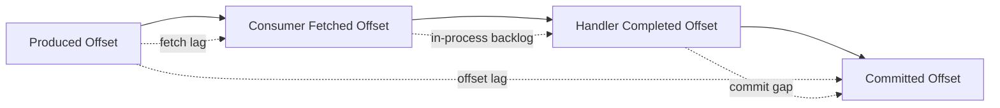
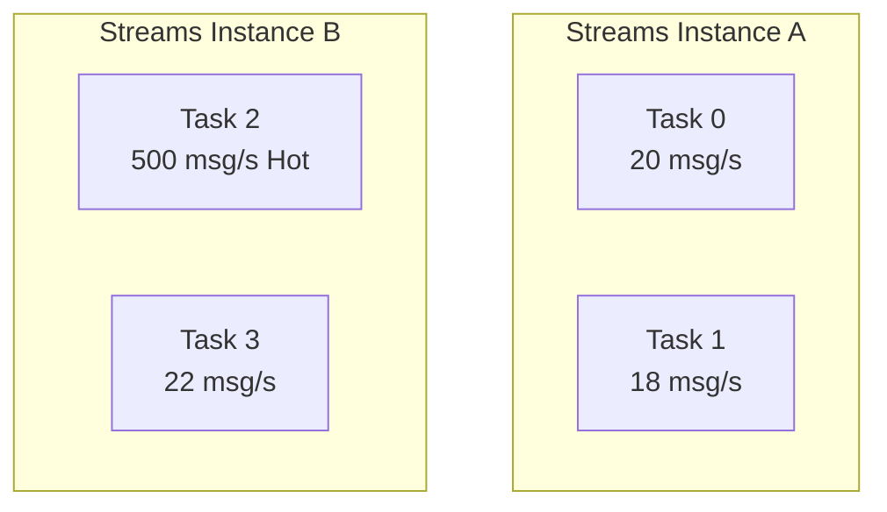
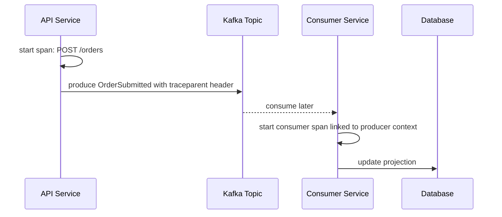
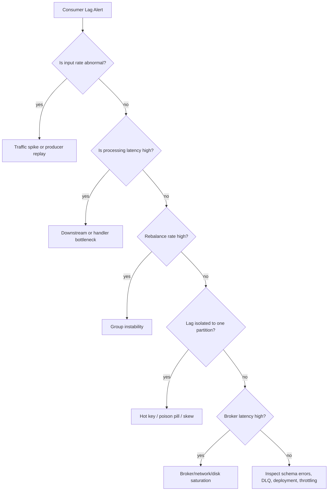
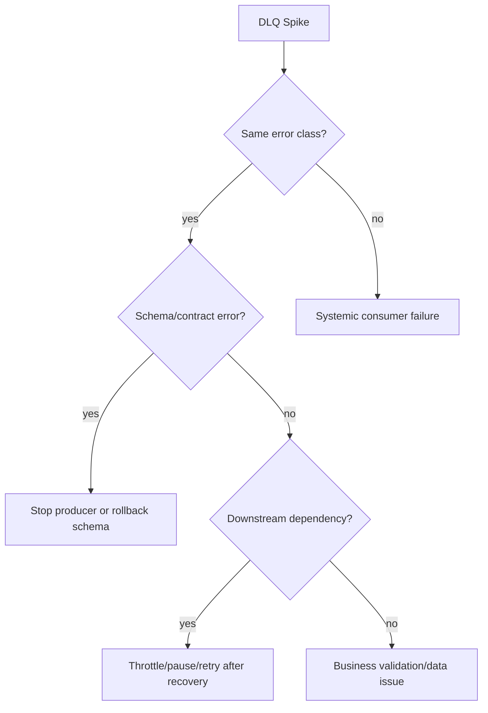

# Part 029 — Observability, Metrics, Logs, and Traces

Observability in Kafka is not "having Grafana dashboards". Observability is the ability to answer operational questions quickly and correctly:

- Is the platform accepting writes?
- Are records durable?
- Are consumers keeping up?
- Are specific business workflows stuck?
- Is lag caused by producer volume, consumer slowness, broker saturation, rebalance, partition skew, or downstream failure?
- Can we prove what happened for an individual event?
- Can we replay safely?

Kafka systems fail in layers. A Java service may be healthy while its consumer group is stuck. A broker may be alive while a partition is under-replicated. A Kafka Streams app may be running while one task is endlessly restoring state. A DLQ may be receiving records quietly while business processing is effectively degraded.

This part builds a production observability model for Kafka-based systems.

## Learning Goals

After this part, you should be able to:

1. Design observability across broker, topic, partition, producer, consumer, Kafka Streams, Kafka Connect, ksqlDB, and domain workflow layers.
2. Distinguish metric symptoms from root causes.
3. Build lag alerts that do not page unnecessarily during normal bursts.
4. Design structured logs and trace propagation for event-driven systems.
5. Build incident runbooks for lag, rebalance storm, under-replication, DLQ spike, processing errors, and state restore.
6. Define SLOs that reflect user/business impact, not only infrastructure availability.

## Mental Model: Kafka Observability Is Multi-Layer Causality

A Kafka incident often looks like this:



The visible symptom may be **consumer lag**, but the root cause may be:

- producer traffic increase;
- partition skew;
- broker disk/network saturation;
- consumer CPU saturation;
- external database latency;
- retry storm;
- rebalance loop;
- schema deserialization errors;
- Kafka Streams state restore;
- DLQ replay overload;
- overloaded Connect sink;
- ksqlDB query repartitioning unexpectedly.

The observability goal is not only to see that lag exists. The goal is to classify the cause fast enough to choose the correct action.

## Observability Stack

A production Kafka platform needs five signal layers.



A common weak design is to monitor only L2 and L3. That tells you Kafka is alive, but not whether a regulatory case, quote, fulfillment order, or payment settlement is delayed.

A senior Kafka engineer defines domain-level SLOs above Kafka infrastructure metrics.

## Observability vs Monitoring

| Term | Meaning | Kafka Example |
|---|---|---|
| Monitoring | Known checks for known failure modes | Alert when under-replicated partitions > 0 |
| Observability | Ability to investigate unknown failure modes | Trace one event through producer, topic, stream app, sink DB |
| Telemetry | Raw emitted data | JMX metric, log line, span, audit event |
| SLI | Quantified service behavior | 99% of order events processed within 2 minutes |
| SLO | Target for SLI | Order projection freshness p99 < 120s |
| Alert | Human-actionable notification | Page when freshness SLO burn rate is high |
| Runbook | Decision procedure during incident | Lag triage flow with remediation steps |

## Signal 1: Broker and Controller Metrics

Kafka brokers expose many metrics. The point is not to alert on all of them. The point is to select signals that represent durability, availability, throughput, saturation, and control-plane health.

### Broker Health Metrics

| Category | Metric Concept | Why It Matters | Typical Alert Strategy |
|---|---|---|---|
| Availability | Broker process up | Basic liveness | Page if broker loss reduces redundancy or availability |
| Durability | Under-replicated partitions | Replicas are not fully caught up | Page if sustained |
| Durability | Offline partitions | Partition unavailable | Immediate page |
| Replication | ISR shrink/expand rate | Replica instability | Alert if frequent or correlated with network/disk issue |
| Controller | Active controller count | Exactly one active controller expected | Alert if none or unstable |
| Request latency | Produce/fetch request p95/p99 | Client-visible latency | Alert based on SLO impact |
| Network | Request queue / network processor idle | Saturation signal | Alert if sustained saturation |
| Disk | Log flush/write latency, disk usage | Broker throughput and retention safety | Alert before disk-full |
| JVM | GC pause, heap, CPU | Broker process stability | Alert if correlated with latency |

### Topic/Partition Metrics

Topic-level metrics help answer whether the incident is global or localized.

| Question | Metric Direction |
|---|---|
| Is one topic generating abnormal volume? | bytes/messages in per topic |
| Is one partition hot? | per-partition bytes/messages, leader request rate |
| Is retention at risk? | disk usage by topic, retention bytes/time |
| Is compaction keeping up? | log cleaner backlog, dirty ratio |
| Is replication healthy? | ISR size, under-replicated partition count |

A hot partition is often invisible if you only look at topic aggregate metrics.



A topic can look healthy in aggregate while one partition dominates end-to-end latency.

## Signal 2: Producer Metrics

A producer incident is often mistaken for broker trouble. Java producers buffer, batch, compress, retry, and block under pressure. You need producer-side metrics to see this.

| Metric Concept | Meaning | Failure Signal |
|---|---|---|
| record-send-rate | How many records the producer sends | Drop may mean upstream issue or producer block |
| record-error-rate | Failed sends | Broker/auth/schema/timeout issue |
| record-retry-rate | Retried sends | Broker latency, transient network, throttling |
| request-latency-avg/p99 | Broker request latency observed by producer | Rising before application timeout |
| batch-size-avg | Actual batch size | Too low means poor batching; too high may imply latency trade-off |
| compression-rate | Compression effectiveness | Helps understand network/disk pressure |
| buffer-available-bytes | Remaining producer buffer | Low value means backpressure risk |
| bufferpool-wait-time | Time waiting for buffer memory | Strong producer-side saturation signal |
| record-queue-time | Time records wait before send | High value means local backlog |
| outgoing-byte-rate | Network egress | Throughput capacity planning |

### Producer Latency Breakdown



Producer latency can come from:

1. application serialization;
2. buffer wait;
3. batching linger;
4. network request;
5. broker append/replication;
6. retry and timeout;
7. callback execution.

A good dashboard separates these instead of showing one generic “publish latency”.

## Signal 3: Consumer Metrics

Consumer observability must answer two different questions:

1. **Offset lag**: how many records behind is the consumer?
2. **Time lag / freshness**: how old is the newest unprocessed business event?

Offset lag alone is insufficient. A lag of 10 records may be serious if each record represents a 2 GB file processing request. A lag of 100,000 records may be harmless if each record is tiny and the consumer catches up in seconds.

### Consumer Metric Catalog

| Metric Concept | Meaning | Diagnostic Use |
|---|---|---|
| records-consumed-rate | Records consumed per second | Compare with production rate |
| bytes-consumed-rate | Input throughput | Detect payload size changes |
| records-lag-max | Max offset lag among assigned partitions | Identify worst partition |
| poll-latency | Time spent in poll | Broker/fetch behavior |
| poll-idle-ratio | Whether consumer is idle | Low idle + high lag = processing bottleneck |
| commit-latency | Offset commit latency | Coordinator/broker issue |
| rebalance count/rate | Group instability | Rebalance storm detection |
| assigned partitions | Work distribution | Partition/consumer mismatch |
| processing latency | Business handler duration | Downstream bottleneck |
| end-to-end latency | event time to completed side-effect | User/business impact |

### Lag Is Not One Number



For high-confidence operations, track:

- produced high watermark;
- fetched offset;
- processing-completed offset;
- committed offset;
- oldest unprocessed event age;
- oldest retry event age;
- DLQ age.

## Signal 4: Kafka Streams Metrics

Kafka Streams adds more moving parts:

- topology;
- tasks;
- stream threads;
- local state stores;
- changelog topics;
- repartition topics;
- state restore;
- standby replicas;
- punctuators;
- window retention;
- record caches;
- commit interval;
- rebalance and task migration.

### Kafka Streams Observability Questions

| Question | Signal |
|---|---|
| Is the app processing? | process rate, poll rate, commit rate |
| Is one task stuck? | per-task process latency/rate |
| Is state restore happening? | restore rate, restore remaining records |
| Is state store growing unexpectedly? | store size, changelog size |
| Is repartition creating pressure? | internal topic throughput and lag |
| Are windows dropping late events? | dropped records, skipped records, late event count |
| Are joins missing data? | join result rate, table freshness, key mismatch count |
| Is EOS causing transaction pressure? | commit latency, transaction abort rate |

### Stream Task Hotspot



Aggregate app metrics may hide a single hot task. Always break down by thread/task/topic/partition when possible.

## Signal 5: Kafka Connect Metrics

Connect observability is about connector lifecycle, task execution, external system health, and data correctness.

| Area | Signal | Meaning |
|---|---|---|
| Worker | worker up, REST available | Connect cluster health |
| Connector | connector state | RUNNING, PAUSED, FAILED |
| Task | task state | Individual task failure may partially degrade pipeline |
| Source | source record poll rate | External source extraction health |
| Sink | sink record send rate | External sink write health |
| Error | total errors, DLQ writes | Data quality and integration failures |
| Offset | source offsets | Backfill/restart behavior |
| External | DB/API latency | Often the actual bottleneck |

A connector can be “RUNNING” while one task is failed. Alerting must inspect tasks, not just connector names.

## Signal 6: ksqlDB Metrics

ksqlDB observability focuses on queries and materialized views.

| Question | Signal |
|---|---|
| Is the persistent query running? | query status |
| Is the query processing input? | rows consumed/produced |
| Is a materialized view fresh? | source lag and query lag |
| Is the query repartitioning heavily? | internal topic throughput |
| Are pull queries slow? | pull query latency |
| Are schemas or keys mismatched? | processing log/errors |

ksqlDB is friendly at the SQL layer, but operationally it still produces Kafka Streams applications and internal Kafka topics.

## Logs: Make Events Investigable

Kafka logs must not become free-text dumping grounds. Event-driven systems require structured logs that allow reconstruction.

### Required Log Fields for Kafka Applications

| Field | Purpose |
|---|---|
| `service` | Which service emitted the log |
| `env` | prod/staging/dev |
| `clientId` | Kafka client identity |
| `consumerGroupId` | Consumer group identity |
| `topic` | Kafka topic |
| `partition` | Partition number |
| `offset` | Kafka offset |
| `eventId` | Business/event identity |
| `eventType` | Event semantic type |
| `entityId` | Aggregate/entity identity |
| `correlationId` | End-to-end request/workflow correlation |
| `causationId` | Previous event/command that caused this event |
| `schemaVersion` | Event contract version |
| `attempt` | Retry attempt |
| `errorCode` | Stable error classification |
| `durationMs` | Handler duration |
| `outcome` | success/retry/dlq/skip |

### Example Java Structured Log

```java
log.info("kafka_event_processed",
    kv("topic", record.topic()),
    kv("partition", record.partition()),
    kv("offset", record.offset()),
    kv("eventId", envelope.eventId()),
    kv("eventType", envelope.eventType()),
    kv("entityId", envelope.entityId()),
    kv("correlationId", envelope.correlationId()),
    kv("schemaVersion", envelope.schemaVersion()),
    kv("durationMs", elapsedMillis),
    kv("outcome", "success"));
```

The exact logging API depends on your stack, but the invariant is stable: every processing decision should be reconstructable.

## Tracing: Propagating Context Through Kafka

Distributed tracing is harder with Kafka than synchronous HTTP because producer and consumer are decoupled by time and storage.

A trace must cross an asynchronous boundary:



### Header Propagation

Common headers:

| Header | Purpose |
|---|---|
| `traceparent` | W3C trace context |
| `tracestate` | Vendor-specific trace context |
| `correlation-id` | Business workflow correlation |
| `causation-id` | Causal event/command identity |
| `event-id` | Event identity |
| `schema-id` | Optional schema/debug metadata |

Trace context is useful for latency and causal investigation. Business correlation ID is still required because traces may be sampled or expire.

## Domain-Level Observability

Infrastructure metrics tell you whether Kafka is functioning. Domain metrics tell you whether the business process is functioning.

For a CPQ/order-management/regulatory-style system, domain observability may include:

| Workflow | Domain SLI |
|---|---|
| Quote generation | p95 time from `QuoteRequested` to `QuoteCalculated` |
| Order capture | p99 time from `OrderSubmitted` to `OrderAccepted` |
| Fulfillment | count of orders stuck in `WAITING_FOR_INVENTORY` older than threshold |
| Case escalation | overdue escalation events by severity |
| Pricing update | propagation freshness of price catalog projection |
| Compliance audit | percentage of events with valid actor, reason, and correlation metadata |

Kafka lag does not automatically equal business delay. Domain SLOs close that gap.

## SLI/SLO Design

### Good Kafka-Related SLIs

| SLI | Why It Is Good |
|---|---|
| End-to-end processing latency from event timestamp to durable projection | Measures user-visible freshness |
| Oldest unprocessed event age per workflow | Detects stuck processing even with low offset lag |
| DLQ event rate by error class | Measures data/integration correctness |
| Replay completion time | Measures recovery capability |
| Consumer catch-up ratio | Shows whether backlog is decreasing |
| Under-replicated partition duration | Measures durability risk window |
| Schema compatibility failure rate | Measures contract governance health |

### Weak SLIs

| Weak Metric | Why It Is Weak |
|---|---|
| Broker process up | Necessary but not sufficient |
| Average consumer lag | Hides hot partitions |
| Total message rate | No correctness signal |
| CPU only | Many Kafka incidents are I/O, skew, or downstream related |
| Error log count | No denominator or user impact |

## Alert Design

A good alert has four properties:

1. It represents user/business risk.
2. It requires human action.
3. It includes enough context to start diagnosis.
4. It has a runbook.

### Alert Matrix

| Alert | Severity | Trigger Concept | Immediate Question |
|---|---|---|---|
| Offline partitions | Critical | Any sustained offline partition | Which topic/partition? Can clients read/write? |
| Under-replicated partitions | High | Sustained non-zero | Which brokers/replicas? Disk/network issue? |
| Consumer freshness SLO burn | High | Oldest unprocessed event age rising | Is consumer slow, stuck, or rebalancing? |
| DLQ spike | High/Medium | Error-class-specific rate | Is schema, data, or downstream failing? |
| Rebalance storm | High | Frequent rebalances | Deploy loop? session timeout? max poll breach? |
| Producer error/retry spike | High | Retry/error rate increase | Broker, auth, schema, network, timeout? |
| Disk capacity risk | High | Time-to-full below threshold | Retention, traffic, compaction, cleanup? |
| State restore stuck | High | Restore not progressing | Changelog size? local disk? version issue? |

### Avoid Alerting on Raw Lag Alone

Lag should usually be paired with:

- age of oldest unprocessed event;
- rate of incoming events;
- rate of processing;
- catch-up estimate;
- workflow criticality;
- partition distribution.

A better alert:

> Page when `oldest_unprocessed_order_event_age_seconds` is above 300 seconds for 10 minutes and consumer catch-up ratio is below 1.0.

A weaker alert:

> Page when consumer lag > 10,000.

## Incident Triage: Consumer Lag



### Lag Runbook

1. Identify affected consumer group, topic, partition.
2. Compare input rate vs processing rate.
3. Check oldest unprocessed event age.
4. Check whether lag is global or partition-local.
5. Check consumer rebalance count and assignment changes.
6. Check processing latency and downstream dependency latency.
7. Check DLQ/error/retry rate.
8. Check broker produce/fetch latency and under-replication.
9. Estimate catch-up time.
10. Choose action: scale consumers, pause replay, fix poison pill, increase downstream capacity, rollback deploy, adjust partitioning, or initiate incident comms.

## Incident Triage: DLQ Spike



DLQ without observability is just delayed data loss.

Each DLQ record should include:

- original topic/partition/offset;
- original key;
- event ID;
- event type;
- schema version;
- failure timestamp;
- consumer group;
- exception class;
- stable error code;
- retry attempt count;
- stack trace hash;
- replay eligibility;
- operator notes if manually handled.

## Incident Triage: Rebalance Storm

Common causes:

- consumer process crash loop;
- deployment rolling too aggressively;
- `max.poll.interval.ms` exceeded by slow processing;
- `session.timeout.ms` too low for environment;
- network instability;
- autoscaler oscillation;
- long GC pause;
- partition assignment protocol mismatch;
- large state restore in Kafka Streams;
- Connect task restart loop.

Immediate checks:

1. Did deployment start recently?
2. Are members joining/leaving repeatedly?
3. Did processing latency exceed `max.poll.interval.ms`?
4. Is CPU/GC/network unstable?
5. Are consumers using static membership where appropriate?
6. Are stateful stream tasks being migrated repeatedly?

## Dashboard Design

### Executive Kafka Health Dashboard

This is for quick incident awareness.

| Panel | Purpose |
|---|---|
| Cluster write/read throughput | Traffic shape |
| Offline partitions | Availability |
| Under-replicated partitions | Durability risk |
| Request latency p95/p99 | Client-visible broker health |
| Disk usage/time-to-full | Capacity risk |
| Top consumer groups by freshness breach | Business impact |
| DLQ rate by domain/error class | Correctness impact |
| Deployment/change markers | Correlation with incidents |

### Consumer Group Dashboard

| Panel | Purpose |
|---|---|
| Lag by partition | Skew detection |
| Oldest event age | Freshness impact |
| Input rate vs processing rate | Catch-up diagnosis |
| Rebalance count | Group stability |
| Handler latency | Processing bottleneck |
| Downstream dependency latency | External bottleneck |
| Retry/DLQ rate | Error pressure |
| Assigned partitions per instance | Work distribution |

### Streams Dashboard

| Panel | Purpose |
|---|---|
| Process rate by task | Hot task detection |
| Commit latency | State/transaction health |
| State restore progress | Recovery behavior |
| Rebalance count | Task migration instability |
| Repartition topic throughput | Hidden topology cost |
| Changelog topic throughput | State durability cost |
| Dropped/skipped records | Data correctness issue |
| RocksDB/store size | Local state capacity |

## Observability in Java Applications

### Producer Wrapper Pattern

Avoid scattering raw producer calls everywhere. Wrap publishing with telemetry.

```java
public final class ObservableEventPublisher<K, V> {
    private final KafkaProducer<K, V> producer;
    private final MeterRegistry metrics;

    public CompletableFuture<RecordMetadata> publish(
            String topic,
            K key,
            V value,
            Headers headers,
            String eventType) {

        long started = System.nanoTime();
        CompletableFuture<RecordMetadata> result = new CompletableFuture<>();

        ProducerRecord<K, V> record = new ProducerRecord<>(topic, null, key, value, headers);

        producer.send(record, (metadata, exception) -> {
            long elapsedMs = TimeUnit.NANOSECONDS.toMillis(System.nanoTime() - started);

            if (exception == null) {
                metrics.timer("kafka.publish.latency",
                        "topic", topic,
                        "eventType", eventType).record(elapsedMs, TimeUnit.MILLISECONDS);
                metrics.counter("kafka.publish.success",
                        "topic", topic,
                        "eventType", eventType).increment();
                result.complete(metadata);
            } else {
                metrics.counter("kafka.publish.error",
                        "topic", topic,
                        "eventType", eventType,
                        "exception", exception.getClass().getSimpleName()).increment();
                result.completeExceptionally(exception);
            }
        });

        return result;
    }
}
```

The wrapper should not hide Kafka semantics. It should standardize telemetry, headers, logging, and error classification.

### Consumer Handler Telemetry

```java
public final class ObservableRecordHandler<K, V> {
    private final MeterRegistry metrics;
    private final DomainHandler<V> delegate;

    public void handle(ConsumerRecord<K, V> record) {
        long started = System.nanoTime();
        String topic = record.topic();

        try {
            delegate.handle(record.value());
            metrics.counter("kafka.consumer.record.success", "topic", topic).increment();
        } catch (RetryableDomainException e) {
            metrics.counter("kafka.consumer.record.retryable_error",
                    "topic", topic,
                    "errorCode", e.errorCode()).increment();
            throw e;
        } catch (NonRetryableDomainException e) {
            metrics.counter("kafka.consumer.record.non_retryable_error",
                    "topic", topic,
                    "errorCode", e.errorCode()).increment();
            throw e;
        } finally {
            long elapsedMs = TimeUnit.NANOSECONDS.toMillis(System.nanoTime() - started);
            metrics.timer("kafka.consumer.record.processing.latency", "topic", topic)
                    .record(elapsedMs, TimeUnit.MILLISECONDS);
        }
    }
}
```

Expose domain error classification. Do not rely only on exception class names.

## Cardinality Discipline

High-cardinality metrics can destroy observability systems.

Avoid labels like:

- `eventId`;
- `userId`;
- `orderId`;
- raw exception message;
- full topic name if topics are dynamic per tenant/user;
- stack trace;
- request ID;
- unbounded tenant IDs if tenant count is large.

Prefer bounded labels:

- topic group;
- service;
- environment;
- event type;
- error code;
- exception class;
- consumer group;
- deployment version;
- criticality tier.

Use logs/traces for high-cardinality lookup. Use metrics for aggregation.

## Event Audit Trail vs Observability Logs

Do not confuse audit with logs.

| Aspect | Observability Log | Audit Event |
|---|---|---|
| Purpose | Diagnose system behavior | Prove business/legal action history |
| Retention | Operational | Regulatory/business policy |
| Mutability | Usually append-only in log store but operational | Strong append-only requirement |
| Audience | Engineers/SRE | Business, compliance, auditors |
| Schema | Logging schema | Domain event schema |
| Query | Incident investigation | Case reconstruction |

A regulatory-grade system often needs both.

## Common Kafka Observability Anti-Patterns

### Anti-Pattern 1: “Lag Alert = Kafka Alert”

Lag is a symptom. It may be caused by downstream DB, a hot key, bad deploy, or deliberate replay.

Better: alert on freshness SLO and attach diagnostic dimensions.

### Anti-Pattern 2: Average Lag

Average lag hides the worst partition.

Better: max lag and oldest event age by partition.

### Anti-Pattern 3: Dashboards Without Runbooks

A dashboard that requires a senior engineer to interpret it at 3 a.m. is incomplete.

Better: every alert links to a triage tree.

### Anti-Pattern 4: No Domain Correlation ID

Without correlation ID, event-driven debugging becomes archaeology.

Better: propagate correlation and causation IDs in headers and payload envelope.

### Anti-Pattern 5: Metrics With Unbounded Labels

High-cardinality labels can make monitoring more expensive and less reliable than the system being monitored.

Better: bounded metrics + high-cardinality logs/traces.

### Anti-Pattern 6: DLQ Without Replay Strategy

A DLQ is not a trash bin. It is a quarantine queue.

Better: every DLQ class has owner, retention, replay policy, and dashboard.

## Observability Review Checklist

Use this checklist for every Kafka application or platform component.

### Broker/Platform

- [ ] Are offline partitions alerted immediately?
- [ ] Are under-replicated partitions monitored with duration?
- [ ] Is controller instability visible?
- [ ] Are produce/fetch request latencies tracked?
- [ ] Is disk time-to-full tracked?
- [ ] Are network and request queue saturation visible?
- [ ] Are JMX endpoints secured?

### Producer

- [ ] Is publish success/error rate measured?
- [ ] Is producer latency split from business request latency?
- [ ] Are retries and timeouts visible?
- [ ] Is buffer exhaustion visible?
- [ ] Are schema serialization errors classified?
- [ ] Is `client.id` meaningful and stable?

### Consumer

- [ ] Is lag tracked by partition?
- [ ] Is oldest unprocessed event age tracked?
- [ ] Is processing latency tracked separately from poll latency?
- [ ] Are offset commits tracked?
- [ ] Are rebalances visible?
- [ ] Are retry and DLQ rates classified?
- [ ] Are downstream dependency latencies correlated?

### Kafka Streams

- [ ] Are task-level metrics visible?
- [ ] Is state restore progress visible?
- [ ] Are dropped/skipped records visible?
- [ ] Are internal repartition/changelog topics monitored?
- [ ] Are commit/transaction metrics visible?
- [ ] Are topology version changes marked?

### Connect/ksqlDB

- [ ] Are connector/task states monitored?
- [ ] Are failed tasks alerted?
- [ ] Are source/sink rates visible?
- [ ] Are DLQ/error records classified?
- [ ] Are persistent query statuses monitored?
- [ ] Are materialized view freshness SLIs defined?

### Domain

- [ ] Are workflow freshness SLIs defined?
- [ ] Are stuck-state counts visible?
- [ ] Are correlation IDs propagated?
- [ ] Can one event be traced end-to-end?
- [ ] Can audit reconstruction be performed without application logs?

## Practice Lab

### Lab 1: Build a Consumer Lag Triage Dashboard

Create dashboard panels for one consumer group:

1. lag by partition;
2. oldest event age by partition;
3. input rate vs processed rate;
4. handler latency p95/p99;
5. downstream DB latency;
6. rebalance rate;
7. DLQ rate by error code.

Then answer:

- Which signal tells you whether backlog is getting worse?
- Which signal tells you whether a single key is hot?
- Which signal tells you whether downstream dependency is the bottleneck?

### Lab 2: Add Correlation Headers

Implement producer and consumer logic that propagates:

- `traceparent`;
- `correlation-id`;
- `causation-id`;
- `event-id`.

Validate that one event can be followed from API request to Kafka topic to consumer handler to database update.

### Lab 3: DLQ Spike Simulation

Inject three errors:

1. schema deserialization error;
2. non-retryable business validation error;
3. downstream timeout.

Verify that the DLQ dashboard separates them by stable error code.

## Architecture Decision Record Template

```md
# ADR: Kafka Observability Model for <System>

## Context
<Which services, topics, consumer groups, stream apps, connectors, and workflows are involved?>

## Business SLOs
<What user/domain freshness or correctness targets matter?>

## Infrastructure Signals
<Broker, topic, partition, replication, disk, network, controller metrics.>

## Application Signals
<Producer, consumer, Kafka Streams, Connect, ksqlDB metrics.>

## Domain Signals
<Workflow age, stuck state, DLQ by business error, projection freshness.>

## Logging Standard
<Required structured fields and error taxonomy.>

## Trace Propagation
<Headers and sampling strategy.>

## Alerts
<Which alerts page, which create tickets, which are dashboard-only?>

## Runbooks
<Links to triage flows.>

## Cardinality Controls
<Metric labels allowed and disallowed.>

## Trade-Offs
<Cost, retention, sampling, operational complexity.>
```

## Key Takeaways

- Kafka observability must connect infrastructure state to domain workflow health.
- Lag is a symptom, not a root cause.
- Offset lag and time/freshness lag are different.
- Consumer, producer, broker, Streams, Connect, and ksqlDB each expose different failure surfaces.
- Structured logs and trace headers are mandatory for event-driven debugging.
- DLQ without replay strategy is delayed data loss.
- Good alerts encode actionability and runbook context.

## References

- Apache Kafka Documentation — Monitoring: https://kafka.apache.org/41/operations/monitoring/
- Apache Kafka Documentation — latest documentation entry point: https://kafka.apache.org/documentation/
- Confluent Documentation — Monitor Kafka with JMX: https://docs.confluent.io/platform/current/kafka/monitoring.html
- Confluent Documentation — Monitor Consumer Lag: https://docs.confluent.io/platform/current/monitor/monitor-consumer-lag.html
