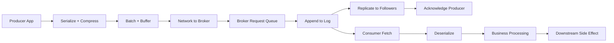
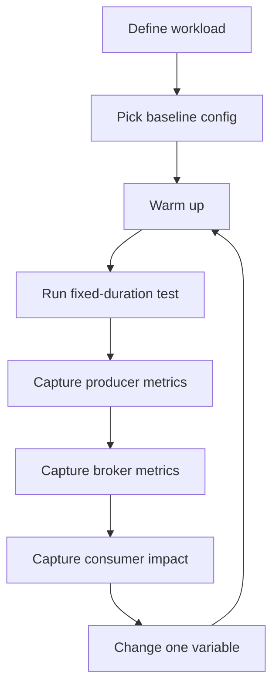

# Part 030 — Performance Benchmarking and Capacity Planning

Kafka performance engineering is not about memorizing tuning parameters. It is about understanding a pipeline of constraints:



The bottleneck can be anywhere. A Kafka cluster can have spare CPU while consumers are drowning in database latency. Producer throughput can be low because `linger.ms` is too small or because keys are skewed to one partition. Broker disk can be fast while replication latency is limited by network. Capacity planning is the practice of making these constraints explicit before production traffic discovers them for you.

## Learning Goals

After this part, you should be able to:

1. Design Kafka benchmarks that represent real workload behavior.
2. Estimate broker, partition, disk, network, and consumer capacity.
3. Tune producer throughput without blindly sacrificing latency or durability.
4. Tune consumer throughput without breaking offset correctness.
5. Identify bottlenecks using metrics from Part 029.
6. Build load, soak, replay, and failure benchmarks.
7. Produce a capacity plan with headroom, failure tolerance, and growth assumptions.

## Core Principle: Benchmark the System You Actually Have

A benchmark using tiny messages, no compression, one producer, no replication pressure, no schema validation, no downstream side effects, and no consumer work does not represent a production event-driven platform.

A useful benchmark includes:

- representative payload sizes;
- representative keys and skew;
- representative producer concurrency;
- real serializers and schema registry path if used;
- realistic `acks`, idempotence, and compression;
- replication factor and `min.insync.replicas` matching production;
- consumer processing cost;
- downstream dependency behavior;
- retention/compaction settings;
- TLS/SASL overhead if used;
- same deployment environment class;
- failure and recovery scenarios.

## Performance Vocabulary

| Term | Meaning |
|---|---|
| Throughput | Records/sec or MB/sec moved through the system |
| Latency | Time for one record to move from source to target |
| Tail latency | p95/p99/p999 latency, usually more important than average |
| Saturation | Resource approaching limit: CPU, network, disk, memory, request queue |
| Backpressure | Upstream slowdown caused by downstream inability to keep up |
| Headroom | Spare capacity reserved for bursts, failures, and growth |
| Catch-up rate | How fast a consumer reduces backlog |
| Replay rate | How fast old data can be reprocessed |
| Recovery time | Time to restore after broker/app failure |
| Steady state | Normal operating traffic and latency |
| Soak test | Long-duration test to expose leaks, compaction lag, GC, disk growth |

## Kafka Throughput Equation

At a simplified level:

```text
effective_throughput = min(
  producer_capacity,
  network_capacity,
  broker_append_capacity,
  replication_capacity,
  partition_parallelism,
  consumer_fetch_capacity,
  consumer_processing_capacity,
  downstream_capacity
)
```

The smallest term wins.

For event-driven systems, the most common hidden bottleneck is not Kafka itself. It is often:

- downstream database writes;
- external API calls;
- consumer CPU-heavy transformation;
- bad key distribution;
- small batches;
- synchronous per-record processing;
- schema registry or serializer misuse;
- too few partitions;
- too many partitions;
- compaction backlog;
- retry storm.

## Capacity Inputs

Before touching configs, gather workload facts.

### Workload Shape

| Input | Example |
|---|---|
| Peak records/sec | 50,000 records/sec |
| Average records/sec | 8,000 records/sec |
| Payload p50/p95/p99 | 2 KB / 10 KB / 80 KB |
| Compression ratio | 0.35 with zstd |
| Key cardinality | 10 million order IDs |
| Key skew | top 1% keys produce 40% traffic? |
| Required end-to-end latency | p99 < 2 seconds |
| Retention | 7 days raw, 90 days compacted projection |
| Replay requirement | 24 hours of data replayed within 2 hours |
| Replication factor | 3 |
| Minimum ISR | 2 |
| Availability during broker loss | Must survive one broker loss |

### Consumer Workload

| Input | Example |
|---|---|
| Handler p50/p95/p99 | 5 ms / 40 ms / 300 ms |
| DB write latency | 8 ms p95 |
| External API dependency | none / slow / rate-limited |
| Idempotency lookup cost | 2 ms |
| Batchable side effects | yes/no |
| Ordering requirement | per order ID |
| Maximum duplicate tolerance | duplicate event allowed if idempotent |

### Platform Constraints

| Input | Example |
|---|---|
| Broker count | 6 |
| Disk type | NVMe / network block storage |
| Network bandwidth | 10/25/100 Gbps |
| CPU cores | 16 per broker |
| JVM heap | 6–8 GB broker heap, workload-dependent |
| Security | TLS + SASL |
| Kubernetes or VM | affects storage and network assumptions |
| Managed or self-hosted | changes tuning authority |

## Producer Benchmarking

### Producer Control Variables

| Variable | Why It Matters |
|---|---|
| `acks` | Durability vs latency/throughput |
| `enable.idempotence` | Duplicate prevention and ordering constraints |
| `batch.size` | More batching improves throughput until memory/latency trade-off |
| `linger.ms` | Gives producer time to build larger batches |
| `compression.type` | Reduces network/disk at CPU cost |
| `buffer.memory` | Local producer buffering under pressure |
| `max.in.flight.requests.per.connection` | Throughput and ordering/failure interaction |
| `delivery.timeout.ms` | Total time before send failure |
| `request.timeout.ms` | Broker request timeout |
| `client.id` | Metrics attribution |

### Producer Benchmark Profiles

Do not search for one universal configuration. Test profiles.

#### Profile A: Low-Latency Transactional Event

```properties
acks=all
enable.idempotence=true
compression.type=lz4
linger.ms=0-5
batch.size=16384
client.id=quote-command-api
```

Use when:

- user-facing latency matters;
- records are small/medium;
- durability is required;
- traffic is moderate.

#### Profile B: High-Throughput Ingestion

```properties
acks=all
enable.idempotence=true
compression.type=zstd
linger.ms=10-50
batch.size=65536-262144
buffer.memory=134217728
client.id=event-ingestion-worker
```

Use when:

- throughput matters more than single-record latency;
- payloads are compressible;
- traffic is high;
- downstream consumers can tolerate slightly higher publish latency.

#### Profile C: Replay/Backfill Producer

```properties
acks=all
enable.idempotence=true
compression.type=zstd
linger.ms=50
batch.size=262144
client.id=historical-replay-job
```

Use when:

- replay is planned;
- high throughput is needed;
- rate limiting is required to avoid overwhelming production consumers.

## Producer Benchmark Method



### Rules

1. Change one variable at a time.
2. Use fixed message sizes and also realistic distribution.
3. Benchmark with production-like replication factor.
4. Benchmark with security enabled if production uses security.
5. Separate steady-state benchmark from burst benchmark.
6. Capture p95/p99 latency, not just average throughput.
7. Mark deploy/config changes on dashboards.
8. Document the result as an engineering artifact.

## Consumer Capacity Planning

Consumer throughput is usually constrained by processing time and partition parallelism.

### Simple Consumer Capacity Estimate

```text
records_per_consumer_thread_per_sec ~= 1000 / handler_latency_ms
```

If handler p95 is 20 ms:

```text
~50 records/sec/thread at p95
```

If you need 10,000 records/sec:

```text
10,000 / 50 = 200 processing slots
```

But Kafka consumer group parallelism is bounded by partition count. If the topic has 24 partitions, one consumer group can actively consume with at most 24 partition owners. You can use internal worker pools, but you must preserve offset correctness and ordering guarantees.

### Consumer Scaling Constraints

| Constraint | Consequence |
|---|---|
| One partition assigned to one consumer in a group | Consumer instance count beyond partition count does not increase parallelism |
| Per-key ordering requirement | Cannot process same key concurrently without state guard |
| Slow downstream DB | More consumers may amplify DB overload |
| Large records | Fetch size and memory must be tuned |
| Long handler time | Risk of `max.poll.interval.ms` breach |
| Retry storm | Throughput consumed by failed work |

### Consumer Tuning Levers

| Config/Design | Effect |
|---|---|
| `max.poll.records` | Bounds records returned per poll |
| `fetch.min.bytes` | Allows larger fetch batches |
| `fetch.max.wait.ms` | Wait time for fetch batching |
| `max.partition.fetch.bytes` | Per-partition fetch limit |
| `max.poll.interval.ms` | Max time between polls before rebalance risk |
| `session.timeout.ms` | Failure detection sensitivity |
| `pause()`/`resume()` | Application-level flow control |
| Bounded worker pool | Parallel processing without unbounded memory |
| Batch DB writes | Reduce downstream round trips |
| Idempotency table | Safe duplicate handling |

## Partition Count Planning

Partition count is a long-lived architectural decision. Too few partitions limit parallelism. Too many partitions increase metadata, file handles, leader election work, recovery time, and operational overhead.

### Partition Count Inputs

| Input | Why It Matters |
|---|---|
| Required consumer parallelism | Upper bound for active consumers in one group |
| Required producer throughput | Partitions distribute write load |
| Key cardinality and skew | Determines hot partition risk |
| Ordering boundary | More partitions may weaken ordering expectations |
| Future growth | Partitions are harder to shrink than increase |
| Broker count | Partition leaders must distribute across brokers |
| Replication factor | Total replica count = partitions × replication factor |
| Recovery objective | More partitions can slow reassignment/recovery |

### Partition Count Heuristic

```text
partitions >= max(
  required_consumer_parallelism,
  required_producer_parallelism,
  growth_buffer
)
```

Then validate against:

```text
total_replicas = partitions * replication_factor
replicas_per_broker = total_replicas / broker_count
leaders_per_broker = partitions / broker_count
```

This is a starting point, not a rule. Benchmark and operational limits matter.

### Example

Requirements:

- peak 30,000 records/sec;
- consumer handler p95 10 ms;
- one consumer processing slot handles about 100 records/sec at p95;
- need 300 processing slots;
- replication factor 3;
- broker count 9.

Naive partition count:

```text
required partitions >= 300
```

Replica count:

```text
300 partitions * 3 RF = 900 replicas
900 / 9 brokers = 100 replicas per broker
```

This may be operationally acceptable or excessive depending on message size, retention, broker capacity, metadata overhead, and recovery needs. You must test it.

Alternative design:

- keep 96 partitions;
- batch downstream writes;
- reduce handler p95 from 10 ms to 2 ms;
- each slot handles about 500 records/sec;
- 96 slots handle about 48,000 records/sec.

Sometimes the best partition tuning is application processing optimization.

## Broker Capacity Planning

Broker capacity is shaped by:

- ingress bytes/sec;
- egress bytes/sec;
- replication bytes/sec;
- retention bytes;
- compaction cost;
- disk throughput;
- network throughput;
- request rate;
- partition count;
- client connection count;
- TLS/SASL overhead;
- controller metadata load;
- failure headroom.

### Network Estimate

For replication factor 3:

- one leader receives producer ingress;
- two followers replicate;
- consumers fetch data;
- cross-AZ traffic may multiply cost/latency.

Simplified broker network planning:

```text
cluster_network ~= producer_ingress
                + replication_traffic
                + consumer_egress
                + rebalancing/reassignment/headroom
```

For 500 MB/s producer ingress with RF=3:

```text
replication traffic ~= 2 * 500 MB/s = 1000 MB/s internal replication
```

Consumer egress depends on number of consumer groups. Kafka fan-out is powerful but not free.

If 5 independent consumer groups read all data:

```text
consumer egress ~= 5 * 500 MB/s = 2500 MB/s
```

Cluster network demand becomes much higher than producer ingress.

## Storage Capacity Planning

Storage is determined by retained compressed data plus replication.

```text
storage_required = daily_ingress_bytes_compressed
                 * retention_days
                 * replication_factor
                 * safety_factor
```

Example:

```text
raw ingress/day = 10 TB
compression ratio = 0.4
compressed/day = 4 TB
retention = 7 days
RF = 3
safety = 1.3
storage = 4 * 7 * 3 * 1.3 = 109.2 TB
```

Add room for:

- compaction overhead;
- segment not yet deleted;
- reassignments;
- backfills;
- internal topics;
- changelog topics;
- DLQ topics;
- temporary dual-write during migrations.

## Latency Budgeting

Break end-to-end latency into components.

```text
end_to_end_latency = producer_app_time
                   + producer_buffer_time
                   + broker_append_replication_time
                   + consumer_fetch_wait
                   + consumer_processing_time
                   + downstream_side_effect_time
                   + commit_or_projection_time
```

Example latency budget for p99 < 2 seconds:

| Component | Budget |
|---|---:|
| API command handling | 100 ms |
| Produce and ack | 150 ms |
| Consumer fetch wait | 250 ms |
| Consumer processing | 700 ms |
| DB projection write | 300 ms |
| Retry/variance headroom | 500 ms |
| Total | 2000 ms |

This prevents teams from spending weeks shaving 5 ms from producer latency while the consumer DB write takes 700 ms.

## Benchmark Types

### 1. Microbenchmark

Purpose: isolate one component.

Examples:

- serializer throughput;
- compression ratio/cost;
- handler pure CPU cost;
- DB batch insert performance.

Risk: may not represent end-to-end system.

### 2. Producer Throughput Benchmark

Purpose: measure publish capacity.

Include:

- realistic payloads;
- real key distribution;
- production-like `acks`, compression, idempotence;
- broker metrics.

### 3. Consumer Throughput Benchmark

Purpose: measure processing capacity.

Include:

- real handler logic;
- idempotency store;
- downstream writes;
- retry behavior;
- offset commit strategy.

### 4. End-to-End Benchmark

Purpose: validate full pipeline.

Include:

- producer;
- Kafka cluster;
- stream processing;
- Connect/ksqlDB if applicable;
- consumer side effects;
- observability.

### 5. Soak Test

Purpose: expose long-running degradation.

Run for hours/days to detect:

- memory leaks;
- GC changes;
- compaction backlog;
- disk growth;
- state store growth;
- connection leaks;
- slow retry accumulation;
- DLQ drift.

### 6. Failure Benchmark

Purpose: measure behavior under failure.

Scenarios:

- kill broker;
- kill consumer instance;
- kill Kafka Streams instance;
- pause downstream DB;
- inject network latency;
- force rebalance;
- replay DLQ;
- restore state from empty disk;
- roll deployment during traffic.

## Benchmark Matrix

| Test | Traffic | Failure | Success Criteria |
|---|---|---|---|
| Steady state | average expected | none | p99 latency within SLO, no lag growth |
| Peak | forecast peak | none | no sustained backlog, CPU/disk/network below threshold |
| Burst | 3–5x for short window | none | backlog drains within target |
| Replay | historical data | none | no production SLO breach |
| Broker loss | peak traffic | one broker killed | no data loss, SLO degradation acceptable |
| Consumer loss | peak traffic | 30% consumers killed | recovery within target |
| Downstream slow | normal traffic | DB latency 10x | backpressure works, no unbounded memory |
| Schema error | normal traffic | bad payload | DLQ contains classified records, pipeline continues |
| Rolling deploy | normal traffic | app rolling update | no rebalance storm beyond target |

## Kafka Streams Performance Planning

Kafka Streams introduces state and topology-specific constraints.

| Factor | Impact |
|---|---|
| Number of input partitions | Determines task parallelism |
| Repartition topics | Add network, disk, latency |
| Changelog topics | Add write amplification |
| State store size | Affects restore time and local disk |
| Window retention | Affects state growth |
| Suppression | Can buffer output and increase memory/state pressure |
| Exactly-once | Adds transaction overhead |
| Standby replicas | Improve failover but increase resource use |

### Streams Capacity Questions

1. How many tasks will the topology create?
2. Which operations trigger repartitioning?
3. How large can each state store become?
4. How long does full state restore take?
5. What is the maximum acceptable restore time?
6. Are changelog topics compacted and monitored?
7. Is local disk sized for state plus growth?
8. Does EOS transaction latency fit the SLO?

## Connect Capacity Planning

Connect performance depends on external systems as much as Kafka.

### Source Connector Bottlenecks

- source DB query/CDC log read speed;
- snapshot mode;
- connector task parallelism;
- converter serialization;
- SMT overhead;
- Kafka producer throughput.

### Sink Connector Bottlenecks

- target DB/API throughput;
- batching capability;
- idempotent upsert support;
- retry behavior;
- DLQ rate;
- task parallelism;
- key distribution.

### Connect Benchmark Rule

Never benchmark a sink connector only against Kafka. Benchmark it against the real sink under realistic constraints.

## ksqlDB Performance Planning

ksqlDB queries are easy to write, but they can create expensive topologies.

Watch for:

- hidden repartitioning;
- high-cardinality aggregations;
- large window state;
- pull query load against materialized views;
- query fan-out;
- internal topic growth;
- key format mismatch;
- schema evolution impact.

A ksqlDB query should have an explicit operational owner and capacity profile just like a Java stream application.

## Tuning Decision Framework

### If Producer Throughput Is Low

Check:

1. Are batches too small?
2. Is `linger.ms` too low for throughput workload?
3. Is compression disabled or ineffective?
4. Is key distribution skewed?
5. Is broker produce latency high?
6. Is producer buffer exhausted?
7. Are retries frequent?
8. Is schema serialization slow?
9. Is TLS/SASL CPU overhead high?

Actions:

- increase `batch.size`;
- increase `linger.ms` carefully;
- test `lz4` or `zstd`;
- improve key distribution;
- add partitions if parallelism is truly insufficient;
- fix broker bottleneck;
- scale producer instances;
- reduce per-record synchronous work.

### If Consumer Lag Is Growing

Check:

1. Is input rate higher than forecast?
2. Is processing latency high?
3. Is lag concentrated in one partition?
4. Are rebalances frequent?
5. Is downstream dependency slow?
6. Is retry traffic consuming capacity?
7. Is `max.poll.records` too high for handler time?
8. Are consumers exceeding `max.poll.interval.ms`?

Actions:

- optimize handler;
- batch downstream writes;
- scale consumers up to partition limit;
- add partitions for future parallelism if key model allows;
- pause/throttle replay producers;
- isolate poison pills;
- tune fetch/poll settings;
- add backpressure to downstream calls.

### If Broker Latency Is High

Check:

1. Disk saturation?
2. Network saturation?
3. Request queue saturation?
4. Too many partitions/replicas?
5. Compaction backlog?
6. Replication lag?
7. TLS CPU overhead?
8. Client request storm?
9. Controller instability?

Actions:

- add brokers;
- rebalance partition leaders;
- reduce hot partition pressure;
- tune retention/compaction;
- upgrade storage/network;
- rate-limit replay;
- split workload by cluster if isolation is needed.

## Performance Anti-Patterns

### Anti-Pattern 1: Tuning Without a Hypothesis

Changing five parameters at once gives you no learning.

Better: write hypothesis → change one variable → measure → compare.

### Anti-Pattern 2: Optimizing Average Latency

Average latency hides tail failures.

Better: track p95/p99/p999 and freshness SLO.

### Anti-Pattern 3: Adding Consumers Without Checking Partitions

More consumers than partitions does not increase active group parallelism.

Better: inspect assignment and processing capacity.

### Anti-Pattern 4: Increasing Partitions as First Move

More partitions can add overhead and complicate ordering/recovery.

Better: first identify whether the bottleneck is partition parallelism, processing time, downstream capacity, or key skew.

### Anti-Pattern 5: Benchmarking Without Security

TLS/SASL can affect CPU and latency.

Better: benchmark with production security enabled.

### Anti-Pattern 6: No Failure Headroom

A cluster that handles peak only when every broker is alive is under-provisioned.

Better: plan for broker loss, replay, rolling deploy, and traffic burst.

### Anti-Pattern 7: Ignoring Consumer Groups in Network Planning

Kafka fan-out multiplies egress.

Better: include every full-read consumer group in network estimates.

## Capacity Planning Template

```md
# Kafka Capacity Plan: <Platform / Domain>

## Workload
- Peak records/sec:
- Average records/sec:
- Payload p50/p95/p99:
- Compression ratio:
- Key cardinality/skew:
- Retention:
- Consumer groups:
- Replay requirement:

## Correctness Requirements
- Ordering boundary:
- Durability settings:
- Duplicate tolerance:
- End-to-end latency SLO:
- Recovery time target:

## Topic/Partition Plan
- Topics:
- Partitions per topic:
- Replication factor:
- Total replicas:
- Leaders per broker:
- Rationale:

## Broker Plan
- Broker count:
- Disk per broker:
- Network per broker:
- CPU/memory:
- Failure headroom:
- Time-to-full estimate:

## Producer Plan
- Producer profiles:
- `acks`:
- idempotence:
- compression:
- batch/linger:
- expected throughput:

## Consumer Plan
- Consumer groups:
- Processing latency:
- Parallelism:
- Downstream capacity:
- Catch-up target:

## Stream/Connect/ksqlDB Plan
- Stateful stores:
- Internal topics:
- Restore time:
- Connector task count:
- Query load:

## Benchmark Evidence
- Test dates:
- Environment:
- Payloads:
- Configs:
- Results:
- Bottlenecks found:

## Risks
- Hot keys:
- Downstream limits:
- Replay overload:
- Compaction backlog:
- Operational limits:

## Decisions
- Accepted trade-offs:
- Rejected alternatives:
- Review date:
```

## Practice Lab

### Lab 1: Producer Throughput Curve

Run producer benchmarks with fixed payload size and vary:

1. `linger.ms`: 0, 5, 20, 50;
2. `batch.size`: 16 KB, 64 KB, 256 KB;
3. `compression.type`: none, lz4, zstd.

Record:

- records/sec;
- MB/sec;
- p95/p99 latency;
- CPU;
- broker request latency;
- compression ratio.

Write a conclusion: which config gives the best SLO-compliant throughput?

### Lab 2: Consumer Bottleneck Classification

Create a consumer with artificial handler latency:

- 1 ms;
- 10 ms;
- 100 ms;
- 500 ms.

Observe:

- lag growth;
- processing rate;
- poll interval behavior;
- rebalance risk;
- effect of `max.poll.records`.

Explain whether scaling consumers or optimizing handler gives better result.

### Lab 3: Hot Key Benchmark

Produce records with two distributions:

1. uniform key distribution;
2. one key receives 50% of traffic.

Compare:

- partition throughput;
- lag by partition;
- consumer assignment imbalance;
- p99 end-to-end latency.

Write a key design recommendation.

### Lab 4: Broker Failure Benchmark

During peak test:

1. stop one broker;
2. observe under-replication;
3. measure producer error/retry behavior;
4. measure consumer freshness;
5. measure recovery time;
6. verify no data loss under expected durability config.

## Staff-Level Review Questions

Use these questions in architecture review:

1. What is the actual bottleneck proven by benchmark data?
2. What happens to SLO when one broker is unavailable?
3. What happens during replay while live traffic continues?
4. Which topics are hot and why?
5. Which consumer groups multiply egress cost?
6. How long does full state restore take?
7. What is the time-to-full under peak traffic?
8. What is the maximum safe DLQ replay rate?
9. What is the largest tolerable partition count operationally?
10. Which parameter changes are evidence-based versus copied from defaults?

## Key Takeaways

- Kafka performance is a system property, not a broker-only property.
- Capacity planning must include producers, brokers, partitions, replication, consumers, downstream dependencies, and failure headroom.
- Partition count controls parallelism but also operational overhead.
- Offset lag must be interpreted with processing rate and event age.
- Benchmark with production-like durability, security, payloads, keys, and consumer work.
- Tune with hypotheses, not folklore.
- Capacity plans must include replay, burst, broker loss, and rolling deployment behavior.

## References

- Apache Kafka Documentation — Producer configs: https://kafka.apache.org/41/configuration/producer-configs/
- Apache Kafka Documentation — Monitoring: https://kafka.apache.org/41/operations/monitoring/
- Apache Kafka Documentation — latest documentation entry point: https://kafka.apache.org/documentation/
- Confluent Documentation — Monitor Consumer Lag: https://docs.confluent.io/platform/current/monitor/monitor-consumer-lag.html
- Confluent Documentation — Monitor Kafka with JMX: https://docs.confluent.io/platform/current/kafka/monitoring.html
