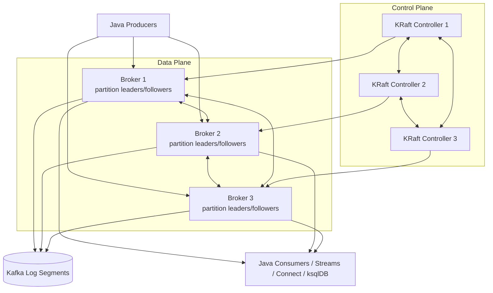
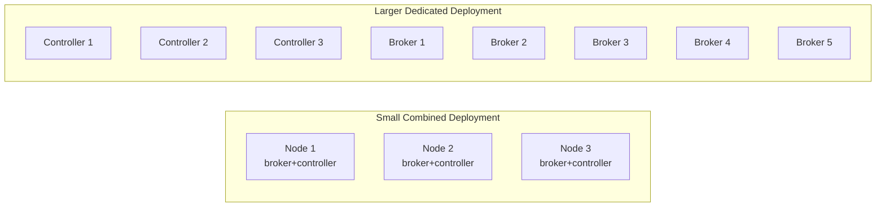
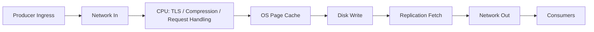
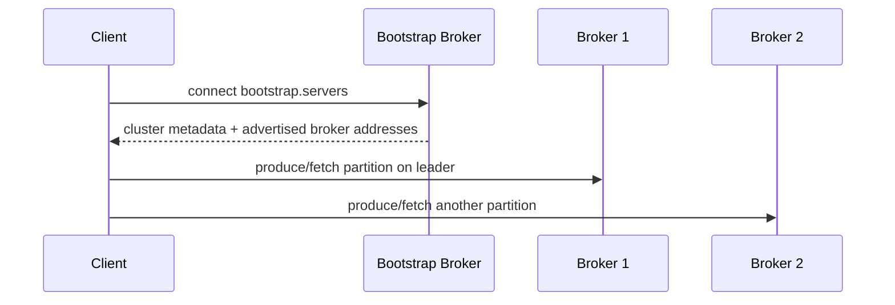
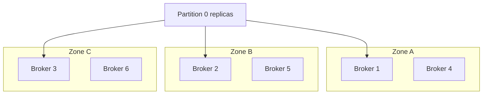
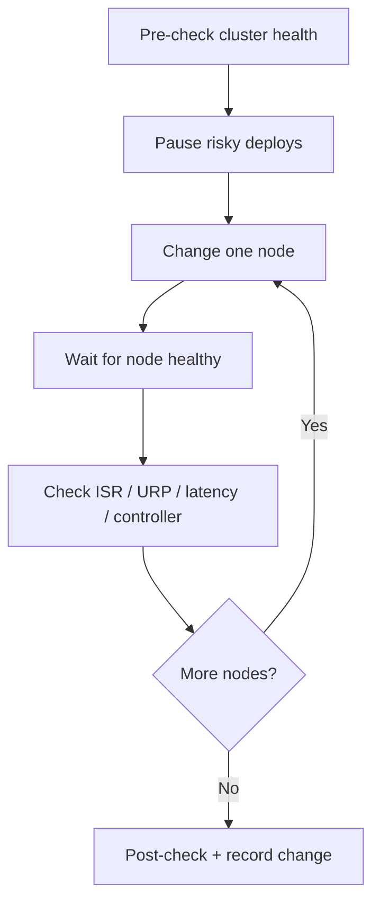

# Part 031 — Production Deployment Models

Kafka deployment is not merely "install brokers and expose port 9092". A production Kafka platform is a distributed storage system, network system, coordination system, and operational contract for many application teams.

The core question in this part is:

> How do we deploy Kafka so that it preserves durability, ordering, throughput, operability, and recoverability under realistic failure?

This part covers deployment models before Kubernetes-specific operator mechanics. Kubernetes is covered in Part 032.

---

## 1. What We Are Optimizing For

A Kafka deployment must optimize across multiple constraints:

| Dimension | What It Means | Bad Design Symptom |
|---|---|---|
| Durability | Data survives broker, disk, rack, or zone failure | Data loss after one broker/zone failure |
| Availability | Producers and consumers keep operating during partial failure | Whole platform unavailable during one node failure |
| Throughput | Sustained ingress/egress fits the workload | Producer timeout, consumer lag, disk/network saturation |
| Latency | End-to-end delay stays within SLO | p99 spikes during flush, GC, rebalance, or replication |
| Operability | Upgrades, scaling, config changes are safe | Every change becomes a high-risk maintenance window |
| Isolation | Noisy workloads do not collapse shared workloads | One hot tenant affects all event pipelines |
| Governance | Topics, schemas, ACLs, retention, and ownership are controlled | Topic sprawl, unknown producers, unbounded data cost |
| Recoverability | Failover, replay, and restore procedures are known | Incident response depends on improvisation |

Kafka is an append-only replicated log, so deployment quality is mostly determined by:

1. How brokers are placed across failure domains.
2. How controller quorum is placed.
3. How storage behaves under sustained sequential write.
4. How network behaves under replication and fan-out.
5. How clients discover brokers through listeners.
6. How operational changes are rolled out.

---

## 2. Deployment Mental Model

In Kafka 4.x style deployments, the minimum mental model is:



In a small cluster, broker and controller roles may be combined. In a serious production cluster, separating them is usually easier to reason about because controller stability becomes independent from data-plane pressure.

The first architectural invariant:

> Kafka brokers move bytes. KRaft controllers move metadata decisions. Do not let data-plane saturation destabilize the control plane.

---

## 3. Deployment Options

Kafka can be deployed on bare metal, virtual machines, containers, and cloud environments. The deployment model changes operational burden, failure behavior, cost, and control.

### 3.1 Bare Metal

Bare metal gives the most predictable access to disk, network, and CPU.

Use bare metal when:

- Kafka throughput is very high.
- Storage latency matters.
- Network traffic is heavy and predictable.
- Platform team can manage hardware lifecycle.
- You need strict control over disks, NICs, kernel settings, and rack placement.

Trade-offs:

| Advantage | Cost |
|---|---|
| Predictable I/O | Hardware procurement and lifecycle burden |
| Strong failure-domain control | Slower elasticity |
| Clear disk ownership | Requires experienced operations team |
| Lower virtualization overhead | More manual automation required |

Bare metal is often ideal for large dedicated Kafka platforms, but it is rarely the fastest path for a product team that needs a smaller internal event backbone.

### 3.2 Virtual Machines

VMs are the common enterprise compromise.

Use VMs when:

- You want clear host-level isolation but easier provisioning than bare metal.
- Infrastructure team already has strong VM automation.
- You can request stable local or attached block storage with known IOPS/throughput.
- You want predictable node identity.

Common VM risks:

- Noisy neighbor on shared physical host.
- Storage abstraction hides latency spikes.
- VM live migration can surprise Kafka if not controlled.
- Cloud block volumes may have throughput limits unrelated to broker CPU.

VM deployment is reasonable when the platform team treats Kafka as a stateful distributed system, not as ordinary stateless middleware.

### 3.3 Containers Without Kubernetes

Running Kafka in containers can work, but containerization alone does not solve orchestration.

Use containerized deployment when:

- You want repeatable packaging.
- You still control host placement and storage explicitly.
- You use systemd, Nomad, Docker Compose for labs, or another scheduler.

Avoid treating container restart as a universal fix. Kafka stores state. Broker identity, log directories, metadata, listener configuration, and advertised addresses must remain stable.

### 3.4 Managed Kafka

Managed Kafka reduces operational load but changes the control boundary.

Use managed Kafka when:

- Your team needs Kafka capability faster than it can build Kafka operations expertise.
- Compliance permits provider-managed infrastructure.
- Workload patterns fit the provider's quota, scaling, network, and feature model.
- You value SLA and operational simplicity over full control.

Trade-offs:

| Advantage | Constraint |
|---|---|
| Less broker lifecycle burden | Less control over low-level configs |
| Integrated monitoring/security options | Provider-specific limits |
| Easier upgrades | Version and feature timing controlled by provider |
| Faster start | Cost can rise sharply with throughput and retention |

The key managed-service question is not "is managed Kafka easier?" It is:

> Which failure and scaling responsibilities move to the provider, and which remain with application teams?

Application-level correctness still remains yours: idempotency, schema compatibility, DLQ policy, ordering, replay, and consumer lag behavior.

---

## 4. KRaft Deployment Topology

KRaft removes ZooKeeper from the architecture. That simplifies the external dependency graph, but it does not remove the need for a reliable metadata quorum.

### 4.1 Combined vs Dedicated Roles

Kafka nodes can be configured with broker role, controller role, or both depending on the deployment.



Use combined mode for:

- Development.
- Small internal clusters.
- Lower operational complexity.
- Environments where data-plane load is modest.

Use dedicated controllers for:

- High-throughput production clusters.
- Large partition counts.
- Strict operational isolation.
- Better blast-radius control.
- Cleaner upgrade and restart procedures.

### 4.2 Controller Quorum Size

Typical controller quorum size is odd: 3 or 5.

| Controllers | Can Tolerate | Notes |
|---:|---:|---|
| 1 | 0 failures | Development only |
| 3 | 1 failure | Common production baseline |
| 5 | 2 failures | Larger environments, more quorum overhead |

The operational invariant:

> Never deploy a production controller quorum in a way where one maintenance action plus one unplanned failure loses quorum.

If controllers are spread across zones, ensure network latency and reliability between zones fit the control-plane requirement.

---

## 5. Broker Sizing Model

Broker sizing is not a single number. A broker has multiple bottleneck surfaces:



### 5.1 CPU

CPU is used for:

- Request processing.
- TLS encryption/decryption.
- Compression/decompression.
- Replication handling.
- Page cache and kernel networking overhead.
- JVM overhead.

CPU pressure often appears as increased request latency before disk is obviously saturated.

### 5.2 Memory

Kafka relies heavily on OS page cache. Broker heap is important, but Kafka log data should primarily be served through page cache rather than a huge JVM heap.

Practical rule:

- Do not over-allocate JVM heap just because the machine has large memory.
- Leave substantial memory to the OS page cache.
- Watch GC pauses, request latency, and page-cache hit behavior indirectly through disk reads and consumer fetch latency.

### 5.3 Disk

Kafka storage is mostly sequential write, but production reality includes:

- Segment roll.
- Index writes.
- Replication fetch.
- Retention deletion.
- Compaction for compacted topics.
- Consumer catch-up reads.
- State restore and replay.

Disk planning must consider both steady state and recovery state. A broker that handles normal traffic may fail during recovery because replica catch-up multiplies I/O.

### 5.4 Network

Network is usually underestimated because Kafka data is not written only once.

For a topic with replication factor 3:

```text
broker network impact ≈ producer ingress + replication traffic + consumer egress + cross-zone traffic
```

If many consumer groups read the same topic, consumer egress can exceed producer ingress many times over.

---

## 6. Storage Design

Storage is the most important deployment decision after failure-domain placement.

### 6.1 Local Disk vs Network Disk

| Storage Type | Good For | Risk |
|---|---|---|
| Local NVMe/SSD | High throughput, low latency | Node replacement requires replica recovery |
| Attached block volume | Cloud VM flexibility | Throughput caps, latency variance |
| Network filesystem | Usually avoid for brokers | Hidden latency, consistency, failure semantics |

Kafka replicates at the application layer. Do not rely on storage replication as a substitute for Kafka replication.

### 6.2 JBOD

Kafka can use multiple log directories. JBOD can increase capacity and throughput, but it introduces operational complexity.

Decision questions:

- What happens when one disk fails?
- Can the broker keep running with partial disk failure?
- How are partitions reassigned away from failed disk?
- Does automation understand disk-level failure, not only node failure?
- Are alerts disk-specific?

For smaller teams, fewer larger disks or simpler volume layouts may be easier to operate than complex JBOD.

### 6.3 Filesystem and Mounts

The exact filesystem choice depends on environment standards, but the production concerns are stable:

- Separate Kafka log disks from OS disks.
- Ensure mount options do not surprise fsync/write behavior.
- Monitor disk fill rate and inode usage.
- Keep retention policies aligned with capacity.
- Avoid overcommitting retention across topics.

### 6.4 Disk Capacity Formula

A simplified capacity model:

```text
logical_daily_ingress_gb = messages_per_day * avg_message_size_bytes / 1024^3
retained_logical_gb = logical_daily_ingress_gb * retention_days
physical_gb = retained_logical_gb * replication_factor * compression_adjustment * headroom
```

Where:

- `compression_adjustment` may be less than 1 if broker stores compressed batches efficiently.
- `headroom` should cover rebalancing, growth, recovery, and uneven partition distribution.
- Compacted topics require different sizing because obsolete records are eventually removed, not immediately removed.

Use at least 30–50% operational headroom for serious clusters unless your platform has strong automated capacity controls.

---

## 7. Network and Listener Design

Kafka listener configuration is one of the most common production deployment failure sources.

Kafka clients do not only connect to the bootstrap address. They fetch metadata and then connect to the specific brokers returned in advertised listeners.



If `advertised.listeners` is wrong, clients may bootstrap successfully but fail afterward.

### 7.1 Listener Classes

Common listener classes:

| Listener | Purpose |
|---|---|
| Internal broker listener | Broker-to-broker replication |
| Internal client listener | Services inside same network/VPC/cluster |
| External client listener | Outside clients, often through load balancer or ingress |
| Controller listener | KRaft controller communication |

Do not mix listener concerns casually. Broker replication, internal services, external users, and controller quorum have different security and routing requirements.

### 7.2 DNS and Identity

Kafka prefers stable broker identity.

Good deployment gives each broker:

- Stable broker ID or node ID.
- Stable storage.
- Stable DNS name.
- Correct advertised listener.
- Predictable rack/zone label.

Bad deployment makes brokers look disposable without preserving identity. Stateless service patterns do not directly apply to Kafka brokers.

---

## 8. Rack Awareness and Failure Domains

Rack awareness is not only about physical racks. It means Kafka knows placement zones so replicas of the same partition are spread across failure domains.

Failure domains may be:

- Physical rack.
- Availability zone.
- Kubernetes node group.
- Power domain.
- Network domain.
- Storage array.



The invariant:

> Replica placement must make the common failure survivable, not merely make the cluster look balanced.

If the common failure is an availability zone outage, replicas must span zones. If the common failure is a host failure, replicas must span hosts. If the common failure is a storage array, replicas must not all land on volumes backed by the same array.

---

## 9. Topic-Level Deployment Policy

A production deployment is incomplete without default topic policy.

Recommended platform-level defaults:

| Setting | Recommended Direction | Reason |
|---|---|---|
| `replication.factor` | Usually 3+ | Tolerate broker failure |
| `min.insync.replicas` | Usually 2 when RF=3 | Prevent acked writes with only one replica |
| Producer `acks` | `all` for important data | Require ISR acknowledgement |
| `unclean.leader.election.enable` | false for durable topics | Avoid acknowledged data loss |
| Retention | Explicit per topic class | Avoid infinite cost or accidental deletion |
| Cleanup policy | `delete`, `compact`, or both intentionally | Align with data semantics |
| Partitions | Capacity + ordering decision | Not arbitrary default |
| Schema policy | Required for shared topics | Prevent consumer breakage |
| ACL policy | Least privilege | Limit blast radius |

A platform should expose topic classes, not raw freedom:

```yaml
critical-domain-event:
  replicationFactor: 3
  minInSyncReplicas: 2
  cleanupPolicy: delete
  retention: 30d
  schemaCompatibility: BACKWARD_TRANSITIVE
  producerAcks: all

reference-state-table:
  replicationFactor: 3
  minInSyncReplicas: 2
  cleanupPolicy: compact
  retention: infinite-or-business-defined
  schemaCompatibility: FULL_TRANSITIVE
```

---

## 10. Deployment Models by Environment

### 10.1 Local Development

Goal: fast feedback, not production realism.

Acceptable:

- Single node.
- Combined broker/controller.
- Low replication factor.
- Local container.
- Short retention.

Do not infer production performance or failure behavior from local development.

### 10.2 Integration Environment

Goal: contract testing and topology validation.

Recommended:

- Multi-broker cluster if possible.
- Schema Registry enabled.
- ACLs enabled if production uses ACLs.
- Retry/DLQ topics available.
- Topic naming and schema policy enforced.
- Testcontainers or ephemeral clusters for automated tests.

### 10.3 Staging / Pre-Production

Goal: production rehearsal.

Recommended:

- Same broker/controller topology class as production.
- Same security model.
- Same topic policy.
- Scaled-down but representative data volume.
- Upgrade rehearsal.
- Disaster recovery rehearsal.
- Performance smoke test.

### 10.4 Production

Goal: stable multi-tenant event platform.

Required:

- Clear ownership.
- Capacity plan.
- Observability.
- Change process.
- Security controls.
- Backup/DR/replay policy.
- Upgrade path.
- Incident runbooks.

---

## 11. Multi-Tenant Deployment Concerns

Kafka often becomes shared infrastructure. Shared infrastructure requires isolation.

Isolation dimensions:

| Dimension | Mechanism |
|---|---|
| Authentication | mTLS, SASL/SCRAM, OAuth/OIDC depending on platform |
| Authorization | ACLs, prefixed resource governance |
| Network | Separate listeners, private networks, firewall rules |
| Topic namespace | Domain/team/env prefixing |
| Quotas | Producer/consumer byte-rate quotas where appropriate |
| Schema ownership | Subject ownership and compatibility rules |
| Operational ownership | Topic owner, service owner, escalation path |
| Cost ownership | Retention and throughput attribution |

A mature Kafka platform prevents anonymous shared usage. Every topic should have an owner, retention reason, schema strategy, and decommission path.

---

## 12. Deployment Automation

Manual Kafka deployment does not scale operationally.

At minimum, automate:

- Broker configuration generation.
- Node identity assignment.
- Storage formatting and mount validation.
- Listener and certificate generation.
- Topic policy creation.
- ACL provisioning.
- Schema compatibility setup.
- Rolling restart sequencing.
- Health checks.
- Metric/dashboard provisioning.

### 12.1 Configuration as Code

Example conceptual inventory:

```yaml
cluster: prod-kafka-a
kraft:
  controllers:
    - id: 1
      host: kafka-controller-1.internal
      rack: az-a
    - id: 2
      host: kafka-controller-2.internal
      rack: az-b
    - id: 3
      host: kafka-controller-3.internal
      rack: az-c
brokers:
  - id: 101
    host: kafka-broker-101.internal
    rack: az-a
    logDirs:
      - /data/kafka-1
      - /data/kafka-2
  - id: 102
    host: kafka-broker-102.internal
    rack: az-b
    logDirs:
      - /data/kafka-1
      - /data/kafka-2
  - id: 103
    host: kafka-broker-103.internal
    rack: az-c
    logDirs:
      - /data/kafka-1
      - /data/kafka-2
listeners:
  internal:
    protocol: SASL_SSL
  replication:
    protocol: SSL
  controller:
    protocol: SSL
```

The exact tool can be Ansible, Terraform, Helm, Pulumi, custom platform tooling, or an operator. The invariant is that deployment state must be reproducible and reviewable.

---

## 13. Health Checks and Readiness

A broker process being alive is not enough.

Broker readiness should consider:

- Can broker connect to controller quorum?
- Is broker registered?
- Are listeners reachable from expected client networks?
- Is disk writable?
- Is disk below fill threshold?
- Is under-replicated partition count acceptable?
- Is request latency within threshold?
- Is controller stable?

Client readiness should consider:

- Can the app fetch metadata?
- Can it produce to required topic?
- Can it consume assigned partitions?
- Can it access Schema Registry if used?
- Does it have required ACLs?

Readiness should not hide problems by declaring a component ready simply because the process started.

---

## 14. Rolling Changes

Kafka operations should prefer rolling changes over full-cluster restarts.

Rolling change sequence:



Pre-checks:

- No active severe alerts.
- Controller quorum healthy.
- Under-replicated partitions acceptable, ideally zero.
- Offline partitions zero.
- Disk usage safe.
- Consumer lag not already critical.
- No active reassignment unless planned.

Never combine many change categories at once:

- Version upgrade.
- Config change.
- Storage change.
- Security change.
- Scaling event.
- Topic migration.

One change category per maintenance window is boring. Boring is good.

---

## 15. Deployment Failure Modes

### 15.1 Broker Dies

Expected behavior:

- Partition leaders on broker move to other replicas.
- Producers refresh metadata.
- Consumers continue reading from new leaders.
- Replicas become under-replicated until broker returns or reassignment completes.

Danger signs:

- Offline partitions.
- ISR shrinks below `min.insync.replicas`.
- Producer errors increase.
- Controller instability.
- Recovery saturates disk/network.

### 15.2 Controller Quorum Loses Majority

Expected behavior:

- Metadata changes stop.
- Leader elections cannot proceed normally.
- Cluster management operations fail.

Existing data-plane behavior can vary by scenario, but control-plane loss is serious. The design objective is to prevent ordinary maintenance or one zone outage from losing quorum.

### 15.3 Disk Fills

Kafka under disk pressure is dangerous.

Symptoms:

- Broker log directory errors.
- Produce failures.
- Segment deletion cannot catch up.
- Compaction backlog.
- Emergency retention reduction.

Preventive controls:

- Per-topic retention budgeting.
- Disk fill rate alerts.
- Retention class governance.
- Quota enforcement.
- Capacity review before onboarding large topics.

### 15.4 Network Partition

Network partition can cause:

- ISR shrink.
- Producer timeout.
- Consumer fetch timeout.
- Controller election instability.
- Rebalance storms.

Network failure-domain testing should be part of production readiness.

---

## 16. Deployment Decision Matrix

| Workload / Organization | Recommended Starting Model |
|---|---|
| Small product team, moderate traffic | Managed Kafka or VM-based 3-broker cluster |
| Regulated enterprise, high control requirement | VM/bare-metal dedicated Kafka platform |
| Kubernetes-native platform team | Operator-managed Kafka with strong storage discipline |
| High-throughput central event backbone | Dedicated brokers + dedicated controllers, rack-aware, capacity planned |
| Experimental analytics pipeline | Managed Kafka or isolated non-critical cluster |
| Mission-critical workflow/event system | Dedicated production Kafka with strict schema/security/runbook controls |

---

## 17. Java Application Deployment Considerations

Kafka deployment is not only brokers. Java services must be deployed with Kafka-aware behavior.

Producer services:

- Use stable client IDs.
- Expose producer metrics.
- Configure idempotence and `acks=all` for important data.
- Set bounded timeout behavior.
- Avoid unbounded send queues.
- Include event ID and correlation ID.

Consumer services:

- Use stable group IDs.
- Treat `max.poll.interval.ms` as processing contract.
- Gracefully shutdown using `wakeup()` and final commits.
- Bound concurrency.
- Expose lag and processing latency.
- Separate retry/DLQ concerns.

Kafka Streams services:

- Use stable `application.id`.
- Persist state directory when appropriate.
- Plan restore time.
- Monitor task assignment, restore, commit, and process rate.
- Treat internal topics as part of deployment state.

Connect/ksqlDB:

- Manage connector/query definitions as code.
- Version persistent queries.
- Monitor internal topics and task health.
- Do not let UI-created pipelines become undocumented production dependencies.

---

## 18. Production Deployment Checklist

### 18.1 Cluster Topology

- [ ] Broker count supports target replication and failure tolerance.
- [ ] Controller quorum is odd-sized and placed across failure domains.
- [ ] Broker and controller roles are intentionally combined or separated.
- [ ] Rack/zone labels are configured.
- [ ] Broker IDs/node IDs are stable.
- [ ] Storage is persistent and mapped to stable broker identity.

### 18.2 Storage

- [ ] OS disk separate from Kafka log disk.
- [ ] Disk throughput tested under sustained write.
- [ ] Recovery I/O tested, not only steady state.
- [ ] Disk fill alerts configured.
- [ ] Retention budget reviewed.
- [ ] Compacted topic growth monitored.

### 18.3 Network

- [ ] Advertised listeners validated from every client network.
- [ ] Internal and external listeners separated if needed.
- [ ] TLS/SASL configured where required.
- [ ] Load balancers do not break broker identity.
- [ ] Cross-zone replication traffic understood.

### 18.4 Topic Policy

- [ ] Replication factor class defined.
- [ ] `min.insync.replicas` policy defined.
- [ ] Retention class defined.
- [ ] Cleanup policy defined.
- [ ] Schema policy defined.
- [ ] ACL ownership defined.

### 18.5 Operations

- [ ] Rolling restart runbook tested.
- [ ] Upgrade runbook tested.
- [ ] Broker failure tested.
- [ ] Controller failure tested.
- [ ] Disk-full simulation reviewed.
- [ ] DR/replay process documented.
- [ ] Dashboards and alerts deployed.

---

## 19. Architecture Review Questions

Use these questions before approving a Kafka deployment:

1. What are the top three failure domains, and how are replicas placed across them?
2. What is the controller quorum topology, and what failure can it tolerate?
3. What is the expected ingress, egress, retention, and replication traffic?
4. Which workloads are latency-sensitive vs throughput-sensitive?
5. What happens when one broker dies during peak traffic?
6. What happens when one zone dies?
7. Which topics are compacted, and what is the compaction risk?
8. Which topics contain regulated/sensitive data?
9. How are schemas governed?
10. How are ACLs provisioned and reviewed?
11. How are client certificates/secrets rotated?
12. How are rolling upgrades performed?
13. What is the recovery time after broker replacement?
14. What is the replay process after consumer bug fix?
15. What is the decommission process for topics and consumers?

---

## 20. Anti-Patterns

### 20.1 Treating Kafka as Stateless

Kafka brokers are not stateless web pods. Restarting, rescheduling, and replacing brokers without preserving identity and storage can cause expensive recovery or data loss.

### 20.2 Single Broker Production

A single broker can be useful for development. It is not a production event platform.

### 20.3 Wrong Advertised Listeners

The cluster starts, bootstrap works, and clients still fail because metadata returns unreachable broker addresses.

### 20.4 Shared Mega-Cluster Without Governance

A shared Kafka cluster without topic ownership, ACL discipline, retention budgeting, and schema governance becomes a hidden coupling machine.

### 20.5 Ignoring Recovery Traffic

Sizing only for steady-state traffic ignores the most dangerous period: recovering replicas after failure.

### 20.6 Overloading Controllers

In KRaft clusters, controller quorum stability is critical. Avoid putting the metadata plane under unnecessary data-plane pressure in serious production clusters.

---

## 21. Practical Lab

### Goal

Design a Kafka deployment for this workload:

- 30 Java producer services.
- 80 Java consumer services.
- 12 Kafka Streams applications.
- 500 MB/s peak producer ingress.
- Replication factor 3.
- 7-day retention for domain events.
- 90-day retention for audit events.
- Three availability zones.
- Security requires mTLS and ACLs.

### Deliverables

Create an architecture note containing:

1. Broker count estimate.
2. Controller quorum topology.
3. Storage class and capacity formula.
4. Listener design.
5. Rack awareness strategy.
6. Topic classes.
7. ACL model.
8. Observability dashboard list.
9. Failure test plan.
10. Upgrade process.

### Review Standard

The design passes only if it answers:

- Can one broker fail without data loss?
- Can one zone fail without losing quorum?
- Can producers continue for critical topics under one broker failure?
- Can consumers catch up after a 2-hour outage?
- Can security credentials rotate without full platform downtime?

---

## 22. ADR Template

```md
# ADR: Kafka Production Deployment Model

## Status
Accepted | Proposed | Superseded

## Context
Describe workload, teams, traffic, retention, compliance, and availability targets.

## Decision
We will deploy Kafka using:

- Deployment model:
- Broker count:
- Controller topology:
- Storage model:
- Listener model:
- Rack/zone placement:
- Security model:
- Topic policy:
- Operational tooling:

## Rationale
Explain why this model satisfies durability, availability, throughput, operability, and governance.

## Alternatives Considered
- Managed Kafka
- VM-based deployment
- Bare-metal deployment
- Kubernetes operator deployment
- Smaller/larger controller quorum

## Consequences
Positive:
- ...

Negative:
- ...

## Failure Scenarios
- Broker failure:
- Controller failure:
- Disk full:
- Zone outage:
- Network partition:

## Operational Runbooks Required
- Rolling restart
- Version upgrade
- Broker replacement
- Topic expansion
- Credential rotation
- Disaster recovery
```

---

## 23. Key Takeaways

- Kafka deployment design is failure-domain design.
- Broker count alone does not define availability; replica placement and controller quorum placement matter more.
- Storage and network are first-class architecture decisions.
- KRaft simplifies dependency topology but makes controller quorum design central.
- Managed Kafka reduces broker operations but does not remove application correctness work.
- Production Kafka requires governance: topics, schemas, ACLs, retention, ownership, and cost.
- A deployment is not production-ready until failure, upgrade, replay, and recovery paths have been tested.

---

## References

- Apache Kafka Documentation — https://kafka.apache.org/documentation/
- Apache Kafka Operations and Monitoring — https://kafka.apache.org/documentation/#operations
- Confluent Platform Deployment Guide — https://docs.confluent.io/platform/current/kafka/deployment.html
- Confluent KRaft Configuration — https://docs.confluent.io/platform/current/kafka-metadata/config-kraft.html
- Confluent KRaft Overview — https://docs.confluent.io/platform/current/kafka-metadata/kraft.html
- Apache Kafka Security Authorization and ACLs — https://kafka.apache.org/documentation/#security_authz
