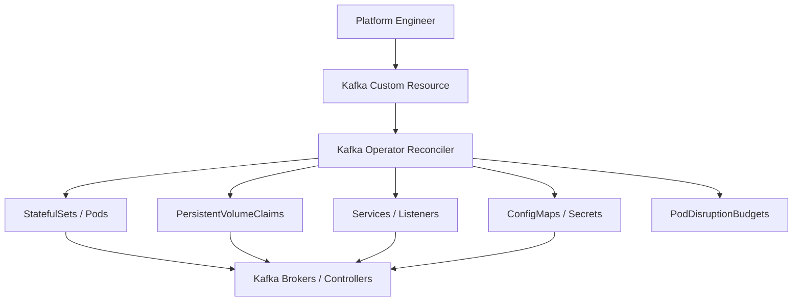
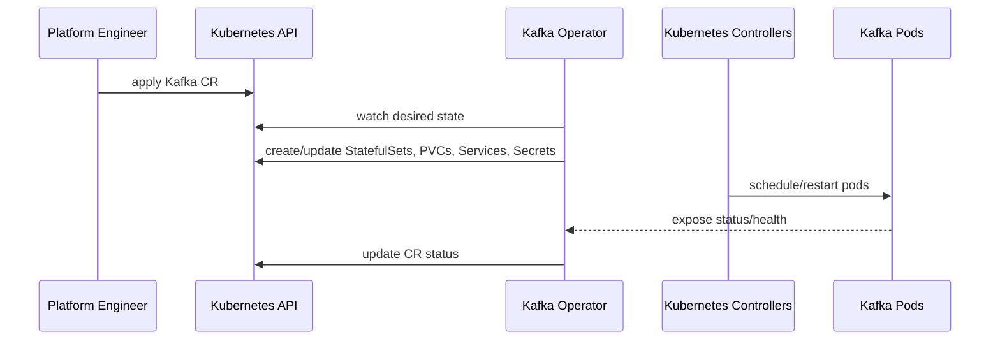
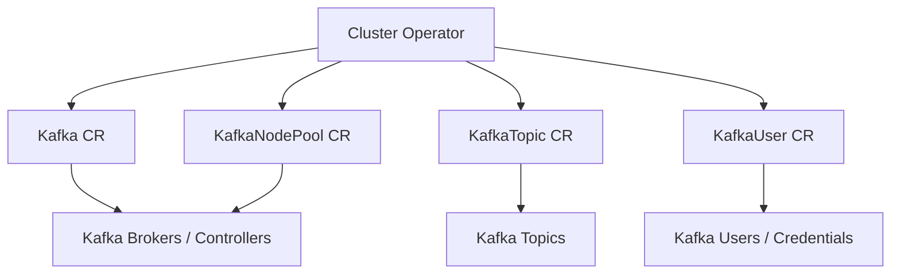
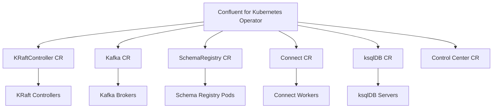
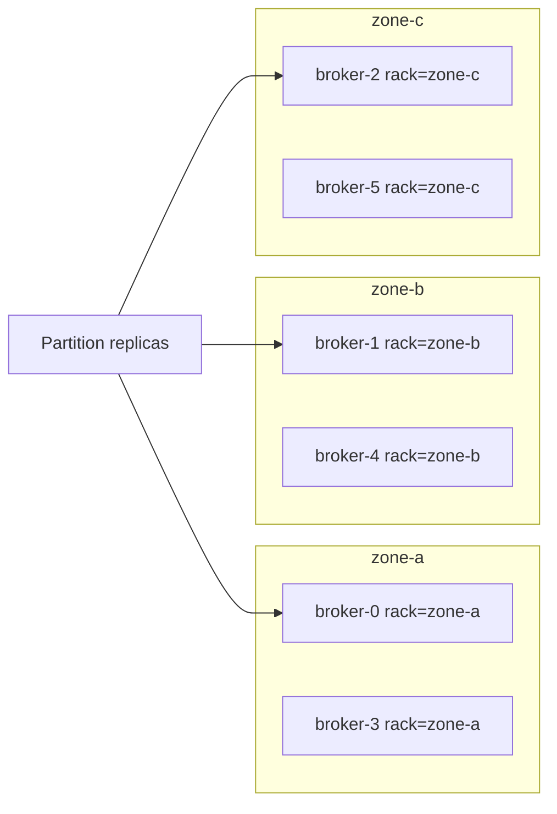
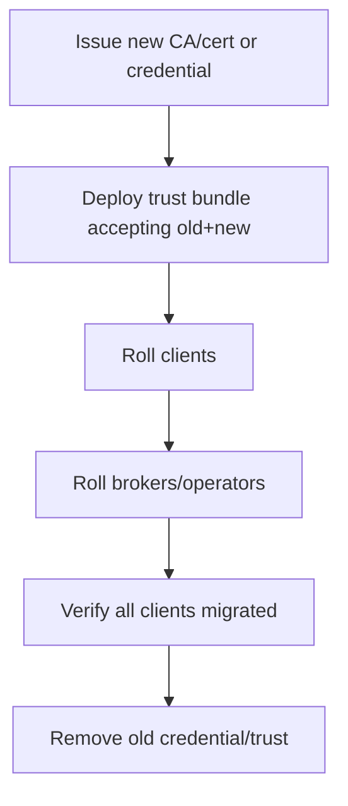
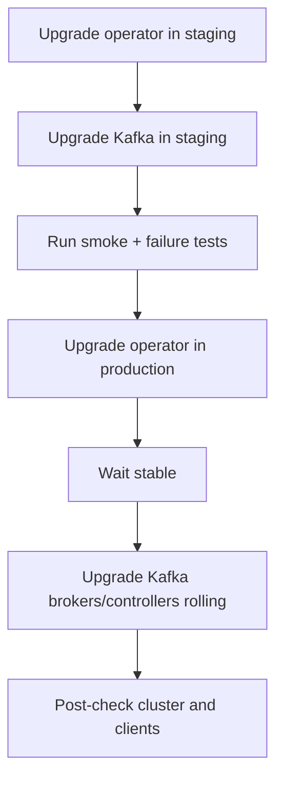
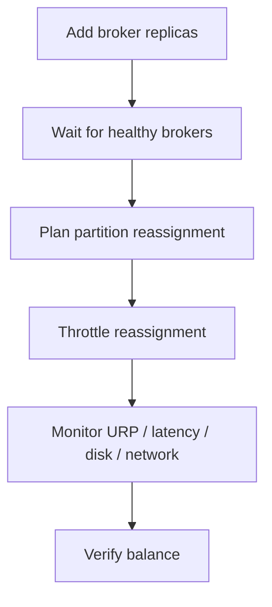
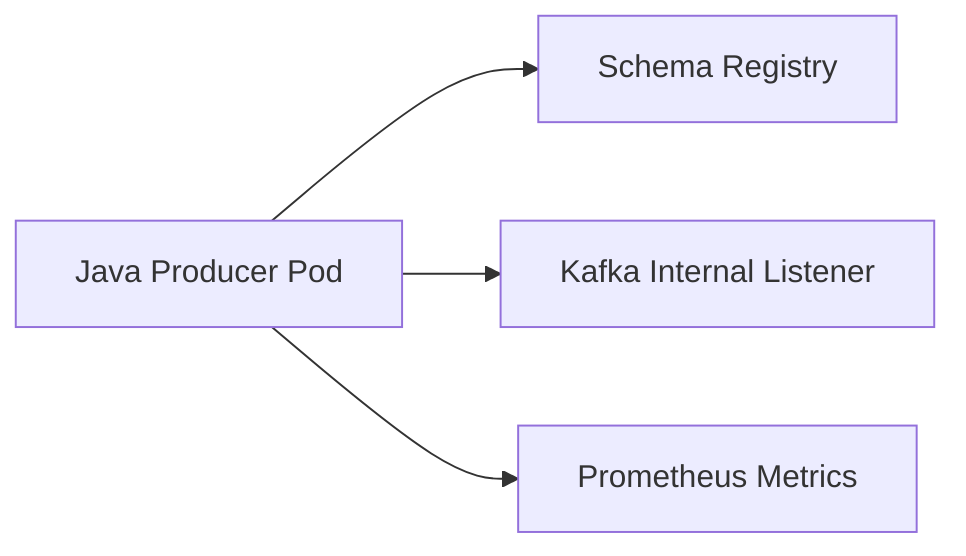

# Part 032 — Kafka on Kubernetes with Strimzi and Confluent Operator

Kafka on Kubernetes is not "Kafka magically becomes stateless". Kubernetes gives scheduling, reconciliation, declarative APIs, and ecosystem integration. Kafka still needs stable identity, persistent storage, predictable networking, controlled disruption, and strong operational discipline.

The core question in this part is:

> How do we run Kafka on Kubernetes without violating Kafka's stateful-system invariants?

This part focuses on two common operator approaches:

1. **Strimzi** — open-source Kafka operator for Kubernetes.
2. **Confluent for Kubernetes / Confluent Operator** — Confluent's operator-managed Confluent Platform deployment model.

---

## 1. Why Kafka on Kubernetes Is Hard

Kubernetes was originally optimized for elastic stateless services. Kafka is different:

| Kafka Requirement | Kubernetes Tension |
|---|---|
| Stable broker identity | Pods are replaceable by default |
| Persistent log storage | Volumes must follow broker identity carefully |
| Predictable network identity | Service/load balancer abstraction can hide broker-specific routing |
| Controlled rolling restart | Kubernetes may reschedule during node maintenance |
| Failure-domain aware replica placement | Scheduler must respect zones/racks/nodes |
| Long recovery operations | Kubernetes health probes may restart too aggressively |
| Data-plane heavy workload | CNI, storage class, and cross-zone network cost matter |

Kafka on Kubernetes works well when the operator and platform design encode Kafka invariants into Kubernetes primitives.



The operator is valuable because it turns complicated lifecycle operations into controlled reconciliation. But the operator cannot save a bad platform foundation: poor storage, poor networking, weak node isolation, or unclear ownership.

---

## 2. Operator Mental Model

A Kafka operator watches custom resources and reconciles actual Kubernetes resources toward the desired state.



Operator-managed Kafka is not only installation automation. It should manage:

- Cluster creation.
- Broker/controller configuration.
- Listener exposure.
- Certificates and users.
- Rolling restarts.
- Scaling operations.
- Topic/user resources if enabled.
- Metrics configuration.
- Upgrade sequencing.

But some actions remain architectural decisions:

- Storage class selection.
- Node pool topology.
- Zone placement.
- Network exposure model.
- Security policy.
- Topic governance.
- Capacity plan.
- DR strategy.

---

## 3. Kubernetes Primitives That Matter

### 3.1 StatefulSet

Kafka brokers usually run with stable pod identity. StatefulSet gives predictable pod names and stable volume claim mapping.

Example identity pattern:

```text
my-cluster-kafka-0
my-cluster-kafka-1
my-cluster-kafka-2
```

Broker identity must not drift accidentally. If broker `0` gets broker `1`'s data volume, the platform has a severe correctness problem.

### 3.2 PersistentVolumeClaim

Kafka logs must be backed by persistent volumes.

Decision questions:

- Is the storage class zonal or regional?
- What are IOPS and throughput limits?
- What is volume expansion behavior?
- What happens when a node fails?
- Can the volume attach quickly to a replacement pod?
- Does the operator support the desired storage migration?

### 3.3 Service and Listener

Kafka clients need broker-specific advertised addresses. A single Kubernetes Service abstraction can be insufficient for external clients unless the operator creates the correct per-broker exposure.

Listener design must answer:

- Internal clients inside the cluster?
- Internal clients inside same VPC but outside Kubernetes?
- External clients over public/private load balancer?
- Separate replication and controller traffic?
- TLS/mTLS/SASL requirements?

### 3.4 PodDisruptionBudget

PDB prevents too many Kafka pods from being voluntarily disrupted at once. It is not a complete HA guarantee, but it reduces maintenance risk.

### 3.5 Node Affinity and Anti-Affinity

Kafka brokers should be spread across nodes and zones.

Controls:

- Pod anti-affinity.
- Topology spread constraints.
- Node affinity.
- Taints and tolerations.
- Dedicated node pools.

### 3.6 Probes

Liveness and readiness probes must not cause restart loops during slow recovery.

A Kafka pod restoring state, replaying logs, or waiting for quorum may need time. Aggressive liveness probes can turn recovery into self-inflicted instability.

---

## 4. Strimzi Mental Model

Strimzi provides Kubernetes custom resources for Kafka clusters and related components. A simplified Strimzi deployment includes:



Core Strimzi concepts:

| Resource | Purpose |
|---|---|
| `Kafka` | Defines Kafka cluster-level configuration |
| `KafkaNodePool` | Defines groups of Kafka nodes with roles, replicas, and storage |
| `KafkaTopic` | Declarative topic management |
| `KafkaUser` | Declarative user/credential/ACL management |
| `KafkaConnect` | Kafka Connect cluster |
| `KafkaConnector` | Individual connector when connector operator is enabled |
| `KafkaMirrorMaker2` | Cross-cluster replication/mirroring |

Modern Strimzi deployments are KRaft-oriented and use node pools to model brokers/controllers.

---

## 5. Strimzi KRaft with KafkaNodePool

A node pool lets you define different groups of Kafka nodes. For example:

- Dedicated controller pool.
- Dedicated broker pool.
- Broker pool with larger disks.
- Broker pool pinned to specific node class.

Conceptual Strimzi-style example:

```yaml
apiVersion: kafka.strimzi.io/v1beta2
kind: KafkaNodePool
metadata:
  name: controllers
  labels:
    strimzi.io/cluster: prod-kafka
spec:
  replicas: 3
  roles:
    - controller
  storage:
    type: persistent-claim
    size: 100Gi
    deleteClaim: false
---
apiVersion: kafka.strimzi.io/v1beta2
kind: KafkaNodePool
metadata:
  name: brokers
  labels:
    strimzi.io/cluster: prod-kafka
spec:
  replicas: 6
  roles:
    - broker
  storage:
    type: persistent-claim
    size: 2Ti
    deleteClaim: false
---
apiVersion: kafka.strimzi.io/v1beta2
kind: Kafka
metadata:
  name: prod-kafka
spec:
  kafka:
    version: 4.0.0
    metadataVersion: 4.0-IV3
    listeners:
      - name: internal
        port: 9092
        type: internal
        tls: true
    config:
      offsets.topic.replication.factor: 3
      transaction.state.log.replication.factor: 3
      transaction.state.log.min.isr: 2
      default.replication.factor: 3
      min.insync.replicas: 2
  entityOperator:
    topicOperator: {}
    userOperator: {}
```

Treat this as conceptual. Always check the exact Strimzi version and CRD schema before applying.

### Key Node Pool Design Rules

1. Separate controllers and brokers for larger production clusters.
2. Use persistent storage with `deleteClaim: false` for production.
3. Spread broker pods across zones/nodes.
4. Avoid casual storage type changes for controller pools.
5. Keep node-pool changes small and rehearsed.

---

## 6. Confluent for Kubernetes Mental Model

Confluent for Kubernetes manages Confluent Platform components on Kubernetes. A deployment may include:

- KRaft controllers.
- Kafka brokers.
- Schema Registry.
- Kafka Connect.
- ksqlDB.
- REST Proxy.
- Control Center.

Conceptual view:



Confluent operator deployments are especially relevant when the organization standardizes on Confluent Platform features and wants operator-managed lifecycle for the broader ecosystem, not only Apache Kafka brokers.

Decision questions:

- Are you using Confluent Schema Registry, ksqlDB, Connect, Control Center, or enterprise security features?
- Is your platform team licensed and trained for Confluent Platform operations?
- Do you need vendor-supported upgrade paths?
- Are operator and platform versions aligned?
- Are you comfortable with product-specific CRDs and lifecycle semantics?

---

## 7. Strimzi vs Confluent Operator Decision Matrix

| Dimension | Strimzi | Confluent for Kubernetes |
|---|---|---|
| Primary orientation | Open-source Apache Kafka on Kubernetes | Confluent Platform on Kubernetes |
| Licensing | Open-source project | Confluent product ecosystem |
| Ecosystem components | Kafka, Connect, MirrorMaker, users/topics | Kafka plus Confluent Platform components |
| Best fit | Teams wanting open-source Kubernetes-native Kafka | Teams standardized on Confluent Platform |
| Operational model | Kubernetes CRDs + Strimzi operator | Kubernetes CRDs + CFK operator |
| Governance | You build platform conventions | Product-integrated conventions possible |
| Support model | Community/vendor depending on distribution | Confluent support path |

Do not choose an operator only because installation looks easy. Choose based on lifecycle, support, feature requirements, governance, and internal skill.

---

## 8. Storage on Kubernetes

Storage class is the most important Kubernetes decision for Kafka.

### 8.1 Storage Class Questions

Before approving a storage class, answer:

1. Is it local, zonal block, regional block, or network filesystem?
2. What are IOPS and throughput guarantees?
3. What are p95/p99 write latency characteristics?
4. Can it expand online?
5. How long does attach/detach take during rescheduling?
6. What is the failure domain?
7. Does it preserve volume identity across pod restart?
8. Is `deleteClaim` behavior safe?
9. How does backup/snapshot work, and is it meaningful for Kafka?
10. What happens when a node with local PV dies?

### 8.2 Local Persistent Volumes

Local PVs can offer strong performance but require strong operational discipline.

Pros:

- Lower latency.
- High throughput.
- Clear node locality.

Cons:

- Pod must return to same node or data must be rebuilt elsewhere.
- Node failure requires Kafka replica recovery.
- Cluster autoscaling becomes harder.

### 8.3 Network / Cloud Block Volumes

Block volumes are easier operationally but may have throughput and latency caps.

Pros:

- Easier pod rescheduling.
- Managed storage lifecycle.
- Volume expansion may be available.

Cons:

- Performance may be tier-dependent.
- Cross-zone attachment may be impossible or slow depending on provider.
- Latency variance may affect Kafka p99.

### 8.4 Storage Anti-Pattern

Do not deploy production Kafka on generic shared network filesystem without deeply understanding its latency, consistency, and failure semantics.

Kafka replication is designed at the Kafka layer. Storage abstraction should not introduce hidden distributed-system behavior below Kafka.

---

## 9. Kubernetes Scheduling and Failure Domains

Kafka pods should not be placed randomly.

Production scheduling requirements:

- Brokers spread across nodes.
- Brokers spread across zones/racks.
- Controllers spread across zones/racks.
- Avoid all controllers on one node group.
- Avoid co-locating every high-throughput broker with other noisy workloads.
- Use dedicated node pools where justified.

Conceptual topology spread:

```yaml
spec:
  template:
    pod:
      topologySpreadConstraints:
        - maxSkew: 1
          topologyKey: topology.kubernetes.io/zone
          whenUnsatisfiable: DoNotSchedule
          labelSelector:
            matchLabels:
              strimzi.io/name: prod-kafka-kafka
      affinity:
        podAntiAffinity:
          requiredDuringSchedulingIgnoredDuringExecution:
            - labelSelector:
                matchLabels:
                  strimzi.io/name: prod-kafka-kafka
              topologyKey: kubernetes.io/hostname
```

Exact syntax depends on operator support and CRD schema. The principle is stable: Kafka availability depends on placement.

---

## 10. Rack Awareness in Kubernetes

Kafka rack awareness must map Kubernetes topology to Kafka broker rack labels.

Typical mapping:

```text
Kubernetes node label: topology.kubernetes.io/zone=ap-southeast-3a
Kafka broker rack: ap-southeast-3a
```

Then Kafka can spread replicas across racks/zones.



The platform must align three layers:

1. Kubernetes scheduler placement.
2. Kafka broker rack labels.
3. Topic replica assignment.

If any layer is wrong, replicas may appear healthy but fail together during a zone outage.

---

## 11. Listener and Exposure Patterns

### 11.1 Internal Only

Used when all producers/consumers run inside the same Kubernetes cluster.

Advantages:

- Simpler network.
- Lower attack surface.
- Easier service discovery.

Risks:

- Tightly couples Kafka clients to same cluster.
- Multi-cluster app architecture needs another exposure model.

### 11.2 Internal VPC / Private Network

Used when clients run outside Kubernetes but inside private network.

Typical mechanisms:

- Internal load balancers.
- NodePort with private routing.
- Private DNS.
- Per-broker services.

Critical requirement: advertised addresses must be reachable from clients.

### 11.3 External/Public

Used for cross-network or partner access. Requires stronger security and operational review.

Controls:

- TLS/mTLS.
- SASL/OAuth where appropriate.
- Strict ACLs.
- Network allowlists.
- Audit logs.
- Rate limits/quotas.

### 11.4 Common Listener Failure

A client can bootstrap but cannot produce because metadata returns an internal pod DNS name unreachable from the client network.

Always test Kafka connectivity from the actual client environment, not only from inside the Kafka namespace.

---

## 12. Security on Kubernetes

Kafka security on Kubernetes spans both Kafka and Kubernetes.

### 12.1 Kafka-Level Controls

- TLS encryption.
- mTLS or SASL authentication.
- ACL authorization.
- Topic-level least privilege.
- Schema Registry access control if applicable.
- Connect/ksqlDB principal separation.

### 12.2 Kubernetes-Level Controls

- Namespace isolation.
- RBAC for operator and platform users.
- Secret management.
- NetworkPolicy.
- Pod Security Standards.
- Image provenance and scanning.
- Audit logging.

### 12.3 Secret Rotation

Kafka credentials and certificates must rotate without complete platform downtime.

Rotation plan:



Never design security rotation as an emergency full-cluster redeploy.

---

## 13. Kafka Topics and Users as Kubernetes Resources

Operators often provide CRDs for topic and user management.

Example conceptual topic:

```yaml
apiVersion: kafka.strimzi.io/v1beta2
kind: KafkaTopic
metadata:
  name: order-created-v1
  labels:
    strimzi.io/cluster: prod-kafka
spec:
  partitions: 24
  replicas: 3
  config:
    retention.ms: 2592000000
    min.insync.replicas: 2
    cleanup.policy: delete
```

Benefits:

- Topic changes are reviewable.
- GitOps workflows become possible.
- Ownership and policy can be encoded.
- Drift can be detected.

Risks:

- Manual changes through Kafka CLI may fight the operator.
- Topic deletion policy must be controlled.
- Partition increases are one-way from an ordering perspective.
- Some topic changes are operationally expensive.

Treat topic CRDs as production API, not convenience YAML.

---

## 14. GitOps Model

A mature Kafka-on-Kubernetes platform often uses GitOps.

Repository example:

```text
kafka-platform/
  clusters/
    prod-a/
      kafka.yaml
      nodepools.yaml
      listeners.yaml
      metrics.yaml
    staging-a/
      kafka.yaml
  topics/
    commerce/
      order-created-v1.yaml
      order-status-changed-v1.yaml
    billing/
      invoice-issued-v1.yaml
  users/
    commerce-order-service.yaml
    billing-invoice-service.yaml
  policies/
    topic-classes.yaml
    acl-templates.yaml
```

Review workflow:

1. Team proposes topic/user change.
2. Platform validates naming, retention, schema, ACL, owner.
3. CI runs policy checks.
4. GitOps reconciles resources.
5. Dashboards and alerts are updated.

This prevents Kafka from becoming a mutable cluster full of undocumented manual changes.

---

## 15. Rolling Upgrades on Kubernetes

Operator-managed upgrades are safer, not risk-free.

Upgrade checklist:

- Confirm supported Kubernetes version.
- Confirm operator version compatibility.
- Confirm Kafka/Confluent Platform version path.
- Read release notes.
- Upgrade staging first.
- Do not combine operator upgrade, Kafka version upgrade, config changes, credential rotation, and scaling in one step.
- Verify CRD changes.
- Verify deprecated fields.
- Monitor ISR, controller health, request latency, and client errors.

Upgrade flow:



In production, the safest upgrade is the one where rollback and pause points are defined before starting.

---

## 16. Scaling Kafka on Kubernetes

### 16.1 Scaling Brokers

Broker scale-out is not complete when pods start.

After adding brokers:

- Existing partitions remain where they are until reassigned.
- New brokers may be underutilized.
- Partition reassignment creates network/disk load.
- Client metadata changes.
- Rack awareness should be preserved.

Scaling flow:



### 16.2 Scaling Controllers

Controller quorum scaling is more sensitive than broker scaling. Treat it as a dedicated operation, not routine autoscaling.

Do not assume horizontal pod autoscaling is suitable for Kafka brokers or controllers. Kafka scaling is data-placement scaling, not stateless request scaling.

### 16.3 Scaling Clients

Kafka Streams, Connect, and consumers can often scale more elastically, but still depend on partition count, task count, and group rebalancing behavior.

---

## 17. Observability for Kafka on Kubernetes

You need both Kafka metrics and Kubernetes metrics.

### 17.1 Kafka Metrics

- Under-replicated partitions.
- Offline partitions.
- Active controller count / controller health.
- Request latency.
- Produce/fetch rate.
- Network processor idle.
- ISR shrink/expand rate.
- Log flush and disk metrics.
- Consumer lag.
- Rebalance count.

### 17.2 Kubernetes Metrics

- Pod restarts.
- Pod pending time.
- Node pressure.
- PVC usage.
- Volume attach/detach duration.
- CNI/network errors.
- DNS errors.
- OOMKilled events.
- PDB violations.
- Operator reconciliation errors.

### 17.3 Operator Metrics and Status

Monitor:

- Custom resource status.
- Reconciliation failures.
- Rolling update progress.
- Certificate renewal status.
- Topic/user operator health.
- Connector status if using Connect operator.

A Kafka dashboard without Kubernetes scheduling/storage visibility is incomplete. A Kubernetes dashboard without Kafka ISR/lag/request metrics is also incomplete.

---

## 18. Failure Modes

### 18.1 Pod Restart

Expected:

- Broker pod restarts.
- Same PVC reattaches.
- Broker rejoins cluster.
- Replicas catch up.

Danger:

- PVC attach is slow.
- Broker gets stuck due to wrong identity/config.
- Liveness probe restarts broker repeatedly.
- ISR remains under-replicated.

### 18.2 Node Failure

Expected:

- Pod reschedules if storage allows.
- Or Kafka replicas recover elsewhere if local PV is lost.

Danger:

- Local PV pins pod to dead node.
- Multiple brokers were scheduled on same physical failure domain.
- Recovery traffic saturates cluster.

### 18.3 Zone Failure

Expected if designed well:

- Remaining zones preserve controller quorum.
- Topics with RF=3 and min ISR=2 may continue depending on replica placement and producer settings.
- Some capacity is reduced but platform survives.

Danger:

- All controllers accidentally placed in same zone.
- Some partitions had replicas concentrated in failed zone.
- Cross-zone networking assumptions fail.

### 18.4 Operator Failure

If the operator is down, existing Kafka pods usually keep running, but reconciliation stops.

Impact:

- No automated rolling changes.
- Topic/user reconciliation delayed.
- Certificate automation may be affected.
- Status may become stale.

Operator HA and alerting matter, but operator failure is different from broker failure.

### 18.5 Bad Reconciliation

A wrong CR change can trigger rolling restarts, listener changes, storage mutation attempts, or security breakage.

Controls:

- Git review.
- Policy-as-code.
- Staging reconciliation test.
- Admission control.
- Change freeze during incidents.

---

## 19. Production Readiness Checklist

### 19.1 Kubernetes Foundation

- [ ] Kubernetes version supported by chosen operator.
- [ ] Dedicated node pool considered for Kafka.
- [ ] Storage class benchmarked.
- [ ] Pod anti-affinity/topology spread configured.
- [ ] PDB configured.
- [ ] Node maintenance process tested.
- [ ] NetworkPolicy reviewed.
- [ ] DNS behavior validated.

### 19.2 Kafka Operator

- [ ] Operator version pinned.
- [ ] CRD version reviewed.
- [ ] Reconciliation alerts configured.
- [ ] Upgrade path documented.
- [ ] Operator permissions least-privilege enough for function.
- [ ] Topic/user operators intentionally enabled or disabled.

### 19.3 Kafka Cluster

- [ ] Dedicated or combined controller/broker roles intentionally chosen.
- [ ] Controller quorum spread across failure domains.
- [ ] Brokers spread across nodes/zones.
- [ ] Rack awareness configured.
- [ ] Persistent storage uses safe delete policy.
- [ ] Listeners tested from every client location.
- [ ] TLS/SASL/ACLs configured.
- [ ] Metrics exported.

### 19.4 Application Integration

- [ ] Java producers validate broker advertised addresses.
- [ ] Java consumers handle rebalance and shutdown.
- [ ] Kafka Streams state restore time tested.
- [ ] Connect task failure alerts configured.
- [ ] ksqlDB query ownership documented.
- [ ] Schema Registry available and secured.

### 19.5 Operational Runbooks

- [ ] Broker pod restart.
- [ ] Broker node drain.
- [ ] Controller pod restart.
- [ ] PVC expansion.
- [ ] Certificate rotation.
- [ ] Operator upgrade.
- [ ] Kafka version upgrade.
- [ ] Broker scale-out.
- [ ] Partition reassignment.
- [ ] Disaster recovery.

---

## 20. Java Service Deployment Pattern on Kubernetes

When Java Kafka clients run in Kubernetes next to Kafka, they need proper lifecycle behavior.

### 20.1 Producer Deployment



Checklist:

- Use readiness probe that verifies dependencies lightly.
- Do not block startup forever waiting for Kafka if platform prefers degraded startup.
- Configure producer delivery timeout intentionally.
- Expose producer error metrics.
- Use graceful shutdown to flush/close producer.

### 20.2 Consumer Deployment

Checklist:

- Use graceful shutdown hook.
- Stop polling.
- Finish in-flight records or checkpoint safely.
- Commit only durable completed work.
- Close consumer to leave group cleanly.
- Size `max.poll.interval.ms` against actual processing behavior.

### 20.3 Kafka Streams Deployment

Checklist:

- Use stable `application.id`.
- Configure state directory volume if local state restore cost is high.
- Readiness should consider stream state: `CREATED`, `REBALANCING`, `RUNNING`, `ERROR`.
- Gracefully close streams on SIGTERM.
- Monitor restore rate and task lag.

Conceptual shutdown:

```java
Runtime.getRuntime().addShutdownHook(new Thread(() -> {
    streams.close(Duration.ofSeconds(30));
}));
```

The application must respect Kubernetes termination grace period. If grace period is shorter than safe shutdown, Kubernetes will kill the process before it can commit/close cleanly.

---

## 21. Anti-Patterns

### 21.1 Kafka on Kubernetes Without Persistent Volumes

Ephemeral broker storage is acceptable only for disposable development clusters. It is not production Kafka.

### 21.2 Treating Kafka Brokers Like Web Pods

HorizontalPodAutoscaler-style thinking does not map to Kafka broker scaling. Broker scaling requires data reassignment and capacity planning.

### 21.3 Single Load Balancer for All Broker Traffic Without Broker Identity

Kafka clients need broker-specific connectivity after metadata discovery. A naive single load balancer can break Kafka semantics unless the operator exposure model handles it correctly.

### 21.4 Ignoring Storage Class Limits

A Kafka pod with high CPU and memory is still slow if its PVC has low throughput or high p99 latency.

### 21.5 Aggressive Liveness Probes

A broker recovering from failure may be slow but healthy. Restarting it repeatedly can extend the outage.

### 21.6 Manual Cluster Mutation Outside Operator

Manual changes can fight reconciliation and create drift. If the operator owns the resource, treat the CR/Git source as the control plane.

---

## 22. Practical Lab

### Goal

Design a Kubernetes Kafka deployment for a regulated internal platform.

Workload:

- 6 Kafka brokers.
- 3 dedicated KRaft controllers.
- 3 availability zones.
- Java producers and consumers inside Kubernetes and outside Kubernetes in same VPC.
- Schema Registry required.
- Kafka Connect required.
- mTLS for service identity.
- 30-day domain-event retention.
- 180-day audit-event retention.

### Deliverables

Create:

1. Operator choice memo: Strimzi or Confluent for Kubernetes.
2. Node pool design.
3. Storage class decision.
4. Listener model.
5. Rack awareness mapping.
6. Topic class YAML examples.
7. User/ACL provisioning strategy.
8. Observability dashboard list.
9. Upgrade runbook.
10. Failure test plan.

### Failure Tests

Run or simulate:

- Delete one broker pod.
- Drain one Kafka node.
- Kill one controller pod.
- Block one client network path.
- Fill one test broker disk to warning threshold.
- Break one topic CR in staging and observe reconciliation failure.
- Rotate one client certificate.

The design passes only if failure behavior is understood before production onboarding.

---

## 23. ADR Template

```md
# ADR: Kafka on Kubernetes Operator Deployment

## Status
Accepted | Proposed | Superseded

## Context
Describe why Kafka is being deployed on Kubernetes, workload size, teams, compliance needs, and platform constraints.

## Decision
We will use:

- Operator:
- Kafka version:
- KRaft topology:
- Controller node pool:
- Broker node pool:
- Storage class:
- Listener model:
- Rack awareness mapping:
- Security model:
- Topic/user management model:
- GitOps workflow:

## Rationale
Explain why this satisfies durability, availability, operability, supportability, and governance.

## Alternatives Considered
- Managed Kafka
- VM-based Kafka
- Bare-metal Kafka
- Strimzi
- Confluent for Kubernetes

## Consequences
Positive:
- ...

Negative:
- ...

## Failure Scenarios
- Broker pod restart:
- Node failure:
- Zone outage:
- Operator failure:
- PVC failure:
- Bad CR change:

## Runbooks Required
- Operator upgrade
- Kafka upgrade
- Certificate rotation
- Broker scale-out
- Node drain
- Partition reassignment
- DR / mirror / restore
```

---

## 24. Key Takeaways

- Kafka on Kubernetes is viable only when Kafka's stateful invariants are preserved.
- Operators reduce operational complexity but do not remove architecture responsibility.
- Storage class, broker identity, listener design, and failure-domain placement matter more than YAML aesthetics.
- Strimzi is a strong open-source Kubernetes-native Kafka operator; Confluent for Kubernetes fits teams standardized on the Confluent Platform ecosystem.
- Topic/user CRDs enable governance but require discipline and drift control.
- Rolling upgrades, node maintenance, certificate rotation, broker replacement, and failure recovery must be rehearsed before production.
- Java producers, consumers, and Kafka Streams apps need Kubernetes-aware lifecycle handling: readiness, graceful shutdown, metrics, and bounded processing.

---

## References

- Strimzi Documentation — https://strimzi.io/docs/operators/latest/deploying
- Strimzi Project — https://strimzi.io/
- Strimzi KafkaNodePool Introduction — https://strimzi.io/blog/2023/08/14/kafka-node-pools-introduction/
- Confluent for Kubernetes Quick Start — https://docs.confluent.io/operator/current/co-quickstart.html
- Confluent for Kubernetes Upgrade Guide — https://docs.confluent.io/operator/current/co-upgrade-overview.html
- Confluent Kafka Rack Awareness with CFK — https://docs.confluent.io/operator/current/co-configure-rack-awareness.html
- Apache Kafka Documentation — https://kafka.apache.org/documentation/
- Kubernetes StatefulSet Documentation — https://kubernetes.io/docs/concepts/workloads/controllers/statefulset/
- Kubernetes Persistent Volumes Documentation — https://kubernetes.io/docs/concepts/storage/persistent-volumes/
