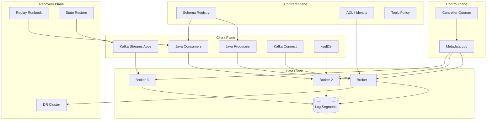
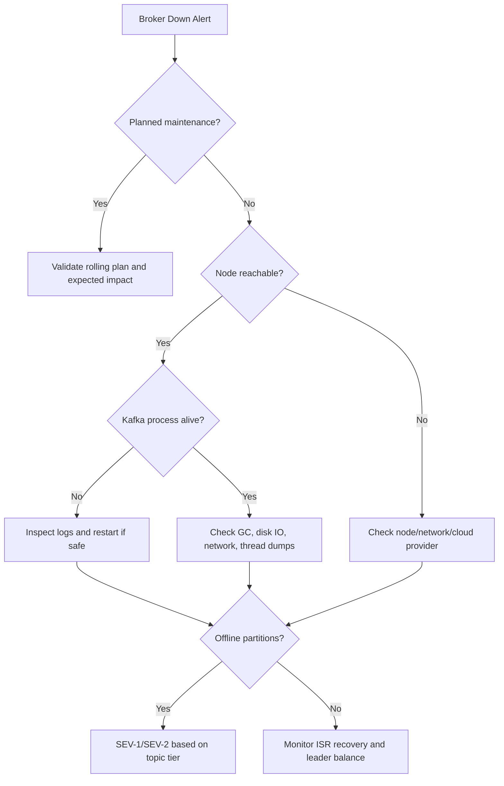
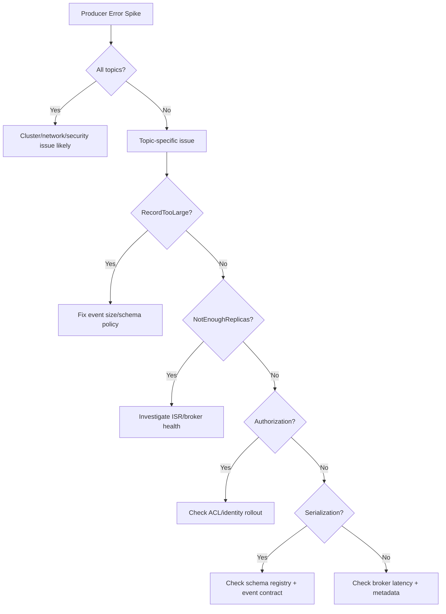
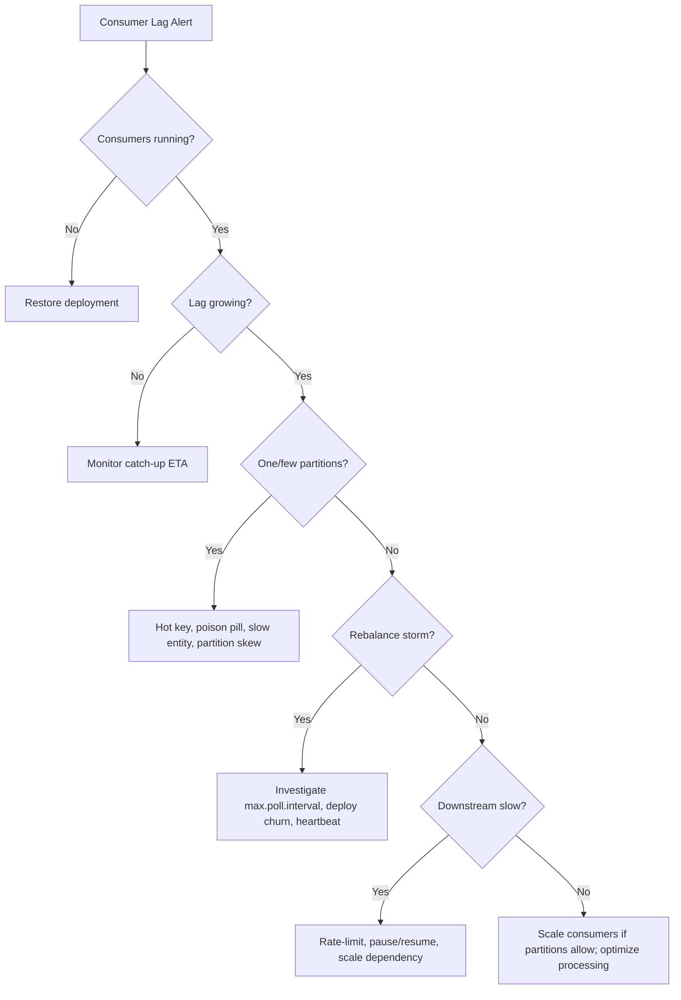
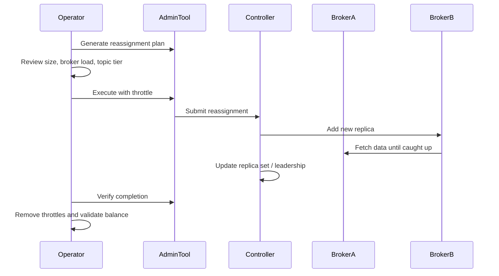
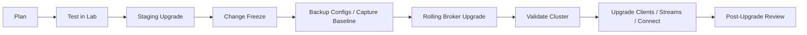
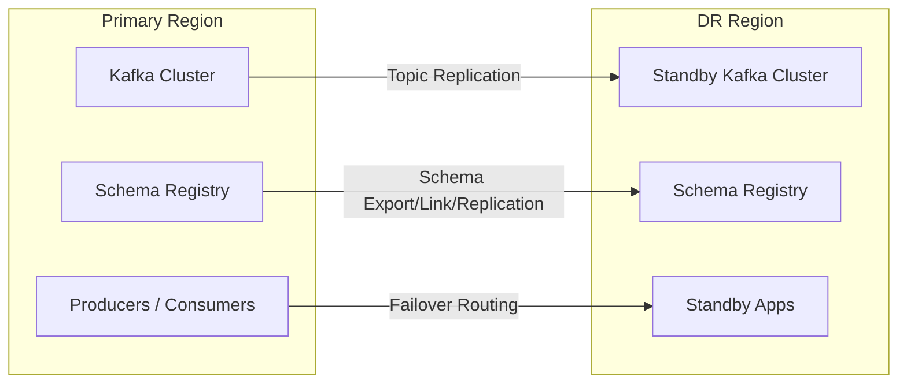
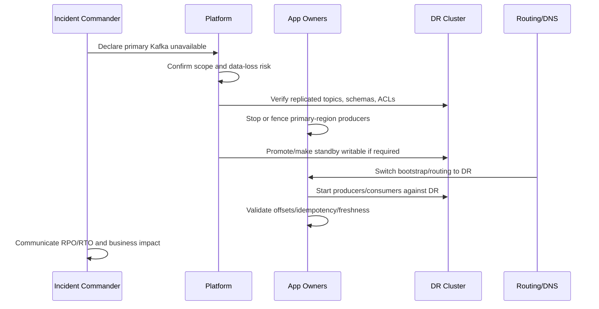

# Part 033 — Operations, Upgrade, and Disaster Recovery

Kafka engineering becomes serious when the cluster is no longer a local container, a tutorial topic, or a demo stream. A production Kafka platform is a stateful distributed system that stores business facts, coordinates many independent teams, and fails in ways that are often indirect: lag appears in one application, but the root cause may be storage latency, a schema rollout, a rebalance storm, an overloaded sink connector, or a cross-zone network fault.

This part focuses on the operational layer:

- how to operate Kafka safely;
- how to upgrade without turning maintenance into an outage;
- how to reason about failure domains;
- how to design disaster recovery that actually works;
- how to prepare runbooks that reduce incident ambiguity.

The mindset is simple:

> Kafka operations is not about memorizing commands. It is about preserving invariants while changing, repairing, scaling, and recovering a distributed log.

---

## 1. What This Part Assumes

You should already understand:

- topic, partition, replica, leader, follower, ISR;
- producer reliability and `acks=all`;
- consumer group offset ownership;
- schema evolution;
- Kafka Streams state stores and changelog topics;
- deployment models from Part 031 and Part 032.

This part will not repeat those fundamentals. We will use them as production invariants.

---

## 2. Production Kafka Operations Mental Model

Kafka has at least five operational planes:

| Plane | Owns | Typical Failure |
|---|---|---|
| Control plane | controllers, metadata quorum, topic metadata, partition leadership | metadata unavailable, controller instability, slow leadership changes |
| Data plane | brokers, disks, network, partition replicas | under-replication, high produce latency, disk full, broker down |
| Client plane | producers, consumers, streams apps, connectors, ksqlDB queries | lag, retries, duplicates, rebalances, transaction timeouts |
| Contract plane | schemas, topic policies, ACLs, compatibility rules | breaking schema, unauthorized access, incompatible event semantics |
| Recovery plane | replication, failover, replay, restore, rollback | RPO/RTO miss, offset mismatch, duplicate side effects |



A good operator does not debug Kafka only from the broker. They correlate all planes.

---

## 3. Operational Invariants

These invariants should be visible in every runbook, dashboard, and architecture review.

### 3.1 Durability Invariant

For critical topics:

```text
replication.factor >= 3
min.insync.replicas >= 2
producer.acks = all
unclean.leader.election.enable = false
```

This does not eliminate all data loss scenarios, but it sets a sane baseline: a write acknowledged by the producer should not depend on exactly one broker.

### 3.2 Offset Safety Invariant

A consumer should commit an offset only after the side effect for all previous records in that partition is durably complete.

```text
Committed offset = next safe position
Not "last record received"
Not "last record submitted to async worker"
```

### 3.3 Ordering Boundary Invariant

Kafka ordering is per partition. Any architecture claiming total order must define how it prevents cross-partition disorder.

### 3.4 Replay Safety Invariant

Any consumer that can be replayed must be idempotent or must explicitly declare why replay is prohibited.

### 3.5 Schema Evolution Invariant

Schema compatibility is not the same as semantic compatibility. Both must be reviewed.

### 3.6 Upgrade Invariant

A Kafka upgrade is not complete when brokers restart. It is complete when:

- brokers are stable;
- metadata/controller plane is stable;
- clients are compatible;
- consumer lag has recovered;
- internal topics are healthy;
- rollback path is either still valid or intentionally closed;
- post-upgrade validation has passed.

### 3.7 Disaster Recovery Invariant

A DR strategy that has never been tested is not a strategy. It is a hope.

---

## 4. Operational Ownership Model

Kafka becomes dangerous when everyone can create topics but nobody owns them.

A production platform should define explicit ownership:

| Asset | Owner | Review Questions |
|---|---|---|
| Kafka cluster | Platform/SRE | Capacity, upgrade, broker health, DR |
| Topic | Producing domain team | Schema, retention, compaction, key, SLA |
| Consumer group | Consuming team | Lag, idempotency, retry, DLQ |
| Schema subject | Data contract owner | Compatibility and semantic meaning |
| Connector | Integration/platform team | Source/sink semantics, credentials, backfill |
| Streams app | Application team | State restore, internal topics, topology version |
| ACL principal | Security/platform team | Least privilege, rotation, audit |

Ownership must be encoded in metadata:

```yaml
x-topic-owner: cpq-domain-team
x-data-classification: confidential
x-retention-policy: P90D
x-dr-tier: tier-1
x-schema-owner: cpq-contracts
x-contact: cpq-platform-oncall
```

If ownership lives only in people's heads, incident response becomes archaeology.

---

## 5. Operations Cadence

Kafka operations should have a rhythm.

### 5.1 Daily Checks

- Are any partitions under-replicated?
- Are any partitions offline?
- Are any brokers near disk, CPU, memory, or network saturation?
- Are any consumer groups breaching freshness SLO?
- Are there DLQ spikes?
- Are connectors failed or repeatedly restarting?
- Are Kafka Streams apps restoring state unexpectedly?
- Are controller metrics stable?
- Are schema compatibility failures increasing?

### 5.2 Weekly Checks

- Review top topics by bytes in/out.
- Review top consumer lag offenders.
- Review partition skew.
- Review topic growth vs retention expectation.
- Review broker leader distribution.
- Review ACL changes.
- Review failed deployment/restart events.
- Review unplanned rebalances.

### 5.3 Monthly Checks

- Capacity forecast.
- Disaster recovery drill.
- Upgrade readiness scan.
- Topic lifecycle cleanup.
- Schema compatibility review.
- Security credential rotation plan.
- Backup/restore validation for platform metadata that is not recoverable from Kafka alone.

### 5.4 Quarterly Checks

- Major version compatibility review.
- Multi-region failover exercise.
- Revisit RTO/RPO commitments.
- Architecture review of top critical event flows.
- Chaos testing for broker, network, storage, and consumer failure.

---

## 6. Golden Signals for Kafka

Do not build dashboards with hundreds of metrics and no hierarchy. Start with signals that explain customer impact.

| Signal | Meaning | Example Metrics |
|---|---|---|
| Availability | Can clients read/write? | offline partitions, controller availability, failed requests |
| Durability | Are replicas healthy? | under-replicated partitions, ISR shrink/expand, min ISR failures |
| Freshness | Are consumers current? | consumer lag, lag age, end-to-end latency |
| Throughput | Is capacity sufficient? | bytes in/out, records/sec, request rate |
| Latency | Are reads/writes slow? | produce request latency, fetch latency, request queue time |
| Saturation | Is resource headroom safe? | disk usage, disk IO, network, CPU, page cache pressure |
| Correctness | Is processing safe? | DLQ count, duplicate detection, schema failures, replay failures |

A good dashboard answers:

1. Is Kafka available?
2. Is data durable?
3. Are consumers fresh?
4. Is there headroom?
5. Which domain is affected?
6. What changed recently?

---

## 7. Severity Model

Use impact-based severity, not only broker-based severity.

| Severity | Condition | Response |
|---|---|---|
| SEV-1 | Critical topics unavailable, offline partitions for tier-1 domain, DR failover needed | Incident commander, platform + app owners, executive comms if needed |
| SEV-2 | Major lag breach, connector stopped for critical pipeline, under-replication sustained | Platform + owning team response |
| SEV-3 | Single broker down but replicas healthy, non-critical lag, isolated DLQ spike | Normal on-call investigation |
| SEV-4 | Capacity warning, noisy metric, minor imbalance | Scheduled remediation |

Never classify only by infrastructure symptom. A small Kafka symptom can be a huge business incident if it blocks order fulfillment, compliance reporting, or enforcement workflow deadlines.

---

## 8. Runbook Pattern

Every Kafka runbook should follow the same structure.

```md
# Runbook: <Incident Name>

## Impact
What user/system/business function is affected?

## Detection
Which alerts or symptoms detect this condition?

## Safety Boundaries
What must not be done during mitigation?

## Immediate Triage
What facts must be collected in the first 5 minutes?

## Diagnosis Tree
What likely causes should be separated?

## Mitigation
What safe actions can reduce impact?

## Recovery Validation
How do we know the system is healthy again?

## Follow-Up
What postmortem items should be created?
```

The safety boundary is the most ignored section. Examples:

- Do not reduce `min.insync.replicas` without explicit incident commander approval.
- Do not enable unclean leader election for critical topics unless data-loss trade-off is accepted.
- Do not replay DLQ into production consumers without idempotency validation.
- Do not delete internal Kafka Streams topics to "fix" a topology unless state rebuild is understood.
- Do not increase partitions on a keyed topic without checking ordering and key distribution consequences.

---

## 9. Runbook: Broker Down

### 9.1 Symptoms

- broker process unavailable;
- broker not responding to network requests;
- under-replicated partitions increase;
- leadership moved away from failed broker;
- producers may see increased latency;
- consumers may rebalance if broker failure affects group coordinator or fetch path.

### 9.2 First Questions

1. Is the broker intentionally stopped?
2. Is the node reachable?
3. Is disk full or failed?
4. Is the broker process crashed or hung?
5. Are controller/quorum nodes affected?
6. Are any partitions offline?
7. Is the affected broker hosting many leaders?
8. Did this happen during a rolling change?

### 9.3 Triage Flow



### 9.4 Mitigation

- Restore broker process or node.
- If node is permanently lost, replace broker using the platform-specific broker replacement process.
- Monitor replica catch-up.
- Avoid unnecessary partition reassignment until the failure mode is clear.
- Do not repeatedly restart a broker stuck in recovery unless you know recovery is impossible.

### 9.5 Recovery Validation

- No offline partitions.
- Under-replicated partitions return to zero.
- ISR count is stable.
- Producer error rate normalizes.
- Consumer lag recovery trend is acceptable.
- Controller metrics stable.
- Disk and network not saturated during replica catch-up.

---

## 10. Runbook: Under-Replicated Partitions

Under-replicated partitions mean at least one follower replica is not fully caught up.

### 10.1 Common Causes

| Cause | Diagnostic Clue |
|---|---|
| Broker down | broker unavailable, many URPs on one broker |
| Slow disk | high IO wait, request queue time, delayed fetch |
| Network bottleneck | high network utilization, cross-zone congestion |
| Replica fetcher issue | replica fetcher lag, logs on follower |
| High produce load | bytes in exceeds replication capacity |
| Controller instability | leadership churn, metadata operations slow |
| Reassignment in progress | expected URP during movement if overloaded |

### 10.2 Safety Rule

Do not treat under-replication as a metric to hide. Treat it as reduced durability.

### 10.3 Mitigation Options

| Option | Use When | Risk |
|---|---|---|
| Restore failed broker | broker/node failure | recovery load spike |
| Throttle producers | cluster saturated | application impact |
| Pause heavy backfill/replay | replay causing replication pressure | delayed processing |
| Increase broker capacity | sustained traffic growth | operational change |
| Reassign partitions | imbalance/root placement issue | can worsen load if rushed |

### 10.4 Recovery Validation

- URP = 0 for critical topics.
- ISR stable for at least an agreed window.
- No `NotEnoughReplicas` or `NotEnoughReplicasAfterAppend` spike for critical producers.
- Produce latency returns to baseline.

---

## 11. Runbook: Offline Partitions

Offline partition means no leader is available. This is more severe than under-replication.

### 11.1 Impact

For affected partitions:

- producers cannot write;
- consumers cannot read new data;
- applications may retry, block, or fail;
- SLA impact depends on topic criticality.

### 11.2 Immediate Actions

1. Identify affected topics and partitions.
2. Identify replica set for each offline partition.
3. Determine why no ISR replica can become leader.
4. Check whether all replicas are down or out of ISR.
5. Escalate based on data tier.

### 11.3 Dangerous Option: Unclean Leader Election

Unclean leader election can restore availability by electing a replica outside ISR, but it can lose acknowledged data depending on failure history.

Use only when:

- business chooses availability over potential data loss;
- affected topics and data-loss blast radius are understood;
- decision is recorded;
- downstream reconciliation is planned.

For regulatory or audit-grade topics, enabling unclean leader election is usually a last-resort business decision, not an engineering optimization.

---

## 12. Runbook: Producer Error Spike

### 12.1 Common Producer Errors

| Error | Meaning | Likely Cause |
|---|---|---|
| `TimeoutException` | record not acknowledged before timeout | broker latency, metadata issue, overloaded cluster |
| `NotEnoughReplicas` | ISR below required threshold | broker failure, slow replicas, min ISR strictness |
| `RecordTooLargeException` | record exceeds size limit | oversized event, config mismatch |
| `SerializationException` | serializer/schema failure | bad payload, schema registry issue |
| `AuthorizationException` | ACL/security denied | bad principal, missing ACL, rotated credential |
| `ProducerFencedException` | transactional producer fenced | duplicate transactional id / stale instance |

### 12.2 Diagnosis Tree



### 12.3 Mitigation

- Do not disable idempotence to reduce errors.
- Do not lower durability settings during normal operation.
- Isolate whether failures are cluster-wide or topic-specific.
- For schema failures, stop bad producer rollout before DLQ or log pollution grows.
- For authorization failures, validate identity and ACL changes.

---

## 13. Runbook: Consumer Lag Incident

Consumer lag is not one thing. It can mean:

- consumer is down;
- consumer is too slow;
- downstream dependency is slow;
- partition skew exists;
- retry loop blocks progress;
- rebalance storm prevents stable work;
- producer traffic increased;
- record size increased;
- consumer is stuck on poison pill;
- group assignment changed;
- topic retention is close to deleting unread data.

### 13.1 Lag Triage Questions

1. Is lag growing or shrinking?
2. Is lag concentrated in one partition?
3. Is lag offset-based or time-based?
4. Did input traffic increase?
5. Did processing latency increase?
6. Did downstream dependency latency increase?
7. Did rebalances increase?
8. Did deployment happen recently?
9. Is the consumer committing offsets?
10. Is retention at risk?

### 13.2 Lag Diagnosis Flow



### 13.3 Mitigation Options

| Mitigation | Useful When | Hidden Risk |
|---|---|---|
| Scale consumers | enough partitions, CPU-bound processing | no benefit beyond partition count |
| Increase partitions | long-term parallelism problem | changes key distribution for future records |
| Pause/resume partitions | downstream overload | lag grows intentionally |
| Bypass poison pill to DLQ | one bad record blocks partition | ordering semantics changed |
| Optimize batch writes | DB/API bottleneck | bigger blast radius per failure |
| Increase retention temporarily | catch-up at risk | disk pressure |

### 13.4 Recovery Validation

- Lag is decreasing at a rate that meets freshness SLO.
- Lag age is acceptable.
- DLQ rate is normal.
- Rebalance frequency normal.
- Downstream error rate normal.
- Consumer commits are progressing.

---

## 14. Runbook: Rebalance Storm

A rebalance storm occurs when consumer group membership keeps changing, preventing stable processing.

### 14.1 Common Causes

- `max.poll.interval.ms` exceeded because processing is too slow;
- consumer pods repeatedly restarting;
- deployment rollout too aggressive;
- heartbeat/session timeout mismatch;
- network jitter;
- consumer process blocked in long synchronous operation;
- excessive partitions and group metadata load;
- static membership not used where it would help;
- old eager rebalance strategy in a high-churn group.

### 14.2 Mitigation

- Check deployment health first.
- Reduce processing time per poll.
- Lower `max.poll.records` if each record is expensive.
- Move slow work to bounded worker pool while preserving offset discipline.
- Use cooperative rebalancing where appropriate.
- Use static membership for stable long-running consumers.
- Stop rolling deployments until group stabilizes.

### 14.3 Anti-Pattern

Increasing `max.poll.interval.ms` blindly can hide the problem. It may reduce rebalances but increase detection time for stuck consumers.

---

## 15. Runbook: Disk Pressure

Kafka is disk-centric. Disk pressure can become a cluster-wide incident.

### 15.1 Causes

| Cause | Clue |
|---|---|
| retention too high | topic grows according to traffic and retention |
| consumer lag prevents deletion? | Kafka retention is log-based, not consumer-aware for normal topics; but business may fear unread loss |
| compaction backlog | compacted topics grow until cleaner catches up |
| replay/backfill spike | temporary traffic surge |
| replica reassignment | duplicate data while moving partitions |
| skewed partitions | one broker/log dir fills faster |
| oversized events | average record size changed |

### 15.2 Immediate Actions

- Identify top topics by disk usage.
- Identify top partitions/log dirs by usage.
- Check retention and compaction configs.
- Check whether reassignment or restore is running.
- Check broker disk IO and cleaner backlog.
- Avoid deleting files manually from Kafka log directories.

### 15.3 Mitigation Options

| Option | Use When | Risk |
|---|---|---|
| Reduce retention | non-critical old data | data no longer replayable |
| Add brokers/storage | sustained growth | rebalancing overhead |
| Reassign partitions | skewed distribution | temporary network/disk load |
| Stop backfill/replay | temporary spike | delayed business process |
| Fix oversized producer | bad release | data contract change |
| Tune compaction | compaction backlog | CPU/IO trade-off |

---

## 16. Partition Reassignment

Partition reassignment moves replicas across brokers. It is used for:

- adding brokers;
- removing brokers;
- balancing disk usage;
- balancing network/CPU load;
- moving data away from failing nodes;
- correcting poor replica placement.

### 16.1 Reassignment Is Not Free

Reassignment creates replication traffic. It consumes:

- broker disk read/write;
- broker network;
- controller metadata operations;
- page cache;
- CPU for compression/decompression depending on workload.

A poorly timed reassignment can turn a capacity problem into an outage.

### 16.2 Reassignment Planning Checklist

- Which topics/partitions are being moved?
- What is the data size per partition?
- What is the expected network copy volume?
- Are brokers already under pressure?
- Are there tier-1 topics involved?
- Are throttles configured?
- Is there a rollback or stop plan?
- What metrics define safe progress?

### 16.3 Reassignment Flow



### 16.4 Verification

After reassignment:

- no under-replicated partitions;
- broker disk usage improved;
- leader distribution acceptable;
- produce/fetch latency normal;
- reassignment throttles removed;
- consumer lag recovered;
- no unexpected internal-topic movement issue.

---

## 17. Leader Imbalance and Preferred Leaders

A partition has a preferred leader based on replica order. Over time, broker failures and restarts can create leader imbalance.

Symptoms:

- one broker handles too many leaders;
- produce/fetch traffic skewed;
- CPU/network imbalance;
- request queue time skew.

Mitigation:

- preferred leader election if replica placement is already good;
- partition reassignment if placement itself is poor;
- review topic creation policy to prevent recurring imbalance.

Do not chase perfect symmetry. Chase safe headroom and predictable failure behavior.

---

## 18. Topic Lifecycle Operations

Topic operations should be governed because topic mistakes are long-lived.

### 18.1 Topic Creation Checklist

```yaml
topic: cpq.quote-priced.v1
owner: cpq-pricing-team
classification: confidential
key: quoteId
partitions: 24
replicationFactor: 3
minInsyncReplicas: 2
cleanupPolicy: delete
retention: P90D
schemaCompatibility: BACKWARD_TRANSITIVE
drTier: tier-1
consumerGroups:
  - oms-order-ingestion
  - audit-event-indexer
```

### 18.2 Topic Change Safety

| Change | Safe? | Notes |
|---|---|---|
| Increase partitions | Sometimes | Future key distribution changes; ordering assumptions may break |
| Decrease partitions | No normal direct operation | Requires new topic/migration pattern |
| Reduce retention | Risky | Can remove replay history |
| Increase retention | Disk impact | Capacity review needed |
| Change cleanup policy | Risky | Compaction/delete semantics differ greatly |
| Change min ISR | Risky | Changes durability/availability trade-off |
| Change schema compatibility | Risky | Contract governance required |

### 18.3 Topic Deprecation Pattern

1. Mark topic deprecated in registry/catalog.
2. Identify producers and consumers.
3. Stop new producers.
4. Migrate consumers.
5. Freeze schema changes.
6. Reduce retention only after replay/audit need is satisfied.
7. Delete after explicit owner approval.

---

## 19. Upgrade Strategy

Kafka upgrades should be treated as controlled distributed-system changes, not package updates.

### 19.1 Upgrade Types

| Upgrade Type | Example | Risk |
|---|---|---|
| Patch upgrade | 4.0.1 to 4.0.2 | usually lower but still test |
| Minor upgrade | 4.0 to 4.1 | protocol/config behavior can change |
| Major upgrade | 3.x to 4.x | high: KRaft, removed ZooKeeper mode, metadata/version considerations |
| Client upgrade | kafka-clients jar update | behavior/default changes, protocol compatibility |
| Ecosystem upgrade | Streams, Connect, ksqlDB, Schema Registry | internal topics/state/query behavior |

### 19.2 KRaft-First Baseline

For modern clusters, assume KRaft as the production baseline. Kafka 4.0+ removed ZooKeeper mode. Legacy ZooKeeper clusters must migrate to KRaft before upgrading to Kafka 4.x.

This matters operationally because the controller quorum and metadata log become first-class operational assets.

### 19.3 Upgrade Phases



### 19.4 Pre-Upgrade Checklist

- Read official upgrade notes for every version jump.
- Confirm current cluster mode: KRaft vs legacy ZooKeeper.
- Confirm metadata/version requirements.
- Inventory brokers/controllers.
- Inventory client versions.
- Inventory Kafka Streams apps and internal topics.
- Inventory Connect workers/connectors.
- Inventory ksqlDB persistent queries.
- Confirm schema registry compatibility.
- Capture baseline metrics.
- Confirm rollback path.
- Confirm maintenance window and communication.
- Pause non-essential backfills and reassignments.
- Confirm monitoring and on-call coverage.

### 19.5 During Upgrade

For each broker/controller step:

- stop one node at a time unless documented otherwise;
- verify partition leadership and ISR behavior;
- wait for under-replicated partitions to recover;
- watch producer error rate;
- watch consumer lag;
- watch controller metrics;
- proceed only when stable.

### 19.6 Post-Upgrade Validation

- All brokers/controllers on expected version.
- No offline partitions.
- No sustained under-replication.
- Controller quorum stable.
- Produce/fetch latency normal.
- Consumer groups stable.
- Streams apps not stuck restoring.
- Connect tasks running.
- ksqlDB queries running.
- Schema Registry healthy.
- Security/ACL operations verified.

### 19.7 Client Upgrade Order

A common safe approach:

1. Upgrade non-critical consumers.
2. Upgrade non-critical producers.
3. Upgrade critical consumers with canarying.
4. Upgrade critical producers with canarying.
5. Upgrade Kafka Streams apps carefully because internal state and topology compatibility matter.

Avoid simultaneous broker and client upgrades unless the environment is small and risk is acceptable.

---

## 20. Kafka Streams Operations

Kafka Streams applications are client applications, but operationally they behave like stateful distributed processors.

### 20.1 Operational Assets

- application instances;
- `application.id`;
- input topics;
- output topics;
- repartition topics;
- changelog topics;
- local state directories;
- standby replicas if configured;
- state restore process.

### 20.2 Common Incidents

| Symptom | Likely Cause |
|---|---|
| App stuck in rebalancing | instance churn, state restore, long processing |
| Long startup time | state restore from changelog |
| Missing output | topology bug, join key mismatch, late events, suppression |
| Duplicate output | at-least-once mode, retry/restart, non-idempotent sink |
| Disk full on app pod/node | local state growth |
| Internal topic unauthorized | missing ACL for application principal |

### 20.3 Streams Upgrade Checklist

- Is topology backward compatible?
- Did operator names change, causing internal topic changes?
- Are old internal topics still needed?
- Is state store schema compatible?
- Is reset required?
- Is replay safe?
- Are output topics idempotently consumed downstream?
- Is deployment rolling or blue/green?

### 20.4 Reset Is Dangerous

Resetting a Kafka Streams application can delete/recreate internal state and rewind processing. It should be treated as a data operation, not a restart.

Before reset:

- identify output topics;
- identify downstream consumers;
- determine duplicate impact;
- confirm replay window;
- snapshot or record state if needed;
- get owner approval.

---

## 21. Kafka Connect Operations

Kafka Connect runs integration workloads. Its failures are often external-system failures expressed as Kafka symptoms.

### 21.1 Assets

- Connect cluster;
- worker configs;
- connector configs;
- tasks;
- internal config/offset/status topics;
- converters;
- SMTs;
- credentials;
- source/sink systems.

### 21.2 Common Incidents

| Symptom | Likely Cause |
|---|---|
| Task failed | connector bug, auth issue, bad record, external system unavailable |
| Lag grows in sink connector | sink too slow, batch too large, API throttling |
| Source connector stops | source DB/network/auth issue |
| Serialization failure | converter/schema mismatch |
| DLQ spike | bad records or incompatible sink mapping |
| Duplicate writes | restart/retry semantics, non-idempotent sink |

### 21.3 Connect Runbook Questions

1. Is the worker healthy?
2. Is only one connector affected?
3. Is only one task affected?
4. Did credentials rotate?
5. Did schema change?
6. Did external system throttle or fail?
7. Is the DLQ useful or polluted?
8. Are offsets advancing?

---

## 22. ksqlDB Operations

ksqlDB persistent queries are production stream processors. Treat them like deployable applications.

### 22.1 Assets

- persistent query ID;
- source streams/tables;
- sink topics;
- internal topics;
- query SQL;
- schema dependencies;
- state stores;
- ksqlDB server cluster;
- pull query consumers.

### 22.2 Operational Risks

- hidden repartitioning creates unexpected internal topics;
- key mismatch causes wrong joins;
- query restart reprocesses data according to offsets and state;
- materialized views can become stale if query stops;
- pull query clients may treat ksqlDB as OLTP database incorrectly;
- SQL changes may create a new persistent query instead of safely modifying an existing one.

### 22.3 Query Change Checklist

- Is this a new query or migration of old query?
- What sink topic is produced?
- What is the key format?
- Are repartition topics expected?
- Is stateful processing involved?
- What is rollback?
- Will old and new query run in parallel?
- Are downstream consumers compatible?

---

## 23. Disaster Recovery Mental Model

Kafka DR is not only "copy bytes to another cluster".

A usable DR plan must include:

- topic data;
- schemas;
- ACLs and identities;
- consumer offsets or consumer recovery policy;
- producer routing;
- DNS/bootstrap strategy;
- Connect connector configs;
- Streams/ksqlDB application state strategy;
- downstream idempotency;
- failover authority;
- failback strategy;
- RTO/RPO measurement.



The hard part is not replication. The hard part is making applications behave correctly after failover.

---

## 24. RPO and RTO

### 24.1 RPO

Recovery Point Objective answers:

> How much data can we afford to lose?

For Kafka, RPO depends on:

- replication lag between clusters;
- producer acknowledgement strategy;
- whether failover loses unreplicated messages;
- whether source systems can replay;
- whether consumers can tolerate duplicates.

### 24.2 RTO

Recovery Time Objective answers:

> How long can the service be unavailable?

For Kafka, RTO depends on:

- detection time;
- decision time;
- DNS/bootstrap switch;
- standby app readiness;
- offset availability;
- schema/security readiness;
- downstream readiness.

### 24.3 RTO/RPO Are Business Inputs

Engineering cannot choose RTO/RPO alone. A regulatory audit pipeline, fraud decision pipeline, and marketing analytics pipeline do not need the same DR tier.

---

## 25. DR Patterns

### 25.1 Backup and Restore

Useful for:

- configuration backups;
- connector configs;
- schema exports;
- infrastructure-as-code;
- audit artifacts.

Not sufficient for low-RTO Kafka data-plane recovery.

Kafka log data is large, live, and partitioned. File-level backup is rarely the primary DR strategy for active Kafka clusters.

### 25.2 Active-Passive Replication

Primary cluster handles traffic. Standby cluster receives replicated data.

Pros:

- simpler conflict model;
- clear primary ownership;
- easier operational reasoning.

Cons:

- failover process required;
- standby capacity may be under-tested;
- RPO depends on replication lag;
- failback can be complex.

### 25.3 Active-Active

Multiple clusters accept writes.

Pros:

- local writes in multiple regions;
- potentially higher availability.

Cons:

- conflict resolution;
- duplicate events;
- ordering differences;
- identity/key collision;
- hard audit semantics;
- much harder consumer correctness.

Active-active should not be chosen because it sounds resilient. It should be chosen only when the domain has a clear conflict model.

### 25.4 Stretch Cluster / Multi-Region Cluster

One logical cluster spans regions or availability zones.

Pros:

- single cluster abstraction;
- can simplify some failover models.

Cons:

- latency-sensitive replication;
- failure-domain coupling;
- careful quorum design needed;
- region partition scenarios can be severe.

### 25.5 Event Replay from Source of Truth

For derived topics, DR can be rebuilt from source systems.

Pros:

- avoids replicating all derived data;
- can simplify analytics recovery.

Cons:

- slower recovery;
- requires deterministic rebuild;
- source systems must retain enough history;
- schema/version drift can break replay.

---

## 26. MirrorMaker 2, Cluster Linking, and Replication Choices

Kafka ecosystems provide multiple cross-cluster replication options.

| Option | Typical Use | Notes |
|---|---|---|
| MirrorMaker 2 | open Apache Kafka cross-cluster replication | flexible, Kafka Connect-based, operational tuning needed |
| Confluent Cluster Linking | Confluent Platform/Cloud mirror topics | byte-for-byte topic mirroring and DR features in supported environments |
| Confluent Replicator | Confluent-managed replication option | used in Confluent Platform deployments |
| Application-level dual publish | special cases | usually dangerous unless idempotency/conflict model is strong |
| Source rebuild | derived topics | depends on source retention and deterministic rebuild |

Key evaluation dimensions:

- topic data replication;
- consumer offset replication;
- schema replication;
- ACL replication;
- latency and throughput;
- operational complexity;
- failover/failback support;
- licensing/platform constraints;
- multi-tenant isolation.

---

## 27. DR Failover Runbook

### 27.1 Precondition

A failover runbook must be practiced before the incident.

### 27.2 Failover Steps



### 27.3 Failover Checklist

- Who has authority to declare failover?
- Is primary truly unavailable or partially available?
- Are producers fenced from writing to the old primary?
- Is standby cluster healthy?
- Are critical topics replicated to expected offsets?
- Are schemas present?
- Are ACLs/credentials present?
- Are consumer offsets replicated or intentionally reset?
- Are downstream systems ready for duplicate or delayed events?
- Is monitoring pointed at DR?
- Is the business impact communicated?

### 27.4 Split-Brain Risk

The worst failover is one where both primary and DR accept writes for the same logical domain without conflict resolution.

Prevent via:

- producer fencing;
- routing control;
- region ownership flag;
- write authority service;
- operational lock;
- idempotent event IDs with region metadata.

---

## 28. DR Failback Runbook

Failback is often harder than failover.

Questions:

1. Did DR accept new writes?
2. Are those writes replicated back to primary?
3. Are topic names mirrored or renamed?
4. Are offsets compatible?
5. Did schemas evolve during DR mode?
6. Did ACLs or credentials change?
7. Are duplicate records possible?
8. Are consumers idempotent?
9. Is primary clean or stale?
10. Who declares primary healthy again?

Failback patterns:

| Pattern | Use When |
|---|---|
| reverse replication then switch | DR accepted writes and primary will resume |
| rebuild primary from DR | primary state is stale/untrusted |
| keep DR as new primary | failback risk too high |
| application-level reconciliation | conflict possible |

---

## 29. Offset Recovery Strategies

Consumer offsets are operational state. DR must decide how to handle them.

| Strategy | Meaning | Risk |
|---|---|---|
| replicate offsets | standby consumers resume near previous position | tool support/config needed |
| reset to earliest | full replay | duplicate side effects, long recovery |
| reset to latest | skip old data | data loss from consumer perspective |
| domain checkpoint | app stores processed event IDs/state | app complexity |
| manual offset mapping | operator maps positions | slow and error-prone |

For critical consumers, offset recovery must be tested with real application behavior, not only Kafka CLI output.

---

## 30. Schema and Contract Recovery

Replicating topic bytes is useless if consumers cannot deserialize them.

DR needs:

- schema subjects;
- schema IDs or compatible registry strategy;
- compatibility settings;
- subject naming strategy consistency;
- serializer/deserializer config consistency;
- schema registry availability;
- access control.

A DR drill should include producing and consuming schema-encoded events in the standby region.

---

## 31. Security Recovery

DR must include identity and authorization.

Checklist:

- service principals exist in DR;
- ACLs exist in DR;
- certificates/secrets are valid in DR;
- OAuth/JWKS endpoints reachable;
- SCRAM credentials replicated or recreated;
- Connect secrets available;
- Schema Registry auth works;
- ksqlDB service identity works;
- emergency access is audited.

Security should not be bypassed during DR. Emergency access should be time-limited and logged.

---

## 32. Replay Operations

Replay is one of Kafka's strongest capabilities and one of its biggest risks.

### 32.1 Replay Types

| Replay Type | Example |
|---|---|
| consumer offset reset | reprocess from earlier offset |
| DLQ replay | fix bad records and republish |
| backfill | produce historical events into topic |
| state rebuild | rebuild projection or state store |
| DR replay | reconstruct missing records after failover |

### 32.2 Replay Checklist

- What topic/partition/offset range?
- What event schema versions?
- Are consumers idempotent?
- Are external side effects disabled, deduplicated, or sandboxed?
- Is replay rate limited?
- Are downstream systems ready?
- Is replay tagged with metadata?
- Is audit evidence captured?
- What is rollback if replay creates wrong state?

### 32.3 Replay Metadata

Replay events should be observable:

```json
{
  "eventId": "evt-123",
  "replay": true,
  "replayId": "rpl-2026-07-02-cpq-price-rebuild",
  "originalTopic": "cpq.quote-priced.v1",
  "originalPartition": 7,
  "originalOffset": 91827364,
  "reason": "projection rebuild after schema fix"
}
```

This does not mean every domain event should change its business payload. Replay metadata can live in headers or operational envelope.

---

## 33. Regulatory and Audit-Grade Operations

In regulatory systems, Kafka operations must preserve defensibility.

Important questions:

- Can we prove which event was processed?
- Can we prove when it was processed?
- Can we prove which version of schema/code processed it?
- Can we prove why a replay happened?
- Can we prove that no unauthorized principal consumed sensitive topics?
- Can we reconstruct state at a historical point?
- Can we explain data loss or delayed processing in incident language acceptable to auditors?

Kafka itself does not provide a complete audit framework. It provides primitives. Your platform must add governance and evidence.

---

## 34. Postmortem Template for Kafka Incidents

```md
# Kafka Incident Postmortem

## Summary
What happened in plain language?

## Impact
Which topics, services, tenants, customers, and business processes were affected?

## Timeline
Detection, escalation, mitigation, recovery.

## Technical Root Cause
What failed at the Kafka/client/platform/domain layer?

## Contributing Factors
Why did detection, mitigation, or recovery take longer?

## Data Correctness Assessment
Were messages lost, duplicated, delayed, reordered, or replayed?

## Recovery Actions
What was done to restore service?

## Customer/Regulatory Impact
What commitments or reporting duties were affected?

## Preventive Actions
Config, architecture, testing, observability, ownership, runbook.

## Follow-Up Validation
How will we know the fix worked?
```

The data correctness assessment is mandatory. A Kafka incident is not only an availability incident.

---

## 35. Exercises

### Exercise 1 — Broker Failure Drill

Simulate one broker failure in staging.

Measure:

- time to detection;
- under-replicated partition behavior;
- producer error rate;
- consumer lag;
- recovery time;
- runbook gaps.

### Exercise 2 — Lag Drill

Create a slow consumer intentionally.

Test:

- lag alerting;
- lag age dashboard;
- pause/resume behavior;
- scaling limit based on partition count;
- retention risk calculation.

### Exercise 3 — DLQ Replay Drill

Send records to DLQ, fix them, replay them.

Validate:

- idempotency;
- replay metadata;
- ordering decision;
- duplicate side-effect prevention;
- audit trail.

### Exercise 4 — Upgrade Simulation

Upgrade a staging cluster through a minor version.

Validate:

- broker rolling restart;
- controller stability;
- producer/consumer compatibility;
- Streams state restore;
- Connect task health;
- ksqlDB query health.

### Exercise 5 — DR Game Day

Run a tabletop or actual failover drill.

Validate:

- failover authority;
- replicated topics;
- schemas;
- ACLs;
- consumer offsets;
- producer fencing;
- failback plan.

---

## 36. Production Readiness Checklist

A Kafka platform is production-ready when the answer is "yes" to these:

- Are tier-1 topics configured with appropriate replication and min ISR?
- Are producers using durability-compatible settings?
- Are consumer offset policies documented?
- Are topic owners known?
- Are schemas governed?
- Are ACLs least-privilege?
- Are dashboards impact-oriented?
- Are runbooks tested?
- Are upgrades rehearsed?
- Are DR drills practiced?
- Are replay operations controlled?
- Are Kafka Streams internal topics governed?
- Are Connect connectors owned and monitored?
- Are ksqlDB persistent queries treated as production apps?
- Are postmortems tracking data correctness?

---

## 37. Key Takeaways

- Kafka operations is distributed-log preservation under change and failure.
- Under-replication is durability degradation, not cosmetic noise.
- Offline partitions are availability failure for affected partitions.
- Consumer lag must be diagnosed as a system symptom, not one metric.
- Upgrade safety depends on metadata/control plane, clients, and ecosystem components.
- DR must include topic data, schemas, ACLs, offsets, routing, and application idempotency.
- Replay is powerful only when consumers are replay-safe.
- Runbooks are part of architecture, not afterthought documentation.

---

## 38. References

- Apache Kafka Documentation — Operations, monitoring, upgrade, KRaft, topic/partition operations: https://kafka.apache.org/documentation/
- Apache Kafka 4.0 Upgrade Notes — KRaft-only and ZooKeeper removal: https://kafka.apache.org/40/getting-started/upgrade/
- Apache Kafka Basic Operations — partition reassignment and cluster operations: https://kafka.apache.org/42/operations/basic-kafka-operations/
- Apache Kafka Geo-Replication / MirrorMaker 2: https://kafka.apache.org/31/operations/geo-replication-cross-cluster-data-mirroring/
- Confluent Cluster Linking Overview: https://docs.confluent.io/platform/current/multi-dc-deployments/cluster-linking/index.html
- Confluent Cloud Cluster Linking DR and Failover: https://docs.confluent.io/cloud/current/multi-cloud/cluster-linking/dr-failover.html
- Red Hat Streams for Apache Kafka — Disaster Recovery using MirrorMaker 2: https://docs.redhat.com/en/documentation/red_hat_streams_for_apache_kafka/3.1/html-single/disaster_recovery_using_mirrormaker_2/index
