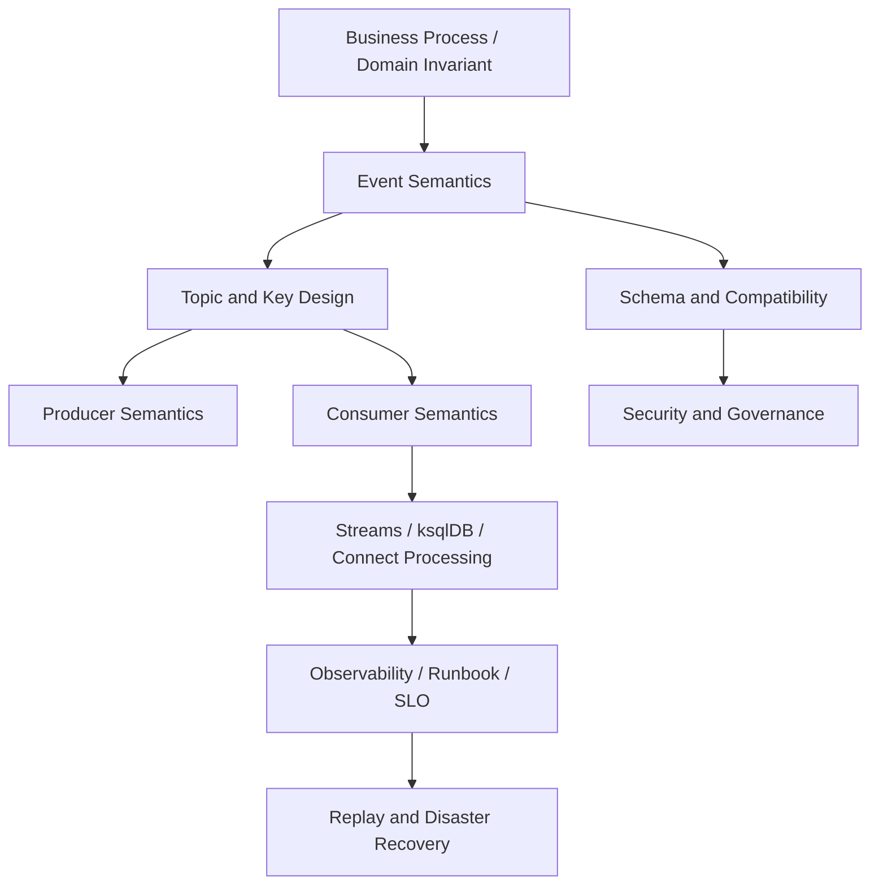
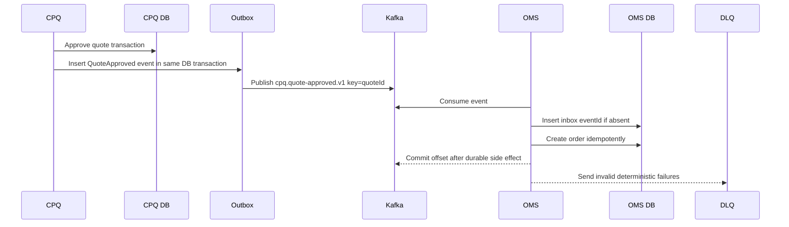

# Part 034 — Architecture Review and Anti-Patterns

Kafka systems fail for two broad reasons:

1. the cluster is operated poorly;
2. the architecture asks Kafka to provide guarantees it does not provide.

Part 033 handled operations. This part handles architecture review: how to detect weak designs before they become incidents.

A top-tier Kafka engineer does not merely ask:

> Can this service produce and consume messages?

They ask:

> What truth is represented by this event, what ordering boundary protects it, what happens when it is replayed, which team owns the contract, and how does the system fail under load, schema change, rebalancing, disaster recovery, and partial downstream outage?

This part gives you a review framework and an anti-pattern catalog.

---

## 1. Review Philosophy

Kafka architecture review should not be a gatekeeping ceremony. It should expose hidden coupling, missing invariants, and unowned failure modes.

A good review produces:

- sharper domain boundaries;
- clearer event contracts;
- safer topic design;
- explicit ordering and idempotency rules;
- operational readiness;
- better upgrade/replay/DR posture;
- fewer production surprises.

A bad review produces:

- generic checklist compliance;
- diagrams with no failure paths;
- topic names with no semantics;
- performance claims without measurements;
- "Kafka guarantees exactly-once" as a magic phrase;
- no ownership after launch.

---

## 2. The Kafka Architecture Review Stack

Review Kafka systems layer by layer.



Do not start the review at Kafka configuration. Start at the business invariant.

---

## 3. Core Review Questions

### 3.1 Business Semantics

- What business fact does this event represent?
- Is it a fact, command, notification, snapshot, or integration record?
- Is it immutable?
- What is the authoritative source?
- Can the event be corrected? How?
- Is the event part of an audit trail?
- What is the consequence of duplicate, delayed, or missing events?

### 3.2 Topic Design

- Why is this a separate topic?
- Who owns it?
- What is the key?
- What is the partition count and why?
- What is the retention policy and why?
- Is the topic compacted, delete-retained, or both?
- Is the topic public domain API or internal pipeline topic?
- Is there a lifecycle/deprecation plan?

### 3.3 Producer Design

- What happens if produce succeeds but local DB transaction fails?
- What happens if local DB transaction succeeds but produce fails?
- Is an outbox needed?
- Are retries enabled safely?
- Is idempotent producer enabled and compatible?
- Is `acks=all` used for critical topics?
- What metadata is included for traceability?

### 3.4 Consumer Design

- When is offset committed?
- Is processing idempotent?
- What happens on crash after side effect before commit?
- What happens on poison pill?
- Is retry blocking or non-blocking?
- Is DLQ replay safe?
- How is backpressure handled?
- What is the ordering boundary?

### 3.5 Stream Processing Design

- Is stateful processing required?
- What state store exists?
- What changelog/internal topics are created?
- What repartitions happen?
- What happens during state restore?
- What is the topology evolution plan?
- Is exactly-once needed or misunderstood?

### 3.6 Contract Design

- What schema format is used?
- What compatibility mode is used?
- Who approves schema changes?
- Are semantic breaking changes reviewed?
- How are deprecated fields handled?
- How do consumers handle unknown fields?

### 3.7 Operational Design

- What is the SLO?
- What metrics detect failure?
- What dashboards exist?
- What alerts page humans?
- What runbook exists?
- Who is on-call?
- What is the replay procedure?
- What is the DR tier?

---

## 4. Review Output: Decision Record

Every important Kafka design should leave an Architecture Decision Record.

```md
# ADR: <Kafka Design Decision>

## Context
What business and technical problem are we solving?

## Decision
What topic/event/pattern/configuration did we choose?

## Alternatives Considered
What else did we evaluate?

## Invariants
What must remain true for the design to be correct?

## Failure Modes
How can this fail?

## Operational Requirements
Metrics, alerts, runbooks, ownership, DR.

## Consequences
Trade-offs accepted by the team.
```

Architecture without decision history becomes folklore.

---

## 5. Anti-Pattern Catalog Overview

We will group anti-patterns by failure domain.

| Domain | Anti-Pattern Examples |
|---|---|
| Event semantics | command disguised as event, mutable fact, ambiguous event name |
| Topic modeling | mega-topic, topic-per-user, database-table mirror without domain meaning |
| Partitioning | low-cardinality key, random key when ordering needed, over-partitioning |
| Producer | dual write, unbounded retries, no idempotence, giant records |
| Consumer | auto-commit side effects, no idempotency, poison pill loop |
| Retry/DLQ | DLQ graveyard, retry storm, no replay runbook |
| Schema | schema-free JSON, compatibility without semantic review |
| Streams | hidden repartition, state on ephemeral disk, topology reset as fix |
| ksqlDB | SQL sprawl, unowned persistent queries, pull query as OLTP API |
| Connect | connector as unowned black box, SMT business logic abuse |
| Security | shared principal, wildcard ACL, no data classification |
| Observability | offset lag only, no freshness SLO, no business impact mapping |
| DR | untested failover, replicated bytes without schemas/ACLs/offsets |
| Organization | platform owns everything, domain owns nothing |

---

## 6. Anti-Pattern: Kafka as a Generic Queue Replacement

### Symptom

A team migrates from a queue to Kafka and expects:

- per-message acknowledgment;
- invisible messages;
- competing consumers with arbitrary parallelism;
- easy dead-letter behavior;
- queue depth semantics;
- task distribution semantics.

### Why It Is Wrong

Kafka is a partitioned log. A consumer group owns offsets. Records stay in the log according to retention. Parallelism is limited by partition count. Ordering is per partition.

### Damage

- incorrect offset commits;
- surprise reprocessing;
- ordering bugs;
- lag misunderstood as queue depth;
- inability to scale beyond partition count;
- poison pill blocks partition.

### Better Design

Use Kafka when you need durable event log, replay, fan-out, event-driven integration, stream processing, or event-carried state transfer.

Use a work queue when you need individual task leasing, visibility timeout, and per-task acknowledgment semantics.

---

## 7. Anti-Pattern: Mega-Topic

### Symptom

One topic carries many unrelated event types:

```text
company.events.all
```

Payload has `eventType`, and every consumer filters what it needs.

### Why Teams Do It

- fewer topics to manage;
- easy early integration;
- weak governance;
- misunderstanding topic count cost;
- desire for global ordering.

### Damage

- unrelated consumers coupled to unrelated producer changes;
- schema compatibility becomes impossible;
- retention cannot match event needs;
- ACLs become too broad;
- replay becomes dangerous;
- consumer filtering wastes resources;
- ownership unclear.

### Better Design

Create domain-owned topics with coherent event semantics:

```text
cpq.quote-created.v1
cpq.quote-priced.v1
oms.order-submitted.v1
billing.invoice-issued.v1
```

A topic should group events that share ownership, key semantics, retention, security classification, and consumer expectations.

---

## 8. Anti-Pattern: Topic per User / Tenant / Entity

### Symptom

A topic is created for each tenant, user, customer, case, order, or device.

```text
user.123.events
user.124.events
user.125.events
```

### Why It Is Wrong

Kafka topics and partitions are operational resources. Topic explosion increases metadata, ACL management, monitoring cardinality, and operational complexity.

### Damage

- controller metadata pressure;
- impossible governance;
- dashboard cardinality explosion;
- ACL sprawl;
- difficult retention management;
- poor capacity planning.

### Better Design

Use topic + key + headers:

```text
topic: customer.activity.v1
key: customerId
headers: tenantId, region, classification
```

Use separate topics only when tenants require distinct retention, security, ownership, or physical isolation.

---

## 9. Anti-Pattern: Database Table Mirroring Without Domain Meaning

### Symptom

Kafka topics are named after database tables:

```text
public.quote
public.quote_line
public.quote_status_history
```

Consumers reconstruct business behavior from row-level changes.

### When It Is Acceptable

CDC table mirroring can be valid for integration, replication, analytics, or low-level data capture.

### Why It Becomes an Anti-Pattern

It becomes dangerous when table changes are treated as stable domain events.

Database tables are implementation details. Domain events are business facts.

### Damage

- consumers coupled to database schema;
- refactoring database breaks event consumers;
- event meaning unclear;
- multiple row changes required to infer one business transition;
- audit story becomes accidental.

### Better Design

For domain integration, use outbox/domain events:

```text
quote-created
quote-priced
quote-approved
quote-expired
```

Use CDC as transport mechanism, not as semantic API unless table semantics are explicitly part of the contract.

---

## 10. Anti-Pattern: Command Disguised as Event

### Symptom

Topic contains messages named like events but semantically commands:

```text
UserShouldBeSuspended
InvoiceMustBeGenerated
OrderNeedsToBeCancelled
```

### Why It Matters

An event is a fact that already happened. A command asks someone to do something.

### Damage

- unclear ownership;
- consumer becomes hidden command handler;
- retry semantics ambiguous;
- multiple consumers may act on same command;
- audit trail lies about what happened.

### Better Design

Use explicit command topic if asynchronous command is intended:

```text
command: cancel-order-requested
handler: oms-order-service
response event: order-cancelled or order-cancellation-rejected
```

Or use an event if the fact already occurred:

```text
order-cancelled
```

---

## 11. Anti-Pattern: Mutable Event

### Symptom

Producer republishes an event with the same `eventId` but changed business meaning.

### Why It Is Wrong

Events should be immutable facts. Corrections should be new facts.

### Damage

- audit trail corrupted;
- replay nondeterministic;
- dedup logic hides correction;
- consumers cannot explain state at time T.

### Better Design

Use correction events:

```text
quote-price-calculated
quote-price-corrected
quote-price-reversal-issued
```

Corrections must include causation metadata.

---

## 12. Anti-Pattern: Low-Cardinality Partition Key

### Symptom

Key is a status, region, type, or boolean.

```text
key = "APPROVED"
key = "FAILED"
key = "US"
key = "true"
```

### Damage

- hot partitions;
- poor parallelism;
- uneven broker load;
- lag concentrated in one partition;
- consumer scale ineffective.

### Better Design

Choose a key with enough cardinality and correct ordering boundary:

```text
quoteId
orderId
caseId
customerId
accountId
```

If both ordering and load distribution matter, evaluate composite keys carefully.

---

## 13. Anti-Pattern: Random Key When Ordering Is Required

### Symptom

Producer uses UUID/random key to spread load.

### Damage

- events for same entity land on different partitions;
- state transitions arrive out of order;
- consumers need complex reorder buffers;
- regulatory state machine becomes non-defensible.

### Better Design

Key by aggregate/entity whose state transition order matters.

For high-volume hot entities, redesign the domain workflow instead of breaking ordering silently.

---

## 14. Anti-Pattern: Over-Partitioning

### Symptom

Every topic gets hundreds or thousands of partitions "for future scale".

### Damage

- metadata overhead;
- more file handles;
- more leader election work;
- more consumer assignment overhead;
- slower recovery;
- more internal topics for stream apps;
- operational noise.

### Better Design

Partition count should be based on:

- target throughput;
- consumer parallelism;
- key cardinality;
- broker count;
- future growth;
- recovery time;
- operational overhead.

Do not optimize for imaginary future traffic without a scaling plan.

---

## 15. Anti-Pattern: Increasing Partitions Without Reviewing Key Semantics

### Symptom

Lag occurs, so team increases partition count.

### Hidden Problem

For keyed records, increasing partitions changes future key-to-partition mapping under the default partitioner. Existing records remain in old partitions. Future records may route differently.

### Damage

- ordering assumptions may break for future records relative to old records;
- stream joins/repartition assumptions change;
- consumers may see entity history split across old/new partitions over time.

### Better Design

Before increasing partitions:

- confirm lag is parallelism-bound;
- confirm key semantics tolerate changed mapping;
- consider new topic version;
- consider custom partitioning if stable mapping is required;
- document impact.

---

## 16. Anti-Pattern: Schema-Free JSON for Critical Topics

### Symptom

Events are JSON blobs with no registry or compatibility check.

### Why Teams Do It

- speed;
- perceived flexibility;
- no Schema Registry setup;
- weak contract culture.

### Damage

- runtime-only failures;
- consumer assumptions undocumented;
- breaking changes discovered late;
- no evolution discipline;
- analytics pipelines infer wrong types;
- replay breaks after producer changes.

### Better Design

Use Avro, Protobuf, or JSON Schema with registry and compatibility mode. Even if JSON is required, govern it with JSON Schema.

---

## 17. Anti-Pattern: Compatibility Check as the Only Review

### Symptom

Team says, "Schema Registry says it is backward compatible, so it is safe."

### Why It Is Incomplete

Schema compatibility checks structural evolution. They do not guarantee business meaning compatibility.

### Example

Changing field meaning from:

```text
amount = total gross amount
```

to:

```text
amount = net amount after discount
```

may be schema-compatible but semantically breaking.

### Better Design

Add semantic review:

- meaning changes;
- unit changes;
- precision changes;
- nullability meaning;
- enum lifecycle;
- default value semantics;
- consumer interpretation.

---

## 18. Anti-Pattern: Auto-Commit With Non-Idempotent Side Effects

### Symptom

Consumer uses auto-commit while writing to external DB/API.

### Failure

Consumer receives records, offset auto-commits, then side effect fails. Kafka thinks record is processed, but business side effect is missing.

### Better Design

Use manual commit after durable side effect. Make side effects idempotent.

```text
poll -> process -> durable side effect -> commit offset
```

For async processing, commit only contiguous completed offsets per partition.

---

## 19. Anti-Pattern: No Idempotency Because "Kafka Is Exactly Once"

### Symptom

Consumer writes to database or external API without deduplication because producer or Streams app uses exactly-once.

### Why It Is Wrong

Kafka exactly-once semantics do not automatically make external systems exactly-once.

### Damage

- duplicate charges;
- duplicate notifications;
- duplicate workflow transitions;
- audit confusion;
- replay unsafe.

### Better Design

Use idempotency key, dedup table, inbox pattern, ledger table, or monotonic state guard.

---

## 20. Anti-Pattern: Poison Pill Infinite Loop

### Symptom

Consumer repeatedly fails on the same bad record and never advances.

### Damage

- partition blocked;
- lag grows;
- retry storm;
- downstream SLA breach;
- on-call confusion.

### Better Design

Classify errors:

| Error Type | Handling |
|---|---|
| transient | retry with backoff |
| deterministic bad data | DLQ/quarantine |
| unknown | bounded retry then DLQ with alert |
| fatal code/config | stop rollout, page owner |

DLQ must include enough metadata for replay.

---

## 21. Anti-Pattern: DLQ Graveyard

### Symptom

Records go to DLQ, but nobody owns replay, analysis, or cleanup.

### Damage

- silent data loss from business perspective;
- compliance gap;
- storage growth;
- no accountability;
- operational false comfort.

### Better Design

Every DLQ needs:

- owner;
- alert threshold;
- schema;
- error metadata;
- triage SLA;
- replay runbook;
- retention policy;
- dashboard.

---

## 22. Anti-Pattern: Retry Storm

### Symptom

Many consumers retry aggressively against a failing downstream dependency.

### Damage

- downstream outage worsens;
- Kafka lag grows;
- duplicate attempts increase;
- thread pools saturate;
- circuit breakers trip globally.

### Better Design

Use:

- exponential backoff;
- retry topics;
- rate limits;
- circuit breakers;
- pause/resume;
- bounded concurrency;
- DLQ after bounded attempts.

---

## 23. Anti-Pattern: Synchronous Request/Reply Over Kafka Everywhere

### Symptom

Kafka is used like HTTP/RPC:

```text
service A sends request event
service B consumes
service B sends response event
service A blocks waiting
```

### When It Can Be Valid

Rarely, when asynchronous transport is required and timeout/correlation semantics are explicit.

### Why It Is Usually Wrong

Kafka is optimized for durable streams and fan-out, not low-latency RPC.

### Damage

- hidden synchronous coupling;
- hard timeout semantics;
- correlation topic complexity;
- blocked threads;
- poor user-facing latency;
- difficult error handling.

### Better Design

Use HTTP/gRPC for synchronous query/command when immediate response is required. Use Kafka for durable facts and asynchronous workflows.

---

## 24. Anti-Pattern: Event Choreography Without Ownership

### Symptom

Many services react to each other's events. Nobody owns the end-to-end business process.

### Damage

- emergent workflow bugs;
- hard incident diagnosis;
- no single process state;
- compensation unclear;
- circular event chains;
- regulatory explanation difficult.

### Better Design

Use choreography for simple independent reactions. Use orchestration/workflow engine when process state, timeout, compensation, and auditability are central.

---

## 25. Anti-Pattern: Kafka Streams State on Ephemeral Storage

### Symptom

Kafka Streams app uses local state store on ephemeral pod storage without understanding restore cost.

### Damage

- slow startup;
- repeated full state restore;
- network and broker pressure;
- rebalance instability;
- pod churn causes processing delay.

### Better Design

- use persistent volume where appropriate;
- configure standby replicas if needed;
- size local state;
- monitor restore time;
- design changelog retention;
- test pod loss.

---

## 26. Anti-Pattern: Deleting Kafka Streams Internal Topics to Fix Bugs

### Symptom

An operator deletes changelog/repartition topics because the app is failing.

### Damage

- state loss;
- duplicate/replayed outputs;
- inconsistent materialized views;
- irreversible recovery complexity.

### Better Design

Use a documented reset process. Understand topology, state stores, output topics, and downstream idempotency first.

---

## 27. Anti-Pattern: Hidden Repartition in Kafka Streams or ksqlDB

### Symptom

A join or group-by silently creates repartition/internal topics.

### Damage

- unexpected latency;
- additional storage;
- ACL failures;
- internal topic ownership unclear;
- degraded throughput;
- partition/key mismatch.

### Better Design

Inspect topology/query plan. Name processors/internal topics where possible. Review key alignment before joins and aggregations.

---

## 28. Anti-Pattern: ksqlDB SQL Sprawl

### Symptom

Many persistent queries are created by different teams with unclear ownership.

### Damage

- unowned sink topics;
- hidden pipelines;
- no code review;
- hard rollback;
- duplicated logic;
- production dependency on ad hoc SQL.

### Better Design

Treat ksqlDB persistent queries as deployable artifacts:

- version controlled SQL;
- owner;
- migration plan;
- query naming convention;
- sink topic governance;
- dashboard;
- rollback.

---

## 29. Anti-Pattern: Kafka Connect as Unowned Magic

### Symptom

Connectors are installed and forgotten.

### Damage

- silent source lag;
- sink duplicates;
- credential expiration;
- DLQ ignored;
- schema drift;
- external system overload.

### Better Design

Every connector must have:

- owner;
- source/sink SLA;
- offset policy;
- DLQ policy;
- credentials owner;
- capacity model;
- connector config in version control;
- recovery runbook.

---

## 30. Anti-Pattern: Business Logic in SMTs

### Symptom

Kafka Connect Single Message Transforms are used for complex domain rules.

### Why It Is Risky

SMTs are useful for lightweight transformations. Complex business logic becomes hard to test, version, observe, and debug inside connector configuration.

### Better Design

Use SMTs for structural adaptation. Use application code, Kafka Streams, or ksqlDB for domain transformation where lifecycle and tests are stronger.

---

## 31. Anti-Pattern: Shared Service Principal

### Symptom

Many apps use the same Kafka username/certificate.

### Damage

- no auditability;
- overbroad ACLs;
- impossible credential rotation;
- blast radius too large;
- compromised service affects many apps.

### Better Design

Use one principal per workload or bounded service identity. Grant least privilege by topic/resource.

---

## 32. Anti-Pattern: Wildcard ACL Everywhere

### Symptom

Apps get read/write access to broad topic patterns.

```text
User:app-* can Read/Write Topic:*
```

### Damage

- accidental writes;
- unauthorized reads;
- data exfiltration risk;
- weak tenant isolation;
- compliance failure.

### Better Design

Define ACLs from data flow contracts:

- producer can write only owned output topics;
- consumer can read only required input topics;
- Streams apps can access required internal topics;
- Connect workers have connector-specific rights;
- admin rights limited to platform automation.

---

## 33. Anti-Pattern: Offset Lag as the Only Alert

### Symptom

Only consumer lag offset count is monitored.

### Why It Is Incomplete

Offset lag does not directly express business freshness. A lag of 10 records can be severe if records are old and critical. A lag of 1 million can be acceptable during planned backfill.

### Better Design

Monitor:

- lag records;
- lag age/freshness;
- processing latency;
- consumer error rate;
- DLQ rate;
- rebalance frequency;
- downstream latency;
- business SLO impact.

---

## 34. Anti-Pattern: No Replay Plan

### Symptom

Team relies on Kafka retention but has never replayed.

### Damage

- replay causes duplicate side effects;
- old schema cannot be read;
- consumers cannot handle old event versions;
- downstream systems overload;
- audit trail unclear.

### Better Design

Replay plan must include:

- offset range;
- rate limit;
- idempotency;
- schema versions;
- downstream capacity;
- metadata;
- approval;
- validation.

---

## 35. Anti-Pattern: DR Means "We Replicate Topics"

### Symptom

DR design only says MirrorMaker, Cluster Linking, or another replication tool copies topic data.

### Missing Pieces

- schemas;
- ACLs;
- credentials;
- consumer offsets;
- producer routing;
- application configs;
- connector configs;
- ksqlDB queries;
- Streams state strategy;
- failover authority;
- failback strategy.

### Better Design

DR must be tested as an end-to-end business recovery process.

---

## 36. Anti-Pattern: No Topic Ownership

### Symptom

A topic exists, but nobody can answer:

- who owns it;
- whether it is still used;
- whether it can be deleted;
- what schema changes are safe;
- what retention it needs;
- what SLO it has.

### Damage

- platform clutter;
- risky changes;
- long incidents;
- no cost accountability;
- compliance uncertainty.

### Better Design

Maintain topic catalog and enforce ownership at creation.

---

## 37. Anti-Pattern: Platform Team Owns All Kafka Semantics

### Symptom

Application teams produce domain events but expect platform team to define correctness, schema meaning, replay impact, and idempotency.

### Why It Is Wrong

Platform can own Kafka infrastructure. Domain teams must own business event semantics.

### Better Ownership Split

| Concern | Owner |
|---|---|
| Broker health | Platform |
| Topic policy framework | Platform |
| Event business meaning | Domain team |
| Schema semantic compatibility | Domain + consumers |
| Consumer idempotency | Consumer team |
| DR infrastructure | Platform |
| DR business validation | Domain + platform |

---

## 38. Kafka Design Review Scorecard

Score each area from 0 to 3.

| Area | 0 | 1 | 2 | 3 |
|---|---|---|---|---|
| Event semantics | unclear | named but ambiguous | mostly clear | precise, owned, documented |
| Topic design | ad hoc | basic naming | key/retention considered | full lifecycle/governance |
| Producer correctness | unsafe dual write | retries only | idempotence/outbox partially | failure-tested |
| Consumer correctness | auto-commit unsafe | manual commit | idempotent | replay-tested |
| Schema | none | schema exists | compatibility | semantic governance |
| Ordering | assumed | per-topic claim | key-based | failure-tested boundary |
| Retry/DLQ | none | basic DLQ | bounded retry | replay runbook + owner |
| Observability | logs only | lag dashboard | SLO metrics | business-impact runbooks |
| Security | shared access | basic ACL | least privilege | audited identity lifecycle |
| DR | none | data replicated | failover documented | game-day tested |

Interpretation:

| Total | Meaning |
|---|---|
| 0–10 | Not production-ready |
| 11–20 | Prototype or low-criticality only |
| 21–25 | Production with risks |
| 26–30 | Strong production design |

The score is not the goal. The conversation is the goal.

---

## 39. Architecture Review Walkthrough: CPQ to OMS

Consider a CPQ platform producing quote events consumed by OMS.

### 39.1 Weak Design

```text
topic: all-events
key: random UUID
payload: arbitrary JSON
consumer: OMS auto-commits and writes orders
retry: infinite retry
DLQ: none
schema: none
observability: offset lag only
```

Failure modes:

- quote lifecycle events reorder;
- OMS creates duplicate orders;
- bad record blocks partition;
- schema change breaks runtime;
- replay unsafe;
- no audit defensibility.

### 39.2 Stronger Design

```text
topic: cpq.quote-approved.v1
key: quoteId
schema: Protobuf/Avro with registry
producer: transactional outbox from CPQ DB
consumer: OMS idempotent inbox table
retry: bounded retry topics
DLQ: owned and replayable
observability: freshness SLO + DLQ + duplicate detection
DR: topic/schema/ACL/offset recovery tested
```

### 39.3 Review Diagram



### 39.4 Review Result

This design is not perfect, but it has explicit invariants:

- CPQ DB and event publication are connected by outbox;
- ordering boundary is quoteId;
- OMS side effect is idempotent;
- replay is possible;
- DLQ has a process;
- schema is governed;
- event is audit-friendly.

---

## 40. Architecture Review Meeting Format

Keep review efficient.

### 40.1 Inputs Required

- system context diagram;
- topic list;
- event schema examples;
- key/partition decision;
- producer failure handling;
- consumer offset/idempotency design;
- retry/DLQ design;
- observability plan;
- security/ACL plan;
- DR/replay plan.

### 40.2 Meeting Agenda

1. Business process and criticality.
2. Event semantics and topic ownership.
3. Key, ordering, partitioning.
4. Producer/consumer correctness.
5. Schema and compatibility.
6. Failure and replay.
7. Observability and operations.
8. Security and governance.
9. Decision, risks, actions.

### 40.3 Review Outcomes

| Outcome | Meaning |
|---|---|
| Approved | Ready with no blocking issues |
| Approved with conditions | Specific fixes required before production |
| Needs redesign | Core invariant is unsafe |
| Deferred | Missing information prevents review |

---

## 41. Design Smell Matrix

| Smell | Ask This |
|---|---|
| "Kafka guarantees exactly once" | Exactly once between which systems? |
| "We can replay anytime" | Which side effects are idempotent? |
| "We use JSON for flexibility" | How are breaking changes prevented? |
| "One topic is simpler" | Simpler for whom: producer, consumer, operator, auditor? |
| "We will add partitions later" | What happens to keyed ordering? |
| "DLQ is enough" | Who replays it and how? |
| "Consumers can ignore fields" | What about changed meaning? |
| "DR copies topics" | What about schemas, ACLs, offsets, and applications? |
| "ksqlDB is easier" | Who owns persistent query lifecycle? |
| "Connect handles it" | What are connector offset and duplicate semantics? |

---

## 42. Production Go/No-Go Checklist

Do not ship a Kafka flow to production unless these are answered.

### Semantics

- [ ] Event names represent facts or explicitly named commands.
- [ ] Event owner is defined.
- [ ] Business criticality is defined.
- [ ] Correction/reversal model exists if needed.

### Topic and Key

- [ ] Topic name follows convention.
- [ ] Key chosen based on ordering boundary.
- [ ] Partition count justified.
- [ ] Retention and cleanup policy justified.
- [ ] Topic has owner metadata.

### Producer

- [ ] Dual-write risk addressed.
- [ ] Reliability settings appropriate.
- [ ] Event ID and trace metadata included.
- [ ] Serialization failures handled.

### Consumer

- [ ] Offset commit policy safe.
- [ ] Idempotency implemented.
- [ ] Retry/DLQ defined.
- [ ] Poison pill behavior defined.
- [ ] Backpressure behavior defined.

### Schema

- [ ] Schema registered.
- [ ] Compatibility mode set.
- [ ] Semantic compatibility process defined.
- [ ] Consumer contract tests exist.

### Operations

- [ ] Metrics and dashboards exist.
- [ ] Alerts map to business impact.
- [ ] Runbook exists.
- [ ] Ownership and on-call known.

### Security

- [ ] Principal is workload-specific.
- [ ] ACLs are least privilege.
- [ ] Data classification defined.
- [ ] Secrets rotation understood.

### DR and Replay

- [ ] Replay tested.
- [ ] DR tier defined.
- [ ] Failover behavior understood.
- [ ] Offset/schema/ACL recovery considered.

---

## 43. What Senior Reviewers Look For

Senior engineers do not look only for correctness under normal conditions. They look for clarity under stress.

They ask:

- Can this be operated at 3 a.m.?
- Can a new team understand the event contract?
- Can we replay without fear?
- Can we fail over without inventing procedure during incident?
- Can we prove what happened to an auditor?
- Can we evolve schema without breaking unknown consumers?
- Can we scale without changing business semantics?
- Can we remove this topic later?

If the answer is no, the design may still be acceptable for a prototype, but it is not yet mature production architecture.

---

## 44. Exercises

### Exercise 1 — Review a Topic

Pick one topic and answer:

- owner;
- event type;
- key;
- retention;
- schema;
- compatibility;
- known consumers;
- replay policy;
- DR tier.

If any answer is unknown, create an action item.

### Exercise 2 — Find Hidden Coupling

Draw producers and consumers for a domain flow. Mark:

- synchronous dependencies;
- event dependencies;
- schema dependencies;
- operational dependencies;
- security dependencies.

Identify coupling that is not visible in service diagrams.

### Exercise 3 — Replay Readiness

For one consumer, simulate replay of 100 historical records.

Validate:

- no duplicate side effects;
- old schema compatibility;
- expected state result;
- replay observability;
- rate limiting.

### Exercise 4 — Anti-Pattern Hunt

Search your architecture for:

- mega-topic;
- unowned DLQ;
- shared principal;
- schema-free critical JSON;
- auto-commit side effect;
- retry storm risk;
- hidden ksqlDB query;
- Connect black box.

### Exercise 5 — Review Scorecard

Score a real Kafka design using the scorecard in Section 38. Use low scores to drive improvement, not blame.

---

## 45. Key Takeaways

- Kafka architecture review starts from domain invariants, not broker config.
- Topic design is API design.
- Key design is ordering and scaling design.
- Schema compatibility is necessary but not sufficient.
- Exactly-once does not eliminate idempotency for external side effects.
- DLQ without owner and replay is delayed data loss.
- DR without schema, ACL, offset, and application behavior is incomplete.
- Anti-patterns usually begin as shortcuts that survived too long.
- Production readiness is proven by failure behavior, not happy-path throughput.

---

## 46. Bridge to Final Capstone

Part 035 will use everything from this series to build a capstone architecture:

- Java services;
- Kafka producers/consumers;
- transactional outbox;
- Schema Registry;
- Kafka Streams;
- ksqlDB;
- Kafka Connect;
- observability;
- security;
- deployment;
- runbooks;
- architecture decision records.

The capstone will not be a toy. It will be a production-grade reference platform design.

---

## 47. References

- Apache Kafka Documentation: https://kafka.apache.org/documentation/
- Apache Kafka Design: https://kafka.apache.org/41/design/design/
- Apache Kafka Producer Configurations: https://kafka.apache.org/41/configuration/producer-configs/
- Apache Kafka Consumer Design — Confluent: https://docs.confluent.io/kafka/design/consumer-design.html
- Confluent Schema Registry Fundamentals: https://docs.confluent.io/platform/current/schema-registry/fundamentals/index.html
- Kafka Streams Architecture — Confluent: https://docs.confluent.io/platform/current/streams/architecture.html
- Kafka Connect Documentation — Confluent: https://docs.confluent.io/platform/current/connect/index.html
