# Part 035 — Capstone: Production-Grade Java Kafka Platform

This is the final part of the series.

The goal is not to introduce a new Kafka concept. The goal is to integrate the concepts from Parts 001-034 into one production-grade reference platform that you can use as an architecture blueprint, implementation checklist, review framework, and operational handbook.

By this point, you should be able to reason about:

- why Kafka is a distributed log, not merely a queue;
- how topic, partition, key, replica, ISR, and offset interact;
- how KRaft changes the control plane;
- how Java producers and consumers fail;
- how retries, DLQ, schemas, and event versioning protect contracts;
- how Kafka Streams, ksqlDB, and Connect fit into different runtime categories;
- how ordering, idempotency, backpressure, transactions, and observability make or break production correctness;
- how deployment, security, upgrades, and disaster recovery affect the architecture.

This capstone combines all of that into an internal-engineering-handbook style platform.

---

## 1. Capstone Scenario

We will design a production-grade **Order Intelligence Platform**.

The domain is intentionally realistic but generic enough to adapt to CPQ, OMS, billing, fraud, enforcement lifecycle, logistics, subscription management, or regulatory case workflows.

The platform receives order lifecycle events from multiple services, normalizes them, validates contracts, enriches them, builds operational projections, supports near-real-time query use cases, exports selected data to analytical systems, and provides auditable replay.

### 1.1 Business Capabilities

The platform must support:

- order submitted;
- order priced;
- order approved;
- order rejected;
- order fulfilled;
- order cancelled;
- order amended;
- payment authorized;
- shipment dispatched;
- SLA breached;
- customer notified;
- compliance review opened;
- compliance review closed.

The platform must provide:

- event ingestion from Java services;
- durable event log;
- schema-governed contracts;
- materialized operational views;
- stream processing for lifecycle status;
- ksqlDB views for analytical/product queries;
- Connect pipelines to external systems;
- replay capability;
- audit-grade traceability;
- secure multi-service access;
- observable production behavior;
- documented runbooks.

### 1.2 Non-Functional Requirements

| Requirement | Target |
|---|---|
| Availability | Kafka cluster survives one broker failure without data loss for replicated topics. |
| Durability | Critical topics use `replication.factor=3`, `min.insync.replicas=2`, and producers use `acks=all`. |
| Ordering | Order lifecycle is ordered by `orderId` unless explicitly modeled otherwise. |
| Delivery | Most consumers are at-least-once with idempotent side effects. Kafka Streams pipelines use exactly-once where appropriate. |
| Schema | All product events are schema-governed through Schema Registry. |
| Security | Service identity is explicit. Least-privilege ACLs are required. |
| Replay | Replay is supported for product events and projections, not for every operational side effect. |
| Observability | Lag, freshness, throughput, error rate, DLQ rate, rebalance, and state restore metrics are monitored. |
| Deployment | KRaft-first Kafka deployment. ZooKeeper is not part of new production design. |
| Change Safety | Topic/schema/query/topology changes require review and rollback plan. |

---

## 2. Final Mental Model

A production Kafka platform is not one thing. It is a layered system.

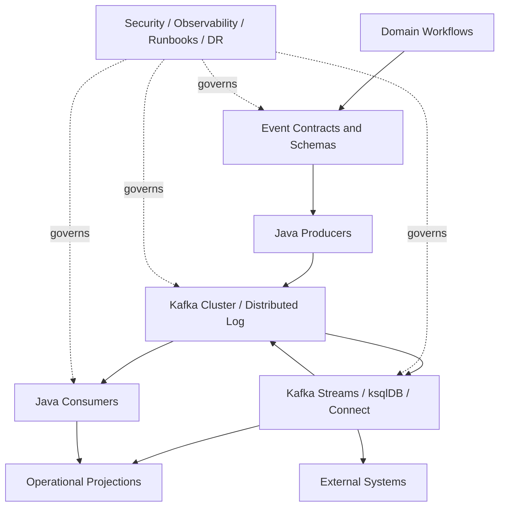

The key insight is this:

> Kafka gives you a durable, partitioned, replayable event log. A production platform still has to design the event truth, ordering boundary, compatibility contract, idempotency model, security boundary, processing topology, observability model, and operational lifecycle.

Kafka is necessary but not sufficient.

---

## 3. Platform Components

The capstone platform consists of the following components.

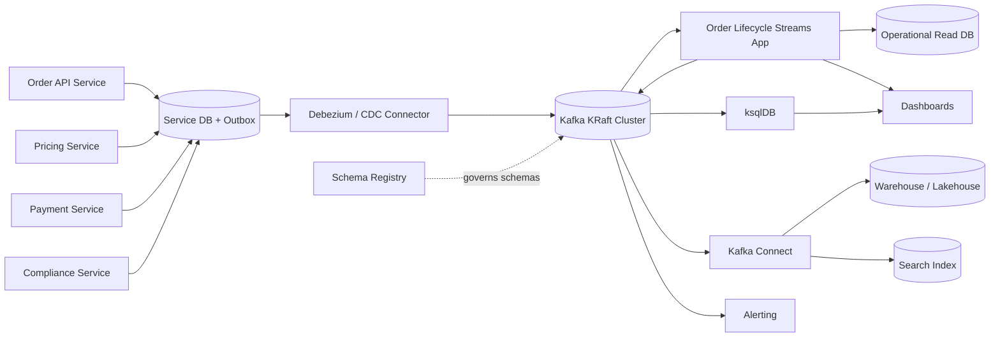

### 3.1 Runtime Categories

| Runtime | Best For | Avoid When |
|---|---|---|
| Java producer | Domain service emits facts after local transaction. | Event is derived from database change and outbox is safer. |
| Java consumer | Custom side effects, workflow integration, external API calls. | Logic is mostly declarative transformation or aggregation. |
| Kafka Streams | Stateful Java stream processing, joins, aggregations, projections. | Workload requires complex cluster-level stream processing beyond Kafka Streams operational model. |
| ksqlDB | SQL-like materialized views, simple stream/table transformations, exploratory operational queries. | Complex custom logic, strict Java type control, heavy application lifecycle integration. |
| Kafka Connect | Source/sink integration with databases, object storage, search, warehouses. | Business logic is required inside the integration flow. |
| Schema Registry | Contract governance and compatibility enforcement. | You treat schemas as optional documentation instead of deploy-time contract. |

---

## 4. Domain Boundary and Event Taxonomy

The platform starts with event taxonomy, not technology.

### 4.1 Event Categories

| Category | Meaning | Example | Retention Strategy |
|---|---|---|---|
| Product event | Business fact other services may depend on. | `OrderSubmitted`, `OrderApproved` | Long retention or archival. |
| Integration event | Event shaped for external integration. | `WarehouseOrderReady` | Per integration SLA. |
| Change-data event | Low-level database change. | `orders` table CDC row change | Operational/limited retention. |
| Retry event | Delayed retry of failed processing. | `order.notification.retry.5m` | Short retention. |
| DLQ event | Quarantined failed record with error context. | `order.notification.dlq` | Retention based on investigation SLA. |
| Projection event | Derived event for materialized views. | `OrderLifecycleUpdated` | Medium/long based on replay need. |
| Audit event | Compliance-grade state transition fact. | `ComplianceReviewClosed` | Long retention, potentially immutable archive. |

### 4.2 Topic Naming Standard

Use names that encode ownership and semantics.

```text
<domain>.<entity>.<event-category>.v<major>
```

Examples:

```text
order.lifecycle.events.v1
order.lifecycle.retry.5m.v1
order.lifecycle.retry.1h.v1
order.lifecycle.dlq.v1
order.lifecycle.compacted.v1
payment.authorization.events.v1
compliance.review.events.v1
order.lifecycle.materialized.v1
```

Avoid:

```text
events
orders
order-topic
service-a-output
prod-events-json
```

A topic name should help answer:

- Which domain owns this topic?
- What entity or stream is represented?
- Is this a product event, operational event, retry topic, DLQ, or projection?
- What is the major compatibility generation?

---

## 5. Event Contract Design

### 5.1 Canonical Event Envelope

Use a stable envelope and schema-governed payload.

```json
{
  "eventId": "018f7c1f-5e8e-7d9a-a7bb-9b18b9836a9e",
  "eventType": "OrderSubmitted",
  "eventVersion": 1,
  "source": "order-service",
  "tenantId": "tenant-a",
  "aggregateType": "Order",
  "aggregateId": "ord-10001",
  "correlationId": "corr-789",
  "causationId": "cmd-456",
  "occurredAt": "2026-07-02T10:15:30Z",
  "publishedAt": "2026-07-02T10:15:32Z",
  "schemaRef": "order.lifecycle.events.v1-value:12",
  "payload": {
    "orderId": "ord-10001",
    "customerId": "cust-9001",
    "status": "SUBMITTED",
    "totalAmount": "1200000.00",
    "currency": "IDR"
  }
}
```

The envelope exists because production systems need more than payload.

| Field | Purpose |
|---|---|
| `eventId` | Idempotency and audit identity. |
| `eventType` | Semantic routing and consumer behavior. |
| `eventVersion` | Business-level event version. |
| `source` | Producing service identity. |
| `tenantId` | Isolation, routing, access control, quota. |
| `aggregateId` | Ordering and state machine boundary. |
| `correlationId` | End-to-end trace across workflow. |
| `causationId` | Explains why this event happened. |
| `occurredAt` | Domain time. |
| `publishedAt` | Publication time. |
| `schemaRef` | Contract traceability. |

### 5.2 Schema Compatibility Rule

Default to backward compatibility for shared event topics unless the platform has a stronger reason.

A safe change usually includes:

- adding an optional field with default;
- adding a new enum value only if consumers tolerate unknown values;
- deprecating a field before removing it;
- creating a new major topic for incompatible semantic change.

Unsafe changes include:

- renaming a required field;
- changing field type incompatibly;
- changing event meaning while keeping the same schema;
- reusing the same event type for different business facts;
- removing fields still used by consumers.

Schema compatibility is necessary. Semantic compatibility is separate.

---

## 6. Topic and Partition Design

### 6.1 Core Topics

| Topic | Key | Cleanup | Retention | Owner | Purpose |
|---|---|---|---|---|---|
| `order.lifecycle.events.v1` | `orderId` | delete | 30-180 days or archive-backed | Order Platform | Canonical order lifecycle facts. |
| `order.lifecycle.compacted.v1` | `orderId` | compact | long | Order Platform | Latest lifecycle state per order. |
| `payment.authorization.events.v1` | `paymentId` or `orderId` | delete | 30-180 days | Payment | Payment authorization facts. |
| `compliance.review.events.v1` | `reviewId` or `orderId` | delete | long | Compliance | Review lifecycle facts. |
| `order.lifecycle.retry.5m.v1` | original key | delete | short | Consumer owner | Non-blocking retry. |
| `order.lifecycle.dlq.v1` | original key | delete | investigation SLA | Consumer owner | Quarantined failures. |

### 6.2 Partition Key Decision

For order lifecycle:

```text
key = orderId
```

Why:

- all lifecycle events for one order must be processed in order;
- projections are naturally keyed by order;
- Kafka Streams aggregations and joins become easier;
- replay preserves per-order state transition sequence.

Trade-off:

- large tenants or high-volume orders may create hot keys;
- cross-order workflows need separate correlation design;
- tenant-level ordering is not guaranteed.

If a domain requires tenant isolation and per-order ordering, use a composite conceptual key but be careful with partitioning:

```text
tenantId + ":" + orderId
```

If tenant-level quota is required, enforce quota at producer/platform layer, not by assuming Kafka partitions are tenant isolation boundaries.

### 6.3 Partition Count

Do not start with a random large number.

Estimate:

```text
required_partitions = max(
  ceil(target_topic_write_throughput / safe_write_per_partition),
  ceil(target_topic_read_parallelism / consumers_per_partition),
  minimum_operational_parallelism
)
```

Then validate with benchmark.

A production decision should document:

- expected events/sec;
- average and p99 event size;
- peak multiplier;
- number of consumer groups;
- ordering boundary;
- expected growth;
- reassignment cost;
- restore/replay cost.

---

## 7. Producer Architecture

### 7.1 Recommended Pattern: Local Transaction + Outbox

For business services with a local database, use transactional outbox.

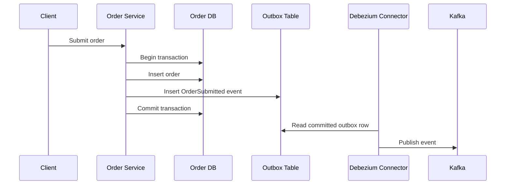

The invariant is simple:

> If the database state changes, the corresponding event must be durably recorded in the same local transaction.

Do not rely on best-effort dual writes:

```java
saveOrder(order);
kafkaTemplate.send(event); // unsafe if DB commit and Kafka send diverge
```

### 7.2 Direct Producer Pattern

Direct Kafka producer is acceptable when:

- Kafka is the system of record for that fact;
- no local database transaction must be synchronized;
- duplicate event production is tolerable or idempotently handled;
- producer failure semantics are explicit.

Recommended producer baseline:

```properties
acks=all
enable.idempotence=true
compression.type=zstd
linger.ms=5
batch.size=32768
delivery.timeout.ms=120000
request.timeout.ms=30000
max.in.flight.requests.per.connection=5
```

Tune with measurement, not folklore.

### 7.3 Producer Readiness Checklist

A producer is production-ready only when it defines:

- topic name and owner;
- key strategy;
- schema subject strategy;
- compatibility mode;
- event envelope;
- idempotency strategy;
- retry and timeout settings;
- error logging standard;
- metrics and alert thresholds;
- backpressure behavior;
- contract tests;
- rollout and rollback plan.

---

## 8. Consumer Architecture

### 8.1 Consumer Processing Contract

A consumer must define when it is safe to commit offset.

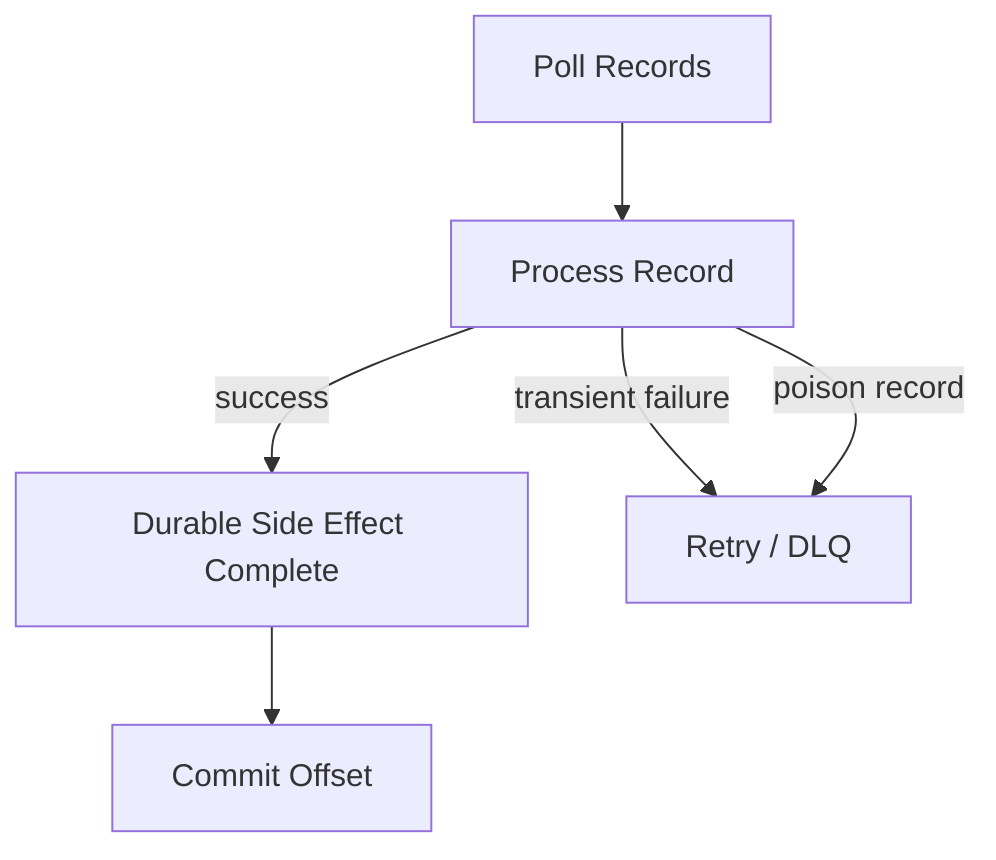

The commit rule:

> Commit an offset only after all previous records in that partition have reached a durable terminal state: success, retry topic, or DLQ.

### 8.2 Idempotent Consumer Pattern

For external side effects, use an idempotency table.

```sql
CREATE TABLE processed_event (
    consumer_name      TEXT NOT NULL,
    event_id           TEXT NOT NULL,
    aggregate_id       TEXT NOT NULL,
    processed_at       TIMESTAMPTZ NOT NULL DEFAULT now(),
    result_hash        TEXT,
    PRIMARY KEY (consumer_name, event_id)
);
```

Processing flow:

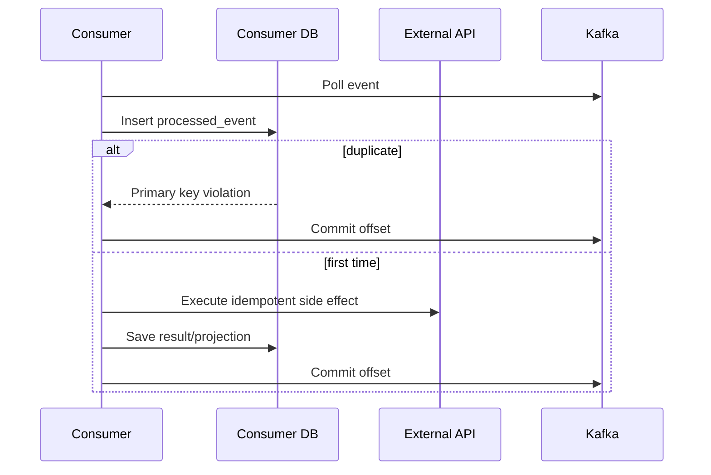

### 8.3 Consumer Failure Matrix

| Failure | Risk | Required Behavior |
|---|---|---|
| Crash before side effect | Event replayed | Safe; side effect did not happen. |
| Crash after side effect before commit | Duplicate side effect | Idempotency key or dedup table required. |
| Poison record | Partition blocked | Retry/DLQ boundary required. |
| Downstream slow | Lag grows | Pause/resume, bounded concurrency, rate limit. |
| Rebalance during processing | Duplicate or lost work | Rebalance listener and commit discipline. |
| Schema mismatch | Consumer failure | Compatibility test and DLQ classification. |

---

## 9. Retry and DLQ Topology

Use retry topics for non-blocking retry when blocking the partition is worse than temporary reordering.

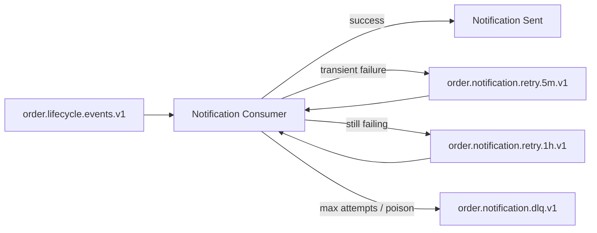

### 9.1 DLQ Envelope

A DLQ record should include:

- original topic;
- original partition;
- original offset;
- original key;
- original headers;
- original payload or payload reference;
- consumer name;
- error class;
- error message;
- stack trace hash;
- first failure time;
- last failure time;
- attempt count;
- classification: transient, permanent, contract, poison, downstream, unknown;
- replay eligibility.

### 9.2 DLQ Rule

A DLQ is not a trash can.

It is a controlled quarantine with ownership, alerting, retention, investigation SLA, and replay runbook.

---

## 10. Kafka Streams Topology

The capstone uses Kafka Streams for lifecycle state.

Input topics:

- `order.lifecycle.events.v1`
- `payment.authorization.events.v1`
- `compliance.review.events.v1`

Output topics:

- `order.lifecycle.compacted.v1`
- `order.lifecycle.alerts.v1`
- `order.lifecycle.metrics.v1`

### 10.1 Topology

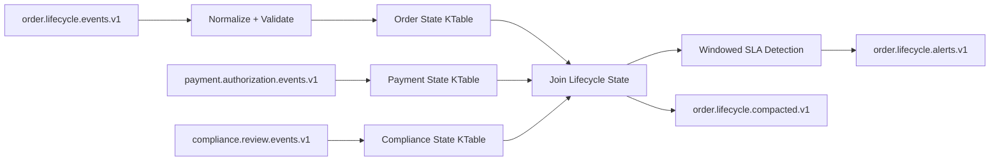

### 10.2 Streams Configuration Baseline

```properties
application.id=order-lifecycle-streams
processing.guarantee=exactly_once_v2
num.stream.threads=4
commit.interval.ms=1000
replication.factor=3
state.dir=/var/lib/kafka-streams/order-lifecycle
cache.max.bytes.buffering=10485760
```

### 10.3 Streams Correctness Invariants

| Invariant | Why It Matters |
|---|---|
| Input topics are keyed by `orderId` when lifecycle state is per order. | Prevents accidental repartition and broken ordering. |
| State stores have changelog topics with replication. | Enables restore after instance failure. |
| Topology names are explicit and stable. | Makes internal topics reviewable and migration safer. |
| Window grace is defined from domain lateness, not random default. | Prevents wrong SLA metrics. |
| Output topics are schema-governed. | Downstream consumers can evolve safely. |
| Exactly-once is used only for Kafka-contained read-process-write. | Avoids false guarantee for external side effects. |

---

## 11. ksqlDB Layer

ksqlDB is used for operational query surfaces where SQL is a better fit than Java code.

Example use cases:

- count submitted orders per tenant per 5 minutes;
- monitor delayed fulfillment;
- expose materialized view for dashboard;
- detect simple event patterns;
- provide pull queries for latest order status.

### 11.1 Example Stream and Table

```sql
CREATE STREAM order_lifecycle_events (
  eventId STRING,
  eventType STRING,
  tenantId STRING,
  aggregateId STRING KEY,
  occurredAt STRING,
  payload STRUCT<
    orderId STRING,
    status STRING,
    customerId STRING,
    totalAmount DECIMAL(18,2),
    currency STRING
  >
) WITH (
  KAFKA_TOPIC='order.lifecycle.events.v1',
  VALUE_FORMAT='AVRO',
  KEY_FORMAT='KAFKA',
  TIMESTAMP='occurredAt',
  TIMESTAMP_FORMAT='yyyy-MM-dd''T''HH:mm:ssX'
);
```

```sql
CREATE TABLE order_status_by_id AS
SELECT
  aggregateId AS orderId,
  LATEST_BY_OFFSET(payload->status) AS latestStatus,
  LATEST_BY_OFFSET(tenantId) AS tenantId,
  COUNT(*) AS eventCount
FROM order_lifecycle_events
GROUP BY aggregateId
EMIT CHANGES;
```

### 11.2 ksqlDB Governance Rule

Treat persistent queries as production applications.

They need:

- source topic review;
- key design review;
- schema review;
- query versioning;
- state topic review;
- observability;
- rollback plan;
- ownership;
- performance test;
- documentation.

Do not let ksqlDB become an ungoverned shadow application platform.

---

## 12. Kafka Connect Layer

Kafka Connect handles integration with systems that are not business logic runtimes.

### 12.1 Source Connectors

Possible source connectors:

- Debezium PostgreSQL connector for outbox CDC;
- JDBC source for controlled legacy ingestion;
- object storage source for replay/backfill;
- cloud event source where applicable.

### 12.2 Sink Connectors

Possible sink connectors:

- Elasticsearch/OpenSearch sink for search;
- S3/GCS/Azure object storage sink for archive/lakehouse;
- JDBC sink for read-model export;
- warehouse sink for analytics.

### 12.3 Connect Production Invariants

| Invariant | Reason |
|---|---|
| Connect internal topics are replicated and compacted as required. | Worker state must survive failure. |
| Converter and Schema Registry settings are explicit. | Prevents schema drift. |
| SMTs are simple and documented. | Hidden transformations create debugging pain. |
| Connector DLQ is monitored. | Silent connector failures are common production blind spots. |
| Task count aligns with source/sink partitioning. | More tasks do not always mean more throughput. |
| Connector configs are managed as code. | Prevents undocumented production drift. |

---

## 13. Security Architecture

### 13.1 Identity Model

Every service gets its own principal.

Examples:

```text
User:svc-order-api
User:svc-pricing
User:svc-payment
User:svc-compliance
User:svc-order-lifecycle-streams
User:svc-connect-cluster
User:svc-ksqldb
```

Do not share one Kafka credential across many services.

### 13.2 ACL Strategy

Example ACL intent:

| Principal | Resource | Permission |
|---|---|---|
| `svc-order-api` | `order.lifecycle.events.v1` | Write, Describe |
| `svc-order-lifecycle-streams` | input topics | Read, Describe |
| `svc-order-lifecycle-streams` | output/internal topics | Write, Create, Describe |
| `svc-notification` | `order.lifecycle.events.v1` | Read, Describe |
| `svc-notification` | retry/DLQ topics | Write, Read, Describe |
| `svc-connect-cluster` | connector topics | Read/Write as required |
| `svc-ksqldb` | query source/sink topics | Read/Write/Create as required |

### 13.3 Security Checklist

- TLS enabled for broker communication as required.
- Client authentication configured through mTLS, SASL/SCRAM, or OIDC/OAUTHBEARER depending on platform standard.
- ACLs are least-privilege.
- Topic creation is controlled.
- Schema Registry access is controlled.
- Connect REST API is protected.
- ksqlDB access is protected.
- Secrets are rotated.
- Audit logs are retained.
- Data classification is mapped to topic policy.

---

## 14. Observability Architecture

Kafka observability must combine infrastructure, broker, client, processing, and business metrics.

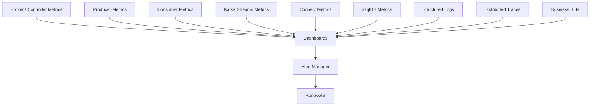

### 14.1 Required Metrics

| Layer | Metrics |
|---|---|
| Broker | under-replicated partitions, offline partitions, request latency, disk usage, network throughput, controller health. |
| Producer | record send rate, error rate, retry rate, batch size, compression rate, buffer available bytes, request latency. |
| Consumer | records consumed rate, commit latency, poll latency, partition lag, freshness lag, rebalance count. |
| Streams | task state, process rate, commit rate, state store restore, dropped records, skipped records, punctuator latency. |
| Connect | connector state, task state, source/sink rate, DLQ rate, error count, offset commit status. |
| ksqlDB | persistent query status, processing rate, error rate, state store metrics, query lag. |
| Business | orders submitted, approval latency, fulfillment SLA breach count, payment authorization delay. |

### 14.2 Lag Is Not One Metric

Use at least three concepts:

| Metric | Meaning |
|---|---|
| Offset lag | How many records behind the consumer is. |
| Time lag / freshness | How old the newest processed business event is. |
| Catch-up rate | Whether the consumer is reducing lag fast enough. |

Offset lag alone is insufficient.

A consumer can have small offset lag but process old events if producers stopped after a backlog. A consumer can have large offset lag but be healthy if it is catching up after planned backfill.

---

## 15. Deployment Architecture

### 15.1 Recommended Production Topology

For a self-managed deployment:

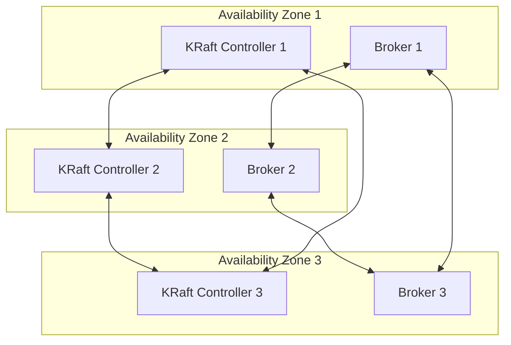

For larger clusters, separate controllers and brokers more deliberately.

### 15.2 Kubernetes Deployment Considerations

If running on Kubernetes:

- use a Kafka operator such as Strimzi or Confluent for Kubernetes;
- use persistent volumes with predictable performance;
- avoid casual pod eviction;
- use topology spread constraints;
- use rack awareness across zones;
- control rolling updates;
- test broker restart and volume reattachment;
- monitor storage latency;
- keep Kafka workloads away from noisy general-purpose nodes when needed;
- manage topics/users/connectors declaratively where possible.

### 15.3 Managed Kafka Considerations

Managed Kafka reduces broker operations but does not remove application-level architecture work.

You still own:

- topic design;
- key design;
- schema design;
- producer/consumer correctness;
- retry/DLQ;
- stream topology;
- consumer lag;
- ACL/service identity;
- cost control;
- contract governance;
- replay semantics;
- incident response.

---

## 16. Disaster Recovery and Replay

### 16.1 DR Questions

Before choosing a DR pattern, answer:

- What is the RPO for each topic category?
- What is the RTO for each consumer and projection?
- Which topics are product logs vs operational topics?
- Are schemas replicated?
- Are ACLs replicated?
- Are consumer offsets replicated or reconstructed?
- Can projections be rebuilt from retained events?
- Are external side effects replay-safe?
- What happens to DLQ and retry topics during failover?

### 16.2 Replay Categories

| Replay Type | Purpose | Risk |
|---|---|---|
| Projection rebuild | Recompute materialized view. | Usually safe if projection is idempotent. |
| Consumer reprocessing | Re-run business consumer. | Dangerous if side effects are not idempotent. |
| DLQ replay | Recover quarantined records. | Requires classification and fix validation. |
| Backfill | Load historical events. | Can overload consumers and distort metrics. |
| DR replay | Restore after regional failure. | Offset/schema/security consistency required. |

### 16.3 Replay Runbook Skeleton

```text
Replay Request
1. Identify topic, partition, offset/time range.
2. Identify target consumer/projection.
3. Classify side effects: none, idempotent, non-idempotent.
4. Confirm schema compatibility for historical records.
5. Confirm capacity window and rate limit.
6. Disable or isolate downstream side effects if needed.
7. Start replay in controlled batch.
8. Monitor lag, error rate, DLQ, downstream saturation.
9. Validate business result.
10. Record audit note and close replay ticket.
```

---

## 17. Testing Strategy

### 17.1 Test Pyramid for Kafka Systems

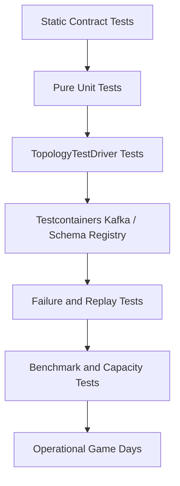

### 17.2 Required Test Types

| Test | Purpose |
|---|---|
| Schema compatibility test | Prevent breaking producer-consumer contract. |
| Producer serialization test | Ensure emitted event matches schema and envelope rules. |
| Consumer idempotency test | Ensure duplicate event does not duplicate side effect. |
| Retry/DLQ test | Ensure poison record reaches terminal state. |
| Streams topology test | Validate stateful transformation deterministically. |
| Window boundary test | Validate event-time, grace, and late events. |
| Repartition test | Detect unexpected repartition or key loss. |
| Replay test | Validate rebuild from retained event log. |
| Lag test | Validate behavior under backlog. |
| Rolling restart test | Validate broker/client resilience. |
| Disaster recovery drill | Validate failover/failback assumptions. |

---

## 18. Implementation Roadmap

### 18.1 Phase 1 — Foundation

Deliverables:

- Kafka cluster baseline;
- Schema Registry baseline;
- topic naming standard;
- ACL model;
- service identity model;
- observability baseline;
- local development environment;
- contract testing template;
- producer/consumer library conventions.

Exit criteria:

- teams can create governed topics;
- schemas are registered and checked in CI;
- producer/consumer metrics are visible;
- basic security is enforced;
- no shared service credential.

### 18.2 Phase 2 — Product Event Ingestion

Deliverables:

- order service outbox;
- Debezium/CDC or direct producer baseline;
- canonical event envelope;
- `order.lifecycle.events.v1` topic;
- first idempotent consumer;
- retry/DLQ topology;
- replay procedure.

Exit criteria:

- order events are durable;
- consumers handle duplicates;
- DLQ is monitored;
- offset commit discipline is reviewed;
- replay has been tested.

### 18.3 Phase 3 — Stateful Processing

Deliverables:

- Kafka Streams lifecycle app;
- compacted order lifecycle topic;
- state store/changelog review;
- exactly-once config where justified;
- state restore test;
- topology contract tests.

Exit criteria:

- projection can be rebuilt;
- topology handles late/out-of-order events as designed;
- state store restore time is measured;
- internal topics are documented.

### 18.4 Phase 4 — Query and Integration

Deliverables:

- ksqlDB materialized views;
- Connect sink to warehouse/search;
- connector configs as code;
- connector DLQ and metrics;
- query ownership docs.

Exit criteria:

- persistent queries have owner and rollback plan;
- Connect tasks are monitored;
- downstream systems have rate limits;
- integration failure modes are documented.

### 18.5 Phase 5 — Production Hardening

Deliverables:

- capacity benchmark;
- security review;
- architecture review;
- game day;
- DR drill;
- upgrade runbook;
- incident response runbooks;
- cost model;
- final go/no-go review.

Exit criteria:

- platform meets SLOs;
- major failure modes are tested;
- operators have runbooks;
- service teams understand ownership boundaries;
- release process includes contract and topology review.

---

## 19. Reference Repository Structure

A practical Java Kafka platform repository might look like this.

```text
kafka-platform/
  README.md
  docs/
    architecture/
      adr/
      event-taxonomy.md
      topic-naming.md
      schema-governance.md
      replay-runbook.md
      dlq-runbook.md
      dr-runbook.md
    diagrams/
  platform/
    docker-compose/
    kubernetes/
    strimzi/
    terraform/
    monitoring/
  schemas/
    order/
      lifecycle-events-v1.avsc
    payment/
    compliance/
  services/
    order-service/
      src/main/java/...
      src/test/java/...
    pricing-service/
    payment-service/
    notification-consumer/
  streams/
    order-lifecycle-streams/
      src/main/java/...
      src/test/java/...
  ksqldb/
    queries/
      001-create-order-stream.sql
      002-create-order-status-table.sql
  connect/
    source/
      debezium-order-outbox.json
    sink/
      order-search-sink.json
      order-warehouse-sink.json
  governance/
    topics.yaml
    acls.yaml
    schemas.yaml
    service-identities.yaml
  load-tests/
    producer-benchmark/
    consumer-benchmark/
  runbooks/
    broker-down.md
    consumer-lag.md
    dlq-replay.md
    state-restore.md
    schema-rollback.md
```

---

## 20. Java Code Skeletons

### 20.1 Event Envelope

```java
public record EventEnvelope<T>(
        String eventId,
        String eventType,
        int eventVersion,
        String source,
        String tenantId,
        String aggregateType,
        String aggregateId,
        String correlationId,
        String causationId,
        Instant occurredAt,
        Instant publishedAt,
        String schemaRef,
        T payload
) {}
```

### 20.2 Producer Boundary

```java
public interface DomainEventPublisher {
    void publish(DomainEvent event);
}
```

For outbox-based services, this interface writes to the outbox table inside the same database transaction. It does not directly call Kafka.

```java
public final class OutboxDomainEventPublisher implements DomainEventPublisher {
    private final OutboxRepository outboxRepository;
    private final EventSerializer serializer;

    public OutboxDomainEventPublisher(
            OutboxRepository outboxRepository,
            EventSerializer serializer
    ) {
        this.outboxRepository = outboxRepository;
        this.serializer = serializer;
    }

    @Override
    public void publish(DomainEvent event) {
        var envelope = EventEnvelopeFactory.from(event);
        var payload = serializer.serialize(envelope);

        outboxRepository.insert(new OutboxRecord(
                envelope.eventId(),
                topicFor(event),
                envelope.aggregateId(),
                envelope.eventType(),
                payload,
                envelope.occurredAt()
        ));
    }
}
```

### 20.3 Idempotent Consumer Boundary

```java
public final class IdempotentEventHandler {
    private final ProcessedEventRepository processedEvents;
    private final BusinessHandler businessHandler;

    public void handle(EventEnvelope<?> event) {
        boolean firstTime = processedEvents.tryInsert(
                "notification-consumer",
                event.eventId(),
                event.aggregateId()
        );

        if (!firstTime) {
            return;
        }

        businessHandler.handle(event);
    }
}
```

### 20.4 Kafka Streams Topology Skeleton

```java
public final class OrderLifecycleTopology {

    public Topology build() {
        StreamsBuilder builder = new StreamsBuilder();

        KStream<String, OrderLifecycleEvent> orders = builder.stream(
                "order.lifecycle.events.v1",
                Consumed.with(Serdes.String(), orderLifecycleSerde())
        );

        KTable<String, OrderLifecycleState> state = orders
                .selectKey((ignored, event) -> event.orderId())
                .groupByKey(Grouped.with(Serdes.String(), orderLifecycleSerde()))
                .aggregate(
                        OrderLifecycleState::empty,
                        (orderId, event, current) -> current.apply(event),
                        Materialized.<String, OrderLifecycleState, KeyValueStore<Bytes, byte[]>>as("order-lifecycle-state-store")
                                .withKeySerde(Serdes.String())
                                .withValueSerde(orderLifecycleStateSerde())
                );

        state.toStream().to(
                "order.lifecycle.compacted.v1",
                Produced.with(Serdes.String(), orderLifecycleStateSerde())
        );

        return builder.build();
    }
}
```

This skeleton hides many production details, but it shows the core rule:

> Key, state, and output must align with the domain aggregate boundary.

---

## 21. Architecture Decision Records

### 21.1 ADR: Use Kafka for Order Lifecycle Events

```md
# ADR: Use Kafka for Order Lifecycle Events

## Status
Accepted

## Context
Order lifecycle changes are consumed by fulfillment, notification, compliance, analytics, and operational dashboard systems. Synchronous integration creates coupling and does not support replay.

## Decision
Use Kafka as the durable event log for order lifecycle product events. Events are keyed by orderId and schema-governed through Schema Registry.

## Consequences
Positive:
- consumers can evolve independently;
- events can be replayed;
- ordering is preserved per order;
- operational projections can be built from the log.

Negative:
- consumers must handle duplicates;
- schema governance is required;
- replay and DLQ operations require runbooks;
- cross-partition global ordering is not available.
```

### 21.2 ADR: Use Outbox for Domain Event Publication

```md
# ADR: Use Transactional Outbox for Domain Event Publication

## Status
Accepted

## Context
Order service stores authoritative order state in PostgreSQL. Updating the order table and publishing a Kafka event as two independent writes can produce inconsistent state.

## Decision
Write domain changes and outbox events in the same local database transaction. Use CDC connector to publish outbox records to Kafka.

## Consequences
Positive:
- avoids dual-write inconsistency;
- supports retryable publication;
- preserves transaction boundary.

Negative:
- adds CDC operational complexity;
- outbox cleanup is required;
- event publication latency depends on CDC pipeline.
```

### 21.3 ADR: Use Kafka Streams for Lifecycle Projection

```md
# ADR: Use Kafka Streams for Order Lifecycle Projection

## Status
Accepted

## Context
The platform needs stateful lifecycle projection, joins with payment/compliance streams, and compacted output by orderId.

## Decision
Implement lifecycle projection as a Kafka Streams application using KTable state and changelog-backed state stores.

## Consequences
Positive:
- Java implementation fits domain logic;
- state is locally queryable and restorable;
- topology can be tested with TopologyTestDriver;
- exactly-once can be used for Kafka-contained processing.

Negative:
- internal topics require governance;
- state restore time must be monitored;
- topology changes need migration planning.
```

---

## 22. Production Go/No-Go Review

Use this before launch.

### 22.1 Contract Readiness

| Question | Required Answer |
|---|---|
| Are all shared topics schema-governed? | Yes. |
| Is compatibility mode defined? | Yes. |
| Are event semantics documented? | Yes. |
| Are event owners documented? | Yes. |
| Are breaking-change rules documented? | Yes. |

### 22.2 Correctness Readiness

| Question | Required Answer |
|---|---|
| Is partition key documented? | Yes. |
| Is ordering boundary explicit? | Yes. |
| Are consumers idempotent? | Yes for all side-effecting consumers. |
| Is offset commit policy documented? | Yes. |
| Are retry and DLQ policies implemented? | Yes. |
| Is replay behavior tested? | Yes. |

### 22.3 Operational Readiness

| Question | Required Answer |
|---|---|
| Are metrics dashboards available? | Yes. |
| Are alerts mapped to runbooks? | Yes. |
| Is consumer lag monitored by freshness and offset? | Yes. |
| Are DLQ topics monitored? | Yes. |
| Has a rolling restart been tested? | Yes. |
| Has state restore been tested? | Yes if Kafka Streams is used. |
| Has DR/failover assumption been tested? | Yes for critical flows. |

### 22.4 Security Readiness

| Question | Required Answer |
|---|---|
| Does every service have its own principal? | Yes. |
| Are ACLs least-privilege? | Yes. |
| Are secrets rotated? | Scheduled. |
| Is Schema Registry protected? | Yes. |
| Are Connect and ksqlDB APIs protected? | Yes. |
| Are audit logs available? | Yes. |

### 22.5 Performance Readiness

| Question | Required Answer |
|---|---|
| Has target throughput been benchmarked? | Yes. |
| Has peak throughput been benchmarked? | Yes. |
| Has replay/backfill been tested? | Yes. |
| Is partition count justified? | Yes. |
| Is storage/network headroom documented? | Yes. |
| Are downstream rate limits known? | Yes. |

---

## 23. Incident Runbook Index

A mature Kafka platform should maintain at least these runbooks.

| Runbook | Trigger |
|---|---|
| Broker down | Broker unavailable or repeated restart. |
| Controller quorum issue | KRaft controller unavailable or unstable. |
| Under-replicated partitions | Replication falling behind. |
| Offline partition | Partition unavailable. |
| Disk pressure | Broker disk approaching threshold. |
| Producer error spike | Send errors, timeout, authorization, serialization failures. |
| Consumer lag | Offset/freshness lag exceeds SLO. |
| Rebalance storm | Frequent consumer group rebalances. |
| DLQ spike | DLQ rate exceeds baseline. |
| Schema registration failure | Producer deploy blocked or incompatible schema. |
| Kafka Streams state restore | Instance recovering or stuck restoring state. |
| Connect task failed | Connector task failed or paused. |
| ksqlDB persistent query failed | Query not processing. |
| Replay request | Controlled reprocessing needed. |
| Disaster recovery | Region/cluster failure. |

---

## 24. Common Capstone Failure Modes

### 24.1 The Platform Has Kafka but No Event Model

Symptom:

- topics are named after services;
- payloads are arbitrary JSON;
- consumers infer meaning from undocumented fields.

Fix:

- define event taxonomy;
- introduce schema governance;
- document event semantics;
- assign topic ownership.

### 24.2 The Platform Has Schemas but No Semantic Compatibility

Symptom:

- schema compatibility passes;
- consumers still break because field meaning changed.

Fix:

- review semantic changes;
- version event meaning;
- use new event type or major topic when meaning changes.

### 24.3 The Platform Has Retry but No Backpressure

Symptom:

- downstream fails;
- retry topics amplify load;
- DLQ explodes;
- main consumer never catches up.

Fix:

- bounded retry;
- rate limit;
- circuit breaker;
- pause/resume;
- downstream-specific throttle;
- alert on retry growth.

### 24.4 The Platform Has Exactly-Once but Non-Idempotent Side Effects

Symptom:

- team believes `exactly_once_v2` prevents duplicate emails, charges, or external API calls.

Fix:

- clarify exactly-once boundary;
- use idempotency keys;
- store side-effect ledger;
- separate Kafka-contained processing from external side-effecting consumers.

### 24.5 The Platform Has Dashboards but No Runbooks

Symptom:

- alerts fire;
- engineers do not know what to do;
- incidents depend on hero debugging.

Fix:

- map every alert to a runbook;
- define first checks;
- define rollback/mitigation;
- run game days.

---

## 25. Kaufman Final Practice Loop

Josh Kaufman's method is not completed by reading. It is completed by deliberate practice and feedback.

Use this loop for the capstone.

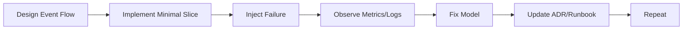

### 25.1 20-Hour Capstone Practice Plan

| Time | Practice |
|---:|---|
| 1h | Model domain events and topic taxonomy. |
| 2h | Implement producer/outbox skeleton. |
| 2h | Register schema and compatibility tests. |
| 2h | Implement idempotent consumer with retry/DLQ. |
| 3h | Build Kafka Streams lifecycle projection. |
| 2h | Add ksqlDB materialized query. |
| 2h | Add Connect sink/source config. |
| 2h | Add observability dashboard and alerts. |
| 2h | Run replay, poison pill, consumer crash, and lag tests. |
| 2h | Write ADRs and production go/no-go review. |

The goal is not to build everything perfectly. The goal is to build enough to self-correct.

---

## 26. Final Master Checklist

### 26.1 Architecture

- [ ] Domain event taxonomy exists.
- [ ] Topic naming standard exists.
- [ ] Topic owner is documented.
- [ ] Partition key is documented.
- [ ] Ordering boundary is explicit.
- [ ] Retention policy is explicit.
- [ ] Compaction policy is explicit where needed.
- [ ] Replay expectation is documented.
- [ ] DR expectation is documented.

### 26.2 Producer

- [ ] Producer reliability settings are reviewed.
- [ ] Event schema is registered.
- [ ] Event envelope is complete.
- [ ] `eventId` is unique and stable.
- [ ] `correlationId` and `causationId` are propagated.
- [ ] Outbox or transaction strategy is documented.
- [ ] Producer metrics are emitted.
- [ ] Error handling is observable.

### 26.3 Consumer

- [ ] Consumer commit policy is documented.
- [ ] Idempotency strategy is implemented.
- [ ] Retry/DLQ strategy is implemented.
- [ ] Poison pill behavior is tested.
- [ ] Rebalance behavior is tested.
- [ ] Shutdown behavior is safe.
- [ ] Lag metrics are monitored.

### 26.4 Streams/ksqlDB/Connect

- [ ] Topology is named and documented.
- [ ] Internal topics are understood.
- [ ] State restore is tested.
- [ ] Window/grace semantics are tested.
- [ ] Persistent ksqlDB queries are versioned.
- [ ] Connector configs are managed as code.
- [ ] Connector task failure is monitored.

### 26.5 Operations

- [ ] Broker/controller dashboards exist.
- [ ] Client dashboards exist.
- [ ] Alert thresholds are defined.
- [ ] Runbooks exist.
- [ ] Upgrade path is documented.
- [ ] Backup/restore assumptions are documented.
- [ ] DR drill is scheduled.
- [ ] Game day is scheduled.

---

## 27. Final Self-Assessment

You are operating beyond basic Kafka usage when you can answer these without guessing:

1. What exact business fact does this event represent?
2. Why is this the correct partition key?
3. What ordering is guaranteed and what ordering is not?
4. What happens if the producer times out after the broker accepted the record?
5. What happens if the consumer crashes after the side effect but before commit?
6. What happens if a schema-compatible change is semantically incompatible?
7. What happens if a Kafka Streams app restores state during peak traffic?
8. What happens if a DLQ replay triggers external side effects again?
9. What happens if a downstream sink is slow for four hours?
10. What happens if one broker, one controller, or one availability zone fails?
11. What happens if you need to rebuild a projection from six months ago?
12. What happens if a topic has the wrong partition count?
13. What happens if a tenant becomes a hot key?
14. What happens if a ksqlDB query creates an unexpected repartition topic?
15. What happens if a Connect task silently stops?
16. What happens if ACLs are too broad and a service writes to the wrong topic?
17. What happens if an alert fires at 03:00 and no runbook exists?
18. What happens if a replay uses old schemas?
19. What happens if a Kafka transaction is assumed to cover a database write?
20. What happens if Kafka is treated as a magic reliability layer instead of a distributed system?

If you can reason through those clearly, you are no longer just using Kafka. You are engineering Kafka-based systems.

---

## 28. References

- Apache Kafka Documentation: https://kafka.apache.org/documentation/
- Apache Kafka KRaft vs ZooKeeper: https://kafka.apache.org/40/getting-started/zk2kraft/
- Apache Kafka Operations: https://kafka.apache.org/documentation/#operations
- Apache Kafka Streams Documentation: https://kafka.apache.org/documentation/streams/
- Confluent Schema Registry Documentation: https://docs.confluent.io/platform/current/schema-registry/index.html
- Confluent ksqlDB Documentation: https://docs.confluent.io/platform/current/ksqldb/
- Confluent Kafka Connect Documentation: https://docs.confluent.io/platform/current/connect/
- Strimzi Documentation: https://strimzi.io/docs/operators/latest/

---

## 29. Series Completion

This is **Part 035**, the final part of **Learn Java Kafka in Action**.

The series is complete.

You now have a full advanced learning path covering:

- Kafka fundamentals and mental model;
- KRaft control plane;
- Java producer and consumer architecture;
- reliability and delivery semantics;
- batching, partitioning, and flow control;
- retry, DLQ, and idempotency;
- schema contracts and event versioning;
- communication and data patterns;
- CDC, outbox, event sourcing, and CQRS;
- Kafka Streams;
- ksqlDB;
- Kafka Connect;
- security and governance;
- observability;
- performance and capacity planning;
- deployment models;
- Kubernetes operators;
- operations, upgrade, disaster recovery;
- architecture review and anti-patterns;
- production-grade capstone design.

The next useful step is not more theory. The next useful step is to implement the capstone as a working repository and force it through failure scenarios.
