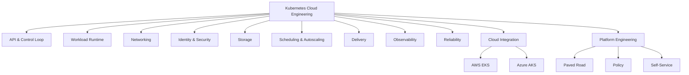
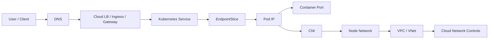
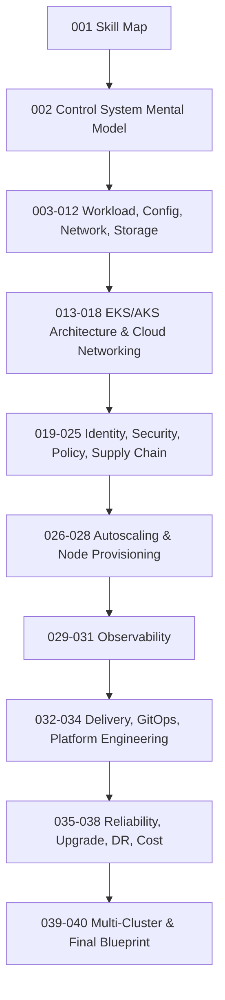

# Kaufman Skill Map

Kubernetes sering diajarkan sebagai kumpulan perintah `kubectl`, YAML manifest, dan instalasi tool. Itu berguna untuk mulai, tetapi tidak cukup untuk level production. Pada sistem nyata, Kubernetes adalah **distributed application platform** yang menggabungkan API declarative, control loop, scheduling, networking, identity, storage, security, observability, release engineering, cost control, dan cloud integration.

Target seri ini bukan sekadar bisa deploy aplikasi ke cluster. Targetnya adalah membangun keluwesan untuk menjawab pertanyaan seperti ini:

- Mengapa workload ini restart padahal aplikasi tidak crash?
- Mengapa rollout sukses menurut Deployment, tetapi user mengalami error?
- Mengapa Pod tidak bisa scheduled walaupun cluster terlihat punya node kosong?
- Mengapa service bisa diakses dari namespace tertentu tetapi tidak dari namespace lain?
- Mengapa biaya node naik setelah HPA ditambahkan?
- Mengapa migration dari EKS ke AKS tidak bisa hanya copy YAML?
- Mengapa cluster aman secara IAM tetapi masih bocor lewat Kubernetes RBAC?
- Mengapa autoscaling berbasis CPU gagal untuk workload queue-based?
- Mengapa upgrade minor version bisa mematahkan API walaupun aplikasi tidak berubah?
- Bagaimana membangun platform API internal agar developer tidak perlu tahu semua detail Kubernetes?

Kubernetes adalah platform yang mudah terlihat sederhana karena interface-nya deklaratif. Tetapi deklaratif tidak berarti sederhana. Deklaratif berarti kita menyatakan **desired state**, lalu banyak controller dan agent akan mencoba mendekatkan sistem ke state tersebut. Kualitas engineering muncul ketika kita memahami jarak antara **apa yang kita deklarasikan**, **apa yang control plane pahami**, **apa yang node mampu jalankan**, **apa yang cloud provider realisasikan**, dan **apa yang user alami**.

## Sumber Kebenaran Seri Ini

Materi seri ini berpijak pada prinsip resmi Kubernetes dan cloud-provider managed Kubernetes:

- Kubernetes adalah sistem open-source untuk automating deployment, scaling, dan management aplikasi containerized.
- Cluster Kubernetes terdiri dari control plane dan worker nodes.
- Controller Kubernetes bekerja sebagai control loop yang mengamati state cluster dan membuat perubahan untuk mendekatkan actual state ke desired state.
- Kubernetes API object memiliki metadata dan `resourceVersion` untuk mendukung perubahan state dan mekanisme watch.
- `etcd` adalah highly-available key-value store yang digunakan sebagai backing store untuk semua cluster data.
- EKS dan AKS menambahkan lifecycle, identity, networking, node management, observability, dan integration layer yang harus dipahami sebagai bagian dari desain platform.

Referensi resmi ada di bagian akhir. Materi ini tidak bergantung pada satu vendor. AWS dan Azure dipakai sebagai dua implementasi managed Kubernetes yang memaksa kita memahami batas antara Kubernetes murni dan cloud provider behavior.

---

# 1. Premis Dasar: Kubernetes Bukan Tujuan, Kubernetes Adalah Substrate

Kesalahan umum engineer setelah mempelajari basic Kubernetes adalah menganggap Kubernetes sebagai tempat menjalankan container. Secara teknis benar, tetapi mental model itu terlalu rendah.

Mental model yang lebih kuat:

> Kubernetes adalah control-plane substrate untuk mengubah intent engineering menjadi state runtime yang terus direkonsiliasi.

Artinya, kita tidak hanya “menjalankan container”. Kita membangun mekanisme untuk:

1. **Menyatakan intent**: aplikasi apa, versi apa, berapa replica, dengan resource berapa, expose ke siapa, butuh identity apa, dan butuh policy apa.
2. **Menyimpan intent**: intent menjadi Kubernetes object yang tersimpan melalui API server dan persistence layer.
3. **Merekonsiliasi intent**: controller, scheduler, kubelet, CNI, CSI, ingress controller, autoscaler, dan cloud controller mencoba membuat actual state mendekati desired state.
4. **Mengamati realitas**: metrics, logs, traces, events, conditions, status fields, node signals, cloud telemetry.
5. **Mengoreksi drift**: rollout, rollback, scale, repair, recreate, reschedule, rotate, update, delete.
6. **Mengelola constraint**: security, quota, cost, compliance, network boundary, cloud limits, version lifecycle.

Kubernetes tidak menghilangkan kompleksitas. Kubernetes memindahkan kompleksitas dari script imperative manual ke sistem API dan controller yang lebih konsisten, tetapi tetap harus dipahami.

## Analogi Praktis

Bayangkan sistem enforcement lifecycle yang memiliki case, status, escalation, assignment, SLA, audit, dan policy. Kamu tidak ingin operator mengubah database secara manual setiap kali case pindah state. Kamu ingin ada state machine, invariant, transition rule, audit log, dan worker yang menjalankan aksi.

Kubernetes mirip seperti itu:

| Domain case management | Kubernetes |
|---|---|
| Case object | Kubernetes resource object |
| Target state | `.spec` |
| Observed state | `.status` |
| Transition worker | Controller |
| Rule engine / validator | Admission controller / policy engine |
| Assignment | Scheduler |
| Execution worker | Kubelet / runtime |
| Audit history | Events / API audit logs |
| External integration | Cloud controller / CSI / CNI / ingress controller |
| SLA | SLO / probes / autoscaling / disruption policy |

Dengan analogi ini, Kubernetes bukan kumpulan YAML. Kubernetes adalah **lifecycle engine** untuk infrastructure dan workload.

---

# 2. Apa yang Dimaksud “Top 1%” dalam Kubernetes Cloud Engineering?

“Top 1%” di sini bukan berarti hafal semua field API. Itu justru pendekatan yang rapuh. Engineer kuat bukan yang hafal seluruh YAML, tetapi yang bisa membuat keputusan benar saat constraint bertabrakan.

Contoh keputusan nyata:

- Memilih antara **EKS managed node group**, **Karpenter**, **EKS Auto Mode**, **Fargate**, atau node self-managed.
- Memilih antara **Azure CNI overlay**, **Azure CNI pod subnet**, atau kubenet legacy/migration path.
- Menentukan apakah service harus lewat ALB, NLB, Application Gateway, Gateway API, service mesh, atau internal Service saja.
- Menentukan kapan stateful workload pantas di Kubernetes dan kapan harus keluar ke managed database/service.
- Mendesain multi-tenant cluster tanpa membuat semua team bisa mengubah cluster-scoped resource.
- Mendesain upgrade path yang tidak bergantung pada “semoga minor version tidak breaking”.
- Membuat policy exception yang aman tanpa menghentikan delivery team.
- Menghubungkan workload identity ke IAM/Entra tanpa static cloud credentials.
- Menganalisis incident dari symptoms ke control-plane cause.
- Mengubah platform dari “cluster sebagai snowflake” menjadi “cluster sebagai reproducible product”.

## Kompetensi Inti

Engineer Kubernetes production-grade harus punya lima kemampuan inti:

1. **Modeling**: mampu memodelkan workload, platform, traffic, identity, dan failure domain.
2. **Diagnosis**: mampu membaca state dari API object, events, logs, metrics, dan cloud signals.
3. **Design**: mampu memilih pattern yang sesuai dengan requirement, bukan sekadar mengikuti template.
4. **Operation**: mampu mengelola rollout, upgrade, incident, capacity, cost, security, dan recovery.
5. **Abstraction**: mampu membangun paved road atau internal platform agar developer tidak perlu menyentuh kompleksitas mentah.

## Anti-Target

Seri ini tidak bertujuan menjadikan kamu operator yang hanya menjalankan command berikut:

```bash
kubectl apply -f deployment.yaml
kubectl get pods
kubectl logs pod-name
kubectl describe pod pod-name
```

Itu akan dibahas saat perlu, tetapi command bukan pusat materi. Pusat materi adalah **why**, **when**, **what can fail**, dan **how to design safely**.

---

# 3. Kaufman Framework untuk Kubernetes

Josh Kaufman dalam pendekatan “First 20 Hours” menekankan deconstruction, learning enough to self-correct, removing barriers, dan deliberate practice. Untuk topik sebesar Kubernetes, kita tidak mengartikan “20 jam” sebagai cukup menjadi expert. Kita menggunakannya sebagai framework untuk mempercepat akuisisi skill inti.

## 3.1 Deconstruct the Skill

Kubernetes dipecah menjadi subskill yang bisa dilatih terpisah:



Setiap subskill punya artefak sendiri: manifest, diagram traffic, policy, runbook, capacity model, dashboard, alert, upgrade checklist, DR plan.

## 3.2 Learn Enough to Self-Correct

Untuk Kubernetes, “self-correct” berarti mampu menjawab:

- Object apa yang menjadi source of truth?
- Controller mana yang bertanggung jawab?
- Field `.spec` mana yang memicu reconciliation?
- Field `.status` atau condition mana yang menunjukkan actual state?
- Event apa yang menunjukkan transisi?
- Apakah masalah ada di Kubernetes, node, runtime, CNI, CSI, cloud provider, DNS, IAM, atau aplikasi?
- Apakah perubahan aman diterapkan dengan `apply`, butuh rollout, butuh recreate, atau butuh migration?

Ketika kamu bisa self-correct, kamu tidak lagi debugging dengan menebak-nebak.

## 3.3 Remove Practice Barriers

Barrier belajar Kubernetes biasanya bukan teori, tetapi environment dan feedback loop.

Gunakan tiga level environment:

| Level | Environment | Tujuan |
|---|---|---|
| Local | kind, k3d, minikube | Memahami API, workload, scheduling dasar, controller behavior |
| Managed non-prod | EKS/AKS dev cluster | Memahami cloud integration: IAM, CNI, LB, DNS, storage, observability |
| Production-like | multi-node, multi-AZ, policy, GitOps, telemetry | Melatih reliability, security, cost, upgrades, incident response |

Local cluster bagus untuk API learning. Tetapi local cluster tidak cukup untuk belajar EKS/AKS karena banyak failure mode hanya muncul ketika ada VPC/VNet, cloud load balancer, IAM, managed identity, managed disk, cloud DNS, quota, rate limit, dan node lifecycle.

## 3.4 Deliberate Practice

Setiap part akan diarahkan ke latihan berbasis skenario, bukan hanya contoh happy path.

Contoh deliberate practice:

- Buat Deployment yang intentionally gagal readiness, lalu diagnosis dari `kubectl get`, `describe`, events, logs, dan conditions.
- Buat Pod yang tidak bisa scheduled karena request terlalu besar, taint, affinity, atau topology constraint.
- Buat service yang tidak bisa diakses karena NetworkPolicy default deny.
- Buat Ingress yang salah TLS secret, lalu trace dari DNS sampai backend Pod.
- Buat HPA yang flapping, lalu stabilkan dengan metrics dan behavior policy.
- Buat cluster upgrade rehearsal dan deteksi deprecated API sebelum upgrade.
- Buat workload identity ke AWS/Azure tanpa static secret.
- Buat outage simulation: node drain, AZ failure, bad rollout, image pull failure, DNS failure.

---

# 4. Peta Skill Besar Seri Ini

## 4.1 Skill Domain 1: Kubernetes API & Control Loop

Ini fondasi paling penting. Tanpa ini, Kubernetes terlihat seperti magic.

Yang harus dikuasai:

- API server sebagai front door semua perubahan cluster.
- Resource object sebagai state document.
- `.metadata`, `.spec`, `.status`.
- Desired state vs observed state.
- Controller loop.
- Watch/list mechanism dan `resourceVersion`.
- Declarative update vs imperative mutation.
- Owner reference dan garbage collection.
- Finalizer.
- Admission chain.
- API versioning dan deprecation.

Mental model:

> Hampir semua aksi Kubernetes adalah perubahan object di API, lalu controller lain bereaksi.

Contoh: saat membuat Deployment, kamu tidak langsung membuat container. Kamu membuat Deployment object. Deployment controller membuat ReplicaSet. ReplicaSet controller membuat Pod. Scheduler memilih Node. Kubelet di node menjalankan Pod melalui container runtime. CNI mengatur network. Kubelet update status. Service/EndpointSlice controller memperbarui endpoint. Observability stack membaca metrics/logs/events.

Satu manifest bisa memicu rantai aksi panjang.

## 4.2 Skill Domain 2: Workload Runtime Engineering

Workload tidak cukup “jalan”. Workload harus punya kontrak runtime.

Yang harus dikuasai:

- Container image design.
- PID 1 behavior.
- signal handling.
- startup, readiness, liveness.
- graceful shutdown.
- termination grace period.
- resource request/limit.
- filesystem assumption.
- config reload strategy.
- secrets handling.
- sidecar pattern.
- init container.
- job completion semantics.

Mental model:

> Kubernetes bisa menjaga proses tetap berjalan, tetapi tidak bisa memperbaiki aplikasi yang tidak punya lifecycle contract.

Banyak incident “Kubernetes problem” sebenarnya aplikasi tidak menangani SIGTERM, readiness terlalu optimistis, startup lambat, memory leak, atau shutdown tidak idempotent.

## 4.3 Skill Domain 3: Scheduling & Capacity

Scheduler bukan hanya mencari node kosong. Scheduler menyelesaikan constraint problem.

Yang harus dikuasai:

- requests vs limits.
- QoS classes.
- taints dan tolerations.
- nodeSelector, node affinity, pod affinity/anti-affinity.
- topology spread constraints.
- priority class dan preemption.
- eviction.
- node pressure.
- pod disruption budget.
- cluster autoscaler behavior.
- Karpenter / node provisioning.
- AKS node pool scaling.

Mental model:

> Scheduling adalah constraint satisfaction; autoscaling adalah reaksi terhadap unscheduled demand dan utilization signal.

Jika request terlalu kecil, cluster terlihat murah tetapi tidak stabil. Jika request terlalu besar, cluster mahal dan underutilized. Jika topology constraint terlalu ketat, Pod pending. Jika PDB terlalu ketat, node upgrade/drain macet.

## 4.4 Skill Domain 4: Networking

Networking adalah sumber incident terbesar di Kubernetes karena ada banyak layer.

Layer yang perlu dipahami:



Yang harus dikuasai:

- Pod IP vs Service IP vs Node IP.
- ClusterIP, NodePort, LoadBalancer.
- EndpointSlice.
- kube-proxy / eBPF dataplane concept.
- CoreDNS.
- Ingress vs Gateway API.
- TLS termination.
- cloud load balancer annotations/CRDs.
- AWS VPC CNI behavior.
- Azure CNI behavior.
- NetworkPolicy.
- NAT, egress, private endpoint, service endpoint.
- cross-zone/cross-AZ behavior.

Mental model:

> Kubernetes Service discovery memecahkan identity service di dalam cluster, tetapi cloud networking menentukan apakah traffic benar-benar bisa lewat.

## 4.5 Skill Domain 5: Identity & Security

Security Kubernetes tidak bisa hanya mengandalkan cloud IAM. Ada dua dunia identity:

1. Cloud identity: AWS IAM, Azure Entra ID, managed identity.
2. Kubernetes identity: user, group, service account, RBAC.

Yang harus dikuasai:

- authentication vs authorization.
- Kubernetes RBAC.
- service account.
- token projection.
- workload identity.
- IRSA/EKS Pod Identity.
- AKS Workload Identity.
- secrets handling.
- pod security.
- security context.
- admission control.
- image provenance.
- network isolation.
- audit logging.

Mental model:

> Cloud IAM mengatur akses ke cloud API. Kubernetes RBAC mengatur akses ke Kubernetes API. Workload identity menghubungkan Pod ke cloud API. Ketiganya berbeda dan harus didesain sebagai satu sistem.

## 4.6 Skill Domain 6: Storage & Stateful Boundaries

Kubernetes bisa menjalankan stateful workload, tetapi bukan berarti semua state harus berada di Kubernetes.

Yang harus dikuasai:

- Volume, PV, PVC.
- StorageClass.
- CSI driver.
- dynamic provisioning.
- StatefulSet identity.
- volume expansion.
- backup/restore.
- snapshot.
- zone-aware storage.
- read-write mode.
- database-in-Kubernetes trade-off.
- managed cloud database boundary.

Mental model:

> Stateless workload di Kubernetes mudah dipindahkan. Stateful workload membawa physical constraint: disk, zone, latency, durability, backup, restore, corruption, and ownership.

## 4.7 Skill Domain 7: Delivery & GitOps

Production delivery bukan `kubectl apply` dari laptop.

Yang harus dikuasai:

- Helm chart design.
- Kustomize overlays.
- environment promotion.
- GitOps with Argo CD / Flux.
- drift detection.
- progressive delivery.
- canary/blue-green.
- rollback contract.
- secrets delivery.
- policy validation in CI.
- supply chain metadata.

Mental model:

> Delivery pipeline adalah mekanisme perubahan state. GitOps membuat desired state auditable dan reproducible, tetapi tidak otomatis membuat perubahan aman.

## 4.8 Skill Domain 8: Observability

Observability Kubernetes harus membaca tiga level:

1. Application signals: latency, errors, throughput, saturation.
2. Kubernetes signals: Pod, Deployment, Node, events, HPA, scheduler, API server.
3. Cloud signals: load balancer, network, disk, IAM, quota, managed service health.

Yang harus dikuasai:

- logs, metrics, traces, events.
- RED/USE method.
- Kubernetes object conditions.
- node metrics.
- control plane metrics.
- alert design.
- dashboard design.
- trace correlation.
- CloudWatch / Azure Monitor.
- Prometheus / Grafana.
- OpenTelemetry.

Mental model:

> Logs menjawab “apa yang terjadi”, metrics menjawab “seberapa besar dampaknya”, traces menjawab “di mana latency/error berpindah”, events menjawab “apa yang Kubernetes lakukan”.

## 4.9 Skill Domain 9: Reliability & Failure Modeling

Reliability bukan hasil dari replica count saja.

Yang harus dikuasai:

- failure domain: container, Pod, node, zone, region, control plane, dependency.
- SLO and error budget.
- PodDisruptionBudget.
- topology spread.
- readiness gate.
- graceful degradation.
- incident response.
- game day.
- backup/restore drill.
- rollback/roll-forward.
- dependency failure.
- chaos testing with restraint.

Mental model:

> High availability adalah hasil dari desain failure domain, bukan hanya autoscaling.

## 4.10 Skill Domain 10: Cloud Managed Kubernetes

EKS dan AKS bukan hanya “Kubernetes yang di-host vendor”. Mereka memasukkan opini cloud provider.

AWS EKS area:

- control plane lifecycle.
- managed node group.
- Fargate.
- VPC CNI.
- EKS Pod Identity / IRSA.
- IAM access entries.
- EBS/EFS CSI.
- AWS Load Balancer Controller.
- Route 53 / ACM.
- CloudWatch / ADOT.
- Karpenter.
- EKS Auto Mode.

Azure AKS area:

- control plane lifecycle.
- node pools.
- Azure CNI / overlay.
- managed identity.
- AKS Workload Identity.
- Azure Disk / Files CSI.
- Application Gateway Ingress Controller / ALB controller evolution.
- Azure DNS / Key Vault.
- Azure Monitor / managed Prometheus / managed Grafana.
- AKS Automatic.

Mental model:

> Managed Kubernetes mengurangi pekerjaan menjalankan control plane, tetapi menambah kebutuhan memahami cloud-provider contract.

## 4.11 Skill Domain 11: Platform Engineering

Tujuan akhir bukan membuat semua developer menjadi Kubernetes expert. Tujuan akhir adalah membuat Kubernetes menjadi platform yang aman dan mudah dipakai.

Yang harus dikuasai:

- platform as product.
- golden path / paved road.
- namespace factory.
- workload template.
- policy guardrail.
- developer self-service.
- service catalog.
- ownership metadata.
- environment lifecycle.
- SLO template.
- runbook template.
- cost attribution.
- compliance evidence.

Mental model:

> Platform yang baik mengubah kompleksitas menjadi interface yang lebih kecil tanpa menyembunyikan risiko operasional.

---

# 5. Kompetensi Bertahap

## Level 1: User of Kubernetes

Bisa:

- deploy aplikasi sederhana.
- membaca Pod status.
- melihat logs.
- expose service.
- menggunakan namespace.
- mengganti image version.

Belum cukup untuk production karena belum memahami scheduling, networking, security, failure mode, dan cloud integration.

## Level 2: Workload Engineer

Bisa:

- menulis Deployment aman.
- menentukan probes.
- menentukan resource request.
- mengatur config/secrets.
- memahami rollout dan rollback.
- mendiagnosis Pod failure.
- menggunakan Service dan Ingress dasar.

Ini level minimal untuk backend engineer yang aplikasi miliknya berjalan di Kubernetes.

## Level 3: Cluster-Aware Engineer

Bisa:

- mendiagnosis scheduler issue.
- memahami node pool.
- memahami CNI behavior.
- memahami storage class.
- memahami autoscaler.
- mengelola disruption.
- membaca events dan metrics cluster.

Ini level yang mulai bisa membedakan bug aplikasi, bug config, dan issue platform.

## Level 4: Platform Engineer

Bisa:

- mendesain cluster topology.
- mendesain identity integration.
- membuat GitOps delivery model.
- membuat policy-as-code.
- membuat observability baseline.
- mendesain upgrade process.
- mengelola cost dan capacity.
- membuat self-service developer interface.

Ini level yang dibutuhkan untuk menjalankan Kubernetes sebagai platform internal.

## Level 5: Principal-Level Kubernetes Engineer

Bisa:

- membuat keputusan lintas cloud/provider.
- mendesain multi-cluster/multi-region architecture.
- menentukan boundary Kubernetes vs managed service.
- membuat platform standard lintas organisasi.
- melakukan failure modeling.
- mengelola incident besar.
- menyeimbangkan security, cost, velocity, reliability.
- membangun governance tanpa membunuh delivery speed.

Ini target seri.

---

# 6. Roadmap Praktik Seri

Seri ini akan bergerak dari mental model ke implementation:



Urutan ini disengaja. Kita tidak mulai dari EKS/AKS langsung karena cloud managed Kubernetes akan terasa seperti kumpulan service jika control-plane mental model belum kuat. Kita juga tidak mulai dari Helm/GitOps karena delivery tool hanya aman jika workload contract benar.

---

# 7. Cara Membaca Setiap Part

Gunakan pola berikut:

1. **Baca mental model.** Jangan langsung copy manifest.
2. **Identifikasi invariant.** Apa yang harus selalu benar?
3. **Lihat failure mode.** Bagian mana yang bisa gagal?
4. **Jalankan contoh minimal.** Pastikan kamu bisa melihat state transition.
5. **Ubah constraint.** Tambah resource limit, policy, taint, network rule, atau identity boundary.
6. **Debug dari API.** Jangan langsung ke log aplikasi.
7. **Catat runbook.** Ubah pengetahuan menjadi prosedur operasional.

Contoh invariant untuk Deployment:

- Desired replica count harus tercermin pada ReplicaSet.
- Pod template hash harus berubah ketika template berubah.
- Readiness harus melindungi user dari Pod yang belum siap.
- Rollout harus bisa dihentikan atau di-rollback.
- Termination harus memberi waktu aplikasi menyelesaikan request.

Contoh failure mode:

- Image pull gagal.
- Pod scheduled ke node yang salah.
- Readiness probe salah target.
- Resource request terlalu rendah.
- Deployment rollout hang karena unavailable replicas.
- PDB mencegah node drain.

---

# 8. Skill Matrix: Apa yang Harus Dikuasai dan Cara Mengujinya

| Area | Skill | Bukti Penguasaan |
|---|---|---|
| API | Memahami object, spec, status, metadata | Bisa menjelaskan perubahan state dari Deployment sampai Pod berjalan |
| Controller | Memahami reconciliation | Bisa memetakan controller mana yang bereaksi terhadap object tertentu |
| Scheduling | Memahami constraint scheduling | Bisa membuat dan memperbaiki Pod Pending karena resource/affinity/taint |
| Runtime | Memahami lifecycle container | Bisa mendesain probes dan graceful shutdown tanpa 5xx saat rollout |
| Networking | Memahami path traffic | Bisa trace request dari DNS ke Pod dan balik lagi |
| Security | Memahami RBAC dan identity | Bisa memberi workload akses cloud minimal tanpa static credentials |
| Storage | Memahami PV/PVC/CSI | Bisa menjelaskan risiko zonal disk dan restore |
| Delivery | Memahami release state | Bisa menjalankan GitOps dengan rollback dan drift detection |
| Observability | Memahami telemetry | Bisa membangun dashboard dan alert berbasis user impact |
| Reliability | Memahami failure domain | Bisa mendesain app survive node/AZ failure sesuai SLO |
| Upgrade | Memahami lifecycle | Bisa membuat upgrade plan dengan deprecated API check |
| Cost | Memahami capacity economics | Bisa mengurangi waste tanpa membuat workload unstable |
| Platform | Memahami abstraction | Bisa membuat paved road yang aman untuk developer |

---

# 9. Decision Framework yang Akan Dipakai Berulang

Setiap desain Kubernetes akan dievaluasi memakai delapan pertanyaan:

## 9.1 Apa desired state-nya?

Tidak semua requirement harus menjadi Kubernetes object. Kadang desired state berada di Terraform, GitOps repo, cloud control plane, database migration system, atau service catalog.

Contoh:

- Replica count: Kubernetes Deployment/HPA.
- DNS zone: cloud DNS/IaC.
- IAM role: cloud IAM/IaC.
- Application config: ConfigMap/Secret/external config service.
- Rollout rule: Argo Rollouts/Flagger/CI pipeline.
- Database schema: migration tool, bukan Kubernetes.

## 9.2 Siapa controller-nya?

Jika ada desired state, harus ada actor yang menjaganya.

- Deployment controller menjaga ReplicaSet.
- ReplicaSet controller menjaga Pod count.
- Scheduler memilih node.
- Kubelet menjaga Pod di node.
- HPA controller mengubah replica count.
- Cluster autoscaler/Karpenter menambah node.
- Ingress controller mengubah cloud load balancer atau proxy config.
- ExternalDNS mengubah DNS record.
- cert-manager mengelola certificate.
- GitOps controller menjaga cluster state dari repo.

Tidak mengetahui controller berarti tidak mengetahui failure mode.

## 9.3 Apa source of truth?

Banyak incident muncul karena source of truth tidak jelas.

Contoh konflik:

- Developer menjalankan `kubectl edit` sementara GitOps controller mengembalikan state.
- Terraform mengelola namespace, Helm mengelola object di namespace, Argo CD juga mengelola resource yang sama.
- Manual change pada cloud load balancer ditimpa ingress controller.
- Secret diubah manual tetapi external secret operator mengembalikan value lama.

Prinsip:

> Satu resource harus punya satu owner utama.

## 9.4 Apa blast radius-nya?

Pertanyaan ini wajib untuk setiap perubahan:

- Namespace-level atau cluster-level?
- Satu service atau semua service?
- Satu node pool atau semua node?
- Satu AZ atau regional?
- Control plane atau data plane?
- Runtime only atau juga cloud infrastructure?
- Bisa rollback atau irreversible?

## 9.5 Apa failure mode paling mungkin?

Untuk setiap desain, tulis minimal tiga failure mode.

Contoh Ingress:

- DNS resolve ke alamat salah.
- Certificate expired.
- Load balancer target unhealthy.
- Service selector salah.
- Pod readiness salah.
- NetworkPolicy block traffic.
- Backend timeout terlalu kecil.

## 9.6 Bagaimana observability-nya?

Desain tanpa observability bukan desain production.

Minimal harus tahu:

- Signal apa yang membuktikan sehat?
- Signal apa yang menunjukkan user impact?
- Event apa yang menunjukkan Kubernetes action?
- Log mana yang menunjukkan aplikasi error?
- Metric mana yang menunjukkan capacity risk?
- Dashboard mana yang dipakai saat incident?
- Alert mana yang actionable?

## 9.7 Bagaimana rollback/recovery-nya?

Sebelum deploy, jawab:

- Bisa rollback image?
- Bisa rollback manifest?
- Bisa rollback cloud resource?
- Bisa restore data?
- Berapa lama restore?
- Apakah rollback compatible dengan schema/data?
- Apa yang harus dilakukan jika rollback tidak mungkin?

## 9.8 Bagaimana cost dan governance-nya?

Kubernetes memberi elastisitas, tetapi elastisitas tanpa constraint akan mahal.

Cek:

- requests terlalu besar atau terlalu kecil?
- limit menyebabkan throttling/OOM?
- node terlalu fragmented?
- Spot bisa dipakai?
- workload punya owner/team label?
- namespace punya quota?
- idle environment bisa dimatikan?
- cluster add-ons memakan biaya besar?

---

# 10. Anti-Pattern Belajar Kubernetes

## 10.1 YAML-First Learning

Mempelajari Kubernetes dari template YAML membuat engineer tahu bentuk, tetapi tidak tahu behavior.

Gejala:

- Bisa membuat Deployment, tetapi tidak bisa menjelaskan ReplicaSet.
- Bisa membuat Service, tetapi tidak bisa menjelaskan EndpointSlice.
- Bisa membuat Ingress, tetapi tidak tahu controller mana yang memprovision load balancer.
- Bisa membuat HPA, tetapi tidak tahu metrics source dan stabilization behavior.

Solusi: mulai dari object lifecycle dan controller.

## 10.2 Tool-First Learning

Helm, Argo CD, Terraform, Karpenter, Istio, Kyverno, Prometheus, Grafana adalah tool penting, tetapi semua tool tersebut berada di atas mental model Kubernetes.

Tanpa mental model, tool membuat sistem terlihat otomatis tetapi sulit diperbaiki.

## 10.3 Cloud-Abstraction Illusion

EKS dan AKS sama-sama managed Kubernetes, tetapi network, identity, load balancing, storage, upgrade lifecycle, dan default security-nya berbeda.

Jangan berpikir “kalau YAML sama maka behavior sama”.

## 10.4 Single-Cluster Thinking

Banyak engineer hanya memikirkan satu cluster. Production platform butuh:

- environment separation.
- region strategy.
- account/subscription boundary.
- cluster lifecycle.
- shared service ownership.
- disaster recovery.
- cost attribution.
- platform upgrade wave.

## 10.5 Ignoring Day-2 Operations

Day-1: cluster dibuat, aplikasi deploy.

Day-2: upgrade, rotate credential, renew certificate, resize subnet, migrate node OS, handle incident, recover PV, fix policy exception, optimize cost, patch CVE, audit access.

Seri ini fokus kuat pada Day-2.

---

# 11. Minimal Lab Topology untuk Mengikuti Seri

Untuk mengikuti semua part, idealnya punya tiga environment:

## 11.1 Local Lab

Gunakan salah satu:

- `kind`
- `k3d`
- `minikube`

Tujuan:

- eksplorasi API object.
- menjalankan workload kecil.
- memahami events.
- mencoba probes, ConfigMap, Secret, Service, Ingress local.
- mencoba policy engine sederhana.

## 11.2 AWS Lab

Minimal:

- AWS account sandbox.
- satu EKS cluster non-prod.
- private/public subnet basic.
- node group atau Karpenter/EKS Auto Mode tergantung part.
- IAM role untuk cluster dan workload.
- AWS Load Balancer Controller.
- EBS CSI driver.
- CloudWatch/Prometheus path.

## 11.3 Azure Lab

Minimal:

- Azure subscription sandbox.
- satu AKS cluster non-prod.
- VNet/subnet basic.
- node pool.
- managed identity.
- Azure CNI mode sesuai part.
- Azure Disk CSI.
- Azure Monitor/managed Prometheus path.

## 11.4 Kenapa Perlu Dua Cloud?

Karena multi-cloud learning memaksa kita memisahkan:

- Kubernetes invariant.
- cloud-specific implementation.
- provider-managed behavior.
- portability myth.
- operational trade-off.

Contoh invariant:

- Pod punya lifecycle.
- Service memilih endpoint.
- Controller melakukan reconciliation.
- Scheduler memilih node.

Contoh provider-specific:

- Pod IP allocation di AWS VPC CNI berbeda dari Azure CNI overlay.
- Workload identity AWS berbeda dari Azure Workload Identity.
- Load balancer provisioning berbeda.
- Storage class dan disk topology berbeda.
- Upgrade/lifecycle policy berbeda.

---

# 12. Artefak yang Akan Dibangun Sepanjang Seri

Pada akhir seri, kamu seharusnya punya kumpulan artefak seperti internal platform handbook:

```text
platform-handbook/
  architecture/
    cluster-topology-aws.md
    cluster-topology-azure.md
    networking-model.md
    identity-model.md
    multi-region-model.md
  workloads/
    deployment-contract.md
    probes-standard.md
    resource-standard.md
    shutdown-standard.md
  delivery/
    helm-standard.md
    gitops-promotion.md
    rollback-runbook.md
  security/
    rbac-model.md
    namespace-policy.md
    workload-identity.md
    admission-policy.md
    supply-chain-policy.md
  observability/
    telemetry-baseline.md
    dashboard-standard.md
    alerting-standard.md
    incident-debug-flow.md
  reliability/
    slo-template.md
    failure-model.md
    dr-runbook.md
    upgrade-runbook.md
  cost/
    resource-request-guideline.md
    node-pool-capacity.md
    chargeback-labeling.md
```

Kubernetes skill yang matang selalu menghasilkan artefak. Jika pengetahuan hanya ada di kepala platform team, organisasi akan lambat dan rapuh.

---

# 13. Baseline Vocabulary

Beberapa istilah akan dipakai terus-menerus:

| Istilah | Makna praktis |
|---|---|
| Desired state | State yang kamu minta melalui `.spec` atau source of truth lain |
| Actual state | State nyata yang sedang terjadi di cluster/node/cloud |
| Observed state | State yang berhasil dilihat dan ditulis controller ke `.status` |
| Reconciliation | Proses mendekatkan actual state ke desired state |
| Controller | Loop yang mengamati object dan melakukan aksi |
| Object | Record state di Kubernetes API |
| Resource | Tipe API yang bisa dibuat/dibaca/diubah/dihapus |
| Workload | Aplikasi atau job yang dijalankan di Kubernetes |
| Node | Mesin worker tempat Pod berjalan |
| Pod | Unit scheduling terkecil di Kubernetes |
| CNI | Plugin networking container |
| CSI | Plugin storage container |
| Admission | Tahap validasi/mutasi request sebelum object disimpan |
| RBAC | Authorization model Kubernetes |
| GitOps | Delivery model yang menggunakan Git sebagai source of truth |
| Blast radius | Luas dampak jika sesuatu salah |
| Failure domain | Boundary kegagalan: container, Pod, node, zone, region, cloud service |
| Paved road | Jalur standar yang aman dan mudah untuk developer |

---

# 14. Reading Strategy untuk Engineer Berpengalaman

Karena kamu sudah software engineer, jangan baca seri ini seperti tutorial pemula. Baca seperti membaca desain sistem.

Untuk setiap konsep, tanyakan:

1. Apa invariant-nya?
2. Siapa actor yang mengubah state?
3. Apa boundary antara aplikasi, platform, dan cloud?
4. Apa failure mode paling mahal?
5. Apa observability signal-nya?
6. Apa rollback path-nya?
7. Apa keputusan arsitektural yang tersembunyi di balik default?

Contoh: `readinessProbe` bukan hanya health check. Ia adalah contract antara aplikasi dan traffic routing. Jika readiness terlalu optimistis, user menerima request sebelum aplikasi siap. Jika readiness terlalu ketat, rollout macet dan capacity turun. Jika readiness bergantung pada dependency eksternal yang flapping, semua Pod bisa keluar dari endpoint sekaligus.

---

# 15. Prasyarat dan Batasan

## 15.1 Prasyarat

Diasumsikan sudah paham:

- container dasar.
- HTTP/service communication.
- Linux process dasar.
- cloud networking dasar.
- IAM konsep dasar.
- CI/CD dasar.
- distributed system failure dasar.

Namun seri akan tetap menjelaskan Kubernetes-specific reasoning secara detail.

## 15.2 Batasan

Seri ini tidak akan mengulang detail mendalam topik yang sudah menjadi seri lain di project ini, seperti:

- Kafka internals.
- Redis internals.
- RabbitMQ internals.
- PostgreSQL internals.
- Java application design detail.
- OpenAPI schema-first design detail.
- Maven build system detail.

Jika topik tersebut muncul, ia hanya dibahas sebagai workload atau dependency boundary di Kubernetes.

---

# 16. First Principles Checklist

Sebelum masuk Part 002, pegang checklist ini:

- Kubernetes adalah API-driven system.
- Object menyimpan intent dan observed state.
- Controller adalah reconciliation loop.
- Scheduler tidak menjalankan container; scheduler memilih node.
- Kubelet menjalankan Pod di node.
- Service bukan load balancer universal; Service adalah abstraction untuk endpoint discovery dan traffic forwarding.
- Cloud provider controller/add-on sering menjadi actor yang membuat real cloud resource.
- RBAC Kubernetes dan cloud IAM adalah domain berbeda.
- Local cluster tidak merepresentasikan semua EKS/AKS behavior.
- Production readiness berarti menguasai day-2 operations.

---

# 17. Latihan Awal: Cara Mengukur Posisi Saat Ini

Jawab pertanyaan berikut tanpa membuka dokumentasi. Jika banyak yang belum bisa dijawab, itu normal. Ini baseline.

## API & Control Loop

1. Apa perbedaan `.spec` dan `.status`?
2. Mengapa status tidak seharusnya diubah manual oleh user?
3. Apa yang terjadi setelah Deployment dibuat?
4. Apa hubungan Deployment, ReplicaSet, dan Pod?
5. Apa yang dimaksud reconciliation?

## Workload

1. Apa bedanya liveness dan readiness?
2. Kapan startup probe diperlukan?
3. Apa yang terjadi ketika container menerima SIGTERM?
4. Apa efek request dan limit terhadap scheduling?
5. Mengapa Pod bisa OOMKilled?

## Networking

1. Apa bedanya Pod IP, ClusterIP, NodePort, LoadBalancer?
2. Apa itu EndpointSlice?
3. Siapa yang membuat cloud load balancer ketika Service type LoadBalancer dibuat?
4. Mengapa Ingress butuh controller?
5. Mengapa DNS resolve sukses tetapi request tetap timeout?

## Cloud

1. Apa bedanya IAM role untuk node dan workload identity untuk Pod?
2. Mengapa subnet sizing penting di EKS?
3. Mengapa Azure CNI mode mempengaruhi IP planning?
4. Apa risiko cluster private endpoint?
5. Siapa yang bertanggung jawab upgrade node setelah control plane upgrade?

## Operations

1. Apa yang harus dicek sebelum Kubernetes minor upgrade?
2. Bagaimana mendeteksi deprecated API?
3. Apa bedanya rollback Deployment dan restore data?
4. Bagaimana menentukan alert yang actionable?
5. Bagaimana menghitung blast radius perubahan policy?

Simpan jawabanmu. Setelah Part 040, pertanyaan ini harus terasa mudah.

---

# 18. Ringkasan Part 001

Kubernetes production-grade harus dipelajari sebagai sistem, bukan tool. Seri ini akan memecah skill menjadi domain-domain yang bisa dipraktikkan: API, controller, workload, networking, security, storage, autoscaling, delivery, observability, reliability, cloud integration, cost, dan platform engineering.

Core mental model yang harus dibawa ke Part 002:

> Kubernetes adalah distributed control system berbasis API. Kita menyatakan desired state. Controller dan agent berusaha mendekatkan actual state ke desired state. Cloud managed Kubernetes menambahkan provider-specific controller, identity, networking, storage, lifecycle, dan operational contract.

Part berikutnya akan membedah Kubernetes sebagai distributed control system: API server, etcd, scheduler, kubelet, controller manager, cloud controller, watch mechanism, object lifecycle, dan reconciliation chain.

---

# References

- Kubernetes Documentation — Kubernetes overview: https://kubernetes.io/docs/home/
- Kubernetes Components: https://kubernetes.io/docs/concepts/overview/components/
- Kubernetes Controllers: https://kubernetes.io/docs/concepts/architecture/controller/
- Kubernetes API Concepts: https://kubernetes.io/docs/reference/using-api/api-concepts/
- Kubernetes Architecture: https://kubernetes.io/docs/concepts/architecture/
- Operating etcd clusters for Kubernetes: https://kubernetes.io/docs/tasks/administer-cluster/configure-upgrade-etcd/
- Kubernetes Version Skew Policy: https://kubernetes.io/releases/version-skew-policy/
- Kubernetes Deprecation Policy: https://kubernetes.io/docs/reference/using-api/deprecation-policy/
- Amazon EKS Kubernetes Versions: https://docs.aws.amazon.com/eks/latest/userguide/kubernetes-versions.html
- Amazon EKS Best Practices Guide: https://docs.aws.amazon.com/eks/latest/best-practices/introduction.html
- Azure AKS Supported Kubernetes Versions: https://learn.microsoft.com/en-us/azure/aks/supported-kubernetes-versions
- Azure AKS Baseline Architecture: https://learn.microsoft.com/en-us/azure/architecture/reference-architectures/containers/aks/baseline-aks
