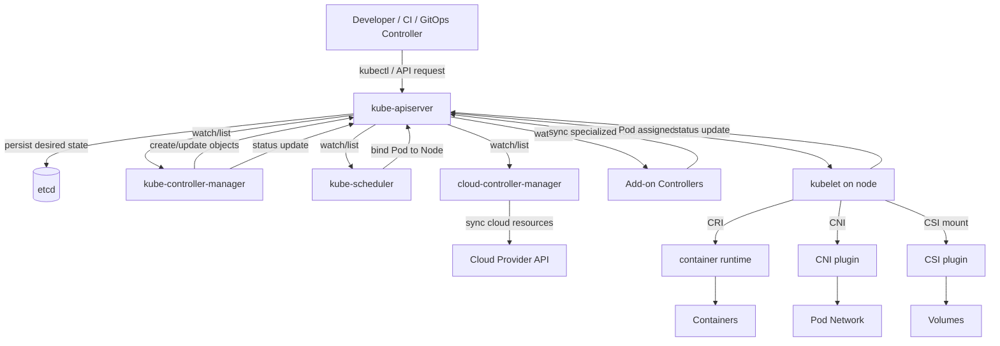
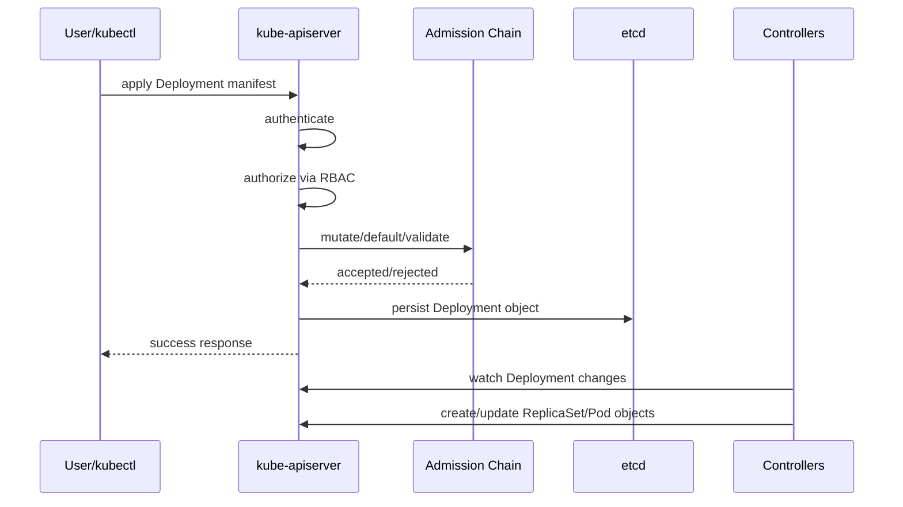
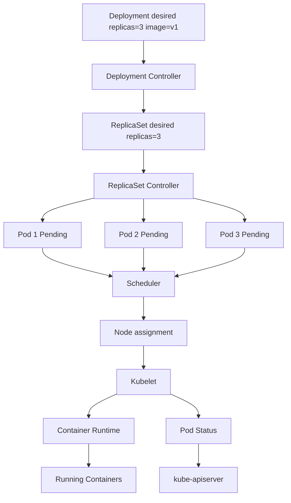
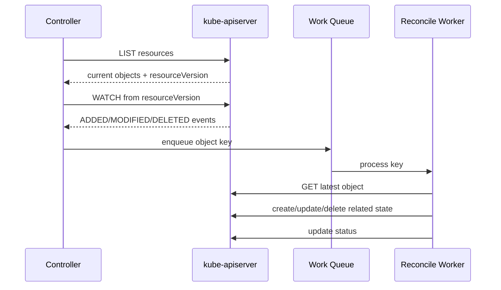
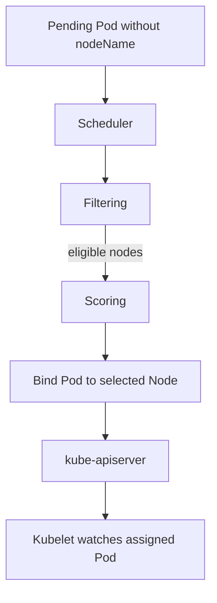
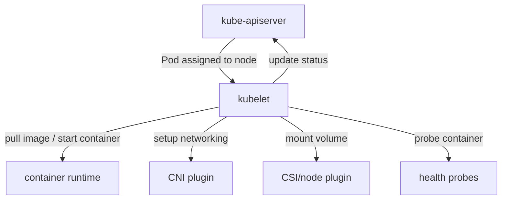
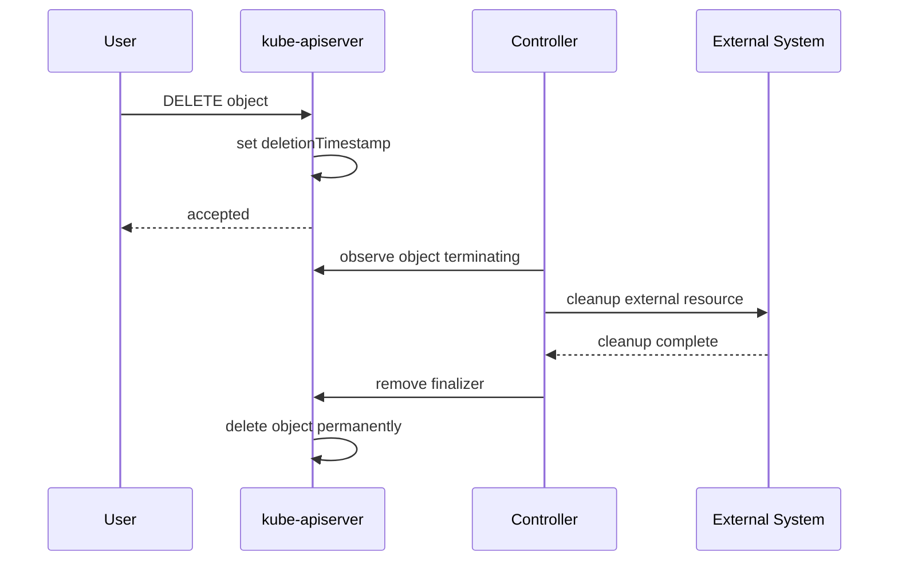
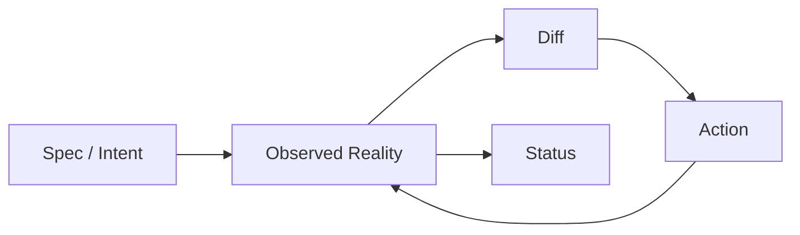

# Kubernetes as a Distributed Control System

Jika Part 001 adalah peta belajar, Part 002 adalah fondasi mental model. Kubernetes harus dipahami sebagai **distributed control system**. Semua konsep berikutnya—Deployment, Service, Ingress, autoscaling, GitOps, policy, EKS, AKS, observability, upgrade—akan jauh lebih mudah jika model ini kuat.

Kalimat kuncinya:

> Kubernetes tidak menjalankan aplikasi karena kamu menulis YAML. Kubernetes menyimpan desired state sebagai API object, lalu sekumpulan controller dan agent merekonsiliasi realitas agar mendekati desired state tersebut.

Ini membedakan Kubernetes dari script imperative.

Script imperative berkata:

```bash
run this container now
open this port now
copy this file now
restart this process now
```

Kubernetes declarative model berkata:

```yaml
I want 3 replicas of this workload,
using this container image,
with this resource contract,
reachable through this service,
subject to this policy.
```

Setelah itu, banyak komponen bekerja: API server memvalidasi dan menyimpan object, controller membuat object turunan, scheduler memilih node, kubelet menjalankan Pod, runtime menarik image, CNI menyiapkan network, controller lain memperbarui endpoint, cloud controller membuat load balancer, observability agent mengirim telemetry, dan seterusnya.

---

# 1. Sistem Besar dalam Satu Diagram



Diagram ini menyimpan hampir seluruh mental model Kubernetes:

- User tidak berbicara langsung dengan node. User berbicara dengan API server.
- Desired state disimpan melalui API server.
- Controller membaca API server, bukan membaca etcd langsung.
- Scheduler tidak menjalankan container. Scheduler hanya memilih node dan menulis binding.
- Kubelet menjalankan workload di node berdasarkan Pod yang sudah assigned.
- Cloud integration terjadi melalui controller/add-on yang berbicara ke cloud provider API.
- Status kembali ditulis ke API server agar object merefleksikan observed state.

---

# 2. Kubernetes API Server: Front Door Semua State

`kube-apiserver` adalah front door cluster. Hampir semua perubahan cluster lewat API server.

Tugas praktis API server:

1. Menerima request: create, read, update, patch, delete, watch.
2. Melakukan authentication.
3. Melakukan authorization.
4. Menjalankan admission chain.
5. Melakukan validation dan defaulting.
6. Menyimpan object ke persistence layer.
7. Menyediakan watch/list untuk controller dan client.

API server bukan hanya REST endpoint. API server adalah koordinasi utama cluster.

## 2.1 Mengapa API Server Penting untuk Debugging?

Karena API server adalah sumber state yang dilihat seluruh actor. Saat debugging, pertanyaan pertama bukan “container log apa?”. Pertanyaan pertama:

> Object apa yang ada di API dan state apa yang Kubernetes percaya saat ini?

Contoh:

```bash
kubectl get deployment payment-api -n payments -o yaml
kubectl get replicaset -n payments
kubectl get pods -n payments -o wide
kubectl describe pod <pod> -n payments
kubectl get events -n payments --sort-by=.lastTimestamp
```

Urutan itu mengikuti chain dari desired state ke runtime.

## 2.2 Request Flow: Dari YAML ke Object

Saat kamu menjalankan:

```bash
kubectl apply -f deployment.yaml
```

Yang terjadi bukan “kubectl menjalankan container”. Yang terjadi:



`kubectl apply` selesai ketika API server menerima dan menyimpan object. Workload mungkin belum berjalan. Inilah alasan command success tidak sama dengan application ready.

## 2.3 API Object: Metadata, Spec, Status

Sebagian besar Kubernetes object mengikuti pola:

```yaml
apiVersion: apps/v1
kind: Deployment
metadata:
  name: payment-api
  namespace: payments
  labels:
    app.kubernetes.io/name: payment-api
spec:
  replicas: 3
  selector:
    matchLabels:
      app.kubernetes.io/name: payment-api
  template:
    metadata:
      labels:
        app.kubernetes.io/name: payment-api
    spec:
      containers:
        - name: app
          image: example/payment-api:1.0.0
status:
  replicas: 3
  availableReplicas: 3
```

Pahami tiga bagian:

| Bagian | Pemilik utama | Fungsi |
|---|---|---|
| `metadata` | user, system, controllers | identitas, label, annotation, owner reference, resource version |
| `spec` | user atau controller higher-level | desired state |
| `status` | controller/agent | observed state |

Prinsip penting:

> User menulis `spec`. Controller menulis `status`.

Tidak semua object punya status yang kaya, tetapi pola ini sangat penting.

## 2.4 Metadata Bukan Hiasan

`metadata` menentukan banyak behavior:

- `name`: identitas object dalam namespace atau cluster scope.
- `namespace`: boundary logical.
- `labels`: selector, grouping, policy, cost allocation, ownership.
- `annotations`: metadata non-selector, config untuk controller tertentu.
- `ownerReferences`: relasi ownership untuk garbage collection.
- `finalizers`: mekanisme blocking deletion sampai cleanup selesai.
- `resourceVersion`: versi object untuk concurrency/watch.
- `uid`: identitas unik object, berbeda dari name.

Contoh label yang buruk:

```yaml
labels:
  app: api
```

Masalah: terlalu generik, susah ownership, susah policy, susah cost attribution.

Contoh label lebih baik:

```yaml
labels:
  app.kubernetes.io/name: payment-api
  app.kubernetes.io/part-of: payment-platform
  app.kubernetes.io/component: api
  app.kubernetes.io/managed-by: argocd
  platform.company.io/team: payment
  platform.company.io/environment: production
  platform.company.io/tier: critical
```

Label adalah database index untuk cluster. Label buruk membuat operasi skala besar sulit.

---

# 3. etcd: Backing Store, Bukan Interface Publik

`etcd` adalah consistent dan highly-available key-value store yang digunakan Kubernetes sebagai backing store untuk cluster data.

Yang perlu dipahami:

- etcd menyimpan cluster state.
- API server adalah komponen yang berbicara ke etcd.
- Controller dan user tidak seharusnya berbicara langsung ke etcd.
- Backup etcd penting untuk cluster recovery, terutama self-managed control plane.
- Pada managed Kubernetes seperti EKS/AKS, provider mengelola control plane dan backing store, tetapi object state tetap harus dipahami.

## 3.1 etcd Bukan Database Aplikasi

Jangan pernah memperlakukan etcd sebagai tempat menyimpan application state. etcd adalah state store control plane.

Contoh data yang masuk akal di Kubernetes API/etcd:

- Deployment object.
- Service object.
- ConfigMap.
- Secret.
- Node object.
- Pod object.
- Custom resource.

Contoh yang tidak pantas:

- order transaction.
- payment event.
- user profile.
- audit business event.
- application cache.

Kubernetes object state adalah control-plane state, bukan domain data.

## 3.2 Mengapa Status Bisa Tertinggal?

Karena status adalah observed state yang ditulis oleh controller/agent. Jika controller lambat, down, throttled, atau tidak punya permission, status bisa tertinggal dari realitas.

Contoh:

- Pod sudah crash di node, tetapi kubelet belum berhasil update status.
- Cloud load balancer sudah dibuat, tetapi ingress status belum update.
- Volume attach gagal, tetapi event/status baru muncul beberapa detik kemudian.

Kubernetes adalah eventually consistent system. Banyak komponen bekerja asynchronous.

---

# 4. Controller Loop: Jantung Kubernetes

Controller adalah control loop. Ia mengamati state cluster dan melakukan perubahan agar actual state mendekati desired state.

Pseudo-code sederhana:

```go
for {
    desired := readDesiredStateFromAPIServer()
    actual := observeActualState()

    diff := compare(desired, actual)
    if diff.exists() {
        act(diff)
    }

    updateStatus()
    waitOrWatchNextChange()
}
```

Ini bukan kode nyata Kubernetes, tetapi mental model-nya tepat.

## 4.1 Contoh Deployment Controller

Ketika kamu membuat Deployment:

```yaml
apiVersion: apps/v1
kind: Deployment
metadata:
  name: payment-api
spec:
  replicas: 3
  selector:
    matchLabels:
      app: payment-api
  template:
    metadata:
      labels:
        app: payment-api
    spec:
      containers:
        - name: app
          image: payment-api:1.0.0
```

Deployment controller melihat:

- Ada Deployment baru.
- Deployment menginginkan 3 replica.
- Belum ada ReplicaSet yang sesuai template.

Maka controller membuat ReplicaSet.

ReplicaSet controller melihat:

- ReplicaSet menginginkan 3 Pod.
- Actual Pod count masih 0.

Maka controller membuat 3 Pod object.

Scheduler melihat:

- Ada Pod Pending tanpa node assignment.

Maka scheduler memilih node dan menulis binding.

Kubelet di node melihat:

- Ada Pod assigned ke node ini.

Maka kubelet menjalankan container melalui runtime.

## 4.2 Reconciliation Chain Deployment



Hal penting: setiap tahap bisa gagal.

- Deployment object bisa ditolak admission.
- ReplicaSet bisa tidak dibuat karena selector invalid.
- Pod bisa Pending karena tidak ada node cocok.
- Image pull bisa gagal.
- Container bisa crash.
- Readiness bisa gagal.
- Service selector bisa tidak match.

Debugging harus mengikuti chain ini.

## 4.3 Controller Tidak Menjamin Instant State

Kubernetes bukan synchronous orchestration engine. `kubectl apply` tidak menunggu semua controller selesai kecuali command tertentu memang menunggu kondisi.

Contoh:

```bash
kubectl apply -f deployment.yaml
kubectl rollout status deployment/payment-api -n payments
```

Command pertama menyimpan desired state. Command kedua menunggu rollout condition.

Jangan menganggap apply sukses berarti workload sehat.

## 4.4 Controller Bisa Bertabrakan

Jika dua controller mengelola field/resource yang sama, hasilnya bisa loop atau drift.

Contoh:

- HPA mengubah `.spec.replicas`, tetapi GitOps manifest juga hardcode replicas.
- cert-manager mengelola Secret TLS, tetapi user manual edit secret.
- ExternalDNS mengelola DNS record, tetapi Terraform juga mengelola record yang sama.
- KEDA dan HPA manual sama-sama mengelola scaling.
- Argo CD dan Flux mengelola aplikasi yang sama.

Prinsip:

> Hindari multiple writers untuk field yang sama.

---

# 5. Watch, List, dan resourceVersion

Controller perlu tahu kapan object berubah. Kubernetes API mendukung list dan watch.

Secara konseptual:

1. Controller melakukan list untuk membaca state awal.
2. API server mengembalikan object collection dan resource version.
3. Controller melakukan watch dari resource version tersebut.
4. API server mengirim event perubahan: added, modified, deleted, bookmark.
5. Controller memasukkan perubahan ke work queue.
6. Reconcile worker memproses object.



## 5.1 Mengapa Ini Penting?

Karena controller biasanya tidak langsung memproses semua perubahan secara synchronous. Ia memakai queue, retry, backoff, dan idempotent reconciliation.

Implikasi:

- Status update bisa delay.
- Event bisa muncul setelah beberapa detik.
- Multiple quick changes bisa di-coalesce.
- Reconcile harus idempotent.
- Controller harus tahan terhadap stale cache.

## 5.2 Idempotency

Controller harus aman menjalankan aksi yang sama berulang kali.

Contoh:

- Jika ReplicaSet butuh 3 Pod dan sudah ada 3 Pod, jangan buat lagi.
- Jika load balancer sudah ada, jangan buat duplicate.
- Jika finalizer sudah ada, jangan append berkali-kali.
- Jika status sudah sesuai, tidak perlu update.

Idempotency adalah syarat distributed control system.

---

# 6. Scheduler: Constraint Solver, Bukan Executor

`kube-scheduler` bertugas memilih node untuk Pod yang belum assigned.

Scheduler membaca Pod Pending, membaca Node dan constraint, lalu memutuskan node terbaik.

Scheduler tidak:

- menarik image.
- menjalankan container.
- membuat network namespace.
- mount volume.
- restart container.

Itu tugas kubelet dan runtime.

## 6.1 Scheduling Flow



Filtering mengeliminasi node yang tidak cocok. Scoring memilih node terbaik dari yang cocok.

Constraint yang sering mempengaruhi scheduling:

- resource requests.
- node selector.
- node affinity.
- pod affinity/anti-affinity.
- taints/tolerations.
- topology spread constraints.
- volume topology.
- node readiness.
- node pressure.
- pod overhead.
- priority/preemption.

## 6.2 Pod Pending Tidak Selalu Berarti Cluster Kurang Node

Pod Pending bisa terjadi karena:

- CPU/memory request terlalu besar.
- Node punya taint yang tidak ditoleransi Pod.
- Node selector tidak match label node.
- Pod anti-affinity terlalu ketat.
- Topology spread tidak bisa dipenuhi.
- PVC menunggu volume binding.
- Node berada di zone yang salah untuk volume.
- Quota namespace terlampaui.
- Admission/policy menolak object.
- Cluster autoscaler belum atau tidak bisa menambah node.

Debug:

```bash
kubectl describe pod <pod> -n <namespace>
kubectl get events -n <namespace> --sort-by=.lastTimestamp
kubectl get nodes --show-labels
kubectl describe node <node>
```

Cari event dari scheduler seperti `FailedScheduling`.

## 6.3 Scheduler dan Autoscaler

Scheduler memutuskan apakah Pod bisa ditempatkan. Autoscaler melihat sinyal seperti unschedulable Pod atau metrics utilization untuk menambah/mengurangi kapasitas.

Keduanya berbeda:

- Scheduler tidak membuat node.
- Cluster autoscaler/Karpenter/AKS autoscaling membuat atau mengubah node capacity.
- HPA mengubah jumlah Pod.
- VPA merekomendasikan atau mengubah resource request.

Jika HPA menaikkan replica tetapi cluster tidak punya kapasitas, Pod baru Pending. Jika node autoscaler bisa memenuhi constraint, node baru dibuat. Jika constraint tidak bisa dipenuhi, Pending tetap terjadi.

---

# 7. Kubelet: Node Agent yang Menjalankan Pod

`kubelet` berjalan di setiap worker node. Ia menjaga Pod yang assigned ke node tersebut.

Tugas kubelet:

- watch Pod assigned ke node.
- memanggil container runtime via CRI.
- menjalankan init container dan app container.
- menjalankan probes.
- mount volume via CSI path.
- setup network via CNI path.
- collect dan report status.
- restart container sesuai policy.
- enforce resource melalui cgroup/runtime integration.

## 7.1 Kubelet Reconciliation

Kubelet juga controller, tetapi level node.



Kubelet terus membandingkan Pod spec dengan runtime state.

Jika container crash dan restart policy mengizinkan, kubelet restart container. Jika liveness probe gagal, kubelet restart container. Jika readiness probe gagal, kubelet melaporkan Pod not ready sehingga endpoint routing berubah.

## 7.2 Kubelet dan Graceful Shutdown

Saat Pod dihapus atau node drain:

1. API server memberi deletion timestamp pada Pod.
2. Kubelet melihat Pod terminating.
3. Kubelet menjalankan `preStop` hook jika ada.
4. Kubelet mengirim SIGTERM ke container.
5. Kubernetes menunggu `terminationGracePeriodSeconds`.
6. Jika proses belum berhenti, SIGKILL dikirim.
7. Pod status diupdate dan object akhirnya hilang.

Aplikasi yang tidak menangani SIGTERM bisa memutus request aktif. Ini bukan bug Kubernetes; ini runtime contract aplikasi.

---

# 8. Cloud Controller dan Managed Kubernetes

Kubernetes awalnya bisa berjalan di banyak environment. Untuk integrasi cloud, ada cloud-specific controller.

`cloud-controller-manager` memisahkan control logic cloud provider dari Kubernetes core. Dalam managed Kubernetes, sebagian behavior cloud juga datang dari add-on/controller khusus.

Contoh cloud integration:

- Service `type: LoadBalancer` membuat cloud load balancer.
- Node object terkait cloud VM/instance.
- PersistentVolume dibuat dari cloud disk via CSI.
- Ingress controller membuat ALB/Application Gateway/proxy config.
- ExternalDNS membuat DNS record.
- cert-manager meminta certificate.
- Workload identity menghubungkan service account ke cloud IAM/identity.

## 8.1 EKS dan AKS Menambahkan Actor

Di EKS, actor tambahan bisa mencakup:

- AWS VPC CNI.
- AWS Load Balancer Controller.
- EBS CSI driver.
- EFS CSI driver.
- EKS Pod Identity Agent.
- Karpenter.
- CloudWatch/ADOT agents.
- EKS managed add-ons.

Di AKS, actor tambahan bisa mencakup:

- Azure CNI.
- Azure Disk CSI.
- Azure Files CSI.
- AKS managed identity integration.
- Azure Workload Identity components.
- Azure Monitor agents.
- Application Gateway/ingress integration.
- managed Prometheus/Grafana integration.

Mental model:

> Di cloud, banyak Kubernetes object adalah intent untuk membuat atau mengubah cloud resource.

Contoh:

```yaml
apiVersion: v1
kind: Service
metadata:
  name: public-api
spec:
  type: LoadBalancer
```

Object ini tidak hanya membuat Service di cluster. Ia bisa memicu cloud controller untuk membuat load balancer, target group/backend pool, health checks, public/private IP, security rules, dan routing config tergantung provider dan controller.

---

# 9. Object Lifecycle: Create, Update, Delete

## 9.1 Create

Saat object dibuat:

1. Request masuk API server.
2. Authentication dan authorization.
3. Admission mutation/defaulting.
4. Validation.
5. Persist.
6. Watch event dikirim.
7. Controller bereaksi.

Failure bisa terjadi di setiap tahap.

Contoh create ditolak:

- user tidak punya RBAC.
- namespace quota terlampaui.
- policy engine menolak privileged container.
- schema invalid.
- required field hilang.
- admission webhook timeout/fail closed.

## 9.2 Update

Update Kubernetes bukan selalu replace sederhana.

Jenis update:

- full update.
- merge patch.
- strategic merge patch.
- server-side apply.
- status subresource update.
- scale subresource update.

Praktisnya, kamu harus tahu siapa yang memiliki field tertentu.

Contoh: Deployment `.spec.replicas` bisa diubah oleh:

- user/GitOps.
- HPA melalui scale subresource.
- manual `kubectl scale`.

Jika semua dipakai tanpa design, field ownership kacau.

## 9.3 Delete

Delete juga tidak selalu instant.

Deletion flow:



Jika finalizer tidak bisa selesai, object stuck Terminating.

Contoh penyebab:

- controller down.
- cloud resource cleanup gagal.
- permission kurang.
- external API timeout.
- finalizer orphan karena CRD/controller dihapus dulu.

---

# 10. Spec vs Status sebagai State Machine

Banyak object Kubernetes bisa dibaca seperti state machine.

Contoh Pod phases:

- Pending.
- Running.
- Succeeded.
- Failed.
- Unknown.

Tetapi phase saja sering tidak cukup. Baca juga conditions dan container statuses.

Contoh:

```bash
kubectl get pod payment-api-xxx -n payments -o jsonpath='{.status.conditions}'
kubectl get pod payment-api-xxx -n payments -o jsonpath='{.status.containerStatuses}'
```

Untuk Deployment, baca:

```bash
kubectl get deployment payment-api -n payments -o yaml
```

Perhatikan:

- `.status.observedGeneration`
- `.metadata.generation`
- `.status.conditions`
- `.status.availableReplicas`
- `.status.updatedReplicas`
- `.status.unavailableReplicas`

## 10.1 observedGeneration

`metadata.generation` berubah saat desired state/spec berubah. Controller menulis `status.observedGeneration` saat sudah mengamati generation tersebut.

Jika `observedGeneration` lebih kecil dari `generation`, status bisa belum mencerminkan spec terbaru.

Mental model:

> Jangan membaca status tanpa bertanya: status ini hasil observasi spec versi berapa?

---

# 11. Kubernetes Is Eventually Consistent

Dalam sistem Kubernetes:

- API write bisa sukses sebelum runtime berubah.
- Controller membaca dari cache/watch.
- Node update status periodik.
- Cloud provider API punya delay.
- Load balancer health check punya interval.
- DNS punya TTL.
- Metrics punya scrape interval.
- Autoscaler punya sync period.

Jadi banyak operasi bersifat eventually consistent.

## 11.1 Dampak Praktis

Setelah apply Service LoadBalancer:

- Service object langsung ada.
- External IP/hostname mungkin belum muncul.
- Cloud load balancer mungkin masih provisioning.
- Backend target mungkin belum healthy.
- DNS record mungkin belum dibuat.
- Certificate mungkin belum ready.

Jika pipeline menganggap apply sukses berarti endpoint siap, pipeline rapuh.

Gunakan readiness/wait condition yang tepat.

Contoh:

```bash
kubectl rollout status deployment/payment-api -n payments
kubectl wait --for=condition=available deployment/payment-api -n payments --timeout=120s
kubectl wait --for=condition=ready pod -l app=payment-api -n payments --timeout=120s
```

Tetapi hati-hati: condition “available” Kubernetes belum tentu sama dengan user-facing availability di edge.

---

# 12. Control Plane vs Data Plane

Kubernetes sering dibagi menjadi control plane dan data plane.

## 12.1 Control Plane

Control plane mencakup komponen yang mengatur state:

- kube-apiserver.
- etcd.
- kube-scheduler.
- kube-controller-manager.
- cloud-controller-manager.

Dalam EKS/AKS, control plane dikelola provider. Tapi kamu tetap bertanggung jawab atas object, add-ons, workload, policy, node pools, dan banyak integrasi.

## 12.2 Data Plane

Data plane mencakup komponen yang menjalankan workload dan traffic:

- worker nodes.
- kubelet.
- container runtime.
- CNI dataplane.
- kube-proxy atau replacement dataplane.
- workload Pods.
- node-level agents.

Managed control plane tidak berarti managed data plane sepenuhnya. Node patching, node image, node pool strategy, autoscaler, daemonset overhead, workload capacity, dan disruption tetap harus dikelola.

## 12.3 Add-ons: Area Abu-Abu

Add-ons bisa berjalan di cluster tetapi mengelola fungsi platform penting:

- CoreDNS.
- CNI.
- CSI.
- ingress controller.
- metrics server.
- policy engine.
- observability agent.
- external secrets.
- cert-manager.
- GitOps controller.

Add-ons ini bukan aplikasi bisnis, tetapi jika rusak, aplikasi bisnis terdampak.

---

# 13. Namespace: Boundary Logis, Bukan Boundary Mutlak

Namespace membantu memisahkan resource secara logis.

Digunakan untuk:

- grouping aplikasi/team/environment.
- RBAC scope.
- ResourceQuota.
- LimitRange.
- NetworkPolicy target.
- naming boundary.

Tetapi namespace bukan security boundary sempurna secara default. Banyak resource cluster-scoped:

- Node.
- PersistentVolume.
- ClusterRole.
- ClusterRoleBinding.
- CustomResourceDefinition.
- StorageClass.
- IngressClass.
- GatewayClass.
- Namespace itu sendiri.

Jika multi-tenant, perlu kombinasi:

- namespace boundary.
- RBAC.
- admission policy.
- NetworkPolicy.
- Pod Security Admission.
- quota.
- node isolation bila perlu.
- cloud IAM boundary.
- audit logging.

---

# 14. Labels dan Selectors: Query Language Cluster

Labels adalah cara Kubernetes memilih object.

Contoh Service memilih Pod:

```yaml
apiVersion: v1
kind: Service
metadata:
  name: payment-api
spec:
  selector:
    app.kubernetes.io/name: payment-api
  ports:
    - port: 80
      targetPort: 8080
```

Jika Pod punya label yang cocok, endpoint akan dibuat. Jika tidak, Service ada tetapi tidak punya backend.

## 14.1 Selector Mismatch: Failure Mode Klasik

Deployment:

```yaml
template:
  metadata:
    labels:
      app: payment
```

Service:

```yaml
selector:
  app: payment-api
```

Service tidak akan route ke Pod karena selector mismatch.

Debug:

```bash
kubectl get service payment-api -n payments -o yaml
kubectl get endpointslice -n payments -l kubernetes.io/service-name=payment-api
kubectl get pods -n payments --show-labels
```

Label discipline adalah production requirement.

---

# 15. OwnerReference dan Garbage Collection

Kubernetes menggunakan owner reference untuk relasi parent-child.

Deployment memiliki ReplicaSet. ReplicaSet memiliki Pod. Jika parent dihapus, child bisa ikut dihapus melalui garbage collection.

Lihat owner reference:

```bash
kubectl get pod <pod> -n payments -o jsonpath='{.metadata.ownerReferences}'
```

Mengapa penting?

- Mengetahui siapa yang membuat object.
- Mengetahui object akan dihapus jika owner dihapus.
- Menghindari edit manual object yang dikontrol controller lain.

Contoh: mengedit Pod milik Deployment biasanya percuma karena Pod bisa dihapus/recreate oleh ReplicaSet controller. Edit template Deployment, bukan Pod individual.

---

# 16. Finalizer: Cleanup Sebelum Delete

Finalizer mencegah object benar-benar hilang sebelum controller melakukan cleanup.

Contoh finalizer:

```yaml
metadata:
  finalizers:
    - example.com/cleanup-external-resource
```

Saat delete:

- object diberi deletionTimestamp.
- object tetap ada selama finalizer masih ada.
- controller melakukan cleanup.
- controller menghapus finalizer.
- API server menghapus object.

Failure mode:

- controller pengelola finalizer tidak berjalan.
- external resource tidak bisa dihapus.
- permission hilang.
- CRD dihapus sebelum custom resource cleanup.

Jangan sembarang menghapus finalizer kecuali memahami external resource yang mungkin orphan.

---

# 17. Admission Chain: Guardrail Sebelum Object Disimpan

Sebelum object disimpan, API server menjalankan admission chain.

Admission bisa:

- mutate: menambahkan default, sidecar, label, annotation.
- validate: menolak object yang melanggar policy.

Contoh admission use case:

- menolak privileged container.
- memaksa resource requests.
- menambahkan default labels.
- menginject sidecar.
- memvalidasi image registry.
- melarang hostPath.
- membatasi LoadBalancer public.

## 17.1 Admission Webhook Failure

Admission webhook adalah bagian kritis. Jika webhook down dan failure policy `Fail`, create/update object bisa gagal. Jika failure policy `Ignore`, policy bisa bypass saat webhook error.

Design decision:

- Security-critical validation biasanya fail closed.
- Non-critical mutation bisa fail open, tergantung risiko.
- Webhook harus highly available.
- Webhook harus punya timeout kecil.
- Webhook tidak boleh depend pada service yang sedang divalidasi.

---

# 18. Kubernetes Debugging as State Reconstruction

Debugging Kubernetes bukan mencari satu log. Debugging adalah merekonstruksi state transition.

Gunakan urutan:

## 18.1 Mulai dari Object Intent

```bash
kubectl get deployment payment-api -n payments -o yaml
```

Cek:

- image.
- replicas.
- selector.
- template labels.
- probes.
- resources.
- service account.
- volumes.
- tolerations/affinity.

## 18.2 Lihat Object Turunan

```bash
kubectl get rs -n payments
kubectl get pods -n payments -o wide
```

Cek:

- ReplicaSet count.
- Pod status.
- Node assignment.
- age.
- restarts.

## 18.3 Baca Events

```bash
kubectl describe pod <pod> -n payments
kubectl get events -n payments --sort-by=.lastTimestamp
```

Events sering memberi clue:

- FailedScheduling.
- FailedMount.
- FailedAttachVolume.
- BackOff.
- Unhealthy.
- FailedCreate.
- FailedPull.

## 18.4 Baca Status/Conditions

```bash
kubectl get pod <pod> -n payments -o yaml
kubectl get deployment payment-api -n payments -o yaml
```

Conditions memberi state machine view.

## 18.5 Masuk ke Runtime Log Jika Perlu

```bash
kubectl logs <pod> -n payments
kubectl logs <pod> -n payments --previous
```

`--previous` penting untuk container yang restart.

## 18.6 Trace Traffic

```bash
kubectl get svc -n payments
kubectl get endpointslice -n payments
kubectl get ingress -n payments
```

Jangan debug HTTP error hanya dari aplikasi. Pastikan route path benar.

---

# 19. Example: Deployment Rollout State Reconstruction

Misal user melapor: “Setelah deploy versi baru, sebagian request 503.”

Jangan mulai dari asumsi aplikasi bug. Rekonstruksi state.

## 19.1 Cek Rollout

```bash
kubectl rollout status deployment/payment-api -n payments
kubectl get deployment payment-api -n payments -o yaml
```

Pertanyaan:

- Apakah generation terbaru sudah observed?
- Berapa updatedReplicas?
- Berapa availableReplicas?
- Ada progressing condition?
- Ada unavailableReplicas?

## 19.2 Cek ReplicaSet Lama dan Baru

```bash
kubectl get rs -n payments -l app.kubernetes.io/name=payment-api
```

Pertanyaan:

- Apakah ReplicaSet baru sudah punya Pod?
- Apakah ReplicaSet lama masih melayani traffic?
- Apakah rollout stuck di mixed version?

## 19.3 Cek Pod Readiness

```bash
kubectl get pods -n payments -l app.kubernetes.io/name=payment-api
kubectl describe pod <new-pod> -n payments
```

Pertanyaan:

- Apakah Pod Ready?
- Apakah readiness probe terlalu cepat success?
- Apakah liveness membunuh container saat startup?
- Apakah container restart?

## 19.4 Cek EndpointSlice

```bash
kubectl get endpointslice -n payments -l kubernetes.io/service-name=payment-api -o yaml
```

Pertanyaan:

- Pod baru masuk endpoint sebelum benar-benar siap?
- Endpoint kosong sesaat?
- Service selector match Pod lama dan baru?

## 19.5 Cek Ingress / LB

```bash
kubectl get ingress -n payments
kubectl describe ingress payment-api -n payments
```

Pertanyaan:

- Health check cloud LB sesuai endpoint aplikasi?
- Timeout/path benar?
- Target group/backend pool healthy?

## 19.6 Kesimpulan Mungkin

Beberapa penyebab umum 503 saat rollout:

- readiness probe terlalu dangkal.
- graceful shutdown tidak benar.
- maxUnavailable terlalu tinggi.
- Pod masuk endpoint sebelum dependency siap.
- load balancer health check tidak sinkron dengan readiness.
- Service selector salah.
- old Pod terminated sebelum connection drain selesai.

Ini contoh mengapa Kubernetes debugging adalah state reconstruction.

---

# 20. Example: Pod Pending State Reconstruction

User melapor: “Deployment tidak naik replica.”

Cek:

```bash
kubectl get deployment worker -n batch
kubectl get pods -n batch -o wide
kubectl describe pod <pending-pod> -n batch
```

Event menunjukkan:

```text
0/5 nodes are available: 5 Insufficient memory.
```

Artinya scheduler tidak menemukan node dengan allocatable memory cukup untuk request Pod.

Kemungkinan solusi:

- turunkan memory request jika terlalu tinggi dan tidak sesuai usage.
- tambah kapasitas node.
- gunakan node pool berbeda.
- perbaiki fragmentation.
- aktifkan autoscaler/Karpenter.
- evaluasi daemonset overhead.

Jika event:

```text
0/5 nodes are available: 3 node(s) had untolerated taint, 2 node(s) didn't match Pod's node affinity.
```

Solusi bukan tambah node sembarang. Solusi adalah memperbaiki toleration/affinity atau menyediakan node yang sesuai.

---

# 21. Example: Service Exists but No Traffic

Service ada:

```bash
kubectl get svc payment-api -n payments
```

Tetapi request timeout.

Debug flow:

```bash
kubectl get svc payment-api -n payments -o yaml
kubectl get endpointslice -n payments -l kubernetes.io/service-name=payment-api
kubectl get pods -n payments --show-labels
kubectl describe pod <pod> -n payments
```

Kemungkinan:

- Service selector tidak match Pod label.
- Pod not ready sehingga tidak masuk endpoint.
- targetPort salah.
- container tidak listen di port tersebut.
- NetworkPolicy block.
- kube-proxy/CNI issue.
- Ingress backend salah service/port.
- cloud LB health check gagal.

Service object ada tidak berarti service berfungsi.

---

# 22. Cloud Managed Kubernetes: Responsibility Boundary

Managed Kubernetes membuat control plane lebih mudah, tetapi tidak menghapus tanggung jawab engineering.

## 22.1 Provider Biasanya Mengelola

Pada managed Kubernetes seperti EKS/AKS, provider biasanya mengelola:

- control plane availability.
- API server/control plane patching sesuai lifecycle provider.
- etcd/control plane backing store.
- control plane certificates tertentu.
- integration entrypoint ke cloud platform.

Detail berbeda per provider dan mode layanan.

## 22.2 Kamu Tetap Mengelola

Kamu tetap bertanggung jawab atas:

- Kubernetes object dan workload.
- RBAC dan namespace model.
- add-ons yang kamu install/aktifkan.
- CNI/IP planning choices.
- node pool capacity.
- workload identity permissions.
- security posture workload.
- network policy.
- ingress/edge design.
- storage class usage.
- backup/restore aplikasi.
- observability.
- cost.
- upgrade rehearsal dan app compatibility.
- policy exceptions.
- incident response.

## 22.3 Managed Tidak Sama dengan Serverless

EKS/AKS managed cluster masih membutuhkan platform operating model. Bahkan mode yang lebih otomatis seperti EKS Auto Mode atau AKS Automatic tetap perlu keputusan:

- workload contract.
- namespace and policy.
- identity permissions.
- network exposure.
- SLO.
- data boundary.
- cost guardrail.
- release strategy.

Automation mengurangi toil, bukan menghapus design.

---

# 23. Kubernetes as Database of Intent

Salah satu mental model paling berguna:

> Kubernetes API adalah database of intent dan observed state untuk platform.

Tetapi hati-hati: API object bukan selalu realitas final. Ia adalah representasi state yang diketahui control plane.

Contoh:

- Pod status `Running` tidak selalu berarti aplikasi siap melayani request.
- Deployment `Available` tidak selalu berarti user tidak melihat error.
- Service punya external IP tidak selalu berarti DNS sudah propagate.
- Ingress address ada tidak selalu berarti certificate valid.
- HPA desired replicas naik tidak selalu berarti node capacity tersedia.

Karena itu, production observability harus menggabungkan Kubernetes state, cloud state, dan user-facing signals.

---

# 24. Control Loop Design Pattern di Luar Kubernetes

Memahami Kubernetes juga berguna untuk sistem lain. Banyak platform modern memakai pola yang sama:

- Terraform: desired infrastructure state.
- GitOps: desired cluster/application state.
- Crossplane: cloud resources sebagai Kubernetes CRD.
- Operators: domain-specific controller.
- Service mesh: desired traffic policy.
- External Secrets: desired secret sync.
- cert-manager: desired certificate state.
- Karpenter: desired node capacity via unscheduled workload.

Pola yang sama:



Jika kamu menguasai pola ini, Kubernetes ecosystem menjadi lebih masuk akal.

---

# 25. Failure Model per Komponen

## 25.1 API Server Failure

Gejala:

- `kubectl` timeout/error.
- controllers tidak bisa update state.
- new scheduling/rollout terganggu.
- existing Pods biasanya tetap berjalan sementara.

Dampak:

- control plane degraded.
- automation berhenti.
- HPA/status updates terganggu.

Existing data plane tidak otomatis mati hanya karena API server unavailable, tetapi perubahan dan reconciliation terganggu.

## 25.2 etcd Failure

Pada self-managed, etcd failure kritis karena cluster state persistence terganggu. Pada managed Kubernetes, provider mengelola ini, tetapi kamu tetap perlu memahami bahwa API state bergantung pada backing store.

## 25.3 Scheduler Failure

Gejala:

- Pod baru tetap Pending tanpa node assignment.
- existing Pods tetap berjalan.

Dampak:

- scale up workload terhambat.
- replacement Pod tidak assigned.

## 25.4 Controller Manager Failure

Gejala:

- Deployment/ReplicaSet/Job/Node controller actions tertunda.
- desired state tidak direkonsiliasi.

Existing Pods bisa tetap berjalan, tetapi self-healing dan rollout terganggu.

## 25.5 Kubelet Failure

Gejala:

- Node menjadi NotReady setelah heartbeat hilang.
- Pod status stale.
- container di node mungkin masih berjalan, tetapi control plane kehilangan visibility.

Dampak:

- workload di node bisa dianggap unhealthy.
- rescheduling bisa terjadi tergantung timing dan controller.

## 25.6 CNI Failure

Gejala:

- Pod tidak mendapat IP.
- Pod network tidak berfungsi.
- Service routing gagal.
- DNS timeout.

Dampak besar karena hampir semua workload bergantung pada network.

## 25.7 CSI Failure

Gejala:

- Pod stuck ContainerCreating.
- volume attach/mount gagal.
- stateful workload tidak start.

## 25.8 Ingress/Load Balancer Controller Failure

Gejala:

- Ingress/Service object ada tetapi cloud resource tidak update.
- certificate/target/backend stale.
- traffic edge tidak sesuai manifest.

---

# 26. Practical Command Map

Command bukan pusat materi, tetapi command membantu melihat state.

## 26.1 API/Object

```bash
kubectl api-resources
kubectl explain deployment.spec
kubectl get <resource> -A
kubectl get <resource> <name> -n <ns> -o yaml
```

## 26.2 Events

```bash
kubectl get events -A --sort-by=.lastTimestamp
kubectl describe <resource> <name> -n <ns>
```

## 26.3 Workload Chain

```bash
kubectl get deployment -n <ns>
kubectl get rs -n <ns>
kubectl get pods -n <ns> -o wide
kubectl rollout status deployment/<name> -n <ns>
kubectl rollout history deployment/<name> -n <ns>
```

## 26.4 Node/Scheduling

```bash
kubectl get nodes -o wide
kubectl describe node <node>
kubectl top nodes
kubectl top pods -A
```

## 26.5 Networking

```bash
kubectl get svc -A
kubectl get endpointslice -A
kubectl get ingress -A
kubectl get networkpolicy -A
```

## 26.6 RBAC

```bash
kubectl auth can-i get pods -n <ns>
kubectl auth can-i create deployments -n <ns> --as system:serviceaccount:<ns>:<sa>
```

## 26.7 Debug Runtime

```bash
kubectl logs <pod> -n <ns>
kubectl logs <pod> -n <ns> --previous
kubectl exec -it <pod> -n <ns> -- sh
kubectl debug node/<node> -it --image=busybox
```

Gunakan dengan disiplin. Jangan langsung `exec` sebelum memahami state object.

---

# 27. Mental Model Checklist

Setelah part ini, kamu harus bisa menjelaskan:

- API server adalah front door cluster.
- etcd menyimpan cluster state, tetapi client/controller memakai API server.
- Kubernetes object memiliki metadata/spec/status.
- Controller merekonsiliasi desired state dan actual state.
- Scheduler memilih node, bukan menjalankan container.
- Kubelet menjalankan Pod di node dan update status.
- CNI/CSI adalah integration layer untuk network/storage.
- Cloud controller/add-ons menerjemahkan Kubernetes intent menjadi cloud resource.
- Kubernetes bersifat asynchronous dan eventually consistent.
- Debugging Kubernetes adalah state reconstruction.

---

# 28. Latihan Part 002

## Latihan 1: Deployment Chain

Buat Deployment sederhana, lalu jawab:

1. Deployment object tersimpan di mana secara konseptual?
2. Controller apa yang membuat ReplicaSet?
3. Controller apa yang membuat Pod?
4. Kapan scheduler terlibat?
5. Kapan kubelet terlibat?
6. Field status apa yang berubah setelah Pod Ready?

Command:

```bash
kubectl create namespace lab-control
kubectl create deployment nginx --image=nginx:1.27 -n lab-control --replicas=3
kubectl get deployment nginx -n lab-control -o yaml
kubectl get rs -n lab-control
kubectl get pods -n lab-control -o wide
kubectl describe pod <pod> -n lab-control
```

## Latihan 2: Selector Failure

Buat Service dengan selector yang salah. Amati EndpointSlice kosong.

```yaml
apiVersion: v1
kind: Service
metadata:
  name: nginx
  namespace: lab-control
spec:
  selector:
    app: wrong-label
  ports:
    - port: 80
      targetPort: 80
```

Cek:

```bash
kubectl get svc nginx -n lab-control
kubectl get endpointslice -n lab-control -l kubernetes.io/service-name=nginx
kubectl get pods -n lab-control --show-labels
```

Pertanyaan:

- Mengapa Service ada tetapi tidak punya backend?
- Controller apa yang seharusnya membuat endpoint?
- Field mana yang harus diperbaiki?

## Latihan 3: Scheduling Failure

Buat Pod dengan request CPU terlalu besar untuk local cluster.

```yaml
apiVersion: v1
kind: Pod
metadata:
  name: impossible-pod
  namespace: lab-control
spec:
  containers:
    - name: app
      image: nginx:1.27
      resources:
        requests:
          cpu: "1000"
          memory: "1Gi"
```

Cek:

```bash
kubectl get pod impossible-pod -n lab-control
kubectl describe pod impossible-pod -n lab-control
```

Pertanyaan:

- Mengapa Pod Pending?
- Komponen mana yang menghasilkan event?
- Apakah solusi selalu menambah node?

## Latihan 4: Finalizer Thought Experiment

Jelaskan apa yang terjadi jika custom resource punya finalizer tetapi controller-nya dihapus sebelum resource dihapus.

Jawaban yang diharapkan:

- Object akan stuck terminating.
- API server tidak menghapus permanen karena finalizer masih ada.
- Cleanup external resource mungkin tidak terjadi.
- Menghapus finalizer manual bisa meninggalkan orphan resource.

---

# 29. Ringkasan Part 002

Kubernetes adalah distributed control system. API server menerima intent. etcd menyimpan state. Controller manager, scheduler, kubelet, cloud controller, dan add-ons mengamati API state dan melakukan aksi. Sistem ini asynchronous, eventually consistent, dan sangat bergantung pada reconciliation.

Mental model penting:

> Jangan bertanya “YAML ini menjalankan apa?” Tanyakan “Object apa yang dibuat, controller mana yang bereaksi, state apa yang berubah, dan failure mode apa yang mungkin terjadi?”

Part berikutnya akan masuk ke batas runtime container production: image immutability, process model, PID 1, signal handling, filesystem contract, startup/shutdown, dan bagaimana container yang buruk bisa membuat Kubernetes terlihat bermasalah.

---

# References

- Kubernetes Documentation — Kubernetes overview: https://kubernetes.io/docs/home/
- Kubernetes Components: https://kubernetes.io/docs/concepts/overview/components/
- Kubernetes Architecture: https://kubernetes.io/docs/concepts/architecture/
- Kubernetes Controllers: https://kubernetes.io/docs/concepts/architecture/controller/
- Kubernetes API Concepts: https://kubernetes.io/docs/reference/using-api/api-concepts/
- Kubernetes Deployments: https://kubernetes.io/docs/concepts/workloads/controllers/deployment/
- Kubernetes Pod Lifecycle: https://kubernetes.io/docs/concepts/workloads/pods/pod-lifecycle/
- Kubernetes API Reference v1.36: https://kubernetes.io/docs/reference/generated/kubernetes-api/v1.36/
- Kubernetes Version Skew Policy: https://kubernetes.io/releases/version-skew-policy/
- Operating etcd clusters for Kubernetes: https://kubernetes.io/docs/tasks/administer-cluster/configure-upgrade-etcd/
- Amazon EKS Kubernetes Versions: https://docs.aws.amazon.com/eks/latest/userguide/kubernetes-versions.html
- Azure AKS Supported Kubernetes Versions: https://learn.microsoft.com/en-us/azure/aks/supported-kubernetes-versions
